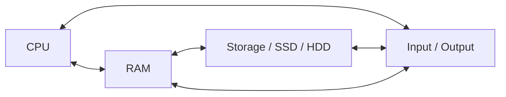

# Building Foundations

## Description

The first phase of the software engineering learning path: computer literacy, English comprehension, basic mathematics, command-line proficiency, and productive typing. These foundational skills are prerequisites for anything that follows and will serve you regardless of where your career goes.

## Prerequisites

- [The Journey Ahead](intro/the-journey-ahead.md) — understand the full learning path before starting this phase

## Table of Contents

- [Why Foundations First](#why-foundations-first)
- [English for Developers](#english-for-developers)
- [Basic Mathematics](#basic-mathematics)
- [How Computers Work](#how-computers-work)
- [The Command Line](#the-command-line)
- [Typing and Productivity](#typing-and-productivity)
- [Putting It All Together](#putting-it-all-together)
- [Glossary](#glossary)
- [Quick References](#quick-references)
- [Next Steps](#next-steps)

## Content / Material

### Why Foundations First

You cannot build a house without a foundation. The same is true for a career in software engineering. Jumping straight into programming languages and frameworks without the underlying groundwork will leave you frustrated, lost, and fighting the wrong battles.

The skills in this phase are prerequisites for everything that follows. You need English to read documentation and Stack Overflow answers. You need basic math to understand logic and algorithms. You need to know how a computer works before you can tell it what to do. You need the command line because that is where professional developers spend most of their time. You need typing speed because slow typing breaks your flow and makes learning harder than it needs to be.

These skills are also the most transferable skills you will ever acquire. If you decide two years from now that software engineering is not for you, the English, math, and computer literacy you develop here will serve you in almost any technical or analytical field. You are not wasting time by building foundations. You are making an investment that pays off no matter where you end up.

Software engineering attracts people from all backgrounds. You do not need a computer science degree. You do not need to have been coding since you were twelve. What you need is the discipline to start at the beginning and build up methodically. That is what this phase is about.

### English for Developers

The single most important language for a software engineer is English. This is not about cultural preference or global politics. It is a practical fact about how the profession operates.

Code itself is written in English. Every programming language uses English keywords: `if`, `else`, `while`, `for`, `class`, `function`, `return`. Programming language documentation is written in English. The most popular Q&A site for developers, Stack Overflow, operates in English. The most widely read technical blogs, books, and research papers are in English. The comments in open-source projects are in English. The error messages your tools produce are in English. The configuration files you edit are in English. The commands you type are English words.

You do not need to speak English fluently. You do not need a perfect accent. You do not need to write beautiful prose. What you need is reading comprehension. You need to be able to read a technical error message and understand what it is telling you. You need to be able to skim a documentation page and find the function signature you need. You need to be able to read a Stack Overflow answer and figure out whether it applies to your situation.

Start by reading technical documentation even if you do not understand everything. Install a dictionary browser extension. Look up every word you do not know. After a few weeks, you will notice that the same technical vocabulary appears again and again: "initialize," "configure," "deploy," "deprecated," "asynchronous," "callback." Each new word you learn unlocks more content.

The English you need is a limited, predictable vocabulary. Technical English uses fewer words than general English, but it uses them precisely. Your goal is not to write poetry. Your goal is to understand and be understood in a technical context. That is achievable with a few hundred specialized words on top of basic reading ability.

**Essential Technical Vocabulary.** Here are the words you will encounter in your first weeks of learning. Learn them now and everything gets easier:

| Word | Meaning | Example |
|------|---------|---------|
| Function | A named block of code that performs a specific task | `print("Hello")` calls the print function |
| Parameter | A value passed into a function | In `sqrt(16)`, 16 is the parameter |
| Return value | The output a function produces | `len("hi")` returns 2 |
| Variable | A named container for a value | `score = 10` stores 10 in score |
| String | Text data, enclosed in quotes | `"hello"`, `"user@example.com"` |
| Integer | A whole number | `42`, `-3`, `0` |
| Boolean | A value that is either true or false | `true`, `false` |
| Array / List | An ordered collection of items | `[1, 2, 3]` |
| Method | A function that belongs to an object | `"hello".upper()` returns `"HELLO"` |
| Class | A blueprint for creating objects | `class Dog:` defines a Dog type |
| Debug | To find and fix errors in code | Using print statements to debug a loop |
| Syntax | The rules that define valid code structure | Missing a colon causes a syntax error |
| Compile | To translate source code into machine code | The compiler converts C++ to an executable |
| Runtime | The period when a program is actually running | A runtime error occurs while the program executes |

**Walkthrough: Reading a Man Page.** Open your terminal and type `man ls`. Press Enter. You will see the manual page for the `ls` command. Here is what each section means:

- **NAME** — what the command does (list directory contents)
- **SYNOPSIS** — how to use it: `ls [OPTION]... [FILE]...` (brackets mean optional)
- **DESCRIPTION** — detailed explanation of what the command does and what each option flag means
- **OPTIONS** — a list of flags like `-l` (long format), `-a` (show hidden files), `-R` (recursive)

Press the up and down arrow keys to scroll. Press `q` to quit. Now try these variations:

```bash
ls              # list files in the current directory
ls -l           # list files with details (permissions, size, date)
ls -a           # list all files, including hidden ones (those starting with .)
ls -la          # combine flags: long format + all files
ls -lh          # long format with human-readable sizes (KB, MB)
```

Look up every word in the man page that you do not know. "Synopsis." "Directory." "Recursive." "Flag." "Argument." Each one is a building block for the next command you learn.

**Practice Routine.** Every day for the first two weeks, do this:

1. Pick one command (`ls`, `cd`, `mkdir`, `cp`, `mv`, `rm`, `cat`, `grep`, `find`).
2. Read its man page for five minutes. Look up words you do not know.
3. Try every option flag mentioned in the man page that looks useful.
4. Write down the three most useful flags in a notes file.

After two weeks, you will have internalized the core vocabulary of the terminal and reading man pages will feel natural, not intimidating.

Start here:

- [Why English Matters](../../english/intro/why-english-matters.md) — a deeper look at why English dominates technical communication
- [Basic Grammar Refresher](../../english/grammar-and-style/basic-grammar-refresher.md) — the grammar rules you actually need for technical reading and writing
- [Reading Technical Texts](../../english/reading-technical-texts/index.md) — strategies for reading documentation, specifications, and code

### Basic Mathematics

You do not need advanced mathematics to become a software engineer. Most professional developers use arithmetic and basic algebra daily and almost nothing beyond that. You do not need calculus, trigonometry, or differential equations — not yet, and for many roles, not ever.

What you do need is the ability to think logically and manipulate symbols according to rules. That is what programming is: taking a precise set of rules and applying them to data to produce a result. Mathematics trains exactly that muscle.

Here is the math you need:

**Arithmetic.** Addition, subtraction, multiplication, division. You need to be comfortable with negative numbers, decimals, fractions, and percentages. Most programming does not involve complex arithmetic, but you need to be fast and accurate with the basics. When you are debugging a loop counter or calculating an array index, you do not want to be reaching for a calculator.

**Exercise: Arithmetic in Context.** You have an array with 24 items. You want to split it into 3 equal parts. How many items per part? `24 / 3 = 8`. Now you want the index of the last item in the second part. The second part starts at index 8 (0-based) and has 8 items, so it ends at index 15. You just used division and addition — this is exactly the kind of arithmetic you do when working with data structures.

A variable `count` starts at 100. Every iteration of a loop decrements it by 1. How many iterations until `count` reaches 0? `100`. Every iteration decrements by 3 instead. How many iterations now? `100 / 3 = 33.33`. You need 34 iterations because the 34th iteration brings it below zero, but `while count > 0` would run 34 times (or 33 depending on whether you check before or after — this edge case matters in real code).

**Fractions and Percentages.** A program reports it used 350 MB of memory out of 1024 MB total. What percentage is that? `(350 / 1024) * 100 = 34.18%`. If you have a budget of 500 API calls per hour and you have made 137 in the last 15 minutes, are you on track? `137 * 4 = 548` — you are over budget and need to throttle. These proportional calculations come up constantly in monitoring, rate limiting, and resource planning.

**Basic algebra.** Variables, equations, solving for unknowns. When you see `x = x + 1` in code and wonder how that makes sense mathematically, you need to understand that in programming, `=` means assignment, not equality. But you also need to understand what equality means in the mathematical sense so you can use `==` correctly. Algebra teaches you to think in terms of relationships between quantities, which is exactly how you reason about program state.

Consider a program that calculates the total price of items in a shopping cart:

```
total_price = sum(item_prices)   # sum of all item prices
tax = total_price * 0.08         # 8% sales tax
final_price = total_price + tax  # total including tax
```

This is algebra. `final_price = total_price + (total_price * 0.08)`. You can factor it: `final_price = total_price * 1.08`. If you know `final_price` is $108 and you want the pre-tax total: `total_price = 108 / 1.08 = 100`. Solving for unknowns is algebra, and you do it every time you write or debug a formula in code.

**Boolean Logic.** Every `if` statement, every `while` loop, every `for` loop with a condition — they all depend on Boolean logic. You must understand `and`, `or`, and `not` at a deep level because you will use them constantly.

Truth tables for the three basic operations:

| A | B | A AND B | A OR B |
|---|---|---------|--------|
| true | true | true | true |
| true | false | false | true |
| false | true | false | true |
| false | false | false | false |

| A | NOT A |
|---|-------|
| true | false |
| false | true |

**Walkthrough: Boolean Logic in Practice.** You are writing a login system. A user can access the dashboard if:

```
has_account AND (is_admin OR has_permission) AND NOT is_banned
```

Let us evaluate this for different users:

```
User A:  has_account=true, is_admin=false, has_permission=true, is_banned=false
         true AND (false OR true) AND NOT false
         true AND true AND true
         true → access granted

User B:  has_account=true, is_admin=false, has_permission=false, is_banned=false
         true AND (false OR false) AND NOT false
         true AND false AND true
         false → access denied

User C:  has_account=true, is_admin=true, has_permission=false, is_banned=true
         true AND (true OR false) AND NOT true
         true AND true AND false
         false → access denied (banned)
```

This is how every conditional access check, form validation, and business rule works. Boolean logic is not abstract theory — it is the code you write every day.

**Set Theory.** A set is a collection of distinct things. In programming, sets become data structures like arrays, lists, and hash sets. Set operations — union, intersection, difference — map directly to operations you perform on data.

Example: you have two lists of user IDs — users who signed up last week (set A) and users who made a purchase last week (set B).

- Union (A ∪ B): all users who either signed up or made a purchase
- Intersection (A ∩ B): users who both signed up AND made a purchase
- Difference (A \ B): users who signed up but did NOT make a purchase

These operations are not just theoretical. SQL uses UNION, INTERSECT, and EXCEPT. Python sets have `.union()`, `.intersection()`, `.difference()`. Redis, databases, and every programming language have set-like operations because grouping and comparing collections of data is fundamental to computing.

What you do not need:

- Calculus (limits, derivatives, integrals) — save this for later if you go into graphics, machine learning, or scientific computing
- Trigonometry (sine, cosine, tangent) — only needed for graphics, game development, or signal processing
- Differential equations — essentially never needed in mainstream software engineering
- Linear algebra beyond basic vectors — useful for machine learning and graphics, but not for getting started

Start here:

- [Why Math Matters](../../mathematics/intro/why-math-matters.md) — the argument for mathematics from a developer's perspective
- [Number Systems](../../mathematics/number-theory/number-systems/index.md) — integers, rational numbers, real numbers, and how computers represent them
- [Set Theory](../../mathematics/discrete-mathematics/set-theory.md) — the language of collections, essential for understanding data structures

Practice: work through Khan Academy's Arithmetic and Algebra Basics courses. Do not skip the exercises. Do logic puzzles (Sudoku, logic grids, the kinds of puzzles in puzzle books). These train the same mental muscles you will use when debugging. Twenty minutes a day for a month is enough to build a solid foundation.

### How Computers Work

You spend your day telling a computer what to do. You should understand what you are talking to.

A computer is a machine that processes data. It has four fundamental components:

- **CPU (Central Processing Unit)** — the "brain." It executes instructions one by one, billions per second. Every line of code you write is translated into instructions the CPU understands.
- **RAM (Random Access Memory)** — fast temporary storage. When a program is running, its code and data live in RAM. RAM is fast but volatile: when the power goes off, everything in RAM disappears.
- **Storage** — persistent storage for files and programs. Hard drives (HDD) and solid-state drives (SSD) are the most common forms. Storage is slower than RAM but keeps data when the power is off.
- **Input/Output** — how the computer communicates with the outside world: keyboard, mouse, monitor, network, USB devices, and so on.

The CPU fetches instructions and data from RAM, executes the instructions, and writes results back to RAM or out to storage and I/O devices. This is the fetch-decode-execute cycle, and it happens billions of times per second.



**The Fetch-Decode-Execute Cycle in Detail.** Every program you run is a sequence of machine instructions stored in memory. Here is what happens for a single instruction:

1. **Fetch:** The CPU reads the next instruction from RAM at the address stored in the Program Counter (PC). The PC then increments to point to the next instruction.
2. **Decode:** The CPU's control unit interprets the instruction — what operation to perform and what data to use.
3. **Execute:** The CPU's Arithmetic Logic Unit (ALU) performs the operation — adding two numbers, comparing values, moving data, or jumping to a different instruction.

When you write `let result = a + b` in a high-level language and run it, the compiler or interpreter eventually translates this into dozens or hundreds of these fetch-decode-execute cycles. Each one takes about 0.3 to 0.5 nanoseconds on a modern CPU running at 3-4 GHz.

**Binary and Data Representation.** Every piece of data in a computer is stored as **binary** — ones and zeros. A single binary digit is a **bit**. Eight bits make a **byte**. One byte can represent 256 different values (2^8), enough to store a single character of text, a small number, or part of a larger value. Everything you see on screen — text, images, video, sound — is ultimately a sequence of bits interpreted by software.

**Walkthrough: Converting Between Binary and Decimal.** Take the decimal number 42. How is it represented in binary?

Divide by 2 repeatedly, reading remainders from last to first:

```
42 ÷ 2 = 21 remainder 0
21 ÷ 2 = 10 remainder 1
10 ÷ 2 =  5 remainder 0
 5 ÷ 2 =  2 remainder 1
 2 ÷ 2 =  1 remainder 0
 1 ÷ 2 =  0 remainder 1
```

Reading remainders bottom-to-top: 101010. So 42 in decimal is 101010 in binary.

Check: `1*32 + 0*16 + 1*8 + 0*4 + 1*2 + 0*1 = 32 + 8 + 2 = 42`. Correct.

Now reverse: convert binary 1101 to decimal:

```
1*8 + 1*4 + 0*2 + 1*1 = 8 + 4 + 0 + 1 = 13
```

Practice these conversions until you can do them quickly for small numbers (0-255). This skill helps you understand IP addresses, color codes, permissions, and memory addresses — all of which are expressed in binary or hexadecimal under the hood.

**Memory Hierarchy: Why Speed Matters.** Not all storage is created equal. The closer a storage medium is to the CPU, the faster it is — but the smaller and more expensive it is per byte.

| Level | Example | Size | Speed (latency) |
|-------|---------|------|-----------------|
| CPU Register | Inside the CPU | ~100 bytes | ~0.3 ns |
| L1 Cache | On the CPU chip | ~64 KB | ~1 ns |
| L2 Cache | On the CPU chip | ~256 KB | ~4 ns |
| L3 Cache | On the CPU chip | ~8 MB | ~10 ns |
| RAM | Main memory | ~8-64 GB | ~100 ns |
| SSD | Solid-state drive | ~256 GB-2 TB | ~100,000 ns |
| HDD | Hard disk drive | ~1-8 TB | ~10,000,000 ns |

The difference between RAM and SSD access is a factor of about 1,000. This is why programs load data from disk into RAM before processing it — and why too many disk reads (page faults) slow your program to a crawl. Modern CPUs are so fast that they spend most of their time waiting for data from RAM or storage.

**How a Program Runs.** When you double-click an application or run a command in the terminal, this is what happens:

1. The operating system locates the program file on storage.
2. It loads the program's code and data from storage into RAM.
3. The OS allocates memory for the program (a **process**) and sets up a stack, heap, and other data structures.
4. The CPU starts executing instructions from the program's entry point.
5. As the program runs, it reads and writes data in RAM, reads from and writes to files, and communicates with input/output devices through system calls to the OS.
6. When the program exits, the OS reclaims all memory allocated to it.

When you run a terminal command like `ls`, the entire sequence from step 1 to step 6 completes in a fraction of a second. The OS manages hundreds of processes running simultaneously through **multitasking** — rapidly switching the CPU between processes so they all appear to run at once.

**The File System as a Tree.** The file system is the method the operating system uses to organize data on storage. Files are organized into directories (folders). Directories can contain files and other directories, forming a tree structure. Every file has a path that describes its location in the tree.

On a typical Linux system, the file system tree looks like this:

```
/                   # root directory
├── home/           # user home directories
│   └── alice/      # Alice's home directory
│       ├── Documents/
│       ├── Downloads/
│       └── projects/
├── etc/            # system configuration files
├── usr/            # user-installed programs
├── var/            # variable data (logs, databases)
├── tmp/            # temporary files (cleared on reboot)
└── bin/            # essential system binaries
```

When you type a path like `/home/alice/Documents/notes.txt`, you are walking this tree from root to leaf. The OS uses the path to locate the file on storage, read its bytes into RAM, and present them to you.

The **operating system** (OS) is the software that manages the computer's resources. It runs multiple programs at once (multitasking), allocates memory to programs, manages the file system, handles input and output, and provides a consistent interface for applications. Linux, macOS, and Windows are the three major operating systems for developers. Most servers run Linux, and most professional developers use either macOS or Linux for development work. Windows is also widely used, especially in enterprise and game development.

Understanding these basics is essential because every tool you use as a developer — your editor, your compiler, your terminal, your debugger — interacts with these components. When your program crashes, the operating system tells you why. When your computer runs slowly, it is usually because the CPU or RAM is maxed out. When you save a file, you are writing to storage through the file system. When you run a terminal command, the CPU executes it, using RAM for temporary data and storage for permanent files.

Start here:

- [Introduction to Computer Science](../../computer-science/intro/index.md) — the CS perspective on how computers work

Practice: open your system monitor or task manager. Watch what happens when you open a program. See the CPU usage spike, the RAM allocation change, the disk activity. This makes the abstract concepts concrete.

### The Command Line

The command line (also called the terminal, shell, or console) is a text interface to your computer. Instead of clicking icons and menus, you type commands. This is how professional developers interact with their machines.

Why use the command line instead of a graphical interface? Speed, automation, and precision. A single command can do what would take dozens of mouse clicks. Commands can be combined into scripts that automate repetitive tasks. Commands are precise — you specify exactly what you want, and the computer does it without ambiguity. Commands also produce text output, which can be piped into other commands, logged to files, or analyzed programmatically.

The command line is where you will spend a significant portion of your career. You will use it to navigate files, run programs, manage Git repositories, install software, start servers, run tests, deploy applications, and inspect system state. It is worth investing time to become comfortable with it now.

Every command line has a **shell** — the program that interprets your commands and passes them to the operating system. The most common shell on Linux and macOS is Bash. On Windows, you have Command Prompt, PowerShell, or Windows Subsystem for Linux (WSL), which gives you a Linux terminal on Windows.

**Essential Navigation Commands:**

| Command | What it does | Example |
|---------|-------------|---------|
| `pwd` | Print working directory — shows where you are | `pwd` → `/home/user` |
| `ls` | List files in the current directory | `ls` → `Documents Downloads Music` |
| `cd` | Change directory — move to another directory | `cd Documents` |
| `mkdir` | Make a new directory | `mkdir project` |
| `touch` | Create an empty file | `touch index.html` |
| `cp` | Copy a file | `cp file.txt backup.txt` |
| `mv` | Move or rename a file | `mv old.txt new.txt` |
| `rm` | Remove a file | `rm temp.txt` |
| `cat` | Display the contents of a file | `cat notes.txt` |
| `echo` | Print text to the terminal | `echo "Hello"` |

**Reading File Contents.** Beyond `cat`, you need tools to read files without overwhelming your terminal:

| Command | What it does | Example |
|---------|-------------|---------|
| `head` | Show the first N lines of a file | `head -20 file.txt` |
| `tail` | Show the last N lines of a file | `tail -50 log.txt` |
| `less` | Scroll through a file interactively | `less longfile.txt` (press `q` to quit) |
| `wc` | Count lines, words, and characters | `wc file.txt` → `120 540 3200` |

**Searching with `grep`.** The `grep` command searches for text patterns inside files. It is one of the most powerful tools on the command line:

```bash
grep "error" log.txt                  # find all lines containing "error"
grep -i "warning" log.txt             # case-insensitive search
grep -r "TODO" src/                   # recursive search in a directory
grep -n "function" *.py               # show line numbers with matches
grep -c "failed" access.log           # count matching lines
grep -v "success" log.txt             # invert match — show lines WITHOUT "success"
```

**Pipes and Redirection.** The real power of the command line comes from combining commands. A pipe (`|`) sends the output of one command as input to another. Redirection (`>`, `>>`, `<`) sends output to a file or reads input from a file.

```bash
# Pipe: list files, then search for ".txt"
ls | grep ".txt"

# Pipe: count how many files are in a directory
ls | wc -l

# Pipe: show the 10 most recent lines from a log, then only errors
tail -100 log.txt | grep "ERROR"

# Redirect: save command output to a file
ls > file-list.txt

# Append: add output to the end of a file
echo "new entry" >> log.txt

# Chain pipes and redirects
grep "404" access.log | head -20 > recent-404s.txt
```

**Comprehensive Walkthrough: A Real Session.** Open your terminal and follow along:

```bash
# 1. Where am I?
pwd
# → /home/yourname

# 2. Create a project directory structure
mkdir -p myproject/src myproject/tests myproject/docs

# 3. Create some files
touch myproject/src/main.py myproject/src/utils.py
touch myproject/tests/test_main.py myproject/tests/test_utils.py
touch myproject/docs/README.md

# 4. Navigate and inspect
ls myproject
ls -R myproject          # see the full tree

# 5. Write something to a file
echo "print('hello world')" > myproject/src/main.py

# 6. Read it back
cat myproject/src/main.py

# 7. Search for files
find myproject -name "*.py"          # find all Python files
find myproject -type f               # find all files (not directories)

# 8. Count things
find myproject -name "*.py" | wc -l  # how many Python files?

# 9. Clean up
rm -rf myproject                     # remove everything
```

Run through this until the commands feel natural. Then do it again without looking at the cheat sheet. Then create your own practice session with different directory names and file types.

**Environment Variables.** The shell stores configuration in environment variables. They affect how programs behave:

```bash
echo $HOME            # your home directory → /home/yourname
echo $USER            # your username
echo $PATH            # directories the shell searches for executables
echo $SHELL           # which shell you are running → /bin/bash
```

When you install new tools (like Python, Node.js, or Rust), their installation directories often need to be added to your `PATH` environment variable. Many installation scripts do this automatically by modifying your shell's configuration file (`~/.bashrc`, `~/.zshrc`, or `~/.bash_profile`).

**File Permissions.** Every file and directory on a Linux system has permissions that control who can read, write, and execute it:

```bash
ls -l myfile.txt
# → -rw-r--r-- 1 alice alice 1024 Jan 15 10:30 myfile.txt
```

The permission string `-rw-r--r--` breaks down as:

| Position | Meaning |
|----------|---------|
| `-` | File type (`-`=file, `d`=directory) |
| `rw-` | Owner permissions (read, write, not execute) |
| `r--` | Group permissions (read only) |
| `r--` | Others permissions (read only) |

You do not need to master permissions right now, but you should recognize them. When you see "Permission denied" in the terminal, it means you do not have the right permission for the operation you are trying to do. Use `chmod` (change mode) to modify permissions: `chmod +x script.sh` makes a script executable.

**Paths** are how you specify where a file or directory is. An **absolute path** starts from the root of the file system (`/` on Linux/macOS, `C:\` on Windows): `/home/user/Documents/file.txt`. A **relative path** starts from where you are right now: `Documents/file.txt` or `../other-folder/file.txt` (the `..` means "parent directory").

Special path characters:
- `.` — the current directory
- `..` — the parent directory
- `~` — your home directory
- `/` — the root directory

Practice: open your terminal. Use `pwd` to see where you are. Use `ls` to see what is there. Create a directory structure like this:

```bash
mkdir -p practice/projects/first-project
mkdir -p practice/notes
touch practice/notes/commands.md
touch practice/projects/first-project/main.py
ls -R practice
```

Then navigate around with `cd`. Go into `practice`, then into `projects`, then back out. Delete the `practice` directory with `rm -rf practice` when you are done. Do this until moving around feels natural, not clumsy.

Content on the command line is planned for the Computer Science subject. Once available, it will provide a deeper treatment. For now, the commands above are enough to get started.

### Typing and Productivity

Software engineering is a typing-intensive profession. The difference between hunting for keys at 20 words per minute (WPM) and touch-typing at 60 WPM is not just speed — it is cognitive load. When you have to think about where the keys are, you have less mental capacity to think about the problem you are solving. Slow typing fragments your attention and makes learning harder.

Touch typing means typing without looking at the keyboard. Your fingers rest on the home row (ASDF for the left hand, JKL; for the right hand) and reach for other keys from there. It is a physical skill, like riding a bike or playing an instrument. It takes deliberate practice to develop, but once learned, it never leaves you.

Aim for at least 40 WPM to start. At this speed, typing is no longer a bottleneck for most tasks. 60 WPM is comfortable and gives you headroom. Many developers type 80-100 WPM, but that is not necessary — accuracy and consistency matter more than raw speed.

**How to Practice Typing Effectively.** Do not just take tests. Follow a structured approach:

1. **Learn the home row first.** Spend your first week on home row keys only. TypingClub is excellent for this.
2. **Focus on accuracy over speed.** If you are making more than 2-3 mistakes per minute, slow down. Speed comes from accuracy, not from forcing it.
3. **Practice in short, focused sessions.** Fifteen minutes of focused practice is better than an hour of mindless typing. Set a timer.
4. **Use code-focused practice.** MonkeyType has a code mode that makes you type actual code symbols (`{}`, `[]`, `()`, `=>`, `!=`). These symbols require different finger movements than prose text.
5. **Track your progress.** Keep a log of your WPM and accuracy each day. Seeing the trend upward is motivating.

**Setting Up Your Development Environment.** Your **development environment** is the set of tools you use to write and manage code. The most important piece is your **code editor**. For beginners, Visual Studio Code (VS Code) is the best choice: it is free, widely used, has a huge library of extensions, and works on all platforms.

Essential VS Code shortcuts to learn immediately:

| Shortcut (Linux/Windows) | Shortcut (macOS) | What it does |
|-------------------------|-----------------|-------------|
| `Ctrl+C`, `Ctrl+V` | `Cmd+C`, `Cmd+V` | Copy, paste — works in terminal too |
| `Ctrl+X` | `Cmd+X` | Cut |
| `Ctrl+Z` | `Cmd+Z` | Undo |
| `Ctrl+Shift+Z` | `Cmd+Shift+Z` | Redo |
| `Ctrl+F` | `Cmd+F` | Find in file |
| `Ctrl+H` | `Cmd+H` | Find and replace |
| `Ctrl+D` | `Cmd+D` | Add selection to next find match (multi-cursor) |
| `Ctrl+Shift+L` | `Cmd+Shift+L` | Select all occurrences of current selection |
| `Ctrl+B` | `Cmd+B` | Toggle sidebar |
| `Ctrl+\``| `Cmd+\``| Toggle terminal |
| `Ctrl+P` | `Cmd+P` | Quick file open |
| `Ctrl+Shift+P` | `Cmd+Shift+P` | Command palette |
| `Ctrl+\``| `Cmd+\``| Toggle integrated terminal |
| `Ctrl+Shift+K` | `Cmd+Shift+K` | Delete current line |
| `Alt+Up/Down` | `Option+Up/Down` | Move line up/down |
| `Ctrl+/` | `Cmd+/` | Toggle comment on current line |

**How to Internalize Shortcuts.** Do not try to learn all of them at once. Here is a systematic approach:

- **Week 1:** Learn `Ctrl+C`, `Ctrl+V`, `Ctrl+X`, `Ctrl+Z`, `Ctrl+Shift+Z`. These are universal (they work in almost every application, not just VS Code).
- **Week 2:** Learn `Ctrl+F`, `Ctrl+H`, `Ctrl+P`. These save you from using the mouse to navigate.
- **Week 3:** Learn `Ctrl+D`, `Ctrl+Shift+L`, `Ctrl+/`. Multi-cursor editing is a superpower — it lets you edit multiple lines at once.
- **Week 4:** Learn `Ctrl+\``, `Ctrl+B`, `Ctrl+Shift+P`. These control the editor layout and terminal.

Each week, print or write down the shortcuts for that week and keep them visible. Consciously avoid reaching for the mouse. After two weeks of deliberate practice, each shortcut becomes automatic.

**Essential VS Code Extensions for Beginners.** Install these through the Extensions panel (`Ctrl+Shift+X`):

| Extension | Purpose |
|-----------|---------|
| Prettier | Automatically formats your code |
| Bracket Pair Colorizer | Colors matching brackets — helps spot syntax errors |
| Live Server | Launches a local development server for HTML/CSS |
| GitLens | Shows Git history inline in your code |
| Path Intellisense | Auto-completes file paths as you type |

Do not go overboard with extensions. Start with these and add more only when you need them.

**The Browser Console and DevTools.** Your web browser's developer tools are another essential productivity tool. Open them with `F12` or `Ctrl+Shift+I` (`Cmd+Option+I` on macOS). The most important tabs:

- **Console** — shows JavaScript errors, warnings, and log output. You will use this constantly when debugging web applications.
- **Elements** — shows the HTML structure of the page. You can inspect and modify elements live.
- **Network** — shows all network requests the page makes. Essential for debugging API calls.
- **Sources** — shows the loaded JavaScript files. You can set breakpoints and step through code.

Learn these shortcuts and tools progressively. Do not try to master everything at once. The goal is to be slightly better than you were yesterday.

### Putting It All Together

The goal of this phase is not perfection. It is readiness. You are ready to move on when you can do the following:

**Filesystem navigation.** You can open a terminal, navigate to any directory on your computer, list its contents, create and delete files and directories, and understand the difference between absolute and relative paths. You can do this without looking up commands.

**English reading.** You can read a basic technical documentation page with the help of a dictionary. You understand common technical vocabulary like "function," "parameter," "return value," "method," "class," "variable," "string," "integer," "array." You know how to search for answers to technical questions and can tell which answers are relevant.

**Binary and data representation.** You understand that computers store everything as binary digits. You know what a bit and a byte are. You understand that text, numbers, images, and sound are all represented as sequences of bits, interpreted by software. You know that 8 bits = 1 byte, and that one byte can represent 256 different values. You can convert small decimal numbers (0-255) to binary and back.

**Arithmetic and algebra.** You can confidently do arithmetic with integers, decimals, fractions, and percentages. You understand variables and can solve simple equations. You understand Boolean logic: `true`, `false`, `and`, `or`, `not`. You can read and write basic truth tables.

**Typing speed.** You can type at least 40 WPM without looking at the keyboard. You are working toward 60 WPM. You are comfortable with the home row position and can reach all letter keys without hunting.

**Command line proficiency.** You can use `ls`, `cd`, `mkdir`, `touch`, `cp`, `mv`, `rm`, `pwd`, `cat`, `echo`, `grep`, `head`, `tail`, `less`, and `wc` without looking up the syntax. You understand pipes and redirection. You can create a directory structure, populate it with files, search through files, and clean up.

**Self-Assessment Exercise.** At the end of this phase, work through these tasks without looking anything up. If you get stuck on any of them, review that topic before moving on:

1. Open a terminal. Create the following directory structure:
   ```
   practice/
   ├── html/
   │   └── index.html
   ├── css/
   │   └── style.css
   └── js/
       └── app.js
   ```

2. Navigate into `practice/html`. Create a file called `notes.txt` with the content "Learning foundations." Display the file content. Move the file up one directory to `practice/`. Delete `notes.txt`.

3. Count how many files you created in step 1 (use `find` or `ls` with piping).

4. Convert the decimal number 172 to binary.

5. Evaluate this Boolean expression: `(true AND false) OR (NOT false AND true)`.

6. Read a man page for a command you have not used yet (try `man head`). Write down the purpose of the `-n` flag.

If you can complete all six without help, you are ready for the next phase.

**A suggested study plan for absolute beginners:**

**Week 1: English and typing.**
- Day 1-2: Learn home row key positions. Practice 15 minutes on TypingClub.
- Day 3-4: Read one technical article per day with a dictionary. Practice typing 15 minutes.
- Day 5-7: Read a man page. Practice typing 15 minutes. Start working on top-row keys.
- Weekend goal: 20 WPM, comfortable with home row.

**Week 2: Command line and file systems.**
- Day 1-2: Learn `pwd`, `ls`, `cd`, `mkdir`, `touch`. Create and destroy directory structures.
- Day 3-4: Learn `cp`, `mv`, `rm`, `cat`, `echo`. Practice pipes and redirects.
- Day 5-7: Learn `grep`, `head`, `tail`, `wc`. Combine commands with pipes.
- Weekend goal: Navigate the file system without looking up commands. Understand absolute vs relative paths.
- Continue English reading (10 min/day) and typing practice (15 min/day).

**Week 3: How computers work and binary.**
- Day 1-2: Read about CPU, RAM, storage, and the file system. Open your system monitor and observe.
- Day 3-4: Learn the binary number system. Practice converting decimal to binary and back for numbers 0-255. Play the Cisco Binary Game.
- Day 5-7: Do Khan Academy arithmetic exercises 20 minutes per day. Continue typing practice.
- Weekend goal: Understand fetch-decode-execute cycle. Convert decimal to binary. 30+ WPM.

**Week 4: Algebra and logic.**
- Day 1-2: Work through basic algebra on Khan Academy. Variables and solving equations.
- Day 3-4: Boolean logic and truth tables. Write out truth tables for compound expressions.
- Day 5-7: Set theory basics. Union, intersection, difference. English reading practice on technical topics.
- Weekend goal: Run through the self-assessment exercise above. If all six tasks are done comfortably, move to the next phase. If not, spend another week reinforcing weak areas.

This phase takes 2-4 weeks for a complete beginner. It takes less if you already have some of these skills. Do not rush. Every hour invested here saves ten hours of frustration later.

## Glossary

| Term | Definition |
|------|------------|
| Bit | The smallest unit of data in computing, representing a 0 or 1 |
| Byte | A group of 8 bits; can represent 256 distinct values |
| CPU | Central Processing Unit — the processor that executes program instructions |
| RAM | Random Access Memory — fast, volatile memory used for active program data |
| Storage | Persistent memory (hard drive or SSD) that retains data when powered off |
| File System | The method an operating system uses to organize and store files on a storage device |
| Directory | A folder that contains files or other directories; organizes the file system hierarchy |
| Path | A string that specifies the location of a file or directory in the file system |
| Absolute Path | A path that starts from the root directory, e.g., `/home/user/file.txt` |
| Relative Path | A path that starts from the current working directory, e.g., `../docs/file.txt` |
| Shell | A program that interprets typed commands and passes them to the operating system |
| Terminal | A text-based interface for interacting with the shell |
| Command Line | The environment where commands are typed and executed, also called the terminal |
| Touch Typing | Typing without looking at the keyboard, using muscle memory to find keys |
| WPM | Words Per Minute — a measure of typing speed |
| Binary | A number system using only digits 0 and 1; the foundation of all digital computing |
| Decimal | The base-10 number system humans commonly use (digits 0-9) |
| Boolean Logic | A system of logical operations (AND, OR, NOT) that yields true or false values |
| Variable | A symbolic name for a value that can change; foundational to both algebra and programming |
| Operating System | Software that manages computer hardware and provides services to programs |
| Home Directory | The personal directory assigned to a user, e.g., `/home/username` on Linux |
| Root Directory | The top-most directory in a file system hierarchy, denoted by `/` on Linux/macOS |
| Working Directory | The directory the shell is currently positioned in |
| Code Editor | A program designed for writing and editing source code, such as VS Code |
| Man Page | Manual page — the built-in documentation for a command, accessed via `man <command>` |
| Pipe | A mechanism that sends the output of one command as input to another, using the `\|` symbol |
| Grep | A command-line tool for searching text patterns in files |
| Process | A running instance of a program, with its own allocated memory and resources |
| Environment Variable | A named value stored in the shell that affects how programs behave |
| Multitasking | The ability of an OS to run multiple processes seemingly simultaneously |
| Fetch-Decode-Execute | The cycle a CPU performs for each instruction: read, interpret, execute |

## Quick References

- [Khan Academy — Arithmetic](https://www.khanacademy.org/math/arithmetic) — free, structured practice for basic math skills
- [Khan Academy — Algebra Basics](https://www.khanacademy.org/math/algebra-basics) — the algebra you need before programming
- [TypingClub](https://www.typingclub.com/) — free typing lessons for all levels
- [KeyBr](https://www.keybr.com/) — adaptive typing practice that targets your weak keys
- [MonkeyType](https://monkeytype.com/) — customizable typing tests with a code mode
- [Learn the Command Line — Codecademy](https://www.codecademy.com/learn/learn-the-command-line) — interactive command line tutorial
- [VS Code Documentation](https://code.visualstudio.com/docs) — official documentation for shortcuts, extensions, and setup
- [Binary Game — Cisco](https://learningnetwork.cisco.com/s/article/binary-game) — a game that teaches binary-to-decimal conversion
- [How Computers Work — Code.org](https://www.youtube.com/playlist?list=PLzdnOPI1iJNcsRwJhvksEo1tJqjIqWbN-) — video series explaining computer fundamentals
- [The Linux Command Line — William Shotts](https://linuxcommand.org/tlcl.php) — free book covering command-line fundamentals in depth
- [Bash Guide — Ryan Chadwick](https://ryanstutorials.net/bash-scripting-tutorial/) — beginner-friendly Bash scripting tutorial
- [DevTools Tips](https://devtoolstips.org/) — curated shortcuts and features for browser developer tools

## Next Steps

- [First Steps in Programming](first-steps-in-programming.md) — once your foundations are solid, this is where you go next
- [The Journey Ahead](intro/the-journey-ahead.md) — revisit to see how far you have come and what is next on the path
