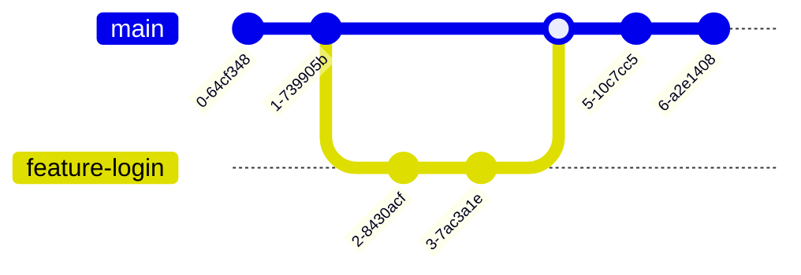
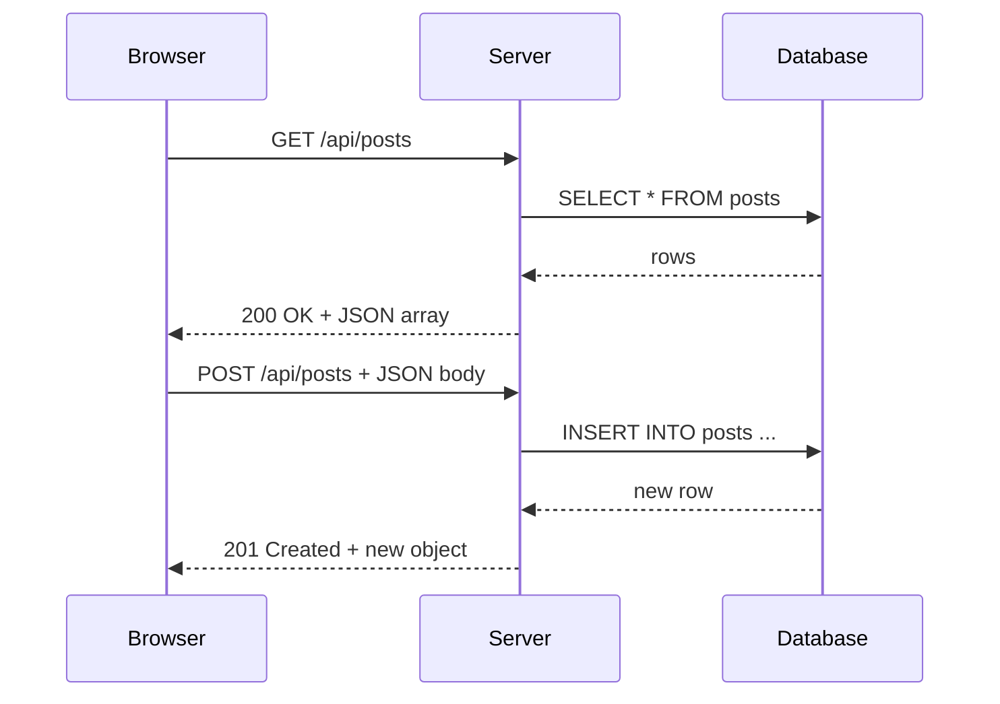

# Building Real Software

## Description

This is the phase where theory meets practice. You have the CS foundations — data structures, algorithms, how operating systems and networks work. Now you learn the actual tools and technologies used to build applications that other people can use. Version control, the web, databases, APIs — this is the stack that powers the modern software industry.

## Prerequisites

- [Core Computer Science](core-computer-science.md) — data structures, algorithms, OS, networking fundamentals

## Table of Contents

- [Version Control with Git](#version-control-with-git)
- [The Web — HTML and CSS](#the-web--html-and-css)
- [JavaScript — Making Pages Interactive](#javascript--making-pages-interactive)
- [Databases and SQL](#databases-and-sql)
- [APIs and HTTP](#apis-and-http)
- [Putting It Together — Full Stack Basics](#putting-it-together--full-stack-basics)
- [Development Tools and Workflow](#development-tools-and-workflow)
- [Milestones for This Phase](#milestones-for-this-phase)
- [Study Cases](#study-cases)
- [Examples](#examples)
- [Glossary](#glossary)
- [Quick References](#quick-references)
- [Next Steps](#next-steps)

## Content / Material

### Version Control with Git

Version control tracks every change to your codebase over time. It answers who changed what, when, and why. It lets you experiment without fear — create a branch, try something, discard it if it fails. It enables teamwork without stepping on each other's files. It is not optional in professional software engineering.

Git is the version control system used by virtually every software team. Linus Torvalds created it in 2005 for the Linux kernel, and it has become the universal standard.

#### Core Concepts

A **repository** (repo) is a directory managed by Git. It contains your project files plus a hidden `.git` folder that stores the entire history.

A **commit** is a snapshot of the repository at a point in time. Each commit has a unique hash (e.g., `a1b2c3d`), a commit message describing the change, an author, and a timestamp. Commits form a chain — each commit points to its parent.

A **branch** is a movable pointer to a commit. The default branch is usually called `main` (or `master` in older repos). You create a new branch to work on a feature or fix without affecting the main codebase.

A **merge** combines changes from two branches. When the feature is complete and tested, you merge it back into `main`.



#### Basic Workflow

The typical workflow for contributing to a project looks like this:

1. **Clone** the repository to your machine.
2. **Create a branch** for your work.
3. **Make edits** to the code.
4. **Stage and commit** your changes locally.
5. **Push** your branch to the remote (GitHub, GitLab, etc.).
6. **Open a pull request** for review.
7. **Address feedback**, push more commits.
8. **Merge** the pull request when approved.

#### Essential Commands

```
git init                    Create a new repository
git clone <url>             Copy a remote repository locally
git add <file>              Stage a file for commit
git commit -m "message"     Commit staged changes
git push                    Send commits to remote
git pull                    Fetch and merge remote changes
git branch <name>           Create a branch
git checkout <branch>       Switch to a branch
git merge <branch>          Merge a branch into the current branch
git status                  See the current state of the working directory
git log                     View commit history
```

#### Collaboration Workflows

The simplest collaboration model is the **feature branch workflow**. Each developer creates a branch for their task, works independently, and opens a pull request when ready. A pull request is not just a code merge — it is a review process. Other team members read the changes, leave comments, and request improvements before the code is merged.

Code review catches bugs before they reach production. It spreads knowledge across the team. It enforces consistency. It is one of the defining practices of professional software engineering.

For deeper coverage:
- [What Is Version Control?](../../software/version-control/intro/what-is-version-control.md)
- [Git Basics](../../software/version-control/git-basics.md)
- [Branching and Merging](../../software/version-control/branching-and-merging.md)

### The Web — HTML and CSS

The web is the dominant platform for software delivery. The browser sends an HTTP request to a server; the server responds with HTML, CSS, and JavaScript.

#### How the Web Works

When you enter `https://example.com`:

1. The browser looks up the IP via DNS.
2. It opens a TCP connection on port 443.
3. It sends an HTTP GET request for `/`.
4. The server responds with an HTML document.
5. The browser parses HTML, discovers CSS/JS references, fetches them.
6. The page renders on screen.

Every web interaction follows this cycle: request, response, render.

#### HTML — Structure

HTML (HyperText Markup Language) defines the structure and content of a web page. It uses tags to mark up text:

```html
<!DOCTYPE html>
<html lang="en">
<head>
  <meta charset="UTF-8">
  <title>My Page</title>
</head>
<body>
  <header>
    <h1>Welcome</h1>
    <nav>
      <a href="/">Home</a>
      <a href="/about">About</a>
    </nav>
  </header>
  <main>
    <article>
      <h2>First Post</h2>
      <p>This is the content of my first post.</p>
    </article>
  </main>
  <footer>
    <p>&copy; 2026</p>
  </footer>
</body>
</html>
```

Key elements: headings (`h1`-`h6`), paragraphs (`p`), links (`a`), images (`img`), lists (`ul`/`ol`), divisions (`div`), and semantic elements (`header`, `nav`, `main`, `article`, `section`, `footer`).

#### CSS — Style

CSS (Cascading Style Sheets) controls how HTML looks: colors, fonts, spacing, layout. You write rules that select elements and apply styles:

```css
body {
  font-family: system-ui, sans-serif;
  line-height: 1.6;
  margin: 0;
  padding: 2rem;
}

header {
  background: #333;
  color: white;
  padding: 1rem;
}

.card {
  border: 1px solid #ddd;
  border-radius: 8px;
  padding: 1rem;
  margin: 1rem 0;
}
```

#### Building a Static Page

Create `index.html` and `style.css` with the code above, then open the HTML file in a browser. That is it — you have built something real that anyone can open. This is your first deployed application.

#### Responsive Design

Pages must adapt to different screen sizes. CSS media queries handle this:

```css
@media (max-width: 640px) {
  body {
    padding: 1rem;
  }
  nav {
    display: flex;
    flex-direction: column;
  }
}
```

Learn more at:
- [HTML](../../programming/html/index.md) — full module on HTML
- [CSS](../../programming/css/index.md) — full module on CSS

### JavaScript — Making Pages Interactive

HTML and CSS produce static pages. JavaScript makes them dynamic. It is the only programming language that runs natively in every browser, which makes it the language of the web.

#### DOM Manipulation

The browser exposes the page structure as the Document Object Model (DOM). JavaScript can read and modify it:

```javascript
const heading = document.querySelector('h1');
heading.textContent = 'Hello from JavaScript';
heading.style.color = 'blue';

const newParagraph = document.createElement('p');
newParagraph.textContent = 'This was added dynamically.';
document.querySelector('main').appendChild(newParagraph);
```

#### Events

User interactions — clicks, key presses, form submissions — fire events. You respond to them with event listeners:

```javascript
const button = document.querySelector('#submit-button');
button.addEventListener('click', () => {
  const input = document.querySelector('#name-input');
  alert(`Hello, ${input.value}!`);
});
```

#### Fetch API

The Fetch API lets your JavaScript talk to servers. It sends HTTP requests and processes responses asynchronously:

```javascript
fetch('https://api.example.com/posts')
  .then(response => response.json())
  .then(data => {
    const list = document.querySelector('#post-list');
    data.forEach(post => {
      const item = document.createElement('li');
      item.textContent = post.title;
      list.appendChild(item);
    });
  })
  .catch(error => console.error('Failed to fetch:', error));
```

This is the key mechanism that enables modern web applications: the page loads once, then JavaScript fetches data from APIs and updates the DOM without a full page reload.

For deeper coverage:
- [JavaScript/TypeScript Module](../../programming/js-ts/index.md)

### Databases and SQL

Most applications need to persist data beyond the current session. That is what databases are for.

#### What Is a Database?

A database is an organized collection of data stored electronically. It provides structured storage, efficient retrieval, concurrent access, and durability. The most common type for web applications is the **relational database** (PostgreSQL, MySQL, SQLite).

In a relational database, data is organized into **tables**. A table has **rows** (records) and **columns** (fields). Think of it as a spreadsheet with strict typing and relationships between sheets.

#### SQL — Structured Query Language

SQL is the language used to interact with relational databases. It is declarative — you say *what* you want, not *how* to get it.

A simple table definition:

```sql
CREATE TABLE users (
  id SERIAL PRIMARY KEY,
  name VARCHAR(100) NOT NULL,
  email VARCHAR(255) UNIQUE NOT NULL,
  created_at TIMESTAMP DEFAULT NOW()
);
```

#### CRUD Operations

CRUD stands for Create, Read, Update, Delete — the four fundamental operations on persistent data.

```sql
INSERT INTO users (name, email) VALUES ('Alice', 'alice@example.com');
SELECT * FROM users;
SELECT name, email FROM users WHERE id = 1;
UPDATE users SET name = 'Alice Smith' WHERE id = 1;
DELETE FROM users WHERE id = 1;
```

#### Relationships

Tables relate to each other through foreign keys. The three common relationship types:

**One-to-many**: A user has many posts. The `posts` table has a `user_id` foreign key referencing `users.id`.

```sql
CREATE TABLE posts (
  id SERIAL PRIMARY KEY,
  user_id INTEGER REFERENCES users(id),
  title VARCHAR(200) NOT NULL,
  body TEXT NOT NULL
);
```

**Many-to-many**: A post can have many tags, and a tag can belong to many posts. This requires a junction table:

```sql
CREATE TABLE tags (
  id SERIAL PRIMARY KEY,
  name VARCHAR(50) UNIQUE NOT NULL
);

CREATE TABLE post_tags (
  post_id INTEGER REFERENCES posts(id),
  tag_id INTEGER REFERENCES tags(id),
  PRIMARY KEY (post_id, tag_id)
);
```

**Joins** combine data from multiple tables:

```sql
SELECT posts.title, users.name
FROM posts
JOIN users ON posts.user_id = users.id;

SELECT posts.title, tags.name
FROM posts
JOIN post_tags ON posts.id = post_tags.post_id
JOIN tags ON post_tags.tag_id = tags.id;
```

For deeper coverage:
- [What Is SQL?](../../data-databases/sql/intro/what-is-sql.md)
- [Querying Data](../../data-databases/sql/querying-data.md)
- [Joins and Relationships](../../data-databases/sql/joins-and-relationships.md)

### APIs and HTTP

An API (Application Programming Interface) is how two pieces of software talk to each other. In web development, APIs usually mean HTTP-based APIs that return JSON.

#### REST — The Dominant Style

REST (Representational State Transfer) is an architectural style for designing networked applications. A REST API exposes resources (users, posts, comments) at URLs, and uses HTTP methods to perform operations on them.

| HTTP Method | Operation | Example |
|-------------|-----------|---------|
| GET | Read | `GET /api/posts` — list posts |
| POST | Create | `POST /api/posts` — create a post |
| PUT | Update (full) | `PUT /api/posts/1` — replace post 1 |
| PATCH | Update (partial) | `PATCH /api/posts/1` — update title only |
| DELETE | Delete | `DELETE /api/posts/1` — delete post 1 |

#### HTTP Request/Response Structure

Every HTTP request has:
- A **method** (GET, POST, etc.)
- A **URL** (e.g., `/api/posts`)
- **Headers** (metadata: content type, authentication, etc.)
- An optional **body** (for POST, PUT, PATCH)

Every HTTP response has:
- A **status code** (200 OK, 201 Created, 404 Not Found, 500 Internal Server Error)
- **Headers**
- A **body** (usually JSON)



#### JSON

JSON (JavaScript Object Notation) is the standard data format for APIs. It is lightweight, human-readable, and easy for machines to parse:

```json
{
  "id": 1,
  "title": "My First Post",
  "body": "This is the content.",
  "author": {
    "name": "Alice"
  }
}
```

#### Building a Simple API

Using Node.js with Express as an example:

```javascript
const express = require('express');
const app = express();
app.use(express.json());

let posts = [];
let nextId = 1;

// GET /api/posts — list all posts
app.get('/api/posts', (req, res) => {
  res.json(posts);
});

// POST /api/posts — create a post
app.post('/api/posts', (req, res) => {
  const post = { id: nextId++, ...req.body };
  posts.push(post);
  res.status(201).json(post);
});

// GET /api/posts/:id — get one post
app.get('/api/posts/:id', (req, res) => {
  const post = posts.find(p => p.id === Number(req.params.id));
  if (!post) return res.status(404).json({ error: 'Not found' });
  res.json(post);
});

app.listen(3000, () => console.log('API running on port 3000'));
```

#### Consuming APIs

Once you have an API, any client can consume it. A frontend uses `fetch`. A script uses `curl`. Another service uses its HTTP library.

```
curl http://localhost:3000/api/posts
curl -X POST -H "Content-Type: application/json" -d '{"title":"Hello"}' http://localhost:3000/api/posts
```

For deeper coverage:
- [What Is HTTP?](../../networks/http-api/intro/what-is-http.md)
- [HTTP Methods & Status Codes](../../networks/http-api/http-methods-and-status.md)
- [REST API Design](../../networks/http-api/rest-api-design.md)

### Putting It Together — Full Stack Basics

Full stack means working on all three layers:

- **Frontend** — browser (HTML/CSS/JS)
- **Backend** — server handling logic (Node.js, Python, Go)
- **Database** — persistent storage (PostgreSQL, MySQL, SQLite)

Data flow: `Browser → Server → Database → Server → Browser`

#### Building a Full-Stack Application

A note-taking app is a good first full-stack project. A typical structure:

```
notes-app/
├── backend/
│   ├── package.json
│   ├── server.js          # Express routes and logic
│   └── db.js              # Database connection
├── frontend/
│   ├── index.html         # The page
│   ├── style.css          # Styling
│   └── app.js             # Fetch API calls + DOM manipulation
└── .env                   # Configuration
```

Configuration lives in `.env` files and environment variables:

```
PORT=3000
DATABASE_URL=postgresql://localhost:5432/notes_app
```

```javascript
const port = process.env.PORT || 3000;
```

The frontend fetches from the API and renders:

```javascript
async function loadNotes() {
  const res = await fetch('/api/notes');
  const notes = await res.json();
  const list = document.querySelector('#notes-list');
  list.innerHTML = '';
  notes.forEach(note => {
    const li = document.createElement('li');
    li.textContent = note.title;
    list.appendChild(li);
  });
}

document.querySelector('#note-form').addEventListener('submit', async (e) => {
  e.preventDefault();
  const title = document.querySelector('#title-input').value;
  await fetch('/api/notes', {
    method: 'POST',
    headers: { 'Content-Type': 'application/json' },
    body: JSON.stringify({ title })
  });
  loadNotes();
});

loadNotes();
```

This pattern — form submission triggers fetch, which updates the DOM — is the foundation of every interactive web application.

### Development Tools and Workflow

Professional development needs more than a text editor.

#### Package Managers

Dependency management tools for your language ecosystem:

- **npm** — for JavaScript/Node.js. Comes with Node.js.
- **pip** — for Python.

Using npm:

```
npm init -y              # Create package.json
npm install express      # Install a dependency
```

#### Code Editor Setup

VS Code essentials:

- **Extensions**: ESLint, Prettier, GitLens, language-specific support
- **Settings**: enable `formatOnSave`, configure terminal
- **Integrated terminal**: run commands without leaving the editor

#### Browser DevTools

Open with F12 or Ctrl+Shift+I.

- **Elements** — inspect and modify HTML/CSS live
- **Console** — run JavaScript, see errors
- **Network** — view every HTTP request/response with timing
- **Sources** — debug with breakpoints and step-through

#### Reading Error Messages

Read systematically: error type, message, stack trace, first line.

```
TypeError: Cannot read properties of undefined (reading 'title')
    at loadNotes (app.js:15:22)
    at HTMLButtonElement.<anonymous> (app.js:28:5)
```

Translation: line 15, `loadNotes` tried to access `.title` on something undefined. The call came from the submit handler at line 28.

#### Using curl for API Testing

`curl` is a command-line tool for making HTTP requests. It is invaluable for testing APIs without a browser:

```
curl http://localhost:3000/api/posts
curl -X POST http://localhost:3000/api/posts \
  -H "Content-Type: application/json" \
  -d '{"title":"Test","body":"Hello"}'
```

Add `-v` for verbose output that shows headers and status codes. Add `-i` to include response headers in the output.

### Milestones for This Phase

By the end of this phase, you should be able to do all of the following without referencing documentation:

- Use Git comfortably: initialize a repo, stage and commit changes, create and merge branches, push to a remote, pull changes from collaborators
- Build a static web page with semantic HTML and styled with CSS, including responsive design
- Add interactivity with JavaScript: DOM manipulation, event handling, data fetching
- Write SQL queries: SELECT, INSERT, UPDATE, DELETE with JOINs across multiple tables
- Build and test a simple REST API with CRUD operations
- Build one complete full-stack application that persists data in a database
- Explain the full request-response cycle from browser to server to database and back

If you can do these things, you have the practical skills to build real software. The next phase takes this foundation and adds the professional practices that turn a builder into an engineer.

## Glossary

| Term | Definition |
|------|------------|
| Git | A distributed version control system for tracking changes in source code during software development |
| Repository | A directory managed by Git, containing the project files and the complete revision history |
| Commit | A snapshot of the repository at a specific point in time, identified by a unique hash |
| Branch | A lightweight movable pointer to a commit, used to isolate work on different features or fixes |
| Pull Request | A mechanism for proposing and reviewing changes before merging them into a target branch |
| HTML | HyperText Markup Language — the standard language for defining the structure of web pages |
| CSS | Cascading Style Sheets — a language for describing the visual presentation of HTML documents |
| DOM | Document Object Model — the browser's tree representation of an HTML document, accessible via JavaScript |
| API | Application Programming Interface — a set of defined rules enabling different software to communicate |
| REST | Representational State Transfer — an architectural style for designing networked APIs using HTTP |
| HTTP | HyperText Transfer Protocol — the foundation protocol for data communication on the web |
| SQL | Structured Query Language — a domain-specific language for managing data in relational databases |
| CRUD | Create, Read, Update, Delete — the four basic operations for persistent data storage |
| JSON | JavaScript Object Notation — a lightweight, text-based data interchange format |
| Full Stack | An application architecture that includes a frontend (client), backend (server), and database |
| Environment Variable | A key-value pair used to configure application behavior outside of source code |
| Package Manager | A tool that automates installing, updating, and managing software dependencies (e.g., npm, pip) |
| Stack Trace | A report of the active function calls at a point when an error occurred, used for debugging |
| Foreign Key | A column in a database table that establishes a link to the primary key of another table |
| Join | A SQL operation that combines rows from two or more tables based on a related column |
| Responsive Design | An approach to web design that ensures pages render well on devices of all screen sizes |

## Quick References

- [Pro Git Book](https://git-scm.com/book/en/v2) — the definitive guide to Git, from basics to advanced topics, available free online
- [MDN Web Docs: HTML](https://developer.mozilla.org/en-US/docs/Web/HTML) — Mozilla's comprehensive reference for HTML elements and attributes
- [MDN Web Docs: CSS](https://developer.mozilla.org/en-US/docs/Web/CSS) — complete CSS reference with examples and browser compatibility tables
- [MDN Web Docs: JavaScript](https://developer.mozilla.org/en-US/docs/Web/JavaScript) — the authoritative reference for JavaScript language features and browser APIs
- [PostgreSQL Documentation](https://www.postgresql.org/docs/) — official documentation for PostgreSQL
- [Express.js Guide](https://expressjs.com/en/guide/routing.html) — official routing guide for Express, the standard Node.js web framework
- [HTTP Status Codes](https://httpstatuses.io/) — quick reference for every HTTP status code with explanations

## Next Steps

- [Becoming a Professional](becoming-a-professional.md) — testing, projects, portfolio, and preparing for the job market
- Back to [The Journey Ahead](intro/the-journey-ahead.md)
