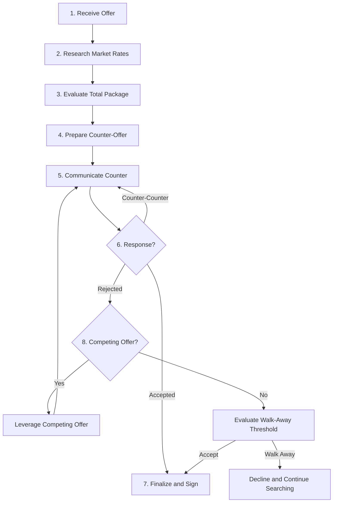
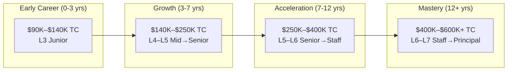

# Software Engineering Compensation and Negotiation

## Description

A comprehensive analysis of how software engineers are compensated — the structure of salary, equity, bonuses, and benefits — and the negotiation strategies that determine where within a compensation band an engineer lands. This document describes the financial architecture of the profession and the skills required to navigate it effectively.

## Prerequisites

- [Career Progression](career-progression.md) — the leveling system and tracks that define compensation bands
- [What Is a Software Engineer?](what-is-a-software-engineer.md) — the role, its scope, and the value it creates

## Table of Contents

- [Compensation Structure](#-compensation-structure)
- [Total Compensation (TC)](#-total-compensation-tc)
- [Equity Deep Dive](#-equity-deep-dive)
- [Compensation by Level](#-compensation-by-level)
- [Compensation by Geography and Company Tier](#-compensation-by-geography-and-company-tier)
- [The Negotiation Process](#-the-negotiation-process)
- [Negotiation Tactics](#-negotiation-tactics)
- [Non-Salary Negotiation](#-non-salary-negotiation)
- [Evaluating Startup Equity](#-evaluating-startup-equity)
- [Salary Progression Over a Career](#-salary-progression-over-a-career)
- [Common Negotiation Mistakes](#-common-negotiation-mistakes)
- [When NOT to Negotiate](#-when-not-to-negotiate)

## Content / Material

### 💰 Compensation Structure

Software engineer compensation is composed of four primary components: base salary, variable compensation (bonus), equity (stock-based compensation), and benefits. Each component serves a different purpose, carries different risk, and is governed by different mechanisms. Understanding how these pieces fit together is the foundation of financial literacy within the profession.

#### Base Salary

Base salary is the fixed annual amount paid to the engineer, typically distributed across biweekly or monthly paychecks. It is the most visible and most easily compared component of compensation. Base salary is determined by:

- **Level.** Each engineering level (L3 through L8+) has a salary band — a minimum, midpoint, and maximum. A junior engineer at L3 might have a band of $85,000 to $120,000, while a senior engineer at L5 might have a band of $140,000 to $210,000. The exact ranges vary by company, geography, and market conditions.
- **Geography.** Companies adjust base salary for cost of living and market rates by location. A senior engineer in San Francisco earns more in base salary than the same engineer in Austin, though the gap has narrowed with the rise of remote work.
- **Negotiation.** Where an engineer lands within their band is heavily influenced by negotiation. Two engineers at the same level, with similar experience, can earn tens of thousands of dollars apart in base salary depending on how each negotiated.
- **Performance.** Annual raises and merit adjustments move the engineer within the band over time. High performers advance toward the top of the band faster.

Base salary provides stability. It is the component that pays the mortgage, funds the retirement account, and covers daily expenses. Engineers should evaluate base salary as a floor — the minimum guaranteed income regardless of company performance or stock price movement.

#### Variable Compensation (Bonus)

Most companies offer annual bonuses tied to individual and company performance. The bonus is expressed as a percentage of base salary — typically 10% for junior engineers and up to 30-40% for staff-level and above.

```python
# Illustrative bonus calculation
def calculate_annual_compensation(base_salary, bonus_pct, target_bonus_rate):
    """
    Calculate total cash compensation with variable bonus.

    Args:
        base_salary: Annual base salary in USD
        bonus_pct: Actual performance multiplier (0.0 to 1.5)
        target_bonus_rate: Target bonus as fraction of base (e.g., 0.15 for 15%)

    Returns:
        Dictionary with compensation breakdown
    """
    target_bonus = base_salary * target_bonus_rate
    actual_bonus = target_bonus * bonus_pct

    # Some companies cap bonuses or apply a floor
    actual_bonus = max(0, min(actual_bonus, base_salary * 0.5))

    total_cash = base_salary + actual_bonus

    return {
        "base_salary": base_salary,
        "target_bonus": target_bonus,
        "actual_bonus": actual_bonus,
        "total_cash": total_cash,
        "bonus_multiplier": bonus_pct
    }


# Example: Senior engineer with 15% target bonus
senior = calculate_annual_compensation(
    base_salary=175_000,
    bonus_pct=1.1,       # 110% of target (strong performance)
    target_bonus_rate=0.15
)
print(f"Base: ${senior['base_salary']:,}")
print(f"Target Bonus: ${senior['target_bonus']:,.0f}")
print(f"Actual Bonus: ${senior['actual_bonus']:,.0f}")
print(f"Total Cash: ${senior['total_cash']:,}")
```

Bonuses are not guaranteed. In a bad year, the multiplier can drop to 0.5 or even 0. Engineers who budget around their bonus rather than their base salary take on unnecessary financial risk. A practical rule: treat the bonus as savings or investment capital, not as operating income.

#### Benefits

Benefits include health insurance (medical, dental, vision), retirement contributions (401(k) match), paid time off, parental leave, life insurance, and disability coverage. Benefits are often undervalued during negotiation because they are harder to quantify, but their cash value can be substantial.

A typical benefits package at a mid-to-large technology company might include:

- Health insurance: $8,000–$25,000 in employer-paid premiums annually
- 401(k) match: 3–6% of salary, often capped at a dollar amount
- PTO: 15–25 days plus holidays
- Parental leave: 12–20 weeks paid
- Learning budget: $1,000–$5,000 annually

The total cash value of a comprehensive benefits package can exceed $30,000–$50,000 per year. This is real compensation that does not appear in salary comparisons.

### 📊 Total Compensation (TC)

Total compensation (TC) is the metric that experienced engineers use to compare offers. TC aggregates every component of compensation into a single annual number:

$$TC = \text{Base Salary} + \text{Bonus} + \text{Annual Equity Value} + \text{Benefits Value}$$

The reason TC matters is that companies distribute compensation differently. One company might offer a high base salary with no equity. Another might offer a modest base with significant stock grants. Comparing these offers on base salary alone is misleading.

```python
def calculate_total_compensation(
    base_salary,
    target_bonus_pct,
    annual_equity_value,
    benefits_value=30_000
):
    """
    Calculate total compensation (TC) for offer comparison.

    Args:
        base_salary: Annual base salary in USD
        target_bonus_pct: Target bonus as percentage (e.g., 15 for 15%)
        annual_equity_value: Annualized value of equity grant
        benefits_value: Estimated annual value of benefits

    Returns:
        Dictionary with TC breakdown
    """
    bonus = base_salary * (target_bonus_pct / 100)
    tc = base_salary + bonus + annual_equity_value + benefits_value

    return {
        "base_salary": base_salary,
        "bonus": bonus,
        "annual_equity": annual_equity_value,
        "benefits": benefits_value,
        "total_compensation": tc
    }


# Comparing two offers
offer_a = calculate_total_compensation(
    base_salary=150_000,
    target_bonus_pct=15,
    annual_equity_value=40_000,   # RSUs at a public company
    benefits_value=35_000
)

offer_b = calculate_total_compensation(
    base_salary=140_000,
    target_bonus_pct=10,
    annual_equity_value=80_000,   # Options at a pre-IPO startup
    benefits_value=25_000
)

print(f"Offer A TC: ${offer_a['total_compensation']:,}")
print(f"Offer B TC: ${offer_b['total_compensation']:,}")
print(f"Offer B equity premium: ${offer_b['annual_equity'] - offer_a['annual_equity']:,}")
print(f"But Offer B equity carries higher risk (private company options)")
```

#### Why TC Differs From Salary

The gap between base salary and TC widens dramatically at senior levels and at large technology companies. A staff engineer at a FAANG-level company might earn a base salary of $200,000 but have a TC of $450,000 or more when equity and bonus are included. The equity component — often the largest single element — is invisible in salary discussions.

This is why salary transparency alone is insufficient. An engineer who shares only their base salary creates a distorted picture of the profession's compensation. The meaningful number is TC, and experienced engineers should communicate in those terms.

### 📈 Equity Deep Dive

Equity is the component of compensation that introduces the most complexity, the most risk, and the most potential upside. Understanding equity is essential for making informed career decisions.

#### Stock Options

Stock options give the engineer the right to purchase company stock at a fixed price (the strike price or grant price) within a specified time window. Options have value only if the company's stock price rises above the strike price — this is called being "in the money."

Key terminology:

- **Strike price (exercise price):** The fixed price at which the option can be purchased. Set at the time of the grant based on the company's 409A valuation.
- **Vesting schedule:** The timeline over which options become exercisable. The most common schedule is four years with a one-year cliff — 25% of the options vest after one year, then the remainder vest monthly or quarterly over the next three years.
- **Exercise window:** The period after leaving the company during which the engineer can exercise vested options. Typically 90 days, though some companies extend this.
- **409A valuation:** An independent appraisal of the company's fair market value, required by the IRS for tax purposes. The 409A valuation determines the strike price of new option grants.

```python
def simulate_option_value(
    sharesGranted,
    strikePrice,
    currentFMV,
    exitPrice,
    vestingYears=4,
    cliffYears=1
):
    """
    Simulate the value of stock options under different exit scenarios.

    Args:
        sharesGranted: Total number of options granted
        strikePrice: Price per share to exercise
        currentFMV: Current fair market value (409A)
        exitPrice: Expected price at exit (IPO or acquisition)
        vestingYears: Total vesting period
        cliffYears: Cliff period before vesting starts

    Returns:
        Dictionary with value analysis
    """
    # Vesting: cliff then monthly
    vested_at_exit = sharesGranted  # Assuming full vesting

    # Cost to exercise all options
    exercise_cost = vested_at_exit * strikePrice

    # Value at exit
    gross_value = vested_at_exit * exitPrice
    net_value = gross_value - exercise_cost

    # Scenario analysis
    scenarios = {}
    for scenario_name, price in [
        ("downside (2x FMV)", currentFMV * 2),
        ("moderate (5x FMV)", currentFMV * 5),
        ("strong (10x FMV)", currentFMV * 10),
        ("breakout (20x FMV)", currentFMV * 20),
    ]:
        value = vested_at_exit * price
        scenarios[scenario_name] = {
            "exit_price": price,
            "gross_value": value,
            "net_value": value - exercise_cost,
            "return_on_exercise_cost": (value - exercise_cost) / exercise_cost if exercise_cost > 0 else float('inf')
        }

    return {
        "shares": sharesGranted,
        "strike_price": strikePrice,
        "exercise_cost": exercise_cost,
        "exit_price": exitPrice,
        "gross_value": gross_value,
        "net_value": net_value,
        "scenarios": scenarios
    }


# Example: 10,000 options at a Series B startup
result = simulate_option_value(
    sharesGranted=10_000,
    strikePrice=5.00,        # 409A-implied strike
    currentFMV=8.00,         # Current 409A valuation per share
    exitPrice=40.00,         # Assumed exit price
)

print(f"Options: {result['shares']:,} shares at ${result['strike_price']:.2f}")
print(f"Exercise cost: ${result['exercise_cost']:,}")
print(f"")
for name, s in result["scenarios"].items():
    print(f"{name}:")
    print(f"  Exit price: ${s['exit_price']:.2f}")
    print(f"  Net value: ${s['net_value']:,.0f}")
    print(f"  Return on exercise: {s['return_on_exercise_cost']:.1f}x")
```

The critical risk with options: if the company fails or the stock price never exceeds the strike price, the options are worthless. The engineer has received no value from this component of compensation. This is not a theoretical risk — most startups fail.

#### Restricted Stock Units (RSUs)

RSUs are promises to deliver actual shares of stock after vesting conditions are met. Unlike options, RSUs always have value as long as the company's stock price is above zero. There is no strike price — the engineer receives shares without paying for them.

RSUs are the standard equity vehicle at public technology companies. The typical grant is denominated in a dollar amount (for example, $100,000 over four years), converted to shares at the stock price on the grant date.

```python
def rsu_annual_value(
    total_grant_value,
    vesting_years=4,
    current_stock_price=None,
    shares_granted=None
):
    """
    Calculate annual RSU vesting value.

    Can compute from either total grant value or shares granted.
    """
    if shares_granted is not None and current_stock_price is not None:
        total_grant_value = shares_granted * current_stock_price

    annual_vest = total_grant_value / vesting_years

    return {
        "total_grant": total_grant_value,
        "vesting_years": vesting_years,
        "shares_if_known": shares_granted,
        "annual_vest_value": annual_vest,
        "monthly_vest_value": annual_vest / 12
    }


# RSU grant at a public company
rsu = rsu_annual_value(
    total_grant_value=160_000,   # $160k over 4 years
    vesting_years=4,
    current_stock_price=150.00,
    shares_granted=1066           # 160000 / 150
)

print(f"Total RSU grant: ${rsu['total_grant']:,}")
print(f"Shares granted: {rsu['shares_if_known']}")
print(f"Annual vest: ${rsu['annual_vest_value']:,.0f}")
print(f"Monthly vest: ${rsu['monthly_vest_value']:,.0f}")
```

RSUs carry their own risks: concentration risk (a large portion of net worth tied to one company's stock), refresh grant variability (annual top-up grants depend on performance and company policy), and the cliff effect (if the engineer leaves before the first vest, they receive nothing).

#### Vesting Schedules

The standard vesting schedule in the technology industry is four years with a one-year cliff:

| Period | What Vests | Cumulative |
|--------|-----------|------------|
| Month 0–12 | Nothing | 0% |
| Month 12 | 25% (cliff) | 25% |
| Month 13–48 | 1/48th per month | 25% → 100% |

Some companies use back-loaded vesting (e.g., 10% year 1, 20% year 2, 30% year 3, 40% year 4) to increase retention. Others offer accelerated vesting upon acquisition (single-trigger or double-trigger acceleration). These details matter significantly when evaluating an offer.

#### 409A Valuations and Dilution

The 409A valuation is a third-party assessment of a private company's stock value, required by the IRS before options can be granted. It sets the strike price. A low 409A valuation means a lower strike price, which means more potential upside for the option holder — but it also signals that the company is valued lower by independent appraisers.

Dilution is the reduction in existing shareholders' ownership percentage when new shares are issued. Every funding round dilutes existing shareholders, including employees with equity. A common pattern:

```python
def simulate_dilution(
    initial_shares,
    employee_shares,
    funding_rounds
):
    """
    Simulate equity dilution across funding rounds.

    Args:
        initial_shares: Founding shares before any funding
        employee_shares: Engineer's option grant
        funding_rounds: List of (round_name, new_shares_issued)

    Returns:
        Dilution analysis at each stage
    """
    total_shares = initial_shares
    results = []

    for round_name, new_shares in funding_rounds:
        total_shares += new_shares
        employee_pct = (employee_shares / total_shares) * 100

        results.append({
            "round": round_name,
            "total_shares": total_shares,
            "new_shares_issued": new_shares,
            "employee_ownership_pct": employee_pct,
        })

    return results


# Example: 10,000 options in a company through multiple rounds
dilution = simulate_dilution(
    initial_shares=1_000_000,
    employee_shares=10_000,
    funding_rounds=[
        ("Seed", 500_000),
        ("Series A", 1_000_000),
        ("Series B", 2_000_000),
        ("Series C", 4_000_000),
        ("Series D", 6_000_000),
    ]
)

print(f"{'Round':<12} {'Total Shares':>14} {'Your %':>10}")
print("-" * 40)
for stage in dilution:
    print(f"{stage['round']:<12} {stage['total_shares']:>14,} {stage['employee_ownership_pct']:>9.2f}%")
```

An engineer who receives 0.1% of a company at the seed stage may own 0.02% by the time the company goes public. The absolute number of shares has not changed, but the ownership percentage has been diluted by a factor of five. The value depends entirely on whether the company's total valuation has grown faster than the dilution.

### 📊 Compensation by Level

Compensation varies dramatically by engineering level. The following ranges are approximate, reflect U.S. market conditions as of 2025–2026, and include base salary, bonus, and annual equity value (TC):

| Level | Title | TC Range (USD) | Equity as % of TC |
|-------|-------|----------------|-------------------|
| L3 | Junior Engineer | $90,000–$140,000 | 5–15% |
| L4 | Mid-Level Engineer | $130,000–$200,000 | 10–25% |
| L5 | Senior Engineer | $180,000–$320,000 | 20–40% |
| L6 | Staff Engineer | $280,000–$450,000 | 30–50% |
| L7 | Principal Engineer | $380,000–$600,000+ | 40–60% |

At junior levels, base salary dominates TC. As the engineer advances, equity becomes the largest component. This shift has a practical implication: comparing offers at the junior level is relatively straightforward (compare base salaries). Comparing offers at the senior level requires careful analysis of equity terms, vesting schedules, and company valuation trajectory.

### 🌍 Compensation by Geography and Company Tier

Geography and company tier are the two most powerful factors that determine compensation, after level.

#### Company Tiers

The technology industry segments roughly into four tiers:

**Tier 1 — Big Tech (FAANG+).** Companies like Google, Apple, Meta, Amazon, Microsoft, and Netflix offer the highest compensation in the industry. They have liquid public stock (or in Netflix's case, all-cash compensation), standardized leveling systems, and enormous scale. A senior engineer at a Tier 1 company can expect TC of $250,000–$350,000 or more.

**Tier 2 — Well-Funded Scale-Ups.** Companies like Stripe, Databricks, Cloudflare, and Figma offer compensation competitive with Tier 1, often with higher equity upside but less liquidity. The risk is higher — the stock may not be publicly traded — but the potential return is also higher.

**Tier 3 — Mid-Size and Established Tech.** Companies with 500–5,000 employees, often profitable, offering competitive but not top-of-market compensation. TC for a senior engineer might be $180,000–$260,000. Benefits and culture vary widely.

**Tier 4 — Small Startups, Agencies, and Non-Tech.** The widest range. A five-person startup might offer $80,000 plus significant equity that may be worth nothing. A consulting agency might offer $100,000–$150,000 with minimal equity. Non-tech companies (retail, healthcare, finance) typically offer 10–30% less than tech companies for equivalent roles.

#### Geographic Variation

The rise of remote work has complicated geographic compensation. Three models exist:

1. **Location-based pay.** Compensation adjusts to the engineer's location. San Francisco engineers earn more than Raleigh engineers doing the same job at the same company. This model is the most common but is increasingly contested.
2. **National pay band.** A single pay band regardless of location. The engineer in a low-cost area earns the same as the engineer in San Francisco. Companies like GitLab and Automattic pioneered this model.
3. **Global pay band.** Less common, but some fully remote companies offer a single global band or adjust only by country, not by city.

The practical impact of geography on TC can be $50,000–$100,000 for the same level at the same company. An engineer relocating from San Francisco to a lower-cost area while maintaining a San Francisco salary effectively gives themselves a significant raise.

### 🤝 The Negotiation Process

Negotiation is the process of reaching a mutually acceptable agreement on the terms of employment. It is a skill, it is learnable, and it has a direct, measurable impact on lifetime earnings. Engineers who negotiate their first offer earn an estimated $1 million more over their career than engineers who accept the initial offer.

The negotiation process follows a sequence:



#### Step 1: Research Market Rates

Before negotiating, the engineer must know the market. Sources include:

- **Levels.fyi** — Crowdsourced compensation data, filtered by company, level, and location. The most reliable source for big tech and well-funded startups.
- **Blind** — Anonymous professional network where engineers share salary information. Less structured than Levels.fyi but useful for smaller companies.
- **Glassdoor** — Broader but less accurate for engineering roles. Useful as a baseline.
- **Salary surveys** — Industry surveys from Stack Overflow, JetBrains, and others provide aggregated data.
- **Recruiter conversations** — Recruiters know current market rates. Even if the engineer is not actively looking, conversations with recruiters provide real-time data points.

The goal of research is not to find a single number but to understand the range. The engineer should know the 25th, 50th, and 75th percentile for their level, location, and company tier.

#### Step 2: Evaluate the Total Package

The engineer should map every component of the offer into a structured comparison:

```python
def evaluate_offer(
    base_salary,
    target_bonus_pct,
    equity_annual_value,
    signing_bonus,
    benefits_value,
    pto_days,
    remote_flexibility,
    other_perks_value=0
):
    """
    Structure an offer for comparison and negotiation.

    Returns a complete offer snapshot.
    """
    first_year_tc = (
        base_salary
        + base_salary * (target_bonus_pct / 100)
        + equity_annual_value
        + signing_bonus
        + benefits_value
        + other_perks_value
    )

    recurring_tc = (
        base_salary
        + base_salary * (target_bonus_pct / 100)
        + equity_annual_value
        + benefits_value
        + other_perks_value
    )

    return {
        "base_salary": base_salary,
        "bonus_target": f"{target_bonus_pct}%",
        "annual_equity": equity_annual_value,
        "signing_bonus": signing_bonus,
        "pto_days": pto_days,
        "remote": remote_flexibility,
        "first_year_tc": first_year_tc,
        "recurring_tc": recurring_tc,
    }


# Example: Structured offer evaluation
offer = evaluate_offer(
    base_salary=165_000,
    target_bonus_pct=15,
    equity_annual_value=50_000,
    signing_bonus=20_000,
    benefits_value=30_000,
    pto_days=20,
    remote_flexibility="Hybrid (3 days in office)"
)

print(f"Base: ${offer['base_salary']:,}")
print(f"Bonus target: {offer['bonus_target']}")
print(f"Annual equity: ${offer['annual_equity']:,}")
print(f"Signing bonus: ${offer['signing_bonus']:,}")
print(f"PTO: {offer['pto_days']} days")
print(f"Remote: {offer['remote']}")
print(f"First-year TC: ${offer['first_year_tc']:,}")
print(f"Recurring TC: ${offer['recurring_tc']:,}")
```

#### Step 3: Prepare the Counter-Offer

A counter-offer should be specific, justified, and reasonable. The engineer identifies which components to negotiate and by how much. Common counter-offer targets:

- Base salary increase of 10–20%
- Additional equity grant or accelerated vesting
- Higher signing bonus
- Additional PTO days
- Remote work flexibility
- Earlier performance review

The counter-offer should be framed around market data and the engineer's value, not around personal financial needs. "Based on market data for this level and location, I believe a base salary of $185,000 more accurately reflects the range" is more effective than "I need more because my rent is high."

#### Step 4: Communicate the Counter

The counter is typically delivered via email or phone call to the recruiter. The communication should be concise, professional, and specific. The engineer states what they want, why it is reasonable, and that they are enthusiastic about the role.

### 🧠 Negotiation Tactics

Effective negotiation relies on several well-established tactics:

#### Anchoring

Anchoring is the cognitive bias where the first number presented in a negotiation disproportionately influences the outcome. By stating a high (but justified) anchor, the engineer shifts the entire negotiation range upward.

If the offer is $160,000 base and the engineer's research shows the range is $155,000–$195,000, anchoring at $185,000 sets a reference point that pulls the final number upward. Even if the company counters at $170,000, the engineer is better off than if they had countered at $165,000.

#### Silence

After stating a counter-offer, the engineer should stop talking. Silence is uncomfortable, and the other party often fills it by making concessions. The instinct to explain, justify, or soften the request is counterproductive. State the ask, then wait.

#### The Power of Walking Away

BATNA (Best Alternative to a Negotiated Agreement) is the single most important concept in negotiation. The engineer's BATNA is their next-best option — the competing offer, the current job, or the decision to continue searching.

A strong BATNA gives the engineer leverage. An engineer with two competing offers can negotiate aggressively because they have a credible alternative. An engineer with no other options has limited leverage.

The willingness to walk away is the ultimate source of negotiating power. An engineer who signals — verbally or through their behavior — that they will accept any offer loses all leverage. An engineer who communicates genuine enthusiasm for the role while also demonstrating that they have alternatives creates a dynamic where the employer must compete for their acceptance.

#### Framing

How a request is framed determines how it is received. Compare:

- **Weak framing:** "I was hoping for a higher salary."
- **Strong framing:** "Based on my research into market rates for this level and the scope of this role, I believe $185,000 is more appropriate. I am confident we can find a number that works for both of us."

The second framing is specific, data-driven, and collaborative. It positions the negotiation as a problem to solve together, not a confrontation.

#### Incremental vs. Holistic Negotiation

Two approaches exist:

1. **Component-by-component.** Negotiate salary, then equity, then signing bonus sequentially. This approach can extract maximum value but takes longer and risks the employer feeling nickel-and-dimed.
2. **Holistic.** Present a complete counter-offer addressing all components at once. This approach is faster and signals sophistication. Most experienced negotiators prefer this method.

### 📝 Non-Salary Negotiation

Salary is the most visible negotiation target, but non-salary terms can be equally valuable. In many cases, non-salary items are easier for the employer to grant because they do not affect the compensation band structure.

#### Signing Bonus

A signing bonus is a one-time payment made at the start of employment. It offsets the cost of leaving unvested equity at a previous company, bridges a salary gap, or sweetens the offer. Signing bonuses range from $5,000 to $100,000 or more, depending on level.

Signing bonuses are particularly effective when:
- The engineer is leaving unvested equity behind (the signing bonus compensates for this loss)
- The base salary is at the top of the band and cannot be increased further
- The employer has limited flexibility on equity but can offer cash upfront

#### Remote Work

Remote work flexibility has become one of the most negotiated terms since 2020. The value of remote work is not just convenience — it eliminates commuting costs (estimated at $2,000–$5,000 annually), enables relocation to lower-cost areas, and provides schedule flexibility.

An engineer who negotiates full remote work and relocates from San Francisco to a lower-cost city might effectively gain $30,000–$50,000 in purchasing power, even without a salary increase.

#### PTO and Flexible Schedule

Additional paid time off, flexible working hours, or compressed work weeks (four-day weeks) are increasingly common negotiation targets. An additional five days of PTO at a salary of $175,000 is equivalent to approximately $3,365 in additional compensation — and the psychological value of time off often exceeds the dollar amount.

#### Title

Title affects future career trajectory. An engineer who negotiates a "Senior Software Engineer" title instead of "Software Engineer II" positions themselves more favorably for future roles. Title is a zero-cost concession for the employer but carries long-term value for the engineer.

#### Learning and Development Budget

Many companies offer annual learning budgets for conferences, courses, certifications, and books. Negotiating an increase from $1,500 to $5,000 costs the company relatively little but provides the engineer with significant professional development resources.

### 🔍 Evaluating Startup Equity

Startup equity deserves special attention because it is simultaneously the most potentially valuable and the most likely to be worthless. The following framework helps engineers assess the real value of startup options:

#### The Expected Value Calculation

The expected value of options accounts for the probability of various outcomes:

$$E[\text{Value}] = P(\text{success}) \times \text{Value}_{\text{success}} + P(\text{failure}) \times \text{Value}_{\text{failure}}$$

Since most startups fail, $P(\text{failure})$ is high — approximately 60–90% depending on stage. Options at a failed company are worth zero.

```python
def expected_option_value(
    shares,
    strike_price,
    success_scenarios
):
    """
    Calculate expected value of startup options using scenario analysis.

    Args:
        shares: Number of options
        strike_price: Exercise price per share
        success_scenarios: List of (probability, exit_price_per_share) tuples
            Probabilities should sum to <= 1.0 (remainder is failure probability)

    Returns:
        Expected value analysis
    """
    exercise_cost = shares * strike_price
    expected_value = 0
    print(f"{'Scenario':<30} {'Probability':>10} {'Exit Price':>12} {'Net Value':>14} {'Contribution':>14}")
    print("-" * 84)

    for prob, exit_price in success_scenarios:
        gross = shares * exit_price
        net = max(0, gross - exercise_cost)
        contribution = prob * net
        expected_value += contribution
        print(f"{'Success: $' + str(exit_price):<30} {prob:>9.0%} {f'${exit_price:.2f}':>12} {f'${net:,.0f}':>14} {f'${contribution:,.0f}':>14}")

    failure_prob = 1.0 - sum(p for p, _ in success_scenarios)
    print(f"{'Failure':<30} {failure_prob:>9.0%} {'$0.00':>12} {'$0':>14} {'$0':>14}")
    print("-" * 84)
    print(f"{'Expected value of options':<30} {'':>10} {'':>12} {'':>14} {f'${expected_value:,.0f}':>14}")
    print(f"{'Exercise cost':<30} {'':>10} {'':>12} {f'(${exercise_cost:,.0f})':>14} {'':>14}")

    return {
        "exercise_cost": exercise_cost,
        "expected_value": expected_value,
        "failure_probability": failure_prob
    }


# Example: 10,000 options at a Series B startup
result = expected_option_value(
    shares=10_000,
    strike_price=5.00,
    success_scenarios=[
        (0.10, 50.00),   # 10% chance of 10x return
        (0.15, 25.00),   # 15% chance of 5x return
        (0.10, 12.00),   # 10% chance of modest exit
        (0.05, 8.00),    # 5% chance of small exit
        # 60% chance of failure (implied)
    ]
)
```

#### Key Questions for Evaluating Startup Equity

1. **What stage is the company?** Seed-stage options carry maximum risk and maximum potential upside. Series C+ options are less risky but offer less upside.
2. **What is the 409A valuation relative to the last funding round?** If the 409A is much lower than the price paid by investors, the options have built-in upside. If the 409A is close to or above the last round price, the options are priced at or above market.
3. **What is the total shares outstanding?** The number of shares matters less than the ownership percentage. An engineer should know what percentage of the company their grant represents.
4. **What is the liquidation preference?** In a down round or acquisition, liquidation preferences determine who gets paid first. Common stock (what employees typically hold) is last in line.
5. **When is the next funding round?** If the company is about to raise, the next round will dilute existing shares. The engineer should understand the dilution impact of the upcoming round.
6. **What is the exercise window after departure?** A 90-day window is standard but can force engineers to make costly decisions if they leave before a liquidity event.

### 📈 Salary Progression Over a Career

Compensation growth over a software engineering career is not linear. It follows a pattern shaped by promotions, job changes, and the compounding effect of equity grants at higher levels.



Key inflection points in salary progression:

1. **First job change (2–3 years).** The largest single jump in TC often comes from switching companies after gaining initial experience. Job changes typically yield 15–30% TC increases, while internal raises average 3–8%.
2. **Promotion to senior (5–7 years).** The jump from L4 to L5 is one of the most impactful. Senior engineers access equity-heavy compensation packages at large companies.
3. **The staff threshold (8–12 years).** Reaching staff level unlocks the highest-leverage compensation packages. The equity component becomes dominant, and the difference between Tier 1 and Tier 3 companies widens dramatically.
4. **Long-tenure equity accumulation.** Engineers who stay at a company through a period of stock appreciation benefit from refresh grants that compound over time. A senior engineer at a company whose stock doubles each year sees their annual equity value double as well — a powerful wealth-building mechanism.

#### The Job Change Premium

Internal promotions typically come with a 10–20% TC increase. External job changes at the same level often yield 20–40% increases. This creates a structural incentive to change jobs every 2–4 years during the growth phase of a career. Engineers who stay at one company for a decade often earn significantly less than peers who changed jobs two or three times, even if the stay-at-one-company engineer was promoted more frequently.

This is not an argument for job-hopping. Long tenure builds deep expertise, institutional knowledge, and the relationships needed for staff-level impact. But engineers should be aware of the financial trade-off and negotiate accordingly when they do stay.

### ⚠️ Common Negotiation Mistakes

**Accepting the first offer.** The initial offer is almost never the maximum the employer is willing to pay. It is a starting point shaped by the hiring manager's budget, the recruiter's targets, and the engineer's demonstrated leverage. Accepting without negotiation leaves money on the table.

**Negotiating without data.** Making demands without supporting evidence undermines credibility. The engineer should cite market data, competing offers, or specific value they bring. "I want $200,000 because I feel I deserve it" is weaker than "Based on Levels.fyi data for L5 in this market, the 75th percentile is $195,000."

**Being adversarial.** Negotiation is not a zero-sum conflict. The goal is to reach a mutually beneficial agreement. An adversarial tone — demands, ultimatums, hostile emails — damages the relationship before employment begins. The employer should feel that the engineer is negotiating in good faith, not extracting maximum concessions.

**Ignoring non-salary components.** Focusing exclusively on base salary while ignoring equity, signing bonus, PTO, and remote flexibility leaves significant value undiscovered. A creative negotiation that improves three non-salary components may be worth more than a $5,000 base salary increase.

**Revealing the current salary.** In many jurisdictions, employers are legally prohibited from asking about current salary. Even where legal, sharing this information anchors the negotiation to the engineer's past compensation rather than the market rate or the value they bring. The engineer should redirect: "I am focused on the compensation for this role based on its scope and market rates."

**Negotiating after accepting.** Once an engineer accepts an offer, their leverage drops to zero. All negotiation must happen before acceptance. Some engineers try to renegotiate after accepting a verbal offer but before signing — this is risky and can damage trust.

**Failing to get the offer in writing.** Every negotiated term — salary, equity, signing bonus, remote work, PTO, title — should be documented in the formal offer letter. Verbal promises are not binding. If a term is important enough to negotiate, it is important enough to have in writing.

**Comparing incomparable offers.** Comparing a $200,000 TC at a public company with liquid RSUs to a $220,000 TC at a pre-IPO startup with illiquid options requires adjusting for risk, liquidity, and time value. A naive comparison favors the higher number; an informed comparison may favor the lower one.

### 🚫 When NOT to Negotiate

Negotiation is not always the right move. There are situations where accepting the offer as presented — or declining it — is more appropriate than negotiating.

**When the offer is already at the top of the band.** If the offer is at the 90th percentile for the level, geography, and company tier, further negotiation has limited room and risks signaling unrealistic expectations.

**When the company has a strict, transparent compensation structure.** Some companies (particularly in big tech) publish their leveling bands and have rigid rules about where new hires land. In these cases, the engineer negotiates by choosing which level to target, not by pushing the number within a band.

**When the relationship risk outweighs the financial gain.** If the hiring manager has signaled that they expect immediate acceptance, or if the company culture is adversarial about negotiation, pushing hard may damage the relationship. This is a judgment call that depends on the engineer's alternatives.

**When the role is a significant step up in scope.** If the engineer is being hired at a level above their current position, the offer itself represents a major advancement. Negotiating aggressively in this scenario may be perceived as ungrateful or as failing to recognize the opportunity.

**When personal financial pressure is driving the decision.** An engineer who needs a job immediately — due to layoffs, visa constraints, or financial emergency — has a weak BATNA. Negotiation under desperation produces bad outcomes. In these cases, accepting and then negotiating at the next review cycle is often wiser.

## Learning Tips

- **Practice before the real conversation.** Rehearse the negotiation with a friend, mentor, or coach. The emotional difficulty of asking for more money decreases dramatically with practice.
- **Use the mirror technique.** When the recruiter states a number, repeat it back with an upward inflection: "You are offering $160,000?" This invites them to fill the silence and often leads them to improve the offer unprompted.
- **Separate the person from the problem.** The recruiter is not your adversary — they are a colleague working toward the same goal (a signed offer). Treat the negotiation as collaborative problem-solving, not combat.
- **Keep a negotiation journal.** After each negotiation — whether successful or not — record what worked, what did not, and what you would do differently. This accumulated experience compounds over a career.
- **Negotiate the offer, not the job description.** Focus your energy on the compensation package, not on redefining the role's responsibilities during the offer stage. Role scope can be renegotiated later; compensation bands are set at hire.
- **Understand the employer's constraints.** Companies have budgets, approval chains, and internal equity constraints. A request for $200,000 base might be impossible, but a request for a $20,000 signing bonus might be trivial. Knowing which levers are easy for the employer to pull lets you negotiate efficiently.

## Glossary

| Term | Definition |
|------|------------|
| 409A Valuation | An independent appraisal of a private company's fair market value, required by the IRS to set option strike prices |
| Annual Equity Value | The annualized dollar value of equity grants, typically calculated as total grant value divided by vesting period |
| Base Salary | Fixed annual compensation paid in regular paychecks, before taxes and deductions |
| BATNA | Best Alternative to a Negotiated Agreement — the engineer's next-best option if the current negotiation fails |
| Cliff | The initial vesting period (typically one year) before any equity begins to vest |
| Dilution | The reduction in existing shareholders' ownership percentage when new shares are issued |
| Exercise Cost | The total cost to purchase vested options, calculated as number of shares multiplied by strike price |
| Exercise Window | The period after leaving a company during which vested options can be exercised (typically 90 days) |
| In the Money | Options whose current market value exceeds the strike price |
| Liquidity Event | An event that converts equity to cash — IPO, acquisition, or secondary sale |
| Liquidation Preference | The order in which shareholders are paid during an acquisition or dissolution; common stock holders are typically last |
| Refresh Grant | An additional equity grant given to employees at annual reviews, separate from the initial grant |
| Restricted Stock Unit (RSU) | A promise to deliver actual shares of stock after vesting conditions are met, with no strike price required |
| Strike Price | The fixed price at which an option can be purchased, set at the time of the grant |
| Total Compensation (TC) | The sum of base salary, bonus, equity value, and benefits value; the standard metric for comparing offers |
| Vesting Schedule | The timeline over which equity grants become owned by the employee, typically four years with a one-year cliff |

## Quick References

- [Levels.fyi](https://www.levels.fyi) — Crowdsourced compensation data by company, level, and location
- [Blind](https://www.teamblind.com) — Anonymous professional network with salary discussions
- [CompFAQ by Candor](https://candor.co/compfaq) — Detailed explanations of equity, vesting, and negotiation
- [Haseeb Qureshi — Salary Negotiation Guide](https://www.haseebq.com/my-ten-rules-for-negotiating-a-job-offer/) — Practical negotiation framework from an industry veteran
- [The Holloway Guide to Equity Compensation](https://holloway.com/g/equity-compensation) — Comprehensive reference on stock options, RSUs, and startup equity

## Next Steps

- [Interview Preparation](interview-preparation.md) — securing the offer through effective interview performance
- [Career Progression](career-progression.md) — advancing through levels to access higher compensation bands
- [Sustainability and Burnout](sustainability-and-burnout.md) — balancing compensation ambition with long-term well-being
