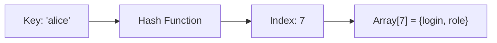
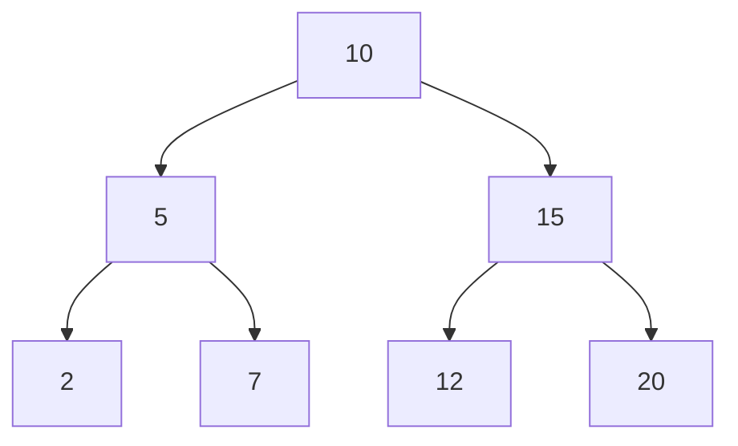
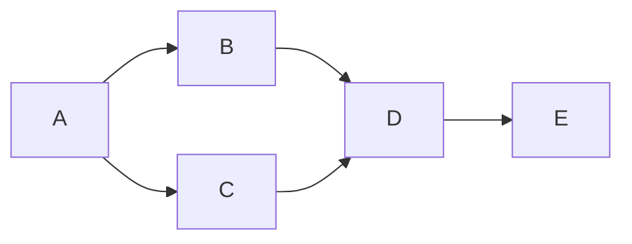
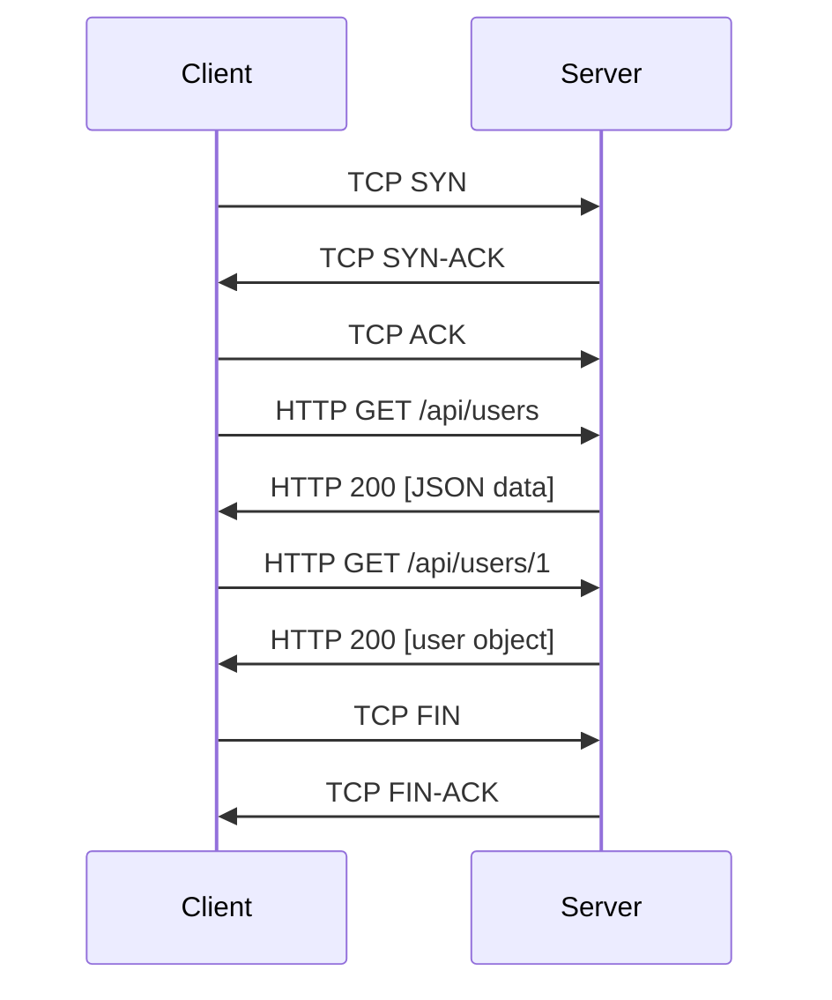

# Core Computer Science

## Description

Data structures, algorithms, operating systems, and networking — the theoretical foundations that separate coding from engineering. This phase bridges the gap between writing programs that work and understanding why they work the way they do.

## Prerequisites

- [First Steps in Programming](first-steps-in-programming.md) — comfortable writing basic programs with variables, functions, and loops

## Table of Contents

- [Why Theory Matters](#why-theory-matters)
- [Data Structures](#data-structures)
- [Algorithms](#algorithms)
- [How Operating Systems Work](#how-operating-systems-work)
- [How Networks Work](#how-networks-work)
- [Practice and Application](#practice-and-application)
- [Milestones for This Phase](#milestones-for-this-phase)
- [Glossary](#glossary)
- [Quick References](#quick-references)
- [Next Steps](#next-steps)

## Content / Material

### Why Theory Matters

You can build a lot without knowing computer science theory. You can stitch together APIs, wire up a database, deploy a web app, and ship features. Many developers do exactly that for years. So why invest time in CS theory?

Because theory gives you mental tools for solving problems you have never seen before. When your application slows down under load, theory tells you where to look. When you need to decide between a list and a hash table, theory gives you the answer before you write a single line of code. When an interviewer asks you to reverse a linked list, theory keeps you calm — you have seen this pattern before.

Every concept in this phase shows up in daily work whether you recognize it or not. The `git log` command walks a directed acyclic graph. Your build tool resolves dependencies using topological sort. Your database uses B-trees to find rows in milliseconds. Your browser parses HTML into a DOM tree. Your operating system schedules your code as a process competing for CPU time. None of this is magic — it is applied computer science.

There is also a pragmatic reason: technical interviews test this material. Companies ask about data structures, algorithms, Big O, and system design because these topics predict whether you can reason about software at scale. You can be the best React developer in the world, but if you cannot explain the difference between a stack and a queue, you will fail a lot of interviews.

Finally, there is a deeper reason. Understanding how computers and software actually work changes how you write code. You stop guessing and start knowing. You look at a nested loop and see O(n^2) before you run it. You look at a recursive function and understand the call stack beneath it. You debug a performance issue by reasoning about memory layout, not by adding random print statements. This knowledge separates "can code" from "can engineer."

### Data Structures

A data structure is a way of organizing data in memory so that it can be accessed and modified efficiently. Different structures make different trade-offs. Some are fast at reading but slow at inserting. Some preserve order. Some are designed for relationships between pieces of data. Choosing the right one is half the battle in writing efficient software.

#### Arrays and Lists

An array is a contiguous block of memory where each element sits next to its neighbors. This means accessing any element by index is O(1) — the CPU computes the address directly: `base_address + index * element_size`. Inserting or deleting in the middle is O(n) because every subsequent element must shift.

```python
scores = [85, 92, 78, 95, 88]
third_score = scores[2]  # O(1) — instant
scores.insert(1, 90)     # O(n) — shifts everything right
```

Most languages provide dynamic arrays (Python list, JavaScript Array, Java ArrayList, Rust Vec) that grow automatically when full. Under the hood they allocate a larger block and copy elements over. This amortizes the cost of growth to O(1) per insertion on average.

**When to use:** You need ordered data and fast access by index. Collections of user IDs, time-series data, lookup tables.

#### Linked Lists

A linked list stores elements in separate nodes, each pointing to the next. This avoids the shifting problem — inserting in the middle is O(1) if you already have a reference to the node. But accessing by index is O(n) because you must walk the chain from the head.

```python
class ListNode:
    def __init__(self, value):
        self.value = value
        self.next = None

head = ListNode(10)
head.next = ListNode(20)
head.next.next = ListNode(30)
```

Linked lists shine when you need frequent insertion and deletion but rarely access by index. In practice, arrays are usually faster because of CPU cache locality — modern processors read contiguous memory much faster than following pointers. Linked lists are more of a conceptual building block than a daily tool.

**When to use:** Implementing queues, stacks, or adjacency lists for graphs. Understanding linked lists is essential for tree and graph algorithms.

#### Stacks and Queues

A stack follows Last In, First Out (LIFO) — like a pile of plates. The last item you push is the first you pop.

```python
stack = []
stack.append(1)    # push
stack.append(2)
stack.append(3)
top = stack.pop()  # returns 3
```

The call stack in every programming language is a stack. When a function calls another function, the runtime pushes a frame onto the call stack. When the inner function returns, the frame is popped. Undo systems in editors use a stack of actions.

A queue follows First In, First Out (FIFO) — like a line at a grocery store. The first item enqueued is the first dequeued.

```python
from collections import deque
queue = deque()
queue.append(1)     # enqueue
queue.append(2)
first = queue.popleft()  # returns 1
```

Message queues (RabbitMQ, Kafka), print spoolers, and breadth-first search all use the FIFO pattern.

**When to use:** Stack for depth-first traversal, undo, expression evaluation. Queue for breadth-first traversal, task scheduling, buffering.

#### Hash Tables / Dictionaries

A hash table maps keys to values using a hash function to compute an index into an array. Average lookup, insertion, and deletion are O(1). Worst case (many hash collisions) is O(n), but good hash functions and resizing keep collisions rare.

```python
user_sessions = {}
user_sessions["alice"] = {"login": "2024-01-15", "role": "admin"}
user_sessions["bob"] = {"login": "2024-01-16", "role": "user"}
print(user_sessions["alice"])  # O(1) average
```

Hash tables are everywhere: database indexes, caches, symbol tables in compilers, object property lookup in JavaScript, Python dictionaries. If you need to check membership or look up values by a key, a hash table is usually the right answer.



**When to use:** Caching, counting, deduplication, any key-value association where order does not matter.

#### Trees

A tree is a hierarchical structure with a root node and child nodes. Binary trees have at most two children per node. Binary search trees (BSTs) maintain the invariant: left child < parent < right child, enabling O(log n) search on average.

```python
class TreeNode:
    def __init__(self, value):
        self.value = value
        self.left = None
        self.right = None
```



Trees model hierarchical data naturally: file systems (directories contain files), HTML DOM (elements contain child elements), organizational charts, parse trees in compilers. Balanced trees (AVL, Red-Black) guarantee O(log n) operations and are used internally by databases, operating systems, and language runtimes.

**When to use:** Any data with parent-child relationships. BSTs for ordered, searchable collections.

#### Graphs

A graph consists of vertices (nodes) and edges (connections). Unlike trees, graphs can have cycles, and edges can be directed or undirected.

```python
graph = {
    "A": ["B", "C"],
    "B": ["D"],
    "C": ["D"],
    "D": ["E"],
    "E": []
}
```



Graphs model networks: social networks (users connected by friendships), routing (routers connected by links), dependency resolution (packages depending on packages), recommendation systems (users connected to items by preference).

**When to use:** Relationships that are many-to-many, network analysis, pathfinding, dependency resolution.

For deeper exploration of these topics, see the planned [Data Structures & Algorithms](/computer-science/algorithms-data-structures/index.md) content in the Computer Science subject.

### Algorithms

An algorithm is a step-by-step procedure for solving a problem. Every piece of code you write implements an algorithm, whether you call it that or not. The question is whether it is a good one.

#### Big O Notation

Big O describes how an algorithm's runtime or memory usage grows as input size increases. It ignores constants and focuses on the dominant term.

| Notation | Name | Example |
|---|---|---|
| O(1) | Constant | Accessing an array element |
| O(log n) | Logarithmic | Binary search |
| O(n) | Linear | Iterating through a list |
| O(n log n) | Log-linear | Efficient sorting (quicksort, mergesort) |
| O(n^2) | Quadratic | Nested loops |
| O(2^n) | Exponential | Recursive Fibonacci without memoization |
| O(n!) | Factorial | Brute-force traveling salesman |

The difference between O(n) and O(n^2) is the difference between 1 millisecond and 1 second for a list of 1000 items. For 1 million items, it is the difference between 1 millisecond and 11 days. Big O matters because real systems process millions of items.

#### Sorting

Sorting is the most studied problem in computer science.

**Bubble sort** repeatedly steps through the list, swapping adjacent elements if they are in the wrong order. It is O(n^2) and used only for teaching.

```python
def bubble_sort(arr):
    n = len(arr)
    for i in range(n):
        for j in range(n - i - 1):
            if arr[j] > arr[j + 1]:
                arr[j], arr[j + 1] = arr[j + 1], arr[j]
    return arr
```

**Quicksort** picks a pivot, partitions the array around it, and recursively sorts both sides. Average O(n log n), worst-case O(n^2) with bad pivot selection. It is the default sort in many languages because it is fast in practice and works in-place.

```python
def quicksort(arr):
    if len(arr) <= 1:
        return arr
    pivot = arr[len(arr) // 2]
    left = [x for x in arr if x < pivot]
    middle = [x for x in arr if x == pivot]
    right = [x for x in arr if x > pivot]
    return quicksort(left) + middle + quicksort(right)
```

**Mergesort** divides the array in half, recursively sorts each half, then merges them. Guaranteed O(n log n) but requires O(n) extra memory. It is stable (preserves order of equal elements) and is the default sort in languages that prioritize predictability.

```python
def mergesort(arr):
    if len(arr) <= 1:
        return arr
    mid = len(arr) // 2
    left = mergesort(arr[:mid])
    right = mergesort(arr[mid:])
    return merge(left, right)

def merge(left, right):
    result = []
    i = j = 0
    while i < len(left) and j < len(right):
        if left[i] <= right[j]:
            result.append(left[i])
            i += 1
        else:
            result.append(right[j])
            j += 1
    result.extend(left[i:])
    result.extend(right[j:])
    return result
```

#### Searching

**Linear search** walks through each element until it finds the target. O(n). Works on any list, sorted or not.

```python
def linear_search(arr, target):
    for i, val in enumerate(arr):
        if val == target:
            return i
    return -1
```

**Binary search** repeatedly divides the search range in half. O(log n). Requires a sorted array.

```python
def binary_search(arr, target):
    left, right = 0, len(arr) - 1
    while left <= right:
        mid = (left + right) // 2
        if arr[mid] == target:
            return mid
        elif arr[mid] < target:
            left = mid + 1
        else:
            right = mid - 1
    return -1
```

Searching 1 billion sorted items with linear search takes up to 1 billion steps. Binary search takes at most 30 steps. That is the power of O(log n).

#### Recursion

Recursion is a technique where a function calls itself to solve smaller instances of the same problem. Every recursive function needs a base case (stopping condition) and a recursive case (calling itself with reduced input).

```python
def factorial(n):
    if n <= 1:      # base case
        return 1
    return n * factorial(n - 1)  # recursive case
```

Every recursive call adds a frame to the call stack. Deep recursion can cause a stack overflow if the recursion depth exceeds the stack limit.

Recursion maps naturally to problems with recursive structure: tree traversal, graph traversal, divide-and-conquer algorithms, backtracking (puzzles, pathfinding), and recursive data structures (linked lists, trees).

#### Common Algorithm Patterns

**Two pointers** uses two indices that move toward each other. Useful for searching pairs in a sorted array.

```python
def has_pair_with_sum(arr, target):
    left, right = 0, len(arr) - 1
    while left < right:
        current = arr[left] + arr[right]
        if current == target:
            return True
        elif current < target:
            left += 1
        else:
            right -= 1
    return False
```

**Sliding window** maintains a subarray that expands and contracts. Useful for substring problems, moving averages, and any contiguous subarray analysis.

```python
def max_sum_subarray(arr, k):
    window_sum = sum(arr[:k])
    max_sum = window_sum
    for i in range(len(arr) - k):
        window_sum = window_sum - arr[i] + arr[i + k]
        max_sum = max(max_sum, window_sum)
    return max_sum
```

**Divide and conquer** breaks a problem into independent subproblems, solves each recursively, and combines results. Quicksort, mergesort, and binary search are divide-and-conquer algorithms.

For a complete treatment, see the planned [Algorithms](/computer-science/algorithms-data-structures/index.md) content in Computer Science.

### How Operating Systems Work

An operating system is the layer of software that manages hardware resources and provides services to applications. When you run a program, the OS is the invisible orchestrator making it possible.

#### Processes

A process is an instance of a running program. It has its own memory space, file handles, and execution state. The OS scheduler decides which process runs on the CPU at any moment, switching between processes so quickly that it looks like they run simultaneously.

```
Process A   Process B   Process C
    |           |           |
    v           v           v
+----------------------------------+
|          CPU Scheduler           |
+----------------------------------+
    |           |           |
    v           v           v
+----------------------------------+
|       CPU (one or more cores)    |
+----------------------------------+
```

When you open three browser tabs, the OS is juggling multiple processes, each competing for CPU time. The scheduler uses algorithms like round-robin, priority scheduling, or completely fair scheduling (Linux) to decide who runs next.

#### Memory Management

Each process has its own virtual address space — a private view of memory that maps to physical RAM through page tables. This isolation means one process cannot read another's memory.

The stack stores local variables and function call frames. It grows and shrinks automatically as functions are called and return. Each thread gets its own stack.

The heap stores dynamically allocated memory that outlives the function that created it. In languages like C, you manage heap memory manually (`malloc`/`free`). In garbage-collected languages (Python, Java, Go, JavaScript), the runtime tracks heap allocations and frees unused memory automatically.

Virtual memory lets the OS run programs that need more memory than physically available by swapping pages to disk. When a program accesses a page not in RAM, a page fault triggers the OS to load it from disk. This is transparent to the program but slow — disk is orders of magnitude slower than RAM.

#### File Systems

File systems organize data on disk into a hierarchy of directories and files. They manage allocation (where on disk each file's data lives), naming (translating filenames to disk locations), permissions (who can read/write/execute), and metadata (timestamps, sizes).

Common file systems include ext4 (Linux), NTFS (Windows), APFS (macOS), and FAT32 (portable storage). Each makes different trade-offs in performance, reliability, and maximum file size.

#### Processes and Threads

A thread is a lightweight unit of execution within a process. A process can have multiple threads sharing the same memory space, allowing them to communicate efficiently. Threads are the unit of concurrency — modern applications use threads to handle multiple tasks simultaneously.

```python
import threading

def download_file(url):
    # simulate downloading
    print(f"Downloading {url}")

threads = []
for url in ["a.com", "b.com", "c.com"]:
    t = threading.Thread(target=download_file, args=(url,))
    threads.append(t)
    t.start()

for t in threads:
    t.join()
```

Concurrency introduces challenges: race conditions (two threads modifying the same data), deadlocks (threads waiting on each other forever), and synchronization overhead. These topics are central to systems programming and distributed systems.

For a deeper dive, see the planned [Operating Systems](/computer-science/operating-systems/index.md) content in Computer Science.

### How Networks Work

The internet is not one network — it is a network of networks. Your device connects to your ISP, which connects to larger backbone networks, which route traffic across continents until it reaches its destination.

#### IP Addresses and DNS

Every device on the internet has an IP address — a numerical identifier like `192.168.1.1` (IPv4) or `2001:db8::1` (IPv6). IP addresses identify hosts, and routers use them to forward packets toward their destination.

Domain Name System (DNS) translates human-readable domain names into IP addresses. When you type `google.com`, your computer asks a DNS server: "What is the IP address of google.com?" The DNS server responds with something like `142.250.80.14`, and your computer connects there.

```
You -> DNS query: "google.com?" -> DNS server
You <- DNS response: 142.250.80.14 <- DNS server
```

#### TCP: Reliable Connections

TCP (Transmission Control Protocol) provides reliable, ordered, error-checked delivery of data between applications. It establishes a connection before sending data and guarantees that data arrives intact or notifies you of failure.

TCP uses a three-way handshake to establish a connection:
1. Client sends SYN
2. Server responds with SYN-ACK
3. Client sends ACK

Ports identify specific applications on a host. Port 80 is HTTP, port 443 is HTTPS, port 22 is SSH, port 25 is SMTP. A TCP connection is uniquely identified by (source IP, source port, destination IP, destination port).

#### HTTP: The Protocol of the Web

HTTP (Hypertext Transfer Protocol) runs on top of TCP. It is a request-response protocol. A client (your browser) sends an HTTP request to a server, and the server sends back an HTTP response.

```
GET /index.html HTTP/1.1
Host: example.com
User-Agent: Mozilla/5.0
---

HTTP/1.1 200 OK
Content-Type: text/html
Content-Length: 1234

<html>...</html>
```

Every time you load a web page, your browser makes multiple HTTP requests. The page itself (HTML), stylesheets (CSS), scripts (JavaScript), images, fonts, and API data are all fetched via HTTP. Modern web applications can make hundreds of HTTP requests for a single page view.

HTTPS wraps HTTP in TLS (Transport Layer Security), encrypting all data between client and server. It prevents eavesdropping, tampering, and impersonation.

#### Client-Server Model

Most networked applications follow the client-server model. The server is a program that listens for connections and provides services. The client is a program that connects to the server and requests those services.



Your browser is a client. The web server (nginx, Apache, a Node.js process) is the server. The same model applies to databases (your app connects to a database server), email, file transfers, and virtually every networked service.

#### What Happens When You Type a URL and Press Enter

1. Your browser checks its cache for the DNS record. If not found, it queries a DNS server.
2. Your browser opens a TCP connection to the server's IP address on port 443 (HTTPS).
3. TLS handshake negotiates encryption keys and verifies the server certificate.
4. Your browser sends an HTTP GET request for the page.
5. The server processes the request, queries a database if needed, and generates HTML.
6. The server sends back an HTTP response with the HTML.
7. Your browser parses the HTML, discovers references to CSS, JavaScript, and images.
8. Steps 2-6 repeat for each resource.
9. Your browser renders the page: HTML structure + CSS styles + JavaScript behavior.

This entire sequence happens in under a second for a typical page. Understanding it gives you a mental model for debugging networking issues — when a page fails to load, you can reason about which step failed.

For more depth, see the planned [Networking Fundamentals](/networks/fundamentals/index.md) content.

### Practice and Application

Theory becomes real when you apply it.

#### Implement Data Structures from Scratch

Write your own linked list, stack, queue, and binary search tree in your preferred language. Do not use the built-in versions. The goal is not production code — it is understanding how each operation works under the hood.

```python
class Stack:
    def __init__(self):
        self._items = []

    def push(self, item):
        self._items.append(item)

    def pop(self):
        if not self._items:
            raise IndexError("pop from empty stack")
        return self._items.pop()

    def peek(self):
        if not self._items:
            raise IndexError("peek from empty stack")
        return self._items[-1]

    def is_empty(self):
        return len(self._items) == 0
```

#### Solve Algorithm Problems

Start with LeetCode Easy problems. Focus on arrays, strings, and hash tables. Once comfortable, move to Medium problems involving trees, graphs, and dynamic programming. The goal is not to memorize solutions but to develop pattern recognition.

| Pattern | When to Use |
|---|---|
| Two pointers | Sorted arrays, pair finding |
| Sliding window | Subarray/substring problems |
| Binary search | Searching in sorted data |
| BFS | Shortest path in unweighted graphs |
| DFS | Pathfinding, tree traversal, connected components |
| Dynamic programming | Optimization problems with overlapping subproblems |

#### Build a Simple HTTP Server

Write an HTTP server from scratch in your language of choice. It does not need to handle the full spec — just serve a static file and respond to a simple API route.

```python
import socket

def handle_request(client_socket):
    request = client_socket.recv(1024).decode()
    response = "HTTP/1.1 200 OK\r\nContent-Type: text/plain\r\n\r\nHello, world!"
    client_socket.send(response.encode())
    client_socket.close()

server = socket.socket(socket.AF_INET, socket.SOCK_STREAM)
server.bind(("localhost", 8080))
server.listen(5)
print("Server running on http://localhost:8080")

while True:
    client, addr = server.accept()
    handle_request(client)
```

This tiny server demonstrates TCP sockets, HTTP protocol format, and the client-server model in action. Run it and connect with a browser or `curl http://localhost:8080`.

#### Understand Your Tools

Your code editor is a text editor combined with a language server protocol (LSP) client that communicates with a language server — a program that understands your code's structure. Your terminal is a program that runs a shell (bash, zsh) which interprets commands and launches processes. Your browser is an operating system of its own, with a process-per-tab model, a JavaScript engine (V8, SpiderMonkey), a rendering engine (Blink, WebKit), and a networking stack.

Every tool you use daily is a manifestation of the concepts in this phase. Understanding them changes how you debug and how you choose tools.

#### Debugging with System Tools

Your operating system provides tools for observing what is happening under the hood:

- `top` or `htop` — See running processes, CPU and memory usage
- `ps` — List processes with detailed information
- `netstat` or `ss` — Show network connections, listening ports
- `ping` — Test network connectivity to a host
- `curl` — Make HTTP requests from the command line
- `traceroute` — See the path packets take to a destination
- `lsof` — List open files and the processes that opened them

When something goes wrong, these tools tell you what is actually happening. Your app is slow? Check `top` for CPU saturation. Cannot connect to a server? `ping` checks basic connectivity; `nslookup` checks DNS; `curl -v` shows the HTTP exchange at every step.

### Milestones for This Phase

Before moving to the next phase, you should be able to:

- Explain Big O notation and analyze simple algorithms — identify O(1), O(n), O(n^2), O(log n), O(n log n) in real code
- Implement basic data structures from memory — array list, linked list, stack, queue, hash table, binary search tree
- Solve LeetCode Easy problems independently — at least 20-30 problems covering arrays, strings, hash tables, and trees
- Understand what happens when a program runs — process creation, memory layout (stack vs heap), virtual memory
- Explain DNS, TCP, HTTP at a high level — enough to debug "why is this page not loading?"
- Write a simple TCP or HTTP server from scratch
- Use system tools to observe and debug running processes

These milestones are not academic exercises. They represent the minimum depth of understanding needed to progress to building real software with architectural awareness.

## Glossary

| Term | Definition |
|---|---|
| Big O Notation | A mathematical notation describing the worst-case performance of an algorithm as input size grows |
| Data Structure | A way of organizing data in memory for efficient access and modification |
| Algorithm | A step-by-step procedure for solving a problem, terminating in finite steps |
| Recursion | A technique where a function calls itself to solve smaller instances of the same problem |
| Process | An instance of a running program with its own memory space and execution state |
| Thread | A lightweight unit of execution within a process, sharing the process's memory space |
| Virtual Memory | An abstraction that gives each process its own private address space, mapped to physical RAM by the OS |
| DNS (Domain Name System) | A distributed directory that translates human-readable domain names into IP addresses |
| TCP (Transmission Control Protocol) | A reliable, connection-oriented transport protocol that guarantees ordered delivery of data |
| HTTP (Hypertext Transfer Protocol) | A request-response protocol for transferring hypermedia documents on the web |
| Hash Table | A data structure that maps keys to values using a hash function for O(1) average lookup |
| Binary Search Tree | A tree data structure where each node has at most two children, with left < parent < right ordering |
| Stack | A LIFO (Last In, First Out) data structure supporting push and pop operations |
| Queue | A FIFO (First In, First Out) data structure supporting enqueue and dequeue operations |
| Concurrency | The ability of a system to handle multiple tasks simultaneously, potentially with shared resources |
| Page Fault | An interrupt triggered when a program accesses a memory page not currently in physical RAM |

## Quick References

- [Big O Cheatsheet](https://www.bigocheatsheet.com/) — Visual reference for time and space complexity of common data structures and algorithms
- [Visualgo](https://visualgo.net/) — Interactive visualizations of data structures and algorithms
- [Beej's Guide to Network Programming](https://beej.us/guide/bgnet/) — Practical introduction to socket programming and networking concepts
- [Operating Systems: Three Easy Pieces](https://pages.cs.wisc.edu/~remzi/OSTEP/) — Free, readable textbook on operating systems
- [HTTP: The Definitive Guide](https://www.oreilly.com/library/view/http-the-definitive/1565925092/) — Comprehensive reference on the HTTP protocol
- [LeetCode](https://leetcode.com/) — Platform for practicing algorithm problems with categorized difficulty levels
- [GeeksforGeeks](https://www.geeksforgeeks.org/) — Extensive library of algorithm explanations and code examples

## Next Steps

- [Building Real Software](building-real-software.md) — Now apply what you know to build real projects with Git, databases, APIs, and deployment
- [The Journey Ahead](intro/the-journey-ahead.md) — Revisit the roadmap and see how far you have come
