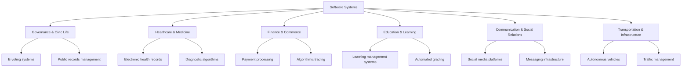
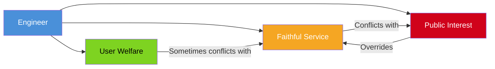
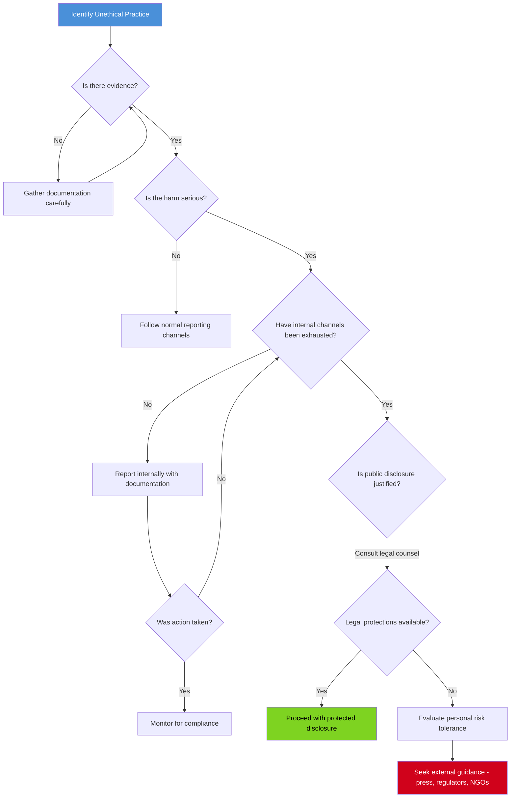
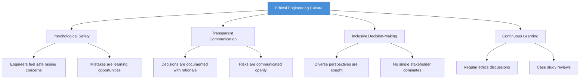

# Professional Ethics for Software Engineers

## 📖 Description

Software engineers wield extraordinary influence over the fabric of modern society — from the algorithms that shape public discourse to the systems that manage critical infrastructure. This document examines the ethical obligations, decision-making frameworks, and professional standards that govern the practice of software engineering, establishing that ethical conduct is not an ancillary concern but a foundational competency of the profession.

## 📋 Prerequisites

- [What Is a Software Engineer?](what-is-a-software-engineer.md) — understanding the role, responsibilities, and societal position of software engineers
- [What Is Ethics?](../../philosophy/ethics/intro/what-is-ethics.md) — philosophical foundations of ethical reasoning, moral frameworks, and normative ethics

## 🗂️ Table of Contents

- [The Societal Impact of Software](#-the-societal-impact-of-software)
- [The ACM Code of Ethics](#-the-acm-code-of-ethics)
- [Professional Responsibility](#-professional-responsibility)
- [Privacy and Data Ethics](#-privacy-and-data-ethics)
- [Algorithmic Fairness and Bias](#-algorithmic-fairness-and-bias)
- [Security Ethics](#-security-ethics)
- [Intellectual Property](#-intellectual-property)
- [Whistleblowing](#-whistleblowing)
- [The Ethics of Artificial Intelligence](#-the-ethics-of-artificial-intelligence)
- [Ethical Decision-Making Frameworks](#-ethical-decision-making-frameworks)
- [Building Ethical Culture in Teams](#-building-ethical-culture-in-teams)
- [Case Studies](#-case-studies)

---

## 🌍 The Societal Impact of Software

Software is no longer a peripheral tool adopted by willing participants — it is the infrastructure through which modern life is conducted. Banking, healthcare, transportation, education, governance, and personal relationships are all mediated by software systems. This ubiquity confers upon software engineers a responsibility that extends far beyond the technical correctness of their code.

The principle of stewardship — that one is entrusted with influence not for personal gain but for the flourishing of others — provides a useful philosophical lens. When an engineer designs a system that processes medical records or manages financial transactions, the decisions embedded in that system shape the lived experience of millions.

The following diagram illustrates the breadth of software's reach into societal systems:



The critical insight is that software engineers are not merely technicians implementing specifications — they are architects of systems that mediate human experience. Every design decision, from data retention policies to interface layouts, encodes values.

## 📜 The ACM Code of Ethics

The Association for Computing Machinery (ACM) published its Code of Ethics and Professional Conduct in 1992, with a significant revision in 2018. This code represents the most widely recognized ethical standard in the computing profession and serves as both a normative guide and a professional benchmark.

### Core Principles

The ACM Code articulates several fundamental principles:

1. **Contribute to society and human well-being.** Computing professionals have a duty to improve the lives of those affected by their work. This principle establishes that the primary beneficiary of professional practice is the public, not the employer or the engineer.

2. **Avoid harm.** Software engineers must anticipate the potential consequences of their work and take measures to prevent foreseeable harms. This includes not only direct physical harm but also psychological, social, and economic harm.

3. **Be honest and trustworthy.** Transparency in professional dealings is a non-negotiable obligation. This includes accurate representation of one's qualifications, honest communication about system limitations, and truthful disclosure of risks.

4. **Be fair and take action not to discriminate.** The principles of equity and non-discrimination apply to every stage of the software development lifecycle, from requirements gathering to deployment.

5. **Respect intellectual property.** Proper attribution, adherence to licensing terms, and protection of proprietary information are core professional duties.

6. **Respect privacy.** The collection, storage, and dissemination of personal data must be governed by strict principles of consent, necessity, and proportionality.

7. **Honor confidentiality.** Information entrusted to professionals in the course of their work must be protected from unauthorized disclosure.

### Applying the ACM Code

The ACM Code is not a rigid rulebook but a framework for professional judgment. Its application requires contextual reasoning — the same principle may yield different actions depending on the circumstances.

```python
def evaluate_professional_action(action, context):
    """
    Evaluate a proposed professional action against ACM Code principles.
    Returns a structured assessment for ethical review.
    """

    principles = {
        "society_wellbeing": {
            "description": "Contributes to society and human well-being",
            "weight": 0.25,
        },
        "avoid_harm": {
            "description": "Avoids harm to stakeholders",
            "weight": 0.25,
        },
        "honesty_trust": {
            "description": "Maintains honesty and trustworthiness",
            "weight": 0.20,
        },
        "fairness": {
            "description": "Is fair and non-discriminatory",
            "weight": 0.15,
        },
        "privacy": {
            "description": "Respects privacy of individuals",
            "weight": 0.15,
        },
    }

    assessment = {}
    for key, principle in principles.items():
        score = rate_action_against_principle(action, key, context)
        assessment[key] = {
            "principle": principle["description"],
            "score": score,  # -1 (violates) to +1 (fulfills)
            "weight": principle["weight"],
        }

    weighted_score = sum(
        entry["score"] * entry["weight"] for entry in assessment.values()
    )

    if weighted_score < -0.3:
        recommendation = "REJECT — action violates core ethical principles"
    elif weighted_score < 0.0:
        recommendation = "REVISE — action requires modification to meet ethical standards"
    elif weighted_score < 0.5:
        recommendation = "PROCEED WITH CAUTION — action is acceptable but could be improved"
    else:
        recommendation = "APPROVE — action aligns with professional ethical standards"

    return {
        "action": action,
        "assessment": assessment,
        "weighted_score": round(weighted_score, 3),
        "recommendation": recommendation,
    }


def rate_action_against_principle(action, principle_key, context):
    """
    Rate an action against a specific ethical principle.
    In practice, this would involve stakeholder analysis,
    precedent review, and expert consultation.
    """
    # Implementation would involve structured ethical analysis
    # For each principle: who benefits, who is harmed, is harm proportional
    # to benefit, are less harmful alternatives available, does this set a precedent
    raise NotImplementedError("Requires contextual ethical analysis")
```

The weighted scoring model above is illustrative — real ethical evaluation cannot be reduced to a formula. However, the structure highlights several important considerations: the multiplicity of principles at stake, the need for systematic evaluation, and the recognition that ethical judgment is a deliberate practice rather than an intuitive reflex.

## 🤝 Professional Responsibility

Professional responsibility in software engineering extends across three primary stakeholder groups: employers, users, and the public. These obligations sometimes conflict, and navigating these conflicts is among the most demanding aspects of professional practice.

### Responsibility to Employers

Software engineers owe their employers faithful service, honest communication, and competent performance. This includes:

- Delivering work that meets agreed-upon specifications and quality standards
- Protecting proprietary information and trade secrets
- Disclosing conflicts of interest
- Representing capabilities and timelines accurately
- Using company resources responsibly

However, this obligation is not unconditional. Loyalty to an employer does not override the duty to avoid harm to the public. An engineer who is asked to implement a system known to be defective, deceptive, or dangerous has a professional obligation to refuse and, if necessary, to escalate the concern.

### Responsibility to Users

Users of software systems are entitled to:

- **Functional reliability.** Software should perform as represented, without undisclosed defects that could cause harm.
- **Informed consent.** Users should understand what data is collected, how it is used, and what risks are associated with the system.
- **Accessible design.** Software should be usable by individuals with diverse abilities and in diverse contexts.
- **Recourse.** When things go wrong, users should have access to support, correction, and redress.

### Responsibility to the Public

The public interest obligation is the most expansive and the most frequently neglected. Software engineers must consider:

- The systemic effects of the systems they build
- The potential for misuse of the tools they create
- The long-term consequences of architectural decisions
- The distribution of benefits and harms across society

The following diagram summarizes the tripartite responsibility structure:



The hierarchy is clear: when employer interests conflict with public welfare, the public interest takes precedence. This is not a theoretical abstraction — it is the defining ethical challenge of a profession whose work operates at societal scale.

## 🔐 Privacy and Data Ethics

Privacy is not merely a legal compliance concern — it is a fundamental expression of human dignity. The capacity to control information about oneself is essential to autonomy, and the erosion of privacy represents a diminishment of personhood.

### Data Collection Principles

Ethical data collection adheres to several foundational principles:

1. **Minimization.** Collect only the data necessary for the specified purpose. The temptation to collect data preemptively — in case it proves useful later — must be resisted as a matter of professional discipline.

2. **Consent.** Individuals must be informed about what data is collected and how it will be used, and they must provide affirmative consent. Consent obtained through dark patterns, buried terms of service, or manipulative interface design is not genuine consent.

3. **Purpose limitation.** Data collected for one purpose must not be repurposed without renewed consent. The slippery slope from "analytics" to "surveillance" is well-documented.

4. **Retention limits.** Data should be retained only for as long as necessary. The default of indefinite retention is ethically indefensible.

5. **Security.** Collected data must be protected against unauthorized access, breach, and misuse. The engineer's obligation to secure data is proportional to its sensitivity.

### The Privacy Spectrum

Privacy concerns exist on a spectrum from individual to collective:

```python
def classify_privacy_impact(data_type, scope, retention, sensitivity):
    """
    Classify the privacy impact of a data handling practice.
    Returns: Privacy impact level and recommended safeguards.
    """

    sensitivity_scores = {
        "low": 1, "medium": 2, "high": 3, "critical": 4
    }
    retention_scores = {
        "session": 1, "short_term": 2,
        "long_term": 3, "indefinite": 4
    }
    type_scores = {
        "aggregate": 1, "behavioral": 2,
        "personal": 3, "biometric": 4
    }

    impact = (
        sensitivity_scores[sensitivity] * 2
        + retention_scores[retention]
        + type_scores[data_type]
    )

    if scope == "population":
        impact += 2
    elif scope == "group":
        impact += 1

    if impact >= 14:
        level = "CRITICAL"
        safeguards = [
            "Requires independent ethical review board approval",
            "Mandatory data protection impact assessment",
            "Strict purpose limitation with audit trail",
            "Encryption at rest and in transit",
            "Regular penetration testing and security audits",
            "Right to deletion must be guaranteed",
        ]
    elif impact >= 10:
        level = "HIGH"
        safeguards = [
            "Requires management-level ethical review",
            "Data protection impact assessment recommended",
            "Access controls with principle of least privilege",
            "Retention policy with defined deletion schedule",
        ]
    elif impact >= 6:
        level = "MEDIUM"
        safeguards = [
            "Standard consent and notification requirements",
            "Role-based access controls",
            "Regular data handling reviews",
        ]
    else:
        level = "LOW"
        safeguards = [
            "Standard security practices",
            "Minimal data collection",
        ]

    return {
        "impact_level": level,
        "impact_score": impact,
        "recommended_safeguards": safeguards,
    }


# Example assessments
assessments = [
    classify_privacy_impact("biometric", "population", "indefinite", "critical"),
    classify_privacy_impact("behavioral", "individual", "session", "low"),
]

for a in assessments:
    print(f"Impact: {a['impact_level']} (score: {a['impact_score']})")
    for safeguard in a["recommended_safeguards"]:
        print(f"  - {safeguard}")
    print()
```

The concept of stewardship is particularly relevant to data ethics. The data entrusted to software engineers represents real human lives — preferences, habits, vulnerabilities, and relationships. The temptation to treat data as a commodity to be exploited is strong, but the professional obligation is to treat it as a trust to be guarded.

## ⚖️ Algorithmic Fairness and Bias

Software systems increasingly make or inform decisions that affect people's access to employment, credit, housing, healthcare, and justice. When these systems encode bias — whether through flawed training data, unrepresentative samples, or unjustifiable proxy variables — they perpetuate and amplify structural inequities.

### Sources of Bias

Bias in software systems arises from multiple sources:

1. **Historical bias.** Training data reflects past discrimination. A hiring algorithm trained on historical hiring decisions will reproduce the patterns of bias embedded in those decisions.

2. **Representation bias.** When certain populations are underrepresented in training data, the system performs poorly for those groups. Facial recognition systems that fail for dark-skinned individuals are a well-documented example.

3. **Measurement bias.** The proxies used to measure a concept may systematically distort it. Using "number of arrests" as a proxy for "criminal tendency" conflates enforcement patterns with actual behavior.

4. **Aggregation bias.** Assumptions that a single model can adequately serve diverse populations may itself be a form of bias. Health risk models calibrated on one demographic may not transfer to others.

5. **Deployment bias.** A system designed for one context may cause harm when deployed in another, even if it performed fairly in its original setting.

### Mitigation Strategies

```python
def audit_algorithm_for_bias(model, test_data, protected_attributes):
    """
    Audit a machine learning model for fairness across protected groups.
    This framework evaluates multiple fairness metrics.
    """

    results = {}
    groups = test_data.groupby(protected_attributes)

    # Demographic parity: equal positive prediction rates
    positive_rates = {}
    for group_name, group_data in groups:
        predictions = model.predict(group_data)
        positive_rates[group_name] = predictions.mean()

    max_rate = max(positive_rates.values())
    min_rate = min(positive_rates.values())
    results["demographic_parity"] = {
        "rates": positive_rates,
        "disparity_ratio": min_rate / max_rate if max_rate > 0 else 0,
        "threshold_met": (min_rate / max_rate) >= 0.8 if max_rate > 0 else False,
    }

    # Equal opportunity: equal true positive rates
    true_positive_rates = {}
    for group_name, group_data in groups:
        predictions = model.predict(group_data)
        actuals = group_data["label"]
        true_positives = ((predictions == 1) & (actuals == 1)).sum()
        actual_positives = (actuals == 1).sum()
        true_positive_rates[group_name] = (
            true_positives / actual_positives if actual_positives > 0 else 0
        )

    results["equal_opportunity"] = {
        "rates": true_positive_rates,
    }

    # Overall assessment
    all_metrics_satisfied = (
        results["demographic_parity"]["threshold_met"]
    )
    results["overall_fairness"] = "PASS" if all_metrics_satisfied else "REQUIRES REVIEW"

    return results
```

The mathematical impossibility theorems of fairness — demonstrating that certain fairness criteria cannot be simultaneously satisfied — underscore that bias mitigation is not a technical puzzle with a single solution. It requires value judgments about which forms of fairness are most important in a given context. These are ethical decisions, not engineering decisions, and they must be made with appropriate deliberation and stakeholder input.

## 🛡️ Security Ethics

Security engineering involves a distinctive set of ethical challenges, particularly around the dual-use nature of security knowledge and the obligations surrounding vulnerability disclosure.

### Responsible Disclosure

When a software engineer discovers a security vulnerability, they face a decision with significant ethical dimensions. The responsible disclosure process balances the interests of multiple parties:

1. **Discovery.** The engineer identifies a vulnerability through authorized testing, security research, or偶然 discovery during normal work.

2. **Reporting.** The vulnerability is reported privately to the vendor or maintainer, providing sufficient detail for reproduction and remediation.

3. **Remediation period.** A reasonable period is allowed for the vendor to develop and deploy a fix. Industry convention suggests 90 days, though this varies by severity and context.

4. **Public disclosure.** After the remediation period, or if the vendor fails to act, public disclosure may be warranted to protect users who remain vulnerable.

The ethical tension is genuine: premature disclosure exposes users to exploitation, while delayed disclosure allows vendors to defer remediation indefinitely. The software engineer must weigh these competing harms with care.

### The Hacker Ethic and Professional Ethics

The "hacker ethic" — emphasizing curiosity, meritocracy, information freedom, and反对权威 — has contributed valuable ideals to computing culture. However, its application must be tempered by professional obligations. The freedom to explore and understand systems does not extend to unauthorized access, data theft, or disruption of service.

```python
def evaluate_security_disclosure(vulnerability, vendor_response, user_risk):
    """
    Framework for evaluating security disclosure decisions.
    """

    severity_levels = {
        "critical": {"max_disclosure_days": 30, "public_interest": "high"},
        "high": {"max_disclosure_days": 60, "public_interest": "high"},
        "medium": {"max_disclosure_days": 90, "public_interest": "medium"},
        "low": {"max_disclosure_days": 120, "public_interest": "low"},
    }

    severity = vulnerability["severity"]
    days_since_report = vendor_response["days_since_report"]
    fix_available = vendor_response["fix_available"]
    active_exploitation = user_risk["known_exploits"]

    config = severity_levels[severity]

    if fix_available:
        return "PUBLISH — vendor has remediated; inform users to update"

    if active_exploitation and days_since_report > 14:
        return "URGENT DISCLOSURE — active exploitation warrants immediate public notice"

    if days_since_report > config["max_disclosure_days"]:
        if vendor_response["communicated"]:
            return "DISCLOSE — remediation period exceeded; public interest in protection"
        else:
            return "ESCALATE — attempt direct communication before disclosure"

    return "WAIT — remediation period ongoing; monitor vendor progress"


# Example scenario
vuln = {"severity": "high", "type": "remote_code_execution"}
vendor = {
    "days_since_report": 75,
    "fix_available": False,
    "communicated": True,
}
risk = {"known_exploits": True}

decision = evaluate_security_disclosure(vuln, vendor, risk)
print(f"Decision: {decision}")
```

## 📄 Intellectual Property

Software exists within a complex intellectual property landscape that includes copyright, patents, trade secrets, and open source licensing. Understanding these frameworks is both a legal necessity and an ethical obligation.

### Open Source Licensing

Open source licenses fall along a spectrum of permissiveness and obligation:

| License Type | Obligations | Ethical Dimension |
|---|---|---|
| **Public Domain / CC0** | None | Maximum freedom; no reciprocity requirement |
| **MIT / BSD** | Attribution | Minimal burden; encourages adoption |
| **Apache 2.0** | Attribution, patent grant | Protects against patent claims |
| **LGPL** | Attribution, modified source for LGPL components | Ensures library improvements remain open |
| **GPL / AGPL** | Attribution, derivative works under same license | Ensures commons is not enclosed |

The ethical dimension of license choice is often overlooked. Choosing a permissive license when a copyleft license would better protect the community's interests — or vice versa — is a value-laden decision. The engineer who incorporates GPL-licensed code into proprietary software without respecting the license terms is not merely committing a legal violation; they are breaching a trust.

### Code Ownership and Attribution

Proper attribution of code — whether from open source projects, colleagues, or AI-assisted generation tools — is a matter of professional integrity. The increasing prevalence of AI-generated code introduces new questions about authorship, liability, and the boundaries of intellectual contribution.

## 📢 Whistleblowing

Whistleblowing — the act of reporting unethical or illegal practices within one's organization — is among the most difficult ethical actions a software engineer may be called upon to perform. It carries significant personal risk, including professional retaliation, legal liability, and social ostracism.

### When to Report

The decision to blow the whistle should be guided by several criteria:

1. **Seriousness of the harm.** The practice must pose significant risk to public welfare, safety, or rights. Minor policy violations or management disagreements do not warrant whistleblowing.

2. **Evidence.** The engineer must have substantial evidence of the practice, not merely suspicion. Documenting concerns systematically is essential.

3. **Exhaustion of internal channels.** Whistleblowing should generally be a last resort, undertaken only after internal reporting mechanisms have failed to produce action.

4. **Proportionality.** The potential public benefit of disclosure must outweigh the potential harm to the organization and to the whistleblower.



The philosophical concept of moral courage — the willingness to act rightly despite personal risk — is directly relevant here. The engineer who remains silent in the face of serious ethical violations becomes complicit in the harm. However, the decision to act must be made with clear eyes about the consequences and with appropriate support.

## 🤖 The Ethics of Artificial Intelligence

The rapid advancement of artificial intelligence and machine learning systems introduces ethical challenges that extend beyond traditional software engineering concerns. AI systems exhibit capabilities — pattern recognition, natural language generation, autonomous decision-making — that raise fundamental questions about transparency, accountability, and the boundaries of automation.

### Transparency and Explainability

AI systems, particularly deep learning models, often operate as "black boxes" — producing outputs without human-interpretable explanations of their reasoning. This opacity poses ethical problems:

- **Accountability.** When an AI system makes a consequential decision, who is responsible for the outcome? The engineer who built it, the organization that deployed it, or the system itself?
- **Due process.** Individuals affected by AI decisions are entitled to understand the basis for those decisions and to contest them.
- **Trust.** Public trust in AI systems depends on the ability to verify that they operate fairly and in accordance with stated principles.

### Autonomy and Human Oversight

The question of how much autonomy to grant AI systems is fundamentally an ethical question, not a technical one. The following framework evaluates the appropriate level of human oversight:

```python
def determine_oversight_level(task_characteristics):
    """
    Determine the appropriate level of human oversight for an AI task.
    Based on the risk profile and reversibility of outcomes.
    """

    risk_factors = {
        "irreversibility": task_characteristics.get("irreversible", False),
        "physical_safety": task_characteristics.get("affects_physical_safety", False),
        "financial_impact": task_characteristics.get("financial_scale", "none"),
        "rights_impact": task_characteristics.get("affects_human_rights", False),
        "scale": task_characteristics.get("affected_population", "individual"),
    }

    if risk_factors["rights_impact"] or risk_factors["physical_safety"]:
        return {
            "level": "HUMAN-IN-THE-LOOP",
            "description": "Every decision requires human approval before execution",
            "rationale": "Consequences are severe and potentially irreversible",
        }

    if risk_factors["irreversibility"] and risk_factors["scale"] in ("large", "population"):
        return {
            "level": "HUMAN-ON-THE-LOOP",
            "description": "System operates autonomously but human monitors and can intervene",
            "rationale": "Scale amplifies error; human oversight provides safety net",
        }

    if risk_factors["financial_impact"] in ("significant", "critical"):
        return {
            "level": "EXPLAINABILITY REQUIRED",
            "description": "System can operate autonomously but must provide explanations for decisions",
            "rationale": "Financial consequences warrant accountability through transparency",
        }

    return {
        "level": "FULL AUTONOMY ACCEPTABLE",
        "description": "System can operate without direct human oversight",
        "rationale": "Low risk, reversible consequences permit delegation",
    }


# Example evaluations
tasks = [
    {"irreversible": True, "affects_human_rights": True,
     "affected_population": "large"},
    {"irreversible": False, "financial_scale": "significant",
     "affected_population": "individual"},
    {"irreversible": False, "financial_scale": "none",
     "affected_population": "individual"},
]

for task in tasks:
    result = determine_oversight_level(task)
    print(f"Task: {task}")
    print(f"  Oversight: {result['level']}")
    print(f"  {result['description']}")
    print()
```

The principle of human dignity requires that AI systems serve human purposes rather than subordinating human judgment to algorithmic optimization. When an AI system determines eligibility for parole, recommends denial of a mortgage, or triages patients in an emergency department, the stakes are too high for unexamined automation.

## 🧭 Ethical Decision-Making Frameworks

Ethical dilemmas in software engineering rarely have clear-cut solutions. The following frameworks provide structured approaches to deliberation.

### The Four-Way Test

Adapted from the Rotary International tradition, this test applies four questions to any proposed action:

1. Is it **truthful**? Am I being honest with myself and others about the facts and implications?
2. Is it **fair** to all concerned? Have I considered the interests of all stakeholders, not just the most powerful?
3. Is it likely to build **goodwill** and better relationships? Does this action strengthen or erode trust?
4. Is it **beneficial** to all concerned? Does the action produce net positive outcomes?

### Stakeholder Impact Analysis

```python
def stakeholder_impact_analysis(proposed_action, stakeholders):
    """
    Systematically evaluate the impact of a proposed action
    on all identified stakeholders.
    """

    impact_matrix = {}

    for stakeholder in stakeholders:
        name = stakeholder["name"]
        category = stakeholder["category"]  # employer, user, public, peer

        impact_matrix[name] = {
            "category": category,
            "benefits": [],
            "harms": [],
            "rights_affected": [],
            "severity_score": 0,
        }

        # Evaluate benefits
        for benefit in proposed_action.get("benefits", {}).get(name, []):
            impact_matrix[name]["benefits"].append(benefit)

        # Evaluate harms
        for harm in proposed_action.get("harms", {}).get(name, []):
            impact_matrix[name]["harms"].append(harm)

        # Evaluate rights
        for right in proposed_action.get("rights", {}).get(name, []):
            impact_matrix[name]["rights_affected"].append(right)

        # Calculate severity score
        benefits_score = len(impact_matrix[name]["benefits"]) * 1
        harms_score = len(impact_matrix[name]["harms"]) * -2
        rights_score = len(impact_matrix[name]["rights_affected"]) * -3

        impact_matrix[name]["severity_score"] = (
            benefits_score + harms_score + rights_score
        )

    # Overall assessment
    total_severity = sum(
        entry["severity_score"] for entry in impact_matrix.values()
    )

    most_harmed = min(impact_matrix.items(), key=lambda x: x[1]["severity_score"])
    most_benefited = max(impact_matrix.items(), key=lambda x: x[1]["severity_score"])

    return {
        "impact_matrix": impact_matrix,
        "total_severity": total_severity,
        "most_harmed": most_harmed[0],
        "most_benefited": most_benefited[0],
        "recommendation": (
            "PROCEED" if total_severity >= 0 else "RECONSIDER — net harm detected"
        ),
    }
```

### Virtue Ethics and Professional Character

Beyond rule-based and consequence-based approaches, virtue ethics asks: what kind of professional am I becoming through this action? The virtues relevant to software engineering include:

- **Intellectual honesty.** Reporting results accurately, acknowledging uncertainty, and resisting pressure to misrepresent findings.
- **Technical courage.** The willingness to advocate for sound engineering practices even when inconvenient.
- **Humility.** Recognizing the limits of one's knowledge and seeking input from diverse perspectives.
- **Stewardship.** Treating entrusted resources — data, systems, user trust — with care and responsibility.
- **Justice.** Distributing benefits and burdens fairly, and actively working against discrimination.

The concept of character formation — that habitual action shapes dispositions — is directly relevant. The engineer who repeatedly makes ethical compromises develops a character disposed toward compromise. Conversely, the engineer who consistently acts with integrity develops a character disposed toward integrity. Ethics is not merely about individual decisions; it is about the professional one is becoming.

## 🏢 Building Ethical Culture in Teams

Individual ethical judgment is necessary but insufficient. Ethical conduct must be embedded in organizational culture, processes, and incentives.

### Structural Mechanisms

1. **Ethics review boards.** Regular review of high-risk projects by a diverse panel that includes non-engineering perspectives.

2. **Blameless postmortems.** When ethical failures occur, focus on systemic causes and corrective action rather than individual punishment.

3. **Ethical requirements.** Just as functional requirements specify what software should do, ethical requirements should specify what values the software must uphold.

4. **Incentive alignment.** Performance evaluations, promotion criteria, and project success metrics should incorporate ethical considerations.

### Cultural Practices



The concept of community — that individuals flourish in relationship with others and bear responsibility for the health of their communities — provides a philosophical foundation for team-based ethical practice. An ethical culture is cultivated through shared commitment, honest dialogue, and mutual accountability.

## 📚 Case Studies

### Case Study 1: The Social Media Amplification Algorithm

A social media platform's engineering team is asked to optimize an engagement algorithm to maximize time-on-site. Internal research suggests that the current algorithm disproportionately amplifies emotionally provocative content, including misinformation and inflammatory material. The engineering team is aware of this pattern but faces pressure to meet engagement targets.

**Ethical dimensions:** The tension between employer interests (engagement metrics) and public welfare (information quality, democratic discourse, mental health). The engineer's obligation to advocate for users who are affected by the system but have no voice in its design.

**Framework application:** A stakeholder impact analysis reveals that while the employer benefits from increased engagement, users and the broader public bear significant harms. The virtuous action is to advocate for algorithmic modifications that account for information quality, even at the cost of short-term engagement metrics.

### Case Study 2: The Predictive Policing System

An engineering team develops a predictive policing system for a municipal government. The system uses historical crime data to allocate police resources. Internal analysis reveals that the system disproportionately targets minority neighborhoods, reinforcing existing patterns of over-policing. The municipality wishes to deploy the system as designed.

**Ethical dimensions:** Algorithmic bias, the use of historical data that reflects past discrimination, the distribution of harm across communities, and the engineer's responsibility when a client insists on deploying a biased system.

**Framework application:** The algorithmic fairness audit reveals significant demographic disparity. The engineer has an obligation to inform the municipality of these findings, recommend bias mitigation measures, and — if the municipality insists on deployment without correction — consider the limits of professional complicity.

### Case Study 3: The Vulnerable Dependency

An engineering team discovers that a widely-used open source library in their production system contains a security vulnerability. The library is maintained by a single volunteer who has not responded to emails in months. There is no known exploit, but the vulnerability could allow remote code execution. The team must decide how to allocate resources to address the issue.

**Ethical dimensions:** Responsibility to users (who are exposed to risk), the ethics of relying on unpaid volunteer labor for critical infrastructure, and the sustainability of the open source ecosystem.

**Framework application:** The responsible action is to develop an internal fix, contribute it to the open source project, and advocate for organizational investment in open source infrastructure.

---

## 💡 Learning Tips

- Study the ACM Code of Ethics thoroughly — it provides the professional foundation for ethical reasoning in computing. The full text is freely available at https://www.acm.org/code-of-ethics.
- Practice ethical reasoning by applying the frameworks presented here to real-world scenarios in technology news. Deliberate practice builds the habit of ethical reflection.
- Discuss ethical dilemmas with peers. Ethical reasoning improves through dialogue, exposure to diverse perspectives, and the articulation of one's own reasoning process.
- Maintain an ethical journal documenting situations where you faced or observed ethical tensions. Retrospective analysis reveals patterns and strengthens future judgment.
- Read case law and regulatory decisions related to technology ethics. The legal landscape provides concrete examples of how ethical failures translate into real consequences.

## 📖 Glossary

| Term | Definition |
|------|------------|
| **ACM Code of Ethics** | The professional code of conduct published by the Association for Computing Machinery, establishing ethical standards for computing professionals |
| **Algorithmic bias** | Systematic and repeatable errors in a computer system that create unfair outcomes for specific groups |
| **Algorithmic fairness** | The principle that automated decision-making systems should treat individuals and groups equitably |
| **Dark pattern** | Interface design that manipulates users into unintended actions, typically against their interests |
| **Data minimization** | The principle that data collection should be limited to what is necessary for the specified purpose |
| **Demographic parity** | A fairness metric requiring that prediction rates be equal across demographic groups |
| **Explainability** | The degree to which an AI system's decision-making process can be understood by humans |
| **Human-in-the-loop** | A system configuration where human approval is required for each decision or action |
| **Human-on-the-loop** | A system configuration where humans monitor and can intervene in automated processes |
| **Intellectual property** | Legal rights arising from creative or inventive work, including copyright, patents, and trade secrets |
| **Open source** | Software whose source code is made available for anyone to inspect, modify, and distribute under defined licensing terms |
| **Privacy impact assessment** | A systematic evaluation of how a project or system handles personal data and what risks it poses to privacy |
| **Responsible disclosure** | The practice of reporting security vulnerabilities privately to vendors before public disclosure |
| **Stakeholder** | Any individual or group affected by a software system's design, deployment, or outcomes |
| **Virtue ethics** | An ethical framework focusing on the character of the moral agent rather than rules or consequences |

## 🔗 Quick References

- [ACM Code of Ethics and Professional Conduct](https://www.acm.org/code-of-ethics) — the definitive professional ethical standard for computing practitioners
- [IEEE Ethically Aligned Design](https://ethicsinaction.ieee.org/) — a comprehensive framework for ethical considerations in autonomous and intelligent systems
- [Partnership on AI](https://partnershiponai.org/) — a multi-stakeholder organization developing best practices for AI ethics and governance
- [EFF Digital Freedom Principles](https://www.eff.org/deeplinks) — resources on digital rights, privacy, and the ethical dimensions of technology policy
- [Open Source Initiative License List](https://opensource.org/licenses) — comprehensive catalog of open source licenses and their obligations
- [Algorithm Watch](https://algorithmwatch.org/) — research and advocacy organization focused on algorithmic accountability

## ➡️ Next Steps

- [Responsibilities & Daily Work](responsibilities-and-daily-work.md) — how ethical principles apply in the day-to-day practice of software engineering
- [What Is Stoicism?](../../philosophy/stoicism/intro/what-is-stoicism.md) — character, virtue, and resilience as foundations for professional integrity
- [Types & Specializations](types-and-specializations.md) — how ethical considerations vary across software engineering domains
