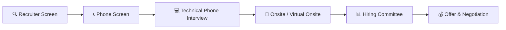
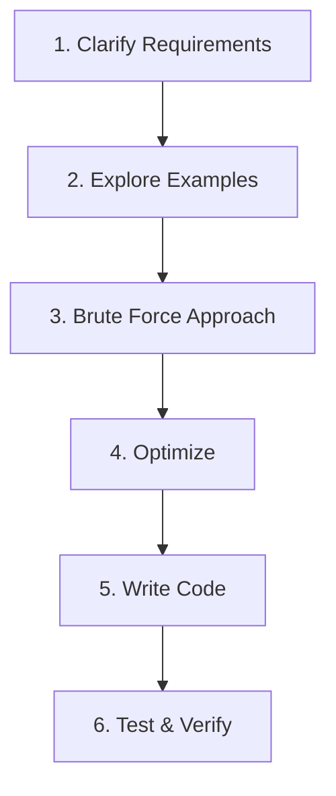
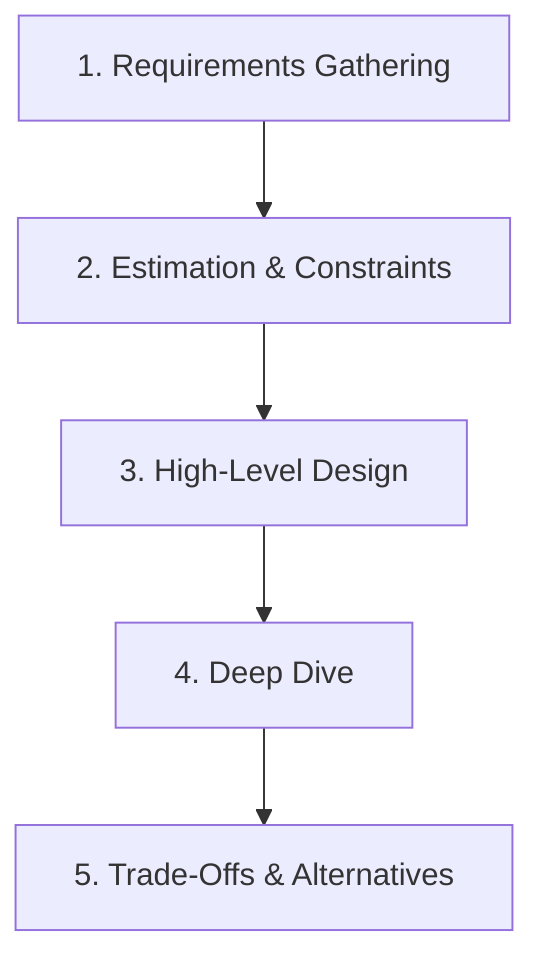
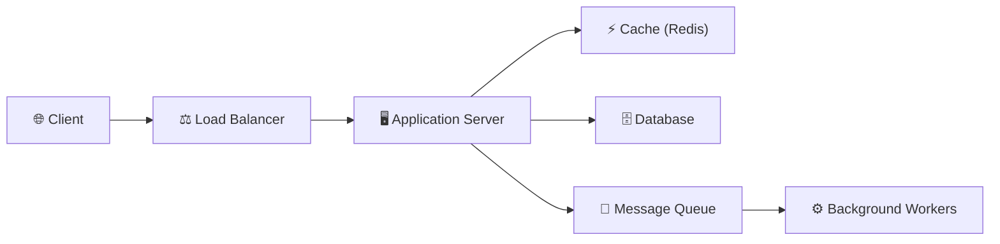

# Interview Preparation

## Description

The software engineering interview is a structured evaluation process that assesses technical competence, problem-solving ability, and professional maturity. This document provides a comprehensive framework for understanding and preparing for each stage — from the initial recruiter screening through the technical rounds, behavioral assessment, and offer negotiation. It describes what companies evaluate, how they evaluate it, and how candidates at different career levels should prepare.

## Prerequisites

- [What Is a Software Engineer?](what-is-a-software-engineer.md) — defines the role, its responsibilities, and the engineering mindset that interviewers expect to observe
- [Core Computer Science](core-computer-science.md) — provides the data structures and algorithms knowledge that forms the basis of technical interview questions
- [Career Progression](career-progression.md) — explains the level system that determines what each interview round expects from candidates

## Table of Contents

- [The Hiring Process](#the-hiring-process)
- [Data Structures and Algorithms Interviews](#data-structures-and-algorithms-interviews)
- [System Design Interviews](#system-design-interviews)
- [Behavioral Interviews](#behavioral-interviews)
- [Coding Challenges and Take-Home Assignments](#coding-challenges-and-take-home-assignments)
- [What Interviewers Actually Evaluate](#what-interviewers-actually-evaluate)
- [Interview Preparation Timeline](#interview-preparation-timeline)
- [Common Mistakes and How to Avoid Them](#common-mistakes-and-how-to-avoid-them)
- [Negotiation Fundamentals](#negotiation-fundamentals)
- [How Interviews Differ by Level](#how-interviews-differ-by-level)
- [Glossary](#glossary)
- [Quick References](#quick-references)
- [Next Steps](#next-steps)

## Content / Material

### 🔄 The Hiring Process

Software engineering hiring follows a predictable pipeline. Understanding each stage eliminates surprise and enables strategic preparation.



**Stage 1: Recruiter Screen (15–30 minutes)**

The recruiter screen is a logistics and motivation filter. The recruiter confirms that your experience aligns with the role, verifies salary expectations, assesses timeline urgency, and evaluates communication clarity. This is not a technical assessment. The recruiter will ask about your current role, why you are looking for a change, what you are looking for in your next position, and whether you have any competing offers.

The recruiter also serves as your advocate inside the company. A strong impression here means the recruiter will champion your candidacy through the subsequent stages. Treat this conversation as a professional dialogue, not an interrogation.

**Stage 2: Phone Screen (30–45 minutes)**

The phone screen is typically conducted by a hiring manager or senior engineer. It combines a brief technical assessment — usually one or two coding problems of moderate difficulty — with a discussion of your background. The technical portion is shorter than an onsite round, designed to confirm baseline competence rather than probe for mastery.

Some companies replace this with a video call that focuses on behavioral questions and technical overview. The format varies, but the purpose remains constant: determine whether the candidate warrants the investment of a full onsite interview loop.

**Stage 3: Technical Phone Interview (45–60 minutes)**

If the phone screen involves coding, this round may be separate or combined. The technical phone interview takes place in a shared coding environment (CoderPad, HackerRank, or a similar tool). The interviewer presents one or two algorithmic problems and observes your approach in real time. This round evaluates problem decomposition, coding fluency, and communication under mild time pressure.

**Stage 4: Onsite / Virtual Onsite (4–6 hours)**

The onsite is the core evaluation. A typical onsite consists of four to six rounds:

| Round | Duration | Focus |
|-------|----------|-------|
| Algorithmic Coding | 45–60 min | Data structures, algorithms, problem solving |
| System Design | 45–60 min | Architecture, scalability, trade-offs |
| Behavioral / Leadership | 30–45 min | Culture fit, conflict resolution, impact |
| Domain-Specific | 30–45 min | Specialized knowledge (ML, security, etc.) |
| Cross-Functional | 30–45 min | Collaboration with product, design, or data |

Some companies include a lunch round — a casual conversation with a potential teammate designed to assess team dynamics rather than technical skill.

**Stage 5: Hiring Committee and Decision**

After the onsite, interviewers submit independent written evaluations before meeting as a committee. This independence prevents groupthink and ensures each dimension of the evaluation receives fair weight. The committee reviews all feedback, discusses borderline cases, and makes one of four decisions: strong hire, hire, no hire, or strong no hire.

**Stage 6: Offer and Negotiation**

If the committee recommends hire, the recruiter contacts you with a verbal offer, followed by a written package. This stage is covered in detail in the [Negotiation Fundamentals](#negotiation-fundamentals) section below.

---

### 🧮 Data Structures and Algorithms Interviews

Algorithmic interviews remain the most common and most dreaded component of the software engineering hiring process. They test whether you can reason about problems systematically, translate thought into code, and identify efficient solutions under constraint.

#### The Problem-Solving Framework

Every algorithmic problem should be approached with the same structured methodology:



**Step 1: Clarify Requirements**

Before writing any code, ask questions. What is the input? What is the output? Are there constraints on time or space? Are edge cases specified? Can the input be empty, null, or contain negative values? A candidate who begins coding without clarifying requirements demonstrates a dangerous habit — the tendency to solve the wrong problem efficiently.

**Step 2: Explore Examples**

Walk through concrete examples by hand. Start with a simple case, then try an edge case. This step often reveals subtleties the problem description glosses over. The interviewer is observing whether you think systematically or jump to implementation.

**Step 3: State the Brute Force Approach**

Articulate the most obvious solution, even if it is inefficient. This serves two purposes: it guarantees you have a working baseline, and it demonstrates that you understand the problem well enough to identify the naive approach. State its time and space complexity explicitly.

**Step 4: Optimize**

Identify patterns that reduce complexity. Common optimization strategies include:

| Pattern | Technique | Time Savings |
|---------|-----------|--------------|
| Hashing | Replace nested loops with hash map lookup | O(n²) → O(n) |
| Sorting | Sort first, then scan linearly | O(n²) → O(n log n) |
| Two Pointers | Inward/outward scan on sorted input | O(n²) → O(n) |
| Sliding Window | Maintain a moving subset over a sequence | O(n²) → O(n) |
| Binary Search | Eliminate half the search space per iteration | O(n) → O(log n) |
| Dynamic Programming | Cache subproblem results to avoid recomputation | Exponential → polynomial |
| Graph Traversal | BFS/DFS to explore connectivity or shortest paths | Problem-dependent |

**Step 5: Write Clean Code**

Implement the optimized solution with clear variable names, proper structure, and no premature optimization. Narrate your code as you write it. The interviewer needs to follow your logic; silent coding creates anxiety for both parties.

**Step 6: Test and Verify**

Trace through your solution with the examples from Step 2. Then test with at least one edge case. Verify that your time and space complexity claims match the actual implementation. A candidate who catches their own bug during testing demonstrates maturity; a candidate who does not test at all demonstrates carelessness.

#### Problem Categories

Algorithmic interview problems fall into recurring categories. Mastering the patterns within each category is more valuable than memorizing individual solutions.

```python
# Category: Array Manipulation — Two Sum Pattern
# Given an array of integers and a target, find two numbers that sum to target.

def two_sum(nums: list[int], target: int) -> tuple[int, int]:
    seen: dict[int, int] = {}
    for i, num in enumerate(nums):
        complement = target - num
        if complement in seen:
            return (seen[complement], i)
        seen[num] = i
    return (-1, -1)
# Time: O(n) | Space: O(n)
# Key insight: hashing transforms a search problem from O(n²) to O(n).
```

```python
# Category: String Manipulation — Sliding Window
# Find the length of the longest substring without repeating characters.

def longest_unique_substring(s: str) -> int:
    char_index: dict[str, int] = {}
    max_length = 0
    window_start = 0
    for window_end, char in enumerate(s):
        if char in char_index and char_index[char] >= window_start:
            window_start = char_index[char] + 1
        char_index[char] = window_end
        max_length = max(max_length, window_end - window_start + 1)
    return max_length
# Time: O(n) | Space: O(min(n, alphabet_size))
# Key insight: the sliding window avoids recomputing from scratch for every substring.
```

```python
# Category: Graph Algorithms — Cycle Detection
# Detect whether a directed graph contains a cycle using DFS.

def has_cycle(n: int, edges: list[tuple[int, int]]) -> bool:
    adjacency: dict[int, list[int]] = {i: [] for i in range(n)}
    for u, v in edges:
        adjacency[u].append(v)

    WHITE, GRAY, BLACK = 0, 1, 2
    color = [WHITE] * n

    def dfs(node: int) -> bool:
        color[node] = GRAY
        for neighbor in adjacency[node]:
            if color[neighbor] == GRAY:
                return True  # back edge found — cycle exists
            if color[neighbor] == WHITE and dfs(neighbor):
                return True
        color[node] = BLACK
        return False

    return any(dfs(i) for i in range(n) if color[i] == WHITE)
# Time: O(V + E) | Space: O(V)
# Key insight: the three-color marking scheme (white/gray/black) detects
# back edges in a directed graph, which are the defining signature of cycles.
```

```python
# Category: Dynamic Programming — Longest Common Subsequence
# Given two strings, find the length of their longest common subsequence.

def lcs(s1: str, s2: str) -> int:
    m, n = len(s1), len(s2)
    dp = [[0] * (n + 1) for _ in range(m + 1)]

    for i in range(1, m + 1):
        for j in range(1, n + 1):
            if s1[i - 1] == s2[j - 1]:
                dp[i][j] = dp[i - 1][j - 1] + 1
            else:
                dp[i][j] = max(dp[i - 1][j], dp[i][j - 1])

    return dp[m][n]
# Time: O(m * n) | Space: O(m * n)
# Key insight: the recurrence relation captures the optimal substructure —
# the LCS of two strings depends on the LCS of their prefixes.
```

#### Common Algorithm Categories

| Category | Representative Problems | Core Pattern |
|----------|------------------------|--------------|
| Arrays | Two Sum, Container With Most Water | Hashing, two pointers |
| Strings | Valid Anagram, Longest Substring | Frequency counting, sliding window |
| Linked Lists | Reverse, Detect Cycle, Merge K Lists | Pointer manipulation, fast/slow |
| Trees | Diameter, Lowest Common Ancestor | Recursive traversal, DFS |
| Graphs | Islands, Topological Sort, Dijkstra | BFS/DFS, shortest path |
| Dynamic Programming | Knapsack, Edit Distance, LCS | Memoization, tabulation |
| Sorting & Searching | Merge Intervals, Search Rotated Array | Binary search variants |
| Stacks & Queues | Valid Parentheses, Min Stack | Monotonic stack, LIFO/FIFO |
| Bit Manipulation | Single Number, Counting Bits | XOR, bit masking |

#### Practice Strategy

Algorithmic skill is developed through deliberate practice, not passive reading. The most effective approach is structured problem-solving sessions:

1. **Daily consistency over weekend marathons.** Two hours daily produces more durable skill development than twelve hours on Saturday. The spacing effect — the cognitive science principle that distributed practice outperforms massed practice — applies directly to algorithmic learning.

2. **Solve problems in categories, not randomly.** When studying trees, solve ten tree problems consecutively. Pattern recognition requires repetition. Random problem selection prevents the brain from forming the associative clusters that enable rapid pattern matching.

3. **Time yourself, but not ruthlessly.** Allocate 25 minutes per medium problem and 45 minutes per hard problem. If you exceed the time limit, study the solution deeply — understand every line, then solve a similar problem from scratch the next day.

4. **Explain solutions aloud.** The interview is a communication exercise as much as a technical one. Practice narrating your thought process while solving problems, even when alone. Record yourself if possible. The act of articulating reasoning reveals gaps that silent solving conceals.

---

### 🏗️ System Design Interviews

System design interviews assess whether you can architect large-scale systems under ambiguity. Unlike algorithmic problems, which have single correct answers, system design problems have multiple valid solutions — the evaluation focuses on your reasoning, your ability to make and justify trade-offs, and your breadth of technical knowledge.

#### The System Design Framework



**Step 1: Requirements Gathering (5 minutes)**

Functional requirements define what the system does. Non-functional requirements define how it behaves. Before designing anything, determine:

- What are the core use cases? (e.g., "users can post tweets," "users can see a feed")
- What is the expected scale? (users, requests per second, data volume)
- What are the latency expectations? (real-time vs. batch processing)
- What are the consistency requirements? (strong consistency vs. eventual consistency)
- What are the availability requirements? (99.9% vs. 99.99%)

A candidate who begins drawing boxes without asking questions is demonstrating poor engineering judgment. Requirements constrain the design space; without them, there is no basis for architectural decisions.

**Step 2: Estimation and Constraints (5 minutes)**

Rough back-of-the-envelope calculations establish the scale of the problem. These estimates do not need to be precise — they need to be reasonable. The purpose is to identify whether the system is small enough for a single server or large enough to require distributed systems patterns.

```python
# Estimation Example: URL Shortener
# Assume: 100 million URLs created per day
#         10:1 read-to-write ratio → 1 billion reads per day

requests_per_second = 100_000_000 / 86_400  # ~1,160 writes/sec
read_rps = requests_per_second * 10           # ~11,600 reads/sec

# Storage per year (assuming 500 bytes per URL record)
storage_per_year = 100_000_000 * 500 * 365    # ~18.25 TB/year

# Key takeaway: writes are moderate, reads are heavy.
# Design implication: optimize for read throughput, use caching.
```

**Step 3: High-Level Design (10 minutes)**

Sketch the major components and their interactions. Identify the data model. Draw the request flow from client to database. Label each component with its purpose. Use standard architectural patterns — client → load balancer → application server → cache → database — as a starting point and modify as requirements dictate.



**Step 4: Deep Dive (15 minutes)**

The interviewer will select one or two components and ask you to elaborate. This is where depth is tested. Common deep-dive topics include:

- Database schema design and indexing strategy
- Caching layers and invalidation strategies
- Consistency models and conflict resolution
- API design and protocol choices
- Failure modes and recovery mechanisms

**Step 5: Trade-Offs (5 minutes)**

Explicitly state what you chose, what you sacrificed, and what alternatives exist. Good system design is not about finding the perfect solution — it is about making defensible decisions under constraints. A candidate who can articulate why they chose eventual consistency over strong consistency, or a relational database over a document store, demonstrates the engineering judgment that separates senior engineers from junior ones.

#### Common System Design Patterns

| System | Core Challenge | Key Pattern |
|--------|---------------|-------------|
| URL Shortener | Generate unique short codes at scale | Hashing, base62 encoding, counter-based |
| Chat System | Real-time message delivery, presence | WebSockets, pub/sub, message ordering |
| News Feed | Assemble personalized content feeds | Fan-out on write vs. fan-out on read |
| Payment System | Transaction integrity, idempotency | Two-phase commit, saga pattern |
| Rate Limiter | Throttle requests fairly | Token bucket, sliding window counter |
| Search Engine | Full-text search across billions of documents | Inverted index, MapReduce |
| Notification System | Multi-channel delivery with reliability | Priority queues, retry with backoff |

#### Trade-Off Vocabulary

Develop fluency in articulating trade-offs. The following table maps common dimensions to their opposing poles:

| Dimension A | Dimension B | When to Choose A | When to Choose B |
|-------------|-------------|-------------------|-------------------|
| Consistency | Availability | Financial systems, inventory | Social feeds, analytics |
| Latency | Throughput | Real-time interactions | Batch processing |
| Simplicity | Flexibility | MVPs, early-stage startups | Enterprise, evolving requirements |
| Vertical scaling | Horizontal scaling | Low data volume, simple ops | High volume, fault tolerance needed |
| SQL | NoSQL | Complex joins, ACID transactions | Flexible schema, massive horizontal scale |
| Synchronous | Asynchronous | Immediate confirmation needed | Background processing acceptable |

---

### 🗣️ Behavioral Interviews

Behavioral interviews assess professional maturity, self-awareness, and interpersonal competence. These are not trivia questions — they are structured probes into how you navigate real workplace situations.

#### The STAR Method

Every behavioral answer should follow the STAR structure:

| Component | Duration | Purpose |
|-----------|----------|---------|
| **Situation** | 15–20% | Set context — what was the project, the team, the constraint |
| **Task** | 10–15% | Define your specific responsibility — not the team's, yours |
| **Action** | 50–60% | Describe what you did, step by step, with technical specificity |
| **Result** | 15–20% | Quantify the outcome — metrics, timelines, business impact |

The most common failure in behavioral interviews is providing a Situation and Result without describing Actions. The interviewer does not need to know that the project succeeded — they need to know what you specifically did to make it succeed.

#### Preparing Your Story Bank

Before any interview loop, prepare six to eight stories that collectively cover the behavioral spectrum. Each story should be reusable across multiple question types.

| Story Category | Example Question | What It Demonstrates |
|----------------|------------------|---------------------|
| Technical Conflict | "Tell me about a time you disagreed with a technical decision." | Intellectual humility, evidence-based reasoning |
| Failure | "Describe a project that did not go as planned." | Self-awareness, learning from failure |
| Leadership | "Tell me about a time you influenced without authority." | Persuasion, initiative |
| Ambiguity | "Describe a situation with unclear requirements." | Comfort with uncertainty, structured thinking |
| Collaboration | "Tell me about working with a difficult teammate." | Empathy, conflict resolution |
| Impact | "What is your most significant professional achievement?" | Scope of contribution, business awareness |
| Scope Expansion | "Describe a time you took on responsibility beyond your role." | Growth mindset, ownership |
| Mentorship | "Tell me about a time you helped someone else grow." | Teaching ability, team investment |

#### Common Behavioral Questions

Prepare concise answers (two to three minutes each) for the following questions, which recur across companies:

1. Why are you interested in this company specifically?
2. Why are you leaving your current role?
3. Describe the most technically challenging project you have worked on.
4. Tell me about a time you received critical feedback. How did you respond?
5. Describe a situation where you had to make a trade-off between speed and quality.
6. Tell me about a time you had to push back on a request from a stakeholder.
7. How do you handle competing priorities from different teams?
8. Describe a time you made a mistake that affected your team.

---

### 💻 Coding Challenges and Take-Home Assignments

Some companies supplement or replace the onsite with asynchronous coding challenges or take-home assignments. These formats evaluate different skills than live interviews.

#### Coding Challenges (Timed, Automated)

Platforms like HackerRank, LeetCode, and CodeSignal present timed algorithmic problems with automated evaluation. The constraints differ from live interviews:

- No interviewer to ask clarifying questions — you must interpret the problem statement independently.
- No partial credit for approach — only correct, efficient solutions pass.
- Time pressure is higher — typically 60 to 90 minutes for three to four problems.

**Preparation strategy:** Practice on the exact platform the company uses. Each platform has idiosyncratic input/output formats, testing harnesses, and time limits. Familiarity with the environment eliminates friction that has nothing to do with your technical ability.

#### Take-Home Assignments (Unlimited Time, Typically 2–8 Hours)

Take-home assignments simulate real engineering work: reading requirements, making design decisions, writing production-quality code, and documenting your approach. They typically ask you to build a small functional system — a REST API, a data processing pipeline, a simple frontend application.

**Best practices for take-home assignments:**

- **Read the requirements twice.** The assignment is as much a test of reading comprehension as coding skill. Missing a requirement demonstrates inattention to detail.
- **Commit incrementally.** If the assignment involves a Git repository, commit after each meaningful change. This demonstrates your development process.
- **Write tests.** Even if the assignment does not require them. A candidate who includes tests signals professional discipline.
- **Document your decisions.** A brief README explaining your architecture, your trade-offs, and what you would do with more time demonstrates engineering maturity.
- **Do not over-engineer.** The assignment has a scope. Building beyond the requirements wastes time and signals an inability to scope work. Build exactly what is requested, build it well, and add tests and documentation.

---

### 👁️ What Interviewers Actually Evaluate

Understanding the evaluator's perspective transforms interview preparation from a guessing game into a strategic exercise.

#### Technical Dimensions

| Dimension | What Interviewers Observe | Red Flags |
|-----------|--------------------------|-----------|
| Problem Decomposition | Breaking a large problem into manageable parts | Jumping to implementation without analysis |
| Coding Fluency | Writing correct code without excessive syntax errors | Constantly looking up basic syntax |
| Communication | Narrating thought process clearly | Silent coding, unexplained jumps in logic |
| Testing Mindfulness | Proactively verifying solution with examples | Submitting without any verification |
| Edge Case Awareness | Considering empty inputs, single elements, large inputs | Only testing the happy path |
| Complexity Analysis | Correctly stating and justifying time/space bounds | Inability to analyze complexity |

#### Behavioral Dimensions

| Dimension | What Interviewers Observe | Red Flags |
|-----------|--------------------------|-----------|
| Self-Awareness | Honest assessment of strengths and weaknesses | Claiming to have no weaknesses |
| Growth Orientation | Evidence of learning from past experiences | Blaming others for failures |
| Collaboration | How you describe working with teammates | Using "I" exclusively when describing team projects |
| Ownership | Taking responsibility for outcomes | Deflecting blame or credit |
| Intellectual Curiosity | Genuine interest in technical challenges | Answering "what would you do differently" with "nothing" |

#### The Unspoken Evaluation

Beyond technical and behavioral dimensions, interviewers assess several implicit qualities:

- **Would I want to work with this person?** Team compatibility matters. A brilliant engineer who creates interpersonal friction is a net negative for team productivity.
- **Does this candidate raise the bar?** Companies hire to improve their engineering culture, not merely to fill a seat. Demonstrating practices that elevate the team — code review, documentation, mentoring — signals bar-raising potential.
- **Can this candidate operate independently?** Senior candidates are expected to identify problems without being told what to solve. Junior candidates are expected to ask for help when needed. Both demonstrations of judgment are valued at their respective levels.

---

### 📅 Interview Preparation Timeline

A structured twelve-week preparation plan distributes the workload across distinct phases, preventing burnout and ensuring comprehensive coverage.

#### Weeks 1–3: Foundation

| Activity | Time Commitment | Purpose |
|----------|----------------|---------|
| Review data structures | 1 hour/day | Refresh arrays, linked lists, trees, graphs, hash maps |
| Solve 2–3 easy problems daily | 1–2 hours/day | Build fluency with basic patterns |
| Read "Designing Data-Intensive Applications" (selected chapters) | 1 hour/day | Build system design vocabulary |
| Identify 6–8 behavioral stories and write them out | 2 hours total | Establish your story bank |

#### Weeks 4–6: Pattern Mastery

| Activity | Time Commitment | Purpose |
|----------|----------------|---------|
| Solve 2–3 medium problems daily | 2–3 hours/day | Develop pattern recognition |
| Study one system design topic per day | 1 hour/day | Build design intuition |
| Practice one behavioral mock per week | 1 hour/week | Refine delivery and timing |
| Begin solving hard problems | 1 hour/day | Stretch beyond comfort zone |

#### Weeks 7–9: Integration

| Activity | Time Commitment | Purpose |
|----------|----------------|---------|
| Solve 1 medium and 1 hard daily | 2–3 hours/day | Maintain both fluency and depth |
| Complete 2 full system design mock interviews per week | 2 hours/week | Practice end-to-end design communication |
| Conduct 2 behavioral mock interviews per week | 2 hours/week | Refine storytelling |
| Begin researching target companies specifically | 1 hour/day | Tailor preparation to company-specific patterns |

#### Weeks 10–12: Simulation

| Activity | Time Commitment | Purpose |
|----------|----------------|---------|
| Full mock onsite (4–5 hours) | Once per week | Simulate real interview conditions |
| Review and revise behavioral stories | 1 hour/day | Polish delivery |
| Targeted weak-area drilling | 2 hours/day | Address remaining gaps |
| Rest before interview days | Mandatory | Cognitive performance degrades with fatigue |

---

### ⚠️ Common Mistakes and How to Avoid Them

The following mistakes are consistently observed across interview loops and are almost entirely preventable.

**Mistake 1: Jumping to code before understanding the problem.**

The impulse to start typing is strong, especially under time pressure. Resist it. Thirty seconds spent clarifying requirements saves thirty minutes spent debugging a solution to the wrong problem. Always begin with questions and examples.

**Mistake 2: Optimizing prematurely.**

Stating an O(n²) brute force solution and immediately jumping to an O(n log n) optimization without explaining why the optimization is necessary creates confusion. Walk through the brute force, identify its bottleneck, and then derive the optimization logically. The interviewer wants to see the reasoning chain, not just the answer.

**Mistake 3: Silent coding.**

When you stop speaking during a coding interview, the interviewer loses the ability to evaluate your thought process. They cannot give you hints if they do not know where you are stuck. Narrate your decisions, even when the code is straightforward. "I am using a hash map here because I need O(1) lookups" is more informative than silent typing.

**Mistake 4: Ignoring edge cases.**

A solution that works for the example input but fails on empty arrays, single-element inputs, or maximum-size inputs is incomplete. After writing your solution, explicitly test it against at least two edge cases before declaring it finished.

**Mistake 5: Memorizing solutions without understanding patterns.**

LeetCode fatigue is real. Solving five hundred problems without recognizing the underlying patterns produces brittle knowledge that fails when the problem is presented in an unfamiliar format. Focus on understanding why each solution works, not just how it is implemented.

**Mistake 6: Neglecting behavioral preparation.**

Engineers often allocate zero preparation time to behavioral rounds, assuming they can "just be themselves." This is a strategic error. The STAR method requires practiced delivery. Unprepared behavioral answers ramble, lack specificity, and fail to demonstrate the self-awareness that interviewers are evaluating.

**Mistake 7: Not asking questions at the end.**

Every interview ends with "Do you have any questions for me?" Saying "no" signals disinterest. Prepare thoughtful questions about the team's technical challenges, the codebase, the development process, or the engineering culture. This is not merely a courtesy — it is part of the evaluation.

**Mistake 8: Applying to too few or too many companies simultaneously.**

Applying to two companies provides insufficient data about your market value and leaves no safety net. Applying to fifteen companies spreads your preparation too thin and creates scheduling chaos. The optimal range is five to eight companies, with two to three safety targets and two to three stretch targets.

---

### 💰 Negotiation Fundamentals

The interview process does not end with an offer — it ends with an accepted offer. Negotiation is a normal, expected part of the process. Companies budget for negotiation, and interviewers respect candidates who negotiate professionally.

#### What Is Negotiable

| Component | Negotiable? | Notes |
|-----------|-------------|-------|
| Base salary | Yes | Most directly negotiable component |
| Signing bonus | Yes | Often used to bridge gaps |
| Equity / RSUs | Yes | Vesting schedule and quantity |
| Start date | Yes | Usually flexible |
| Job level | Sometimes | Requires exceptional evidence |
| Remote work policy | Sometimes | Company-dependent |
| Benefits | Rarely | Usually standardized |

#### Negotiation Principles

1. **Never give a number first.** When the recruiter asks for your salary expectation, respond with: "I am flexible and would like to understand the full compensation package before discussing specific numbers." If pressed, provide a range where the bottom of your range is your actual target.

2. **Always negotiate.** The worst outcome of negotiating is that the company says "no" to your counter — you still have the original offer. The best outcome is a meaningful increase in total compensation. The expected value of negotiation is always positive.

3. **Competing offers are leverage.** If you have multiple offers, you may tactfully reference this fact. "I have received an offer from Company X at $Y total compensation. I am more interested in this role, but I want to ensure the packages are comparable." This is professional, not threatening.

4. **Negotiate total compensation, not just salary.** A lower base salary with a larger signing bonus or more equity may be worth more over a two-year period. Calculate the total package value across the expected tenure.

5. **Get the final offer in writing.** Verbal promises are not binding. Request a written offer letter that specifies every component of the compensation package before you accept.

---

### 📊 How Interviews Differ by Level

Interview expectations shift significantly across career levels. Understanding these differences prevents misalignment between preparation and evaluation.

| Dimension | Junior (0–2 years) | Mid-Level (2–5 years) | Senior (5–8 years) | Staff+ (8+ years) |
|-----------|---------------------|----------------------|--------------------|--------------------|
| Algorithmic difficulty | Easy–Medium | Medium–Hard | Medium–Hard with nuance | Medium with architectural framing |
| System design | Not assessed | Basic components | Full system design | Organization-wide architecture |
| Behavioral depth | Basic STAR stories | Cross-team collaboration | Technical leadership, influence | Organizational strategy |
| Code quality expectation | Correct and readable | Idiomatic and testable | Production-quality | Design-level decisions |
| Scope of discussion | Single function/module | Service-level | System-level | Multi-system, business-level |

#### Junior Engineer Interviews

Junior interviews emphasize foundational correctness. The interviewer expects you to solve algorithmic problems with clean, correct code. System design may not be assessed at all, or may be limited to designing a single API endpoint. Behavioral questions focus on learning ability, team fit, and how you handle feedback.

**Preparation priority:** Algorithmic fluency (70%), behavioral stories (20%), basic system design (10%).

#### Mid-Level Engineer Interviews

Mid-level interviews increase algorithmic difficulty and introduce system design. The interviewer expects you to handle medium-to-hard algorithmic problems independently and design systems with appropriate component selection, data modeling, and basic scalability considerations. Behavioral questions begin probing cross-team collaboration and initiative.

**Preparation priority:** Algorithmic fluency (40%), system design (35%), behavioral stories (25%).

#### Senior Engineer Interviews

Senior interviews expect architectural judgment. Algorithmic problems are framed within system contexts — "design the caching layer for this service" rather than "solve this algorithm problem." System design rounds expect end-to-end architecture, including failure modes, monitoring, and operational considerations. Behavioral questions focus on technical leadership, mentoring, and driving organizational impact.

**Preparation priority:** System design (40%), behavioral/leadership (35%), algorithmic fluency (25%).

#### Staff+ Engineer Interviews

Staff-level interviews are fundamentally different in character. The algorithmic component may be de-emphasized or reframed as system-level optimization. The system design component expands to cover organizational architecture — how multiple teams and systems interact. Behavioral and leadership rounds dominate, evaluating strategic thinking, organizational influence, and the ability to define technical direction for an entire engineering organization.

**Preparation priority:** Organizational architecture (40%), leadership and influence (40%), technical depth (20%).

---

## 📝 Learning Tips

1. **Simulate the interview environment.** Practice under realistic conditions — a whiteboard or shared document, a 45-minute time limit, and the obligation to speak aloud. The gap between solving a problem on your couch and solving it under observation is significant, and the only way to close it is through repeated simulation.

2. **Focus on weak areas, not comfortable ones.** The natural tendency is to practice what you already know. Resist this tendency. If graph problems are your weakness, solve fifty graph problems consecutively until the patterns become automatic. Comfort is the enemy of growth.

3. **Keep a problem journal.** After each practice session, record the problems you attempted, the patterns you identified, the mistakes you made, and the insights you gained. Review this journal weekly. The act of writing reinforces learning, and the journal becomes a personalized reference for your weakest areas.

4. **Study company-specific patterns.** Many companies have recognizable problem styles. Google favors problems that require mathematical reasoning. Amazon emphasizes scalability and operational design. Meta prioritizes graph and tree problems. Research your target company's interview patterns and allocate preparation time accordingly.

5. **Invest in your story bank.** Write out your behavioral stories in full prose before practicing them. The writing process forces clarity that mental rehearsal does not. Revise each story to ensure it follows the STAR structure, includes specific metrics, and takes no more than three minutes to deliver.

---

## 📖 Glossary

| Term | Definition |
|------|------------|
| Behavioral interview | An interview format that assesses professional maturity through questions about past workplace experiences |
| Coding challenge | A timed, automated assessment of algorithmic problem-solving ability, typically administered through online platforms |
| Fan-out on write | A feed generation strategy where the system pushes content to followers' feeds at write time |
| Fan-out on read | A feed generation strategy where the system assembles the feed at read time from the source data |
| Hiring committee | A group of interviewers and managers who review candidate evaluations independently and make collective hiring decisions |
| LeetCode | An online platform for practicing algorithmic interview problems |
| Onsite interview | A multi-round, in-person (or virtual) interview loop that forms the core evaluation in most hiring processes |
| Recruiter screen | The initial phone conversation with a recruiter to assess logistics, motivation, and role alignment |
| Signing bonus | A one-time payment offered at the time of hiring, often used to bridge compensation gaps between competing offers |
| STAR method | A structured behavioral interview technique: Situation, Task, Action, Result |
| System design interview | An interview format that evaluates a candidate's ability to architect large-scale systems under ambiguity |
| Take-home assignment | An asynchronous coding exercise given to candidates to complete outside of a live interview setting |
| Token bucket | A rate-limiting algorithm that allows bursts of requests while enforcing an average rate over time |
| Two-phase commit | A distributed transaction protocol that ensures atomicity across multiple nodes |

---

## 📚 Quick References

- [Cracking the Coding Interview — Gayle Laakmann McDowell](https://www.crackingthecodinginterview.com/) — the canonical reference for algorithmic interview preparation
- [System Design Interview — Alex Xu](https://www.amazon.com/System-Design-Interview-insiders-Second/dp/B08CMF2CQF) — structured framework for system design rounds
- [LeetCode](https://leetcode.com/) — the most widely used platform for algorithmic practice
- [Educative — Grokking the System Design Interview](https://www.educative.io/courses/grokking-the-system-design-interview) — guided system design preparation
- [The Behavioral Interview Guide — Ilya Grigorik](https://www.igvita.com/) — engineering leadership perspective on behavioral evaluation

---

## 🔜 Next Steps

- [Compensation and Negotiation](compensation-and-negotiation.md) — a detailed guide to negotiating offer packages, equity structures, and long-term compensation strategy
- [Becoming a Professional](becoming-a-professional.md) — building a portfolio, crafting a resume, and navigating the broader job search process
- [Career Progression](career-progression.md) — understanding the levels and tracks that determine what each interview stage expects
