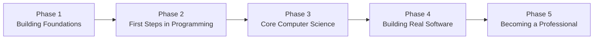

# The Journey Ahead

## Description

This document is the master roadmap for the complete journey from absolute beginner to professional software engineer. It outlines every major phase of learning, what each phase covers, why the phases are ordered the way they are, and how they connect into a single coherent path. If you are starting from zero knowledge, start here.

## Prerequisites

None — this is the starting point. Absolute beginners are welcome. No prior knowledge of computers, programming, or technology is assumed or required.

## Table of Contents

- [The Big Picture](#the-big-picture)
- [Phase 1: Building Foundations](#phase-1-building-foundations)
- [Phase 2: First Steps in Programming](#phase-2-first-steps-in-programming)
- [Phase 3: Core Computer Science](#phase-3-core-computer-science)
- [Phase 4: Building Real Software](#phase-4-building-real-software)
- [Phase 5: Becoming a Professional](#phase-5-becoming-a-professional)
- [How to Use This Module](#how-to-use-this-module)
- [Glossary](#glossary)
- [Quick References](#quick-references)
- [Next Steps](#next-steps)

## Content / Material

### The Big Picture

Becoming a software engineer is a journey of five major phases. Each phase builds on the one before it. You cannot skip phases and arrive at the same destination — the order exists for a reason.

```
Phase 1: Building Foundations
    |
    v
Phase 2: First Steps in Programming
    |
    v
Phase 3: Core Computer Science
    |
    v
Phase 4: Building Real Software
    |
    v
Phase 5: Becoming a Professional
```



**How long does it take?** With consistent effort — studying or practicing 10-15 hours per week — most people can move through all five phases and be job-ready in 6 to 12 months. Some take longer, some shorter. The timeline depends on your schedule, your learning style, and how much time you can dedicate. Do not compare your pace to anyone else's.

Breaking that down: 10-15 hours per week means roughly 1.5 to 2 hours per day if you study every day, or longer sessions on weekends if you work or study during the week. Consistency matters more than volume. Studying 1 hour every day is more effective than studying 7 hours once a week because your brain needs regular exposure to form lasting neural connections. Short daily sessions keep concepts fresh in working memory, while weekly marathons allow too much forgetting between sessions.

**What a typical study week looks like.**

| Day | Time | Activity |
|-----|------|----------|
| Monday | 1 hour | Study new concept, take notes |
| Tuesday | 1 hour | Practice exercises, write code |
| Wednesday | 1 hour | Review yesterday, study next concept |
| Thursday | 1 hour | Practice exercises, debug errors |
| Friday | 1 hour | Review the week, fill knowledge gaps |
| Saturday | 2-3 hours | Deep work session, build something |
| Sunday | Rest or light review | Let your brain consolidate |

This is a template, not a prescription. Adjust it to your life — you might prefer longer sessions on fewer days, or you might split your hour into two 30-minute sessions. The key is that every week includes both learning (reading, watching) and doing (typing code, solving problems). If you only do one, you will not progress. The doing is what transfers knowledge from your short-term memory into lasting understanding.

**Managing your energy, not just your time.** Pay attention to when you learn best. Some people focus better in the morning; others hit their stride late at night. Schedule your most challenging study sessions during your peak hours and save lighter review work for low-energy periods. Study in focused blocks of 25-50 minutes followed by 5-10 minute breaks (the Pomodoro technique). Your brain can only sustain deep focus for about 45 minutes at a time. Pushing past that point yields diminishing returns.

**What to do when you fall off schedule.** Life happens. You will miss days, maybe weeks. When you return, do not try to make up the lost time by cramming. Pick up where you left off. The knowledge you built before is still there — it may just need a quick review to come back. Guilt about lost time is the biggest demotivator. Forgive yourself and start again. The only real failure is not coming back.

**Phase summary.**

| Phase | Focus | Typical Duration | What You Will Know |
|-------|-------|-----------------|---------------------|
| 1. Building Foundations | Computer literacy, command line, English, math | 1-2 months | How computers work, how to use the terminal, technical reading ability |
| 2. First Steps in Programming | Programming fundamentals, first language | 2-3 months | How to write small programs, core programming concepts |
| 3. Core Computer Science | Data structures, algorithms, OS, networking | 2-3 months | How to write efficient code, theoretical foundations |
| 4. Building Real Software | Git, web, databases, APIs | 2-3 months | How to build applications others can use |
| 5. Becoming a Professional | Testing, projects, portfolio, interviews | 1-2 months | How to get hired and work on a team |

**How the phases connect.** Think of the journey as building a house. Phase 1 pours the foundation — invisible but essential. Without it, everything cracks. Phase 2 raises the frame — the basic structure that everything else attaches to. Phase 3 installs the wiring and plumbing — the internal systems that make the house functional and efficient. Phase 4 adds the finishing — walls, roof, doors, and windows — making it livable. Phase 5 puts it on the market — preparing it for others to see, evaluate, and use. You would not install drywall before the foundation is poured. The same logic applies here.

**The mindset you need.** Three things matter more than talent:

- **Patience.** You will be confused. You will write code that does not work. You will read explanations that make no sense. This is normal. Confusion is not a sign that you are failing — it is a sign that your brain is building new connections. Give it time. When you feel stuck, step away for 15 minutes. Take a walk. Drink water. Come back. The answer often appears when you stop searching for it. Your brain continues working on problems in the background.
- **Curiosity.** The best software engineers are the ones who ask "why" constantly. Why does this work? Why does it fail? Why is it done this way? Cultivate that habit from day one. When you encounter a concept you do not understand, do not memorize it — investigate it. Change a value, remove a line, add a print statement. Experimentation is how you build genuine understanding that survives beyond the tutorial.
- **Consistent practice.** You cannot learn software engineering by reading alone. You have to type code, break things, fix them, and repeat. A little bit every day beats a marathon session once a week. The reason is physiological: your brain builds and strengthens neural pathways during sleep. Daily practice creates daily consolidation. Weekly practice means your brain has time to forget between sessions. Fifteen minutes of coding every day will take you further than eight hours every Saturday.

**What you will not find here.** This document does not teach you how to code. It does not contain exercises or syntax reference. It is a map. Each phase links to a detailed guide that walks you through everything you need to learn in that phase. Those guides, in turn, link to actual learning materials in the DevBook subject directories. Follow the links.

**What you need before starting.**

- **A computer.** Any laptop or desktop from the last five years will work. It does not need to be expensive or powerful. You do not need a Mac or a Linux machine — Windows is fine. Programming tools are available on all operating systems. If your computer is very old (more than 8 years), consider upgrading the RAM to 8GB minimum — this will make a noticeable difference in your experience running development tools and a web browser simultaneously.
- **An internet connection.** You will be reading documentation, watching tutorials, downloading tools, and deploying projects. None of this works offline. A stable connection matters more than speed. Even a slow connection (5 Mbps) is sufficient for most learning tasks. If your connection is unreliable, download videos and documentation for offline access when you have bandwidth.
- **A text editor.** You will write code in a text editor, not a word processor. Install a free editor like VS Code before you start Phase 2. Do not worry about configuration — the default setup works. Do not spend time customizing themes, installing extensions, or learning keyboard shortcuts before you have written your first program. That is procrastination disguised as preparation. Extensions and customizations are useful, but only after you know what you need.
- **Time.** The single most important resource. If you can dedicate 10 hours per week, you can complete this path in roughly 6 to 12 months. If you can only dedicate 5 hours per week, double the timeline. If you can dedicate 20 hours per week, you can accelerate. But consistency matters more than volume. A person who studies 5 hours every week for two years will know more than someone who studies 20 hours per week for three months and then burns out.
- **A growth mindset.** You will encounter concepts that feel impossible on first exposure. They are not impossible — they are unfamiliar. Your brain needs time to build the neural pathways. Trust the process. Every software engineer you admire went through exactly this. The difference between them and someone who gave up is not intelligence — it is the decision to keep going when the material got hard. You have whatever it takes. You just have to prove it to yourself over time.
- **Notebook and pen.** Studies show that writing by hand improves retention compared to typing. Keep a notebook for sketching diagrams, tracing through algorithms step by step, and jotting down concepts in your own words. When you are stuck on a problem, writing it down on paper often helps clarify your thinking. Do not underestimate this simple tool — it has been used by every great engineer in history, and it still works in the digital age.

### Phase 1: Building Foundations

**Why you start here.** Software engineering happens on a computer. If you do not understand how a computer works, how to control it, and how to communicate in the language that most technical documentation uses, every later phase will be harder. Phase 1 closes those gaps before you write a single line of code. Think of this phase as boot camp for the basic skills you will use every day for the rest of your career.

**What you will learn.**

- **How computers work.** What is a CPU? What is memory (RAM)? What is a hard drive? How do they talk to each other? You do not need a deep electrical engineering background, but you need a mental model of what happens when you press a key and text appears on the screen. This mental model underlines everything you will do as a software engineer. You will also learn about binary — the ones and zeros that computers use internally — and why text, images, and sounds are all just numbers to a computer. Understanding this removes the magic and replaces it with a logical system you can reason about.
- **The command line.** The command line is a text-based interface for controlling your computer. It looks primitive compared to the graphical interfaces you are used to, but it is the most powerful tool in a developer's arsenal. You will learn to navigate files, run programs, and automate tasks using only text commands. Every professional developer uses the command line daily. You will learn commands like ls (list files), cd (change directory), mkdir (make directory), and how to combine them to work efficiently. By the end of this phase, the command line should feel more natural for file operations than clicking through folders in a file explorer.
- **Basic English for developers.** If English is not your first language, you need to invest in reading and writing technical English. The vast majority of programming documentation, community discussions, error messages, and job listings are in English. You do not need to speak it fluently, but you need to be able to read documentation and write clear comments in your code. Even native English speakers benefit from learning technical writing conventions — how to write short, precise, unambiguous sentences. Technical English has a smaller vocabulary than general English; you can learn the most common 200-300 terms and understand 90% of what you read.
- **Foundational math.** You do not need advanced mathematics to become a software engineer. Most day-to-day coding uses arithmetic, basic algebra, and logic. But learning math trains your brain to think in abstractions, follow chains of reasoning, and solve problems systematically — all of which are core skills in programming. Phase 1 covers the minimum math you need to avoid feeling lost in later phases. Topics include number systems (binary, decimal), basic algebra, logic (AND, OR, NOT), and an introduction to functions and graphs. You already know most of this from school — this is review, not new material.

**What your first month looks like.** In week one, you will learn what the parts of a computer are and how they interact. You will install your first developer tools and open a terminal for the first time. The terminal will look intimidating — just a blinking cursor on a black screen. That is normal. In week two, you will learn the basic command line commands and practice navigating your file system without the mouse. You will feel slow at first, typing commands that you could accomplish with a click. That is also normal. Speed comes with practice. In week three, you will practice reading technical English and building your vocabulary of common computing terms. In week four, you will review binary, basic algebra, and logic — enough to feel comfortable when these concepts appear in later phases. By the end of the month, the terminal will feel less foreign and you will understand the basic architecture of the machine you are learning to control.

**Milestones in Phase 1.**
- You can explain what a CPU, RAM, and a hard drive do in one sentence each.
- You can navigate your file system using only the command line (no file explorer).
- You can create, copy, move, and delete files and directories from the terminal.
- You can read a simple technical document in English and summarize it.
- You can convert a small number between binary and decimal.
- You understand the truth tables for AND, OR, and NOT logic gates.
- You can run a program from the command line by typing its name.
- You can search for and install software using your operating system's package manager.

**Common pitfalls in Phase 1.**
- **Skipping the command line.** It feels uncomfortable at first because there is no mouse, no buttons, no visual feedback. Push through this discomfort. The command line is not optional — it is how you will run your code, manage your files, and use professional tools for your entire career. The feeling of awkwardness lasts about two weeks. After that, the command line starts to feel natural and you will wonder how you lived without it. Force yourself to do file operations exclusively through the terminal for a week — rename files, move them, create directories. This deliberate practice accelerates the learning curve.
- **Ignoring English skills.** If you struggle to read technical English, do not pretend the problem does not exist. Dedicate time to it. Your future self will thank you every time you read a documentation page or an error message without reaching for a translator. Start a vocabulary list of common technical terms and review it daily. Read documentation in English even when translations are available. Struggle through the first few pages — it gets easier.
- **Overthinking the math.** Binary and logic gates look intimidating on paper. They are not. Binary is just counting with two symbols instead of ten. Logic gates are just rules for combining true and false values. If you can add two numbers, you can learn binary. If you can answer yes/no questions, you can learn logic. Spend no more than one week on the math portion of this phase.
- **Not asking questions.** When you do not understand something, search for it. Type your exact question into a search engine. Someone else has had the same question and the answer exists. Learning how to search effectively — choosing the right keywords, reading results critically, applying solutions to your specific context — is a skill that will serve you throughout your entire career.

**How to know you are ready for Phase 2.** You feel comfortable opening a terminal, navigating directories, and running commands. You understand the basic anatomy of a computer. You can read English documentation with minimal assistance. You know what binary is and why computers use it. You are not expected to be an expert in any of these areas — just comfortable enough that the concepts will not distract you when they appear in programming. If you can complete all the milestones listed above, move forward.

**Rough time estimate.** 1 to 2 months for a complete beginner with no computer background. Less if you already use computers comfortably and have basic English reading skills.

**The mindset for this phase.** Do not rush. Phase 1 can feel slow because you are not building anything visible yet. You are building scaffolding. The stronger your foundations, the faster everything else will go. Many people skip this phase and struggle for months later. Do not be one of them. You are investing time now to save time later. Every hour spent mastering the command line in Phase 1 saves you ten hours of confusion in later phases.

**Where to go next.** [Building Foundations](../building-foundations.md) contains the full detailed guide for this phase, with links to specific learning materials.

### Phase 2: First Steps in Programming

**Why you start with programming only after foundations.** Programming is the act of giving instructions to a computer. If you do not understand the computer itself, the instructions will feel like magic. Phase 1 gave you the mental model of how a computer executes instructions. Now you learn how to write those instructions.

**What you will learn.**

- **What programming actually is.** A program is a sequence of instructions that a computer executes in order. Programming is the act of writing those instructions in a language the computer can understand (after translation). You will learn that programming is not about typing — it is about thinking. The typing is the easy part. The hard part is breaking a problem down into steps small enough that a computer can execute them. This skill — computational thinking — is what you are really learning in this phase. You will practice it every time you write a program: first understand the problem, then plan the steps, then write the code, then test it, then fix the errors. This cycle — plan, write, test, fix — is the fundamental rhythm of software development.
- **Core concepts that exist in every language.** Variables (containers for data), loops (repeat instructions), conditionals (make decisions), functions (group instructions into reusable units), data types (kinds of data: numbers, text, true/false values), and basic input/output. These concepts are universal. Learn them once, and you can apply them in any programming language. A function in Python works the same way as a function in JavaScript, Java, or C++. The syntax changes, but the idea does not. Your goal is to learn the concepts so deeply that picking up a new language becomes a matter of learning syntax, not relearning ideas.
- **Your first programming language.** This module recommends Python as a first language. Python is the most beginner-friendly language in widespread use. Its syntax is clean and readable. It does not bombard you with low-level details (memory management, type declarations) on day one. It has a massive community, vast amounts of free learning material, and is used in real production systems — it is not a toy language. Companies like Google, Netflix, and Spotify use Python for critical systems. Python is also versatile — you can build web applications, data analysis scripts, automation tools, and even games with it.
- **Writing and running your first programs.** You will write a program that prints "Hello, World!" to the screen. Then you will write one that asks for your name and greets you. Then one that counts to ten. Then one that guesses a number. Each program teaches one or two new concepts. By the end of this phase, you will write small programs from scratch without looking up every single step. You will also learn how to read error messages — the colored text the computer spits back when your code is wrong — and use them to fix your mistakes. An error message like `NameError: name 'age' is not defined` tells you exactly which variable is missing and where. Learn to read them like clues, not insults. The computer is trying to help you.

**What the learning process looks like.** You will spend the first week setting up your programming environment — installing Python, configuring VS Code, writing and running your first Hello World program. The setup process itself will teach you things: what an interpreter is, how files are organized in a project, how to run a program from the terminal. In weeks two and three, you will learn variables, data types, and user input. You will write programs that ask questions and produce different output depending on what the user types. In weeks four and five, you will learn conditionals and loops — your programs will start making decisions and repeating actions. In weeks six through eight, you will learn functions and start organizing your code into reusable pieces. In week nine and beyond, you will combine everything to write small games and utilities from scratch. Each week builds on the previous one. If you feel lost in week six, go back to weeks two and three and practice the fundamentals.

**Milestones in Phase 2.**
- You can write a program that asks for input, processes it, and displays output.
- You can use conditionals to make your program behave differently based on user input.
- You can use loops to repeat actions without writing the same code multiple times.
- You can define and call your own functions with parameters and return values.
- You can read a Python error message and locate the bug in your code.
- You can break a simple problem down into steps and write a program that solves it.
- You can use a debugger to pause your program mid-execution and inspect variable values.
- You have written at least ten small programs from scratch without following a tutorial.

**Common pitfalls in Phase 2.**
- **Copy-pasting code without understanding.** It is tempting to copy a solution from the internet when you are stuck. Do not. Type every line yourself. If you do not understand what a line does, figure it out before moving on. Copy-pasted code teaches you nothing. If you must look at a solution, close it after reading and write it from memory. The act of typing is what builds muscle memory and understanding. There is a difference between knowing what code looks like and knowing how to produce it yourself.
- **Moving too fast.** Each concept builds on the last. If you rush through variables, functions will confuse you. If you rush through functions, loops will confuse you. Master each concept before moving to the next. The exercises exist to confirm mastery — do not skip them. A good test: can you explain the concept to someone else in plain English without looking at your notes? If not, you have not learned it yet. Teaching is the ultimate test of understanding.
- **Fear of the debugger.** Many beginners try to find bugs by staring at their code. Professional developers use tools called debuggers that let them pause a running program and inspect its state. Learn to use a debugger early. It will save you hours of frustration. In VS Code, the debugger is built in. Set a breakpoint by clicking to the left of a line number, then run your program. It will stop at that line and show you the value of every variable. You can step through your code line by line and watch what happens. This turns debugging from a guessing game into a systematic investigation.
- **Comparing yourself to others.** You will see people online who claim to have learned programming in six weeks. Some of them are exaggerating. Some of them had prior experience. Some of them are lying. Your journey is your own. Measure yourself against where you were yesterday, not against where someone else is today. The only person you need to be better than is the you from last week.
- **Giving up after the first error.** Your program will not run correctly the first time. It may not run correctly the tenth time. This is normal. Every error message you debug teaches you something about how the language works. Each bug you fix makes you a better programmer. If you give up at the first error, you will never write a program that works. Persistence through failure is the single best predictor of success in software engineering. When you encounter an error, take a breath, read the message carefully, and follow a systematic process: identify the line number, understand what the error type means, check the values involved, and fix one thing at a time. Rushing to change random things makes debugging harder, not easier.

**How to know you are ready for Phase 3.** You can write a complete program from scratch without copying from a tutorial. You understand variables, conditionals, loops, and functions well enough to use them without looking up the syntax. You can debug basic errors independently. You have written at least ten small programs on your own. You feel comfortable with the idea that programming is about thinking, not typing. You can read and understand simple Python code written by someone else. If you meet these criteria, you are ready to move on.

**Rough time estimate.** 2 to 3 months. This phase is where the real learning begins. Go slow, do the exercises, write lots of code. The number of hours you spend actively typing code is the single best predictor of how quickly you will progress.

**The mindset for this phase.** Expect frustration. Your first programs will fail. You will miss parentheses, forget colons, misname variables. Every experienced developer went through this. The difference between those who succeed and those who quit is simply that the successful ones kept going. Each error message you fix teaches you something. Read error messages carefully — they tell you exactly what is wrong. When you feel like you are not making progress, look back at what you could not do a week ago. The progress is there even when you cannot see it in the moment.

**Where to go next.** [First Steps in Programming](../first-steps-in-programming.md) contains the full detailed guide for this phase.

### Phase 3: Core Computer Science

**Why theory matters.** After Phase 2, you can write programs that work. But can you write programs that are fast, correct, and scalable? That is what computer science teaches you. Computer science is the theoretical foundation beneath programming. It gives you the vocabulary and the mental tools to reason about code rather than just writing it and hoping it works. Without computer science, you will hit a ceiling where your code works but you cannot explain why it is slow or how to make it faster. With computer science, you can predict performance before you write the code. You will also be able to communicate with other engineers using precise terminology — instead of saying "the thing that finds stuff fast," you will say "a hash table with O(1) lookups." This shared vocabulary is essential for working on a team.

**What you will learn.**

- **Data structures.** Data structures are ways of organizing data in a computer so that it can be used efficiently. Arrays, linked lists, hash tables, trees, graphs, stacks, queues. Each structure has strengths and weaknesses. Choosing the right one for the job is a core skill. For example, a hash table lets you look up a value instantly — but it uses more memory. A linked list lets you insert items anywhere cheaply — but finding a specific item requires scanning the whole list. You need to know these trade-offs. You will also learn about Big O notation — the standard way to describe how fast or slow an operation is. Big O is not as scary as it sounds. It is simply a way of saying "as the input gets larger, the time this takes grows at this rate." O(n) means linear growth. O(n²) means quadratic growth. O(log n) means logarithmic growth, which is very fast for large inputs.
- **Algorithms.** An algorithm is a step-by-step procedure for solving a problem. Sorting a list of names. Finding the shortest path between two points. Searching for a record in a database. You will learn the classic algorithms and, more importantly, how to analyze them — how to determine if an algorithm is fast or slow, how to compare two algorithms for the same task, and how to design your own. Specific algorithms you will encounter: binary search, bubble sort, merge sort, quicksort, breadth-first search, depth-first search, and Dijkstra's shortest path algorithm. Each algorithm teaches a general strategy — divide and conquer, dynamic programming, greedy approaches — that you can apply to problems you have never seen before.
- **How operating systems work.** The operating system (Windows, macOS, Linux) is the software that manages your computer's hardware and runs your programs. You do not need to build an operating system, but you need to understand processes (running programs), memory management (how programs share memory without stepping on each other), file systems (how data is organized on disk), and concurrency (running multiple things at once). Many bugs in production are caused by misunderstanding these topics. You will also learn about threads — lightweight sub-processes that let a single program do multiple things simultaneously. Concurrency bugs are notoriously hard to find because they only happen when timing is exactly wrong. Understanding the OS helps you reason about these situations.
- **How networks work.** Software today runs on the internet, not on isolated machines. You need to understand how data travels from one computer to another: IP addresses, DNS (the system that translates domain names like google.com to IP addresses), TCP and UDP (protocols that govern how data is packaged and delivered), HTTP (the protocol that powers the web), and basic security concepts (encryption, certificates, common attacks). You will also learn about the client-server model — the fundamental architecture of the internet — and how data is broken into packets, routed across the network, and reassembled at its destination. Understanding networking is essential for debugging: when your web application fails, the problem is often in the network layer, not in your code.

**What the learning process looks like.** The first few weeks of Phase 3 will focus on data structures. You will study one structure at a time: learn what it is, analyze its performance, implement it yourself in Python, and use it in small programs to see the trade-offs in action. Do not just read about linked lists — implement one, insert elements, delete elements, and measure how long each operation takes compared to an array. After data structures, you move to algorithms — starting with searching and sorting, then moving to graph algorithms. The OS and networking topics come last; they involve less coding and more conceptual understanding. Throughout the phase, solve problems on platforms like LeetCode or HackerRank to practice applying what you learn. Start with easy problems and work your way up. The goal is not to solve the hardest problems — it is to internalize the concepts so they become automatic.

**Milestones in Phase 3.**
- You can explain the difference between an array and a linked list and when to use each.
- You can implement a hash table from scratch.
- You can analyze the time complexity of a simple function using Big O notation.
- You can implement binary search, merge sort, and quicksort.
- You can explain what a process is and how the operating system manages multiple processes.
- You can trace what happens when you type a URL into a browser, from the moment you press Enter to the moment the page loads.
- You have solved at least 20 coding problems on a platform like LeetCode.

**Common pitfalls in Phase 3.**
- **Getting lost in theory.** It is easy to spend months studying algorithms without writing any real code. Balance theory with practice. For each data structure or algorithm, implement it yourself in Python. Run it. Test it. Break it. Only then does the theory become useful knowledge. A good rule: for every hour you spend reading about a concept, spend two hours implementing it and experimenting with it.
- **Treating Big O as a magic formula.** Big O notation is not a test you pass — it is a tool you use. When you write a function, ask yourself: "How does this function behave as the input gets larger?" Thinking in Big O trains you to write efficient code without having to measure it. Do not memorize Big O values — derive them. Understand why a loop inside another loop is O(n²) and why binary search is O(log n). Draw the recursion tree. Count the operations. The understanding is what matters.
- **Skipping networking.** Networking can feel like a separate discipline, but modern software is networked software. Understanding how data moves across the internet is essential for debugging, security, and system design. Do not treat it as optional. When your web application returns an error, the problem is often in the network layer — DNS misconfiguration, firewalls, or HTTP header issues that have nothing to do with your application logic.
- **Memorizing instead of understanding.** You could memorize that quicksort has an average case of O(n log n), but if you cannot explain why, the knowledge is useless when you encounter a novel problem. Focus on understanding the reasoning behind each concept. Draw diagrams. Walk through algorithms by hand with small inputs. Teaching someone else is the ultimate test of understanding — if you can explain it clearly, you truly know it.
- **Not connecting theory to practice.** When you learn about hash tables, think about where you have used them: Python dictionaries, JavaScript objects, database indexes. When you learn about queues, think about print spoolers and message brokers. When you learn about graphs, think about social networks and GPS navigation. Connecting theory to real systems makes the concepts stick.

**How to know you are ready for Phase 4.** You can analyze simple code for time complexity. You know the common data structures and can explain when to use each. You have implemented at least three algorithms from scratch. You understand the basic concepts of how an operating system works and how data travels over a network. You have completed at least one project that uses a non-trivial data structure (like a graph or a hash table). You have solved enough coding problems that you can look at an unfamiliar problem and start forming a strategy.

**Rough time estimate.** 2 to 3 months. This is the densest phase conceptually. Do not expect to master all of it before moving on — some concepts will click only when you encounter them in practice during Phase 4. Computer science is a lifelong learning journey, not a checkbox you tick once.

**The mindset for this phase.** Do not be intimidated by the theory. Computer science concepts are typically taught with academic rigor and mathematical notation that can scare beginners. But the underlying ideas are intuitive. A hash table is just a way of saying "store things in labeled boxes so you can find them instantly." An algorithm is just a recipe. When you encounter a concept that looks abstract, ask yourself: "What problem does this solve?" If you cannot answer that, you are not ready for it yet. Move on and come back later. Your understanding will deepen with each pass.

**Where to go next.** [Core Computer Science](../core-computer-science.md) contains the full detailed guide for this phase.

### Phase 4: Building Real Software

**Why this is a separate phase.** Phases 1 through 3 teach you to think like a programmer and understand how computers work. Phase 4 teaches you to build things that other people can use. This is a different skill set. You can write a perfect algorithm in isolation and still have no idea how to build a web application that handles sign-ups, stores data, and talks to a frontend. Phase 4 bridges that gap by introducing the tools and workflows that professional developers use every day.

**What you will learn.**

- **Version control with Git.** Git is a system that tracks changes to your code over time. It lets you save snapshots of your work, experiment with different versions, collaborate with other developers without overwriting each other's changes, and revert mistakes. Git is not optional. Every professional developer uses it. You will learn the core commands: commit, push, pull, branch, merge. You will also learn how to use GitHub (or similar platforms) to host your code online and collaborate with others. You will understand concepts like repositories (project folders tracked by Git), forks (copies of other people's repositories), and pull requests (proposed changes you submit for review). Git has a reputation for being confusing, but the basic workflow — add, commit, push — is simple. You only need the advanced features when you start collaborating, and you will learn them when you need them.
- **HTML and CSS.** Even if you do not plan to be a frontend developer, you need to understand the basics of the web. HTML is the markup language that structures web pages. CSS controls how they look. Knowing HTML and CSS lets you build a simple user interface, format your documentation properly, and understand how the frontend of any web application works. You will learn about tags, attributes, selectors, the box model, and responsive design — making pages that look good on both phones and desktop screens. You do not need to become a CSS expert. You just need to know enough to build a functional, decent-looking interface.
- **Databases.** Most applications need to store data permanently: user accounts, posts, orders, comments. You will learn about relational databases (the most common type), how to design a database schema (what tables to create and how they relate), and SQL (the language used to query and manipulate data). You will also learn about basic database operations: creating records, reading them, updating them, and deleting them (CRUD). You will learn about primary keys (unique identifiers for each row), foreign keys (references between tables), and indexes (structures that speed up lookups). A well-designed database schema is the foundation of a reliable application. Getting the schema right early saves enormous pain later.
- **APIs.** An API (Application Programming Interface) is how different pieces of software talk to each other. When a mobile app loads weather data from a server, it is using an API. When your frontend asks your backend for user information, it is using an API. You will learn how to build and consume APIs, how data is structured in requests and responses, and the most common API style (REST). You will learn about HTTP methods (GET to retrieve, POST to create, PUT to update, DELETE to remove), status codes (200 for success, 404 for not found, 500 for server error), and JSON — the standard format for API data. Building and consuming your own API is one of the most satisfying milestones in this journey — it is the moment your frontend and backend start talking to each other.

**What the learning process looks like.** You will start with Git — learn the basic workflow of add, commit, push, pull. You will create a repository on GitHub and push your first project to it. Then you will learn the basics of HTML and CSS and build a simple static web page. Next, you will learn SQL and set up a PostgreSQL database, inserting and querying data from the command line. You will then learn to build a backend API using a Python web framework like FastAPI — connecting routes to database queries and returning JSON to callers. Finally, you will connect your frontend to your backend and deploy the full application to a free hosting platform like Render or Fly.io. Each piece teaches you something about the full stack. By the end of this phase, you will understand how all the pieces fit together.

**Milestones in Phase 4.**
- You can initialize a Git repository, commit changes, and push to GitHub.
- You can create and merge branches in Git.
- You can build a static web page with HTML and CSS.
- You can design a database schema with multiple related tables.
- You can write SQL queries that join tables and filter results.
- You can build a REST API endpoint that returns JSON data from a database.
- You can deploy a web application to a public URL that anyone can visit.
- You can debug a problem that spans frontend, backend, and database.
- You can configure environment variables and manage secrets in a deployed application.

**Common pitfalls in Phase 4.**
- **Trying to learn every technology.** There are dozens of databases, hundreds of frameworks, and thousands of tools. You cannot learn them all. Pick one stack (for example: PostgreSQL for the database, Flask or FastAPI for the backend, vanilla HTML/CSS for the frontend) and learn it well. The concepts transfer to any other tool. Learning a second framework is always easier than learning the first one because you already understand the patterns — routing, middleware, request handling, response formatting.
- **Not deploying.** A project that only runs on your laptop does not prove you can build real software. Deploy your project to a public URL. Free hosting platforms exist. Seeing your application live on the internet changes how you think about development — you will encounter real issues like environment differences, downtime, and configuration that do not exist on your local machine. Deploy early and deploy often. The first time someone else visits your deployed app is a transformative moment.
- **Ignoring security.** In Phase 4, you are building things that could be attacked. Learn basic security practices: never store passwords in plain text, validate user input, use HTTPS, do not expose secret keys in your code. A project with security flaws does more harm than good in a portfolio. If you are not sure whether something is secure, ask. Stack Overflow and developer communities will help if you describe what you are trying to do. The OWASP Top 10 is a good list of the most common security risks — read it early.
- **Perfectionism.** Your first web page will look ugly. Your first database will have design flaws. Your first API will not handle errors gracefully. This is expected. The goal is not perfection — it is completion. You can always refactor later. Do not let the desire to make something perfect prevent you from making something at all. A working but imperfect application is infinitely more valuable than a perfect application that exists only in your imagination.

**How to know you are ready for Phase 5.** You have built and deployed at least one complete web application. You have used Git for version control throughout the project. You understand how the frontend, backend, and database fit together. You have written SQL queries. You have built and consumed an API. You can debug problems that span multiple layers of the stack. You understand what it means to ship something — to take an idea from your head and put it on the internet where anyone can use it.

**Rough time estimate.** 2 to 3 months. This phase is very hands-on. You should build at least one complete project by the end of it. The project is the point — do not skip project work in favor of reading more tutorials.

**The mindset for this phase.** Everything you build will be ugly at first. Your first web page will look like it was designed in 1995. Your first database schema will have flaws. Your first API will have security holes. This is fine. The goal of Phase 4 is not perfection — it is exposure. You are learning the landscape of real-world development so that when you encounter these technologies in a job, you are not seeing them for the first time. Every professional developer has written code they are embarrassed by. What matters is that you shipped it, you learned from it, and your next project is better.

**Where to go next.** [Building Real Software](../building-real-software.md) contains the full detailed guide for this phase.

### Phase 5: Becoming a Professional

**Why this is the final phase.** You can now build software. But can you build software that a team can maintain, that a company can depend on, and that an interviewer will be impressed by? Phase 5 transforms you from someone who knows how to code into someone who is ready to work as a software engineer. The skills in this phase are the ones that separate hobbyists from professionals.

**What you will learn.**

- **Testing.** Professional software is tested. Every change must be verified before it is deployed. You will learn how to write automated tests — unit tests that check individual functions, integration tests that check how components work together, and end-to-end tests that simulate real user behavior. You will also learn about test-driven development (writing tests before you write the code itself), which forces you to think about what your code should do before you write it. Testing also includes understanding code coverage (what percentage of your code is exercised by tests) and edge cases (unusual inputs that might break your code). Writing tests is not optional — it is the difference between code that works by accident and code that works by design.
- **Building complete projects.** You will build an application from scratch — something more complex than the exercises in Phase 4. A full-stack web application with user authentication, a database, and an API. The purpose is to demonstrate that you can handle every layer of the stack, from the database to the user interface. This project becomes the centerpiece of your portfolio. You will also learn to write documentation, handle error states gracefully, and structure your code for maintainability. Your code should be readable by someone who has never seen it before.
- **Creating a portfolio.** Your portfolio is the collection of projects that shows potential employers what you can do. You will learn how to present your projects effectively: write clear README files, include screenshots and deployed links, document your technical decisions, and highlight the most interesting problems you solved. A good portfolio matters more than a diploma for many employers. You will also learn about writing a resume tailored to software engineering roles — focusing on projects and skills rather than previous unrelated job experience. Your resume should tell a story: "I learned to code, I built these things, and I am ready to contribute to your team."
- **Interview preparation.** The software engineering interview process is unique. It typically involves multiple rounds: a phone screen, a coding challenge, a system design discussion, and a behavioral interview. You will learn how to solve coding problems under time pressure (the infamous "whiteboard interview"), how to talk about architecture decisions, and how to answer behavioral questions using the STAR method (Situation, Task, Action, Result). You will also learn the job search process: where to find openings, how to network, how to evaluate offers, and how to negotiate salary. Interviewing is a skill separate from coding — it requires practice, just like programming does.

**What the learning process looks like.** The first two weeks of Phase 5 focus on testing — you will add tests to your existing projects and learn the testing tools and conventions for Python (pytest) or JavaScript (Jest). Weeks three through six are dedicated to building your capstone project from scratch. This should be something you care about — a tool you would use yourself, or an application that solves a real problem you have encountered. Weeks seven and eight focus on portfolio preparation — writing README files, polishing code, and deploying everything. Weeks nine through twelve focus on interview preparation: practicing coding problems, studying system design patterns, and preparing behavioral stories. Do the work every day. Interview preparation is a grind, but it pays off.

**Milestones in Phase 5.**
- You have written unit tests that cover the core functionality of a project.
- You have written integration tests that verify your API endpoints work correctly.
- You have built a full-stack application with authentication, database, and API.
- You have deployed the application to a public URL.
- You have created a portfolio with at least three projects, each with clear documentation.
- You can solve a medium-difficulty coding problem within 30 minutes.
- You can explain your design decisions in a system design conversation.
- You have applied to at least 10 jobs and tracked your applications.
- You can tell a clear behavioral story using the STAR method.
- You have received at least one interview request or callback.

**Common pitfalls in Phase 5.**
- **Waiting until you feel ready.** You will never feel ready. Apply to jobs when you can build a full-stack application, write tests, and explain your design decisions. That is the bar. Everything else you will learn on the job. Most job descriptions list requirements that describe the ideal candidate, not the minimum candidate. If you meet 60% of the requirements, apply. The worst that can happen is you get a no, which costs you nothing and teaches you something about the process.
- **Neglecting behavioral interviews.** Many candidates focus entirely on coding problems and fail the behavioral round. Prepare stories about times you solved a problem, worked with others, dealt with failure, or learned something difficult. These stories are as important as your technical skills. Write them down. Practice telling them out loud. Record yourself and check if you sound confident and concise. Each story should be 60-90 seconds and follow the STAR structure.
- **Building one project.** A single project is not a portfolio. Build at least three projects during your journey, each showcasing different skills. One might be a full-stack web app, another a command-line tool, another a small game. Variety demonstrates breadth. It also gives you more material to talk about in interviews — if one project does not resonate with an interviewer, another might. Each project should be documented with a README that explains what it does, how to run it, and what you learned building it.
- **Ignoring the job search process.** Sending out resumes and waiting for responses is not an effective job search strategy. Network with other developers, attend meetups (virtual or in-person), contribute to open source, and reach out directly to hiring managers. Most jobs are filled through referrals, not applications. Building relationships in the community is the most effective way to find opportunities. Start networking early, before you need a job.

**How to know you are ready to start applying.** You have a deployed full-stack project that you can walk through and explain. You have written tests for your code. You have a resume and portfolio that present your skills clearly. You can solve a coding problem in a timed setting. You have prepared stories for behavioral questions. More importantly: you are applying even though you do not feel ready, because you understand that ready is a feeling, not a state. The first application is the hardest. The tenth is routine.

**Rough time estimate.** 1 to 2 months of focused preparation after completing Phase 4. Some people need more time for interview preparation, depending on their target companies. Do not rush the interview prep — a well-prepared application is more likely to succeed than dozens of unprepared ones. Spending two extra weeks on preparation can make the difference between an offer and a rejection.

**The mindset for this phase.** This phase is about confidence. You know enough. The gap between "I can code" and "I can pass an interview" is mostly about practice and presentation. Do not let imposter syndrome convince you that you are not ready. Apply to jobs even if you do not meet every requirement. The first job is the hardest to get. Once you are in, the experience will accelerate your growth faster than any self-study can. Remember: every senior engineer was once a junior who did not know what they were doing. They learned on the job. You will too. The only way through is through.

**Where to go next.** [Becoming a Professional](../becoming-a-professional.md) contains the full detailed guide for this phase.

### How to Use This Module

The Software Engineer career module is structured as a linear path. Here is how to navigate it.

**Start with the intro documents.** You are reading one right now. The two intro documents — this one and [The Software Engineering Profession](the-software-engineering-profession.md) — give you the context you need before you start learning. Read both before moving to Phase 1. The profession document tells you what software engineering is and why it exists. This document tells you how to become one.

**Go through the phases in order.** Each phase document is a detailed narrative that describes everything you need to learn in that phase. Read the phase document first to understand what you will learn and why. Then follow the links in that document to the actual learning materials in DevBook's subject directories (programming, computer science, mathematics, etc.). The phase document is your guide; the subject materials are your textbooks.

**Do not skip Phase 1.** Experienced programmers might be tempted to skip Phase 1 because they already know how to use a computer. If you are reading this as a beginner, do not skip it. The foundations phase covers specific skills — the command line, technical English, the mental model of how a computer works — that are essential even if you already know how to browse the web and use Microsoft Word. Skipping Phase 1 is the most common mistake beginners make.

**Do the work.** Reading is not enough. For every concept, you need to practice. Write code. Break things. Fix them. The learning materials linked from each phase document include exercises. Do them. If a phase document says "spend two weeks on this," spend two weeks on it. Do not rush. The difference between someone who read about programming and someone who can program is measured in hours spent typing code, not hours spent reading.

**Use the glossary and quick references.** New terms are defined in the glossary at the bottom of each document. If you encounter a term you do not recognize, check the glossary first. The quick references section lists external resources for deeper dives. Bookmark the resources that help you most — you will return to them.

**Come back to this document.** This document is your map. If you ever feel lost — unsure what to study next, unsure whether you are ready for the next phase — come back here. Re-read the description of the phase you are in. Check whether you have covered everything listed. If yes, move forward. If no, go deeper. The map does not change. Only your position on it does.

**How DevBook subject directories connect.** When a phase document says "learn about variables," it links to a specific file in the `programming/` subject directory. That file teaches the concept with examples, exercises, and a glossary. You do not need to search for learning materials — they are linked directly. Follow the chain: phase document to subject material. Complete the material. Return to the phase document. Move to the next topic.

**What to do when a concept does not click.** Some concepts will not make sense the first time you encounter them. This is normal. When it happens, try a different resource — a video, an interactive tutorial, a different book. Sometimes hearing the same idea explained in different words is all you need. If it still does not click, sleep on it and come back the next day. If it still does not click after that, move on and return to it later. Some concepts require maturity in other areas before they become accessible. Forcing them usually does not work. Stepping away and coming back later often does.

**Using the milestones as checkpoints.** Each phase in this document lists specific milestones. Use these as checkpoints. Do not move to the next phase until you can honestly check off every milestone in the current one. If you cannot hit a milestone, you have identified a gap — go back and fill it. The milestones are not aspirational. They are the minimum bar for readiness. Treat them as requirements, not suggestions.

**Using spaced repetition.** Reviewing material you learned weeks ago is more important than it feels. Your brain naturally forgets information that it does not use regularly. Spend 10-15 minutes each week reviewing concepts from previous phases. This review does not need to be deep — just enough to keep the neural pathways active. A quick skim of your notes, re-reading a glossary, or solving one easy problem from a previous phase is enough. This practice, called spaced repetition, dramatically improves long-term retention. It is the difference between knowing something for a week and knowing it for life.

**Tracking your progress.** Keep a simple log: date, topic studied, time spent, one thing you learned. This log serves two purposes. It shows you how far you have come on days when you feel stuck, and it reveals patterns — maybe you learn best in the morning, or you retain more when you review after 24 hours. Adjust your schedule based on data, not guesses. A simple text file or a spreadsheet is all you need. Update it at the end of every study session. The act of writing down what you learned helps cement it in memory.

**Building a sustainable routine.** The hardest part of self-study is consistency over months. Build habits that support your learning: study at the same time each day, keep your learning materials open and ready, remove distractions (put your phone in another room), and set a minimum daily commitment (even 15 minutes on a bad day keeps the momentum). On days when you have no energy, tell yourself you will study for just 10 minutes. Usually, 10 minutes turns into an hour once you start. The hardest part is starting. Once you are in the flow, continuing is easy.

**Dealing with plateaus.** Every learner hits plateaus — periods where you study but feel like you are making no progress. Plateaus are normal and temporary. They happen because your brain is consolidating what you have already learned before it can absorb more. During a plateau, keep showing up. Do not change your routine dramatically. The breakthrough will come, often suddenly. One day a concept that has been confusing for weeks will click into place. That is the plateau breaking. If a plateau lasts more than two weeks, try a different learning resource or take a short break — your brain may need rest more than it needs more input.

**When to take breaks.** Learning software engineering is mentally demanding. Your brain needs rest to consolidate information. If you stare at a problem for 30 minutes and cannot solve it, stop. Do something else. Go for a walk. Sleep on it. The next day, the solution will often appear quickly. This is not magic — your brain continues processing information even when you are not actively thinking about it. This phenomenon is called incubation, and it is one of the most reliable tools in a learner's toolkit. Respect the process. Overworking leads to burnout, which stops all progress.

**Signs of burnout and what to do.** If you dread opening your learning materials, feel exhausted after short study sessions, or find yourself zoning out while reading, you may be approaching burnout. The solution is not to push harder — it is to rest. Take a full day off. Do something active that is not related to computers. When you return, start with something easy and enjoyable. The goal is to rebuild the association between studying and positive feelings. If burnout is severe, take a full week off. The material will still be there when you come back. Your brain will actually benefit from the extended consolidation period.

### Reading Roadmap: How Phases Map to DevBook Subjects

Each phase pulls learning materials from specific DevBook subject directories. This table shows which subjects you will visit in each phase.

| Phase | DevBook Subjects | Purpose |
|-------|-----------------|---------|
| 1. Building Foundations | `computer-science/`, `english/`, `mathematics/`, `programming/` (intro) | Computer basics, technical English, math review, what programming is |
| 2. First Steps in Programming | `programming/`, `python/` | Core programming concepts, Python language fundamentals |
| 3. Core Computer Science | `computer-science/`, `mathematics/` | Data structures, algorithms, OS, networking, discrete math |
| 4. Building Real Software | `programming/`, `web/`, `databases/` | Git, HTML/CSS, SQL, APIs, deployment |
| 5. Becoming a Professional | `programming/`, `careers/` | Testing, projects, portfolios, interview prep |

You do not need to study every file in every subject directory. Each phase document links only to the specific materials you need for that phase. Follow the links in order.

If a linked file does not exist yet (marked as "planned" in its index), the concept is documented but the detailed material has not been written. In that case, use the quick references in this document to find external resources covering the same topic.

## Glossary

| Term | Definition |
|------|------------|
| Software Engineer | A professional who applies engineering principles to design, build, test, and maintain software systems |
| Command Line | A text-based interface for controlling a computer by typing commands rather than clicking graphical elements |
| Terminal | The program on your computer that gives you access to the command line |
| Algorithm | A step-by-step procedure or set of instructions for solving a specific problem |
| Data Structure | A specialized format for organizing, processing, and storing data (e.g., array, hash table, tree) |
| Variable | A named container that stores a value in a computer program |
| Function | A reusable block of code that performs a specific task, optionally taking input and returning output |
| Loop | A programming construct that repeats a block of code multiple times |
| Debugging | The process of finding and fixing errors or defects in a computer program |
| Syntax | The set of rules that defines the structure of a programming language |
| API | Application Programming Interface — a set of rules that allows one piece of software to communicate with another |
| Version Control | A system that records changes to files over time so that you can recall specific versions later |
| SQL | Structured Query Language — the standard language for querying and manipulating relational databases |
| HTTP | Hypertext Transfer Protocol — the protocol used for communication between web browsers and web servers |
| Framework | A pre-built collection of code that provides common functionality, allowing developers to build applications faster |
| Portfolio | A collection of projects that demonstrates a developer's skills and experience to potential employers |
| Imposter Syndrome | The feeling that you are not qualified or skilled enough, despite evidence of competence |
| CRUD | Create, Read, Update, Delete — the four basic operations for persistent data storage |
| Deployment | The process of making a software application available for use, typically by uploading it to a server |
| Runtime | The environment in which a program executes, including the operating system and any supporting libraries |
| Repository | A storage location for software packages or source code, typically tracked by a version control system like Git |
| Branch | A separate line of development in a version control system, allowing work on features without affecting the main codebase |
| Merge | The act of combining changes from one branch into another in a version control system |
| Pull Request | A proposed change to a code repository that is submitted for review before being merged |
| Compiler | A program that translates human-readable source code into machine code that a computer can execute |
| Interpreter | A program that executes source code directly without a separate compilation step (Python is an interpreted language) |
| IDE | Integrated Development Environment — a software application that combines a code editor, debugger, and other tools in one interface |
| Boolean | A data type that has only two possible values: true or false |
| Conditional | A programming construct that executes different code depending on whether a condition is true or false |
| String | A data type representing a sequence of characters, such as text |
| Integer | A data type representing a whole number |
| Recursion | A programming technique where a function calls itself to solve a problem by breaking it into smaller instances |
| Big O Notation | A mathematical notation used to describe the performance or complexity of an algorithm as the input size grows |
| SQL Injection | A security vulnerability where an attacker inserts malicious SQL code into a query through user input |

## Quick References

- [FreeCodeCamp](https://www.freecodecamp.org/) — A free, interactive platform for learning programming from scratch, with structured certifications
- [The Odin Project](https://www.theodinproject.com/) — A free, full-stack curriculum for web development with a project-based approach
- [Python.org Beginner's Guide](https://wiki.python.org/moin/BeginnersGuide) — Official Python documentation for beginners, with links to tutorials and books
- [GitHub Learning Lab](https://lab.github.com/) — Interactive courses for learning Git and GitHub through hands-on exercises
- [Codecademy](https://www.codecademy.com/) — An interactive platform with free programming courses across multiple languages
- [LeetCode](https://leetcode.com/) — A platform for practicing coding interview problems with solutions and discussions
- [Stack Overflow](https://stackoverflow.com/) — The largest Q&A community for programmers; search before asking
- [Khan Academy](https://www.khanacademy.org/) — Free courses in math and computer science fundamentals, ideal for Phase 1 math review
- [Crash Course Computer Science](https://www.youtube.com/playlist?list=PL8dPuuaLjXtNlUrzyH5r6jN9ulI) — A video series covering how computers work, perfect for Phase 1 foundations
- [Learn Git Branching](https://learngitbranching.js.org/) — An interactive visual tool for learning Git concepts without the command line
- [DevBook Glossary](../GLOSSARY.md) — A consolidated glossary of technical terms used across all DevBook subjects

## Next Steps

- [Building Foundations](../building-foundations.md) — start your journey here with Phase 1
- [The Software Engineering Profession](the-software-engineering-profession.md) — learn about the profession you are working toward
