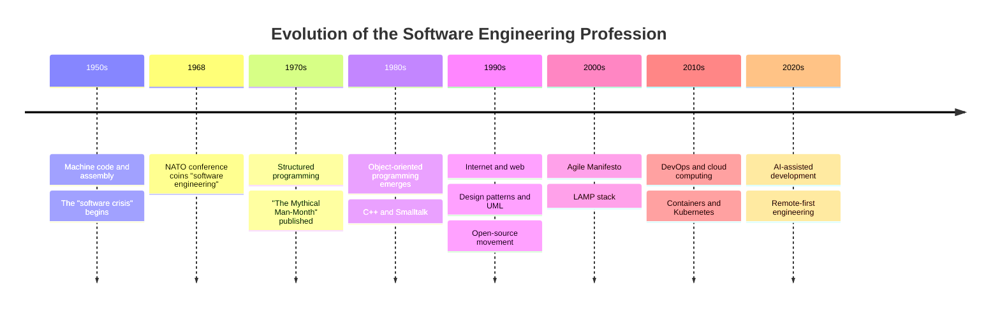
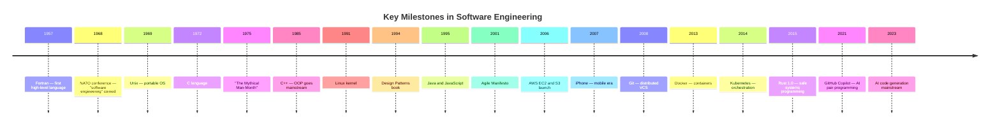

# The Software Engineering Profession

## Description

A foundational overview of software engineering as a formal profession — its definition, history, distinguishing characteristics, economic role, and the milestones that have shaped how software is built. This document establishes the context for all other discussions about what software engineers do and how the profession operates.

## Prerequisites

None — this is the first document in the Software Engineer career module. No prior knowledge of the profession is assumed.

## Table of Contents

- [What Is the Software Engineering Profession?](#what-is-the-software-engineering-profession)
- [A Brief History](#a-brief-history)
- [Why It's a Distinct Profession](#why-its-a-distinct-profession)
- [The Profession in the Modern Economy](#the-profession-in-the-modern-economy)
- [Key Milestones in Software Engineering](#key-milestones-in-software-engineering)
- [Glossary](#glossary)
- [Quick References](#quick-references)
- [Next Steps](#next-steps)

## Content / Material

### What Is the Software Engineering Profession?

Software engineering is the systematic application of engineering principles to the design, development, maintenance, testing, and evaluation of software systems. It is a formal discipline with established methodologies, best practices, and ethical standards — distinct from ad hoc programming or casual coding. The discipline encompasses everything from small scripts that automate a single task to distributed systems processing billions of requests per day across global infrastructure.

The name itself captures a deliberate ambition: to bring to software development the same rigor, predictability, and professionalism that civil, mechanical, and electrical engineering brought to the physical world. This aspiration has guided the profession since its formal naming in 1968 and continues to shape debates about education, licensing, methodology, and ethics today.

The term itself reflects a key distinction: a programmer writes code, a software engineer builds systems. Programming is an act of translation — converting a specification into executable instructions. Software engineering encompasses the entire lifecycle: requirements analysis, architecture design, implementation, verification, deployment, operation, and retirement. Where a single developer might write a script that runs on their own machine, a software engineer participates in constructing systems that must be reliable, secure, maintainable, and scalable across teams, organizations, and decades of use.

The profession draws on computer science theory (algorithms, data structures, computability), project management (scheduling, risk assessment, resource allocation), and human factors (usability, team dynamics, communication). It is an engineering discipline not because software engineers build physical artifacts, but because they apply the same rigor, repeatability, and evidence-based reasoning that characterize civil, mechanical, and electrical engineering.

Practitioners of software engineering are expected to make trade-offs under uncertainty. A civil engineer decides between steel and reinforced concrete given load, cost, and climate constraints. A software engineer decides between a monolithic architecture and microservices given traffic patterns, team size, and operational capacity. Both justify their decisions with data, document their reasoning, and accept professional responsibility for the outcomes.

Software engineering is also a social activity. Large-scale systems are built by teams, not individuals. The profession has developed processes, communication protocols, and collaboration tools specifically to manage the complexity of coordinating human effort around a shared codebase. Version control, code review, continuous integration, and incident management are not technical luxuries — they are professional necessities that distinguish engineered software from personal projects.

The profession has also developed its own culture and norms. Code review — having another engineer examine every change before it reaches production — is a defining practice. On-call rotations, where engineers are responsible for responding to production incidents outside of business hours, are standard in organizations that operate their own infrastructure. Postmortems (blameless analyses of incidents) are written after significant outages to capture lessons and drive systemic improvements. These practices, unprecedented in earlier computing, are now core to the identity of the profession.

A software engineer's work is never truly finished. Software is not built and then maintained — it is continuously evolved. Requirements change, operating systems update, security vulnerabilities are discovered, user expectations rise. The profession has come to accept that software decays if not actively tended. This understanding shapes how engineers think about design decisions: code must be written for the people who will modify it next, not just for the machine that will execute it today.

Finally, software engineering is a profession of abstraction layers. An engineer working on a web application rarely thinks about the individual transistors on the CPU, or even about the operating system's memory management. Those concerns are handled by layers below: the hardware, the kernel, the runtime, the framework. Each layer makes the layer above it more productive. The profession's progress can be measured by how high these layers of abstraction have risen — from machine code to assembly to C to Java to managed runtimes to serverless functions.

### A Brief History

The software engineering profession did not emerge fully formed. It evolved through decades of crisis, innovation, and reflection as the scale and stakes of software increased.

#### The Early Days (1950s–1960s)

In the earliest years of computing, there was no software engineering. Programs were written in machine code or assembly language, loaded via punched cards or paper tape, and debugged by inspecting memory dumps. Each program was a bespoke artifact, tightly coupled to a specific machine and a single purpose. The notion of reusable components, portable code, or systematic testing did not yet exist.

The first high-level programming languages — Fortran (1957), COBOL (1959), ALGOL (1960) — began abstracting away machine details, but development practices remained ad hoc. Projects routinely ran over budget, delivered late, or failed entirely. This period is now referred to as the "software crisis" — a term that would define the profession's founding moment.

The environment of early software development was fundamentally different from today. Computing time was scarce and expensive. A programmer might get one or two machine runs per day, submitting a deck of punched cards and waiting hours for output. Debugging was done offline, by reading a memory dump printed on paper. Documentation was minimal or nonexistent. Software was typically built by mathematicians or electrical engineers who had taught themselves to program — there were no computer science departments, no software engineering textbooks, no established curricula.

The IBM System/360, introduced in 1964, was a turning point. It was the first family of compatible computers: a program written for one model could run on any other. This made software investment more valuable — and the cost of software failure more visible. The OS/360 operating system for the System/360 became infamous for its delays and defects, providing one of the most cited case studies in software project management failure. Fred Brooks, who managed OS/360 development, later wrote "The Mythical Man-Month" based on his experiences — a book that remains widely read decades later.

The 1960s also saw the emergence of structured programming concepts. The first textbooks on programming methodology appeared, including Edsger Dijkstra's notes on structured programming. COBOL became the standard for business data processing, while FORTRAN dominated scientific computing. These language specializations foreshadowed the diverse ecosystem of programming languages that would characterize the profession. Batch processing remained the norm, with programmers submitting jobs on punched cards and receiving printed output hours later. Interactive computing, demonstrated by systems like MIT's CTSS and the development of time-sharing, was just beginning to hint at a different way of working.

#### The NATO Conferences and the Birth of "Software Engineering" (1968)

In 1968, the NATO Science Committee convened a conference in Garmisch, Germany, to address the software crisis. The conference report introduced the term "software engineering" explicitly, arguing that software development should adopt the methods and rigor of traditional engineering. A second NATO conference followed in 1969.

The first conference, held in Garmisch, Germany, in October 1968, brought together over 50 leading figures from academia, industry, and government. Participants included Edsger Dijkstra, Tony Hoare, Niklaus Wirth, David Gries, and Fred Brooks. The conference proceedings documented case studies of failed projects — including the OS/360 experience — and called for software development to adopt engineering practices such as rigorous specification, design review, and systematic testing. Notable papers from the conference introduced concepts of software reliability, hierarchical design, and the notion of software as a product with a lifecycle.

The second NATO conference in Rome in 1969 focused on the management of software projects. It produced recommendations on project estimation, team structures, and the importance of documentation. Together, these conferences laid the intellectual foundation for software engineering as an academic discipline and professional practice.

These conferences did not solve the crisis, but they established a framing that persists today: software development is an engineering discipline, not an art or a craft. The term gave the profession a name, a mandate, and a direction. It also sparked debates — still ongoing — about whether software development truly qualifies as engineering. The conferences also catalyzed the formation of academic departments, professional societies, and the first software engineering textbooks. Within a decade, universities began offering courses and degrees explicitly labeled "software engineering."

#### Structured Programming (1970s)

The 1970s saw the rise of structured programming, championed by Edsger Dijkstra, Tony Hoare, and Niklaus Wirth. The core idea was that programs should be built from a small set of control structures (sequence, selection, iteration) rather than arbitrary jumps (goto statements). Dijkstra's 1968 letter "Go To Statement Considered Harmful" crystallized this philosophy.

Structured programming was the first systematic methodology to gain widespread adoption. It introduced top-down design, stepwise refinement, and the disciplined use of subroutines. Languages like Pascal and C embodied these principles, and they became the standard for teaching and professional development.

This era also produced foundational texts: Fred Brooks's "The Mythical Man-Month" (1975), which introduced Brooks's Law ("Adding manpower to a late software project makes it later") and the concept of the "second-system effect." Barry Boehm's work on software cost estimation led to the COCOMO model, which categorized software projects into organic, semidetached, and embedded modes, each with different productivity characteristics. Tom DeMarco's "Structured Analysis and System Specification" (1978) introduced data-flow diagrams and structured analysis techniques. Edward Yourdon and Larry Constantine's "Structured Design" (1979) formalized concepts of coupling and cohesion that remain central to software architecture education. These were early attempts to treat software development as a measurable, predictable engineering activity.

The C programming language, developed by Dennis Ritchie at Bell Labs in 1972, and the Unix operating system written in C, demonstrated that system software could be both portable and efficient. Unix itself became a case study in software engineering practices: its pipeline architecture, modular design, and the philosophy of small, composable tools influenced generations of engineers. The Unix philosophy — "do one thing and do it well" — became a guiding principle for software design that persists in modern microservices architectures.

The 1970s also saw the beginning of formal methods in software engineering. Researchers explored mathematical approaches to specifying and verifying software correctness. While formal methods never achieved widespread industrial adoption, they influenced the development of programming language type systems, model checking, and static analysis tools used in safety-critical industries like aviation and medical devices.

#### The Object-Oriented Revolution (1980s–1990s)

Object-oriented programming (OOP) emerged as a paradigm shift in the 1980s. Smalltalk at Xerox PARC demonstrated the power of objects, messaging, and polymorphism. The Smalltalk environment — with its integrated development environment, debugger, and browser — was decades ahead of its time and influenced everything from graphical user interfaces to modern IDEs. C++ (1985) brought OOP to mainstream systems programming, offering backward compatibility with C that allowed large codebases to migrate incrementally. The Ada programming language, mandated by the U.S. Department of Defense, attempted to embed engineering rigor into the language itself with strong typing, concurrency support, and built-in contract enforcement through Ada 2012's preconditions and postconditions.

The 1980s also saw the emergence of software engineering as a dedicated academic discipline. The first software engineering degree programs appeared, and textbooks like Roger Pressman's "Software Engineering: A Practitioner's Approach" (1982) and Ian Sommerville's "Software Engineering" (1985) codified the body of knowledge. The Software Engineering Institute (SEI) was founded at Carnegie Mellon University in 1984 with U.S. Department of Defense funding, becoming a major force in defining and advancing software engineering practices — most notably through the Capability Maturity Model (CMM).

The 1990s saw OOP become dominant. Java (1995) brought "write once, run anywhere" portability and garbage collection to enterprise development. Design patterns, popularized by the "Gang of Four" book (1994), provided a shared vocabulary for common architectural problems. The Unified Modeling Language (UML) offered standardized notation for software design.

This period also saw the rise of the Capability Maturity Model (CMM) and ISO 15504 (SPICE), which formalized process improvement frameworks for software organizations. The profession was building infrastructure: languages, patterns, processes, and standards that enabled larger and more complex systems.

#### The Internet Age (1990s–2000s)

The commercialization of the internet in the mid-1990s transformed software engineering. Web browsers, HTTP servers, and relational databases became the new platform. The client-server architecture gave way to three-tier and n-tier designs. Languages like Perl, PHP, Python, and JavaScript enabled rapid web development.

This era introduced new challenges: security (the web was built without authentication or encryption in the protocol layer), scalability (how do you serve millions of users?), and operational concerns (software now ran on servers you managed, not just on users' desktops). The dot-com boom of 1998–2001 created enormous demand for software engineers, and the subsequent crash reshaped the industry's understanding of sustainable engineering practices. Companies that survived the crash — Amazon, Google, eBay — had invested in solid engineering foundations rather than marketing hype.

The browser wars between Netscape and Microsoft drove rapid innovation in web technologies. JavaScript, originally created in 10 days by Brendan Eich at Netscape, went from a simple scripting language to one of the most widely used programming languages in history. The standardization of JavaScript as ECMAScript and the development of AJAX (Asynchronous JavaScript and XML) enabled rich, interactive web applications that rivaled desktop software. These foundations eventually led to modern single-page application frameworks like React, Angular, and Vue.

Open-source software moved from the fringe to the mainstream. Linux, Apache, MySQL, and Perl/PHP/Python (the LAMP stack) became the default infrastructure for web applications. The open-source movement demonstrated that distributed, volunteer teams could produce software rivaling — and often exceeding — commercial products in quality and security.

#### The Modern Era: Agile, DevOps, Cloud, and AI-Assisted (2010s–Present)

The 2010s brought three transformative shifts.

First, the Agile Manifesto (2001) finally displaced heavyweight plan-driven methodologies in mainstream practice. Scrum, Kanban, and Extreme Programming replaced Waterfall as the default processes. Continuous integration, continuous delivery, and test-driven development became standard practices.

Second, DevOps emerged as both a cultural movement and a technical practice. Developers took responsibility for operations; operations engineers wrote code. Infrastructure-as-code (Terraform, Ansible, Kubernetes), containerization (Docker), and cloud platforms (AWS, Azure, GCP) blurred the line between development and deployment.

Third, cloud computing fundamentally changed the economics and architecture of software. Instead of buying servers, teams provisioned virtual machines on demand. Instead of estimating capacity, they auto-scaled. The cloud enabled startups to operate at global scale with minimal upfront investment. It also introduced new failure modes — outage cascades, misconfigured permissions, runaway costs — that demanded new engineering practices.

The 2020s have brought AI-assisted development: GitHub Copilot, ChatGPT, and other large language models that generate, review, and debug code. The profession is still absorbing this shift, but early evidence suggests that AI will augment — not replace — software engineers, much as compilers and debuggers augmented the programmers of earlier decades. AI tools are reshaping daily workflows: auto-completing boilerplate, generating test cases, explaining legacy code, and assisting with debugging. The skills that differentiate engineers are shifting from syntax memorization toward problem decomposition, system design, and the ability to evaluate AI-generated suggestions critically.

Another defining trend of the 2020s is the maturation of observability engineering. The concept of monitoring a system has evolved from simple health checks and alert thresholds to a comprehensive practice encompassing distributed tracing, structured logging, metrics pipelines, and real-time dashboards. Tools like OpenTelemetry are standardizing how engineering teams instrument their systems, enabling them to understand not just whether a system is running, but how it is behaving — and why — at every level of the stack.

The 2020s also mark a significant push toward sustainability in software engineering. Data centers consume approximately 1-2 percent of global electricity, and AI workloads are accelerating this demand. Engineers are increasingly asked to optimize for carbon efficiency: choosing regions powered by renewable energy, scheduling batch jobs during off-peak hours, and selecting algorithms that minimize computation. Some organizations now include carbon cost as a metric in their engineering dashboards, alongside latency and error rates.

### Why It's a Distinct Profession

Software engineering meets the standard criteria for a recognized profession: a specialized body of knowledge, formal education pathways, professional organizations, a code of ethics, and a social contract that grants practitioners authority in exchange for competence and integrity.

#### Engineering Principles in Software

Software engineering applies the same foundational principles found in older engineering disciplines: abstraction, decomposition, modularity, encapsulation, and rigorous testing. These principles are not optional — they are what separate engineered software from prototypes or scripts.

- **Abstraction** hides implementation details behind interfaces, allowing engineers to reason about systems without understanding every line of code. A REST API, a function signature, and a virtual machine are all abstractions — each conceals complexity behind a contract.
- **Decomposition** breaks large problems into smaller, independently solvable pieces. The divide-and-conquer approach is applied at every scale: splitting a system into microservices, a module into classes, a function into subroutines.
- **Modularity** ensures that pieces can be developed, tested, and replaced independently. Well-modularized systems allow teams to work in parallel without stepping on each other's code. Loose coupling and high cohesion are the measurable goals.
- **Encapsulation** protects internal state from external interference. In object-oriented design, this means private fields and public methods. In system design, it means well-defined service boundaries and clean APIs. Encapsulation reduces the blast radius of changes.
- **Verification** through testing, static analysis, formal methods, and review ensures that the system behaves as intended. The profession has developed a hierarchy of verification techniques: unit tests, integration tests, system tests, property-based testing, model checking, and formal verification each catch different classes of defects.

These principles are taught in accredited software engineering programs, refined in industry, and codified in software engineering textbooks and standards bodies such as ISO/IEC JTC 1.

#### Education and Accreditation

Software engineering education has evolved significantly since the first computer science degrees were offered in the 1960s. Today, the profession is served by multiple educational pathways:

- **Bachelor's degrees in Computer Science** — The most common entry point. CS degrees focus on theory, algorithms, and programming fundamentals. ABET accreditation is the U.S. standard.
- **Bachelor's degrees in Software Engineering** — A newer degree path that emphasizes process, requirements, architecture, and project management alongside programming. Offered at over 50 universities in the United States and many more internationally.
- **Bachelor's degrees in related fields** — Information systems, computer engineering, and information technology programs also produce software engineers, with varying emphases on theory versus practice.
- **Bootcamps and alternative pathways** — Intensive, short-duration programs (typically 3-6 months) that focus on practical skills for web development, mobile development, or data engineering. Bootcamp graduates represent a growing fraction of new entrants to the profession.
- **Self-taught path** — A significant minority of practicing software engineers are entirely self-taught, having learned through books, online courses, open-source contributions, and on-the-job experience.

The diversity of entry pathways is unusual among engineering disciplines. Civil engineers universally hold accredited degrees and pass licensing exams. Software engineers enter the field through dozens of recognized routes. This flexibility is both a strength (it widens access) and a weakness (it makes quality assurance difficult for employers and clients).

#### Professional Organizations

The two major professional organizations for software engineers are the Association for Computing Machinery (ACM, founded 1947) and the IEEE Computer Society (founded 1946 as a subcommittee of the IEEE). Both organizations publish research, host conferences, define curricula (ACM/AIS/IEEE-CS Computing Curricula), and advocate for the profession.

The ACM is the world's largest educational and scientific computing society, with over 100,000 members worldwide. It publishes leading journals (Communications of the ACM, Journal of the ACM), organizes flagship conferences (SIGGRAPH, SIGCOMM, CHI), and maintains the ACM Computing Classification System that organizes the field's knowledge. Its Special Interest Groups (SIGs) cover every sub-discipline of computing, with SIGSOFT (Special Interest Group on Software Engineering) being the primary home for software engineering researchers and practitioners.

The IEEE Computer Society, with over 350,000 members, is the world's largest organization of computing professionals. It publishes 17 journals and magazines (IEEE Software, IEEE Transactions on Software Engineering), sponsors conferences (ICSE — International Conference on Software Engineering, the premier venue for software engineering research), and develops standards through its Software and Systems Engineering Standards Committee (S2ESC). The IEEE Computer Society also produces the SWEBOK (Software Engineering Body of Knowledge) guide, which defines the core knowledge expected of a software engineer.

The ACM Special Interest Group on Software Engineering (SIGSOFT) and the IEEE Computer Society's Technical Council on Software Engineering (TCSE) jointly sponsor the International Conference on Software Engineering (ICSE), the field's most prestigious research conference. These organizations also collaborate on the Software Engineering Code of Ethics and Professional Practice, ensuring that the profession's ethical framework has broad institutional backing.

Beyond these two, professional communities have formed around specific technologies and practices. The Python Software Foundation, the Apache Software Foundation, the Cloud Native Computing Foundation (CNCF), and the Open Source Initiative (OSI) all serve as professional homes for engineers specializing in particular ecosystems. While these organizations do not regulate the profession like medical or legal boards, they establish norms, produce standards, and provide forums for professional development.

#### The Software Engineering Code of Ethics

The ACM and the IEEE Computer Society jointly published the Software Engineering Code of Ethics and Professional Practice in 1999. It commits software engineers to eight principles:

1. **Public** — Act consistently with the public interest.
2. **Client and Employer** — Act in the best interests of their client and employer, consistent with the public interest.
3. **Product** — Ensure that their products and related modifications meet the highest professional standards possible.
4. **Judgment** — Maintain integrity and independence in their professional judgment.
5. **Management** — Subscribe to and promote an ethical approach to the management of software development and maintenance.
6. **Profession** — Advance the integrity and reputation of the profession consistent with the public interest.
7. **Colleagues** — Be fair to and supportive of their colleagues.
8. **Self** — Participate in lifelong learning regarding the practice of their profession and promote an ethical approach to the practice of the profession.

These principles guide decisions about safety-critical systems, data privacy, intellectual property, and professional conduct. Violations can result in censure or expulsion from professional organizations.

Consider a few concrete scenarios that illustrate how these principles apply in practice:

**Scenario 1: The privacy compromise.** A software engineer at a social media company is asked to implement a feature that collects user browsing data outside the platform through embedded SDKs. The product manager argues it will improve ad targeting and increase revenue. The engineer recognizes that this violates user expectations of privacy and may violate regulations in some jurisdictions. Under Principle 1 (Public) and Principle 2 (Client and Employer) of the Code of Ethics, the engineer must balance the employer's interests against the public interest. An ethical response would involve raising concerns through appropriate channels, documenting objections, and refusing to implement the feature without proper user consent and legal review.

**Scenario 2: The safety-critical defect.** A developer at an automotive supplier discovers a software defect in the braking system controller that could, under rare conditions, cause delayed response. The project is behind schedule and the manager pressures the developer to ship and patch later. Principle 3 (Product) requires that software meet the highest professional standards, especially in safety-critical contexts. The ethical response is to escalate the issue to the appropriate safety review board, document the defect, and refuse to certify the release until the issue is resolved. The engineer's professional responsibility to the public overrides schedule pressure.

**Scenario 3: The inaccessible product.** A team is building a public-facing government website. The product owner decides accessibility compliance is not a priority because it would add two sprints to the timeline. Principle 1 (Public) and Principle 7 (Colleagues) require considering the needs of all users, including those with disabilities. An ethical engineer would advocate for accessibility as a legal requirement (in many jurisdictions) and a professional obligation, citing standards like WCAG and the principle that software should serve all members of the public equally.

**Scenario 4: The fabricated resume.** During a code review, an engineer discovers that a colleague's open-source contributions — highlighted during the hiring process — were plagiarized from other developers. Principle 6 (Profession) and Principle 7 (Colleagues) require honesty and fairness. The engineer should report the finding through appropriate management channels, respecting privacy while protecting the integrity of the team and the profession.

These scenarios demonstrate that ethical decisions in software engineering are rarely black-and-white. They require balancing competing principles, understanding regulatory contexts, and having the courage to act on professional judgment even when it is uncomfortable. Many organizations now provide ethics training and establish ethics review boards to support engineers in these situations.

#### Licensing and Certification

Unlike civil, mechanical, or electrical engineering, software engineering generally does not require a professional license to practice. Most jurisdictions treat software as a product rather than a professional service, and software engineers are not required to pass a Fundamentals of Engineering (FE) or Professional Engineering (PE) exam to build systems that affect millions of users.

This is a subject of ongoing debate. Proponents of licensing argue that software defects can cause catastrophic harm (plane crashes, bridge collapses, financial meltdowns) and that the public deserves the same protections it receives from licensed civil engineers. They point to cases like the Therac-25 radiation therapy incidents (where software bugs caused patient deaths), the Ariane 5 rocket failure (caused by an integer overflow), and the Toyota unintended acceleration lawsuits (where software defects were alleged) as evidence that unregulated software engineering poses real risks to public safety.

Opponents counter that licensing would stifle innovation, that the field changes too quickly for exam boards to keep pace, and that existing liability law provides adequate remedies. They argue that the current system — where market reputation, employer standards, and legal liability create de facto quality incentives — works well enough. They also note that many of the most harmful software failures involved violations of well-known engineering principles, not a lack of formal credentials.

Some jurisdictions have experimented with licensing. Texas began licensing "Software Engineers" in 1998 but grandfathered most practitioners and never developed a rigorous exam. Canada and a few other countries have recognized software engineering as a licensed engineering discipline within their regulatory frameworks. The trend, however, is toward certification (voluntary credentials) rather than licensing (mandatory credentials).

#### Comparison with Other Engineering Disciplines

| Aspect | Civil Engineering | Mechanical Engineering | Electrical Engineering | Software Engineering |
|--------|-------------------|----------------------|----------------------|---------------------|
| Primary artifact | Physical structures | Physical machines | Electrical circuits | Source code and data |
| Failure mode | Collapse, cracks | Mechanical failure | Short circuit, power loss | Logic error, crash, security breach |
| Testing | Scale models, materials testing, load tests | Prototypes, stress tests | Simulation, bench testing | Unit tests, integration tests, deployment canaries |
| Licensing | Required in all jurisdictions | Required in most jurisdictions | Required in most jurisdictions | Generally not required |
| Standards | Building codes, ASTM | ASME codes | NEC, IEEE standards | ISO 25010, OWASP, CERT |
| Maturity (years) | ~10,000 | ~300 | ~150 | ~60 |

Software engineering is in many ways harder than traditional engineering: the design space is vastly larger (a skyscraper has thousands of components; a modern operating system has millions of independent states), the medium is infinitely malleable (code can be changed instantly, which creates temptations that physical engineering does not), and the failure modes are combinatorial (the number of possible states in a concurrent system exceeds the number of atoms in the observable universe).

Yet software engineering is also younger and less formalized. The profession is still developing the equivalent of building codes — standards so widely accepted that deviating from them is considered malpractice. Efforts like the OWASP Top 10 (for security) and ISO 25010 (for software quality) are steps in this direction.

The comparison also reveals a fundamental difference in how failure is handled. In civil engineering, a bridge collapse leads to investigations, updated regulations, and sometimes criminal liability. In software engineering, a major outage is typically followed by a postmortem, process improvements, and possibly a change in leadership — but rarely legal consequences for the engineers involved. This difference reflects the profession's relative immaturity and the difficulty of attributing software failures to individual decisions in complex systems built by large teams.

### The Profession in the Modern Economy

Software engineering has become one of the most consequential professions in the global economy. Almost every industry depends on software, and the engineers who build that software command corresponding influence, compensation, and responsibility.

#### Scale and Economic Impact

The global software market was valued at over $600 billion in 2024, with software engineers making up the largest occupational group in the technology sector. The U.S. Bureau of Labor Statistics reports over 1.8 million software developers, testers, and quality assurance analysts employed in the United States alone, with a median annual wage exceeding $130,000.

Beyond direct employment, software engineers enable productivity gains across the entire economy. A 2023 study by the McKinsey Global Institute estimated that software-driven automation could raise global productivity growth by 0.5 to 1.0 percentage points annually. Every dollar spent on software engineering generates multiples in downstream value through improved logistics, financial services, healthcare delivery, and scientific research.

The profession has also created enormous wealth. The five largest publicly traded companies by market capitalization (Apple, Microsoft, Alphabet, Amazon, Nvidia) are all software-centric businesses. Venture capital investment in software startups exceeded $150 billion annually in the early 2020s, funding thousands of new companies that hire tens of thousands of engineers. The startup ecosystem — from Y Combinator and Techstars to independent bootstrapped companies — has become a major engine of career mobility, enabling engineers to gain broad experience and equity upside that can be life-changing.

Software engineers are among the highest-compensated professionals globally, particularly at these technology companies, where total compensation packages often exceed $300,000 per year for experienced engineers. This compensation reflects the economic leverage of software: a single engineer can build a product that serves millions of users with near-zero marginal cost of distribution. No other engineering discipline offers this degree of leverage. A civil engineer's bridge serves thousands; a software engineer's API can serve billions.

#### Where Software Engineers Work

Software engineers are not confined to technology companies. The profession has diffused into every sector:

- **Technology and Internet** — Companies whose primary product is software: Google, Meta, Microsoft, Amazon, Apple, and thousands of smaller firms, from startups to established SaaS providers.
- **Finance** — Banks (Goldman Sachs, JPMorgan Chase), trading firms (Citadel, Two Sigma), payment processors (Stripe, Square), and insurance companies all employ large software engineering teams. Financial software demands extremely high correctness, security, and throughput.
- **Healthcare** — Electronic health records (Epic, Cerner), medical device software, telemedicine platforms, and pharmaceutical research systems are built and maintained by software engineers. Regulatory requirements (HIPAA, FDA validation) add complexity.
- **Government and Defense** — National security systems, voting infrastructure, public benefits administration, and military command-and-control systems depend on software engineers. Government work often involves security clearances, strict process requirements, and legacy system maintenance.
- **Automotive** — Modern vehicles contain over 100 million lines of code. Electric and autonomous vehicle companies (Tesla, Waymo, traditional automakers) employ thousands of software engineers for embedded systems, infotainment, and self-driving software.
- **Industrial and Manufacturing** — Factory automation, supply chain optimization, and industrial IoT systems require software engineers who understand both code and physical processes.
- **Media and Entertainment** — Streaming services (Netflix, Spotify), gaming (Activision, Epic Games), and digital publishing rely on software engineers for content delivery, recommendation systems, and user experience.
- **Consulting and Agencies** — Accenture, Deloitte, and specialized agencies employ software engineers to build custom solutions for clients across all industries.

The diversity of these environments means that the profession encompasses vastly different day-to-day experiences. An engineer at Google might write Go code for a distributed database serving millions of queries per second. An engineer at a hospital might maintain a decade-old C# application handling patient records. A startup engineer might work across the entire stack — from infrastructure to frontend — shipping features daily. Both are software engineering, but the tools, cultures, and constraints differ dramatically.

A notable growth area is the startup ecosystem. Venture-backed startups employ a significant and growing share of software engineers. These environments tend to offer faster pace, broader responsibility, and more direct impact on business outcomes. Engineers at startups often work across the full stack, make architectural decisions with long-term consequences, and experience the full lifecycle of a product from conception to scale — or failure. The trade-off is typically lower base compensation, higher equity risk, and less structured career progression compared to established companies.

Another distinct category is internal tooling and platform engineering at large organizations. These teams build the infrastructure that other engineering teams use — CI/CD pipelines, deployment platforms, monitoring systems, and internal developer portals. This specialization has grown significantly as organizations recognize that investing in developer experience reduces friction and accelerates delivery for hundreds or thousands of engineers.

#### Compensation and Career Economics

Software engineering is among the highest-paying professions that does not require a graduate degree. Compensation varies widely by geography, industry, experience level, and company type, but the upper end is exceptional.

At major technology companies (Google, Meta, Microsoft, Amazon, Apple), total compensation for a mid-level software engineer ranges from $200,000 to $400,000 per year, including base salary, annual bonuses, and stock grants. Senior and staff engineers earn $400,000 to $800,000. Principal and distinguished engineers at top-tier companies can exceed $1,000,000 annually.

Compensation outside of big tech is lower but still attractive. The median software developer in the United States earns approximately $130,000 per year. In Europe, compensation is typically lower (median of $60,000 to $90,000 depending on country) but includes stronger social benefits and job protections. In India, a major outsourcing destination, entry-level salaries range from $5,000 to $15,000, with senior engineers earning $30,000 to $80,000.

Compensation also varies significantly by specialization. Machine learning engineers and AI specialists command premiums at the top end, with median compensation 20-30 percent above generalist software engineering roles. Security engineers are also in high demand, with salaries reflecting the criticality of their work. Frontend engineers, despite being equally essential, often earn slightly less than backend or infrastructure engineers due to market perception and supply dynamics — though this gap has been narrowing as the complexity of frontend development has grown.

The profession's compensation structure reflects its economic contribution. A single software engineer can build a product serving millions of users, generating enormous value relative to their salary. This leverage — the ability to multiply one's output through software — is unique to the profession and explains the high compensation. It also explains the wide variance: an engineer working on a critical revenue-generating system at a tech company creates more measurable value than one maintaining an internal HR tool, and compensation reflects this difference.

#### Remote Work and Global Distribution

The COVID-19 pandemic accelerated a shift to remote work that had been building for years. Before 2020, roughly 15 percent of software engineers worked fully remote. By 2022, over 50 percent of engineering organizations supported full-time remote or hybrid arrangements, and the figure has stabilized above 40 percent.

Remote work has reshaped the profession in several ways:

- **Global talent pools** — Companies hire engineers from anywhere, increasing competition and driving up expectations for communication and self-management skills. An engineer in Nairobi can work for a San Francisco startup, and a London-based company can build a team across Eastern Europe, Latin America, and Southeast Asia. The effective labor market for software engineering has become truly global.
- **Asynchronous collaboration** — Distributed teams rely on written documentation, recorded decisions, and automation rather than hallway conversations and whiteboard sessions. This shift has elevated the importance of writing skills: a well-written design document or a clear pull request description becomes the primary communication artifact. Decision-making processes that once happened in five-minute conversations now require thoughtful proposals with written rationale.
- **Compensation dispersion** — Remote engineers in lower-cost regions earn less than their Silicon Valley counterparts, creating tension and market segmentation. Companies adopt different approaches: some pay location-adjusted salaries, others pay the same rate globally (typically the U.S. market rate minus a fixed discount), and others set regional bands. This diversity in compensation models is an ongoing source of debate about fairness and market dynamics.
- **Tooling evolution** — Video conferencing, shared coding environments (VS Code Live Share), virtual whiteboards (Miro, Figma), and asynchronous communication platforms (Slack, Discord) have become essential professional tools. The ability to write clear documentation, record effective technical walkthroughs, and maintain presence across time zones has become as important as technical coding skills.
- **Time zone management** — Distributed teams face the challenge of limited synchronous overlap. Successful teams establish core hours where everyone is available, develop strong documentation practices, and design handoff processes between time zones. The "follow the sun" model — where work passes between teams in Asia, Europe, and the Americas — is used by some large organizations to achieve continuous development cycles.

Software engineering has also become a truly global profession. Major engineering hubs exist in the United States (Silicon Valley, Seattle, New York, Austin), China (Shenzhen, Beijing, Shanghai), India (Bangalore, Hyderabad, Pune), Europe (London, Berlin, Amsterdam, Stockholm), and emerging centers in Latin America (São Paulo, Mexico City), Eastern Europe (Warsaw, Bucharest, Kyiv), and Africa (Nairobi, Cape Town, Lagos). Each hub has distinct characteristics: Silicon Valley prioritizes innovation and risk-taking, Bangalore excels at large-scale service delivery, Berlin emphasizes engineering craft and work-life balance, and Shenzhen combines hardware and software expertise. As remote work normalizes, the notion of a single "engineering hub" is giving way to distributed teams that span multiple cities and continents.

The global distribution of software engineering talent has significant implications for the profession. Engineers in established hubs face increased competition from highly skilled engineers in lower-cost regions. Conversely, engineers in emerging markets gain access to opportunities and compensation levels that were previously unattainable. This redistribution of opportunity is one of the most significant economic stories of the current era, enabling talent to find work regardless of geography and enabling companies to build diverse, globally distributed teams.

#### Current Trends and Future Outlook

Several trends shape the profession's trajectory:

**AI-assisted development** — Large language models (LLMs) can generate code from natural-language descriptions, suggest fixes for bugs, and answer questions about unfamiliar codebases. Most professional software engineers already use AI tools daily. The consensus is that AI will raise productivity and shift the role toward higher-level design and review, not eliminate it. Early studies show productivity gains of 20-50 percent for common coding tasks, with the largest benefits for experienced engineers who can effectively evaluate and integrate AI suggestions. The tools are also lowering the barrier to entry: non-engineers can generate functional prototypes, and engineers can work more effectively in unfamiliar languages and frameworks. However, AI tools also introduce new risks: generated code may contain subtle bugs, security vulnerabilities, or license-compliance issues that require human judgment to identify. The emerging best practice treats AI as a junior collaborator — useful for first drafts and boilerplate, but requiring review and understanding before integration.

**Platform engineering** — As systems grow more complex, organizations are building internal platforms that abstract infrastructure, deployment, and observability concerns. Platform teams treat the developer experience as a product, reducing cognitive load on feature teams. These internal platforms typically provide standardized deployment pipelines, monitoring dashboards, secret management, and access controls. The goal is to enable development teams to ship software quickly without requiring deep expertise in infrastructure, networking, or security. Platform engineering represents a maturing of the DevOps movement — rather than every team owning their own operations, platform teams codify operational knowledge into reusable services.

**Security-by-design** — With the rising cost of data breaches ($4.5 million average in 2024), security is shifting from an afterthought to a first-class concern. Secure software development lifecycle (SSDLC) practices, threat modeling, and supply chain security (SBOMs) are becoming standard expectations. The SolarWinds breach (2020) — where attackers compromised a software build system to distribute malware to thousands of customers — demonstrated that software supply chain security is a matter of national security. Engineers are increasingly expected to understand OWASP Top 10 vulnerabilities, practice secure coding, and participate in threat modeling sessions as part of their regular workflow. Security is no longer a separate team's concern; it is embedded into every phase of development.

**Sustainability** — Software engineers are increasingly asked to consider energy efficiency in their designs. Data centers consume 1-2 percent of global electricity, and with the growth of AI workloads, that figure is rising. Efficient algorithms, optimized data storage, and carbon-aware scheduling are emerging concerns. Engineers are beginning to measure and optimize for carbon impact — choosing energy-efficient programming languages, designing algorithms that minimize computation, and scheduling batch workloads to run when renewable energy is abundant. The Green Software Foundation and principles like "carbon-aware computing" are establishing frameworks for this emerging practice.

**The talent bottleneck** — Demand for skilled software engineers continues to outstrip supply. The U.S. Bureau of Labor Statistics projects 25 percent growth in software development jobs through 2032, far exceeding the average for all occupations. The shortage is especially acute for engineers with expertise in security, AI/ML, and distributed systems. This talent gap has significant economic consequences: organizations delay projects, accept technical debt, and pay premium compensation to attract and retain engineers. It also means that software engineers have unusual career mobility and bargaining power relative to most other professions.

**The rise of developer experience (DX)** — Companies are increasingly investing in developer experience as a competitive advantage. Fast build times, intuitive APIs, comprehensive documentation, and productive development environments directly impact engineering velocity and satisfaction. This has created a new specialization: developer relations engineers, developer advocates, and platform engineers who focus specifically on making other developers effective. The recognition that developer productivity is a first-class engineering concern — not just a matter of individual talent — represents a significant maturation of the profession.

### Key Milestones in Software Engineering

The profession has been shaped by a series of landmark events, papers, and innovations:

| Year | Milestone | Significance |
|------|-----------|-------------|
| 1954 | IBM 704 — first mass-produced computer with floating-point hardware | Enabled scientific computing at scale; established the pattern of hardware-software co-evolution |
| 1957 | Fortran — Backus et al. | First high-level programming language; established that compilers could produce efficient machine code; proved abstraction was economically viable |
| 1959 | COBOL — CODASYL | First language designed for business data processing; introduced English-like syntax and data division concepts that influenced all subsequent business-oriented languages |
| 1960 | ALGOL 60 — international committee | Introduced block structure, recursive functions, and BNF notation for grammar definition; became the language in which almost all modern algorithms were first expressed |
| 1964 | IBM System/360 | First compatible family of computers; made software investment reusable across hardware, dramatically increasing the economic value of software |
| 1968 | NATO Software Engineering Conference | Coined the term "software engineering" and identified the software crisis; catalyzed the formation of a new academic discipline |
| 1968 | "Go To Statement Considered Harmful" — Dijkstra | Argued for structured programming; influenced language design for decades and introduced the idea that programming style has ethical dimensions |
| 1969 | Unix — Thompson and Ritchie | Portable, multi-user operating system written in C; introduced pipe architecture, the philosophy of composable tools, and the notion of an open ecosystem |
| 1970 | "Managing the Development of Large Software Systems" — Royce | Introduced the Waterfall model (though Royce himself advocated iteration); the paper that launched a thousand process debates |
| 1972 | C — Ritchie | Systems programming language that combined high-level abstraction with low-level control; still among the most influential languages in history |
| 1972 | Smalltalk — Kay et al. | First complete object-oriented programming environment; introduced the IDE, garbage collection, and the concept of everything-is-an-object |
| 1975 | "The Mythical Man-Month" — Brooks | Identified fundamental challenges of software project management: communication overhead, the second-system effect, Brooks's Law |
| 1978 | "Structured Design" — Yourdon and Constantine | Formalized coupling and cohesion as measurable design qualities; influenced software architecture education for decades |
| 1984 | Software Engineering Institute (SEI) founded | Established at Carnegie Mellon to advance software engineering practices; later developed the Capability Maturity Model (CMM) |
| 1985 | C++ — Stroustrup | Brought object-oriented programming to mainstream systems development with backward compatibility to C |
| 1986 | "No Silver Bullet" — Brooks | Argued that no single breakthrough would produce an order-of-magnitude improvement in software productivity; introduced the essential vs. accidental complexity distinction |
| 1989 | World Wide Web proposal — Berners-Lee | Proposed a distributed hypertext system at CERN; launched a transformation of software from desktop to networked applications |
| 1990 | First web browser (WorldWideWeb) — Berners-Lee | Demonstrated the web was feasible; the browser as an application platform began to take shape |
| 1991 | Linux kernel — Torvalds | Demonstrated that open-source, distributed development could produce professional-grade operating system software |
| 1994 | "Design Patterns" — Gamma, Helm, Johnson, Vlissides | Codified reusable architectural solutions; gave engineers a shared vocabulary for design discussions |
| 1995 | Java — Gosling et al. | Brought garbage collection, platform independence, and a security model to mainstream enterprise development |
| 1995 | JavaScript — Eich | Created in 10 days; became the universal language of the web and the most widely deployed programming runtime in history |
| 1997 | Unified Modeling Language (UML) | Standardized notation for software architecture diagrams; enabled clearer communication of design intent |
| 1998 | Open-source Initiative (OSI) founded | Formalized the definition of open-source software; established the legal and governance framework for collaborative development |
| 1999 | Software Engineering Code of Ethics — ACM/IEEE | Formalized professional ethical obligations for software engineers |
| 2000 | Extreme Programming (XP) — Beck | Introduced test-driven development, pair programming, and continuous integration; influenced Agile significantly |
| 2001 | Agile Manifesto | Declared values for lightweight, people-focused software development over heavyweight processes; transformed how most teams work |
| 2003 | Therac-25 final report published | Software bugs in a radiation therapy machine caused patient deaths; became the definitive case study in software safety ethics |
| 2004 | Service-Oriented Architecture (SOA) | Popularized loose coupling and service decomposition in enterprise systems; foreshadowed microservices |
| 2006 | AWS launches EC2 and S3 | Began the cloud computing era; transformed infrastructure from capital expense to operating expense |
| 2007 | iPhone launch | Created the mobile app economy; software engineering expanded to include mobile as a primary platform |
| 2008 | Git — Torvalds | Distributed version control became the industry standard; enabled new collaboration models at global scale |
| 2008 | Android launch | Opened mobile development to a wide ecosystem; Java/Kotlin became major mobile development languages |
| 2009 | Go language — Pike, Thompson, Griesemer | Designed for modern distributed systems; introduced goroutines and channels as first-class concurrency primitives |
| 2010 | DevOps movement crystallizes | The Agile 2010 conference and "The Phoenix Project" popularized DevOps; development and operations began to merge |
| 2013 | Docker | Containerization made deployment consistent across environments; foundational to modern DevOps and microservices |
| 2014 | Kubernetes | Container orchestration became the standard for managing distributed systems at scale |
| 2015 | "Site Reliability Engineering" book — Beyer et al. | Formalized the SRE discipline, blending software engineering with operations practice |
| 2015 | Rust 1.0 | First stable release of a systems language offering memory safety without garbage collection; influenced the entire industry toward safer systems programming |
| 2017 | Microservices patterns codified — Newman, Fowler | The microservices architecture style moved from experimental to mainstream; practical patterns for decomposition emerged |
| 2020 | SolarWinds supply chain attack | Demonstrated that software supply chain security is critical infrastructure; led to widespread adoption of SBOMs and improved security practices |
| 2021 | GitHub Copilot preview | First widely adopted AI pair programmer; sparked debate about AI's role in the profession |
| 2022 | ChatGPT / LLMs for code generation | Demonstrated that AI can generate, review, and debug production-quality code on demand |
| 2023 | GDPR and data privacy regulatory wave | Europe's GDPR became the global benchmark for data privacy regulation; software engineers became responsible for implementing privacy-by-design |

These milestones tell a story of a profession that has been repeatedly transformed by external forces (the web, mobile, cloud, AI) and by its own internal evolution (structured programming, design patterns, Agile, DevOps). Each transformation has made the profession more capable — and more complex.

Looking across the full timeline, a pattern emerges: each crisis or limitation in software engineering has produced a response that raised the level of abstraction. Machine code gave way to assembly, which gave way to high-level languages, which gave way to managed runtimes. Monolithic architectures gave way to modular designs, which gave way to services and microservices. Manual operations gave way to scripts, which gave way to automation platforms and infrastructure-as-code. The profession consistently finds ways to encode hard-won knowledge into tools and platforms that make the next generation of engineers more productive than the last.

Another pattern is the increasing professionalization of the field over time. Early software development was practiced by individuals with no formal training, using ad hoc methods, with no ethical framework, and no professional community. Today, the profession has accredited degree programs, a codified body of knowledge (SWEBOK), a code of ethics, professional organizations, established development methodologies, and a rich ecosystem of tools and practices. The trajectory is unmistakably toward greater formalization — though the field remains less regulated than traditional engineering disciplines.

The milestones also reveal the accelerating pace of change. The gap between Fortran (1957) and structured programming (1970s) was roughly 15 years. The gap between the web (1990s) and cloud computing (2006) was about 10 years. The gap between cloud computing and AI-assisted development (2022) was about 15 years. Each major shift compresses ever more capability into shorter timeframes, requiring software engineers to engage in continuous learning throughout their careers. The half-life of technical knowledge in software engineering is estimated at 2-5 years — meaning that an engineer who stops learning will find their skills substantially outdated within a decade.

## Glossary

| Term | Definition |
|------|------------|
| Software Engineering | The systematic application of engineering principles to the design, development, maintenance, testing, and evaluation of software systems |
| Programming | The act of writing executable code; a subset of software engineering focused on implementation |
| Software Crisis | A term from the 1960s and 1970s describing the gap between the growing demand for reliable software and the inability of existing practices to produce it |
| Structured Programming | A programming paradigm that uses only sequence, selection, and iteration control structures, eliminating arbitrary goto statements |
| Object-Oriented Programming | A paradigm that organizes code around objects (data + behavior) rather than functions and logic |
| Design Pattern | A reusable, documented solution to a recurring problem in software architecture |
| Technical Debt | The implied cost of future rework caused by choosing a quick or easy solution now instead of a more robust one |
| Engineering Discipline | A field of practice characterized by systematic methodology, peer review, ethical standards, and a codified body of knowledge |
| Professional Engineer (PE) | A licensed engineer authorized to take legal responsibility for engineering work; common in civil/mechanical/electrical but rare in software |
| Code of Ethics | A formal statement of professional standards and responsibilities, such as the ACM/IEEE Software Engineering Code of Ethics |
| Legacy System | An older software system that remains in use, often because replacement would be costly, risky, or disruptive |
| DevOps | A set of practices that combines software development (Dev) and IT operations (Ops), emphasizing automation, monitoring, and short development cycles |
| SRE (Site Reliability Engineering) | A discipline that applies software engineering to operations problems, treating infrastructure as code and reliability as a feature |
| Agile Development | A set of iterative, people-focused development methodologies based on the values and principles of the Agile Manifesto |
| Artifact | Any tangible work product created during software development, including source code, documentation, test suites, and build scripts |
| Abstraction | The principle of hiding implementation details behind a stable interface, enabling engineers to reason about systems without full knowledge of their internals |
| Verification | The process of evaluating a system to determine whether it meets specified requirements through testing, analysis, inspection, or formal methods |
| Maintenance | The ongoing process of modifying software after delivery to correct faults, improve performance, or adapt to changing environments |
| Stakeholder | Any individual or group with a legitimate interest in the outcome of a software project, including users, clients, developers, and regulators |
| Supply Chain Security | The practice of ensuring that third-party components, libraries, and dependencies used in a software project are free from vulnerabilities and malicious code |
| Postmortem | A blameless analysis of an incident or failure, focused on identifying systemic improvements rather than assigning blame |
| On-Call | A practice where engineers are responsible for responding to production incidents outside of regular working hours, typically on a rotating schedule |
| Continuous Integration | A development practice where code changes are automatically built, tested, and merged multiple times per day to detect integration issues early |
| Observability | The ability to understand a system's internal state based on its external outputs, achieved through metrics, logs, and traces |
| Platform Engineering | The practice of building internal developer platforms that abstract infrastructure complexity and provide self-service capabilities to feature teams |
| SBOM (Software Bill of Materials) | A formal record of the components, libraries, and dependencies in a software product, used for supply chain security and vulnerability management |
| WACC (Web Content Accessibility Guidelines) | International standards for making web content accessible to people with disabilities; compliance is a legal requirement in many jurisdictions |

## Quick References

- [ACM Software Engineering Code of Ethics](https://www.acm.org/code-of-ethics) — The definitive ethical framework for the profession, jointly published by ACM and IEEE Computer Society
- [The 1968 NATO Software Engineering Conference Report](http://homepages.cs.ncl.ac.uk/brian.randell/NATO/) — The original document that coined "software engineering" and defined the software crisis
- [SEI Software Engineering Body of Knowledge (SWEBOK)](https://www.computer.org/education/bodies-of-knowledge/software-engineering) — The IEEE Computer Society's guide to the core knowledge expected of software engineers
- [U.S. Bureau of Labor Statistics: Software Developers](https://www.bls.gov/ooh/computer-and-information-technology/software-developers.htm) — Official employment and wage data for the profession in the United States
- [Stack Overflow Annual Developer Survey](https://survey.stackoverflow.co/) — The largest annual survey of professional software engineers, covering tools, practices, demographics, and compensation
- ["No Silver Bullet" — Fred Brooks](https://www.cs.unc.edu/techreports/86-020.pdf) — Brooks's seminal 1986 essay on essential versus accidental complexity in software engineering
- [The Agile Manifesto](https://agilemanifesto.org/) — The founding document of the Agile movement in software development
- [ISO/IEC 25010: System and Software Quality Models](https://www.iso.org/standard/35733.html) — The international standard defining software quality characteristics

## Next Steps

- [What Is a Software Engineer?](../what-is-a-software-engineer.md)
- [Responsibilities & Daily Work](../responsibilities-and-daily-work.md)
- [Types & Specializations](../types-and-specializations.md)
- [Career Progression](../career-progression.md)
