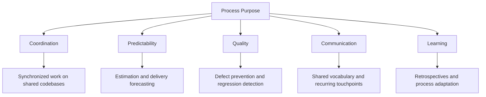
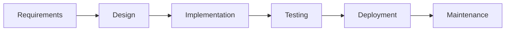
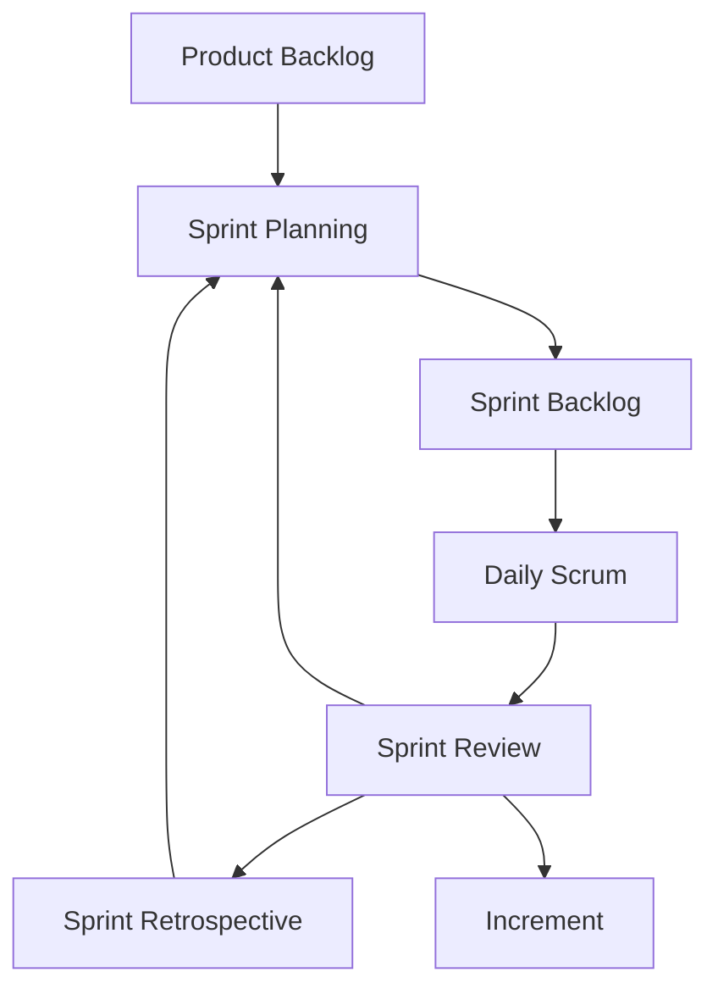
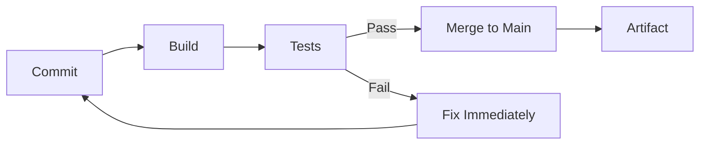
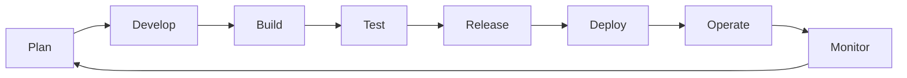

# Methodologies and Processes

## Description

Software engineering is not merely the act of writing code — it is the organized collaboration of people building complex systems under constraints of time, resources, and evolving requirements. The methodologies and processes that govern this collaboration define how teams plan work, coordinate effort, deliver value, and learn from failure. This document surveys the major process frameworks a software engineer will encounter throughout a career, examines how organizational context shapes process selection, and articulates the professional judgment required to adapt processes rather than follow them dogmatically.

## Prerequisites

- [Responsibilities & Daily Work](responsibilities-and-daily-work.md) — understanding the daily rhythms of engineering work, including the software development lifecycle phases that methodologies organize

## Table of Contents

- [The Nature of Process in Software Engineering](#-the-nature-of-process-in-software-engineering)
- [Waterfall: The Plan-Driven Foundation](#-waterfall-the-plan-driven-foundation)
- [The Agile Manifesto: A Philosophical Rupture](#-the-agile-manifesto-a-philosophical-rupture)
- [Scrum: Iterative Delivery Framework](#-scrum-iterative-delivery-framework)
- [Kanban: Flow-Based Process Management](#-kanban-flow-based-process-management)
- [Extreme Programming: Engineering Discipline as Process](#-extreme-programming-engineering-discipline-as-process)
- [Lean Software Development: Eliminating Waste](#-lean-software-development-eliminating-waste)
- [Continuous Integration, Delivery, and Deployment](#-continuous-integration-delivery-and-deployment)
- [DevOps Culture: Bridging Development and Operations](#-devops-culture-bridging-development-and-operations)
- [Process Across Organization Sizes](#-process-across-organization-sizes)
- [Evaluating and Adapting Processes](#-evaluating-and-adapting-processes)
- [Glossary](#glossary)
- [Quick References](#quick-references)
- [Next Steps](#next-steps)

## Content / Material

### 🧭 The Nature of Process in Software Engineering

Every software team operates under some process, whether explicitly defined or implicitly emergent. A team of three engineers coordinating through hallway conversations is following a process — an informal, undocumented one. The question is never whether a team has a process but whether the process is deliberate, appropriate, and understood.

Process in software engineering serves several fundamental purposes:

1. **Coordination.** When multiple engineers modify the same codebase, their work must be synchronized to prevent conflicts, duplicated effort, and inconsistent states.
2. **Predictability.** Stakeholders — product managers, executives, clients — need to anticipate when work will be completed and what it will deliver.
3. **Quality.** Processes encode practices that catch defects early, enforce consistency, and prevent regressions.
4. **Communication.** Processes create shared vocabulary, recurring touchpoints, and artifacts that keep information flowing between people who do not share the same context.
5. **Learning.** Mature processes include mechanisms for teams to reflect on their own effectiveness and adjust.

The history of software methodology is, in large part, a history of discovering that none of these purposes can be served by imposing rigid, universal rules on a discipline that is fundamentally creative and variable. The most effective process is one that the team understands, believes in, and continuously adapts — not one that is perfectly specified in a manual that nobody reads.



A software engineer's relationship with process changes significantly over a career. Early-career engineers experience process as structure — something imposed on them that they must learn to navigate. Mid-career engineers begin to see process as a design problem — a system with trade-offs that can be intentionally shaped. Senior engineers recognize process as a sociotechnical challenge — one that must account for human psychology, organizational politics, and the specific characteristics of the domain and product.

### 💧 Waterfall: The Plan-Driven Foundation

The Waterfall model, formalized by Winston Royce in 1970 though often attributed to earlier defense-industry practices, organizes software development into sequential phases: requirements, design, implementation, testing, deployment, and maintenance. Each phase must be substantially complete before the next begins. Documentation produced in one phase becomes the input for the next.



The Waterfall model is not a single authored methodology but a family of plan-driven approaches that share the assumption that software can be specified upfront, designed comprehensively, and then built and verified against that specification. The classic defense-standard variant — represented by standards such as MIL-STD-1521 and later IEEE 1220 — imposed rigorous documentation requirements and phase-gate reviews.

#### When Waterfall Works

Waterfall remains appropriate in contexts where:

- **Requirements are stable and well-understood.** Embedded systems with fixed hardware interfaces, regulatory compliance software with codified rules, or scientific computing applications with known mathematical formulations.
- **The cost of change is extremely high.** Aerospace firmware, medical device software, or infrastructure systems where post-deployment modification requires extensive recertification.
- **Traceability is mandatory.** Regulated industries require that every line of code trace back to a requirement, and every requirement trace to a stakeholder need. Waterfall's phase-gate structure produces the documentation artifacts that make this traceability possible.

#### When Waterfall Fails

Waterfall fails when the core assumptions do not hold:

- **Requirements are uncertain or evolving.** Consumer software, web applications, and most products serving human behavior cannot specify requirements upfront because users do not know what they want until they see what they do not want.
- **Feedback loops are too long.** A twelve-month development cycle that delivers a product that misses the mark wastes the entire investment. The inability to validate assumptions early is Waterfall's fundamental weakness.
- **The technology is novel.** When the team is exploring new technologies, architectural approaches, or integration patterns, the design cannot be specified in advance because the design space is not yet understood.

The professional software engineer does not dismiss Waterfall. The engineer recognizes that its assumptions about stability and predictability are genuinely met in certain domains, and that the discipline it imposes — thorough documentation, explicit requirements, traceability — has value even in contexts where iterative approaches are preferred. The failure of Waterfall in most of the software industry was not a failure of discipline but a failure to match process to context.

### 🏴 The Agile Manifesto: A Philosophical Rupture

In February 2001, seventeen software practitioners gathered at a ski resort in Utah and produced a document that fundamentally altered the trajectory of software methodology. The Agile Manifesto was not a methodology — it was a statement of values that challenged the assumptions underlying plan-driven development.

The four value statements are well known but worth examining precisely:

> **Individuals and interactions** over processes and tools
> **Working software** over comprehensive documentation
> **Customer collaboration** over contract negotiation
> **Responding to change** over following a plan

The critical nuance is in the qualifier: "over." The Agile Manifesto does not reject processes, tools, documentation, contracts, or plans. It establishes a hierarchy of priorities. When a process conflicts with responding to change, respond to change. When documentation conflicts with working software, prioritize working software. This is a statement of values, not a rejection of discipline.

The twelve principles that accompany the manifesto provide more concrete guidance:

1. Our highest priority is to satisfy the customer through early and continuous delivery of valuable software.
2. Welcome changing requirements, even late in development.
3. Deliver working software frequently, from a couple of weeks to a couple of months.
4. Business people and developers must work together daily.
5. Build projects around motivated individuals.
6. The most efficient and effective method of conveying information is face-to-face conversation.
7. Working software is the primary measure of progress.
8. Agile processes promote sustainable development.
9. Continuous attention to technical excellence and good design enhances agility.
10. Simplicity — the art of maximizing the amount of work not done — is essential.
11. The best architectures, requirements, and designs emerge from self-organizing teams.
12. At regular intervals, the team reflects on how to become more effective, then adjusts its behavior accordingly.

For the software engineer, the Agile Manifesto's most significant contribution is the recognition that software development is an exploration, not a manufacturing process. Unlike factory production, where inputs and outputs are known and the process is optimized for repetition, software development requires learning — about the problem, the technology, and the users — throughout the lifecycle.

The Agile Manifesto also created a problem: by stating values without prescribing practices, it left a vacuum that was filled by an industry of certification programs, consulting frameworks, and branded methodologies that often contradict the values they claim to implement. A software engineer must learn to distinguish between genuine agility and the cargo-cult adoption of Agile rituals.

### 🔄 Scrum: Iterative Delivery Framework

Scrum is the most widely adopted Agile framework. Developed by Ken Schwaber and Jeff Sutherland in the early 1990s and codified in the Scrum Guide, it provides a lightweight structure for iterative product development organized around fixed-length iterations called sprints.

#### Roles

Scrum defines three roles, each with distinct responsibilities:

| Role | Responsibility |
|------|---------------|
| **Product Owner** | Maximizes the value of the product. Owns and orders the product backlog. Represents stakeholder interests. Makes scope decisions. |
| **Scrum Master** | Ensures the team adheres to Scrum practices. Facilitates events. Removes impediments. Coaches the team on self-organization. |
| **Development Team** | A self-organizing, cross-functional team that delivers a potentially releasable increment each sprint. Typically 3–9 members. No sub-teams or hierarchies. |

The Product Owner role is frequently misunderstood as a project manager who assigns tasks. It is not. The Product Owner decides *what* the team builds; the Development Team decides *how*. This separation is a defining characteristic of Scrum and a frequent point of failure when organizations appoint a Product Owner who operates as a command-and-control manager.

The Scrum Master role is equally misunderstood. It is not a team lead or a project coordinator. The Scrum Master is a servant-leader whose primary function is to help the team understand and enact Scrum theory, identify and remove impediments, and foster an environment where the team can do its best work. In practice, this often involves coaching on interpersonal dynamics, challenging organizational dysfunction, and protecting the team from external disruption.

#### Events

Scrum prescribes five events, each serving a specific purpose:

**Sprint Planning.** The team selects items from the top of the product backlog and defines a sprint goal — a coherent objective that explains why the sprint is valuable. The team breaks selected items into tasks and estimates the work. The output is a sprint backlog: a plan for the sprint.

**Daily Scrum (Standup).** A fifteen-minute daily meeting where each team member answers three questions: What did I accomplish yesterday? What will I work on today? Are there any impediments? The purpose is not status reporting to a manager but coordination among peers. The event should foster adaptation of the sprint plan based on daily learning.

**Sprint Review.** At the end of the sprint, the team demonstrates the increment to stakeholders and gathers feedback. This is not a demo — it is a working session where the product is examined, feedback is collected, and the product backlog is updated based on what was learned.

**Sprint Retrospective.** The team reflects on the sprint: what went well, what did not, and what to improve. The retrospective is where process adaptation happens. Without it, Scrum degenerates into mechanical sprinting without learning.



#### Artifacts

Scrum defines three artifacts, each representing a commitment:

- **Product Backlog.** An ordered list of everything known to be needed in the product. The commitment is the Product Goal — a long-term objective that provides coherence to the team's work.
- **Sprint Backlog.** The set of product backlog items selected for the sprint, plus a plan for delivering them. The commitment is the Sprint Goal — a single objective for the sprint.
- **Increment.** The sum of all product backlog items completed during a sprint. The commitment is the Definition of Done — a shared understanding of what it means for work to be complete.

#### Scrum's Strengths and Weaknesses

Scrum's strengths lie in its simplicity and its emphasis on empirical process control — the idea that knowledge comes from experience and decisions should be based on observation. The time-boxed sprint creates a natural rhythm of planning, execution, and reflection. The roles are clear and the artifacts are lightweight.

Scrum's weaknesses emerge when it is adopted mechanically. Many organizations treat sprint planning as a commitment ceremony where the team promises to deliver a fixed scope, turning Scrum into mini-Waterfall. Others strip the retrospective, the most valuable event, because it produces uncomfortable truths. The daily standup becomes a status meeting when the Scrum Master does not facilitate it correctly. The Product Owner becomes a proxy for a distant executive rather than a genuine decision-maker.

The professional engineer recognizes Scrum as a starting point, not an end state. Its prescriptions are minimal because the team is expected to adapt them to its context.

### 📋 Kanban: Flow-Based Process Management

Kanban, derived from the Toyota Production System and adapted for knowledge work by David Anderson in the mid-2000s, takes a fundamentally different approach from Scrum. Rather than organizing work into time-boxed iterations, Kanban visualizes work as it flows through a system and applies constraints to optimize that flow.

#### Core Practices

Kanban is defined by six practices rather than prescriptive roles and events:

1. **Visualize the workflow.** A Kanban board represents the states that work items pass through — typically columns such as To Do, In Progress, Review, and Done. Each work item is a card that moves across the board.

2. **Limit work in progress (WIP).** Each column has a maximum number of items allowed simultaneously. When a column is at its WIP limit, no new items can enter until items leave. This forces the team to finish work before starting new work.

3. **Manage flow.** The team monitors flow metrics — lead time, cycle time, throughput, and work item age — to identify bottlenecks and optimize the system.

4. **Make process policies explicit.** The rules that govern how work moves through the system are documented and visible to everyone.

5. **Implement feedback loops.** Regular cadences for reviewing flow metrics and adjusting the system.

6. **Improve collaboratively, evolve experimentally.** Changes to the process are made as hypotheses tested against flow data, not as top-down mandates.

#### WIP Limits and Their Effects

WIP limits are Kanban's most powerful mechanism. Without them, teams context-switch constantly, starting new work before finishing existing work. The result is that nothing is ever done, lead times are unpredictable, and quality suffers because partially completed work accumulates without the feedback that comes from finishing and deploying.

WIP limits create several beneficial effects:

- **Forced prioritization.** When you can only have three items in progress, you must choose which three are most valuable.
- **Reduced context switching.** Engineers finish work before taking on new work, maintaining focus and deep knowledge of the current item.
- **Exposed bottlenecks.** If items pile up in the Review column, the team knows that review capacity is the constraint and can address it.
- **Predictable lead times.** Stable WIP leads to stable cycle times, which enables probabilistic forecasting.


#### Kanban vs. Scrum

The comparison between Kanban and Scrum is a frequent topic of discussion. The key differences are structural:

| Dimension | Scrum | Kanban |
|-----------|-------|--------|
| Cadence | Fixed-length sprints | Continuous flow |
| Roles | Product Owner, Scrum Master, Dev Team | No prescribed roles |
| Events | Planning, Daily, Review, Retrospective | Cadences for flow review |
| Change during sprint | Generally discouraged | Allowed at any time |
| Metrics | Velocity | Cycle time, lead time, throughput |
| WIP | Implicit (sprint capacity) | Explicit per column |

Neither is universally superior. Scrum provides more structure, which is valuable for teams that need discipline and clear cadences. Kanban provides more flexibility, which is valuable for teams with variable work or support obligations that prevent fixed-sprint planning. Many teams adopt hybrid approaches — time-boxed iterations with WIP limits, or Scrum-like roles with Kanban-style visualization.

### ⚡ Extreme Programming: Engineering Discipline as Process

Extreme Programming (XP), created by Kent Beck in the late 1990s, is unique among methodologies in that it derives its process from engineering practices rather than project management frameworks. XP's contribution is the recognition that technical practices are not optional refinements to a process — they are the foundation that makes any process sustainable.

#### Core Technical Practices

**Pair Programming.** Two engineers share one workstation. One writes code (the driver); the other reviews it in real time (the navigator). The navigator thinks about strategy, design, and potential problems while the driver focuses on implementation. Roles switch frequently.

Pair programming produces several benefits that are difficult to achieve through other means:

- Real-time code review eliminates the need for separate review phases.
- Knowledge sharing prevents single points of failure — both engineers understand the code.
- The sustained attention of two minds catches defects that either individual would miss.
- Design decisions are made collaboratively, producing better designs.

The cost is apparent: two engineers produce one stream of code. The argument for pair programming is that the code produced is of sufficient quality — fewer defects, better design, more shared knowledge — that the total cost of development is lower despite the apparent inefficiency.

**Test-Driven Development (TDD).** TDD inverts the conventional development sequence. Rather than writing code and then tests, the engineer writes a failing test, writes the minimum code that passes the test, and then refactors. This cycle repeats continuously throughout development.

```python
# TDD cycle illustrated as pseudocode

def test_user_registration_with_valid_email():
    user = register_user("alice@example.com", "securePassword123")
    assert user.email == "alice@example.com"
    assert user.is_active == True
    assert user.created_at is not None

# Write this test FIRST — it will fail
# Then write the minimum implementation to make it pass
# Then refactor the implementation for clarity and efficiency

def register_user(email: str, password: str) -> User:
    validate_email(email)
    validate_password(password)
    hashed = hash_password(password)
    user = User(email=email, password_hash=hashed)
    user.created_at = datetime.utcnow()
    user.is_active = True
    save_user(user)
    return user
```

TDD produces a comprehensive test suite that serves as both verification and documentation. It encourages small, focused functions and clear interfaces because code that is easy to test is typically well-designed code.

**Continuous Integration.** Every engineer integrates their work with the main branch at least once per day. Each integration triggers an automated build and test suite. If the build fails, it is fixed immediately — within minutes, not hours.

CI eliminates integration pain that plagued teams using longer integration cycles. When engineers integrate daily, the scope of each integration is small enough that conflicts are trivial to resolve. When integration happens every few weeks, conflicts are massive and take days to untangle.

**Simple Design.** XP advocates building only what is needed now, not what might be needed in the future. The four rules of simple design, attributed to Kent Beck, are:

1. Passes the tests
2. Reveals intention
3. No duplication
4. Fewest elements

**Refactoring.** Continuous improvement of the code's internal structure without changing its external behavior. Refactoring is not a separate phase — it is an ongoing practice that keeps the codebase clean and maintainable.

#### XP's Influence

XP's direct adoption has been modest compared to Scrum, but its technical practices have been absorbed into virtually every modern development approach. TDD, continuous integration, pair programming, and refactoring are now considered standard engineering practices regardless of which management framework a team uses. The professional engineer encounters XP's legacy in the engineering practices that any mature team employs.

### 🚀 Lean Software Development: Eliminating Waste

Lean software development, adapted from the Toyota Production System by Mary and Tom Poppendieck, applies manufacturing efficiency principles to software. Its central insight is that much of the effort in software development does not directly contribute to the value delivered to users — and eliminating that waste is more productive than optimizing the value-adding work.

The seven wastes of software development, adapted from manufacturing:

1. **Partially done work.** Work that is started but not completed — untested code, unreviewed pull requests, features built but not deployed. This is inventory that costs money to maintain and depreciates rapidly.

2. **Extra features.** Functionality that was built "just in case" but is not currently needed. This is overproduction — the most wasteful form of waste because it consumes resources to build, maintain, and document something that provides no value.

3. **Relearning.** Knowledge that is not documented, shared, or retained. When engineers must rediscover information that was known but lost, the team wastes effort.

4. **Handoffs.** Transferring work from one person or team to another with a loss of context. Each handoff introduces delay, misunderstanding, and the potential for information loss.

5. **Task switching.** Context switching between unrelated tasks. Research consistently shows that context switching reduces productivity by 20–40% for knowledge work.

6. **Delays.** Waiting for approvals, waiting for infrastructure, waiting for other teams. Delays are the most visible form of waste and often the most addressable.

7. **Defects.** Bugs that must be found, diagnosed, and fixed. Prevention is cheaper than repair — every defect that escapes to production costs orders of magnitude more to fix than one caught during development.

Lean principles that address these wastes:

- **Eliminate waste.** Ruthlessly remove work that does not contribute to user value.
- **Amplify learning.** Short iterations, frequent deployment, and fast feedback accelerate learning.
- **Decide as late as possible.** Delay irreversible decisions until the last responsible moment, when the most information is available.
- **Deliver as fast as possible.** Small batches, frequent releases, and rapid feedback cycles.
- **Empower the team.** Give engineers the authority to make decisions about their work.
- **Build integrity in.** Quality is not inspected after the fact — it is built into the process through testing, refactoring, and continuous integration.
- **Optimize the whole.** Optimize the entire value stream, not individual components. A locally optimized subsystem can degrade overall performance.

The professional engineer uses Lean thinking to evaluate any process: does this activity reduce waste, accelerate learning, or deliver value? If not, it is a candidate for elimination.

### 🔧 Continuous Integration, Delivery, and Deployment

Continuous practices form the technical backbone that enables iterative methodologies. Without the automation and discipline they provide, agile processes remain aspirational rather than operational.

#### Continuous Integration (CI)

CI is the practice of merging all developers' working copies into a shared mainline several times per day. Each merge triggers an automated build and test sequence. The fundamental principles:

- Maintain a single source repository
- Automate the build
- Make the build self-testing
- Every commit triggers a build on a build server
- Keep the build fast (target: under ten minutes)
- Fix broken builds immediately



CI is not a tool — it is a practice. The tools (Jenkins, GitHub Actions, GitLab CI, CircleCI) implement the practice, but the practice is the discipline of integrating frequently and fixing failures immediately.

#### Continuous Delivery (CD)

Continuous delivery extends CI by ensuring that the software is always in a deployable state. Every change that passes the automated tests and build process is a candidate for immediate release to production. The deployment to production is a business decision, not a technical one — the technical system has already demonstrated that the change is safe.

The key practices of continuous delivery:

- **Deployment pipeline.** An automated sequence that takes code from version control to production, running increasingly thorough checks at each stage.
- **Environment parity.** Testing and production environments should be as similar as possible.
- **Version control everything.** Infrastructure, configuration, database schemas, and application code are all version-controlled.
- **Rollback capability.** If a deployment fails, the system can revert to the previous version automatically.

#### Continuous Deployment

Continuous deployment goes one step further: every change that passes the pipeline is automatically deployed to production without human intervention. This requires extremely high confidence in the automated test suite and monitoring systems. Organizations that practice continuous deployment — many prominent technology companies — deploy hundreds or thousands of times per day.

The progression from CI to CD to continuous deployment represents increasing levels of automation maturity. Most teams begin with CI, evolve toward continuous delivery, and may adopt continuous deployment as their confidence in automation grows.

### 🔗 DevOps Culture: Bridging Development and Operations

DevOps is not a methodology in the traditional sense — it is a cultural movement that addresses the historical divide between software development teams (who build and ship features) and operations teams (who maintain and stabilize the production environment). This divide created a destructive dynamic: developers wanted to ship changes quickly, while operations wanted to minimize changes to reduce risk.

#### The DevOps Philosophy

DevOps resolves this tension through shared responsibility. In a DevOps culture:

- **Developers are responsible for the operational behavior of their code.** They do not throw code over a wall to operations. They participate in on-call rotations, monitor their services, and respond to incidents.
- **Operations engineers participate in design and development.** They provide expertise on reliability, performance, and infrastructure constraints during the design phase, not after deployment.
- **Automation replaces manual processes.** Deployment, monitoring, scaling, and recovery are automated. Manual processes are fragile, slow, and error-prone.
- **Measurement drives improvement.** Teams measure deployment frequency, lead time, mean time to recovery (MTTR), and change failure rate. These metrics (known as the DORA metrics) provide objective evidence of process effectiveness.

#### The DevOps Toolchain

While DevOps is a culture, it is supported by a toolchain that automates the lifecycle of software delivery:



Each stage has associated tool categories: version control (Git), CI/CD (Jenkins, GitHub Actions), containerization (Docker, Kubernetes), infrastructure as code (Terraform, Ansible), monitoring (Prometheus, Grafana, Datadog), and incident management (PagerDuty, Opsgenie).

The specific tools matter less than the principle they embody: automate everything that can be automated, and invest human effort in activities that require judgment, creativity, and empathy.

### 📊 Process Across Organization Sizes

The appropriate process varies dramatically with organization size, product maturity, and market context. A process that works for a five-person startup will suffocate a five-hundred-person enterprise, and vice versa.

#### Startups (1–10 Engineers)

Startups operate under extreme uncertainty. The primary risk is building the wrong product — not building it inefficiently. Process in this context should be minimal:

- Informal coordination (daily conversation, shared workspace)
- Rapid iteration cycles (deploy continuously)
- Minimal documentation (code is the primary documentation)
- Shared responsibility (everyone does everything)
- Direct customer contact (engineers talk to users)

The danger at this stage is not insufficient process but premature process adoption. Implementing Scrum with full ceremonies for a three-person team creates overhead without benefit. The process should be just enough to maintain coordination — typically a weekly planning conversation, a shared task list, and continuous deployment.

#### Growth-Stage Companies (10–100 Engineers)

As teams grow, informal coordination breaks down. The transition from a single team to multiple teams is the most painful process change in a company's history. What worked when everyone knew everything no longer works when information must be deliberately communicated.

Process needs at this stage:

- Defined roles (Product Owners, engineering managers, tech leads)
- Iterative delivery framework (Scrum or Kanban)
- Code review process (pull requests, review standards)
- CI/CD pipeline (automated testing and deployment)
- Architecture documentation (decisions, diagrams, conventions)
- On-call rotation (incident response)

This is where Scrum and Kanban are most commonly adopted — not because they are universally optimal, but because they provide the structure that teams of 5–10 engineers need to coordinate effectively.

#### Enterprise Organizations (100+ Engineers)

Enterprise engineering organizations face coordination challenges at scale. Multiple product lines, shared platforms, regulatory requirements, and organizational politics all constrain process design.

Enterprise process needs:

- Cross-team coordination mechanisms (program-level planning, shared roadmaps)
- Architecture governance (design reviews, API standards, technology evaluations)
- Compliance processes (security reviews, audit trails, change management)
- Knowledge management (internal documentation, architectural decision records)
- Standardized tooling (approved technology stacks, shared CI/CD infrastructure)

Enterprise organizations often adopt SAFe (Scaled Agile Framework), LeSS (Large-Scale Scrum), or Nexus for cross-team coordination. These frameworks are controversial — they address real scaling problems but introduce significant overhead and can become bureaucratic. The professional engineer evaluates these frameworks pragmatically: do they solve the coordination problems this organization actually faces?

### 🔍 Evaluating and Adapting Processes

The most important skill a software engineer develops regarding process is the ability to evaluate whether a process is working and adapt it when it is not. Process is a tool, not a religion.

#### Signs of Process Dysfunction

**Excessive meetings.** When engineers spend more time in process ceremonies than in focused work, the process has become an end rather than a means. The daily standup should take fifteen minutes; if it regularly takes forty-five, something is wrong.

**Mechanical compliance.** When the team goes through the motions of ceremonies without genuine engagement — standups where nobody listens, retrospectives where nobody speaks honestly, sprint planning where the team commits to work they know is unrealistic — the process is theater.

**Metrics gaming.** When the team optimizes for process metrics (velocity, story points, tickets closed) rather than outcomes (value delivered, user satisfaction, system reliability), the measurement system has corrupted the process.

**Resistance to change.** When the team defends process elements by citing the framework's authority rather than the team's experience ("Scrum says we must..."), the process has become dogmatic.

**Ignoring context.** When the team applies the same process to maintenance work, new feature development, exploratory research, and incident response, the process has become context-blind.

#### A Framework for Process Evaluation

```python
def evaluate_process(team, process):
    """Framework for evaluating whether a process serves the team."""

    # 1. Measure outcomes, not activity
    outcomes = {
        "lead_time": measure_lead_time(process),
        "quality": measure_defect_rate(process),
        "team_satisfaction": survey_team_morale(team),
        "stakeholder_satisfaction": survey_stakeholders(team),
        "delivery_predictability": measure_forecast_accuracy(process),
    }

    # 2. Identify waste
    waste = identify_waste(process)
    # Common waste signals:
    # - Work items waiting in queues for extended periods
    # - Frequent context switching
    # - Rework due to misunderstandings
    # - Approvals that add delay without improving quality
    # - Documentation that nobody reads

    # 3. Propose experiments, not revolutions
    experiments = propose_changes(waste, outcomes)

    # 4. Run time-boxed experiments
    for experiment in experiments:
        result = run_experiment(team, experiment, duration="2 sprints")
        if result.improvement:
            adopt_change(process, experiment)
        else:
            revert_and_learn(process, experiment)

    return process
```

The key insight is that process improvement is itself an iterative, empirical activity. The best process improvement methodology is to make small, measurable changes, observe their effects, and keep the changes that work. This is the same empirical philosophy that underlies Scrum and Kanban — applied to the process itself.

#### Process Adaptation Anti-Patterns

**Big bang process changes.** Adopting an entirely new methodology overnight. This is almost always destructive because the team lacks the knowledge to implement the new process correctly and the old process is disrupted before the new one is functional.

**Blame-the-process.** When something goes wrong, attributing the failure to the process rather than to specific practices, decisions, or circumstances. Processes do not fail; implementations of processes fail.

**Framework shopping.** Moving from one methodology to another whenever problems arise, without understanding whether the problems are caused by the methodology or by its implementation. Most process failures are implementation failures.

**Copying without understanding.** Adopting practices from another team or organization without understanding the context that makes those practices effective. A practice that works in a mature organization with experienced engineers may fail in a startup with junior engineers.

The professional engineer treats process as a living system that evolves with the team, the product, and the organization. The goal is not to implement a textbook methodology but to create a process that helps this team deliver value effectively in this context at this time.

## 📝 Learning Tips

- **Observe before judging.** When joining a new team, spend at least two sprints observing the existing process before suggesting changes. Understand why the process exists in its current form.
- **Read the history.** Understanding *why* methodologies emerged — what problems they were solving — is more valuable than memorizing their prescriptions. The Agile Manifesto was a reaction to Waterfall's failures; Kanban was a reaction to Scrum's rigidity; DevOps was a reaction to the development-operations divide.
- **Watch for cargo culting.** Many teams adopt the rituals of a methodology without its underlying principles. Daily standups without self-organization are theater. Sprints without retrospectives are mini-Waterfall. CI without the discipline of fixing broken builds immediately is just automation.
- **Connect process to outcomes.** For any process element, ask: "What outcome does this serve?" If you cannot answer clearly, the element may be waste.

## Glossary

| Term | Definition |
|------|------------|
| Agile | A set of values and principles for iterative software development emphasizing customer collaboration, working software, and responsiveness to change |
| Backlog | An ordered list of work items (features, fixes, technical debt) awaiting implementation |
| Cadence | A regular, repeating pattern of events or deliveries |
| Cargo culting | Adopting the visible practices of a methodology without understanding or implementing its underlying principles |
| CI/CD | Continuous Integration / Continuous Delivery — automation practices for building, testing, and deploying software |
| Cycle time | The time elapsed from when work begins on an item to when it is completed |
| Definition of Done | A shared checklist of criteria that must be met before a work item is considered complete |
| DevOps | A cultural and technical movement bridging software development and IT operations through shared responsibility and automation |
| DORA metrics | Four key metrics for measuring software delivery performance: deployment frequency, lead time, MTTR, and change failure rate |
| Flow | The movement of work items through a system from initiation to completion |
| Impediment | Any obstacle that prevents the team from making progress toward its sprint goal |
| Increment | The sum of all completed product backlog items at the end of a sprint |
| Kanban | A flow-based process management method using visual boards and work-in-progress limits |
| Lean | A methodology focused on eliminating waste and maximizing value in the development process |
| Lead time | The time elapsed from when a work item is requested to when it is delivered |
| MTTR | Mean Time to Recovery — the average time to restore service after a failure |
| Pair programming | A practice where two engineers work together at one workstation, one writing code and the other reviewing |
| Product Owner | The Scrum role responsible for maximizing product value and managing the product backlog |
| Retrospective | A ceremony where the team reflects on its process and identifies improvements |
| SAFe | Scaled Agile Framework — a framework for applying agile practices at enterprise scale |
| Scrum | An iterative delivery framework with defined roles, events, and artifacts |
| Scrum Master | The Scrum role responsible for ensuring the team adheres to Scrum principles and removing impediments |
| Sprint | A fixed-length iteration (typically 1–4 weeks) during which the team delivers a potentially releasable increment |
| Sprint Goal | A concise statement of the objective the team aims to achieve during a sprint |
| TDD | Test-Driven Development — a practice of writing failing tests before writing implementation code |
| Velocity | A measure of the amount of work a Scrum team completes per sprint, typically in story points |
| WIP | Work In Progress — items that have been started but not yet completed |
| Waterfall | A plan-driven development methodology organizing work into sequential phases |
| XP | Extreme Programming — an agile methodology emphasizing engineering practices such as TDD, pair programming, and continuous integration |

## Quick References

- [The Agile Manifesto](https://agilemanifesto.org/) — the foundational document of the agile movement
- [The Scrum Guide](https://scrumguides.org/) — the official definition of Scrum by Ken Schwaber and Jeff Sutherland
- [Kanban: Successful Evolutionary Change for Your Technology Business](https://www.amazon.com/Kanban-Successful-Evolutionary-Technology-Business/dp/0984521402) — David Anderson's foundational book on Kanban for knowledge work
- [Extreme Programming Explained: Embrace Change](https://www.amazon.com/Extreme-Programming-Explained-Embrace-Change/dp/0321246748) — Kent Beck's articulation of XP principles and practices
- [The DevOps Handbook](https://itrevolution.com/the-devops-handbook/) — Gene Kim, Jez Humble, Patrick Debois, and John Willis on DevOps practices
- [Accelerate: The Science of Lean Software and DevOps](https://itrevolution.com/accelerate/) — Nicole Forsgren, Jez Humble, and Gene Kim on measuring and improving software delivery performance
- [Lean Software Development: An Agile Toolkit](https://www.amazon.com/Lean-Software-Development-Agile-Toolkit/dp/0321157408) — Mary and Tom Poppendieck on applying lean principles to software

## Next Steps

- [Building Real Software](building-real-software.md) — the practical tools and technologies that implement these processes in real development work
- [Becoming a Professional](becoming-a-professional.md) — the professionalization journey including workflow, communication, and career development
