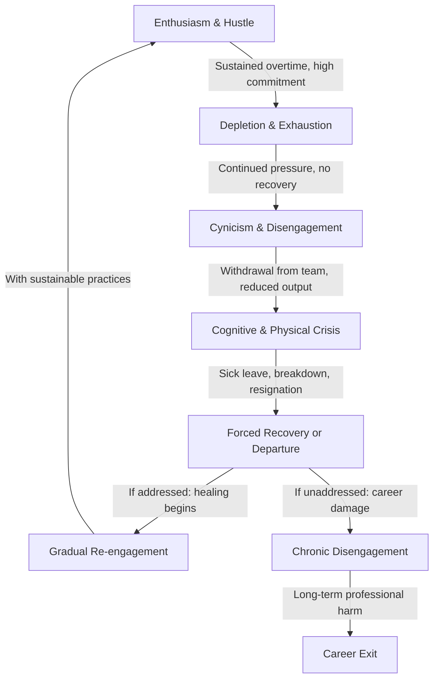

# Sustainability and Burnout Prevention

## Description

Software engineering is a profession of sustained intellectual intensity, and its practitioners face a distinctive pattern of burnout that differs from other knowledge work. This document examines the nature of burnout as defined by the World Health Organization, its specific manifestations in software engineering culture, the early warning signs that precede crisis, and the strategies — individual and organizational — that enable a career spanning decades rather than a few frantic years.

## Prerequisites

- [Responsibilities & Daily Work](responsibilities-and-daily-work.md) — context on the daily demands, rhythms, and pressures of engineering work
- [Career Progression](career-progression.md) — understanding the career trajectory and the points at which burnout risk intensifies

## Table of Contents

- [Defining Burnout](#-defining-burnout)
- [The Software Engineering Burnout Cycle](#-the-software-engineering-burnout-cycle)
- [Why Software Engineering Is Burnout-Prone](#-why-software-engineering-is-burnout-prone)
- [Early Warning Signs and Self-Assessment](#-early-warning-signs-and-self-assessment)
- [Management, Culture, and Organizational Responsibility](#-management-culture-and-organizational-responsibility)
- [Work-Life Boundaries in Remote Work](#-work-life-boundaries-in-remote-work)
- [Sustainable Pace](#-sustainable-pace)
- [Physical Health as Foundation](#-physical-health-as-foundation)
- [Recovery from Burnout](#-recovery-from-burnout)
- [Building Resilience Without Glorifying Suffering](#-building-resilience-without-glorifying-suffering)
- [Career Longevity](#-career-longevity)
- [When to Change Jobs vs When to Change Habits](#-when-to-change-jobs-vs-when-to-change-habits)
- [Glossary](#glossary)
- [Quick References](#-quick-references)
- [Next Steps](#-next-steps)

## Content / Material

### 🧠 Defining Burnout

Burnout is not tiredness. It is not a bad week. It is not the natural consequence of caring about one's work. Burnout is a clinical syndrome recognized by the World Health Organization in the eleventh revision of the International Classification of Diseases (ICD-11), characterized by three dimensions:

1. **Exhaustion** — feelings of energy depletion and reduced capacity to meet the demands of one's role. This is not physical fatigue that sleep resolves; it is a pervasive sense that one's reserves are permanently depleted.
2. **Cynicism or depersonalization** — increased mental distance from one's job, or feelings of negativity or detachment from the work. An engineer who once cared deeply about code quality now submits changes without review. A previously engaged teammate stops attending meetings voluntarily.
3. **Reduced professional efficacy** — diminished accomplishment and a sense of incompetence in one's role. The engineer who could once ship features reliably now struggles to complete even familiar tasks.

The WHO explicitly notes that burnout is an occupational phenomenon, not a medical condition. It arises from chronic workplace stress that has not been successfully managed. This distinction matters: burnout is not a personal failing. It is a systemic outcome of sustained, unmanaged pressure within a professional context.

#### Burnout vs Stress vs Fatigue

Understanding the boundary between normal occupational stress and burnout is essential for early intervention:

| Dimension | Stress | Burnout | Fatigue |
|-----------|--------|---------|---------|
| **Emotional state** | Overengagement | Disengagement | Weariness |
| **Energy** | Hyperactive, then depleted | Depleted from the start | Low but recoverable with rest |
| **Motivation** | Driven, urgent | Apathetic, detached | Present but weakened |
| **Scope** | Work-related, situational | Pervades identity and self-worth | Physical and mental tiredness |
| **Recovery** | Restorative rest helps | Rest alone does not resolve | Adequate sleep and recovery resolve |
| **Cognitive impact** | Anxiety, racing thoughts | Fog, inability to concentrate | Slowness, reduced alertness |

Stress pushes one to overwork; burnout pulls one into disengagement. Fatigue is the body's signal to rest; burnout is the psyche's signal that the relationship with work has become toxic. An engineer experiencing stress may still be productive but unsustainable. An engineer experiencing burnout has often passed the point where individual effort alone can restore function.

#### The Maslach Framework

Christina Maslach's research, which preceded and informed the WHO definition, identifies six domains of work life where mismatch leads to burnout:

1. **Workload** — excessive demands relative to capacity and recovery time
2. **Control** — insufficient autonomy over how work is done
3. **Reward** — inadequate recognition or compensation for effort
4. **Community** — absence of social support, trust, or belonging
5. **Fairness** — perceived inequity in workload, opportunities, or treatment
6. **Values** — conflict between personal values and organizational demands

A software engineer may experience burnout from a single severe mismatch in one domain or from chronic mild mismatches across several. The diagnostic value of this framework is that it shifts the analysis from "what is wrong with this person" to "what is wrong with this person's working conditions."

### 🔄 The Software Engineering Burnout Cycle

Software engineering burnout follows a predictable pattern. Understanding this cycle enables earlier recognition and intervention.



#### Phase 1: Enthusiasm and Hustle

The cycle begins with genuine engagement. A new project, a new role, or a period of high morale produces a phase of intense productivity. The engineer works long hours — not because they are forced to, but because the work is absorbing and the results are visible. This phase is dangerous precisely because it feels good. The dopamine of shipping features, receiving positive code reviews, and solving hard problems masks the accumulating deficit.

In software engineering, this phase is culturally reinforced. The "hustle" narrative — that dedication means longer hours, that passion means weekends — frames overwork as virtue. The engineer internalizes this narrative and mistakes the adrenaline of overcommitment for sustainable performance.

#### Phase 2: Depletion and Exhaustion

The deficit accumulated in Phase 1 becomes undeniable. Sleep does not restore energy. Weekends feel insufficient. The engineer begins to experience persistent fatigue, difficulty concentrating, and irritability. Productivity drops not from lack of effort but from cognitive impairment.

This phase is often misdiagnosed as a personal problem — "I need a vacation," "I am getting older," "I am not motivated enough." The engineer tries individual remedies (meditation apps, productivity systems, weekend rest) without addressing the systemic cause: the workload exceeds the human capacity for sustained intellectual effort.

#### Phase 3: Cynicism and Disengagement

When exhaustion persists despite individual coping efforts, the psyche protects itself through detachment. The engineer stops caring about code quality. Meetings become pointless rituals. Product roadmaps feel arbitrary. The engineer who once volunteered for hard problems now does the minimum required.

This phase is visible to the team. Pull request reviews become perfunctory. The engineer stops participating in design discussions. They may become hostile or sarcastic. Colleagues notice the change but often attribute it to attitude rather than recognizing it as a symptom of burnout.

#### Phase 4: Crisis

If disengagement continues without intervention, the situation escalates to a crisis — a health event, a breakdown, a dramatic reduction in performance, or a resignation. The crisis is the body's and mind's final signal that the current arrangement is unsustainable.

Crises are expensive. For the individual, they may involve medical leave, damaged professional relationships, and a period of recovery that lasts months. For the organization, they involve lost productivity, knowledge loss, and the cost of recruitment and onboarding.

#### Phase 5: Recovery or Departure

After crisis, the engineer either recovers (with support, changed conditions, and time) or leaves the profession. Recovery is possible and common, but it requires addressing the systemic causes, not merely the symptoms. The engineer who returns to the same conditions that caused burnout will relapse.

### 🔍 Why Software Engineering Is Burnout-Prone

Software engineering has structural features that make it unusually susceptible to burnout compared to other professions:

#### Always-On Culture

The global nature of software systems means that engineers are expected to be available beyond traditional working hours. On-call rotations interrupt sleep. Slack messages arrive at midnight. The boundary between work and personal time erodes when the workplace is a laptop that travels everywhere.

The always-on culture is reinforced by distributed teams across time zones. An engineer in London may receive a pull request review request from a colleague in San Francisco at 11 PM London time. The implicit expectation — respond promptly, or block another engineer's progress — creates a sense of obligation that extends far beyond the nominal working day.

#### Imposter Syndrome

Software engineering attracts high performers who compare themselves to the industry's public figures. The result is endemic imposter syndrome — the persistent belief that one's competence is exaggerated and that exposure is imminent. Imposter syndrome drives overwork as a coping mechanism: the engineer works longer hours to compensate for perceived inadequacy, accelerating the path to exhaustion.

The effect is compounded by the field's breadth. No one knows everything. An engineer who is expert in distributed systems may feel inadequate when confronted with machine learning. The constant exposure to domains of ignorance — in an era where every Hacker News thread showcases someone else's expertise — erodes confidence even among genuinely skilled practitioners.

#### Rapid Technological Change

The half-life of application-layer knowledge in software engineering is often estimated at three to five years. Frameworks, libraries, and tools evolve continuously. Engineers feel pressure to stay current, which creates an additional cognitive burden beyond their primary work: learning is work, and it is uncompensated work that happens on personal time for many practitioners.

The fear of obsolescence is not irrational. An engineer who stopped learning in 2018 and relied on a jQuery-centric skill set would find their market value significantly diminished by 2024. The pressure to maintain relevance is real, and it adds a chronic, low-level anxiety that compounds other stressors.

#### On-Call and Incident Response

On-call duty is a uniquely stressful aspect of software engineering. Being responsible for production systems at 3 AM — making consequential decisions under sleep deprivation — is cognitively and emotionally taxing. The adrenaline of incident response, repeated across a rotation, depletes the body's stress-response system.

Organizations that operate critical systems often impose frequent on-call rotations (every four to six weeks) without adequate compensation, recovery time, or operational support. The result is a chronic state of anticipatory anxiety — the engineer is never fully at rest because the next rotation is always approaching.

#### Perfectionism and Quality Pressure

Software engineering culture valorizes precision. A single misplaced character can crash a system. This precision requirement, combined with the visibility of errors in production, creates a psychological environment where mistakes are costly and visible. The engineer internalizes this pressure and develops perfectionist tendencies that make it difficult to disengage or to accept "good enough."

The code review process, while essential for quality, can also become a source of anxiety. An engineer who receives critical feedback on their code may experience it as a personal attack rather than a professional interaction, particularly if the feedback is delivered without care for tone or context.

#### Identity Fusion

Many software engineers identify deeply with their profession. Their social circle consists of engineers. Their hobby is coding. Their reading is technical. When work becomes painful, there is no separation between the professional self and the personal self. The engineer cannot simply "leave work at work" because work has become the primary source of identity and social connection.

This fusion makes burnout more devastating. The engineer does not merely dislike their job — they experience a crisis of identity. "If I am not a good engineer, who am I?" The question is existential, and it requires more than a job change to answer.

### ⚠️ Early Warning Signs and Self-Assessment

Burnout does not arrive suddenly. It develops gradually, and the early signs are often dismissed as normal stress. The following checklist provides a structured self-assessment:

#### Behavioral Indicators

```python
warning_signs = {
    "recovery_failure": {
        "description": "Weekends and vacations no longer restore energy",
        "severity": "moderate",
        "action": "Evaluate workload and recovery practices"
    },
    "avoidance": {
        "description": "Actively avoiding emails, Slack, or work-related communication",
        "severity": "moderate",
        "action": "Examine boundaries and source of avoidance"
    },
    "irritability": {
        "description": "Disproportionate frustration with minor issues or colleagues",
        "severity": "moderate",
        "action": "Monitor patterns and identify triggers"
    },
    "cynicism": {
        "description": "Loss of belief in the value of the work or the team's mission",
        "severity": "high",
        "action": "Urgent: discuss with manager or seek external support"
    },
    "cognitive_impairment": {
        "description": "Difficulty concentrating, making decisions, or recalling information",
        "severity": "high",
        "action": "Urgent: reduce workload and consult health professional"
    },
    "physical_symptoms": {
        "description": "Headaches, insomnia, gastrointestinal issues, chest tightness",
        "severity": "high",
        "action": "Urgent: consult health professional immediately"
    },
    "social_withdrawal": {
        "description": "Avoiding colleagues, skipping team events, isolation",
        "severity": "high",
        "action": "Reach out to trusted colleagues or professional support"
    }
}
```

```python
def assess_burnout_risk(responses: dict) -> str:
    """
    Evaluate self-reported frequency of burnout indicators.
    responses: dict mapping indicator name to frequency score (0-4)
    0 = never, 1 = rarely, 2 = sometimes, 3 = often, 4 = always
    """
    weights = {
        "recovery_failure": 2.0,
        "avoidance": 1.5,
        "irritability": 1.5,
        "cynicism": 3.0,
        "cognitive_impairment": 3.0,
        "physical_symptoms": 3.5,
        "social_withdrawal": 2.5
    }

    weighted_score = sum(
        responses.get(indicator, 0) * weight
        for indicator, weight in weights.items()
    )
    max_possible = sum(4 * w for w in weights.values())
    normalized = weighted_score / max_possible

    if normalized < 0.2:
        return "LOW_RISK: Continue monitoring, maintain recovery practices"
    elif normalized < 0.4:
        return "MODERATE_RISK: Evaluate workload, strengthen boundaries"
    elif normalized < 0.6:
        return "HIGH_RISK: Discuss with manager, consider workload reduction"
    else:
        return "CRITICAL_RISK: Seek professional support immediately"
```

#### The 14-Day Monitoring Approach

A practical method for tracking burnout risk over time:

1. **Daily**: Rate energy level on a 1–10 scale at the end of each workday.
2. **Weekly**: Rate satisfaction with work, relationships, and personal life on a 1–10 scale.
3. **Biweekly**: Review the trend. Declining scores across two consecutive weeks indicate a trajectory that requires intervention.

This method does not diagnose burnout — it provides data. The data enables the engineer to recognize a declining trend before it becomes a crisis. Without measurement, the gradual nature of burnout makes it invisible until the damage is severe.

### 🏢 Management, Culture, and Organizational Responsibility

Burnout is not solely the individual's problem. The organization bears significant responsibility for creating conditions that either prevent or promote burnout.

#### The Manager's Role

Engineering managers are the first line of defense against burnout. Their responsibilities include:

- **Workload monitoring** — Tracking each team member's workload and intervening when it consistently exceeds sustainable levels. This requires regular one-on-ones with genuine inquiry, not status updates.
- **Boundary enforcement** — Protecting the team from unreasonable after-hours expectations, weekend work, and unrealistic deadlines. A manager who sends Slack messages at midnight is modeling unsustainable behavior.
- **Recovery time allocation** — Ensuring that on-call rotations include compensatory time off, that engineers take their vacation days, and that post-incident recovery periods are respected.
- **Psychological safety** — Creating an environment where engineers can say "I am struggling" without fear of career consequences. This requires consistent, trustworthy behavior over time — not a single team offsite with a wellness speaker.

#### Organizational Anti-Burnout Practices

Structural practices that reduce burnout risk:

| Practice | Mechanism | Implementation |
|----------|-----------|----------------|
| **Reasonable on-call limits** | Reduces sleep disruption and anticipatory anxiety | Maximum one week per six weeks, with compensatory time off |
| **Meeting-light days** | Protects deep work time and reduces cognitive fragmentation | Designate two to three days per week with no meetings |
| **Explicit PTO encouragement** | Counteracts the cultural pressure to not take time off | Mandatory minimum vacation, leadership modeling |
| **Post-incident recovery** | Allows physiological and psychological recovery after high-stress events | No major work assignments for 48 hours after major incidents |
| **Technical debt allocation** | Prevents the frustration of working in a degrading codebase | Allocate 20% of sprint capacity to debt reduction |
| **Transparent promotion criteria** | Reduces anxiety about career progression and fairness | Published level frameworks with evidence-based assessment |

#### The Toxicity of "Passion"

A pervasive cultural problem in software engineering is the conflation of passion with willingness to overwork. Job descriptions seek "passionate" engineers. Performance reviews reward "dedication" measured in hours. The implication is that an engineer who works normal hours is insufficiently passionate.

This framing is both inaccurate and harmful. Passion for engineering manifests as curiosity, craftsmanship, and continuous learning — not as willingness to sacrifice health. An organization that equates passion with overwork will burn through its best engineers and be left with those who optimize for visibility over substance.

The alternative is a culture that values output sustainability. The engineer who ships consistent, high-quality work over a decade is more valuable than the one who burns bright for two years and then deploys to a different career.

### 🏠 Work-Life Boundaries in Remote Work

Remote work has expanded the flexibility of software engineering while simultaneously erasing the physical boundaries that once separated work from life.

#### The Boundary Problem

When the office is a room in one's home, the commute that once provided a psychological transition between work mode and personal mode disappears. The engineer rolls out of bed, opens the laptop, and begins working. At the end of the day, they close the laptop — but the work remains in the same physical space, the same mental space, the same ambient anxiety.

Remote work also creates a visibility pressure. The engineer feels compelled to demonstrate productivity through visible activity: quick Slack responses, frequent commits, always-online status. This performance of presence replaces the actual metric of output, and it extends the effective working day well beyond nominal hours.

#### Establishing Boundaries

Effective boundary practices for remote software engineers:

- **Temporal boundaries** — Define a fixed working day and adhere to it. Close the communication tools at the end of the day. Do not check Slack on personal devices outside working hours.
- **Spatial boundaries** — If possible, maintain a dedicated workspace that is separate from living space. The act of leaving the workspace at the end of the day provides the psychological transition that the commute once offered.
- **Communication boundaries** — Establish explicit expectations with teammates about response times outside working hours. "I do not check Slack after 6 PM" is a boundary, not a deficiency.
- **Social boundaries** — Maintain relationships and activities outside the technology industry. Identity diversification reduces the psychological impact of work-related stress.

#### The Async Advantage

Asynchronous communication — where messages do not require immediate response — is one of remote work's genuine benefits for sustainability. When a team defaults to async communication (written updates, recorded videos, threaded discussions), the pressure for immediate response dissolves. Engineers can engage with communication on their own schedule, protecting focus time and reducing the cognitive fragmentation that drives fatigue.

Teams that use synchronous communication as the default (instant messaging, unscheduled calls, real-time editing) recreate the always-on office in the home. The shift to async-first communication is not merely a productivity optimization — it is a sustainability intervention.

### ⚖️ Sustainable Pace

The Agile Manifesto's principles include "Agile processes promote sustainable development. The sponsors, developers, and users should be able to maintain a constant pace indefinitely." This principle is routinely ignored in practice, but it remains the most important insight about long-term engineering productivity.

#### The Mathematics of Sustainable Pace

Sustainable pace is not a feeling — it is a calculation. The human brain has a finite capacity for focused, high-quality cognitive work per day. Research consistently suggests this capacity is approximately four to six hours for knowledge workers. The remaining hours in a working day are consumed by meetings, communication, and low-intensity administrative tasks.

```python
def calculate_sustainable_hours(
    total_work_hours: float,
    meeting_hours: float,
    communication_hours: float,
    admin_hours: float
) -> dict:
    """
    Calculate the balance between cognitively demanding work
    and recovery-integrated work within a day.
    """
    deep_work_capacity = 6.0  # hours of high-quality cognitive work

    available_for_deep_work = (
        total_work_hours - meeting_hours
        - communication_hours - admin_hours
    )

    deep_work_actual = min(available_for_deep_work, deep_work_capacity)
    utilization = deep_work_actual / total_work_hours

    return {
        "deep_work_hours": deep_work_actual,
        "total_hours": total_work_hours,
        "utilization_rate": round(utilization, 2),
        "recommendation": (
            "Sustainable" if total_work_hours <= 8
            else "Exceeds sustainable boundary"
        ),
        "weekly_sustainable_total": round(deep_work_actual * 5, 1)
    }

# Example: a typical day
day = calculate_sustainable_hours(
    total_work_hours=8,
    meeting_hours=2,
    communication_hours=1.5,
    admin_hours=0.5
)
# Result: ~4 hours deep work, sustainable weekly load
```

```python
def overtime_impact_analysis(
    weekly_overtime_hours: float,
    weeks_per_year: float = 48
) -> dict:
    """
    Model the cumulative impact of consistent overtime
    on annual workload and burnout risk.
    """
    standard_weekly = 40
    sustainable_weekly = 40

    annual_overtime = weekly_overtime_hours * weeks_per_year
    excess_fraction = weekly_overtime_hours / standard_weekly

    # Burnout risk model (simplified)
    # Risk increases non-linearly with sustained overtime
    if excess_fraction <= 0:
        risk_level = "Minimal"
    elif excess_fraction <= 0.1:
        risk_level = "Low"
    elif excess_fraction <= 0.25:
        risk_level = "Moderate"
    elif excess_fraction <= 0.5:
        risk_level = "High"
    else:
        risk_level = "Critical"

    return {
        "annual_overtime_hours": annual_overtime,
        "excess_fraction": round(excess_fraction, 2),
        "burnout_risk": risk_level,
        "sustainability_verdict": (
            "Maintainable indefinitely"
            if excess_fraction <= 0.1
            else "Unsustainable beyond 6-12 months"
        )
    }

# Example: 10 hours overtime per week
result = overtime_impact_analysis(weekly_overtime_hours=10)
# Annual overtime: 480 hours, risk: High
```

#### Why Sustainable Pace Fails in Practice

Sustainable pace fails because of misaligned incentives. Short-term metrics (sprint velocity, quarterly OKRs, feature launch dates) reward overwork. The engineer who works sixty hours ships more features this quarter. The engineer who works forty hours ships fewer. Management rewards the visible output without accounting for the invisible cost: the first engineer will crash in six months, and the second will still be productive in ten years.

The solution requires organizational commitment. The team must agree — and management must enforce — that the nominal working week is a maximum, not a minimum. This means pushing back on unrealistic deadlines, refusing to staff projects below sustainable levels, and accepting that some features will ship later in exchange for a team that ships consistently for years.

#### The Sabbath Principle

The concept of intentional rest has deep roots in human civilization. The Sabbath principle — setting aside regular, protected time for rest and recovery — is not merely a religious observance. It is a design principle for sustainable human activity. The engineer who works every day without interruption is not more productive; they are accumulating a deficit that will eventually demand payment with interest.

The practical application is straightforward: protect at least one day per week from all work-related activity. Not "I will check email briefly." Not "I will just deploy this one fix." A complete disconnection from work. This practice restores cognitive resources, enables the subconscious processing that produces creative insights, and maintains the psychological separation between work identity and personal identity.

### 🍎 Physical Health as Foundation

Physical health is the substrate on which mental performance depends. An engineer who neglects physical health is operating on borrowed capacity.

#### Sleep

Sleep is the single most important health behavior for cognitive performance. During sleep, the brain consolidates memories, clears metabolic waste products, and repairs neural connections. Sleep deprivation degrades every cognitive function relevant to software engineering: attention, working memory, problem-solving, and emotional regulation.

The recommended minimum is seven to nine hours per night for adults. Engineers who routinely sleep fewer than seven hours accumulate a sleep deficit that impairs judgment, reduces creativity, and increases error rates. The engineer who works until midnight and rises at six AM is not gaining productivity — they are trading quality for hours.

#### Movement

Sedentary work — sitting at a desk for eight or more hours — is associated with increased risk of cardiovascular disease, metabolic disorders, and chronic pain. For software engineers, who spend the majority of their working hours seated, deliberate movement is a health imperative.

The recommendation is not extreme exercise. A thirty-minute walk daily produces measurable benefits for cardiovascular health, mood regulation, and cognitive function. The walk also provides a cognitive break that often produces the solution to a problem that an hour of staring at the screen did not resolve.

#### Nutrition and Hydration

The relationship between nutrition and cognitive performance is direct. Blood sugar fluctuations from skipped meals or high-sugar snacks produce concentration lapses, irritability, and fatigue. Regular, balanced meals with adequate protein sustain attention and energy throughout the working day. Hydration is similarly fundamental — even mild dehydration degrades cognitive performance.

### 🩹 Recovery from Burnout

Burnout recovery is possible, but it requires a structured approach and realistic expectations about timeline.

#### The Recovery Timeline

Burnout recovery typically proceeds through four stages:

1. **Crisis management** (weeks 1–4) — Immediate reduction of workload. This may involve medical leave, a formal conversation with management, or a temporary reassignment. The objective is to stop the bleeding.
2. **Physical recovery** (months 1–3) — Restoring sleep, exercise, nutrition, and basic health practices. The body's stress-response system needs time to return to baseline. This period often involves medical support.
3. **Psychological recovery** (months 3–9) — Rebuilding motivation, addressing cynicism, and re-engaging with work on one's own terms. Therapy or coaching is often valuable during this phase.
4. **Sustainable re-engagement** (months 6–12+) — Returning to work with new boundaries, revised expectations, and sustainable practices. This phase may involve a role change, a team change, or a job change.

The total recovery timeline is typically six to eighteen months for moderate-to-severe burnout. Engineers who attempt to return to full capacity after a two-week vacation are not recovering — they are relapsing.

#### What Recovery Requires

Recovery requires changes in the conditions that caused the burnout. An engineer who returns to the same workload, the same management, the same on-call rotation, and the same cultural expectations will relapse. The necessary changes may include:

- Reduced workload or adjusted responsibilities
- Changed reporting relationship or team
- Formal boundaries on working hours
- Professional psychological support
- Career re-evaluation (is this the right role, company, or even profession?)

### 💪 Building Resilience Without Glorifying Suffering

Resilience is the capacity to recover from difficulties. It is a genuine and valuable quality. It is also not a substitute for systemic change.

#### The Balance

A helpful distinction: resilience helps one survive unavoidable hardship. It does not justify preventable hardship. An engineer developing resilience to navigate a difficult incident rotation is healthy. An engineer developing resilience to tolerate an unsustainable workload is adapting to a pathological environment.

The goal is to build resilience while simultaneously working to reduce unnecessary suffering. Both are necessary. Resilience without systemic change leads to normalization of toxic conditions. Systemic change without resilience leaves one fragile in the face of genuine, unavoidable difficulty.

#### Resilience Practices

Practices that build genuine resilience:

- **Diversified identity** — Invest in relationships, hobbies, and activities outside of software engineering. The engineer whose entire identity is "engineer" has no refuge when engineering becomes painful.
- **Community investment** — Build and maintain relationships with colleagues, mentors, and friends. Social connection is the strongest predictor of psychological resilience.
- **Reflective practice** — Regular journaling, retrospection, or therapy develops self-awareness that enables early recognition of stress patterns.
- **Physical foundation** — The physical health practices described in the previous section directly support psychological resilience. The brain operates through the body; neglecting the body constrains the mind.
- **Professional boundaries** — Learn to say no to work that exceeds one's capacity. This is not laziness — it is stewardship of the resources that enable long-term contribution.

### 📈 Career Longevity

A thirty-year career in software engineering is achievable, but it requires deliberate sustainability practices from the beginning, not as an afterthought after the first burnout.

#### The Compounding Advantage

The engineers with the longest and most impactful careers are not the ones who worked the most hours in their twenties. They are the ones who maintained consistent, sustainable productivity over decades. The compound effect of steady growth — learning, building judgment, deepening expertise — produces far more lifetime value than a short burst of unsustainable intensity.

A useful analogy: an investment that returns 8% annually for thirty years vastly outperforms one that returns 20% for five years and then loses money. The same principle applies to human capital. The engineer who develops sustainable practices early and maintains them will outperform the one who burns hot and crashes, even if the latter's peak is more dramatic.

#### Strategies for Decade-Scale Careers

1. **Specialize, then generalize** — Deep expertise in a specific domain provides stability. Breadth across adjacent domains provides adaptability. The combination is more sustainable than trying to be expert in everything.
2. **Shift leverage over time** — Early career: personal output (writing code). Mid career: team output (reviewing, mentoring, designing). Late career: organizational output (strategy, standards, architecture). Each shift requires less physical energy and more accumulated wisdom.
3. **Protect health relentlessly** — The body that supports a career for thirty years requires investment from the beginning. Sleep, exercise, and nutrition are not optional.
4. **Build financial resilience** — An engineer with adequate savings has the freedom to leave a toxic situation. Financial pressure is one of the primary reasons engineers remain in burnout-inducing roles. Building financial reserves is a career sustainability strategy.
5. **Maintain curiosity** — The engineers who sustain long careers are the ones who remain genuinely interested in the problems they solve. Cultivating curiosity — through side projects, reading, conference attendance, and teaching — prevents the staleness that precedes disengagement.

### 🔄 When to Change Jobs vs When to Change Habits

Not every experience of burnout requires a job change. Not every job change addresses the underlying cause. Distinguishing between the two is one of the most consequential career decisions an engineer can make.

#### When to Change Habits

The problem is likely internal (habits, boundaries, self-management) when:

- Multiple engineers on the same team are thriving under the same conditions
- The workload is genuinely reasonable, but one's personal boundaries are weak
- The dissatisfaction is recent and correlates with a specific, addressable trigger
- The organization demonstrates willingness to accommodate changes (reduced on-call, adjusted scope, schedule flexibility)

In these cases, the engineer should invest in boundary-setting, communication with management, and personal sustainability practices before concluding that the environment is the problem.

#### When to Change Jobs

The problem is likely external (environment, culture, management) when:

- Multiple team members are experiencing burnout simultaneously
- The organization consistently fails to honor commitments about workload or boundaries
- The culture celebrates overwork as a value rather than an exception
- Management dismisses concerns about sustainability
- The engineer has made genuine efforts to change habits and the situation has not improved
- The organization's values conflict fundamentally with the engineer's values

A job change is a significant intervention. It should be made deliberately, not impulsively. The engineer should first confirm that the problem is environmental (by observing the experiences of others in the same environment) rather than personal (by examining one's own patterns and seeking feedback).

#### The Diagnostic Framework

```python
def diagnose_burnout_source(observations: dict) -> str:
    """
    Evaluate whether burnout factors are primarily
    environmental or personal.
    """
    environmental_signals = [
        observations.get("team_mates_burning_out", False),
        observations.get("management_dismisses_concerns", False),
        observations.get("culture_glorifies_overwork", False),
        observations.get("workload_unreasonable", False),
        observations.get("boundary_violations_routine", False),
    ]

    personal_signals = [
        observations.get("boundary_setting_weak", False),
        observations.get("perfectionism_excessive", False),
        observations.get("identity_fused_with_work", False),
        observations.get("recovery_practices_absent", False),
        observations.get("saying_no_difficult", False),
    ]

    env_count = sum(environmental_signals)
    personal_count = sum(personal_signals)

    if env_count >= 3:
        return (
            "PRIMARILY_ENVIRONMENTAL: "
            "Consider organizational change or role adjustment"
        )
    elif personal_count >= 3:
        return (
            "PRIMARILY_PERSONAL: "
            "Invest in habits, boundaries, and practices first"
        )
    else:
        return (
            "MIXED: "
            "Address both dimensions; start with personal changes "
            "while monitoring environmental response"
        )
```

## Glossary

| Term | Definition |
|------|------------|
| **Burnout** | A syndrome of exhaustion, cynicism, and reduced professional efficacy resulting from chronic workplace stress, as defined by the WHO (ICD-11) |
| **Sustainable pace** | A working rhythm that can be maintained indefinitely without degradation of health, quality, or well-being |
| **Imposter syndrome** | A psychological pattern in which an individual doubts their accomplishments and fears being exposed as inadequate |
| **On-call** | The practice of having engineers available to respond to production incidents outside normal working hours |
| **Code review** | The practice of examining another engineer's code changes before integration, serving both quality and knowledge-sharing functions |
| **Deep work** | Cognitively demanding work that requires sustained focus and produces high-value output |
| **Psychological safety** | The belief that one will not be punished or humiliated for speaking up with ideas, questions, concerns, or mistakes |
| **Async-first communication** | A communication model where asynchronous messaging is the default, and synchronous interaction is the exception |
| **Identity fusion** | The degree to which an individual's personal identity is intertwined with their professional role |
| **Maslach Burnout Inventory** | The standard research instrument for measuring burnout across the six domains of work life |
| **Technical debt** | The accumulated cost of expedient, short-term coding decisions that degrade long-term maintainability |
| **Sabbath principle** | The practice of setting aside regular, protected time for complete disconnection from work |

## Quick References

- [Maslach Burnout Inventory — Overview](https://www.maslach.com/resources) — the standard instrument for measuring burnout across six work-life domains
- [WHO ICD-11 — Burn-out](https://icd.who.int/browse11/l-m/en#/http%3a%2f%2ficd.who.int%2fBrowse11%2fl-m%2fen%2f%23%231431133554) — the World Health Organization's classification of burnout as an occupational phenomenon
- [The Deep Work Hypothesis — Cal Newport](https://www.calnewport.com/books/deep-work/) — research on sustained focus and its relationship to professional productivity
- [Sustainable Pace — Agile Alliance](https://www.agilealliance.org/glossary/sustainable-development/) — the Agile Manifesto principle on sustainable development pace

## Next Steps

- [Compensation & Negotiation](compensation-and-negotiation.md) — balancing financial incentives with sustainability and well-being
- [Career Progression](career-progression.md) — advancing through career levels without sacrificing long-term health
- [Why Health Matters](../../level-up/healthy-living/intro/why-health-matters.md) — the physical health foundation that supports engineering longevity
