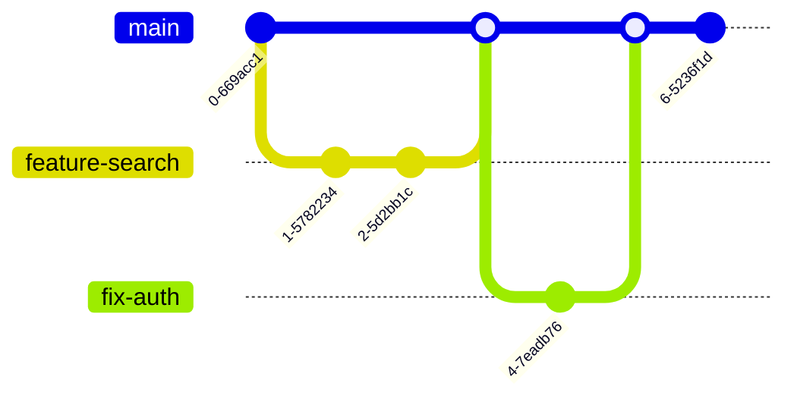

# The Modern Developer's Toolchain and Workflow

## Description

A comprehensive survey of the tools, platforms, and workflows that define professional software engineering practice. This document examines the complete developer toolchain — from code editors and version control to containerization, cloud platforms, CI/CD, observability, and documentation — and describes how these tools integrate into the daily workflow of a practicing engineer.

## Prerequisites

- [Building Real Software](building-real-software.md) — foundational understanding of Git, web technologies, databases, and APIs
- [Responsibilities & Daily Work](responsibilities-and-daily-work.md) — context for how daily work is structured and what responsibilities an engineer carries

## Table of Contents

- [Code Editors and IDEs](#code-editors-and-ides)
- [Version Control Workflow](#version-control-workflow)
- [Package Managers](#package-managers)
- [Containerization](#containerization)
- [Cloud Platforms](#cloud-platforms)
- [CI/CD Tools and Pipelines](#cicd-tools-and-pipelines)
- [Monitoring and Observability](#monitoring-and-observability)
- [Documentation Tools](#documentation-tools)
- [The Daily Workflow — From Ticket to Deployment](#the-daily-workflow--from-ticket-to-deployment)
- [Toolchains Across Specializations](#toolchains-across-specializations)
- [Tool Fatigue and the Primacy of Depth](#tool-fatigue-and-the-primacy-of-depth)
- [Glossary](#glossary)
- [Quick References](#quick-references)
- [Next Steps](#next-steps)

## Content / Material

### 🛠️ Code Editors and IDEs

The code editor is where a software engineer spends the majority of their working hours. Choosing the right editor and configuring it effectively is not a trivial decision — it directly affects productivity, code quality, and the speed at which an engineer can navigate and understand a codebase.

#### The Spectrum from Text Editor to IDE

Editors exist on a spectrum from minimal text editors to full integrated development environments (IDEs). The distinction matters because the choice determines what capabilities are built in versus what must be assembled from plugins.

A **text editor** provides syntax highlighting, basic code navigation, and file management. Examples include Vim, Neovim, Sublime Text, and Emacs. These editors are fast, lightweight, and highly customizable. They load instantly even on large projects, and they consume minimal system resources. The tradeoff is that advanced features — debugger integration, refactoring tools, project-wide search, and language server protocol (LSP) support — must be configured manually through plugins and configuration files.

An **IDE** provides all of the editor's capabilities plus integrated tooling: a debugger, a profiler, build system integration, version control support, database tools, and deep language understanding through syntax trees and type information. JetBrains products (IntelliJ IDEA, PyCharm, WebStorm, GoLand, RustRover) are the most prominent commercial IDEs. Visual Studio (not Visual Studio Code) is Microsoft's full IDE for .NET development. These tools consume more resources but provide capabilities that significantly reduce the cognitive overhead of complex tasks.

**Visual Studio Code** occupies a unique middle ground. It is technically a text editor with an extension ecosystem so rich that it approximates an IDE. Its popularity among professional engineers is now dominant. VS Code ships with integrated terminal support, Git integration, and a debugging adapter protocol that enables debugging for virtually any language through extensions. The extension marketplace includes language servers for intelligent code completion, linter integrations, formatter integrations, remote development tools, and container management. The cost of this flexibility is configuration time — a productive VS Code setup requires deliberate investment in extensions, settings, and keybindings.

#### Language Server Protocol

The **Language Server Protocol (LSP)** is the technical standard that enables rich code intelligence across editors. A language server is a separate process that analyzes code in real time and provides completions, diagnostics (errors and warnings), go-to-definition, find-references, and rename capabilities. Any editor that implements the LSP client can communicate with any language server, which means the same Python language server works in VS Code, Vim, Emacs, and Sublime Text.

This standardization has made the editor choice less consequential than it was a decade ago. An engineer using Neovim with LSP gets the same code intelligence as an engineer using VS Code. The difference is in the surrounding experience — terminal integration, debugging, and visual feedback — not in the code understanding itself.

#### Editor Configuration as Code

Professional teams encode their editor expectations in configuration files checked into version control. These files ensure consistency across the team:

```
project-root/
├── .editorconfig          # Indentation, line endings, encoding
├── .vscode/
│   ├── settings.json      # Project-specific VS Code settings
│   ├── extensions.json    # Recommended extensions
│   └── launch.json        # Debug configurations
├── .idea/                 # JetBrains project settings (often gitignored)
└── pyproject.toml         # Python tool configuration (Ruff, Black, mypy)
```

The `.editorconfig` file is editor-agnostic — it tells any compliant editor to use 4-space indentation for Python, 2-space indentation for YAML, UTF-8 encoding, and LF line endings. The VS Code workspace settings might specify which linter to use, which formatter to run on save, and which test runner to integrate with. These configuration-as-code practices ensure that every team member's editor behaves identically, eliminating formatting debates and environment-specific bugs.

#### Remote Development

Modern development frequently involves working on code that lives on a remote server — a cloud VM, a container, or a Kubernetes pod. VS Code's Remote Development extensions and JetBrains' Gateway enable engineers to open a remote project in a local editor while the code, build tools, and runtime execute on the remote machine. This capability has become essential for working with large monorepos, developing against production-like environments, and maintaining consistent tooling across team members regardless of their local operating system.

#### What to Choose

The choice of editor is ultimately a matter of professional habit, not inherent superiority. A senior engineer using Vim is not more productive than one using VS Code — they are productive because they have mastered their tools through years of deliberate practice. The recommendation for an engineer beginning their career: start with VS Code. It has the lowest barrier to entry, the largest community, and the most comprehensive extension ecosystem. As you gain experience, explore alternatives if curiosity or specific needs drive you toward them. The goal is fluency in one tool, not familiarity with many.

### 🔀 Version Control Workflow

Version control is the backbone of professional software development. The tools and practices described here extend beyond the basics of Git commands into the workflow conventions that teams use to coordinate, review, and ship code.

#### Branching Strategies

A branching strategy defines how developers create, name, merge, and delete branches. The strategy determines how work is isolated, how releases are managed, and how the team coordinates concurrent development.

**Trunk-based development** is the dominant strategy in modern teams. All developers merge their changes into a single long-lived branch (usually `main` or `trunk`) frequently — ideally at least once per day. Feature branches, when used, are short-lived (one to two days). Incomplete features are hidden behind feature flags rather than living on long-lived branches. This strategy minimizes merge conflicts, keeps the codebase in a deployable state at all times, and forces frequent integration.



**Git Flow** uses two long-lived branches: `main` (production-ready code) and `develop` (integration branch). Feature branches are created from `develop`, merged back into `develop`, and eventually released to `main`. This strategy provides more structure but creates more overhead. It was popular in the 2010s but has largely been superseded by trunk-based development except in projects with scheduled releases.

**Release branching** creates a branch for each release (e.g., `release/2.1.0`). Bug fixes are applied to the release branch and cherry-picked back to `develop`. This strategy is common in projects with versioned releases — mobile apps, desktop software, and libraries distributed through package managers.

The choice of branching strategy is not arbitrary. It reflects the team's deployment frequency, release model, and risk tolerance. Teams that deploy continuously favor trunk-based development. Teams that release quarterly favor release branching. The strategy should be documented in the project's contributing guide, and deviations should be intentional.

#### Pull Request and Merge Request Workflow

A **pull request** (GitHub terminology) or **merge request** (GitLab terminology) is a proposal to merge a set of changes from one branch into another. It is the primary mechanism for code review and the gate through which all changes must pass before reaching the main branch.

The lifecycle of a pull request:

1. **Creation** — The developer pushes a branch and opens a PR with a title, description, and reference to the related ticket.
2. **Automated checks** — CI runs linters, tests, type checkers, and build verification. These must pass before review begins.
3. **Human review** — One or more reviewers read the code, leave comments, request changes, or approve.
4. **Revision** — The author addresses feedback, pushes additional commits, and requests re-review.
5. **Approval and merge** — Once all reviewers approve and all checks pass, the PR is merged using a merge commit, squash merge, or rebase.

The quality of a pull request determines how efficiently the review process proceeds. A well-structured PR addresses a single concern, includes a description of the motivation and approach, references the ticket number, and contains changes small enough to review in under thirty minutes. A PR that touches fifteen files across four unrelated concerns forces reviewers to hold multiple contexts simultaneously, which increases the probability that bugs and design issues are missed.

#### Code Review Conventions

Code review is both a quality gate and a knowledge-sharing mechanism. The conventions around review vary across teams, but several principles are universal:

- **Review promptly.** A PR that sits for three days blocks the author and creates merge conflict risk. Most teams expect review feedback within one business day.
- **Be specific.** "This needs improvement" is unhelpful. "This function handles three separate concerns — validation, transformation, and persistence. Consider splitting it into three functions" is actionable.
- **Separate blocking from non-blocking.** Some feedback must be addressed before merge (bugs, security issues, logic errors). Other feedback is a suggestion (naming preferences, style alternatives). Reviewers should distinguish between the two so authors know what is mandatory versus optional.
- **Focus on the code, not the author.** The comment "this approach has a performance concern when the input list exceeds ten thousand items" is constructive. The comment "you clearly did not think about performance" is not.
- **Approve with comments.** If the code is fundamentally sound but has minor suggestions, approve it and leave the suggestions as non-blocking comments. This prevents the review from becoming a bottleneck for trivial issues.

#### Monorepo vs. Polyrepo

A **monorepo** stores all of an organization's code in a single repository. A **polyrepo** stores each project or service in its own repository. The choice has significant implications for tooling, CI/CD, code sharing, and developer experience.

Monorepos simplify code sharing — importing a shared library is as simple as referencing a directory path. They enforce a single version of build tooling and configuration. They enable atomic cross-project changes — a single commit can update an API, its client, and its documentation. The downside is that CI/CD must be smarter: only the affected parts of the repository should be rebuilt and tested. Tools like Bazel, Nx, Turborepo, and Pants provide this capability.

Polyrepos provide natural boundaries — each repository has its own CI/CD pipeline, its own access controls, and its own release cycle. Services are loosely coupled at the repository level, which enforces clean API boundaries. The downside is code duplication, version drift across shared libraries, and the overhead of coordinating changes across multiple repositories.

Most large technology companies (Google, Meta, Microsoft) use monorepos. Most smaller teams and open-source projects use polyrepos. The trend is toward monorepos as tooling improves, but the choice depends on organizational structure and team size.

### 📦 Package Managers

Package managers automate the installation, updating, and removal of software dependencies. Every modern programming language has at least one package manager, and understanding how they work is essential for professional development.

#### The Role of Package Managers

No professional project is built entirely from scratch. Applications depend on libraries for HTTP clients, database drivers, cryptographic operations, date manipulation, testing frameworks, and hundreds of other capabilities. Manually downloading, versioning, and updating these dependencies is impractical at scale. Package managers solve this by maintaining a registry of available packages, resolving version conflicts, downloading packages and their transitive dependencies, and recording the exact versions used in a lockfile.

A **lockfile** is critical for reproducibility. Without it, two developers on the same team might install different versions of a dependency, leading to subtle bugs that are difficult to reproduce. The lockfile records the exact version of every installed package (including transitive dependencies) and the integrity hash of each package. Running `npm ci` or `pip install -r requirements.txt` with a lockfile guarantees that every developer and every CI pipeline installs identical dependencies.

#### Ecosystem-Specific Tools

Each language ecosystem has developed its own package management conventions:

- **JavaScript/Node.js** — npm (the default), yarn, and pnpm. Packages are published to the npm registry. The `package.json` file declares dependencies, scripts, and project metadata. The `package-lock.json` (npm) or `yarn.lock` (yarn) is the lockfile.
- **Python** — pip (the standard tool), with virtual environments (venv, virtualenv) to isolate project dependencies. `pyproject.toml` (with tools like Poetry or PDM) or `requirements.txt` declare dependencies. `poetry.lock` or `pip-tools` manage lockfiles.
- **Rust** — Cargo, which handles dependencies, building, testing, documentation generation, and publishing. `Cargo.toml` declares dependencies and `Cargo.lock` records resolved versions.
- **Go** — Go modules, which use `go.mod` to declare dependencies and `go.sum` for integrity verification. Go modules are proxied through the Go module proxy by default, which improves build reproducibility.
- **Java/JVM** — Maven (with `pom.xml`) or Gradle (with `build.gradle`). Maven is declarative and convention-driven; Gradle is programmatic and more flexible. Both resolve dependencies from Maven Central.

#### Dependency Management as Risk

Dependencies are not free. Every dependency introduces risk: it may contain bugs, security vulnerabilities, or abandoned maintenance. A package with ten million weekly downloads is unlikely to disappear, but a package with fifty downloads might be unmaintained. Engineers evaluate dependencies before adoption by checking the maintainer's activity, the issue tracker responsiveness, the release frequency, the test coverage, and the license compatibility.

**Dependency updates** are an ongoing maintenance responsibility. Automated tools like Dependabot (GitHub), Renovate, and Snyk monitor dependencies for known vulnerabilities and new versions. They open pull requests automatically when a dependency has a security patch or a new minor version. Teams that ignore these updates accumulate technical debt — eventually, the accumulated updates become so large that upgrading is a major project rather than a routine maintenance task.

#### Private Registries and Enterprise Packages

Organizations often maintain private package registries for internal libraries that should not be published publicly. npm Enterprise, Artifactory (JFrog), and AWS CodeArtifact are common solutions. The configuration for private registries lives in project-level configuration files (`.npmrc`, `pyproject.toml`) so that CI/CD pipelines can resolve private dependencies without manual intervention.

### 🐳 Containerization

Containerization packages an application and its dependencies into an isolated, portable unit that runs consistently across environments. It has become the standard method for deploying and running modern applications.

#### Docker Fundamentals

A **container** is a lightweight, standalone, executable unit of software that packages application code together with its dependencies, libraries, and configuration. Containers share the host operating system's kernel but run in isolated user spaces. This makes them far more efficient than virtual machines, which each run a complete operating system.

A **Docker image** is a read-only template for creating containers. Images are built from a `Dockerfile` — a text file with instructions for assembling the image layer by layer. Each instruction in a Dockerfile creates a new layer in the image, and Docker caches layers to speed up rebuilds.

```dockerfile
FROM node:20-alpine

WORKDIR /app

COPY package.json package-lock.json ./
RUN npm ci --production

COPY . .

EXPOSE 3000

CMD ["node", "server.js"]
```

Each instruction in this Dockerfile has a purpose. `FROM` specifies the base image — a minimal Node.js runtime on Alpine Linux. `WORKDIR` sets the working directory. The separate `COPY` of `package.json` before `COPY . .` ensures that dependency installation is cached independently of code changes — only when `package.json` or `package-lock.json` change does `npm ci` re-run. `EXPOSE` documents the port the application listens on. `CMD` specifies the process to start when the container runs.

#### Container Registries

A **container registry** stores Docker images for distribution. Docker Hub is the public default, hosting millions of images. Private registries include Amazon Elastic Container Registry (ECR), Google Container Registry (GCR), GitHub Container Registry (GHCR), and self-hosted registries like Harbor.

The typical workflow: a CI pipeline builds the image, tags it with a version identifier or commit SHA, and pushes it to a registry. A deployment system (Kubernetes, ECS, or a simple `docker pull`) pulls the image from the registry and starts the container. This decouples the build process from the deployment environment — the same image that runs in staging runs in production.

#### Docker Compose for Local Development

**Docker Compose** defines and runs multi-container applications for local development. A `docker-compose.yml` file declares the services, networks, and volumes that compose the application:

```yaml
services:
  api:
    build: ./backend
    ports:
      - "3000:3000"
    environment:
      - DATABASE_URL=postgresql://postgres:password@db:5432/app
    depends_on:
      - db
      - redis

  frontend:
    build: ./frontend
    ports:
      - "5173:5173"
    depends_on:
      - api

  db:
    image: postgres:16
    environment:
      - POSTGRES_PASSWORD=password
    volumes:
      - pgdata:/var/lib/postgresql/data

  redis:
    image: redis:7-alpine

volumes:
  pgdata:
```

This file enables a developer to run `docker compose up` and have the entire application stack — API server, frontend, database, and cache — running in containers with a single command. No manual installation of PostgreSQL, Redis, or Node.js is required on the developer's machine. The environment is identical to every other developer's environment and to the CI environment.

#### Container Security

Containers share a kernel with the host, which means a container escape vulnerability can compromise the entire host system. Container security practices include using minimal base images (Alpine or distroless images instead of full Ubuntu), scanning images for known vulnerabilities (with tools like Trivy, Snyk, or Docker Scout), running containers as non-root users, and never storing secrets in image layers.

### ☁️ Cloud Platforms

Cloud platforms provide on-demand computing resources — virtual machines, databases, storage, networking, and managed services — without upfront hardware investment. Understanding the major platforms and their core services is essential for deploying and operating modern applications.

#### The Big Three

**Amazon Web Services (AWS)** is the largest cloud provider with the most extensive service catalog. AWS launched in 2006 and has dominated the market since. Its core services include EC2 (virtual machines), S3 (object storage), RDS (managed relational databases), Lambda (serverless functions), ECS/EKS (container orchestration), CloudFront (CDN), Route 53 (DNS), and IAM (identity and access management). AWS's breadth is both a strength and a challenge — the sheer number of services requires deliberate study to navigate.

**Google Cloud Platform (GCP)** differentiates through data analytics, machine learning, and its Kubernetes heritage (Google created Kubernetes). Core services include Compute Engine (virtual machines), Cloud Storage (object storage), Cloud SQL (managed databases), Cloud Functions (serverless), GKE (managed Kubernetes), BigQuery (data warehouse), and Cloud Run (serverless containers). GCP's documentation is widely regarded as the most developer-friendly of the three.

**Microsoft Azure** integrates tightly with the Microsoft ecosystem — Active Directory, .NET, Visual Studio, and GitHub. Core services include Virtual Machines, Blob Storage, Azure SQL, Azure Functions, AKS (managed Kubernetes), and Azure DevOps. Azure is dominant in enterprises that already use Microsoft products.

#### What a Developer Needs to Know

A software engineer does not need to master every cloud service. The essential knowledge areas are:

- **Compute** — How to run code in the cloud: virtual machines, containers, serverless functions, and the trade-offs between them.
- **Storage** — Object storage (S3, GCS, Blob Storage) for files and assets. Relational databases (RDS, Cloud SQL, Azure SQL) for structured data. NoSQL databases (DynamoDB, Firestore, Cosmos DB) for specific use cases.
- **Networking** — Load balancers, CDNs, DNS, VPCs (virtual private clouds), and firewalls. Understanding how requests flow from a user through cloud infrastructure to your application.
- **Identity and access** — IAM policies that control who can access what. This is a security-critical area where misconfigurations have caused major breaches.
- **Serverless** — Functions-as-a-service (Lambda, Cloud Functions, Azure Functions) for event-driven workloads. Containers-as-a-service (Cloud Run, Fargate) for simplified container deployment without cluster management.

#### Infrastructure as Code

**Infrastructure as Code (IaC)** is the practice of defining cloud resources in version-controlled configuration files rather than through manual console clicks. Terraform (HashiCorp), Pulumi, AWS CloudFormation, and the Google Cloud Deployment Manager are the primary tools. IaC ensures that infrastructure changes are reviewable, reproducible, and reversible — the same principles that apply to application code.

A simplified Terraform example:

```python
# Pseudocode illustrating infrastructure-as-code concepts
resource = {
    "type": "aws_instance",
    "name": "api_server",
    "config": {
        "ami": "ami-0c55b159cbfafe1f0",
        "instance_type": "t3.medium",
        "vpc_security_group_ids": [security_group.id],
        "tags": {"Environment": "production", "Service": "api"}
    }
}
```

When an engineer changes this file and runs `terraform apply`, the tool calculates the diff between the desired state (the file) and the actual state (the running infrastructure) and makes the minimum changes necessary. This is conceptually identical to how Git tracks code changes — infrastructure becomes auditable, diffable, and collaborative.

### 🔄 CI/CD Tools and Pipelines

Continuous Integration and Continuous Deployment (CI/CD) automate the process of validating, building, and releasing software. Every modern engineering team relies on CI/CD as the primary quality gate between a developer's commit and production deployment.

#### Continuous Integration

**Continuous Integration (CI)** means that every code change is automatically built and tested against the main branch. The CI server monitors the repository for new pushes, checks out the code, installs dependencies, runs linters and type checkers, executes the test suite, and builds the application. If any step fails, the team is notified immediately.

The value of CI is immediate feedback. Without CI, a developer might write code for hours or days before discovering that their changes conflict with a teammate's work, that a test is broken, or that the build fails. With CI, failures are detected within minutes of the push, while the context is still fresh in the developer's mind.

#### Continuous Deployment and Delivery

**Continuous Delivery** means that every change that passes CI is automatically deployed to a staging environment, ready for manual approval before production. **Continuous Deployment** goes one step further: every change that passes CI is automatically deployed to production without manual intervention.

The distinction matters. Continuous Delivery is safer — a human verifies the change before it reaches users. Continuous Deployment is faster — no manual gate delays the release. Most high-maturity teams practice continuous deployment for low-risk changes (feature flags, configuration updates) and continuous delivery for high-risk changes (database schema migrations, payment system modifications).

#### GitHub Actions

GitHub Actions is the most widely adopted CI/CD platform for open-source and many commercial projects. It is tightly integrated with GitHub repositories — workflows are defined in YAML files stored in the `.github/workflows/` directory.

A comprehensive CI/CD pipeline:

```yaml
name: CI/CD Pipeline
on:
  push:
    branches: [main]
  pull_request:
    branches: [main]

jobs:
  lint-and-test:
    runs-on: ubuntu-latest
    steps:
      - uses: actions/checkout@v4
      - uses: actions/setup-node@v4
        with:
          node-version: 20
          cache: npm
      - run: npm ci
      - run: npm run lint
      - run: npm run typecheck
      - run: npm test -- --coverage
      - run: npm run build

  deploy-staging:
    needs: lint-and-test
    if: github.ref == 'refs/heads/main'
    runs-on: ubuntu-latest
    steps:
      - uses: actions/checkout@v4
      - run: docker build -t myapp:${{ github.sha }} .
      - run: docker push registry.example.com/myapp:${{ github.sha }}
      - run: kubectl set image deployment/myapp myapp=registry.example.com/myapp:${{ github.sha }}

  deploy-production:
    needs: deploy-staging
    runs-on: ubuntu-latest
    environment: production
    steps:
      - run: kubectl set image deployment/myapp myapp=registry.example.com/myapp:${{ github.sha }} -n production
```

This pipeline demonstrates the standard pattern: linting and testing run on every push and pull request; staging deployment runs only on pushes to `main` after tests pass; production deployment runs after staging deployment succeeds and requires manual approval (the `environment: production` declaration triggers a protection rule in GitHub).

#### GitLab CI

GitLab CI is the integrated CI/CD platform for GitLab repositories. It uses a `.gitlab-ci.yml` file at the repository root. GitLab CI's distinguishing feature is its tight integration with GitLab's built-in container registry, package registry, and deployment features. For teams already on GitLab, it provides a seamless experience without external integrations.

#### Jenkins

**Jenkins** is the oldest widely-used CI/CD tool, first released in 2011 (as Hudson). It is a self-hosted, plugin-based automation server. Jenkins's plugin ecosystem includes over 1,800 plugins for every conceivable integration — build tools, test frameworks, deployment targets, and notification channels.

Jenkins's age is both its strength (maturity, extensive documentation, large community) and its weakness (complex configuration, dated user interface, maintenance burden). Many organizations are migrating from Jenkins to cloud-native alternatives (GitHub Actions, GitLab CI, Buildkite, CircleCI) but Jenkins remains prevalent in enterprises with large existing installations.

#### Pipeline Design Principles

Effective CI/CD pipelines follow several principles:

- **Fail fast.** Run the fastest checks first (linting, formatting) before slower checks (integration tests, build). A formatting error should be caught in seconds, not minutes.
- **Parallelize.** Independent jobs should run concurrently. Linting, type checking, and unit tests can run in parallel on separate runners.
- **Cache aggressively.** Dependency installation is slow. Cache the dependency directory between pipeline runs so that unchanged dependencies are not re-downloaded.
- **Keep pipelines under ten minutes.** If the pipeline takes longer than ten minutes, developers context-switch to other tasks. Fast feedback loops maintain momentum.
- **Make pipelines deterministic.** A pipeline that sometimes fails for environmental reasons (network timeout, flaky test) erodes trust. Fix flaky tests and add retries for transient failures.

### 📊 Monitoring and Observability

Monitoring and observability provide visibility into how applications behave in production. Without observability, engineers are operating blind — deploying changes and hoping nothing breaks rather than verifying that systems are healthy.

#### The Three Pillars

The three pillars of observability are **logs**, **metrics**, and **traces**. Each provides a different perspective on system behavior, and all three are needed for comprehensive understanding.

**Logs** are discrete records of events. A log entry might record that a request was received, that a database query was executed, or that an error occurred. Structured logs (JSON with consistent fields) are essential for searchability and aggregation. An unstructured log line like `"Error processing payment"` is difficult to filter; a structured log entry with fields for `service`, `user_id`, `order_id`, `error_type`, and `timestamp` is immediately queryable.

**Metrics** are numerical measurements collected over time. Request count, error rate, latency percentiles (p50, p95, p99), CPU utilization, memory consumption, disk I/O, and connection pool size are all metrics. Metrics are efficient to store and query, making them suitable for dashboards and alerting. A dashboard showing request rate, error rate, and latency over time provides an immediate health check of a service.

**Traces** record the path of a single request through a distributed system. In a microservice architecture, a single user action might trigger calls to five different services. A trace shows how long each service spent processing the request, where errors occurred, and how latency accumulated across the call chain. OpenTelemetry has emerged as the standard for distributed tracing instrumentation.

#### Key Tools

- **Prometheus** collects and stores metrics. It scrapes HTTP endpoints that expose metrics in a defined format. It provides a powerful query language (PromQL) for aggregation and alerting.
- **Grafana** visualizes metrics from Prometheus and other data sources. It provides dashboards, alerting, and annotation capabilities. The Grafana-Prometheus combination is the dominant open-source monitoring stack.
- **Datadog** is a commercial observability platform that combines metrics, logs, and traces in a single SaaS product. It integrates with virtually every technology stack. Its convenience comes at a significant cost — Datadog pricing scales with the volume of data ingested and the number of hosts monitored.
- **Sentry** specializes in error tracking. It captures application exceptions with full context — stack trace, breadcrumbs (the sequence of events leading to the error), user information, and environment details. Sentry integrates with CI/CD to track error rates across deployments.
- **ELK Stack** (Elasticsearch, Logstash, Kibana) provides log aggregation and search. Loki (Grafana Labs) is a lighter-weight alternative that stores logs with labels rather than full indexing.

#### Alerting

Alerting transforms monitoring from passive observation into active notification. An alert is a rule that fires when a metric crosses a threshold: error rate exceeds 1% for five minutes, p99 latency exceeds 500 milliseconds, or disk usage exceeds 90%. Effective alerts meet three criteria: they are actionable (something needs to be done), they are urgent (the issue will worsen without intervention), and they are specific (the alert message clearly identifies the affected service and the nature of the problem).

Alert fatigue is a common failure mode. When teams receive hundreds of alerts per day, they begin to ignore all of them. The remedy is to ruthlessly prune alerts that are not actionable, tune thresholds to reduce false positives, and distinguish between page-worthy alerts (wake someone up) and informational alerts (create a ticket for business hours).

### 📝 Documentation Tools

Documentation is the mechanism by which knowledge survives beyond individual memory. In a professional engineering context, documentation serves multiple audiences: developers joining the team, future engineers maintaining the code, other teams integrating with APIs, and stakeholders seeking technical context for business decisions.

#### Types of Technical Documentation

**README files** are the entry point for every project. A well-structured README answers: what the project does, how to set it up, how to run it, how to run tests, and how to contribute. The README is often the first interaction a new team member or external contributor has with a codebase. A project without a README is effectively invisible.

**API documentation** describes the interface that a service exposes. OpenAPI (Swagger) is the standard for REST API documentation — a YAML specification that defines endpoints, request/response schemas, authentication requirements, and example payloads. Tools like Swagger UI, Redoc, and Stoplight generate interactive documentation from OpenAPI specifications. Good API documentation reduces the integration burden for other teams and external consumers.

**Architecture Decision Records (ADRs)** capture the context, rationale, and consequences of significant architectural decisions. An ADR follows a simple template: title, status (proposed, accepted, deprecated, superseded), context (what was the situation), decision (what was decided), and consequences (what follows from the decision). ADRs prevent the common problem of "why did we do it this way?" — a question that arises months or years after the decision, when the original authors have moved on.

**Runbooks** document operational procedures: how to handle common incidents, how to perform maintenance tasks, how to scale a service, how to rotate secrets. Runbooks are written for the on-call engineer who may be woken at 3 AM and needs clear, step-by-step instructions. A runbook that requires prior context is a failed runbook.

**Contributing guides** describe the conventions and processes that contributors must follow. Branch naming conventions, commit message formats, code style requirements, PR templates, and review expectations are all documented in the contributing guide. This document is especially important for open-source projects where contributors come from diverse backgrounds and may have different assumptions about workflow.

#### Documentation-as-Code

Modern documentation practices treat documentation like code: written in plain text (Markdown), stored in the same repository as the code, reviewed through pull requests, and deployed through CI/CD. Static site generators like Docusaurus, MkDocs, and MDBook convert Markdown files into browsable documentation websites. This approach ensures that documentation evolves alongside the code it describes — a change to the API is accompanied by a change to the API documentation in the same pull request.

The alternative — documentation in a separate wiki or Google Doc — inevitably drifts from the code. The wiki says the API accepts a `user_id` parameter; the code has renamed it to `account_id`. Documentation-as-code eliminates this drift by keeping documentation and code in the same version control context.

### 🔄 The Daily Workflow — From Ticket to Deployment

The daily workflow of a software engineer is the integration of all tools and processes described in this document. Understanding the complete cycle — from receiving a task to deploying a change — provides context for why each tool exists and how they connect.

#### A Concrete Walkthrough

Consider a typical day in the life of a backend engineer working on an e-commerce platform:

**Morning standup.** The engineer joins a fifteen-minute standup via video call. Each team member shares what they completed yesterday, what they plan to work on today, and any blockers. The engineer mentions that they will work on the "add product search filtering" ticket and that they are blocked on a database migration dependency from another team. This surfaces the dependency for the team.

**Ticket selection.** After standup, the engineer opens the project management tool (Linear, Jira, or GitHub Projects) and reads the ticket for search filtering. The ticket describes the requirements: allow users to filter products by category, price range, and availability. The engineer adds a comment asking for clarification on whether the price range filter should support custom ranges or predefined brackets.

**Branch creation.** The engineer opens a terminal and creates a branch:

```bash
git checkout main && git pull
git checkout -b feature/product-search-filtering
```

**Development.** The engineer opens VS Code, reads the existing search endpoint code, and begins implementing the filtering logic. They write the code, write unit tests for the filtering logic, and run the tests locally:

```bash
npm test -- --grep "product search"
```

**Local verification.** The engineer starts the application locally with Docker Compose, creates test products with various categories and prices through the API, and verifies that the filtering works as expected using curl commands or an API client like Insomnia.

**Commit and push.** The engineer commits the changes in logical units with descriptive messages:

```bash
git add src/products/search.ts src/products/search.test.ts
git commit -m "feat(products): add category and price range filtering to search endpoint"
git push origin feature/product-search-filtering
```

**Pull request.** The engineer opens a pull request on GitHub. The PR description references the ticket, describes the approach, notes the trade-offs (the filtering is done in SQL rather than in memory for performance reasons), and includes screenshots of the API response with filtering applied.

**Automated checks.** GitHub Actions triggers the CI pipeline. The pipeline runs the linter, type checker, unit tests, integration tests, and a build. The engineer watches the pipeline run. The linter catches a formatting issue — the engineer runs the formatter locally, pushes a fix, and the pipeline passes on the second run.

**Code review.** Two teammates review the PR. One suggests that the price range filter should validate that the minimum is less than the maximum. The other asks about database index coverage for the new query patterns. The engineer adds the validation, creates a database index migration, and pushes additional commits. Both reviewers approve.

**Merge and deploy.** The engineer merges the PR. The CI pipeline runs again on the merged code. After tests pass, the CD pipeline builds a Docker image, pushes it to the container registry, and deploys to the staging environment. The engineer verifies the feature in staging by making API requests against the staging URL.

**Production release.** The deployment to production is triggered either automatically (continuous deployment) or manually after staging validation (continuous delivery). The monitoring dashboard shows that the new deployment is healthy — error rates are stable, latency is within bounds, and the new filtering endpoints are receiving requests.

**Post-deployment monitoring.** The engineer monitors the Sentry dashboard for errors, the Grafana dashboard for metrics, and the logs for any anomalies. After thirty minutes with no issues, the engineer considers the feature deployed. The ticket is moved to "Done" in the project management tool.

This workflow — ticket to branch to code to PR to review to merge to deploy to monitor — is the fundamental cycle of professional software engineering. Every tool discussed in this document plays a role in this cycle. The editor enables writing code. Git enables versioning and collaboration. The CI pipeline validates quality. The container ensures consistent deployment. The cloud platform hosts the running application. The monitoring tools verify that the deployment succeeded.

### 🔧 Toolchains Across Specializations

The tools described so far form a general foundation. Different specializations within software engineering emphasize different subsets and add specialized tooling.

#### Frontend

Frontend engineers work primarily with code editors, browsers, and build tools. The browser's developer tools (Elements, Console, Network, Performance) are the frontend equivalent of a debugger and profiler. Build tools like Vite, Webpack, and esbuild handle bundling, code splitting, and hot module replacement. Testing tools include Vitest for unit tests, Playwright for end-to-end tests, and Storybook for component documentation and visual testing. Deployment typically targets CDNs and edge functions — Vercel, Netlify, Cloudflare Pages, or AWS CloudFront.

The frontend toolchain is characterized by rapid evolution. Build tools change every few years. Testing frameworks proliferate. The browser itself is the primary runtime, and its capabilities expand continuously. Frontend engineers must balance stability (using well-established tools) with keeping pace with the ecosystem's evolution.

#### Backend

Backend engineers work with databases, message queues, API frameworks, and infrastructure tools. The backend toolchain includes language-specific frameworks (Express, Django, Spring Boot, Gin), database management tools (pgAdmin, DBeaver, migrations frameworks like Alembic or Flyway), API testing tools (Postman, Insomnia, curl), and profiling tools (language-specific profilers, database query analyzers).

Backend work emphasizes infrastructure visibility. Engineers spend significant time in terminal sessions, SSH connections, database consoles, and cloud provider dashboards. The command line is the primary interface, not the browser.

#### DevOps / Infrastructure

DevOps and SRE engineers work with infrastructure-as-code tools (Terraform, Pulumi), configuration management (Ansible), container orchestration (Kubernetes, helm charts), CI/CD pipeline configuration, and monitoring stacks (Prometheus, Grafana, PagerDuty). Their primary interface is the terminal and the cloud provider console.

The DevOps toolchain is characterized by its breadth — an infrastructure engineer might interact with five different cloud services, three container orchestration tools, and two monitoring platforms in a single day. The depth required in each tool is substantial, but the unifying principle across all of them is automation: anything that can be scripted should be scripted.

#### Data Engineering

Data engineers work with pipeline orchestration tools (Airflow, Dagster), compute frameworks (Spark, Flink), storage systems (S3, data warehouses), and transformation tools (dbt). Their toolchain is distinct from application engineering because the primary output is not a running service but a data product — a clean, validated, well-documented dataset.

### 🧠 Tool Fatigue and the Primacy of Depth

The software engineering ecosystem produces new tools, frameworks, and platforms at a relentless pace. JavaScript alone has generated more build tools and frameworks in the past decade than most languages produce in a century. This proliferation creates a real psychological burden: the feeling that one is always behind, always missing the latest improvement, always using yesterday's technology.

#### The FOMO Cycle

The pattern is familiar. A new tool emerges. Blog posts declare it superior to the current standard. Early adopters share positive experiences. The engineer feels pressure to evaluate, learn, and potentially adopt the new tool. They invest time learning it, only to find that another new tool has emerged before they have achieved proficiency with the first.

This cycle is exhausting and ultimately counterproductive. The engineer who constantly context-switches between tools develops surface-level familiarity with many tools but deep mastery of none. The engineer who selects one tool and masters it deeply — understanding its internals, its edge cases, its configuration options, and its integration points — is more productive and more valuable.

#### The Depth Advantage

Depth in a tool means understanding not just how to use it but how it works. A frontend engineer with deep knowledge of one framework (React, for instance) understands its rendering lifecycle, its state management model, its performance characteristics, and its failure modes. When they encounter a bug, they can reason about the framework's internals rather than relying on Stack Overflow answers. When they evaluate a new framework, they have a sophisticated mental model against which to compare it. When they mentor a junior, they can explain not just what to do but why.

Depth in a tool also transfers surprisingly well to adjacent tools. An engineer who deeply understands React's component model can learn Vue or Svelte quickly because they recognize the underlying patterns (reactive state, component composition, lifecycle hooks) even when the syntax differs. An engineer who deeply understands PostgreSQL's query planner can reason about MySQL, SQLite, and even distributed databases because the concepts (indexes, joins, transaction isolation) are shared.

#### When to Adopt New Tools

Adopting a new tool is justified when:

- **The current tool creates genuine friction** that impedes the team's goals (slow builds, inability to scale, missing critical features).
- **The new tool solves a problem the current tool cannot address** (not just doing the same thing differently, but enabling a fundamentally new capability).
- **The team has the capacity to learn and migrate** without sacrificing current delivery commitments.
- **The new tool has reached sufficient maturity** — a stable release, active maintenance, and a community large enough to provide support.

Adopting a new tool is not justified when:

- **The current tool works adequately** and the motivation is novelty or fashion.
- **The migration cost exceeds the projected benefit** — including the learning curve, the migration effort, and the temporary productivity dip.
- **The new tool is immature** — unstable API, small community, single maintainer, or no production track record.

#### The Boring Technology Philosophy

Dan McKinley's essay "Choose Boring Technology" articulates a principle that experienced engineers learn through painful experience: use the most boring technology that solves the problem. Boring technology is technology that is well-understood, widely deployed, thoroughly documented, and unlikely to surprise you. PostgreSQL is boring technology. Redis is boring technology. Python is boring technology.

Boring technology has predictable failure modes, abundant Stack Overflow answers, hiring pipelines of experienced practitioners, and mature ecosystems of libraries and tools. New technology may be more elegant or efficient, but it introduces unknowns — undiscovered bugs, incomplete documentation, small communities, and the risk of abandonment.

This does not mean never adopt new technology. It means be deliberate about the ratio of new to established tools in your stack. A team that replaces its database, CI/CD pipeline, and frontend framework in the same quarter is taking on an enormous amount of risk. A team that adopts one new tool per quarter while keeping everything else stable can absorb the learning curve without jeopardizing delivery.

## 📚 Glossary

| Term | Definition |
|------|------------|
| IDE | Integrated Development Environment — a code editor with integrated debugging, refactoring, and project management tools |
| LSP | Language Server Protocol — a standard protocol enabling code intelligence (completions, diagnostics, go-to-definition) across editors |
| Feature Flag | A runtime configuration toggle that enables or disables features without deploying new code |
| Trunk-Based Development | A branching strategy where all developers merge small changes to a single main branch frequently |
| Pull Request | A proposal to merge changes from one branch into another, serving as the primary code review mechanism |
| Lockfile | A version-controlled file that records the exact versions of all installed dependencies for reproducibility |
| Container | A lightweight, isolated runtime unit that packages application code with its dependencies |
| Dockerfile | A text file containing instructions for building a Docker image layer by layer |
| Docker Compose | A tool for defining and running multi-container Docker applications for local development |
| IaC | Infrastructure as Code — defining cloud resources in version-controlled configuration files rather than manual console actions |
| CI/CD | Continuous Integration and Continuous Deployment — automated pipelines for testing, building, and releasing software |
| Pipeline | An automated sequence of steps (lint, test, build, deploy) that validates and ships code changes |
| Structured Logging | Logging in a machine-parseable format (typically JSON) with consistent fields for searchability and aggregation |
| Prometheus | An open-source metrics collection and time-series database, commonly paired with Grafana for dashboards |
| Grafana | An open-source visualization platform for metrics, logs, and traces from multiple data sources |
| Sentry | A commercial error tracking platform that captures exceptions with full context for debugging |
| OpenTelemetry | A vendor-neutral standard for instrumenting applications with traces, metrics, and logs |
| ADR | Architecture Decision Record — a document capturing the context, decision, and consequences of an architectural choice |
| Runbook | A step-by-step operational procedure document for handling common incidents and maintenance tasks |
| OpenAPI | A specification standard for describing REST APIs, used to generate interactive documentation |
| CDN | Content Delivery Network — a distributed network of servers that caches and serves content close to users |
| Serverless | A cloud computing model where the provider manages infrastructure and scales functions on demand |
| Distroless | A minimal Docker base image containing only the application and its runtime dependencies, without a shell or package manager |
| Monorepo | A single repository containing all of an organization's code, as opposed to polyrepo where each project has its own repository |

## 📖 Quick References

- [VS Code Documentation](https://code.visualstudio.com/docs) — official guide for VS Code features, settings, and extensions
- [Pro Git Book](https://git-scm.com/book/en/v2) — the definitive reference for Git, from basics to advanced workflows
- [Docker Documentation](https://docs.docker.com/) — official guide for Docker, Compose, and container management
- [Terraform Documentation](https://developer.hashicorp.com/terraform/docs) — official guide for infrastructure as code with Terraform
- [GitHub Actions Documentation](https://docs.github.com/en/actions) — official reference for CI/CD pipelines on GitHub
- [GitLab CI Documentation](https://docs.gitlab.com/ee/ci/) — official guide for GitLab's integrated CI/CD platform
- [The Twelve-Factor App](https://12factor.net/) — methodology for building scalable, maintainable SaaS applications
- [Choose Boring Technology](https://boringtechnology.club/) — Dan McKinley's argument for using established, reliable tools
- [Observability Engineering](https://www.oreilly.com/library/view/observability-engineering/9781492076438/) — comprehensive reference for building observable systems
- [OpenTelemetry Documentation](https://opentelemetry.io/docs/) — official guide for distributed tracing, metrics, and logging instrumentation

## 🔜 Next Steps

- [Methodologies and Processes](methodologies-and-processes.md) — the process frameworks (Agile, Scrum, Kanban) that these tools are designed to implement and support
- [Becoming a Professional](becoming-a-professional.md) — how testing, workflow, and professional practices integrate these tools into career development
- [Types & Specializations](types-and-specializations.md) — how toolchains vary across frontend, backend, DevOps, data, and other specializations
