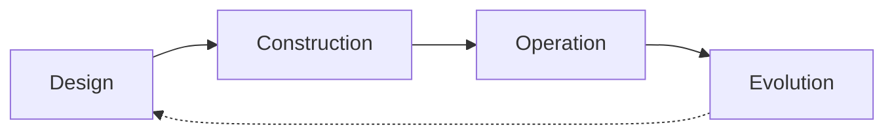
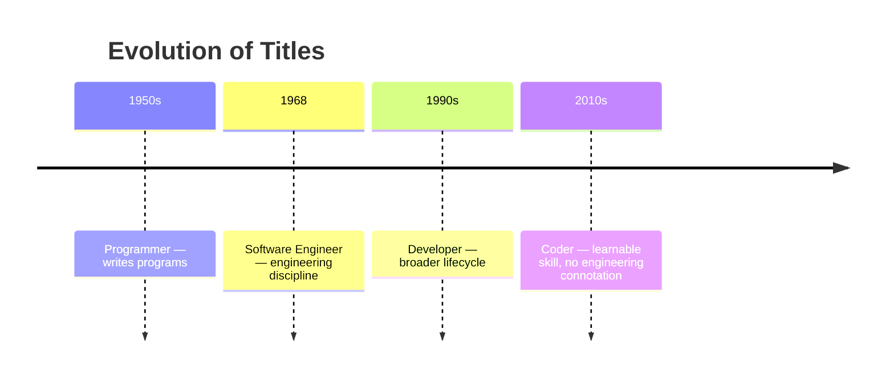
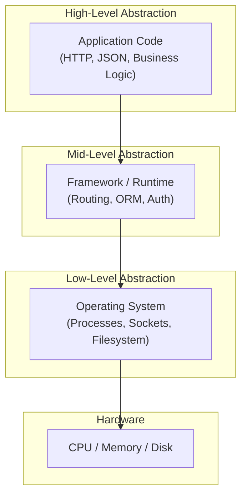

# What Is a Software Engineer?

## Description

A precise definition of the software engineering role — the engineering mindset, day-to-day responsibilities, and the distinctions that separate it from programming, development, and other adjacent titles. This document answers the question at the heart of the career module: what does it actually mean to be a software engineer?

## Prerequisites

- [The Software Engineering Profession](intro/the-software-engineering-profession.md) — foundational context on the profession's definition, history, and place in the economy

## Table of Contents

- [Defining the Software Engineer](#defining-the-software-engineer)
- [Software Engineer vs. Programmer vs. Developer vs. Coder](#software-engineer-vs-programmer-vs-developer-vs-coder)
- [The Engineering Principles](#the-engineering-principles)
- [The Software Engineer's Toolkit](#the-software-engineers-toolkit)
- [The Software Engineer in the Organization](#the-software-engineer-in-the-organization)
- [Common Misconceptions](#common-misconceptions)
- [Glossary](#glossary)
- [Next Steps](#next-steps)

## Content / Material

### Defining the Software Engineer

A software engineer is a professional who applies engineering principles to the design, construction, operation, and evolution of software systems. This definition has four pillars — design, construction, operation, evolution — and each is essential.

**Design** is the act of making decisions about structure and behavior before writing code. A software engineer does not open an editor and start typing. They consider the problem, the constraints, the trade-offs, and the architecture. What are the system boundaries? How does data flow through the system? What happens when a component fails? What are the security implications of this design? These questions are answered before the first line of implementation code is written. The output of design may be an architecture diagram, an API specification, a data model, or a written design document — but it is a deliberate, recorded artifact, not an afterthought.

**Construction** is implementation — writing code that translates the design into a working system. This is the most visible part of the job and the part most outsiders associate with software engineering. But construction is not mechanical translation. During construction, an engineer discovers edge cases the design missed, makes real-time trade-offs between competing constraints, and writes tests that validate both the design and the implementation. Construction is where theory meets reality, and it is rarely straightforward.

**Operation** is what happens after the software is built. Software does not sit idle — it runs on servers, responds to requests, processes data, and inevitably encounters unexpected conditions. A software engineer is responsible for ensuring that the system operates correctly, responds to failures gracefully, and can be monitored and debugged in production. This pillar has grown enormously in importance with the shift to cloud and SaaS. An engineer who cannot operate their own software is only half an engineer.

**Evolution** acknowledges that software is never finished. Requirements change, platforms shift, security vulnerabilities are discovered, and user expectations rise. A software engineer writes code knowing that someone — possibly themselves — will need to change it later. This awareness shapes every decision: naming, structure, testing, documentation, and the choice to defer complexity or tackle it now. Evolution is the hidden cost that distinguishes professional software engineering from academic projects or prototypes.

The feedback loop from operation and evolution back into design is continuous. An incident in production reveals a flaw in the design. A new requirement forces a reconsideration of the architecture. The four pillars are not a linear pipeline — they are a cycle that repeats for the lifetime of the system.

#### The Engineering Mindset

The engineering mindset is a way of thinking that distinguishes software engineers from people who simply write code. It includes several habits of thought:

**Systematic problem-solving.** An engineer does not jump to solutions. They frame the problem, gather information, generate alternatives, evaluate trade-offs, and only then implement. This may sound slower than just writing code, and it is — at first. Over the lifetime of a project, systematic thinking prevents rework, reduces surprises, and produces systems that are easier to reason about.

**Evidence-based reasoning.** Decisions are justified by data, not intuition. An engineer might measure latency before optimizing, A/B test a UI change before shipping, or analyze logs before debugging. When data is unavailable, the engineer acknowledges the uncertainty and plans to gather data rather than guessing.

**Defensive skepticism.** An engineer assumes that inputs will be malformed, dependencies will fail, users will make mistakes, and their own code has bugs. They design for these failures: validate inputs, handle errors gracefully, write tests, and monitor for anomalies. Defensive skepticism is not pessimism — it is professional humility applied to complex systems.

**Iterative refinement.** First drafts are never final. An engineer writes a rough solution, reviews it, tests it, and improves it. They know that the first working version is rarely the best version, and they budget time for refinement. This applies to code, architecture, process, and even their own understanding of the problem.

**Trade-off awareness.** Every engineering decision involves trade-offs. Speed versus memory, simplicity versus flexibility, time-to-market versus correctness, developer productivity versus runtime performance. An engineer identifies the relevant trade-offs, understands the consequences of each choice, and makes a deliberate decision rather than defaulting to a favorite approach.

#### Building vs. Maintaining vs. Operating

These three activities are often conflated, but they require different skills and mindsets:

**Building** is creating something new — a feature, a service, a system from scratch. Building involves the most design work, the most uncertainty, and the most creative freedom. An engineer building a new system makes foundational decisions that will constrain all future work. The excitement and visibility of building is why many engineers prefer it.

**Maintaining** is modifying an existing system to fix defects, add features, or adapt to new requirements. Maintenance is less glamorous than building, but it is where most professional software engineering time is spent. Estimates vary, but maintenance typically consumes 60 to 80 percent of engineering effort across the industry. A maintainer must understand the existing codebase — often written by someone else, possibly years ago — and make changes without breaking anything. This requires empathy, discipline, and a tolerance for ambiguity.

**Operating** is keeping a running system healthy — deploying changes, responding to incidents, monitoring performance, managing capacity. Operations work is reactive and high-pressure. An engineer on call at 3 AM diagnosing a production outage is operating. Operations requires deep understanding of the system's runtime behavior, infrastructure, and failure modes.

Most software engineers do all three across their career, and often within the same week. A healthy engineering organization recognizes all three as valuable and does not treat maintenance and operations as punishments.

### Software Engineer vs. Programmer vs. Developer vs. Coder

The industry uses many titles — software engineer, programmer, developer, coder — often interchangeably. But there are real distinctions in connotation, scope, and historical origin. Understanding these distinctions matters because titles shape expectations, job descriptions, and professional identity.

#### The Historical Evolution of Titles

**Programmer** was the first title. In the 1950s and 1960s, the people who wrote software were called programmers. The term emphasized the core activity — writing programs — and carried no broader implication about design, architecture, or system-level thinking. A programmer translated specifications into code. The title made sense when software was small, self-contained, and secondary to the hardware it ran on.

**Software engineer** emerged in 1968 at the NATO conference, coined deliberately to signal that software development should adopt engineering rigor. The title was aspirational — it described what the profession should become, not what it was. Adopting the title was a claim of professional status, a demand for systematic methodology, and an assertion that software work was not merely coding but engineering. For decades, the title was controversial. Many practitioners rejected it as pretentious. Many engineers from traditional disciplines rejected it as a dilution of the term "engineer."

**Developer** gained popularity in the 1990s and 2000s, particularly in the web industry. "Web developer" became the standard title for people building websites and web applications. Developer is broader than programmer — it implies involvement in the full development lifecycle, not just coding — but it does not carry the engineering-weight of "software engineer." In practice, developer and software engineer are often used interchangeably, particularly in job postings and job titles at non-tech companies.

**Coder** is the most recent and the least formal. It emerged in the 2010s alongside coding bootcamps and learn-to-code initiatives. "Coder" emphasizes the skill of writing code as a tradeable, learnable skill — which it is — but it carries no implication of engineering discipline, system design, or professional responsibility. A coder writes code; a software engineer designs and builds systems.

#### Nuanced Distinctions

The differences are not purely historical. They reflect real choices about scope and professional identity:

| Title | Scope | Connotation | Typical Expectations |
|-------|-------|-------------|---------------------|
| Coder | Writing code | Technical skill only | Implement defined specifications; minimal design responsibility |
| Programmer | Writing programs | Logic and algorithms | Solve well-defined problems; may design algorithms but not systems |
| Developer | Contributing to a product | Full development lifecycle | Design, implement, test, deploy features; collaborate with product and design |
| Software Engineer | Engineering systems | Discipline, rigor, trade-offs | Design architecture, ensure reliability, manage complexity, mentor others |

A coder might be given a detailed spec and asked to implement it. A software engineer might be given a business problem and asked to design, build, deploy, and operate the solution. The difference is not in the code they write — it could be the same programming language — but in the scope of responsibility and the rigor of the process.

#### Why the Distinction Matters

Titles affect how professionals see themselves and how they are seen by others:

- **Hiring.** A job posting for a "coder" will attract different applicants than one for a "software engineer." The former signals a narrow implementation role; the latter signals a broader, more senior responsibility.
- **Compensation.** Software engineers command higher compensation than coders, on average, because the scope of responsibility and required judgment are greater.
- **Professional standards.** Claiming the title of engineer implies adherence to engineering standards — testing, design documentation, code review, ethical considerations. Using the title casually can devalue it.
- **Career trajectory.** The path from coder to senior coder is limited. The path from software engineer to staff engineer, principal engineer, or architect involves increasing scope of responsibility and decreasing hands-on coding. The title shapes the career.
- **Legal and regulatory.** In jurisdictions where "engineer" is a protected title (e.g., Canada, parts of the United States), using "software engineer" may have legal implications. In most places, it does not, but the trend toward professional licensing may change this.

The pragmatic view: titles matter at the margins. What a professional does — their responsibilities, their approach, their standards — matters far more than the title on their business card. But titles are not meaningless. They are signals about scope, expectations, and professional identity. Choosing the right title for a role is an act of professional communication.

### The Engineering Principles

Software engineering rests on a set of principles that have been refined over decades. These principles are not theoretical — they are practical guidelines that directly affect the quality, maintainability, and reliability of software systems.

#### Abstraction

Abstraction hides complexity behind a simplified interface. A function abstracts a sequence of operations behind a name. An API abstracts an entire service behind a set of endpoints. A virtual machine abstracts hardware behind a standard instruction set. Abstraction is the most powerful tool in the engineer's repertoire because it makes complexity manageable.

An engineer uses abstraction to separate what a component does from how it does it. This separation allows the engineer to reason about the system at different levels. When debugging a web application, the engineer thinks about HTTP requests and responses, not TCP packets and IP routing. The network stack abstracts the lower layers away.

The danger of abstraction is leakage — when the abstraction fails to hide its underlying complexity. A classic example is the "impedance mismatch" between object-oriented code and relational databases. The abstraction (objects map to rows) breaks down when the engineer needs to optimize queries or handle complex joins. Good abstractions are well-chosen: they hide the right details and expose the right capabilities.

#### Modularity

Modularity is the principle of dividing a system into distinct, independent modules that communicate through well-defined interfaces. A module has a single responsibility, a clear boundary, and minimal dependencies on other modules.

The benefits of modularity are direct and measurable:

- **Independent development.** Teams can work on different modules simultaneously without stepping on each other's code.
- **Independent testing.** A module can be tested in isolation, using mocks or stubs for its dependencies.
- **Independent replacement.** A module can be rewritten or replaced without affecting the rest of the system, as long as its interface is preserved.
- **Independent scaling.** In a distributed system, modules can be scaled independently based on demand.

Modularity is measured by two properties: **cohesion** (how closely the elements within a module belong together) and **coupling** (how dependent modules are on each other). High cohesion and low coupling are the goals.

#### Separation of Concerns

Separation of concerns is the principle of dividing a program into distinct sections, each addressing a separate concern. A concern is any distinct aspect of the system's behavior — user interface, business logic, data storage, authentication, logging, error handling.

The classic example is the three-tier architecture: presentation layer (UI), business logic layer (domain), and data access layer (persistence). Each layer addresses a different concern and can be developed, tested, and modified independently.

Separation of concerns reduces complexity by ensuring that any single piece of code addresses only one problem. A function that validates input, processes data, formats output, and writes to a log is violating separation of concerns — it is doing too many things. Such functions are hard to test, hard to reason about, and hard to change.

In practice, separation of concerns is enforced by architectural patterns: MVC (Model-View-Controller), layered architecture, hexagonal architecture, and domain-driven design all provide frameworks for keeping concerns separate.

#### Defensive Programming

Defensive programming is the practice of writing code that anticipates and handles unexpected conditions gracefully. It assumes that inputs will be invalid, dependencies will fail, and the programmer will make mistakes.

Key practices include:

- **Input validation.** Every external input — user input, API parameters, file contents, database records — is validated before use. Validation checks type, range, format, and semantic correctness.
- **Error handling.** Every operation that can fail is handled explicitly. Exceptions are caught at the appropriate level, logged with context, and either recovered from or escalated to the user.
- **Assertions.** Invariants that must hold are documented with assertions that fail fast when violated.
- **Fail-safe defaults.** When the system cannot determine the correct behavior, it defaults to the safest option: deny access, reject input, shut down gracefully.
- **Defensive copying.** Mutable data passed across trust boundaries is copied before modification, preventing the caller from corrupting internal state.

Defensive programming is not paranoia — it is recognition that software runs in an imperfect world and must be resilient to imperfection.

#### Trade-off Analysis

Every engineering decision involves trade-offs. Trade-off analysis is the process of identifying, evaluating, and deciding between competing alternatives. It is the core intellectual activity of engineering.

Common trade-offs in software engineering include:

| Trade-off | One Side | Other Side |
|-----------|----------|------------|
| Time-to-market vs. quality | Ship faster, iterate | Invest in testing, design, review |
| Performance vs. maintainability | Optimized, terse code | Clear, readable code |
| Consistency vs. availability | Strong consistency (CP) | High availability (AP) |
| Monolith vs. microservices | Simpler coordination, shared state | Independent scaling, deployment |
| Buy vs. build | Faster, maintained by vendor | Full control, no vendor lock-in |
| Static vs. dynamic typing | Catch errors at compile time | Faster iteration, flexibility |

An experienced engineer does not have a default answer to these trade-offs. They analyze the specific context: the team's skill, the system's failure tolerance, the business priorities, the operational maturity. The right answer changes with context.

#### Technical Debt

Technical debt is a metaphor coined by Ward Cunningham to describe the long-term cost of taking shortcuts in software design. Like financial debt, technical debt accumulates interest — the cost of future changes increases because the codebase is harder to understand, modify, or extend.

Technical debt takes many forms:

- **Code debt.** Poorly structured code, duplicated logic, unclear naming, missing tests.
- **Architecture debt.** Violations of modularity, improper layering, over-coupled components.
- **Testing debt.** Missing test coverage, flaky tests, slow test suites that discourage running them.
- **Documentation debt.** Outdated or missing documentation, unclear API specs.
- **Infrastructure debt.** Manual deployment processes, lack of monitoring, inadequate CI/CD.

Some technical debt is strategic and intentional. A startup shipping its first MVP may deliberately incur debt to validate product-market fit before investing in robustness. This is informed borrowing. The problem arises when debt is incurred unconsciously — when shortcuts are taken without awareness of the future cost, or when debt is never paid down and accumulates until the system is too expensive to change.

A software engineer is expected to recognize technical debt, communicate its cost, and advocate for paying it down. Engineering organizations typically budget 20-30 percent of development time for refactoring, testing, and infrastructure improvements — the equivalent of making debt payments.

### The Software Engineer's Toolkit

A software engineer's toolkit includes the languages, platforms, and practices used to build, test, deploy, and operate software. The specific tools vary by domain and organization, but the categories are universal.

#### Programming Languages

Language choice is both practical and cultural. The primary criterion is fit-for-purpose, but team familiarity, ecosystem quality, and industry trends also matter.

The most widely used languages in professional software engineering as of 2025-2026 include:

- **JavaScript / TypeScript** — Dominant for web frontend and increasingly for backend (Node.js, Deno). TypeScript adds static typing to JavaScript and has become the preferred choice for new projects.
- **Python** — Dominant in data science, machine learning, automation, and backend web development. Valued for readability and extensive libraries.
- **Java** — Standard for large-scale enterprise applications, Android development, and backend services. Strong typing, mature ecosystem, extensive tooling.
- **Go** — Increasingly popular for cloud-native services, CLI tools, and infrastructure. Designed for simplicity, concurrency, and fast compilation.
- **Rust** — Preferred for systems programming, performance-critical services, and safety-sensitive infrastructure. Eliminates memory safety bugs at compile time.
- **C#** — Dominant in the Microsoft ecosystem; used for enterprise applications, game development (Unity), and cloud services on Azure.
- **C / C++** — Used for operating systems, embedded systems, game engines, and performance-critical applications.
- **Kotlin** — Primary language for Android development alongside Java; also used for backend services (Kotlin Multiplatform).
- **Swift** — Primary language for Apple ecosystem development (iOS, macOS, watchOS).

Most engineers are proficient in two to four languages and can learn new ones as needed. The ability to learn languages quickly is more important than the specific languages already known.

#### Version Control

Version control is the practice of tracking and managing changes to source code. Git is the universal standard. Every professional software engineer must be fluent in Git: branching, merging, rebasing, resolving conflicts, and understanding the commit graph.

Version control is not optional. It is the foundation of collaboration, enabling multiple engineers to work on the same codebase simultaneously. It provides history, accountability, and the ability to revert changes. Code review — another foundational practice — depends on version control to show diffs and manage review workflows.

#### Integrated Development Environments

An IDE is a code editor integrated with debugging, refactoring, testing, and deployment tools. The dominant IDEs in the profession are:

- **VS Code** — The most popular editor overall, with an extensive extension ecosystem.
- **JetBrains IDEs** (IntelliJ IDEA, PyCharm, WebStorm, GoLand) — Powerful IDEs with deep language-specific features.
- **Neovim / Vim** — Lightweight, keyboard-driven editors favored by experienced engineers for speed and customizability.
- **Zed** — A newer, high-performance editor built in Rust.
- **Xcode** — The required IDE for Apple platform development.

The choice of editor is personal and often contentious. The important thing is proficiency — knowing how to navigate, refactor, debug, and test efficiently in whatever editor is chosen.

#### CI/CD (Continuous Integration / Continuous Delivery)

CI/CD is the practice of automatically building, testing, and deploying code changes. A CI/CD pipeline runs on every commit: it compiles the code, runs tests, performs static analysis, checks code style, builds artifacts, and deploys them to staging or production.

Popular CI/CD platforms include GitHub Actions, GitLab CI, Jenkins, CircleCI, and Buildkite. Containerization with Docker and orchestration with Kubernetes have become standard deployment infrastructure.

A software engineer is expected to write and maintain CI/CD configurations as part of their regular work. The pipeline is not someone else's responsibility — it is part of the codebase and the engineer's domain.

#### Monitoring and Observability

Monitoring is the practice of tracking system health and performance in production. Observability is the broader capability to understand system behavior by examining its outputs — logs, metrics, and traces.

Core components of the observability stack:

- **Logging.** Structured log output that records events, errors, and state transitions. Engineers write log statements during development and analyze them during debugging. Tools: ELK stack (Elasticsearch, Logstash, Kibana), Loki, Splunk.
- **Metrics.** Numerical measurements of system behavior: request rates, error rates, latency percentiles, CPU usage, memory consumption. Metrics are used for dashboards, alerting, and capacity planning. Tools: Prometheus, Grafana, Datadog.
- **Tracing.** End-to-end tracking of requests as they flow through distributed services. Traces reveal which service is slow, where errors originate, and how dependencies interact. Tools: Jaeger, Zipkin, OpenTelemetry.

#### Documentation

Documentation is the written record of design decisions, system architecture, operational procedures, and usage guidelines. It is often undervalued and underinvested in, but it is essential for team scalability and system longevity.

Key forms of documentation:

- **Architecture Decision Records (ADRs).** Short documents recording a significant architectural decision, the alternatives considered, and the rationale for the chosen approach. ADRs preserve context that would otherwise be lost when team members leave or forget.
- **READMEs.** The entry point for understanding a service or project. A good README explains what the project does, how to run it, how to contribute, and where to find more information.
- **Runbooks.** Operational procedures for deploying, monitoring, and troubleshooting a service. A runbook tells an on-call engineer exactly what to do when a specific alert fires.
- **API documentation.** Specifications of endpoints, request/response formats, authentication, and error codes. Often auto-generated from code annotations (OpenAPI, JSDoc, Sphinx).

A software engineer writes documentation as part of implementation. A feature is not complete until its documentation is written and its ADR is filed.

### The Software Engineer in the Organization

Software engineers do not work in isolation. They are embedded in organizations with product managers, designers, QA engineers, operations teams, and business stakeholders. Understanding these relationships is essential to being effective.

#### Relationship with Product Managers

The product manager (PM) defines what to build based on user needs, business goals, and market research. The software engineer figures out how to build it. The boundary is blurry in practice, and good partnerships involve significant overlap.

A healthy engineer-PM relationship involves:

- **Early involvement.** Engineers are included in product discussions before requirements are finalized. Their input on technical feasibility, implementation cost, and alternative approaches improves the product decision.
- **Respect for each other's expertise.** The PM trusts the engineer's technical judgment; the engineer trusts the PM's understanding of users and markets.
- **Shared ownership of outcomes.** Both are responsible for the success of the product, not just their respective parts.
- **Honest communication about trade-offs.** Engineers surface technical constraints early rather than committing to impossible timelines. PMs adjust scope or timelines based on that feedback.

The most common friction point is scope creep — the PM adding features after development has started. Engineers manage this by maintaining a clear definition of done, pushing back when requirements change, and using the change control process to surface the cost of scope changes.

#### Relationship with Designers

Designers (UI/UX designers) define the user experience: layout, interaction patterns, visual style, accessibility. Engineers implement the design in code. As with PMs, the boundary is porous.

Key practices for effective engineer-designer collaboration:

- **Design review.** Engineers review designs early for technical feasibility. A design that looks beautiful in Figma may be impractical to implement within performance or accessibility constraints.
- **Implementation fidelity.** Engineers aim to implement the design as specified, but real constraints (performance, platform limitations, data availability) may require deviations. These deviations are communicated and negotiated, not silently made.
- **Shared vocabulary.** Both sides understand basic UX principles and basic technical constraints. Designers know what responsive design requires; engineers know what a margin of 8px means in the design system.
- **Prototyping.** Engineers build functional prototypes to validate design assumptions. A prototype reveals issues that static mockups cannot.

#### Relationship with QA

Quality Assurance (QA) engineers are responsible for verifying that the software meets requirements and is free of defects. In modern practice, QA is often built into the development process rather than being a separate phase.

Engineers and QA collaborate through:

- **Test automation.** Engineers write unit tests and integration tests. QA may write end-to-end tests and exploratory test scripts. The combined test suite provides multiple layers of verification.
- **Bug tracking.** QA reports bugs with clear reproduction steps, expected behavior, and environment details. Engineers fix bugs with clear documentation of root cause and resolution.
- **Shift-left testing.** Testing is moved earlier in the development process. QA reviews requirements and designs for testability, writes test plans before implementation, and catches issues before code is written.
- **Quality culture.** Engineers do not rely solely on QA to catch defects. Quality is everyone's responsibility, and the engineer's goal is to ship code that does not need QA to find bugs in it.

In many organizations, the dedicated QA role is shrinking as engineers take on more testing responsibility. In startups and smaller teams, there may be no QA at all — the engineer is entirely responsible for quality.

#### Individual Contributor vs. Lead

Software engineers can grow along two tracks: the individual contributor (IC) track and the management track. The IC track includes titles like senior engineer, staff engineer, principal engineer, and distinguished engineer. The management track includes titles like engineering manager, director of engineering, and VP of Engineering.

The IC track is not "just coding." As engineers advance, they take on increasing responsibility for:

- **Technical strategy.** Defining the architectural direction of the system, evaluating technology choices, and setting technical standards.
- **Mentorship.** Teaching junior engineers through code review, pairing, design discussions, and informal advice.
- **Cross-team coordination.** Working with engineers in other teams to align on shared infrastructure, APIs, and standards.
- **Interviewing and hiring.** Participating in the hiring process to evaluate technical skills and cultural fit.
- **On-call and incident response.** Taking responsibility for production systems, including responding to outages outside business hours.

The distinction between IC and manager is important but not rigid. Some engineers switch between tracks during their career. Others remain on the IC track indefinitely. Both paths offer growth, influence, and compensation.

#### Decision-Making

A software engineer makes decisions constantly — about architecture, implementation, process, and priorities. The quality of these decisions determines the quality of the system and the productivity of the team.

Good decision-making practices include:

- **Write it down.** Document the decision, the alternatives considered, and the rationale. This forces clarity and provides context for future engineers who will wonder "why was it done this way?"
- **Seek diverse input.** Ask for perspectives from engineers with different backgrounds, different parts of the system, and different levels of experience. The best decision often emerges from the collision of viewpoints.
- **Decide at the right level.** Some decisions are reversible (choose one library over another) and should be made quickly. Others are irreversible (choose a database technology) and require more analysis. Match the decision process to the cost of being wrong.
- **Default to iteration.** If a decision is reversible, make a reasonable choice, ship it, and improve it based on feedback. Analysis paralysis is more costly than a slightly suboptimal choice.
- **Own the decision.** Once a decision is made, the engineer is responsible for the outcome. If it proves wrong, they acknowledge it, learn from it, and correct it. Blameless postmortems apply to decisions as well as incidents.

### Common Misconceptions

The public image of a software engineer is shaped by media portrayals, anecdotes, and the vastly visible work of a few famous engineers. The reality is different, and the gap between perception and reality causes problems for aspiring engineers, their families, and the organizations that employ them.

#### Misconception 1: Software Engineers Code All Day

The most pervasive myth is that a software engineer spends eight hours a day writing code. The reality is that coding occupies a minority of a typical engineer's time. Studies and surveys consistently find that professional software engineers spend 30-40 percent of their time on coding. The rest is consumed by:

- **Meetings.** Stand-ups, sprint planning, retrospectives, design reviews, architecture discussions, one-on-ones, cross-team coordination meetings. An engineer at a large organization may have 10-15 hours of meetings per week.
- **Code review.** Reading other people's code, understanding the context, leaving comments, discussing alternatives. A thorough code review takes time — often as much time as writing the original change.
- **Design and planning.** Writing design documents, analyzing trade-offs, creating diagrams, estimating effort, breaking work into tasks.
- **Debugging and investigation.** Reproducing bugs, reading logs, tracing through code, understanding failure modes. This is intellectually demanding work that produces no visible output.
- **Documentation.** Writing ADRs, READMEs, runbooks, API docs, and onboarding materials.
- **On-call.** Responding to alerts, investigating incidents, writing postmortems.
- **Learning.** Reading documentation, experimenting with new tools, studying system design, following industry developments.
- **Mentoring.** Explaining concepts to junior engineers, pairing on problems, reviewing designs, giving career advice.

A new engineer often finds this ratio surprising and sometimes frustrating. They came to the profession to write code, and instead they spend half their time in meetings and documentation. Adapting to this reality is a key transition from student or hobbyist to professional.

#### Misconception 2: It Is a Solitary Job

The image of the lone programmer in a dark room, headphones on, writing code in isolation is almost entirely fictional. Modern software engineering is intensely collaborative.

An engineer's day involves constant interaction:

- **Pair programming or mob programming.** Two or more engineers work together on the same code, sharing a screen and taking turns typing.
- **Code review discussions.** Engineers debate implementation approaches, naming conventions, and design choices on every pull request.
- **Design reviews.** Groups of engineers critique design documents, ask questions, suggest alternatives, and ultimately approve or reject architecture decisions.
- **Cross-team coordination.** Engineers from different teams negotiate API contracts, dependency upgrades, and shared infrastructure changes.
- **Incident response.** When production is down, engineers converge in a war room or Slack channel to diagnose and fix the problem together.
- **Informal collaboration.** Engineers ask questions in chat, walk to each other's desks (or hop on a video call), share screens, and work through problems together.

The stereotype of the solitary coder may have been accurate in the early days of computing, when a single person could understand an entire system. Modern systems are too large, too complex, and too interconnected. Effective software engineering requires communication, collaboration, and the ability to work productively with others.

#### Misconception 3: AI Will Replace Software Engineers

The rise of large language models (LLMs) that can generate, review, and debug code has sparked widespread concern that software engineers will be automated away. This concern misunderstands both what LLMs do and what software engineers do.

LLMs are powerful tools for generating code from natural language descriptions, suggesting completions, identifying bugs, and explaining unfamiliar code. They are already changing how engineers work — many use GitHub Copilot or similar tools daily and report significant productivity gains.

But LLMs have fundamental limitations that make them complements, not replacements:

- **LLMs cannot reason about systems.** They generate code that looks plausible but may be incorrect in subtle ways. They have no understanding of the system's architecture, constraints, or failure modes.
- **LLMs cannot make trade-offs.** They cannot evaluate the long-term maintainability of a design, assess the operational risk of a deployment, or balance competing priorities.
- **LLMs cannot take responsibility.** When a system fails, the engineer is accountable, not the model. Professional responsibility cannot be delegated.
- **LLMs cannot understand context.** They do not know the business goals, the user needs, the team dynamics, or the organizational constraints that shape engineering decisions.
- **LLMs cannot operate systems.** They cannot respond to incidents, debug production issues, or make real-time decisions under pressure.

The historical analogies are instructive. Compilers did not replace programmers — they made programmers more productive by handling a tedious, error-prone task. Debuggers did not replace programmers — they made finding bugs faster. Integrated development environments did not replace programmers — they reduced cognitive overhead. Each new tool raised the level of abstraction and allowed engineers to focus on harder problems.

AI will likely do the same: eliminate drudgery, accelerate routine tasks, and free engineers to work on the parts of the job that require human judgment. But the judgment — understanding what to build, how to evaluate trade-offs, how to ensure reliability, how to operate at scale — remains the engineer's domain.

#### Misconception 4: You Need a Computer Science Degree

Many people believe that a four-year CS degree is the only path into software engineering. This belief is outdated and contradicted by the data.

The percentage of professional software engineers without a CS degree is significant and growing. Stack Overflow's annual developer survey consistently finds that 20-30 percent of professional developers do not hold a CS degree. Many have degrees in other fields (mathematics, physics, engineering, liberal arts) or no degree at all. The number of engineers who entered through bootcamps or self-study has increased substantially since 2015.

The pathways into software engineering include:

- **CS degree.** The most common path. Provides theoretical foundations, algorithms, data structures, and formal education in computing. Valued by large companies with structured hiring processes.
- **Related degree.** Mathematics, physics, electrical engineering, or information systems. These degrees provide analytical skills that transfer well to software engineering. Many top engineers in the industry have non-CS STEM degrees.
- **Bootcamp.** Intensive 12-24 week programs focused on practical web development skills. Bootcamp graduates often start at smaller companies or agencies and move to larger organizations as they gain experience.
- **Self-taught.** Learning through online courses, books, open-source contributions, and personal projects. This path requires the most discipline but produces engineers who are self-sufficient and resourceful.
- **Apprenticeship / internship.** Some organizations offer paid apprenticeship programs that combine work experience with structured learning, often targeted at career-changers or underrepresented groups.

What matters for employability is not the degree but the demonstrated ability to write good code, understand systems, and work on a team. A strong portfolio of projects, contributions to open-source, and work experience can outweigh the absence of a degree. Many major technology companies (including Google, Apple, and Microsoft) have explicitly stated that they do not require a CS degree for engineering roles.

That said, the CS degree provides advantages. The first job is easier to get with one. The theoretical foundations are harder to learn on your own. And some organizations — particularly in finance, defense, and safety-critical domains — still require or strongly prefer a degree. But the barrier is lower than it was a decade ago, and it continues to fall.

## Glossary

| Term | Definition |
|------|------------|
| Abstraction | Hiding implementation details behind a simplified interface to manage complexity |
| Architecture Decision Record (ADR) | A short document recording a significant architectural decision, alternatives considered, and rationale |
| CI/CD | Continuous Integration / Continuous Delivery — automated pipelines that build, test, and deploy code changes |
| Code Review | The practice of having other engineers examine code changes before they are merged |
| Cohesion | How closely the elements within a module are related to each other; high cohesion is desirable |
| Coupling | How dependent modules are on each other; low coupling is desirable |
| Defensive Programming | Writing code that anticipates and handles unexpected conditions gracefully |
| Engineering Mindset | A systematic, evidence-based approach to problem-solving characterized by trade-off awareness and iterative refinement |
| Individual Contributor (IC) | An engineer who focuses on technical work rather than people management |
| Modularity | Dividing a system into distinct, independent components with well-defined interfaces |
| Observability | The ability to understand system behavior by examining its outputs (logs, metrics, traces) |
| On-Call | A rotation where engineers are responsible for responding to production incidents outside of business hours |
| Pair Programming | Two engineers working together on the same code, sharing one screen |
| Postmortem | A blameless analysis of an incident to identify root causes and prevent recurrence |
| Product Manager (PM) | The person responsible for defining what to build based on user needs and business goals |
| Runbook | A document describing operational procedures for deploying, monitoring, and troubleshooting a service |
| Scope Creep | The tendency for project requirements to increase beyond the original plan |
| Separation of Concerns | The principle of dividing a program into distinct sections, each addressing a separate concern |
| Technical Debt | The implied cost of future rework caused by choosing a quick or easy solution instead of a more robust one |
| Trade-off Analysis | The process of identifying, evaluating, and deciding between competing engineering alternatives |

## Next Steps

- [Responsibilities & Daily Work](responsibilities-and-daily-work.md) — what software engineers actually do from day to day
- [Types & Specializations](types-and-specializations.md) — the many sub-disciplines within the profession
- [Career Progression](career-progression.md) — how software engineers grow from junior to senior to staff and beyond
