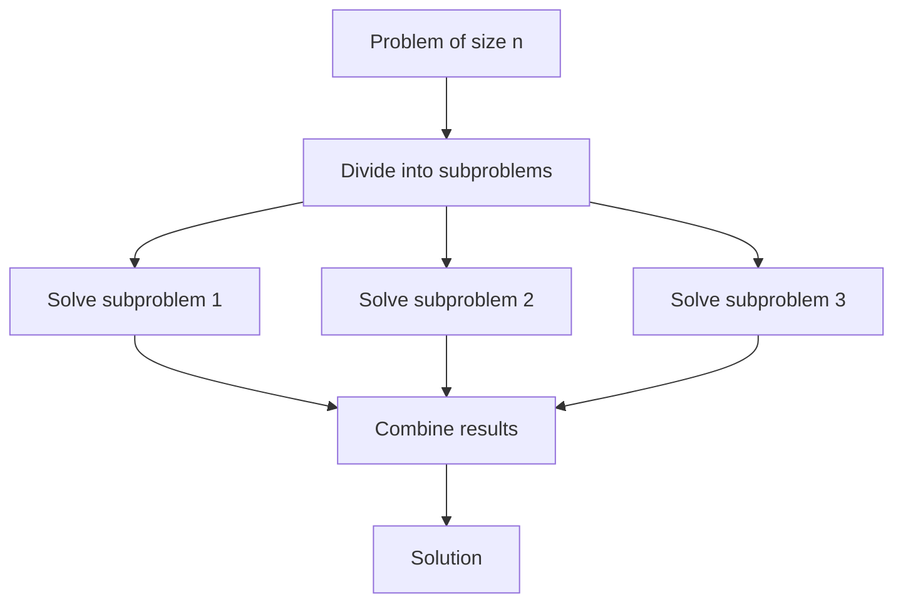
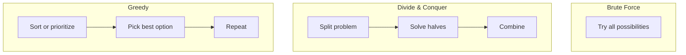

# Introduction to Algorithms

## Description

What algorithms are, why we analyze them, and how Big O notation lets you compare efficiency without running code. You will learn the five essential complexity classes, walk through analyzing two search algorithms step by step, and recognize the three most common algorithm design patterns.

## Prerequisites

- [What Is Computer Science?](../intro/what-is-computer-science.md) — what this field is and why it matters
- Basic programming skills — you should be comfortable with functions, loops, and arrays in any language

## Table of Contents

- [What Is an Algorithm?](#what-is-an-algorithm)
- [Why Analyze Algorithms?](#why-analyze-algorithms)
- [Time Complexity vs Space Complexity](#time-complexity-vs-space-complexity)
- [Big O Notation](#big-o-notation)
- [Complexity Classes](#complexity-classes)
- [Walkthrough: Linear Search](#walkthrough-linear-search)
- [Walkthrough: Binary Search](#walkthrough-binary-search)
- [Comparing Linear and Binary Search](#comparing-linear-and-binary-search)
- [Step-by-Step Analysis: A Real Algorithm](#step-by-step-analysis-a-real-algorithm)
- [Common Algorithm Design Patterns](#common-algorithm-design-patterns)
- [Learning Tips](#learning-tips)
- [Glossary](#glossary)
- [Quick References](#quick-references)
- [Next Steps](#next-steps)

## What Is an Algorithm?

An **algorithm** is a finite sequence of well-defined steps that transforms an input into an output and terminates in finite time. Every piece of code you write implements some algorithm, even if it is as simple as computing a sum.

```python
def sum_array(arr):
    total = 0
    for x in arr:
        total += x
    return total
```

This is an algorithm. It has:
- **Input**: an array of numbers
- **Output**: a single number (the sum)
- **Defined steps**: clear, unambiguous operations
- **Finiteness**: it terminates after processing every element

A recipe in a cookbook is an algorithm: given ingredients (input), follow steps to produce a dish (output). A sorting routine is an algorithm: given an unsorted list (input), rearrange it in order (output). The word "algorithm" originates from the 9th-century Persian mathematician Muhammad ibn Musa al-Khwarizmi, whose name was Latinized to *Algorithmi*.

### Characteristics of a Good Algorithm

| Characteristic | Meaning |
|----------------|---------|
| **Correct** | Produces the right output for every valid input |
| **Efficient** | Uses reasonable time and memory resources |
| **Deterministic** | Given the same input, always produces the same output |
| **Finite** | Guaranteed to terminate (no infinite loops) |
| **General** | Works for all inputs of the intended type, not just one case |

### Algorithms vs Programs

An algorithm is a **concept** — a logical description of how to solve a problem. A **program** is a concrete implementation of an algorithm in a specific programming language. The same algorithm can be implemented in Python, Java, C, or any language, and it should produce the same result.

```
Algorithm (abstract):                    Program (concrete):
  1. Find the middle element                def binary_search(arr, target):
  2. If it matches, return                      low = 0
  3. If target < middle, search left            high = len(arr) - 1
  4. If target > middle, search right           while low <= high:
  5. Repeat until found or empty                    mid = (low + high) // 2
                                                    if arr[mid] == target:
                                                        return mid
                                                    elif arr[mid] < target:
                                                        low = mid + 1
                                                    else:
                                                        high = mid - 1
                                               return -1
```

The algorithm lives on paper (or in your head). The program runs on a machine.

## Why Analyze Algorithms?

Given two programs that solve the same problem, how do you decide which one to use? You could run both on your machine and measure the wall-clock time. That is called **benchmarking**, and it has serious problems:

1. **Hardware-dependent.** Running on a faster CPU or more RAM changes the result.
2. **Input-dependent.** One algorithm may be faster on small inputs but slower on large ones.
3. **Implementation-dependent.** A poorly written version of a fast algorithm can lose to a well-written version of a slow one.
4. **Not predictive.** If your data grows from 10,000 to 10,000,000 items, benchmarking at the current size tells you nothing about future performance.

Algorithm analysis solves all four problems. Instead of measuring real time, you count **abstract operations** as a function of **input size**.

### What We Count

We choose a **barometer operation** — the single operation that dominates the runtime. For most algorithms, this is one of:

- Comparisons (if statements, comparison inside loops)
- Arithmetic operations (additions, multiplications)
- Memory accesses (reads from or writes to an array)
- Iterations (loop iterations)

We then ask: **how many times does this operation execute, as a function of the input size `n`?**

```python
def count_occurrences(arr, target):
    count = 0
    for x in arr:          # loop runs n times
        if x == target:    # one comparison per iteration
            count += 1
    return count
```

For an array of size `n`, the comparison `x == target` runs exactly `n` times. The runtime is proportional to `n`.

### Why Input Size Matters

An algorithm's efficiency is expressed as a function of the input size. The standard variable is `n`:

| Context | What `n` Represents |
|---------|---------------------|
| Sorting | Number of elements in the list |
| Searching | Number of elements in the collection |
| Graph traversal | Number of nodes (or vertices) |
| Matrix operations | Number of rows or columns |
| String processing | Length of the string |

The relationship between `n` and the number of operations tells you how the algorithm will scale when `n` grows from 100 to 100,000.

## Time Complexity vs Space Complexity

Every algorithm consumes two resources: **time** (how many operations) and **space** (how much memory).

### Time Complexity

The number of operations an algorithm performs as a function of input size. This is what we analyze with Big O notation. Lower time complexity means faster execution.

### Space Complexity

The amount of additional memory an algorithm requires beyond the input itself, as a function of input size.

```python
# O(1) space — uses a fixed number of variables regardless of input size
def sum_array(arr):
    total = 0            # one variable
    for x in arr:
        total += x
    return total

# O(n) space — creates a new array the same size as the input
def double_array(arr):
    result = []           # new array, same size as input
    for x in arr:
        result.append(x * 2)
    return result
```

### The Tradeoff

Time and space often trade off against each other. An algorithm can be made faster by using more memory, or more memory-efficient by accepting slower execution.

```
                    Use more memory ─────► Faster
                    │                        │
                    │                        │
                    ▼                        ▼
                 Slower ◄──── Use less memory
```

A common example: caching. Storing precomputed results (memory) avoids recomputation (time). This is called the **space-time tradeoff**.

## Big O Notation

Big O notation describes the **upper bound** of an algorithm's growth rate — the worst-case scenario as the input size approaches infinity.

### Formal Definition

A function $f(n)$ is $O(g(n))$ if there exist positive constants $c$ and $n_0$ such that:

$$0 \leq f(n) \leq c \cdot g(n) \text{ for all } n \geq n_0$$

In plain language: beyond some input size $n_0$, the algorithm's runtime $f(n)$ is at most $c$ times $g(n)$. Big O ignores constant factors and lower-order terms because they become irrelevant for large $n$.

### Rules for Determining Big O

**Rule 1: Drop constants.** If an algorithm does 3 operations per element, it is still $O(n)$, not $O(3n)$.

```python
def process(arr):
    for x in arr:    # n iterations
        print(x)     # operation 1
        print(x*2)   # operation 2
        print(x*3)   # operation 3
    # 3n operations → O(n), not O(3n)
```

**Rule 2: Drop lower-order terms.** If an algorithm does $n^2 + n + 10$ operations, it is $O(n^2)$, not $O(n^2 + n)$.

```python
def process(arr):
    for i in range(len(arr)):          # n iterations
        for j in range(len(arr)):      # n iterations → n²
            print(arr[i], arr[j])
    for x in arr:                      # n iterations (lower order)
        print(x)
    # n² + n operations → O(n²)
```

**Rule 3: Consider the worst case.** Big O describes the upper bound. Even if an algorithm sometimes finishes early, Big O looks at the worst possible input.

```python
def find_first(arr, target):
    for i, x in enumerate(arr):
        if x == target:
            return i    # could return early
    return -1
```

Best case: $O(1)$ — target is at position 0. Worst case: $O(n)$ — target is not in the array, or is at the last position. Big O expresses the **worst case**: $O(n)$.

## Complexity Classes

These are the five complexity classes every developer must recognize.

### O(1) — Constant Time

The algorithm takes the same number of operations regardless of input size.

```python
def get_first(arr):
    return arr[0]    # one operation, always
```

Array access by index, hash table lookup, and arithmetic operations are O(1). No loops, no growth with `n`.

### O(log n) — Logarithmic Time

The algorithm reduces the problem size by a constant fraction in each step. Typically appears when dividing the input in half repeatedly.

```python
def count_bits(n):
    count = 0
    while n > 0:      # halves n each iteration
        count += 1
        n = n // 2
    return count
```

If $n = 32$, the loop runs 5 times ($\log_2 32 = 5$). If $n = 1024$, it runs 10 times ($\log_2 1024 = 10$). Doubling `n` adds only one extra iteration.

Binary search, finding an element in a balanced BST, and operations on a heap are O(log n).

### O(n) — Linear Time

The algorithm processes each element once. Doubling the input doubles the runtime.

```python
def find_max(arr):
    max_val = arr[0]
    for x in arr:     # n iterations
        if x > max_val:
            max_val = x
    return max_val
```

Linear search, iterating over an array, computing a sum, and most naive approaches are O(n).

### O(n log n) — Linearithmic Time

Each of `n` elements is processed in O(log n) time. This is the theoretical lower bound for comparison-based sorting.

```python
def merge_sort(arr):
    if len(arr) <= 1:
        return arr
    mid = len(arr) // 2
    left = merge_sort(arr[:mid])       # divide
    right = merge_sort(arr[mid:])      # divide
    return merge(left, right)          # conquer (O(n))
```

Merge sort, heap sort, and divide-and-conquer algorithms like fast Fourier transform (FFT) run in O(n log n).

### O(n²) — Quadratic Time

The algorithm processes every pair of elements. Doubling the input quadruples the runtime.

```python
def has_duplicates(arr):
    for i in range(len(arr)):       # n iterations
        for j in range(len(arr)):   # n iterations
            if i != j and arr[i] == arr[j]:
                return True
    return False
```

Nested loops over the same data produce O(n²). Bubble sort, selection sort, and naive matrix multiplication are quadratic.

### Visual Comparison

```mermaid
---
title: Big O Growth Rates
---
xyChart
    x-axis "Input Size (n)" [1, 2, 3, 4, 5, 6, 7, 8, 9, 10]
    y-axis "Operations"
    line "O(1)" data [1, 1, 1, 1, 1, 1, 1, 1, 1, 1]
    line "O(log n)" data [0, 1, 2, 2, 2, 3, 3, 3, 3, 3]
    line "O(n)" data [1, 2, 3, 4, 5, 6, 7, 8, 9, 10]
    line "O(n log n)" data [0, 2, 5, 8, 12, 16, 20, 24, 29, 33]
    line "O(n²)" data [1, 4, 9, 16, 25, 36, 49, 64, 81, 100]
```

| Class | Name | $n=10$ | $n=100$ | $n=1000$ | $n=10^6$ |
|-------|------|--------|---------|----------|----------|
| O(1) | Constant | 1 | 1 | 1 | 1 |
| O(log n) | Logarithmic | ~3 | ~7 | ~10 | ~20 |
| O(n) | Linear | 10 | 100 | 1000 | 1,000,000 |
| O(n log n) | Linearithmic | ~33 | ~700 | ~10,000 | ~20,000,000 |
| O(n²) | Quadratic | 100 | 10,000 | 1,000,000 | 10¹² |

Note how O(n²) becomes astronomical at $n = 10^6$ — 10¹² operations would take hours on any modern CPU. This is why algorithm choice matters at scale.

## Walkthrough: Linear Search

**Problem**: Given an unsorted array of `n` integers, find the index of a target value, or return -1 if not present.

**Algorithm**: Start at position 0 and check every element until you find the target or reach the end.

### Implementation

```python
def linear_search(arr, target):
    for i in range(len(arr)):
        if arr[i] == target:
            return i
    return -1
```

### Analysis

**Barometer operation**: the comparison `arr[i] == target`.

- **Best case**: target is at index 0 → 1 comparison → O(1)
- **Worst case**: target is at the last index, or not present → `n` comparisons → O(n)
- **Average case**: target is somewhere in the middle → ~`n/2` comparisons → O(n)

**Space complexity**: O(1). Only one integer index variable is used regardless of input size.

| Metric | Value |
|--------|-------|
| Best case | O(1) |
| Average case | O(n) |
| Worst case | O(n) |
| Space | O(1) |

### Step-by-Step Trace

```
Array:  [5, 3, 8, 1, 9, 2]
Target: 8

Step 1: i=0, arr[0]=5, 5≠8 → continue
Step 2: i=1, arr[1]=3, 3≠8 → continue
Step 3: i=2, arr[2]=8, 8==8 → return 2
```

```
Array:  [5, 3, 8, 1, 9, 2]
Target: 7

Step 1: i=0, 5≠7
Step 2: i=1, 3≠7
Step 3: i=2, 8≠7
Step 4: i=3, 1≠7
Step 5: i=4, 9≠7
Step 6: i=5, 2≠7
Step 7: loop ends → return -1 (6 comparisons for n=6)
```

## Walkthrough: Binary Search

**Problem**: Given a **sorted** array of `n` integers, find the index of a target value.

**Algorithm**: Repeatedly divide the search interval in half. Compare the target to the middle element. If it matches, return. If the target is smaller, search the left half. If larger, search the right half.

### Implementation

```python
def binary_search(arr, target):
    low = 0
    high = len(arr) - 1

    while low <= high:
        mid = (low + high) // 2

        if arr[mid] == target:
            return mid
        elif arr[mid] < target:
            low = mid + 1      # search right half
        else:
            high = mid - 1     # search left half

    return -1
```

### Analysis

**Barometer operation**: the comparison `arr[mid] == target` (and the associated less-than/greater-than comparisons — these are all constant-time per iteration).

Each iteration eliminates half of the remaining elements:

```
n = 16
Iteration 1: 16 elements remain → compare middle
Iteration 2: 8 elements remain
Iteration 3: 4 elements remain
Iteration 4: 2 elements remain
Iteration 5: 1 element remains → decide
```

How many iterations for an array of size `n`? You start with `n` and keep halving until you reach 1:

$$n \cdot \frac{1}{2} \cdot \frac{1}{2} \cdot \frac{1}{2} \cdots = 1$$

$$n \cdot \left(\frac{1}{2}\right)^k = 1$$

$$n = 2^k$$

$$k = \log_2 n$$

- **Worst case**: $\log_2 n$ comparisons → O(log n)
- **Best case**: target is the middle element → 1 comparison → O(1)
- **Average case**: O(log n)

**Space complexity**: O(1) for the iterative version. (A recursive version would use O(log n) space for the call stack.)

| Metric | Value |
|--------|-------|
| Best case | O(1) |
| Average case | O(log n) |
| Worst case | O(log n) |
| Space (iterative) | O(1) |

### Step-by-Step Trace

```
Array:  [1, 3, 5, 7, 9, 11, 13, 15]
Target: 7

Step 1: low=0, high=7, mid=(0+7)//2=3
        arr[3]=7, 7==7 → return 3 (hit on first try!)
```

```
Array:  [1, 3, 5, 7, 9, 11, 13, 15]
Target: 11

Step 1: low=0, high=7, mid=3, arr[3]=7, 7<11 → search right (low=4)
Step 2: low=4, high=7, mid=(4+7)//2=5, arr[5]=11, 11==11 → return 5
```

```
Array:  [1, 3, 5, 7, 9, 11, 13, 15]
Target: 6

Step 1: low=0, high=7, mid=3, arr[3]=7, 7>6 → search left (high=2)
Step 2: low=0, high=2, mid=1, arr[1]=3, 3<6 → search right (low=2)
Step 3: low=2, high=2, mid=2, arr[2]=5, 5≠6 → search right (low=3)
Step 4: low=3, high=2 → loop condition false → return -1
```

For $n=8$, binary search used at most 4 comparisons. Linear search would use up to 8.

## Comparing Linear and Binary Search

```mermaid
---
title: Linear Search vs Binary Search (Worst-Case Comparisons)
---
xyChart
    x-axis "Input Size (n)" [10, 20, 30, 40, 50, 60, 70, 80, 90, 100]
    y-axis "Comparisons"
    line "Linear Search O(n)" data [10, 20, 30, 40, 50, 60, 70, 80, 90, 100]
    line "Binary Search O(log n)" data [4, 5, 5, 6, 6, 6, 7, 7, 7, 7]
```

At $n=100$, linear search does 100 comparisons; binary search does 7. At $n=1,000,000$, linear search does 1,000,000; binary search does 20.

### When to Use Each

| Criterion | Linear Search | Binary Search |
|-----------|--------------|---------------|
| Input requirement | Any array | **Sorted** array |
| Small n (≤ 100) | Fast enough, simpler | Overkill |
| Large n | Slow | Fast |
| One-time search | Acceptable | Better to sort first |
| Many searches | Consider sorting + binary search | Ideal |
| Insertions common | Good (no re-sorting needed) | Expensive (must maintain sorted order) |

Linear search is simpler and works on unsorted data. Binary search is exponentially faster but requires sorted data and random access (an array, not a linked list).

## Step-by-Step Analysis: A Real Algorithm

Let us analyze an algorithm from scratch. Consider the problem: **given two arrays `a` and `b`, return an array containing only the elements present in both (the intersection).**

### Naive Implementation

```python
def intersection_naive(a, b):
    result = []
    for x in a:                # n iterations
        for y in b:            # m iterations
            if x == y:         # one comparison
                if x not in result:  # avoid duplicates
                    result.append(x)
    return result
```

### Step 1: Identify the input size

Two arrays: let $n = \text{len}(a)$ and $m = \text{len}(b)$. For simplicity, assume $n = m$.

### Step 2: Pick the barometer operation

The inner comparison `x == y` executes on every iteration of the nested loop.

### Step 3: Count operations

Outer loop: $n$ iterations. Inner loop: $n$ iterations per outer iteration. Total comparisons: $n \times n = n^2$.

The `x not in result` check is also O($k$) where $k$ is the current size of `result` (up to $n$). So the true cost is worse than $n^2$, but the dominant term is still $n^2$.

**Time complexity**: O($n^2$).

**Space complexity**: O($n$) in the worst case (all elements are common).

### Step 4: Can we do better?

Observation: if we sort both arrays first, we can use a two-pointer technique.

```python
def intersection_sorted(a, b):
    a_sorted = sorted(a)       # O(n log n)
    b_sorted = sorted(b)       # O(m log m)
    result = []
    i = j = 0

    while i < len(a_sorted) and j < len(b_sorted):  # O(n + m)
        if a_sorted[i] == b_sorted[j]:
            if not result or result[-1] != a_sorted[i]:
                result.append(a_sorted[i])
            i += 1
            j += 1
        elif a_sorted[i] < b_sorted[j]:
            i += 1
        else:
            j += 1

    return result
```

Analysis:
- Sorting: O($n \log n$) for each array
- Two-pointer traversal: O($n + m$) = O($n$)
- Total: O($n \log n$) — much better than O($n^2$) for large $n$

| $n$ | Naive O($n^2$) | Sorted O($n \log n$) |
|-----|----------------|----------------------|
| 10 | 100 ops | ~33 ops |
| 100 | 10,000 ops | ~700 ops |
| 1000 | 1,000,000 ops | ~10,000 ops |
| 10,000 | 100,000,000 ops | ~140,000 ops |

### Step 5: Verify with a hash set

We can do even better using a hash set for O($n$) average time:

```python
def intersection_hash(a, b):
    set_a = set(a)              # O(n) average
    result = []
    for x in b:                 # O(m)
        if x in set_a:           # O(1) average
            result.append(x)
            set_a.remove(x)     # avoid duplicates
    return result
```

- Building the set: O($n$)
- Iterating over `b` and checking membership: O($m$) with O(1) lookups
- Total: O($n + m$) = O($n$)

This is the classic space-time tradeoff: the hash set approach uses O($n$) extra memory but runs in linear time.

## Common Algorithm Design Patterns

Most algorithms follow one of a few fundamental strategies. Recognizing these patterns helps you design solutions to new problems.

### Brute Force

**Approach**: Try every possible candidate until you find the solution.

```python
def has_pair_with_sum(arr, target):
    for i in range(len(arr)):
        for j in range(i + 1, len(arr)):
            if arr[i] + arr[j] == target:
                return (arr[i], arr[j])
    return None
```

- **When to use**: Small input sizes, or as a correctness baseline
- **Complexity**: Usually O($n^2$) or worse
- **Pros**: Simple, obviously correct, easy to implement
- **Cons**: Impractical for large inputs

Brute force is rarely the final answer, but it is always the first answer. You can test your optimized version against the brute-force version to verify correctness.

### Divide and Conquer

**Approach**: Break the problem into smaller subproblems of the same type, solve each recursively, and combine the results.



```python
def binary_search_dc(arr, target, low, high):
    if low > high:
        return -1
    mid = (low + high) // 2
    if arr[mid] == target:
        return mid
    elif arr[mid] < target:
        return binary_search_dc(arr, target, mid + 1, high)
    else:
        return binary_search_dc(arr, target, low, mid - 1)
```

- **When to use**: The problem can be split into independent subproblems that are smaller versions of the original
- **Complexity**: Varies (binary search O(log n), merge sort O(n log n), naive recursion O($2^n$))
- **Pros**: Often yields optimal or near-optimal solutions
- **Cons**: Recursive overhead; subproblems must be independent (if they overlap, dynamic programming is better)

Common divide-and-conquer algorithms: merge sort, quicksort, binary search, fast Fourier transform, Strassen's matrix multiplication.

### Greedy

**Approach**: Make the locally optimal choice at each step, hoping it leads to the globally optimal solution.

```python
def coin_change_greedy(coins, amount):
    coins.sort(reverse=True)    # use largest first
    count = 0
    for coin in coins:
        while amount >= coin:
            amount -= coin
            count += 1
    return count if amount == 0 else -1
```

- **When to use**: The problem exhibits the **greedy choice property** (local optimum leads to global optimum) and **optimal substructure** (optimal solution contains optimal solutions to subproblems)
- **Complexity**: Usually O($n$) or O($n \log n$) after sorting
- **Pros**: Simple, fast, often intuitive
- **Cons**: Does not always produce the optimal solution (you must prove it works)

Greedy algorithms work for: Dijkstra's shortest path, Huffman coding, activity selection, minimum spanning tree (Kruskal's, Prim's). They fail for: the general coin change problem (if denominations are arbitrary), knapsack (0/1), traveling salesman.

### Comparing the Patterns



| Pattern | Typical Complexity | When to Use | Example |
|---------|-------------------|-------------|---------|
| Brute force | O($n^2$) or worse | Small inputs, baseline | Pair sum, subset sum |
| Divide & conquer | O($n \log n$) | Independent subproblems | Merge sort, binary search |
| Greedy | O($n$) or O($n \log n$) | Local optimum = global optimum | Dijkstra, Huffman coding |

## Learning Tips

- **Trace algorithms by hand.** Run through linear search and binary search on paper with actual arrays. Counting steps by hand builds intuition that reading code never provides.
- **Memorize the Big O of common operations.** Array access: O(1). Searching in a sorted array: O(log n). Iterating over an array: O(n). Nested loops: O($n^2$). Hash table lookup: O(1) average. This knowledge lets you estimate any algorithm at a glance.
- **Use the doubling rule.** If you double the input and the runtime roughly doubles, it is O(n). If it quadruples, it is O($n^2$). If it stays flat, it is O(1). If it increases by a constant amount, it is O(log n). This rough check works even without formal analysis.
- **Ignore constant factors in conversation.** An O(n) algorithm that does 100 operations per element is still O(n). Micro-optimizations matter less than choosing the right complexity class.
- **When stuck, start with brute force.** Write the naive version first. Then ask: can I use a hash set? Can I sort and then process? Can I divide the input? Each question points to a different pattern.
- **Practice on real code.** The next time you write a loop inside a loop, stop and ask: what is the complexity? Could I eliminate one of these loops?

## Glossary

| Term | Definition |
|------|------------|
| Algorithm | A finite sequence of well-defined steps that transforms input to output |
| Barometer operation | The dominant operation used to measure an algorithm's runtime (e.g., comparisons, arithmetic operations) |
| Best case | The input configuration that causes an algorithm to run the fastest |
| Big O notation | A mathematical notation describing the upper bound of an algorithm's growth rate as input size approaches infinity |
| Brute force | An algorithm design pattern that tries every possible candidate |
| Complexity class | A category of algorithms grouped by their Big O growth rate (e.g., linear, quadratic) |
| Constant time | O(1) — runtime does not depend on input size |
| Divide and conquer | An algorithm design pattern that splits a problem into independent subproblems, solves them recursively, and combines the results |
| Greedy algorithm | An algorithm that makes the locally optimal choice at each step |
| Input size | The measure of the input an algorithm receives, typically denoted $n$ |
| Linear time | O($n$) — runtime grows proportionally to input size |
| Linearithmic time | O($n \log n$) — runtime grows as input size times its logarithm |
| Logarithmic time | O($\log n$) — runtime grows proportionally to the logarithm of input size |
| Quadratic time | O($n^2$) — runtime grows proportionally to the square of input size |
| Space complexity | The amount of additional memory an algorithm requires as a function of input size |
| Space-time tradeoff | The principle that an algorithm can often be made faster by using more memory, or more memory-efficient by accepting slower execution |
| Time complexity | The number of operations an algorithm performs as a function of input size |
| Upper bound | The maximum number of operations an algorithm will ever perform for a given input size |
| Worst case | The input configuration that causes an algorithm to run the slowest |

## Quick References

- [Big O Cheat Sheet](https://www.bigocheatsheet.com/) — complexity reference for data structures and algorithms
- [Visualgo](https://visualgo.net/) — interactive algorithm visualizations that show step-by-step execution
- [Khan Academy: Algorithms](https://www.khanacademy.org/computing/computer-science/algorithms) — free course covering binary search, recursion, and sorting
- [MIT 6.006 Introduction to Algorithms](https://ocw.mit.edu/courses/6-006-introduction-to-algorithms-spring-2020/) — full lecture series and problem sets
- [Algorithm Design by Kleinberg & Tardos](https://www.cs.princeton.edu/~wayne/kleinberg-tardos/) — the standard textbook for algorithm design patterns
- [VisuAlgo](https://www.cs.usfca.edu/~galles/visualization/Algorithms.html) — another collection of algorithm animations

## Next Steps

- [Big O Notation in Depth](big-o-notation-in-depth.md) — more detail on analyzing recursive algorithms and amortized analysis (planned)
- [Arrays & Linked Lists](arrays-and-linked-lists.md) — the two fundamental data structures and their complexity tradeoffs (planned)
- Back to [Algorithms & Data Structures](index.md)
