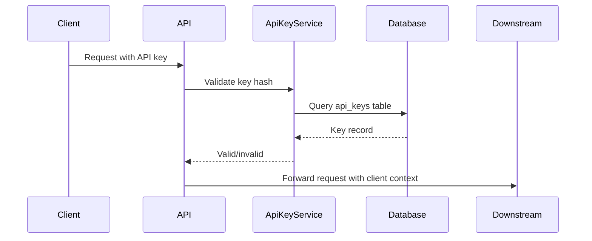

# RFCs & Technical Decision Documents

## Description

Requests for Comments (RFCs) are structured documents for proposing, discussing, and recording technical decisions. This document covers how to write convincing RFCs, navigate the RFC lifecycle, and build a culture of documented design decisions in engineering organizations.

## Prerequisites

- [Conciseness](../grammar-and-style/conciseness.md) — keeping RFC proposals focused and scoped
- [Style Guides](../grammar-and-style/style-guides.md) — following consistent formatting and structure in RFCs

## Table of Contents

- [What Is an RFC?](#what-is-an-rfc)
- [The RFC Lifecycle](#the-rfc-lifecycle)
- [Structure of an RFC](#structure-of-an-rfc)
- [Writing Convincing Proposals](#writing-convincing-proposals)
- [Addressing Feedback Constructively](#addressing-feedback-constructively)
- [Lightweight vs. Heavyweight RFC Processes](#lightweight-vs-heavyweight-rfc-processes)
- [RFC Templates](#rfc-templates)
- [Common RFC Pitfalls](#common-rfc-pitfalls)
- [Building an RFC Culture](#building-an-rfc-culture)
- [Study Cases](#study-cases)
- [Examples](#examples)
- [Glossary](#glossary)
- [Quick References](#quick-references)
- [Next Steps](#next-steps)

## Content / Material

### What Is an RFC?

An RFC is a written proposal that describes a technical decision, solicits feedback, and records the outcome. The term comes from the Internet Engineering Task Force's process for defining internet standards, but most engineering teams use a lightweight adaptation.

**Why write RFCs:**

- **Alignment:** Ensure everyone understands the design before implementation begins
- **Record keeping:** Capture the rationale behind decisions for future reference
- **Feedback:** Get input from stakeholders who would not see the code review
- **Onboarding:** New team members can read past RFCs to understand architectural decisions
- **Gatekeeping:** Prevent poorly thought-out designs from reaching production

**When to write an RFC:**

- New service or major feature
- Architectural change affecting multiple systems
- Database schema change requiring migration
- API design that external teams will consume
- Change in infrastructure or deployment strategy
- Deprecation or removal of a significant feature
- Any decision with long-term consequences

**When not to write an RFC:**

- Bug fixes
- Small features with well-understood solutions
- Configuration changes
- Changes covered by existing RFCs
- Emergency changes that need immediate deployment

### The RFC Lifecycle

An RFC goes through several stages from creation to implementation.

```
Draft → Review → Decision → (Accepted/Rejected/Deferred) → Implementation → Retired
```

**Draft:** The author writes the initial proposal. Share it with a trusted reviewer before opening for broader feedback. A pre-review catches obvious issues and strengthens the proposal.

**Review:** The RFC is shared with the team or organization. Reviewers leave comments, ask questions, and suggest changes. The author addresses feedback and may update the RFC.

Review period typically lasts 3 to 10 business days, depending on the team's culture and the RFC's complexity. Set an explicit deadline for feedback.

**Decision:** A designated decision-maker (tech lead, architect, or team vote) decides the outcome.

- **Accepted:** The proposal is approved. The team can proceed with implementation.
- **Rejected:** The proposal is declined. The author receives clear reasons.
- **Deferred:** The proposal has merit but is not a current priority. It will be revisited.

**Implementation:** The accepted RFC guides the implementation. The author links the implementation PRs to the RFC. If the implementation deviates from the RFC, the author updates the RFC or creates a follow-up.

**Retired:** Once the implementation is complete and stable, the RFC is marked as retired or superseded. It becomes a historical record.

### Structure of an RFC

A well-structured RFC is easy to read, review, and reference. While every team develops its own template, most RFCs include the following sections.

**Title and metadata:**

```markdown
# RFC [Number]: Title

- Status: Draft | Review | Accepted | Rejected | Deferred | Implemented
- Author: Name
- Date: YYYY-MM-DD
- Last updated: YYYY-MM-DD
```

**Motivation:** Why this change is necessary. What problem does it solve? What happens if we do nothing? Frame the problem in terms of user or business impact.

```markdown
## Motivation

The current authentication service uses a shared secret for all API clients.
This approach does not support rotating credentials without downtime, and it
does not provide per-client audit trails. As we onboard external partners,
we need a solution that supports per-client credentials, rotation, and
auditing.
```

**Scope:** What is in scope and what is out of scope. This prevents scope creep and sets clear expectations.

```markdown
## Scope

In scope:
- Per-client API keys with independent rotation
- Audit logging per API key
- Migration script for existing clients

Out of scope:
- OAuth 2.0 implementation (planned for Q3)
- UI for key management (CLI only for now)
```

**Design:** The core of the RFC. Describe the proposed solution in sufficient detail for reviewers to evaluate it. Include architecture diagrams, API schemas, data models, and key algorithms.

```markdown
## Design

### System Architecture

[Architecture diagram or description]

A new `ApiKeyService` will manage API key lifecycle. The service stores
key hashes in a new `api_keys` table. The authentication middleware will
check the incoming key against the hash and attach the client identity to
the request context.

### API Endpoints

POST /v1/api-keys — Create a new API key
  Request: { "client_name": "partner-x", "permissions": ["read"] }
  Response: { "key_id": "ak_xxx", "key_secret": "sk_xxx" }
  Note: key_secret is returned only once

GET /v1/api-keys — List all API keys
DELETE /v1/api-keys/:id — Revoke an API key

### Data Model

api_keys table:
  id          UUID PRIMARY KEY
  client_name TEXT NOT NULL
  key_hash    TEXT NOT NULL
  permissions TEXT[] NOT NULL
  created_at  TIMESTAMP NOT NULL
  revoked_at  TIMESTAMP
  last_used   TIMESTAMP
```

**Alternatives considered:** Show that you explored other options and chose the current approach for specific reasons. This demonstrates thoroughness and preempts the most common objections.

```markdown
## Alternatives Considered

### Option A: OAuth 2.0
  Pros: Industry standard, supports scopes and rotation natively
  Cons: Too complex for current needs, requires OAuth infrastructure
  Decision: Defer OAuth to Q3; use simple API keys now

### Option B: Shared secret with monthly rotation
  Pros: Minimal implementation effort
  Cons: No per-client audit, single point of compromise
  Decision: Reject; insufficient security for external partners
```

**Risks and mitigations:** Identify what could go wrong and how the design addresses it.

```markdown
## Risks and Mitigations

| Risk | Likelihood | Impact | Mitigation |
|------|-----------|--------|------------|
| Key leakage in logs | Medium | High | Add log scrubbing middleware; validate with log review |
| Migration data loss | Low | High | Dry-run migration in staging; rollback script |
| Performance impact of key hashing per request | Low | Low | Key hashing adds < 2ms per request; cache frequent keys |
```

**Migration plan:** How to move from the current state to the proposed state without downtime.

```markdown
## Migration Plan

1. Add `api_keys` table and `ApiKeyService` alongside existing auth (deploy)
2. Run migration script to create keys for existing clients (offline)
3. Distribute new keys to clients with a transition deadline
4. After deadline, remove old shared-secret auth
5. Monitor for clients still using old auth after deadline
```

**Open questions:** List unresolved questions that need discussion during review.

```markdown
## Open Questions

- Should key expiration be mandatory or optional?
- Do we need rate limiting per API key at this stage?
- What is the expected timeline for external partner onboarding?
```

### Writing Convincing Proposals

A convincing RFC is not just technically sound; it is rhetorically effective. It anticipates objections, provides evidence, and makes the decision easy for reviewers.

**Lead with the problem, not the solution.** Spend the first section convincing the reader that the problem is real and important. If the reader does not agree that the problem exists, they will not accept any solution.

```text
// Solution-first (weak)
We should use PostgreSQL for the new event store.

// Problem-first (strong)
Our current event store uses a MySQL table with 50 million rows. Query latency
has degraded from 5ms to 500ms over the last quarter. We need a storage backend
that supports efficient append-only workloads and time-range queries.
```

**Quantify everything.** Use numbers to make your case concrete.

```text
// Vague
The current system is slow.

// Quantified
The current system processes 50 requests per second. Our target is 500 requests
per second. We are 10x short of projected Q3 traffic.
```

**Address the obvious objection first.** If there is an obvious counterargument to your proposal, address it explicitly. This shows that you have considered the trade-offs.

```text
// Unaddressed objection
We should use Kafka for the event pipeline.

// Addressed objection
We should use Kafka for the event pipeline. I know the team has concerns about
operational overhead. However, we already run Kafka for the analytics pipeline,
and the SRE team has confirmed they can support one more topic. The alternative
of building a custom queue on top of Redis would require more engineering
effort to reach Kafka's durability guarantees.
```

**Write for the decider.** Know who will make the final decision and tailor the RFC accordingly. A tech lead cares about maintainability and testability. An architect cares about system-wide consistency. A manager cares about timeline and resource requirements.

**Use diagrams.** A architecture diagram communicates more than paragraphs of text. Use Mermaid or a diagramming tool for system architecture, data flow, and sequence diagrams.



### Addressing Feedback Constructively

RFC review is not a debate to win. It is a collaborative process to improve the design.

**Receiving feedback:**

- Thank the reviewer for their time
- Separate understanding from agreeing. First make sure you understand the comment. Then decide whether you agree.
- If you disagree, explain your reasoning. Do not dismiss the feedback.
- If the feedback reveals a flaw you did not see, update the RFC.
- If multiple people raise the same concern, address it prominently.

```text
// Defensive response
I don't think that's a real concern. The database handles that fine.

// Constructive response
Thanks for raising this. The concern is about write throughput under peak load.
I added a capacity analysis in the "Risks" section that shows our peak write
rate is 200 writes/second and PostgreSQL handles 10,000+ writes/second on
similar hardware. Does that address your concern?
```

**Giving feedback on RFCs:**

- Read the entire RFC before commenting
- Distinguish between blocking concerns and minor suggestions
- Propose alternatives when you reject an approach
- Focus on the design, not the author

**Handling conflicting feedback:** When two reviewers suggest contradictory changes, acknowledge both perspectives and make a call.

```text
Reviewer A suggests using PostgreSQL. Reviewer B suggests using DynamoDB. I
updated the "Alternatives" section to compare both options. My recommendation
remains PostgreSQL because the team has more operational experience with it,
but I am open to further discussion.
```

### Lightweight vs. Heavyweight RFC Processes

Choose an RFC process that matches your team's size and needs.

**Lightweight RFC process:**

- One-page template
- Review period: 2-3 business days
- Decision by the author's tech lead
- No formal numbering system
- Suitable for small teams or low-risk decisions

```markdown
## Lightweight RFC Template

### Problem Statement

[What problem are we solving?]

### Proposed Solution

[Brief description of the approach]

### Trade-offs

[What are we giving up?]

### Discussion

[Links to Slack thread or GitHub discussion]
```

**Heavyweight RFC process:**

- Multi-page template with full sections
- Review period: 5-10 business days
- Decision by committee or architect
- Numbered RFCs tracked in a repository
- Required for cross-team or high-risk decisions

**Choosing the right weight:**

- A database migration for a critical service: heavyweight
- Renaming a function parameter: lightweight
- Adding a new endpoint to an existing API: medium weight
- Choosing a frontend framework for a new project: heavyweight

**Maturity model:** A team can start with a lightweight process and add structure as needed. Do not impose heavyweight processes on a small team that does not need them.

### RFC Templates

**Template 1: Full RFC**

```markdown
# RFC [Number]: [Title]

- Status: Draft
- Author: [Name]
- Date: YYYY-MM-DD

## Motivation

[Problem statement and context]

## Scope

In scope:
- [Item]

Out of scope:
- [Item]

## Design

[Architecture, API, data model, algorithms]

[Optional: diagrams]

## Alternatives Considered

| Option | Pros | Cons | Decision |
|--------|------|------|----------|
| Option A | ... | ... | Accepted/Rejected |
| Option B | ... | ... | Accepted/Rejected |

## Risks and Mitigations

| Risk | Impact | Likelihood | Mitigation |
|------|--------|-----------|------------|

## Migration Plan

[Steps for transitioning from current state]

## Open Questions

- [Question]
```

**Template 2: Decision Log Entry**

For smaller decisions that do not need a full RFC, a decision log entry captures the outcome.

```markdown
## Decision Log: [Date]

### Decision

[What was decided]

### Context

[What prompted the decision]

### Options Considered

- Option A: [pros/cons]
- Option B: [pros/cons]

### Rationale

[Why this option was chosen]

### Participants

[List of people involved in the decision]
```

### Common RFC Pitfalls

**Premature optimization:** Proposing a complex solution for a problem that does not yet exist. Always tie the design to concrete requirements.

**Solution in search of a problem:** Starting from a technology preference and looking for a justification. Start from the problem, not the technology.

**Analysis paralysis:** Spending weeks on an RFC that could have been decided in a 30-minute conversation. Set a time limit on RFC review.

**RFC as spec:** Writing an RFC that is so detailed it becomes the implementation specification. RFCs should guide implementation, not prescribe every line of code.

**No decision maker:** An RFC that goes through review but has no clear owner for the final decision. Always designate a decider.

**Stale RFCs:** RFCs that are written and never implemented or revisited. Regularly review and clean up the RFC repository.

**One-way doors vs. two-way doors:** Jeff Bezos's concept. One-way doors (irreversible decisions) need more process. Two-way doors (easily reversible) can be decided quickly. Apply RFC rigor only to one-way doors.

### Building an RFC Culture

An RFC process is only effective if the team actually uses it. Building the culture requires intentional effort.

**Start small.** Do not require RFCs for every change. Start with high-impact decisions and expand as the team sees value.

**Celebrate good RFCs.** When someone writes a clear RFC that leads to a good decision, acknowledge their effort publicly.

**Make RFCs discoverable.** Store RFCs in a shared location: a GitHub repository, a wiki, or a shared drive. Use a naming convention that makes them searchable.

**Reference RFCs in code.** When implementing an RFC, add a comment linking to the RFC. When making related decisions, reference the relevant RFC.

```text
// Implemented as specified in RFC-0042
// See docs/rfcs/0042-api-key-management.md
```

**Review RFCs regularly.** Schedule time in team meetings to review open RFCs. Do not let RFCs languish in review for weeks.

**Retire old RFCs.** When an RFC is superseded, mark it clearly. Link to the new RFC from the old one.

## Motivation

Our CI pipeline runs 45 minutes on average for a full test suite. Developers
spend 12 hours per week waiting for CI feedback. This delay increases the
feedback loop and reduces development velocity by an estimated 30%.

The current pipeline runs all tests sequentially on a single build agent. We
have two options: (a) parallelize tests across multiple agents, or (b) adopt
a smarter test selection strategy. This RFC proposes option (a) with initial
results from a proof of concept showing 3x speedup.
```

### Example 2: RFC Alternatives Section

```markdown
## Alternatives Considered

### Option A: Self-hosted GitHub Actions runner (Selected)

Pros: Full control over hardware, no data leaves our network, cost-effective
at our scale ($200/month for a dedicated instance).
Cons: Requires maintenance, single point of failure.

### Option B: GitHub-hosted runner

Pros: Zero maintenance, auto-scaling.
Cons: 10x cost at our scale ($2,000/month), limited hardware options.

### Option C: Jenkins

Pros: Team has historical experience with Jenkins.
Cons: Jenkins master requires significant maintenance; team actively moved
away from Jenkins two years ago.
```

### Example 3: RFC Risks Section

```markdown
## Risks and Mitigations

| Risk | Impact | Likelihood | Mitigation |
|------|--------|-----------|------------|
| Runner instance goes down during a deployment | Delayed deployment | Low (instance has 99.9% uptime SLA) | Add a fallback to GitHub-hosted runner for critical deployments |
| Build artifacts cached on runner are lost | Slower builds | Medium (instance restarts) | Use S3 for artifact cache; runner only holds ephemeral build state |
| Instance cost exceeds budget | Budget overrun | Low | Set up billing alert at 80% of budget; instance cost is fixed, not usage-based |
```

### Example 4: RFC Migration Plan

```markdown
## Migration Plan

Phase 1 (Week 1): Set up self-hosted runner in staging. Run tests in parallel
to validate results match sequential execution.

Phase 2 (Week 2): Migrate the CI pipeline to use the self-hosted runner for
all pull request builds. Keep the old pipeline as fallback.

Phase 3 (Week 3): Migrate deployment builds. Remove fallback pipeline after
one week of stable operation.

Phase 4 (Week 4): Monitor build times and cost. Document the setup for the
team wiki. Retire the old pipeline configuration.

Rollback: Revert the CI configuration to use GitHub-hosted runners. This is
a one-line change and takes 5 minutes to deploy.
```

## Glossary

| Term | Definition |
|------|------------|
| RFC | Request for Comments — a structured proposal document for technical decisions |
| Decision log | A record of decisions made and their rationale |
| Draft | The initial state of an RFC before review |
| Decider | The person responsible for making the final decision on an RFC |
| One-way door | A decision that is difficult or impossible to reverse |
| Two-way door | A decision that is easily reversible |
| Strangler fig pattern | A migration pattern that incrementally replaces a system |
| Blue-green deployment | A deployment strategy with two identical environments for zero-downtime switching |
| Superseded | An RFC that has been replaced by a newer RFC |

## Quick References

- [IETF RFCs in Plain Text](https://www.ietf.org/standards/rfcs/) — the original RFCs that defined internet protocols
- [Rust RFC Process](https://rust-lang.github.io/rfcs/) — a well-documented RFC process for language evolution
- [Google Design Docs](https://www.industrialempathy.com/posts/design-docs-at-google/) — Google's approach to design documentation
- [RFC Culture at hashicorp](https://www.hashicorp.com/blog/rfcs-at-hashicorp) — case study from a large engineering organization
- [Writing Great Design Docs](https://medium.com/@laurieontech/writing-great-design-docs-ee8c8abcb4e6) — practical guide for writing RFCs

## Next Steps

- [Writing Effective Code Review Comments](code-reviews.md) — translating RFC designs into review-ready code
- [Meeting Notes & Action Items](meeting-notes.md) — capturing RFC review decisions in meeting notes
