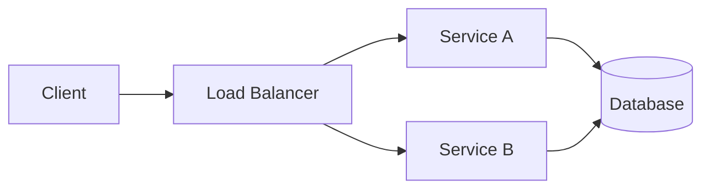

# Reading DevBook

## Description

DevBook's mandatory 9-section format is not merely an organizational convention — it is a reading affordance designed for efficient knowledge extraction. This document teaches you how to read DevBook content strategically: how to use the format to find what you need, how to approach different content types (code, diagrams, formulas), how to chain documents into learning paths, and how to adjust your reading register across subjects.

## Prerequisites

- [Active Reading Workflows for Developers](active-reading-workflows-for-developers.md) — the four-phase model (preview, read, process, archive) applies directly to reading DevBook documents
- [Reading Documentation Effectively](reading-documentation.md) — strategies for navigating structured technical content

## Table of Contents

- [The 9-Section Format as a Reading Tool](#the-9-section-format-as-a-reading-tool)
- [Reading the Content Section](#reading-the-content-section)
- [Using Prerequisites Effectively](#using-prerequisites-effectively)
- [Using Next Steps as a Curriculum Builder](#using-next-steps-as-a-curriculum-builder)
- [Reading Across Subjects](#reading-across-subjects)
- [Skimming vs. Deep Reading](#skimming-vs-deep-reading)
- [Reading the Glossary](#reading-the-glossary)
- [Reading the Different Registers](#reading-the-different-registers)
- [Sample Reading Session](#sample-reading-session)
- [Learning Tips](#learning-tips)
- [Glossary](#glossary)
- [Quick References](#quick-references)
- [Next Steps](#next-steps)

## Content / Material

### The 9-Section Format as a Reading Tool

Every DevBook content file follows a fixed sequence of nine sections. Understanding this sequence allows you to navigate any document with minimal cognitive overhead. The format is not arbitrary — it is a deliberate design that makes knowledge extraction predictable across all subjects, from linear algebra to existential philosophy.

| Section | What it offers the reader |
|---|---|
| Title | The topic, scoped precisely |
| Description | The document's premise and relevance — read this first to decide whether to proceed |
| Prerequisites | Knowledge dependencies — links to documents you should read first |
| Table of Contents | The document's internal map — use this to jump to relevant sections |
| Content / Material | The core exposition — code, prose, diagrams, formulas |
| Learning Tips | Study strategies specific to this topic |
| Glossary | Definitions of key terms introduced in the document |
| Quick References | Verified external resources for further exploration |
| Next Steps | Logical continuations — links to documents that build on this material |

**Using each section strategically:**

**Title** — The title is a precise scope statement. A title like "Reading DevBook" tells you the document covers a specific meta-skill (reading the library itself), not reading in general. If the title does not match your information need, move on.

**Description** — Always read the Description first. It answers the question "Why should I keep reading?" in one to three sentences. If the Description does not convince you the document addresses your current goal, you have saved yourself time.

**Prerequisites** — This is your gap detector. Before investing time in the Content, scan each prerequisite. If you are missing knowledge, you have three options: fulfill the gap by reading the prerequisite, read in parallel, or proceed with awareness that you are working from partial context. More on this in [Using Prerequisites Effectively](#using-prerequisites-effectively).

**Table of Contents** — The TOC is your navigation tool for non-linear reading. Use it to find the sections most relevant to your goal. If you are looking for a specific concept, scan the TOC headings rather than reading sequentially.

**Content / Material** — The core exposition. This is where the knowledge lives. The section is structured with subheadings that form a logical narrative. Read sequentially for deep understanding; scan via subheadings for reference.

**Learning Tips** — This optional section contains practical advice: common pitfalls, memory aids, practice strategies. Read it after the Content to reinforce your understanding. Skip it during initial assessment — it is for retention, not comprehension.

**Glossary** — A lookup tool and comprehension check. Use it during reading to confirm term definitions and after reading to test recall. More on this in [Reading the Glossary](#reading-the-glossary).

**Quick References** — Verified external resources. Use these when you need a different perspective, deeper treatment, or authoritative source. Every link has been verified by the author.

**Next Steps** — Recommended continuations that build on the current document. Use these to build learning paths. More on this in [Using Next Steps as a Curriculum Builder](#using-next-steps-as-a-curriculum-builder).

The format is designed for non-linear reading. A reader familiar with the topic may skip directly to the Glossary to check terminology, scan the Content for specific code examples, or jump from a Next Step to a deeper document. The format does not enforce linear progression — it enables strategic navigation.

**Reading order by goal:**

| Your goal | Read in this order |
|---|---|
| Quick assessment | Description → Prerequisites → Next Steps |
| Deep learning | Prerequisites (fulfill gaps) → Content → Learning Tips → Glossary → Next Steps |
| Reference lookup | Glossary → Content (specific section) |
| Curriculum planning | Description → Prerequisites → Next Steps → Next Steps' Prerequisites (recursive) |
| Review | Glossary → Learning Tips → Quick References |

**The four-level index chain:** DevBook's organization extends beyond individual documents. Every document is part of a four-level chain: root index → subject index → module index → content file. When you find a document through its module index, you see it in context — its prerequisites, siblings, and related modules are visible in the index structure. Use the module index to understand where a document sits in the learning path before reading it.

### Reading the Content Section

The Content section is the heart of every DevBook document. It contains four types of material, each requiring a different reading approach. The same content may blend multiple types — a paragraph of prose may introduce a code example that illustrates a formula.

**Prose explanations:** Read actively with the techniques from [Active Reading Workflows for Developers](active-reading-workflows-for-developers.md). Annotate claims, connections, and questions. Definitions appear on first use — note them for the Glossary.

Prose in DevBook follows academic register: precise terminology, formal sentence structure, and no colloquialisms. When you encounter a sentence that feels dense, pause and parse it. Identify the subject, the claim, and the evidence. For example:

```text
"Modular monoliths represent an intermediate architectural state
between monolithic deployment and full microservice decomposition,
trading operational complexity for deployment simplicity."

Parsing: The claim is that modular monoliths are an intermediate
state. The evidence is the trade-off: operational complexity is
exchanged for deployment simplicity. The sentence defines a concept
by its position on a spectrum.
```

**Code examples:** Code blocks are language-identified and serve to clarify concepts. They appear in programming, mathematics, systems design, and related subjects. Read them as follows:

1. Read the surrounding prose first — it establishes the problem the code solves.
2. Read the code top to bottom without running it, forming a mental model.
3. Trace key variables and control flow.
4. Ask: "What would break if I changed X?"

Code is not decoration. If a document contains a code block, the author judged it necessary for understanding the concept. Do not skip it.

When a code example builds on a previous one, read the progression as a narrative. The first version establishes the baseline; subsequent versions add complexity or handle edge cases.

```python
# Version 1: Basic implementation
def calculate_fibonacci(n):
    if n <= 1:
        return n
    return calculate_fibonacci(n - 1) + calculate_fibonacci(n - 2)

# Version 2: With memoization
def calculate_fibonacci(n, memo={}):
    if n in memo:
        return memo[n]
    if n <= 1:
        return n
    memo[n] = calculate_fibonacci(n - 1, memo) + calculate_fibonacci(n - 2, memo)
    return memo[n]
```

Reading this progression: Version 1 establishes the recursive definition. Version 2 introduces memoization to solve the exponential time complexity. The change between versions encodes the lesson — adding a cache transforms the algorithm from O(2^n) to O(n).

**Mermaid diagrams:** DevBook uses Mermaid for flowcharts, sequence diagrams, graphs, and architecture diagrams. When you encounter a Mermaid block:

1. Read the diagram's caption or the prose immediately preceding it.
2. Identify the diagram type — flowchart (process), sequence diagram (interaction), graph (relationship).
3. Trace the primary path or flow.
4. Check for branches, error paths, or alternative flows.



For this diagram, the primary flow is Client → Load Balancer → either Service → Database. The branching point is the Load Balancer. The shared Database indicates that both services read and write the same data store.

Diagrams in DevBook are not decorative — they encode structural relationships that prose alone cannot convey efficiently. If a diagram seems complex, redraw it in your notes. The act of redrawing forces you to understand each connection.

**ASCII art diagrams:** In addition to Mermaid, some documents use ASCII art with Unicode box-drawing characters for simple inline illustrations. These are used when the diagram is simple enough that a full Mermaid block would be overkill, or when the illustration needs to render correctly in plain text. Read ASCII art diagrams as you would a Mermaid diagram — trace the flow, identify branches, and check for labels.

```text
┌─────────┐     ┌─────────┐     ┌─────────┐
│  Input  │────►│ Process │────►│ Output  │
└─────────┘     └─────────┘     └─────────┘
```

**LaTeX formulas:** Mathematical content uses LaTeX syntax, with `$` for inline expressions and `$$` for display equations.

```
$$ e^{i\theta} = \cos\theta + i\sin\theta $$
```

When you encounter a formula:

1. Read it as a sentence, not a symbol salad. The equals sign means "is defined as" or "is equivalent to."
2. Identify the components — which symbols represent inputs, which represent outputs.
3. Read the surrounding prose for the conceptual interpretation.
4. If a formula is central to the argument, copy it into your notes with annotations.

For complex formulas, break them into parts. A formula like the quadratic formula can be understood as three components: the negation of b (the linear coefficient), the discriminant under the radical (which determines the number of solutions), and the division by 2a (which normalizes by the quadratic coefficient).

**Tables:** DevBook uses tables extensively to organize comparative information. When you encounter a table, read it as a decision matrix. The left column typically lists the items being compared, and the remaining columns list the dimensions of comparison. Identify the pattern across rows — which item wins on which dimension.

**Callout blocks:** Some documents use blockquotes or horizontal rules to highlight important caveats, edge cases, or cross-references. These are signals to slow down. A blockquote in the middle of a prose section typically introduces a nuance that qualifies the preceding claim.

### Using Prerequisites Effectively

The Prerequisites section lists documents whose content the current document assumes. It serves two functions: gap detection and load management. Reading the Prerequisites before the Content is the single most important habit you can develop as a DevBook reader.

**Gap detection:** Before reading the Content section, scan each prerequisite. For each, ask yourself: "Do I understand the core concept of this prerequisite well enough to build on it?" If the answer is no, you have identified a knowledge gap.

If you have not read a listed document, you have three options:

- **Read it first.** The safest option. The current document will build on its concepts. The prerequisite document's Content section provides the foundation the current document assumes.
- **Read it in parallel.** Open both documents and switch between them as needed. Use the prerequisite's Glossary as a quick reference when you encounter an unfamiliar term. This works well when the prerequisite is broad and the current document uses only a subset of its concepts.
- **Proceed without reading.** Risky but viable when you already understand the core concept from prior experience. Use the Glossary of the prerequisite document as a quick catch-up. Read the prerequisite's Learning Tips section for common pitfalls you might encounter.

**Load management:** Prerequisites also signal cognitive load. A document with five prerequisites is likely denser than one with one. A document with prerequisites from multiple subjects (e.g., one from psychology and one from mathematics) indicates interdisciplinary content that requires switching between mental models. Adjust your time budget accordingly.

| Number of prerequisites | Implied cognitive load | Suggested time budget |
|---|---|---|
| 0-1 | Low — self-contained topic | Standard reading time |
| 2-3 | Moderate — builds on established concepts | 1.5x standard time |
| 4+ | High — assumes broad prior knowledge | 2x standard time, plus prerequisite fulfillment |

**Recursive prerequisite chains:** Prerequisites may themselves have prerequisites. Before starting a deep reading session, follow the chain upward to ensure you are not missing foundational knowledge. A quick way: open each prerequisite, read its Description and Prerequisites, and decide.

For example, a document on distributed consensus might list:

```text
Reading DevBook (this document)
  └── Requires: Active Reading Workflows for Developers
       └── Requires: Evaluating Sources & Claims
            └── Requires: (none — root prerequisite)
```

If you identify a chain of three prerequisites, you have a choice: read all three in sequence (safe but time-consuming) or read only the terminal prerequisite and trust that the intermediate documents bridge the gap (risky but faster).

**The prerequisite fulfillment workflow:**

```text
1. Open the target document.
2. Read its Prerequisites list.
3. For each prerequisite, ask: "Do I know this?"
   - YES → Proceed to next prerequisite.
   - NO → Open the prerequisite.
     - Read its Description.
     - Read its Prerequisites (check for recursion).
     - Decide: read, parallel, or skip.
4. After all prerequisites are assessed, begin the target document.
5. If you encounter an unfamiliar term during reading, check the prerequisite's Glossary.
```

### Using Next Steps as a Curriculum Builder

Next Steps transform a single document into a node in a learning graph. They serve as recommended continuations — not everything you could read next, but what the author judged most valuable for deepening your understanding or extending your skills.

**Chain reading strategy:**

1. After finishing a document, review its Next Steps.
2. Identify which step aligns with your current learning goal.
3. Open that document and read its Description and Prerequisites.
4. If the prerequisites align with your current knowledge, proceed. If not, fulfill the gap first.
5. Repeat. Each Next Step leads to another document with its own Next Steps.

**Building a curriculum:** You can construct a custom learning path by following Next Steps across documents. This works horizontally across subjects (broadening) and vertically within modules (deepening).

**Horizontal chain (cross-subject breadth):**

```text
Reading DevBook (reading-technical-texts)
  └── Next Step → Why Academic English Matters (academic-english)
       └── Next Step → Academic Vocabulary (academic-english)
            └── Next Step → Understanding Abstraction (academic-english)
```

This chain moves from how to read DevBook to understanding the language DevBook is written in. Each step builds on the previous one while crossing module boundaries.

**Vertical chain (within-module depth):**

```text
Evaluating Sources & Claims (reading-technical-texts)
  └── Next Step → Reading Documentation Effectively (reading-technical-texts)
       └── Next Step → Note-Taking & Knowledge Management (reading-technical-texts)
            └── Next Step → Reading Codebases Strategically (reading-technical-texts)
```

This chain deepens within a single module. Each document covers a distinct aspect of reading technical texts, and each assumes the previous has been read.

**Curriculum design principles:**

- **Depth before breadth.** When exploring a new subject, follow vertical chains first. Build deep knowledge in one module before branching to related modules. This prevents the shallow-knowledge trap — knowing a little about many things without understanding any of them deeply.
- **Use Next Steps as a syllabus.** A module's index provides a map of all documents; Next Steps provide a recommended traversal order. Treat Next Steps as the default path and diverge only when you have a specific reason.
- **Recursive curriculum building.** After following a chain of Next Steps, review the full path. Identify patterns — which subjects recur? Which types of documents appear most often? This meta-awareness helps you design future learning paths more intentionally.

### Reading Across Subjects

DevBook is interdisciplinary by design. A mathematics document may reference philosophical concepts. A psychology document may reference systems design. These cross-references are intentional — they connect technical skills with human wisdom, reflecting the project's conviction that a developer's growth is not purely technical.

When you encounter a cross-subject reference in a Prerequisite or Next Step, treat it as a signal of conceptual interdependence. The author is claiming that understanding the current topic requires awareness of a concept from another domain. This is not incidental — it reflects the designed interconnectedness of knowledge.

**Common cross-subject patterns in DevBook:**

| Primary subject | Frequently cross-references | Reason |
|---|---|---|
| Mathematics | Physics, Computer Science | Mathematical models underpin physical simulation and computation |
| Psychology | Level Up, Philosophy | Behavioral concepts inform personal transformation |
| Software Engineering | Psychology, Business | Team dynamics and product decisions require human understanding |
| Security | Networks, Mathematics | Cryptography depends on number theory; secure protocols depend on network fundamentals |
| Systems Design | Programming, Cloud & DevOps | Architectural patterns manifest in code and infrastructure |

**Cross-subject reading strategies:**

- **Borrow vocabulary, not depth.** You may not need to master linear algebra to read a cryptography document, but knowing what a vector space is helps. Read the prerequisite document's Glossary and Learning Tips before diving into the cross-referenced topic. The goal is functional literacy, not mastery — enough vocabulary to understand the reference, not enough to solve problems in the source domain.
- **Use intro files as bridges.** Each subject and module has an `intro/` directory containing background and context. When crossing into an unfamiliar subject, read its intro file first. It establishes the field's purpose and vocabulary without requiring technical depth. For example, before reading a cryptography document that references number theory, read the mathematics intro to understand how mathematicians think about structure and proof.
- **Recognize register shifts.** A document in the philosophy subject uses a different register from one in the programming subject. Be prepared to adjust your reading speed and annotation strategy accordingly. When you notice the register shifting mid-document (a programming document discussing ethical implications, for instance), pause and switch mental models.
- **Follow cross-references recursively.** When a document references a concept from another subject, open the referenced document and read its Description and Glossary. This takes two minutes and prevents confusion from a single unfamiliar term derailing your comprehension.
- **Map your cross-subject reading.** Keep a log of cross-subject references you follow. Over time, patterns emerge — certain subjects serve as "hub" disciplines that connect many others. For example, mathematics appears as a prerequisite for physics, computer science, cryptography, and machine learning. Identifying these hubs helps you prioritize which subjects to develop depth in.

### Skimming vs. Deep Reading

Not every DevBook document deserves the same investment. Matching your reading depth to the document's role in your learning path is a skill worth developing. The 80/20 rule applies: 80 percent of value comes from 20 percent of the documents you read.

**When to skim:**

- The document is a prerequisite for something you actually want to read, and you already have functional knowledge of its topic.
- You are surveying a module to decide where to invest time — scanning all documents in a module index and skimming each takes 30 minutes and gives you a map of the territory.
- You are looking for a specific piece of information: a term definition, a formula, a code pattern, a reference to an external resource.
- The topic is peripheral to your current goals but worth being aware of for future reference.
- The document is in a subject you plan to study later, and you want to bookmark it for deep reading at that time.

**Skimming strategy:**

1. Read Description and Prerequisites (1 minute).
2. Scan the Table of Contents for relevant headings.
3. Read the first paragraph of each Content subsection to understand the scope.
4. Check the Glossary for unfamiliar terms — note which terms are defined.
5. Read the Next Steps to understand where this document leads.
6. If a specific section seems directly relevant, read that subsection fully.

Time budget: 3-5 minutes. Output: a one-sentence summary of the document's contribution and a triage decision (deep read now, deep read later, reference only, skip).

**When to deep read:**

- The document is directly relevant to your current project or learning goal.
- The document is a prerequisite for multiple documents you plan to read (invest once, benefit many times).
- The topic is foundational to a subject you are exploring — foundational documents repay deep reading disproportionately.
- The document contains code, formulas, or diagrams you need to understand precisely.
- The document is referenced by multiple other documents in the same module — it is likely a keystone concept.

**Deep reading strategy:**

1. Fulfill all prerequisites first. Do not skip this step — deep reading assumes the foundation is solid.
2. Read the Content section sequentially, annotating as you go. Use the annotation code system from [Active Reading Workflows for Developers](active-reading-workflows-for-developers.md): `?` for questions, `!` for insights, `*` for connections.
3. Copy code examples and test them in your own environment. Practical verification transforms abstract understanding into working knowledge.
4. Redraw Mermaid diagrams and ASCII art in your notes. The act of redrawing forces you to trace every connection.
5. Work through formulas step by step. Write them out by hand if possible — handwriting engages different cognitive pathways than typing.
6. Complete the Learning Tips exercises. These are designed to test and reinforce understanding.
7. Review the Glossary and add new terms to your personal knowledge base with definitions in your own words.
8. Read the Quick References and explore at least one external resource for a different perspective.

Time budget: 30-60 minutes. Output: annotated document, working code examples, personal notes with connections, a clear decision about next steps.

**The skimming-deep reading decision matrix:**

| Document characteristic | Skim | Deep read |
|---|---|---|
| Directly relevant to active project | No | Yes |
| Peripheral to current goals | Yes | No |
| Has code or formulas | Maybe | Yes |
| Prerequisite for multiple documents | No | Yes |
| Introductory / foundational | No | Yes |
| Reference / lookup document | Yes | No |
| Cross-subject reference | Yes (borrow vocabulary) | Maybe (if building depth) |

**Re-reading strategy:** Some documents reward re-reading. A document you skimmed during module survey should be deep read when you study the module properly. A document you deep read six months ago should be skimmed again as a refresher before diving into advanced documents that build on it.

### Reading the Glossary

The Glossary is not an afterthought — it is a lookup tool for terms introduced in the document. Use it actively during reading, not just as a post-reading reference.

**As you read:** When you encounter a bolded or emphasized term, check whether it appears in the Glossary. If it does, the author considers it a key concept. Pause and ensure you understand it before proceeding. Do not skip terms you think you already know — verify your understanding against the definition.

**The glossary-first technique:** Before reading the Content section, read the entire Glossary. This primes you for the key concepts you will encounter. For each term, ask: "Have I seen this before? Do I have a working definition?" Terms you cannot define are flagged for attention during reading.

**After reading:** Review the Glossary as a comprehension check. Cover the definition column and try to recall each term from memory. Score yourself:

| Result | Meaning |
|---|---|
| All terms recalled correctly | Strong comprehension — proceed to Next Steps |
| 1-3 terms missed | Partial comprehension — re-read the relevant Content subsections |
| 4+ terms missed | Weak comprehension — re-read the full Content section and consider whether you fulfilled all prerequisites |

**Cross-document glossary chains:** A term defined in one document's Glossary may appear without redefinition in a document that lists the first as a prerequisite. When you encounter an unfamiliar term in a Content section, check the prerequisite document's Glossary first before searching externally. For example, if a document on distributed consensus uses the term "quorum" and you have forgotten its meaning, the prerequisite document on distributed systems likely defines it in its Glossary.

**Building your personal glossary:** As you read across DevBook, maintain a personal glossary of terms you encounter. Include the document source, the definition, and a note on how the term connects to your work or learning. Over time, this personal glossary becomes a map of your learning journey — each term is a node connected to the documents where you learned it.

```markdown
| Term | My definition | Source | Connection |
|---|---|---|---|
| Quorum | The minimum number of nodes that must agree for a distributed decision to be valid | Distributed Systems (devbook) | Used in consensus protocol at work |
| Register | A variety of language used for a particular purpose or setting | Reading DevBook (devbook) | Helps me identify document types quickly |
```

### Reading the Different Registers

DevBook uses three distinct registers. Recognizing which register you are reading allows you to adjust your reading speed, annotation strategy, and expectations. Misreading the register leads to frustration — reading academic prose for implementation details is like reading a novel for its index.

**Technical register** (used in programming, mathematics, physics, networks, security, systems design, data & databases, cloud & devops): Direct, precise, example-driven. Sentences are shorter than in academic prose. Concepts are demonstrated through code, diagrams, and formulas rather than argumentation. The goal is transferable understanding — can you apply this concept in your own work?

| Technical register characteristic | Reading implication |
|---|---|
| Short, declarative sentences | Scan quickly — each sentence carries one unit of information |
| Code examples carry the load | Do not skip code blocks — they are the primary delivery mechanism |
| Tables organize comparisons | Read tables as decision matrices |
| Minimal qualification | Claims are stated directly — few hedges or caveats |

**Reading strategy for technical register:** Read code first, then prose. The code is the authoritative expression of the concept; the prose explains why it works. Annotate by testing code in your own environment. Time budget: faster than academic register — 20-40 minutes for a full document.

**Academic register** (used in philosophy, psychology, governance, ethics, linguistics): Formal, dense, argument-driven. Sentences are longer with more subordinate clauses and nested structure. Concepts are developed through claims, evidence, and counterarguments rather than demonstration. The goal is critical understanding — can you evaluate the argument?

| Academic register characteristic | Reading implication |
|---|---|
| Long sentences with subordinate clauses | Read slowly — parse each clause before moving on |
| Claims are supported by evidence | Distinguish the claim from the evidence |
| Hedging language is meaningful | "Suggests," "may indicate," "tends to" are deliberate qualifications |
| Arguments build cumulatively | Read sequentially — skipping breaks the argument chain |

**Reading strategy for academic register:** Read prose first, then check for supporting diagrams or tables. Academic register documents in DevBook may include Mermaid diagrams for conceptual relationships, but the primary content is the argument. Annotate by tracking claims and evidence. Time budget: slower — 40-60 minutes for a full document.

**Literary nonfiction register** (used in the `level-up/` subject): Narrative, experiential, reflective. Prose techniques such as scene-setting, imagery, metaphor, and character arcs convey meaning indirectly. Concepts are embodied in stories rather than stated as propositions. The goal is transformative understanding — does this change how you see yourself or your situation?

| Literary nonfiction characteristic | Reading implication |
|---|---|
| Narrative structure | Read for resonance, not information extraction |
| Metaphor and imagery carry meaning | Annotate passages that provoke insight |
| Concepts are implied, not stated | Reflect on what the narrative suggests rather than tells |
| Emotional engagement is intentional | Allow yourself to feel the text, not just analyze it |

**Reading strategy for literary nonfiction register:** Read in a quiet environment with time for reflection. Annotate passages that resonate, provoke, or challenge. After reading, write a brief reflection on how the narrative connects to your own experience. Time budget: variable — some documents can be read in 20 minutes, others benefit from multiple sessions.

**Register overlap:** Some documents blend registers. A programming document may open with a philosophical reflection (academic register) before presenting code (technical register). A level-up document may include technical concepts from psychology (academic register) within its narrative. When you notice a register shift, pause and adjust your reading strategy. The author made a deliberate choice to switch modes — understand why.

For a deeper treatment of these registers, see [Why Academic English Matters](../academic-english/intro/why-academic-english-matters.md) and [Academic Vocabulary](../academic-english/academic-vocabulary.md).

### Sample Reading Session

This walkthrough demonstrates how an experienced reader applies the strategies from this document to a real DevBook document. The target is [Active Reading Workflows for Developers](active-reading-workflows-for-developers.md), a document in this same module.

**Context:** The reader (a mid-career backend developer) wants to improve how they retain technical blog posts and research papers. They have 60 minutes available for a focused reading session.

**Step 1 — Assess (30 seconds):** Read the Title and Description. The title signals a practical, process-oriented document. The Description confirms it synthesizes techniques into a repeatable system called the four-phase model. The Description also cross-references note-taking, which signals that this document is part of a larger workflow. Decision: this is directly relevant and worth deep reading.

**Step 2 — Check prerequisites (2 minutes):** Three prerequisites are listed:

1. Critical Reading of Blogs & Tutorials — the reader recognizes this skill but has not read the DevBook document.
2. Evaluating Sources & Claims — the reader has read this document and remembers the ACCAB framework.
3. How to Read a Research Paper — the reader has not read this document but is familiar with the three-pass method from external reading.

The reader applies the gap-detection strategy:

- For prerequisite 1: Opens [Critical Reading of Blogs & Tutorials](evaluating-blog-posts.md), reads its Description and Prerequisites. It requires [Evaluating Sources & Claims](evaluating-sources.md), which the reader has read. The reader reads its Glossary (3 terms: signal-to-noise ratio, authority bias, confirmation bias) and decides to proceed without deep reading. Risk level: low — the core concept is familiar.
- For prerequisite 2: Already fulfilled. Quick review of the ACCAB framework from memory.
- For prerequisite 3: Opens [How to Read a Research Paper](research-papers.md), reads its Description. The three-pass method is familiar. The reader notes the Glossary (5 terms, all known) and decides to skip.

Total prerequisite time: 2 minutes. Outcome: all gaps assessed, no showstoppers. Proceed.

**Step 3 — Plan the read (1 minute):** The Table of Contents shows 9 Content subsections plus Glossary and Next Steps. The reader identifies three high-priority sections: The Four-Phase Model (core concept), Building a Reading Routine (application), and Handling Different Document Types (relevance to diverse reading sources). The reader marks three lower-priority sections for skimming: Physical vs. Digital Annotation (not actionable today), Digital Tools (already has a toolchain), and From Reading to Creation (aspirational, not urgent).

**Step 4 — Deep read (40 minutes):** The reader reads the Content section sequentially, using the annotation code system described in the document itself:

- In the Four-Phase Model section, the reader encounters an ASCII diagram of the preview-read-process-archive pipeline. They trace the flow: Preview feeds into Read, Read into Process, Process into Archive. The Processing phase is marked as "most commonly skipped and most important" — they annotate this with `!` (important insight).
- The annotation code system table (?, !, *, C, A, X, R) appears. The reader decides to adopt it, writing the symbols on a sticky note for their desk. Annotated with `A` (action item).
- The funnel diagram (100 sources → 50 discarded → 30 scanned → 15 read → 5 deep read) resonates. The reader realizes they currently have no discard step — everything goes to "read later." Annotated with `!` and `A`.
- The archive phase section includes a tag taxonomy. The reader notices their existing tag system uses deep hierarchies (5+ levels). The document recommends flat lists of 20-30 tags. This contradicts their current approach. Annotated with `X` (skeptical) and `?` — they will investigate further.
- The Building a Reading Routine section includes specific time budgets. The reader copies the daily habit template into their notes, planning to adapt it for their schedule. Annotated with `A`.

**Step 5 — Check the Glossary (3 minutes):** 14 terms are defined. The reader covers the definition column and tests recall. Results:

- Recalled correctly: active reading, annotation code system, archive phase, atomic note, deep read, four-phase model, marginalia, permanent note, preview phase, processing phase, read phase, scanning, skimming, triage.
- Missed: None.

The reader notices the term "three-pass method" was expected but is not in the Glossary — it was introduced in the prerequisite document. This confirms the cross-document glossary chain strategy works.

**Step 6 — Engage Learning Tips (2 minutes):** The document does not have a dedicated Learning Tips section, but the Building a Reading Routine subsection functions as one. The reader copies the maintenance budget table (daily/weekly/monthly/quarterly time allocations) into their notes.

**Step 7 — Plan next steps (5 minutes):** The Next Steps section links to [Note-Taking & Knowledge Management](note-taking.md). The reader opens it:

- Description: covers methods for capturing, organizing, and connecting knowledge extracted through active reading.
- Prerequisites: lists this document (Active Reading Workflows) as a prerequisite.
- Table of Contents: shows sections on atomic notes, knowledge graphs, and retrieval practice.

The reader adds Note-Taking & Knowledge Management to their reading queue for tomorrow's session. They have built a two-document curriculum: today's document gave the reading process; tomorrow's will give the note-taking process to capture what they extract.

**Session summary:**

| Step | Time spent | Output |
|---|---|---|
| Assess | 30s | Go/no-go decision |
| Prerequisites | 2 min | All gaps assessed, no blockers |
| Plan | 1 min | Reading path identified |
| Deep read | 40 min | Fully annotated document with code system adopted |
| Glossary | 3 min | All 14 terms recalled correctly |
| Learning Tips | 2 min | Maintenance budget saved |
| Next Steps | 5 min | Next document queued |
| **Total** | **~54 min** | |

**Outputs from this session:**
- A fully annotated copy of [Active Reading Workflows for Developers](active-reading-workflows-for-developers.md).
- A new annotation code system adopted for all future reading.
- A personal reading funnel sketched out (percentage targets for discard/scan/read/deep read).
- A daily reading routine template customized for the reader's schedule.
- A clear next document ([Note-Taking & Knowledge Management](note-taking.md)) queued for tomorrow.
- One unresolved question (flat vs. hierarchical tags) marked for investigation.

## Learning Tips

**Practice on this document.** Before finishing this session, apply the strategies directly: read the Glossary (you are here), check the Next Steps (you are about to), and identify your next document. This metacognitive practice — reading about reading while reading — reinforces the skills through immediate application.

**Start with the module index.** Before opening any content file, read the module's `index.md`. It shows the learning path, the relationships between documents, and the phase structure. This context makes each document easier to navigate because you know where it fits in the larger map.

**Read cross-references immediately.** When a document references a term or concept from another document, open that document and read its Glossary and Description before proceeding. This two-minute pause prevents the confusion cascades that occur when you push through unfamiliar terminology.

**Keep a reading log.** For each DevBook session, record:

```markdown
# Reading Log — 2025-01-15

Document: Reading DevBook
Module:   reading-technical-texts
Subject:  english
Depth:    deep read (50 min)
Key takeaway: The 9-section format is a navigation affordance, not just
              a convention. Each section serves a specific reader goal.
Next:     Why Academic English Matters (academic-english)
Terms added: chain reading, learning grid, register
```

A reading log transforms reading from a passive activity into an intentional practice. Review your log monthly to identify patterns — which subjects you gravitate toward, which registers you find challenging, and which Next Steps chains you actually followed.

**Use the annotation code system.** Adopt the notation from [Active Reading Workflows for Developers](active-reading-workflows-for-developers.md): `?` for questions, `!` for insights, `*` for connections, `A` for action items. Consistent annotation makes your marginalia scannable weeks or months later.

**The ten-minute rule.** If you start a document and find yourself struggling after ten minutes, stop. Check whether you have fulfilled all prerequisites. If you have, the document may be Tier 2 or 3 material that assumes more context than you currently possess. Move to a different document and return after building more foundation.

**Re-read strategically.** Some documents reward multiple readings. The first reading builds the map; the second reading fills in details you missed. Schedule re-readings of foundational documents every 3-6 months. Each re-read reveals insights that were invisible on the first pass because you lacked the context to recognize them.

**Apply the Feynman Technique.** After finishing a document, explain its core concept to an imaginary peer in one paragraph. If you cannot do this without referencing your notes, you have not internalized the material. Identify the gaps and re-read the relevant sections.

**Batch deep reading sessions.** Schedule two to three deep reading sessions per week, each 45-60 minutes, rather than reading in scattered five-minute increments. Deep reading requires sustained attention. The 9-section format makes it efficient, but it still needs uninterrupted time to build comprehension.

**Avoid the accumulation trap.** It is better to deep-read one document and implement its insights than to skim twenty and retain none. Apply the preview phase rigorously: for every ten documents you discover, discard five, scan three, read one, and deep-read one. This ratio keeps your reading queue manageable and your comprehension high.

## Glossary

| Term | Definition |
|---|---|
| Active reading | Reading with intentional engagement, annotation, and extraction of knowledge |
| Chain reading | Following Next Steps sequentially to build a custom learning path |
| Cross-subject reference | A link between documents in different DevBook subjects, indicating conceptual interdependence |
| Deep reading | Full sequential reading with annotation, practiced on high-value documents |
| Gap detection | Using the Prerequisites section to identify missing knowledge before reading |
| Learning grid | The horizontal (breadth across phases) and vertical (depth within modules) structure of DevBook indexes |
| Load management | Adjusting reading time and energy based on the number and density of prerequisites |
| Register | A variety of language used for a particular purpose or in a particular social setting |
| Skimming | Rapid reading for general sense or specific information without detailed comprehension |

## Quick References

- [How to Read a Paper (Keshav)](https://blizzard.cs.uwaterloo.ca/keshav/home/Papers/data/07/paper-reading.pdf) — the three-pass method for reading academic papers
- [The Feynman Technique](https://fs.blog/feynman-technique/) — a method for testing understanding by explaining concepts in simple terms
- [Building a Second Brain (Forte)](https://fortelabs.com/blog/basboverview/) — a methodology for capturing and retrieving knowledge

## Next Steps

- [Back to Reading Technical Texts Index](index.md) — explore related documents in this module
- [Why Academic English Matters](../academic-english/intro/why-academic-english-matters.md) — understand the three registers used across DevBook and why academic English is essential
- [Academic Vocabulary](../academic-english/academic-vocabulary.md) — build the vocabulary that unlocks academic reading across DevBook subjects
