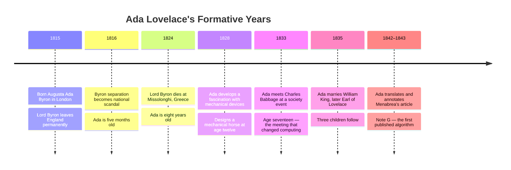
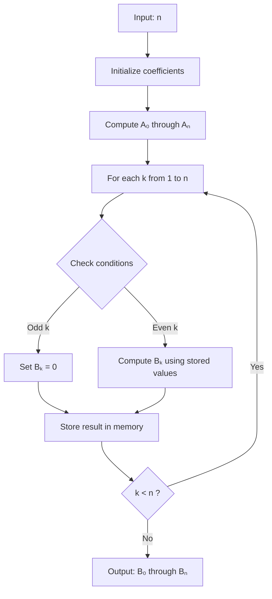
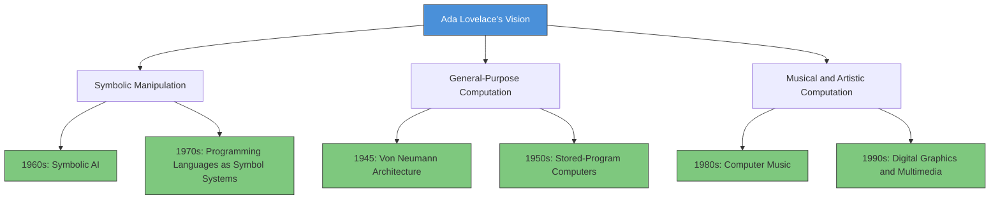
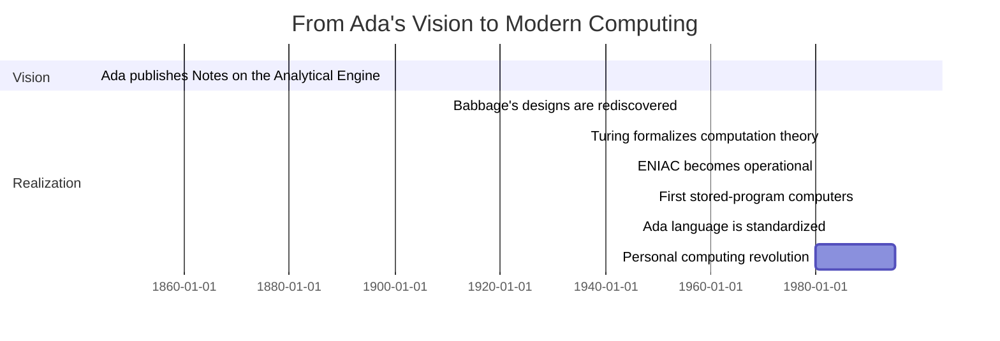
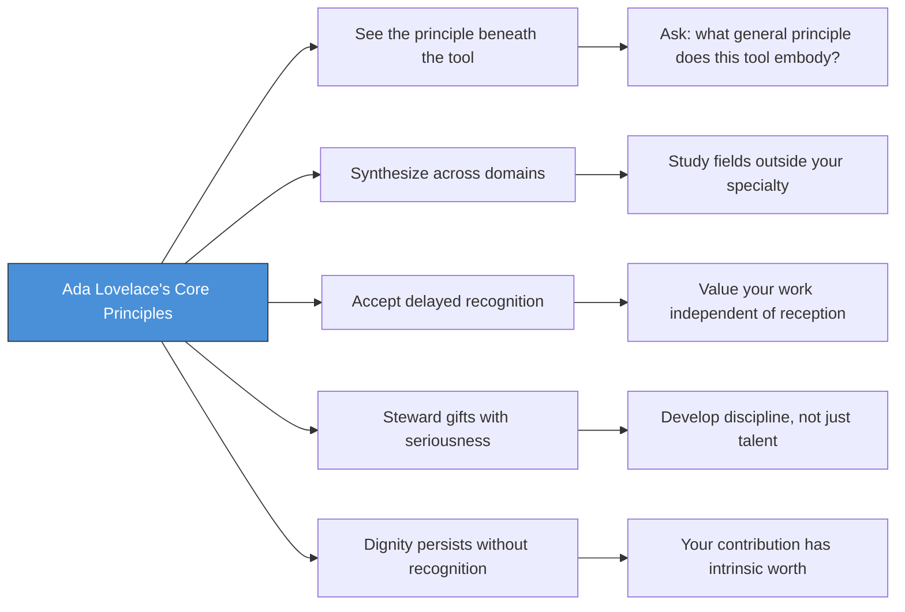

# Ada Lovelace

## Description

Ada Lovelace (1815–1852) was a mathematician and writer whose notes on Charles Babbage's Analytical Engine constitute the first published algorithm intended for machine execution. Beyond the algorithm itself, her deeper contribution was a conceptual vision: that a computing device could manipulate symbols of any kind, not merely numbers, and that it might therefore compose music, produce graphics, and serve purposes its inventors had never imagined. She is widely regarded as the first computer programmer, and her life offers a case study in what it means to see further than one's time permits.

## Prerequisites

- [Why Study Role Models](intro/why-study-role-models.md) — the value of biographical learning and how to extract transferable principles from a life

## Table of Contents

- [Origins — The Daughter of Two Worlds](#-origins--the-daughter-of-two-worlds)
- [The Meeting with Babbage](#-the-meeting-with-babbage)
- [The Work — Notes on the Analytical Engine](#-the-work--notes-on-the-analytical-engine)
- [The Vision — Beyond Calculation](#-the-vision--beyond-calculation)
- [Struggles and Failures](#-struggles-and-failures)
- [Legacy and Lessons](#-legacy-and-lessons)
- [Glossary](#glossary)
- [Quick References](#quick-references)
- [Next Steps](#next-steps)

## 🌅 Origins — The Daughter of Two Worlds

You must understand the household before you can understand the person.

On 10 December 1815, Augusta Ada Byron was born in London — the only legitimate child of the poet George Gordon Byron, later known as Lord Byron, and Anne Isabella Milbanke, a woman of considerable mathematical education and rigid moral seriousness. The marriage had already collapsed. Within weeks of Ada's birth, Lord Byron left England permanently. He would never see his daughter again. He died of fever at Missolonghi in 1824, aged thirty-six, while fighting for Greek independence.

The world into which Ada was born was one of rapid and disorienting change. The Industrial Revolution was transforming Britain's economy and social structure. Steam power, mechanized manufacturing, and the expansion of the railway network were creating new forms of wealth and new forms of poverty. The Napoleonic Wars had ended only three years earlier, and Europe was still adjusting to the peace. The political landscape was volatile: reformers demanded democratic rights, conservatives resisted, and the old aristocratic order was losing its grip on power. In this environment, the boundaries between disciplines were more fluid than they would later become, and a person of sufficient talent and determination could acquire an education that the institutional structures of the age were not designed to provide.

Ada grew up without a father but under the constant shadow of his legend. Lord Byron was the most famous poet in England — brilliant, reckless, scandalous, and exiled. His *Childe Harold's Pilgrimage* had made him overnight famous at twenty-four. His separation from Lady Byron in 1816, followed by his departure from England and his subsequent travels through Europe and the Mediterranean, made him a figure of romantic fascination and moral controversy. He was simultaneously admired for his genius and condemned for his behavior. He was a man who lived as though the rules that governed ordinary people did not apply to him — and who paid a considerable price for that assumption.

Annabella Milbanke, Lady Byron, was a woman of formidable intelligence and rigid self-discipline. She had studied mathematics privately, which was unusual for an aristocratic woman of her era, and she had a keen awareness of the intellectual traditions that shaped British scientific culture. She was also deeply afraid. She feared that Ada would inherit what she termed the "poetic madness" of the Byron line — the volatility, the excess, the self-destructive brilliance that she associated with her husband's character. Whether this fear was justified is a question that historians continue to debate. What is beyond debate is the response Lady Byron devised: Ada would be educated in mathematics and science.

### The Education

This was unusual. In Regency and early Victorian England, the education of aristocratic women was expected to focus on drawing, music, French, and the domestic arts. Mathematics was considered either irrelevant or actively dangerous to the feminine mind — a sphere of knowledge that belonged to men. Lady Byron disregarded these conventions entirely. She employed private tutors, insisted on rigorous mathematical training from an early age, and ensured that Ada's intellectual life was disciplined and structured.

The tutors Lady Byron engaged were not mediocre. Ada studied under William Frend, a social reformer and mathematician; under Mary Somerville, one of the most distinguished scientific minds of the era and the first woman admitted to the Royal Astronomical Society; and under Augustus De Morgan, the first professor of mathematics at the University of London and a pioneer of formal logic. Under De Morgan's guidance, Ada studied algebra, calculus, and the foundations of mathematical reasoning. This was not a superficial education. It was a rigorous apprenticeship in mathematical thinking, conducted at the highest level available in Victorian England.

The result was a child of extraordinary range. Ada was simultaneously immersed in the precise world of mathematics and the imaginative world of her father's legacy. She described herself as being "poetical" and loved to create elaborate fantasies about flying machines and mechanical inventions. She called her imaginative mode "poetical science" — a phrase that captures her lifelong conviction that imagination and rigor were not opposites but partners. In one of her most famous letters, she wrote: "If you can't give me poetry, can't you give me poetical science?"

By the age of twelve, Ada had conceived a design for a mechanical horse. She was systematic about it, documenting the design in a notebook and approaching the project with engineering discipline rather than mere play. The design included a mechanism for propulsion, a system of gears for steering, and a method for the rider to control speed. It was not a toy. It was an engineering sketch produced by a child who had absorbed the habits of systematic thinking from her mathematical education.

### The Shadow of Byron

The Byron scandal was not merely a family embarrassment. It was a public spectacle that dominated the English press for months. Lord Byron's separation from Lady Byron in January 1816 — just five weeks after Ada's birth — was front-page news. The reasons for the separation were never officially disclosed, but rumors circulated freely: incest, cruelty, madness. Byron himself fueled the scandal with his poetry, which seemed to confirm the worst suspicions. His readers debated whether his verses were confessions or provocations. His ex-wife maintained a dignified silence that was interpreted, depending on the observer's sympathies, as either noble restraint or calculated vengeance.

Ada grew up in this atmosphere of rumor and moral judgment. She was, in a sense, a public property before she could speak — the daughter of a famous scandal, the child of a marriage that had become a national obsession. Lady Byron controlled the narrative within the household, presenting herself as the virtuous victim of a dissolute genius. This presentation was not entirely false — Byron's behavior was genuinely reckless and his personal life was chaotic — but it was incomplete. Lady Byron was also a formidable intellectual in her own right, and her decision to educate Ada in mathematics was motivated not only by fear of the Byron inheritance but by her own conviction that mathematical education was intrinsically valuable.

The tension between these two narratives — the scandal and the education, the fear and the ambition — defined Ada's childhood. She was raised to be the antithesis of her father: disciplined where he was reckless, rigorous where he was imaginative, controlled where he was passionate. But the attempt to produce the antithesis of Lord Byron inadvertently produced something more interesting than Lady Byron intended: a person who combined his imaginative range with the mathematical discipline that Lady Byron valued.

### The Formative Environment

The environment that produced Ada Lovelace was one of tension and contradiction. Her mother feared the Byron inheritance — imagination, excess, emotional volatility — and sought to suppress it through mathematical discipline. But the very suppression failed. Ada did not become merely a mathematician. She became a mathematician who thought like a poet, who saw that computation might serve art as well as arithmetic, who understood that the most powerful ideas exist at the intersection of apparently unrelated domains.

This is a pattern worth noting for your own development. The constraints you operate under — whether imposed by circumstances, institutions, or the people around you — do not merely limit you. They can also shape the specific form of your contribution. Ada's contribution was not made despite the tension between poetry and mathematics. It was made because of that tension. The synthesis of two apparently incompatible modes of thought produced something neither could have produced alone.

There is something providential in this — a suggestion that the circumstances of your birth, however imperfect, are not random but consequential. Lady Byron's fear was not unfounded. The Byron legacy was genuinely dangerous. But the response to that fear — the mathematical education, the disciplined imagination — produced something that neither the fear nor the discipline could have produced independently. The constraints became the conditions for a particular kind of excellence. This is not always the case, and it would be dishonest to suggest that every constraint is secretly a gift. But it is worth attending to the possibility that your most difficult circumstances may be shaping the specific form of your contribution in ways you cannot yet see.

## 🔭 The Meeting with Babbage

In 1833, at a society event in London, seventeen-year-old Ada met Charles Babbage — a mathematician, inventor, and polymath who held the Lucasian Chair of Mathematics at Cambridge, the same chair that Newton and later Hawking would occupy. Babbage was fifty-one. He was famous for two things: his Difference Engine, a mechanical calculator designed to produce mathematical tables without human error, and his grander, never-completed vision — the Analytical Engine, a general-purpose computing machine that would use punched cards to execute arbitrary sequences of operations.

Babbage showed Ada a working model of the Difference Engine at his home. Most visitors were impressed and moved on. Ada was captivated. She recognized immediately that the machine was not merely a calculator — it was an expression of a deeper principle. She began a correspondence with Babbage that would continue for the rest of her life.

The encounter was, in a sense, improbable. A seventeen-year-old aristocratic woman, educated privately in mathematics, meeting a fifty-one-year-old professor at the end of a long dinner party. The social conventions of the era would have dictated that Ada express polite admiration and change the subject. Instead, she engaged Babbage on the technical merits of his design, asked probing questions about the Analytical Engine's capabilities, and demonstrated an understanding of the underlying principles that surprised and delighted him. Babbage later described her as "the Enchantress of Number" — a title that captures both his admiration and the romantic register of his thinking.

What distinguished Ada's response from that of her contemporaries was the quality of her engagement. She did not merely admire the machine. She interrogated it. She asked what it could do, what it could not do, and — critically — what it might do if extended beyond its original design. Babbage, who was accustomed to being the cleverest person in any room, found in Ada an interlocutor who could keep pace with his thinking and, at times, surpass it in imaginative scope.

### The Intellectual Partnership

The relationship between Babbage and Ada was complex. Babbage was the inventor and the senior figure; Ada was the younger, less experienced thinker. But their roles in the development of computing ideas were complementary rather than hierarchical. Babbage designed machines. Ada envisioned what those machines might mean.

Babbage was an engineer of extraordinary ambition. He conceived of machines that would eliminate human error from mathematical tables, automate the production of logarithms and navigational charts, and eventually perform arbitrary computations. His designs were mechanically brilliant — intricate arrangements of gears, cams, and levers that embodied mathematical operations in physical form. But Babbage was primarily a builder. He thought in terms of mechanisms, tolerances, and manufacturing processes. His vision was constrained by the physical realities of the machines he was designing.

Ada thought differently. She was interested in what the machines symbolized, not merely what they did. When she looked at the Analytical Engine, she did not see gears and cams. She saw a principle — the principle that mechanical processes could embody formal reasoning. This distinction is subtle but fundamental. Babbage saw a machine that could compute. Ada saw a machine that could reason, in the formal sense of that word: manipulate symbols according to rules.

This distinction matters. In the history of technology, the person who builds the tool and the person who imagines its applications are often different people, and the latter contribution is frequently undervalued. Babbage's engines were remarkable engineering achievements. But it was Ada who articulated, with precision and eloquence, why those engines mattered beyond the production of mathematical tables.

You will encounter this pattern in your own career. The engineers who build systems and the thinkers who see their broader implications are both essential, but the market rewards builders more visibly than visionaries. This is not a reason to choose one role over the other. It is a reason to cultivate both capacities — the ability to build and the ability to see. The most complete technologists are those who can move fluidly between these modes: constructing systems with engineering precision, and then stepping back to ask what those systems mean in the larger context of human flourishing.

### The Social Dynamics

The partnership was also shaped by social forces that neither party could fully control. Ada was a woman. Babbage was a man. In Victorian England, this meant that Ada's contributions were systematically attributed to Babbage or dismissed as derivative. When Ada's notes were published, they appeared in a journal alongside Babbage's own work, and many readers assumed that the ideas in the notes were Babbage's, merely expressed in Ada's words.

This assumption was wrong, but it was not irrational. It reflected the deep structure of Victorian intellectual culture, which did not recognize women as capable of independent mathematical thought. Ada's education, her correspondence with Babbage, and her notes on the Analytical Engine all demonstrate original thinking of the highest order. But the social framework within which this thinking occurred was designed to render it invisible.

Ada was aware of this. In her letters to Babbage, she expressed frustration at the difficulty of being taken seriously. She wrote of the "difficulty of getting known" and of the barriers that her gender imposed on her intellectual life. She did not accept these barriers passively. She worked within them, around them, and occasionally against them. But she never pretended they did not exist.

### The Jacquard Connection

It is important to understand the technological context in which Babbage and Ada were working. The Jacquard loom, invented in 1804 by Joseph Marie Jacquard, used punched cards to control the pattern of a woven fabric. Each card specified which threads should be raised and which should be lowered for a given pass of the shuttle. By stringing together a sequence of cards, a weaver could produce arbitrarily complex patterns — tapestries, brocades, figured silks — without manual intervention at each step.

Babbage borrowed the punched card concept directly from the Jacquard loom. His Analytical Engine would use cards not to control threads but to control operations — adding, subtracting, comparing, storing. The analogy was explicit and deliberate. Just as a Jacquard card encoded a single instruction for the loom, a Babbage card would encode a single instruction for the Engine. And just as a sequence of Jacquard cards could produce a complex fabric, a sequence of Babbage cards could produce a complex computation.

Ada grasped this analogy immediately and extended it. If the Jacquard loom could weave any pattern that could be encoded in cards, and if the Analytical Engine could execute any computation that could be encoded in cards, then the Engine was, in effect, a Jacquard loom for mathematics. But it was also, by the same logic, a Jacquard loom for anything else that could be encoded symbolically — music, language, graphics. The punched card was the bridge between the textile industry and the computing industry, between the physical manipulation of threads and the abstract manipulation of symbols. Ada saw this bridge clearly, and she used it to articulate a vision of computation that transcended Babbage's original intention.

## 📐 The Work — Notes on the Analytical Engine

In 1842, the Italian mathematician Luigi Federico Menabrea published a description of Babbage's Analytical Engine, based on lectures Babbage had given in Turin. The article was in French. Lady Lovelace — Ada was now married to William King, who had been created Earl of Lovelace in 1838 — was commissioned to translate it into English. She agreed, but she did far more than translate.

Over the course of nine months, Ada produced a translation accompanied by a set of notes that were three times longer than the original article. These notes, labeled A through G, constitute one of the most remarkable documents in the history of computing. Note G, the longest and most technically substantive, contains what is widely recognized as the first published algorithm designed for execution by a machine.

### The Notes in Detail

The seven notes that Ada appended to her translation form a comprehensive treatise on the nature and potential of computation. They are not merely supplementary observations. They are a sustained intellectual argument, developed across several hundred pages of text, in which Ada systematically explores what the Analytical Engine is, what it can do, and what its existence implies for the relationship between human thought and mechanical processes.

Note A provides an overview of the Difference Engine and its purpose, establishing the context for understanding the more ambitious Analytical Engine. Note B describes the operational principles of the Analytical Engine in detail, explaining how punched cards would control its operations and how data would be stored and manipulated. Note C addresses the relationship between the Analytical Engine and mathematical logic, drawing on De Morgan's work on formal reasoning. Note D discusses the implications of the Engine for the philosophy of mathematics, including the question of whether mathematical truth is discovered or invented.

Notes E and F explore the relationship between the Engine and the physical world — how a machine that manipulates abstract symbols can nevertheless model real-world processes. This is a deep philosophical question that would not be fully addressed until the twentieth century, when the relationship between computation and physics became a central concern of both disciplines.

Note G, the culminating and most famous of the notes, contains the algorithm.

The total length of Ada's notes — approximately 20,000 words — was remarkable for a translation that was expected to be a routine scholarly exercise. Babbage himself was astonished by the depth and scope of her commentary. In a letter to Ada, he wrote that the notes contained ideas that he had never considered, despite having spent decades thinking about the Analytical Engine. This was not mere politeness. Babbage was not a man given to flattery. He recognized that Ada had seen further than he had, and he said so.

### The Algorithm

The algorithm in Note G computes Bernoulli numbers — a sequence of rational numbers with deep connections to number theory, topology, and mathematical analysis. The computation is non-trivial. It requires a systematic procedure for iterating through a sequence of operations, storing intermediate results, and selecting different computational paths based on the values produced. In modern terms, it requires loops, conditional branching, and memory management — the fundamental building blocks of any program.

The algorithm is not merely a calculation. It is a structured procedure — a sequence of steps that a machine could follow mechanically, without understanding, without intuition, and without human intervention. This is what makes it the first program. Prior to Note G, no one had published a complete, unambiguous procedure for machine execution. Babbage had designed hardware. Ada wrote software.

It is worth pausing to appreciate the precision required for this achievement. Ada was not writing pseudocode. She was not sketching an approximation. She was specifying, in exact detail, a sequence of operations that the Analytical Engine would execute if it existed. The algorithm had to be complete, unambiguous, and correct. It had to account for the limitations of the machine — the finite capacity of its memory, the sequential nature of its operations, the need for explicit instruction at every step. Ada met all of these requirements. Her algorithm is, by any reasonable standard, a program.

### What the Notes Actually Said

The significance of Ada's notes extends far beyond the algorithm. In her commentary, Ada made several observations that were decades — in some cases, a full century — ahead of their time.

**On the limits of the machine.** Ada explicitly stated that the Analytical Engine had no capacity to originate anything. It could only do what it was instructed to do. "The Analytical Engine has no pretensions whatever to originate anything," she wrote. "It can do whatever we know how to order it to perform." This is a precise statement of what would later be called the Church-Turing thesis — that computation is the execution of formally specified procedures, not an act of creativity or understanding. Ada grasped this distinction in 1843, decades before the formalization of computation theory.

This observation is often misunderstood as a limitation on the Engine. It is not. It is a clarification of what the Engine is. The Engine does not think. It does not understand. It does not create. It executes. But the execution of formal procedures, given appropriate instructions, can produce results that appear — to human observers — as though they were the product of thought. This distinction between execution and understanding remains one of the deepest questions in the philosophy of artificial intelligence. Ada identified it clearly, and her formulation has not been substantially improved.

**On symbolic manipulation.** The most visionary passage in Ada's notes concerns the possibility of using the Analytical Engine to manipulate symbols other than numbers. Babbage had conceived of his engine primarily as a calculator — a device for producing mathematical tables. Ada saw further. She argued that if the engine could operate on numbers through symbolic representation, then it could operate on any system of symbols — including musical notation, graphical representation, and natural language.

This is the conceptual leap from calculator to general-purpose computer. It is the insight that distinguishes a pocket calculator from a laptop, a slide rule from a smartphone. The hardware may be designed for arithmetic, but the principle it embodies — the mechanical manipulation of symbols according to formal rules — applies to every domain that can be expressed symbolically. Ada saw this in 1843. The computer industry did not fully grasp it until the 1960s and 1970s.

**On composition.** Ada went further. She suggested that the Analytical Engine might be used to compose music, arguing that musical notes could be represented as numerical quantities and that the engine could therefore manipulate them according to the same formal rules it applied to mathematical operations. This was not a casual observation. It was a rigorous application of her symbolic manipulation thesis to a specific domain, and it anticipated developments that would not materialize for over a century — computer-generated music, algorithmic composition, and the entire field of digital audio.

The music example is particularly revealing because it shows the characteristic Ada synthesis: the combination of mathematical precision with aesthetic sensibility. A pure mathematician might have made the symbolic manipulation argument in abstract terms. Ada grounded it in a concrete, imaginative example that made the abstract principle vivid and communicable. This is the poetical science in action.

### The Nature of Her Contribution

It is important to be precise about what Ada did and what she did not do. She did not design the Analytical Engine — that was Babbage's work. She did not build any hardware. She did not execute any program on a working machine — the Analytical Engine was never completed. What she did was write a program for a machine that did not yet exist, and in doing so, she articulated a theory of computation that the world would not fully appreciate for another hundred years.

This is a form of contribution that software engineers should recognize: the act of thinking clearly about systems that have not yet been built. You will spend much of your career writing code for systems whose implications you cannot fully predict. Ada's example suggests that this is not a deficiency. It is the nature of the work. The value of a program is not exhausted by its immediate execution. It persists in the ideas it embodies and the possibilities it opens.

## 🔮 The Vision — Beyond Calculation

Ada's deepest insight was not technical. It was philosophical.

She understood that the Analytical Engine, despite being designed for arithmetic, embodied a general principle: that any process expressible as a finite sequence of formal steps could be executed mechanically. This principle — what we now call universality — is the foundation of all modern computing. A laptop, a smartphone, a server in a data center — all of them are, at bottom, general-purpose symbol-manipulating machines, and the idea that made them possible is the idea Ada articulated in her notes.

The significance of this insight cannot be overstated. Before Ada, the concept of a machine that could perform arbitrary computations did not exist in the public intellectual discourse. Babbage had the engineering intuition, but it was Ada who provided the theoretical framework and the visionary language that made the idea communicable and transmissible.

### The Pattern of Seeing Ahead

There is a cost to seeing ahead. Ada saw the potential of general-purpose computation in 1843. The first general-purpose electronic computer, ENIAC, was not operational until 1945 — a gap of 102 years. No one built what she described. No one could have built it. The materials science, the electrical engineering, the manufacturing precision — none of it existed. Her vision was real, but the world was not ready to receive it.

This is a recurring pattern in the history of ideas. The visionary sees further than the present permits, and the gap between vision and realization is filled with frustration, obscurity, and the slow erosion of reputation. You will recognize this pattern in your own work when you see a solution clearly but lack the institutional support, the technical infrastructure, or the cultural readiness to implement it. Ada's life suggests that the act of seeing clearly has value independent of immediate execution — but it is a value that may not be recognized in your lifetime.

### The Philosophical Implications

Ada's notes raise questions that remain unresolved. If a machine can manipulate any system of symbols — including those that encode music, language, and visual art — then what distinguishes a machine that creates from a machine that merely executes? Ada's answer was clear: the distinction lies in origination. The machine does not originate. It executes instructions that originate elsewhere. But this answer, while precise, does not fully resolve the question. If the instructions are sufficiently complex, if the outputs are sufficiently surprising, if the machine produces results that its designers did not anticipate — at what point does execution become indistinguishable from creation?

Ada did not answer this question, but she asked it with a clarity that no one before her had achieved. The question remains central to contemporary debates about artificial intelligence, machine learning, and the nature of creativity. When you work with modern AI systems — neural networks that generate text, images, and code — you are working within the philosophical space that Ada opened. The question of whether these systems originate or merely execute is the question she posed in her notes, reformulated in twentieth-century language.

### The Gap Between Vision and Reality

The gap between Ada's vision and its realization was not merely a gap of technology. It was a gap of conceptual readiness. The world of the 1840s had no framework for understanding what Ada was describing. The words she used — "computing," "machine," "algorithm" — meant different things then than they do now. When she wrote that the Analytical Engine might compose music, her contemporaries understood this as a poetic metaphor, not a technical proposition. The conceptual vocabulary that would make her vision intelligible — the vocabulary of formal systems, computation theory, and information science — did not yet exist.

This is a condition that every visionary faces. The ideas that are most ahead of their time are not merely technically premature. They are conceptually premature. The language, the categories, the frameworks that would make them intelligible have not yet been invented. The visionary must therefore communicate in a language that does not yet exist, using words that will be understood differently once the framework catches up. This is why Ada's notes have been subject to so much reinterpretation. Each generation of readers has understood them differently, because each generation has brought a different conceptual framework to the reading.

## ⚔️ Struggles and Failures

The obstacles Ada faced were not primarily intellectual. They were social, physical, and temporal.

### The Constraints of Gender

Victorian England imposed severe restrictions on women's participation in intellectual life. Women could not attend universities — Cambridge did not grant degrees to women until 1948, and Oxford not until 1920. They could not join scientific societies; the Royal Society did not elect a female fellow until 1945. They could not publish under their own names without social censure. They were expected to confine their ambitions to domesticity, to devote their energies to the management of households and the raising of children, and to accept that intellectual life was a masculine prerogative.

These were not merely social conventions. They were structural barriers that shaped what women could learn, what they could produce, and what happened to their productions. A woman who wished to study mathematics had to do so privately, through tutors arranged by family members or through self-study with borrowed books. She had no access to the libraries, laboratories, or lecture halls that supported male scholars. She had no professional network, no institutional affiliation, and no credential that would mark her as a serious thinker. The result was a class of brilliant women whose contributions were systematically invisible — not because they lacked ability, but because the structures of recognition were not designed to see them.

Ada operated within these constraints. Her mathematical education was exceptional, but it was private — arranged by her mother, conducted through private tutors, and insulated from the institutional structures that supported male mathematicians. She had no university degree, no professional position, and no formal credentials. Her access to the intellectual world depended entirely on personal relationships — with Babbage, with her mother's network, and with the small number of individuals who recognized her abilities.

This was not merely inconvenient. It shaped the reception of her work. When Ada published her notes on the Analytical Engine, they appeared anonymously — unsigned, though her identity was widely known. The mathematical establishment, such as it was, did not take her work seriously. The notes were attributed to Babbage. The algorithm was considered Babbage's idea, merely transcribed by a gifted amateur.

The pattern of attribution is worth examining. It recurs throughout the history of science, and it is not limited to gender. Any time a junior person contributes to a project led by a senior person, there is a tendency to attribute the contribution to the leader. This tendency is amplified when the junior person belongs to a group that the dominant culture does not recognize as capable of independent thought. Ada was both junior and female — a combination that virtually guaranteed misattribution. The history of science is littered with cases of this kind: Rosalind Franklin's contribution to the discovery of DNA structure, Lise Meitner's role in the discovery of nuclear fission, Nettie Stevens's identification of the X and Y chromosomes. The pattern is structural, not incidental.

### Health and Personal Life

Ada's health was poor throughout her adult life. She suffered from a series of illnesses that left her bedridden for extended periods. The nature of these illnesses is debated by historians — some suggest measles, others suggest complications from childbirth, and there is evidence of chronic pain that may have had multiple causes. Whatever the diagnosis, her productive periods were punctuated by long intervals of incapacity.

The relationship between health and intellectual output is poorly understood but frequently consequential. Many of the most productive periods in Ada's life were brief and intense — concentrated into intervals between illnesses. Her notes on the Analytical Engine were produced during one such interval. The constraint of limited health imposed a discipline on her work: she could not afford to waste productive time on trivial matters. The result was work of unusual density and focus.

Her personal life was complicated. She married William King in 1835, and they had three children. The marriage was not unhappy, but it was not the central relationship of Ada's intellectual life. That relationship was with Babbage and with the world of ideas that the Analytical Engine represented. She also accumulated significant gambling debts — a fact that has been used by some biographers to discredit her, but which is better understood as evidence of the psychological pressure she was under: the strain of maintaining an intellectual life within social structures that did not permit it, the frustration of seeing her insights ignored, and the restless energy of a mind that had too few outlets.

### Premature Death

Ada died of uterine cancer on 27 November 1852, at the age of thirty-six. She had been ill for several months. In her final days, she asked to be buried next to her father — a request that was honored. She never saw the Analytical Engine built. She never saw her algorithm executed. She never saw the world she had imagined come into being.

The parallels between Ada and her father are striking and, in their own way, tragic. Both died at thirty-six. Both were brilliant, restless, and ahead of their time. Both were misunderstood by their contemporaries. Both were forgotten — Ada more thoroughly than Byron, whose poetry ensured his posthumous fame.

The coincidence of their ages at death invites reflection on the relationship between genius and longevity. Ada's life was not merely short. It was truncated. She had produced her most important work by the age of twenty-seven. The remaining nine years were consumed by illness, family obligations, and the psychological toll of working in an environment that did not recognize her contributions. What she might have produced with another twenty years of health and institutional support is a question that cannot be answered, but it is a question that haunts the history of computing. It is a reminder that the cost of premature death is not merely personal. It is civilizational. Every life that ends before its potential is exhausted represents a loss that extends far beyond the individual.

### The Long Obscurity

For over a century after her death, Ada Lovelace was a footnote in the history of computing. Babbage was remembered as the inventor of the Analytical Engine. Ada was mentioned, if at all, as his translator — a talented woman who had helped make his ideas accessible to an English-speaking audience.

This erasure was not accidental. It was a structural consequence of the gendered assumptions of the Victorian era and their persistence through the twentieth century. The history of computing was written by men, about men, for men. The contributions of women — Ada Lovelace, Grace Hopper, the ENIAC programmers — were systematically minimized or omitted.

The recovery of Ada's reputation began in the 1970s and 1980s, driven by feminist historians of science and by the growing recognition that the history of computing had been told incompletely. In 1979, the U.S. Department of Defense named a programming language "Ada" in her honor. The Ada Association was established. Her notes were reprinted and studied. She was recognized, belatedly, as the first programmer.

The recovery of Ada's reputation is itself a case study in the dynamics of historical memory. The facts of her contribution did not change between 1843 and 1979. The algorithm was always hers. The notes were always hers. What changed was the willingness of the historical profession to take seriously the possibility that a woman, operating outside institutional structures, could produce original mathematical work of the first rank. The recovery was not a discovery of new evidence. It was a correction of old prejudice.

This correction remains incomplete. Ada is now famous, but her fame is often superficial — invoked as an inspirational figure rather than studied as a thinker. The notes themselves are rarely read in full. The algorithm is rarely analyzed in detail. The philosophical arguments are rarely engaged with on their own terms. Ada has been celebrated as a symbol while remaining understudied as a contributor. This is a different form of erasure than the one she suffered in the nineteenth century, but it is erasure nonetheless — the replacement of intellectual engagement with commemorative sentiment.

## 🏛️ Legacy and Lessons

Ada Lovelace's legacy operates on two levels: the technical and the personal.

### The Technical Legacy

Ada's algorithm was never executed in her lifetime. The Analytical Engine was never built. But the ideas in her notes became foundational. Her articulation of symbolic manipulation, her vision of general-purpose computation, and her precise statement of the distinction between computation and origination — these are the intellectual foundations on which the entire computer industry rests.

When you write a program, you are working within a conceptual framework that Ada Lovelace described before anyone had built a machine to execute it. The programming languages, the algorithms, the architectures — all of them are downstream of the insight that mechanical symbol manipulation is the general principle, and arithmetic is merely the special case.

The Ada programming language, developed in the late 1970s and standardized in 1983, was named in her honor. It was designed for embedded and real-time systems — aircraft control, industrial automation, military applications — where reliability is paramount. The naming was deliberate: Ada Lovelace's vision of a machine that could be instructed to perform arbitrary tasks, and whose correctness depended on the quality of those instructions, was the philosophical ancestor of a language designed for systems where programming errors could cost lives. The name carries weight. It connects the first algorithm to the systems that keep aircraft flying and power plants safe.

### The Personal Legacy

The transferable lessons from Ada's life are numerous and, for a software engineer, directly relevant.

**See the principle beneath the tool.** Babbage saw a calculator. Ada saw a general-purpose symbol-manipulating machine. The difference between these two perceptions is the difference between incremental improvement and paradigm-shifting insight. In your own work, cultivate the habit of looking beneath the immediate application to the underlying principle. The tool you build today may be a special case of something far more general.

**Synthesize across domains.** Ada's unique contribution arose from the synthesis of mathematics and poetic imagination. She did not suppress one in favor of the other. She combined them. In your own development, do not confine yourself to a single intellectual domain. The most valuable insights often come from the intersection of apparently unrelated fields.

**Accept the possibility of delayed recognition.** Ada's work was not recognized for over a century. This is an extreme case, but the pattern is common. You may write code, design systems, or articulate ideas that are ahead of their time. The value of the work is not determined by its immediate reception. A contribution that is genuinely ahead of its time is not wasted — it is planted. Its value will be realized, but perhaps not by you, and perhaps not soon.

**Steward your gifts with seriousness.** Ada's mother insisted on a rigorous mathematical education in an era that discouraged it. Ada herself took her intellectual obligations seriously, even when the social structures around her did not. The gifts you possess — intellectual, creative, moral — are not yours to squander. They are responsibilities. The discipline with which you develop and deploy them is a measure of your character, not merely your ambition.

**Dignity persists even when recognition does not.** For a century, Ada was forgotten. But the value of her work was not diminished by that forgetting. The truth of her insights was not contingent on anyone's acknowledgment. This is a principle that applies beyond the history of computing. The dignity of a person's contribution is intrinsic, not conferred by fame or institutional validation. When you work in obscurity, you are not working without value. You are working in the company of every visionary whose contribution was recognized only after their death.

### The Cost of Being Ahead

There is a pattern in the history of science and technology that deserves explicit attention: the pattern of unrecognized genius. Ada Lovelace is one instance. Nikola Tesla is another. Gregor Mendel, whose work on heredity was ignored for thirty-five years, is another. Alan Turing, whose foundational contributions were classified and whose personal life was persecuted by the state, is another.

The pattern has a structure. A person sees further than their contemporaries. They articulate what they see with clarity. The world is not ready. The person is ignored, marginalized, or forgotten. Decades or centuries later, the world catches up, and the person is retroactively recognized as a pioneer.

This pattern is not merely historical. It is operative in the present. If you are working on ideas that your peers do not understand, if you are building systems that the market is not yet ready for, if you are articulating principles that your institution is not prepared to hear — you are in the company of Ada Lovelace. The discomfort of that position is real. The value of that position is also real. The two facts coexist.

The pattern also reveals something about the nature of intellectual progress. Progress is not continuous. It occurs in bursts, separated by long intervals of consolidation. The visionaries who initiate the bursts are rarely the ones who harvest the rewards. The rewards go to those who arrive later, when the soil has been prepared and the conceptual vocabulary has been developed. This is not a injustice that can be corrected by better institutions, though better institutions would help. It is a structural feature of how ideas propagate through cultures that are not yet ready to receive them.

The challenge is to maintain conviction in the face of delayed or absent recognition. This requires a particular kind of faith — not necessarily religious, though it may be that as well — but faith in the intelligibility of the work, in the reality of the principles you have identified, and in the eventual convergence of truth and recognition. Ada's life suggests that this faith is not irrational. It is, in fact, the only rational response to the condition of working ahead of one's time.

This faith must be distinguished from mere stubbornness. Stubbornness is the refusal to abandon a position regardless of evidence. Faith, in the sense intended here, is the willingness to persist in a line of inquiry because the evidence supports it, even when the social environment does not. Ada did not persist because she was obstinate. She persisted because she had seen something real — the principle of general-purpose computation — and she could not in conscience deny what she had seen. The distinction between stubbornness and faith is the distinction between a personality trait and a moral commitment.

### What Ada's Life Means for You

The most important lesson of Ada's life is not technical. It is existential. It concerns the relationship between what you see and what the world is willing to see.

Ada saw the future of computing with a clarity that no one else matched. She articulated it in language that was precise, eloquent, and decades ahead of its time. The world did not listen. She died without recognition. She was forgotten for a century. And then the world caught up.

This is the pattern of every visionary contribution: a period of insight, a period of silence, and a period of recognition. The silence is the hardest part. It is the period in which you must sustain your conviction without external validation, continue your work without institutional support, and maintain your dignity without public acknowledgment.

If you are in that period now — if you are working on something that no one else understands, building something that no one else values, articulating something that no one else is ready to hear — you are not alone. You are in the company of Ada Lovelace, and of every person whose contribution was recognized only after their death. The work is real. The value is real. The recognition will come, though perhaps not in your time.

This is not comfort. It is truth. And truth, even when it offers no consolation, is preferable to the alternative.

## 📚 Learning Tips

When studying Ada Lovelace's life, resist the temptation to treat her as a symbol rather than a person. She was not an icon of women in technology. She was a specific individual with specific gifts, specific constraints, and specific choices. The value of her biography lies not in her status as a symbol but in the particular decisions she made and the particular circumstances she navigated. The biographical method, as described in the [Why Study Role Models](intro/why-study-role-models.md) introduction, emphasizes extracting transferable principles from lived experience. Apply that method here.

Pay attention to the relationship between her education and her contribution. Ada's mathematical training was rigorous and systematic, but it was her imaginative capacity — her ability to see analogies, to synthesize across domains, to think beyond the immediate application — that made her work distinctive. Discipline without imagination produces competent technicians. Imagination without discipline produces Visionaries Who Never Finish. Ada's combination of both is what made her contribution singular.

Notice the role of timing. Ada's notes were published in 1843. The Analytical Engine was never built. The first general-purpose electronic computers appeared in the 1940s. The gap between vision and realization was over a century. This is not unusual in the history of ideas, but it is important to recognize: the value of an idea is not determined by the speed of its implementation. Some ideas are planted before the soil is ready to receive them. This does not make the planting futile. It makes it prophetic. The planter may never see the harvest, but the harvest would not have occurred without the planting.

When reading Ada's notes, focus on the arguments rather than the mathematics. The algorithm in Note G is technically significant, but the philosophical arguments — about the limits of machines, about symbolic manipulation, about the relationship between computation and creativity — are the parts that changed the world. You do not need to understand Bernoulli numbers to understand why Ada Lovelace matters.

Consider also what Ada's life does not teach. It does not teach that talent is sufficient. It does not teach that vision guarantees recognition. It does not teach that the right education produces the right outcome. Ada's life is a case study in the interaction between ability, opportunity, constraint, and luck. She had extraordinary ability. She had unusual opportunities — her mother's insistence on mathematical education, her encounter with Babbage, her social position. She also faced severe constraints — gender, health, institutional exclusion. And she had the bad luck to be born a century before the technology she envisioned became possible. The lesson is not that talent triumphs. The lesson is that talent, combined with disciplined effort and intellectual courage, can produce work of lasting significance — even when the world is not ready to receive it.

## Glossary

| Term | Definition |
|------|------------|
| Analytical Engine | A proposed general-purpose mechanical computer designed by Charles Babbage, never completed in his lifetime |
| Difference Engine | A mechanical calculator designed by Babbage for producing polynomial tables, partially built in the nineteenth century |
| Bernoulli numbers | A sequence of rational numbers arising in number theory and analysis, used by Ada in her published algorithm |
| Note G | The section of Ada Lovelace's translation of Menabrea's article containing the first published computer algorithm |
| Symbolic manipulation | The processing of abstract symbols according to formal rules, independent of the meaning of those symbols |
| Church-Turing thesis | The proposition that any function computable by an effective method is computable by a Turing machine |
| Lucasian Chair | A professorship of mathematics at the University of Cambridge, held by Newton, Babbage, Dirac, Hawking, and others |
| Poetical science | Ada Lovelace's term for the synthesis of mathematical rigor and imaginative vision |
| Punched cards | A data storage medium used in early computing, derived from the Jacquard loom's system for controlling weaving patterns |
| ENIAC | The first general-purpose electronic digital computer, operational in 1945, ninety-two years after Ada's algorithm was published |
| Universality | The principle that a single machine can perform any computation that is expressible as a formal procedure |
| Origination | In Ada's usage, the capacity to initiate a new idea or procedure, as distinguished from executing pre-existing instructions |
| Missolonghi | A city in western Greece where Lord Byron died in 1824 while supporting the Greek war of independence |

## Quick References

- [Ada Lovelace — The National Science Foundation](https://www.nsf.gov/) — historical overview of her contributions to computing
- [The Ada Lovelace Papers — Oxford University](https://www.bodleian.ox.ac.uk/) — manuscript collections including her correspondence with Babbage
- [Computer History Museum — Ada Lovelace](https://www.computerhistory.org/) — exhibition materials and primary sources
- [Note G — The First Algorithm](https://www.fourmilab.ch/) — Byron's annotated transcription of the Bernoulli number algorithm
- [Ada's Notes — Annotated Transcription](https://www.thocp.net/) — complete text of the seven notes with commentary
- [Ada Byron Lovelace — Biography at Mathematical Association of America](https://www.maa.org/) — mathematical context for her contributions
- [The Ada Programming Language — Ada Resource Association](https://www.adaic.org/) — the modern language named in her honor

## Next Steps

- [Alan Turing](alan-turing.md) — the formalization of computation theory, building directly on the conceptual foundation Ada described
- [Grace Hopper](grace-hopper.md) — the first compiler and the practical realization of Ada's vision that machines could manipulate human-readable symbols

---

*This biography is part of the [Biograph](index.md) module within [Level Up](../index.md). Study it not as hagiography but as a case study in vision, intellectual courage, and the structure of unrecognized genius.*
