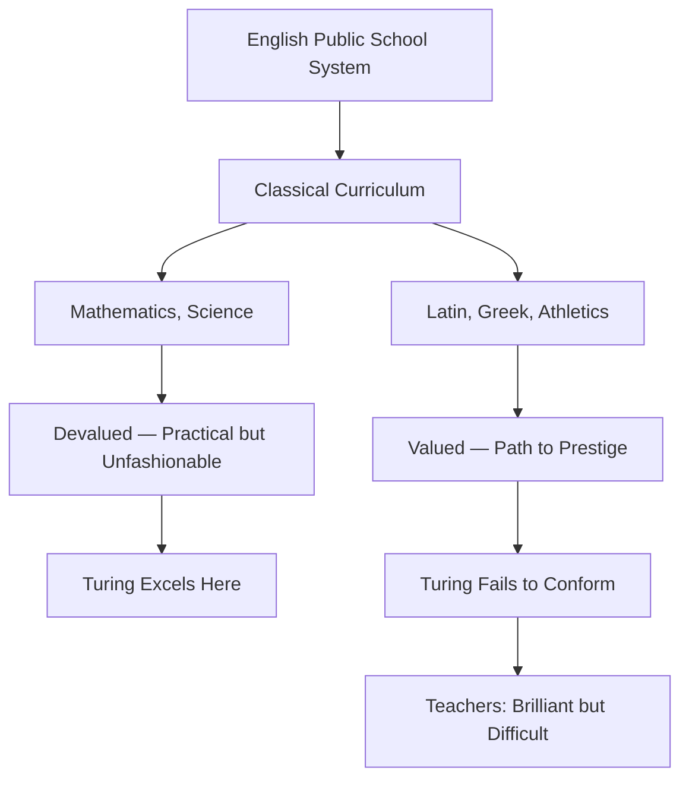
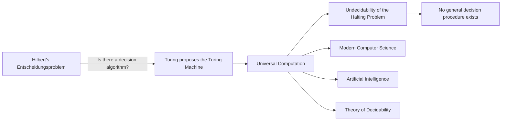
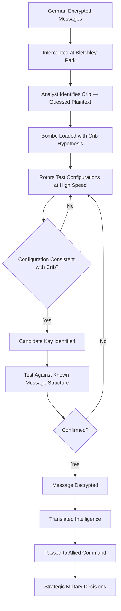
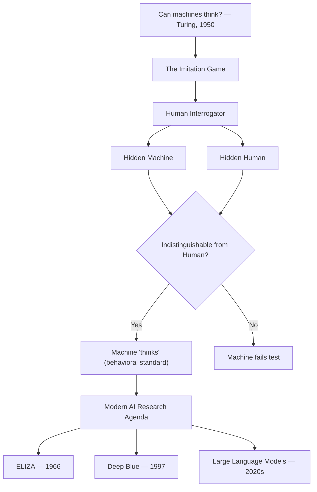
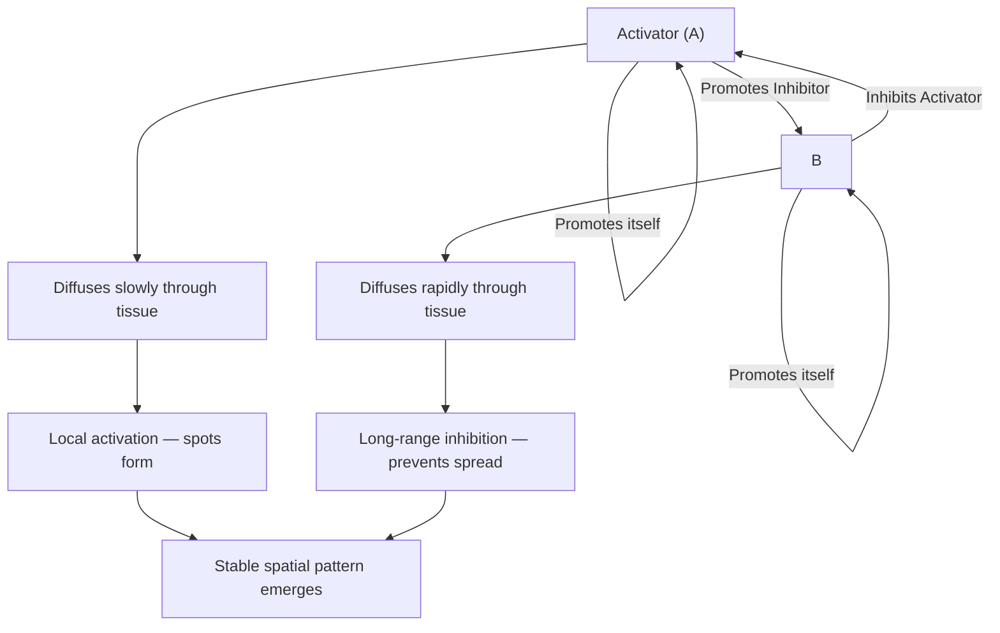
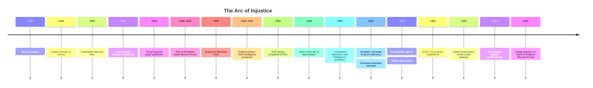
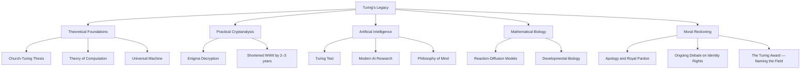

# Alan Turing

## Description

Alan Mathison Turing (1912–1954) was a mathematician, logician, and cryptanalyst whose theoretical and practical contributions established the foundations of computer science and artificial intelligence. His life is a study in the tension between extraordinary intellectual achievement and the weight of a society that could not tolerate his full humanity. To read his biography is to confront the cost of brilliance when it exists within systems of prejudice, and to understand how a single mind can reshape the architecture of civilization while remaining tragically unseen by it.

## Prerequisites

- [Ada Lovelace](ada-lovelace.md) — the predecessor whose vision of a general-purpose computing machine Turing would formalize mathematically

The reader is expected to understand the basic concept of computation and the historical context of early computing. Familiarity with the notion of an algorithm — a finite, step-by-step procedure for solving a problem — will be assumed throughout.

## Table of Contents

- [Origins — The Making of a Mind](#-origins--the-making-of-a-mind)
- [The Work — Reshaping the Possible](#-the-work--reshaping-the-possible)
- [Struggles and Failures — The Weight of Silence](#-struggles-and-failures--the-weight-of-silence)
- [Legacy and Lessons — What Remains](#-legacy-and-lessons--what-remains)

## 🌱 Origins — The Making of a Mind

### A Childhood Between Worlds

Alan Turing was born on 23 June 1912 in Maida Vale, London, to Julius Mathison Turing and Ethel Sara Turing (née Stoney). His father was a member of the Indian Civil Service, stationed in India, and his parents were frequently abroad for months or years at a time. Alan and his older brother John were left in the care of a retired Army couple, the Wards, at their home in St Leonards-on-Sea, Hastings. The children were returned to their parents only to be deposited with new caretakers as the family moved between England and India.

This pattern of attachment and separation — the oscillation between the warmth of foster care and the formality of parental visits — produced in Turing a child who learned early that love was conditional, intermittent, and unreliable. He did notresent his parents for this arrangement. He simply absorbed its lesson: that self-reliance was not a virtue but a necessity. The emotional reserve that characterized his adult life had its roots in these early years.

When Turing was fifteen, his father retired from the Indian Civil Service, and the family returned permanently to England. Alan was enrolled at Sherborne School, a public school in Dorset, in September 1926. The timing was unfortunate — his first day coincided with the General Strike, and he arrived by bicycle, having ridden sixty miles from Southampton to reach the school on time. This small act of determination was characteristic: when Turing decided something mattered, obstacles were irrelevant.

### Sherborne and the Failure of Institutional Education

Sherborne School represented everything that was wrong with English public education in the early twentieth century. The curriculum was classical: Latin, Greek, history, and athletics were valued; mathematics and science were regarded as second-class subjects. The school was designed to produce gentlemen, not thinkers. Turing was neither.

From the beginning, his teachers recognized his exceptional aptitude for mathematics and science while simultaneously regarding him as a disciplinary problem. He was described as absent-minded, rebellious, and peculiar. He refused to memorize Latin grammar. He did his mathematics homework under the desk during other lessons. His school reports consistently praised his mathematical ability while lamenting his failure to conform.

The headmaster, the Reverend J. M. Purser, wrote to Turing's parents a letter that has since become famous in its irony: "I hope he will not let his school influence him in not developing his abilities on account of the school's curriculum." In other words, the school admitted that it could not educate him. A more honest institution might have asked whether the curriculum was the problem. Sherborne asked only that the boy comply.

The isolation of Sherborne — a place where his interests were unwelcome and his personality was pathologized — forced Turing further into his own inner world. He read widely in science and mathematics, often beyond anything the school could offer. He encountered Albert Einstein's work on relativity as a teenager and understood it well enough to write an essay explaining it to his teachers, who did not understand it themselves. This was the pattern of his life: the student surpassing the institution, the practitioner outpacing the theory.

### The Cambridge Years

In 1931, Turing entered King's College, Cambridge, to study mathematics. Here, for the first time, he found a community that valued the kind of thinking he did naturally. The intellectual culture of King's was open, rigorous, and tolerant of eccentricity — a dramatic contrast to Sherborne.

He was elected a Fellow of King's College in 1935 at the age of twenty-two — a distinction typically awarded to graduate students, not undergraduates. His fellowship dissertation proved the central limit theorem, a foundational result in probability theory, independently of existing work. The examiners, unaware of the overlap, awarded it top marks. The episode illustrates both Turing's mathematical power and his characteristic indifference to the literature: he did not read what others had written because he did not need to. He could derive results from first principles.

Cambridge exposed Turing to the leading minds in mathematical logic. Chief among them was Max Newman, a lecturer in mathematics who introduced him to the foundational questions that had occupied David Hilbert and his school. Hilbert's program sought to establish a complete, consistent foundation for all of mathematics. Three questions animated this program: Is mathematics complete (can every true statement be proved)? Is mathematics consistent (can contradictions be avoided)? Is mathematics decidable (is there an algorithm to determine the truth of any statement)?

The third question — the *Entscheidungsproblem* — was the one that would consume Turing. It was not merely a technical puzzle. It was a question about the limits of reason, about whether there is a boundary to what can be known through systematic inquiry. The question haunted Turing. It was not an academic exercise for him. It was the central problem of his intellectual life, and it would shape everything that followed.

### The Entscheidungsproblem and the Universal Machine

In the spring of 1936, Turing produced the paper that would alter the trajectory of human civilization. "On Computable Numbers, with an Application to the Entscheidungsproblem" was published in the *Proceedings of the London Mathematical Society* in November of that year.

The paper's central achievement was twofold: a negative answer to the Entscheidungsproblem, and a formal model of computation that bore his name.

To address Hilbert's decision problem, Turing needed a precise definition of what it means for a function to be "computable." He proposed an abstract device — now known as the Turing machine — consisting of:

1. An infinite tape divided into cells, each capable of holding a symbol
2. A read-write head that could move left or right along the tape
3. A state register that stored the machine's current state
4. A finite table of instructions that specified what to do based on the current state and the symbol being read

Despite its simplicity, the Turing machine could simulate any algorithmic process. Turing then defined a *universal* Turing machine — a machine that could simulate any other Turing machine given its description on the tape. This was the theoretical equivalent of a general-purpose computer: a single machine that could perform any computation, given the right program.

With this device established, Turing proved that the Entscheidungsproblem had no solution. He demonstrated that the halting problem — determining whether an arbitrary Turing machine will eventually stop or run forever — is undecidable. No algorithm can solve it for all cases. The implication was profound: there are questions about mathematics that mathematics itself cannot answer.

The paper was published simultaneously with a similar result by Alonzo Church, who used a different formal system (the lambda calculus). The convergence of two independent approaches to the same conclusion — now known as the Church-Turing thesis — established the formal boundaries of computation with a certainty that few results in the history of logic have achieved.

What made the Turing machine concept revolutionary was not its complexity — it was its simplicity. A tape, a head, a state register, and a table of rules. That was all. Yet from this minimal apparatus, all of computation could be derived. The implication was that complexity was not required for universality — that a sufficiently simple machine, given the right instructions, could perform any calculation that any other machine could perform. This insight — that simplicity and universality are not opposites but allies — would become a foundational principle of computer science, echoed decades later in the RISC architecture philosophy and in the Unix tools tradition.

The Turing machine concept was not merely an abstract curiosity. It was a specification. Every modern computer — from the smartphone in your pocket to the servers that power the internet — is, at its core, a physical implementation of the universal Turing machine. The laptop on which you read this document is executing, in silicon and electricity, the same operations that Turing described on paper in 1936. The universal machine is not a historical artifact. It is the living architecture of the digital age.

Turing traveled to Princeton in the autumn of 1936 to study under Church. Princeton was, at the time, the intellectual center of mathematical logic in the world. Kurt Gödel, John von Neumann, and Church himself were all present. Turing was twenty-four years old, and he was now working alongside the very thinkers whose questions had consumed his Cambridge years.

He completed his doctoral dissertation, "Systems of Logic Based on Ordinals," in 1938. The work was technically brilliant but idiosyncratic — it explored the relationship between ordinal logics and the consistency of mathematical systems, a topic that interested few of his contemporaries. Church called it "a brilliant piece of work" but noted that it had not solved the problem it set out to address. This pattern — brilliant ambition, imperfect completion — would recur throughout Turing's career.

He was offered a research fellowship at Princeton. He declined and returned to Cambridge. The reasons were personal as much as intellectual: he wished to remain in England, close to the life he had built. This decision, which seemed minor at the time, would prove consequential — it placed him in Britain when war broke out, within reach of Bletchley Park.

## ⚙️ The Work — Reshaping the Possible

Turing's contributions span theoretical computer science, cryptanalysis, artificial intelligence, computer engineering, and mathematical biology. Few individuals in history have made foundational contributions to so many distinct fields. What unites these contributions is a consistent intellectual disposition: the willingness to abstract a problem to its essential structure, and the practical courage to build solutions.

### The Bombe — Breaking Enigma

In September 1939, Britain declared war on Germany. Two days later, Turing reported to Bletchley Park, a Victorian estate in Buckinghamshire that had been requisitioned by the Government Code and Cypher School (GC&CS). His task was to break the Enigma cipher — the encryption system used by the German military to coordinate U-boat operations, troop movements, and strategic communications across Europe and the Atlantic.

The Enigma machine resembled a typewriter. When an operator pressed a key, an electrical signal passed through a series of rotating rotors, a reflector, and a plugboard before illuminating a letter on a lampboard. Each rotor could be set to any of 26 positions, and the plugboard swapped pairs of letters before and after the rotor encryption. The Germans changed the rotor settings daily, meaning that a key that decrypted one day's messages was useless for the next. The total number of possible configurations exceeded 150 quintillion (1.5 × 10²⁰).

A brute-force approach — testing every possible configuration — was computationally infeasible. Even with a machine that could test a million configurations per second, the search would take trillions of years.

Turing's approach was characteristically elegant: rather than searching for the key, he designed a machine that could exploit logical inconsistencies in the encrypted messages. The Bombe, built on earlier work by Polish cryptanalyst Marian Rejewski, used a system of rotating electromechanical drums to test possible Enigma settings at high speed. Crucially, Turing introduced the concept of a "crib" — a guessed fragment of plaintext that the analyst believed corresponded to a section of ciphertext. Given a crib, the Bombe could eliminate impossible Enigma configurations at a rate that made daily code-breaking feasible.

The Bombe did not break Enigma in a single stroke. It was an iterative, collaborative effort, involving dozens of machines and hundreds of operators — many of them women from the Women's Royal Naval Service (Wrens). At its peak, Bletchley Park operated over 200 Bombes. The intelligence produced — codenamed "Ultra" — was shared selectively with Allied commanders under strict protocols designed to prevent the Germans from realizing Enigma had been broken.

By war's end, Bletchley Park was decrypting thousands of messages per day. Historians estimate that Ultra intelligence shortened the war by two to three years and saved millions of lives, particularly in the Battle of the Atlantic, where decrypted U-boat communications allowed convoys to avoid wolf pack attacks.

Turing's wartime work remained classified for decades. The Official Secrets Act ensured that the public knew nothing of his contributions. This secrecy was not incidental — it was a deliberate policy. When Turing was prosecuted in 1952, the government could have invoked his service as a defense or mitigation. It did not. The silence was not protective. It was erasing.

### "Computing Machinery and Intelligence" and the Turing Test

In October 1950, Turing published a paper in the journal *Mind* that would become one of the most cited works in the history of artificial intelligence: "Computing Machinery and Intelligence." The paper opened with a disarmingly simple question: "Can machines think?"

Rather than engaging in the philosophical morass of defining "thinking," Turing proposed a practical substitute. He described a scenario he called the Imitation Game: a human interrogator communicates via text with two hidden entities, one human and one machine. If the interrogator cannot reliably distinguish the machine from the human, the machine has passed the test. The test was behavioral, not ontological — it asked not whether a machine "really" thinks, but whether it can produce the outward表现 of thought convincingly enough to deceive a human observer.

The paper was remarkable not only for its proposal but for its anticipation of objections. Turing catalogued nine categories of counterargument and addressed each with precision and dry humor:

1. **The Theological Objection** — thinking is a function of the soul, which machines lack. Turing noted that this objection proves too much: if only souls can think, the argument requires a theological premise that is itself unprovable.

2. **The "Heads in the Sand" Objection** — the consequences of thinking machines would be too dreadful. Turing dismissed this as emotional, not rational.

3. **The Mathematical Objection** — based on Gödel's incompleteness theorems, which show that any formal system contains truths it cannot prove. Turing argued that humans are equally limited: our brains are finite, and we too make errors.

4. **The Argument from Consciousness** — machines cannot truly feel or understand; they merely simulate. Turing proposed the "Lady Lovelace" objection (named after Ada Lovelace): that a machine can only do what it is programmed to do, and therefore cannot genuinely originate anything. He refuted this by noting that even simple programs can produce unexpected results.

5. **Arguments from Various Disabilities** — machines cannot be kind, creative, or fall in love. Turing treated these as empirical claims that might eventually be falsified.

This was not merely an academic exercise. Turing was laying the conceptual groundwork for a field that would not fully materialize for decades. He was writing the charter for artificial intelligence before the term itself had been coined, establishing that the question of machine thought was not a metaphysical puzzle but an engineering challenge.

### The ACE and the Birth of Electronic Computing

Turing's theoretical work on computation translated directly into practical engineering. In late 1945, he joined the National Physical Laboratory (NPL) in London, where he produced a detailed design for the Automatic Computing Engine (ACE) — one of the first designs for a stored-program electronic computer.

The ACE was ambitious by any standard. It was designed to execute instructions stored in memory — the stored-program concept that John von Neumann had articulated in his "First Draft of a Report on the EDVAC" (1945), though Turing's own ideas on this point developed independently. The ACE used a high-speed mercury delay-line memory, capable of performing 1 million operations per second — far faster than any existing machine.

Turing's design document, "Proposed Electronic Calculator," was circulated in 1945 and described in remarkable detail the architecture of a programmable computer. It specified the instruction set, the memory organization, the input/output mechanisms, and the programming methodology. The document was so comprehensive that it constituted a complete blueprint for a working computer, years before most institutions had the resources to build one.

The full ACE was never built during Turing's tenure at NPL. The engineering challenges were formidable, and the NPL bureaucracy was slow to fund the project. A simplified version, the Pilot ACE, was completed in 1950 under the direction of Donald Bayley. It became one of the fastest computers in the world, executing its first program on 10 May 1950.

Turing left the NPL in 1948 to become Deputy Director of the Computing Machine Laboratory at the University of Manchester, where he worked on the Manchester Mark 1 — one of the first stored-program computers to operate successfully. Here, Turing's contributions were more theoretical: he developed the programming manual and worked on the software that would make the machine usable. He wrote the first programming manual for the Manchester Mark 1 and developed a version of the floating-point binary arithmetic that would become standard.

The Manchester years were productive but professionally frustrating. Turing had envisioned a grand trajectory for computing research, but the university's resources were limited, and his relationships with colleagues were strained. He was, by temperament, a solitary worker who preferred to think through problems alone rather than manage teams or navigate institutional politics. This disposition — which had served him well in pure mathematics — was less适应 to the collaborative, resource-intensive work of building computers.

The irony of Turing's career in computer engineering is that his most influential work in this domain — the ACE design — was never fully realized under his direction. Yet the principles he articulated — speed through simplicity, programmability through stored instructions, universality through abstraction — became the foundational tenets of computer architecture.

### Morphogenesis — The Mathematics of Biological Form

In the final years of his life, Turing turned his attention to a problem that seemed, at first glance, unrelated to computation: how biological organisms develop their form and structure. How does a fertilized egg become a creature with spots, stripes, spirals, and segments? What mechanisms produce the precise spatial patterns of a leopard's coat or the branching structure of a coral?

His 1952 paper, "The Chemical Basis of Morphogenesis," proposed a mathematical model based on the interaction of two hypothetical chemical substances — morphogens — that he called activators and inhibitors. One substance promoted its own production and the production of its counterpart; the other suppressed both. When these substances diffused through tissue at different rates, they could spontaneously generate stable spatial patterns: spots, stripes, or bands, depending on the geometry and boundary conditions.

The reaction-diffusion model Turing described was elegant and predictive, but it was not immediately accepted. The biological community lacked the tools to measure the hypothetical morphogens, and the model seemed too abstract to be empirically testable. It was not until the 1990s and 2000s that experimental biology confirmed the existence of reaction-diffusion systems in animal coat patterns, digit formation, and other developmental processes.

Today, Turing's morphogenesis work is recognized as a foundational contribution to mathematical biology. It demonstrated that complex biological patterns could arise from simple chemical interactions — that the complexity of nature did not require equally complex explanations. This principle — that simplicity at the level of mechanism can produce complexity at the level of outcome — is a theme that runs through all of Turing's work, from the universal machine to morphogenesis.

This late work reveals something essential about Turing's intellectual character: he was not confined to a single domain. He moved between mathematics, engineering, biology, and philosophy with a freedom that most specialists cannot achieve, because he understood that the underlying structures of reality are often isomorphic across disciplines. The same mathematical patterns that govern the behavior of automata on a tape can govern the distribution of spots on a leopard's skin. This insight — that nature and computation share a common grammar — is perhaps Turing's most profound and least celebrated contribution.

## 💔 Struggles and Failures — The Weight of Silence

To discuss Turing's struggles is to confront a particular kind of moral failure — not his, but that of the society that received his gifts and punished him for his identity. His story is not one of personal inadequacy. It is one of institutional cruelty.

### The Early Years — Isolation and Misunderstanding

Even before his professional career began, Turing's life was marked by a pattern of isolation that stemmed not from any deficiency of character but from the simple fact that he thought differently from those around him.

At Sherborne, he found no intellectual peers. At Cambridge, he found intellectual community but remained socially marginal — described by contemporaries as awkward, physically ungainly, and prone to long silences punctuated by intense bursts of enthusiasm about topics his interlocutors did not share. He was, in the language of his time, "eccentric," and in the language of ours, neurodivergent.

Yet those who knew him well described a man of considerable personal warmth. He was generous with his ideas, often sharing them freely with colleagues who would later receive credit for work that built upon his unpublished insights. He was an avid runner, completing a marathon in 2 hours 46 minutes — a time that placed him among the top marathoners of his era. He was interested in chess, plant biology, and the design of electronic devices. He was, in short, a complete human being — one whose complexity was flattened into caricature by the institutions that could not accommodate it.

He formed deep attachments to a small number of individuals. The first was Christopher Morcom, a fellow student at Sherborne whom Turing loved deeply. They shared an interest in science and spent hours discussing mathematics, physics, and the nature of reality. Morcom was the first person who treated Turing's intellectual passions as normal rather than eccentric. For a teenager who had been told repeatedly that his interests were strange, this acceptance was transformative.

Christopher Morcom died of bovine tuberculosis on 13 February 1930, at the age of eighteen. The death shattered Turing. It was his first encounter with the irreversibility of loss, and it left a wound that never fully healed. In the weeks that followed, Turing wrote to Morcom's mother, expressing his conviction that Christopher's spirit lived on — that the mind was not reducible to the brain. Biographers have noted that Turing's subsequent work on computation and the nature of mind may have been influenced, at least in part, by this encounter with mortality — a desire to understand whether thought could survive the destruction of the body, and whether the patterns of a mind could be preserved outside their biological substrate.

### Persecution

In January 1952, Turing reported a burglary at his home in Manchester. During the investigation, he acknowledged a sexual relationship with Arnold Murray, a man he had met. Under Section 11 of the Criminal Law Amendment Act 1885, homosexual acts were criminal offenses in Britain. Turing was charged with "gross indecency" — the same charge brought against Oscar Wilde in 1895.

He made no attempt to deny the charge. He saw no reason to. In his characteristic directness, he saw no moral wrong in what he had done. The court, however, disagreed. On 31 March 1952, Turing was convicted and given a choice: imprisonment or probation conditional upon submitting to chemical castration — the administration of synthetic estrogen designed to suppress libido.

He chose the latter. For two years, he underwent hormone treatment that caused significant physical and psychological side effects: gynecomastia (breast enlargement), weight gain, and emotional disturbance. He continued working during this period, producing research on morphogenesis and computing, but those who knew him described a man visibly diminished — not in intellect, but in spirit. The light that had animated his conversation and his work had dimmed.

### The Deeper Failure

Turing's prosecution was not an anomaly. It was the predictable outcome of a legal and social system that criminalized homosexuality. What made it particularly devastating was the context: the British government knew what Turing had done for his country. The work at Bletchley Park had been classified, but the authorities who prosecuted him were aware of his contributions. They prosecuted him anyway.

This is the moral core of Turing's story. The same state that owed its survival, in part, to his genius chose to destroy his dignity because of whom he loved. The hypocrisy is not incidental — it is structural. Systems of power do not exempt their benefactors from their prejudices. They do not pause to consider the contradiction between honoring a man's contributions and punishing his identity. The machinery of persecution operates on its own logic, indifferent to the humanity of those it processes.

The philosopher and mathematician whose work made the digital age possible was, by the law of his own country, a criminal. He was stripped of his security clearance, barred from continuing his consulting work for the Government Communications Headquarters (GCHQ), and subjected to surveillance. The man who had saved the nation was treated as a threat to it.

The pattern is recognizable across history: the individual who serves the state most profoundly is often the one most vulnerable to its mechanisms of control. The state does not distinguish between the contributions of its citizens and their private lives. It consumes the former and punishes the latter. Turing's case is not exceptional in this regard — it is exemplary of a systemic failure that continues to manifest whenever institutions prioritize conformity over the full humanity of those within them.

The conviction did not merely humiliate Turing. It severed him from the intellectual community he had helped to create. Stripped of his security clearance, he could no longer consult for GCHQ, the successor to Bletchley Park. He was isolated from the very institutions that his work had made possible. The man who had built the foundation of British signals intelligence was now regarded as a security risk — a final, exquisite irony in a life defined by the gap between what he gave and what he received.

### Death

On 7 June 1954, Turing's housekeeper, Eliza Clayton, found him dead in his bed. He was forty-one years old. A half-eaten apple lay beside his bed. The inquest, held on 10 June, ruled his death a suicide by cyanide poisoning. The pathologist found potassium cyanide in the apple and in a jar in Turing's laboratory, where he had been conducting electroplating experiments.

The circumstances are painful to contemplate. A man of extraordinary intellectual gifts, whose work had saved millions of lives, died alone in a room, in a country that had branded him a criminal for the crime of love. The apple has become iconic — some suggest it was a deliberate reference to the poisoned apple in *Snow White*, a film Turing loved, though this remains speculative. What is not speculative is the loneliness of the scene: a brilliant mind, destroyed by a system that could not tolerate his wholeness.

His mother, Ethel Turing, maintained until her death that her son's death was accidental — that he had been careless with the chemicals in his home laboratory. Whether this was denial or insight remains unknown. What is certain is that the system that prosecuted him bore responsibility for his despair, regardless of the precise mechanism of his death.

The world would not learn the full truth of what Turing had done for his country until decades after his death. The Official Secrets Act had ensured that his wartime contributions remained hidden, and the stigma of his conviction ensured that even those who knew the truth could not speak it. The silence was total — a man erased by the state he had saved, twice over: once by classification, once by prosecution.

## 🌍 Legacy and Lessons — What Remains

Turing's legacy is vast, but its full scope was invisible for decades. The classification of his wartime work meant that the public knew him only as a mathematician who had done something unspecified during the war and who had died under a cloud. The truth was far more significant.

### The Turing Award

In 1966, the Association for Computing Machinery (ACM) established the A.M. Turing Award — widely regarded as the "Nobel Prize of computing." It is the most prestigious distinction in computer science, awarded annually for contributions of lasting importance to the field. Past recipients include Donald Knuth, Barbara Liskov, Tim Berners-Lee, and Geoffrey Hinton. The award's existence is itself a testament to Turing's centrality: the field of computer science honors its founders by bearing his name.

In 2017, the "Alan Turing law" came into force in the United Kingdom, posthumously pardoning men who had been convicted of homosexual acts that would no longer be considered offenses under modern law. The law extended the principle of the royal pardon beyond Turing to thousands of others who had suffered under the same statutes. It was, in a sense, the institutional acknowledgment that Turing's case was not an isolated injustice but a systemic one — and that correcting it required not a single act of mercy but a change in the law itself.

### The Turing Test and AI

Turing's 1950 paper anticipated the entire trajectory of artificial intelligence research. From ELIZA in the 1960s — Joseph Weizenbaum's simple chatbot that could simulate a psychotherapist — to Deep Blue's defeat of world chess champion Garry Kasparov in 1997, to the large language models of the 2020s, the question Turing posed — "Can machines think?" — remains the animating inquiry of the field.

The Turing Test, despite decades of debate about its adequacy, remains the most widely recognized benchmark for machine intelligence. Critics argue that it measures only the ability to deceive, not genuine understanding. Defenders maintain that the distinction between "genuine understanding" and perfect behavioral mimicry is philosophically incoherent — that the very notion of "genuine understanding" is itself a category error when applied to machines. This debate — which Turing himself anticipated in 1950 through his discussion of the "argument from consciousness" — continues to shape AI research, AI ethics, and the philosophy of mind. It is, in a sense, the question that Turing left as his most enduring gift: not an answer, but a framework within which every subsequent generation could ask the question more precisely.

### The Restoration of Honor

In 2009, British Prime Minister Gordon Brown issued an official public apology on behalf of the government, calling Turing's treatment "appalling" and stating: "We're sorry, you deserved so much better." In 2013, Queen Elizabeth II granted Turing a posthumous royal pardon under the Royal Prerogative of Mercy. In 2021, his image appeared on the Bank of England fifty-pound note, placing him alongside scientists like Newton and Faraday in the nation's symbolic pantheon.

These gestures, while welcome, arrived decades after Turing's death. They cannot undo the damage. They cannot restore the years of humiliation, the career interrupted, the life shortened. But they signal a recognition — belated, imperfect — that the persecution of individuals for their identity is a moral failure of the highest order.

The pardon itself raises a question that has no comfortable answer: what does it mean to pardon someone who did nothing wrong? Turing required no forgiveness. He required justice. The pardon was an act of political remediation — a government correcting its own record — rather than a moral act directed at the individual it had harmed. This distinction matters. The apology was directed at the nation, not at the man. It was a comfort to the living, not to the dead. The dead require something that no government can provide: the reversal of what was done to them.

### What His Life Teaches

Turing's biography is not merely a story of scientific achievement. It is a parable about courage, about the cost of integrity, and about the gap between what a society owes its most vulnerable members and what it actually provides.

For the developer, the engineer, the thinker — Turing's life offers several principles:

**Intellectual honesty is non-negotiable.** Turing did not pretend to be what he was not. He did not dissemble about his identity to avoid prosecution. He stated the truth plainly, because dissembling would have been a greater violation of his nature than the punishment that followed. In a professional landscape that often rewards self-presentation over authenticity, this is a challenging and necessary example. The impulse toward truth — even when truth is costly — reflects a commitment to the reality of one's own existence that cannot be negotiated away.

**Theory and practice are not separate domains.** Turing moved between pure mathematics, engineering, biology, and philosophy. He understood that the barriers between disciplines are human conventions, not features of reality. The most profound contributions often occur at the intersections — where the structures of one field illuminate the problems of another. The universal machine emerged from logic; it was implemented in electronics; its principles now govern biology.

**Society's debt to its outcasts is rarely paid.** The same institution that benefited from Turing's genius destroyed his dignity. This pattern repeats across history: the innovator is celebrated in retrospect but persecuted in the present. The lesson is not cynicism — it is vigilance. Systems must be built that protect the humanity of those who contribute to them. The recognition that every person who builds something of value deserves to exist fully as themselves is not sentiment. It is engineering.

**Silence is not neutral.** The decades of classification surrounding Turing's wartime work were not merely a matter of national security. They were a mechanism of erasure. When a society hides the contributions of its citizens, it denies them the recognition that constitutes a form of social existence. Turing worked in silence, was prosecuted in public, and died without the world knowing what he had done. The silence was not empty — it was complicit.

**Redemption is possible, but it requires action.** The posthumous apology and pardon did not resurrect Turing, but they changed the narrative. They transformed his story from one of isolated tragedy into one of collective reckoning. The implication for the present is clear: the time to correct injustice is not decades later, when it is too late for those who suffered. It is now.

**Curiosity is a moral act.** Turing's refusal to remain within the boundaries of a single discipline — his willingness to ask "what if?" across mathematics, engineering, biology, and philosophy — was not merely intellectual restlessness. It was an expression of a fundamental conviction: that the world is intelligible, that its structures reward inquiry, and that the effort to understand is itself a form of respect for creation. In an age of increasing specialization, this breadth of curiosity is both rarer and more necessary than ever.

## 📝 Learning Tips

- **Read the primary source.** Turing's 1950 paper "Computing Machinery and Intelligence" is accessible, well-written, and contains humor. It reveals his intellectual style more directly than any secondary account. The paper is approximately 18 pages and requires no technical background beyond familiarity with basic logic. Start here before reading biographies — the voice of the man himself is more illuminating than any interpretation.

- **Study the Turing machine before the Bombe.** The theoretical foundation makes the practical application comprehensible. Without understanding computation, the cryptanalysis is engineering; with it, it is applied philosophy. Begin with the formal definition in the 1936 paper, then trace the path to Bletchley Park. The connection between abstract models and concrete machines is the thread that runs through Turing's entire career.

- **Do not separate the person from the work.** Turing's persecution is not a biographical footnote — it is integral to understanding his legacy and the social structures that shape scientific contribution. The decision to omit his persecution from any account of his life is a political act, not a scholarly one. A biography that celebrates the Bombe while glossing over the chemical castration is a falsification.

- **Compare with Ada Lovelace.** Lovelace imagined computation; Turing formalized it. The trajectory from vision to theory to practice illuminates how ideas become institutions. Where Lovelace saw the potential of the Analytical Engine, Turing proved that the potential was universal. The distance between their lives — separated by a century — measures the distance between imagination and realization.

- **Resist the temptation to mythologize.** Turing was a human being with specific strengths and limitations. He was not a saint. He was a mathematician who loved skiing, marathon running, and science fiction. He was socially awkward, sometimes arrogant, and prone to periods of deep depression. The goal of biographical study is extraction of principles, not creation of icons.

- **Trace the Church-Turing thesis.** Understanding why two independent formalisms (Turing machines and lambda calculus) converged on the same notion of computability deepens one's grasp of what computation actually is. This is not merely historical trivia — it is the conceptual foundation of everything that runs on a computer. The convergence suggests that computation is a natural phenomenon, not an invention — something discovered rather than created. Study the thesis alongside Church's lambda calculus to see how two paths led to the same summit.

## 📚 Glossary

| Term | Definition |
|---|---|
| Turing machine | An abstract computational model that reads and writes symbols on an infinite tape according to a finite set of rules; the theoretical foundation of modern computing |
| Entscheidungsproblem | Hilbert's decision problem: the question of whether an algorithm exists that can determine the truth or falsity of any mathematical statement |
| Bombe | An electromechanical device designed by Turing to break the Enigma cipher by testing possible configurations against known plaintext fragments |
| Enigma | A cipher machine used by the German military during World War II for encrypted communication |
| Turing Test | A test of machine intelligence in which a human judge evaluates whether a machine's conversational behavior is distinguishable from a human's |
| ACE | Automatic Computing Engine — Turing's 1945 design for a stored-program electronic computer at the National Physical Laboratory |
| Pilot ACE | A simplified version of the ACE, completed in 1950, which became one of the fastest computers in the world at the time |
| Morphogenesis | The biological process by which organisms develop their form and structure; Turing proposed a mathematical model based on chemical reaction-diffusion |
| Gross indecency | A criminal offense under British law (1885) used to prosecute homosexual acts; the charge brought against Turing in 1952 |
| Church-Turing thesis | The proposition that any function computable by an algorithm can be computed by a Turing machine, establishing the formal boundaries of computation |
| Royal pardon | A formal act of forgiveness by the British monarch; Turing received a posthumous pardon in 2013 |
| Ultra | The codename for intelligence derived from decrypting German communications at Bletchley Park |
| Morphogen | A hypothetical chemical substance that controls the pattern of tissue development; Turing modeled the interaction of activators and inhibitors |
| Reaction-diffusion system | A mathematical model describing how the concentration of substances changes over time due to chemical reactions and spatial diffusion |

## 📖 Quick References

- [Alan Turing: The Enigma — Andrew Hodges](https://www.hodgesbookshop.com/the-enigma/) — the definitive biography, upon which the film *The Imitation Game* was based. Hodges, a mathematician himself, provides the technical depth and biographical rigor that other accounts lack.
- [The Turing Archive for the History of Computing](http://www.turingarchive.org/) — digitized documents and primary sources from Turing's life and work, maintained by the University of Manchester
- [On Computable Numbers — Turing (1936)](https://www.turingarchive.org/items/Turing1936) — the original paper introducing the Turing machine; difficult but essential reading for anyone seeking to understand computation at its foundations
- [Computing Machinery and Intelligence — Turing (1950)](https://doi.org/10.1093/mind/LIX.236.433) — the paper proposing the Turing Test; remarkably accessible and still relevant to contemporary AI debates
- [The Chemical Basis of Morphogenesis — Turing (1952)](https://doi.org/10.1098/rstb.1952.0012) — the paper introducing reaction-diffusion models in biology; a testament to Turing's range
- [ACM A.M. Turing Award](https://amturing.acm.org/) — lectures and biographies of Turing Award recipients; a curated history of the field's most influential contributors
- [The National Archives — Bletchley Park Declassified Records](https://www.nationalarchives.gov.uk/) — government documents from the wartime codebreaking effort, including personnel files and operational records

## Next Steps

The trajectory from Turing's theoretical foundations to practical computing is traced in the biographies that follow. Each built upon his work in ways he could not have foreseen — and, in some cases, in ways the world was not yet ready to receive. The path from the universal machine to the modern computer was not a straight line. It was a winding road, marked by institutional resistance, political indifference, and the slow, painful recognition that the ideas Turing had articulated in 1936 were not merely theoretical — they were the blueprint for a revolution.

- [Grace Hopper](grace-hopper.md) — the practical implementation of Turing's theoretical vision, from compiler design to human-readable programming
- [Donald Knuth](donald-knuth.md) — the formalization of algorithm analysis that extended Turing's foundational work
