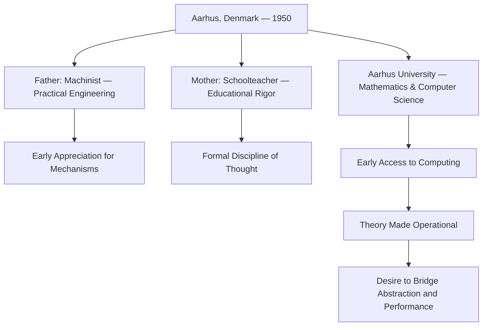
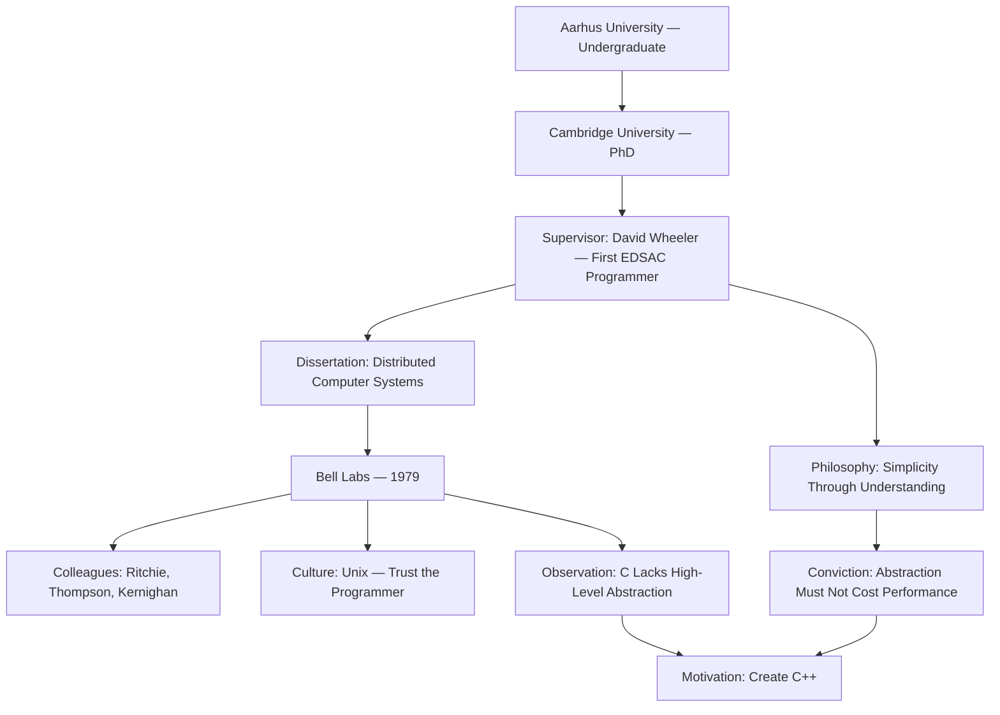
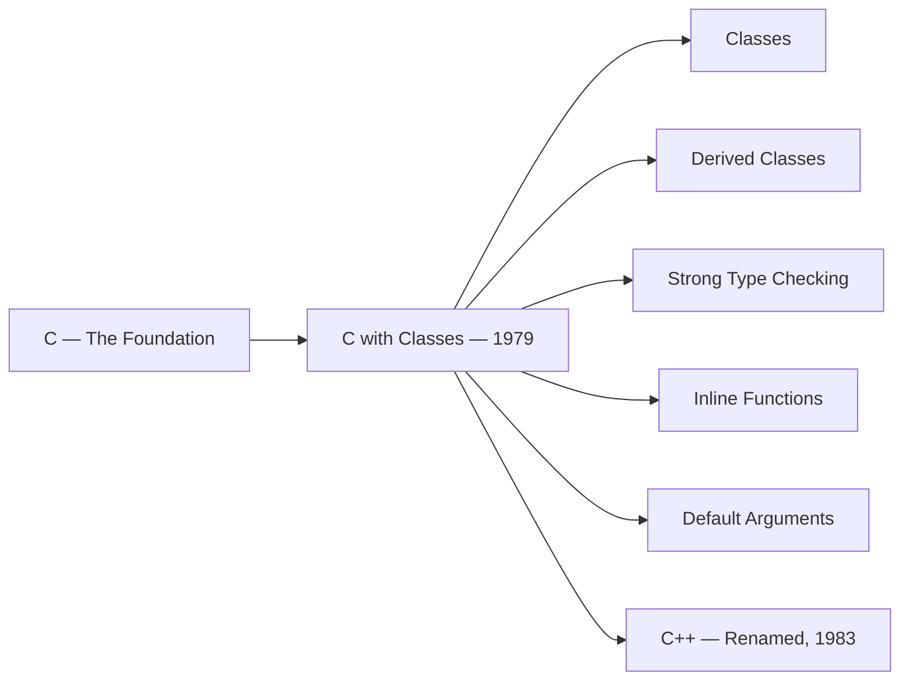
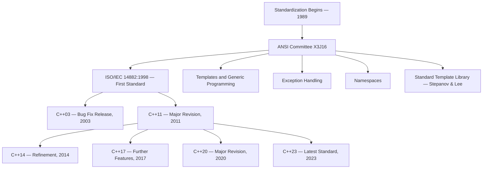
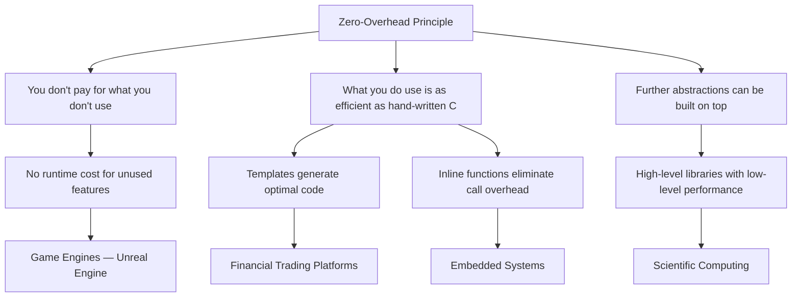
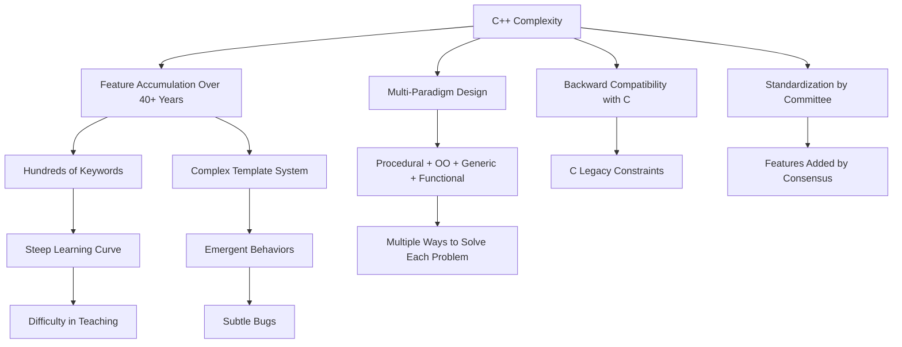
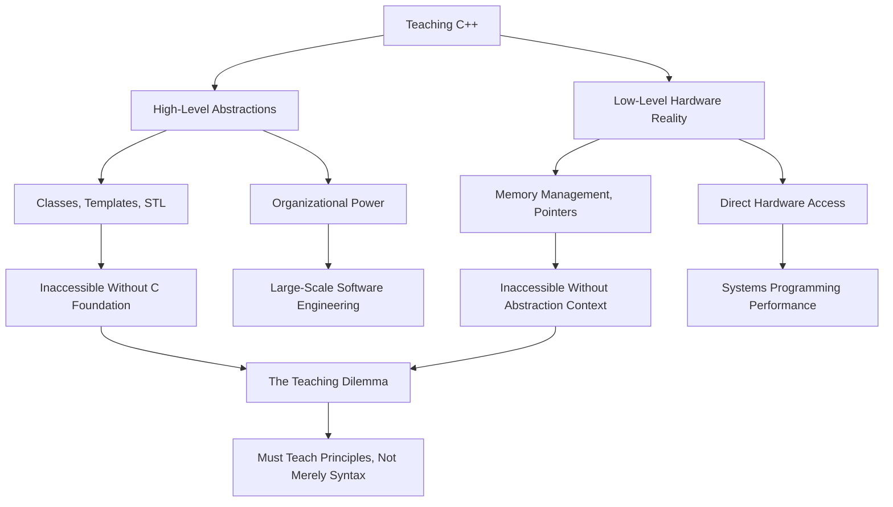
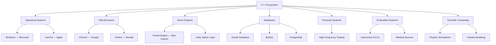
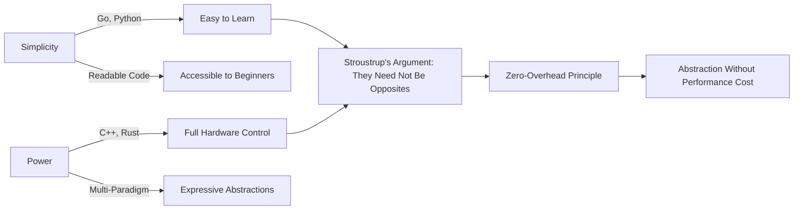
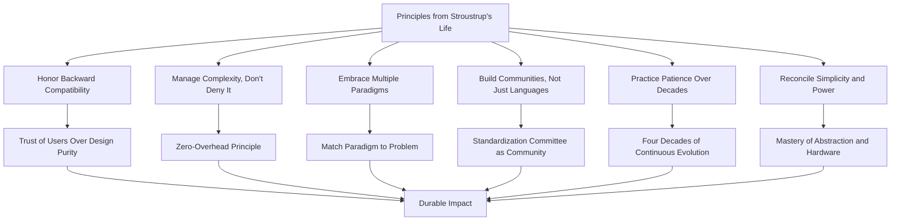

# Bjarne Stroustrup

## Description

Bjarne Stroustrup (born 1950) is a Danish computer scientist whose creation of the C++ programming language at Bell Labs fundamentally altered the trajectory of systems programming, software engineering, and the architecture of modern computing. Where Dennis Ritchie built the low-level infrastructure of operating systems and Ken Thompson distilled the art of simplicity, Stroustrup confronted a different and equally consequential problem: how to provide high-level abstractions without surrendering the performance and control that systems programmers require. The language he created — originally "C with Classes," later renamed C++ — became one of the most widely used and most intensely debated programming languages in history, powering operating systems, game engines, financial trading platforms, embedded systems, and browsers across four decades of continuous evolution. To study Stroustrup is to understand the tension between power and simplicity that defines every significant engineering decision, and to witness how a single individual's vision can shape the infrastructure of civilization while remaining perpetually contested.

## Prerequisites

- [Dennis Ritchie](dennis-ritchie.md) — creator of the C programming language, which Stroustrup extended into C++
- [Ken Thompson](ken-thompson.md) — co-creator of Unix, whose design philosophy shaped the environment in which C++ emerged

The reader is expected to possess a basic understanding of programming concepts, the distinction between high-level and low-level languages, and the historical context of systems programming in the 1970s and 1980s. Familiarity with the concept of object-oriented programming is beneficial but not required, as the narrative traces its development from first principles.

## Table of Contents

- [Origins — The Making of a Language Designer](#-origins--the-making-of-a-language-designer)
- [The Work — Building a Language for a World That Did Not Yet Exist](#-the-work--building-a-language-for-a-world-that-did-not-yet-exist)
- [Struggles and Failures — The Weight of Power](#-struggles-and-failures--the-weight-of-power)
- [Legacy and Lessons — What Four Decades of Evolution Reveal](#-legacy-and-lessons--what-four-decades-of-evolution-reveal)

## 🌱 Origins — The Making of a Language Designer

### Aarhus and the Danish Education

Bjarne Stroustrup was born on 30 December 1950 in Aarhus, Denmark — the second-largest city in the country, a place of university culture, maritime heritage, and the particular Scandinavian commitment to educational rigor. His father, Vendel Stroustrup, was a machinist and workshop supervisor at the local power company; his mother, Kirsten Stroustrup, was a schoolteacher. The household was neither wealthy nor impoverished. It was educated, practical, and oriented toward competence — a milieu in which the ability to understand how things worked was valued above the ability to speak about them abstractly.

The young Stroustrup was not a prodigy in any conventional sense. He was a restless student, intellectually curious but impatient with the structure of formal schooling. He excelled in mathematics and physics, subjects that rewarded the kind of systematic thinking at which he naturally excelled. He was drawn to mechanisms — to the internal logic of systems that could be understood, predicted, and manipulated. This inclination was not yet directed toward computers. In the Denmark of the 1960s, computing was a remote and exotic discipline, confined to a handful of universities and government institutions. The average student in Aarhus would never encounter a computer. Stroustrup would, but not yet.

He enrolled at Aarhus University, where he studied mathematics and computer science — one of the first cohorts of Danish students to have access to computing as an academic discipline. The university had acquired a small computer, and Stroustrup's encounter with it was transformative. The machine was not merely a calculator. It was an instrument through which abstract ideas could be tested, refined, and made to work. The experience crystallized something that had been forming in his mind since childhood: the conviction that the deepest understanding comes not from theory alone but from the discipline of making theory operational.

### Cambridge and the Encounter with David Wheeler

After completing his undergraduate studies at Aarhus, Stroustrup moved to the University of Cambridge in England to pursue graduate work. The decision was not trivial. Cambridge was one of the centers of computing research in the world, and its Computer Laboratory had a lineage that ran directly back to the origins of electronic computation. It was there that Maurice Wilkes had built EDSAC — the Electronic Delay Storage Automatic Calculator — one of the first practical stored-program computers. The institutional memory of this founding was still alive in the Laboratory when Stroustrup arrived in the mid-1970s.

His doctoral supervisor was David Wheeler — a figure of singular importance in the history of computing. Wheeler had been a member of the team that built EDSAC and had written the first program ever executed on that machine in 1949. He had also designed the Wheeler Jump, an early form of subroutine call, and had contributed foundational work on the design of the Cambridge CAP computer. Wheeler was not merely an academic. He was a practitioner of the deepest kind — someone who had built systems at the lowest level and understood, from direct experience, the relationship between hardware architecture and software design.

Under Wheeler's supervision, Stroustrup completed his PhD in 1979 with a dissertation on "Communication and Control in Distributed Computer Systems." The research concerned the design of distributed systems — networks of computers that cooperate to perform tasks while maintaining independent operation. The work was rigorous, mathematical, and forward-looking: distributed computing was a nascent field in the late 1970s, and the problems Stroustrup addressed — consistency, coordination, fault tolerance — would become the central challenges of networked computing in the decades to follow.

But the deepest lesson Stroustrup absorbed at Cambridge was not in his dissertation. It was in Wheeler's philosophy of engineering. Wheeler believed in simplicity — not the simplicity of minimalism, but the simplicity that comes from understanding a problem so thoroughly that the solution becomes obvious. He believed that the best systems were those that gave the programmer direct control over the machine, without layers of abstraction that obscured the underlying reality. This conviction — that abstraction must not cost performance, that the programmer must remain sovereign — became the foundational principle of C++. Stroustrup did not invent it at Cambridge. He recognized it there, in the work of a man who had built the first program on the first practical computer, and who understood that the relationship between the programmer and the machine must never be mediated by forces that the programmer cannot control.

### Bell Labs: The World of Ritchie and Thompson

In 1979, Stroustrup accepted a position at Bell Telephone Laboratories in Murray Hill, New Jersey — the same institution where Dennis Ritchie and Ken Thompson had created Unix and C. The convergence was not coincidental. Bell Labs was the center of gravity for systems research in the late 1970s, and it attracted engineers who were interested in the same problems that Stroustrup had pursued at Cambridge: how to build systems that were both high-level and efficient, both abstract and close to the hardware.

Stroustrup arrived in a department that was intellectually charged but not politically tranquil. The Unix community at Bell Labs had its own culture — informal, technically demanding, and skeptical of abstraction for abstraction's sake. The Unix programmers valued C because it was close to the metal, because it trusted the programmer, because it did not conceal the cost of operations. Stroustrup respected these values. He shared them. But he also recognized their limitations: C was a language of extraordinary power and extraordinary danger. Writing large, complex systems in C required a level of discipline that most programmers could not sustain. The absence of type safety, the ease of introducing memory errors, the difficulty of managing complexity at scale — these were not theoretical concerns. They were the daily reality of building software on a system that trusted the programmer absolutely.

The experience of working at Bell Labs, surrounded by the creators of Unix and C, gave Stroustrup both the motivation and the insight to create C++. He understood what C was, because he worked alongside the people who had built it. He understood what C lacked, because he had spent years building distributed systems and knew what high-level abstractions could provide. The challenge was to combine them — to create a language that offered the organizational power of abstraction without sacrificing the performance and control that systems programming demanded. This was not merely a technical problem. It was a philosophical one: it required a conviction that power and simplicity are not opposites, that a language can grow more capable without growing less honest.

## ⚙️ The Work — Building a Language for a World That Did Not Yet Exist

### C with Classes: The First Steps

Stroustrup did not begin by designing a new language. He began by extending C. In 1979, he developed a language he called "C with Classes" — a superset of C that added the concept of classes, derived classes, strong type checking, in-line functions, and default arguments. The design was deliberately conservative: C with Classes was not a rejection of C but an enhancement of it. Every valid C program was a valid C with Classes program. The new features were additions, not replacements.

The choice was strategic and deeply considered. Stroustrup understood that programmers would not abandon C. C was too deeply embedded in the infrastructure of computing — in operating systems, in compilers, in the toolchains that supported every other language. A language that required programmers to throw away their existing code and their existing expertise would fail, regardless of its technical merits. The only viable path was to make C++ a superset of C — to allow programmers to adopt the new features incrementally, using classes where they added value and falling back to plain C where they did not.

This decision — backward compatibility with C — would become both C++'s greatest strength and its most persistent source of controversy. It ensured that C++ could be adopted without disrupting existing codebases. It also constrained the language in ways that would generate decades of debate. The compatibility was not free. It imposed costs on the design, limited the language's ability to enforce safety guarantees, and created tensions between the old and the new that have never been fully resolved.

### The Renaming and the Expansion

In 1983, "C with Classes" was renamed C++ — a playful formulation in which the `++` operator, which in C increments a variable by one, signifies the incremental improvement over C. The name was chosen by Rick Mascitti, a colleague at Bell Labs, and it captured both the technical relationship to C and the aspiration that the new language would be something more.

The renaming coincided with a period of rapid feature addition. Stroustrup added virtual functions — a mechanism for runtime polymorphism that allowed derived classes to override the behavior of base classes — and operator overloading, which allowed programmers to redefine the behavior of operators like `+`, `=`, and `<<` for user-defined types. He added references — a safer alternative to pointers for certain use cases — and constants, which enforced the immutability of data.

Each of these features reflected a principle: that the programmer should be able to express intent directly in the code, without resorting to workarounds, macros, or manual bookkeeping. Virtual functions allowed the programmer to write code that operated on abstractions rather than on specific types. Operator overloading allowed user-defined types to participate in the same syntax as built-in types. References reduced the cognitive burden of pointer management. The features were not arbitrary. They were responses to specific problems that Stroustrup had encountered in his own work and in the work of his colleagues at Bell Labs.

The early C++ community was small but influential. The language was used internally at Bell Labs for distributed systems research, for building tools, and for implementing parts of the Unix ecosystem. Stroustrup published "The C++ Programming Language" in 1985 — a comprehensive reference that served both as a language specification and as a tutorial. The book established the intellectual framework for C++ and introduced many of the concepts — classes, inheritance, polymorphism, encapsulation — that would become the vocabulary of object-oriented programming.

### The Standardization Process

The standardization of C++ was one of the most protracted and contentious processes in the history of programming languages. It began in 1989, when the American National Standards Institute (ANSI) established a committee — X3J16 — to develop a standard specification for the language. The process lasted nine years. The ISO/IEC 14882:1998 standard was finally published in 1998, and it represented not a simple codification of existing practice but a massive expansion of the language.

The standardization effort was driven by two competing visions. On one side were those who wished to keep C++ simple, close to C, and focused on the features that Stroustrup had originally designed. On the other were those who wished to transform C++ into a more expressive language, adding features like templates, exceptions, namespaces, and the Standard Template Library (STL). The tension between these visions was productive but exhausting. Every feature had to be debated, implemented, tested, and agreed upon by a committee of dozens of engineers from competing companies and institutions. The process was democratic, rigorous, and slow.

The Standard Template Library — designed primarily by Alexander Stepanov and Meng Lee — was the most significant addition to the language during standardization. The STL introduced a new paradigm: generic programming through templates. Where classes provided abstraction through inheritance (the "is-a" relationship), templates provided abstraction through parameterization (the "works-with" relationship). The STL defined a set of generic data structures — vectors, lists, maps, sets — and generic algorithms — sorting, searching, transforming — that could operate on any type that satisfied the required interface. This was a fundamentally different approach from object-oriented programming, and it demonstrated that C++ was not merely a language for classes. It was a language for multiple paradigms.

### C++11: The Rebirth

If C++98 was the language's first maturity, C++11 was its second birth. The 2011 standard — originally known as C++0x during its long development — was the most significant revision of the language since its creation. It was not merely an incremental update. It was a reimagining of what C++ could be, undertaken with the explicit goal of making the language simpler, more expressive, and more consistent.

C++11 introduced auto — a keyword that allowed the compiler to deduce the type of a variable from its initializer, eliminating the need for explicit type declarations in many contexts. It introduced range-based for loops, which simplified iteration over containers. It introduced move semantics, which allowed objects to be transferred rather than copied, dramatically improving performance for large data structures. It introduced lambda expressions, which allowed the creation of anonymous functions inline — a feature that made C++ competitive with functional programming languages. It introduced smart pointers, which automated memory management and reduced the incidence of memory leaks and dangling pointers.

The cumulative effect of these changes was profound. C++11 made C++ a language that could be written in a clean, modern style — one that did not require the verbose boilerplate, the manual memory management, and the unsafe patterns that had characterized earlier C++ code. Stroustrup described C++11 as "feeling like a new language" while remaining fully compatible with existing C++ code. The description was accurate: C++11 was not a break from the past but a transformation of it — a demonstration that a language could evolve radically without abandoning its roots.

The subsequent standards — C++14, C++17, C++20, and C++23 — continued this trajectory. C++14 refined C++11. C++17 added structured bindings, filesystem support, and optional types. C++20 introduced concepts — a mechanism for constraining template parameters that made generic programming more readable and more maintainable — as well as coroutines, modules, and a more capable standard library. Each standard built on the last, and each reflected the same principle that had guided Stroustrup from the beginning: the language must serve the programmer, not the other way around.

### The Design Philosophy: Zero-Overhead Abstraction

The principle that defines C++ more than any other is Stroustrup's dictum: "You don't pay for what you don't use." This formulation — known as the zero-overhead principle — states that abstractions introduced in C++ must not impose runtime costs beyond what the programmer would incur by implementing the same operation manually in C. If a class provides the same performance as a hand-written C function, the programmer should use the class. If a template generates the same machine code as a hand-written loop, the template is free.

This principle is not merely a performance optimization. It is a philosophical commitment. It asserts that abstraction and efficiency are not opposites — that it is possible to provide high-level tools without imposing high-level costs. The claim was controversial when Stroustrup first articulated it, and it remains contested today. Critics argue that zero-overhead is an aspiration rather than a guarantee, and that complex template metaprogramming can generate code that is neither simple nor efficient. The criticism has merit. But the principle itself — that the language should not penalize the programmer for choosing clarity over obscurity — has shaped C++ more profoundly than any specific feature.

The zero-overhead principle also reflects a deeper conviction about the nature of engineering. Stroustrup has consistently argued that the purpose of a programming language is not to protect the programmer from the machine but to give the programmer power over it. Safety is important, but safety imposed unilaterally — without the programmer's consent and without the possibility of override — is paternalism, not engineering. The programmer must be able to choose: to use abstractions where they add value, to fall back to raw performance where they do not, and to control the boundary between the two. This vision of the programmer as sovereign — as the person who decides, who controls, who takes responsibility — is the philosophical core of C++. It is also the source of its most persistent criticisms.

## 💔 Struggles and Failures — The Weight of Power

### The Complexity Criticism

C++ is a complex language. This is not a controversial statement. It is a fact acknowledged by its creator, its standardization committee, and its most devoted practitioners. The language has hundreds of keywords, a template system capable of computation at compile time, a type system of extraordinary expressiveness, and a feature set that spans multiple programming paradigms — procedural, object-oriented, generic, and functional. The C++ standard specification, in its most recent version, runs to over a thousand pages. The language specification is, by any measure, one of the most complex documents in the history of programming.

The complexity is not accidental. It is the consequence of Stroustrup's design philosophy. C++ was designed to serve multiple domains simultaneously: systems programming, application programming, embedded systems, real-time computing, scientific simulation, and high-performance computing. Each domain has different requirements, different constraints, and different trade-offs. A language that serves all of them must be expressive enough to handle the most demanding cases — which means it must include features that simpler languages deliberately omit.

But the complexity has costs. C++ programs are harder to read than programs in simpler languages. The interaction between features — templates and inheritance, move semantics and const correctness, lambdas and closures — creates emergent behaviors that even experienced programmers struggle to predict. The learning curve is steep, and the distance between a novice C++ programmer and an expert is greater than in almost any other mainstream language. The language rewards deep knowledge but punishes浅 knowledge with bugs that are subtle, difficult to diagnose, and sometimes dangerous.

Stroustrup has defended the complexity as necessary. He has argued, persuasively, that the complexity of C++ reflects the complexity of the problems it solves. A language that is simple enough to learn in a week is not a language that can implement an operating system kernel, a real-time trading platform, or a physics simulation. The complexity, in this view, is not a flaw but a feature — the unavoidable consequence of providing power sufficient to the demands of systems programming.

The counterargument is equally compelling. Other languages — Rust, Go, even C — have demonstrated that systems programming can be accomplished with smaller, more focused languages. The complexity of C++ may be necessary for C++ specifically, but it is not necessary for systems programming in general. The question is not whether C++ is complex. The question is whether the complexity is the cost of power or the cost of accumulated decisions made without a coherent architectural vision. The answer is, as Stroustrup himself has acknowledged, partly both.

### Backward Compatibility: The Prison of Success

The decision to maintain backward compatibility with C — the decision that made C++ possible — became the decision that constrained C++ most severely. Every new feature added to the language had to coexist with every existing feature. Every design improvement had to avoid breaking existing code. Every simplification had to respect the compatibility guarantee.

This constraint was not merely technical. It was ethical. Stroustrup had promised the industry that C++ would not break existing code, and he kept that promise. The codebases written in the 1980s and 1990s — millions of lines of C++ running in production systems around the world — continued to compile and run correctly with every new compiler release. This was an extraordinary engineering achievement and a testament to Stroustrup's commitment to his users.

But the cost was enormous. The C compatibility layer imposed restrictions on what C++ could become. Namespaces could not be used to resolve conflicts with C library names. Type rules could not be tightened without breaking existing code. Memory management could not be automated in ways that conflicted with C's manual allocation model. The language carried the weight of its history in every design decision, and that weight grew heavier with every passing year.

The tension between evolution and compatibility is not unique to C++. It is the central dilemma of any system that achieves widespread adoption. The more successful a system becomes, the more difficult it is to change, because the cost of breaking existing users grows proportionally to the size of the user base. C++ succeeded so thoroughly that it became prisoners of its own success — unable to simplify, unable to remove features, unable to make the breaking changes that might have produced a cleaner, safer language. Stroustrup recognized this dilemma clearly and chose compatibility over purity, on the conviction that the trust of existing users was more valuable than the elegance of a clean design.

### The "C++ Is Dead" Narrative

Every few years, a new article declares that C++ is dying. The declaration is made with varying degrees of certainty and varying degrees of evidence, but the pattern is consistent: a new language appears, achieves visibility, and is proclaimed as the successor to C++. Java was going to kill C++. C# was going to kill C++. Go was going to kill C++. Rust was going to kill C++. None of them did.

The persistence of the "C++ is dead" narrative reveals something about the nature of public discourse in technology. The narrative is not driven by data — C++ has remained among the top five most widely used programming languages for over three decades, and its usage in systems programming, game development, and high-performance computing has been stable or growing. The narrative is driven by the desire for novelty — by the assumption that newer is better, that the future always supersedes the past, that the language that was designed in 1979 cannot possibly remain relevant in a world that has changed beyond recognition.

Stroustrup has responded to the narrative with characteristic directness. In a 2014 interview, he observed: "There are only two kinds of languages: the ones people complain about and the ones nobody uses." The observation is both witty and precise. C++ is complained about because it is used — because it is embedded in the infrastructure of systems that matter, because it solves problems that other languages cannot solve, and because its complexity is the price of its power. A language that nobody uses is not a language that anyone complains about, but it is also not a language that anyone depends on. C++ is depended upon. That is its vindication and its burden.

The pattern of declared obsolescence reveals a deeper misunderstanding of how computing infrastructure works. Languages do not die when new languages appear. They die when the systems they support are no longer needed. C++ supports operating systems, browsers, game engines, financial systems, and embedded devices — systems that are not merely surviving but expanding in scope and criticality. The internet runs on C++. The global financial system runs on C++. The firmware in automobiles, medical devices, and industrial controllers runs on C++. As long as these systems exist and perform, C++ will be needed — not as a historical artifact but as a living tool.

### Teaching the Unteachable

The challenge of teaching C++ has been a persistent concern for Stroustrup throughout his career. The language spans too many levels of abstraction to be taught from any single perspective. A course on C++ that focuses on high-level abstractions — classes, templates, the STL — ignores the low-level reality of memory management, pointer arithmetic, and hardware interaction that makes C++ unique. A course that focuses on the low-level reality ignores the organizational power of abstractions that make large-scale C++ programming feasible.

Stroustrup's own approach to teaching has evolved over time. His early books — "The C++ Programming Language" (1985, revised 2000) and "The Design and Evolution of C++" (1994) — were comprehensive references that attempted to present the language as a unified whole. His later book, "Programming: Principles and Practice Using C++" (2009), was a deliberate retreat from comprehensiveness toward accessibility — an attempt to teach C++ to beginners by starting with the subset of the language that was most useful and least dangerous.

The difficulty of teaching C++ is a reflection of the difficulty of the language itself. C++ is not a language that can be reduced to a simple set of rules. It is a language of principles — of trade-offs, of design decisions, of costs and benefits that must be understood in context. Teaching C++ requires not merely explaining syntax but cultivating judgment — the ability to decide which feature to use, which pattern to apply, which level of abstraction is appropriate for a given problem. This is a form of education that cannot be compressed into a tutorial or a weekend workshop. It requires years of practice, the accumulation of experience, and the willingness to make mistakes and learn from them.

### The Standardization Battles

The standardization of C++ was not merely a technical process. It was a political one — a negotiation between competing interests, competing philosophies, and competing visions of what the language should become. The committee meetings were long, contentious, and sometimes acrimonious. Features were proposed, debated, modified, rejected, revived, and ultimately accepted or denied through a process that bore more resemblance to legislative politics than to engineering.

Stroustrup participated in this process not as a dictator but as a contributor — a role that was uncomfortable for the language's creator but necessary for the legitimacy of the standard. The standardization committee included representatives from competing compiler vendors, from competing corporations, and from academic institutions with different research priorities. Each had its own agenda, its own technical preferences, and its own constraints. The result was a language that reflected not a single vision but a consensus — a set of features that the majority of stakeholders could accept, even if no single stakeholder would have designed the language from scratch.

The standardization process also revealed a fundamental tension in the nature of programming language design. A language designed by a single individual can be coherent, because a single mind can hold the entire design in view and make decisions that are consistent with a unified vision. A language designed by committee tends toward inconsistency, because each feature is the product of a separate negotiation rather than an expression of a single principle. C++ exhibits both qualities: its core design, established by Stroustrup in the early 1980s, is coherent and principled; its later additions, shaped by the committee, are sometimes in tension with that coherence.

Stroustrup has acknowledged this tension with the honesty that characterizes his public statements. He has described the committee process as "the worst way to design a language, except for all the others" — a paraphrase of Churchill's famous observation about democracy. The committee was slow, inefficient, and prone to political compromise. But it was also open, transparent, and resistant to the capture of any single interest. The language it produced was imperfect, but it was legitimate — and legitimacy, in a language used by millions, is more valuable than perfection.

## 🌍 Legacy and Lessons — What Four Decades of Evolution Reveal

### The Language That Powers the World's Infrastructure

C++ is everywhere, and its presence is largely invisible. The operating systems that run personal computers — Windows, macOS — are written in C++. The browsers that mediate access to the internet — Chrome, Firefox, Safari, Edge — are written in C++. The game engines that power the entertainment industry — Unreal Engine, Unity's native layer — are written in C++. The databases that store the world's data — Oracle, MySQL, PostgreSQL — are written in C++. The financial trading systems that execute billions of transactions daily are written in C++. The embedded systems that control automobiles, medical devices, and industrial equipment are overwhelmingly written in C++.

The pervasiveness of C++ is a testament to the zero-overhead principle. In every domain where performance is non-negotiable — where milliseconds matter, where memory is constrained, where hardware must be controlled directly — C++ provides the power that no other language can match. The language's ability to operate at both high and low levels of abstraction simultaneously — to provide classes and templates while maintaining direct access to memory and hardware — makes it uniquely suited to the demands of systems programming.

The significance of this infrastructure role extends beyond mere ubiquity. C++ is not merely used. It is foundational. The software systems that C++ powers are the substrate on which modern civilization depends. When a hospital monitors a patient's vital signs, the embedded system doing the monitoring is likely written in C++. When an airplane's flight control system adjusts the aircraft's trajectory, the code making that adjustment is likely written in C++. When a bank processes a wire transfer, the database recording the transaction is likely written in C++. The reliability of these systems is not merely a technical concern. It is a moral one. People's lives depend on the correctness of C++ code, and this dependency imposes an obligation of rigor that few other languages bear with the same weight.

### The Computer History Museum and the Awards

In 2018, Stroustrup was awarded the Computer History Museum Fellowship "for his creation of the C++ programming language and his enduring contributions to the theory and practice of object-oriented programming." The fellowship is among the most prestigious recognitions in computing, awarded to individuals whose work has fundamentally shaped the history of the digital world.

Stroustrup has also received the ACM Grace Murray Hopper Award (1993), the ACM Programming Language Design and Implementation (PLDI) Lifetime Achievement Award (2018), the IEEE Computer Society Charles Babbage Award (2004), and numerous honorary doctorates. The list of accolades is extensive, but Stroustrup has consistently deflected attention from the awards toward the work itself. "The best way to predict the future is to implement it," he has said — a paraphrase of Alan Kay that captures Stroustrup's own orientation toward practical creation over theoretical contemplation.

The Computer History Museum Fellowship is particularly fitting because it situates Stroustrup's work in the broader narrative of computing history. C++ is not an isolated artifact. It is a node in a network of relationships — to C, to Unix, to the Bell Labs culture, to the hardware architectures it serves. The fellowship recognizes not merely the language but the context in which it emerged and the community of engineers whose collective work made it possible.

### C++ and the Tension Between Simplicity and Power

The story of C++ is, at its deepest level, a story about the tension between simplicity and power. This tension is not unique to programming. It is a fundamental characteristic of every domain in which human beings create tools, systems, and institutions. Simplicity is attractive because it is comprehensible, teachable, and maintainable. Power is attractive because it is capable, flexible, and enduring. The ideal tool is both simple and powerful, but the ideal is rarely achieved: simplicity and power tend to pull in opposite directions.

C++ chose power. Stroustrup designed a language that could do everything that C could do, plus provide the organizational benefits of classes, templates, and generic programming. The language grew more powerful with every standard, adding features that expanded its expressive range. The cost of this power was complexity — and the complexity, once accumulated, could not be removed without breaking the backward compatibility that was the language's foundational promise.

The tension between simplicity and power is not a failure of C++. It is a reflection of the genuine difficulty of the problem it addresses. The world is not simple. The problems that C++ solves — operating systems, compilers, real-time systems, physics simulations — are not simple. A language that offered only simplicity would be unable to solve these problems. A language that offered only power would be unmanageable. C++ attempts to offer both, and the attempt produces a language that is simultaneously indispensable and frustrating, simultaneously the best tool for the job and the most difficult tool to master.

Stroustrup has reflected on this tension with characteristic intellectual honesty. In a 2014 interview, he observed: "C++ is my contribution to the ongoing debate on how to write good software." The formulation is deliberate. C++ is not the answer. It is a contribution to an ongoing debate — one that involves every language, every paradigm, and every engineering discipline. The debate will not be resolved, because it reflects a genuine and permanent tension in the nature of engineering. C++'s contribution is not a solution but a demonstration: a demonstration that power and abstraction can coexist, that performance and expressiveness need not be opposites, and that the price of doing everything is the complexity of doing everything well.

### The Relationship with C and Its Inheritors

Stroustrup's relationship with C is more nuanced than the simple narrative of "extension" suggests. He did not merely add features to C. He established a new relationship between the programmer and the machine — one in which the programmer could operate at a higher level of abstraction while retaining the ability to descend to the lowest level when necessary. This dual capacity — the ability to work at both levels simultaneously — is the defining characteristic of C++ and the source of its enduring utility.

The languages that followed C++ inherited different aspects of this vision. Java took the object-oriented paradigm and removed the low-level access, producing a language that was safer but less powerful. C# followed Java's model with added features. Python took readability and simplicity as its core values, sacrificing performance for accessibility. Rust took the zero-overhead principle and added memory safety through its ownership system, producing a language that offers C++'s performance with stronger guarantees against common errors. Each of these languages represents a different answer to the question that Stroustrup's work raised: how much power should the programmer have, and what should the language do to constrain that power?

The variety of answers demonstrates that the question is genuinely open — that there is no single correct solution, only trade-offs that serve different needs in different contexts. C++ remains the language for contexts where maximum control is required and where the programmer can be trusted to manage it responsibly. Other languages serve contexts where safety, simplicity, or accessibility are more important than raw control. The ecosystem is richer for the diversity, and Stroustrup's contribution is not merely C++ itself but the articulation of the principles that make the diversity intelligible.

### What His Life Teaches

Bjarne Stroustrup's biography offers principles that extend beyond the technical:

**Backward compatibility is a moral commitment.** Stroustrup's decision to maintain compatibility with C — a decision that constrained the language for decades — was not merely a technical choice. It was a promise to the millions of programmers and organizations that had invested in C++. The decision to honor that promise, even when it complicated the language's evolution, reflects a conviction that the trust of users is more valuable than the purity of design. In a field that celebrates disruption and novelty, Stroustrup's commitment to continuity is an act of integrity — a recognition that the engineer's obligation is not to the elegance of the new but to the reliability of the existing.

**The cost of power is complexity, and complexity must be managed, not denied.** C++ is complex because the problems it solves are complex. Stroustrup has never denied this complexity or pretended that it could be eliminated. Instead, he has worked to manage it — through the zero-overhead principle, through the standardization process, through the development of coding guidelines and best practices. The lesson is not that complexity is acceptable. It is that complexity is sometimes unavoidable, and that the engineer's task is not to wish it away but to structure it so that it can be navigated.

**Multiple paradigms reflect the multiple nature of reality.** C++ supports procedural, object-oriented, generic, and functional programming — not because Stroustrup could not decide which paradigm was best, but because he recognized that different problems demand different approaches. The insistence on a single paradigm is an act of ideological simplification that may produce elegance but will inevitably produce inadequacy. C++'s multi-paradigm nature is a reflection of the genuine complexity of the world: some problems are best solved with classes, some with templates, some with functions, some with a combination. The ability to choose — to match the paradigm to the problem — is a form of freedom that narrower languages do not provide.

**A language is not a product. It is a community.** C++ has survived for over four decades not because of its technical merits alone but because of the community that has grown around it — the committee members, the compiler implementers, the library authors, the teachers, and the millions of programmers who use the language daily and contribute to its evolution. Stroustrup's role in this community has been that of a founder, not a dictator: he established the principles, articulated the philosophy, and then participated in the collective process of implementation and refinement. The lesson is that the most enduring works of engineering are not the products of solitary genius but of sustained collaboration — of communities that share a vision and work together to realize it.

**Patience is a virtue of the builder.** The standardization of C++ took nine years. The evolution from C with Classes to modern C++ took over four decades. Stroustrup has persisted through this entire span — writing, teaching, advocating, and refining. The willingness to sustain a commitment over decades, to endure criticism without abandoning conviction, to continue building when the public narrative declares your work obsolete — this is a form of patience that is rare and essential. The most consequential works of engineering are not built in weeks or months. They are built over lifetimes, by individuals who understand that the work is larger than any single release, any single standard, or any single moment of public attention.

**Simplicity and power are not opposites, but their reconciliation is expensive.** Stroustrup's career is a sustained argument that abstraction need not cost performance — that a programmer can use high-level tools without surrendering low-level control. The zero-overhead principle is the technical expression of this argument. But the reconciliation is not free. It requires deep knowledge of both the abstraction and the hardware, the ability to understand what the compiler will generate, and the discipline to use abstractions only when they serve the problem. The lesson extends beyond programming: in any domain, the ability to combine high-level thinking with low-level execution is the mark of mastery, and mastery is expensive.

## 📝 Learning Tips

- **Read Stroustrup's "The Design and Evolution of C++."** This 1994 book is the definitive account of why C++ exists, written by the person who created it. It explains the design decisions, the trade-offs, and the principles that guided the language's development. It is not a tutorial. It is a philosophy — and understanding the philosophy is essential to understanding the language.

- **Start with C++11 or later.** Earlier versions of C++ require manual memory management and verbose syntax that obscure the language's power. Modern C++ — C++11 and beyond — provides smart pointers, auto, range-based for loops, and lambda expressions that make the language dramatically more accessible. Begin with the modern subset and learn the older features as needed for backward compatibility.

- **Study the zero-overhead principle in practice.** Write a function in C, then write the same function in C++ using classes, templates, and the STL. Compile both with optimization enabled and compare the generated assembly. The exercise demonstrates that high-level abstractions need not incur performance penalties — a claim that is counterintuitive until verified.

- **Learn the Standard Template Library deeply.** The STL is the most powerful part of the C++ standard library and the clearest demonstration of generic programming's value. Understanding iterators, algorithms, and containers — and how they interact through templates — is essential to writing modern C++.

- **Trace the lineage from C to C++ to modern C++.** Understanding how C++ evolved from C with Classes to its current form reveals the forces that shaped the language: the constraints of backward compatibility, the influence of competing paradigms, and the gradual accumulation of features through committee consensus. The trajectory is not a straight line. It is a negotiation between competing values.

- **Read the C++ Core Guidelines.** Maintained by Stroustrup and Herb Sutter, the C++ Core Guidelines provide a set of rules for writing safe, modern C++ code. They are not merely stylistic preferences. They are expressions of principles — about resource management, about type safety, about the appropriate use of abstractions — that reflect Stroustrup's own convictions about how C++ should be used.

## 📚 Glossary

| Term | Definition |
|------|------------|
| C++ | A general-purpose programming language created by Bjarne Stroustrup at Bell Labs in 1979, extending C with classes, templates, generic programming, and multiple paradigms while maintaining performance and backward compatibility |
| Zero-overhead principle | The design constraint that abstractions introduced in C++ must not impose runtime costs beyond what the programmer would incur by implementing the same operation manually in C |
| C with Classes | The original name for C++ before its renaming in 1983, reflecting its design as an incremental extension of the C programming language |
| Standard Template Library (STL) | A library of generic containers, iterators, and algorithms added to the C++ standard, primarily designed by Alexander Stepanov and Meng Lee, enabling generic programming through templates |
| Template | A C++ mechanism for generic programming that allows functions and classes to operate on any data type, resolved at compile time rather than runtime |
| Virtual function | A member function declared in a base class that can be overridden in derived classes, enabling runtime polymorphism |
| Move semantics | A C++11 feature that transfers ownership of resources from one object to another rather than copying them, improving performance for large objects |
| Namespace | A C++ mechanism for organizing code into logical groups and preventing name collisions in large codebases |
| Lambda expression | A C++11 feature for creating anonymous functions inline, enabling concise and flexible function definitions |
| Concepts | A C++20 feature for constraining template parameters, making generic code more readable and producing clearer error messages |
| Coroutines | A C++20 feature for writing functions that can be suspended and resumed, enabling asynchronous and cooperative multitasking |
| Modules | A C++20 feature for organizing code into importable units, replacing the traditional header-file and include-preprocessor model |
| Backward compatibility | The requirement that code written for an older version of a language continues to compile and run correctly with newer versions |
| Object-oriented programming | A programming paradigm based on the concept of classes and objects, encapsulating data and behavior together |
| Generic programming | A programming paradigm that produces code that works with any data type, typically through templates or parametric polymorphism |

## 📖 Quick References

- [The C++ Programming Language — Bjarne Stroustrup](https://www.stroustrup.com/tcpppl.html) — the definitive reference for C++, written by its creator; covers the language from its philosophical foundations to its technical specifications
- [The Design and Evolution of C++ — Bjarne Stroustrup](https://www.stroustrup.com/dne.html) — the authoritative account of why C++ was designed the way it was, essential for understanding the principles behind the language
- [C++ Core Guidelines — Stroustrup and Sutter](https://isocpp.github.io/CppCoreGuidelines/) — a comprehensive set of rules for writing safe, modern C++ code, maintained by the language's creator
- [Stroustrup's Personal Website](https://www.stroustrup.com/) — the creator's own collection of papers, interviews, and biographical material
- [ISO C++ Standards](https://isocpp.org/std/) — the official specifications for C++98, C++11, C++14, C++17, C++20, and C++23
- [CppCon — The Annual C++ Conference](https://cppcon.org/) — presentations and recordings from the annual gathering of C++ practitioners and standardization committee members
- ["C++ and Beyond" — Stroustrup talks](https://www.youtube.com/watch?v=1OEu7qfmqH0) — a series of interviews and talks in which Stroustrup discusses the philosophy, history, and future of the language

## Next Steps

Stroustrup's work on C++ established a paradigm of multi-paradigm language design that influenced every language that followed. The tension he navigated — between abstraction and performance, between simplicity and power, between evolution and compatibility — is the same tension that every subsequent language designer has confronted. Each of the following figures approached this tension differently, arriving at conclusions that contrast with and illuminate Stroustrup's choices.

- [Guido van Rossum](guido-van-rossum.md) — who chose simplicity over power with Python, sacrificing performance for readability and accessibility
- [Steve Jobs](steve-jobs.md) — who applied C++ to consumer products at NeXT and Apple, demonstrating the language's commercial potential
