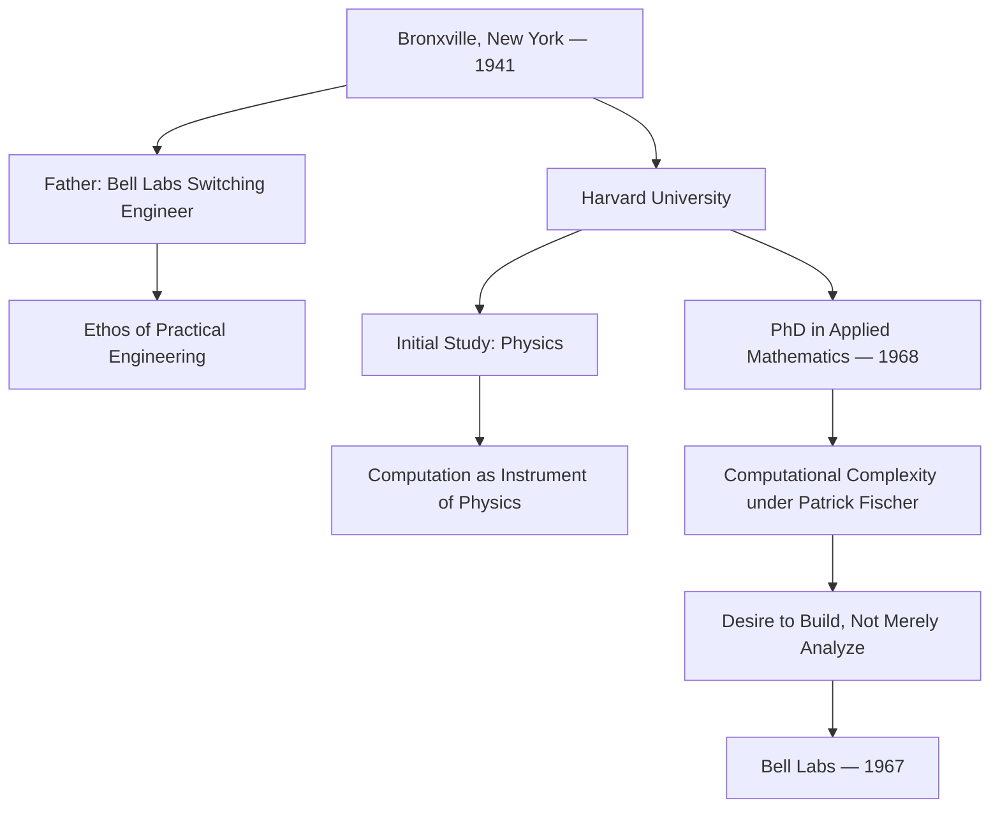
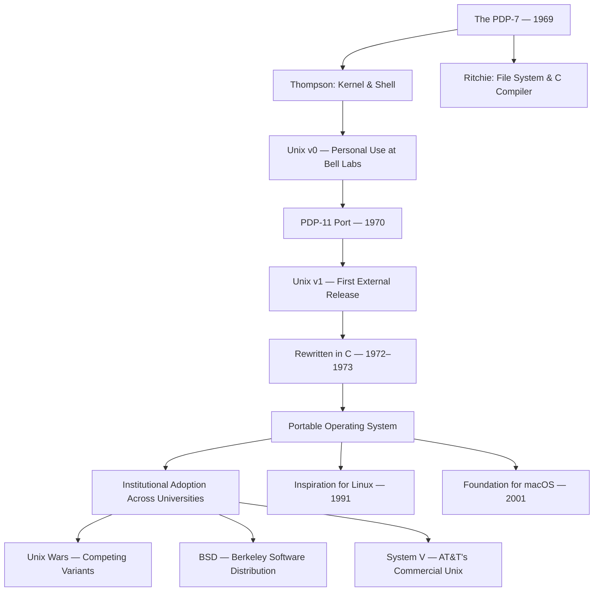
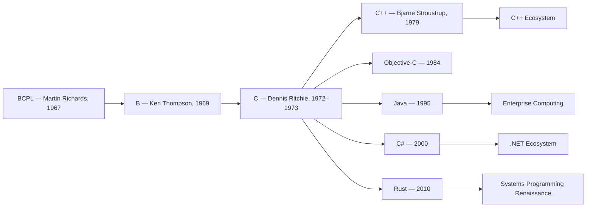
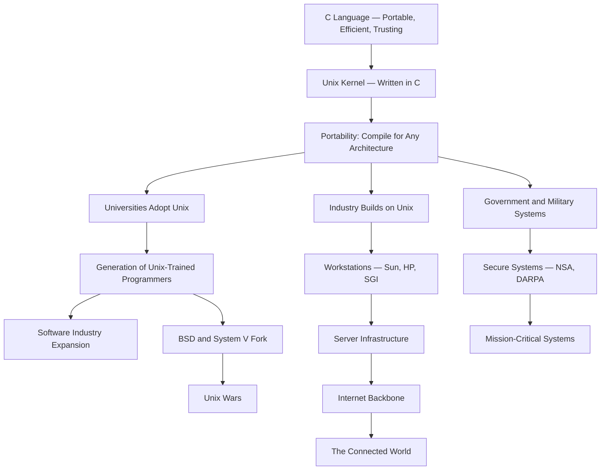
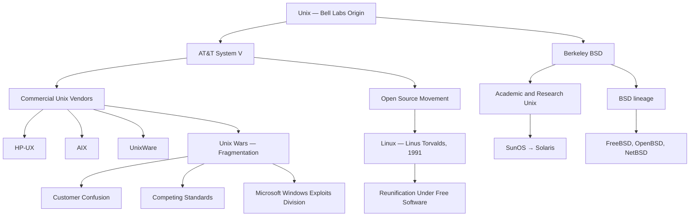
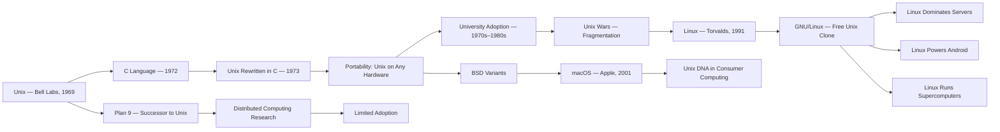
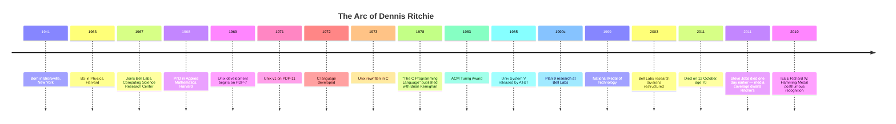
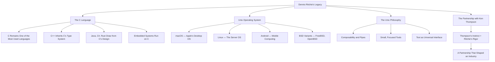
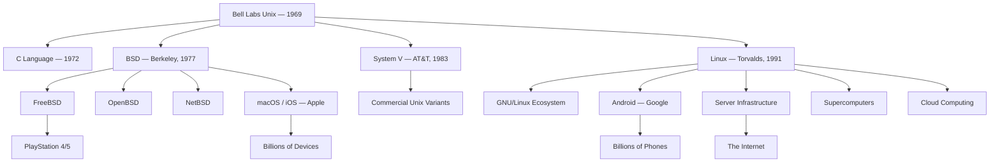
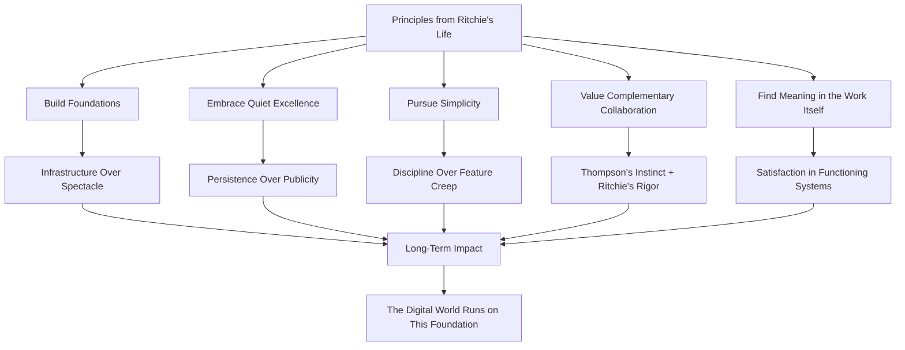

# Dennis Ritchie

## Description

Dennis MacAlistair Ritchie (1941–2011) was an American computer scientist whose creation of the C programming language and co-creation of the Unix operating system at Bell Labs reshaped the entire landscape of modern computing. Where Alan Turing provided the theoretical foundation for computation and Grace Hopper pioneered the compiler, Ritchie built the practical infrastructure upon which the digital world would be constructed. His life is a study in quiet excellence — the kind that does not announce itself with press conferences or public spectacle but instead rewrites the foundations of civilization so thoroughly that the rewriting becomes invisible. To study Ritchie is to understand that the most consequential work in technology is often performed by those who neither seek nor receive the recognition their contributions merit.

## Prerequisites

- [Donald Knuth](donald-knuth.md) — the theoretical foundation of algorithm analysis that Ritchie's practical implementations would embody
- [Grace Hopper](grace-hopper.md) — the pioneer of high-level languages and compilers whose work C would extend and transform

The reader is expected to possess a basic familiarity with programming concepts and the historical context of early computing. An understanding of what an operating system does and why programming languages matter will be assumed throughout.

## Table of Contents

- [Origins — The Making of a Craftsman](#-origins--the-making-of-a-craftsman)
- [The Work — Building the Foundations](#-the-work--building-the-foundations)
- [Struggles and Failures — The Cost of Quiet Excellence](#-struggles-and-failures--the-cost-of-quiet-excellence)
- [Legacy and Lessons — What Remains When the Work Speaks for Itself](#-legacy-and-lessons--what-remains-when-the-work-speaks-for-itself)

## 🌱 Origins — The Making of a Craftsman

### A Household of Engineering

Dennis Ritchie was born on 9 September 1941 in Bronxville, New York, a small village in Westchester County north of Manhattan. His father, Alistair E. Ritchie, was a switching engineer at Bell Telephone Laboratories — the research institution that would become, decades later, the place where Dennis would do his most consequential work. His mother, Jean McGee Ritchie, was a homemaker. The family was comfortable, educated, and deeply embedded in the culture of engineering that pervaded Bell Labs and its surrounding communities.

The significance of this lineage is easy to underestimate. Alistair Ritchie was not merely employed at Bell Labs — he was part of the institutional culture that valued rigorous engineering, intellectual independence, and the belief that problems should be solved by building things that worked, not by theorizing about what might work. This ethos — practical, unglamorous, rooted in the conviction that correctness and elegance are not opposites — would become the defining characteristic of Dennis Ritchie's career. He absorbed it not from textbooks but from the dinner table, from the conversations of engineers who treated problem-solving as a craft rather than a performance.

The Bronxville of Ritchie's childhood was a community shaped by proximity to Bell Labs in nearby Murray Hill, New Jersey. The labs employed thousands of engineers, physicists, and mathematicians, and their children grew up in an environment where technical competence was valued and intellectual curiosity was assumed. Ritchie later described his upbringing as unremarkable — a characterization that reveals more about his temperament than about his actual circumstances. Growing up in a household where engineering was the family trade was not unremarkable. It was formative.

### Harvard and the Turn Toward Computing

Ritchie attended Harvard University, where he initially studied physics. The physics department at Harvard in the early 1960s was world-class, but it was also a place where the tools of computation were becoming increasingly essential. Physics increasingly required numerical simulation, data analysis, and computational modeling — tasks that could not be performed by hand and demanded fluency with the new electronic computers that were beginning to appear in university laboratories.

Ritchie gravitated toward computing not as an abandonment of physics but as an extension of it. The problems he wished to solve — the behavior of physical systems, the structure of matter, the dynamics of fields — were becoming tractable only through computation. The computer was not a distraction from physics; it was the instrument through which physics would advance. This understanding — that computation is a tool in service of larger intellectual goals, not an end in itself — would shape Ritchie's approach to systems design for the rest of his career.

He completed his bachelor's degree in physics in 1963 and remained at Harvard for graduate work, completing his PhD in 1968 under Patrick C. Fischer. His doctoral research concerned computational complexity — specifically, the computational difficulty of deciding equivalence problems for program schemas. The work was theoretical, rigorous, and firmly within the tradition of formal analysis that Turing and Church had established. But Ritchie's interests were already shifting toward the practical: he wanted to build systems, not merely analyze them.

### Bell Labs and the Encounter with Ken Thompson

In 1967, Ritchie joined Bell Labs as a member of the technical staff, arriving at the Computing Science Research Center — Department 112, colloquially known as "the center." The center was a small, elite group within Bell Labs, populated by mathematicians and computer scientists who were given unusual freedom to pursue whatever problems interested them. There were no product deadlines, no quarterly targets, no marketing requirements. The mandate was simply to do excellent work and see what emerged.

It was here that Ritchie encountered Ken Thompson, a programmer of extraordinary intuition and speed who would become his closest collaborator. Thompson was Ritchie's opposite in temperament — gregarious where Ritchie was reserved, instinctive where Ritchie was methodical, impulsive where Ritchie was deliberate. Yet they complemented each other with a precision that neither could have achieved alone. Thompson's talent was for seeing what a system should become; Ritchie's was for making it robust, portable, and enduring. Together, they would build the operating system and the programming language that defined an era.

Their partnership began on Multics — the Multiplexed Information and Computing Service — a joint project of Bell Labs, General Electric, and the Massachusetts Institute of Technology. Multics was ambitious: it aimed to create a time-sharing operating system that would allow multiple users to interact with a computer simultaneously, with features including hierarchical file systems, dynamic linking, and on-line reconfiguration. The project was intellectually rich but organizationally troubled, and Bell Labs withdrew from it in 1969.

The withdrawal from Multics was, paradoxically, the catalyst for what followed. Thompson and Ritchie, having learned from Multics's ambitions and its failures, began to envision a simpler, more elegant operating system. They did not begin with a grand plan. They began with a spare PDP-7 minicomputer that Thompson had obtained for interactive computing, and they began writing code.

## ⚙️ The Work — Building the Foundations

### Unix: The Operating System That Ate the World

The history of Unix is the history of an idea that refused to remain small. It began as a toy — a operating system written on a PDP-7 for the personal use of Ken Thompson, with Ritchie contributing the file system and other components. It was not a research project. It was not funded. It was two engineers building something they wanted to use, in the margins of other work, on hardware that was considered obsolete.

The origin story is often told as a narrative of serendipity — Thompson needed a platform for his space-travel simulation game, and Unix emerged from that need. The truth is more deliberate and less romantic. Thompson and Ritchie recognized that the lessons of Multics — the value of a clean file system, the importance of user-level programs, the power of composable tools — could be implemented more simply on smaller hardware. The PDP-7 was a machine with 8 kilobytes of memory and no hard disk. Working within these constraints demanded a discipline that larger machines did not: every byte mattered, every instruction had to justify its existence.

By 1969, the basic structure of Unix was in place: a kernel that managed process scheduling, memory allocation, and file system operations; a shell that interpreted user commands; and a set of small utility programs that performed specific tasks. The design philosophy was established from the beginning: each program should do one thing well. The power of the system would emerge not from the complexity of individual components but from the ability to combine them — to pipe the output of one program into the input of another, building complex transformations from simple, composable parts.

The move from the PDP-7 to the PDP-11 in 1970 was critical. The PDP-11 was a more capable machine with better memory management and a larger address space. It was also the machine on which Unix would be developed through its most formative years. By 1971, Unix v1 was being used within Bell Labs, and by 1973, the operating system had been rewritten in the C programming language — Ritchie's own creation, which had evolved from an earlier language called B, written by Thompson.

### The C Programming Language: The Lingua Franca of Computing

C is not a language that was designed by committee. It was not the product of a standards body, a corporate strategy, or an academic research program. It was the tool that Dennis Ritchie built to solve a specific problem: he needed a high-level language that could express the operations of an operating system kernel while remaining close enough to the hardware to control memory layout and register allocation. No existing language met this requirement. Assembly language was close to the hardware but unreadable and unportable. High-level languages like Fortran and Algol were portable and readable but too abstract to implement an operating system.

The lineage of C is direct and traceable. In 1967, Martin Richards had developed BCPL (Basic Combined Programming Language) while at Cambridge. BCPL was a simple language with no type system and a syntax designed for systems programming. In 1969, Ken Thompson created B, a derivative of BCPL, for use on the PDP-7. B was an interpreted language — elegant but slow, and lacking the data types and control structures needed for efficient systems programming.

Ritchie's contribution was to take B and transform it into a compiled language with a type system, structured control flow, and the ability to generate efficient machine code. He added integers, characters, and pointers as distinct types. He introduced the concept of separate compilation, allowing programs to be built from multiple source files. He designed a preprocessor that handled macro expansion and conditional compilation. The result was C — a language that occupied the precise middle ground between the abstraction of high-level languages and the proximity of assembly.

The design of C embodied a philosophy that would define Ritchie's career: trust the programmer. C assumed that the programmer knew what they were doing and provided minimal guardrails. There was no bounds checking on arrays. Pointers could be cast to arbitrary types. Memory management was the programmer's responsibility. This was not negligence — it was a deliberate design decision rooted in the conviction that systems programmers need direct control over the machine, and that safety mechanisms appropriate for casual programmers are obstacles for expert ones.

The timing of C's emergence was critical. Unix had been rewritten in C in 1972–1973, and this decision — to implement an operating system in a high-level language rather than in assembly — was revolutionary. Prior to Unix, operating systems were written in assembly language and were therefore tied to specific hardware architectures. A Unix system running on a PDP-11 could not be ported to an IBM mainframe without rewriting the entire operating system from scratch. By writing Unix in C, Ritchie and Thompson created something that had never existed before: a portable operating system. The same source code could, in principle, be compiled for any machine that had a C compiler. This was not merely a technical convenience. It was a conceptual breakthrough that redefined the relationship between software and hardware.

### The Unix Philosophy: Simplicity as a Design Principle

The Unix philosophy is often summarized as "do one thing and do it well," but this formulation, while catchy, understates the depth of the idea. The Unix philosophy is fundamentally about the power of composition — the belief that complex behavior emerges not from complex components but from the combination of simple components through well-defined interfaces.

The canonical statement of this philosophy appeared in a 1978 paper by Douglas McIlroy, who had led the Bell Labs group that created the Unix pipe:

> Write programs that do one thing and do it well.
> Write programs to work together.
> Write programs to handle text streams, because that is a universal interface.

The pipe — the mechanism by which the output of one program becomes the input of another — was the technical realization of this philosophy. It was simple: a vertical bar (`|`) on the command line connected the standard output of one program to the standard input of the next. But its implications were profound. The pipe meant that a programmer did not need to build a monolithic application to perform a complex task. Instead, they could assemble the task from existing tools, each specialized, each tested, each reliable.

This approach — composition through standardized interfaces — was not invented by Unix, but Unix made it practical and pervasive. The idea that programs should communicate through simple, text-based protocols rather than complex, proprietary data structures was a radical simplification that enabled extraordinary flexibility. A Unix system could be reconfigured, extended, and customized by combining tools in ways that the original designers never anticipated. The system was not a fixed product but a vocabulary — a set of primitives from which the user could construct solutions.

Ritchie's contribution to this philosophy was less about articulation than about implementation. The tools he built — the C compiler, the file system, the kernel itself — were exemplars of the philosophy they embodied. They were small, precise, and reliable. They did not attempt to anticipate every possible use case; instead, they provided mechanisms that the user could combine as needed. This was engineering in the service of freedom: the freedom of the user to solve problems in their own way, using tools that trusted their competence.

### The Combination: C and Unix Together

The deepest insight of Ritchie's career was not C alone or Unix alone but the combination of the two. Unix written in C meant that the operating system could be moved to new hardware simply by writing a new C compiler for that hardware. The operating system itself did not need to change. This meant that Unix could spread to every computer architecture in existence — from minicomputers to mainframes to microprocessors — without being rewritten.

The consequences were staggering. By the late 1970s and early 1980s, Unix was running on machines from dozens of manufacturers. Universities adopted it as their standard operating system, teaching a generation of programmers the Unix way of thinking. Companies built their computing infrastructure on Unix. The operating system's portability — a direct consequence of Ritchie's decision to write it in C — made it the default platform for the emerging software industry.

The relationship between C and Unix was symbiotic. Unix provided the proving ground for C — a real-world system of sufficient complexity to demonstrate the language's power and expose its limitations. C provided the mechanism for Unix's spread — a language portable enough to compile on any architecture, low-level enough to implement an operating system kernel, and expressive enough to support the large body of utility programs that made Unix useful. The two were not merely related; they were co-constitutive. Each made the other possible, and together they made the modern computing world.

## 💔 Struggles and Failures — The Cost of Quiet Excellence

### The Unix Wars: Fragmentation and Political Failure

The open nature of Unix — its portability, its availability to universities, its embodiment in a language (C) that anyone could learn — was both its greatest strength and its most damaging vulnerability. By the early 1980s, Unix had been adopted by numerous hardware manufacturers, each of whom produced their own variant. AT&T, which owned Bell Labs and therefore owned Unix, began commercializing the operating system through its System V release. Berkeley, which had developed the Berkeley Software Distribution (BSD) of Unix, produced its own variants with significant technical improvements.

The result was the Unix Wars — a period of acrimonious competition between incompatible Unix variants that fragmented the market, confused customers, and provided the opening for Microsoft's proprietary operating systems. Each variant claimed to be the "true" Unix. Standards bodies attempted to impose order through POSIX and other specifications, but the underlying problem was political, not technical: the parties involved could not agree on governance, licensing, or technical direction.

Ritchie was not a political actor. He was an engineer who preferred to build things rather than negotiate licensing agreements or testify before standards committees. The Unix Wars consumed the political and managerial energy of the industry while leaving Ritchie in the position of a creator watching his creation be fought over by people who had not built it. He continued working at Bell Labs, producing research on Plan 9 — a successor to Unix that attempted to extend the Unix philosophy to distributed computing — but Plan 9 never achieved the adoption of its predecessor. It was, in a sense, too pure: it solved problems that the industry did not yet know it had, using approaches that the industry was not yet ready to adopt.

The lesson of the Unix Wars is not that open systems fail. It is that open systems require governance structures capable of managing shared resources. Unix was open in the sense that its source code was available and its design was documented, but it was not open in the modern sense of open-source licensing. The absence of a clear, collectively governed licensing model meant that every variant could claim legitimacy while undermining the whole. This was a failure not of technology but of institutional design — a problem that Linus Torvalds and the open-source movement would later address, in part by learning from Unix's mistakes.

### The Eclipse by Linux and the Free Software Movement

In 1991, Linus Torvalds, a Finnish computer science student, announced on the comp.os.minix Usenet group that he was building a free operating system kernel inspired by Unix. Linux — as it came to be known — combined Torvalds's kernel with the GNU tools developed by Richard Stallman and the Free Software Foundation, creating a complete Unix-compatible operating system that was freely available and could be modified by anyone.

Linux did not merely replicate Unix. It fulfilled the promise of Unix's portability by making the operating system genuinely free — free in cost, free in modification, free in redistribution. The open-source licensing model that Linux embodied solved the governance problem that had fragmented Unix: the GNU General Public License (GPL) ensured that all modifications to the kernel would remain freely available, preventing the proprietary capture that had plagued commercial Unix variants.

For Ritchie, Linux was both a vindication and a displacement. It vindicated his design decisions — the Unix philosophy, the C language, the composable-tool architecture — by demonstrating their enduring power. A new generation of programmers was adopting Unix principles, building on Unix tools, and extending the Unix philosophy to domains that Ritchie and Thompson had never imagined. But it also displaced Ritchie from the narrative. The public story of operating systems shifted from Bell Labs to the open-source community, from the quiet engineers who built the foundation to the charismatic advocates who popularized it.

This pattern — the creator displaced by the popularizer, the engineer overshadowed by the evangelist — is not unique to Ritchie. It recurs throughout the history of technology. The inventor of the underlying technology is often the least visible figure in its adoption, because invention and popularization require different skills, different temperaments, and different relationships with the public. Ritchie was a builder. He did not write manifestos, give keynotes, or cultivate a public persona. He wrote code. The code spoke for itself, but it did not speak loudly enough to be heard over the noise of the industry that had grown up around it.

### The Quiet Death

Dennis Ritchie died on 12 October 2011, at his home in Murray Hill, New Jersey. He was seventy years old. The cause was prostate cancer, with heart disease as a contributing factor.

The mainstream media coverage was sparse. Compare it to the outpouring that greeted the death of Steve Jobs, who had died just one day earlier, on 11 October 2011. Jobs's death prompted front-page coverage in every major newspaper, televised tributes, public memorials, and a global outpouring of grief. Ritchie's death was noted in technology publications and academic circles but received little attention from the general press. The contrast was stark and revealing: the man who had created the operating system and the programming language that powered the infrastructure of the digital world received a fraction of the recognition afforded to the man who had created the devices and the brand that the world used to access it.

This disparity was not lost on those in the technology community who understood what Ritchie had built. Rob Pike, a colleague at Bell Labs, wrote a memorial that captured the sentiment with characteristic precision: "He was the best boss I ever had, and the most brilliant person I ever knew." Brian Kernighan, another Bell Labs colleague and co-author of the definitive book on C, noted that Ritchie's contributions were so foundational that most users of modern computing devices had no idea that the systems they relied upon were built on his work.

The near-silence surrounding Ritchie's death was not an accident. It was the predictable outcome of a culture that celebrates visibility over substance, branding over engineering, and the individual who sells the product over the individual who built the foundation. Ritchie had no public persona. He did not write memoirs, give interviews, or cultivate relationships with journalists. His legacy existed in code — in the C compilers that still run, in the Unix systems that still operate, in the operating systems that descend from his original design. Code is a durable form of legacy, but it is an invisible one. Users of macOS, Linux, and Android interact daily with systems shaped by Ritchie's decisions without any awareness that they are doing so.

This invisibility is both the nature of foundational work and its curse. The foundation of a building is essential, but no one admires the foundation. The foundation is admired only when it fails — when the building cracks or collapses. Ritchie's foundation has not failed. It has endured for over four decades, supporting structures of increasing complexity and scale. But endurance is not the same as recognition. The most stable foundations are the least noticed, and the most successful engineering is the engineering that disappears into the infrastructure it supports.

## 🌍 Legacy and Lessons — What Remains When the Work Speaks for Itself

### The Turing Award and National Recognition

In 1983, Ritchie received the ACM Turing Award — the highest distinction in computer science, often referred to as the "Nobel Prize of computing." The citation recognized his contributions to "the development of the C language and the Unix operating system." It was, at the time, the most visible recognition of his work, but even this honor was delivered in the understated manner characteristic of both the man and the award. The Turing Award ceremony is a formal dinner with a technical lecture. There are no television cameras, no celebrity guests, no public spectacle. Ritchie accepted the award, gave his lecture, and returned to Bell Labs.

In 1999, Ritchie and Ken Thompson were jointly awarded the National Medal of Technology by President Bill Clinton, "for co-inventing the Unix operating system and the C programming language, which together have led to huge advances in computer hardware, software, and networking systems and stimulated growth of an entire industry." The medal recognized the economic and industrial impact of their work — an impact that, by 1999, was incalculable. Unix and C had become the infrastructure of the computing industry, the platform upon which the internet was built, and the foundation for the embedded systems that controlled everything from telephone switches to spacecraft.

These recognitions were meaningful but insufficient. They honored the work but could not fully represent it, because the work was not a single invention but an ecosystem — a set of interlocking decisions, tools, and principles that had become so pervasive that they were invisible. The C language is not a discrete artifact that can be pointed to and admired. It is a living standard, continuously implemented, continuously used, continuously shaping how programmers think about computation. Unix is not a product that can be placed on a shelf. It is a design philosophy that has been absorbed into the operating systems used by billions of people who have never heard its name.

### C: The Language That Would Not Die

C has been declared obsolete many times. In the 1980s, Ada was supposed to replace it. In the 1990s, C++ was supposed to supersede it. In the 2000s, Java was supposed to make it irrelevant. In the 2010s, Rust was supposed to render it unsafe. Yet C endures. As of the 2020s, C remains one of the five most widely used programming languages in the world, and its influence on subsequent languages is immeasurable.

The reason for C's persistence is not inertia or nostalgia. It is that C occupies a position in the programming language landscape that no other language has successfully claimed: it is low enough to implement operating systems and hardware interfaces, portable enough to compile for virtually any architecture, and simple enough that its behavior can be predicted by the programmer without a compiler as intermediary. C is the language of the gap between hardware and software — the narrow bridge on which the entire computing infrastructure rests.

Every modern operating system kernel is written in C or in a language that compiles to C-compatible code. The Linux kernel, the Windows kernel, the macOS kernel, the kernels of iOS and Android — all are built on C. The embedded systems that control automobiles, medical devices, industrial equipment, and telecommunications infrastructure are overwhelmingly programmed in C. The language's simplicity, its proximity to the hardware, and its absence of runtime overhead make it irreplaceable in contexts where performance, predictability, and direct hardware access are non-negotiable.

### Unix DNA: The Operating System That Never Died

The claim that Unix is everywhere is not hyperbole. It is a literal description of the computing landscape in the 2020s.

**macOS and iOS.** Apple's desktop and mobile operating systems are built on Darwin, a Unix-based kernel derived from the BSD variant of Unix. Every iPhone, iPad, and Mac computer runs a system whose core is descended from the Unix that Ritchie and Thompson built at Bell Labs. The user never sees this lineage — it is hidden behind layers of graphical interface — but it is there, in every file system call, every process management decision, every network protocol implementation.

**Linux.** The Linux kernel, while not a direct descendant of Unix, is a Unix clone — a reimplementation of Unix's design principles in a free, open-source system. Linux dominates the server market, powers the majority of the world's supercomputers, and forms the basis of Android, the world's most widely used mobile operating system. When a user in Jakarta streams a video, when a bank in London processes a transaction, when a hospital in Nairobi monitors a patient, the underlying operating system is almost certainly Linux — a free Unix, running the descendants of tools that Ritchie and Thompson wrote fifty years ago.

**BSD.** The Berkeley Software Distribution of Unix, maintained as FreeBSD, OpenBSD, and NetBSD, continues to serve as a stable, secure operating system for servers, embedded systems, and network infrastructure. PlayStation 4 and 5 run FreeBSD. The networking stack of macOS is derived from BSD. The lineage is direct, and it leads back to Bell Labs.

The pervasiveness of Unix's descendants means that Ritchie's design decisions — the file system hierarchy, the process model, the pipe-and-filter architecture, the text-based interface — are not historical curiosities. They are the living infrastructure of the connected world. Every programmer who uses a terminal, every system administrator who writes a shell script, every developer who chains commands with pipes is working within a paradigm that Ritchie helped to create. The fact that most of these programmers have never heard Ritchie's name is the measure of how thoroughly his work has been absorbed.

### What His Life Teaches

Dennis Ritchie's biography offers principles that extend far beyond the technical:

**Build foundations, not monuments.** Ritchie did not build products for consumers. He built infrastructure for builders. The C language was not an end in itself — it was a tool that enabled other tools. Unix was not a destination — it was a platform upon which others would build. This orientation — toward the foundational rather than the spectacular — is characteristic of the most durable contributions in technology. Monuments attract attention; foundations support weight. The world needs both, but the foundations are the ones that endure.

**Quiet excellence has a different rhythm than public acclaim.** Ritchie did not seek recognition, and he did not receive the kind of recognition that public figures enjoy. His legacy was not measured in magazine covers or keynote invitations but in the continuous, silent operation of the systems he built. There is a form of excellence that does not announce itself — that simply persists, compounding in influence over decades, invisible to those who benefit from it. This kind of excellence requires a particular kind of patience: the willingness to do work that may not be understood or celebrated in one's lifetime.

**Simplicity is the hardest thing to achieve.** The Unix philosophy — small, composable tools doing one thing well — is easy to state and extraordinarily difficult to implement. It requires the discipline to leave features out, the restraint to keep interfaces small, and the trust that users will compose tools in ways the designer did not anticipate. The history of technology is littered with systems that grew complex, cumbersome, and brittle. The ones that endure are the ones that maintained simplicity under pressure — and simplicity under pressure requires more skill than complexity ever does.

**Collaboration is not compromise.** The partnership between Ritchie and Thompson was not a negotiation. It was a complementarity — two distinct forms of intelligence that together achieved more than either could alone. Thompson's intuitive brilliance and Ritchie's systematic rigor were not competing approaches but interlocking ones. The lesson is that the best collaborations are not between similar minds but between minds that see different aspects of the same problem. The willingness to work alongside someone who sees differently — to trust their judgment in domains where your own is weaker — is a form of intellectual humility that is rare and essential.

**The most influential work is often the least celebrated.** This is perhaps the most important lesson of Ritchie's life. The work that changes the world most profoundly is often the work that is least visible to the world. The operating system kernel, the compiler, the file system, the network protocol — these are the invisible foundations upon which visible products are built. The developer who writes the code that runs on a billion devices may never be known by name. The engineer who builds the infrastructure that supports an entire industry may never appear in a documentary. This is not a failure of the system. It is a feature of foundational work: the better the foundation, the less it is noticed. The challenge is to find meaning not in recognition but in the work itself — to take satisfaction in the knowledge that one's contributions are running, functioning, supporting the world, even if the world does not know it.

## 📝 Learning Tips

- **Read "The C Programming Language" by Kernighan and Ritchie.** Known universally as "K&R," this 1978 book is one of the most influential technical books ever written. It is concise — approximately 270 pages — and it teaches C not as an academic exercise but as a practical craft. The book embodies the Unix philosophy it describes: it does one thing (teaches C) and does it well. Reading it is not merely an exercise in learning a language; it is an exercise in understanding a way of thinking about programming.

- **Use a Unix terminal.** The best way to understand Ritchie's philosophy is to work within the environment it created. Open a terminal on any Unix-like system (macOS, Linux, or a freeBSD virtual machine) and begin composing commands with pipes. The experience of building complex transformations from simple tools is the experiential equivalent of reading the Unix philosophy: it demonstrates, rather than describes, the power of composable design.

- **Study the C standard.** The ISO C standard (currently C17, with C23 in development) is a precise specification of the language Ritchie created. Reading the standard reveals both the elegance and the deliberate minimalism of the language: C provides exactly the mechanisms needed for systems programming and nothing more. This restraint is a design lesson in itself.

- **Compare Ritchie and Thompson.** The partnership between Ritchie and Thompson is one of the most productive collaborations in the history of technology. Understanding how their different temperaments and skills complemented each other — Thompson's speed and intuition, Ritchie's thoroughness and rigor — illuminates the dynamics of effective collaboration. The lesson is not that one approach is better, but that the combination of approaches is more powerful than either alone.

- **Trace the lineage from C to modern languages.** Understanding how C influenced C++, Java, C#, Rust, and other languages reveals the depth of Ritchie's impact. Each of these languages inherited aspects of C's design: its type system, its control structures, its proximity to hardware. Tracing these connections makes visible the otherwise invisible influence of Ritchie's decisions on the entire landscape of software development.

- **Do not confuse silence with absence.** Ritchie's lack of public recognition does not indicate a lack of influence. The most pervasive technologies are often the least visible. Learning to recognize the difference between the technology that is used and the technology that is celebrated is a critical skill for anyone seeking to understand the actual structure of the computing industry.

## 📚 Glossary

| Term | Definition |
|---|---|
| C | A general-purpose, compiled programming language created by Dennis Ritchie at Bell Labs in the early 1970s, designed for systems programming and characterized by its proximity to hardware, minimal runtime overhead, and trust in the programmer |
| Unix | A multitasking, multiuser operating system developed at Bell Labs in 1969 by Ken Thompson and Dennis Ritchie, characterized by its composable tools, text-based interfaces, and portable implementation in C |
| Bell Labs | The research and development laboratory of AT&T (and later Nokia), located in Murray Hill, New Jersey, where Unix, C, the transistor, the laser, and numerous other foundational technologies were developed |
| PDP-7 | A minicomputer manufactured by Digital Equipment Corporation (DEC), the platform on which Unix was originally developed in 1969 |
| PDP-11 | A series of minicomputers by DEC on which Unix was developed through its most formative years; its architecture influenced the design of C |
| Multics | Multiplexed Information and Computing Service — a time-sharing operating system developed jointly by Bell Labs, GE, and MIT; its ambitions and failures informed the design of Unix |
| BCPL | Basic Combined Programming Language — a simple, typeless programming language developed by Martin Richards in 1967, the ancestor of B and C |
| B | A programming language developed by Ken Thompson in 1969, derived from BCPL, used for early Unix development on the PDP-7 |
| Pipe | A Unix mechanism for inter-process communication that connects the standard output of one program to the standard input of another, enabling the composition of small tools into complex workflows |
| Shell | A command-line interpreter that provides an interface between the user and the operating system kernel; in Unix, the shell is itself a program that can be replaced |
| POSIX | Portable Operating System Interface — a family of standards specified by the IEEE for maintaining compatibility between operating systems |
| Plan 9 | An operating system developed at Bell Labs as a successor to Unix, designed for distributed computing; it incorporated lessons from Unix but achieved limited adoption |
| BSD | Berkeley Software Distribution — a Unix variant developed at the University of California, Berkeley; ancestor of FreeBSD, OpenBSD, and NetBSD |
| System V | AT&T's commercial Unix release, one of the main branches of the Unix family during the Unix Wars |
| Compiler | A program that translates source code written in a high-level language into machine code or another lower-level language |
| Kernel | The core component of an operating system that manages hardware resources, process scheduling, memory allocation, and file system operations |
| Embedded system | A computer system designed for a specific function within a larger system, often with real-time constraints; overwhelmingly programmed in C |

## 📖 Quick References

- [The C Programming Language — Brian Kernighan and Dennis Ritchie](https://www.amazon.com/Programming-Language-2nd-Brian-Kernighan/dp/0131103628) — the definitive reference for the C language, authored by its creator; concise, precise, and indispensable
- [The Unix Philosophy — Douglas McIlroy](https://www.cs.bell-labs.com/who/dmr/mds-77.pdf) — the original articulation of the design principles that guided Unix development
- [Dennis Ritchie: The Father of C — Bell Labs Memorial](https://www.bell-labs.com/unix-philosophy/the-father-of-c/) — Bell Labs tribute to Ritchie's contributions and legacy
- [The Evolution of Unix and C — Computer History Museum](https://www.computerhistory.org/) — oral histories and archival materials documenting the development of Unix and C at Bell Labs
- [Unix at 50 — Bell Labs](https://www.bell-labs.com/unix-philosophy/unix-at-50/) — a retrospective on fifty years of Unix, covering its origins, development, and global impact
- [The Development of the C Programming Language — Dennis Ritchie](https://cm.bell-labs.com/cm/cs/who/dmr/chist.html) — Ritchie's own account of how C came to be, written in his characteristically precise and understated style
- [Rob Pike's Memorial to Dennis Ritchie](https://commandcenter.blogspot.com/2011/10/dennis-ritchie.html) — a personal remembrance from a Bell Labs colleague, capturing the human dimension of Ritchie's contributions

## Next Steps

The story of Dennis Ritchie does not end with his death. It continues in the work of those who extended, adapted, and reinterpreted the foundations he built. Each of the following figures took the principles that Ritchie embodied — simplicity, composability, trust in the programmer — and applied them to new domains, new challenges, and new contexts. The trajectory from Bell Labs to the open-source movement is not a rupture but a continuation: the same ideas, carried forward by different hands, across different decades, into different worlds.

- [Ken Thompson](ken-thompson.md) — his collaborator and co-creator of Unix, whose instinct and vision complemented Ritchie's rigor
- [Linus Torvalds](linus-torvalds.md) — who extended Unix's philosophy to Linux, creating a free operating system that fulfilled the promise of Unix's portability
