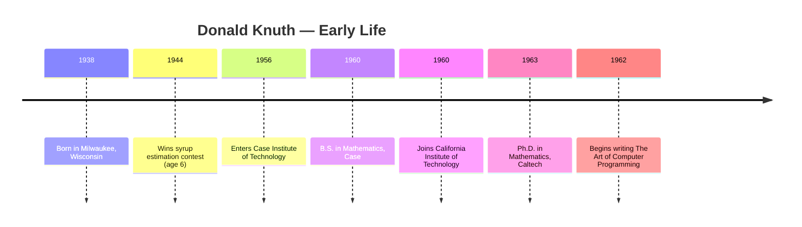
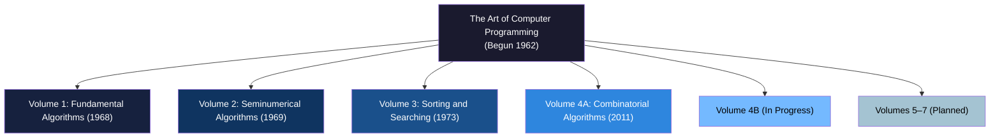
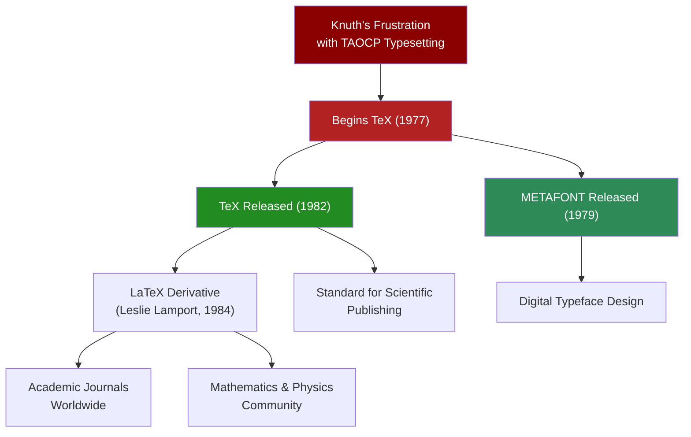
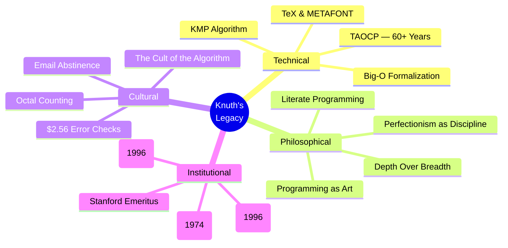

# Donald Knuth

## Description

Donald Ervin Knuth (born January 10, 1938) is an American computer scientist, mathematician, and professor emeritus at Stanford University whose life's work represents the most sustained act of intellectual devotion in the history of computing. Author of *The Art of Computer Programming* — a multi-volume treatise that has been in continuous production for over sixty years — Knuth formalized the analysis of algorithms, invented the field of literate programming, designed the TeX typesetting system, and established the principle that computer science is, at its core, an artistic discipline. His biography is a study in depth over breadth, in the compounding power of sustained focus, and in the radical proposition that a single person, working with patience and rigor, can reshape an entire field.

## Prerequisites

- [Grace Hopper](grace-hopper.md) — the practical pioneer of programming languages whose work Knuth would formalize and extend
- [Alan Turing](alan-turing.md) — the theoretical foundation of computation upon which Knuth built the edifice of algorithm analysis

The reader is expected to possess a basic understanding of what algorithms are and why their analysis matters. Familiarity with the concept of asymptotic complexity — particularly Big-O notation — will be assumed, though Knuth's own contributions to its formalization will be explained.

## Table of Contents

- [Origins — The Mathematician Who Counted in Octal](#-origins--the-mathematician-who-counted-in-octal)
  - [Milwaukee and the Early Obsessions](#milwaukee-and-the-early-obsessions)
  - [Caltech and the Genesis of TAOCP](#caltech-and-the-genesis-of-taocp)
- [The Work — The Art of Everything](#-the-work--the-art-of-everything)
  - [The Art of Computer Programming](#the-art-of-computer-programming)
  - [Big-O Notation and the Formalization of Algorithm Analysis](#big-o-notation-and-the-formalization-of-algorithm-analysis)
  - [TeX and METAFONT — The Eight-Year Diversion](#tex-and-metafont--the-eight-year-diversion)
  - [Literate Programming — Code as Literature](#literate-programming--code-as-literature)
  - [Knuth-Morris-Pratt and String Matching](#knuth-morris-pratt-and-string-matching)
  - [Programming as an Art](#programming-as-an-art)
- [Struggles and Failures — The Weight of Perfection](#-struggles-and-failures--the-weight-of-perfection)
  - [The Unfinished Magnum Opus](#the-unfinished-magnum-opus)
  - [The TeX Diversion — A Necessary Detour](#the-tex-diversion--a-necessary-detour)
  - [The Email Abstinence — Choosing Depth Over Connection](#the-email-abstinence--choosing-depth-over-connection)
  - [The Tension Between Completeness and Publication](#the-tension-between-completeness-and-publication)
- [Legacy and Lessons — The Professor Who Taught the Machines to Think About Themselves](#-legacy-and-lessons--the-professor-who-taught-the-machines-to-think-about-themselves)
  - [The Turing Award and the Knuth Prize](#the-turing-award-and-the-knuth-prize)
  - [The $2.56 Error Checks](#the-256-error-checks)
  - [The Cult of the Algorithm](#the-cult-of-the-algorithm)
  - [Depth Over Breadth — The Compounding of Focus](#depth-over-breadth--the-compounding-of-focus)
  - [Knowledge Versus Wisdom](#knowledge-versus-wisdom)
  - [What Knuth's Life Teaches](#what-knuths-life-teaches)

## 🌱 Origins — The Mathematician Who Counted in Octal

### Milwaukee and the Early Obsessions

Donald Ervin Knuth was born on January 10, 1938, in Milwaukee, Wisconsin, to Ervin Henry Knuth, a teacher and manager at a coal delivery company, and Louie Marie Knuth (née Bohning), a homemaker with a keen interest in education. The household was intellectually modest — neither parent was a scientist or mathematician — but it was suffused with the conviction that learning mattered, that curiosity was a virtue, and that a child who showed unusual aptitude should be encouraged rather than restrained. The Knuths were not wealthy. They did not have access to elite educational institutions or private tutors. What they had was a home environment in which books were valued, questions were welcomed, and the pursuit of understanding was treated as a serious and worthy endeavor.

The young Donald exhibited an early and almost uncanny facility with numbers. At home, he amused himself by tallying the number of steps it took to walk to school, calculating the volume of rainwater collected in the gutters, and performing arithmetic in octal — a habit that would become one of his most recognizable personal eccentricities. "Real programmers count in octal," he would later declare, and the remark, half-joke and half-creed, captured something essential about his relationship to computation: for Knuth, the base-10 system was an arbitrary human convention, while octal — with its clean powers of two — was closer to the way machines actually thought.

His father recognized the boy's gifts and channeled them. When Donald was in sixth grade, Ervin Knuth entered him in a contest sponsored by a syrup company, in which children were asked to estimate how many drops of syrup filled a bottle. Donald's entry was one of two winners, earning him a transistor radio — his first encounter with electronics. The incident was formative: it taught him that systematic analysis, applied even to trivial problems, could yield superior results. It was a lesson he would spend the rest of his life generalizing.

Knuth attended Milwaukee's Nathan Hale High School, where he excelled in mathematics and science while demonstrating a precocious interest in music. He played trombone and saxophone, composed short pieces, and considered a career in music before deciding that mathematics offered a deeper kind of beauty. The choice was not between passion and pragmatism. It was between two forms of aesthetic expression — and Knuth, characteristically, chose the one that could be formalized.

The high school years were formative in another respect: they gave Knuth his first encounter with the limitations of institutional education. The curriculum, designed for the average student, could not accommodate his pace. He completed his mathematics coursework ahead of schedule and spent the remaining time in independent study — reading, computing, and exploring problems that interested him on their own terms. This pattern — exceeding the institution's expectations and then finding ways to fill the gap — would repeat itself at Case, at Caltech, and eventually at Stanford.

### Caltech and the Genesis of TAOCP

In 1956, Knuth enrolled at Case Institute of Technology (now Case Western Reserve University) in Cleveland, Ohio, to study physics. The choice was pragmatic — physics promised a career. But the encounter with digital computing, still a nascent discipline, diverted him almost immediately. Case had recently acquired an IBM 650, one of the first mass-produced computers, and Knuth taught himself to program it in assembly language. His first program, written as a freshman, was a system to analyze the strength of baseball teams — a playful application that nonetheless displayed the systematic rigor that would define his later work.

TheIBM 650 became Knuth's crucible. He wrote programs for it, studied its instruction set, and began to think not merely about what computers could do but about *how well* they did it. The question — how do we measure the efficiency of an algorithm? — was not yet a formal discipline. Programmers judged their code by intuition and benchmark, not by mathematical proof. Knuth recognized that this was unsustainable. As programs grew more complex, intuition would fail. The field needed a rigorous framework for comparing algorithms, and Knuth decided, with the quiet confidence that characterized his entire career, that he would build it.

His work on the IBM 650 led to his first publication: a review of the computer's assembly language that appeared in the campus newspaper. The review was more than a summary — it was a critical analysis, identifying design choices that could be improved and proposing alternatives. The editorial instinct was already present: Knuth did not merely describe technology. He evaluated it, judged it, and articulated standards by which it should be measured. This critical disposition — the refusal to accept the existing state of affairs as optimal — would define his entire career.

The baseball analysis program, while playful in intent, also revealed a deeper pattern in Knuth's thinking. He did not simply write code to aggregate statistics. He analyzed the problem's mathematical structure, developed a model for predicting team performance based on player statistics, and then validated the model against actual outcomes. The program was, in miniature, a scientific investigation: hypothesis, model, test, refinement. The fact that it concerned baseball rather than mathematics was incidental. The method — systematic analysis pursued with rigor and precision — was universal.

In 1960, Knuth graduated from Case with a Bachelor of Science in Mathematics, having completed a senior thesis on the "representativity of the digits of numbers" that already hinted at his later preoccupation with the deep structure of numerical computation. He enrolled at the California Institute of Technology for graduate study, where he completed his Ph.D. in Mathematics in 1963 under the supervision of Marshall Hall, Jr. His doctoral dissertation, "Finite Semifields and Projective Planes," was a work of pure combinatorics — elegant, abstract, and distant from the applied concerns that would soon consume him. The dissertation explored the algebraic structure of semifields and their relationship to finite projective planes, a topic that combined deep algebraic theory with combinatorial construction. It was the work of a mathematician who found beauty in abstract structures — a sensibility that would later be redirected toward the abstract structures of algorithms.

The Caltech years also gave Knuth his first experience of the culture that would become his permanent home: the academic research university. The combination of teaching, research, and intellectual community — the seminar talks, the coffee-hour discussions, the collaborative spirit of a small department of gifted mathematicians — was a revelation. Knuth had found his vocation, and it was not physics. It was the intersection of mathematics and computation, a territory that barely had a name in 1963 but that Knuth would spend his life charting.

Caltech placed Knuth at the intersection of mathematics and the emerging computational culture of the West Coast. The institute's proximity to the Jet Propulsion Laboratory and the nascent aerospace industry meant that computing was not an abstraction but a daily reality. Knuth absorbed both traditions: the rigor of pure mathematics and the pragmatism of applied computation. This dual formation — mathematical in its foundations, computational in its orientation — would define the character of TAOCP, which combined the formal standards of a mathematics monograph with the practical relevance of a computer science textbook.

But the trajectory had already been set. In 1962, while still a graduate student, Knuth was contracted by Addison-Wesley Publishing Company to write a textbook on programming. The book was intended to be a practical reference — a guide to the methods that programmers used daily, organized and explained with the clarity that Knuth's mathematical training afforded. The initial plan called for a single volume of modest scope. It was called *The Art of Computer Programming*.

What happened next was one of the most extraordinary expansions of ambition in the history of academic publishing. As Knuth began writing, he realized that the field of programming methods was far richer and more interconnected than he had imagined. Each algorithm he intended to cover demanded a rigorous analysis — not merely a description of how it worked, but a mathematical proof of its efficiency, its correctness, and its behavior in the average and worst cases. The single volume grew. The chapters multiplied. The modest textbook became a multi-volume treatise that would consume the rest of his working life.

## ⚙️ The Work — The Art of Everything

### The Art of Computer Programming

*The Art of Computer Programming* (TAOCP) is not a textbook in the conventional sense. It is a monument — a systematic, exhaustively rigorous analysis of the fundamental algorithms that underpin all of computer science. When Knuth began writing it in 1962, he intended to cover the subject comprehensively. Sixty years later, he is still working on Volume 4, with additional volumes planned beyond that.

The work's scope is staggering. Volume 1, *Fundamental Algorithms*, was published in 1968 and covers the basic mathematical concepts, data structures (including linked lists, trees, and hash tables), and the principles of algorithm analysis. Volume 2, *Seminumerical Algorithms*, appeared in 1969 and addresses random number generation, arithmetic, and floating-point computation. Volume 3, *Sorting and Searchin*g, published in 1973, treats the vast landscape of sorting algorithms, search methods, and their mathematical analysis. Volume 4A, *Combinatorial Algorithms, Part 1*, arrived in 2011 — thirty-eight years after Volume 3 — and covers Boolean functions, elementary combinatorics, and backtracking. Volume 4B and beyond remain in progress.

The delay between volumes was not procrastination. It was a consequence of Knuth's methodology: he would not publish until the analysis was complete, correct, and beautiful. "I could have finished sooner," he has admitted, "if I had been willing to leave gaps." But Knuth does not leave gaps. His standard is perfection — not in the sense of flawlessness, but in the sense of completeness. Every algorithm must be analyzed from first principles. Every mathematical claim must be proved. Every approximation must be bounded. The work is not merely comprehensive; it is *total* in its ambition to leave nothing unexamined.

TAOCP's influence on computer science is difficult to overstate. It established the vocabulary and methodology of algorithm analysis. Before Knuth, the efficiency of algorithms was judged informally. After Knuth, it was judged mathematically. The work provided the tools — recurrence relations, generating functions, asymptotic analysis, and probabilistic methods — that transformed algorithm design from an engineering craft into a mathematical science.

The books are also, characteristically, filled with humor. Knuth's exercises range from the rigorous ("Prove that the number of comparisons required to sort $n$ elements is at least $\lceil \log_2(n!) \rceil$") to the whimsical ("Write a program to solve the Towers of Hanoi puzzle without using recursion"). The exercises at the end of each section are graded by difficulty on a logarithmic scale — a rating system that has itself become iconic in computer science pedagogy.

### Big-O Notation and the Formalization of Algorithm Analysis

Knuth did not invent Big-O notation — that honor belongs to the German mathematician Paul Bachmann, who introduced it in 1894, and the German number theorist Edmund Landau, who popularized it in the early twentieth century. But Knuth did something more consequential: he made it the lingua franca of computer science.

Before Knuth's work, algorithm analysis was an informal discipline. Programmers measured efficiency by counting instructions or by running benchmarks, but there was no standardized mathematical framework for comparing algorithms independent of specific hardware. Knuth recognized that the relevant question was not how many microseconds an algorithm takes on a particular machine, but how its running time *scales* as the input grows. Big-O notation — which describes the upper bound of an algorithm's growth rate — provided exactly this framework.

Knuth's contribution was not merely to adopt Big-O notation but to formalize its use in the context of algorithm analysis. In TAOCP, he established the conventions that the field now takes for granted: the use of $O$, $\Omega$, and $\Theta$ notation to describe worst-case, best-case, and tight-bound running times; the analysis of algorithms in terms of their fundamental operations (comparisons, assignments, arithmetic operations); and the use of mathematical techniques — generating functions, recurrence relations, probability theory — to derive precise bounds on algorithm performance.

He also introduced more refined notations — particularly his own "soft-O" notation ($\tilde{O}$) and his "Omega" notation for counting — that capture behavior that Big-O alone cannot express. His multi-variable analysis of algorithms, in which performance is measured not merely in terms of input size $n$ but in terms of multiple parameters that characterize the problem, set a standard for rigor that remains unmatched.

The practical consequence of this formalization was transformative. Algorithm analysis became a discipline with rules, standards, and a shared vocabulary. Graduate students could compare a new sorting algorithm against the theoretical optimum. Industry engineers could predict the scalability of a system before building it. The entire field of computational complexity — the study of which problems can be solved efficiently and which cannot — rests on the mathematical foundations that Knuth helped to lay.

Before Knuth's formalization, the question "Is this algorithm efficient?" had no precise answer. Efficiency was measured against a particular machine, a particular compiler, a particular input distribution. After Knuth's formalization, the question acquired a rigorous meaning: "What is the asymptotic growth rate of this algorithm's running time as a function of input size?" This reframing — from absolute performance to asymptotic behavior — was the conceptual breakthrough that made algorithm analysis a science rather than a craft. It allowed researchers to reason about efficiency without reference to hardware, compiler, or implementation details — to compare algorithms on their intrinsic mathematical merits, stripped of all contingent factors.

### TeX and METAFONT — The Eight-Year Diversion

In 1977, Knuth began work on the second edition of Volume 2 of TAOCP. The typesetting of the first edition had been produced by traditional methods — hot-metal typesetting — and the result, by Knuth's own account, was typographically inadequate. The mathematical formulas were sometimes misaligned, the font choices were uninspired, and the overall aesthetic fell short of the standards that Knuth, a man of exacting visual sensibility, demanded.

The dissatisfaction might have been suppressed by a lesser author. Knuth let it consume him. He concluded that the only way to achieve the typographic quality he envisioned was to write his own typesetting system — one designed from the ground up to handle mathematical notation with the precision and beauty that the subject deserved.

The result was TeX (pronounced "tek," with the "ch" as in the Greek word τέχνη, meaning "art" or "craft"), a typesetting system that would become the de facto standard for academic and scientific publishing worldwide. TeX was not merely a word processor. It was a programmable typesetting engine that gave the author complete control over every aspect of the document's appearance: kerning, ligatures, hyphenation, justification, mathematical spacing, and font design. The system was accompanied by METAFONT, a companion language for designing digital typefaces, which Knuth also created during this period.

The development of TeX consumed eight years — from 1977 to 1985 — and represented a radical departure from Knuth's primary work. Some observers regarded the diversion as a distraction from TAOCP. Knuth regarded it as a necessity. "I had to get the typesetting right," he explained, "before I could finish the books." The statement reveals something essential about his character: for Knuth, the medium was not separate from the message. The mathematical beauty of algorithm analysis required a typographic beauty that existing tools could not provide. The two were inseparable.

TeX was released to the public in 1982 and has been refined continuously ever since. Its current version, TeX82, is effectively frozen — Knuth declared that no further changes would be made to the core engine, to ensure that documents typeset in TeX would remain reproducible indefinitely. This decision was itself a statement about the nature of software: Knuth regarded TeX as a finished work, a completed artifact rather than a continuously evolving product. The contrast with the state of most software — perpetually patched, updated, and deprecated — is instructive.

The system's mathematical precision made it indispensable for scientific publishing. Journals, universities, and research institutions adopted TeX not because it was easy — it was, in fact, notoriously difficult for beginners — but because it was *correct*. The output was typographically perfect in a way that no other system could match. As of the 2020s, TeX and its derivatives (particularly LaTeX) remain the standard for mathematical, scientific, and technical publishing.

Knuth also developed a bounty system for TeX errors, mirroring the $2.56 checks for TAOCP. The bounty for finding a bug in TeX was set at $2.56 — reduced to $0.32 after a correction, reflecting the hexadecimal pun. The system was self-enforcing: as bugs were discovered and fixed, the remaining bugs became rarer and harder to find, driving the quality of the software toward a level of reliability that no commercially developed system could match. The open-source community's subsequent development of LaTeX, based on TeX's core engine, extended this legacy — creating a global ecosystem of packages, templates, and collaborative infrastructure that serves millions of researchers.

### Literate Programming — Code as Literature

In 1984, Knuth introduced the concept of literate programming — a methodology in which the programmer writes primarily for human readers, embedding documentation and explanation within the code itself. The literate programmer, in Knuth's vision, composes a program as one would compose a scholarly article: with narrative flow, with references, with exposition that makes the design decisions transparent.

The concept was a direct challenge to the prevailing culture of programming, which treated code as instructions for machines and documentation (if present at all) as an afterthought. Knuth argued that this was backwards. Programs are read far more often than they are written. The audience for a program is not the compiler — it is the human developer who must understand, modify, and maintain it. A program that cannot be read is a program that cannot be maintained, and a program that cannot be maintained is, in the long run, a program that does not exist.

Literate programming was implemented in WEB, a system that allowed the programmer to interleave Pascal code with LaTeX documentation. The WEB system produced two outputs: a formatted document intended for human reading, and a compiled program intended for machine execution. The programmer maintained a single source that served both audiences. The result was code that read like prose — a radical proposition that challenged the fundamental assumption of programming culture.

The concept was not widely adopted in its original form. WEB and its successor, CWEB, remained niche tools used primarily by Knuth and his circle. But the *principle* of literate programming — that code should be written for humans, that documentation is not optional, that the narrative of a program matters as much as its logic — permeated the software industry through other channels. The modern emphasis on code readability, the coding standards that require explanatory comments, the agile practice of writing user stories before implementation — all of these are descendants of Knuth's original insight.

The deeper implication of literate programming is epistemological. When the programmer writes a document that explains *why* the code does what it does — not merely *what* it does — the act of writing forces a clarification of thought. The programmer who must articulate their reasoning for a human reader discovers gaps in their own understanding that would have remained invisible in the act of coding alone. The document is not a byproduct of the programming process. It is a *constituent* of it — a mechanism through which the programmer achieves clarity about the problem and its solution.

This principle — that externalization of thought produces deeper understanding — extends far beyond programming. Scientists who write papers understand their experiments better than those who merely conduct them. Teachers who explain concepts understand them more deeply than those who merely apply them. The act of articulation is not a secondary activity that follows understanding. It is a primary activity through which understanding is achieved.

### Knuth-Morris-Pratt and String Matching

In 1970, Knuth, along with James H. Morris and Vaughan R. Pratt, published a paper describing a linear-time algorithm for string matching — the problem of finding all occurrences of a pattern within a text. The Knuth-Morris-Pratt (KMP) algorithm was a landmark in algorithm design: it achieved the theoretically optimal running time of $O(n + m)$, where $n$ is the length of the text and $m$ is the length of the pattern, by exploiting the internal structure of the pattern to avoid redundant comparisons.

The KMP algorithm demonstrated a principle that Knuth would articulate throughout his career: that the key to efficient computation is not brute force but *structure*. By analyzing the pattern in advance and constructing a partial match table that encodes the pattern's self-overlapping properties, KMP avoids the backtracking that plagues naive string-matching algorithms. The preprocessing step takes $O(m)$ time; the search step takes $O(n)$ time; the total is linear in the combined length of the input.

The algorithm is a precise illustration of Knuth's philosophy: understanding the mathematical structure of a problem is the prerequisite to solving it efficiently. The naive approach — slide the pattern across the text and compare character by character — is simple but slow. The KMP approach is more complex to implement but asymptotically optimal. The investment in mathematical analysis pays off in computational performance. This pattern — analysis as the precursor to efficiency — is the core principle of TAOCP.

The KMP algorithm also illustrates a broader truth about algorithm design: the preprocessing step is often the key to performance. The naive algorithm does no preparation — it simply begins searching. KMP invests time upfront to construct the partial match table, and this investment repays itself in every subsequent comparison. The principle generalizes to every domain where repeated operations are performed on the same data: investing in preprocessing, indexing, or caching is often the most effective optimization available.

### Programming as an Art

In 1974, upon receiving the ACM Turing Award, Knuth delivered a lecture titled "Computer Programming as an Art." The lecture's central thesis was provocative: programming is not merely a science. It is also an art — a discipline of creation, composition, and aesthetic judgment that stands alongside music, writing, and painting.

The argument was not a dismissal of programming's scientific character. It was an assertion of its duality. Knuth acknowledged that programming requires rigorous analysis, mathematical proof, and systematic methodology — the scientific dimension. But he argued that it also requires imagination, taste, and a sense of beauty — the artistic dimension. The best programs, like the best poems, are not merely correct. They are *elegant* — they achieve their purpose with a minimum of complexity, a maximum of clarity, and a formal beauty that rewards study.

The lecture traced the historical roots of the word "art." In its Latin origin, *ars* meant both skill and art — a unified concept that encompassed everything from rhetoric to architecture to arithmetic. The modern separation of "art" (aesthetic creation) from "science" (systematic knowledge) was, Knuth argued, a relatively recent development and one that impoverished both. Programming, he suggested, occupied the original unified territory: it was both a science and an art, and to neglect either dimension was to produce work that was technically adequate but aesthetically impoverished.

The Turing Award lecture was not merely an academic exercise. It was a programmatic statement that shaped an entire culture. The Knuth-inspired tradition of aesthetic evaluation in programming — the belief that code can be beautiful, that elegance is a criterion of quality, that the experience of reading a well-written program is qualitatively different from reading a clumsy one — has become a core value of the software engineering profession.

The duality Knuth articulated — science and art — has practical consequences. A programmer who understands only the science can produce correct programs that are ugly, brittle, and difficult to maintain. A programmer who understands only the art can produce beautiful programs that are incorrect, inefficient, and unreliable. The integration of both dimensions — the rigor of mathematics with the sensibility of design — is what produces software that endures. The programs that survive longest, that adapt best to changing requirements, that resist the accumulation of technical debt, are those written by programmers who held both standards simultaneously.

The lecture also made a historical argument: that the word "art" had been degraded by its association with aesthetic pleasure alone, losing its older and richer meaning of disciplined skill. Knuth proposed to restore that meaning. In his usage, the art of programming is not the decoration of code but its mastery — the deep understanding of the problem, the precise choice of algorithm, the careful construction of the implementation, and the thorough analysis of its performance. Art, in this sense, is the opposite of improvisation. It is the product of sustained study, practiced judgment, and the accumulated wisdom of a discipline.

## ⚔️ Struggles and Failures — The Weight of Perfection

### The Unfinished Magnum Opus

The most visible struggle in Knuth's life is also the most instructive: the sixty-year effort to complete *The Art of Computer Programming*. When Knuth began writing in 1962, he planned a seven-volume work. As of the mid-2020s, four volumes have been published (with Volume 4A being the most recent in 2011), and the remaining volumes are perpetually "in progress."

The scope of the project expanded far beyond what anyone — including Knuth himself — anticipated. As computer science matured, new algorithms emerged, new theoretical results were discovered, and the landscape of computational methods grew more complex. Knuth, committed to completeness and rigor, could not publish an analysis that he knew to be incomplete or provisional. Each new development demanded incorporation. Each new algorithm demanded analysis. The project grew faster than it could be completed.

This is not a failure of discipline. It is a consequence of the standard Knuth set for himself. A lesser author would have published approximate analyses, leaving the gaps for future editions. Knuth chose not to. The decision was both admirable and costly. Admired because it ensured that TAOCP would remain authoritative — every published result has been verified, every bound has been proved, every approximation has been bounded. Costly because it meant that the work would remain, for the foreseeable future, permanently unfinished.

The lesson is not that perfectionism is a virtue. It is that perfectionism, when applied to a project of sufficient scope, becomes a structural constraint. Knuth's standard of completeness was appropriate for a single paper or a single chapter. Applied to a seven-volume treatise spanning the entire field of algorithms, it produced a project that could never be completed — not because Knuth lacked the ability, but because the field itself kept growing.

This is a pattern recognizable in any ambitious creative endeavor. The painter who cannot finish the canvas because each brushstroke reveals a new imperfection. The author who cannot publish the manuscript because each revision opens new questions. The architect who cannot finalize the design because each constraint reveals a new elegance that demands exploration. The pursuit of completeness, taken to its logical extreme, is the enemy of completion. Knuth's life is a testament to this tension — and to the wisdom of accepting imperfection as the price of existence.

The paradox is instructive: TAOCP's incompleteness is itself a form of completeness. The work is unfinished not because Knuth stopped caring but because he cared too much to stop. The volumes that have been published are, by any standard, complete within their scope — every algorithm analyzed, every bound proved, every approximation bounded. The incompleteness lies not in the existing pages but in the pages that remain unwritten. And this incompleteness, paradoxically, is a testament to the ambition of the project rather than to its failure. A work that could have been completed in five years was not ambitious enough to occupy sixty.

### The TeX Diversion — A Necessary Detour

The eight-year development of TeX was, by any conventional measure, a massive distraction from Knuth's primary work. TAOCP was incomplete. The world was waiting for Volume 3 (which would not appear until 1973). And Knuth chose to spend nearly a decade building a typesetting system.

The decision was driven by the same perfectionism that governed the rest of his work. Knuth could not tolerate the typographic inadequacy of the first edition of TAOCP. The misaligned formulas, the inconsistent fonts, the crude layout — these were not merely aesthetic complaints. They were impediments to comprehension. A poorly typeset mathematical formula is harder to read than a well-typeset one, and a formula that is hard to read is a formula that is hard to understand. For Knuth, the visual presentation of mathematics was inseparable from its intellectual content. The two were aspects of the same truth.

The TeX diversion illustrates a principle that applies far beyond Knuth's career: sometimes the prerequisite to the important work is the apparently unrelated work. Knuth needed TeX to finish TAOCP. The tool was not a distraction from the mission; it was a condition of the mission's completion. The willingness to pause, to invest years in building the infrastructure necessary for quality, is a form of strategic patience that most people cannot afford — and that most institutions will not tolerate.

The lesson is structural, not merely personal. In every domain, there are moments when the existing tools are inadequate to the task at hand. The temptation is to work around the limitations — to accept the crude typesetting, to tolerate the missing features, to publish with the tools available. Knuth resisted this temptation. He chose to build the right tool before using it, even though the building consumed years. The result was a tool that not only served his own needs but transformed the entire landscape of scientific publishing. The investment, measured in years, produced returns measured in decades — and in the millions of documents that have been typeset in TeX since its release.

### The Email Abstinence — Choosing Depth Over Connection

In the early 1990s, Knuth made a decision that baffled many of his colleagues: he stopped using email. In an era when electronic communication was becoming the standard medium of professional interaction, Knuth chose to conduct all correspondence through physical mail — letters, packages, and the traditional postal system.

The decision was not Luddite. It was strategic. Knuth recognized that email, for all its convenience, fragmented attention. Each message demanded an immediate response. Each response consumed mental energy that might otherwise be devoted to deep, sustained thinking about TAOCP. The constant availability that email imposed — the expectation that one would read and respond within hours, not weeks — was incompatible with the kind of concentrated, uninterrupted thought that the books required.

Knuth proposed an alternative: anyone who wished to communicate with him could send a physical letter, and he would respond in kind. The medium enforced a natural delay — letters took days or weeks to arrive and be answered — and this delay, far from being a disadvantage, was the point. It created a buffer between stimulus and response, a space in which the sender could formulate a thoughtful question and in which Knuth could formulate a thoughtful reply. The postal system, which most people regarded as obsolete, became for Knuth a tool of cognitive discipline.

The decision was not universally understood. In the academic world, where email had become the primary medium of collaboration, Knuth's abstinence was seen by some as eccentric, even obstructive. Colleagues who needed quick answers to technical questions found the postal delay frustrating. Students who sought mentorship had to compose their thoughts in a letter rather than firing off a quick message. But those who participated in the system — who took the time to write a careful letter and received a careful reply — invariably described it as transformative. The quality of the correspondence was elevated precisely because the medium demanded it. A letter requires more thought than an email. A letter arrives days later, not minutes. The delay imposes a discipline that the instantaneity of email dissolves.

The $2.56 checks he sends to people who find errors in his books — discussed in detail below — are themselves a product of this system. They arrive by physical mail, on paper, with a handwritten note of thanks. The ritual is deliberate: it transforms the act of error-reporting from a digital transaction into a personal exchange, reinforcing the human connection that email would have dissolved into efficiency.

The decision to forgo email was, in a broader sense, a decision about the nature of intellectual work. Knuth understood that deep thinking requires extended periods of uninterrupted attention — what the psychologist Mihaly Csikszentmihalyi would later call "flow." The constant interruptions that email imposes — the ping of an incoming message, the expectation of immediate response, the fragmentation of attention into small, reactive bursts — are antithetical to flow. By eliminating email, Knuth eliminated the primary vector of attentional fragmentation in his professional life. The result was not isolation but focus: the ability to think for hours, days, and weeks without external interruption, pursuing the mathematical structures of TAOCP with a depth that constant communication would have made impossible.

### The Tension Between Completeness and Publication

Knuth's career embodies a tension that every author, researcher, and creator faces: the tension between the desire to publish and the desire to be complete. Publishing incomplete work is a pragmatic choice — it shares knowledge, invites feedback, and contributes to the field immediately. Publishing only complete work is an intellectual choice — it ensures quality, avoids confusion, and maintains authority. Knuth chose completeness, consistently and at great personal cost.

The result is a body of work that is virtually free of errors. In a field where published algorithms are routinely found to contain mistakes — sometimes years after publication — TAOCP has become a touchstone of reliability. The book's reputation for correctness is itself a form of intellectual capital, one that has compounded over decades and shows no sign of diminishing.

But the cost of this reputation is real. The decades-long gaps between volumes meant that some results in algorithm analysis were published by others before Knuth could include them in TAOCP. The field moved on, filled the gaps, and produced its own analyses — some rigorous, some approximate, some incorrect. Knuth's completeness came at the price of timeliness. The question of whether the trade-off was worthwhile is not answerable in the abstract. It depends on one's values — and Knuth's values were clear: correctness first, always.

This tension between completeness and timeliness is not unique to Knuth. It is a structural feature of any ambitious intellectual project. The physicist who delays publication to verify every result sacrifices speed for authority. The historian who waits to read every archive before publishing sacrifices currency for depth. In each case, the choice reflects a judgment about the nature of the work: is it a contribution to the current conversation, or a permanent contribution to the permanent record? Knuth chose permanence, and the consequences — both the authority and the delays — followed inevitably from that choice.

## 🌟 Legacy and Lessons — The Professor Who Taught the Machines to Think About Themselves

Donald Knuth's legacy is not a single invention but an entire intellectual infrastructure. He gave computer science its vocabulary, its methodology, and its aesthetic standards. He demonstrated that algorithms could be analyzed with the same rigor as theorems. He proved that code could be beautiful. He showed that a single mind, working with patience and precision, could reshape a discipline.

### The Turing Award and the Knuth Prize

In 1974, Knuth received the ACM Turing Award — the highest honor in computer science — for his "outstanding contributions to the analysis of algorithms." His Turing lecture, "Computer Programming as an Art," articulated the dual nature of programming as both science and art, a thesis that has become foundational to the field's self-understanding.

The Knuth Prize, established in 1996, is awarded annually for exceptional contributions to the foundations of computer science. Named in his honor, the prize recognizes the kind of deep, rigorous, foundational work that Knuth himself has exemplified throughout his career. It is not a prize for applied innovation or entrepreneurial success. It is a prize for the kind of work that builds the bedrock upon which everything else rests.

Knuth has also received numerous other honors, including the National Medal of Science (1979), the John von Neumann Medal (1995), the Turing Award (1974), and the Kyoto Prize (1996). He was elected to the National Academy of Sciences, the National Academy of Engineering, and the American Academy of Arts and Sciences. In 2003, he was named a Professor Emeritus of Stanford University, a title that reflected his transition from active teaching to the completion of TAOCP.

These honors, while individually significant, are collectively a measure of the scope of Knuth's influence. No other computer scientist has been recognized by so many institutions for contributions so diverse — algorithm analysis, typesetting, programming methodology, and the philosophy of computation. The breadth of recognition reflects the breadth of impact: Knuth did not merely solve problems. He defined what it means to solve a problem well.

### The $2.56 Error Checks

One of Knuth's most celebrated traditions is his practice of sending $2.56 checks to anyone who finds an error in *The Art of Computer Programming*. The amount is not arbitrary. In hexadecimal notation (base 16), $2.56 is represented as 1.00 — a perfect, clean number in the base that computers use to represent data. The check is a pun: $2.56 is one dollar in hexadecimal. It is a joke, a reward, and a statement about the relationship between precision and play.

The tradition began in the 1970s and has been maintained for decades. As of the 2020s, Knuth has sent out hundreds of such checks. Each one is accompanied by a brief, gracious note acknowledging the finder's contribution. The checks have become collectors' items — not for their monetary value (though $2.56 is, by any standard, a modest sum) but for their symbolic value. They represent a rare attitude in academic publishing: the willingness to be wrong, the gratitude for correction, and the understanding that error-finding is a form of collaboration, not criticism.

The checks also embody a pedagogical principle. By rewarding error-finding, Knuth incentivized a behavior that most academics suppress: the public identification of mistakes in authoritative texts. In the culture of academia, correcting a senior scholar's work is socially risky — it can be perceived as an attack rather than a contribution. The $2.56 check transforms the social calculus. It reframes error-finding as a valued service, a form of collaboration between author and reader, rather than an act of aggression. The effect is to create a distributed quality-assurance network — thousands of readers, each checking the work against their own expertise, producing a level of reliability that no single author could achieve alone.

The $2.56 checks embody a principle that extends far beyond Knuth's books. In any complex system — a codebase, a scientific theory, an institutional process — errors are inevitable. The question is not whether errors exist but how they are discovered and corrected. A system that punishes error-reporting suppresses the discovery of errors. A system that rewards error-reporting accelerates the improvement of the system. Knuth's checks are a micro-incentive structure designed to encourage the behavior that makes the system better.

### The Cult of the Algorithm

Knuth's work created what can only be described as a cult of the algorithm — a cultural reverence for the beauty, power, and mathematical elegance of algorithms as objects of study in their own right. Before Knuth, algorithms were tools. After Knuth, they were subjects — worthy of analysis, comparison, and aesthetic appreciation independent of their practical application.

This cult is visible in the way computer scientists talk about algorithms. Quicksort is not merely fast; it is *elegant*. The Euclidean algorithm is not merely efficient; it is *beautiful*. Binary search is not merely useful; it is *perfect* — a solution so clean that it admits no improvement. This aesthetic vocabulary, which Knuth did much to popularize, reflects a conviction that algorithms are not mere instruments but expressions of mathematical truth — that the structure of a good algorithm reveals something about the structure of the problem itself.

The cult of the algorithm has had profound consequences for the field. It has elevated the standard of what counts as a good algorithm — not merely one that works, but one that is analyzable, provable, and elegant. It has attracted talented mathematicians to computer science, drawn by the promise of beautiful problems and rigorous solutions. And it has created a shared culture of values — correctness, clarity, efficiency, beauty — that gives the field its identity.

This cultural transformation is Knuth's most invisible but most pervasive legacy. Every computer science department that teaches algorithm analysis, every textbook that presents algorithms with formal proofs of correctness and complexity, every coding interview that asks candidates to analyze the efficiency of their solutions — all of these are expressions of the intellectual culture that Knuth built. The field of algorithm analysis did not exist as a formal discipline before Knuth. He did not merely contribute to it. He created it, defined its standards, and established its methods. The culture persists long after his active research years, propagated by the thousands of students who studied TAOCP and carried its values into their own teaching and research.

### Depth Over Breadth — The Compounding of Focus

Knuth's career is the most compelling argument for depth over breadth in the history of technology. While his contemporaries built companies, launched startups, and pursued the latest trends, Knuth sat in his Stanford office and wrote. He wrote about algorithms. He wrote about typesetting. He wrote about programming as art. He wrote letters. He wrote checks. He wrote, and wrote, and wrote, for over six decades, producing a body of work so deep and so rigorous that it has become the standard against which all other work in the field is measured.

The compounding effect of this sustained focus is extraordinary. Each volume of TAOCP builds on the previous ones. Each analysis deepens the understanding of algorithms that the previous volume introduced. Each new topic connects to every other topic through the web of mathematical relationships that Knuth has meticulously documented. The result is not a collection of books but an *edifice* — a structure whose value increases with every addition because every addition strengthens every existing connection.

This compounding is available to anyone who is willing to commit to sustained, focused effort on a single domain over a long period of time. It is not a matter of genius — though Knuth is undeniably brilliant. It is a matter of discipline, patience, and the willingness to defer the gratification of breadth for the deeper gratification of depth. The rewards of depth are slow to appear but compound without limit. The rewards of breadth are immediate but remain shallow.

The contrast between Knuth and his contemporaries is instructive. Many brilliant computer scientists of the 1960s and 1970s pursued broad research agendas — publishing many papers on many topics, supervising dozens of students, serving on committees, consulting for industry. Their contributions were numerous and valuable. But none produced a single work comparable to TAOCP in depth, authority, or longevity. The breadth-first strategy produces many small contributions. The depth-first strategy produces fewer but deeper ones. Which is preferable depends on one's values — but Knuth's life demonstrates that depth, pursued with sufficient rigor and duration, achieves a kind of permanence that breadth cannot match.

### Knowledge Versus Wisdom

Knuth's life illuminates the distinction between knowledge and wisdom — a distinction that is often collapsed in technical culture, where knowledge is treated as the supreme value. Knowledge is the accumulation of facts, techniques, and methods. Wisdom is the judgment about which facts, techniques, and methods matter, and why. Knuth possesses both in extraordinary measure, but it is the wisdom — the judgment about what to study, what to publish, what to leave incomplete, what to spend eight years building — that defines his contribution.

The decision to spend eight years on TeX was not a knowledge decision. It was a wisdom decision. Knowledge would have said: "The typesetting is adequate. Focus on the algorithms." Wisdom said: "The typesetting is inseparable from the algorithms. The beauty of the presentation is part of the beauty of the mathematics. If I cannot present the mathematics beautifully, I have not fully understood it."

The decision to stop using email was not a knowledge decision. It was a wisdom decision. Knowledge would have said: "Email is the standard medium of communication. Adopt it." Wisdom said: "Email fragments attention. My work requires sustained concentration. I will sacrifice convenience for depth."

The decision to send $2.56 checks was not a knowledge decision. It was a wisdom decision. Knowledge would have said: "Acknowledging errors in print is sufficient." Wisdom said: "A personal gesture — a physical check, a handwritten note — creates a human connection that transforms error-correction from a transaction into a relationship."

The distinction between knowledge and wisdom is particularly urgent in technical culture, where the accumulation of knowledge is measurable — lines of code written, papers published, patents filed — while the exercise of wisdom is not. Knuth's career is a reminder that the most consequential decisions in a professional life are not technical but judgmental: what to work on, how deep to go, when to publish, when to wait, and how to allocate the finite resource of human attention across competing demands. These are not questions that knowledge alone can answer. They require wisdom — and wisdom, unlike knowledge, cannot be accumulated through effort. It must be cultivated through experience, reflection, and the willingness to make difficult choices and accept their consequences.

### What Knuth's Life Teaches

The synthesis of Knuth's life offers several transferable principles:

1. **Depth is a choice, not a talent.** Knuth did not stumble into depth. He chose it, deliberately and repeatedly, in a world that rewarded breadth. The choice required sacrifice — the sacrifice of timeliness, of conventional career advancement, of participation in the ephemeral conversations that fill most professional lives. The rewards of depth are real but delayed, and the willingness to endure the delay is itself a form of strength.

2. **Perfectionism has limits, but they are instructive.** Knuth's inability to complete TAOCP on schedule is not a failure. It is a lesson in the structural consequences of high standards. The lesson is not "lower your standards." The lesson is "understand the scope of your ambition and plan accordingly." If Knuth had known, in 1962, how long TAOCP would take, he might have planned differently. But the knowledge was not available in advance, and the willingness to follow the work wherever it led — even when it led to sixty years of writing — is itself a form of integrity.

3. **The medium is part of the message.** Knuth's investment in TeX was not a distraction. It was an expression of the conviction that the presentation of ideas is inseparable from the ideas themselves. A beautifully typeset algorithm is easier to understand than a crudely printed one. A well-designed font makes mathematics more legible. The medium is not neutral — it shapes the content it carries. Knuth understood this before it became a cliché.

4. **Sustained focus compounds.** The most powerful force in intellectual production is not inspiration. It is duration. A single hour of focused thought produces little. A decade of focused thought produces TAOCP. The compounding is exponential, not linear — each year of focused effort builds on every previous year, and the resulting structure is far greater than the sum of its parts.

5. **Errors are opportunities.** The $2.56 checks are not a gimmick. They are a philosophy. The willingness to be wrong, to invite correction, and to reward those who find your mistakes is the foundation of intellectual integrity. A scholar who cannot be corrected is a scholar who cannot improve. A codebase that discourages bug reports is a codebase that harbors hidden defects. The culture of error-correction that Knuth has fostered is as important as any specific algorithm he has published.

6. **The personal gesture has lasting value.** In an age of automated responses and digital efficiency, Knuth's physical letters and handwritten notes remind us that the human connection is not a luxury. It is a necessity. The $2.56 check arrives by mail, on paper, with a note. The recipient keeps it — not for the money, but for the gesture. The gesture says: "Your attention mattered. Your contribution was valued. You are not a line in a database. You are a person."

7. **Art and science are one.** The deepest lesson of Knuth's life is the inseparability of the aesthetic and the analytical. The beauty of an algorithm is not incidental to its correctness. It is a signal of its correctness — a sign that the algorithm has been designed with attention to structure, to symmetry, to the deep mathematical relationships that govern the problem. The most efficient algorithms are often the most beautiful, and the most beautiful are often the most efficient. This is not coincidence. It is a reflection of the order that underlies both mathematics and art.

## 📝 Learning Tips

- **Start with TAOCP Volume 1.** If you read nothing else by Knuth, read the first volume of *The Art of Computer Programming*. It is dense, demanding, and rewarding. The exercises — graded on a logarithmic scale — provide a self-paced curriculum in algorithm analysis. Attempt the early exercises before advancing to the later ones.

- **Study TeX by reading its source code.** Knuth's WEB system produced literate programs — code interleaved with documentation. Reading the TeX source code is an education in both typesetting and literate programming. The source is freely available and annotated with Knuth's characteristic clarity.

- **Watch the 1974 Turing Award lecture.** "Computer Programming as an Art" is available in print and in recorded form. Hearing Knuth articulate the dual nature of programming — science and art — in his own voice conveys a dimension of his character that biography alone cannot capture.

- **Trace the lineage from Turing to Knuth.** Turing formalized computation. Knuth formalized the analysis of computation. The trajectory from the universal machine to algorithm analysis is a trajectory from possibility to measurement — from asking "what can be computed?" to asking "how efficiently can it be computed?" Understanding this lineage deepens one's grasp of what computer science actually is.

- **Compare with Grace Hopper.** Hopper made programming accessible. Knuth made it rigorous. The two contributions are complementary, not competing. Hopper's compiler freed the programmer from machine-specific translation; Knuth's analysis freed the programmer from the tyranny of intuition. Together, they represent the twin pillars of modern software engineering: accessibility and rigor.

- **Resist the impulse to imitate the perfectionism.** Knuth's standard of completeness is extraordinary and, for most people, counterproductive. The lesson of his life is not that you should spend sixty years on a single project. It is that the willingness to invest time proportionate to the importance of the work produces results that superficial effort cannot match. Calibrate your standard to your ambition.

- **Apply the $2.56 principle.** In your own work, create incentives for error-finding. Welcome bug reports. Reward them. The culture of error-correction is more valuable than any individual bug fix. A team that hides its mistakes is a team that cannot improve.

## 📖 Glossary

| Term | Definition |
|------|------------|
| The Art of Computer Programming (TAOCP) | Donald Knuth's multi-volume treatise on the analysis of algorithms, begun in 1962 and still in progress; widely regarded as the definitive reference in the field |
| Big-O notation | Mathematical notation describing the upper bound of an algorithm's growth rate as input size increases; Knuth formalized its use in algorithm analysis |
| TeX | A typesetting system designed by Knuth (1978–1982) for producing mathematical and scientific documents with typographic precision |
| METAFONT | A companion language to TeX, designed by Knuth for the digital creation of typefaces and fonts |
| Literate programming | A programming methodology introduced by Knuth in which code is written primarily for human readers, interleaved with documentation and explanation |
| Knuth-Morris-Pratt (KMP) | A linear-time string-matching algorithm co-authored by Knuth, James H. Morris, and Vaughan R. Pratt in 1970 |
| WEB | Knuth's system for literate programming, combining Pascal code with LaTeX documentation |
| CWEB | A variant of WEB designed for the C programming language |
| Octal | Base-8 numeral system; Knuth famously counts in octal as a reflection of his affinity for the binary foundations of computation |
| $2.56 check | The symbolic payment Knuth sends to anyone who finds an error in TAOCP; $2.56 is one dollar in hexadecimal (1.00 in base 16) |
| Logarithmic difficulty scale | The system Knuth uses to rate the difficulty of exercises in TAOCP, ranging from basic to research-level problems |
| Soft-O notation ($\tilde{O}$) | A variant of Big-O notation introduced by Knuth that ignores logarithmic factors in asymptotic analysis |
| Generating function | A mathematical technique for encoding sequences as coefficients of power series; one of Knuth's primary tools for analyzing algorithms |
| Recurrence relation | An equation that defines a sequence recursively; central to the analysis of divide-and-conquer algorithms |

## 🔗 Quick References

- [The Art of Computer Programming — Donald Knuth](https://www-cs-faculty.stanford.edu/~knuth/taocp.html) — official page for TAOCP, including errata, volume status, and sample fascicles
- [Stanford Profile — Donald Knuth](https://www-cs-faculty.stanford.edu/~knuth/) — Knuth's personal Stanford page, including links to his papers, TeX source code, and correspondence
- [TeX Users Group (TUG)](https://tug.org/) — the international organization for users of TeX and its derivatives, including documentation and resources
- [Knuth's 1974 Turing Award Lecture — "Computer Programming as an Art"](https://www.cs.cmu.edu/~adavis/CompArticles/GreatArt.pdf) — the lecture that established programming as both science and art
- [Knuth–Morris–Pratt Algorithm — Original Paper](https://doi.org/10.1145/362342.362367) — the 1970 paper introducing the KMP string-matching algorithm
- [Literate Programming — Knuth (1984)](https://doi.org/10.1093/comjnl/27.2.97) — the paper introducing the concept of literate programming
- [Donald Knuth: A Life's Journey — computerhistory.org](https://www.computerhistory.org/) — archival materials related to Knuth's contributions to computing

## ➡️ Next Steps

The trajectory from Knuth's formalization of algorithm analysis to the systems and languages built upon those foundations is traced in the biographies that follow. Each figure in the chain brought a different sensibility — systems thinking, language design, practical engineering — but all built upon the analytical rigor that Knuth established as the discipline's standard.

- [Dennis Ritchie](dennis-ritchie.md) — who applied the same rigor to systems programming, creating C and Unix with Knuth's insistence on correctness and elegance
- [Bjarne Stroustrup](bjarne-stroustrup.md) — who extended the principles of efficiency and abstraction to the design of C++
