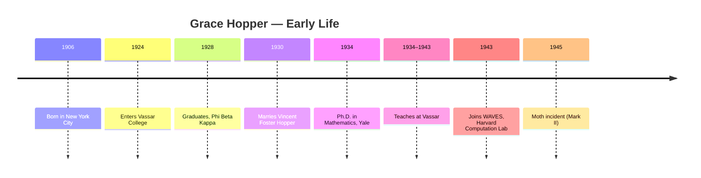
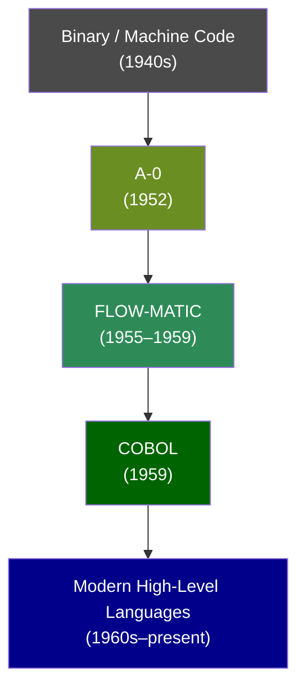
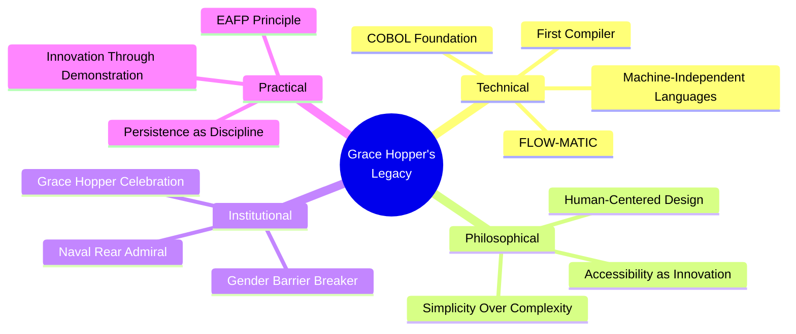

# Grace Hopper

## Description

Grace Brewster Murray Hopper (1906–1992) was a mathematician, naval officer, and computing pioneer whose insistence that machines should speak the language of humans — not the other way around — fundamentally reshaped the software industry. She developed the first compiler, championed machine-independent programming languages, and laid the direct groundwork for COBOL, a language that still processes the majority of the world's financial transactions. Her life is a case study in practical innovation pursued against institutional resistance, gender discrimination, and the pervasive assumption that the future must resemble the past.

## Prerequisites

- [Alan Turing](alan-turing.md) — the theoretical foundation of computation that Hopper made practical and accessible
- [Why Study Role Models](intro/why-study-role-models.md) — the framework for extracting transferable principles from a life

## Table of Contents

- [Origins — The Mathematician Who Found Machines](#-origins--the-mathematician-who-found-machines)
  - [The Yale Years](#the-yale-years)
  - [The War and the Harvard Computation Lab](#the-war-and-the-harvard-computation-lab)
- [The Work — Teaching Machines to Speak English](#-the-work--teaching-machines-to-speak-english)
  - [The A-0 System](#the-a-0-system)
  - [A-2 and the Expansion of the Compiler Concept](#a-2-and-the-expansion-of-the-compiler-concept)
  - [FLOW-MATIC](#flow-matic)
  - [The Path to COBOL](#the-path-to-cobol)
  - [The Compiler's Philosophical Weight](#the-compilers-philosophical-weight)
- [Struggles and Failures — The Cost of Being First](#-struggles-and-failures--the-cost-of-being-first)
  - [Gender as a Permanent Obstacle](#gender-as-a-permanent-obstacle)
  - ["Computers Can Only Do Arithmetic"](#computers-can-only-do-arithmetic)
  - [Retiring as a Rear Admiral at Seventy-Nine](#retiring-as-a-rear-admiral-at-seventy-nine)
  - [The Myth of the Solo Inventor](#the-myth-of-the-solo-inventor)
- [Legacy and Lessons — The Admiral Who Changed Everything](#-legacy-and-lessons--the-admiral-who-changed-everything)
  - [The Grace Hopper Celebration of Computing](#the-grace-hopper-celebration-of-computing)
  - [The Nanosecond Ruler as Philosophical Instrument](#the-nanosecond-ruler-as-philosophical-instrument)
  - [The Principle of Practical Innovation](#the-principle-of-practical-innovation)
  - [The Power of Insisting on Simplicity](#the-power-of-insisting-on-simplicity)
  - ["It's Easier to Ask Forgiveness Than It Is to Get Permission"](#its-easier-to-ask-forgiveness-than-it-is-to-get-permission)
  - [What Hopper's Life Teaches](#what-hoppers-life-teaches)

## 🌱 Origins — The Mathematician Who Found Machines

Grace Brewster Murray was born on December 9, 1906, in New York City, into a family that valued intellectual discipline. Her father, Walter Fletcher Murray, was an insurance executive who had studied at the Massachusetts Institute of Technology; her mother, Mary Campbell Van Horne Murray, was a mathematician who had studied at Vassar College and instilled in her daughter a conviction that analytical thinking was not a luxury but a necessity.

The young Grace was insatiably curious. She dismantled alarm clocks to understand their mechanisms — reportedly seventy clocks by her mother's count, none of which she successfully reassembled. The anecdote is revealing: the impulse to take things apart, to understand how they work, was present before the impulse to put them back together. This is, in miniature, the pattern of a research mind: deconstruction precedes reconstruction, and understanding the components is a prerequisite to improving the whole.

From an early age, Grace exhibited an unusual combination of mathematical rigor and narrative imagination — she could prove a theorem and tell a story about why it mattered, a duality that would define her entire career.

She attended Hartridge School in New Jersey before entering Vassar College in 1924, where she studied mathematics and physics. The choice of Vassar was deliberate — it was one of the few institutions that took women's intellectual education seriously. She was elected to Phi Beta Kappa, the national academic honor society, and graduated in 1928. Her senior thesis, on the theory of finite differences, already displayed the quality that would become her signature: a preference for concrete applications over abstract formalism. While her peers pursued pure mathematics, Grace wanted to know what the numbers *did*.

This instinct — the refusal to let mathematics remain purely theoretical — was not a limitation. It was a lens. Where others saw elegant abstractions, Grace saw untapped potential for practical application. She did not reject theory; she insisted that theory justify itself through utility. This conviction would later put her at odds with the computer science establishment, which often valued formal elegance over practical consequence, but it was also the source of her most enduring contributions.

### The Yale Years

In 1930, she married Vincent Foster Hopper, a scholar of Oriental languages whose intellectual range broadened her own. The marriage would later end in divorce, but for a decade it provided Grace with an intellectual partnership that reinforced her interdisciplinary instincts. Vincent's work in linguistics — the systematic study of structure and meaning in language — may have shaped her later conviction that programming languages should be designed with the same rigor and attention to human comprehension that linguists bring to natural languages.

She enrolled at Yale University, one of only a handful of women in the mathematics department. Yale awarded her a Ph.D. in mathematics in 1934 for her dissertation, "New Types of Irreducibility Criteria," a work in abstract algebra that demonstrated formidable technical ability. She had climbed to the summit of academic mathematics — and found it insufficient.

The experience of earning a doctorate in a male-dominated institution gave Grace a preview of the institutional resistance she would face for the rest of her life. At Yale, women were tolerated as students but not invited into the intellectual community that surrounded them. The departments held their colloquia at men's clubs. Women could attend the lectures but were ushered in through side entrances and seated in the back. Grace never forgot the lesson: institutional architecture encodes assumptions about who belongs.

She spent the next several years teaching mathematics at Vassar, rising to associate professor. During these years, she published papers on abstract algebra and served as a mentor to undergraduate women pursuing mathematics — a role she took seriously, understanding that visibility matters when the dominant culture tells you that people like you do not belong in the room. Her students remembered her as demanding, witty, and utterly unintimidated by authority.

By all appearances, she was on a conventional academic trajectory. Then, in 1943, the world changed — and Grace Hopper changed with it.

### The War and the Harvard Computation Lab

The attack on Pearl Harbor in December 1941 brought the United States into World War II. Grace, then thirty-six years old, applied to the U.S. Navy. She was rejected on her first attempt — she weighed 105 pounds, below the Navy's minimum weight requirement of 120. Undeterred, she enlisted in the WAVES (Women Accepted for Volunteer Emergency Service) in 1943 and reported to the Harvard Computation Laboratory in Cambridge, Massachusetts, where the Navy had established a project to build the Mark I computer.

The rejection over her weight is worth pausing on. It is a small, almost absurd incident, but it encapsulates a larger pattern: institutions design their rules around an imagined standard person, and anyone who deviates from that standard — whether in body, mind, or method — is excluded by default. The weight requirement had no bearing on Grace's ability to program a computer. It was an artifact of a military culture that had not yet reckoned with the possibility that the most valuable contributions might come from people who did not fit its physical template.

The Mark I — officially the IBM Automatic Sequence Controlled Calculator — was a room-sized electromechanical machine designed to compute ballistic firing tables for the Navy's weapons division. It was not a computer in the modern sense; it was a calculator, albeit an extraordinarily fast one. It read instructions from a paper tape, executed them sequentially, and produced printed output. It was 51 feet long, weighed five tons, and contained 750,000 parts. It hummed, clicked, and clattered through its calculations with a sound that witnesses compared to a mechanical loom.

Grace Hopper's assignment was to program the machine. This meant, in practical terms, that she had to learn its instruction set, understand its electrical and mechanical timing, and then translate mathematical problems into sequences of operations that the machine could execute. There were no programming languages. There were no manuals. There was a machine that understood only its own binary-encoded operations, and a mathematician who understood only human mathematics, and between them lay a vast, uncharted territory.

She thrived. Within months, she was writing complex programs and debugging them by tracing faults through thousands of instructions on paper tape. She discovered that the best way to find errors was not to stare at the code but to step away, rest, and return with fresh eyes — an insight that anticipated the modern understanding of cognitive fixation and incubation in problem-solving.

Her work on the Mark I and its successors established a pattern that would define her career: she mastered the existing system, identified its limitations, and then built something better. She did not merely program the machine. She understood it — its timing, its failure modes, its architectural constraints — and from that understanding, she derived the insight that the machine's language was the wrong language for humans to use.

The Harvard years also gave Hopper her first experience of the collaborative nature of early computing. She worked alongside Howard Aiken, the Harvard professor who had designed the Mark I, and with a team of mathematicians and engineers who shared the work of programming. The social dimension of computing — the fact that programs were written by teams, tested by teams, and maintained by teams — reinforced Hopper's conviction that programming languages needed to be accessible. If multiple people had to read, understand, and modify the same code, the code had to be readable by humans, not just by machines.

It was during this period that the now-famous moth incident occurred. On September 9, 1945, a moth was found wedged in a relay of the Mark II computer (a successor to the Mark I), causing it to malfunction. Hopper taped the moth into the machine's logbook with the notation "first actual case of bug being found." The entry has become one of computing's most enduring legends, though it should be noted that the word "bug" was already in use among engineers to describe technical defects. Thomas Edison used the term as early as 1878. Hopper's contribution was not the invention of the term but the documentation of a literal instance — a moment that collapsed the metaphor into reality and gave the entire industry a shared origin story.

The logbook page, with its moth and its handwritten annotation, is now preserved at the Smithsonian Institution's National Museum of American History. It is one of the most visited artifacts in the computing collection — a reminder that the most memorable moments in technical history are often not the grand inventions but the small, human incidents that make the abstract concrete.



## 🔧 The Work — Teaching Machines to Speak English

Grace Hopper's most consequential insight was not technical but philosophical: the distance between a human problem and a machine solution should be bridged by the programming language, not by the programmer.

In the early days of computing, programming meant writing instructions in the machine's native language — binary code or, at best, numeric opcodes that corresponded to specific electrical operations. Every programmer had to understand the hardware intimately. Every program was machine-specific. A program written for one computer could not run on another without being completely rewritten. The programmer served as a human translator between the problem domain and the machine domain, absorbing all the complexity of both.

This arrangement imposed a hidden cost. It meant that every programmer's expertise was divided between two domains: the problem they were trying to solve and the machine they were solving it on. A business analyst who understood accounting perfectly but could not speak the machine's language was useless. A hardware engineer who understood the machine perfectly but knew nothing about accounting was equally useless. The only productive programmer was someone who spanned both domains — a rare and expensive hybrid.

The cost was not merely economic. It was cognitive. Programming in machine code required a kind of mental translation that consumed attention, introduced errors, and made programs difficult to read, debug, and modify. A program written in binary is, to a human eye, an undifferentiated stream of symbols. Finding a logical error in such a program is like finding a misspelled word in a book written in a script you cannot read. The programmer's primary cognitive resource — attention — was consumed by the translation process, leaving less capacity for the actual problem.

Hopper recognized that this arrangement was backwards. The machine was faster, more reliable, and less expensive to modify than the human. The translation should be automated. The programmer should write instructions in something close to English, and the machine should figure out how to convert those instructions into its own binary language.

### The A-0 System

In 1952, Hopper and her team at Remington Rand (which had acquired the Mark I's successor) completed A-0, a programming system that automatically translated symbolic instructions into machine code. A-0 was not a compiler in the modern sense — it was more accurately a linker and loader — but it established the principle that a program could serve as an intermediary between human intent and machine execution.

The significance of A-0 was not its technical sophistication. It was the conceptual breakthrough it represented. For the first time, a programmer could write code that was not tied to a specific machine architecture. The program itself handled the translation. This was the seed of everything that followed.

Hopper called this intermediary a "compiler" — a term she borrowed from military usage, where a compiler is a person who assembles information from multiple sources into a single document. The metaphor was precise: her compiler gathered human-readable instructions and assembled them into machine-executable code. The choice of terminology was characteristic of Hopper's instinct for communication. She did not coin a technical neologism. She repurposed a word that already carried meaning, making the new concept immediately graspable to the people who would need to adopt it.

### A-2 and the Expansion of the Compiler Concept

Hopper did not stop with A-0. She and her team developed A-2, an enhanced version that was distributed to UNIVAC installations across the country. A-2 was one of the first commercially available programming systems, and its distribution established a precedent: software could be shared, adapted, and improved by a community of users. This was, in embryo, the principle that would later drive the open-source movement — though Hopper's work predated that term by decades.

The A-2 system demonstrated that compilers could be iteratively improved. Each version reduced the gap between human expression and machine execution. Each improvement in the compiler's ability to parse and translate high-level instructions freed programmers to devote more of their cognitive resources to the problem at hand. The trajectory was clear: the compiler was not a one-time invention but an evolving artifact, capable of continuous refinement.

### FLOW-MATIC

Between 1955 and 1959, Hopper led the development of FLOW-MATIC, the first programming language designed to be read and written in English. FLOW-MATIC allowed programmers to express operations using words like `INPUT`, `OUTPUT`, `ADD`, `SUBTRACT`, and `COMPARE` — terms drawn directly from the business domain rather than from electrical engineering.

A FLOW-MATIC program read, at least in principle, like a set of instructions to a human clerk:

```text
INPUT CUSTOMER-RECORD
IF CUSTOMER-BALANCE IS GREATER THAN CREDIT-LIMIT
  PRINT "OVERCREDIT WARNING"
  SUBTRACT PAYMENT-AMOUNT FROM CUSTOMER-BALANCE
ELSE
  SUBTRACT PAYMENT-AMOUNT FROM CUSTOMER-BALANCE
END-IF
OUTPUT CUSTOMER-RECORD
```

This is not pseudocode. It is FLOW-MATIC. The program is legible to anyone who understands the business domain, even if they have no knowledge of the underlying machine architecture. This was the point. Hopper was not trying to make programming easy for programmers. She was trying to make programming possible for *domain experts* — accountants, managers, analysts — who understood the problems but did not speak binary.

FLOW-MATIC was not designed for scientific computing. It was designed for data processing — the kind of record-keeping, accounting, and business calculation that occupied the majority of the world's computing resources. Hopper understood that the future of computing was not in calculating artillery trajectories but in managing the vast repositories of data that businesses, governments, and institutions were beginning to accumulate.

The language was a commercial product, developed under the auspices of Remington Rand (later Sperry Rand). It was deployed on UNIVAC I machines and used by businesses across the United States. It demonstrated, concretely and profitably, that non-specialists could write programs if the language spoke their language.

### The Path to COBOL

In 1959, the Conference on Data Systems Languages (CODASYL) convened to establish a standard programming language for business computing. Hopper served as a technical consultant, and FLOW-MATIC was one of the primary inputs to the committee's work. The resulting language — COBOL (Common Business-Oriented Language) — bore FLOW-MATIC's DNA in its English-like syntax, its emphasis on data structures, and its design philosophy of accessibility.

COBOL was not Hopper's creation alone. It was the product of a committee, shaped by competing interests and institutional politics. But the philosophical foundation — that programming languages should be readable by humans, that the abstraction layer should favor the user over the machine — was Hopper's contribution. She had fought for a decade to establish this principle, and COBOL was its institutional validation.

The language was not without its critics. Computer scientists dismissed COBOL as verbose, inelegant, and technically inferior to languages like LISP and ALGOL. These criticisms were often valid in narrow technical terms. But they missed the point. COBOL was not designed to be elegant. It was designed to be *usable* — to be readable by accountants, managers, and analysts who had no training in computer science. Elegance was a luxury. Usability was a necessity. Hopper chose necessity, and history vindicated the choice.

The historical significance of this achievement is difficult to overstate. As of the early 2020s, COBOL still runs approximately 95% of ATM transactions and 80% of in-person financial transactions worldwide. The language Hopper championed, the principle she insisted upon — that machines should adapt to humans, not humans to machines — remains embedded in the infrastructure of global commerce.

The COBOL specification was a political document as much as a technical one. Multiple factions competed to define the language's syntax and semantics. Hopper's Remington Rand team, the DoD-backed CODASYL committee, and various corporate interests all had stakes in the outcome. Hopper navigated these competing interests with the diplomatic skill she had developed over decades of institutional combat. She did not always get what she wanted — the final COBOL specification included features she considered unnecessary and omitted some she considered essential — but she secured the philosophical core: human-readable syntax, machine-independent design, and a focus on data structures that reflected business reality.

This is a lesson in the nature of practical achievement. Perfection is rarely available. The question is not whether the outcome matches your ideal but whether the outcome advances the principle you care about. Hopper cared about accessibility, and COBOL — imperfect, committee-designed, politically compromised — delivered accessibility at scale.



### The Compiler's Philosophical Weight

Hopper's work on compilers was not merely a technical contribution. It was an assertion about the relationship between humans and their tools. Before Hopper, the implicit assumption in computing was that the human must conform to the machine — learning its language, respecting its limitations, accommodating its idiosyncrasies. Hopper reversed this assumption. She argued, through her work and her advocacy, that the machine should conform to the human.

This reversal had consequences far beyond programming languages. It reflected a deeper conviction about the nature of abstraction: that good abstractions do not merely simplify — they *empower*. By removing the burden of machine-specific translation, compilers freed programmers to think about problems rather than processes. The entire edifice of modern software engineering — high-level languages, object-oriented programming, garbage collection, just-in-time compilation — rests on the foundation Hopper laid.

The principle extends beyond computing. In every domain where humans interact with complex systems, the question Hopper asked remains relevant: should the human adapt to the system, or should the system adapt to the human? Her answer — that the system should bear the complexity — has become the organizing philosophy of user-centered design, a principle that now governs everything from smartphone interfaces to hospital information systems.

It is worth noting that this principle was controversial in its time. Many computer scientists argued that machine-oriented programming was not a problem to be solved but a feature to be preserved. They believed that programmers who understood the hardware produced more efficient code, and that abstracting away the machine's characteristics would lead to waste and inefficiency. This argument was not wrong in the narrow sense — compiled code is indeed less efficient than hand-optimized machine code. But it was wrong in the broader sense, because it optimized for the wrong variable. The scarce resource was not machine cycles. It was human attention. By freeing human attention from the burden of machine translation, compilers unlocked a wave of productivity that dwarfed the efficiency losses of compilation.

## ⚔️ Struggles and Failures — The Cost of Being First

Grace Hopper's career was a sustained exercise in institutional combat. She fought not because she enjoyed conflict but because the institutions she worked within were structured to resist exactly the kind of change she was proposing.

### Gender as a Permanent Obstacle

The most pervasive struggle was gender. Hopper entered computing at a time when the field was not merely male-dominated but male-defined. The prevailing cultural assumption was that computers — the machines and the work — were suited to men's minds. Women were tolerated as operators (a role analogous to clerical work) but not as designers, architects, or theorists.

The historical irony is sharp. During World War II, women had operated the very machines Hopper would later reprogram. The ENIAC programmers — six women who wrote the first software for the first general-purpose electronic computer — were largely forgotten for decades, their contributions erased from a narrative that preferred male protagonists. Hopper was aware of this erasure and spent much of her later career ensuring that the contributions of women in computing were documented and honored.

Hopper experienced this bias not as a single dramatic incident but as a continuous, grinding force. She was passed over for promotions. Her ideas were attributed to male colleagues. She was excluded from decision-making processes. The institutional response to her innovations was not always rejection — it was often something worse: indifference. Her ideas were absorbed without acknowledgment, her contributions minimized in retrospective accounts.

The pattern is recognizable to anyone who has worked in a field where they are outnumbered. The bias is not always expressed through overt hostility. It is expressed through the accumulation of small exclusions: not being invited to the meeting, not being asked for the opinion, not being credited in the after-action report. Each exclusion is individually trivial. Collectively, they constitute a system that systematically devalues the contributions of the minority.

Hopper navigated this system not by conforming to it but by making herself indispensable. Her compiler worked. Her FLOW-MATIC produced results. Her COBOL became an industry standard. The evidence of her contribution was undeniable, and she leveraged that evidence to persist in spaces that were not designed for her.

The gendered dimension of Hopper's struggle is particularly instructive because it was not based on any deficiency in her work. Her compiler worked. FLOW-MATIC produced results. COBOL was adopted industry-wide. The resistance was not rational — it was structural, embedded in the assumptions and social architecture of the institutions she inhabited. This is the nature of systemic bias: it does not require the malice of individuals. It operates through the accumulation of unexamined defaults.

### "Computers Can Only Do Arithmetic"

The second struggle was conceptual. Throughout the 1950s, a widely held belief — even among computer scientists — was that computers could only perform arithmetic. The idea that a computer could process text, manage records, make logical decisions, or execute workflows was regarded as either impossible or trivial. This belief was not merely wrong; it was actively harmful. It constrained the imagination of an entire generation of researchers and delayed the application of computing to business, government, and social systems.

Hopper fought this belief with a combination of demonstration and rhetoric. FLOW-MATIC was her proof by example — a language that processed business data, not mathematical formulas. Her public lectures were her proof by argument. She was a gifted communicator, known for her ability to translate complex technical ideas into vivid, accessible metaphors.

The nanosecond ruler became her signature prop. She carried a piece of wire approximately 11.8 inches long — the distance light travels in one billionth of a second — and used it in lectures to make the physical constraints of computing tangible. "We have a basic problem," she would explain. "It's the fact that the speed of light is too slow." The ruler made the abstraction concrete: at the speed of light, a signal travels only about a foot in a nanosecond. Every additional foot of wire, every additional gate in a circuit, adds delay. The physical world imposes constraints that no amount of clever programming can overcome.

She also carried a coil of wire representing a microsecond — one millionth of a second — and a short piece representing a nanosecond. The contrast between the coils made the point visually: the difference between a microsecond and a nanosecond is the difference between a manageable delay and an almost inconceivable speed. These props were not mere gimmicks. They were pedagogical instruments that transformed abstract temporal concepts into physical objects that an audience could see, hold, and understand.

But even demonstration and rhetoric were not always sufficient. Institutional inertia is powerful, and the belief that computers were fundamentally mathematical machines persisted well into the 1960s. Hopper's insistence on the broader applicability of computing was vindicated by history, but the vindication took decades.

### Retiring as a Rear Admiral at Seventy-Nine

The Navy, which Hopper had served since 1943, was itself a site of institutional resistance. She was repeatedly passed over for promotion. She was forced to retire multiple times, only to be recalled when her expertise was needed. In 1966, at age sixty, she was forced to retire from the Navy — and then recalled to active duty in 1967 because the Navy could not afford to lose her knowledge.

The pattern of forced retirement and recall is revealing. It suggests an institution that recognized Hopper's value in the immediate term but could not integrate that recognition into its long-term structures. The Navy needed her knowledge. It did not need — or could not accommodate — her as a permanent, senior figure. The result was a cycle of expulsion and re-engagement that would have broken a less determined individual.

During her years of active service, Hopper served in various capacities, including as a researcher at the Naval Data Automation Command and as a lecturer at the Naval Postgraduate School. She was not a ceremonial figure. She was a working technologist, contributing to the Navy's computing infrastructure and training the next generation of naval officers in the principles of software development.

She served until 1986, retiring at the age of seventy-nine with the rank of Rear Admiral (Lower Half) — a one-star flag officer and the highest rank achievable by a woman in the Navy at that time. Her retirement ceremony was held aboard the USS Constitution, and she was awarded the Defense Distinguished Service Medal, the Navy's highest civilian honor. She was also recognized with the Exceptional Service Medal, a distinction that reflected not a single achievement but a career of sustained, compounding contribution.

The significance of this trajectory is not merely inspirational. It is structural. Hopper's repeated forced retirements and recalls reveal an institution that simultaneously undervalued and depended on her. The Navy could not function without her expertise, yet it could not promote her to reflect that expertise. This is the paradox of institutional dependence on individuals the institution's culture refuses to honor — a paradox that persists in technology organizations to this day.

### The Myth of the Solo Inventor

Hopper's struggles also illustrate a broader truth about innovation: it is never the work of a single individual, no matter how brilliant. Hopper led teams. She collaborated with programmers, engineers, and mathematicians whose contributions are less visible in the historical record. The narrative of the lone genius is compelling but misleading — it obscures the collaborative nature of technical progress and creates unrealistic expectations for individual achievement.

The solo inventor myth does particular harm to those who are already marginalized. When the narrative insists that progress comes from solitary genius, it implicitly suggests that those who work collaboratively, who share credit, who build on others' ideas, are somehow less innovative. This is a distortion. Collaboration is not a compromise with genius. It is the mechanism through which genius becomes productive.

Hopper herself was generous in acknowledging her teams' contributions, but the historical record has not always reciprocated. Her name is attached to the compiler, to FLOW-MATIC, to COBOL — but the engineers who built the hardware, the programmers who tested the code, and the managers who secured funding are largely forgotten. This is not unique to Hopper's story. It is the standard distortion of historical memory, and it is worth noting because it applies to every biography, including those of the figures celebrated in this module.

The practical lesson for developers is this: do not wait to be a solo genius before you begin contributing. The most impactful work in computing has always been collaborative. Find a team. Contribute to an existing project. Build on others' work. The myth of the lone inventor is not just inaccurate — it is paralyzing, because it sets an impossible standard that prevents people from starting.

The antidote to the solo inventor myth is not to deny individual excellence. It is to recognize that excellence, in practice, is always embedded in a network of support, collaboration, and accumulated knowledge. Hopper was brilliant. But she was also fortunate — fortunate to have had the education she had, the colleagues she had, and the institutional access (however imperfect) that allowed her work to reach the world. Brilliance without opportunity is invisible. Opportunity without brilliance is wasted. The intersection of the two is where history is made.


## 🌟 Legacy and Lessons — The Admiral Who Changed Everything

Grace Hopper died on January 1, 1992, at age eighty-five, in Arlington, Virginia. She was buried with full naval honors at Arlington National Cemetery. In the weeks before her death, she had been working on a manuscript about the history of computing — a project she did not live to complete. The unfinished manuscript is itself a metaphor: the work of building the future is never finished, and the hands that begin it will not be the hands that complete it.

Her legacy is not a single invention but a philosophical orientation that permeates the entire software industry. Every high-level language, every compiler, every abstraction layer, every user interface that prioritizes human comprehension over machine efficiency carries her imprint. The structure of modern computing — in which humans write in languages they can understand and machines translate those languages into operations they can execute — is the structure Grace Hopper built.

### The Grace Hopper Celebration of Computing

In 1994, the Anita Borg Institute (originally the Institute for Women and Technology) founded the Grace Hopper Celebration of Computing, an annual conference that has grown into the world's largest gathering of women technologists. The conference is not merely a memorial — it is a living embodiment of Hopper's conviction that computing belongs to everyone, not just to those who fit the dominant cultural mold.

The celebration serves a dual purpose: it honors Hopper's contributions and it advances the cause she championed. By bringing together thousands of women in computing — researchers, engineers, students, executives — the conference creates the kind of visible, tangible community that was absent from Hopper's own career. It is, in a sense, the institutional infrastructure that Hopper had to build for herself, now scaled to serve an entire generation.

The conference's growth is itself a measure of Hopper's legacy. From a small gathering of a few hundred attendees in its early years, the GHC has expanded to attract over 30,000 participants. It features technical talks, research presentations, career workshops, and networking events. It is not a niche event. It is one of the most significant gatherings in the global computing calendar, and its existence is a direct consequence of the space Hopper carved out for women in a field that once had no place for them.

### The Nanosecond Ruler as Philosophical Instrument

Hopper's nanosecond ruler deserves further examination not as a curiosity but as an exemplar of her method. The ruler was not a technical instrument. It was a rhetorical one. It translated an abstract physical constraint — the speed of light — into a physical object that anyone could hold. It made the invisible visible.

This method — translating abstract complexity into tangible, graspable form — was Hopper's signature contribution to computing culture. She did it with the nanosecond ruler. She did it with the word "compiler." She did it with FLOW-MATIC's English-like syntax. In each case, the innovation was not in the underlying technology but in the *representation* — the bridge between the technical and the human.

The lesson is transferable. In every domain, the most effective communicators are those who can translate abstract concepts into concrete images, metaphors, and objects. This is not a soft skill. It is a critical capability that determines whether an innovation is adopted or ignored, whether a team understands a technical decision or resists it, whether a user trusts a system or abandons it.

### The Principle of Practical Innovation

Hopper's career demonstrates a specific model of innovation that differs markedly from the popular image of the lone genius struck by inspiration. Hopper's innovation was *practical*. She did not set out to revolutionize computing. She set out to solve a problem — the problem of programming machines efficiently — and her solutions happened to have revolutionary consequences.

This practical orientation is itself a lesson. The most impactful innovations are often not the most theoretically elegant. They are the ones that solve real problems for real people. Hopper's compiler was not a breakthrough in computer science theory. It was a tool that made programming easier. But by making programming easier, it made programming *accessible*, and by making programming accessible, it expanded the population of people who could contribute to computing — and that expansion changed everything.

The table below illustrates this distinction. It is not a ranking of relative worth — theoretical and practical contributions are incommensurable. It is a reminder that they serve different functions in the ecosystem of progress.

| Innovation | Theoretical Elegance | Practical Impact |
|---|---|---|
| Turing Machine | ✅ Highest | Moderate (theoretical) |
| Hopper's Compiler | Moderate | ✅ Highest (industry-wide) |
| Von Neumann Architecture | ✅ High | ✅ High (hardware design) |

Hopper's contribution was to the ecosystem's *accessibility* — the size and diversity of the talent pool that could participate in building the future. When the barrier to entry drops, the number of contributors rises. When the number of contributors rises, the rate of innovation accelerates. This is the mechanism through which practical tools generate outsized returns.

### The Power of Insisting on Simplicity

Hopper's insistence that programming languages should be human-readable was, at its core, an insistence on simplicity. Not simplicity as the absence of complexity, but simplicity as the *management* of complexity — pushing complexity into the machinery so that humans could focus on the problem.

This distinction matters. True simplicity is not naive. It does not pretend that the underlying problem is easy. It acknowledges the full complexity of the task and then constructs an abstraction that shields the human from the parts of that complexity that are not relevant to their decision. A compiler does not eliminate the complexity of translating high-level instructions into machine code. It relocates that complexity — from the programmer's mind into the compiler's logic. The complexity is still present. It has simply been placed where it belongs: in the machine.

This principle — that the system should absorb complexity so that the user does not have to — is now foundational in software design. It governs the design of programming languages, application interfaces, and user experiences. It is the principle behind high-level languages, garbage-collected memory, managed frameworks, and cloud infrastructure. Every abstraction layer in modern computing is, in some sense, a descendant of Hopper's compiler.

The lesson for practitioners is not technical but dispositional. Insisting on simplicity requires courage. It requires the willingness to be told that your request is naive, that the existing complexity is necessary, that users should learn to adapt. Hopper heard all of these objections and rejected them. She insisted, and the industry followed. The fact that the industry followed is not guaranteed — many simplification efforts fail — but Hopper's succeeded because she demonstrated, through working systems, that the simpler approach produced better outcomes.

### "It's Easier to Ask Forgiveness Than It Is to Get Permission"

This quote, often attributed to Hopper (and popularized in computing culture by the Python community as EAFP — Easier to Ask Forgiveness than Permission), captures something essential about her approach to institutional resistance. Hopper did not wait for authorization. She built FLOW-MATIC without a formal mandate. She pursued COBOL through coalition-building rather than top-down directive. She developed her nanosecond ruler not because someone asked her to but because she recognized its pedagogical value.

The quote is not an endorsement of recklessness. It is a recognition that institutional permission processes are often designed to maintain the status quo, not to enable innovation. When the existing structure is inadequate, waiting for permission to change it is waiting for a transformation that will never be authorized. The only path forward is to demonstrate, through action, that the new approach works — and then to accept whatever consequences follow.

This principle operates on a deeper level than mere procedural shortcut. It reflects a conviction about the relationship between action and understanding. In Hopper's experience, institutions did not understand the value of a new approach until they saw it working. The demonstration preceded the comprehension. The proof came before the permission. This is not a failure of the institution. It is a structural feature of how organizations process novelty: they cannot evaluate what they have not seen, and they will not authorize what they cannot evaluate.

The practical implication is clear: when you believe a new approach is correct, the most effective strategy is not to seek approval but to build a working prototype, demonstrate its value, and let the results speak. This is what Hopper did with compilers. This is what she did with FLOW-MATIC. This is what she did with every innovation she championed.

This is a principle that applies to every developer who has ever been told that their idea is too radical, too impractical, or too different from the way things have always been done. Hopper's life is evidence that the way things have always been done is not an argument for the way things should be done. It is evidence, too, that the most effective form of persuasion is not argument but demonstration — not telling people why the new way is better but showing them.

### What Hopper's Life Teaches

The synthesis of Hopper's life offers several transferable lessons:

1. **Accessibility is a form of innovation.** Making something easier to use is not a lesser contribution than making something theoretically novel. It is often the more consequential achievement. Hopper's compiler did not advance computer science theory. It advanced computer science *practice* — and practice is what changes the world.

2. **Institutional resistance is structural, not personal.** When an institution resists change, it is usually not because the individuals within it are malicious. It is because the institution's architecture — its assumptions, its incentive structures, its cultural defaults — is optimized for the current state. Changing the institution requires changing the architecture, not merely persuading the individuals.

3. **Persistence is not a personality trait. It is a discipline.** Hopper did not persist because she was naturally resilient. She persisted because she believed the work mattered more than the obstacles. This is a choice, not a temperament, and it is available to anyone.

4. **Age is not a barrier to contribution.** Hopper retired as a Rear Admiral at seventy-nine. She continued consulting and lecturing until her death at eighty-five. The assumption that innovation belongs to the young is not supported by the evidence. The qualities that drive meaningful work — judgment, persistence, clarity of purpose — are often more developed in later life, not less.

5. **The metaphor matters.** The word "compiler" is a metaphor. The nanosecond ruler is a metaphor. The moth in the logbook is a metaphor. Hopper understood that ideas spread through stories and images, not through technical specifications. Her ability to communicate through metaphor was as important as her ability to write code.

6. **Simplicity is an act of respect.** When Hopper insisted that programming languages should be readable, she was making a claim about the dignity of the people who would use them. She was saying: these people deserve tools that respect their intelligence and their time. Every abstraction layer, every simplified interface, every human-readable format is an expression of this conviction.

The thread that connects these lessons is a single, coherent philosophy: that technology exists to serve human beings, and that the measure of a technical contribution is not its elegance or its novelty but its capacity to expand what humans can do. Hopper never wavered from this principle, and the world she helped build is a testament to its power.



## 📝 Learning Tips

- **Read primary sources.** Hopper was a prolific speaker. Her lectures and interviews are available through the Computer History Museum and the Navy's archives. Hearing her voice — her cadence, her humor, her directness — conveys dimensions of her character that biography alone cannot capture.
- **Trace the lineage.** Follow the technical line from A-0 to FLOW-MATIC to COBOL to modern languages. Understanding this lineage reveals how practical decisions compound into structural change.
- **Study the resistance.** When reading about Hopper's struggles, do not skip the institutional details. The specific mechanisms of resistance — the weight requirements, the forced retirements, the attribution gaps — are more instructive than the general statement that "she faced discrimination."
- **Apply the accessibility principle.** In your own work, identify one place where you have assumed the user should adapt to the system. Ask whether the system could adapt to the user instead. This is Hopper's fundamental question, and it applies far beyond programming languages.
- **Watch for the pattern of practical innovation.** Hopper's contributions were not theoretical breakthroughs. They were practical tools that changed how people worked. This pattern recurs across the biographies in this module: the most impactful figures are often those who translated theory into practice, not those who advanced theory for its own sake.
- **Note the role of communication.** Hopper was as effective a communicator as she was a technologist. Her nanosecond ruler, her vivid metaphors, her ability to explain complex ideas in plain language — these were not peripheral skills. They were central to her impact. An innovation that cannot be communicated cannot be adopted.


## 📖 Glossary

| Term | Definition |
|---|---|
| Compiler | A program that translates human-readable source code into machine-executable binary code; the term was coined by Grace Hopper |
| Mark I | The IBM Automatic Sequence Controlled Calculator, an electromechanical computer built at Harvard for the U.S. Navy during World War II |
| A-0 | The first programming system developed by Hopper (1952), which automatically translated symbolic instructions into machine code |
| A-2 | The successor to A-0, one of the first commercially available compilers, distributed to UNIVAC installations |
| FLOW-MATIC | The first programming language designed to use English-like syntax for business data processing, developed by Hopper between 1955 and 1959 |
| COBOL | Common Business-Oriented Language, a standardized programming language for business computing, heavily influenced by FLOW-MATIC |
| CODASYL | Conference on Data Systems Languages, the committee that developed COBOL in 1959 |
| WAVES | Women Accepted for Volunteer Emergency Service — the branch of the U.S. Naval Reserve in which Hopper served during World War II |
| UNIVAC I | The first commercially produced electronic digital computer, designed by J. Presper Eckert and John Mauchly |
| Machine-Independent Language | A programming language whose programs can run on different hardware architectures without modification, a concept pioneered by Hopper |
| Nanosecond | One billionth of a second; Hopper used a physical wire approximately 11.8 inches long to represent the distance light travels in one nanosecond |
| EAFP | "Easier to Ask Forgiveness than Permission," a Python programming principle attributed to Hopper's philosophy |
| Ballistic Firing Table | A table of precomputed firing solutions for artillery weapons, one of the primary use cases for early computers |
| Paper Tape | A medium for storing computer instructions and data, used in early electromechanical computers including the Mark I |
| UNIVAC I | The first commercially produced electronic digital computer, designed by J. Presper Eckert and John Mauchly and manufactured by Remington Rand |
| Abstraction Layer | A way of hiding complexity behind a simplified interface, allowing users to interact with a system without understanding its internal mechanisms |
| Human-Readable Language | A programming language whose syntax resembles natural English, as opposed to machine code or assembly language |
| Machine Code | The binary instructions that a computer's processor executes directly, without translation |
| Linker and Loader | A program that combines separately compiled code modules into a single executable program and loads it into memory for execution |
| Relay | An electromechanical switch used in early computers to represent and process binary data; the Mark II's relay that trapped the moth |
| Defense Distinguished Service Medal | The U.S. Navy's highest civilian decoration, awarded to Hopper upon her retirement in 1986 |
| Exceptional Service Medal | A U.S. Navy award recognizing sustained superior performance in a position of significant responsibility |
| USS Constitution | A U.S. Navy frigate commissioned in 1797, now a museum ship in Boston, where Hopper's retirement ceremony was held |

## 🔗 Quick References

- [Computer History Museum — Grace Hopper Collection](https://www.computerhistory.org/collections/oral-histories/) — oral histories and primary source materials
- [U.S. Navy — Grace Hopper Biography](https://www.history.navy.mil/content/history/bios/grace-hopper.html) — official naval record and career summary
- [Grace Hopper Celebration of Computing](https://ghc.anitab.org/) — the annual conference honoring Hopper's legacy
- [Walter Isaacson — *The Innovators*](https://simonandschuster.com/books/The-Innovators/Walter-Isaacson/9781476708690) — historical account placing Hopper in the context of computing's development
- [Kurt Beyer — *Grace Hopper and the Invention of the Information Age*](https://mitpress.mit.edu/9780262014464/grace-hopper-and-the-invention-of-the-information-age/) — the definitive scholarly biography
- [Grace Hopper — Nanosecond Video (YouTube)](https://www.youtube.com/watch?v=9eyFGr8eq8I) — Hopper explaining the nanosecond ruler in her own words
- [The Navy's Recollections of Grace Hopper](https://www.history.navy.mil/content/history/bios/h/grace-hopper.html) — detailed timeline of her naval career and awards

## ➡️ Next Steps

- [Donald Knuth](donald-knuth.md) — who formalized what Hopper made practical
- [Ada Lovelace](ada-lovelace.md) — the visionary who imagined computation before the machines existed
- [Margaret Hamilton](margaret-hamilton.md) — the software engineer who applied Hopper's principles to the Apollo mission
