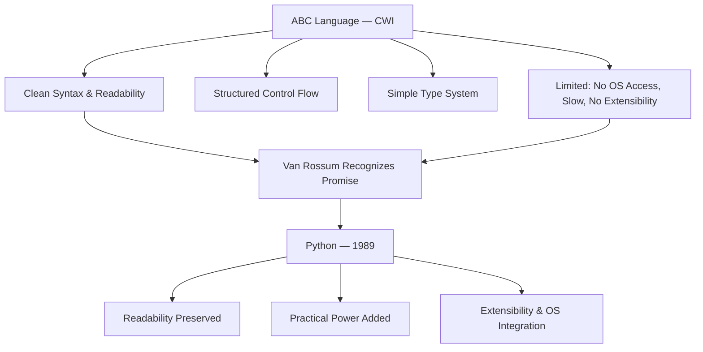
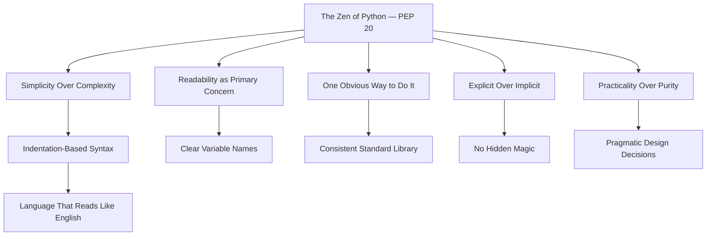
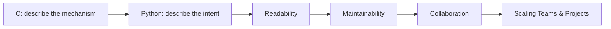
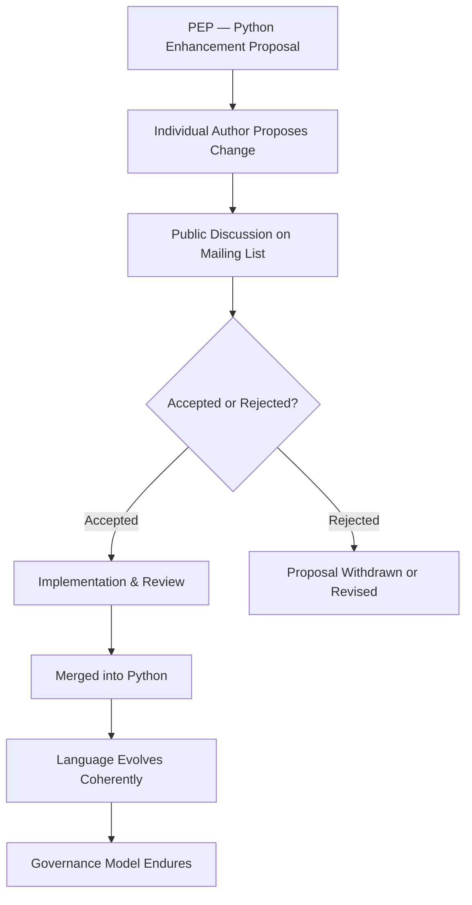
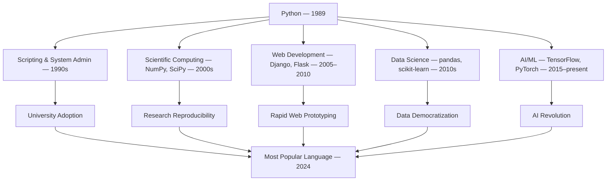
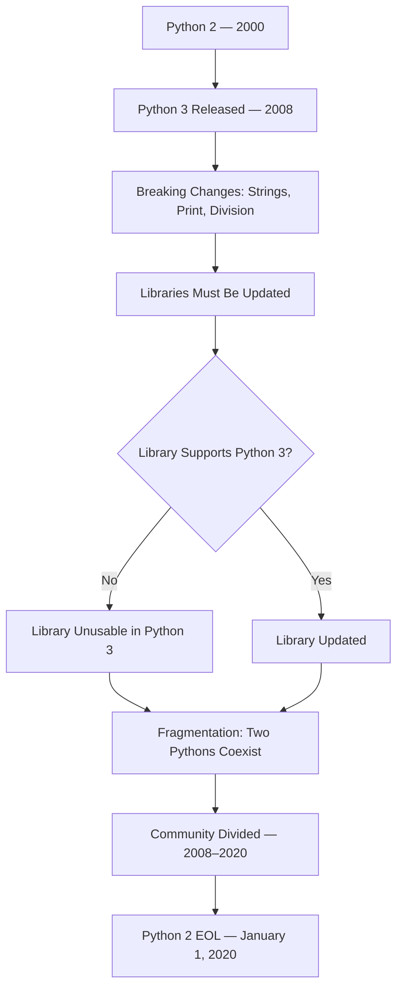
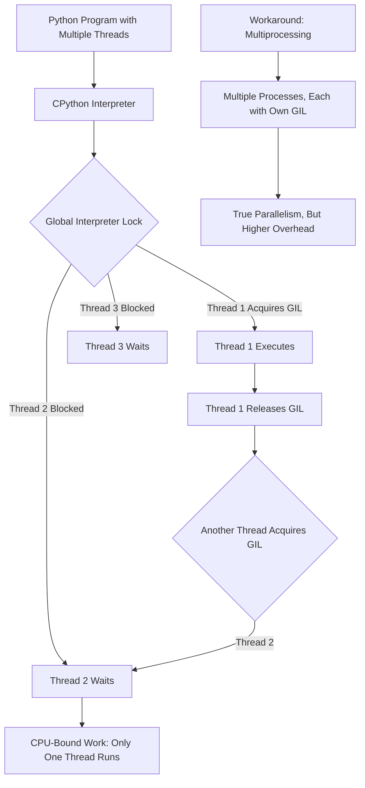
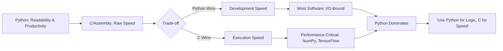
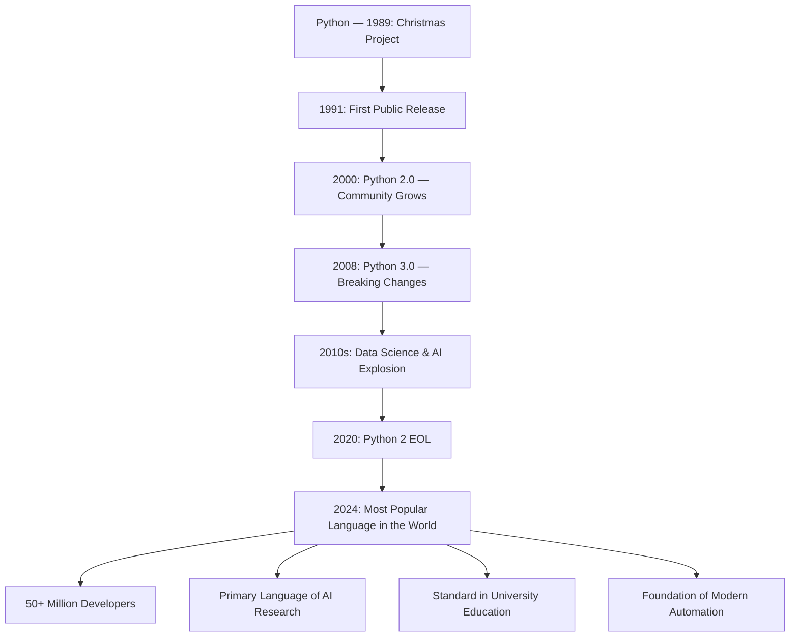
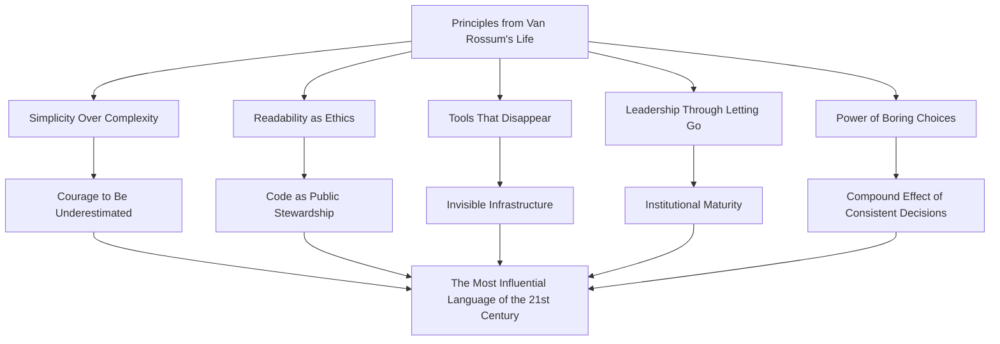

# Guido van Rossum

## Description

Guido van Rossum (born 1956) is a Dutch programmer and author who created the Python programming language — a language that would go on to become the most popular programming language in the world. Where Dennis Ritchie built the foundations of systems programming with C and Ken Thompson designed Unix with austere minimalism, van Rossum pursued a different ideal: a language that prioritized human readability above all else, one that a newcomer could learn in days rather than months, and one that trusted the programmer not with raw memory access but with the freedom to express ideas clearly. His life is a study in the power of deliberate simplicity — the courage to build something "boring" in an industry that celebrates complexity, and to let that boring thing reshape the world. To study van Rossum is to understand that the most transformative ideas in technology are sometimes the quietest: not the revolutionary system or the elegant algorithm, but the language that makes the next generation of builders possible.

## Prerequisites

- [Bjarne Stroustrup](bjarne-stroustrup.md) — whose C++ took the opposite philosophy, prioritizing zero-overhead abstraction and performance over readability
- [Dennis Ritchie](dennis-ritchie.md) — whose C was the foundation Python built upon and whose trust-in-the-programmer philosophy van Rossum both inherited and transformed

## Table of Contents

- [Origins — The Making of a Craftsman](#-origins--the-making-of-a-craftsman)
- [The Work — The Language That Spoke to Everyone](#-the-work--the-language-that-spoke-to-everyone)
- [Struggles and Failures — The Cost of a Benevolent Crown](#-struggles-and-failures--the-cost-of-a-benevolent-crown)
- [Legacy and Lessons — The Quiet Revolution](#-legacy-and-lessons--the-quiet-revolution)

## 🌱 Origins — The Making of a Craftsman

### A Dutch Childhood

Guido van Rossum was born on 31 January 1956 in Haarlem, the Netherlands, a city of windmills and canal houses located thirty kilometers west of Amsterdam. His father was an architect and his mother a teacher. The household was intellectual but not austere — a place where ideas were discussed openly and where curiosity was encouraged rather than disciplined. Van Rossum would later describe his upbringing as "unremarkable," a word that reveals more about his character than about his circumstances, for the Netherlands of the 1950s and 1960s was a society that valued practical competence and quiet excellence over self-promotion. These values would become the foundation of his career.

Haarlem is a city that moves at its own pace. It is not Amsterdam — not the commercial capital, not the cultural furnace — but a place where the rhythms of daily life are steady and unadorned. There is something in this geography that mirrors van Rossum's temperament. He would spend his career building things that worked rather than things that attracted attention, and this disposition — the preference for substance over spectacle — has its roots in a culture that has always valued the craftsperson over the celebrity.

The young van Rossum was drawn to mathematics and science, but his path to computing was neither direct nor predetermined. The Netherlands in the 1970s was not the computing powerhouse it would later become. Computers were large, expensive, and accessible primarily to universities and large corporations. The personal computer revolution had not yet begun, and the idea that a child might learn to program as a hobby was not yet widespread. Van Rossum encountered computing at the University of Amsterdam, where he studied mathematics and computer science — a combination that would prove essential to his later work, for Python's design is inseparable from the mathematical clarity of its structures.

### University of Amsterdam and CWI

Van Rossum enrolled at the University of Amsterdam to study mathematics and computer science in the mid-1970s. The Dutch academic tradition was rigorous and formal, rooted in the legacy of mathematicians like Luitzen Brouwer and Christiaan Huygens. The curriculum was demanding: students were expected to master both the theoretical foundations of computation and the practical skills of implementation. Van Rossum excelled in both, but it was the practical work — writing programs, building systems, solving real problems — that captured his deepest interest.

After completing his studies, van Rossum joined the Centrum Wiskunde & Informatica (CWI) — the National Research Institute for Mathematics and Computer Science — in Amsterdam. CWI was, and remains, one of Europe's leading research institutions in computing. It was here that van Rossum would spend the formative years of his career, working on language design and implementation with a freedom that larger, more commercially driven organizations would not have permitted.

The significance of CWI in van Rossum's development cannot be overstated. It was a place where research was pursued for its own sake, where the pressure to produce commercial products was absent, and where the culture valued intellectual rigor over speed. The Dutch tradition of "doing it right" — of building things carefully, thoughtfully, and with attention to long-term consequences — was embedded in CWI's institutional DNA. Van Rossum absorbed this ethos and would carry it into every language he designed.

### The ABC Language and the Seed of Python

At CWI, van Rossum worked on the ABC project — a language designed to be a replacement for BASIC, aimed at teaching programming to beginners. ABC was created by Leo Geurts, Lambert Meertens, and Steven Pemberton, and van Rossum joined the team as an implementer. The language was ambitious: it had clean syntax, structured control flow, and a type system that was simple but expressive. It was, in many ways, the first attempt to build a language that prioritized readability over everything else.

ABC was beautiful but flawed. It was interpreted, slow, and limited in scope. It could not interface with the operating system, it lacked extensibility, and its error handling was primitive. Van Rossum admired ABC's philosophy but recognized its limitations. He saw what ABC could have been if it had been designed with a different set of trade-offs — if it had been a systems language with ABC's soul, a language that combined readability with practical power.

The lessons of ABC would become the blueprint for Python. Van Rossum would take what worked — the clean syntax, the emphasis on readability, the accessibility for beginners — and discard what did not — the limitations, the slowness, the isolation from the broader computing ecosystem. The relationship between ABC and Python is direct and traceable: Python is what ABC would have become if its creators had also been systems programmers who needed to build real things.



### The Christmas Project

The creation of Python is one of the most consequential hobby projects in the history of computing. In December 1989, van Rossum was looking for a programming language that would occupy his time during the Christmas break. He decided to write an interpreter for a language that would combine the best aspects of ABC with the practical capabilities of C — a language that was easy to read, easy to write, and powerful enough to build real systems.

He named the language "Python," after Monty Python's Flying Circus — the British comedy troupe whose anarchic humor appealed to van Rossum's sense of the absurd. The name was a deliberate choice: it signaled that this was not a language that took itself too seriously, that it was meant to be enjoyable to use, and that its creators had a sense of humor. In an industry that often treated its tools with solemn reverence, this lightness of spirit was a radical statement.

The choice of name also carried a subtler message. Monty Python's humor was democratic — it appealed to educated adults and accessible to newcomers. It did not require specialized knowledge to appreciate, but it rewarded deep familiarity. This was precisely the quality van Rossum wished to build into his language: a tool that was welcoming to the beginner but satisfying to the expert, one that did not condescend to either.

Within days, van Rossum had a working interpreter. The core design decisions were already in place: indentation-based syntax (inherited from ABC), dynamic typing, first-class functions, and a standard library that included the essentials for system administration and text processing. The language was small, coherent, and — most importantly — readable. A non-programmer could look at a Python program and, with minimal guidance, understand what it was doing. This was not an accident. It was the central design requirement.

## ⚙️ The Work — The Language That Spoke to Everyone

### The Philosophy: Readability as a First Principle

The defining characteristic of Python is not its syntax, its libraries, or its performance. It is the philosophy that underlies every design decision: code is read much more often than it is written, and therefore readability must be the primary concern of the language designer.

This principle was formalized in 2004 as PEP 20 — "The Zen of Python" — a collection of twenty aphorisms that capture the language's design philosophy. The most famous of these is: "There should be one — and preferably only one — obvious way to do it." This statement, which contradicts the Perl philosophy of "There's more than one way to do it," encapsulates van Rossum's conviction that ambiguity is the enemy of clarity, and that a language should guide its users toward the clearest solution rather than offering them a bewildering array of alternatives.

The full text of the Zen of Python can be displayed in any Python interpreter by typing `import this`. It includes principles that are simultaneously technical and philosophical:

> Simple is better than complex.
> Complex is better than complicated.
> Flat is better than nested.
> Sparse is better than dense.
> Readability counts.
> Special cases aren't special enough to break the rules.
> Although practicality beats purity.

These are not merely coding guidelines. They are a worldview — a set of convictions about how humans and computers should relate to each other. The human comes first. The code must serve the reader, not the writer. Simplicity is not a compromise; it is a goal. And the pursuit of simplicity requires more discipline than the pursuit of complexity, because simplicity demands that every feature justify its existence.



### The Syntax: Code as Prose

Python's most visible design choice — the use of indentation to define code blocks rather than braces or keywords — was inherited from ABC and was, at the time of Python's creation, controversial. Most programming languages used explicit delimiters to mark the beginning and end of blocks: curly braces in C, `begin` and `end` in Pascal, `def` and `end` in Ruby. Python's use of indentation was seen by some as a limitation — a restriction on the programmer's freedom to format code as they pleased.

Van Rossum saw it differently. Indentation, he argued, was not a limitation but a liberation. In C, a programmer could indent their code however they liked — and some did so badly, creating code that was syntactically correct but visually incomprehensible. By making indentation syntactically significant, Python forced programmers to format their code consistently. The indentation was not decoration; it was structure. The visual layout of the code was the code.

This decision had consequences that extended far beyond aesthetics. Studies of programming comprehension consistently show that developers spend more time reading code than writing it. The average developer reads thousands of lines of code for every line they write. By making the visual structure of the code match its logical structure, Python reduced the cognitive load of reading — making it easier to understand, easier to debug, and easier to maintain. The language was designed not for the moment of writing but for the months and years of reading that would follow.

Beyond indentation, Python's syntax was designed to approximate natural language. Variable names are descriptive. Control structures read like English sentences. The `for` loop says `for item in collection`, not `for (int i = 0; i < collection.size(); i++)`. The `if` statement says `if condition is true`, not `if (condition == true)`. This linguistic proximity was deliberate: van Rossum wanted a language that a non-programmer could read with minimal translation, because he understood that the greatest barrier to entry in programming was not intellectual difficulty but syntactic opacity.

### The Zen in Practice: Why Python Works

Python's dominance did not emerge from a single brilliant feature. It emerged from the accumulation of hundreds of small decisions, each made in service of the same principle: make the easy thing the right thing, and make the right thing easy to read.

Consider the list comprehension — a feature that allows the programmer to construct a new list by applying an expression to each item in an existing list. In Python:

```python
squares = [x**2 for x in range(10)]
```

In C, the equivalent would require a loop, an accumulator variable, and explicit memory management:

```c
int squares[10];
for (int i = 0; i < 10; i++) {
    squares[i] = i * i;
}
```

The Python version is not merely shorter. It is clearer. It states its intention directly: "squares is the list of x-squared for each x in the range from 0 to 9." The C version requires the reader to mentally execute the loop — to track the index, the bounds, the assignment — before understanding what the code produces. The Python version describes the result; the C version describes the process.

This pattern — declaring intent rather than describing mechanism — runs throughout Python's design. The `with` statement for resource management says `with open('file.txt') as f`, making it obvious that the file will be properly closed when the block exits. The `try`/`except` structure for error handling separates the normal case from the exceptional case with visual clarity. Every feature is designed to make the code tell its own story.



### The PEP Process: Governance as Design

If Python's syntax is its body, the Python Enhancement Proposal (PEP) process is its constitution. A PEP is a formal document that proposes a change or addition to the Python language or its ecosystem. PEPs are numbered sequentially, written in a standardized format, and subjected to public discussion before acceptance or rejection. The process was established early in Python's history and has survived every subsequent change in governance.

The PEP process embodies a principle that is rarely discussed in programming language design: that the governance of a language is as important as its syntax. A language that is controlled by a single individual may be consistent, but it is also vulnerable to that individual's biases, blind spots, and availability. A language controlled by a committee may be democratic, but it is also prone to design-by-compromise, where features are added not because they are good but because no one can agree to reject them.

Van Rossum's innovation was to create a process that avoided both extremes. PEPs are written by individuals, not committees. The author of a PEP is responsible for its design, its rationale, and its implementation. But the acceptance of a PEP requires the approval of a designated authority — initially van Rossum himself, later a steering council elected by the community. This combination of individual initiative and collective oversight — one person proposes, the community disposes — has allowed Python to evolve without fragmenting, to add features without accumulating cruft, and to maintain its identity across three decades of change.



The PEP process has produced documents that are themselves significant contributions to software engineering. PEP 8, the style guide for Python code, is one of the most widely followed coding standards in the world. PEP 20, the Zen of Python, is a philosophical statement that has influenced how developers think about language design. PEP 7, which defines the C coding style for CPython's implementation, ensures that even the interpreter's internals are consistent. The PEPs are not merely bureaucratic artifacts. They are the living record of a language's evolution — a conversation between the language and its community that has been ongoing since 1990.

### Python's Domination: From Scripting to World Language

Python's trajectory from hobby project to world language was neither instantaneous nor inevitable. For its first decade, Python was regarded as a "scripting language" — useful for quick tasks, system administration, and prototyping, but not serious enough for large-scale software development. This perception was, in part, a consequence of its design: a language that prioritized readability and simplicity was assumed to lack the rigor required for production systems.

The perception was wrong, but it took time to correct. Python's adoption followed a pattern that is common in the history of technology: it was embraced first by the communities that needed it most — system administrators, scientists, and educators — before spreading to the mainstream.

The scientific computing community adopted Python in the late 1990s and early 2000s, driven by libraries like NumPy (numerical computation), SciPy (scientific algorithms), and matplotlib (data visualization). These libraries transformed Python from a scripting language into a scientific platform — a language in which a researcher could manipulate data, run simulations, produce visualizations, and publish results, all without leaving the Python environment. The advantage was not merely convenience. It was reproducibility: a Python script that produces a result can be shared, reviewed, and replicated by any other researcher with a Python installation.

The web development community adopted Python through frameworks like Django (2005) and Flask (2010), which made it possible to build robust, scalable web applications with a fraction of the code required by Java or C++. Django's philosophy — "don't repeat yourself" — mirrored Python's own: simplicity, clarity, and the elimination of unnecessary complexity.

The data science and artificial intelligence communities adopted Python in the 2010s, driven by libraries like pandas (data manipulation), scikit-learn (machine learning), TensorFlow (deep learning), and PyTorch (neural networks). Python became the language of the AI revolution — not because it was the fastest language (it was not) or the most theoretically elegant (it was not), but because it was the language in which the most people could participate. The democratization of AI was, in a meaningful sense, a consequence of Python's accessibility.



### CPython: The Reference Implementation

Van Rossum's original implementation of Python — and the one that remains the standard — is CPython, an interpreter written in C. This was a pragmatic choice: C was the language of systems programming, and an interpreter written in C could be compiled for any platform that had a C compiler. It was also a philosophical choice: by implementing Python in C, van Rossum ensured that Python could interface seamlessly with C libraries, allowing Python programs to leverage the vast ecosystem of existing C code.

CPython's architecture is straightforward: the source code is compiled to bytecode, which is then executed by the Python virtual machine. This two-step process — compile, then interpret — provides a balance between the portability of interpretation and the efficiency of compilation. The bytecode is platform-independent: a `.pyc` file generated on Linux can be executed on Windows, provided both systems are running the same version of Python.

The simplicity of CPython's architecture is itself a reflection of van Rossum's design philosophy. The interpreter does not attempt to be clever. It does not perform the aggressive optimizations that a production compiler might. It does not try to predict what the programmer will do next. It executes the code as written, reports errors as they occur, and gets out of the way. This unpretentious approach — doing one thing adequately rather than many things brilliantly — is the implementation equivalent of the Zen of Python.

Van Rossum maintained CPython as its "Benevolent Dictator For Life" (BDFL) from 1991 until 2018. During this period, he made every final decision about the language's design, direction, and governance. The title was self-deprecating — a joke that acknowledged the absurdity of a single person controlling a language used by millions — but it was also an accurate description of the governance model. Van Rossum's judgment was the final arbiter of what Python would become.

## 💔 Struggles and Failures — The Cost of a Benevolent Crown

### The Python 2 to Python 3 Migration

The most painful chapter in Python's history is the transition from Python 2 to Python 3 — a migration that took approximately fifteen years, fragmented the community, and remains, in the minds of many developers, a cautionary tale about the costs of breaking backward compatibility.

Python 3, released in 2008, was designed to fix several design decisions in Python 2 that van Rossum and the community had come to regard as mistakes. The most visible change was in string handling: Python 2 treated strings as sequences of bytes by default, while Python 3 treated them as sequences of Unicode characters. This was the correct design — the world was not ASCII, and a language that could not natively handle Chinese, Arabic, or accented European characters was fundamentally incomplete — but it broke virtually every existing Python program that dealt with text.

The migration was painful not because the changes were complex but because they were pervasive. A library that worked in Python 2 would fail in Python 3 if it mixed strings and bytes incorrectly. The fix was often simple — adding a `u` prefix, changing a function name, updating an import — but it had to be done everywhere, in every library, in every application. The Python community, which had grown to millions of developers, was asked to update its entire ecosystem simultaneously.



The community response was divided. Some developers upgraded immediately, eager to adopt Python 3's improvements. Others remained on Python 2, either because their dependencies had not been ported or because the cost of migration outweighed the benefits. The result was a fractured ecosystem in which libraries had to maintain compatibility with both versions, and developers had to test their code against two versions of the language.

Van Rossum's role in this controversy was complex. He had championed the changes in Python 3, and he bore responsibility for the decision to break backward compatibility. But the migration was not his alone — it was a collective decision made by the Python community through the PEP process. The lesson was not that van Rossum had been wrong about the changes but that the community had underestimated the cost of migrating an ecosystem of millions of lines of code. The PEP process, for all its virtues, had no mechanism for estimating the aggregate cost of a breaking change across the entire installed base. The decision was technically correct and practically devastating.

The Python 2 end-of-life finally arrived on 1 January 2020 — twelve years after Python 3's release. The delay was a testament to the strength of Python 2's installed base and the difficulty of persuading an ecosystem to move. The lesson for language designers is sobering: a language's success is also its constraint. The more people depend on a language, the more costly any change becomes. Backward compatibility is not merely a technical consideration; it is a social contract.

### The Global Interpreter Lock

The Global Interpreter Lock (GIL) is a mechanism in CPython that allows only one thread to execute Python bytecode at a time. It was introduced in 1992 by Sam Rushing as a simple solution to the problem of thread safety in CPython's memory management: without the GIL, concurrent access to Python objects from multiple threads could cause memory corruption.

The GIL solved one problem while creating another. It made CPython thread-safe without requiring complex locking mechanisms, but it prevented Python programs from taking advantage of multiple CPU cores through threading. A Python program with ten threads could not run ten computations simultaneously — only one thread could execute at a time, regardless of the number of available processors.

For many use cases, the GIL was irrelevant. Most Python programs are I/O-bound — they spend most of their time waiting for network responses, disk reads, or user input — and the GIL does not prevent concurrent I/O. But for CPU-bound workloads — scientific computation, image processing, machine learning — the GIL was a significant bottleneck. It meant that Python was inherently single-threaded for computation, regardless of the hardware it ran on.



The GIL controversy was, for van Rossum, a source of persistent frustration. He acknowledged the GIL's limitations but argued that removing it would break existing code and introduce new, more subtle bugs. The trade-off was real: a GIL-free CPython would enable true parallelism but would require every extension library to implement its own locking mechanisms, potentially breaking thousands of packages that assumed the GIL's protection.

Van Rossum's position was pragmatic: the GIL was a known limitation, but it was a limitation that the community had learned to work around — through multiprocessing, through C extensions, and through external libraries like NumPy that released the GIL during computation. The perfect was the enemy of the good, and the good was working. This pragmatism — the willingness to live with a known imperfection rather than risk a catastrophic change — was consistent with his broader design philosophy but frustrated those who saw the GIL as an unacceptable constraint on Python's performance.

The debate continued for years, often with more heat than light. In 2016, van Rossum wrote a widely-read blog post titled "Remove the GIL?" in which he laid out the trade-offs with characteristic clarity. He concluded that removing the GIL would require more work than anyone had estimated, and that the benefits would be less dramatic than advocates claimed. The GIL remained.

It was not until 2023 — five years after van Rossum stepped down as BDFL — that the "free-threaded" Python project (PEP 703) was accepted, making the GIL optional in CPython 3.13. The implementation was technically feasible only because of advances in garbage collection and reference counting that had not been available during van Rossum's tenure. The GIL's removal was, in a sense, a vindication of van Rossum's caution: the problem was real, but the solution required a decade of additional work.

### The Burden of the BDFL

The title "Benevolent Dictator For Life" was a joke, but the role was not. For twenty-seven years (1991–2018), van Rossum was the final authority on every design decision in Python. He reviewed PEPs, settled disputes, mediated between competing factions, and bore the responsibility for the language's direction. The burden was immense and, as Python grew, increasingly unsustainable.

The BDFL model worked because van Rossum was both technically excellent and temperamentally suited to the role. He was patient, fair, and willing to change his mind when presented with compelling arguments. He was not dogmatic — he could be persuaded — but he was decisive. When the community could not agree, he made the call and the community accepted it. This was possible because his judgment was trusted, and because the community believed — correctly — that he had Python's best interests at heart.

But the model had structural weaknesses. It concentrated too much authority in a single individual. It made the language vulnerable to van Rossum's availability, energy, and interest. And it created a dynamic in which the community deferred to the BDFL rather than developing its own capacity for governance. When van Rossum stepped down, the community discovered that it had relied on his judgment for so long that it had not built the institutional mechanisms to replace it.

The immediate trigger for van Rossum's departure was PEP 572 — the walrus operator (`:=`), which introduced a new syntax for assignment expressions. The proposal was technically sound but aesthetically controversial: it added a new syntax to the language that many developers found ugly and unnecessary. The community response was hostile — not merely to the proposal but to van Rossum personally. The vitriol was disproportionate to the stakes, and it exhausted him.

In July 2018, van Rossum announced that he was stepping down as BDFL, effective immediately. His announcement was measured but unmistakable in its exhaustion: "I would like to remove myself from the decision-making process... I am not interested in forced retirement, but I also do not want to be the cause of any more drama."

The community was stunned. The BDFL was supposed to serve for life — that was the joke, and the joke had become the structure. Python without van Rossum was like Unix without Thompson, like C without Ritchie: conceivable in theory but disorienting in practice.

### The Tension Between Simplicity and Performance

Throughout van Rossum's career, he faced a persistent criticism: Python was slow. Not slow in the sense of being unusable, but slow in the sense of being orders of magnitude slower than compiled languages like C, C++, and Rust. A well-optimized C program could execute a loop ten to one hundred times faster than the equivalent Python code. For applications where performance was critical — high-frequency trading, game engines, real-time systems — Python was not a viable choice.

Van Rossum's response to this criticism was characteristically honest: Python was not designed to be fast. It was designed to be readable, maintainable, and productive. The speed of development — the time it took to write, debug, and deploy a Python program — was the performance metric that mattered. The speed of execution was secondary, except in the specific cases where it was not.

This trade-off was deliberate and, for most use cases, correct. The vast majority of software is I/O-bound, not CPU-bound. A web server spends most of its time waiting for database queries, network requests, and file reads — operations that take milliseconds regardless of the language. A data analysis script spends most of its time reading data from disk, not computing on it. For these workloads, Python's speed was irrelevant, and its productivity advantages were overwhelming.

But the "Python is slow" narrative persisted, and it created a real barrier to adoption in performance-sensitive domains. The response was not to make Python faster but to build fast libraries in C that Python could call: NumPy for numerical computation, OpenCV for image processing, TensorFlow for machine learning. Python became the interface; C became the engine. The architecture worked — Python programs could be fast when they needed to be — but it was inelegant, and it reinforced the perception that Python was a "glue" language rather than a "real" one.



## 🌍 Legacy and Lessons — The Quiet Revolution

### The Most Popular Language in the World

By 2024, Python had become the most popular programming language in the world, as measured by the TIOBE Index, the Stack Overflow Developer Survey, and virtually every other ranking methodology. This was not a position that Python had held for decades — it had risen to the top in the 2010s, driven by the explosion of data science, machine learning, and artificial intelligence. The language that van Rossum had created as a Christmas hobby project in 1989 now underpinned the most significant technological transformation since the invention of the transistor.

The statistics were staggering. Python was used by over 50 million developers worldwide. It was the primary language of instruction in universities across the globe. It was the language in which the majority of AI research was conducted. It was the scripting language of choice for system administrators, DevOps engineers, and automation specialists. It was the language in which children learned to program and in which scientists published their research.

No one — not van Rossum, not his earliest users, not the most optimistic evangelist — had predicted this trajectory. In 1991, Python was a curiosity. In 2000, it was a niche language with a devoted following. In 2010, it was a serious tool for scientific computing. In 2020, it was the lingua franca of artificial intelligence. The trajectory was not a straight line but an exponential curve, driven by the convergence of Python's accessibility with the democratization of computing, the explosion of data, and the rise of machine learning.



### The Python Software Foundation

The Python Software Foundation (PSF), established in 2001, is the legal and organizational backbone of the Python community. It holds the intellectual property rights to Python, manages the trademark, organizes the annual PyCon conference, and distributes grants to community projects and events. The PSF is a nonprofit organization, funded by donations and sponsorships, governed by a board of directors elected by the Python community.

The PSF's existence is a testament to van Rossum's understanding that a language is more than a technical artifact. It is a community — a network of people who share a common tool and a common set of values. The technical decisions that shaped Python's syntax and semantics were necessary but not sufficient for its success. The institutional decisions — the establishment of a foundation, the creation of a governance model, the cultivation of a welcoming community — were equally important. Python succeeded not merely because it was well-designed but because it was well-governed.

Van Rossum's decision to step down as BDFL in 2018 was, in this context, an act of institutional maturity. The language had outgrown its creator. The PSF and the newly established Steering Council provided the governance infrastructure that the BDFL model could not. The transition was not smooth — it was precipitated by conflict and exhaustion — but it was successful. Python continued to evolve under the Steering Council, and the community continued to grow.

### What His Life Teaches

Guido van Rossum's biography offers principles that extend beyond programming:

**Simplicity is a choice, not a compromise.** The dominant culture of technology celebrates complexity — intricate architectures, clever algorithms, elegant abstractions. Van Rossum chose simplicity. Python's syntax is simple not because van Rossum could not design something more complex but because he understood that simplicity is harder to achieve and more valuable to maintain. The courage to choose simplicity in an industry that equates complexity with sophistication is a form of intellectual honesty. It requires the willingness to be underestimated — to build something that appears trivial to those who do not understand it, and to trust that its value will become apparent over time. This is a pattern that echoes through creation itself: the most enduring structures are often the simplest, and the most complex systems are the most fragile.

**Readability is a moral act.** Van Rossum's insistence that code should be readable was not merely a technical preference. It was an ethical position — a statement that the programmer has an obligation to the reader, that clarity is a form of respect, and that obfuscation is a form of disrespect. In a field that often prizes cleverness, this was a radical claim. It treated code not as a private communication between the programmer and the machine but as a public document that belongs to the community. This orientation — toward the reader, toward the community, toward transparency — is a form of stewardship: the recognition that one's work does not belong to oneself alone but to everyone who will encounter it.

**The best tools disappear.** Python is so pervasive, so deeply embedded in the infrastructure of the modern world, that it has become invisible. The data scientist who analyzes a dataset, the student who writes their first program, the engineer who automates a workflow — they interact with Python's design decisions every day without noticing them. This invisibility is the highest achievement of a tool: when the interface disappears and only the work remains, the design has succeeded. Van Rossum built something that people use without thinking about — and that is the greatest compliment a tool can receive.

**Leadership is knowing when to let go.** Van Rossum's decision to step down as BDFL was painful but necessary. The language had grown beyond any single person's capacity to govern it. The willingness to relinquish control — to trust the community to carry forward the work — is a form of humility that is rare in leaders. It is also a form of wisdom: the recognition that one's greatest contribution may be not the work itself but the creation of an institution that can sustain the work after one's departure. The pattern is universal: the parent who raises a child to be independent, the founder who builds an organization that outlasts them, the teacher whose students surpass them. The measure of a leader is not how long they lead but how well the institution they built functions after they leave.

**The power of "boring" choices.** Van Rossum's career was defined by choices that were, by the standards of the technology industry, boring. He chose readability over cleverness. He chose simplicity over performance. He chose community governance over autocracy. He chose a language that did one thing well rather than a language that did everything. Each of these choices was, in isolation, unremarkable. Together, they produced the most influential programming language of the twenty-first century. The lesson is that lasting impact often comes not from revolutionary breakthroughs but from the accumulation of deliberate, consistent, "boring" decisions — each made in service of a clear set of values, each compound building upon the last. This is the pattern of all enduring work: not the flash of genius but the discipline of a thousand right choices.



## 📝 Learning Tips

- **Read "The Zen of Python."** Type `import this` in a Python interpreter. The twenty aphorisms that appear are not merely coding guidelines — they are a philosophy of design. Read each one slowly and consider what it means in the context of a specific programming problem you have faced. The Zen is a lens through which design decisions become visible as design decisions, rather than as inevitable or obvious choices.

- **Write Python by hand before using an editor.** The experience of writing Python code on paper — without syntax highlighting, without autocomplete, without the safety net of an IDE — reveals the language's readability in its purest form. If the code is clear on paper, it will be clear on screen. If it is not, the problem is in the design, not the tooling.

- **Study the PEPs.** The Python Enhancement Proposals are a public record of a language's evolution. Reading PEP 8 (the style guide), PEP 20 (the Zen), and PEP 572 (the walrus operator, whose controversy precipitated van Rossum's departure) reveals the tensions, trade-offs, and values that shaped Python. The PEPs are not merely technical documents — they are a window into the governance of a global community.

- **Compare Python's philosophy with C's.** C trusts the programmer; Python trusts the reader. C prioritizes performance; Python prioritizes readability. C exposes the machine; Python abstracts it. Understanding these trade-offs — not as judgments but as design choices — illuminates the deeper question of what a programming language is for. Neither approach is superior; they serve different needs. The ability to articulate why you would choose one over the other is a mark of engineering maturity.

- **Use Python for a real project.** The best way to understand van Rossum's philosophy is to experience it in practice. Build something — a data analysis pipeline, a web application, an automation script — and observe how Python's design choices affect your workflow. Notice how the indentation forces consistent formatting. Notice how the dynamic typing accelerates development. Notice how the standard library eliminates the need for external dependencies. The experience of using Python well is the experience of inhabiting a well-designed environment.

- **Read "Automate the Boring Stuff with Python" by Al Sweigart.** This book embodies van Rossum's philosophy: it uses Python to solve real problems for real people, with minimal jargon and maximum clarity. It is the practical equivalent of the Zen of Python — a demonstration that programming is not an abstract intellectual exercise but a tool for making daily life more productive.

## 📚 Glossary

| Term | Definition |
|------|------------|
| Python | A high-level, interpreted, dynamically typed programming language created by Guido van Rossum in 1989, characterized by its emphasis on readability, simplicity, and explicit syntax |
| PEP | Python Enhancement Proposal — a formal document proposing changes or additions to the Python language, serving as the primary mechanism for language evolution and governance |
| Zen of Python | A collection of twenty aphorisms (PEP 20) that capture Python's design philosophy, emphasizing readability, simplicity, and explicitness |
| CPython | The reference implementation of Python, written in C; the most widely used Python interpreter |
| BDFL | Benevolent Dictator For Life — the title held by van Rossum as the final authority on Python's design from 1991 to 2018 |
| GIL | Global Interpreter Lock — a mutex in CPython that prevents multiple threads from executing Python bytecode simultaneously, simplifying memory management at the cost of true parallelism |
| Indentation-based syntax | A syntax model in which code blocks are defined by their visual indentation rather than by braces or keywords, inherited from ABC and central to Python's readability |
| Dynamic typing | A type system in which variable types are determined at runtime rather than at compile time, enabling flexibility but requiring careful testing |
| List comprehension | A syntactic construct in Python that creates a new list by applying an expression to each item in an existing list, combining the clarity of declarative programming with the power of iteration |
| Bytecode | An intermediate representation of Python source code that is executed by the Python virtual machine; platform-independent and stored in `.pyc` files |
| NumPy | A Python library for numerical computation, providing efficient array operations and mathematical functions implemented in C |
| Django | A high-level Python web framework that encourages rapid development and clean, pragmatic design |
| Steering Council | The five-member governing body that replaced the BDFL model in 2019, elected by the Python community to make final decisions on Python's direction |
| Python Software Foundation | The nonprofit organization that holds the intellectual property rights to Python, manages the trademark, and supports the Python community |
| Backward compatibility | The ability of a system to accept input or data produced by an older version of itself; a critical consideration in language design that Python 3 controversially violated |
| Monty Python's Flying Circus | The British comedy troupe after which the Python programming language is named, reflecting van Rossum's desire for a language that was enjoyable to use |

## 📖 Quick References

- [The Zen of Python — PEP 20](https://peps.python.org/pep-0020/) — the twenty aphorisms that define Python's design philosophy; essential reading for understanding the language's values
- [PEP 8 — Style Guide for Python Code](https://peps.python.org/pep-0008/) — the canonical coding standard for Python, reflecting van Rossum's commitment to readability and consistency
- [Guido van Rossum's Blog — The Python Essays](https://neopythonic.blogspot.com/) — van Rossum's own writings on Python's design, governance, and history; a primary source of unparalleled value
- [Python Documentation — Official](https://docs.python.org/) — the reference documentation for the Python language and standard library, maintained by the Python community
- [The History of Python — Guido van Rossum's Blog Series](https://neopythonic.blogspot.com/2009/04/story-of-naming.html) — van Rossum's account of Python's origins, naming, and early development
- [PEP 572 — Assignment Expressions](https://peps.python.org/pep-0572/) — the proposal for the walrus operator, whose controversy precipitated van Rossum's departure as BDFL
- [Python Software Foundation](https://www.python.org/psf/) — the organizational backbone of the Python community, responsible for governance, funding, and community support
- [PyCon — The Annual Python Conference](https://us.pycon.org/) — the largest annual gathering of Python developers, reflecting the scale and diversity of the community van Rossum created

## Next Steps

The trajectory from van Rossum's Python to the broader world of open-source governance and pragmatic engineering is traced in the biographies that follow. Each of these figures took principles similar to van Rossum's — simplicity, pragmatism, community — and applied them to different domains, demonstrating that the values that make a language successful are not language-specific but engineering-specific.

- [Linus Torvalds](linus-torvalds.md) — who shares van Rossum's pragmatic philosophy and built Linux and Git using the same conviction that simplicity and clarity are the foundation of durable work
- [Ada Lovelace](ada-lovelace.md) — the first programmer, whose vision of computing as a creative and expressive medium Python has done more than any other language to fulfill
