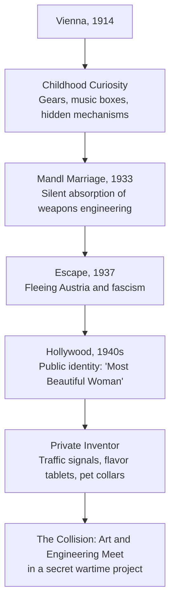
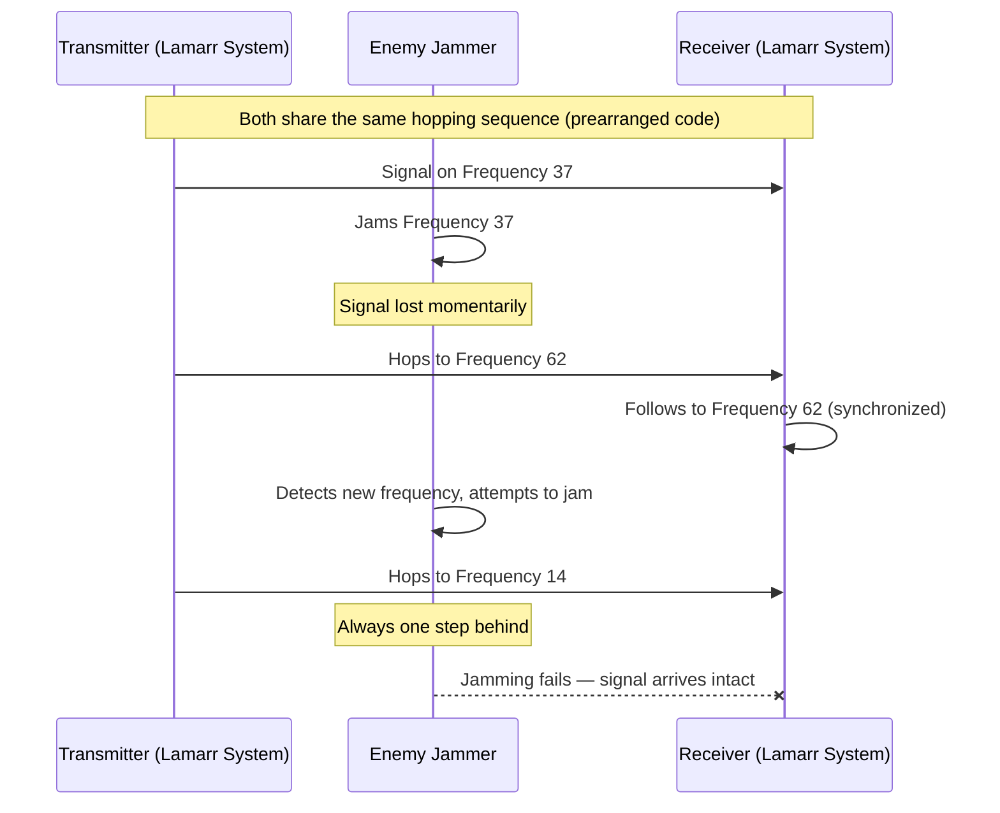
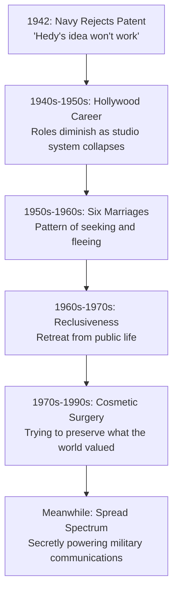
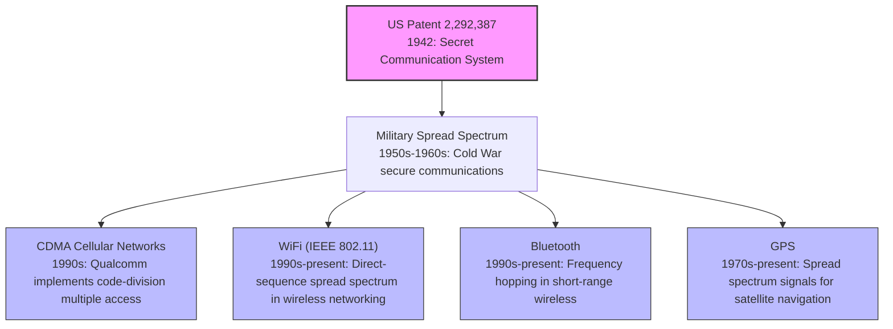

# Hedy Lamarr

## Description

Hedy Lamarr (1914–2000) was a Hollywood film star whose secret life as an inventor produced one of the most consequential technological ideas of the twentieth century. Her co-invention of frequency-hopping spread spectrum — a method of jumping radio signals across frequencies to prevent interception — became the invisible architecture beneath WiFi, Bluetooth, GPS, and CDMA cellular networks. Her life is a study in what happens when institutional prejudice collides with genuine genius, and why the most important innovations are often the ones nobody notices for decades.

## Prerequisites

- [Ada Lovelace](ada-lovelace.md) — another woman whose genius was overlooked by the institutions of her time
- [Why Study Role Models](intro/why-study-role-models.md) — the framework for extracting principles from a life

## Table of Contents

- [Origins — Vienna, Engineering, and Escape](#-origins--vienna-engineering-and-escape)
- [The Work — Frequency Hopping and the Secret Communication System](#-the-work--frequency-hopping-and-the-secret-communication-system)
- [Struggles and Failures — Rejection, Invisibility, and Decline](#-struggles-and-failures--rejection-invisibility-and-decline)
- [Legacy and Lessons — The Technology That Waited Sixty Years](#-legacy-and-lessons--the-technology-that-waited-sixty-years)

## 🌍 Origins — Vienna, Engineering, and Escape

### A Child of Contradictions

Hedwig Eva Maria Kiesler was born on November 9, 1914, in Vienna, Austria-Hungary — a city that was simultaneously the cultural capital of European high modernism and a powder keg of imperial collapse. She entered the world at the precise moment when the old order was dissolving. The Habsburg Empire would fall within weeks of her birth. The twentieth century's machinery of destruction was already in motion.

Her father, Emil Kiesler, was a bank director of Hungarian Jewish descent. Her mother, Gertrud, was a pianist from a prosperous Budapest family. The household was intellectual, secular, and comfortably bourgeois — the kind of environment where a bright child absorbed music, languages, and the expectation that one would contribute something of substance to the world.

From an early age, Hedwig displayed a mechanical curiosity that set her apart from the decorative ambitions of Viennese high society. At ten years old, she was taking apart and reassembling a music box, tracing the gears and pins that transformed mechanical motion into melody. She later recalled:

> "I was very interested in things that were invisible. Not the things you could see, but the things underneath."

This fascination with hidden mechanisms — the invisible architecture that makes visible phenomena possible — would define her life's most important work. It is the same instinct that drives a systems engineer to look past the user interface and into the protocol layer. The visible is merely the surface of the invisible.

Her father encouraged her curiosity, taking her on long walks through Vienna where he explained how things worked — streetcar systems, printing presses, the hydraulic principles behind fountain mechanics. He treated her mind as something serious, which in the gendered world of early twentieth-century Austria was itself a form of radicalism.

### The Shadow of Mandl

In 1933, at eighteen, Hedwig married Friedrich Mandl — an Austrian arms dealer and munitions magnate of enormous wealth and equally enormous controlling impulses. Mandl was forty years old, politically connected to the rising fascist movements in Europe, and intent on possessing his wife as another acquisition in his portfolio of influence.

The marriage was a prison. Mandl forbade Hedwig from pursuing any professional activity. He dragged her to business meetings where she sat silently while engineers and military officers discussed weapons systems, torpedo guidance mechanisms, and radio frequency modulation. She was expected to be ornamental — a beautiful wife at the arm of a powerful man.

But Hedwig listened. She absorbed the technical language of wireless communication, the principles of frequency modulation, and the tactical problem of radio-controlled weapons: any signal transmitted on a single frequency could be jammed by an enemy who knew which frequency to target. The problem was clear. The solution was not — yet.

The marriage lasted four years before Hedwig made a decision that would define her future. In 1937, she arranged her escape from Austria — some accounts say she drugged her maid, dressed in the maid's clothes, and fled to Paris with a jewels sewn into her undergarments. The story has the flavor of self-mythologizing, but the essential fact is real: she left behind a wealthy, dangerous husband and an Austria that was rapidly becoming uninhabitable for anyone of Jewish heritage.

She would never return to Vienna.

The Vienna that Lamarr left behind was a city in the process of self-destruction. Within a year of her departure, Austria would be absorbed into the Third Reich through the Anschluss. The Jewish intellectual class that had produced Freud, Mahler, and the Vienna Circle was scattered across the globe — some to safety, many to death. Lamarr's escape was not merely a personal liberation. It was a survival, and the knowledge of what she had survived would shadow her for the rest of her life.

### Hollywood and the Construction of a Public Self

From Paris, Hedwig Kiesler traveled to London, where she met Louis B. Mayer, the co-founder of Metro-Goldwyn-Mayer. Mayer offered her a contract. She negotiated fiercely — a skill she had sharpened during years of navigating Mandl's world — and secured favorable terms, including the right to choose her own roles, a concession unusual for women in the studio system.

She adopted the name Hedy Lamarr, at Mayer's suggestion, to sound more "American" and to distinguish herself from the actress Hedwig Kessler.

The name itself was an act of reinvention. Hedy Lamarr was not Hedwig Kiesler. She was a construction — a public identity designed for consumption by the American film-going public. This duality between the public performer and the private thinker would persist for the rest of her life.

In Hollywood, Lamarr became one of the most celebrated actresses of the 1940s. She was marketed as "the most beautiful woman in the world" — a designation that simultaneously elevated and diminished her. Studios controlled her image, her roles, her public appearances. She was beautiful, and beauty in the studio system was a cage as effective as any Mandl had constructed.

But Lamarr's mind never stopped working. Between filming schedules, she tinkered. She sketched designs for an improved traffic stoplight. She developed a carbonated drink tablet that could flavor water — a precursor to Alka-Seltzer-style dissolving tablets. She experimented with a fluorescent pet collar for dogs and a modified shoelace that could be tied with one hand.

None of these inventions were patented. None of them brought her recognition. They were the private exercises of a mind that could not stop solving problems, even when the world insisted she had nothing to solve.

The gap between what Lamarr was allowed to be and what she actually was constituted a form of exile that many creative people recognize but few experience so acutely. She was exiled from her own intellect by a culture that could only see her face. This exile was not geographic — she had already survived a literal exile from Austria — but ontological. The world insisted on a version of her that was smaller than the truth, and she was powerless to correct the record because the institutions that controlled public narrative had already rendered their verdict.

The developer who has ever been told that their contribution is "just" frontend work, or "just" documentation, or "just" design — who has had the substance of their thinking reduced to the category of their role — will recognize the shape of this experience. The reduction is not merely annoying. It is structurally damaging because it prevents the person from operating at the full range of their capability. Lamarr could not publish technical papers. She could not attend engineering conferences. She could not collaborate with scientists. The categories that governed her public life foreclosed the activities that would have allowed her genius to flourish.

### The Wartime Context

It is important to understand the urgency that surrounded Lamarr's invention. By 1941, when she and Antheil filed their patent, the war was consuming lives at an industrial scale. The Battle of the Atlantic had become the longest continuous military campaign of World War II. German U-boats were sinking Allied merchant ships at rates that threatened to sever the supply lines between North America and Britain.

The technical problem was acute. Torpedo guidance systems existed, but they were vulnerable. A radio-controlled torpedo transmitted its guidance signal on a single frequency. An enemy vessel detecting that signal could broadcast interference on the same frequency, disrupting the guidance and causing the torpedo to miss its target. In naval warfare, where a single torpedo could determine the fate of a ship carrying hundreds of lives, the vulnerability was not theoretical. It was lethal.

Lamarr's contribution was not merely technical. It was driven by moral urgency. She had fled fascism. She had family members still in Europe. The war was not an abstraction for her — it was a machine that was destroying the world she had known, and she wanted to help stop it. The intersection of personal stakes and technical capability is what gave the invention its particular character: it was not an academic exercise but a wartime improvisation by someone who understood both the problem and its human cost.

## 🔬 The Work — Frequency Hopping and the Secret Communication System

### The Problem of the Jammable Torpedo

The genesis of Lamarr's most important invention lay in a specific wartime problem. In 1940, the Battle of the Atlantic was devastating Allied shipping. German U-boats were sinking merchant vessels at catastrophic rates. The Allies desperately needed a way to guide torpedoes with precision — to steer them from a ship or plane to their target without the torpedo's control signal being intercepted and jammed by the enemy.

The technology existed. Radio-controlled torpedoes could be directed toward a target by transmitting a signal on a fixed frequency. The problem was that the Germans could detect this signal and broadcast interference on the same frequency, rendering the torpedo blind. A single-frequency guidance system was a single point of failure.

Lamarr knew this problem intimately. She had heard Mandl's engineers discuss it during the armaments meetings she was forced to attend years earlier. The knowledge had been sitting in her mind, latent, waiting for the right context to activate.

### George Antheil and the Player Piano

In 1940, at a dinner party in Hollywood, Lamarr met George Antheil — an avant-garde composer, writer, and self-taught engineer who had composed a piece called *Ballet Mécanique*, originally scored for sixteen synchronized player pianos. Antheil understood synchronization — the coordination of multiple independent mechanical systems operating in concert.

Lamarr described the torpedo jamming problem. Antheil immediately grasped the analogy to his work with player pianos. If multiple pianos could be synchronized to play the same composition by using identical punched-paper rolls, then multiple radio frequencies could be synchronized to carry the same signal — with the advantage that an enemy would need to jam all frequencies simultaneously rather than just one.

The insight was elegant: instead of transmitting on a single frequency, the transmitter and receiver would both hop among eighty-eight frequencies in a predetermined pattern, synchronized by identical mechanisms. An enemy who jammed one frequency would lose the signal for only a fraction of a second before both transmitter and receiver jumped to the next frequency in the sequence. The jammer would need to blanket the entire radio spectrum simultaneously — a practically impossible feat with 1940s technology.

### The Patent

Lamarr and Antheil filed their patent application on June 10, 1941. It was granted on August 11, 1942, as **U.S. Patent 2,292,387** — "Secret Communication System."

The patent described a system in which:

1. The transmitter and receiver would each contain identical frequency-hopping mechanisms.
2. The hopping sequence would be determined by a prearranged code — essentially a shared secret between sender and receiver.
3. The synchronization mechanism would ensure that both transmitter and receiver hopped to the same frequency at the same time.
4. An enemy interceptor, not knowing the hopping sequence, would be unable to follow the signal across frequencies.
5. A jammer attempting to disrupt the signal on any single frequency would only cause momentary signal loss before the system moved to the next frequency.

The technical specification was remarkable in its clarity. Consider the elegance of the core principle:

> The transmitter and receiver shall both contain mechanisms for changing the frequency of transmission at regular intervals, said mechanisms being synchronized to ensure that both transmitter and receiver are on the same frequency at any given time.

This is the foundational principle of what would later be called **spread spectrum** communication — the idea that spreading a signal across a wide range of frequencies makes it more resilient, more secure, and more resistant to interference than concentrating it on a single frequency. The concept was counterintuitive: conventional wisdom held that concentrating power on a single frequency was the most efficient way to communicate. Lamarr and Antheil proposed the opposite.

### The Synchronization Mechanism

The patent specified that the frequency-hopping mechanism would be driven by perforated paper rolls — directly analogous to the rolls used in player pianos. Each roll contained a pattern of holes that determined the frequency sequence. When the holes aligned with electrical contacts, they triggered frequency changes in the transmitter and receiver.

This mechanical implementation was a product of its era. The paper-roll concept was practical in 1942, but it was cumbersome. The rolls had to be physically manufactured, distributed, and loaded into both the transmitter and receiver. If a roll was captured by the enemy, the hopping sequence was compromised.

The paper-roll mechanism would later be replaced by electronic pseudorandom number generators — a development that Lamarr and Antheil could not have anticipated, but which validated the underlying principle while improving the implementation. The concept was sound; the implementation simply needed to evolve with technology. This is itself a lesson in the nature of invention: the hardest part is not building the final system. It is articulating the principle that makes the final system possible. Lamarr articulated the principle. Others built the systems. Both contributions are essential, but only one of them required the original insight.

The distinction between articulating a principle and implementing a system is worth dwelling on. In software engineering, this distinction manifests as the difference between architecture and code. An architect who designs a distributed system's consensus protocol has done something qualitatively different from the engineer who writes the implementation. The architect's contribution is conceptual: they have defined the space of possible solutions. The engineer's contribution is practical: they have navigated that space to produce a working system. Both are necessary. But the architect's insight constrains and enables everything that follows. Lamarr was the architect. The Navy's engineers, and later Qualcomm's engineers, were the implementers.

### What the Patent Actually Achieved

The patent described, in embryonic form, several concepts that would become foundational to modern wireless communication:

| Concept in Patent | Modern Implementation |
|---|---|
| Frequency hopping across 88 frequencies | Direct-sequence spread spectrum (DSSS) |
| Shared secret sequence between transmitter and receiver | Cryptographic key exchange |
| Synchronized hopping mechanisms | Clock synchronization protocols |
| Resistance to jamming on individual frequencies | Anti-interference in WiFi and cellular networks |
| Spread signal across wide bandwidth | CDMA (Code Division Multiple Access) |

The 88 frequencies in the patent corresponded to the 88 piano keys — a whimsical detail that reflected Antheil's musical background but also happened to span the FM radio band. The number was both an artistic signature and a practical choice.

### Why the Concept Was Counterintuitive

The radical nature of Lamarr and Antheil's proposal deserves emphasis. In 1942, the prevailing wisdom in radio engineering was that signal strength mattered above all else. The goal was to concentrate as much power as possible on a single, well-defined frequency. A signal spread across multiple frequencies was, by conventional thinking, a weakened signal — diluted across the spectrum rather than focused on a target.

Lamarr and Antheil inverted this assumption. They recognized that the vulnerability of a concentrated signal was precisely its concentration: an enemy could target it precisely because it occupied a narrow, predictable band. By spreading the signal across many frequencies, they traded concentration for resilience. The signal on any single frequency was weaker, but the aggregate signal — hopping rapidly across the full spectrum — was virtually impossible to jam or intercept.

This inversion of conventional wisdom is a recurring feature of breakthrough innovations. The most important inventions are not merely extensions of existing approaches. They are reversals — questions that ask whether the opposite of the assumed truth might be more useful. The history of technology is littered with examples: the transistor replacing the vacuum tube, the microprocessor replacing the mainframe, the distributed network replacing the centralized server. In each case, the breakthrough required the courage to invert the prevailing assumption.

## 💔 Struggles and Failures — Rejection, Invisibility, and Decline

### "Hedy's Idea Won't Work"

In 1942, Lamarr and Antheil approached the United States Navy with their patent. The response was dismissive. The Navy declined to implement the technology. The reasons given were technical: the paper-roll synchronization mechanism was deemed impractical for the rugged conditions of naval warfare. But beneath the technical objection lay something more fundamental.

The Navy did not take Hedy Lamarr seriously. She was an actress — a movie star whose public identity was inseparable from her physical appearance. The idea that a woman whose profession was being beautiful could also be a legitimate inventor was, in the institutional culture of the 1940s military, essentially unthinkable.

The rejection stung. Lamarr later recounted:

> "They thought I was just a starlet with a pretty face. They couldn't see past the face to the idea."

This was not a singular experience. It was the defining pattern of her life's relationship with institutions. Every institution that could have recognized or rewarded her intellectual contributions — the military, the entertainment industry, the scientific establishment — had already categorized her as something else. The categorization preceded the evaluation. The label "actress" was a cognitive prison more inescapable than Mandl's house.

The Navy's rejection meant that the patent, while legally valid, was commercially dormant. Lamarr could not find anyone willing to implement the technology. She had solved a problem that the military admitted existed, produced a solution that was technically sound, and been refused because the solution came from a source that the institutional hierarchy refused to take seriously.

The bitterness of this experience cannot be overstated. It is one thing to fail because your idea is wrong. It is another to fail because the people who need your idea cannot see past who you are to recognize what you have built. The first is a technical problem. The second is a moral failure of the institutions that commit it.

### The Entanglement of Beauty and Intellectual Invisibility

Lamarr's experience reveals a structural problem that persists in various forms to this day. When a person occupies a public identity that is valued primarily for superficial characteristics — appearance, charm, likability — their intellectual contributions are systematically discounted. The public identity becomes a signal that overrides the content of their work.

This is not merely a problem of individual prejudice. It is an institutional pattern. Studios valued Lamarr for her beauty. The military valued its own officers for their rank and credentials. Neither institution had mechanisms for evaluating ideas on their merits when those ideas came from someone who did not fit the expected profile of an inventor.

The phenomenon has a name in contemporary psychology: the **halo effect** operating in reverse. The positive association with beauty creates a negative association with intellectual seriousness. The more beautiful a person is perceived to be, the less likely others are to credit them with technical competence. This is not a rational evaluation. It is a cognitive distortion — and it cost Lamarr decades of recognition.

The cost was compounded by gender. In the 1940s, the category of "inventor" was overwhelmingly male. Women in technical roles were rare, and women who were simultaneously famous for their physical appearance were essentially invisible as intellectual agents. The institutional imagination could not accommodate the combination. An actress who was also an engineer was not merely unusual — it was, in the cognitive frameworks of the era, a contradiction. The institution did not reject Lamarr's idea because it was bad. It rejected the idea because accepting it would have required the institution to revise its fundamental categories of who counts as a thinker.

This is a pattern with deep historical roots. The institution does not evaluate the idea on its merits. It evaluates the idea based on whether the idea's source fits the institution's model of a legitimate source. When the source does not fit, the idea is dismissed without serious engagement. The dismissal feels like a technical objection — "the paper-roll mechanism is impractical" — but it is actually a sociological one: "you are not the kind of person from whom we expect technical ideas."

### Post-War Decline

After the war, Lamarr's career continued to flourish in Hollywood, but the trajectory was descending. She starred in films throughout the 1940s and into the 1950s — *Samson and Delilah* (1949), *White Cargo* (1942), *The Female Animal* (1958) — but the roles diminished in quality as the studio system collapsed and the cultural moment shifted.

Her personal life was turbulent. She married and divorced six times. The marriages were brief, emotionally intense, and marked by the same pattern of seeking connection while maintaining independence that had characterized her relationship with Mandl — except now she was the one choosing to leave.

The pattern of the marriages reveals something about the cost of Lamarr's double exile — exiled from her intellect by the world, and exiled from intimacy by the controlling dynamics that Mandl had established. She wanted to be known fully, but she had learned that being known fully was dangerous. The result was a cycle of approach and retreat: intimacy followed by withdrawal, connection followed by escape. It was, in its own way, a frequency-hopping pattern — moving rapidly between states, never settling on one frequency long enough to be captured.

In the 1960s, Lamarr retreated from public life. She became increasingly reclusive, living in relative seclusion in various homes in the United States and Europe. She underwent multiple cosmetic surgery procedures — an irony that was not lost on her or on observers. The woman who had been celebrated for her beauty spent the latter decades of her life attempting to preserve or reconstruct it, as if beauty were a technology that could be maintained against the entropy of time.

She gave few interviews. She made occasional public appearances that were sometimes erratic. She sued a biographer who published an unflattering account of her life. The legal battles consumed her emotional energy and further isolated her from public life.

The tragedy of Lamarr's later years is not that she was forgotten — she was not entirely forgotten — but that the thing she most wanted to be known for, her invention, remained invisible. She had solved a problem that would underpin the communication infrastructure of the twenty-first century, and the world continued to see her only as a face.

There is a particular cruelty in being celebrated for the wrong thing. Lamarr was praised, photographed, and memorialized for her beauty — the quality she valued least in herself. The world saw a surface and refused to look beneath it. Every compliment on her appearance was, from her perspective, a confirmation of her invisibility. The more beautiful she was perceived to be, the less visible her mind became. This is the paradox at the center of her life: the very quality that made her famous was the quality that made her genius unknowable.

### The Irony of the Cold War

The deepest irony of Lamarr's post-war obscurity is that her invention was being used — she just did not know it.

In the 1950s and 1960s, the U.S. Navy developed communication systems that incorporated spread-spectrum principles. The technology was used in secure military communications during the Cold War. The connection to Lamarr's patent was either unknown or deliberately ignored. The Navy had rejected the patent in 1942. Fifteen years later, engineers working on classified military projects arrived at the same solution independently — and the Navy implemented it without acknowledging the origin.

Lamarr learned about this secondhand. The realization that her rejected idea was being used by the very institution that had dismissed it was a source of profound frustration. She had not received royalties. She had not received recognition. The patent had expired in 1959, seventeen years after it was granted, and she had never earned a cent from it.

The experience is a case study in the economics of innovation without institutional support. A patent is only as valuable as the willingness of institutions to license and implement it. When those institutions refuse to engage with the inventor — whether through prejudice, bureaucratic inertia, or willful ignorance — the patent becomes a historical artifact rather than a commercial asset. Lamarr had the legal protection. She lacked the institutional respect necessary to make that protection meaningful.

### What Lamarr Lost

The full measure of what Lamarr lost to institutional blindness cannot be calculated, but it can be approximated. Had the Navy implemented her patent in 1942, she would have received royalties on every system that used the technology. The military applications alone would have been worth millions. The civilian applications — WiFi, Bluetooth, CDMA — would have been worth billions. She died in modest circumstances, supported by Social Security and occasional royalty checks from a small number of minor patents. The gap between what she earned and what her ideas were worth is one of the largest in the history of technology.

But the loss was not merely financial. It was also professional. Had the Navy taken her seriously, Lamarr might have transitioned from acting into engineering or defense research. She had the aptitude, the curiosity, and the knowledge base. The institutional rejection foreclosed an entire dimension of her potential life. She remained an actress because the world would not let her be anything else — not because she lacked the capacity, but because the capacity was invisible behind the face.

This is the deepest cost of institutional blindness: it does not merely delay recognition. It forecloses futures. It prevents people from becoming what they might have become. The developer who is never given the opportunity to lead, the researcher whose proposals are never funded, the engineer whose architectural insights are dismissed because of their title — all of them are experiencing a version of what Lamarr experienced. The future that might have existed is not merely delayed. It is prevented.

## 🌟 Legacy and Lessons — The Technology That Waited Sixty Years

### The Spread Spectrum Revolution

The principles described in Lamarr and Antheil's 1942 patent became the foundation for a series of communication technologies that define the modern world:

**WiFi** uses direct-sequence spread spectrum (DSSS) and frequency-hopping spread spectrum (FHSS) to transmit data across the 2.4 GHz and 5 GHz bands. Every time a device connects to a wireless network, it is using a principle that Lamarr and Antheil articulated in 1942.

**Bluetooth** uses frequency hopping — hopping across 79 channels, 1,600 times per second. The conceptual lineage from Lamarr's 88-frequency patent is direct and unmistakable.

**CDMA** (Code Division Multiple Access), the technology behind 3G cellular networks, uses spread-spectrum principles to allow multiple users to share the same frequency band simultaneously. Qualcomm developed CDMA in the 1980s and 1990s, building on decades of spread-spectrum research that traces back, through military applications, to Lamarr's patent.

**GPS** satellites transmit spread-spectrum signals. The technique allows multiple satellites to share the same frequency band without interfering with each other, and it makes GPS signals resistant to jamming — precisely the property that Lamarr and Antheil had described.

### Recognition at Last

In 1997, at the age of eighty-two, Lamarr received the Electronic Frontier Foundation (EFF) Pioneer Award. It was the first significant public recognition of her contribution to technology. She was unable to attend the ceremony in person, but she released a statement:

> "It's about time."

The recognition was bittersweet. It came fifty-five years after the patent was granted, thirty-eight years after the patent expired, and three years before her death. She had spent most of her adult life as an inventor without acknowledgment. The Pioneer Award did not restore the royalties she had never earned or the career opportunities that her unrecognized genius might have opened.

In 2014, fourteen years after her death, Lamarr was inducted into the **National Inventors Hall of Fame** in Alexandria, Virginia. The induction ceremony took place sixty-two years after the patent was granted. The delay was not merely a matter of institutional slowness. It was a measure of how thoroughly the categories of "actress" and "inventor" had been treated as mutually exclusive — and how long it took for the institutional imagination to encompass the possibility that one person could be both.

### The Lesson of Interdisciplinary Thinking

Lamarr's invention was not the product of specialized training in electrical engineering or radio physics. It was the product of a mind that absorbed information across domains — weapons engineering from Mandl's meetings, synchronization principles from Antheil's music, and the tactical problem of radio jamming from wartime urgency — and synthesized these into a novel solution.

The lesson is not that formal training is unnecessary. It is that the most consequential innovations often occur at the intersection of disciplines that the institutions of a given era treat as separate. Lamarr could see the connection between player pianos and torpedo guidance because she had no institutional investment in the boundary between music and weapons engineering. The boundary was artificial. Her mind ignored it.

This is a pattern that recurs throughout the history of technology:

| Innovator | Intersection |
|---|---|
| Ada Lovelace | Mathematics and poetry (Babbage's engines) |
| Alan Turing | Philosophy and mathematics (computation) |
| Grace Hopper | Linguistics and engineering (compilers) |
| Hedy Lamarr | Music and weapons engineering (spread spectrum) |
| Steve Jobs | Calligraphy and computing (typography in GUIs) |

The implication for developers and engineers is practical: breadth of knowledge is not a distraction from depth. It is a precondition for the kind of cross-domain synthesis that produces genuinely novel solutions. The specialist knows what exists. The interdisciplinary thinker knows what could exist.

### The Lesson of Institutional Blindness

The second lesson of Lamarr's life concerns the cost of institutional blindness. The U.S. Navy's rejection of her patent was not a minor historical footnote. It delayed the adoption of spread-spectrum technology by years, potentially at the cost of lives — the technology could have been deployed in World War II naval communications, where jamming was a real and deadly problem.

Institutional blindness takes many forms:

- **Credentialism**: evaluating ideas based on the credentials of the person presenting them rather than the merit of the ideas themselves.
- **Categorization**: assigning people to roles ("actress," "engineer," "manager") and then refusing to recognize contributions that fall outside those roles.
- **Confirmation bias**: seeing only what the institution expects to see and filtering out everything else.

These patterns are not historical curiosities. They operate in every organization, in every era, in every industry. The developer who is told that their idea is "not technical enough" because they are a designer. The researcher who is dismissed because their institution does not publish in that subfield. The junior engineer whose proposal is ignored because they lack the title to match the ambition.

Lamarr's life is evidence that institutions routinely reject the very innovations they later depend on — and that the cost of this rejection falls disproportionately on those who do not fit the institution's mental model of who an innovator can be.

The practical implication for anyone building systems, organizations, or teams is that institutional blindness is not a problem that solves itself. It requires deliberate countermeasures: blind review processes, idea meritocracy, cross-functional collaboration, and a conscious effort to separate the evaluation of an idea from the identity of its proposer. These are not nice-to-have cultural values. They are structural protections against the kind of costly error that the Navy committed in 1942.

### The Lesson of Invisible Impact

Perhaps the most profound lesson of Lamarr's life is that the most important work a person does may never be recognized in their lifetime. Lamarr died on January 19, 2000, in Casselberry, Florida. She was eighty-five years old. She had spent her final years in modest circumstances, largely forgotten by the public that had once celebrated her beauty.

Meanwhile, the technology she had invented was being deployed billions of times per day. Every smartphone, every laptop, every wireless router, every Bluetooth headset, every GPS navigation system was executing the principle she had described in 1942. The scale of her impact was inversely proportional to the recognition she received for it.

This is not a comfortable lesson. It suggests that the relationship between effort and recognition, between genius and reward, is not merely imperfect but structurally broken in many cases. The universe does not guarantee that important work will be visible. The world does not automatically assign credit to its originators. Sometimes the most consequential contributions are made by people whose names are known only to specialists and historians.

For the developer, the engineer, the builder — this lesson carries a double edge. It is a warning that your most important work may go unrecognized. But it is also a liberation: you are free to work on what matters, regardless of whether the world notices. The value of the work is not contingent on the recognition. The technology works whether or not the world knows who invented it.

There is a particular quality to work done without the expectation of recognition. It is purer in some sense — motivated not by the prospect of reward or acclaim, but by the conviction that the problem is worth solving. Lamarr continued inventing even after the Navy's rejection, even after it became clear that her contributions would not be acknowledged. She was not working for the world's approval. She was working because her mind demanded it. This is the kind of integrity that produces the most durable work: work that exists because it must, not because someone is watching.

The history of technology is populated by such work. Tim Berners-Lee did not patent the World Wide Web. He gave it away freely, because he believed the protocol was more important than the profit. Linus Torvalds built Linux not for personal enrichment but because the tool needed to exist. In each case, the work preceded the recognition by years or decades. The pattern suggests that the most important innovations are not market-driven. They are need-driven — driven by a perception of what the world requires, offered before the world knows how to value it.

### The Theological Dimension

There is something in Lamarr's story that resonates beyond the merely biographical. She lived as if her ideas had value independent of the world's willingness to acknowledge that value. She continued inventing long after the world told her she was only a face. This persistence — this insistence on the dignity of one's own mind in the face of systematic dismissal — reflects a conviction that human worth is not contingent on external validation.

The theological tradition that undergirds this narrative is one in which every person bears inherent dignity, not because of what they produce or how they are perceived, but because of what they are. Lamarr's life, read through this lens, is a testament to the refusal to accept a diminished account of one's own nature. She knew she was more than her face. She acted on that knowledge. The world eventually caught up — sixty-two years late.

The narrative of redemption that runs through this tradition is not the redemption of public acclaim. It is the redemption of truth — the idea that what is real will eventually assert itself against what is merely assumed. Lamarr's invention was real. Her genius was real. The world's failure to see it was an error, not a verdict. The truth did not change because the world ignored it. It simply waited.

There is consolation in this, though it is a hard consolation. The developer who builds something true and watches it go unrecognized can take comfort in the possibility that truth has its own timeline. The work endures. The recognition may or may not arrive. But the work endures. And in the end, the work is what matters — not the applause, not the royalties, not the induction into halls of fame. The work is the thing that outlasts the builder, and it carries within it the proof of the builder's worth, whether or not the world chooses to read that proof.

This is, finally, the deepest lesson of Hedy Lamarr's life: that dignity is not conferred by institutions. It is inherent. It cannot be revoked by rejection, by invisibility, by sixty-two years of silence. It persists in the work itself — in the patent that describes a principle, in the idea that outlives its inventor, in the technology that touches every life on earth without any of those lives knowing the name of the woman who imagined it first.

## 📝 Learning Tips

- **Read the patent.** U.S. Patent 2,292,387 is publicly available and remarkably readable. The core concept can be understood without specialized engineering knowledge. Reading primary sources is a habit that separates deep learners from surface learners.

- **Map the connections.** Draw your own diagram connecting Lamarr's musical analogy (player pianos) to the engineering solution (frequency hopping). Cross-domain thinking is a skill that improves with practice.

- **Study the rejection.** The Navy's rejection of the patent is as instructive as the patent itself. When you encounter institutional resistance to an idea, ask: "Is the objection technical, or is it sociological?" This distinction matters for deciding whether to persist or redirect.

- **Trace the lineage.** Follow the chain from Lamarr's patent to modern WiFi and Bluetooth. Understanding how ideas evolve across decades and through multiple implementers gives you a sense of how technology actually develops — not in isolated eureka moments, but through cumulative, iterative work.

- **Consider the implementation gap.** Lamarr articulated a principle. Others implemented it. Ask yourself: which of your own ideas are principled but unimplemented? The gap between articulation and implementation is where most of the world's useful work happens. Closing that gap — either by implementing your own ideas or by enabling others to implement them — is the practical obligation that follows from having an insight.

- **Compare with other overlooked innovators.** Read the biography of [Ada Lovelace](ada-lovelace.md) alongside this one. The patterns of institutional dismissal — credentialism, categorization, confirmation bias — repeat across centuries and across genders. Recognizing these patterns is the first step toward building institutions that do not commit them.

- **Identify your own invisible work.** Consider which of your contributions might be undervalued by the institutions you inhabit. This is not an exercise in self-pity. It is an exercise in strategic clarity: understanding how the world perceives you allows you to either correct the perception or redirect your energy toward work that will be valued.

- **Discuss Lamarr with a colleague.** The story of her life is not merely biographical. It is a case study in institutional design, cognitive bias, and the economics of innovation. These are engineering problems, not just historical ones. Treating them as engineering problems — with the same rigor you would apply to a system design review — is how biographical learning becomes actionable.

## Glossary

| Term | Definition |
|---|---|
| Frequency hopping | A method of transmitting radio signals by rapidly switching the carrier frequency among many channels, following a predetermined sequence shared by transmitter and receiver |
| Spread spectrum | A technique in which a signal is transmitted across a bandwidth wider than the minimum necessary, providing resistance to interference and interception |
| Jamming | The deliberate transmission of radio signals to disrupt or block communication on a specific frequency |
| CDMA (Code Division Multiple Access) | A cellular network technology that allows multiple users to share the same frequency band by assigning unique codes to each user's signal |
| DSSS (Direct-Sequence Spread Spectrum) | A spread-spectrum technique in which the transmitted signal is spread across a wide bandwidth using a pseudorandom code |
| FHSS (Frequency-Hopping Spread Spectrum) | A spread-spectrum technique in which the carrier frequency hops among many channels in a pseudorandom sequence |
| Synchronization | The coordination of two or more systems to operate in temporal alignment — in Lamarr's system, ensuring transmitter and receiver hop to the same frequency at the same time |
| Halo effect | A cognitive bias in which the perception of one positive trait (e.g., beauty) influences the perception of other traits (e.g., intelligence) |
| Pseudorandom sequence | A sequence of values that appears random but is generated by a deterministic algorithm, allowing both transmitter and receiver to reproduce the same sequence |
| Patent | A legal grant of exclusive rights to an invention for a limited period, in exchange for public disclosure of the invention's details |
| Bandwidth | The range of frequencies used to transmit a signal — a wider bandwidth allows more data but requires more spectrum |
| Interference | The disruption of a radio signal by other signals operating on the same or adjacent frequencies, whether intentional (jamming) or unintentional |
| Electronic Frontier Foundation (EFF) | A nonprofit organization founded in 1990 to defend civil liberties in the digital world — the body that first publicly recognized Lamarr's contribution in 1997 |
| Battle of the Atlantic | The longest continuous military campaign of World War II (1939–1945), in which Allied and German forces contested control of Atlantic shipping routes — the theater that motivated Lamarr's invention |
| Anschluss | The annexation of Austria by Nazi Germany in March 1938 — the political event that made Lamarr's native Vienna uninhabitable for Jewish families |
| Spread-spectrum communication | A class of wireless communication techniques in which the signal is deliberately spread across a bandwidth wider than the information bandwidth, providing resilience against interference and interception |
| Ontological exile | A condition in which a person is excluded from the exercise of their own essential nature by external forces — being prevented from being what one truly is, not by lack of ability but by the refusal of others to recognize it |
| Royalty | A payment made to an inventor or patent holder for each use or implementation of their patented technology, typically calculated as a percentage of revenue |

## Quick References

- [U.S. Patent 2,292,387 — Secret Communication System](https://patents.google.com/patent/US2292387) — the original Lamarr-Antheil patent, publicly accessible
- [Electronic Frontier Foundation — Pioneer Award (1997)](https://www.eff.org/) — the award that first recognized Lamarr's technological contribution
- [National Inventors Hall of Fame — Hedy Lamarr](https://www.invent.org/inductees/hedy-lamarr) — her 2014 induction profile
- [Smithsonian Magazine — "The Forgotten Inventor Behind WiFi"](https://www.smithsonianmag.com/) — a comprehensive biographical article
- [Spread Spectrum Scene — Technical History](http://www.sss-mag.com/) — a technical resource documenting the history of spread-spectrum technology
- [IEEE — "The Surprising Story of Hedy Lamarr"](https://spectrum.ieee.org/) — an engineering perspective on the patent's technical significance
- [Rachel Brosnahan — *Hedy Lamarr: An Incredible Life* (2020)](https://www.goodreads.com/) — a recent biography that draws on newly available archival material

## Next Steps

- [Margaret Hamilton](margaret-hamilton.md) — who fought the same institutional resistance decades later, this time in software engineering and the Apollo program
- [Ada Lovelace](ada-lovelace.md) — the first person to see computation as something beyond mere calculation
- [Alan Turing](alan-turing.md) — whose theoretical work on computation and codebreaking parallels Lamarr's blend of abstract thinking and wartime application
- [Why Study Role Models](intro/why-study-role-models.md) — the framework for extracting principles from the lives of others
