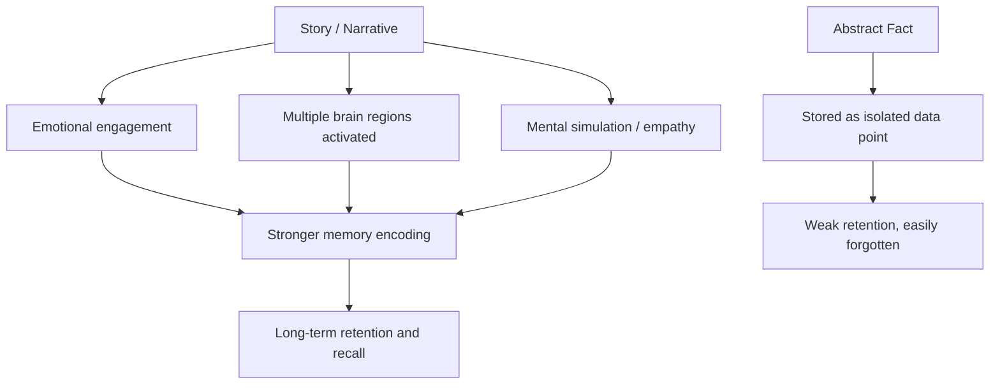
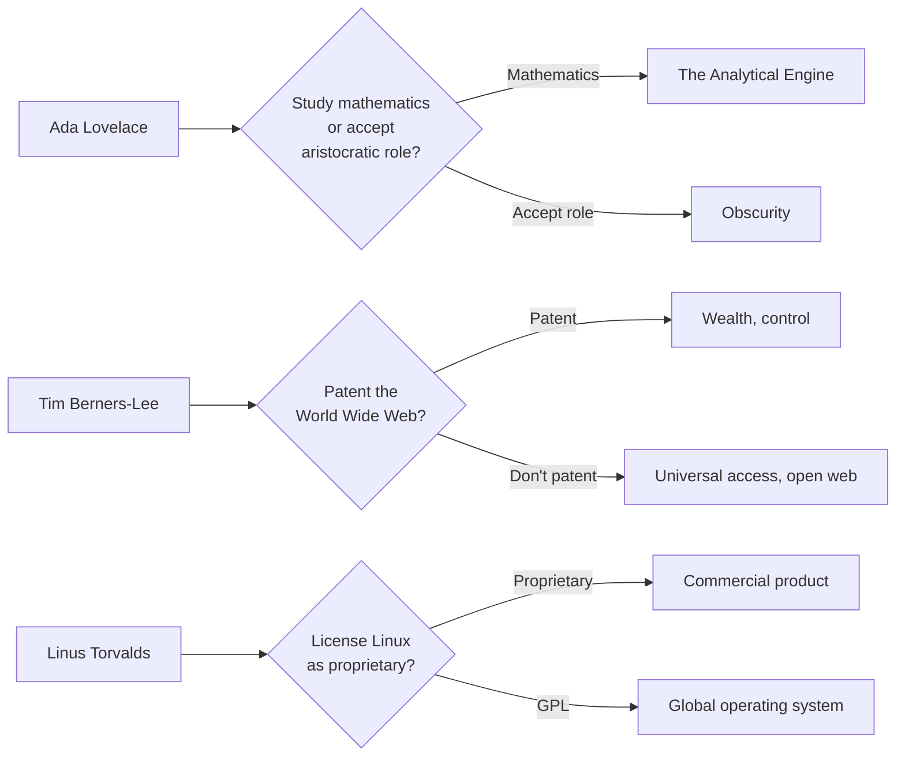
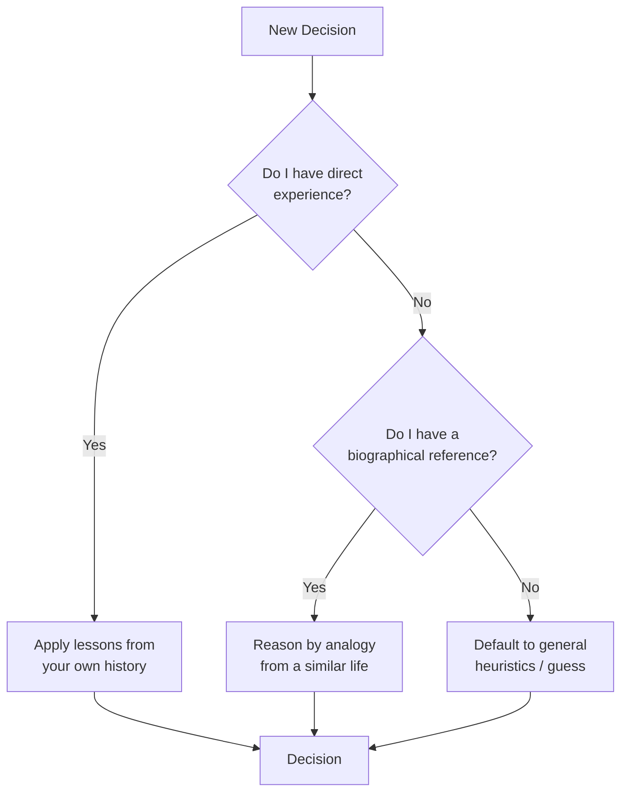
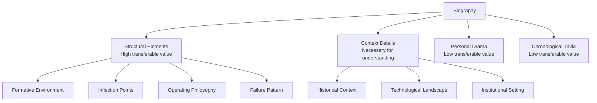
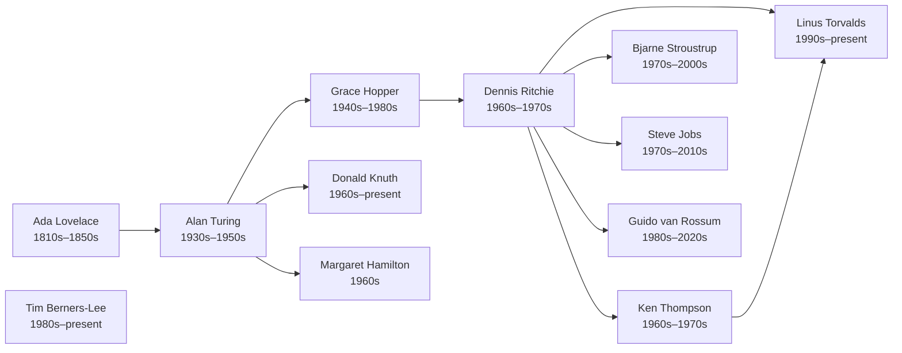

# Why Study Role Models

## Description

Before examining individual lives, one must understand why biographical learning is a legitimate and powerful development strategy. Studying the trajectories of those who shaped technology is not imitation — it is pattern recognition, a way of compressing decades of wisdom into navigable maps.

## Prerequisites

- [The Level-Up Philosophy](../intro/the-level-up-philosophy.md) — framing life as deliberate growth
- [What Are the Fundamentals](../fundamentals/intro/what-are-the-fundamentals.md) — self-awareness and mental models

## Table of Contents

- [The Nature of Biographical Learning](#-the-nature-of-biographical-learning)
- [The Biographical Method](#-the-biographical-method)
- [Why Role Models Matter](#-why-role-models-matter)
- [What Biographies Cannot Teach](#-what-biographies-cannot-teach)
- [The Developer's Unique Relationship with History](#-the-developers-unique-relationship-with-history)
- [What to Look For in a Life](#-what-to-look-for-in-a-life)
- [The Danger of Hero Worship](#-the-danger-of-hero-worship)
- [How to Read These Biographies](#-how-to-read-these-biographies)

## 🧭 The Nature of Biographical Learning

Biography is not gossip. It is not entertainment. It is the study of how real people navigated real constraints — talent, luck, failure, timing, geography, and moral choice — to produce extraordinary outcomes.

When a software engineer reads about Dennis Ritchie, they are not learning to code in C. They are learning how a quiet, methodical thinker reshaped the entire computing landscape by choosing elegance over expedience. When they read about Margaret Hamilton, they are not learning software engineering practices. They are learning how conviction in the face of institutional skepticism can save lives.

Biographical learning works because it operates on multiple cognitive levels simultaneously:

| Level | What You Absorb | Example |
|---|---|---|
| **Factual** | Dates, events, technologies | Turing invented the Bombe in 1940 |
| **Strategic** | Decisions, trade-offs, sequences | Hamilton prioritized error handling over performance |
| **Emotional** | Resilience, doubt, persistence | Torvalds endured years of criticism before Linux stabilized |
| **Moral** | Integrity, sacrifice, legacy | Berners-Lee chose not to patent the World Wide Web |

Most technical education operates only at the first level. Biographical education reaches all four.

### Why Standard Education Falls Short

The curriculum you encountered in school — whether a computer science degree, a bootcamp, or self-taught courses — was designed to teach you *what* to do. It teaches algorithms, data structures, frameworks, design patterns. It does not teach you *how to think* when the problem is ambiguous, the stakes are high, and the right answer does not exist in any textbook.

This is the gap that biographical learning fills. It provides the decision-making layer that sits beneath technical knowledge. Consider the difference:

| What Standard Education Teaches | What Biographical Learning Teaches |
|---|---|
| How to implement a hash table | Why Ritchie chose C's type system the way he did |
| How to write a recursive function | Why Knuth spent decades on one book instead of chasing trends |
| How to use version control | Why Torvalds built Git after a disastrous code merge |
| How to deploy to production | Why Berners-Lee refused to commercialize his invention |

The left column makes you employable. The right column makes you wise. Both matter, but only one compounds over a lifetime.

### The Neuroscience of Narrative Learning

The human brain is not optimized for abstract instruction. It is optimized for stories. Evolutionary pressure over hundreds of thousands of years shaped our cognition around narrative: characters, motivations, conflicts, resolutions. When you encounter information embedded in a story, your brain processes it differently than when you encounter the same information as a fact.

Neuroscience research confirms this. Narrative-based learning activates multiple brain regions simultaneously — not just the language centers, but the motor cortex, the olfactory bulb, and the emotional centers of the amygdala. A story about Ada Lovelace envisioning computation as something beyond calculation engages your imagination in a way that a textbook definition of "algorithm" never will. The information becomes sticky because it is woven into a web of associations, emotions, and mental images.



This is why you remember the stories of people you admire long after you have forgotten the specifications of the technologies they built. The story is the delivery mechanism. The principle is the payload.

## 🔧 The Biographical Method

Biographical learning is not passive consumption. It is a structured method — a discipline with specific techniques that maximize the extraction of transferable wisdom from a life. Without a method, reading biographies is entertainment. With a method, it becomes a developmental tool.

### Step 1: Map the Context

Every person who made a significant contribution did so within a specific historical, cultural, and technological context. Before analyzing their decisions, understand the constraints and possibilities that existed at the time.

Consider Dennis Ritchie creating the C language in the early 1970s. The context was not merely "computing existed." The context included:

- PDP-11 minicomputers with limited memory and processing power
- Assembly language as the dominant systems programming language
- The Multics project's failure, which created both a cautionary tale and an opportunity
- A small, tight-knit research community at Bell Labs where informal collaboration was the norm
- No internet, no open-source movement, no Stack Overflow — every design decision had to be reasoned from first principles

Without understanding this context, you might attribute Ritchie's choices to genius alone. With the context, you can see that his choices were *rational responses to real constraints* — and you can ask what rational responses to your own constraints might look like.

| Context Factor | Ritchie's Constraint | Your Likely Constraint |
|---|---|---|
| **Hardware** | PDP-11 with 64KB memory | Cloud computing with effectively unlimited resources |
| **Language landscape** | Assembly, Fortran, COBOL | TypeScript, Python, Rust, Go — dozens of viable options |
| **Community** | Small Bell Labs team | Global internet community, millions of developers |
| **Feedback cycle** | Weeks to test on hardware | Seconds to run tests locally |
| **Economic pressure** | Bell Labs funded research | Startup/corporate pressure to ship quickly |

Understanding context prevents the most common error in biographical learning: the blind transplantation of another person's decisions into your own radically different environment.

### Step 2: Identify the Decision Points

A life is not a smooth curve. It is a series of decision points — moments where the path forked and a choice was made. The biography becomes most valuable when you identify these forks and examine why the person chose as they did.

Every biography in this module contains such forks:



When you study these decision points, you are not learning what to do. You are learning *how to think* about high-stakes choices where the consequences are uncertain and the information is incomplete. This is the thinking skill that technical education never teaches and that every developer needs.

### Step 3: Extract Principles, Not Rules

The goal of biographical learning is not to derive rules to follow blindly. It is to extract *principles* — transferable patterns of reasoning that can be adapted to new contexts.

A rule says: "Never patent your inventions." A principle says: "Consider whether hoarding knowledge serves or undermines your deeper objectives." A rule says: "Always choose elegance over expedience." A principle says: "The long-term cost of a shortcut is often greater than the short-term cost of doing it right — but you must be able to afford the short-term cost."

```python
# Rules vs. Principles — different abstraction levels
class Rule:
    """A rule is context-specific and brittle."""
    def apply(self, situation):
        return self.action  # always the same

class Principle:
    """A principle is context-adaptive and resilient."""
    def apply(self, situation, constraints, values):
        reasoning = self.reflect(situation, constraints, values)
        return reasoning.action  # adapted to context

    def reflect(self, situation, constraints, values):
        # The principle provides direction; judgment provides specifics
        return Reasoning(
            direction=self.core_idea,
            adaptation=situation.contextualize(self.core_idea),
            constraints=constraints.filter(self.core_idea),
            values=values.prioritize(self.core_idea)
        )
```

The difference matters because rules break when context changes. Principles bend. The biographies in this module are designed to produce principles — reasoning tools that survive transplantation to environments the original person never imagined.

### Step 4: Write It Down

The act of writing about what you have read transforms passive absorption into active learning. After reading each biography, spend ten minutes writing:

1. **Three decisions that surprised you.** Why did they surprise you? What assumption of yours did they violate?
2. **Two principles you want to adopt.** How would these principles change your behavior this week?
3. **One mistake you are at risk of repeating.** What in this person's failure pattern resonates uncomfortably with your own?

This simple writing practice — a form of reflective journaling — has robust empirical support. Writing forces you to articulate what you think you learned, which reveals gaps in your understanding. It converts the vague feeling of "that was interesting" into concrete, actionable insights.

## 💡 Why Role Models Matter

A role model is not a perfect person to be copied. It is a reference point — a lived example that makes abstract virtues concrete.

Consider the virtue of persistence. Abstractly, persistence is easy to affirm. But persistence becomes tangible when you read that Donald Knuth has been writing *The Art of Computer Programming* since 1962 — over sixty years — and has never considered the work finished. The abstract concept acquires weight, texture, and a face.

Role models serve several specific functions in personal development:

### They Compress Time

A biography compresses decades of experience into hours of reading. You do not need to fail at building a company to learn from Steve Jobs' failures. You do not need to be prosecuted for your identity to understand the cost of Alan Turing's courage. The compression ratio is extraordinary — centuries of collective wisdom available in afternoons.

The compression works because human lives follow recurring patterns. The specifics change — the programming language, the industry, the economic climate — but the underlying dynamics repeat:

| Pattern | Frequency Across Biographies |
|---|---|
| Early struggle followed by breakthrough | Nearly universal |
| Being told the idea is impossible or impractical | Very common |
| A mentor or collaborator who changed the trajectory | Common |
| A period of isolation or doubt that preceded the major work | Common |
| A choice between financial security and meaningful work | Very common |
| A failure that turned out to be essential preparation | Common |

When you read biography after biography, these patterns become familiar. You begin to recognize where you are in the pattern. You can say: "This period of doubt is not a sign that I am failing. It is a phase that almost every significant contributor experienced before their breakthrough." That recognition does not eliminate the suffering, but it reframes it. And reframing suffering is one of the most powerful things you can do for your resilience.

### They Normalize Struggle

The narratives of successful technologists are uniformly stories of difficulty. This is not because difficulty is romantic. It is because difficulty is inevitable, and seeing it in the lives of those you admire normalizes your own experience. When you learn that even Linus Torvalds — creator of Linux, the most successful open-source project in history — describes his early code as embarrassing, the shame of your own early work diminishes.

The normalization effect is powerful because the technology industry is saturated with survivorship bias. You see the successful outcomes — the IPO, the open-source project with millions of users, the conference keynote. You do not see the years of quiet struggle, the abandoned projects, the moments of paralyzing self-doubt. Biographies expose the full arc, including the parts that social media, conference talks, and company blogs edit out.

Consider the frequency of self-doubt across the biographies in this module:

| Person | Self-Doubt Episode | Resolution |
|---|---|---|
| Ada Lovelace | Constant fear of the "Byron madness" inherited from her father | Channeled creative energy into mathematical rigor |
| Alan Turing | Social isolation and the burden of concealing his identity | Focused on problems rather than social approval |
| Grace Hopper | Told repeatedly that her ideas about compilers were impractical | Built the compiler anyway and let the results speak |
| Margaret Hamilton | Dismissed for using the term "software engineering" | Continued applying rigorous methods; the Apollo code succeeded |
| Linus Torvalds | Early Linux code was widely criticized | Accepted criticism, improved rapidly, maintained the project |

The message is not that self-doubt is pleasant. The message is that self-doubt is common among people who go on to do extraordinary work. If you are experiencing it now, you are in good company.

### They Provide Decision Frameworks

When facing a difficult career decision — whether to leave a stable job, whether to pursue an unconventional path, whether to sacrifice income for meaning — role models provide decision frameworks. Not answers, but frameworks. You can ask: "What would Grace Hopper do in this situation?" not because you know the answer, but because you have studied enough of her decisions to reason by analogy.

The value of reasoning by analogy is well-documented in cognitive science. Gary Klein's research on naturalistic decision-making shows that experts in high-stakes fields — military commanders, fireground commanders, emergency physicians — make decisions not primarily through analytical reasoning but through pattern matching against prior experience. Biographical learning provides the raw material for this pattern matching when your own direct experience is insufficient.



The more biographies you study, the larger your reference library becomes. Over time, you develop a rich internal model of how different types of people make different types of decisions under different types of pressure. This internal model is what distinguishes experienced developers from merely senior ones.

### They Reveal the Structure of Excellence

Excellence is not random. It has a structure — a pattern of choices, habits, and values that recur across lives. Studying multiple biographies reveals this structure:

| Pattern | Evidence |
|---|---|
| Deep focus over shallow breadth | Knuth, Ritchie, Torvalds |
| Willingness to be misunderstood | Turing, Hamilton, Berners-Lee |
| Building tools, not products | Thompson, Ritchie, Torvalds |
| Choosing elegance over expedience | Ritchie, Stroustrup, van Rossum |
| Sacrificing short-term for long-term | Berners-Lee, Torvalds, Hopper |

These patterns are not prescriptions. They are observations. The structure of excellence becomes visible only when you study enough lives to see the repetition.

What makes this structural analysis particularly valuable for developers is that the patterns tend to cluster. The people who chose elegance over expedience also tended to build tools rather than products, and also tended to sacrifice short-term rewards for long-term impact. These are not independent choices — they reflect an underlying orientation toward the work, a set of values that shapes decision-making across every domain simultaneously.

Understanding this clustering allows you to make a single, foundational decision — what kind of developer do I want to be? — rather than making a hundred smaller decisions in isolation. The values come first. The decisions follow.

## ⚠️ What Biographies Cannot Teach

The limitations of biographical learning are real and important. Ignoring them leads to distorted thinking, misplaced confidence, and the quiet assumption that success is primarily a matter of personal qualities rather than circumstance.

### Survivorship Bias

Every biography in this module was written because the person succeeded. For every Ada Lovelace, there were hundreds of mathematicians whose work was lost, ignored, or forgotten — not because their work was inferior, but because the conditions for recognition were absent. For every Linus Torvalds, there were thousands of programmers who built elegant systems that never found an audience.

Survivorship bias is the most dangerous distortion in biographical learning. It creates the illusion that success follows predictable patterns, when in reality many successful people succeeded despite their patterns, not because of them. The antidote is humility: study the successes, but remember that the failures are invisible in the sample.

| What Biographies Show | What They Hide |
|---|---|
| The winner's strategy | The many who used the same strategy and lost |
| The breakthrough moment | The years of unproductive struggle before it |
| The final product | The dozens of abandoned projects along the way |
| The public narrative | The private doubts, therapy sessions, and near-quits |

### The Luck Factor

Tim Berners-Lee happened to work at CERN, which happened to have the institutional culture and infrastructure that made the World Wide Web possible. Dennis Ritchie happened to work at Bell Labs, which happened to have the funding, the talent concentration, and the freedom to pursue fundamental research. Linus Torvalds happened to be a Finnish university student at the exact moment when the internet was becoming accessible enough to enable global software collaboration.

These were not purely matters of personal genius. They were matters of timing, geography, and institutional support. A biography can understate the role of luck because luck is, by its nature, invisible in the narrative. The biographer follows the person's choices, not the infinite web of circumstances that made those choices possible.

This does not diminish the achievements. It contextualizes them. The right response to recognizing luck is not cynicism ("they just got lucky") but gratitude and stewardship ("I have been given circumstances; what will I do with them?").

### Context-Specificity

The principles extracted from a biography are valid only within a certain range of contexts. Berners-Lee's decision not to patent the Web was morally admirable and historically consequential. But it was made by a researcher at a well-funded institution who did not need the patent income to feed his family. A developer working in poverty with no institutional support faces a genuinely different decision, and applying Berners-Lee's principle without adjusting for context becomes a recipe for self-harm.

Biographical learning requires continuous contextual calibration. Every principle must be tested against your actual situation: your financial constraints, your family obligations, your health, your geography, your cultural environment, and the specific demands of your industry.

### Emotional Resonance Is Not Evidence

Reading about a life can produce a powerful emotional response — admiration, inspiration, a sense of "I want to do that." This emotional response is valuable as motivation but dangerous as evidence. Feeling inspired by Margaret Hamilton does not mean you will succeed in software engineering. Feeling moved by Alan Turing's courage does not mean you will make similarly courageous choices.

Emotion is the spark. Discipline is the engine. Biographical learning provides the spark, but the engine — the daily, unglamorous work of building skills, making decisions, and showing up — is something only you can provide.

## 🔌 The Developer's Unique Relationship with History

Developers occupy an unusual position in relation to the history of their craft. Unlike physicians, lawyers, or architects, developers work with tools that are, in many cases, still actively maintained by their original creators. Dennis Ritchie's C, created in 1972, is the foundation of virtually every operating system in use today. Ken Thompson's Unix, created in 1969, runs (in evolved form) on servers worldwide. The ideas embedded in these systems are not historical artifacts — they are living infrastructure.

This creates a unique relationship between present practice and past decision. When you write a C program, you are operating within design decisions made by Dennis Ritchie fifty years ago. When you use a Unix shell, you are interacting with Ken Thompson's aesthetic sensibilities. When you choose between a compiled and interpreted language, you are reenacting a debate that has been running since the 1960s.

### The Layered Nature of Computing History

Computing is not a field that moves on from its history. It is a field that builds on top of it. Each layer of abstraction — from hardware to operating system to language to framework — preserves the assumptions and compromises of the layer below.

| Layer | Era | Key Figures | Why It Still Matters |
|---|---|---|---|
| Theoretical foundations | 1930s–1950s | Turing, von Neumann, Church | Computation theory underpins everything |
| Hardware architecture | 1940s–1970s | von Neumann, Moore, Noyce | The von Neumann model dominates modern CPUs |
| Operating systems | 1960s–1980s | Thompson, Ritchie, Tanenbaum | Unix philosophy shapes modern OS design |
| Programming languages | 1950s–present | Ritchie, Stroustrup, van Rossum | Language design decisions propagate for decades |
| Networking and web | 1980s–present | Berners-Lee, Cerf, Berners-Lee | The Web's architecture is the world's infrastructure |

When you understand this layered history, you begin to see your own work as part of a longer story. You are not merely writing code. You are contributing to a tradition that spans generations — a tradition built by specific people who made specific choices under specific constraints. The biographies in this module illuminate those choices so that you can understand the ground on which you stand.

### Why Developers Must Study Their Predecessors

There is a peculiar arrogance in the technology industry — the assumption that what is new is automatically better, and that the past is obsolete. This assumption is wrong, and it is dangerous. The fundamental problems that developers face — managing complexity, balancing competing constraints, designing systems that are both elegant and robust — are the same problems that Ritchie, Thompson, Stroustrup, and the others faced. The tools have changed. The problems have not.

Studying how your predecessors solved these problems gives you access to a body of tested reasoning that is otherwise available only through painful personal experience. You can spend five years discovering why premature optimization is dangerous, or you can read what Knuth wrote about it in 1974 and apply that wisdom immediately. You can spend a decade learning why communication matters as much as technical skill, or you can study Torvalds' evolution from abrasive maintainer to more collaborative leader.

The developer who does not study their predecessors is not starting from a blank slate. They are starting from ignorance of the slate — which is worse.

## 👁️ What to Look For in a Life

Not every detail in a biography is equally useful. The skill of biographical learning lies in knowing which aspects of a life to pay attention to and which to set aside.

### Structural Elements

These are the elements that recur across biographies and carry the most transferable weight:

**The Formative Environment.** What shaped the person before their professional work began? Family, education, economic circumstances, cultural context, mentors. The formative environment explains *why* the person thinks as they do, which is more important than *what* they built.

**The Inflection Point.** Every biography contains at least one moment where the trajectory changed — a discovery, a failure, a meeting, a decision. These inflection points are the highest-value material in a biography because they reveal how the person responded to a pivotal moment. Study them closely.

**The Operating Philosophy.** Every significant contributor has an implicit or explicit philosophy about their work — a set of values and principles that guided their decisions. Ritchie valued simplicity. Torvalds valued performance and pragmatism. Berners-Lee valued openness. Hamilton valued rigor. Understanding the operating philosophy allows you to predict how the person would behave in new situations, which is the foundation of analogical reasoning.

**The Failure Pattern.** How does the person fail? What do they do wrong? What are their blind spots? The failure pattern is often more instructive than the success pattern because it reveals the boundaries of the person's approach — the conditions under which their strengths become weaknesses.

### Elements That Are Less Useful

**Specific technical details.** Knowing the exact year Ritchie created C is less important than knowing why. The technical specifics of a particular system are almost always obsolete. The reasoning behind the system is not.

**Personal drama unrelated to the work.** Biographies sometimes include personal details that are interesting but not instructive. A messy divorce, a health crisis, a family conflict — these are part of the human experience, but they are only relevant to biographical learning when they illuminate the person's decision-making or resilience.

**Chronological trivia.** The date of a conference presentation, the name of a university course, the brand of computer used — these details add color but not wisdom. Do not let them consume your attention.



## ⚠️ The Danger of Hero Worship

Hero worship is the corruption of biographical learning. It occurs when admiration becomes uncritical, when the role model's flaws are hidden, and when their specific context is mistaken for universal truth.

The antidote is not to avoid admiration. It is to admire with discernment.

Every biography in this module includes not only achievements but also limitations, mistakes, and moral failures. Turing's genius coexisted with social isolation. Jobs' vision coexisted with cruelty toward colleagues. Torvalds' directness coexisted with communication failures. These are not footnotes. They are essential to the learning.

The goal is not to become these people. The goal is to extract principles from their lives and apply them in your own context — which is different in time, culture, opportunity, and constraint.

```python
def extract_principles(biography):
    """
    Extract transferable principles from a biography.
    """
    principles = []
    for decision in biography.decisions:
        if decision.context != YOUR_CONTEXT:
            principle = abstract(decision.reasoning)
            principles.append(principle)
    return principles
```

### The Taxonomy of Hero Worship

Hero worship manifests in several distinct patterns, each with its own failure mode:

| Pattern | Description | Failure Mode |
|---|---|---|
| **Idolatry** | Treating the role model as infallible | Ignoring their mistakes, repeating them |
| **Imitation** | Copying their specific decisions rather than extracting principles | Applying context-specific solutions to different contexts |
| **Nostalgia** | Believing the era of the role model was inherently better | Ignoring current opportunities and tools |
| **Fatalism** | Believing their success required qualities you lack | Paralyzing yourself with a fixed mindset |
| **Sanitization** | Removing their flaws from the narrative | Losing the most instructive material |

The antidote to each pattern is the same: read the full biography, not the highlights. Study the failures alongside the successes. And always, always ask: "What was different about their situation than mine?"

### Admiration Without Imitation

The healthy relationship with a role model is one of *informed admiration*. You admire the person's values, their courage, their commitment to excellence. You study their reasoning. You extract the principles that are relevant to your own situation. And then you make your own decisions, in your own context, with your own constraints.

This is harder than it sounds. The pull toward imitation is strong because it simplifies the burden of decision-making. "What would Ritchie do?" is a comfortable question. "What should I do, given my specific constraints and values, informed by what Ritchie did?" is a harder question. But the harder question is the one that produces growth.

## 📖 How to Read These Biographies

Each biography in this module follows a consistent structure:

1. **Origins** — the formative environment, early influences, and the conditions that shaped the person
2. **The Work** — the specific contributions, their technical significance, and their impact
3. **Struggles and Failures** — the obstacles, setbacks, and moral failures
4. **Legacy and Lessons** — what remains, what can be extracted, and how it applies to your journey

Read them not as hagiographies (saints' lives) but as case studies. Ask yourself:

- What decision would I have made differently?
- Which of this person's constraints do I share?
- Which of their virtues do I lack?
- Which of their mistakes am I at risk of repeating?

The biographies are ordered roughly chronologically, from the earliest pioneers to contemporary figures. This ordering is not arbitrary — it reveals how each generation built upon the last, how ideas compound across lifetimes, and how the landscape of possibility expands through cumulative effort.

### A Reading Protocol

To extract maximum value from each biography, follow this protocol:

1. **Before reading:** Note the person's era and your initial expectations. What do you already know? What assumptions are you bringing?
2. **During reading:** Mark inflection points — moments where a decision was made that changed the trajectory. These are the highest-value passages.
3. **After reading:** Write three things: one principle to adopt, one mistake to avoid, and one question the biography raised that you cannot yet answer.
4. **A week later:** Revisit your notes. Has anything shifted? Did a principle prove applicable to a current situation? Did a mistake resonate uncomfortably?

This protocol transforms biographical reading from a passive activity into a deliberate practice. It takes perhaps thirty additional minutes per biography. The return on that investment is disproportionately large because it forces you to engage with the material actively rather than merely consuming it.

### The Order Matters

The biographies are sequenced chronologically for a reason. Each person built upon the work of their predecessors, and the relationships between their contributions form a chain of cumulative development:



Reading them in order allows you to see how each contribution opened new possibilities for the next. It also reveals how certain ideas — simplicity, openness, rigor — recur across generations, not because they are trendy but because they are true.

## Glossary

| Term | Definition |
|---|---|
| Biographical learning | The practice of extracting transferable principles from the lived experiences of others |
| Role model | A reference point whose life demonstrates that certain virtues and outcomes are achievable |
| Hero worship | Uncritical admiration that ignores a role model's flaws and context-specificity |
| Pattern recognition | The ability to identify recurring strategies, values, and behaviors across multiple lives |
| Hagiography | A biography that idealizes its subject, omitting flaws and failures — the opposite of useful biographical learning |
| Survivorship bias | The logical error of focusing on successful outcomes while ignoring the many failures that followed similar strategies |
| Inflection point | A moment in a biography where a decision or event fundamentally altered the trajectory of the person's life |
| Operating philosophy | The implicit or explicit set of values and principles that guide a person's decision-making |
| Analogical reasoning | The cognitive process of drawing conclusions about a new situation based on patterns observed in similar prior situations |
| Contextual calibration | The process of adjusting principles extracted from one context to fit the constraints and realities of another |

## Quick References

- [Walter Isaacson — *Profiles in Innovation*](https://www.simonsays.com/books/document/profiles-in-innovation) — biographical essays on technology pioneers
- [The Computer History Museum — Oral Histories](https://www.computerhistory.org/oral-histories/) — primary source interviews with computing pioneers
- [ACM Turing Award Lectures](https://amturing.acm.org/) — acceptance speeches by the most influential computer scientists
- [Gary Klein — *Sources of Power*](https://www.amazon.com/Sources-Power-People-Make-Decisions/dp/026211190X) — research on naturalistic decision-making and expert judgment
- [Daniel Kahneman — *Thinking, Fast and Slow*](https://www.amazon.com/Thinking-Fast-Slow-Daniel-Kahneman/dp/0374533555) — cognitive biases including survivorship bias and narrative fallacy
- [Robert Greene — *Mastery*](https://www.amazon.com/Mastery-Robert-Greene/dp/014312417X) — case studies of how masters in various fields developed their craft

## Next Steps

Begin with the earliest figure and work forward. Each life builds context for the next.

- [Ada Lovelace](../ada-lovelace.md) — the first programmer, a vision of computing beyond calculation
