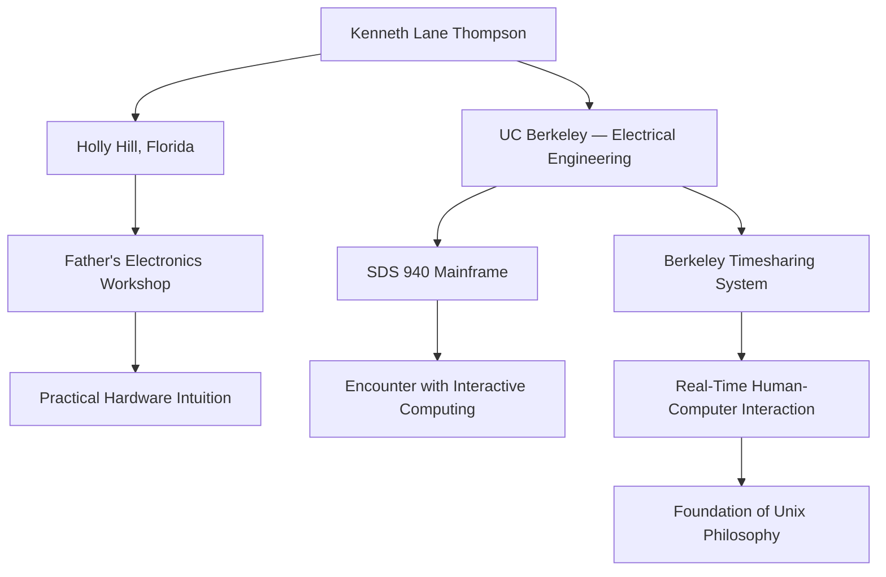
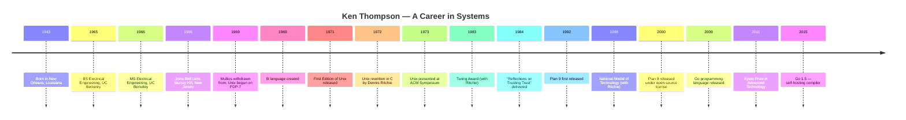
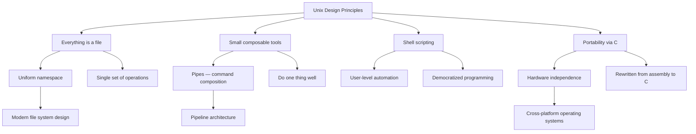
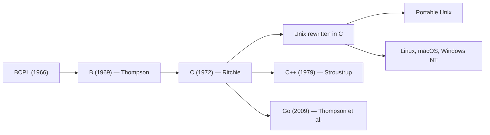
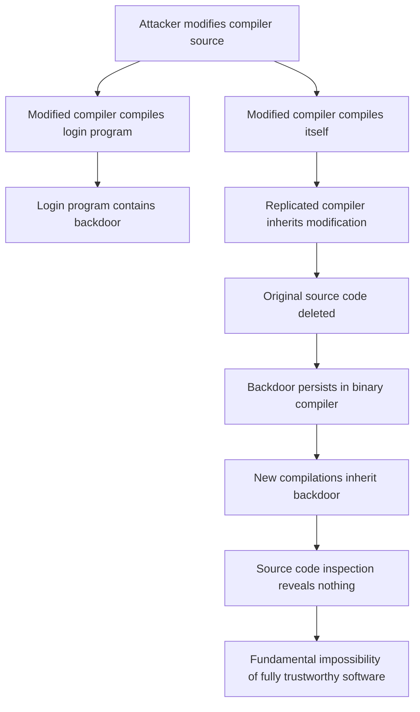
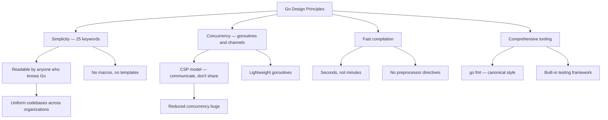
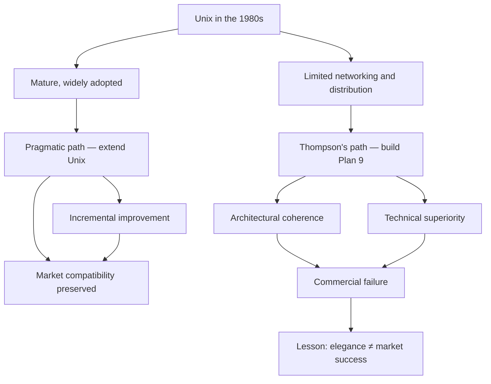
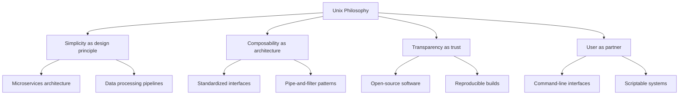
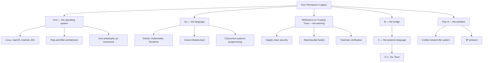

# Ken Thompson

## Description

Ken Thompson (born 1943) is an American computer scientist and engineer whose contributions have shaped the foundations of modern computing across five decades. Co-creator of the Unix operating system, inventor of the B programming language, co-designer of UTF-8, architect of the Plan 9 operating system, and co-creator of the Go programming language, Thompson's career is defined by an unwavering commitment to simplicity in the face of ever-growing complexity. His 1984 Turing Award lecture, "Reflections on Trusting Trust," remains the most cited and most unsettling meditation on software security ever delivered. To study his life is to understand what happens when a mind of extraordinary power chooses, deliberately and repeatedly, to start over rather than to patch.

## Prerequisites

- [Dennis Ritchie](dennis-ritchie.md) — his lifelong collaborator and co-creator of Unix and C

The reader is expected to have a general understanding of operating systems, programming languages, and the historical development of computing from the 1960s onward. Familiarity with the concept of a compiler — a program that translates human-readable source code into machine instructions — will be assumed.

## Table of Contents

- [Origins — The Making of a Systems Thinker](#-origins--the-making-of-a-systems-thinker)
- [The Work — Building Worlds from First Principles](#-the-work--building-worlds-from-first-principles)
- [Struggles and Failures — The Cost of Elegance](#-struggles-and-failures--the-cost-of-elegance)
- [Legacy and Lessons — What Endures](#-legacy-and-lessons--what-endures)

## 🌱 Origins — The Making of a Systems Thinker

### New Orleans and the Early Years

Kenneth Lane Thompson was born on 4 February 1943 in New Orleans, Louisiana. His father was a naval officer and, later, a middle-school mathematics teacher in Holly Hill, Florida — a small town south of Daytona Beach. The elder Thompson was a practical man who worked with electronics, building radios and electronic devices in his workshop at home. Young Ken grew up surrounded not by academic abstraction but by the physical reality of circuits, soldering irons, and the quiet discipline of making things work.

This distinction — between the theoretical and the practical, between the paper and the machine — would define Thompson's entire career. He did not come to computing through mathematics. He came to it through engineering: the conviction that ideas are worthless until they run. His father's workshop was his first laboratory, and the principle he absorbed there — that understanding comes from building, not from reading — became the foundation of everything he would later create.

Thompson attended Holly Hill High School, where he was an unremarkable student in every subject except science and mathematics. He was not driven by grades or accolades. He was driven by curiosity — a restless, consuming need to understand how things worked at their lowest level. He would later describe his teenage years as a period of tinkering: taking apart radios, building amplifiers, exploring the physical substrate of electronics. The world of software was still invisible to him. The world of hardware was immediate, tangible, and real.

### UC Berkeley: Electrical Engineering and the Encounter with Computing

In 1961, Thompson enrolled at the University of California, Berkeley, to study electrical engineering. The timing was critical. The Department of Electrical Engineering at Berkeley was, in the early 1960s, one of the few places in the world where students could encounter a real, operational computer — the Scientific Data Systems (SDS) 940, a mainframe that had been acquired for research purposes. Most universities did not yet have computers. Berkeley did, and Thompson found his way to it.

He earned his Bachelor of Science in Electrical Engineering in 1965 and his Master of Science in Electrical Engineering in 1966, both from Berkeley. His master's thesis, supervised by Harold Peterson, was on the implementation of a data structure language — an early foray into the relationship between programming languages and the memory structures they manipulate. The thesis was not widely cited, but it revealed the preoccupation that would dominate his career: how to represent information in memory efficiently and access it simply.

During his graduate years, Thompson became involved in the development of the Berkeley timesharing system, an operating system that allowed multiple users to share a single computer simultaneously. This was an extraordinary departure from the batch-processing model that dominated computing at the time. In batch processing, users submitted jobs on punch cards, waited hours or days for results, and had no interactive relationship with the machine. Timesharing changed this: it allowed a user to sit at a terminal and interact with the computer in real time, receiving responses within seconds.

The experience of timesharing was transformative for Thompson. It demonstrated that the relationship between humans and computers could be immediate, conversational, and intuitive — if the system was designed to support it. This insight would become the animating principle of Unix: that an operating system should be transparent, responsive, and simple enough that the user could reason about its behavior. The timesharing system at Berkeley was crude, but its vision was prophetic. Thompson would spend the next decade building a system that realized that vision with unprecedented elegance.

### Bell Labs and the Multics Interlude

After completing his master's degree, Thompson accepted a position at Bell Telephone Laboratories in Murray Hill, New Jersey, in 1966. Bell Labs was, at the time, one of the most important industrial research institutions in the world. It was home to Claude Shannon's information theory, the transistor, the laser, and a tradition of cross-disciplinary exploration that attracted some of the finest scientific minds of the twentieth century. Thompson arrived in a division that was working on digital signal processing, but his interests quickly drew him toward the operating systems research that was beginning to take shape across the institution.

The culture of Bell Labs was unlike that of any university or corporation. Researchers were given extraordinary freedom to pursue their own interests, provided those interests occasionally intersected with the business of telecommunications. There were no rigid departmental boundaries. A mathematician could collaborate with a physicist; an engineer could spend months on a theoretical problem. The institution rewarded curiosity and tolerated eccentricity, because its leaders understood that the most consequential discoveries emerge from the unpredicated collisions of different minds. Thompson thrived in this environment. He was not a joiner of committees or a reader of memos. He was a builder — a person who understood problems by constructing solutions, who thought in code rather than in prose.

In 1969, Bell Labs joined a collaborative project with General Electric and the Massachusetts Institute of Technology to build Multics (Multiplexed Information and Computing Service) — a time-sharing operating system designed to be the most powerful and flexible system ever created. Multics was ambitious in every dimension: it supported dynamic linking, hierarchical file systems, a ring-based security model, and thousands of concurrent users. It was, in principle, the operating system of the future.

In practice, Multics was a catastrophe for Bell Labs. The project was chronically behind schedule, over budget, and so complex that its developers could not reliably predict when features would be completed or whether the system would work as designed. Thompson, who had been assigned to the project, grew frustrated with its sprawling ambition and its refusal to converge on a working system. The gap between what Multics promised and what it delivered taught Thompson a lesson that would shape his career: that complexity is not a feature of a good system — it is a symptom of a confused design.

The frustration was not merely with the schedule. It was philosophical. Multics embodied a conception of operating systems as omnibus platforms — systems that attempted to anticipate every need, accommodate every use case, and solve every problem in advance. Thompson regarded this ambition as fundamentally misguided. A system that tries to do everything will do nothing well. A system that tries to anticipate every need will understand none of them. The right approach, Thompson believed, was to build a system that did a small number of things with extraordinary competence, and to trust the user to compose those capabilities into the larger operations they required. This was the seed of the Unix philosophy.

Bell Labs withdrew from the Multics project in 1969. Thompson, along with a small group of colleagues, decided to build their own operating system — one that embodied the opposite philosophy. Where Multics was complex, they would build something simple. Where Multics was ambitious, they would build something minimal. Where Multics tried to do everything, they would do one thing well. The system they built was Unix.

## ⚙️ The Work — Building Worlds from First Principles

### Unix: The Operating System as Philosophy

The origin of Unix has become one of the foundational myths of computer science. In 1969, after Bell Labs' withdrawal from Multics, Thompson found an unused PDP-7 minicomputer — a machine with 4 kilobytes of memory and no operating system — in a hallway at Bell Labs. With his colleague Dennis Ritchie, he began writing an operating system for it, initially as a platform for a space travel game he had written. The implementation proceeded with extraordinary speed: Thompson and Ritchie built the core of Unix in a matter of weeks, writing the kernel, the file system, the shell, and the essential utilities in a compressed burst of creative energy.

The story is true, but it obscures the intellectual depth of the work. Unix was not merely an operating system. It was a set of design principles, distilled into code:

1. **Everything is a file.** Devices, directories, and processes were represented as files in a uniform namespace. This meant that a single set of operations — open, read, write, close — could manipulate any resource in the system. The conceptual simplicity was revolutionary: instead of special-case handlers for every device, Unix provided a single abstraction that worked everywhere.

2. **Small, composable tools.** Each Unix utility did one thing well. The `cat` command concatenated files. The `grep` command searched for patterns. The `sort` command sorted lines. These tools could be chained together using pipes (`|`) to create complex operations from simple components. A user could compose a complex data transformation by connecting a sequence of simple tools, each reading from standard input and writing to standard output.

3. **Shell scripting.** The command shell was itself a programming language — one that allowed users to automate tasks, compose tools, and extend the system without modifying its core. This was a radical democratization of programming: the user was not merely a consumer of the system's capabilities but an active participant in extending them.

4. **Portability.** Thompson and Ritchie made the critical decision to rewrite Unix in C — the language Ritchie had developed as a systems programming language — rather than in assembly language. This made Unix the first operating system that could be ported to different hardware architectures without being rewritten from scratch. The decision to write Unix in C, and to write C for the purpose of writing Unix, was a virtuous circle that changed the entire industry.

Unix was not designed by committee. It was designed by two or three people who argued, continuously, about what mattered. Thompson and Ritchie had a partnership of extraordinary productivity: Thompson was the systems architect, the one who could see the entire system as a unified whole and make design decisions that preserved coherence; Ritchie was the implementer, the one who could translate elegant abstractions into working code with relentless precision. Their collaboration was not always harmonious. They disagreed about specific design choices — file system structure, process management, memory allocation — with an intensity that sometimes halted progress for days. But the disagreements were productive: they forced both men to justify their intuitions, to articulate principles, and to build systems that could survive scrutiny.

The influence of Unix on modern computing cannot be overstated. Every major operating system — Linux, macOS, Android, iOS — is either a direct descendant of Unix or heavily influenced by its design. The pipe-and-filter architecture that Thompson and Ritchie pioneered underlies modern data processing pipelines, web service architectures, and even the design of microservices. The philosophy of small, composable tools anticipated the Unix philosophy that would become an entire movement in software engineering: write programs that do one thing well, write programs that work together, write programs that handle text streams.

### The B Programming Language

Before C, before Unix had a portable implementation, Thompson created B — a systems programming language derived from BCPL (Basic Combined Programming Language) and designed for the PDP-7. B was a minimalist language: it operated on word-sized values rather than bytes or characters, it had no type system beyond the distinction between words and characters, and it used a compiler that translated B programs into threaded code — a sequence of subroutine calls rather than native machine instructions.

B was not a beautiful language. Thompson would be the first to acknowledge this. It was a pragmatic one: a language that allowed him and his colleagues to write operating system code in a form that was more readable and more maintainable than assembly, without the overhead and complexity of a full-scale language like Fortran or Algol. B was, in Thompson's own characterization, a tool for getting a job done — not a contribution to language theory, but a bridge between the conceptual clarity of high-level languages and the raw power of the machine.

The limitations of B — its word-oriented memory model, its lack of structured data types, its inability to handle characters efficiently — led Ritchie to develop C, which addressed these deficiencies while preserving B's core philosophy: simplicity, directness, and closeness to the hardware. C, in turn, became the language in which Unix was rewritten, and eventually the most widely used systems programming language in history. The trajectory from B to C to Unix to the modern world is a straight line, and its origin is a language that most programmers have never heard of.

### The Turing Award: Reflections on Trusting Trust

In 1983, Thompson and Ritchie were jointly awarded the ACM A.M. Turing Award for their work on Unix and C. Thompson was invited to deliver the traditional Turing Award lecture. He chose to present a work that has since become the most frequently cited and most unsettling paper in the history of software security: "Reflections on Trusting Trust."

The lecture's argument is devastatingly simple. Thompson demonstrated that it is possible to modify a compiler — the program that translates source code into machine code — in such a way that it inserts a backdoor into any program it compiles, including copies of itself. The modified compiler, when compiling a login program, would insert code that granted Thompson access to any system. When compiling a copy of itself, it would replicate the modification — ensuring that the backdoor persisted even if the original modified source code was deleted.

The implications were profound. Thompson showed that:

1. You cannot trust code that you did not entirely write yourself — even code written by trusted compilers.
2. The trust chain extends backward through every layer of tooling: the compiler was compiled by a compiler, which was compiled by a compiler, and so on. A compromise at any level propagates forward indefinitely.
3. Source code inspection is insufficient to guarantee the integrity of a program, because the behavior of the program depends on the behavior of the compiler, which depends on the behavior of the compiler that compiled the compiler, and so on without limit.

The lecture was not merely a theoretical exercise. It was a demonstration of a real attack — one that Thompson had actually implemented and used on the Unix source code at Bell Labs. The backdoor had existed in the Unix login system for an unknown period before Thompson removed it for the lecture. The audience at the ACM conference was reportedly stunned.

"Reflections on Trusting Trust" remains as relevant today as it was in 1983. In an era of supply chain attacks — compromised npm packages, trojanized open-source libraries, malicious compiler toolchains — Thompson's warning is not historical. It is prophetic. The lesson is not that all software is compromised. The lesson is that trust in software must be grounded in something deeper than source code review: it must be grounded in an understanding of the entire toolchain, from the hardware to the firmware to the compiler to the operating system to the application. The attack surface is not just the code you write. It is every tool that touches the code before it runs.

The lecture also carries a philosophical weight that transcends its technical content. It is a meditation on the nature of trust itself — on the fact that trust is, ultimately, an act of faith, not an act of verification. You can verify the source code of a program. You cannot verify the compiler that compiled the compiler that compiled the compiler. At some point, you must trust. Thompson's lecture asks: what happens when that trust is misplaced? The answer is: you will not know. The backdoor will function perfectly. The system will appear clean. And the compromise will be invisible.

### Plan 9: The Operating System That Followed Unix

In the 1980s and 1990s, Thompson and his team at Bell Labs turned their attention to the limitations of Unix. Unix had been designed for a world of single-user workstations sharing a single file system. By the 1980s, computing had changed: networks of machines were becoming common, distributed computing was emerging, and the Unix model — in which each machine maintained its own file system and its own view of the network — was showing its age.

Plan 9 from Bell Labs was Thompson's answer to these limitations. Where Unix treated the file system as local, Plan 9 treated the entire network as a unified file system. Every resource — files, processes, network connections, even devices — was accessed through the file system interface, and that file system could span multiple machines transparently. A user sitting at a terminal in one building could access files on a server in another building as though they were local. A computation could be distributed across multiple machines by simply reading and writing files that happened to be located on different hosts.

Plan 9 was, in technical terms, a more coherent and more ambitious system than Unix. It resolved inconsistencies in the Unix model — the fact that network access required different mechanisms than local file access, that processes on different machines could not communicate through the file system, that resource sharing was bolted on rather than fundamental. Plan 9 made all of these things uniform and simple.

But Plan 9 was also a commercial failure. It was released under a permissive license in 2000, and again as open-source software in 2014, but it never achieved significant adoption. The reasons were partly political — Bell Labs had merged with AT&T, and the corporate priorities of a telecommunications conglomerate did not align with the needs of a research operating system — and partly practical: Unix was already entrenched, and the benefits of Plan 9's improvements were not compelling enough to justify the cost of migration.

Thompson's relationship with Plan 9 reveals something essential about his character. He was willing to build an entire operating system — years of work by a team of talented engineers — on the conviction that the design was right, even when the market did not agree. He was not building for adoption. He was building for correctness. The system worked. It was coherent. It embodied the principles he believed in. That was enough. The fact that the world chose not to use it was, for Thompson, a failure of the world, not of the system.

This disposition — the willingness to pursue the right design regardless of commercial pressure — is both Thompson's greatest strength and the source of his most significant frustrations. It produced Unix, one of the most successful operating systems in history. It produced Plan 9, one of the most elegant and least adopted. The line between triumph and neglect, in Thompson's career, is the line between what the world was ready for and what it was not.

### Go: Simplicity at Scale

In 2007, Thompson — along with his Bell Labs colleagues Robert Griesemer and Rob Pike — began designing a new programming language. The project was motivated by frustration: the compilation times for C++ at Google had grown so long that developers were waiting minutes or hours for builds to complete. Thompson and his colleagues wanted a language that compiled fast, ran fast, and was simple enough that a new programmer could learn it in a day.

The language they created was Go. It was released as an open-source project in 2009 and quickly became one of the most widely adopted systems programming languages in the world. Go's design reflects Thompson's lifelong commitments:

- **Simplicity.** Go has twenty-five keywords. It has no classes, no inheritance, no exceptions, no generics (until version 1.18, and even then with constraints). The language specification fits in a single document that a competent programmer can read in an afternoon. This is not a limitation. It is a design choice: by constraining the language, Thompson and his colleagues ensured that Go programs would be readable by anyone who knew the language, regardless of who wrote them.

- **Concurrency.** Go introduced goroutines — lightweight threads managed by the Go runtime rather than the operating system — and channels — typed conduits for communication between goroutines. The concurrency model is based on Tony Hoare's communicating sequential processes (CSP): "Do not communicate by sharing memory; instead, share memory by communicating." This model avoids the complexity and error-proneness of traditional threading, in which concurrent access to shared data requires locks, mutexes, and careful synchronization.

- **Fast compilation.** Go was designed for fast compilation from the beginning. The language is deliberately simple to parse: no macros, no templates, no preprocessor directives. This simplicity means that the compiler can build a complete program in seconds, even for large codebases. The improvement in developer productivity — not from running code faster, but from compiling code faster — was immediate and dramatic.

- **Tooling.** Go ships with a comprehensive standard toolchain: `go build`, `go test`, `go fmt`, `go vet`, `go doc`. The formatter (`go fmt`) enforces a single canonical style for all Go code, eliminating debates about indentation, spacing, and brace placement. The test framework is built into the language. The documentation tool generates documentation from source code comments. The tooling is not an afterthought — it is a core part of the language's value proposition.

Go's success was not inevitable. It succeeded because it solved real problems — compilation speed, concurrency complexity, code readability — that other languages had not addressed satisfactorily. But it also succeeded because of Thompson's reputation and credibility. When Ken Thompson says that simplicity matters, the industry listens — because he has spent five decades proving it.

The language's adoption by Google, Docker, Kubernetes, and thousands of other organizations validated Thompson's core conviction: that the most powerful engineering choice is often the choice to remove, not to add. Go is powerful not because of what it includes, but because of what it excludes. This is the Unix philosophy applied to language design: do one thing well, and resist the temptation to do everything.

## 💔 Struggles and Failures — The Cost of Elegance

### The Tension Between Elegance and Pragmatism

Thompson's career is defined by a tension that every systems engineer eventually encounters: the tension between the elegant solution and the pragmatic one. An elegant solution is one that follows from first principles, that is coherent in its structure, and that does exactly what it should — no more, no less. A pragmatic solution is one that works, that ships, that meets the needs of users and managers and timelines, even if it compromises the underlying design.

Thompson has consistently chosen elegance. This choice has produced extraordinary results — Unix, Go, the pipe architecture — but it has also produced failures that a more pragmatic engineer might have avoided. Plan 9 was elegant. It was also a commercial failure. The B language was elegant. It was also too limited to sustain a software ecosystem. The insistence on simplicity, taken to its logical conclusion, sometimes produces systems that are too simple for the problems they are meant to solve.

This is not a criticism. It is a description of a disposition. Thompson's preference for simplicity is not a blind spots — it is a conviction, forged in the experience of watching Multics collapse under its own complexity, that the alternative to simplicity is not sophistication but chaos. The Multics experience taught him that a system designed to do everything will do nothing well. The lesson was so profound, so deeply internalized, that it became his default: when in doubt, simplify. When simplification fails, start over.

Starting over is expensive. It requires abandoning working code, existing investments, and the sunk costs of prior effort. Most engineers cannot do it. They are too invested in what they have built, too attached to the familiar, too afraid of the unknown. Thompson could do it because he valued the right design more than he valued the completed one. This made him a great engineer and, at times, a difficult colleague — because the decision to start over is rarely made alone, and it almost always imposes costs on others.

### The Plan 9 Decision

The decision to build Plan 9 rather than extend Unix is perhaps the most consequential of Thompson's career, and the most instructive. Unix was, by the 1980s, a mature and widely adopted operating system. It had a large user base, a substantial ecosystem of tools and applications, and a network of commercial vendors who sold Unix implementations. Improving Unix — adding better networking, better security, better distributed computing support — would have been the pragmatic choice. The market was there. The need was there. The expertise was there.

Thompson chose not to do this. He chose to build a new operating system from scratch, one that addressed the limitations of Unix at the architectural level rather than through incremental patches. This decision was technically defensible: Plan 9's design was genuinely superior to Unix in several important respects. But it was commercially disastrous: the world did not need a new operating system. It needed a better version of the one it already had.

The lesson is not that Thompson was wrong. The lesson is that technical superiority and commercial success are not correlated. The history of computing is littered with elegant systems that failed in the market — Xerox PARC's Alto, Lisp machines, BeOS, OS/2 — and with crude, compromised systems that succeeded — DOS, Windows, the LAMP stack. The market does not reward elegance. It rewards familiarity, compatibility, and momentum. Thompson's decision to build Plan 9 was a statement of principle: that the right design matters, even if the world does not agree. But the principle carried a cost, and that cost was borne by the team that built Plan 9 and by the users who might have benefited from a better Unix.

### The Challenge of Maintaining Simplicity

Thompson's commitment to simplicity has also revealed a deeper challenge: simplicity is harder to maintain than complexity. A complex system grows organically, accreting features and capabilities in response to user demands and engineering expediency. A simple system must resist these pressures, must say no to features that do not serve the core design, must maintain its coherence in the face of an industry that rewards feature lists and punishes restraint.

Unix itself eventually succumbed to this pressure. The System V and BSD variants diverged in incompatible ways. GNU utilities replaced the original Bell Labs tools. Linux, which inherited Unix's design principles, grew into a system of staggering complexity — the Linux kernel alone contains millions of lines of code, and the total software stack required to run a modern Linux system dwarfs anything Thompson and Ritchie could have imagined. The simplicity of the original Unix was preserved in spirit but lost in practice.

Go represents Thompson's attempt to apply the lesson of Unix's trajectory to language design. By building constraints into the language itself — by refusing to add features that would compromise readability and compilation speed — Go resists the organic complexity that has consumed other languages. But even Go is not immune: the standard library has grown, the community has developed conventions that add implicit complexity, and the language's own evolution (the addition of generics in 1.8, module support, workspace mode) introduces new surfaces for complexity to accumulate.

The challenge is not unique to Thompson. It is the central challenge of systems design: how to build something that remains simple as it grows, that resists the entropy of feature accretion, that maintains its original vision in the face of competing demands. Thompson's answer has been consistent: constrain the design space. Reduce the number of things a system can do, and do those things well. Accept the limitation. The power of Unix came not from what it could do, but from what it refused to do. The power of Go comes from the same source.

### Reflections on Trust: The Permanent Reminder

"Reflections on Trusting Trust" is not merely a lecture. It is a permanent reminder of the limits of human verification. Thompson demonstrated that a sufficiently clever attacker can compromise a system at a level that is invisible to source code review. The implication is that no amount of auditing can guarantee the integrity of software — because the tools used to audit the software are themselves software, and they are subject to the same attack.

This is not a problem that can be solved. It is a condition that must be managed. Thompson's lecture established the conceptual framework for understanding supply chain attacks — the class of attacks in which a compromise at one point in the toolchain propagates to every program built with that toolchain. The SolarWinds attack of 2020, the compromised XZ Utils backdoor of 2024, and the ongoing challenges of reproducible builds all trace their conceptual lineage to Thompson's 1983 lecture.

For the developer, the lesson is sobering: you are not the only author of the code you ship. The compiler, the linker, the standard library, the operating system, the firmware — all of these are actors in the chain of trust, and any one of them can subvert your intentions. The appropriate response is not paranoia — it is vigilance. Use reproducible builds. Verify your toolchains. Understand the entire stack, from the hardware to the application layer. And accept that, at some level, trust is irreducible. You must trust something. The question is not whether to trust, but what to trust, and why.

## 🌍 Legacy and Lessons — What Endures

### The Awards and Recognition

Thompson and Ritchie received the Turing Award in 1983. In 1998, they were jointly awarded the National Medal of Technology for their contributions to the creation of the Unix operating system and the C programming language. In 2011, Thompson received the Kyoto Prize in Advanced Technology — Japan's highest honor for science and technology — for his contributions to the development of the Unix operating system.

These awards recognize the scope of Thompson's contributions, but they do not capture its character. Thompson is not celebrated because he built many things. He is celebrated because the things he built were coherent. Unix was not a collection of features. It was a philosophy expressed in code. Go is not a language that tries to be everything. It is a language that tries to be one thing, and does it well. The coherence of Thompson's work — the fact that every project he has undertaken reflects the same set of principles — is itself a lesson: consistency of vision is more valuable than breadth of ambition.

### The Unix Philosophy as Cultural Movement

Thompson's design principles did not remain confined to operating systems. They became a cultural movement — a way of thinking about software that transcended any specific implementation. The Unix philosophy, as articulated by Thompson and his colleague Doug McIlroy, influenced the design of web services, data processing pipelines, microservice architectures, and even organizational structures. The principle of composable tools — small programs that do one thing well and communicate through standardized interfaces — became the foundation of modern software engineering practice.

The influence extends beyond technology. The Unix philosophy embodies a worldview: that complexity is the enemy of reliability, that transparency is the foundation of trust, and that the user is a partner, not a consumer. These principles are not merely technical preferences. They are ethical commitments — a statement about how systems should relate to the people who use them. Thompson's insistence on simplicity was, in part, an insistence on respect: respect for the user's intelligence, for the maintainer's time, and for the principle that a system should be comprehensible to the people who depend on it.

### Go's Success and the Validation of Simplicity

Go's adoption by the software industry has been one of the most significant developments in programming language history since the rise of Java in the 1990s. The language has become the foundation of cloud infrastructure: Docker, Kubernetes, Terraform, and Prometheus are all written in Go. Its concurrency model, its compilation speed, and its simplicity have made it the language of choice for backend systems, DevOps tooling, and distributed computing.

Go's success vindicates Thompson's lifelong conviction that simplicity is not a weakness but a strength. The language succeeds not because it offers more features than its competitors, but because it offers fewer. The constraint — no inheritance, no macros, no complex type system — is the feature. It produces codebases that are readable, maintainable, and predictable. It produces teams that can onboard new developers in days rather than weeks. It produces systems that can be reasoned about, debugged, and modified without fear of unintended consequences.

The success of Go also demonstrates something about the nature of innovation that Thompson has embodied throughout his career: the most important innovations are often not inventions but selections. Thompson did not invent the ideas in Go — goroutines are based on CSP (1978), channels are based on message-passing (1978), the simplicity principle is based on Unix (1969). What Thompson did was select the right ideas, combine them coherently, and implement them with precision. Innovation, in this sense, is not creation. It is curation — the ability to identify what matters, discard what does not, and assemble the result into a coherent whole.

### What His Life Teaches

Ken Thompson's biography offers principles that extend beyond the technical:

**Simplicity is a choice, not a default.** Every system tends toward complexity. Every feature added makes the next feature easier to add and harder to refuse. The discipline of simplicity requires active resistance — the willingness to say no to capabilities that do not serve the core design. Thompson's career demonstrates that the systems which endure are the ones that were constrained at the beginning, that refused to become everything, that accepted the discipline of limitation. This is not merely an engineering principle. It is a moral one: the refusal to overreach, to take on more than one can sustain, to promise what one cannot deliver, is an act of integrity that requires courage in a culture that rewards expansion.

**Trust must be earned, not assumed.** "Reflections on Trusting Trust" is not merely a security lecture. It is a meditation on the epistemology of trust — on the conditions under which trust is justified and the conditions under which it is dangerous. Thompson demonstrated that trust in software is, at its foundation, trust in people — in the engineers who wrote the compiler, the operating system, the firmware. When that trust is misplaced, the consequences are invisible and persistent. The lesson applies beyond software: in any system that depends on chains of trust — institutional, relational, professional — the question "who compiled the compiler?" is always relevant. The impulse to verify, to understand the entire chain of causation, to accept trust only when its foundations are visible, is not cynicism. It is wisdom.

**Starting over is not failure.** Thompson's willingness to abandon working systems — to walk away from Unix and build Plan 9, to walk away from C and build Go — is often misread as restlessness or dissatisfaction. It is neither. It is the recognition that a system's limitations are sometimes architectural, and that no amount of patching can resolve an architectural flaw. The courage to start over — to accept the cost of abandoning what exists in pursuit of what is right — is the distinguishing characteristic of the engineer who builds lasting systems. Most people will not do it. They will patch, extend, and kludge, preserving the existing system at the cost of its coherence. Thompson's career is a testament to the value of the alternative: when the foundation is wrong, build a new one.

**The best work is collaborative, but the vision is individual.** Thompson and Ritchie's partnership produced Unix and C — two of the most consequential artifacts in the history of technology. Go was created with Griesemer and Pike. The Plan 9 team included Howard Trickey, Phil Winterbottom, and Dave Presotto, among others. Thompson has never worked alone. But the vision — the guiding conviction that simplicity matters, that systems should be transparent, that the user should be empowered — is singular. The collaboration gives the vision its implementation. The vision gives the collaboration its direction. Neither is sufficient without the other.

**Engineering is stewardship.** Thompson built systems that outlasted their original context. Unix was designed for PDP-7 minicomputers in 1969; it runs, in descendant form, on billions of devices in 2026. Go was designed for Google's internal build systems; it now underpins the infrastructure of the internet. The designer of such systems is not merely building tools. He is shaping the environment in which future engineers will work, think, and create. This is stewardship: the obligation to build well not for the present alone, but for the unknown needs of the future. Thompson's commitment to simplicity was, in part, a recognition of this obligation: a complex system serves its creators; a simple system serves its users, including those who have not yet been born.

**Humility is the mark of mastery.** Thompson is famously reluctant to claim credit for his work. He has described Unix as "a accident of history," Go as "a reaction to C++," and his own contributions as modest. This humility is not false modesty. It is the genuine recognition that the most significant works of engineering are collective, contextual, and contingent — that they emerge from specific circumstances, specific collaborations, and specific needs, and that the individual's contribution, however essential, is embedded in a larger story. Thompson's reluctance to mythologize himself is itself a lesson: the engineer who believes he is the source of his own genius has already begun to compromise it. The work speaks. The engineer need not.

## 📝 Learning Tips

- **Read "Reflections on Trusting Trust" first.** The lecture is twelve pages long, clearly written, and contains no jargon beyond basic programming concepts. It is the most accessible entry point to Thompson's thought and the most compact expression of his philosophy. Read it before reading any biography or interview. The lecture reveals the mind more directly than any secondary account.

- **Use Unix before studying it.** Thompson's design principles become tangible when you have experienced the system. Install a Linux distribution, use the command line, write shell scripts, chain commands with pipes. The experience of composing complex operations from simple tools is the experience of Unix philosophy. Without it, the principles remain abstract.

- **Compare Unix and Multics.** Understanding why Multics failed illuminates why Unix succeeded. Multics tried to be everything; Unix tried to be one thing well. The contrast is not merely technical — it is philosophical. Multics assumed that a system's value was proportional to its capabilities. Unix assumed that a system's value was proportional to its clarity. The difference in these assumptions produced radically different systems.

- **Study Go's design decisions.** Read the Go specification and the FAQ. Pay attention not to what the language includes but to what it excludes. The design of Go is a masterclass in the discipline of simplification — in saying "no" to features that other languages have said "yes" to. Understanding why Go does not have inheritance, exceptions, or macros is more instructive than understanding what it does have.

- **Trace the lineage from B to C to Go.** These three languages are not isolated artifacts. They are expressions of a single set of principles, applied to different contexts at different times. B was a minimal language for a minimal machine. C was a systems language that preserved B's directness while adding type safety. Go was a concurrent language that preserved C's simplicity while adding concurrency primitives. The trajectory reveals how a consistent vision evolves in response to changing needs without abandoning its core convictions.

- **Do not separate the engineer from the engineer's choices.** Thompson's career was shaped by institutional contexts — Bell Labs, Google — that provided resources, collaborators, and problems. But his choices within those contexts were his own. He chose simplicity over features, coherence over compatibility, principle over pragmatism. These choices were not inevitable. They were character. Study the choices as much as the outcomes, because the choices are the transferable lesson.

## 📚 Glossary

| Term | Definition |
|------|------------|
| Unix | A multitasking, multiuser operating system developed at Bell Labs in 1969 by Ken Thompson and Dennis Ritchie; characterized by the "everything is a file" abstraction, small composable tools, and a portable implementation in C |
| PDP-7 | A minicomputer manufactured by Digital Equipment Corporation (1964–1977) with 4 KB of memory; the machine on which the first version of Unix was implemented |
| B language | A programming language created by Ken Thompson in 1969 as a predecessor to C; designed for the PDP-7 and used in the early development of Unix |
| C | A general-purpose programming language developed by Dennis Ritchie at Bell Labs (1972); designed for systems programming and used to rewrite Unix |
| Plan 9 | An operating system developed at Bell Labs beginning in the 1980s, designed as a successor to Unix with a unified network file system |
| Go | A programming language developed at Google by Robert Griesemer, Rob Pike, and Ken Thompson (2009); designed for simplicity, fast compilation, and concurrent systems programming |
| Turing Award | The most prestigious award in computer science, given annually by the Association for Computing Machinery (ACM); awarded to Thompson and Ritchie in 1983 |
| Multics | A time-sharing operating system developed jointly by Bell Labs, General Electric, and MIT (1964–1969); its complexity motivated the creation of Unix |
| GCSP | The Bell Labs Unix kernel; the original implementation of the Unix operating system, later rewritten in C by Dennis Ritchie |
| Pipe | A Unix mechanism for connecting the output of one command to the input of another, enabling command composition |
| Goroutine | A lightweight thread managed by the Go runtime; the fundamental unit of concurrency in Go |
| Channel | A typed communication mechanism in Go that allows goroutines to send and receive values |
| CSP | Communicating Sequential Processes — a formal language for describing patterns of interaction in concurrent systems, proposed by Tony Hoare in 1978; the theoretical basis for Go's concurrency model |
| Kyoto Prize | Japan's highest private award for science and technology; Thompson received it in 2011 |
| National Medal of Technology | A United States presidential award for technological innovation; Thompson and Ritchie received it in 1998 |
| Supply chain attack | An attack that compromises a software system by subverting the tools or dependencies used to build it, rather than the application code itself |
| Reproducible builds | A software development practice that ensures identical source code produces identical binary outputs, enabling verification of build integrity |

## 📖 Quick References

- [Reflections on Trusting Trust — Ken Thompson (1984)](https://www.cs.cmu.edu/~rdriley/477papers/thompson_trusting_trust.pdf) — the Turing Award lecture that remains the definitive statement on software trust and supply chain security
- [The Evolution of a Unix Programmer — Ken Thompson (interview)](https://www.prince.org/pdf/msrip.pdf) — Thompson reflects on his career, the development of Unix, and the principles that guided his work
- [Go Programming Language Specification](https://go.dev/ref/spec) — the official language specification, written with the clarity and precision characteristic of Thompson's design philosophy
- [The Unix Philosophy — Doug McIlroy](https://www/doc.cat-v.org/unix/papers/pipe_dreams/) — the foundational essay on the Unix design philosophy, written by the inventor of the pipe, who worked alongside Thompson at Bell Labs
- [A Quarter Century of Unix — Peter H. Salus](https://www.amazon.com/Quarter-Century-Unix-Peter-Salus/dp/0201547775) — the definitive history of Unix's development at Bell Labs, including the roles of Thompson and Ritchie
- [The Go Blog — Simplicity is Complicated](https://go.dev/blog/simplicity-is-complicated) — Rob Pike's essay on Go's design philosophy, articulating the principles that Thompson helped establish
- [Bell Labs and Unix — The Computer History Museum](https://www.computerhistory.org/) — historical documentation of the Bell Labs computing research environment

## Next Steps

Ken Thompson's work established the foundations that others extended, refined, and in some cases, transcended. The trajectory from Unix to Linux, from C to Go, from "Reflections on Trusting Trust" to modern supply chain security, is a continuing story. The principles Thompson articulated — simplicity, composability, transparency, the irreducibility of trust — remain the load-bearing elements of modern systems design.

- [Linus Torvalds](linus-torvalds.md) — who took the Unix philosophy and built Linux, extending it into the most widely deployed operating system in history
- [Bjarne Stroustrup](bjarne-stroustrup.md) — who took the C language Thompson and Ritchie created and extended it into C++, grappling with the same tensions between simplicity and capability
