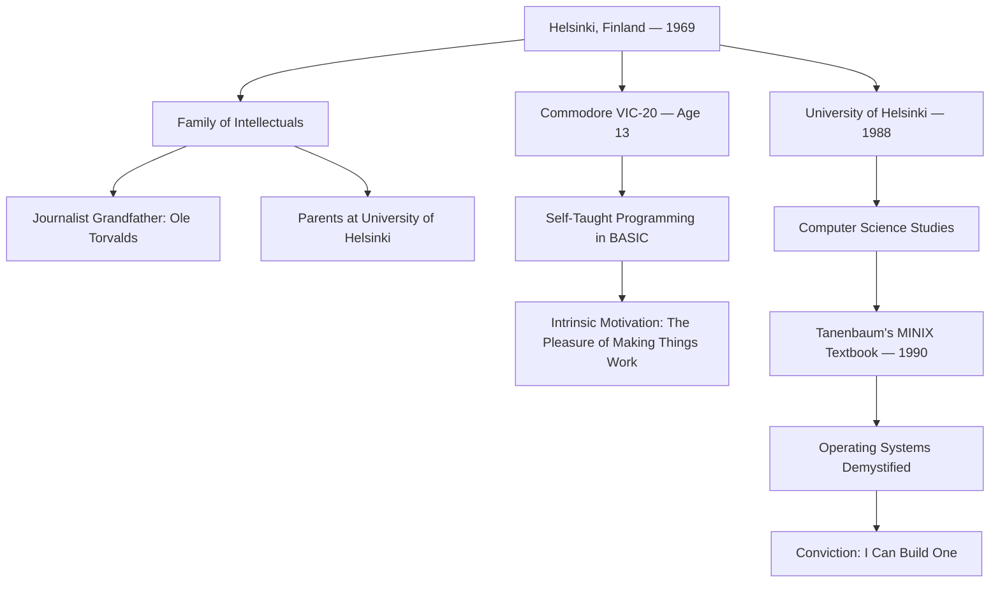
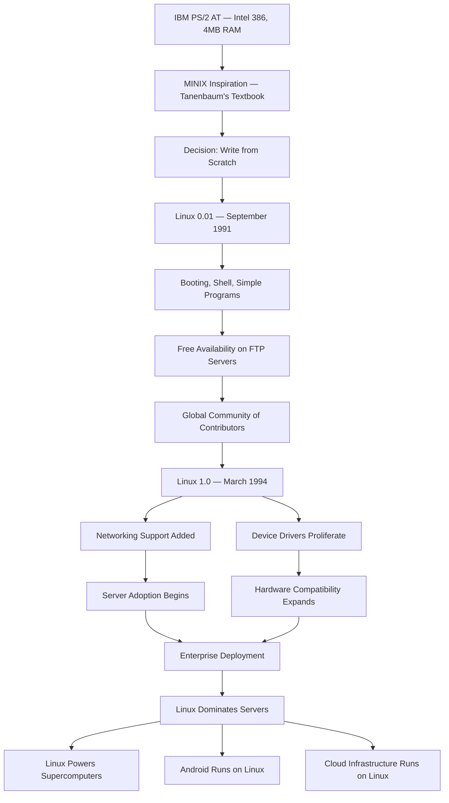
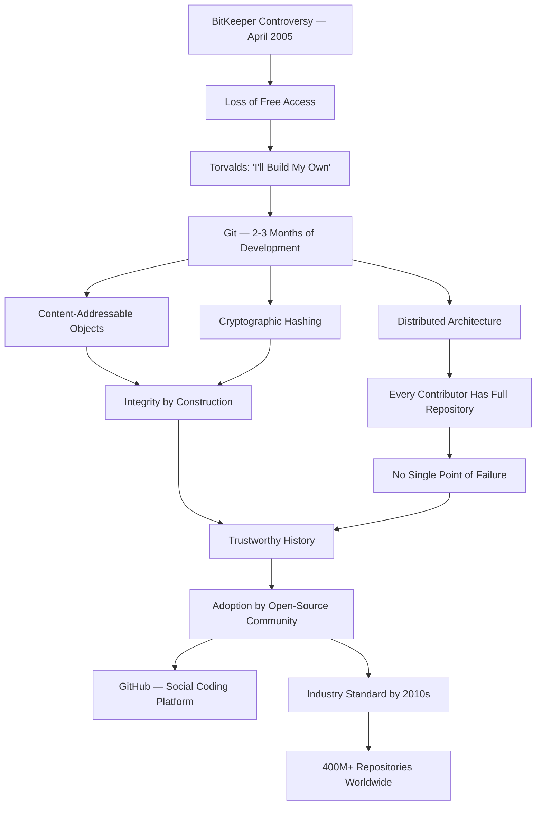
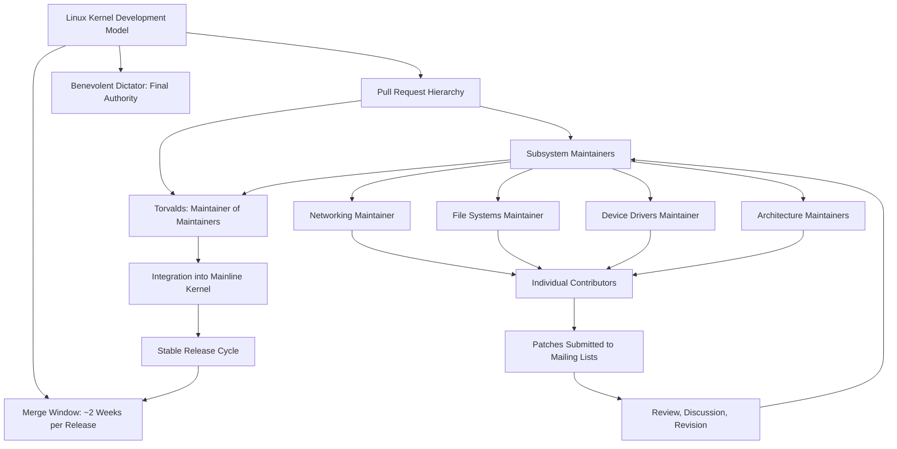
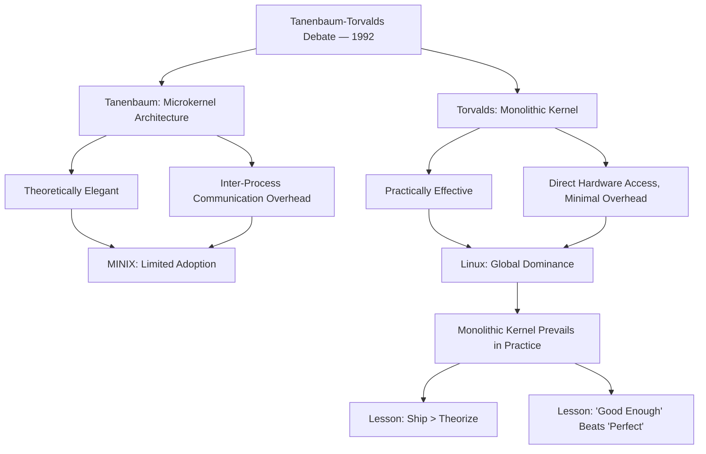
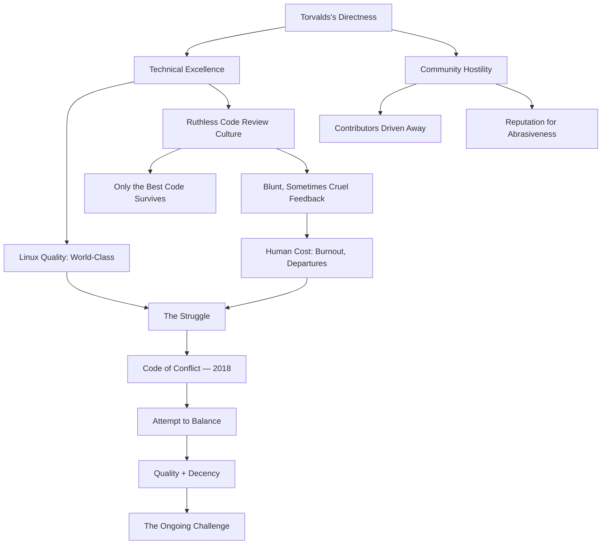
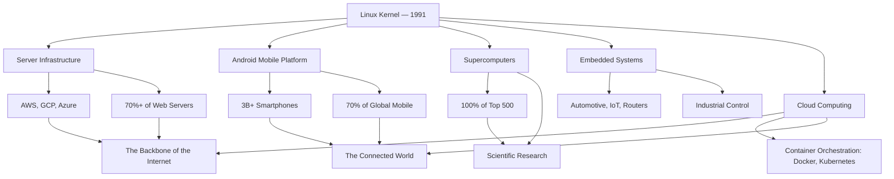
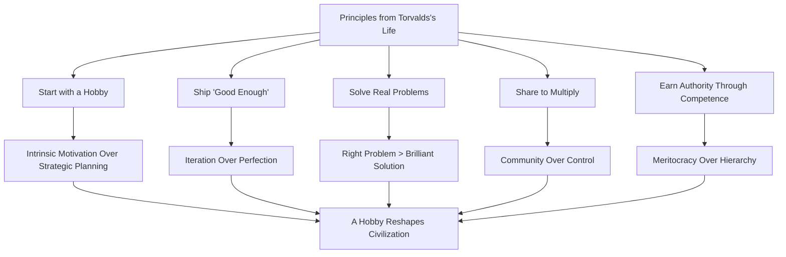

# Linus Torvalds

## Description

Linus Benedict Torvalds (born 28 December 1969 in Helsinki, Finland) is a Finnish-American software engineer whose creation of the Linux kernel and the Git version control system constitutes one of the most consequential acts of individual engineering in the history of technology. Where Dennis Ritchie and Ken Thompson built the proprietary Unix infrastructure that underpinned the computing industry of the 1970s and 1980s, Torvalds built the free and open successor that would come to dominate the 1990s, 2000s, and beyond — an operating system kernel that now runs on more than seventy percent of the world's servers, every Android smartphone, the vast majority of supercomputers, and the lion's share of cloud infrastructure. His life is a study in the paradox of the hobby project that consumes the world: a work begun in solitude, for personal satisfaction, that became the foundation upon which the connected world was rebuilt. To study Torvalds is to understand that the most transformative technologies often emerge not from corporate strategy or academic research programs but from individual conviction — the willingness to build something because it needs to exist, and to share it because hoarding is a form of waste.

## Prerequisites

- [Dennis Ritchie](dennis-ritchie.md) — whose C language and Unix operating system Torvalds inherited, extended, and ultimately superseded in influence
- [Ken Thompson](ken-thompson.md) — whose philosophy of simplicity and practical engineering Torvalds embodied in a new context and a new era

The reader is expected to possess a basic understanding of operating systems, version control systems, and the historical development of computing from the 1960s onward. Familiarity with the concept of a kernel — the core component of an operating system that manages hardware resources and provides services to user-level programs — will be assumed throughout.

## Table of Contents

- [Origins — A Hobby Project in Helsinki](#-origins--a-hobby-project-in-helsinki)
- [The Work — Building the Infrastructure of the Connected World](#-the-work--building-the-infrastructure-of-the-connected-world)
- [Struggles and Failures — The Cost of Maintaining the World's Most Important Software](#-struggles-and-failures--the-cost-of-maintaining-the-worlds-most-important-software)
- [Legacy and Lessons — When a Hobby Project Reshapes Civilization](#-legacy-and-lessons--when-a-hobby-project-reshapes-civilization)

## 🌱 Origins — A Hobby Project in Helsinki

### A Household of Words and Numbers

Linus Benedict Torvalds was born on 28 December 1969 in Helsinki, Finland, into a family that straddled the boundary between the humanities and the sciences with unusual fluency. His grandfather, Ole Torvalds, was a journalist and statistician — a man who understood both the power of narrative and the discipline of quantitative analysis. His parents, Nils and Anna Torvalds, were both students at the University of Helsinki, and the household in which Linus grew up was one in which intellectual curiosity was assumed and education was treated not as a chore but as a natural extension of being alive.

The significance of this lineage is not merely biographical color. It is foundational. A child raised in a home where words and numbers are both valued — where a journalist grandfather treats the careful construction of a sentence with the same seriousness that a statistician treats the careful construction of a model — absorbs a particular kind of intellectual discipline. The young Torvalds did not grow up in a household of engineers, but he grew up in a household of rigorous thinkers. The distinction matters because it explains something about his later work: the precision of his code, the clarity of his prose on mailing lists, and his insistence that software should be readable, not merely functional. These are the habits of mind cultivated in a home where both language and logic were treated as crafts.

Finland itself shaped Torvalds in ways that are easy to overlook. Finland in the 1970s and 1980s was a small country with a outsized commitment to education, a culture of self-reliance forged by geography and climate, and — critically for Torvalds's future — a strong tradition of engineering. The Finnish educational system emphasized mathematics and science, and Torvalds excelled in both. But Finland's most important contribution to his development may have been cultural rather than academic: a national temperament that valued substance over style, directness over diplomacy, and getting things done over talking about getting things done. This temperament would later define Torvalds's leadership style — admired by many, abrasive to others, and relentlessly focused on the work itself.

There is a particular quality to Finnish pragmatism that is difficult to describe to those who have not experienced it. It is not cynicism, though it can be mistaken for it. It is not indifference, though its practitioners are often accused of it. It is, rather, a refusal to engage in the performance of enthusiasm — a cultural norm that treats emotional restraint as a form of respect and directness as a form of courtesy. In a culture where "say what you mean" is a social contract, bluntness is not rudeness; it is honesty. Torvalds carried this cultural inheritance into the global arena of software development, where it collided with norms that privileged politeness, diplomacy, and the careful management of interpersonal perception. The collisions were frequent, and the cultural misunderstandings they produced remain one of the most persistent sources of friction in the Linux kernel community.

### The Discovery of Computing

Torvalds's encounter with computing came not through formal education but through curiosity. In the early 1980s, when he was in his early teens, his grandfather Ole gave him a Commodore VIC-20 — an early home computer with a 6502 processor, 5 kilobytes of RAM, and a built-in BASIC interpreter. The machine was primitive by any standard, but for a thirteen-year-old with a natural aptitude for logical thinking, it was a revelation. Torvalds taught himself to program, spending long hours writing simple games and utilities in BASIC, exploring the boundaries of what the machine could do.

The VIC-20 was not merely a toy. It was an instrument of self-discovery — a machine that responded to logic, that executed commands exactly as written, and that could be made to do anything its user could express in code. For a child who had absorbed both the journalist's love of precise expression and the statistician's love of precise analysis, the computer was a natural medium. It demanded both: the clarity to articulate what you wanted the machine to do, and the logical rigor to express that desire in a form the machine could execute. Torvalds later described his early programming as driven not by ambition but by fascination — the sheer pleasure of making something work. This is a critical distinction. The hobbyist and the professional are separated not by talent but by motivation. The hobbyist builds because the act of building is its own reward. The professional builds because someone is paying. Torvalds began as a hobbyist, and the habits of the hobbyist — the intrinsic motivation, the freedom to experiment, the absence of external deadlines — would shape everything he later created.

### University of Helsinki and the Tanenbaum Encounter

In 1988, Torvalds enrolled at the University of Helsinki to study computer science. He was eighteen years old. The university's computer science department was small but rigorous, and Torvalds performed well without being particularly distinguished as a student. He was more interested in doing than in studying — a disposition that would become the defining characteristic of his career.

The event that changed the trajectory of his life was not a lecture, a professor, or a research project. It was a textbook. In 1990, Torvalds encountered Andrew S. Tanenbaum's *Operating Systems: Design and Implementation* — a book that came bundled with the source code of MINIX, a small Unix-like operating system designed for educational purposes. Tanenbaum had written MINIX to teach operating system principles, and the book explained, line by line, how an operating system kernel works: process scheduling, memory management, file systems, device drivers.

For Torvalds, the effect was electric. Here was a complete operating system — small, comprehensible, and written in C — that he could read, modify, and learn from. MINIX demonstrated that an operating system was not an impenetrable monolith controlled by corporations but a piece of software that a competent programmer could understand and, potentially, build. The textbook did not merely teach Torvalds about operating systems. It convinced him that he could write one himself.

The experience of reading a complete operating system's source code is transformative for any serious programmer. Before the encounter, an operating system is an abstraction — a concept defined by textbooks and lectures. After the encounter, it is concrete — a collection of functions, data structures, and algorithms that can be read, understood, and modified. Tanenbaum's genius was not in building MINIX but in making it readable. By distributing the source code alongside the textbook, he converted an opaque system into a transparent one, and in doing so, he created the conditions for something he had not anticipated: a student who would read the code, understand it, and decide to build something better.

### The Teenage Hacker

The years between the arrival of the VIC-20 and the enrollment at the University of Helsinki were formative in ways that are not fully captured by the chronology. Torvalds was not a prodigy in the conventional sense — he did not publish papers, win competitions, or attract the attention of the academic establishment. He was, instead, a teenager who found in computers a medium that matched his temperament: logical, responsive, and free from the social ambiguities that made adolescence difficult for a child more comfortable with machines than with people.

His father, Nils, had transitioned from journalism to television documentary filmmaking, and the family moved to the Espoo suburb of Helsinki. The household was not wealthy, and the resources available to Torvalds were modest by the standards of the computing world. He did not have access to the kinds of machines that university students in the United States took for granted. What he had was curiosity, time, and a willingness to read documentation that most teenagers would find impenetrable. He taught himself assembly language, explored the internals of the 386 processor, and developed an intimate understanding of how hardware and software interacted at the lowest level. This was not formal education. It was self-directed exploration, and it produced a kind of knowledge — practical, intuitive, grounded in direct experience with the machine — that formal education rarely provides.

The distinction between the self-taught and the institutionally taught is not a hierarchy of quality but a difference in epistemology. The self-taught programmer knows things through direct encounter: they have written code that crashed, debugged it by reading assembly, and developed a feel for performance that is more instinct than analysis. The institutionally taught programmer knows things through abstraction: they have studied algorithms, complexity theory, and formal methods. Torvalds was emphatically the former. His strength was not theoretical sophistication but practical mastery — the ability to look at a piece of code and know, without measuring, whether it was fast enough, clean enough, and correct enough. This instinct would prove more valuable than any degree.
### The comp.os.minix Post

On 25 August 1991, Torvalds posted a message to the comp.os.minix Usenet newsgroup that would become one of the most consequential communications in the history of technology. The post was brief, unassuming, and characteristically direct:

> Hello everybody out there using minix — I'm doing a (free) operating system (just a hobby, won't be big and professional like gnu). This has been brewing since april, and is starting to get ready. I'd like any feedback on things people like or dislike in minix; as my OS resembles it somewhat (same physical layout of the file-system (due to practical reasons) among other things).

The message is remarkable for what it does not say. There is no grand vision. There is no manifesto. There is no declaration that this operating system will change the world. Torvalds described his project as a hobby — something he was doing for personal satisfaction, not for publication, not for profit, and certainly not for historical significance. The parenthetical "(just a hobby, won't be big and professional like gnu)" is perhaps the most famous understatement in the history of computing.

What the post does reveal is the practical, incremental, and transparent approach that would define Linux development from its inception. Torvalds was not working in secret. He was not waiting for the project to be finished before sharing it. He was inviting feedback on something that was in progress — a work-in-progress that he was willing to show to the world because he believed that transparency and collaboration produced better results than isolation and perfectionism. This was not merely a development methodology. It was a philosophy — one that would eventually challenge the entire proprietary software industry and redefine how the world builds software.

## ⚙️ The Work — Building the Infrastructure of the Connected World

### The Linux Kernel: From Hobby to Infrastructure

The early development of Linux was driven by a single programmer working alone, in the margins of his university studies, on hardware that most professionals would have considered beneath their attention. Torvalds did not have access to expensive workstations or corporate computing resources. He had an IBM PS/2 AT-compatible personal computer with an Intel 386 processor and 4 megabytes of RAM — a machine that was adequate for word processing and spreadsheet work but had never been intended as a development platform for an operating system kernel.

The constraints were severe, and they shaped the design. The 386 processor had a memory management unit that supported protected mode and virtual memory — features that Torvalds needed for a serious operating system but that MINIX, running on the simpler 8088, did not support. Torvalds decided to write his kernel from scratch, using the 386's hardware features directly, rather than modifying MINIX. This decision — driven partly by technical necessity and partly by Tanenbaum's licensing restrictions on MINIX — meant that Linux was not a derivative of MINIX but an independent implementation inspired by it. The distinction was legal as well as technical, and it would matter greatly in the years to come.

By September 1991, Torvalds had released version 0.01 of the Linux kernel. It was tiny by any standard — a few thousand lines of code that could boot, run a shell, and execute simple programs. It lacked networking, had limited device driver support, and could handle only a single user at a time. But it worked. It was a functioning Unix-like kernel running on commodity hardware, and it was freely available to anyone who wanted it. In the ecology of ideas, a seed that germinates is worth more than a seed that is merely perfect.

The earliest adopters were not corporations or universities but individual hackers — programmers who downloaded the kernel, installed it on their own machines, and began contributing patches. The community was small, intimate, and technically rigorous. There was no marketing, no documentation department, no public relations. There was a mailing list, a collection of source files, and a shared conviction that building a free operating system was worth doing. The growth was organic: one programmer told another, who told another, and the community expanded not through recruitment but through reputation. The kernel improved with every patch, and every improvement attracted more contributors. The flywheel was spinning.

The growth of Linux from 0.01 to a production-ready operating system was not a solo endeavor. What Torvalds created was not merely a kernel but a development model — a way of building software that harnessed the distributed intelligence of thousands of contributors across the globe. The Linux kernel mailing list became the central forum for discussion, debate, and code review. Patches were submitted, reviewed, criticized, revised, and eventually merged — all in public, all in real time, all governed by the quality of the code rather than the credentials of the author. This was the open-source development model in its purest form, and it was Torvalds who made it work.

By March 1994, Linux 1.0 was released with networking support. By the late 1990s, Linux was running on servers in universities and corporations around the world. By the 2000s, it had become the dominant operating system for web servers, and by the 2010s, it was the foundation of the Android mobile operating system, which would come to run on billions of smartphones. The trajectory from a hobbyist's bedroom in Helsinki to the backbone of the global communications infrastructure is not merely a success story. It is a paradigm shift — a demonstration that the open, collaborative, decentralized model of software development could produce results that rivaled and eventually surpassed those of the most well-funded corporations in the world.

### Git: The Version Control System Born from Frustration

The second great creation of Torvalds's career — the Git version control system — emerged from a crisis rather than from ambition. In April 2005, the Linux kernel development community lost access to BitKeeper, a proprietary version control system that Torvalds had been using to manage the kernel's source code. BitKeeper's owner, Larry McVoy, had granted free usage rights to the open-source community, but after a dispute over reverse engineering, those rights were revoked. The kernel community was suddenly without a tool capable of managing the complexity of a project with thousands of contributors and millions of lines of code.

Torvalds's response was characteristically direct: he built his own. In a matter of weeks — approximately two to three months of intensive development — Torvalds designed and implemented Git, a distributed version control system that was fundamentally different from every existing tool in its category. Where centralized systems like CVS and Subversion stored the authoritative copy of the repository on a single server, Git distributed the entire repository to every contributor. Where existing tools tracked changes to individual files, Git tracked changes to the content of the project as a whole — a content-addressable filesystem in which every object was identified by a cryptographic hash of its contents. Where existing tools were slow on large projects, Git was fast, because its data model was designed for the specific needs of the Linux kernel: a project with enormous history, thousands of concurrent contributors, and a branching model that required extreme flexibility.

The design of Git revealed something important about Torvalds's engineering philosophy. He did not build Git to be elegant. He did not build it to be user-friendly — and indeed, Git's command-line interface was widely criticized for its opacity and inconsistency. He built it to work. The internal data model was pristine; the user interface was an afterthought. This was engineering in the tradition of Unix: the underlying mechanism was sound, and the surface could be polished later by others. Git's internal architecture — the directed acyclic graph of commits, the object database, the packfile format — was a masterpiece of systems design. Its user interface was, at best, a work in progress. Both dimensions were necessary, but it was the architecture that made Git indispensable.

Git's adoption was rapid and total. By the late 2000s, virtually every open-source project had migrated to Git. By the 2010s, GitHub — a platform built on Git — had become the de facto home of open-source software development, hosting more than four hundred million repositories by the early 2020s. Git was not merely a tool for managing source code. It was the infrastructure of collaborative creation itself — the mechanism by which distributed teams of strangers could build complex systems together without central coordination. The irony of Git's origin — a tool for collaboration born from a dispute about access — was not lost on the community that adopted it.

### The Linux Kernel Development Model

The development model that Torvalds established for the Linux kernel is itself a significant contribution to the theory and practice of software engineering. The model is built on a small number of principles that are, in retrospect, obvious but were, at the time, revolutionary.

The first principle is the merge window. Every approximately ten weeks, a new kernel release is made, and a two-week "merge window" opens during which new features and changes are submitted for inclusion in the next release. Outside the merge window, only bug fixes and regressions are accepted. This cadence creates a rhythm of development that balances innovation with stability — a discipline that prevents the codebase from accumulating untested changes indefinitely.

The second principle is the pull request model. Subsystem maintainers — trusted developers responsible for specific areas of the kernel, such as networking, file systems, or device drivers — accumulate changes in their own repositories and submit them to Torvalds as pull requests. Torvalds reviews the changes, decides whether to merge them, and integrates them into the mainline kernel. This hierarchy of trust — Torvalds at the top, subsystem maintainers below, individual contributors below them — scales the development process to thousands of contributors without sacrificing quality control.

The third principle is the benevolent dictator model. Torvalds has final say over what enters the kernel. This is not a committee decision. This is not a vote. It is the judgment of a single individual who has the technical authority and the community trust to make binding decisions about the direction of the project. The model is effective precisely because it is not democratic: it eliminates the paralysis of consensus-building and the dilution of design-by-committee. The code either meets Torvalds's standards or it does not. The meritocratic simplicity of this arrangement is one of the reasons Linux has maintained its quality across three decades of development by thousands of contributors.

This model — distributed contribution governed by centralized authority — was not invented by Torvalds. It is, in essence, the same model used by the cathedral builders of medieval Europe: thousands of skilled craftspeople working under the direction of a master architect who held the vision. But Torvalds adapted it to the unique demands of software: the need for rapid iteration, the possibility of asynchronous collaboration across continents, and the requirement that every change be testable, reviewable, and reversible. The result is a development process that has produced the largest collaborative software project in human history — a codebase of more than thirty million lines of code, contributed by more than twenty thousand individual developers, spanning three decades of continuous development.

## 💔 Struggles and Failures — The Cost of Maintaining the World's Most Important Software

### The Tanenbaum-Torvalds Debate: IDEOLOGY vs. PRACTICALITY

The most famous intellectual dispute of Torvalds's early career was not with a competitor or a corporation but with the very professor whose textbook had inspired him to build Linux. In January 1992, Andrew Tanenbaum — the creator of MINIX and the author of the textbook that had catalyzed Torvalds's project — posted a message to comp.os.minix titled "LINUX is obsolete." The post was a frontal assault on Linux's design philosophy. Tanenbaum argued that microkernel architectures — of which MINIX was an example — were the correct approach to operating system design, and that Linux's monolithic kernel was a step backward to the 1970s. He predicted that Linux would not survive because its architecture was fundamentally flawed.

Torvalds's response was immediate, direct, and unapologetic. He argued that microkernels were theoretically elegant but practically inferior — that the overhead of inter-process communication introduced performance penalties that made microkernels unsuitable for real-world use. He pointed to Linux's performance on actual hardware as evidence that the monolithic approach, while less theoretically pure, produced better results. The debate continued for weeks, drawing in participants from across the computing world, and it crystallized a tension that remains relevant: the tension between theoretical elegance and practical effectiveness.

The historical verdict on the Tanenbaum-Torvalds debate is unambiguous. Linux won. Its monolithic kernel — augmented with loadable modules to achieve some of the modularity benefits of microkernels — became the dominant operating system kernel in the world. MINIX remained an educational tool. Tanenbaum's prediction that Linux was obsolete was, by any empirical measure, wrong. But the debate's significance extends beyond the question of which architecture was superior. It revealed a fundamental divide in the computing world — a divide between those who believed that theoretical correctness should drive design decisions and those who believed that practical results should drive them. Torvalds was emphatically in the latter camp, and his career is a sustained argument for the primacy of working software over elegant theory.

### The BitKeeper Controversy and the Birth of Git

The BitKeeper episode — already discussed in the context of Git's creation — was also a significant struggle. The controversy was not merely about a tool. It was about the fragility of dependence on proprietary infrastructure for open-source projects. When BitKeeper revoked the free license, the Linux kernel community was exposed — suddenly, vulnerablely, and publicly — to the consequences of building critical infrastructure on a foundation it did not control. The lesson was painful but clear: the open-source movement could not rely on proprietary tools, no matter how generous the terms of their use. Independence was not a luxury; it was a necessity.

Torvalds's decision to build Git rather than adapt an existing tool was driven by this realization. The existing open-source version control systems — CVS, Subversion — were inadequate for the Linux kernel's scale and workflow. They were centralized, which meant they could not support the distributed development model that the kernel community had adopted. They were slow on large projects, which meant they introduced friction into the development process. Torvalds did not merely want a tool that was free; he wanted a tool that was better — better suited to the specific demands of large-scale, distributed, asynchronous collaboration. The crisis forced innovation, and the innovation outlasted the crisis.

### Communication Style and the Cost of Directness

Torvalds is legendarily direct. His public communications — on mailing lists, in code reviews, and in interviews — are characterized by a bluntness that has alternately inspired admiration and provoked outrage. He has called code "crap," dismissed patches as "garbage," and told contributors that their designs were fundamentally misguided. This communication style is not accidental; it is rooted in a Finnish cultural norm that values directness over diplomacy and in an engineering conviction that honesty is more efficient than politeness.

The cost of this directness has been significant. Contributors — some talented, some well-intentioned — have been driven away from the Linux kernel community by the tone of the discourse. The Linux Kernel Mailing List (LKML) has been described as intimidating, hostile, and unwelcoming, and while Torvalds is not solely responsible for this culture, his behavior has set the tone. The kernel community has historically had a reputation for being one of the most abrasive environments in open-source software — a reputation that is, in part, a direct consequence of its leader's communication style.

The tension between technical excellence and human decency is one of the most important struggles in Torvalds's career. The Linux kernel's quality is, in part, a product of its ruthless code review culture — a culture in which substandard work is identified and rejected without ceremony. But that same ruthlessness can be directed not merely at the code but at the person who wrote it. The line between "your code is not good enough" and "you are not good enough" is thin, and Torvalds has crossed it more than once.

### The Code of Conflict and the Attempt at Transformation

In September 2018, Torvalds announced that he was taking a break from the Linux kernel community to work on his communication style. The announcement came after years of criticism about the tone of the kernel mailing list and was accompanied by the introduction of a "Code of Conflict" — a document that established standards for respectful interaction within the project. The Code of Conflict was not Torvalds's creation; it was developed by the kernel's top maintainers in his absence, and it represented a collective acknowledgment that the project's culture needed to change. The document established principles that seem obvious in retrospect — respect for fellow contributors, constructive criticism focused on technical issues rather than personal attacks, and an expectation that disagreements be resolved through technical argument rather than authority or volume. That such a document was necessary at all is a testament to the degree to which the kernel community's culture had drifted from these norms.

Torvalds returned after approximately a month, and the community has reported a noticeable improvement in his communication tone. The episode is significant not because it represents a dramatic personal transformation but because it reveals something important about the relationship between technical leadership and community health. The kernel community needed Torvalds's technical judgment; it also needed to be a place where talented people could contribute without being subjected to personal attacks. The Code of Conflict was an attempt to reconcile these two needs — to maintain the ruthless code quality that makes Linux reliable while creating a human environment that makes Linux sustainable.

The emotional toll of maintaining Linux is not merely a function of the communication style. It is a function of the responsibility itself. Linux is, by any reasonable measure, the most important piece of software ever created. It runs the internet. It runs Android. It runs the majority of the world's supercomputers, the majority of cloud infrastructure, and an enormous proportion of embedded systems. When Linux fails — when a kernel bug causes a system crash, a security vulnerability exposes millions of devices, or a performance regression disrupts a critical service — the consequences are not theoretical. They affect real systems that serve real people. The weight of that responsibility — the knowledge that one's decisions affect the infrastructure upon which civilization depends — is a burden that few humans have ever carried, and it is a burden that Torvalds has carried, largely alone, for more than three decades.

### The Question of Monetization

Torvalds's relationship with the commercial Linux ecosystem is complicated. Linux itself is free software, released under the GNU General Public License, which ensures that it can be used, modified, and redistributed by anyone. But the companies that built businesses on Linux — Red Hat, SUSE, Canonical, and others — generated billions of dollars in revenue from a product that Torvalds gave away. Torvalds himself worked for Transmeta, a semiconductor company, and later for the Linux Foundation, which pays him a salary to maintain the kernel. His personal financial return from Linux is modest compared to the economic value it has generated.

This disparity is not a source of public bitterness — Torvalds has consistently expressed indifference toward the commercial dimensions of Linux — but it is a fact that illuminates a deeper question about the economics of open source. The open-source model creates enormous value, but it does not always distribute that value to its creators. Torvalds solved this problem by not caring about it: he wanted to build the kernel, and the kernel was built, and the fact that others profited from it was, to him, irrelevant. Not everyone shares this indifference, and the tension between creating freely and profiting from creation remains one of the unresolved questions of the open-source movement.

The Linux Foundation's decision to employ Torvalds was, in part, a solution to this problem. The Foundation recognized that the most critical piece of infrastructure in the computing world should not depend on the financial circumstances of a single individual. By providing Torvalds with a salary, the Foundation ensured that he could continue to maintain the kernel without being forced to seek employment elsewhere or to commercialize his work. The arrangement is elegant in its simplicity: the community pays the maintainer to maintain, and the maintainer maintains. It is a model of stewardship — the recognition that certain works belong not to their creators but to the commons, and that the commons has a responsibility to sustain those who sustain it.

This model has not been universally replicated, and its uniqueness is itself instructive. The open-source ecosystem is littered with projects that burned out their maintainers — projects where a single individual bore the weight of critical infrastructure without institutional support, and eventually collapsed under the burden. Torvalds's arrangement with the Linux Foundation is the exception, not the rule, and it exists only because the Linux kernel is visible enough and critical enough to justify the expense. The thousands of less visible open-source maintainers who sustain the infrastructure of the digital world without comparable support represent an unresolved crisis at the heart of the open-source movement.

## 🌍 Legacy and Lessons — When a Hobby Project Reshapes Civilization

### The Scale of Linux's Dominance

The numbers are difficult to comprehend because they are so large. As of the mid-2020s:

- **Servers**: Linux runs on more than seventy percent of the world's web servers and a similar proportion of cloud computing infrastructure. Amazon Web Services, Google Cloud, and Microsoft Azure — the three largest cloud providers — all run on Linux.
- **Mobile**: Android, which is built on the Linux kernel, runs on approximately seventy percent of the world's smartphones — more than three billion devices.
- **Supercomputers**: One hundred percent of the world's top five hundred supercomputers run Linux. Every one.
- **Embedded systems**: Linux is the operating system of choice for routers, smart televisions, automotive infotainment systems, industrial controllers, and countless other embedded platforms.
- **Desktop**: Linux commands a small but growing share of the desktop market, and its influence on desktop computing through ChromeOS — Google's Linux-based laptop operating system — is substantial.

These numbers describe not merely a successful software project but a transformation of the computing industry itself. The proprietary operating system model — in which a single company controls the operating system, charges license fees, and restricts modification — has been supplanted, at the infrastructure level, by an open model in which the operating system is freely available and developed by a global community. This transformation was not inevitable. It was the result of specific decisions made by specific people, and the most important of those decisions was Torvalds's decision to make the Linux kernel freely available.

### The Open-Source Movement's Greatest Success Story

Linux is the proof of concept that the open-source model works — not merely as an academic experiment but as a practical, scalable, and durable approach to building critical infrastructure. Before Linux, open-source software existed, but it was largely confined to tools and utilities. Linux demonstrated that the model could produce something as complex and as critical as an operating system kernel — and that it could do so at a scale and with a quality that rivaled proprietary alternatives.

The success of Linux catalyzed a transformation in how software is built, distributed, and maintained. The open-source model — in which source code is freely available, contributions are accepted from anyone, and development is conducted in public — has become the default mode of software development for infrastructure, tools, and libraries. GitHub, GitLab, and other platforms have made the open-source workflow accessible to millions of developers. The culture of open contribution, peer review, and transparent decision-making that Torvalds pioneered with Linux has spread far beyond operating systems to encompass virtually every domain of software engineering.

The philosophical implications are profound. Linux demonstrated that a decentralized, voluntary, meritocratic community could produce work of higher quality than a centralized, hierarchical, profit-driven corporation. This is not a merely technical observation. It is a challenge to the fundamental assumptions of how human organizations should be structured. The Linux kernel development model suggests that the most effective organizations are not those that control their members but those that attract and retain the voluntary cooperation of talented individuals — that the best work emerges not from command but from invitation.

### What His Life Teaches

Linus Torvalds's biography offers principles that extend far beyond the technical:

**Start with a hobby, not a plan.** Torvalds did not set out to change the world. He set out to satisfy his curiosity. The Linux kernel was not the product of a business plan, a research grant, or a strategic vision. It was the product of a hobbyist's desire to understand how operating systems work. The lesson is not that planning is unnecessary — it is that the most transformative work often begins as play. The hobby project, pursued with intrinsic motivation and without the constraints of institutional expectations, can become something that no amount of strategic planning could have produced. This is because the hobbyist is free to follow the work wherever it leads, unburdened by the need to justify the effort in terms of market size, return on investment, or strategic alignment. The hobbyist's freedom is the entrepreneur's constraint: the freedom to pursue the wrong problem, which is also the freedom to discover the right one.

There is a paradox at the heart of this principle that deserves examination. The same freedom that allows the hobbyist to discover transformative problems also allows them to waste time on trivial ones. For every Linux, there are ten thousand hobby projects that went nowhere — not because they were poorly built but because they solved problems no one had. Torvalds's hobby project succeeded because it happened to solve a problem that the computing world desperately needed solved. The success was not guaranteed by the process; it was enabled by it. The lesson is not that all hobby projects succeed, but that the ones that do succeed often succeed precisely because they were not designed to succeed — because they were designed to be interesting, and interestingness, in the right context, is a proxy for value.

**"Good enough" beats "perfect."** The early versions of Linux were crude. The kernel lacked features, the code was sometimes inelegant, and the documentation was minimal. But it worked. It solved a real problem — the need for a free, Unix-like operating system on commodity hardware — and it was available immediately. The perfectionist waits until the product is flawless before sharing it; the pragmatist shares it as soon as it is useful. Torvalds understood that the value of software is not intrinsic to the code but extrinsic to the user — it exists only when someone can use it to solve a problem. Shipping early and iterating in public was not a compromise; it was a strategy. The imperfections of early Linux were not obstacles to its adoption; they were opportunities for the community to contribute, to improve, and to take ownership.

**Solving a real problem matters more than technical brilliance.** Linux succeeded not because Torvalds was the most talented programmer in the world — there were, by his own admission, many programmers more skilled than he — but because he solved the right problem at the right time. The computing industry needed a free, portable, Unix-like operating system, and Linux provided one. Technical brilliance in service of the wrong problem produces elegant irrelevance; moderate talent in service of the right problem produces world-changing infrastructure.

**Sharing multiplies impact.** Torvalds could have kept Linux private. He could have commercialized it, licensed it, or simply used it for his own purposes. Instead, he shared it freely, and this act of sharing transformed a personal project into a global movement. The lesson is that the value of creation is multiplied by distribution. A piece of software used by one person is a tool; a piece of software used by a million people is a platform. The willingness to share — to relinquish control and to trust others to build upon your work — is not generosity; it is leverage. It is the recognition that one's own contribution, however skilled, is finite, while the contributions of a community are, in principle, infinite.

**Authority is earned through competence, not position.** Torvalds's authority over the Linux kernel is not the result of a title, a corporate mandate, or an elected office. It is the result of thirty years of demonstrated technical judgment. Every decision he makes about the kernel is scrutinized by thousands of expert developers. His authority persists because his judgment is consistently correct — because the kernel, under his direction, has remained reliable, performant, and innovative. This is the rarest form of leadership: authority that is continuously earned rather than merely inherited. It is authority that depends not on institutional power but on the ongoing trust of a community that could, at any moment, choose a different leader. That they have not chosen a different leader is the most meaningful endorsement any maintainer could receive.

**Perseverance is the multiplier of talent.** Torvalds has maintained the Linux kernel for more than three decades. This is not a sprint; it is a lifelong commitment. Many programmers of equal or greater talent have produced more impressive individual contributions but have not sustained them over comparable periods. The compounding effect of three decades of consistent, focused work — the accumulation of knowledge, relationships, and judgment that comes from doing the same thing for a very long time — is something that no amount of raw talent can replicate. Persistence, in this light, is not merely a virtue. It is a competitive advantage of the highest order.

There is a quiet theological resonance in Torvalds's story that he himself might not articulate but that the narrative reveals. The pattern of the small, unassuming beginning that grows into something vastly greater than its origin — the mustard seed, the leaven in the dough — is a recurring motif in the Christian tradition, and it maps with surprising precision onto the trajectory of Linux. A hobby project, undertaken for no reason other than personal satisfaction, shared freely with no expectation of return, becomes the foundation upon which the connected world is built. The lesson is not that God intended Linux to be a success — that would be a doctrinal imposition on a secular narrative — but that the pattern of creation, in which small acts of faithfulness compound into consequences beyond the creator's imagination, is a pattern that resonates across contexts. Torvalds began with what he had, did what he could, and shared what he made. The result was more than he planned. This is a story that humbles ambition and affirms diligence, and it is a story whose deepest lesson is not about software but about the nature of creative work itself: that its consequences are never fully known to the one who begins it.

## 📝 Learning Tips

- **Read the Linux kernel source.** The Linux kernel is freely available, and its source code is a masterclass in systems programming. Begin with the `kernel/sched/` directory — the process scheduler — which is one of the most critical and most elegantly designed components. Reading kernel code is not an exercise for beginners, but it is the most direct way to understand how an operating system works and how Torvalds's design decisions manifest in practice.

- **Use Git from the command line.** Git's command-line interface is the most direct way to understand its data model. The graphical interfaces are convenient, but they obscure the underlying concepts: commits, trees, blobs, refs, and the directed acyclic graph that represents the project's history. Understanding these concepts through the command line will deepen your understanding of version control as a discipline, not merely as a tool.

- **Study the Tanenbaum-Torvalds debate.** The debate is available in its entirety on Usenet archives, and it is a valuable exercise in understanding the tradeoffs between theoretical elegance and practical effectiveness. The arguments are not merely historical; they are still relevant to every architectural decision in software engineering. The question "Is this theoretically correct?" and the question "Does this work?" are not the same question, and learning when each takes priority is a skill that distinguishes senior engineers from junior ones.

- **Follow the Linux kernel mailing list.** The LKML (Linux Kernel Mailing List) is one of the most active and technically rigorous forums in the history of computing. Following it provides exposure to the kind of code review, design discussion, and technical debate that produces high-quality software. The tone may be abrasive, but the content is exemplary.

- **Contribute to an open-source project.** The experience of contributing to a project governed by the Linux model — public code review, meritocratic standards, distributed collaboration — is transformative. It teaches not merely how to write code but how to communicate about code, how to accept criticism, and how to work within a community of peers who hold themselves and each other to high standards.

- **Trace Linux's influence on modern infrastructure.** Understanding how Linux underpins Android, cloud computing, container orchestration (Docker, Kubernetes), and embedded systems reveals the breadth of its impact. The kernel is not an isolated artifact; it is the foundation of an ecosystem that touches nearly every aspect of modern life.

- **Read *Just for Fun*.** Torvalds's autobiography, written with David Diamond, is an unconventional and revealing account of the Linux story. It is not a technical manual; it is a personal narrative that reveals the temperament, the motivations, and the daily reality of building something that grew far beyond its original scope. The book's title is itself a thesis: the most important work in technology is often done for no reason other than enjoyment.

## 📚 Glossary

| Term | Definition |
|------|------------|
| Linux kernel | The core component of the Linux operating system, created by Linus Torvalds in 1991, which manages hardware resources, process scheduling, memory allocation, and file system operations; the most widely deployed operating system kernel in the world |
| Git | A distributed version control system created by Linus Torvalds in 2005, designed for tracking changes in source code during software development; the most widely used version control system in the world |
| Monolithic kernel | An operating system kernel architecture in which the entire operating system runs in a single address space, providing direct access to all hardware; the architecture chosen by Torvalds for Linux |
| Microkernel | An operating system kernel architecture in which only the most basic services (process scheduling, memory management, inter-process communication) run in kernel mode, with other services implemented as user-level processes; the architecture advocated by Tanenbaum for MINIX |
| MINIX | A small Unix-like operating system created by Andrew Tanenbaum for educational purposes, distributed with his textbook *Operating Systems: Design and Implementation*; the direct inspiration for Linux |
| Open source | A development and licensing model in which the source code of software is made freely available and may be modified and redistributed by anyone; the model under which Linux and Git are developed |
| GNU General Public License (GPL) | A free software license that requires derivative works to also be released under the same license, ensuring that software and its modifications remain freely available; the license under which the Linux kernel is released |
| Benevolent dictator for life (BDFL) | A leadership model in which a single individual has final authority over a project's direction; the model Torvalds maintains for the Linux kernel |
| Merge window | The approximately two-week period following a Linux kernel release during which new features and changes are submitted for inclusion in the next release |
| Pull request | A method of submitting contributions to a project in which a developer requests that changes from their repository be merged into the main repository |
| Content-addressable storage | A storage mechanism in which data is addressed by the cryptographic hash of its contents rather than by a location or filename; the fundamental data model of Git |
| Directed acyclic graph (DAG) | A mathematical structure used by Git to represent the history of commits, where each commit points to its parent(s) and no path cycles back to an earlier commit |
| Kernel mailing list | The primary communication forum for Linux kernel development, where patches are submitted, reviewed, and discussed; one of the most technically rigorous public forums in computing |
| Embedded system | A computer system designed for a specific function within a larger system, often with real-time constraints; Linux is the dominant operating system for embedded platforms |
| Supercomputer | The most powerful class of computers, used for scientific and engineering calculations; one hundred percent of the world's top five hundred supercomputers run Linux |
| Code of Conflict | A document introduced into the Linux kernel project in 2018 establishing standards for respectful interaction among contributors, developed by the kernel's top maintainers during Torvalds's temporary absence from the project |

## 📖 Quick References

- [The Linux Kernel Archives](https://www.kernel.org/) — the official source for Linux kernel releases, documentation, and development resources
- [Torvalds's Original comp.os.minix Post](https://groups.google.com/g/comp.os.minix/c/dlNtH7RRr8M/m/SwRavCzVE7gJ) — the August 1991 message in which Torvalds announced his hobby project to the world
- [Just for Fun: The Story of an Accidental Revolutionary — Linus Torvalds](https://www.amazon.com/Just-Fun-Story-Accidental-Revolutionary/dp/0066620732) — Torvalds's autobiography, covering the origins of Linux and his personal philosophy
- [The Tanenbaum-Torvalds Debate Archive](https://www.oreilly.com/openbook/opensources/book/appa.html) — the complete text of the 1992 Usenet debate about microkernels versus monolithic kernels
- [Git: The Official Documentation](https://git-scm.com/doc) — comprehensive documentation for the Git version control system, including its internal architecture
- [The Linux Foundation — Linus Torvalds](https://www.linuxfoundation.org/) — the organization that currently employs Torvalds to maintain the Linux kernel
- [LWN.net — Linux Weekly News](https://lwn.net/) — the most authoritative news source for Linux kernel development and the broader open-source ecosystem, covering kernel releases, developer profiles, and community debates with unusual depth and rigor
- [GitHub](https://github.com/) — the platform built on Git that has become the de facto home of open-source software development

## Next Steps

The story of Linus Torvalds intersects with and anticipates the work of other figures who shaped the digital world. Each of the following represents a different dimension of the same fundamental questions: what does it mean to build something that outlasts its creator? What is the relationship between sharing and impact? How does individual conviction translate into collective transformation?

- [Guido van Rossum](guido-van-rossum.md) (planned) — who followed the same pragmatic philosophy with Python, prioritizing readability and simplicity over theoretical purity
- [Tim Berners-Lee](tim-berners-lee.md) (planned) — who gave away his creation freely while Torvalds found a way to sustain his through corporate sponsorship and community governance
