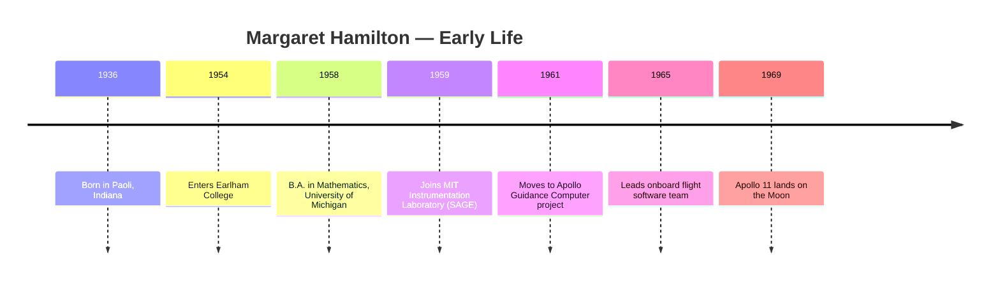
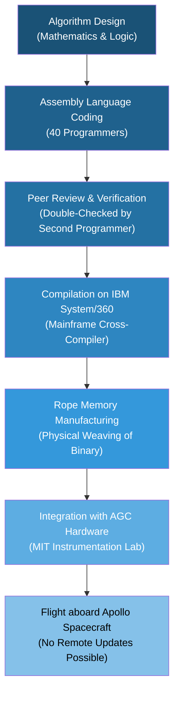
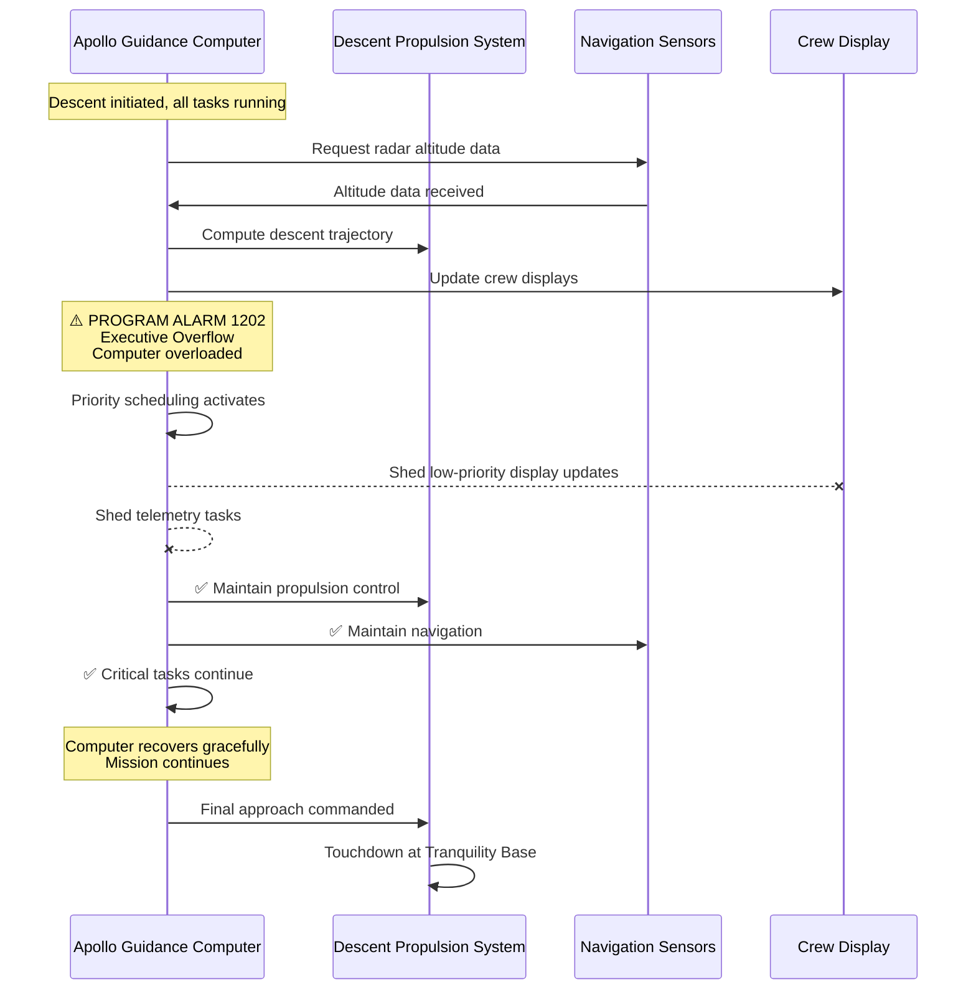
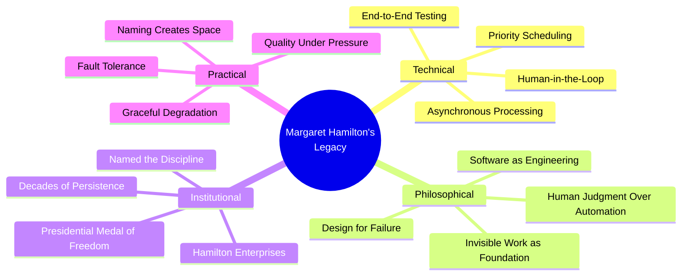

# Margaret Hamilton

## Description

Margaret Eleanor Hamilton (born August 17, 1936) is a mathematician, systems engineer, and software pioneer who led the team that wrote the onboard flight software for NASA's Apollo Guidance Computer — the software that landed humans on the Moon. She coined the term "software engineering" at a time when the discipline did not officially exist, and she built the conceptual framework for asynchronous processing, priority scheduling, and end-to-end testing that underpins every reliable system in the modern world. Her life is a study in what it means to name a discipline into existence, to fight for quality when lives depend on it, and to endure decades of institutional invisibility before the world catches up to what you built.

## Prerequisites

- [Hedy Lamarr](hedy-lamarr.md) — another woman whose technical contribution was overlooked by the institutions of her time
- [Grace Hopper](grace-hopper.md) — the predecessor who made programming accessible and established the discipline Hamilton would elevate

## Table of Contents

- [Origins — The Mathematician Who Found Software](#-origins--the-mathematician-who-found-software)
  - [A Childhood of Intellectual Independence](#a-childhood-of-intellectual-independence)
  - [Earlham and Michigan](#earlham-and-michigan)
  - [The MIT Instrumentation Laboratory](#the-mit-instrumentation-laboratory)
  - [Coining "Software Engineering"](#coining-software-engineering)
- [The Work — Code That Landed on the Moon](#-the-work--code-that-landed-on-the-moon)
  - [The Apollo Guidance Computer](#the-apollo-guidance-computer)
  - [Asynchronous Processing and Priority Scheduling](#asynchronous-processing-and-priority-scheduling)
  - [End-to-End Testing](#end-to-end-testing)
  - [The Apollo 11 Landing Alarms](#the-apollo-11-landing-alarms)
  - [Human-in-the-Loop Computing](#human-in-the-loop-computing)
- [Struggles and Failures — The Long Fight for Recognition](#-struggles-and-failures--the-long-fight-for-recognition)
  - [The Dismissal of Software as a Discipline](#the-dismissal-of-software-as-a-discipline)
  - [Hardware Over Software](#hardware-over-software)
  - [The Pressure of Life-or-Death Code](#the-pressure-of-life-or-death-code)
  - [Decades of Institutional Invisibility](#decades-of-institutional-invisibility)
- [Legacy and Lessons — The Woman Who Taught Machines to Think](#-legacy-and-lessons--the-woman-who-taught-machines-to-think)
  - [The Presidential Medal of Freedom](#the-presidential-medal-of-freedom)
  - [Hamilton Enterprises and System Resilience](#hamilton-enterprises-and-system-resilience)
  - [Naming Your Own Discipline](#naming-your-own-discipline)
  - [The Invisible Labor That Underpins Visible Achievements](#the-invisible-labor-that-underpins-visible-achievements)
  - [What Hamilton's Life Teaches](#what-hamiltons-life-teaches)

## 🌱 Origins — The Mathematician Who Found Software

### A Childhood of Intellectual Independence

Margaret Eleanor Hamilton was born on August 17, 1936, in Paoli, Indiana, a small town south of Indianapolis. Her father, Kenneth Earl Hamilton, was a philosopher who became the head of the philosophy department at Earlham College, a Quaker institution in Richmond, Indiana. Her mother, Ruth Esther Hall Hamilton, was a teacher who later became a businesswoman. The household was intellectual, austere, and oriented toward the life of the mind — the kind of environment in which a child absorbed the conviction that rigorous thinking was not a leisure activity but a responsibility.

The Hamilton family moved to Detroit when Margaret was young, then to the乡间 around Ann Arbor, where her father pursued graduate work. Margaret's childhood was shaped by two competing impulses: the abstract reasoning she inherited from her father's philosophical training, and the concrete mechanical curiosity that manifested in her fascination with how things worked. She was a reader, a thinker, and — crucially — a person who trusted her own judgment early. This trust would prove essential in the decades ahead, when the institutions she worked within insisted that software was not a real discipline and that the woman leading its development was not a real engineer.

From an early age, Margaret exhibited the quality that would define her career: an ability to hold complexity in her mind without reducing it. Where others simplified prematurely — collapsing a problem into its most familiar components — Margaret kept the full structure visible, holding multiple interacting variables in suspension until she understood their relationships. This is the cognitive signature of a systems thinker, and it would later allow her to see what others could not: that software was not a minor appendage to hardware but a complex, autonomous system that required its own engineering discipline.

Hamilton's childhood was not merely intellectually formative. It was morally constitutive. The Hamilton household operated on the Quaker principle that every person's work has intrinsic worth — that there is no hierarchy of labor, only a hierarchy of faithfulness. This conviction would sustain Hamilton through decades of institutional dismissal, because it provided a standard of value that was independent of the world's assessment. The work was worthy because it was done with care, not because it was recognized with applause.

### Earlham and Michigan

Hamilton enrolled at Earlham College in Richmond, Indiana, drawn by the family's connection to the institution — her father was a faculty member. She studied mathematics, a choice that was both natural and, in the context of the early 1950s, quietly radical. Women in mathematics were rare. Women who expected mathematics to be their profession were rarer still. The prevailing cultural assumption was that women studied mathematics as a pleasant intellectual exercise before settling into the roles of wife and mother. Margaret had no intention of settling.

At Earlham, she encountered the philosophy of education that her father embodied — the Quaker conviction that every person possesses inherent worth and the capacity for meaningful contribution. This was not abstract doctrine in the Hamilton household. It was lived practice. Kenneth Hamilton treated his daughter's intellectual ambitions with the same seriousness he afforded his students', and the college community reinforced the message: Margaret's mind was as capable as any man's, and the only barriers were the ones the world constructed.

She transferred to the University of Michigan to complete her bachelor's degree in mathematics, a decision that reflected both ambition and pragmatism. Michigan's mathematics department was stronger than Earlham's, and Margaret wanted the strongest possible preparation. She graduated with a B.A. in mathematics in 1958.

The timing was significant. Margaret Hamilton was twenty-two years old, armed with a mathematics degree, and the world of computing was on the verge of an explosion. The Soviet Union had launched Sputnik in 1957, and the United States was pouring resources into science and technology with an urgency born of Cold War anxiety. The space race was beginning, and it would demand exactly the kind of mind Margaret Hamilton had spent her childhood cultivating.

### The MIT Instrumentation Laboratory

In 1959, at the age of twenty-two, Margaret Hamilton joined the MIT Instrumentation Laboratory — later renamed the Charles Stark Draper Laboratory — to work on the SAGE air defense system. SAGE (Semi-Automatic Ground Environment) was one of the largest computing projects in history, a vast network of radar stations and computers designed to detect and track Soviet bombers. It was the first large-scale real-time computing system, and it introduced Hamilton to the concept that would become her life's work: software that interacted with the physical world in real time.

The experience at SAGE was formative. Hamilton learned that real-time computing imposed constraints that batch processing did not: the software could not crash, could not produce incorrect results, and could not take longer than the system's response window to complete its calculations. The consequences of failure were not academic. If the software failed, the system failed. If the system failed, the defense network failed. The code had to be right the first time, every time, under all conditions.

This was a radical departure from the prevailing culture of programming, in which errors were expected, debugging was routine, and software quality was measured by whether the program eventually produced the correct output, not by whether it produced it reliably and on time. Hamilton absorbed the lesson: in real-time systems, software is not a secondary concern. It is the primary concern. The hardware is merely the substrate. The software is the intelligence.

In 1961, Hamilton moved to the MIT Instrumentation Laboratory's Apollo division, where she would lead the development of the onboard flight software for the Apollo Guidance Computer — the machine that would navigate astronauts to the Moon and back.

### Coining "Software Engineering"

In 1962, Margaret Hamilton coined the term "software engineering." She chose the term deliberately, borrowing the rigor and legitimacy of "hardware engineering" to elevate a discipline that had no name, no formal methodology, and no institutional respect.

The term was initially met with skepticism, even ridicule. In the early 1960s, software was considered a minor activity — the clerical work that followed the real work of hardware design. Programmers were seen as typists who entered instructions into machines. The idea that programming constituted an engineering discipline — that it required the same rigor, methodology, and accountability as building bridges or designing circuits — was dismissed by many in the field as grandiose.

Hamilton later recalled:

> "I started calling it software engineering to give it the same legitimacy as hardware engineering. People laughed at the term. They said, 'There is no such thing as software engineering.'"

The laughter reveals the institutional mindset that Hamilton was confronting. In the early 1960s, computing culture drew a sharp hierarchy: hardware was serious, software was auxiliary. Hardware engineers were professionals. Software programmers were operators. The distinction was not merely semantic. It was structural, embedded in funding decisions, organizational charts, and career trajectories. Hardware received budgets, laboratories, and institutional prestige. Software received leftover time on machines and the assumption that any bright person could write a program.

Hamilton's coinage was an act of institutional warfare. By naming the discipline "software engineering," she was not merely describing what she did. She was asserting what it should be: a rigorous, methodical, accountable discipline with its own standards, its own body of knowledge, and its own claim to institutional respect. The name was the first step. The work that followed — the development practices, the testing methodologies, the quality standards — would fill the name with substance.

The term gained acceptance slowly. By the 1970s, "software engineering" had become the standard designation for the discipline. Today, it is the foundation of a global industry. The fact that the name exists at all — that we do not merely say "programming" but "software engineering" — is Hamilton's contribution. She named the discipline into existence, and in doing so, she created the conceptual space within which an entire industry could develop.

## 🔧 The Work — Code That Landed on the Moon

### The Apollo Guidance Computer

The Apollo Guidance Computer (AGC) was one of the most ambitious computing projects ever undertaken. It was the first computer to be miniaturized and embedded in a spacecraft — a machine that had to fit within the tight weight and volume constraints of the Apollo command and lunar modules, while simultaneously navigating the spacecraft, controlling the propulsion system, managing the displays, and executing the guidance algorithms that would land humans on the Moon.

The AGC was built by MIT's Instrumentation Laboratory under the direction of Charles Stark Draper. The hardware was designed by a team led by Ivan Getting and Eliot Levin. But the software — the intelligence that transformed the hardware from a collection of circuits into a thinking machine — was Margaret Hamilton's responsibility.

The AGC was, by modern standards, extraordinarily limited. It had approximately 2,048 words of RAM and 36,864 words of read-only memory. For comparison, a modern smartphone has roughly one million times more memory. Every instruction mattered. Every byte was precious. The software had to accomplish its mission within constraints that would make a modern engineer weep — and it had to do so flawlessly, because there was no backup, no restart, and no second chance.

Hamilton assembled and led a team of approximately forty programmers — many of them women — who wrote the AGC software in assembly language, a low-level programming language that provided direct control over the machine's hardware. The code was entered by hand on paper tape, verified by a second programmer, and compiled on an IBM System/360 mainframe before being transferred to the AGC's read-only memory through a process called "rope memory" — a physical manufacturing process in which wires were threaded through or around magnetic cores to represent binary data.

The rope memory process was, in itself, an engineering marvel. The software was literally woven into the hardware. Once the rope memory was manufactured, the code could not be modified without rebuilding the memory from scratch. This constraint imposed an extraordinary discipline on the software development process: every instruction had to be correct before the rope was woven, because fixing a bug after manufacturing was prohibitively expensive.

### Asynchronous Processing and Priority Scheduling

Hamilton's most consequential technical innovation was the development of asynchronous processing and priority scheduling for the AGC. This was not a theoretical contribution. It was a practical solution to a problem that the existing computing paradigms could not address.

In conventional batch processing, programs ran sequentially. One program completed before the next began. The computer's resources were allocated in a predetermined order, and there was no mechanism for the system to respond to unexpected events or to prioritize urgent tasks over routine ones.

This model was inadequate for a spacecraft. The Apollo mission required the computer to handle multiple simultaneous tasks — navigation, guidance, propulsion control, crew interface, telemetry — each with different timing requirements and different levels of urgency. A navigation calculation that was two seconds late was a navigation calculation that was useless. A propulsion control command that arrived after the engine had already fired was a command that could cause disaster. The system needed to respond to events as they occurred, not in a predetermined sequence.

Hamilton designed an asynchronous executive — a software architecture in which the computer allocated its processing time dynamically, based on the priority of incoming tasks. High-priority tasks (such as engine control during lunar descent) could interrupt low-priority tasks (such as telemetry updates). The system could adapt to changing conditions in real time, reassigning resources as the mission's needs evolved.

This was a radical concept in the early 1960s. The prevailing wisdom held that computers should execute instructions in a fixed sequence. The idea that a computer should decide, on its own, which task to execute next was philosophically unsettling to many engineers. It introduced an element of unpredictability into a system that was supposed to be deterministic.

Hamilton argued that the unpredictability was not a flaw. It was a feature. The spacecraft operated in an unpredictable environment. The software had to match that unpredictability with adaptive behavior. Determinism, in this context, was a liability, not an asset.

The priority scheduling system was one of the first implementations of what would later be called an interrupt-driven architecture — a concept that now underlies every operating system, every real-time system, and every multitasking computer on earth. When your smartphone switches between apps, when your car's engine control unit adjusts fuel injection in response to sensor data, when a hospital monitor prioritizes a cardiac alarm over a routine temperature reading — all of these systems are executing, in descendant form, the principles that Hamilton's team built into the AGC.

### End-to-End Testing

Hamilton also pioneered the concept of end-to-end software testing — the practice of testing the complete system under realistic conditions, including failure scenarios, rather than testing individual components in isolation.

The prevailing approach to software testing in the early 1960s was component testing: each module was verified independently, on the assumption that if the components worked correctly, the system would work correctly. Hamilton recognized that this assumption was false. Software systems fail not because individual components are broken but because components interact in unexpected ways. A navigation module that produces correct output in isolation may produce incorrect output when it receives unexpected input from a malfunctioning sensor. The failure is not in the component. It is in the interaction.

Hamilton designed test scenarios that simulated not only normal mission conditions but also equipment failures, crew errors, and emergency situations. Her team tested what would happen if the astronaut entered incorrect data, if a sensor failed mid-flight, if the computer was overloaded with simultaneous tasks. These were not hypothetical scenarios. They were simulations of the kinds of failures that actually occur in complex systems — and they revealed vulnerabilities that component testing would never have detected.

The discipline of end-to-end testing was Hamilton's most transferable contribution. It established the principle that software quality is a property of the system, not of its parts — a principle that now governs software development practices in every industry, from aerospace to finance to healthcare.

### The Apollo 11 Landing Alarms

On July 20, 1969, Apollo 11 descended toward the lunar surface. Neil Armstrong and Buzz Aldrin were in the lunar module, *Eagle*, while Michael Collins orbited above in the command module, *Columbia*. The descent was proceeding nominally when, at an altitude of approximately 30,000 feet, the AGC began triggering program alarms — specifically, Executive Overflow alarms (codes 1202 and 1202, and later 1201 and 1202), indicating that the computer was being asked to execute more tasks than it had allocated processing time for.

The alarms were terrifying. In a system designed for deterministic execution, an overflow alarm meant that the computer was overwhelmed — that it could not keep up with the demands being placed on it. For a system responsible for guiding a spacecraft to the surface of the Moon, an overloaded computer was not an inconvenience. It was a potential catastrophe.

But Hamilton's design saved the mission. The priority scheduling system that she had built — the asynchronous executive that dynamically allocated processing time — detected the overload and responded according to its design. It shed low-priority tasks (telemetry and display updates) to free processing capacity for the critical tasks (guidance and navigation). The computer continued to function correctly despite the overload, because Hamilton had anticipated this scenario and built a system that could gracefully degrade under pressure rather than failing catastrophically.

The ground controllers in Houston were confronted with a decision: continue the descent or abort. Steve Bales, the guidance officer, consulted with his support team and made the call to continue. The alarms, he determined, were not indicative of a fundamental system failure. They were evidence that the priority scheduling system was working exactly as designed — shedding non-essential tasks to preserve essential ones.

The lunar module landed safely at 20:17:40 UTC on July 20, 1969. Armstrong's words — "Houston, Tranquility Base here. The Eagle has landed" — have become one of the most famous sentences in human history. Behind those words was Margaret Hamilton's software, executing under conditions that would have caused a conventional system to fail.

### Human-in-the-Loop Computing

Hamilton's work on the AGC established the principle of human-in-the-loop (HITL) computing — the idea that automated systems should be designed to collaborate with human operators rather than to replace them. The AGC did not operate autonomously. It provided recommendations, computed trajectories, and controlled the propulsion system, but the astronauts retained final authority over critical decisions. The computer could suggest; the human decided.

This principle was not merely a safety feature. It was a philosophical statement about the relationship between humans and machines. Hamilton understood that the most dangerous systems are those that remove human judgment entirely — systems that automate without providing the operator with the information needed to intervene. The AGC was designed to keep the astronauts informed, to present data in a format they could interpret, and to respond to their commands while also providing automated backup in case of human error.

The HITL principle anticipated decades of debate about automation and autonomy. It found its modern expression in aviation (where autopilot assists but does not replace the pilot), in medicine (where clinical decision support systems assist but do not replace the physician), and in software engineering itself (where continuous integration systems assist but do not replace the code reviewer). Hamilton's insight was that the optimal system is not the one that removes the human but the one that empowers the human — that provides automation as a tool for human judgment, not a substitute for it.

## ⚔️ Struggles and Failures — The Long Fight for Recognition

### The Dismissal of Software as a Discipline

The most persistent struggle of Hamilton's career was the institutional refusal to recognize software as a legitimate engineering discipline. When she coined "software engineering" in 1962, the term was met with derision. When she insisted on testing methodologies, quality standards, and development processes for the AGC software, she encountered resistance from engineers who viewed software as a secondary activity — the execution of instructions that the "real" engineers had designed.

The dismissal was not merely intellectual. It was structural. Software developers were not classified as engineers in the military and aerospace hierarchies. They did not receive the same compensation, the same institutional support, or the same career advancement as hardware engineers. The assumption was that software was a natural extension of hardware design — that anyone who understood the hardware could write the software, and that the software itself required no special expertise.

Hamilton fought this assumption with the only weapon available to her: the quality of her work. The AGC software had to be more reliable than any software ever written, because the lives of three astronauts depended on it. Hamilton imposed standards that were unprecedented in the software industry — standards of documentation, testing, peer review, and quality assurance that had no precedent because the discipline she was building had no precedent.

The irony was sharp. The very discipline that the aerospace establishment refused to recognize was the discipline that would land humans on the Moon. The hardware was necessary but insufficient. Without Hamilton's software, the AGC was an inert collection of circuits. The software gave it intelligence. The intelligence made the mission possible.

### Hardware Over Software

The bias toward hardware over software manifested in specific, material ways. Funding for hardware development consistently exceeded funding for software development. Hardware teams received larger budgets, more personnel, and more institutional attention. Software teams were expected to accomplish their work with fewer resources and less time, on the assumption that software was simpler and faster to produce than hardware.

This assumption was catastrophically wrong. Software, particularly the kind of real-time, safety-critical software that the Apollo program demanded, was at least as complex as hardware — and in many ways more so. Hardware failures are often gradual and detectable. Software failures are instantaneous and, without rigorous testing, unpredictable. A single misplaced instruction in the AGC could cause a lunar module to crash into the Moon's surface.

Hamilton's team was chronically underfunded and understaffed relative to the complexity of their task. They compensated through discipline, methodology, and an uncompromising commitment to quality that often put them at odds with the project's management. Hamilton pushed for more testing time, more review cycles, and more development resources. Management pushed for faster delivery and lower costs. The tension was structural — a consequence of the institutional hierarchy that placed hardware above software — and it did not resolve during the Apollo program. It resolved only gradually, over decades, as the software industry matured and the world came to understand what Hamilton had known from the beginning: software is not a minor activity. It is the primary activity.

### The Pressure of Life-or-Death Code

The emotional weight of Hamilton's work is difficult to convey to those who have not experienced it. She was writing code on which human lives depended — not theoretically, not metaphorically, but literally. If the software failed during lunar descent, three astronauts would die on live television, and the United States' space program would be set back by years or decades.

This pressure was not hypothetical. Hamilton was acutely aware that every instruction she and her team wrote had to be correct under all conditions — not just normal operating conditions but also failure conditions, emergency conditions, and conditions that no one had anticipated. The testing process was designed to simulate every conceivable scenario, but the universe of conceivable scenarios is infinite, and the AGC's memory was finite. The team could not test everything. They had to make judgments about which failure modes were most likely, which scenarios were most dangerous, and which bugs were most critical — judgments that carried the weight of human lives.

Hamilton later described the experience of watching the Apollo 11 landing from Mission Control in Houston:

> "I was terrified. I knew the software was correct — we had tested it exhaustively — but I also knew that the real world is more complex than any test. When those alarms went off, I thought, 'This is it. This is the moment everything depends on.' And then the priority scheduling worked, and the computer recovered, and they landed. I cried."

The tears were not merely relief. They were the release of years of accumulated pressure — the pressure of knowing that her work mattered in the most literal sense possible, and the pressure of knowing that the institutions responsible for supporting her work had never fully valued it. The emotional cost of life-or-death code is a burden that Hamilton carried alone, because the culture of the 1960s had no framework for acknowledging it.

### Decades of Institutional Invisibility

After Apollo, Hamilton continued working in software engineering and systems design, but the public recognition that her work deserved did not come for decades. The Apollo program was remembered for its astronauts, its mission directors, and its political significance. The software — the invisible intelligence that made the missions possible — was largely forgotten.

Hamilton founded Hamilton Technologies, Inc. (later Hamilton Enterprises) in 1986, applying the principles she had developed during Apollo to commercial software development. The company focused on system resilience, reliability engineering, and the development of methods for building software that could not fail — an mission that was ahead of its time in the 1980s and 1990s, when the software industry was still grappling with the basics of quality assurance.

The long wait for recognition is itself a lesson. Hamilton's contributions were visible to those who understood the technology — the engineers, the programmers, the systems designers who knew what the AGC software represented. But the broader public, the institutional hierarchies, and the cultural narrative of the space program did not have a place for a woman who wrote code. The astronauts were heroes. The engineers were builders. The software developer was invisible.

This invisibility was not accidental. It was a consequence of the same institutional hierarchies that had dismissed software engineering as a discipline. If software is not a real engineering activity, then the person who leads software development is not a real engineer. If the software team is a secondary support function, then its leader is a secondary figure. The institutional dismissal of software had a corollary: the institutional dismissal of software's practitioners.

Hamilton experienced this corollary not as a single dramatic event but as a slow, grinding accumulation of omissions. She was not invited to speak at conferences where her work was discussed. She was not cited in histories of the Apollo program. She was not included in the pantheon of computing pioneers that the industry celebrated. The work was there — the code that landed on the Moon, the asynchronous executive that saved Apollo 11, the testing methodologies that are now standard practice — but the name attached to the work was missing from the narrative.

### The Women Who Wrote the Code

Hamilton's team was unusual in another respect: many of its members were women. At a time when the computing industry was beginning to masculinize — a process that would accelerate through the 1970s and 1980s as personal computers entered the home and were marketed primarily to boys — Hamilton's Apollo team included a significant proportion of female programmers. These women designed, coded, tested, and documented the software that navigated astronauts to the Moon.

The contribution of these women has been largely erased from the historical record. They are not named in most accounts of the Apollo program. Their individual achievements — the algorithms they designed, the bugs they found, the documentation they produced — are attributed collectively, if they are attributed at all. The pattern is familiar: the work of women in technical fields is rendered invisible not by a single act of erasure but by the cumulative effect of a narrative that credits individual achievement only when the individual fits the expected profile.

Hamilton herself was generous in acknowledging her team's contribution. She understood that the AGC software was the product of collective effort — that no single person, however brilliant, could have produced the thousands of lines of assembly code that the system required. But the historical narrative has not reciprocated. The team remains largely anonymous, their names known only to specialists and historians.

This is not merely a historical grievance. It is a structural pattern that persists in the technology industry today. Women's contributions to software development are systematically underattributed. The code they write, the systems they design, and the bugs they prevent are less likely to be credited to them than identical contributions made by their male colleagues. Hamilton's team is an early instance of a pattern that the technology industry has yet to correct.

## 🌟 Legacy and Lessons — The Woman Who Taught Machines to Think

### The Presidential Medal of Freedom

On November 22, 2016, President Barack Obama awarded Margaret Hamilton the Presidential Medal of Freedom — the highest civilian honor in the United States. The citation recognized her leadership of the team that developed the onboard flight software for the Apollo program and her foundational contributions to software engineering as a discipline.

The award came forty-seven years after the Apollo 11 landing. It was, by any measure, long overdue. Hamilton was eighty years old. She had spent nearly half a century working in software engineering, systems design, and reliability engineering — and the world was only beginning to understand the scope of her contribution.

The Presidential Medal of Freedom was not merely a personal honor. It was an institutional acknowledgment that software engineering is a discipline of the highest importance — that the person who coined the term and built its foundational practices deserved recognition at the highest level of national honor. The award validated Hamilton's lifelong argument: that software is not a minor activity, that it requires the same rigor and accountability as any other engineering discipline, and that the people who build it deserve the same respect as those who build hardware.

### Hamilton Enterprises and System Resilience

Hamilton Technologies, Inc. — later operating as Hamilton Enterprises — was founded on a principle that Hamilton had developed during the Apollo program: that software should be designed for resilience, not just functionality. The company developed methods for building software systems that could detect and recover from errors in real time, that could degrade gracefully under stress, and that could maintain their integrity even when individual components failed.

This approach — now called resilience engineering, fault tolerance, or graceful degradation — was ahead of its time. In the 1980s and 1990s, the software industry was still learning the basics of quality assurance. Hamilton was already building systems that embodied the principles she had developed for the AGC: asynchronous processing, priority scheduling, and end-to-end testing under failure conditions.

The company's work influenced the development of fault-tolerant computing, real-time operating systems, and mission-critical software design across multiple industries. Its principles are now embedded in the software that runs airlines, hospitals, power grids, and financial systems — anywhere that software failure would cause catastrophic harm.

Hamilton's approach to system design at Hamilton Technologies can be summarized in a single principle: the system must be designed for the conditions under which it will fail, not the conditions under which it will succeed. This is the inverse of how most software was — and still is — designed. The prevailing practice is to build for the happy path: the normal operating conditions, the expected inputs, the standard workflows. Hamilton built for the unhappy path: the sensor failure, the crew error, the computer overload, the unexpected condition that no specification anticipated.

This principle — designing for failure rather than success — is now recognized as foundational in systems engineering. It underlies modern practices such as chaos engineering (in which systems are deliberately subjected to failure conditions to test their resilience), defensive programming (in which code is written to handle unexpected inputs gracefully), and the circuit breaker pattern (in which a failing component is isolated to prevent cascading failure). All of these practices trace their lineage, directly or indirectly, to the principles Hamilton developed for the AGC and later commercialized at Hamilton Technologies.

### Naming Your Own Discipline

One of the most transferable lessons of Hamilton's life is the power of naming. When she coined "software engineering" in 1962, she was not merely describing an activity. She was creating a category — a conceptual space within which an entire discipline could develop. The name gave practitioners an identity, gave institutions a label to organize around, and gave the world a framework for understanding what software developers do.

The act of naming is undervalued in professional culture. Most practitioners assume that the work speaks for itself — that if you build something good, the world will recognize it. Hamilton's experience suggests the opposite: if you do not name what you do, the world will name it for you, and the name it chooses will diminish your contribution. "Programming" sounds like a clerical activity. "Software engineering" sounds like a discipline. The difference in perception is not trivial. It determines funding, career advancement, institutional respect, and the self-understanding of the practitioners themselves.

The lesson extends beyond software. In every field, the person who names the discipline shapes its trajectory. Naming is an act of creation — it defines the boundaries of what the discipline encompasses, what standards it upholds, and what status it claims. Hamilton's coinage was not a marketing exercise. It was a declaration of independence for a field that had no other advocate.

### The Invisible Labor That Underpins Visible Achievements

Hamilton's career illuminates a pattern that recurs across the history of technology: the most important work is often the most invisible. The astronauts who walked on the Moon are remembered. The software that guided them there is not. The hardware that carried them is celebrated. The code that kept them alive is forgotten.

This pattern is not unique to Apollo. It operates in every domain where complex systems are built. The architect who designs the system's structure is invisible compared to the product manager who presents the finished product. The engineer who writes the foundational code is invisible compared to the executive who announces the launch. The tester who verifies reliability is invisible compared to the developer who ships the feature.

The invisibility is structural, not personal. It is a consequence of how institutions allocate attention: they attend to the visible, the dramatic, and the final, and they ignore the invisible, the routine, and the foundational. The software that prevents a hospital's life support system from crashing is invisible when it works. It becomes visible only when it fails. The code that lands on the Moon is invisible to everyone except the programmers who wrote it.

Hamilton's life is a testament to the dignity of invisible work. She did not build the AGC for fame. She built it because the work mattered — because astronauts' lives depended on it, because the mission required it, because the problem was worth solving. The recognition came decades later, and it came because the world eventually caught up to what Hamilton had known all along: that the invisible work is the foundation on which everything visible rests.

### What Hamilton's Life Teaches

The synthesis of Hamilton's life offers several transferable lessons:

1. **Name your discipline.** Do not wait for the world to recognize what you do. Name it, define it, and claim it. The name creates the space within which the discipline can grow.

2. **Insist on quality when lives depend on it.** Hamilton imposed testing standards that were unprecedented because the stakes were unprecedented. The principle scales: the higher the stakes, the higher the quality standard. There is no acceptable level of unreliability in life-or-death systems.

3. **Design for failure.** The priority scheduling system that saved Apollo 11 was not designed for normal conditions. It was designed for the conditions that would occur when normal conditions broke down. The most important features of a system are the ones that activate when things go wrong.

4. **Persistence is a discipline.** Hamilton endured decades of institutional invisibility without abandoning her principles. She continued working, continued building, continued advocating for software quality long after the Apollo program ended. Persistence is not a personality trait. It is a choice, and it is available to anyone.

5. **The invisible work is the foundation.** The code that lands on the Moon does not receive applause. The testing that prevents a system from crashing does not appear in the product announcement. But without the invisible work, the visible achievement is impossible. Honor the invisible work. It is the bedrock.

6. **Institutional resistance is structural, not personal.** When institutions dismiss your contribution, they are usually not attacking you personally. They are expressing a structural bias — an assumption about what counts as "real" work that is embedded in their architecture. Changing the architecture requires persistence, demonstration, and time.

7. **Human judgment matters.** The human-in-the-loop principle is not a concession to technological limitation. It is a conviction about the nature of intelligence: that human judgment and automated computation are complementary, not competing, and that the best systems are those that empower human decision-making rather than replacing it.

The thread that connects these lessons is a single, coherent philosophy: that software is a discipline of the highest importance, that it demands the same rigor and accountability as any other engineering practice, and that the people who build it deserve recognition not for the glamour of their work but for its consequence. Hamilton embodied this philosophy for more than sixty years, and the world she helped build — from Apollo to the modern software industry — is a testament to its power.

### The Theological Dimension

There is something in Hamilton's story that transcends the merely technical. She built software on which human lives depended, and she did so with a conviction that the work itself — the unseen, unglamorous, meticulously tested code — carried a dignity that no external recognition could confer or withhold. This conviction is not merely professional stubbornness. It is a posture rooted in a deeper understanding of human vocation: that each person is called to faithful work, and that the faithfulness of the work is its own reward, independent of the world's willingness to acknowledge it.

The tradition that undergirds this narrative holds that every act of careful labor — every line of code tested, every failure mode anticipated, every system designed to protect human life — participates in an order that is larger than the individual who performs it. Hamilton's work on the AGC was not merely an engineering achievement. It was an act of stewardship: the responsible management of something entrusted to her care. The astronauts were in her hands. She treated that responsibility with the gravity it deserved.

This is the pattern that runs through the lives of those who do the invisible work — the work that sustains the visible world but receives no applause. The theological tradition calls this faithfulness: the commitment to do what is right, thoroughly and completely, whether or not anyone is watching. Hamilton's forty-seven-year wait for the Presidential Medal of Freedom is, in this light, not a story of delay but a story of faithfulness sustained across time — a life lived in the conviction that the work matters, even when the world has not yet learned to see it.

## 📝 Learning Tips

- **Read about the AGC architecture.** The Apollo Guidance Computer's software architecture is one of the most elegant examples of constrained engineering in history. Understanding how Hamilton's team accomplished so much with so little memory is a masterclass in prioritization and design discipline.

- **Study the priority scheduling system.** The asynchronous executive that Hamilton designed for the AGC is the ancestor of every modern operating system's scheduler. Tracing the lineage from the AGC to Linux's CFS scheduler reveals how foundational concepts evolve across decades and scale from 2KB of memory to terabytes.

- **Examine the Apollo 11 alarms in detail.** The program alarms during the lunar descent are one of the most instructive case studies in software engineering history. Understanding why the alarms triggered, how the priority scheduling responded, and why the decision to continue was correct teaches more about system resilience than any textbook.

- **Compare Hamilton's coinage with Hopper's compiler.** Both women named their disciplines into existence. Hopper named "compiler" to make programming accessible. Hamilton named "software engineering" to make programming rigorous. The two coinages are complementary: one opened the door, the other built the house.

- **Apply the "design for failure" principle.** In your own work, identify the scenarios that would cause catastrophic failure and design systems that degrade gracefully under those conditions. This is Hamilton's most transferable insight, and it applies to every domain where reliability matters.

- **Recognize invisible work.** Identify the contributions in your own projects that are essential but invisible — the testing, the documentation, the code review, the architecture decisions. These contributions are the foundation. Making them visible is an act of professional integrity.

- **Discuss Hamilton's story with your team.** The institutional dismissal of software engineering is not merely a historical phenomenon. It persists in organizations that undervalue testing, underfund quality assurance, and treat software development as a cost center rather than a strategic capability. Hamilton's life provides a framework for advocating for quality in these contexts.

## 📖 Glossary

| Term | Definition |
|---|---|
| Software engineering | The systematic application of engineering principles to software development, a term coined by Margaret Hamilton in 1962 to elevate programming to the status of a formal engineering discipline |
| Apollo Guidance Computer (AGC) | The onboard computer that navigated the Apollo spacecraft to the Moon and back, designed by MIT's Instrumentation Laboratory and programmed by Hamilton's team |
| Asynchronous processing | A computing paradigm in which tasks are executed based on events or interrupts rather than a predetermined sequential schedule, allowing the system to respond to dynamic conditions in real time |
| Priority scheduling | A resource allocation strategy in which tasks are assigned priorities and the system executes higher-priority tasks first, shedding lower-priority tasks when processing capacity is limited |
| Executive overflow | A condition in which a real-time computer system is asked to execute more tasks than its allocated processing time allows, triggering alarms and requiring the system to shed non-essential tasks |
| Rope memory | A read-only memory technology in which binary data is physically encoded by threading wires through or around magnetic cores, used to store the AGC's fixed software |
| End-to-end testing | The practice of testing a complete system under realistic conditions, including failure scenarios, rather than testing individual components in isolation |
| Human-in-the-loop (HITL) | A system design principle in which automated processes are designed to collaborate with human operators, providing recommendations and data while retaining human authority over critical decisions |
| Real-time computing | Computing in which the correctness of a result depends not only on the value produced but on the time at which it is produced — a result that arrives too late is as incorrect as a wrong result |
| Graceful degradation | The ability of a system to maintain partial functionality when one or more components fail, rather than failing completely |
| SAGE (Semi-Automatic Ground Environment) | A Cold War–era air defense system that was one of the first large-scale real-time computing projects, where Hamilton gained her initial experience in real-time software |
| MIT Instrumentation Laboratory | The research laboratory at MIT (later renamed the Charles Stark Draper Laboratory) that designed the Apollo Guidance Computer and employed Hamilton's software team |
| Presidential Medal of Freedom | The highest civilian honor in the United States, awarded to Hamilton by President Obama in 2016 for her contributions to software engineering and the Apollo program |
| Fault tolerance | The property of a system that enables it to continue operating properly in the event of the failure of some of its components |
| Assembly language | A low-level programming language that provides a symbolic representation of machine code, offering direct control over a computer's hardware — the language in which the AGC software was written |

## 🔗 Quick References

- [MIT Instrumentation Laboratory — Apollo Guidance Computer Documentation](https://www.mit.edu/) — primary source materials on the AGC software architecture
- [NASA — Apollo Guidance Computer (AGC) History](https://www.hq.nasa.gov/alsj/frame.html) — comprehensive documentation of the AGC's role in the Apollo missions
- [Computer History Museum — Margaret Hamilton Oral History](https://www.computerhistory.org/) — Hamilton's own account of the Apollo software development
- [Harvard Gazette — "How Margaret Hamilton Saved the Moon Landing"](https://news.harvard.edu/) — detailed account of the Apollo 11 program alarms and Hamilton's software design
- [MIT Technology Review — "The Woman Who Saved Apollo 11"](https://www.technologyreview.com/) — technical analysis of the priority scheduling system
- [White House — Presidential Medal of Freedom Citation (2016)](https://www.whitehouse.gov/) — the official citation recognizing Hamilton's contributions
- [Margaret Hamilton — IEEE Computer Society Profile](https://www.computer.org/) — professional biography and list of honors
- [Hamilton Technologies, Inc.](https://www.hamilton.com/) — Hamilton's company and its work on system resilience

## ➡️ Next Steps

- [Donald Knuth](donald-knuth.md) — who formalized the algorithms that Hamilton made reliable through engineering discipline
- [Grace Hopper](grace-hopper.md) — the predecessor who established the compiler tradition that Hamilton extended into mission-critical systems
- [Ada Lovelace](ada-lovelace.md) — the visionary who first imagined software as something more than mere calculation
