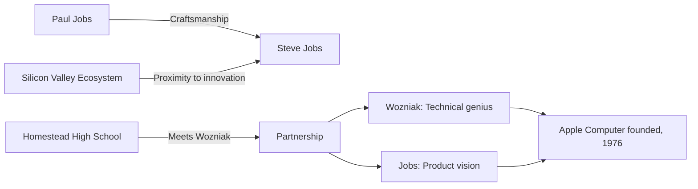
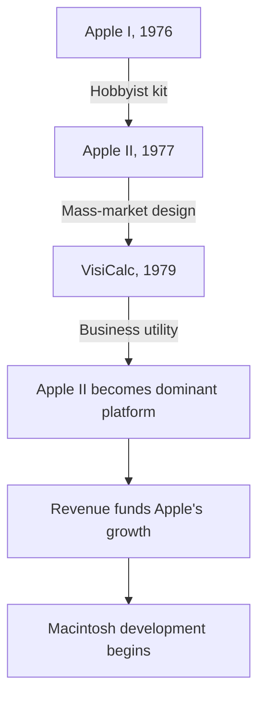
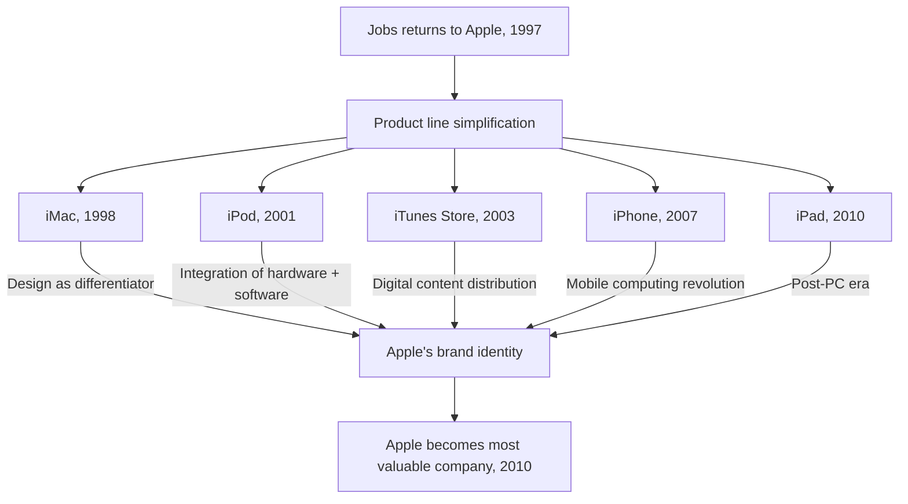
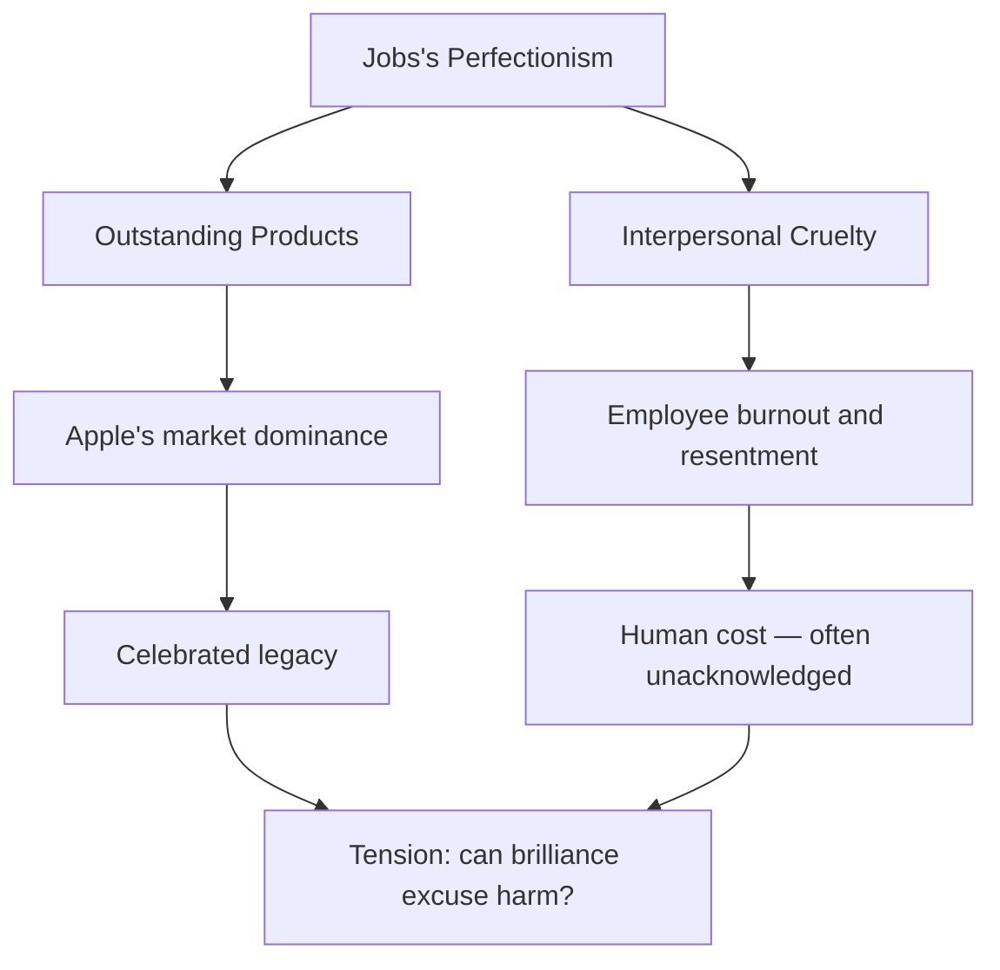
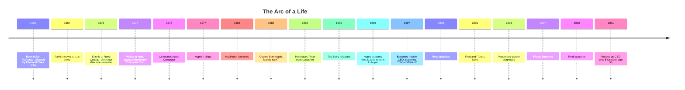
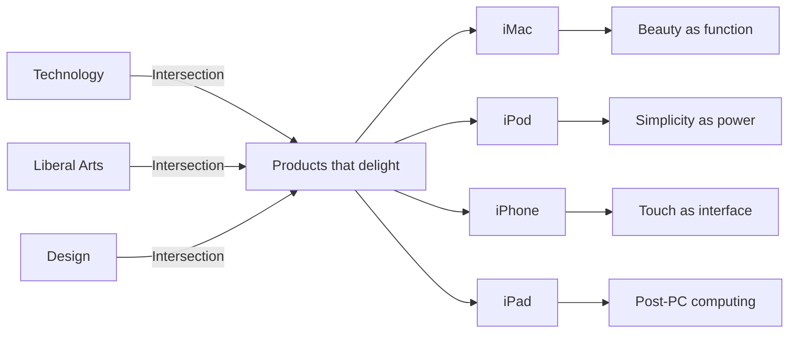
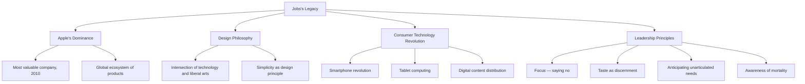

# Steve Jobs

## Description

Steven Paul Jobs (1955–2011) was an entrepreneur, inventor, and industrial designer who co-founded Apple Inc. and transformed the personal computer, animated film, music, mobile phone, and tablet computing industries. His life is a study in the paradox of visionary leadership: the same qualities that enabled him to see what others could not — an uncompromising aesthetic sensibility, an obsessive attention to detail, an unyielding insistence on control — also produced a management style that caused profound human harm. To study Jobs is to confront the question of whether brilliance excuses cruelty, and to extract from his career the principles of taste, focus, and integration that define products which do not merely function but delight. His story is not a template for imitation. It is a landscape for reflection — one in which the heights of creative achievement and the depths of interpersonal cruelty coexist within a single, unrepeatable human life.

## Prerequisites

- [What Is a Software Engineer](../../careers/software-engineer/what-is-a-software-engineer.md) — understanding the profession that Jobs reshaped from a technical discipline into a design-driven craft

The reader is expected to possess a general familiarity with the personal computing revolution and the evolution of consumer electronics. No technical background is required, though familiarity with the basic concepts of operating systems, graphical interfaces, and digital media will enrich the reading. The biography assumes no prior knowledge of Apple's corporate history — the narrative provides all necessary context.

## Table of Contents

- [Origins — The Making of a Visionary](#-origins--the-making-of-a-visionary)
- [The Work — Building the Future](#-the-work--building-the-future)
- [Struggles and Failures — The Cost of Brilliance](#-struggles-and-failures--the-cost-of-brilliance)
- [Legacy and Lessons — What Remains](#-legacy-and-lessons--what-remains)

## 🌱 Origins — The Making of a Visionary

### A Child Between Families

Steven Paul Jobs was born on 24 February 1955 in San Francisco to Joanne Schieble and Abdulfattah Jandali, two graduate students at the University of Wisconsin who were not married and not prepared to raise a child. Joanne's father, Arthur Schieble, was a Swiss-German immigrant who had built a fortune in manufacturing and who opposed the relationship on cultural and political grounds — Jandali was a Syrian political science student. When Joanne became pregnant, her father threatened to disown her. She traveled to San Francisco, gave birth in secret, and placed the infant for adoption.

The child was adopted by Paul and Clara Jobs of Mountain View, California — a working-class couple who had been unable to have biological children. Joanne's one condition for the adoption was that her son attend college. Paul and Clara promised. They were not college graduates themselves, but they understood the weight of the promise, and they kept it — even when their son chose to stop keeping it.

Paul Jobs was a machinist and amateur car mechanic who restored and resold classic automobiles in the family garage. He introduced his son to the discipline of craftsmanship: the careful sanding of a piece of wood, the importance of curves that were pleasing to the eye even where they were invisible, the insistence that a thing's interior — the parts no one would see — should be finished with the same care as its exterior. He once took young Steve to see the fence he was building along the back edge of their property and explained that the back of the fence, which no one would ever see, had to be just as carefully sanded and finished as the front. This ethic of hidden excellence — the conviction that quality is not a performance for others but a commitment to the work itself — would become the philosophical core of Apple's design philosophy decades later. The idea that the inside of a computer should be as beautiful as its outside was not a marketing strategy. It was the inheritance of a mechanic who sanded the underside of a fence.

Clara Jobs was an accountant who supported her son's intellectual curiosity with quiet constancy. She drove him to electronics stores, bought him his first transistor radio, and endured his experiments with household chemicals in the garage. The family lived in what would later become Silicon Valley, in a neighborhood populated by engineers and technicians working for NASA's Ames Research Center and the emerging electronics industry. The proximity to this ecosystem of innovation was not incidental to Jobs's development — it was constitutive. The child grew up believing that building things was a normal activity, that electronics were not exotic but domestic, and that the garage was a place where things could be made.

### The Homestead and the Counterculture

In 1967, the Jobs family moved to Los Altos, closer to the heart of the emerging technology community. Young Steve was a bright but restless student — intellectually engaged by some subjects, bored by others, and unwilling to tolerate authority he considered incompetent. His fourth-grade teacher, Imogene "Teddy" Hill, became a pivotal figure: rather than punishing his restlessness, she offered him a $100 bribe to complete his math workbook. He finished it in two months. The episode taught Jobs that unconventional motivation could unlock extraordinary effort — a lesson he would later apply to his management of creative teams.

He was a prankster who once detonated a small explosive device in his school cafeteria, an experience that taught him less about the dangers of pyrotechnics than about the inefficiency of institutional discipline. He experimented with LSD in his teenage years, an experience he later described as "one of the two or three most important things" he had done in his life. He told a reporter that the drug reinforced his sense of what mattered — that his career and the approval of others were trivial compared to the experience of connecting with the larger patterns of existence.

At Homestead High School, Jobs met Steve Wozniak — a five-year-older electronics enthusiast of extraordinary technical ability who had already earned a reputation in the local electronics community for building working computers from spare parts. Wozniak could build complex circuits from memory; Jobs could see what those circuits were *for*. The partnership was asymmetrical and complementary: Wozniak was the engineer, Jobs was the visionary. Where Wozniak saw technical elegance, Jobs saw products. Where Wozniak was content to build a device and share its schematics freely, Jobs understood that a device needed a case, a name, and a market.

### Reed College and the Calligraphy Lesson

In the autumn of 1972, Jobs enrolled at Reed College in Portland, Oregon — an elite liberal arts college with a rigorous academic reputation and an equally rigorous tuition. He was attracted to Reed's intellectual seriousness but repelled by its cost. After one semester, he dropped out, unwilling to spend his parents' savings on an education he did not value in its prescribed form. He continued to attend classes selectively, sleeping on the floor of friends' dormitories, returning Coke bottles for food money, and walking seven miles to the Hare Krishna temple every Sunday for a free meal. The campus was small enough that his absence from the official rolls was not closely tracked, and he continued to inhabit its intellectual life without paying for the privilege.

One of the classes he audited was a calligraphy course taught by Robert Palladino, a Trappist monk turned academic who taught the art of letterforms with the discipline of a liturgical practice. The course introduced Jobs to the concepts of serif and sans-serif typefaces, the varying amounts of space between letter combinations — kerning, leading, baseline alignment — and the aesthetic principles that distinguished beautiful typography from functional text. He absorbed these concepts not as technical knowledge but as a form of perception: the ability to *see* the difference between type that was merely legible and type that was alive.

"If I had never dropped in on that single course in college, the Mac would have never had multiple typefaces or proportionally spaced fonts," Jobs later recalled. "If I had never dropped out, I would have never dropped in on this calligraphy class, and personal computers might not have the wonderful typography that they do."

This was not a trivial influence. The Macintosh, when it shipped in 1984, was the first personal computer to offer a rich typographic experience — multiple fonts, proportional spacing, and elegant layout. The origin of this capability was not a technical specification or a market requirement. It was a calligraphy class that a college dropout took because he was curious. The lesson is structural: the most valuable knowledge is often acquired outside formal curricula, in the margins of planned education, and its value becomes apparent only in retrospect. What appears to be wasted time — the dropped-out semester, the audited class, the wandering — may be the period in which the foundational aesthetic is formed.

### The Homebrew Computer Club and Atari

After Reed, Jobs returned to California and found work at Atari, the video game company founded by Nolan Bushnell. He was hired as a technician but was quickly regarded as difficult — abrasive with colleagues, unwilling to wear shoes, and convinced that his fruitarian diet eliminated the need for deodorant. Bushnell, recognizing Jobs's intelligence but not his temperament, assigned him to the night shift. It was there, in solitude, that Jobs honed the relentless problem-solving discipline that would define his career.

In 1975, Jobs began attending meetings of the Homebrew Computer Club in Menlo Park, California. The club was a gathering of electronics hobbyists, engineers, and counterculture enthusiasts who shared a conviction that personal computers — then large, expensive, and confined to corporations and universities — could and should be available to individuals. The club was animated by two spirits: the technical ambition of engineering and the communal ethos of the 1960s counterculture. Members shared schematics, debated design philosophies, and distributed software freely. The club's ethos was explicitly anti-commercial — computing was to be liberated, not monetized.

Wozniak attended these meetings and was galvanized. He began designing a computer that could display characters on a screen — a significant advance over the blinking lights that characterized most hobbyist computers. Jobs saw the commercial potential immediately. While Wozniak was content to give away his designs — consistent with the Homebrew ethic of open sharing — Jobs insisted on selling them. This was the first visible expression of a tension that would define the personal computing industry for decades: open versus closed, free versus proprietary, communal versus commercial. Jobs chose commercial. The decision was not cynical. It reflected his conviction that a product, to reach its full potential, required the control that only a proprietary system could provide.

Jobs also spent a summer working at HP, the electronics company, where he demonstrated a persistent pattern: he would approach executives with product ideas, be rejected, and then be impressed when they recognized his ambition. "I was just a kid," he recalled, "but they treated me as an equal." The experience reinforced his belief that institutions could be penetrated by the force of individual will — a belief that would serve him well and lead him astray in equal measure.

## ⚙️ The Work — Building the Future

### Apple Computer and the Apple II (1976–1979)

On 1 April 1976, Jobs, Wozniak, and Ronald Wayne co-founded Apple Computer Company. Wayne, an older engineer who had worked with Wozniak at Atari, drafted the partnership agreement and drew the first Apple logo — a pen-and-ink sketch of Isaac Newton under an apple tree. He sold his 10% stake back to Jobs and Wozniak for $800 fifteen days later, a decision that would have been worth over $100 billion at the time of Jobs's death. Wayne later explained that he feared the financial risk of the partnership, which would have made him personally liable for Apple's debts.

The Apple I was a circuit board sold without a case, keyboard, or monitor — a hobbyist kit, not a consumer product. Jobs funded the initial production by selling his Volkswagen van and borrowing $5,000 from his friend Daniel Kottke. The first orders came from Paul Terrell, owner of the Byte Shop in Mountain View, who ordered 50 fully assembled units at $500 each. Jobs and Wozniak assembled the boards in the Jobs family garage, working through the night to meet the deadline. The Apple I generated approximately $775,000 in revenue before being discontinued.

The Apple II, which shipped in 1977, was something else entirely. Encased in a molded plastic housing designed by Jerry Manock, equipped with a keyboard, color graphics, and an open architecture that invited third-party software development, the Apple II was one of the first personal computers designed for mass production and consumer use. Jobs understood that a computer needed to be a finished product — not a circuit board on a workbench but an appliance that a non-technical person could set up and use. This insistence on the complete user experience, from unboxing to first keystroke, was a departure from the hobbyist ethic and a harbinger of Apple's future design philosophy.

The Apple II's success was not primarily technical. Wozniak's engineering was brilliant, but the machine's dominance was secured by VisiCalc, the first spreadsheet program, released in 1979. VisiCalc transformed the Apple II from a hobbyist's toy into a business tool. For the first time, a computer could save a business owner hours of manual calculation. The lesson was definitive: technology succeeds not through technical superiority alone but through the creation of software that solves real human problems. The Apple II went on to sell over 6 million units, remaining in production until 1993.

### The Macintosh (1984)

The Macintosh project began in 1979, originally under the direction of Jef Raskin, a human-computer interface specialist who envisioned an affordable, easy-to-use computer for non-technical users. Raskin named the project after his favorite apple variety. Jobs took over the project in 1981, and under his leadership, it transformed into something Raskin had not imagined: a machine whose entire experience was designed around a graphical user interface (GUI) inspired by technology Jobs had seen at Xerox PARC.

The visit to Xerox PARC in December 1979 is one of the most discussed episodes in technology history. In exchange for the right to purchase Apple shares before its IPO, Xerox allowed Jobs and a team of Apple engineers to tour the Palo Alto Research Center. Xerox researchers had developed a graphical interface with windows, icons, menus, and a pointer controlled by a mouse — collectively known as the WIMP paradigm. Jobs recognized immediately that this was the future of computing — that the command line, however powerful, was a barrier between the human and the machine. "Why isn't Xerox doing anything with this?" he asked. Xerox, burdened by corporate bureaucracy and a business model built around copiers, did not understand what it had. Jobs did.

The Macintosh team was small — approximately twenty engineers — and operated with an intensity that bordered on monastic. Jobs demanded perfection in every detail: the curvature of the case, the sound of the startup chime, the weight of the mouse. He drove the team to work grueling hours and brooked no compromise. "Real artists ship," he told them — meaning that perfection without delivery is merely procrastination. The team's spirit was captured by a poster on the wall of their building, visible only to those who worked there: a pirate flag. Jobs had authorized it. "It's better to be a pirate than join the navy," he explained.

The Macintosh shipped on 24 January 1984 at a price of $2,495. It was the first commercially successful personal computer with a graphical user interface. Its launch was accompanied by the "1984" television commercial, directed by Ridley Scott and aired during Super Bowl XVIII — a sixty-second film that depicted a young woman hurling a hammer at a screen displaying a Big Brother figure, representing IBM's dominance. The commercial ran only once, but it became the most celebrated advertisement in television history and established Apple's brand identity as the creative alternative to corporate conformity.

The Macintosh was beautiful, limited, and expensive. It had 128 kilobytes of memory, no hard drive, and a single 3.5-inch floppy slot. It was slow. Its software library was thin. But it demonstrated a principle that would define Apple's trajectory: that the experience of using a computer — the feel of the mouse, the clarity of the fonts, the intuitiveness of the interface — was not a secondary concern. It was the product. The Macintosh proved that the personal computer could be an object of desire, not merely a tool of productivity.

### Ouster and NeXT (1985–1997)

In May 1985, following a power struggle with Apple's board of directors and CEO John Sculley, Jobs was stripped of his operational role at the company he had co-founded. He resigned shortly thereafter. The board's decision reflected a genuine tension: Jobs's insistence on product perfection and his volatile management style had created organizational dysfunction. The Macintosh team operated as an autonomous unit, hostile to other Apple divisions. Jobs had recruited Sculley from PepsiCo in 1983 with the now-famous line: "Do you want to sell sugar water for the rest of your life, or do you want to come with me and change the world?" The seduction worked. But when the relationship soured, it was Sculley who remained and Jobs who was expelled.

Jobs was, by temperament, a brilliant product leader but a difficult colleague, and the company's growing scale required a management structure he was unwilling to accept. The experience of being removed from the company he had built would haunt and educate him. "I didn't see it then, but it turned out that getting fired from Apple was the best thing that could have ever happened to me," he said later. "The heaviness of being successful was replaced by the lightness of being a beginner again, less sure about everything. It freed me to enter one of the most creative periods of my life."

Jobs founded NeXT Inc. in 1985 with $7 million of his own money, supplemented by $20 million from Ross Perot. The NeXT Computer, released in 1988, was an engineering marvel — a magnesium cube housing a Motorola 68030 processor, built-in Ethernet, and the NeXTSTEP operating system, which introduced object-oriented software development, advanced typography, and a sophisticated graphical interface. The machine was priced at $6,500 for the base model — too expensive for individuals, too limited for enterprises. The cube was beautiful. It was also a commercial impossibility.

NeXT sold fewer than 50,000 units. The hardware was a commercial failure. But the operating system — NeXTSTEP — was the foundation upon which Apple's modern software stack would be built. Tim Berners-Lee used a NeXT computer at CERN to develop the World Wide Web. The first web browser ran on NeXTSTEP. The machine failed as a product but succeeded as a platform, demonstrating that commercial failure and technical influence are not mutually exclusive. Jobs would carry this lesson forward: when he returned to Apple, he brought NeXTSTEP with him. It became the foundation of Mac OS X, and later, iOS.

### Pixar and the Revolution in Animation

In 1986, Jobs purchased the Computer Graphics Division from Lucasfilm for $10 million — half the asking price — establishing Pixar as an independent company. The acquisition was initially motivated by the hardware — Pixar's Image Computer — not by animation. The machine was designed for medical imaging and government applications and found almost no market. Jobs invested $5 million more over the following years and spent considerable energy attempting to sell the hardware, with little success.

The company was sustained by a small team of computer scientists — Ed Catmull, Alvy Ray Smith, and others — who produced short animated films to demonstrate the capabilities of their rendering technology. When the hardware business failed to generate revenue, Catmull and John Lasseter, a former Disney animator, persuaded Jobs to invest in computer-generated short films as a means of demonstrating the technology's commercial potential.

The result was *Toy Story*, released by Disney in November 1995 — the first feature-length film entirely animated with computers. The film earned $373 million worldwide and validated Pixar's approach: that computer animation was not merely a technological curiosity but a medium for storytelling of the highest order. The success of *Toy Story* and subsequent Pixar films — *Finding Nemo*, *The Incredibles*, *Ratatouille*, *WALL-E*, *Up* — transformed the animation industry and established computer-generated imagery as the dominant mode of animated filmmaking.

Pixar's creative culture, which emphasized story and character over technical spectacle, reflected principles Jobs would later apply at Apple: that technology serves art, not the reverse, and that the best products are those where the seams between disciplines are invisible. The Pixar Braintrust — a group of directors who provided candid feedback on each other's projects — embodied a collaborative creative process that contrasted sharply with Jobs's more autocratic management at Apple. It was as if Jobs, in founding Pixar, had created the creative environment he himself could not fully inhabit.

Pixar was sold to Disney in 2006 for $7.4 billion in Disney stock, making Jobs Disney's largest individual shareholder. The acquisition was the culmination of a twenty-year investment that had, for much of its duration, appeared to be a financial mistake. The lesson is temporal: the value of a visionary investment may not be apparent for decades, and the patience required to sustain it is itself a form of courage.

### The Return to Apple and the Digital Hub Strategy (1997–2011)

By 1997, Apple was ninety days from bankruptcy. The company had proliferated its product lines into confusion — the Newton, the Quadra, the Performa, the LC, the Power Macintosh, the PowerBook — each targeting a niche that existed more in Apple's marketing materials than in the market itself. Its market share had fallen below 4%, and its operating system was outdated. Jobs, who had returned to Apple after the company acquired NeXT in December 1996, was appointed interim CEO — a title he held until 2000.

His first act was surgical: he eliminated 70% of Apple's product lines, reducing the company to four products organized in a simple two-by-two grid — consumer and professional, desktop and portable. "Deciding what *not* to do is as important as deciding what to do," Jobs later said. "That's true for companies, and it's true for products." He also negotiated a $150 million investment from Microsoft — a humiliating but necessary lifeline — and began building the executive team that would carry Apple through the next decade.

The return produced a sequence of products that redefined their respective categories. Each was a manifestation of the same underlying philosophy: that Apple's role was to be the bridge between technology and the liberal arts, creating products that were intuitive, beautiful, and tightly integrated with the services and content that surrounded them.

- **iMac (1998)** — an all-in-one computer with a translucent Bondi-blue casing designed by Jonathan Ive, the British industrial designer who would become Jobs's closest creative collaborator. The iMac made the computer an object of desire rather than a beige box of necessity. Its design was controversial within Apple; engineers argued that the translucent case was frivolous and that the removal of the floppy disk drive was reckless. Jobs insisted on both. The iMac sold 800,000 units in its first five months and saved the company.
- **iPod (2001)** — a portable music player with a scroll wheel and seamless integration with the iTunes software. "1,000 songs in your pocket" was the proposition. The iPod did not invent the portable music player; it made one that was beautiful and usable. The scroll wheel — an input device that responded to the circular motion of the thumb — was a triumph of industrial design: elegant, intuitive, and satisfying to use.
- **iTunes Store (2003)** — a legal digital music marketplace that, in partnership with major record labels, offered songs for $0.99. The store solved the music industry's piracy crisis by making legal acquisition more convenient than illegal downloading. Jobs understood that the solution to piracy was not enforcement but convenience — a principle that many industries had yet to grasp.
- **iPhone (2007)** — a mobile phone, music player, and internet communicator in a single device with a multi-touch screen. "Every once in a while, a revolutionary product comes along that changes everything," Jobs said at its introduction. The iPhone's development began in 2004 under the codename "Project Purple" and involved the creation of an entirely new manufacturing process for its capacitive touch screen. The device eliminated the physical keyboard that dominated mobile phones of the era, replacing it with a software keyboard that could adapt to different contexts. The smartphone industry as it exists today was created on 29 June 2007.
- **iPad (2010)** — a tablet computer that created the modern tablet market. Critics dismissed it as a large iPhone. The iPad sold 300,000 units on its first day. It demonstrated that there was a category of computing between the phone and the laptop — a space that required neither the portability of the former nor the complexity of the latter.

### The "Think Different" Campaign and the Apple Retail Store

The "Think Different" campaign, launched in 1997, was among the first acts of Jobs's return. Created by the advertising agency TBWA\Chiat\Day, the campaign featured black-and-white photographs of Albert Einstein, Martin Luther King Jr., John Lennon, Amelia Earhart, and other historical figures, accompanied by a voiceover narrated by Richard Dreyfuss: "Here's to the crazy ones. The misfits. The rebels. The troublemakers." The campaign was not about Apple's products — it was about Apple's identity. It positioned the company as a tribe of creative dissenters, implicitly contrasting its culture with IBM's and Microsoft's corporate conformity. The campaign arrived at a moment when Apple was widely perceived as a failing company on the verge of irrelevance. Its genius was the assertion that Apple's identity had not changed — only its circumstances had.

The Apple Retail Store, which opened in May 2001 in Tysons Corner, Virginia, was widely predicted to fail. Analysts cited the failure of Gateway's retail experiment and argued that consumers would not pay premium prices in a branded store when they could buy cheaper alternatives at CompUSA or Best Buy. Jobs ignored them. The stores were designed by Ron Johnson as places to experience products, not merely purchase them — open spaces, light wood, glass staircases, and the Genius Bar for technical support. The architecture communicated Apple's values: transparency, simplicity, and the belief that the retail environment should be as carefully designed as the products it displayed.

By 2010, Apple Retail generated $3.2 billion annually and was the most profitable retail operation per square foot in the world. The stores became, in effect, Apple's most effective marketing channel — places where customers could touch, hold, and use products in an environment free of the visual chaos of a typical electronics retailer. The lesson was architectural: the space in which a product is encountered shapes the perception of the product itself. This principle — that context is part of the experience — extended from retail to packaging to the unboxing ritual that Apple would later perfect.

### The Transformation of Industries

Jobs did not merely build products. He restructured the economic logic of entire industries. The personal computer industry, the music industry, the mobile phone industry, the film animation industry, and the tablet computing industry were all fundamentally altered by Apple's interventions under Jobs's leadership.

The music industry's transformation is particularly instructive. When the iPod and iTunes Store launched, the recorded music industry was in crisis — Napster and its successors had demonstrated that consumers preferred free, illegal downloading to purchasing CDs. The industry's response was litigation: suing individual file-sharers, lobbying for stricter copyright enforcement, and treating their own customers as criminals. Jobs offered an alternative: make the legal product more convenient than the illegal one. iTunes offered a curated library, consistent pricing, and seamless integration with the iPod. The solution was not technological — it was experiential. Jobs understood that convenience is a more powerful motivator than morality, and he built a system that aligned the consumer's self-interest with the industry's economic survival.

The mobile phone industry underwent a similar transformation. Before the iPhone, the industry was controlled by carriers — AT&T, Verizon, and their international equivalents — who dictated handset design, software capability, and user experience. The iPhone reversed this power dynamic. By building a device so desirable that consumers would switch carriers to obtain it, Jobs extracted concessions from carriers that no handset manufacturer had previously achieved. The result was a shift in the industry's center of gravity from the carrier to the device manufacturer — a shift that persists today.

## 💔 Struggles and Failures — The Cost of Brilliance

To discuss Jobs's struggles is to confront a particular kind of paradox: the qualities that produced his greatest achievements were inseparable from those that caused the most harm. The line between visionary leadership and destructive ego is not always clear — and in Jobs's case, it was often invisible. His story is not one of redemption through suffering. It is one of ambition pursued with a totality that left little room for mercy — toward others or toward himself.

### The 1985 Ouster

Jobs's removal from Apple was the defining failure of his career. It was not a failure of vision — the vision was correct — but a failure of interpersonal and organizational management. Jobs's insistence on control, his tendency to oscillate between charismatic enthusiasm and savage criticism, and his inability to delegate created an environment of fear and genius in equal measure. The Macintosh team was fiercely loyal to Jobs; the rest of the company resented him. He referred to other Apple products as "crap" and their creators as incompetent. The organizational damage was not sustainable.

John Sculley, the CEO Jobs had recruited from PepsiCo in 1983, became his adversary. The board chose Sculley over Jobs — a judgment that reflected the conventional wisdom of the era: that a company needed a professional manager, not a mercurial founder. The decision was both reasonable and tragic. Sculley was competent but uninspired; Jobs was inspired but unsustainable. The lesson was not that the board was wrong — it was that the structures of corporate governance are designed for steady-state operations, not for the chaotic energy of creative destruction.

The ouster left Jobs wounded and bewildered. He had built Apple from a garage project into a publicly traded company, and he had been expelled from it by the very adults he had brought in to manage it. The betrayal was mutual: Jobs felt betrayed by Sculley, and Sculley felt betrayed by Jobs's refusal to respect the authority the board had granted. The experience hardened Jobs and humbled him in equal measure — a rare combination that would define his second act.

### The NeXT Years — Brilliant Technology, Commercial Failure

NeXT was, by every technical measure, a success. The operating system was years ahead of its time. The hardware was beautifully designed — a perfect cube, ten inches on each side, finished in matte black magnesium. The development tools were the finest available, offering an object-oriented programming environment that made software development faster and more intuitive than any competing platform. The machine was beautiful. The software was brilliant. The company was a failure.

The machine was too expensive, the company was too small, and the market was not ready for what NeXT was selling. Schools and universities — NeXT's target market — could not afford $6,500 per unit. Corporations preferred established platforms. Jobs spent twelve years — the period from 1985 to 1997 — building a product that almost no one bought. He invested $50 million of his own money from the Apple and Pixar ventures. The financial hemorrhage was relentless.

The NeXT years taught Jobs humility, though he would not have used that word. He learned that vision without a market is merely ambition. He learned that the most elegant technology fails if it does not solve a problem that enough people are willing to pay to solve. He learned that the engineer's love of the thing itself — the intrinsic beauty of the code, the elegance of the architecture — is not sufficient to sustain a business. The lesson was painful but essential: when he returned to Apple, he did not abandon his aesthetic standards, but he calibrated them to the realities of mass production and consumer demand. The perfectionism remained. The pricing strategy changed.

### The Reality Distortion Field

Jobs possessed what colleagues called the "reality distortion field" — a term borrowed from *Star Trek* that described his ability to convince anyone of almost anything, including that impossible deadlines were achievable and that the laws of physics were negotiable. The term was coined by Bud Tribble, a Macintosh engineer, who noted that in Jobs's presence, the normal rules of reality seemed to suspend themselves.

The field was both a tool and a weapon. It enabled Jobs to push engineers beyond what they believed they could accomplish. It also enabled him to make promises to customers and partners that were not grounded in the current state of technology. When an engineer told Jobs that a feature could not be built within the timeline, Jobs would stare at him in silence until the engineer began to doubt his own assessment. The silence was not manipulation in the conventional sense — it was the expression of a mind that genuinely could not comprehend limitation.

The reality distortion field worked because it was fueled by genuine conviction. Jobs did not lie — he *believed* his own vision with an intensity that was indistinguishable from certainty. This conviction was infectious and exhausting. It produced extraordinary products and extraordinary burnout. Engineers who worked under the field described the experience as simultaneously the most productive and the most draining of their careers. The field was, in essence, a form of charismatic authority — the capacity to compel belief through the sheer force of one's own certainty. History recognizes this quality in leaders of many kinds. In Jobs, it manifested as the ability to bend engineering reality to match his aesthetic vision.

### The Human Cost of Perfection

Jobs's management style was, by many accounts, brutal. He was capable of reducing subordinates to tears with a single sentence. He divided the world into things that were "the best" and things that were "shit," with no intermediate categories. He publicly humiliated employees whose work he found inadequate. He denied paternity of his first daughter, Lisa, for years, despite a DNA test confirming his parentage. When Lisa was born in 1978, Jobs initially refused to acknowledge her, telling reporters that he was "sterile and infertile." He eventually admitted paternity but provided minimal child support until he was legally compelled to pay more. Lisa came to live with him during her teenage years, but the relationship remained strained for decades. Even in later years, when their relationship had warmed, the wound of those early years never fully closed.

The pattern extended beyond Lisa. Jobs was capable of extraordinary warmth and equally extraordinary coldness, sometimes within the same conversation. He could be generous to a fault — offering stock options, personal gifts, and passionate advocacy to those he favored — and then, without warning, turn against those who had disappointed him. The experience of working for Jobs was described by many as simultaneously the most meaningful and the most damaging of their careers. The meaning came from the knowledge that they were building something that mattered. The damage came from the knowledge that their humanity was secondary to the product.

### The Cancer and the Resistance to Treatment

In October 2003, Jobs was diagnosed with a pancreatic neuroendocrine tumor — a rare and, if treated early, relatively survivable form of pancreatic cancer. His doctors at Stanford Medical Center recommended immediate surgery. The procedure was straightforward: a Whipple procedure that, in early-stage cases, offered a five-year survival rate of approximately 60%. Jobs refused. For nine months, he pursued alternative treatments — acupuncture, dietary supplements, juice fasts, herbal remedies, and consultation with a psychic. He consulted with a woman in Switzerland who treated patients with raw carrots and fruit juices. The decision was consistent with his character: a deep distrust of authority, an insistence on controlling his own narrative, and a quasi-spiritual conviction that his body could be healed through will and intention. He had been a vegetarian and fruitarian for much of his adult life; he believed that the purity of his diet had protective properties.

His wife, Laurene Powell Jobs, and his close friends — including his biographer, Walter Isaacson, and his colleague Bill Campbell — pleaded with him to submit to surgery. He refused for months. When he finally agreed to the procedure in July 2004, the cancer had spread to his liver. The delay may have been the most consequential decision of his life — a decision in which the same qualities that made him an extraordinary product leader (conviction, intuition, resistance to conventional authority) produced a tragic outcome.

He received a liver transplant in Memphis, Tennessee, in 2009. He returned to Apple but appeared visibly diminished — gaunt, walking slowly, his voice thin. He resigned as CEO on 24 August 2011, passing the leadership to Tim Cook. He died on 5 October 2011, at the age of fifty-six, at his home in Palo Alto.

His refusal to seek timely medical treatment is the most consequential failure of his life — not because it was irrational, but because it was consistent with the same personality traits that produced his greatest achievements. The conviction that he knew better than others was both his gift and his limitation. In the domain of product design, it produced the iPhone. In the domain of medicine, it shortened his life.

The timeline reveals a pattern that is easy to miss when reading the life in fragments: the longest period of Jobs's career — twelve years, from 1985 to 1997 — was spent in what the world regarded as failure. NeXT did not sell. Pixar lost money for a decade. Apple was the company he had been expelled from. The most productive years of his creative life were lived in the shadow of public irrelevance. The lesson is temporal: the present tense of a life is almost always misleading. What appears to be failure in the moment may be preparation for achievement that will not become visible for years.

## 🌍 Legacy and Lessons — What Remains

### The Scale of Impact

At the time of his death, Jobs's net worth was estimated at $102 billion, making him one of the wealthiest individuals in history. Apple, the company he co-founded, returned to from exile, and rebuilt, became the most valuable publicly traded company in the world. The products he championed — the Mac, the iPod, the iPhone, the iPad — are not merely successful consumer electronics. They are the instruments through which billions of people communicate, create, learn, and entertain themselves. No single individual in the history of consumer technology has shaped the daily experience of so many people.

The scale of this influence is worth pausing over. At the time of Jobs's death, Apple had sold over 100 million iPhones. By 2023, the number exceeded 2.3 billion. The iPad created a category that now accounts for hundreds of millions of devices. The App Store, which Jobs launched in 2008, created an entirely new economy — a global marketplace for software that has generated over $1 trillion in revenue for developers. Jobs did not merely build products. He built ecosystems — interconnected networks of hardware, software, and services that became self-reinforcing platforms for innovation.

The financial legacy extended beyond Apple. Jobs's investments in Pixar and his stewardship of the company through its lean years produced a return that dwarfs most venture capital outcomes in history. The Pixar acquisition cost $10 million; the Disney sale returned $7.4 billion in stock. The lesson is that financial returns are often back-loaded — that the payoff for visionary investment arrives not in quarters but in decades, and that the willingness to sustain a losing position in the short term is the prerequisite for extraordinary returns in the long term.

### The Intersection of Technology and Liberal Arts

Jobs consistently described Apple's identity as residing at "the intersection of technology and liberal arts." This was not a slogan. It was a design philosophy. The Mac was not merely a computer — it was a canvas. The iPhone was not merely a phone — it was a library, a camera, a musical instrument, a map, and a correspondence tool. Jobs understood, perhaps more deeply than any of his contemporaries, that technology becomes transformative only when it is designed for human beings as whole persons — as creatures with aesthetic sensibilities, emotional needs, and cultural identities, not merely as users with functional requirements.

This philosophy distinguished Apple from its competitors. Microsoft built software for engineers. Dell built hardware for procurement managers. Apple built products for people who cared about how a thing looked, felt, and sounded — even if they could not articulate why. The gap between a product that works and a product that delights is the gap between engineering and design, between function and form, between the merely adequate and the beautiful. Jobs inhabited that gap more completely than anyone in the history of the technology industry.

The distinction matters because it reframes the purpose of technology. A product that merely functions is a tool. A product that delights is an experience — one that respects the user as a person with taste, with emotion, with a life that extends beyond the moment of interaction. This is not sentimentality. It is a design principle with measurable consequences: people pay more for products that delight them, they remain loyal to brands that respect their intelligence, and they recommend products that make them feel understood.

The partnership between Jobs and Jonathan Ive, Apple's chief design officer, was central to this philosophy's realization. Ive — a quiet, meticulous Brit who had joined Apple in 1992 — shared Jobs's conviction that objects should be designed as complete experiences, not collections of features. Their collaboration produced the iMac, the iPod, the iPhone, and the iPad — each a masterwork of industrial design. Where Jobs provided the vision and the ruthless editorial judgment, Ive provided the material sensibility: the choice of aluminum over plastic, the curve of a radius, the weight of a device in the hand. The partnership was the most productive designer-executive relationship in the history of consumer technology, and its product was an entire era.

### The Principles

Jobs's life offers principles that extend beyond the technology industry. They are not aphorisms to be memorized but disciplines to be practiced — each one requiring a form of courage that is available to anyone willing to pay its cost.

Jobs married Laurene Powell in 1991 at Yosemite National Park. They had three children: Reed, Erin, and Eve. By all accounts, Jobs was a more present and more patient father than he had been in Lisa's early years — though the wound of that earlier failure never fully healed. Laurene, a Stanford MBA and the founder of the Emerson Collective, was both a partner and a ground — the person who could tell Jobs the truth when the reality distortion field made it difficult for others to do so. The domestic life that Jobs built in his later years was quieter and more stable than his public persona might suggest — a reminder that the person who appears in product keynotes is not the whole person who exists offstage.

**Focus is the art of saying no.** "I'm as proud of what we don't do as I am of what we do," Jobs said. The decision to eliminate product lines, to limit Apple's output to a small number of carefully designed products, was the discipline that made Apple's success possible. In an industry that rewards proliferation, Jobs chose concentration. The lesson is counterintuitive: doing fewer things, with greater care, produces more value than doing many things adequately. For the developer, this means resisting the temptation to build everything and focusing instead on building the right thing well.

**Taste is not decoration — it is discernment.** Jobs's obsession with typography, materials, and industrial design was not superficial. It reflected a conviction that the quality of a product is determined by the quality of the decisions that compose it — every curve, every material, every interaction. Taste, in this context, is not a preference for luxury. It is the ability to distinguish between what is merely functional and what is worthy of a human being's daily attention. Cultivating taste requires exposure to excellence across disciplines — to architecture, to music, to the physical objects one encounters daily.

**The customer does not always know what they want.** Jobs did not conduct market research. He did not ask consumers what they desired. He observed the world, identified unarticulated needs, and built products that satisfied them before the need was conscious. "People don't know what they want until you show it to them," he said. This is not arrogance — it is a recognition that the most important innovations are those that create demand rather than respond to it. The implication for developers is clear: the most transformative products are not those that solve existing problems but those that reveal problems the user did not know existed.

**Simplicity is the ultimate sophistication.** Apple's products succeeded not because they did more but because they did less — more elegantly. The iPod had one button. The iPhone eliminated the keyboard. The iPad removed the laptop. Each product achieved its power through subtraction, not addition. The discipline of simplicity requires the courage to remove features that are merely impressive and retain only those that are essential. In software development, this principle manifests as the resistance to feature creep — the recognition that every additional feature increases cognitive load, maintenance burden, and the distance between the user and their goal.

**Integration is superior to modularity — when executed correctly.** Jobs's insistence on controlling both hardware and software — the "walled garden" approach — was controversial and remains so. Critics argued that it limited consumer choice and stifled competition. Supporters argued that it produced a superior user experience. The debate is not settled, but Jobs's track record demonstrates that integration can produce products of extraordinary coherence — products in which every component, from the silicon to the software to the packaging, has been designed with a single intention. The developer who controls the full stack can achieve a quality of experience that the modular approach cannot match.

**Life is finite — act accordingly.** In his 2005 Stanford commencement address, Jobs said: "Remembering that I'll be dead soon is the most important tool I've ever encountered to help me make the big choices in life. Because almost everything — all external expectations, all pride, all fear of embarrassment or failure — these things just fall away in the face of death, leaving only what is truly important." The awareness of mortality was not a morbid preoccupation. It was the source of his urgency, his willingness to take risks, and his refusal to waste time on things that did not matter. For the developer, this means treating time as the non-renewable resource it is — and choosing projects, teams, and technologies that are worthy of the hours one has.

### What His Life Teaches

Jobs's biography is not merely a story of product launches and market dominance. It is a parable about the relationship between vision and execution, between beauty and cruelty, between the desire to build something perfect and the recognition that perfection is asymptotic — approachable but never reachable.

For the developer, the designer, the entrepreneur — Jobs's life offers a mirror in which to examine one's own ambitions and their costs. The question his biography poses is not "How can I be like Steve Jobs?" It is "What am I willing to sacrifice for the thing I am building, and is the sacrifice worth it?" This question has no universal answer. But it is the right question — and asking it is the beginning of the wisdom that biographical study is meant to provide.

The life of Steve Jobs, read honestly, is not an instruction manual. It is an encounter with a human being of extraordinary gifts and extraordinary flaws — a man who saw the future with unusual clarity and who treated the people around him with inconsistent grace. To study such a life is to be reminded that the capacity for greatness and the capacity for harm often reside in the same person, and that the measure of a life is not only what was built but how those who were present during the building were treated along the way.

The discipline of biographical study requires a particular kind of honesty — the willingness to see the subject as a whole person rather than as a collection of achievements or failures. Jobs's life resists hagiography not because his accomplishments were less than extraordinary, but because the costs he imposed on others were real and measurable. The engineer who was reduced to tears, the daughter who was denied for years, the colleagues who were berated in public — these are not abstractions. They are the lived experiences of human beings who happened to work alongside a genius. The moral complexity of Jobs's life is not a problem to be solved but a tension to be inhabited. To resolve it — to declare Jobs either a hero or a villain — is to miss the point entirely. The point is that extraordinary ability does not confer moral immunity, and that the study of such lives is valuable precisely because it resists simple conclusions.

## 📝 Learning Tips

- **Watch the 2005 Stanford commencement address.** It is eighteen minutes long, freely available online, and contains the most concentrated expression of Jobs's philosophy — on death, on following curiosity, and on connecting the dots of a life only in retrospect. It is the primary document for understanding how Jobs understood his own story. Watch it before reading any biography. The voice is the thing.

- **Compare Jobs and Wozniak.** The partnership illustrates the distinction between engineering and product vision. Wozniak built machines that pleased him; Jobs built machines that pleased others. Neither disposition is superior, but understanding the difference clarifies why some technically brilliant products fail commercially while less sophisticated products succeed. The tension between these two orientations — the engineer's delight in elegance and the designer's delight in experience — is the central tension of the technology industry.

- **Study the return to Apple.** The 1997 product line simplification is one of the most instructive case studies in business strategy. Analyze the decision to cut 70% of Apple's offerings and trace the consequences over the subsequent decade. The lesson — that subtraction can be more powerful than addition — applies to code, to design, and to life. Ask yourself: what features in your own projects could be removed without diminishing the product?

- **Do not separate the person from the products.** Jobs's personal failings — his cruelty, his denial of paternity, his refusal of medical treatment — are not footnotes. They are integral to understanding the same personality that produced the iPhone. The ambition that creates beauty can also cause harm. Biographical study that celebrates achievement while erasing its human cost is incomplete. The discipline of reading a biography honestly requires holding two truths simultaneously: that the person accomplished extraordinary things, and that they caused real suffering.

- **Read Walter Isaacson's biography.** It is the authorized account, based on more than forty interviews with Jobs and hundreds of interviews with his colleagues, family, and competitors. It is comprehensive and unflinching, and it provides the primary source material from which this biography draws its conclusions. Read it not for gossip but for pattern recognition — the recurring themes of taste, focus, integration, and control that defined Jobs's career.

- **Trace the calligraphy thread.** Follow the line from Robert Palladino's calligraphy course at Reed College to the Macintosh's typography to the iPhone's font rendering. The thread illustrates how seemingly unrelated knowledge becomes relevant in unexpected contexts — and why breadth of curiosity is a competitive advantage. The principle extends beyond typography: the developer who reads widely in history, philosophy, and design brings a perspective to technical problems that pure specialists cannot match.

- **Analyze the Xerox PARC visit.** Study what Xerox had and what Apple took. The graphical interface, the mouse, the windowing system — all existed at Xerox before Apple implemented them. The lesson is not that Apple stole ideas. It is that the gap between invention and implementation is often vast, and that the value lies not in the idea but in the execution. Xerox invented the future. Apple shipped it.

## 📚 Glossary

| Term | Definition |
|------|------------|
| GUI | Graphical User Interface — a system of visual elements (windows, icons, menus) that allows users to interact with a computer without typing commands |
| Reality distortion field | A term coined at Apple to describe Jobs's ability to convince others that seemingly impossible tasks were achievable through sheer force of personality |
| NeXTSTEP | The object-oriented operating system developed by NeXT, which became the foundation of Apple's macOS and iOS after Apple's acquisition of NeXT |
| Digital hub | Jobs's strategy, articulated in 2001, positioning the Mac as the central controller of a user's digital life — music, photos, video, and communication |
| Think Different | Apple's 1997 advertising campaign that repositioned the brand as a tool for creative rebels and nonconformists |
| Industrial design | The design of mass-produced manufactured objects, emphasizing both form and function; Jobs elevated it to a core corporate competency at Apple |
| Scroll wheel | The input mechanism on the iPod that allowed users to navigate large music libraries with a single thumb-controlled wheel |
| Multi-touch | A touch-sensitive screen technology that detects multiple simultaneous touch points, enabling gestures like pinch-to-zoom; central to the iPhone's interface |
| Genius Bar | An in-store technical support service at Apple Retail Stores, staffed by trained specialists |
| Apple Retail Store | A chain of retail outlets designed to showcase Apple products in an open, interactive environment; became the most profitable retail operation per square foot in the world |
| WIMP | Window, Icon, Menu, Pointer — the paradigm of graphical user interface interaction that the Macintosh popularized |
| Whipple procedure | A complex surgical operation to remove tumors from the pancreas; the surgery Jobs underwent in 2004 |
| App Store | Apple's digital distribution platform for mobile applications, launched in 2008; created a global economy for software developers |
| Open architecture | A computer design that allows third-party developers to create compatible hardware and software; the Apple II used this model |
| VisiCalc | The first spreadsheet program, released in 1979 for the Apple II; widely credited with establishing the personal computer as a business tool |
| Bondi blue | The translucent blue-green color of the original 1998 iMac; named after the water at Bondi Beach, Australia |
| NeXT Computer | A workstation computer designed by Jobs's NeXT company, released in 1988; a magnesium cube housing a Motorola 68030 processor |
| Jonathan Ive | British industrial designer who served as Apple's chief design officer from 1997 to 2019; responsible for the design of the iMac, iPod, iPhone, and iPad |
| Whipple procedure | A complex surgical operation to remove tumors from the pancreas; the surgery Jobs underwent in July 2004 |
| Philip Schiller | Apple's senior vice president of worldwide marketing who worked closely with Jobs on product launches and the "Think Different" campaign |
| Nolan Bushnell | Founder of Atari, where Jobs worked as a technician in the early 1970s; bushnell recognized Jobs's intelligence but struggled with his temperament |
| Ronald Wayne | Co-founder of Apple Computer who sold his 10% stake back to Jobs and Wozniak for $800 fifteen days after the company was founded |
| Silicon Valley | The region in Northern California that became the global center of technology innovation; Jobs spent his entire life and career in or near this region |
| Brand equity | The commercial value derived from consumer perception of a brand; Jobs rebuilt Apple's brand equity from near-zero to the most valuable in the world |
| End-to-end control | Apple's philosophy of controlling both hardware and software to ensure a seamless user experience; the foundation of the "walled garden" approach |
| Form factor | The size, shape, and physical configuration of a device; Jobs paid obsessive attention to form factor as a component of the total user experience |
| Feature creep | The tendency of a product to accumulate additional features over time, increasing complexity and diluting the core value proposition; Jobs resisted this tendency more aggressively than almost any executive in technology history |

## 📖 Quick References

- [Steve Jobs — Walter Isaacson](https://simonandschuster.com/books/Steve-Jobs/Walter-Isaacson/9781451648539) — the authorized biography, based on extensive interviews with Jobs and hundreds of his associates; the definitive account of his life and career
- [The Lost Steve Jobs Tapes — Fast Company](https://www.fastcompany.com/3008473/the-lost-steve-jobs-tapes) — archival recordings from interviews conducted between 1995 and 2000, offering Jobs's unfiltered reflections on technology, competition, and mortality
- [Steve Jobs Stanford Commencement Speech (2005)](https://www.youtube.com/watch?v=UF8uR6Z6KLc) — the full eighteen-minute address in which Jobs discusses death, curiosity, and connecting the dots of a life
- [Pixar's Official History](https://www.pixar.com/our-story) — the story of Pixar from its origins at Lucasfilm to its acquisition by Disney, told by the studio itself
- [Apple's Design Philosophy — Jony Ive](https://www.apple.com/newsroom/2019/06/the-original-mac-introduced-the-world-to-apples-design-philosophy/) — Apple's chief designer reflects on the principles that shaped the iMac, iPod, iPhone, and iPad
- [Creativity, Inc. — Ed Catmull](https://www.creativityincbook.com/) — the Pixar co-founder's account of building a creative culture; essential reading for understanding the environment Jobs helped create but did not fully control
- [The Innovator's Dilemma — Clayton Christensen](https:// Clayton-Christensen/dp/0062367605) — the business theory of disruptive innovation that explains why established companies fail when new technologies emerge; Apple under Jobs is a textbook case of a company that disrupted itself rather than being disrupted by others

## Next Steps

The path from Jobs's vision to the broader digital landscape is traced in the lives of those who built the infrastructure and platforms that his products exploited. Each biography offers a counterpoint to Jobs's approach — a different philosophy of technology, ownership, and human possibility. Together, they form a constellation of perspectives on what it means to build the digital world.

- [Tim Berners-Lee](tim-berners-lee.md) — who gave the web away while Jobs monetized it, illuminating the tension between open and proprietary models of innovation. Where Jobs built walled gardens of exquisite design, Berners-Lee built open protocols accessible to all. The contrast is not moral but strategic — and it defines the central debate of the internet age.
- [Linus Torvalds](linus-torvalds.md) — the open-source alternative to Jobs' closed ecosystem, demonstrating that collaborative development can produce world-changing technology. Torvalds gave away Linux; Jobs locked down the iPhone. Both approaches produced extraordinary products. The tension between them remains unresolved.
- [Ada Lovelace](ada-lovelace.md) — the visionary whose imagination of what computation could become preceded Jobs's generation by a century. The line from Lovelace's sketches to Jobs's products traces the arc of computing from idea to instrument.
- [Alan Turing](alan-turing.md) — the theorist whose universal machine made all subsequent computing possible. Without Turing's formal foundations, there would be no Macintosh, no iPhone, no App Store. Jobs built upon what Turing imagined.
