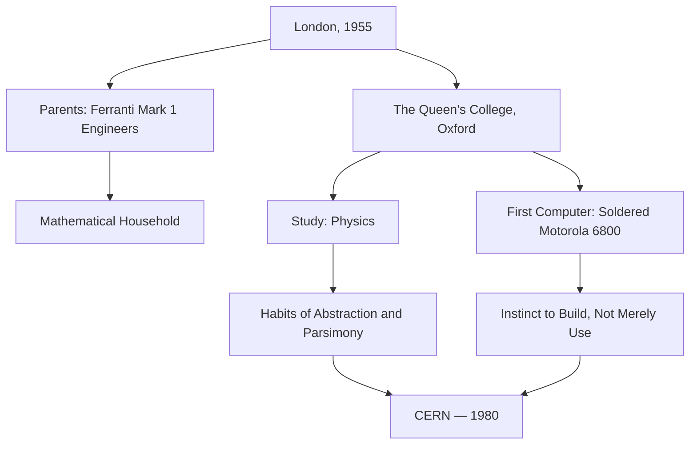
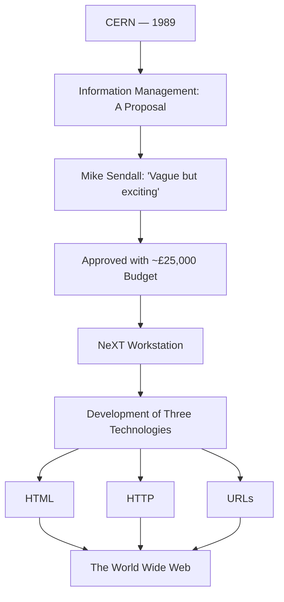
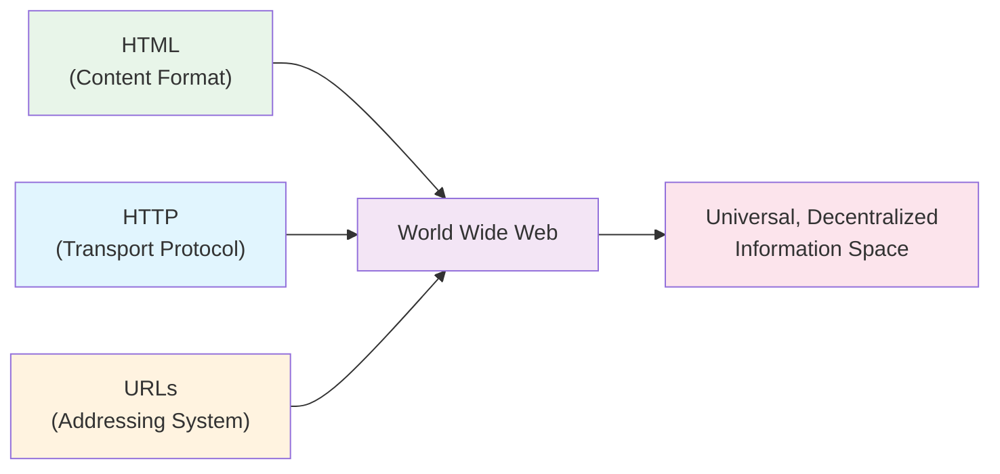
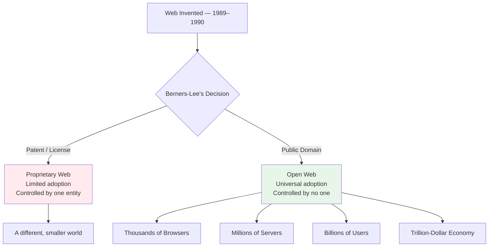
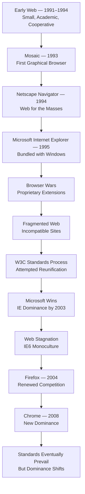
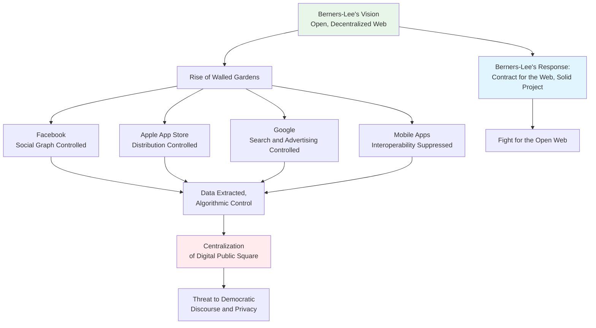
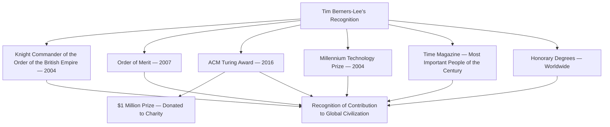
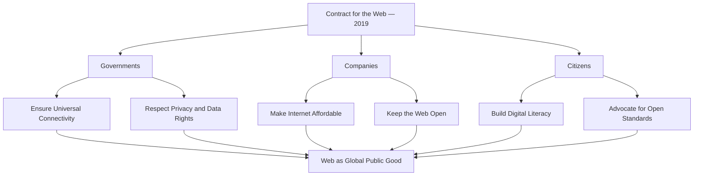

# Tim Berners-Lee

## Description

Sir Timothy John Berners-Lee (born 1955) is a British computer scientist who invented the World Wide Web — the system of interlinked hypertext documents accessed via the Internet — and, in a single act of restraint that may be the most consequential decision in the history of technology, chose not to patent it. His creation connected humanity in ways that no previous invention had achieved, yet his story is not one of triumphalism. It is the story of an inventor who watched his creation be commercialized, centralized, and distorted by forces he did not anticipate, and who has spent the decades since fighting to preserve the open, decentralized vision that made the web worth building in the first place. To study Berners-Lee is to confront the paradox at the heart of creation: that the most generous act — giving something away freely — can generate both the greatest good and the greatest vulnerability.

## Prerequisites

- [Dennis Ritchie](dennis-ritchie.md) — the Unix culture and systems programming tradition that shaped the infrastructure upon which early web servers were built
- [Steve Jobs](steve-jobs.md) — the commercial web ecosystem and consumer internet that would reshape the medium Berners-Lee created

The reader is expected to possess a basic understanding of what the Internet is, how client-server architecture functions, and why open standards matter for interoperability. An awareness of the political and economic dynamics of the technology industry in the late twentieth century will be assumed throughout.

## Table of Contents

- [Origins — The Son of Computers](#-origins--the-son-of-computers)
  - [A Household Shaped by Machines](#a-household-shaped-by-machines)
  - [Oxford and the Accidental Engineer](#oxford-and-the-accidental-engineer)
  - [CERN and the Problem of Scattered Knowledge](#cern-and-the-problem-of-scattered-knowledge)
- [The Work — Inventing the Web](#-the-work--inventing-the-web)
  - [The Proposal That Changed Everything](#the-proposal-that-changed-everything)
  - [HTML, HTTP, and URLs — The Trinity of the Web](#html-http-and-urls--the-trinity-of-the-web)
  - [The First Browser and the First Server](#the-first-browser-and-the-first-server)
  - [The Decision Not to Patent](#the-decision-not-to-patent)
  - [W3C and the Architecture of Standards](#w3c-and-the-architecture-of-standards)
- [Struggles and Failures — The Cost of an Open Vision](#-struggles-and-failures--the-cost-of-an-open-vision)
  - ["Vague but Exciting" — CERN's Initial Indifference](#vague-but-exciting--cerns-initial-indifference)
  - [The Browser Wars and the Fragmentation of the Web](#the-browser-wars-and-the-fragmentation-of-the-web)
  - [Commercialization Against the Original Vision](#commercialization-against-the-original-vision)
  - [Walled Gardens and the Retreat from the Open Web](#walled-gardens-and-the-retreat-from-the-open-web)
  - [Misinformation, Surveillance, and the Web He Fought Against](#misinformation-surveillance-and-the-web-he-fought-against)
- [Legacy and Lessons — The Web as a Moral Project](#-legacy-and-lessons--the-web-as-a-moral-project)
  - [Honors and Recognition](#honors-and-recognition)
  - [The Web Connects Billions](#the-web-connects-billions)
  - [What His Life Teaches About Giving Things Away](#what-his-life-teaches-about-giving-things-away)
  - [The Contract for the Web](#the-contract-for-the-web)

## 🌱 Origins — The Son of Computers

### A Household Shaped by Machines

Timothy John Berners-Lee was born on 8 June 1955 in London, England, into a family that had, by an extraordinary convergence of circumstance, been immersed in the history of computing since before the word "computer" carried its modern meaning. Both of his parents worked on the Ferranti Mark 1, one of the first commercially available electronic digital computers, delivered to the University of Manchester in 1951. His father, Conway Berners-Lee, was a mathematician who worked on the machine's software. His mother, Mary Lee Woods, was also a mathematician and computer scientist who had worked on the same project. They met through their work on the Ferranti Mark 1 — a meeting of minds facilitated by the machine that, decades later, their son would connect to the world.

The significance of this lineage is difficult to overstate. Tim Berners-Lee did not encounter computers as an adult. He was formed by them. His earliest memories include the hum of processing equipment, the language of mathematics spoken casually at the dinner table, and the implicit understanding that computation was not a distant abstraction but a practical instrument for solving real problems. The household was not merely educated — it was embedded in the nascent culture of electronic computing, a culture that valued precision, logical rigor, and the conviction that machines could be made to do useful things if their operators understood them deeply enough.

This upbringing gave Berners-Lee something that no university program could provide: an intuitive familiarity with the conceptual foundations of computing. He did not learn about algorithms and data structures as a student encountering them for the first time. He absorbed them as a child absorbs language — through immersion, observation, and the unconscious patterns of a household where mathematics was the vernacular.

### Oxford and the Accidental Engineer

Berners-Lee attended The Queen's College, Oxford University, where he studied physics — a choice that reflected both his intellectual inheritance and the particular breadth of his curiosity. Physics, at its best, trains the mind to see structure in apparent chaos, to identify the simplest principles underlying complex phenomena, and to build models that abstract from the particular to the general. These habits of thought would prove essential when, a decade later, he would need to design a system that abstracted the particular problem of information sharing at CERN into a general architecture for global communication.

At Oxford, Berners-Lee built his first computer — a soldered-together assembly of Motorola 6800 processors and other components acquired from surplus shops. The machine was not elegant. It was functional. The act of building it was more important than its specifications: it demonstrated the instinct that would define his career — the impulse to construct tools rather than merely use them, to build the infrastructure rather than consume its products.

His time at Oxford also gave him an experience that would recur throughout his career: the encounter with systems that were more complex than they needed to be, and the instinct to find the simplest path through the complexity. Physics teaches parsimony — the preference for the simplest explanation that accounts for all the evidence. Berners-Lee would later apply this principle to the design of the Web with devastating effectiveness: three technologies, three specifications, one coherent architecture.



### CERN and the Problem of Scattered Knowledge

After Oxford, Berners-Lee worked at various positions in the technology sector, including a role at Plessey Telecommunications and a venture as an independent contractor. In 1980, he joined CERN — the European Organization for Nuclear Research — as a software engineer in the Physics Division. CERN was, and remains, one of the largest and most complex scientific laboratories in the world, a place where thousands of physicists from dozens of countries collaborate on experiments that probe the fundamental structure of matter.

The environment at CERN was intellectually extraordinary but organizationally chaotic. Physicists arrived from institutions across the globe, bringing with them their own computing systems, their own data formats, and their own methods of documentation. Information was scattered across incompatible systems: some data resided on CERN's central computers, some on individual workstations, some on paper, and some in the memories of researchers who had since moved on to other institutions. There was no unified system for locating, retrieving, or linking information. Each new collaboration required each participant to rediscover the landscape of existing knowledge.

Berners-Lee observed this problem with the eye of a physicist — not as a management failure but as an information architecture failure. The knowledge existed. The people who needed it existed. What was missing was the connective tissue between them — a system that would allow information to be linked, referenced, and discovered regardless of where it was stored or what machine it resided on.

The problem was not unique to CERN. It was a preview of the problem that would soon confront every organization on the planet: the explosion of digital information without a corresponding infrastructure for organizing, linking, and accessing it. But at CERN, the problem was acute enough, and the community motivated enough, to serve as the proving ground for the solution.

In 1980, during his first stint at CERN, Berners-Lee built a prototype system called ENQUIRE — a program that allowed users to create hypertext links between related documents. ENQUIRE was simple, even crude by later standards, but it embodied the core idea that would become the Web: information is most powerful when it can be connected to other information, and the connections themselves carry meaning. The links between documents are not merely navigational aids — they are a form of knowledge representation, encoding the relationships between ideas in a structure that humans and machines can both traverse.

ENQUIRE was a personal tool, never intended for public release. But it planted the seed. The idea that documents could be linked — that a reader could move from one source to another by following references, the way a scholar follows footnotes in a library — was not new. Vannevar Bush had described it in his 1945 essay "As We May Think," and Doug Engelbart had demonstrated it with his oN-Line System (NLS) in the 1960s. What Berners-Lee would add was the crucial element of *scale* — a system that worked not within a single computer or a single organization but across the entire world, linking any document to any other document on any machine connected to the Internet.

## 🔧 The Work — Inventing the Web

### The Proposal That Changed Everything

In 1989, Berners-Lee was working in the Computing Division at CERN when he submitted a proposal titled "Information Management: A Proposal." The document was thirty-three pages long, dense with technical detail, and addressed to his supervisor, Mike Sendall. Sendall's response, written in the margin of the cover page, has become one of the most famous annotations in the history of technology: "Vague but exciting."

The proposal was not, in fact, vague. It was precise in its diagnosis of the problem — the inability of CERN's scattered information systems to interoperate — and in its proposed solution: a distributed hypertext system built on the existing infrastructure of the Internet. The system would use three fundamental technologies, each simple on its own, which together would create something entirely new.

The proposal was exciting because it offered a path out of the organizational chaos that plagued CERN. But it was also easy to dismiss because its ambition was so far beyond the immediate needs of the laboratory. Berners-Lee was proposing not a tool for CERN but an architecture for global information sharing — and in 1989, the idea that the Internet would become a universal medium was not yet self-evident. The Internet existed, but it was used primarily by academics, researchers, and military institutions. The notion that it would become the substrate of a global communication system was, to most readers of Berners-Lee's proposal, speculative at best.

Sendall approved the project — reluctantly, and with limited resources. Berners-Lee was given a budget of approximately £25,000 (roughly $40,000 at the time) and a single workstation, a NeXT computer. It was on this machine, with this budget, that he would build the foundation of the modern world.



### HTML, HTTP, and URLs — The Trinity of the Web

The Web rests on three technologies, each elegantly simple, each solving a distinct problem, and each designed with the physicist's instinct for parsimony — the minimum apparatus necessary to produce the desired effect.

**HTML (HyperText Markup Language)** provided the format for documents. It was a markup language, not a programming language — a crucial distinction. HTML described the structure of a document (headings, paragraphs, lists, links) without specifying how that document should be rendered. This separation of content from presentation was deliberate: it meant that a single HTML document could be read on any device, with any display capabilities, and still convey its meaning. A document created on a powerful workstation could be read on a simple terminal. The content was invariant; only the rendering changed.

The design of HTML reflected Berners-Lee's conviction that the Web should be universal — accessible to anyone with a connection, regardless of their hardware, software, or location. A language tied to a specific platform would have created a fragmented landscape of incompatible systems. HTML, by being deliberately minimal and platform-independent, created a single format that every system could interpret.

```html
<!DOCTYPE html>
<html>
<head>
    <title>A Simple Web Page</title>
</head>
<body>
    <h1>The World Wide Web</h1>
    <p>This is the first web page ever created, or something very like it.</p>
    <p>For more information, visit the
       <a href="http://info.cern.ch">CERN web server</a>.</p>
</body>
</html>
```

The code above — simple, declarative, human-readable — is the language in which the Web is written. Its simplicity is not an accident. It is a design choice. Every complexity that could be removed was removed. What remained was the minimum vocabulary needed to describe a document, link it to another document, and transmit it across a network.

**HTTP (HyperText Transfer Protocol)** provided the mechanism for transmitting documents between machines. It was a request-response protocol: a client (later called a browser) sent a request to a server, specifying the document it wanted, and the server responded with the document's content. HTTP was stateless — each request was independent, carrying no memory of previous requests. This simplicity was its strength: it meant that servers did not need to maintain session data, clients did not need to be authenticated, and the system could scale horizontally by adding more servers without changing the protocol.

HTTP operated on top of existing Internet protocols — TCP/IP — and used the existing addressing system of the Internet (domain names and IP addresses) to locate servers. It did not require new infrastructure. It used what was already there. This was another critical design decision: the Web was not a new network. It was a layer on top of the existing Internet, and its design respected the Internet's architecture rather than competing with it.

**URLs (Uniform Resource Locators)** provided the addressing system for documents. Each document on the Web had a unique address — a string of characters that specified the protocol to use (http or https), the server to contact, and the path to the specific document. A URL was, in essence, a coordinate in the space of the Web: it told you exactly where to find a document and exactly how to retrieve it.

The combination of these three technologies — HTML for content, HTTP for transport, URLs for addressing — created a system that was greater than the sum of its parts. Any document, anywhere on the Internet, could be linked to any other document. The links were bidirectional in concept (though not technically in implementation — a link from A to B did not require B to know about A). The system was decentralized: anyone could create a server, publish documents, and link to other servers without requiring permission from any central authority.



### The First Browser and the First Server

In December 1990, Berners-Lee implemented the first web browser — called WorldWideWeb (later renamed Nexus to avoid confusion with the World Wide Web itself) — on his NeXT workstation. The browser was also an editor: users could not only view web pages but create and link to new ones directly from within the application. This dual function — browsing and editing in the same interface — was not an oversight. It was a philosophical statement. Berners-Lee believed that the Web should be a read-write medium, not merely a read-only one. Every user should be both consumer and producer of information.

Simultaneously, he set up the first web server at CERN — a NeXT machine that served the first web page, a simple document explaining what the World Wide Web was, how to create web pages, and how to set up a web server. The address was `http://info.cern.ch` — a URL that still functions, redirecting to CERN's modern web presence. The first web server was not a commercial product. It was a research project running on a borrowed machine. The Web was born not in a corporate laboratory or a startup incubator but in the unglamorous environment of a particle physics research center.

The first browser's dual nature — both viewer and editor — reveals something important about Berners-Lee's vision. He did not imagine a Web dominated by a few large publishers and consumed passively by billions of readers. He imagined a Web of peers, where every participant could both read and write, where the flow of information was multidirectional, and where the barrier between author and reader was deliberately minimized. This vision would be progressively eroded by the commercial Web, but it remained the philosophical foundation of Berners-Lee's advocacy.

### The Decision Not to Patent

In 1993, CERN released the World Wide Web software into the public domain, making it freely available to anyone who wished to use, modify, or distribute it. This decision — made jointly by Berners-Lee and the CERN administration — was the single most consequential act in the history of the Web. It ensured that no single entity could control the medium, that anyone could build a web browser or a web server without paying licensing fees, and that the Web's growth would be driven by adoption rather than authorization.

Berners-Lee could have patented the Web. He could have licensed it. He could have sold it. He did none of these things. The decision was not naive — he understood what he was giving up. It was principled: he believed that the Web should be a public good, accessible to all, owned by none. The decision reflected a worldview in which the value of creation lies not in its capacity to generate revenue for the creator but in its capacity to serve humanity.

The economic consequences of this decision are incalculable. Had the Web been patented, every web page, every web server, every browser, and every web application would have required a license. The growth of the Web — from a few dozen servers in 1992 to hundreds of millions today — would have been throttled by licensing negotiations, legal disputes, and the friction of commercial control. The open Web enabled an ecosystem of innovation that no proprietary system could have produced.

This act of restraint — the refusal to claim ownership of something that could have made its creator enormously wealthy — is the measure of Berners-Lee's character. It is also a lesson in the paradox of generosity: by giving the Web away, he gave it to the world, and the world gave back more than any patent could have provided. The legacy of an open standard is not measured in royalties but in reach — in the billions of people whose lives have been transformed by a technology that was free from the beginning.



### W3C and the Architecture of Standards

In 1994, Berners-Lee founded the World Wide Web Consortium (W3C) at the Massachusetts Institute of Technology. The W3C was established to develop open standards for the Web — to ensure that the Web remained interoperable, accessible, and free from the fragmentation that had plagued earlier technology standards.

The W3C was not a government agency, not a corporation, and not a traditional standards body. It was a consortium — a voluntary association of member organizations that agreed to collaborate on the development of shared standards. The consortium's process was deliberate and inclusive: standards were developed through a process of public discussion, technical review, and consensus-building. Anyone could participate. The specifications were publicly available. The process was slow, but it produced standards that were technically sound and broadly accepted.

The W3C's early standards — HTML 2.0, CSS 1.0, HTML 3.2 — established the pattern that would govern the Web's evolution: a cycle of proposal, implementation, review, and standardization. The process was not perfect. It was often slow, sometimes politically contentious, and occasionally outpaced by the market. But it provided something essential: a governance structure that prevented any single company from defining the Web's architecture unilaterally.

The founding of the W3C was Berners-Lee's second great act of restraint. Where his refusal to patent the Web was an act of generosity, the W3C was an act of governance — a recognition that open standards require institutional stewardship to remain open. The Web's openness was not self-sustaining. It required active maintenance, active defense, and active negotiation between competing interests. The W3C was the mechanism through which this maintenance was performed.

## ⚔️ Struggles and Failures — The Cost of an Open Vision

### "Vague but Exciting" — CERN's Initial Indifference

The initial reception of Berners-Lee's proposal at CERN was lukewarm. The phrase "Vague but exciting" has become iconic precisely because it captures the institutional response to ideas that are too large for their context. Sendall approved the project, but without enthusiasm. CERN was a physics laboratory, not a computer science research center. Its primary mission was the study of fundamental particles, not the development of global communication systems. Berners-Lee's proposal was peripheral to the laboratory's core work, and it was funded accordingly.

This indifference was not irrational. CERN had limited resources and unlimited demands. A proposal to build a global information system, however intellectually appealing, was competing with requests for faster processors, more storage, and better network connections for the experiments that justified the laboratory's existence. In the hierarchy of CERN's priorities, particle physics came first, and everything else — including Berners-Lee's Web — was auxiliary.

The lesson is not that CERN was foolish. It is that institutional priorities are shaped by immediate needs, and the most transformative ideas are often the hardest to recognize precisely because their implications extend far beyond the institution's current frame of reference. The Web was not a CERN problem. It was a world problem. But Berners-Lee was proposing a solution to a world problem while working within an institution that measured success in terms of particle collisions. The mismatch between the scope of the vision and the scope of the institution was the first of many such mismatches Berners-Lee would encounter.

### The Browser Wars and the Fragmentation of the Web

The early Web — the Web of 1991 to 1994 — was a small, academic community. There were a handful of browsers, a few thousand web servers, and a culture of cooperation and shared purpose. This changed rapidly when commercial interests discovered the Web's potential.

In 1993, Marc Andreessen and Eric Bina released Mosaic, a graphical web browser developed at the National Center for Supercomputing Applications (NCSA) at the University of Illinois. Mosaic was the first browser to display images inline with text, and it made the Web visually accessible to a general audience for the first time. Andreessen subsequently co-founded Netscape Communications, which released Netscape Navigator in 1994 — the browser that brought the Web to millions.

Microsoft, recognizing the threat that the Web posed to its dominance of personal computing, released Internet Explorer in 1995 and began bundling it with Windows. The result was the Browser Wars — a period of fierce competition between Netscape and Microsoft in which each company developed proprietary extensions to HTML, JavaScript, and CSS, creating incompatibilities that fragmented the Web and undermined the universality that Berners-Lee had designed.

The Browser Wars were a direct assault on the principle of open standards. Rather than implementing the standards that the W3C was developing, each company added proprietary features that worked only in their own browser, creating a web that was different depending on which application you used. Web developers were forced to write multiple versions of their sites, testing on both browsers, and users were forced to choose between incompatible ecosystems. The dream of a universal, platform-independent medium was being replaced by a landscape of proprietary fiefdoms.



Berners-Lee watched the Browser Wars with dismay. The Web he had designed was being carved up by companies that treated it as a competitive weapon rather than a shared infrastructure. The W3C's standards process — designed to prevent exactly this kind of fragmentation — was too slow to keep pace with the market. By the time a standard was ratified, the browsers had already implemented proprietary alternatives.

The Browser Wars ended not with a resolution but with an exhaustion. Netscape was defeated by Microsoft's bundling strategy and eventually open-sourced its browser code, which became Firefox. Internet Explorer, having won the war, stagnated — its dominance so complete that Microsoft had no incentive to innovate. The Web survived, but it was scarred: the lessons of the Browser Wars — that open standards require not just agreement but enforcement — shaped every subsequent standards effort.

### Commercialization Against the Original Vision

Berners-Lee designed the Web as a platform for information sharing — a space where knowledge would be freely accessible, where links would connect ideas across institutional boundaries, and where the barrier between author and reader would be minimal. The commercial Web that emerged in the late 1990s was something different: a platform for e-commerce, advertising, and media consumption, in which information was not shared freely but packaged as a product to be monetized.

The rise of commercial Web portals — Yahoo!, AOL, MSN — transformed the Web from a decentralized network of individually authored pages into a curated experience mediated by large corporations. Users no longer navigated the Web by following links between individual documents. They navigated it through portals that aggregated, filtered, and presented content according to commercial logic. The individual web page — the fundamental unit of Berners-Lee's design — was subordinated to the portal, which controlled what the user saw and in what order.

This commercialization was not inherently destructive. The Web needed revenue models to sustain itself, and advertising and e-commerce provided those models. But the trajectory of commercialization raised a question that Berners-Lee would spend the next two decades confronting: can an open standard survive the forces of commercial capture? Can a technology designed for universal access remain universal when the economic incentives favor concentration, aggregation, and control?

The answer, as of the 2020s, is uncertain. The commercial Web has generated enormous wealth and enormous convenience. It has also generated surveillance, misinformation, and a concentration of power in a handful of technology companies that Berners-Lee did not anticipate and would not have endorsed. The tension between the Web as a public good and the Web as a commercial platform remains unresolved.

### Walled Gardens and the Retreat from the Open Web

The most significant threat to Berners-Lee's vision is not hostile technology but voluntary withdrawal. The rise of closed platforms — Facebook, Apple's App Store, Google's ecosystem, and the broader shift from open web pages to proprietary mobile applications — represents a retreat from the open, interoperable Web that Berners-Lee designed.

In a walled garden, the platform controls the content, the distribution, the monetization, and the user experience. Information does not flow freely between platforms. Links are suppressed or restricted. Users are encouraged to consume content within the walls rather than navigating the open Web. The result is not a single, unified information space but a collection of proprietary silos, each governed by its own rules, each resistant to interoperability.

Berners-Lee has spoken repeatedly about the dangers of this trend. In a 2018 article for Scientific American, he wrote: "The Web is no longer what we meant it to be." He identified three central threats: the loss of control over personal data, the spread of misinformation, and the lack of transparency in how platforms shape what users see. Each of these threats is a consequence of the commercialization and centralization that the walled garden model enables.

The retreat from the open Web is particularly insidious because it is voluntary. Users choose to use Facebook rather than publish their own web pages. Developers choose to build apps rather than websites. Advertisers choose to target users through platform algorithms rather than through open ad networks. Each choice is individually rational — the platforms provide convenience, reach, and revenue that the open Web cannot match — but collectively they erode the infrastructure of the open Web that makes universal access possible.



### Misinformation, Surveillance, and the Web He Fought Against

The Web that Berners-Lee built to connect humanity has also become a vector for misinformation, propaganda, and manipulation at a scale that no previous communication medium has achieved. The same architecture that enables a researcher in Nairobi to access a paper published in Tokyo enables a propagandist in one country to flood another country's information ecosystem with fabricated content.

Berners-Lee has acknowledged this failure — not as a personal failure but as a failure of the system's architecture. The Web was designed to transmit information, not to evaluate it. It assumed that the humans using it would exercise judgment about what to trust. This assumption has proven catastrophically optimistic.

The surveillance dimension is equally troubling. The Web's architecture — built on HTTP, cookies, and client-server communication — creates a record of every interaction. Every page visited, every link followed, every form submitted generates data that can be collected, aggregated, and analyzed. The business models of the dominant Web platforms — Google, Facebook, Amazon — are built on the extraction and monetization of this data. The Web that was designed to share information freely has become a mechanism for the systematic surveillance of its users.

Berners-Lee's response to these failures has been neither resignation nor nostalgia. He has proposed concrete technical solutions — most notably the Solid project, which aims to give users control over their own data by decoupling data storage from applications — and has advocated for legal and institutional reforms to protect the open Web. His "Contract for the Web," published in 2019, outlines principles and commitments for governments, companies, and citizens to preserve the Web as a global public good.

These efforts have not reversed the trends toward centralization and surveillance. But they have articulated a vision of what the Web could become — and they have kept alive the conviction that the original vision is worth fighting for, even when the forces arrayed against it are formidable.

## 🌍 Legacy and Lessons — The Web as a Moral Project

### Honors and Recognition

Tim Berners-Lee has received more honors than almost any other figure in the history of technology, and he has received them with characteristic understatement. In 2004, he was knighted by Queen Elizabeth II for his services to the global development of the Internet. He became a Knight Commander of the Order of the British Empire (KBE) — one of the highest honors the British state can bestow. In 2007, he was awarded the Order of Merit, a distinction limited to twenty-four living members at any one time, recognizing exceptional distinction in science, art, literature, or the promotion of culture.

In 2016, he received the ACM Turing Award — the highest distinction in computer science, often called the "Nobel Prize of computing" — for the invention of the World Wide Web. The citation recognized not only the technical achievement but the decision to make it freely available. He received the Turing Award alongside a $1 million prize, which he donated to charity.

He has also received the Millennium Technology Prize (2004), the MacRobert Award (1994), and honorary degrees from universities around the world. In 2017, he was named as one of the "most important people of the century" by Time magazine. The honors are a measure of the Web's impact: it is rare for a single invention to transform every dimension of human life — communication, commerce, education, politics, culture — within a single generation.



### The Web Connects Billions

As of the mid-2020s, the Web connects approximately 5.4 billion people — roughly two-thirds of the world's population. There are over 1.9 billion websites, though only a fraction are actively maintained. The Web underpins an economy measured in trillions of dollars, supports communication between individuals, communities, and nations, and provides access to the accumulated knowledge of humanity.

The scale of this achievement is almost incomprehensible. In 1990, when Berners-Lee wrote his proposal, there were zero web pages. Today, there are billions. In 1991, there was one web server. Today, there are hundreds of millions. The growth curve is not merely steep — it is vertical, a transformation so rapid that it has outpaced the ability of social, legal, and political institutions to adapt.

The Web has enabled things that Berners-Lee did not explicitly design but that his architecture made possible: social media, e-commerce, streaming media, cloud computing, the Internet of Things, and the global knowledge commons. It has also enabled things he did not anticipate and does not endorse: mass surveillance, the erosion of privacy, the spread of disinformation, and the concentration of economic power in a small number of technology companies.

The Web is not a neutral tool. It is an architecture that encodes values — openness, universality, decentralization — and those values are in constant tension with the forces that seek to exploit, control, or subvert them. The Web's future is not predetermined. It will be shaped by the choices of its users, its builders, and its regulators. Berners-Lee's legacy is not the Web as it is. It is the Web as it could be — a standard of reference against which the actual is measured.

### What His Life Teaches About Giving Things Away

The central lesson of Berners-Lee's life is counterintuitive: the most valuable things are often the ones you give away.

The logic of proprietary technology is clear: create something valuable, protect it with patents, licenses, and trade secrets, and extract value from it through control. This logic has produced enormous wealth for its practitioners and enormous inconvenience for its users. Every licensing fee, every lock-in, every incompatible format is a tax on the ecosystem — a cost borne by the users and the builders who must work within the constraints of the proprietary system.

Berners-Lee's decision to give the Web away rejected this logic entirely. By placing the Web in the public domain, he ensured that anyone could build on it without permission. The result was not a loss of value but an explosion of it. The open Web created an ecosystem of innovation that a proprietary Web could never have produced — because openness lowered the barriers to entry, increased the number of participants, and accelerated the pace of iteration.

The lesson extends beyond technology. It is a lesson about the nature of value itself. Value is not always captured through ownership. It is sometimes created through generosity — through the willingness to build something and then give it away, trusting that the world will be enriched in ways that no spreadsheet can predict. This is a form of stewardship — the management of something entrusted to you for the benefit of others, not for your own enrichment.

The Christian resonances of this principle are worth noting — not as a doctrinal statement but as a philosophical observation. The idea that the most profound contributions are acts of giving rather than taking, that the measure of a life is not what it accumulates but what it releases into the world, runs deep in the Western intellectual tradition. Berners-Lee's decision not to patent the Web is not a religious act. But it is an act that reflects a conviction about the proper relationship between creator and creation — a conviction that creation is most fully realized when it is shared.

### The Contract for the Web

In 2019, Berners-Lee launched the Contract for the Web — a global plan of action to protect the Web as a public good and ensure it remains open and a global utility for the people of the world. The contract establishes principles for governments, companies, and citizens, and it represents Berners-Lee's most explicit articulation of what the Web should be.

The contract's principles include:

- **Ensure everyone can connect to the Internet.** The Web is meaningless if it is accessible only to the wealthy or the privileged. Universal access is a prerequisite for universal benefit.

- **Make the Internet affordable and accessible to everyone.** Cost, language, and infrastructure barriers must be addressed if the Web is to fulfill its promise as a global medium.

- **Respect and protect people's fundamental online privacy and data rights.** The surveillance model that dominates the commercial Web is incompatible with the Web's founding principles. Users must control their own data.

- **Keep the Web open and a global public resource for people everywhere.** Walled gardens, proprietary platforms, and regulatory fragmentation threaten the universality that makes the Web valuable.

- **Build digital literacy and a thriving digital world.** The Web is only as good as the people who use it. Education, literacy, and critical thinking are prerequisites for a healthy information ecosystem.

The Contract for the Web is not legally binding. It is a declaration of principles — a statement of what the Web should be, authored by the person who created it. Its significance lies not in its enforcement mechanism, which does not exist, but in its articulation of a vision. It says: this is what the Web was designed for, and this is what we owe to future generations.



The trajectory of Berners-Lee's life — from the son of computer engineers to the inventor of the Web to the advocate for its preservation — is not a story of unbroken triumph. It is a story of creation, loss, and persistence. The Web he built has been commercialized, centralized, and weaponized in ways he did not intend. The open standard he gave freely has been enclosed by walled gardens. The universal medium he envisioned has become a tool of surveillance and division.

And yet the Web endures. Its architecture — decentralized, open, resilient — has survived every attempt to capture it. Its standards — developed through the W3C's inclusive process — remain the foundation of global communication. Its creator — tireless, principled, and stubborn — continues to fight for the vision that animated his original proposal.

The lesson is not that idealism always prevails. It is that idealism, embodied in the right architecture at the right time, can create something that outlasts the forces that seek to diminish it. Berners-Lee gave the Web to the world. The world has not always been a worthy custodian. But the Web remains, as it was from the beginning, an expression of a conviction that knowledge should be free, that information should flow, and that the most powerful thing a person can do with an idea is share it.

## 📝 Learning Tips

- **Read the original proposal.** Berners-Lee's 1989 document "Information Management: A Proposal" is available online and is remarkably readable. It diagnoses the problem, proposes the solution, and anticipates many of the Web's future challenges. Reading it reveals how the Web's architecture was shaped by a specific problem (information management at CERN) and how that solution proved to be universal.

- **Visit the first web page.** The original web page — hosted at `http://info.cern.ch` — still exists. Visiting it is a pilgrimage of sorts: standing at the origin point of the medium that has reshaped the world. The page is simple, even austere. It is a reminder that the most transformative technologies often begin as unassuming prototypes.

- **Study the three technologies.** HTML, HTTP, and URLs are not merely historical artifacts. They are the living standards of the Web. Understanding how they work — their simplicity, their composability, their platform-independence — reveals the design principles that made the Web universal. Each technology is deliberately minimal: it provides exactly the functionality needed and nothing more.

- **Trace the commercialization.** Follow the trajectory from the first web servers at CERN through the rise of Netscape, the Browser Wars, the dot-com boom, and the current dominance of a few large platforms. Understanding how the Web was commercialized reveals the tension between openness and capture that defines its current state.

- **Compare Berners-Lee with other inventors.** The contrast between Berners-Lee's decision not to patent the Web and the patent strategies of other technology inventors illuminates a fundamental question: what is the proper relationship between an invention and its creator? The answer has implications far beyond technology.

- **Consider the architecture of openness.** The Web's openness is not accidental. It is the product of deliberate design decisions — the choice of open standards, the creation of the W3C, the release of the Web into the public domain. Studying these decisions reveals that openness is not a default state. It must be actively constructed and actively defended.

- **Engage with the Solid project.** Berners-Lee's Solid project (https://solidproject.org) represents his current effort to reclaim the Web's original vision by giving users control over their own data. Understanding Solid's architecture reveals how the lessons of the Web's history are being applied to its future.

## 📚 Glossary

| Term | Definition |
|------|------------|
| World Wide Web | A system of interlinked hypertext documents accessed via the Internet, invented by Tim Berners-Lee in 1989–1990 at CERN |
| HTML | HyperText Markup Language — the standard markup language for creating web pages, designed to describe document structure in a platform-independent format |
| HTTP | HyperText Transfer Protocol — the application-layer protocol used for transmitting hypertext documents on the Web, operating on a request-response model |
| URL | Uniform Resource Locator — a string of characters that specifies the address of a resource on the Web, including the protocol, host, and path |
| Hypertext | Text displayed on a computer with references (hyperlinks) to other text that the reader can immediately access |
| CERN | The European Organization for Nuclear Research, located near Geneva, Switzerland, where the World Wide Web was invented |
| W3C | World Wide Web Consortium — the international standards organization founded by Berners-Lee in 1994 to develop open standards for the Web |
| ENQUIRE | An early hypertext program written by Berners-Lee at CERN in 1980, a precursor to the World Wide Web |
| Browser Wars | The period of competition in the 1990s between Netscape Navigator and Microsoft Internet Explorer, marked by proprietary extensions that fragmented the Web |
| Walled Garden | A closed digital ecosystem in which a platform controls content, distribution, and user experience, restricting interoperability with other platforms |
| Open Standard | A technical specification that is publicly available, royalty-free, and governed by an open process, allowing anyone to implement it |
| Public Domain | The status of a creative work that is not protected by intellectual property rights and can be freely used by anyone |
| Solid | A decentralized web platform project led by Berners-Lee that aims to give users control over their own data through personal online data stores |
| NeXT Computer | The workstation developed by Steve Jobs's company NeXT, on which Berners-Lee built the first web browser and server |
| KBE | Knight Commander of the Order of the British Empire — one of the highest honors in the British honors system |
| Turing Award | The highest distinction in computer science, awarded annually by the Association for Computing Machinery (ACM) |

## 📖 Quick References

- [Tim Berners-Lee: Information Management: A Proposal](https://www.w3.org/History/1989/proposal.html) — the original 1989 document that launched the World Wide Web, available in its complete form
- [The World Wide Web project](https://www.w3.org/WhatIs.html) — the W3C's overview of the Web's origins, architecture, and standards
- [First Web Page at CERN](http://info.cern.ch) — the original web server address, still operational, redirecting to CERN's explanation of the Web's history
- [Tim Berners-Lee: Contract for the Web](https://contractfortheweb.org/) — the 2019 global plan of action to protect the Web as a public good
- [Tim Berners-Lee — W3C](https://www.w3.org/People/Berners-Lee/) — Berners-Lee's personal page at the W3C, including his writings on the Web's future
- [Tim Berners-Lee — Britannica](https://www.britannica.com/biography/Tim-Berners-Lee) — an authoritative biographical overview from the Encyclopaedia Britannica
- [Solid Project](https://solidproject.org/) — Berners-Lee's current initiative to decentralize the Web and give users control over their data
- [Weaving the Web — Tim Berners-Lee](https://www.w3.org/People/Berners-Lee/weaving/) — Berners-Lee's own account of the Web's invention and his vision for its future

## Next Steps

The story of Tim Berners-Lee does not end with the Web he created. It continues in the work of those who extended, challenged, and built upon the open infrastructure he gave to the world. The trajectory from Berners-Lee's invention to the open-source movement represents a shared philosophical commitment: the conviction that the most powerful technologies are the ones that are freely available to all.

- [Linus Torvalds](linus-torvalds.md) — who followed the same open-source philosophy with Linux, creating a free operating system that fulfilled the promise of open standards at the systems level
- [Guido van Rossum](guido-van-rossum.md) — who made the web's backend accessible with Python, extending the principle of accessibility from the interface to the infrastructure
