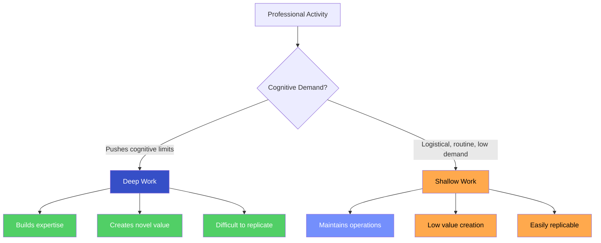
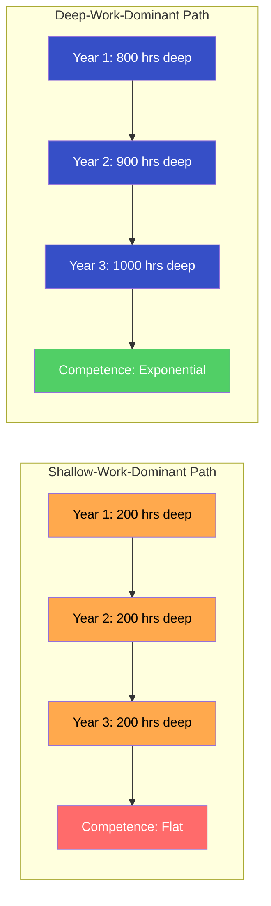
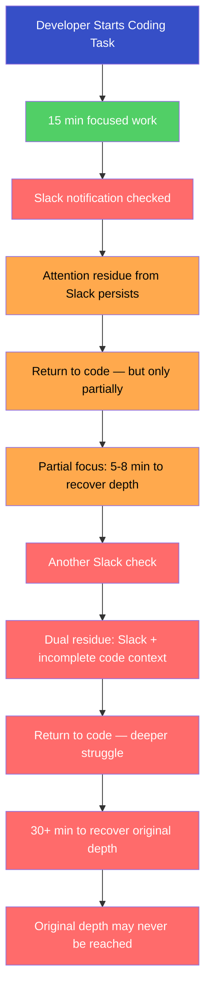
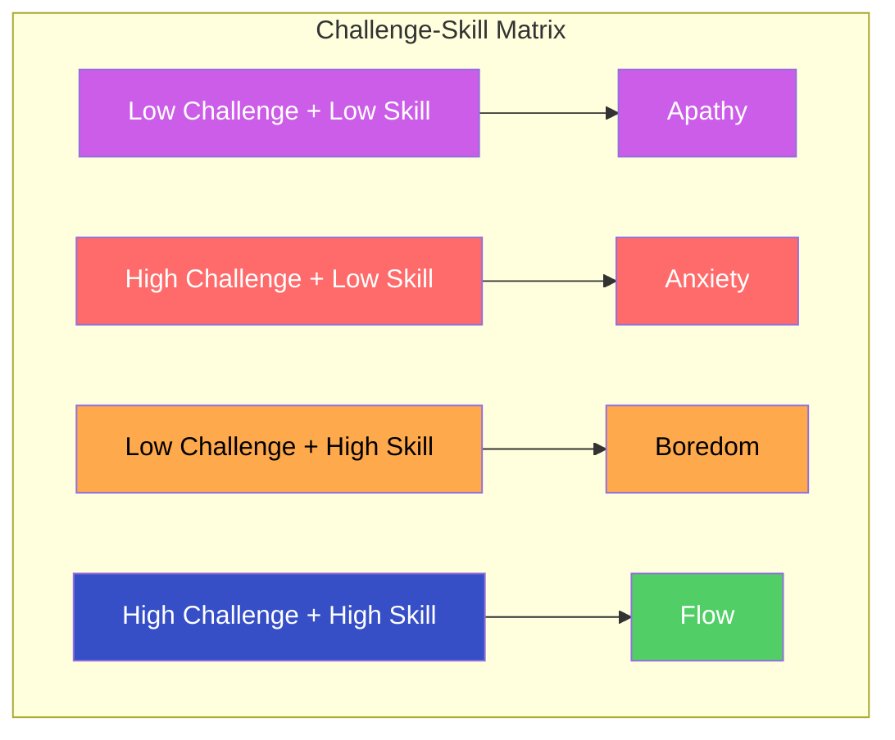
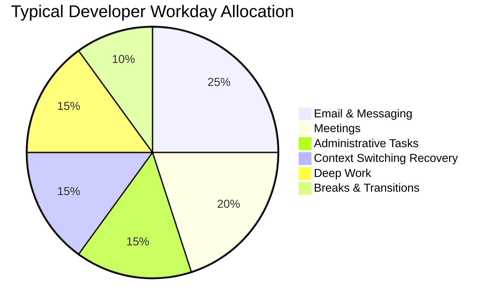
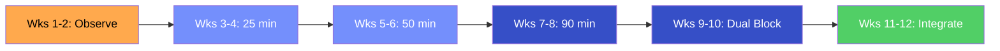

# Deep Work vs Shallow Work

## Description

The capacity for sustained, focused attention is the most valuable cognitive asset a developer possesses — and the most under attack. This document defines deep work and shallow work, explains why the distinction matters, and provides strategies for protecting your attentional infrastructure against the forces of fragmentation, interruption, and engineered distraction.

## Prerequisites

- [Why Digital Wellness Matters](intro/why-digital-wellness-matters.md) — the philosophical and scientific rationale for treating attention as a finite, sacred resource
- [Screen Time Management](screen-time-management.md) — measuring actual usage, categorizing screen time, and building sustainable digital boundaries
- [Information Overload](information-overload.md) — taming the firehose of input and protecting cognitive bandwidth through filtering, batching, and intentional consumption

## Table of Contents

- [Defining the Two Modes](#-defining-the-two-modes)
- [Why Deep Work Is the Engine of Professional Growth](#-why-deep-work-is-the-engine-of-professional-growth)
- [The Attention Residue Problem](#-the-attention-residue-problem)
- [The Fragmentation Trap](#-the-fragmentation-trap)
- [Flow State: The Neuroscience of Optimal Performance](#-flow-state-the-neuroscience-of-optimal-performance)
- [Practical Deep Work Strategies](#-practical-deep-work-strategies)
- [Shallow Work Is Not Evil](#-shallow-work-is-not-evil)
- [The Courage to Be Unreachable](#-the-courage-to-be-unreachable)
- [Building a Deep Work Practice from Zero](#-building-a-deep-work-practice-from-zero)

## Content / Material

### 🧭 Defining the Two Modes

Every professional activity falls into one of two categories based on the cognitive demands it places on the practitioner. Cal Newport articulated this distinction in *Deep Work* (2016), but the underlying cognitive science precedes the label by decades.

**Deep work** is the set of professional activities performed in a state of distraction-free concentration that push your cognitive capabilities to their limit. These efforts create new value, improve your skill, and are difficult to replicate. For a developer, deep work looks like designing a system architecture, debugging a subtle concurrency issue, writing a complex algorithm, or reasoning through a distributed systems failure. It requires the full engagement of working memory, long-term memory, and executive function simultaneously.

**Shallow work** is the set of non-cognitively demanding, logistical-style tasks, often performed while distracted. These efforts tend not to create much new value in the world and are easy to replicate. For a developer, shallow work looks like answering emails, attending status meetings, filling out timesheets, responding to Slack messages, triaging low-priority bug reports, or formatting documents. These tasks are necessary — but they do not build expertise.

The distinction is not about the prestige of the activity. It is about the cognitive depth required. Writing a test suite can be deep work if it demands careful reasoning about edge cases and system behavior. Writing a test suite is shallow work if it follows a mechanical template with no cognitive challenge. The classification depends on the practitioner's current skill level and the demands of the specific instance.

The two modes are not adversaries. They are complements — but they must be distinguished, because the failure to distinguish them is the failure to allocate attention intelligently. The developer who spends eight hours at a keyboard may complete only forty-five minutes of genuine deep work within those eight hours. The remaining seven hours and fifteen minutes were consumed by shallow work masquerading as productivity. The email checks, the Slack threads, the "quick" questions from colleagues, the meeting that could have been an email — these are the fragments that consume the day without producing lasting value.

The distinction matters because deep work and shallow work produce fundamentally different outcomes over time. A year of deep work compounds into expertise, creative output, and professional capability that cannot be acquired any other way. A year of shallow work produces a clean inbox and a calendar full of meetings — neither of which builds the kind of competence that defines a developer's career trajectory.

### 🚀 Why Deep Work Is the Engine of Professional Growth

The professional development of a developer is not a function of years of experience. It is a function of hours of deep work. This distinction is critical because it explains why two developers with identical job titles and identical tenure can have dramatically different capabilities. One has accumulated ten years of deep practice. The other has accumulated one year of deep practice repeated ten times.

The mechanism is deliberate practice, as described by Ericsson et al. (1993). Deliberate practice is the systematic engagement with tasks that are just beyond the current skill level, performed with full concentration, accompanied by immediate feedback, and repeated with refinement. It is the only form of practice that reliably produces expertise. And it requires, by definition, the sustained, undistracted attention that characterizes deep work.

The economic implication is stark. In the knowledge economy, the ability to perform deep work is becoming simultaneously more valuable and more rare. As routine cognitive tasks are increasingly automated or delegated to AI systems, the remaining human work shifts toward the complex, the novel, and the creative — precisely the kind of work that requires deep focus. The developer who can sustain attention on a hard problem for three hours while their competitor cannot sustain it for twenty minutes possesses an asymmetric advantage that compounds daily.

| Metric | Shallow-Work-Dominant Developer | Deep-Work-Dominant Developer |
|--------|----------------------------------|------------------------------|
| Daily deep work hours | 0.5–1 hour | 3–4 hours |
| Annual deep work hours | 125–250 hours | 750–1,000 hours |
| Skill acquisition rate | Slow, plateau-prone | Rapid, compounding |
| Creative output | Low — constrained by fragmented attention | High — enabled by sustained focus |
| Professional reputation | Reliable executor | Innovative problem-solver |
| Career trajectory | Lateral moves, role changes | Increasing scope and impact |
| Burnout risk | High — exhaustion without accomplishment | Lower — effort produces visible results |

The compounding effect is the key mechanism. Deep work builds mental models — the internal representations of how systems behave, how code is structured, how architectures evolve under pressure. Each hour of deep work adds to these mental models. Each new mental model makes subsequent deep work more efficient, because the practitioner can draw on a richer base of internalized knowledge. The result is a positive feedback loop: deep work builds mental models, mental models make deep work more productive, increased productivity makes deep work more sustainable.

The shallow-work-dominant developer lacks this compounding effect. Their mental models grow slowly because they are constructed in fragments — five minutes of focused work, interrupted by Slack, followed by another five minutes. The fragments never accumulate the momentum required for the deep encoding that produces durable expertise. The developer remains competent but not excellent, capable but not exceptional, employed but not indispensable.

### 🔥 The Attention Residue Problem

In 2009, Sophie Leroy published a study that revealed one of the most costly and least understood cognitive phenomena in professional work: attention residue. When you switch from Task A to Task B, your attention does not follow cleanly. A portion of your cognitive resources — what Leroy termed "attention residue" — remains attached to Task A. You are physically working on Task B, but mentally, part of you is still processing Task A.

The residue is not a metaphor. It is a measurable reduction in cognitive performance. Leroy found that participants who switched tasks performed significantly worse on the subsequent task than those who completed the first task before switching. The effect was strongest when Task A was left unfinished — when the participant had not reached a natural stopping point or resolution. The unfinished task occupies working memory through the Zeigarnik effect (the tendency for incomplete tasks to persist in memory more than completed ones), and this occupation reduces the working memory available for the new task.

For developers, the implications are devastating. A developer who checks Slack in the middle of debugging a race condition carries the residue of the debugging task into the Slack conversation — and the residue of the Slack conversation back into the debugging. The bidirectional residue degrades performance on both tasks. The debugging takes longer because cognitive resources are split. The Slack response is less thoughtful because cognitive resources are depleted. And each switch multiplies the residue.

The magnitude of the problem is proportional to the frequency of switching. Consider a developer who checks Slack every fifteen minutes during a four-hour coding session:

| Switches per Hour | Total Switches (4 hrs) | Approximate Residue Cost per Switch | Total Cognitive Loss |
|---|---|---|---|
| 1 | 4 | 15–25 minutes recovery | 60–100 minutes |
| 2 | 8 | 15–25 minutes recovery | 120–200 minutes |
| 4 | 16 | 15–25 minutes recovery | 240–400 minutes |
| 6 (every 10 min) | 24 | 15–25 minutes recovery | 360–600 minutes |

The tragedy is that the developer perceives the four-hour session as productive. They were at their desk the entire time. They wrote some code. They answered messages. They attended a standup. They looked busy for four hours. But the actual deep work — the sustained, uninterrupted, cognitively demanding work that produces real output — was perhaps forty-five minutes, scattered across the session in fragments too short to reach meaningful depth.

The attention residue problem explains why the most productive developers are often those who appear least available. They are not antisocial. They are not indifferent to their colleagues. They have learned — perhaps through painful experience, perhaps through deliberate study — that every interruption carries a hidden cost that exceeds the visible cost of the interruption itself. The thirty seconds spent reading a Slack message is not a thirty-second interruption. It is a fifteen-to-twenty-five-minute cognitive recovery period. The math is unforgiving.

### 🕸️ The Fragmentation Trap

The fragmentation trap is the condition in which the structure of the workday makes deep work nearly impossible — not through any single dramatic interruption, but through the accumulated weight of small, seemingly harmless fragments.

The modern developer's workday is architecturally hostile to deep work. Consider the typical structure:

- **9:00 AM** — Arrive, open laptop, check email and Slack (15 minutes)
- **9:15 AM** — Begin coding task (actual focused work begins)
- **9:30 AM** — Standup meeting (15 minutes; interrupts the nascent focus)
- **9:45 AM** — Return to coding task; re-establish context (10–15 minutes)
- **10:00 AM** — Slack thread demands response (5 minutes; residue persists)
- **10:15 AM** — Deep focus achieved (finally, after 75 minutes)
- **10:45 AM** — Colleague asks "quick question" (5 minutes; focus destroyed)
- **10:50 AM** — Return to coding; re-establish context (15 minutes)
- **11:05 AM** — Email notification triggers reading (3 minutes; residue)
- **11:08 AM** — Back to code, but attention fragmented (10 minutes to partial recovery)
- **11:18 AM** — Lunch approaching; focus impossible (shallow work until lunch)

In this scenario, the developer had approximately forty-five minutes of genuine deep work in a two-hour window — and even that was split across two fragments that never reached the depth that a single unbroken ninety-minute session would have produced.

The fragmentation trap is not the fault of the individual developer. It is a structural condition imposed by organizations that optimize for responsiveness over depth. The open-plan office, the always-on Slack culture, the meeting-heavy management philosophy, the expectation of immediate reply to non-urgent messages — these are organizational choices that fragment attention as a side effect. The side effect, however, is catastrophic for the kind of work that produces the most value.

Gloria Mark's research at UC Irvine found that after an interruption, it takes an average of 23 minutes and 15 seconds to return to the original task with full focus. Not to return to the task — to return to *full focus* on the task. The return happens sooner, but the return is partial, degraded by the residue of the interruption and the effort of re-establishing the mental model that was interrupted.

The developer trapped in fragmentation experiences a distinctive form of exhaustion: the fatigue of sustained partial attention. They feel drained — cognitively depleted — despite having produced very little. The exhaustion is real, but the cause is misattributed. They believe they are tired from working hard. They are actually tired from *never having truly started*. The cognitive resources consumed by context-switching, attention residue management, and constant partial focus are real metabolic costs. The brain burns glucose managing fragments even when the fragments produce no output.

The escape from the fragmentation trap requires structural intervention — not better intentions, not stronger willpower, not more efficient task management. It requires redesigning the workday so that deep work is the default and shallow work is the exception.

### 🧠 Flow State: The Neuroscience of Optimal Performance

The flow state — first systematically described by Mihaly Csikszentmihalyi (1990) — is the psychological state of complete immersion in an activity. It is the subjective experience of deep work operating at its highest intensity. During flow, the developer loses awareness of time, of self, of the surrounding environment. The code flows from mind to screen with a fluency that feels effortless — though the work itself is demanding.

Flow is not relaxation. It is not easy. It is the state in which the challenge of the task is precisely matched to the skill of the practitioner — high enough to demand full engagement, not so high as to produce anxiety. Csikszentmihalyi mapped this relationship on a challenge-skill axes diagram that remains foundational:

The neuroscience of flow involves several interacting systems. The prefrontal cortex — the brain region responsible for self-monitoring, inner critic, and time perception — reduces activity during flow. This reduction, termed transient hypofrontality by Dietrich (2004), explains the loss of self-consciousness and the distortion of time perception that characterize the state. Simultaneously, the brain releases a neurochemical cocktail: dopamine (motivation and focus), norepinephrine (arousal and attention), endorphins (pain relief and pleasure), anandamide (lateral thinking and pattern recognition), and serotonin (mood regulation and satisfaction). This cocktail produces the euphoria that flow practitioners describe — the feeling that the work is intrinsically rewarding, that the activity is its own purpose.

For developers, flow is not a luxury. It is the state in which the most complex, valuable, and creative work occurs. Research by Arika Bhatt and colleagues at the University of Washington (2010) found that programmers in flow state produced code with 71% fewer errors than programmers in non-flow states. The quality difference was not incremental. It was transformative.

But flow has a critical prerequisite that most developers violate daily: it requires approximately 25–50 minutes of uninterrupted focus to enter. Once in flow, the state can persist for 90–120 minutes — the length of one ultradian cycle. But the entry cost is real. Every interruption resets the countdown. The developer who is interrupted during the entry phase never reaches flow at all. They spend the entire day in the anxious, scattered, non-productive zone that lies below the flow threshold.

| Phase | Duration | What Happens | What It Requires |
|-------|----------|-------------|-----------------|
| **Entry** | 15–25 minutes | Mind settles; working memory loads the problem; initial context switching subsides | No interruptions; single task; minimal external input |
| **Settling** | 10–25 minutes | Focus deepens; peripheral awareness dims; the problem dominates attention | Continued silence; no email, no Slack, no meetings |
| **Flow** | 90–120 minutes | Full immersion; time distortion; high-quality output; creative insight | Sustained absence of interruption; the task matches skill level |
| **Exit** | 5–15 minutes | Gradual return to normal awareness; fatigue begins; the neurochemical cocktail fades | Natural stopping point; transition to rest or shallow work |

The table reveals the structural implication: the developer who wants to enter flow must protect a minimum of 90–120 minutes of uninterrupted time. Two hours. Not two hours of "being at the desk." Two hours of genuine, enforced absence of interruption. For many developers in modern workplaces, this is a radical act.

### 🛠️ Practical Deep Work Strategies

The strategies that enable deep work are not theoretical. They are structural interventions that modify the workday to create the conditions in which sustained focus becomes possible. The following are the most effective, ordered by impact.

#### Time Blocking

Time blocking is the practice of assigning every hour of the workday to a specific category of activity. The deep work blocks are scheduled with the same non-negotiability as a meeting with a senior executive. They are not "if I have time" blocks. They are calendar entries that cannot be moved, cannot be overridden, and cannot be侵占ed by "quick" requests.

The protocol:

1. **Identify your peak cognitive hours.** For most developers, this is the first 2–4 hours after full wakefulness (typically 9:00 AM–12:00 PM, adjusted for chronotype). These hours are the most valuable and should be reserved exclusively for deep work.
2. **Block them on your calendar.** Recurring calendar entries: "Deep Work — Do Not Schedule" from 9:00 AM to 12:00 PM daily. If your organization uses shared calendars, mark them as busy.
3. **Protect the blocks ruthlessly.** When a meeting request arrives for a blocked hour, decline it. When a colleague asks "do you have a minute?" during a block, the answer is "not until 12:00." When your own impulse says "I'll just check Slack quickly," the answer is "not now."
4. **Batch shallow work into the remaining hours.** Email, Slack, meetings, and administrative tasks occupy the unblocked hours — typically the afternoon. The batching does not reduce the total shallow work. It prevents shallow work from fragmenting deep work.

The time blocking method works because it converts the decision about when to do deep work from a recurring willpower challenge into a one-time structural decision. You decide once, on Sunday evening, when the deep work blocks are. For the rest of the week, the blocks are simply executed. The decision cost is near zero.

#### The Shutdown Ritual

The shutdown ritual is a defined sequence of actions performed at the end of the workday that signals to the brain that work is complete. It was formalized by Newport but has antecedents in the psychological literature on boundary-setting and the Zeigarnik effect.

The ritual addresses a specific problem: the developer who "finishes" work at 6:00 PM but continues thinking about it until midnight. The mental work does not stop when the laptop closes. The brain continues processing, ruminating, and simulating — because no signal has been given that the work period is complete. The unfinished tasks persist in working memory, consuming cognitive resources during the evening and degrading both rest and recovery.

The shutdown protocol:

1. **Review the task list.** Check every open commitment — Jira tickets, pending PRs, half-finished designs, unresolved bugs. Do not solve them. Simply acknowledge them.
2. **Capture any loose threads.** Write down any thought, idea, or task that is currently in your working memory. The act of externalizing it onto paper or a text file signals to the brain that the information is preserved and can be retrieved later.
3. **Declare the shutdown.** Use a consistent phrase: "Shutdown complete." The phrase is not magical. It is a conditioned cue — a Pavlovian signal that, through consistent repetition, becomes associated with the end of the work period.
4. **Do not return to work.** After the ritual, no email, no Slack, no "quick check." The work period is over. The next work period begins at the scheduled time tomorrow.

The shutdown ritual reduces evening rumination, improves sleep quality, and creates a clear psychological boundary between work and rest. It is the cognitive equivalent of the screen curfew described in [Screen Time Management](screen-time-management.md) — a structural intervention that protects non-work time from work intrusion.

#### Environmental Design

The physical and digital environment either supports or undermines deep work. The principle is simple: eliminate every source of interruption that can be eliminated, and reduce the salience of those that cannot.

**Physical environment:**

| Element | Problem | Intervention |
|---------|---------|-------------|
| Open office | Visual and auditory interruptions from colleagues | Noise-canceling headphones; "Do Not Disturb" sign; relocate to a quiet room when possible |
| Desk facing walkway | Constant visual interruption from passersby | Reposition desk to face a wall or window; use a desk divider |
| Phone on desk | Notifications visible; phone fidget triggered by proximity | Phone in another room, in a drawer, or face-down in a bag |
| Multiple monitors | Temptation to split attention across tasks | Use a single monitor during deep work; secondary monitor off or displaying reference material only |

**Digital environment:**

| Element | Problem | Intervention |
|---------|---------|-------------|
| Slack/Teams open | Notification badges, sound alerts, ambient anxiety | Close the application entirely; use scheduled check-ins |
| Email client open | Inbox visible; compulsion to check | Close the client; check at predetermined intervals |
| Browser with 30 tabs | Cognitive overload from visible information | Close all tabs except the one relevant to the current task |
| Social media bookmarks | One-click access to distraction | Remove bookmarks; use a site blocker during work hours |
| Desktop notifications | Interruption from system-level alerts | Disable all non-essential notifications permanently |

The environmental interventions work because they remove the decision to resist distraction. You do not resist checking Slack if Slack is not open. You do not resist the notification if the notification does not exist. The willpower that would have been spent on resistance is redirected to the work itself.

#### Rhythmic and Monastic Schedules

Newport describes four deep work philosophies, each representing a different relationship between deep work and the rest of the workday:

| Philosophy | Approach | Best For | Constraint |
|-----------|----------|----------|------------|
| **Monastic** | Eliminate or radically reduce shallow work | writers, researchers, solo developers | Requires organizational tolerance or self-employment |
| **Bimodal** | Dedicate defined stretches (days or weeks) exclusively to deep work | academics on sabbatical, developers on focused project sprints | Requires the ability to batch shallow work into other periods |
| **Rhythmic** | Fixed daily deep work block (same time, same duration, every day) | most professional developers | The most sustainable for ongoing employment |
| **Journalistic** | Fit deep work wherever the schedule allows | experienced practitioners with high focus skill | Requires high adaptability; prone to being displaced by shallow work |

The rhythmic philosophy is the most practical for the majority of developers. It does not require organizational transformation, it does not depend on sporadic availability of long blocks, and it builds the habit of deep work through daily repetition. The developer who commits to two hours of deep work every morning, five days a week, accumulates 500 hours of deep work per year — more than enough to produce significant compound growth in expertise and output.

### ⚖️ Shallow Work Is Not Evil

A document about deep work would be incomplete — and dangerously one-sided — without acknowledging that shallow work is not the enemy. It is a necessary component of professional life. The email that confirms a meeting time serves a function. The Slack message that unblocks a colleague serves a function. The ticket triage that identifies the highest-priority bug serves a function. The developer who attempts to eliminate all shallow work will find that the professional infrastructure collapses — relationships deteriorate, commitments are missed, and the organization routes around the person who is perpetually unavailable.

The problem is not the existence of shallow work. The problem is the ratio. The typical developer spends 75–85% of their workday on shallow activities and 15–25% on deep work. The optimal ratio — the ratio that maximizes professional output while maintaining organizational functionality — is closer to 50–60% deep work and 40–50% shallow work. The gap between the actual and optimal ratios represents the primary opportunity for professional growth in most developers' careers.

The strategy is containment, not elimination. Shallow work should be:

1. **Acknowledged.** Name it for what it is. Responding to Slack is not "working on the project." It is administrative overhead that supports the project.
2. **Batched.** Group all shallow work into defined windows — typically the afternoon, or specific 30-minute blocks between deep work sessions. The batching prevents shallow work from fragmenting deep work.
3. **Minimized.** Reduce the total volume of shallow work through automation, delegation, and boundary-setting. Auto-responders that set expectations. Templates that replace custom responses. Delegation of tasks that do not require your specific expertise.
4. **Scheduled after deep work.** Never begin the workday with shallow work. Email and Slack are the most cognitively undemanding tasks in the developer's repertoire. They should be performed when cognitive energy is lowest — typically in the afternoon — not when it is highest.

The developer who implements this containment strategy preserves the functionality of shallow work while protecting the hours and attentional resources required for deep work. The result is not a life without email. It is a life in which email occupies the time it deserves rather than the time it demands.

### 🛡️ The Courage to Be Unreachable

The deepest障碍 to deep work is not technological. It is social. The developer who closes Slack for two hours is not merely optimizing their workday. They are violating a social norm — the norm of perpetual availability that characterizes the modern workplace. The violation produces anxiety, guilt, and social friction. The anxiety is predictable, because the norm is enforced through implicit and explicit social pressure.

The implicit pressure is the expectation of immediate response. The developer who does not respond to a Slack message within thirty minutes is perceived as disengaged, uncooperative, or — worst of all — not working. This perception is independent of whether the message required a response. The norm does not distinguish between urgent and routine. It demands presence.

The explicit pressure is managerial. The manager who sends a message at 2:00 PM and does not receive a response until 4:00 PM may interpret the delay as a performance issue. The developer who explains "I was in a deep work block" may be understood — or may be perceived as someone who prioritizes their own preferences over team needs. The social cost of deep work is real, and it cannot be dismissed with a blog post about cognitive science.

The courage to be unreachable is the courage to accept this social cost in exchange for the cognitive benefit. It requires several specific commitments:

**Set expectations proactively.** Before entering a deep work block, announce it. "I'll be heads-down on the API redesign from 9:00–11:30. I'll check Slack at 11:30. If something is genuinely urgent, text me." The announcement transforms the unavailability from an unexplained absence into a communicated, bounded, expected condition.

**Define "genuine urgency" explicitly.** Most teams have never defined what constitutes an emergency. The developer who defines it — "production down, data loss, security breach, blocking a release deadline" — creates a shared understanding that reduces the ambiguity driving the interruption. Everything else can wait.

**Accept the discomfort.** The first two weeks of enforced unavailability will produce anxiety. You will imagine that critical messages are going unread. You will feel the pull to "just check quickly." The anxiety is real but the risk is almost always imagined. In practice, very few messages are urgent enough to warrant interruption. The developer who endures the discomfort discovers that the world does not collapse during two hours of absence.

**Demonstrate results.** The most effective persuasion is output. The developer who produces twice the code, ships twice the features, and solves problems that others cannot — while being unavailable for two hours each morning — converts skeptics into advocates. The results speak louder than the availability. Managers who were initially uncomfortable with the deep work schedule become its strongest supporters when they see what it produces.

The courage to be unreachable is not rudeness. It is not selfishness. It is the professional responsibility to allocate your most valuable resource — attention — to the work that produces the most value. The developer who is always reachable is always interrupted. The developer who is always interrupted is never deep. The choice between availability and depth is a choice between shallow contribution and profound impact. Making that choice deliberately — and defending it consistently — is one of the most consequential professional decisions a developer can make.

### 🌱 Building a Deep Work Practice from Zero

The developer who has never practiced deep work — who has spent their entire career in a state of perpetual partial attention — cannot simply declare a deep work schedule and execute it. The capacity for sustained focus is a skill that atrophies through disuse and strengthens through practice. It must be trained progressively, the same way a runner trains for a marathon: starting with manageable distances and increasing incrementally.

The twelve-week progression:

**Weeks 1–2: Awareness and Baseline**

Do not attempt to change your behavior. Instead, observe it. For two weeks, log every interruption — self-initiated (checking Slack unprompted) and external (colleague interrupting). Record the time, the trigger, and the duration. At the end of two weeks, calculate your current deep work capacity: how many minutes of genuinely uninterrupted focus did you accumulate per day? The number is the baseline. It is usually between 15 and 45 minutes for developers who have never practiced intentional focus.

**Weeks 3–4: The 25-Minute Block**

Introduce one 25-minute deep work block per day. The block is absolute: no Slack, no email, no phone, no interruptions. A single task, a timer, and silence. Twenty-five minutes is short enough to be achievable and long enough to produce the sensation of genuine focus. The developer who completes five consecutive 25-minute blocks in a week has established the foundation.

**Weeks 5–6: The 50-Minute Block**

Extend the block to 50 minutes — the approximate length of one focused cognitive cycle before attention naturally wanes. The 50-minute block requires more stamina, more environmental control, and more tolerance for the discomfort that arises when the initial novelty of the practice fades. Maintain one block per day.

**Weeks 7–8: The 90-Minute Block**

Extend to 90 minutes — the length of one ultradian rhythm. This is the minimum duration required to reliably enter flow state. The 90-minute block is the target for daily deep work practice. If you can sustain 90 minutes of uninterrupted focus once per day, you are performing at a level that exceeds the vast majority of professional developers.

**Weeks 9–10: The Dual Block**

Add a second 90-minute block, typically in the afternoon. The morning block remains the primary deep work period. The afternoon block handles overflow, secondary deep tasks, or creative exploration. Two 90-minute blocks yield 180 minutes of deep work per day — three hours, which is approaching the theoretical maximum for most practitioners.

**Weeks 11–12: Integration and Sustainability**

Evaluate the practice. Which blocks are most productive? What environmental factors improve or degrade focus? What is the optimal time of day for your specific chronotype? Refine the schedule based on data, not intuition. Establish the sustainable rhythm that will persist beyond the training period.

The progression is deliberately slow. The developer who attempts to jump from zero deep work to four hours per day will fail within a week — not because they lack willpower, but because the neural infrastructure for sustained focus has been dormant. The progressive loading builds the infrastructure gradually, allowing the prefrontal cortex to adapt to the sustained demand.

The practitioner will encounter resistance at every stage. The resistance takes predictable forms:

- **The "I'll start tomorrow" resistance.** The impulse to delay the practice by one more day. The antidote is the timer. Start the timer. The resistance dissolves within the first five minutes.
- **The "This isn't working" resistance.** The judgment that the practice is too easy, too short, or too simple to produce results. The antidote is patience. The compound effect is invisible in the first two weeks. It becomes undeniable by the eighth.
- **The "I can't do this" resistance.** The conviction that sustained focus is impossible for someone who has spent years in fragmentation. The antidote is the evidence of your own 25-minute block. You did it. The impossibility was a narrative, not a fact.
- **The "Something more important came up" resistance.** The rationalization that a Slack message or email constitutes a legitimate reason to skip the block. The antidote is the commitment: the deep work block is not conditional on the absence of shallow work. Shallow work and deep work coexist. The block happens regardless.

The developer who completes the twelve-week progression has not merely adopted a productivity technique. They have rebuilt the cognitive capacity that the attention economy has eroded. The capacity for sustained focus — once restored — compounds into every dimension of professional life: faster skill acquisition, higher-quality output, greater creative capacity, and a professional reputation built on depth rather than availability.

## Learning Tips

- **Start smaller than you think you need to.** If you have never practiced deep work, begin with 25 minutes, not 90. The capacity is built through repetition, not ambition. The developer who begins with 90 minutes and fails will not return to the practice. The developer who begins with 25 minutes and succeeds will naturally extend.
- **Track your deep work hours, not your total work hours.** The metric that matters is not "How many hours was I at my desk?" It is "How many hours did I produce deep, focused, cognitively demanding output?" The gap between these two numbers is the measure of your attentional efficiency.
- **Use a physical timer.** A kitchen timer, a stopwatch, or a dedicated focus app with a visible countdown creates a structural boundary. The timer defines the beginning and end of the block. It also creates a mild accountability pressure — the timer is running, and stopping early is a visible failure.
- **Pair deep work with rest.** The ultradian rhythm demands 90 minutes of focus followed by 15–20 minutes of genuine rest — not social media, not email, but rest. Walk, stretch, stare out a window, or close your eyes. The rest is not wasted time. It is the recovery period that enables the next block.
- **Tell your team your deep work schedule.** The announcement transforms the unavailability from a personal preference into a team norm. When one developer demonstrates that deep work produces better output, others follow. The norm shifts from "always available" to "available during defined windows."
- **Review weekly, not daily.** Daily review produces anxiety about whether you "did enough." Weekly review produces data about whether the practice is trending in the right direction. The weekly cadence is sufficient to adjust course without creating obsession.
- **Do not measure yourself against others.** The developer who can sustain four hours of deep work may have been practicing for years. Your starting point is your starting point. The only comparison that matters is your current week against your previous week.

## Glossary

| Term | Definition |
|------|------------|
| **Attention residue** | The portion of cognitive resources that remains attached to a previous task after switching to a new one, reducing performance on the subsequent task |
| **Bimodal philosophy** | A deep work scheduling approach in which extended periods of deep work are alternated with periods of shallow work, typically spanning days or weeks |
| **Challenge-skill balance** | The condition in which the difficulty of a task precisely matches the practitioner's skill level; the prerequisite for entering flow state |
| **Deliberate practice** | Systematic engagement with tasks beyond current skill level, performed with full concentration, accompanied by feedback, and repeated with refinement |
| **Deep work** | Professional activities performed in a state of distraction-free concentration that push cognitive capabilities to their limit, creating new value and building expertise |
| **Flow state** | A psychological state of complete immersion in an activity, characterized by loss of time perception, loss of self-consciousness, and intrinsic reward |
| **Monastic philosophy** | A deep work scheduling approach that eliminates or radically minimizes shallow work to maximize time available for deep focus |
| **Rhythmic philosophy** | A deep work scheduling approach that establishes a fixed daily deep work block at the same time and duration every day |
| **Shutdown ritual** | A defined end-of-workday sequence that signals to the brain that work is complete, reducing evening rumination and preserving recovery time |
| **Shallow work** | Non-cognitively demanding, logistical-style tasks often performed while distracted, which do not create significant new value and are easily replicable |
| **Transient hypofrontality** | The temporary reduction in prefrontal cortex activity during flow states, associated with loss of self-consciousness and time perception distortion |
| **Ultradian rhythm** | A biological cycle of approximately 90 minutes governing periods of high and low alertness during waking, which determines the sustainable duration of deep focus |
| **Zeigarnik effect** | The tendency for incomplete tasks to occupy working memory more persistently than completed tasks, contributing to attention residue and rumination |

## Quick References

- Newport, C. (2016). *Deep Work: Rules for Focused Success in a Distracted World*. Grand Central Publishing. — the foundational text on deep work as a professional practice and the four philosophies of deep work scheduling
- Newport, C. (2016). *Deep Work* blog series on calnewport.com — extended discussions of time blocking, shutdown rituals, and deep work scheduling in practice
- Csikszentmihalyi, M. (1990). *Flow: The Psychology of Optimal Experience*. Harper & Row. — the foundational research on flow state, challenge-skill balance, and optimal experience
- Leroy, S. (2009). Why is it so hard to do my work? The challenge of attention residue when switching between work tasks. *Organizational Behavior and Human Decision Processes*, 109(2), 168–181. — the empirical demonstration of attention residue and its effect on task performance
- Ericsson, K. A., Krampe, R. T., & Tesch-Römer, C. (1993). The role of deliberate practice in the acquisition of expert performance. *Psychological Review*, 100(3), 363–406. — the foundational paper on deliberate practice and its requirements for expertise acquisition
- Mark, G. (2023). *Attention Span: A Groundbreaking Way to Restore Balance, Happiness and Productivity*. Hanover Square Press. — research on attention fragmentation, the 23-minute recovery cost, and interventions for restoring focus
- Dietrich, A. (2004). Neurocognitive mechanisms underlying the experience of flow. *Consciousness and Cognition*, 13(4), 746–761. — the transient hypofrontality model of flow state neuroscience
- Williams, J. (2018). *Stand Out of Our Light: Freedom and Resistance in the Attention Economy*. Cambridge University Press. — a philosophical treatment of attention as the substrate of freedom and the ethical implications of its exploitation
- [Cal Newport's Blog](https://calnewport.com/) — ongoing research and practical advice on deep work, digital minimalism, and focused productivity
- [Center for Humane Technology](https://www.humanetech.com/) — advocacy for technology that respects human attention and well-being

## Next Steps

The deep work practice, once established, creates the cognitive infrastructure for the highest forms of professional contribution — and for the broader life transformation that depends on the capacity for sustained, intentional action.

- [Information Overload](information-overload.md) — managing the volume of information inputs that compete with deep work for cognitive bandwidth
- [Rebuilding Routines](../habits/rebuilding-routines.md) — integrating deep work into a broader system of daily routines that compound over time
- [Screen Time Management](screen-time-management.md) — extending the discipline of attention protection to the full scope of screen engagement
- [Environment Design](../habits/environment-design.md) — structuring your physical and digital surroundings to make deep work the default rather than the exception
- [Mental Models for Change](../fundamentals/mental-models-for-change.md) — frameworks for understanding how the shift from fragmented to focused work drives lasting transformation
