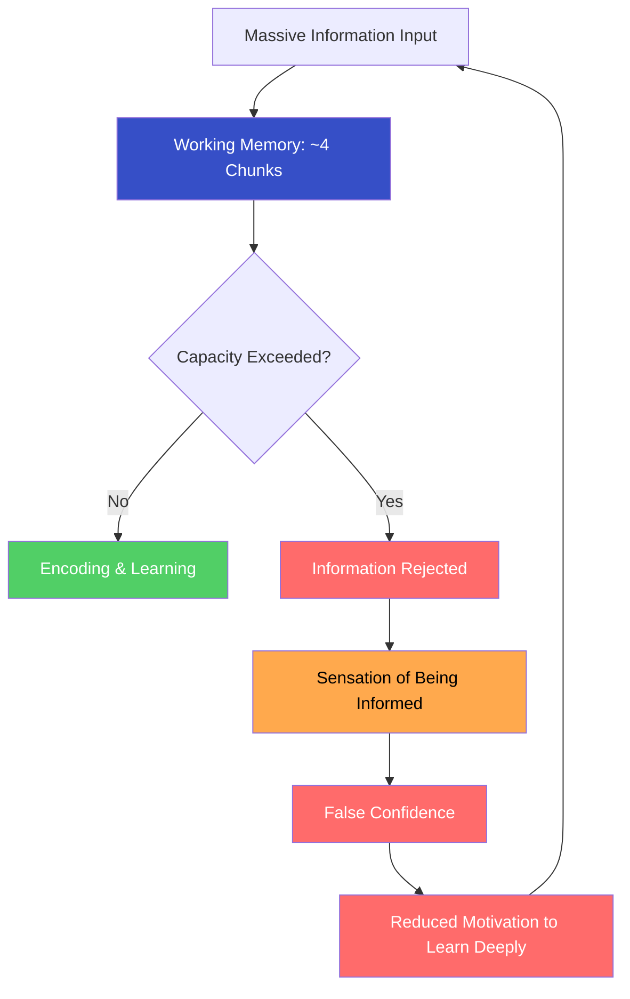
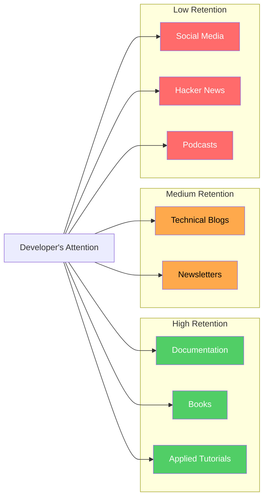
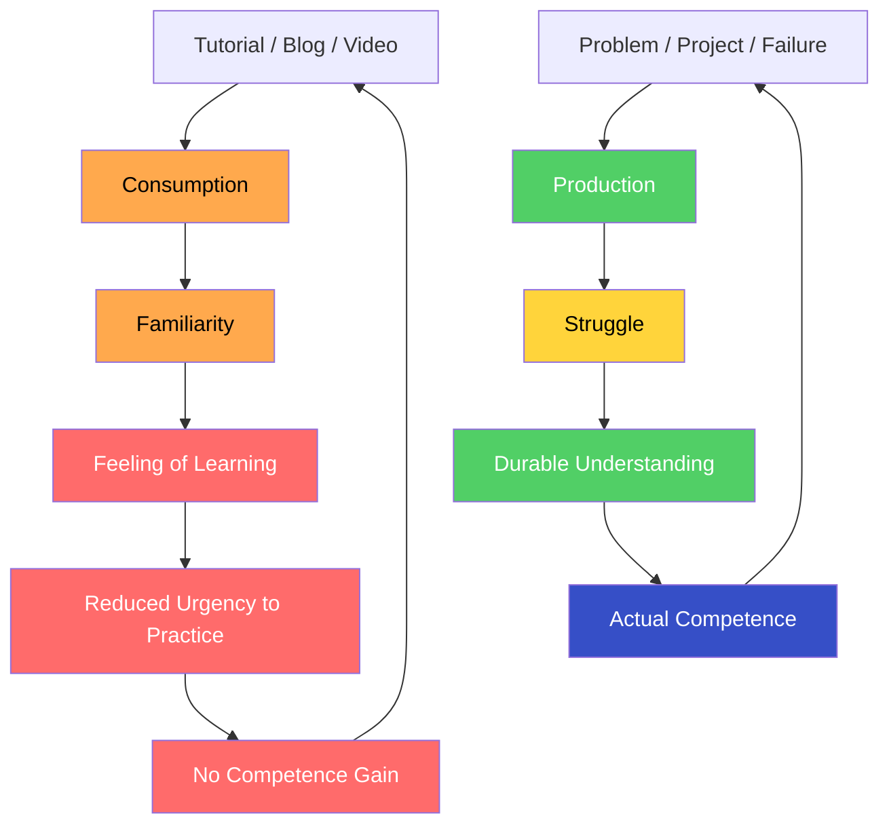
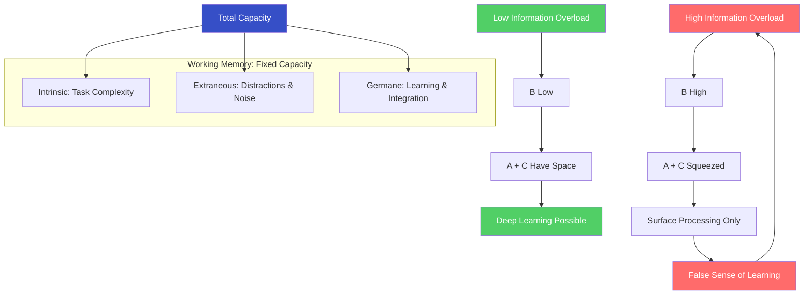
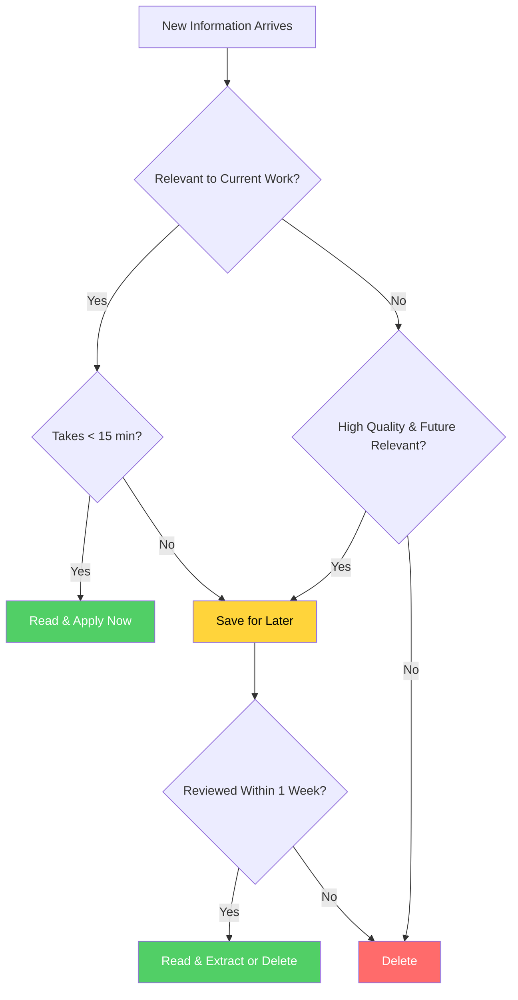
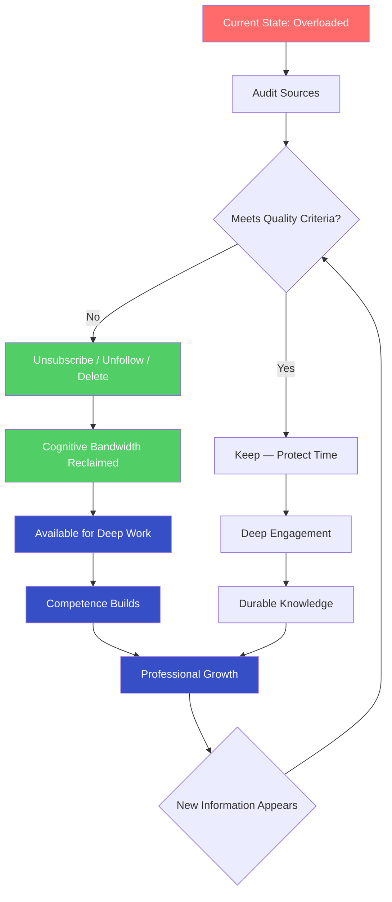

# Information Overload

## Description

Developers are drowning in information — documentation, tutorials, blogs, news, social feeds, Slack channels, GitHub notifications. This constant input overwhelms cognitive capacity and creates the illusion of learning while actually preventing it. This document addresses how to manage information intake strategically.

## Prerequisites

- [Why Digital Wellness Matters](intro/why-digital-wellness-matters.md) — the philosophical and scientific rationale for treating information consumption as a health concern
- [Deep Work vs Shallow Work](deep-work-vs-shallow-work.md) — understanding attention modes and how information overload degrades the capacity for depth
- [Digital Detox](../healthy-living/digital-detox.md) — the neuroscience of screen-induced cognitive degradation and the dopamine mechanisms that make disconnection difficult

## Table of Contents

- [The Information Overload Paradox](#-the-information-overload-paradox)
- [The Developer's Information Diet](#-the-developers-information-diet)
- [The Learning Trap](#-the-learning-trap)
- [Cognitive Load and the Limits of the Mind](#-cognitive-load-and-the-limits-of-the-mind)
- [Auditing Your Information Diet](#-auditing-your-information-diet)
- [Curating Your Inputs](#-curating-your-inputs)
- [The Inbox Zero of Information Consumption](#-the-inbox-zero-of-information-consumption)
- [Deep Reading vs Skimming](#-deep-reading-vs-skimming)
- [The Courage to Unsubscribe](#-the-courage-to-unsubscribe)
- [Information as Stewardship](#-information-as-stewardship)

## Content / Material

### 🌀 The Information Overload Paradox

There is a bitter irony at the center of the developer's professional life: the more information you consume, the less you know. This is not a rhetorical flourish. It is a measurable cognitive phenomenon. The human mind does not process information the way a hard drive processes data — indiscriminate accumulation followed by perfect retrieval. The mind processes information through attention, encoding, consolidation, and retrieval. Each of these stages has a finite capacity. When input exceeds that capacity, the excess is not stored. It is lost. And worse — the act of processing excess input actively interferes with the encoding of the information that matters.

The paradox operates on multiple levels. A developer who reads fifty blog posts about a new framework does not understand the framework better than the developer who reads three. They understand it worse. The cognitive resources required to process fifty posts — the working memory load of holding competing explanations, the confusion of contradictory advice, the fatigue of sustained reading — leave fewer resources available for the actual encoding of understanding. The result is the sensation of having learned something while retaining almost nothing.

This is not a failure of discipline. It is a structural feature of human cognition. The working memory — the cognitive workspace where information is held and manipulated — has a capacity of approximately four chunks, plus or minus one (Cowan, 2001). This capacity has not changed since Miller's (1956) foundational research. But the information environment has expanded by orders of magnitude. You are attempting to pour an ocean through a funnel.

The developer who reads Hacker News every morning, checks Twitter for trending technical discussions, skims three newsletters, opens five documentation tabs, and listens to a programming podcast during lunch believes they are staying current. They are not. They are accumulating impressions — fleeting neural activations that decay within hours without consolidation. The information feels familiar the next day, but familiarity is not knowledge. It is the ghost of knowledge, the residue of exposure without understanding.

The paradox deepens when you consider opportunity cost. Every hour spent consuming information is an hour not spent producing. The developer who reads about testing strategies for two hours has not improved their test coverage. The developer who watches a tutorial on system design has not designed a system. The gap between consumption and production is the gap between knowing about something and knowing how to do it. Professional competence is built in the production column, not the consumption column.

The information age has created a new form of poverty: not the absence of information, but the absence of the capacity to filter, process, and act on it. The developer who recognizes this poverty — who names it honestly and confronts it directly — has taken the first step toward a different relationship with information. One based not on accumulation but on intentionality. Not on breadth but on depth. Not on staying current but on becoming capable.

### 📊 The Developer's Information Diet

Every developer consumes information from a distinct set of sources. These sources vary in quality, relevance, and cognitive cost. Understanding the composition of your information diet is the prerequisite for changing it.

The typical developer's information intake falls into several categories:

| Source | Type | Frequency | Cognitive Cost | Retention Rate |
|--------|------|-----------|----------------|----------------|
| Documentation | Reference | As needed | Low to moderate | High when applied immediately |
| Stack Overflow | Problem-solving | Daily | Low | High for specific solutions, low for transferable knowledge |
| Technical blogs | Awareness | Daily | Moderate | Low to moderate — most is forgotten within days |
| Newsletters | Curation | Daily to weekly | Moderate | Low — skimmed, rarely deeply processed |
| Social media (Twitter, Reddit) | Mixed | Continuous | High | Very low — fragmented, contradictory, emotionally charged |
| Hacker News / Lobste.rs | Community | Daily | Moderate | Low — surface-level engagement with links |
| Video tutorials | Instructional | Weekly | Moderate to high | Moderate when paused and applied, low when passively watched |
| Podcasts | Passive | Daily (commute, exercise) | Low | Very low — auditory input without visual reinforcement decays rapidly |
| Books | Deep learning | Monthly | High | High when actively engaged, low when read without notes |
| Slack / Discord | Communication | Continuous | High | Variable — real-time discussions fragment attention |

The distribution is revealing. The sources that produce the highest retention — documentation applied to a specific problem, books read with active engagement, tutorials followed by building — require the most cognitive effort and are consumed least frequently. The sources that dominate daily consumption — social media, Hacker News, podcasts, newsletters — produce the lowest retention and are consumed continuously.

This is not an accident. The low-retention sources are designed for high engagement, not high learning. They exploit the brain's preference for novelty, social information, and low-effort input. They are the fast food of the information diet: immediately gratifying, calorically dense, nutritionally empty. The high-retention sources — the ones that actually build competence — feel effortful because they are effortful. They require the kind of sustained attention that the low-retention sources have systematically eroded.

The developer who audits their information diet honestly will discover something uncomfortable: the majority of their daily information consumption produces no lasting knowledge. It produces only the sensation of staying current, which is the most insidious form of learning illusion. You feel informed. You are not.

### 🎭 The Learning Trap

The learning trap is the most seductive form of information overload because it masquerades as virtue. The developer who is "always learning" appears dedicated, curious, growth-oriented. But learning — the genuine article, the kind that produces durable competence — is not the same as consuming learning-shaped content.

The distinction is worth examining with precision.

**Consumption without production.** A developer watches a five-hour course on distributed systems. They understand the concepts while watching. The next week, they cannot explain the CAP theorem without looking it up. The information was processed but not encoded. The video provided the illusion of understanding — the narrator's voice was coherent, the diagrams were clear, the progression was logical. But coherence is not comprehension. The viewer was a passenger, not a driver. Understanding requires the active construction of mental models, not the passive reception of someone else's construction.

**Tutorial hell.** A developer follows tutorial after tutorial, building the same todo application in twelve frameworks. Each tutorial works. Each tutorial produces a functioning application. But the developer cannot build anything without a tutorial. They have accumulated procedural knowledge — the ability to follow steps — without conceptual knowledge — the ability to reason about design decisions, evaluate trade-offs, and construct solutions from first principles. Tutorial hell is not a learning failure. It is a learning success measured by the wrong metric. The metric is not "How many tutorials have I completed?" It is "Can I build something without a guide?"

**The consumption-production gap.** Research on skill acquisition consistently demonstrates that the ratio of consumption to production determines learning outcomes. A meta-analysis by Freeman et al. (2014) found that active learning strategies — problem-solving, practice, application — produce significantly higher learning gains than passive strategies — lectures, reading, watching. The effect size is not marginal. Students in traditional lecture-based courses are 1.5 times more likely to fail than students in active learning courses.

For developers, the implication is direct: reading about code does not make you a better programmer. Writing code makes you a better programmer. Reading about architecture does not make you a better architect. Designing systems — and watching them fail, and redesigning them — makes you a better architect. The knowledge that matters is the knowledge earned through effort, failure, and iteration.

The trap operates through a feedback loop that is neurochemically reinforced. Consumption feels productive. The brain registers the novelty of new information as reward — a small dopamine release for each new concept encountered. This reward sustains consumption behavior. Production, by contrast, feels effortful and often frustrating. The brain registers the struggle of debugging, the confusion of a design problem, the discomfort of not knowing. These experiences do not produce immediate reward. They produce growth, but growth is delayed, uncertain, and invisible in the moment.

The developer who breaks free of the learning trap must accept a counterintuitive truth: the less you consume, the more you learn. Not because consumption is harmful — it is necessary in measured doses — but because unconsumed time becomes production time, and production time is where competence is built.

### 🧠 Cognitive Load and the Limits of the Mind

The theoretical foundation for understanding information overload is cognitive load theory, developed by John Sweller (1988). The theory distinguishes three types of cognitive load, each drawing from the same finite pool of working memory resources.

**Intrinsic load** is the inherent complexity of the material itself. Learning a new programming language has intrinsic load. Understanding a distributed system architecture has intrinsic load. The load is determined by the number of interacting elements in the material — more elements, more load.

**Extraneous load** is the unnecessary cognitive burden imposed by the way information is presented or the environment in which it is encountered. Reading documentation while Slack notifications pop up. Trying to learn from a blog post while three browser tabs play competing videos. This load contributes nothing to learning. It only competes with it.

**Germane load** is the cognitive effort directed toward constructing and automating schemas — the mental frameworks that represent understanding. Germane load is learning. It is the work of integrating new information into existing mental models, identifying patterns, and building the architectural understanding that enables transfer and application.

| Load Type | Source | What It Does | How to Manage It |
|-----------|--------|-------------|------------------|
| Intrinsic | Material complexity | Determines how hard the content is to learn | Break complex topics into smaller chunks; sequence learning from simple to complex |
| Extraneous | Environmental interference | Competes with learning for working memory resources | Eliminate distractions; single-task; reduce unnecessary information |
| Germane | Active processing | Builds durable mental models and schemas | Engage in practice, self-explanation, and application |

The total cognitive load — intrinsic + extraneous + germane — cannot exceed working memory capacity. When the sum exceeds capacity, learning fails. The information is processed superficially or not at all. This is why the developer who reads documentation with Slack open retains less than the developer who reads the same documentation in silence. The Slack messages do not merely distract — they consume working memory slots that would otherwise be available for learning.

The information overload problem is, at its root, a cognitive load problem. The volume of available information exceeds the processing capacity of the human mind. The surplus does not merely go unused. It actively degrades the processing of information that matters.

The practical experience of cognitive overload is recognizable to every developer. You re-read the same paragraph three times without absorbing it. You cannot hold the full architecture of the system in your mind. You forget the context of the function you were modifying twenty minutes ago. You feel mentally exhausted despite having produced nothing of substance. The exhaustion is real — cognitive load depletes glucose and elevates cortisol — but the absence of output makes the exhaustion feel unjustified, which compounds into guilt.

The solution is not more willpower, better note-taking systems, or more efficient reading techniques. The solution is reducing total input to a level that working memory can actually process. This requires saying no to information that exceeds your capacity — which is most of it.

### 🔍 Auditing Your Information Diet

An information diet audit is the systematic assessment of what you consume, why you consume it, and what it produces. The audit is not a thought experiment. It is a measurement exercise. You cannot change what you have not observed.

**Step 1: Track for one week.** For seven days, log every information source you interact with. Include everything — the podcast during your commute, the newsletter over breakfast, the Hacker News tab you keep open, the YouTube tutorial you watched at lunch, the Twitter thread you read before bed. Record the source, the duration, and whether the consumption was intentional (you chose to consume it) or accidental (it appeared in your feed and you engaged).

**Step 2: Classify by return.** After the week, classify each source into one of four categories:

| Category | Definition | Action |
|----------|-----------|--------|
| **High return** | Directly applied to a current project or problem; produced lasting understanding or actionable knowledge | Keep; protect time for it |
| **Moderate return** | Broadly relevant to your career; produced awareness but not immediate application | Schedule; batch consumption |
| **Low return** | Felt relevant at the time but produced no lasting knowledge or behavioral change | Reduce; set strict time limits |
| **Zero return** | Consumed out of habit, boredom, or anxiety; produced only the sensation of staying current | Eliminate; unsubscribe |

**Step 3: Calculate the ratio.** What percentage of your total information consumption falls into each category? The typical developer discovers that 60–80% falls into the low or zero return categories. The audit reveals the gap between perceived and actual information value.

**Step 4: Design the new diet.** Based on the audit, establish explicit limits:

- Maximum daily time for high-return sources: protect this time fiercely
- Maximum daily time for moderate-return sources: batch into a fixed window
- Weekly time for low-return sources: restrict to a specific, bounded period
- Zero-return sources: eliminate immediately

The audit produces discomfort because it forces confrontation with the reality that much of what you consume is noise. The newsletter you have read for two years has never changed your behavior. The Twitter list you check every hour has never taught you something you applied. The podcast you listen to daily is entertainment, not education — and there is nothing wrong with entertainment, but it should be labeled honestly.

The information diet audit is not a one-time exercise. Repeat it quarterly. The information environment changes. New sources emerge. Old sources decay. Your own needs evolve. The quarterly audit keeps the diet aligned with your actual goals rather than your habitual consumption.

### 📬 Curating Your Inputs

Curation is the deliberate selection and organization of information sources to maximize value and minimize noise. The curation principle is simple: every input must earn its place in your information diet by demonstrating ongoing relevance and quality.

**Newsletters.** Newsletters are one of the highest-value information sources because they are curated by a single author with a defined perspective. The key is ruthless selection. Subscribe to no more than five newsletters. Each must meet three criteria: (1) the author has demonstrated expertise you lack, (2) the content directly informs your current work or growth area, (3) each issue produces at least one actionable insight. If a newsletter fails these criteria for three consecutive issues, unsubscribe. The unread inbox of a newsletter you feel guilty about ignoring is a cognitive load with zero return.

**RSS.** RSS is the anti-algorithm. It delivers what you subscribed to, in the order it was published, without manipulation. Use an RSS reader (Miniflux, NetNewsWire, FreshRSS) to aggregate blogs, documentation changelogs, and technical publications. The discipline is the same as newsletters: subscribe to sources that meet the quality criteria, and remove any source that consistently fails to produce value. RSS converts the chaotic firehose of the internet into a manageable, self-curated stream.

**Social media.** Twitter, Reddit, and Hacker News are the most dangerous information sources because they are the most engaging. The algorithmic curation maximizes engagement, not learning. The developer who follows 200 people on Twitter receives a stream optimized for emotional reaction, not intellectual growth. The curation strategy for social media is reductive:

1. Unfollow everyone except those who consistently produce content you have applied.
2. Use lists or feeds filtered by topic, not algorithmically ranked.
3. Set a hard daily time limit (20–30 minutes maximum).
4. Never open social media as the first or last activity of the day.

**Documentation.** Documentation is the highest-return information source for developers because it is the primary source of truth for the tools you use. The curation principle is proximity: keep documentation for your current stack close, and everything else at a distance. Use browser bookmarks or a documentation aggregation tool (Dash, DevDocs) to keep reference material accessible without requiring a search engine. The five minutes spent searching for documentation that should be bookmarked is cognitive load that compounds across thousands of retrievals.

| Source | Curation Principle | Action |
|--------|-------------------|--------|
| Newsletters | Quality threshold: expert author + direct relevance + actionable output | Subscribe to ≤ 5; review quarterly; unsubscribe aggressively |
| RSS | Anti-algorithm: you choose what enters your feed | Subscribe to 10–20 high-quality sources; remove low-value feeds |
| Social media | Reductive: follow less, not more | Unfollow ruthlessly; use lists; time-box to 20–30 minutes daily |
| Documentation | Proximity: keep current stack close | Bookmark; use aggregators; maintain offline copies for critical references |
| Podcasts | Applied: only listen to episodes directly relevant to current work | Queue specific episodes; do not autoplay; take notes for retention |
| Books | Intentional: one book at a time, read with purpose | Read one book fully before starting another; take notes; apply immediately |

The goal of curation is not to consume less for its own sake. It is to ensure that every piece of information you consume has a clear path to application. Information without application is noise. Curation is the filter that separates signal from noise.

### 📥 The Inbox Zero of Information Consumption

The inbox zero principle — developed by Merlin Mann for email management — applies directly to information consumption. The principle is simple: every item that enters your information system must be processed to completion. It must be acted on, archived, or deleted. Nothing remains in the inbox unresolved.

Applied to information consumption, the principle becomes a processing protocol for every source of incoming information:

**The triage system.** When you encounter new information — a newsletter, a blog post, a social media thread, a documentation page — apply one of four actions immediately:

1. **Read and apply now.** If the information is directly relevant to a current task and takes less than 15 minutes to process, read it fully and apply it. This is the highest-return path.
2. **Save for later.** If the information is relevant but not immediately applicable, save it to a dedicated reading system (a read-later service like Pocket or Instapaper, or a physical notebook). The key constraint: the saved item must be reviewed within one week. If it is not reviewed within one week, it is deleted. Saved items that are never read are cognitive load masquerading as intention.
3. **Summarize and extract.** If the information contains a specific insight or technique relevant to your work, extract it into a personal knowledge management system — a note, a snippet file, a reference document. The extraction is the act that converts information into knowledge. Without it, the information remains external, unprocessed, and likely forgotten.
4. **Delete.** If the information does not meet the quality criteria or is not relevant to your current work, delete it without reading. This is the hardest action because it requires accepting that you will not read everything. You will not. The information will exist without you. Deleting it is not ignorance. It is wisdom.

The discipline of inbox zero applied to information prevents the accumulation of unread bookmarks, unprocessed newsletters, and "I'll read this later" tabs that multiply across weeks and months. The accumulation is itself a form of cognitive load — the mere awareness of unresolved items depletes attention. Zeigarnik (1927) demonstrated that incomplete tasks occupy working memory more persistently than completed tasks. The 47 unread articles in your reading list are not waiting patiently. They are actively consuming cognitive resources.

The processing protocol takes time. Reading, extracting, and deleting each consume minutes. But the minutes are an investment that pays compound returns: a clear mind, a manageable information load, and the confidence that nothing important has been missed. The developer who processes their information inputs daily spends twenty minutes on triage and gains hours of cognitive freedom.

### 📖 Deep Reading vs Skimming

The way you read determines what you retain. This is not a matter of effort or intention. It is a matter of cognitive processing depth. Shallow processing — skimming, scanning, reading for gist — produces shallow encoding. Deep processing — reading for understanding, questioning, connecting, applying — produces deep encoding. The depth of processing determines the durability of the memory.

Craik and Lockhart (1972) established the levels of processing framework: information processed at a deeper level (semantic processing — meaning-focused) is retained longer and retrieved more reliably than information processed at a shallow level (structural or phonemic processing — surface-focused). For developers, this means that the way you read documentation, blog posts, and books directly determines whether the knowledge is available when you need it.

**The skimming problem.** Developers skim constantly. The volume of information demands it. You scan a blog post for the key point. You skim documentation for the relevant function. You scroll through a newsletter for the headline. Skimming is a necessary survival strategy for the information environment, but it is a terrible learning strategy. The information processed through skimming is encoded shallowly — you will recognize it if you encounter it again, but you will not be able to produce it, apply it, or reason about it.

The practical consequence is that skimmers accumulate a large body of recognized information and a small body of usable knowledge. They have seen the concept before. They cannot use it without re-reading the source. The source becomes a crutch rather than a foundation.

**The deep reading alternative.** Deep reading is not reading every word of every source. It is the deliberate allocation of reading effort based on the value of the source and the depth of understanding required:

| Reading Mode | When to Use | Technique | Retention |
|-------------|-------------|-----------|-----------|
| **Deep reading** | Core references, architectural documents, foundational books | Read fully; take notes; pause to think; connect to existing knowledge | High — durable, applicable knowledge |
| **Active reading** | Relevant blog posts, quality tutorials | Read with a specific question in mind; extract actionable insights; annotate | Moderate — useful knowledge with clear application |
| **Scanning** | Newsletters, social media, news | Identify key points; follow links only if directly relevant | Low — awareness only, not knowledge |
| **Ignoring** | Everything else | Do not engage | Zero — but zero cognitive load |

The discipline is in the allocation. You do not deep-read everything. You deep-read the sources that matter most — the ones that will inform your work for months or years. You actively read the sources that inform your current work. You scan the sources that provide awareness. And you ignore everything else.

The investment in deep reading produces compounding returns. The developer who deeply reads three authoritative books on system design possesses a more durable and applicable understanding than the developer who skims thirty blog posts on the same topic. The books were processed deeply, connected to existing knowledge, and encoded for long-term retrieval. The blog posts were processed shallowly, recognized but not retained, and forgotten within weeks.

A practical protocol for deep reading:

1. **Read with a purpose.** Before opening a source, define the question you want to answer. "What are the trade-offs between consistency and availability in distributed systems?" is a purpose. "Learn about distributed systems" is not.
2. **Take notes in your own words.** Do not highlight or copy. Paraphrase. The act of translating the author's words into your own language forces deep processing. The note is the product of understanding, not a record of reading.
3. **Pause and think.** After each section, close the source and reflect. What did this section mean? How does it connect to what you already know? Where does it disagree with your current mental model? The pause is where encoding happens.
4. **Apply immediately.** After reading, apply the knowledge to a concrete problem. Write a small project. Explain the concept to a colleague. Write a technical blog post. Application is the final stage of deep processing.

### ✂️ The Courage to Unsubscribe

The most difficult action in information management is not curating new sources. It is removing existing ones. Unsubscribing, unfollowing, and deleting feel like loss. They are not loss. They are liberation.

The difficulty is rooted in several cognitive biases:

**Loss aversion.** Kahneman and Tversky (1979) demonstrated that losses are perceived as approximately twice as painful as equivalent gains are perceived as pleasurable. Unsubscribing from a newsletter feels like losing information, even when the information was never being used. The pain of the perceived loss outweighs the negligible benefit of the information.

**The sunk cost fallacy.** You have been reading this newsletter for two years. You have invested time in it. Unsubscribing feels like wasting that investment. But the investment is already made. The time is already spent. The question is not "Was the past consumption valuable?" It is "Is continued consumption valuable?" If the answer is no, the past investment is irrelevant.

**Status quo bias.** The default state is subscribed. Unsubscribing requires action. Inaction is the path of least resistance. The newsletter continues arriving, the social media feed continues scrolling, the podcast continues autoplaying — not because you chose them, but because you did not choose to stop them.

**Anticipated regret.** "What if I miss something important?" This is the most common rationalization for maintaining an information diet that produces no value. The answer is: you have already missed most of what is important. The 99.9% of information you have never consumed has not harmed your career. The 0.1% you did consume that was genuinely important was almost certainly available through multiple channels. The fear of missing out is a prediction that has never been validated by your actual experience.

The act of unsubscribing is an assertion of value. It declares that your attention is finite, that your time is limited, and that the information entering your life must justify its presence. The developer who unsubscribes from thirty newsletters, unfollows two hundred social media accounts, and deletes five apps from their phone has not lost anything. They have reclaimed approximately two to three hours per day of cognitive bandwidth — bandwidth that was previously occupied by low-return information and is now available for the work that matters.

The courage required is not dramatic. It is the quiet courage of accepting that you are finite — that you cannot read everything, know everything, or stay current with everything. This acceptance is not resignation. It is maturity. The developer who admits the limits of their cognitive capacity and acts on those limits is stronger than the developer who pretends those limits do not exist and pays the price in fragmented attention and shallow knowledge.

The developer who unsubscribes is not choosing ignorance. They are choosing depth. They are choosing to know fewer things well rather than many things poorly. In a profession that rewards depth of understanding over breadth of exposure, this choice is not merely acceptable. It is strategic.

### ✝️ Information as Stewardship

The theological tradition speaks of the mind as a capacity entrusted, not merely possessed. The intellect is not a tool that you happen to own. It is a faculty that exists for a purpose — the apprehension of truth, the pursuit of understanding, the engagement with the structure of creation. To waste this faculty on the trivial, the transient, and the manipulative is not merely inefficient. It is a form of misallocation — the squandering of a gift on what does not merit it.

Information overload, viewed through this lens, is not merely a productivity problem. It is a spiritual condition. The mind that is perpetually scattered across fifty inputs, none of them deeply processed, is a mind that has lost its capacity for the contemplative attention that understanding requires. The developer who cannot read a single documentation page without checking Twitter has not merely lost focus. They have lost the capacity for the kind of sustained attention that truth demands.

The discipline of information management is, in this light, an act of stewardship. You are not merely optimizing your knowledge base for professional performance. You are honoring the structure of a mind that was made for depth, for focus, for the sustained encounter with complexity. The decision to unsubscribe from noise is not merely a productivity hack. It is an assertion that your cognitive life has a purpose, and that purpose is not served by the indiscriminate accumulation of data.

The ancient monastic tradition of lectio divina — slow, contemplative reading of a single text — embodies the principle that depth of engagement matters more than breadth of consumption. The monk who reads one passage for an hour and lets it reshape their understanding is doing something qualitatively different from the developer who skims fifty articles in an hour and retains none of them. The monk's reading is an act of attention offered. The developer's skimming is an act of attention scattered. The first produces transformation. The second produces fatigue.

The developer who practices information stewardship does not merely manage information. They consecrate their attention. They declare that the hours of their day — the finite, non-renewable hours — will be allocated to what is worthy. The courage to unsubscribe is, at its deepest level, the courage to say that some things are not worthy of your mind. This is not arrogance. It is fidelity — to the work, to the calling, to the mind that was given to you for purposes higher than the consumption of noise.

## Learning Tips

- **Start with the audit, not the diet.** Before changing any consumption behavior, measure what you currently consume for one full week. The data is the intervention — most developers are stunned by the discrepancy between their perceived and actual consumption.
- **Apply the one-in-one-out rule.** Every new source you add to your information diet must displace an existing one. This constraint prevents the gradual, unconscious accumulation that produces overload.
- **Read less, process more.** The measure of a successful reading session is not how much you read. It is how much you extracted, connected, and applied. One blog post fully processed produces more learning than ten blog posts skimmed.
- **Set consumption windows.** Do not consume information continuously throughout the day. Batch your information consumption into fixed windows — morning for newsletters, lunch for Hacker News, evening for books. Outside these windows, do not consume.
- **Build a second brain.** Use a note-taking system (Obsidian, Logseq, a plain-text directory) to capture extracted insights. The system is the external memory that compensates for working memory's limits. The act of extracting is the act that converts information into knowledge.
- **Practice information fasting.** One day per week, consume no information outside of what is directly required for your current task. No newsletters, no social media, no blogs, no podcasts. The fast demonstrates how much of your information consumption is habitual rather than necessary.
- **Measure output, not input.** Track what you produce — code shipped, articles written, problems solved — rather than what you consume. When output is the metric, input naturally optimizes itself.

## Glossary

| Term | Definition |
|------|------------|
| **Chunking** | The cognitive process of grouping individual pieces of information into larger, meaningful units to increase working memory capacity |
| **Cognitive load** | The total amount of mental effort required for a task, comprising intrinsic load (task complexity), extraneous load (environmental overhead), and germane load (learning effort) |
| **Deep processing** | Encoding information through semantic engagement — meaning, connection, and application — producing durable, retrievable knowledge |
| **Germane cognitive load** | The cognitive effort directed toward constructing and automating mental schemas; the component of cognitive load that produces learning |
| **Intrinsic cognitive load** | The inherent complexity of the material itself, determined by the number of interacting elements that must be processed simultaneously |
| **Lectio divina** | A monastic practice of slow, contemplative reading aimed at deep internalization of a text; a model for deep engagement with information |
| **Levels of processing** | Craik and Lockhart's (1972) framework demonstrating that deeper (semantic) processing produces more durable memory traces than shallow (structural) processing |
| **Shallow processing** | Encoding information through surface features — recognition, gist, visual form — producing fragile, quickly decaying knowledge |
| **Working memory** | The cognitive system responsible for temporarily holding and manipulating information; limited to approximately four chunks of information simultaneously |
| **Zeigarnik effect** | The tendency for incomplete tasks to occupy working memory more persistently than completed tasks; explains the cognitive cost of unread articles and unresolved inputs |

## Quick References

- Sweller, J. (1988). Cognitive load during problem solving: Effects on learning. *Cognitive Science*, 12(2), 257–285. — the foundational paper on cognitive load theory
- Cowan, N. (2001). The magical number 4 in short-term memory: A reconsideration of mental storage capacity. *Behavioral and Brain Sciences*, 24(1), 87–114. — updated working memory capacity estimates
- Craik, F. I., & Lockhart, R. S. (1972). Levels of processing: A framework for memory research. *Journal of Verbal Learning and Verbal Behavior*, 11(6), 671–684. — the levels of processing framework
- Miller, G. A. (1956). The magical number seven, plus or minus two: Some limits on our capacity for processing information. *Psychological Review*, 63(2), 81–97. — the classic paper on working memory capacity
- Newport, C. (2016). *Deep Work: Rules for Focused Success in a Distracted World*. Grand Central Publishing. — the case for deep, focused work in a distracted economy
- Newport, C. (2019). *Digital Minimalism: Choosing a Focused Life in a Noisy Network*. Portfolio. — a philosophy of intentional technology use
- Tiago Forte. *Building a Second Brain*. Atria Books. — a practical system for externalizing and organizing knowledge
- [Center for Humane Technology](https://www.humanetech.com/) — advocacy for technology that respects human attention and well-being
- [Farnam Street Blog](https://fs.blog/) — resources on mental models, decision-making, and deep learning

## Next Steps

The information diet, once established, creates the cognitive space for deeper work.

- [Deep Work vs Shallow Work](deep-work-vs-shallow-work.md) — applying the reclaimed cognitive capacity to structured periods of focused production
- [Screen Time Management](screen-time-management.md) — extending information discipline to the broader pattern of screen engagement
- [Rebuilding Routines](../habits/rebuilding-routines.md) — integrating information discipline into daily systems that compound over time
- [Environment Design](../habits/environment-design.md) — shaping your physical and digital surroundings to support intentional information consumption
- [Mental Models for Change](../fundamentals/mental-models-for-change.md) — frameworks for understanding how the shift from consumption to production drives lasting transformation
