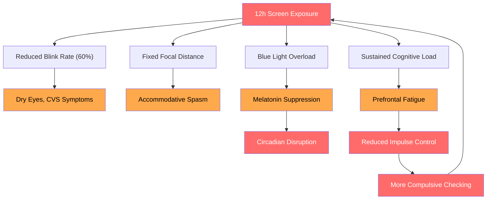
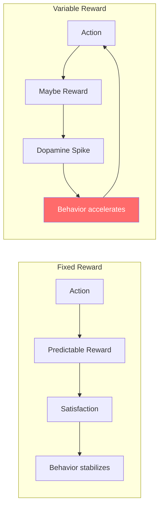
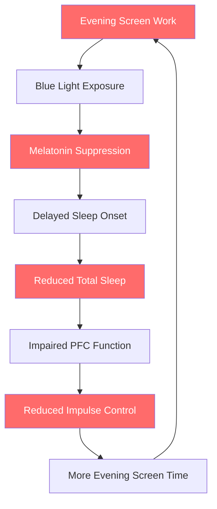
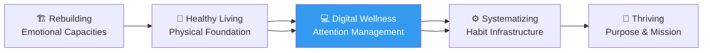
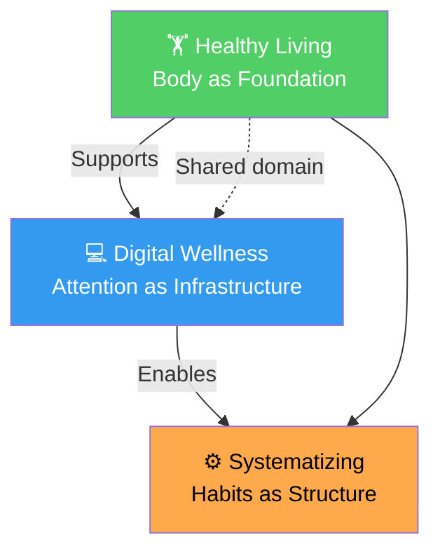

# Why Digital Wellness Matters

## Description

You spend ten to fourteen hours per day staring at screens. You code on one, communicate on another, unwind on a third, and sometimes wake up to check a fourth before your feet touch the floor. This is not a habit problem. It is an environmental condition — the water you swim in, the air you breathe. Digital wellness is the discipline of understanding how that environment shapes your attention, cognition, emotions, and nervous system, and learning to inhabit it deliberately rather than reactively. This document establishes why digital wellness is a foundational concern for personal transformation, distinct from — and prerequisite to — physical health.

## Prerequisites

- [Why Physical Health Is the Foundation of Transformation](../../healthy-living/intro/why-health-matters.md) — the body as substrate for all cognitive and emotional work; digital wellness extends that framework into the domain of attention and environment

## Table of Contents

- [The Developer's Screen Problem](#-the-developers-screen-problem)
- [How Digital Immersion Differs from Other Occupational Hazards](#-how-digital-immersion-differs-from-other-occupational-hazards)
- [The Attention Economy](#-the-attention-economy)
- [Circadian Disruption and Screen Fatigue](#-circadian-disruption-and-screen-fatigue)
- [Digital Wellness and the Broader Level-Up Journey](#-digital-wellness-and-the-broader-level-up-journey)
- [Why This Is a Separate Module from Healthy Living](#-why-this-is-a-separate-module-from-healthy-living)
- [The Diagnosis Question](#-the-diagnosis-question)
- [Learning Tips](#-learning-tips)
- [Glossary](#glossary)
- [Quick References](#quick-references)
- [Next Steps](#next-steps)

## 🖥️ The Developer's Screen Problem

According to a 2023 report by Electronics Hub, the average knowledge worker spends approximately 6 hours and 58 minutes per day on screens for work alone. Developers exceed this average significantly. A typical software engineer sits in front of a primary display for six to ten hours of coding, code review, and documentation. They add another two to four hours on a secondary device — Slack, email, project management tools, video calls. Then comes the personal screen time: social media, news, streaming, messaging, reading, gaming. Add another two to four hours. The total: ten to fourteen hours of screen exposure per day, every day, with few breaks exceeding thirty seconds of looking at something more than twenty feet away.

This is not a character flaw. It is the structural condition of modern software development.

### 📊 The Composition of Developer Screen Time

| Category | Hours per Day | Primary Devices |
|---|---|---|
| Core development (IDE, terminal, docs) | 4–7 | Monitor(s), laptop |
| Workplace communication (Slack, email, Jira) | 1.5–3 | Laptop, phone |
| Meetings and video calls | 1–2.5 | Monitor, laptop |
| Technical reading and research | 0.5–1.5 | Monitor, tablet |
| Social media and news | 0.5–2 | Phone |
| Entertainment and streaming | 1–3 | TV, phone, tablet |
| Incidental (maps, banking, browsing) | 0.5–1 | Phone |

The numbers are high for everyone, but the composition matters as much as the total. A developer's screen time is not passive consumption — it is active, goal-directed, high-cognitive-load work. You are not scrolling Instagram for eight hours. You are debugging a race condition in a distributed system while Slack notifications fire in the corner and a CI pipeline fails in another tab. The cognitive load multiplies the cost of each screen hour.

### 🔄 The Types of Digital Exposure

Not all screen time is equal. The type of digital exposure determines its impact on the nervous system and cognition.

**Productive screen time.** Writing code, reading documentation, designing architecture, reviewing pull requests. This is goal-directed work that engages deliberate attention. It can be deeply satisfying and flow-inducing. But it is also metabolically expensive. Sustained focus depletes glucose, taxes the prefrontal cortex, and accumulates adenosine — the neurotransmitter that signals sleep pressure. After four to six hours of deep productive screen time, the brain's capacity for further deliberate attention drops measurably. The marginal productivity of the seventh hour of coding is often negative, yet developers continue because deadlines demand it.

**Reactive screen time.** Responding to notifications, switching between Slack channels, triaging emails, attending to alerts and incidents. This is not deep work. It is attentional fragmentation. Each notification triggers a dopamine-mediated orienting response that pulls focus from the current task and requires executive function to reorient. The average developer loses approximately twenty-three minutes per interruption to task-switching cost, according to a 2019 study by RescueTime. Reactive screen time is particularly damaging because it trains the brain to expect frequent interruptions, reducing the capacity for sustained attention even when no interruptions occur.

**Passive screen time.** Scrolling social media, watching videos, reading articles, browsing feeds. This is the domain of the attention economy — content optimized not for value but for engagement duration. Passive screen time often masquerades as rest, but it is not restorative. It activates the same attentional systems as work, just at a lower intensity. The brain does not recover during passive scrolling. It continues processing visual stimuli, making micro-decisions, and releasing dopamine in response to variable rewards. After eight hours of work and two hours of passive scrolling, the nervous system has not rested at all.

**Transitional screen time.** The moments between activities where you reflexively reach for the phone. Waiting for the build to compile. Standing in line. Sitting in a meeting you are only half-listening to. These micro-moments of potential rest are colonized by screens, preventing the brain from entering its default mode network — the state associated with creative insight, self-reflection, and mental consolidation. A developer who fills every gap with a screen never gives their brain the space it needs to integrate, synthesize, and create.

### 📈 The Cumulative Toll

The developer who spends twelve hours per day on screens is operating under conditions that are historically unprecedented. The human visual system evolved for scanning horizons, tracking movement, and discriminating between edible and inedible plants at varying distances — not for staring at a uniformly illuminated rectangle at a fixed distance for ten thousand hours per year.



The body does not adapt to chronic screen exposure. It degrades. The eyes lose accommodative flexibility — the ability to refocus at different distances. The circadian system shifts later, producing a chronic mismatch between biological sleep time and social obligations. The attentional system fragments, making sustained focus feel increasingly effortful. The developer experiencing these effects does not attribute them to screens. They attribute them to aging, burnout, or personal weakness. The cause is structural, but the experience is personal.

## 🏭 How Digital Immersion Differs from Other Occupational Hazards

A construction worker knows they are in a dangerous environment. The hazard is visible — falling objects, heavy machinery, toxic materials. The safety protocols are explicit: hard hat, harness, ventilation, decontamination. A developer's hazard is invisible. The screen does not feel dangerous. It feels like work, like connection, like entertainment. The hazard is the environment itself, not any single element within it.

### 🔍 Three Structural Differences

**The hazard is the tool.** In most hazardous professions, the tool and the hazard are distinguishable. A welder's torch is dangerous, but the welder knows it and protects accordingly. A developer's primary tool — the screen — is the hazard. You cannot stop using screens and remain a developer. The adaptation must happen within the exposure, not by avoiding it. This is the central paradox of digital wellness for developers: you must learn to inhabit a hazardous environment safely without leaving it.

**The hazard is invisible and slow.** Digital immersion does not cause immediate injury. It causes gradual degradation — of vision, of attention, of sleep quality, of emotional regulation. The effects accumulate over months and years, and by the time they become undeniable, significant damage has been done. A developer does not wake up one day unable to focus. They wake up one day and realize they have not been able to focus for three years. The invisibility of the damage is itself a mechanism of the damage — it prevents timely intervention.

**The hazard is addictive.** Digital environments are explicitly designed to maximize engagement through variable reward schedules. Social media platforms, messaging apps, news feeds, and even many developer tools use the same behavioral design principles as slot machines. The hazard exploits the brain's dopamine system, creating a compulsion loop that makes the harmful behavior self-reinforcing. A developer knows they should stop checking their phone. They check it anyway. The knowing and the doing are disconnected because the neural circuitry driving the behavior operates below conscious awareness.

### 📋 Comparison Table

| Dimension | Physical Hazard (Construction) | Digital Hazard (Development) |
|---|---|---|
| Visibility | Visible (height, machinery, chemicals) | Invisible (light, attention, dopamine) |
| Onset | Acute (immediate injury possible) | Chronic (months to years) |
| Relationship to work | Avoidable with PPE and protocols | Inherent to the tool itself |
| Adaptation | Protect the body from external danger | Manage internal attentional economy |
| Social signal | Safety compliance is respected | Screen reduction may be seen as disengagement |
| Recovery | Rest from exposure restores function | Exposure is constant; full recovery requires structural change |
| Addiction potential | Low | High (behavioral design exploits dopamine) |

The comparison makes clear that digital wellness requires a fundamentally different approach than occupational safety. The frameworks from physical wellness — avoid the hazard, protect the body, take breaks — are necessary but insufficient. Digital wellness requires managing attention as a finite resource, designing environments that reduce compulsive behavior, and developing the metacognitive capacity to observe and interrupt one's own digital habits.

## 💰 The Attention Economy

Your attention is being harvested. This is not a metaphor or a rhetorical exaggeration. It is the literal business model of the largest technology companies on earth. Revenue is a function of attention — the more time users spend on a platform, the more ads they see, the more data is collected, the more valuable the platform becomes to advertisers. The product is not the app. The product is the user's attention, repackaged and sold.

### 🎰 The Variable Reward Mechanism

The psychological engine of the attention economy is the variable reward schedule — the same mechanism that makes slot machines addictive. When a behavior produces an unpredictable reward, dopamine release is higher than when the reward is predictable. This is why refreshing email, checking notifications, and scrolling feeds are compulsive behaviors. The reward is intermittent: sometimes there is a like, sometimes a reply, sometimes an interesting post, often nothing. The unpredictability drives repeated checking.

B. F. Skinner demonstrated this in the 1950s with his famous pigeon experiments. Pigeons that received food pellets on a variable ratio schedule pecked at a rate exponentially higher than pigeons on a fixed schedule. The behavior became resistant to extinction — pigeons continued pecking long after the food stopped, because the unpredictability had wired the behavior into their neural circuitry. The same mechanism operates in every developer who checks their phone during a build, refreshes their pull request status, or opens Slack to see if there are messages.



The variable reward mechanism is not an accident. It is engineered into every major platform. The pull-to-refresh animation on Twitter and Instagram, the red badge on Slack, the infinite scroll on LinkedIn and YouTube — these are not neutral design decisions. They are exploiting a known neurological vulnerability to maximize engagement time.

### 📉 The Cognitive Cost of Fragmented Attention

The attention economy does not merely consume time. It degrades the capacity for attention itself. Each interruption — each notification, each glance at the phone — trains the brain to expect distraction. The neural pathways that support sustained attention weaken from disuse. The neural pathways that support rapid task-switching strengthen from overuse.

This has a measurable effect on software development. A 2020 study by Microsoft Research found that it takes an average of twenty-three minutes and fifteen seconds to return to the original task after an interruption. Not to return to the same screen — to return to the same level of cognitive engagement. Each interruption resets the context-building process that enables deep work. A developer who is interrupted eight times per day loses approximately three hours of productive cognitive engagement. This is not a productivity problem. It is a cognition problem. The brain's capacity for deliberate, focused thought is being systematically eroded by the very tools that enable the work.

### 🔓 The Trap of Choice Architecture

The attention economy also operates through choice architecture — the design of environments that nudge users toward specific behaviors. Default settings, placement of options, visual salience, and sequencing all influence behavior without requiring conscious deliberation. Every platform is designed to maximize your time on it. The default is infinite scroll, not a stopping point. The default is notifications on, not off. The default is autoplay, not manual selection. These defaults are not neutral. They are the rails that guide user behavior toward maximum engagement.

A developer who has never audited their notification settings, their default apps, or their screen time habits is not making a free choice. They are following the path of least resistance — a path designed by someone else for someone else's benefit. Digital wellness begins with reclaiming the architect's role in your own environment.

## 🌙 Circadian Disruption and Screen Fatigue

The most well-documented biological effect of chronic screen exposure is circadian disruption. The mechanism is straightforward and well-established in the research literature. The retina contains intrinsically photosensitive retinal ganglion cells (ipRGCs) that express the photopigment melanopsin. These cells are maximally sensitive to wavelengths in the blue range (approximately 460–480 nanometers). When exposed to blue light, they signal the suprachiasmatic nucleus (SCN) — the brain's master circadian clock — that it is daytime. The SCN responds by suppressing melatonin production, the hormone that orchestrates sleep onset.

### 🔬 The Research Foundation

| Study | Finding |
|---|---|
| Chang et al. (2015), *PNAS* | Participants reading from an iPad before bed showed 55% reduction in melatonin, delayed sleep onset by 30 minutes, and reduced REM sleep compared to printed-book readers. |
| Cajochen et al. (2011), *Journal of Clinical Endocrinology & Metabolism* | Evening exposure to white light with blue-enriched spectrum suppressed melatonin by 54% and increased alertness in the hour before bed. |
| Chinoy et al. (2018), *Sleep* | Reading on a phone screen before bed reduced subjective sleepiness, extended sleep latency, and impaired next-morning cognitive performance. |
| Figueiro et al. (2011), *Journal of Clinical Sleep Medicine* | Exposure to 40 lux of blue light at the cornea for 2 hours suppressed melatonin by 30%; 100 lux suppressed it by 50%. |
| Wood et al. (2013), *Ophthalmic and Physiological Optics* | Blue-blocking glasses in the evening improved subjective sleep quality and reduced alertness in the hours before bed. |

The implications for developers are stark. The standard developer evening routine — coding or scrolling on a backlit display until one or two in the morning — directly suppresses the neurochemical signal that should initiate sleep. The developer does not feel sleepy because the biological cue for sleepiness is chemically inhibited by the screen. They stay up later, which reduces sleep duration, which impairs next-day cognitive function, which makes the next day's work more frustrating, which increases the likelihood of more evening screen time as a coping mechanism.

### 🔄 The Developer Sleep Disruption Cycle



This cycle is self-reinforcing. The more a developer works on screens in the evening, the worse their sleep becomes. The worse their sleep, the less impulse control they have the next day. The less impulse control, the more likely they are to reach for the phone at night. The loop tightens over months and years, producing a chronic sleep debt that the developer does not recognize because they have normalized the degraded state.

### 👁️ Computer Vision Syndrome

Beyond circadian disruption, the prolonged screen exposure causes Computer Vision Syndrome (CVS) — also known as digital eye strain. The American Optometric Association reports that 50–90% of computer workers experience CVS symptoms. These include:

- **Dry eyes.** The blink rate drops from approximately 15–20 blinks per minute at rest to 5–7 blinks per minute during screen work. Each blink spreads a protective tear film across the cornea. Reduced blinking leads to tear film instability, corneal desiccation, and the sensation of dry, gritty, or burning eyes.
- **Accommodative spasm.** The ciliary muscles that control the lens of the eye are held in a fixed contraction during prolonged near-focus. Over time, this reduces the eyes' ability to refocus at different distances — a condition called accommodative insufficiency. Developers who have worn glasses since childhood may experience worsening symptoms as their accommodative range narrows.
- **Headaches and eye strain.** The sustained effort of maintaining focus and convergence on a fixed plane creates tension in the extraocular muscles and the muscles of the forehead, temples, and neck. Tension headaches, especially in the frontal and temporal regions, are a frequent complaint among developers.

CVS is not permanent. The symptoms are reversible with appropriate interventions — the 20-20-20 rule (every 20 minutes, look at something 20 feet away for 20 seconds), proper display ergonomics, lubrication drops, and blue-light filtering. But the condition is chronic and recurring as long as the screen exposure continues. Managing it requires ongoing practice, not a one-time fix.

## 🧭 Digital Wellness and the Broader Level-Up Journey

Digital wellness occupies a strategic position in the level-up framework. It sits at the intersection of physical health and psychological health, connecting the body's need for rest and recovery with the mind's need for sustained attention and intentional direction.

### 🔗 The Position in the Journey

The level-up journey progresses through stages: Awakening, Rebuilding, Healthy Living, Systematizing, and Thriving. Digital wellness is a module within the Healthy Living stage, but it connects forward and backward in the sequence.



**From Rebuilding.** One of the capacities you build in the Rebuilding stage is emotional regulation — the ability to observe and manage your emotional states without being controlled by them. Digital wellness takes this capacity and applies it to the specific domain of digital triggers. The urge to check the phone, to scroll the feed, to respond to the notification immediately — these are emotional impulses driven by variable reward anticipation. Emotional regulation provides the foundation for resisting them.

**Toward Systematizing.** The Systematizing stage is about building habits and routines that automate desired behaviors. Digital wellness provides the most important raw materials for system design: attention control and impulse management. Without digital wellness, any habit system is vulnerable to the constant recombinatorial pull of devices. A developer who has not addressed their phone-compulsion habit will find their carefully designed morning routine repeatedly interrupted by the reflex to check notifications.

**Supporting Thriving.** The final stage, Thriving, is about finding and pursuing purpose. Purpose requires deep, sustained attention — the capacity to hold a complex problem in mind over weeks and months, to engage with it at the level of structure and meaning rather than reactivity and surface. Digital wellness is what protects and cultivates that capacity. Without it, the brain adapts to fragmentation and loses the ability to engage at depth.

### 🏛️ The Stewardship of Attention

The philosophical framework underlying digital wellness is the same as for physical health: stewardship. Your attention is not your property to waste — it is a trust. The capacity for sustained, directed attention is what enables meaningful work, deep relationships, and genuine self-knowledge. To squander it on engineered distraction is not merely inefficient. It is a form of neglect — a failure to care for the faculty through which you engage with the world.

This is not a productivity argument. It is a philosophical one. The claim is that attention is the substrate of all meaningful experience. How you spend your attention is how you spend your life. The costs of chronic digital immersion are measured not in lost productivity but in lost presence — the moments you spend scrolling when you could be resting, connecting, creating, or simply being.

The implicit Christian conviction is that a person's worth is not contingent on performance — that you do not need to earn your value through constant engagement and output. This conviction provides the foundation for digital rest. You can turn off the notifications, close the laptop, and let the phone sit silent because your value is not at stake in the stream of updates and responses. The screen's demands are real but not ultimate. You are free to ignore them.

### 📐 The Attention-Energy-Mood Triad

Digital wellness connects to all three pillars of the Healthy Living stage — sleep, nutrition, and movement — through a bidirectional relationship.

| Pillar | How Digital Wellness Affects It | How It Affects Digital Wellness |
|---|---|---|
| Sleep | Evening screen exposure suppresses melatonin, delays sleep onset, and reduces sleep quality. | Poor sleep reduces impulse control, making compulsive checking more likely the next day. |
| Nutrition | Screens during meals reduce satiety signals, encourage mindless eating, and increase consumption of ultra-processed food. | Poor nutrition destabilizes blood sugar, which impairs the prefrontal cortex's capacity to resist digital impulses. |
| Movement | Screen time is sedentary time. More screen hours means less movement. | Lack of movement reduces BDNF and impairs executive function, making it harder to interrupt compulsive screen behaviors. |

The three are not separate problems. They are facets of the same underlying dynamic: the digital environment hijacks the body's natural regulatory systems, creating a cascade of degradation that affects every dimension of health.

### 🧪 Mapping the Cascade

To model the systemic nature of this cascade, consider a simplified state simulation of how digital habits interact with the three health pillars:

```python
class DigitalHealthSystem:
    """
    A simplified model of the interaction between digital habits
    and physical health outcomes over time.
    """

    def __init__(self,
                 screen_hours=12,
                 evening_screen_hours=3,
                 sleep_hours=6.5,
                 exercise_minutes=5,
                 nutrition_quality=0.4):
        self.screen = screen_hours
        self.evening = evening_screen_hours
        self.sleep = sleep_hours
        self.exercise = exercise_minutes
        self.nutrition = nutrition_quality
        self.attention_capacity = 0.8
        self.impulse_control = 0.8
        self.cognitive_fatigue = 0.0

    def simulate_day(self):
        # Evening screen suppresses melatonin
        melatonin_suppression = min(self.evening / 4.0, 1.0) * 0.55
        effective_sleep = self.sleep * (1 - 0.3 * melatonin_suppression)

        # Sleep quality determines next-day impulse control
        sleep_ratio = min(effective_sleep / 8.0, 1.0)
        self.impulse_control = 0.4 + 0.5 * sleep_ratio

        # Impulse control affects reactive screen checking
        reactive_hours = max(0, 4 * (1 - self.impulse_control))
        self.screen = 8 + reactive_hours

        # Screens during meals degrade nutrition quality
        self.nutrition = max(0.2, 0.6 - 0.05 * self.screen)

        # Sedentary screen time reduces exercise likelihood
        self.exercise = max(0, 30 - 3 * reactive_hours)

        # Cumulative cognitive fatigue
        self.cognitive_fatigue = min(1.0, self.cognitive_fatigue + 0.1 * sleep_ratio - 0.02)
        self.attention_capacity = max(0.2, 0.8 - self.cognitive_fatigue)

        return {
            "effective_sleep": effective_sleep,
            "impulse_control": self.impulse_control,
            "reactive_hours": reactive_hours,
            "attention_capacity": self.attention_capacity,
        }


state = DigitalHealthSystem()
print(f"Starting state: {state.__dict__}")
for week in range(8):
    result = state.simulate_day()
    print(f"Week {week + 1}: "
          f"Sleep={result['effective_sleep']:.1f}h | "
          f"Impulse={result['impulse_control']:.0%} | "
          f"Reactive={result['reactive_hours']:.1f}h | "
          f"Attention={result['attention_capacity']:.0%}")
```

This model is deliberately simplified, but it reveals the essential dynamics. A developer who starts with twelve hours of screen time, three hours of evening exposure, and poor sleep enters a reinforcing loop: screens degrade sleep, degraded sleep reduces impulse control, reduced impulse control increases reactive checking, and increased checking deepens the entrenchment. Over weeks and months, the system converges toward a degraded equilibrium that resists improvement without a structural intervention — not just a single habit change, but a reconfiguration of the entire relationship between the person and their devices.

### 🧠 The Freedom to Disengage

The implicit Christian conviction underlying this analysis is the claim that a person's worth is not contingent on performance — that you do not need to earn your value through constant engagement and output. This conviction provides the philosophical foundation for digital rest. You can turn off the notifications, close the laptop, and let the phone sit silent because your value is not at stake in the stream of updates and responses. The screen's demands are real but not ultimate. You are free to ignore them.

This freedom is the overlooked prerequisite for any sustainable digital wellness practice. A developer who believes their worth depends on being continuously available, continuously responsive, and continuously productive will experience any reduction in screen time as a threat. The anxiety that arises when the phone is put away is not merely withdrawal from dopamine. It is an existential fear: if I am not responding, I will lose value. The stewardship framework reframes the question: your value is given, not earned. You do not need to prove it through constant availability. The freedom to disengage is a gift, not a risk.

This is not presented as a religious claim but as a practical one. Whether or not you accept the theological framing, the psychological reality is that sustainable digital wellness requires a sense of security that does not depend on constant digital engagement. If your self-worth is staked on the number of Slack responses, GitHub contributions, or social media likes you accumulate in a day, you will find it effectively impossible to disengage. The freedom to put down the phone is the freedom to rest in the conviction that you are enough without it.

## 🔬 Why This Is a Separate Module from Healthy Living

Digital wellness could have been a submodule of Healthy Living. The decision to make it a separate module is deliberate and structural.

### 📍 Four Reasons

**Digital wellness is about behavior and attention, not just physical health.** The healthy-living module addresses the physical body — sleep, nutrition, movement, environment, ergonomics. Digital wellness addresses a different domain: attention, impulse control, informational environment, and the relationship between self and machine. These are cognitive and behavioral phenomena, not physiological ones. They share a boundary with physical health but are not reducible to it.

**The intervention strategies are fundamentally different.** Improving sleep involves behavioral changes: consistent schedule, wind-down routine, caffeine cutoff. Improving digital wellness involves metacognitive and environmental changes: auditing notification settings, redesigning device placement, building attention-monitoring practices. The skill set required is closer to cognitive behavioral therapy than to fitness training. A developer can fix their sleep without addressing their phone compulsion, and vice versa, but the interventions draw on different psychological mechanisms.

**The scope of the problem demands dedicated attention.** If digital wellness were a submodule, it would likely receive one or two documents — a brief overview and perhaps a digital-detox guide. The problem is too large and too central to the developer experience for such treatment. Digital wellness requires its own introduction, its own learning path, and its own set of targeted interventions. The research on attention, distraction, and digital well-being is extensive enough to constitute a field in its own right.

**The healthy-living module already has a link to digital health.** The current healthy-living index includes a section titled "Attention & Digital Health" with a document called "Digital Detox." This is appropriate as a cross-reference — a developer exploring physical health should see the connection to digital wellness. But the depth required for meaningful digital wellness transformation exceeds what a single submodule can provide. Digital wellness needs its own module, with sibling modules in the level-up structure.

### 🔗 The Relationship Between the Modules



Healthy Living establishes that the body is the foundation of transformation. Digital Wellness establishes that attention is the infrastructure through which transformation operates. You can have a healthy body and a fragmented mind. The two modules are complementary, not redundant. Physical health gives you the energy to change. Digital wellness gives you the focus to direct that energy toward meaningful ends.

## 🩺 The Diagnosis Question

Before you proceed into the specific interventions of this module, take a moment to assess where you stand. The following table maps common digital wellness symptoms to their likely root causes. Honest assessment is an act of courage because it requires seeing patterns you may have been avoiding.

| Symptom | Likely Driver | Severity Signal |
|---|---|---|
| You check your phone within 5 minutes of waking | Morning cortisol spike amplifies compulsion loop; phone is the last thing you saw before sleep | The day's first decision is not yours |
| You feel anxious or irritable when separated from your phone | Variable reward dependence; the brain has learned that checking produces intermittent reinforcement | Your emotional state is externally conditioned |
| You open Slack, email, or social media without conscious intent | Habit automation; the behavior runs on a subcortical loop that no longer requires prefrontal engagement | Your behavior is running on autopilot you did not program |
| You consistently underestimate your screen time | Cognitive dissonance; acknowledging the true number would require acknowledging a problem | The measurement gap exceeds 50% of actual |
| You cannot recall the last three things you scrolled through on social media | Passive consumption without encoding; the content is processed at a level too shallow for memory formation | You are spending time you cannot account for |
| You feel tired but cannot sleep without a screen in bed | Circadian disruption has suppressed melatonin; the screen is now a conditioned sleep cue | Your sleep cue is the same as your wake cue |
| You read articles or documentation in full less often than you used to | Attentional fragmentation has reduced the brain's capacity for sustained linear processing | Your reading behavior has changed without your consent |
| You feel a phantom vibration in your pocket when your phone is not there | The phantom vibration syndrome is a conditioned tactile hallucination — evidence of chronic hypervigilance to notifications | Your nervous system is on constant alert for digital signals |

These symptoms are not signs of personal weakness. They are expected responses to an environment designed to exploit your neurological architecture. The first step is not shame but awareness.

## 💡 Learning Tips

**The diagnosis comes before the prescription.** Before you implement any intervention in this module, spend one week observing your digital behavior without judgment. Do not change anything. Just watch. What patterns emerge? When do you reach for the phone? What triggers the compulsion to check? What does the feeling of screen fatigue actually feel like in your body? The observation itself is an intervention — it disrupts the automaticity of the behavior.

**Distinguish between productive and reactive screen time.** Not all screen time is harmful. Deep work on a complex problem is not the same as reactive scrolling. The goal is not to minimize all screen time. The goal is to minimize reactive, compulsive, and passive screen time while preserving and protecting the productive, deliberate, and restorative screen time. A developer who writes code for eight hours does not have a digital wellness problem. A developer who spends eight hours in reactive loops does.

**Start with the physical, then the behavioral, then the existential.** The interventions in this module proceed in a natural sequence. First, fix the physical foundations — ergonomics, lighting, eye care, blue light management. Then address the behavioral patterns — notification hygiene, screen-free zones, intentional app usage. Then engage the existential dimension — the questions of attention as life, presence as gift, and the freedom to disengage. Skip the first two and the third will be impossible to sustain.

**The goal is not digital purity.** The goal is digital intentionality. You will never eliminate screens from your life, and you should not try. The goal is to be the architect of your digital environment rather than its inhabitant. Every default you change, every notification you disable, every habit you rewire is an act of reclaiming sovereignty over your own attention.

**Build in rest that is actually restful.** The most well-rested developers I know do not use screens as their primary recovery activity. They walk. They cook. They play an instrument. They sit in silence. They talk to people in person. They stare at the horizon. The screen as rest is a marketing illusion, not a biological reality. Real rest requires disengaging the attentional systems that screens engage.

## Glossary

| Term | Definition |
|---|---|
| **Accommodative spasm** | A condition in which the ciliary muscles of the eye remain in sustained contraction, reducing the ability to refocus at different distances after prolonged near-focus screen work. |
| **Attention economy** | The economic system in which human attention is a scarce commodity that platforms compete for and monetize through advertising and data collection. |
| **Blue light** | High-energy visible light in the 460–480 nanometer range to which melanopsin-containing retinal cells are maximally sensitive; suppresses melatonin production. |
| **Choice architecture** | The design of environments that influence behavior through defaults, placements, salience, and sequencing without requiring conscious deliberation. |
| **Circadian rhythm** | The approximately 24-hour endogenous biological cycle that regulates sleep-wake timing, hormone secretion, metabolism, and cognitive function. |
| **Computer Vision Syndrome (CVS)** | A complex of eye and vision problems related to prolonged screen use, including dry eyes, eye strain, headaches, and accommodative dysfunction. |
| **Default mode network (DMN)** | A network of brain regions active when the mind is at rest, not focused on external tasks; associated with self-reflection, creativity, and memory consolidation. |
| **Dopamine** | A neurotransmitter involved in reward processing, motivation, and reinforcement learning; released in response to variable rewards and novelty. |
| **ipRGCs** | Intrinsically photosensitive retinal ganglion cells that contain melanopsin and signal ambient light levels to the circadian system, distinct from rod and cone photoreceptors used for vision. |
| **Melatonin** | A hormone produced by the pineal gland in response to darkness that signals the body to prepare for sleep. Suppressed by blue light exposure. |
| **Phantom vibration syndrome** | A conditioned tactile hallucination in which a person perceives their phone vibrating when it has not; evidence of chronic hypervigilance to notification signals. |
| **Prefrontal cortex (PFC)** | The brain region responsible for executive functions — planning, impulse control, decision-making, and sustained attention. Vulnerable to fatigue from sustained screen work. |
| **Stewardship of attention** | The philosophical framework that regards attention as a trust to be cultivated and directed toward meaningful ends rather than squandered on engineered distraction. |
| **Suprachiasmatic nucleus (SCN)** | The brain's master circadian clock, located in the hypothalamus. Receives light signals from ipRGCs and coordinates peripheral clocks throughout the body. |
| **Task-switching cost** | The cognitive penalty incurred when shifting attention between tasks, including context loss, reorientation time, and increased error rate. |
| **Variable reward schedule** | A reinforcement schedule in which rewards are delivered unpredictably, producing higher dopamine release and more persistent behavior than fixed schedules. |

## Quick References

- Alter, A. (2017). *Irresistible: The Rise of Addictive Technology and the Business of Keeping Us Hooked*. Penguin Press. — Comprehensive analysis of how technology companies engineer addictive experiences and what can be done about it.
- Chang, A. M., et al. (2015). Evening use of light-emitting eReaders negatively affects sleep, circadian timing, and next-morning alertness. *Proceedings of the National Academy of Sciences*, 112(4), 1232–1237. — The landmark study establishing the effect of pre-sleep screen reading on melatonin suppression and sleep quality.
- Newport, C. (2016). *Deep Work: Rules for Focused Success in a Distracted World*. Grand Central Publishing. — A practitioner's guide to cultivating sustained attention in an environment designed for fragmentation.
- Odgers, C. L., & Jensen, M. R. (2020). Annual Research Review: Adolescent mental health in the digital age. *Journal of Child Psychology and Psychiatry*, 61(3), 336–348. — A balanced review of the evidence linking digital technology use to mental health outcomes.
- Mark, G. (2023). *Attention Span: A Groundbreaking Way to Restore Balance, Happiness and Productivity*. Hanover Square Press. — Research from Microsoft on how screen-based work affects attention and what interventions actually work.
- Rosen, L. D. (2012). *iDisorder: Understanding Our Obsession with Technology and Overcoming Its Hold on Us*. Palgrave Macmillan. — Clinical perspective on how digital behavior mirrors obsessive-compulsive patterns and practical strategies for breaking the cycle.
- Williams, J. (2018). *Stand Out of Our Light: Freedom and Resistance in the Attention Economy*. Cambridge University Press. — A philosophical treatment of attention as the substrate of freedom and the ethical implications of its exploitation.
- Cajochen, C., et al. (2011). Evening exposure to a light-emitting diodes (LED)-backlit computer screen affects circadian physiology and cognitive performance. *Journal of Applied Physiology*, 110(5), 1432–1438. — Study establishing that computer screens with blue-enriched spectra suppress melatonin and increase evening alertness.

## Next Steps

Begin with the practical: assess your current digital environment and build awareness before attempting changes.

- [Screen Time Management](../screen-time-management.md) — measuring actual usage, categorizing screen time, practical strategies, and building sustainable digital boundaries
- [Information Overload](../information-overload.md) (planned) — managing the flow of information and protecting cognitive bandwidth in a data-saturated environment
- [Social Media and Comparison](../social-media-and-comparison.md) (planned) — understanding the psychological effects of curated social feeds and building a healthier relationship with social platforms
- [Deep Work vs. Shallow Work](../deep-work-vs-shallow-work.md) — cultivating the capacity for sustained, focused work in an environment optimized for fragmentation
