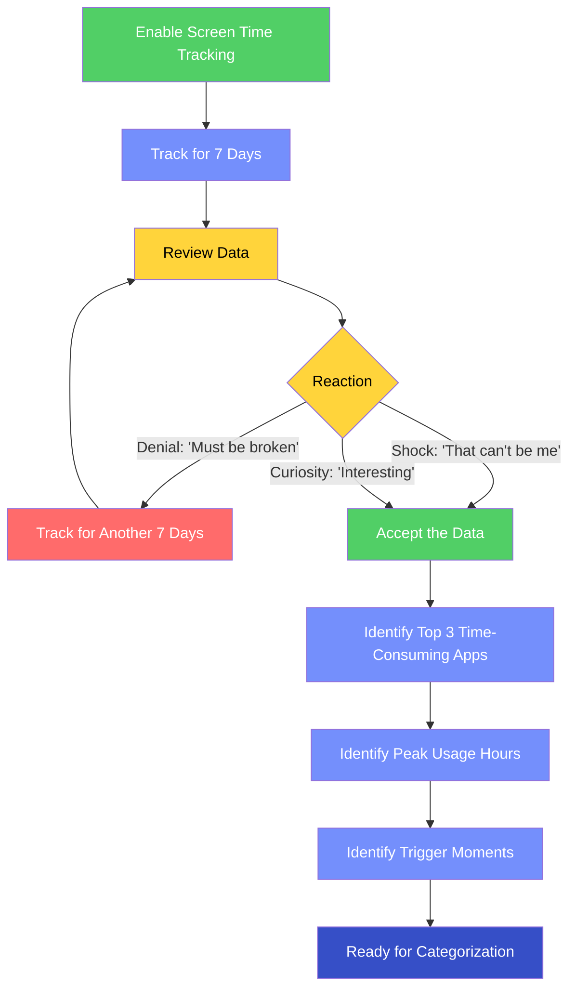
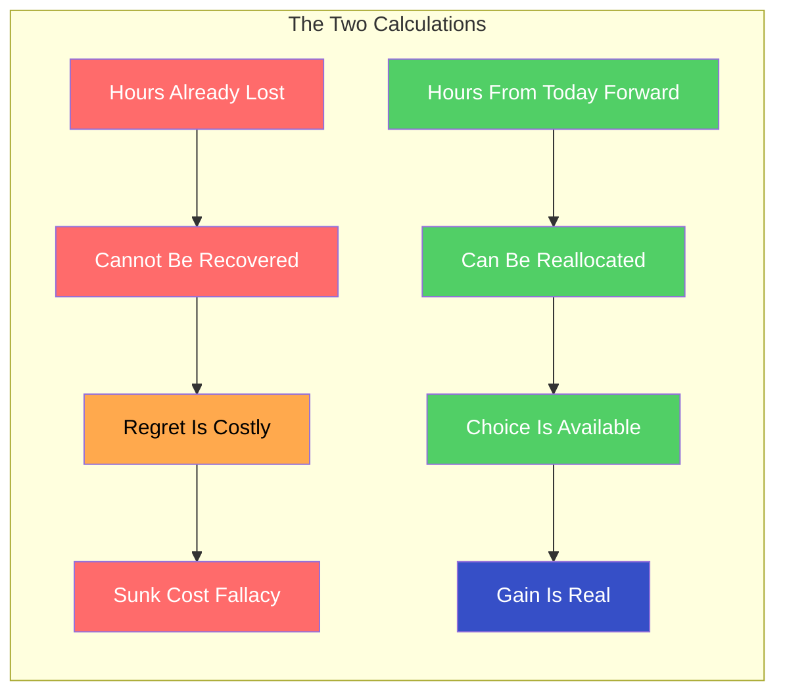
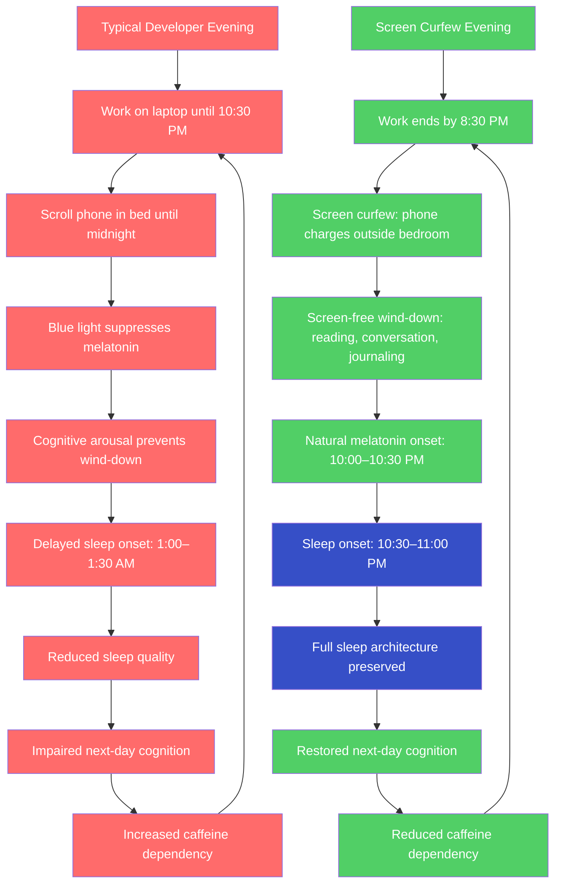
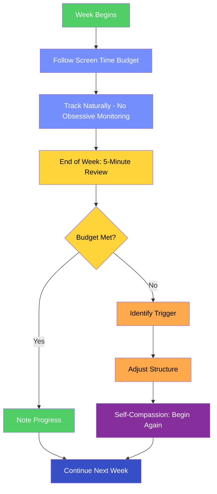

# Screen Time Management

## Description

The average developer spends 10–14 hours per day on screens. Most of this time is not conscious — it is automatic, habitual, and often counterproductive. This document provides a framework for managing screen time intentionally rather than by default. It covers measurement, categorization, practical strategies for reduction, and the discipline of tracking progress without becoming obsessive about it.

## Prerequisites

- [Why Digital Wellness Matters](intro/why-digital-wellness-matters.md) — the philosophical and scientific rationale for treating digital wellness as a core discipline
- [Sleep Architecture](../healthy-living/sleep-architecture.md) — how blue light from screens suppresses melatonin and disrupts the sleep architecture described here

## Table of Contents

- [What the Data Reveals](#-what-the-data-reveals)
- [Categorizing Screen Time](#-categorizing-screen-time)
- [The Sunk Cost of Lost Hours](#-the-sunk-cost-of-lost-hours)
- [Practical Strategies for Reduction](#-practical-strategies-for-reduction)
- [The Phone Fidget](#-the-phone-fidget)
- [Evening Screen Reduction for Better Sleep](#-evening-screen-reduction-for-better-sleep)
- [Weekends and Screen-Free Blocks](#-weekends-and-screen-free-blocks)
- [Tracking Progress Without Obsession](#-tracking-progress-without-obsession)

## Content / Material

### 📊 What the Data Reveals

Before you can manage screen time, you must measure it. Not estimate it. Not guess at it. Measure it.

The discrepancy between perceived and actual screen time is one of the most consistent findings in digital wellness research. Developers typically estimate their daily screen time at 6–8 hours. When measured objectively using built-in screen time tracking tools, the actual figure is almost always 10–14 hours. The gap is not a failure of honesty — it is a failure of awareness. The most damaging screen time is the screen time you do not notice: the reflexive phone check during a conversation, the ten-minute social media detour between tasks, the habitual email refresh that punctuates every idle moment.

Most operating systems now include built-in screen time tracking:

| Platform | Tool | What It Measures |
|----------|------|------------------|
| iOS | Screen Time (Settings → Screen Time) | Daily usage by app category, number of pickups, most-used apps, notification count |
| Android | Digital Wellbeing (Settings → Digital Wellbeing) | Daily usage by app, unlock count, notification count, focus mode |
| macOS | Screen Time (System Settings → Screen Time) | Same as iOS, synchronized across devices |
| Windows | Family Settings / Third-party (e.g., RescueTime) | Application usage time, productive vs. unproductive time |

The first step is the audit. Enable screen time tracking today. Do not change any behavior. Do not reduce anything. Simply measure for one full week. The data itself — the raw, unedited number — is the intervention. Most developers, when confronted with the actual figure, experience something between shock and denial. The number feels wrong. It cannot be right. But it is.

The audit reveals patterns that raw experience obscures. You discover that your phone usage peaks not during leisure hours but during work — punctuated by 40–60 daily pickups that fragment your focus. You discover that the "quick check" of a social media app averages 7 minutes per session, not the 30 seconds you imagined. You discover that your total recreational screen time — the time spent on screens for no productive or necessary purpose — exceeds your total exercise time, your total face-to-face social time, and your total reading time combined.

The data does not lie. It cannot be rationalized away. It is the mirror that shows you what you have actually been doing with your hours, as opposed to what you tell yourself you have been doing.

### 🏷️ Categorizing Screen Time

Not all screen time is equal. The 12-hour screen day is not 12 hours of the same activity. It is a composite of fundamentally different types of engagement, each with a different cost-benefit profile. The failure to distinguish between them is the failure to manage them.

Every hour of screen time falls into one of four categories:

| Category | Definition | Examples | Appropriate Limit |
|----------|-----------|----------|-------------------|
| 🟢 **Productive** | Screen use that directly produces work output or builds professional skill | Writing code, reviewing pull requests, reading technical documentation, debugging, learning a new framework | 6–8 hours (professional requirement) |
| 🔵 **Necessary** | Screen use required for life administration — not productive, but unavoidable | Banking, paying bills, scheduling appointments, reading necessary communications, navigation | 30–60 minutes |
| 🟡 **Recreational** | Screen use for entertainment, social connection, or leisure — enjoyable but non-essential | Social media, streaming video, gaming, news browsing, personal messaging, Reddit | 1–2 hours (the critical category) |
| 🔴 **Avoidable** | Screen use that is neither productive, necessary, nor genuinely enjoyable — habitual, compulsive, or reflexive | Mindless scrolling, compulsive email checking, refreshing feeds, opening apps with no intention, phone fidgeting | 0 minutes (eliminate entirely) |

The transformation begins when you realize that the bulk of your screen time is not in the 🟢 or 🔵 categories — it is in 🟡 and 🔴. The average developer's recreational and avoidable screen time totals 4–6 hours per day. This is not a trivial amount. It is the equivalent of a part-time job — performed every day, producing nothing of value, consuming the hours that could otherwise be spent sleeping, exercising, reading, creating, or being present with other humans.

The categorization exercise is simple:

1. Open your screen time report from the past week.
2. For each app, assign a category: 🟢, 🔵, 🟡, or 🔴.
3. Sum the hours in each category.
4. Calculate the percentage of total screen time that is recreational or avoidable.

Most developers find that 40–50% of their total screen time is 🟡 or 🔴. This means they are spending roughly 5–7 hours per day on screens for no productive or necessary reason. The recognition is uncomfortable. It should be. Discomfort is the precursor to change.

The categorization is not a moral judgment. Recreational screen time is not sinful — it is simply bounded. The problem is not that you watch videos or browse social media. The problem is that you do it for three hours instead of one, that you do it at the expense of sleep, and that you do it compulsively rather than intentionally. The goal is not zero recreational screen time. The goal is conscious recreational screen time — chosen, bounded, and proportionate.

### ⏳ The Sunk Cost of Lost Hours

There is a particular form of grief that accompanies the screen time audit. It is the grief of recognizing how many hours have already been lost. The developer who discovers they have averaged 5 hours of recreational and avoidable screen time per day for the past five years is confronting a loss of approximately 9,125 hours — more than a full year of waking life, spent scrolling, refreshing, and fidgeting.

This grief is legitimate. But it is also dangerous if it becomes paralyzing.

The sunk cost fallacy — the tendency to continue investing in a losing proposition because of prior investment — applies directly to screen time. The hours already lost are gone. They cannot be recovered. No amount of regret, self-recrimination, or anxious calculation will return them. The only productive response to lost hours is the recognition that every future hour is an opportunity to choose differently.

The calculus is straightforward:

Consider the reclaimed hours not as lost time recovered but as future time gained. If you reduce your recreational and avoidable screen time from 5 hours to 1.5 hours per day, you reclaim 3.5 hours daily. Over a year, that is 1,277 hours — the equivalent of 53 full days. In those 53 days, you could:

- Read 60–80 books
- Learn a new programming language to professional proficiency
- Exercise for 1 hour every single day
- Write a book, build a side project, or contribute meaningfully to open source
- Spend genuinely present time with the people you love

The gain is not abstract. It is concrete, measurable, and available starting today. The hours lost to yesterday's scrolling are gone. The hours available for tomorrow's intentional living are not.

### 🛠️ Practical Strategies for Reduction

Knowing the problem is insufficient. The gap between awareness and action is bridged by specific, implementable strategies. The following are the highest-leverage interventions for developers, ordered by impact.

#### Phone-Free Mornings

The first hour of the day is disproportionately consequential. The cortisol awakening response — the natural spike in cortisol during the first 60–90 minutes after waking — creates a window of heightened cognitive receptivity. Whatever inputs the brain encounters during this window are processed with amplified intensity. Checking the phone during this window floods the brain with other people's priorities — emails, messages, news, social media — before your own cognitive systems have initialized.

The protocol:

1. Purchase an analog alarm clock. The phone stops serving as an alarm clock.
2. The phone charges in another room — not on the nightstand, not within arm's reach.
3. The first 60 minutes after waking are phone-free. No exceptions.
4. Fill the phone-free hour with activities that do not involve screens: exercise, journaling, reading a physical book, eating breakfast without devices, walking outside, meditation.

The phone-free morning is the single highest-leverage screen time intervention. It reclaims the most cognitively valuable hour of the day from the attention economy. Within two weeks, developers consistently report improved morning clarity, better mood regulation, and a stronger sense of agency.

#### Screen Time Budgets

A budget assigns a fixed allocation to each category of screen time, just as a financial budget assigns a fixed allocation to each category of spending.

| Category | Daily Budget | Rationale |
|----------|-------------|-----------|
| 🟢 Productive | 6–8 hours | Professional requirement; not negotiable |
| 🔵 Necessary | 30–60 minutes | Life administration; bounded by efficiency |
| 🟡 Recreational | 60–90 minutes | Genuine leisure; chosen consciously |
| 🔴 Avoidable | 0 minutes | Eliminated entirely |

The budget is enforced not by willpower but by structure. The OS-level screen time limits available on iOS and Android can enforce app-specific time limits. When the recreational budget is exhausted, the apps lock. The developer who relies on willpower alone will fail — the dopamine loop is stronger than intention. The developer who relies on structural enforcement succeeds because the decision has already been made, and the structure enforces it.

#### App Limits and Friction Engineering

The most effective strategy for reducing screen time is not motivation — it is friction. The digital environment is designed to minimize friction between impulse and consumption. Effective reduction strategies reintroduce friction at precisely the points where automaticity takes over.

| Friction Strategy | Implementation | Effectiveness |
|-------------------|----------------|---------------|
| **Move social media apps off the home screen** | Place them in a folder on the last page, or remove them entirely | Moderate — reduces habitual opening by 20–30% |
| **Delete social media apps from phone** | Access only through mobile browser, which requires typing URL, logging in, and navigating a non-optimized interface | Very high — disrupts the automaticity of the behavior entirely |
| **Enable grayscale mode** | Accessibility settings → color filters → grayscale; removes the visual reward salience of colorful app icons and feeds | Moderate — reduces aesthetic appeal without eliminating function |
| **Log out after each session** | Every social media or entertainment app is logged out after use; next session requires explicit login | High — creates a decision point between impulse and action |
| **Use website blockers during work hours** | Tools like Cold Turkey, Freedom, or Focus extensions block recreational sites during work blocks | High — eliminates the option entirely during critical hours |
| **Set app-specific time limits** | iOS Screen Time / Android Digital Wellbeing: set 15–20 minute limits on social media apps | High — the OS enforces the boundary you set |

The principle is simple: make the undesired behavior harder and the desired behavior easier. Every additional step between you and the screen — every extra tap, every login prompt, every friction point — reduces the probability that the automatic behavior will execute. You are not fighting the dopamine loop with willpower. You are engineering the environment so the loop cannot complete.

#### Batched Communication

The most insidious form of screen time is the communication overhead that punctuates every workday: Slack messages, emails, team updates, DMs. Each individual message seems trivial. The aggregate effect is attentional fragmentation.

The protocol:

1. **Close your email and messaging applications during deep work blocks.** Not minimized — closed. The visual absence eliminates the cue.
2. **Check messages at predetermined intervals** — every 60–90 minutes, aligned with the natural ultradian rhythm of focus and rest.
3. **Set a clear status indicator** — "Deep focus until [time], will respond after" — so colleagues know when you will be available.
4. **Resist the urge to check "just in case."** The awareness that a message might be waiting creates hypervigilance that degrades focus even when no message arrives.

The batched communication protocol saves 1.5–3 hours per day of lost focus time for the average developer. The messages still get answered. They simply get answered in batches rather than in real time — which, for the vast majority of messages, is perfectly acceptable.

### 🤳 The Phone Fidget

The phone fidget is the habitual, unconscious act of reaching for, checking, or interacting with one's phone without any specific intention or need. It is the most pervasive and least recognized form of avoidable screen time.

The behavior follows a precise neurological pattern:

1. A moment of low stimulation occurs — a pause in conversation, a wait in a queue, a transition between tasks, a moment of boredom or mild anxiety.
2. The brain, conditioned by thousands of prior phone-checking episodes, generates a micro-craving for the dopamine hit associated with novel information on the screen.
3. The hand reaches for the phone. This action is largely automatic — it requires no conscious decision, no deliberate intention. The phone is retrieved, unlocked, and consulted before the conscious mind has formulated a question.
4. The phone is checked for 10–30 seconds. Nothing of value is found. The phone is put down.
5. The cycle repeats 60–150 times per day.

The phone fidget is not curiosity. It is not information-seeking. It is a behavioral tic — a compulsive motor response to low-stimulation states, reinforced by the variable ratio reward schedule of the notifications and feeds that occasionally deliver something interesting. The brain has learned that the phone sometimes provides a dopamine hit, and it compels the checking behavior "just in case."

Breaking the phone fidget requires three simultaneous interventions:

**Awareness.** Begin noticing when you reach for the phone. Not judging — just noticing. "I just picked up my phone. I have no reason to have done this." The awareness itself begins to disrupt the automaticity. You cannot change what you do not notice.

**Substitution.** Replace the phone fidget with a non-digital behavior that occupies the hands and provides mild stimulation: a stress ball, a pen to fidget with, a brief stretch, a few deep breaths. The substitution must be as physically accessible as the phone — if it requires effort, you will default to the phone.

**Tolerance building.** Practice sitting in low-stimulation states without reaching for the phone. Wait in a queue without scrolling. Sit in a waiting room without checking email. Ride an elevator without looking at the screen. These micro-practices rebuild the tolerance for boredom that chronic phone use has eroded. The discomfort is temporary. The capacity it builds is permanent.

The phone fidget may seem trivial — each instance lasts only seconds. But the aggregate is enormous. At 100 fidgets per day, each lasting 15 seconds, the phone fidget consumes 25 minutes of daily screen time. More importantly, each fidget fragments the attentional thread that was running before the interruption. The cost is not 25 minutes of screen time — it is 25 minutes of interrupted focus, multiplied by the recovery time required to re-establish depth.

### 🌙 Evening Screen Reduction for Better Sleep

The relationship between evening screen exposure and sleep quality is one of the most well-documented and consequential findings in sleep science. The mechanism operates through two pathways: the spectral composition of screen light and the cognitive arousal generated by screen content.

Screens emit light with a pronounced peak in the blue wavelength range (450–495 nm). The human retina contains intrinsically photosensitive retinal ganglion cells (ipRGCs) that express melanopsin, a photopigment maximally sensitive to blue light at approximately 480 nm. When activated, ipRGCs signal the suprachiasmatic nucleus (SCN) to suppress melatonin production — the hormonal signal that prepares the body for sleep. The result is delayed sleep onset, reduced sleep quality, and a shifted circadian clock.

Chang et al. (2015) at Harvard Medical School demonstrated that participants who read on a light-emitting e-reader for 4 hours before bedtime experienced suppressed melatonin secretion by over 50%, delayed melatonin onset by approximately 1.5 hours, reduced REM sleep, and reduced next-morning alertness compared to those who read a printed book.

The practical intervention is the screen curfew: no screens for 60–90 minutes before intended sleep time.

The screen curfew protocol:

1. **Set a hard stop time for work screens.** No laptop, no monitor, no work email after the designated hour. For most developers targeting 7–8 hours of sleep, this means screens off by 9:30–10:00 PM.
2. **Move the phone out of the bedroom.** The phone charges in another room — on a kitchen counter, in a hallway, anywhere that is not within arm's reach of the bed. Buy a $10 analog alarm clock.
3. **Replace the evening scroll with a screen-free wind-down activity.** Reading a physical book, journaling, conversation with a partner or roommate, light stretching, meditation, or simply sitting in dim light. The activity is not the point — the absence of screens is.
4. **If you must use a screen in the evening, mitigate the damage.** Enable Night Shift / blue light filter at maximum warmth. Reduce screen brightness to minimum. Use dark mode exclusively. But understand that these mitigations reduce — they do not eliminate — the circadian disruption. The only full mitigation is the absence of the screen.

The screen curfew is difficult for the first 5–7 days. The evening scroll is deeply habitual — it is the decompression ritual that marks the transition from work to rest. Removing it leaves a void that must be filled. But the void is the point. The screen-free evening creates space for the mind to wind down naturally, for melatonin to rise on schedule, for the body to prepare for sleep without chemical interference.

The reward is immediate and measurable. Within one week of consistent screen curfew, developers report falling asleep 20–40 minutes faster, waking more refreshed, and experiencing reduced morning grogginess. The sleep quality improvement is the single most impactful benefit of screen time management — because sleep quality determines cognitive performance the following day.

### 🗓️ Weekends and Screen-Free Blocks

Weekends present a distinct challenge. The weekday structure — work hours, commute, meetings — provides a scaffold that limits recreational screen time simply because the day is already occupied. Weekends remove the scaffold. The developer who has no specific plans on a Saturday morning wakes up, reaches for the phone, and enters an unstructured screen session that can consume entire mornings.

The strategy is twofold: pre-plan screen-free blocks and engineer weekend structure.

#### Pre-Planned Screen-Free Blocks

Designate specific blocks of time during the weekend as screen-free. These are not suggestions — they are appointments with yourself that are as binding as a work meeting.

| Block | Duration | Activities |
|-------|----------|------------|
| **Saturday morning** | 90–120 minutes | Exercise, breakfast preparation and eating, reading, walking, household tasks, conversation |
| **Saturday afternoon** | 60–90 minutes | Outdoor activity, hobby, social time, creative pursuit |
| **Sunday morning** | 90–120 minutes | Same as Saturday morning — this becomes a ritual |
| **Sunday evening** | 60 minutes | Weekly review, meal preparation, screen-free wind-down for the week ahead |

The screen-free blocks serve two purposes. First, they reclaim time for activities that screens have displaced — exercise, face-to-face socializing, reading, creative work, rest. Second, they demonstrate — through direct experience — that life continues without constant connectivity. The developer who spends Saturday morning without a phone discovers that nothing catastrophic happens. No urgent message goes unanswered. No opportunity is missed. The world does not collapse. The anxiety about disconnection is the anxiety itself, not a response to actual risk.

#### The Digital Sabbath

The digital sabbath — one full day per week with no recreational screen use — is the most intensive intervention in this document. It is also the most transformative.

The protocol:

1. **Choose one day** — typically Saturday or Sunday.
2. **No social media, no news, no entertainment screens, no recreational browsing.** Work screens are permitted only if genuinely unavoidable (on-call duties, emergency production issues).
3. **The phone remains available for calls and essential texts** — but notifications for all non-essential apps are disabled for the duration.
4. **Fill the day with screen-free activities.** Exercise, cooking, reading, walking, visiting friends, attending worship, working on hobbies, sleeping, simply existing without digital input.

The digital sabbath is not a productivity hack. It is a practice of deliberate detachment from the digital environment that normally defines the rhythm of your life. It is uncomfortable at first — genuinely, physically uncomfortable. The urge to check the phone is not metaphorical. It is a neurological craving that manifests as restlessness, anxiety, and a diffuse sense that something important is being missed.

Nothing is being missed. The emails will wait. The Slack messages will wait. The news will wait. The feeds will still be there tomorrow, indistinguishable from today. The practice of the digital sabbath is the practice of discovering this truth through direct experience — not as an intellectual proposition but as a lived reality.

Over time, the digital sabbath becomes the best day of the week. The developer who practices it consistently reports that Sunday becomes the day they feel most present, most rested, most connected to the people around them, and most clear about what matters. The day away from screens does not subtract from the week. It gives the week a center.

### 📈 Tracking Progress Without Obsession

The paradox of screen time management is that the tool used to measure it — the phone's screen time tracker — is itself a screen. The developer who checks their screen time report every hour has replaced one compulsive phone behavior with another. The metric becomes the master.

The solution is scheduled measurement, not continuous monitoring.

#### The Weekly Review Protocol

Once per week — at a fixed time, on a fixed day — review your screen time data for the preceding seven days. The review takes five minutes:

1. **Total screen time.** Is it trending downward toward your budget? If yes, maintain. If no, investigate which category is exceeding the budget.
2. **Category breakdown.** How much was 🟢 productive, 🔵 necessary, 🟡 recreational, and 🔴 avoidable? The goal is to reduce 🟡 and 🔴, not 🟢.
3. **Phone pickups.** How many times did you pick up the phone per day? The goal is to reduce the frequency, not just the duration. Fewer pickups means less attentional fragmentation.
4. **Screen-free hours.** How many hours per day were genuinely screen-free? The goal is to increase this number, even by 30 minutes per week.
5. **Trigger patterns.** Which moments of the day generated the most avoidable screen time? Boredom? Anxiety? Task transitions? Waiting? Identify the trigger so you can substitute a screen-free behavior at that specific point.

The weekly review is sufficient. Daily monitoring creates anxiety. Monthly monitoring creates too much distance to maintain behavioral momentum. The weekly cadence provides enough feedback to adjust course without creating an obsession with the metric.

#### Milestones and Self-Compassion

Progress in screen time management is not linear. There will be weeks when you exceed your budget — when stress drives increased scrolling, when a new app captures your attention, when travel or disruption breaks your routine. This is expected. The question is not whether you will have bad weeks. The question is whether you will return to the discipline after the bad week.

The milestones are not arbitrary numbers. They are markers of genuine cognitive and behavioral change:

| Milestone | Typical Timeline | What It Signifies |
|-----------|-----------------|-------------------|
| **First week of accurate tracking** | Week 1 | Awareness achieved; the gap between perception and reality is visible |
| **First phone-free morning** | Week 1–2 | The highest-leverage intervention is operational |
| **Recreational screen time below 2 hours/day** | Week 2–3 | The budget is being enforced; the dopamine loop is weakening |
| **Phone pickups below 50/day** | Week 3–4 | The phone fidget is losing its automaticity |
| **First screen-free weekend block** | Week 3–4 | The weekend structure is being established |
| **First digital sabbath completed** | Week 5–8 | The deepest intervention has been experienced |
| **Total screen time below 8 hours/day** | Week 6–10 | A sustainable, intentional relationship with screens has been established |

The milestones are not deadlines. They are signposts. If you reach the first phone-free morning in week 4 instead of week 2, nothing has been lost. The journey is not graded on speed. It is graded on sustained, intentional movement toward a more conscious relationship with the screens that dominate your life.

Self-compassion is not optional in this process. The developer who berates themselves for a bad week — "I scrolled for three hours last night, I'm hopeless" — is compounding the problem with shame. Shame does not produce behavioral change. Shame produces avoidance, and avoidance produces more scrolling. The response to a bad week is not self-punishment. It is honest acknowledgment, identification of the trigger, adjustment of the structure, and return to the discipline. The practice of beginning again — without drama, without self-recrimination, without the narrative of failure — is the practice that makes the discipline sustainable.

The discipline of screen time management is, at its core, the discipline of intentional living. The screen is the arena in which the battle for attention is fought. The developer who manages their screen time is not merely reducing a number on a dashboard. They are reclaiming the hours — and the attentional capacity — that make everything else in the transformation journey possible.

## Learning Tips

- **Start with measurement, not reduction.** Track your screen time for one full week before changing any behavior. The data is the foundation. Without it, you are guessing.
- **Reduce one category at a time.** Do not attempt to overhaul your entire digital life in a single weekend. Start with the easiest intervention — the phone-free morning — and add new strategies as each one stabilizes.
- **Use physical timers for recreational screen budgets.** A kitchen timer or a simple countdown app (set before entering the recreational app) creates a structural boundary that willpower alone cannot enforce.
- **Pair screen-free time with physical activity.** The replacement for scrolling must be as accessible as the scroll. A walk is more accessible than a gym session. A stretch is more accessible than a yoga class. Match the replacement to the energy level of the moment.
- **Practice boredom deliberately.** Wait in a line without your phone. Ride an elevator without checking email. Sit in a waiting room without scrolling. These micro-practices rebuild the tolerance for low-stimulation states that chronic screen use has eroded. The discomfort is the capacity being rebuilt.
- **Tell someone about your screen time goals.** Social accountability — even informal — increases adherence. The developer who tells a colleague "I'm not checking Slack before 10 AM" has created a social contract that makes the boundary more durable.
- **Do not moralize the data.** The screen time report is information, not indictment. A high number is not a moral failing — it is a behavioral pattern that can be adjusted. Treat the data with the same clinical detachment you would bring to a performance metric at work.

## Glossary

| Term | Definition |
|------|------------|
| **Cortisol awakening response (CAR)** | The natural spike in cortisol during the first 60–90 minutes after waking, creating a window of heightened cognitive receptivity |
| **Digital sabbath** | One full day per week with no recreational screen use, practiced as a deliberate detachment from the digital environment |
| **Friction engineering** | The deliberate introduction of barriers between impulse and action to disrupt automatic, compulsive behaviors |
| **ipRGCs (intrinsically photosensitive retinal ganglion cells)** | Specialized retinal cells that express melanopsin and signal circadian timing to the SCN; maximally sensitive to blue light at approximately 480 nm |
| **Melanopsin** | A photopigment in ipRGCs maximally sensitive to blue light (approximately 480 nm); mediates non-visual light responses including circadian entrainment and melatonin suppression |
| **Melatonin** | A hormone produced by the pineal gland in response to darkness; signals the body to prepare for sleep; suppressed by blue-wavelength light exposure |
| **Phone fidget** | The habitual, unconscious act of reaching for, checking, or interacting with one's phone without any specific intention or need |
| **Screen curfew** | The practice of eliminating screen exposure for 60–90 minutes before intended sleep time to support natural melatonin production |
| **Screen time budget** | A fixed daily allocation of screen time assigned to each category (productive, necessary, recreational, avoidable) |
| **Suprachiasmatic nucleus (SCN)** | The master circadian clock in the hypothalamus; receives light input from ipRGCs and coordinates circadian rhythms across the body |
| **Ultradian rhythm** | A biological cycle shorter than 24 hours; the approximately 90-minute cycle of high and low alertness during waking that governs sustainable deep focus periods |
| **Variable ratio reinforcement** | A reward schedule in which reinforcement is delivered after an unpredictable number of responses; the most addiction-prone schedule, underlying both slot machines and social media feeds |

## Quick References

- [Center for Humane Technology](https://www.humanetech.com/) — organization dedicated to realigning technology with human well-being; founded by former Google design ethicist Tristan Harris
- Newport, C. (2019). *Digital Minimalism: Choosing a Focused Life in a Noisy Network*. Portfolio. — the foundational text on intentional technology use
- Newport, C. (2016). *Deep Work: Rules for Focused Success in a Distracted World*. Grand Central Publishing. — the case for sustained attention as a professional and cognitive practice
- Alter, A. (2017). *Irresistible: The Rise of Addictive Technology and the Business of Keeping Us Hooked*. Penguin. — the neuroscience of behavioral addiction in the context of digital technology
- Chang, A.-M., et al. (2015). Evening use of light-emitting eReaders negatively affects sleep, circadian timing, and next-morning alertness. *PNAS*, 112(4), 1232–1237. — the definitive study on how screen use before bed disrupts circadian rhythm and sleep
- [Apple Screen Time Documentation](https://support.apple.com/en-us/108806) — official guide to built-in screen time tracking on iOS and macOS
- [Google Digital Wellbeing](https://support.google.com/android/answer/9346420) — official guide to built-in digital wellbeing tools on Android
- Harris, T. (2016). ["How Technology Hijacks People's Minds"](https://medium.com/thrive-global/how-technology-hijacks-peoples-minds-from-a-magician-and-google-s-design-ethicist-56d62ef5edf3) — a practitioner's account of the persuasion techniques embedded in technology design

## Next Steps

- [Information Overload & Cognitive Load](../healthy-living/digital-detox.md#-information-overload-and-cognitive-load) — the neuroscience of how excessive digital input overwhelms working memory and degrades cognitive performance
- [Digital Detox](../healthy-living/digital-detox.md) — the comprehensive neuroscience of screen-induced cognitive degradation and the recovery protocol for rebuilding sustained attention
- [Sleep Architecture](../healthy-living/sleep-architecture.md) — the sleep stages and cycles that evening screen exposure directly disrupts; improving sleep and reducing screen exposure are synergistic interventions
- [Rebuilding Routines](../habits/rebuilding-routines.md) — how to integrate screen time management into a broader system of daily routines that compound over time
- [Environment Design](../habits/environment-design.md) — structuring your physical and digital environment to support the behavioral changes described here
