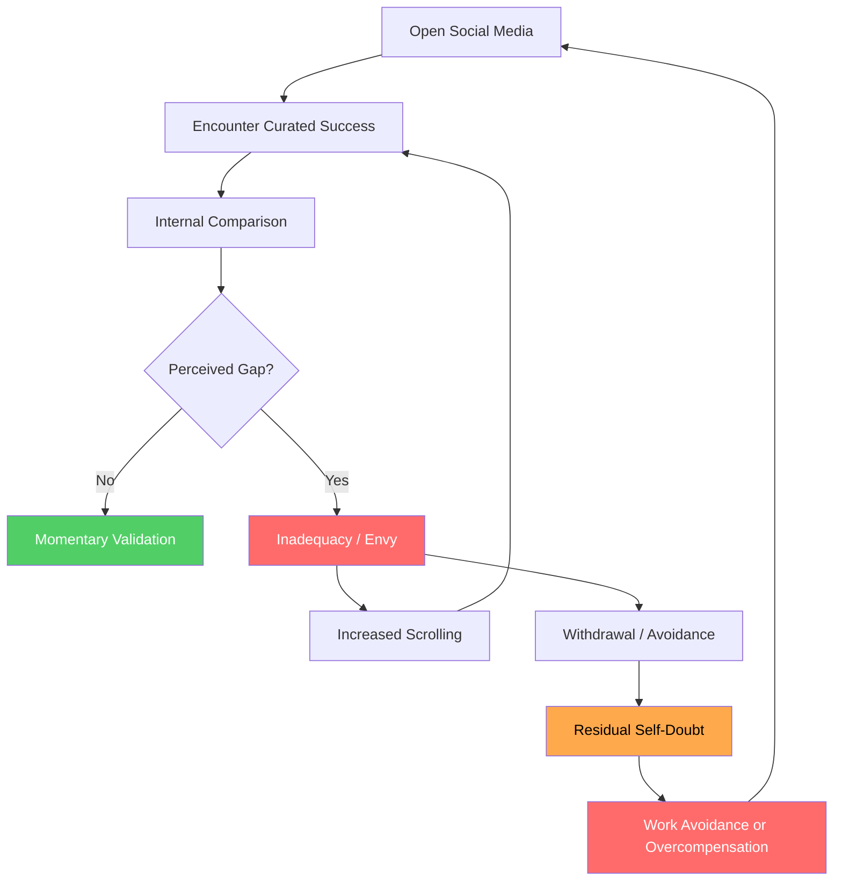
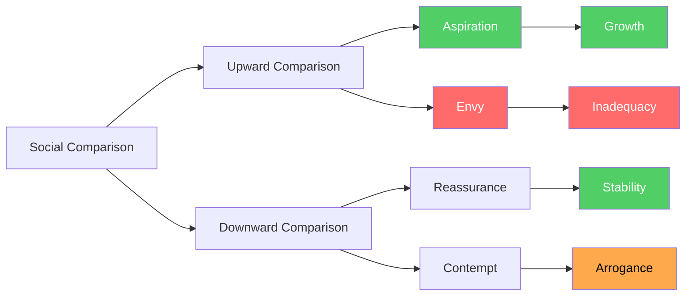
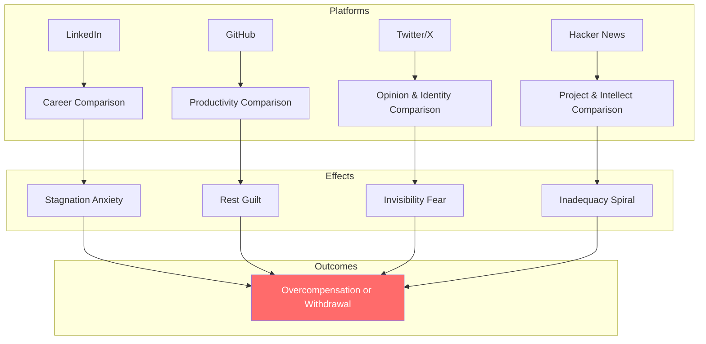
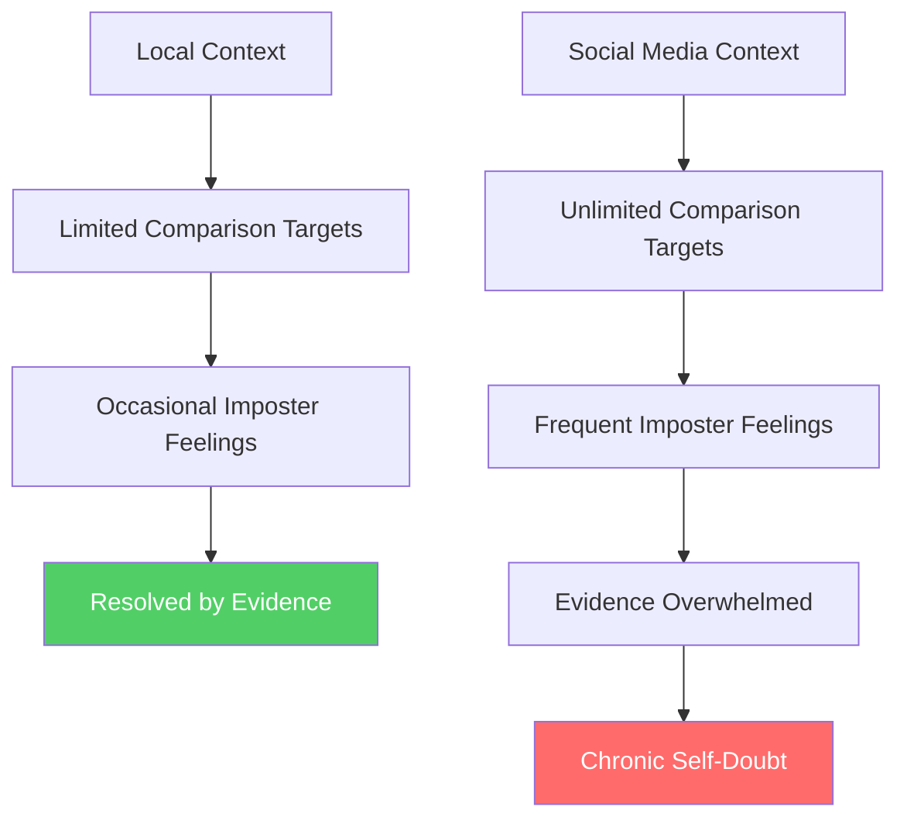
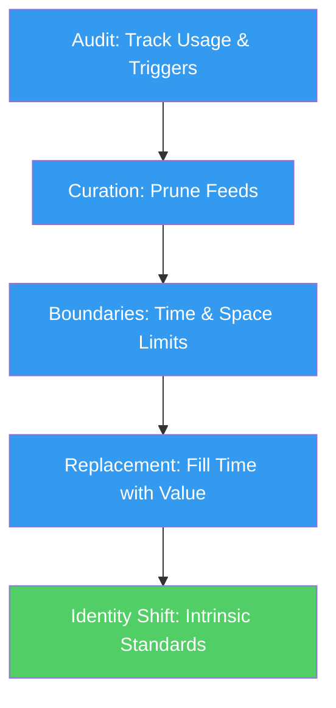

# Social Media and Comparison

## Description

Social media feeds are curated highlight reels that distort your perception of everyone else's life. The constant comparison erodes self-worth, fuels envy, and keeps you trapped in a performance loop. This document explores how social platforms affect developers and how to build a healthier relationship with them. It examines the psychological mechanisms that make comparison automatic, the platform-specific forms this comparison takes in developer culture, and the practical strategies for breaking the cycle. The analysis is grounded in social comparison theory, reinforcement psychology, and the existential insight that comparison thrives where meaning is absent.

## Prerequisites

- [Why Digital Wellness Matters](intro/why-digital-wellness-matters.md) — the philosophical and scientific rationale for treating digital environments as health concerns
- [Recognizing the Void](../meaning/recognizing-the-void.md) — understanding how the void fuels comparison and why meaninglessness amplifies the pull of social validation

## Table of Contents

- [The Comparison Trap](#-the-comparison-trap)
- [Curated Feeds vs. Reality](#-curated-feeds-vs-reality)
- [The Psychology of Social Comparison](#-the-psychology-of-social-comparison)
- [How Comparison Manifests in Developers](#-how-comparison-manifests-in-developers)
- [The Everyone-Is-Building-Something Pressure](#-the-everyone-is-building-something-pressure)
- [Imposter Syndrome Amplified by Social Media](#-imposter-syndrome-amplified-by-social-media)
- [The Dopamine Loop](#-the-dopamine-loop)
- [Practical Strategies for a Healthier Relationship](#-practical-strategies-for-a-healthier-relationship)
- [The Void Connection](#-the-void-connection)
- [Learning Tips](#-learning-tips)
- [Glossary](#glossary)
- [Quick References](#-quick-references)
- [Next Steps](#-next-steps)

## Content / Material

### 🪤 The Comparison Trap

You open LinkedIn and see a former colleague announcing a promotion to Staff Engineer at a FAANG company. You open Twitter and see a twenty-two-year-old who just shipped a product that got five thousand upvotes on Hacker News. You open GitHub and see someone with a contribution graph that looks like a solid block of green — every day, no exceptions, for three years. You close the apps. You feel worse. You do not examine why you feel worse. You simply carry the weight of it through the rest of your day, a low-grade hum of inadequacy that colors every interaction with your own work.

You might also feel something more subtle: a vague sense that you have failed in a way you cannot quite articulate. Not a specific failure — you shipped your tasks this week, your code review was clean, your standup was fine. But a general failure, an ambient sense that you are not doing enough, not achieving enough, not being enough. This general failure is more damaging than any specific one, because it cannot be addressed. You cannot fix an ambient feeling. You can only carry it. And the carrying is exhausting.

This is the comparison trap. It is not new. Humans have compared themselves to others for as long as social hierarchies have existed. What is new is the scale, frequency, and asymmetry of the comparison. Before social media, you compared yourself to the people you actually knew — neighbors, colleagues, classmates. The comparison pool was small, contextual, and somewhat balanced. You knew their struggles because you witnessed them. Now you compare yourself to the curated public outputs of millions of strangers, stripped of all context, all failure, all struggle. The comparison is no longer between you and a person. It is between you and an image — an image that has been selected, filtered, and timed for maximum impact.

The trap operates because comparison is automatic. You do not decide to compare yourself to the person who just raised a Series A. The comparison happens before conscious evaluation — a rapid, pre-reflective assessment that triggers emotional responses before your rational mind can intervene. By the time you recognize what has happened, the emotional residue is already embedded in your mood, your motivation, and your self-perception. You cannot unfeel the inadequacy. You can only choose how to respond to it.

The deepest danger of the comparison trap is that it redirects your attention away from your own trajectory. You stop asking "Am I growing?" and start asking "Am I ahead?" These are fundamentally different questions. Growth is internal, personal, and measurable against your own past self. Position is external, relative, and measured against an arbitrary and constantly shifting reference group. The comparison trap converts the first question into the second, and in doing so, makes growth feel impossible — because there will always be someone further ahead, someone with more stars, more followers, more funding, more recognition.

The trap is also self-reinforcing. Each comparison that produces inadequacy increases the need for validation, which increases the time spent on platforms, which increases the number of comparisons, which deepens the inadequacy. The cycle does not resolve itself. It accelerates. The only intervention is a conscious one — a decision to interrupt the loop, examine the mechanism, and build alternative sources of self-assessment.

The daily rhythm of the trap is worth examining directly. You wake up and check your phone. Before your feet touch the floor, you have already been exposed to a dozen instances of other people's success. You carry those instances into your morning — a faint sense that you should be doing more, producing more, accomplishing more. You work, and the feeling recedes. But during a break, or a moment of frustration with a difficult problem, you check again. The feeling returns, reinforced by fresh evidence. By the end of the day, you have checked dozens of times. Each check has deposited a thin layer of inadequacy. The layers accumulate. Over weeks and months, they become a sediment — a baseline assumption that your work is insufficient, your pace is too slow, your accomplishments are too modest. You do not notice the sediment forming. You only notice its effects: the reluctance to share your work, the hesitation to apply for a role, the quiet conviction that you are not ready.

### 📸 Curated Feeds vs. Reality

Every post on a social media platform is a survivor. Of the hundreds of photos taken, one was posted. Of the months of struggle, the moment of success was shared. Of the dozen failed projects, the one that shipped was announced. You are not seeing a representative sample of anyone's life. You are seeing the positive outlier, selected and presented without context.

This asymmetry is structural, not intentional. Most people do not consciously deceive their audiences. They simply post what is interesting, what is shareable, what reflects well on them. Nobody posts their fourth rejection letter. Nobody posts the commit they had to revert at 3 AM. Nobody posts the three months of doubt that preceded the product launch. The feed is a greatest-hits album, and you are comparing it to your unedited recording session.

| What You See on Social Media | What Actually Happened |
|------------------------------|----------------------|
| "Excited to announce my new role at [Company]" | Eight months of interviews, three rejections, and settling for the fourth offer |
| "Just shipped 1.0 of my side project!" | Six months of abandoned prototypes, scope creep, and 2 AM debugging sessions |
| "Hit 10,000 GitHub stars today" | Two years of inconsistent commits, three major rewrites, and a README that was rewritten nine times |
| "Speaking at [Conference] next month" | Submitted to forty-seven conferences before being accepted |
| "My team just shipped the biggest feature in company history" | Four people burned out, one quit, and the project was nearly cancelled twice |
| "Beautiful weekend hike" | Three arguments about directions and a twisted ankle that was not photographed |

The curated feed creates what psychologists call an availability heuristic — the tendency to judge the frequency or likelihood of events based on how easily examples come to mind. Because successes are posted and failures are not, your mental model of other people's lives becomes skewed toward success. You begin to believe that everyone else is succeeding more consistently, more easily, and more completely than they actually are. The mental model is wrong. But it feels true, because the evidence is right there in your feed.

This is a form of survivorship bias — the logical error of focusing on the people or things that made it past some selection process and overlooking those that did not, typically because of their lack of visibility. In the context of social media, the survivors are the successes. The failures are invisible — not because they are hidden, but because they are never posted. The developer whose startup failed does not tweet about it. The developer who gave up on a side project does not update their GitHub profile to reflect the abandonment. The developer who was rejected from a conference does not post about the rejection. You see the survivors. You do not see the casualties. And from this incomplete sample, you construct an inaccurate estimate of what is normal.

The curated feed also exploits what is known as the contrast effect — the tendency to evaluate something by comparing it to something else rather than in absolute terms. A good day of coding feels less satisfying after you have seen a tweet about someone shipping a product that raised a million dollars. The absolute quality of your day has not changed. But the contrast with someone else's apparent success makes it feel diminished. The contrast effect is automatic and difficult to resist, because the comparison is built into the perception itself. You do not choose to compare. The comparison is the medium through which you evaluate your experience.

The technical term for this is pluralistic ignorance — a situation where most members of a group privately reject a norm but believe that most others accept it, so they conform to what they think others expect. In the context of social media, this means that everyone is performing success while privately struggling, and everyone else's performance makes your own struggle feel like an anomaly. It is not an anomaly. It is the universal human condition. But the platform makes it invisible.

The invisibility of shared struggle is one of social media's most damaging effects. In a physical workplace, you see your colleagues' frustrations — the sighs, the frustrated Slack messages, the conversations at lunch about a difficult problem. These signals of shared struggle normalize your own experience. On social media, these signals are absent. You see only the polished outputs, and you conclude that the struggle is yours alone. The conclusion is wrong, but it is psychologically compelling, because the evidence for shared struggle is hidden while the evidence for others' success is visible.

The gap between curated feeds and reality is not a bug in social media. It is the fundamental architecture. Platforms are designed to surface content that generates engagement. Success generates engagement. Failure does not. The algorithm is not neutral — it is a curation engine that amplifies the asymmetry. The result is a distortion field that makes everyone's life look better than it is, and makes your own life look worse by comparison.

The algorithmic amplification deserves particular attention. Social media platforms do not show you a random sample of what your connections post. They show you what maximizes engagement — the posts most likely to produce likes, comments, and shares. Success, achievement, and polished presentations generate more engagement than vulnerability, failure, or mundanity. The algorithm learns this pattern and reinforces it. Over time, your feed becomes a curated collection of other people's best moments, precisely because those moments generate the most interaction. The algorithm is not conspiring against you. It is simply optimizing for the metric that sustains its business model: your attention. The fact that this optimization produces a distorted view of reality is a side effect that the business model does not account for.

This distortion is particularly insidious because it operates at the level of pattern recognition. Your brain does not process individual posts in isolation. It processes them as a pattern — a gestalt impression of what life looks like for people like you. When that pattern is composed entirely of successes, promotions, launches, and milestones, the brain constructs a world-model in which those events are normal and their absence is anomalous. The world-model is wrong, but it is constructed automatically, below the level of conscious evaluation, and it shapes your emotional responses before you have a chance to question it.

### 🧠 The Psychology of Social Comparison

In 1954, psychologist Leon Festinger published his theory of social comparison processes. The core proposition was deceptively simple: humans have an innate drive to evaluate their own abilities and opinions, and in the absence of objective standards, they evaluate themselves by comparing to others. This drive is not a weakness. It is a fundamental feature of human cognition — a mechanism for calibrating your understanding of yourself against the social world.

Festinger identified two directions of comparison. Upward comparison is comparing yourself to someone you perceive as better — more skilled, more successful, more accomplished. Downward comparison is comparing yourself to someone you perceive as worse. Both serve psychological functions. Upward comparison provides information about what is possible and can inspire aspiration. Downward comparison provides reassurance and can stabilize self-esteem. Neither is inherently harmful. The harm arises when the comparison becomes compulsive, context-free, and unbalanced.

Social media has fundamentally altered the comparison landscape in three ways. First, it has increased the frequency. You are exposed to hundreds of comparison targets per day — a number that would have been inconceivable in a pre-digital world. Second, it has biased the direction. Algorithms preferentially surface success, novelty, and achievement, creating an environment where upward comparison vastly outweighs downward comparison. Third, it has removed context. You compare your full, messy, private experience to someone else's filtered, public, decontextualized highlight. The comparison is rigged before it begins.

Psychologists Tesser (1988) and later Gilbert, Giesler, and Morewedge (1995) demonstrated that social comparison is often involuntary — it occurs automatically, without conscious intention, and is difficult to suppress. You do not choose to compare yourself to the person with more GitHub stars. The comparison simply happens, triggered by the visual stimulus of seeing their profile. By the time you are aware of the comparison, the emotional response is already in motion. This automaticity is what makes social comparison so insidious — it operates below the threshold of deliberate thought, where your defenses are weakest.

The concept of reference groups, introduced by Herbert Hyman (1942) and elaborated by Merton and Rossi (1950), adds another layer. A reference group is the group you use as a standard for self-evaluation. Social media has expanded your reference group from your immediate community to the entire connected world. You are no longer comparing yourself to your colleagues. You are comparing yourself to every developer on the internet who appears to be doing better than you. The reference group has become unbounded, and with it, the potential for inadequacy has become infinite.

This is not a failure of willpower or self-esteem. It is a predictable consequence of exposing a comparison-driven cognitive system to an environment engineered to maximize comparison triggers. The system is working as designed — both the brain and the platform. The problem is that they are working toward different ends.

### 💻 How Comparison Manifests in Developers

Developers occupy a unique position in the comparison landscape. Their work is often public — open-source repositories, blog posts, conference talks, tweets about technical opinions. Their skills are hierarchical and measurable — seniority levels, language proficiency, system design capability. Their community has explicit status markers — followers, stars, endorsements, job titles. These features make developer culture particularly fertile ground for social comparison.

Each platform cultivates a distinct form of comparison:

**LinkedIn** produces career comparison. You see job titles, promotions, company names, and endorsements. The implicit message is that career progress is linear, public, and measured by the prestige of your employer and the recency of your title. A developer who has been at the same company for five years, doing meaningful work but without a title change, reads LinkedIn as evidence of stagnation. The platform does not account for depth, impact, or alignment — only advancement.

**GitHub** produces productivity comparison. The contribution graph is a public scoreboard — green squares that quantify your output for anyone to see. A developer who takes a week off for mental health looks at their graph and sees a gap. A developer who works on proprietary code cannot display their contributions at all. The graph measures activity, not quality, but the visual impact is immediate and visceral. The green graph has become a proxy for competence, and the absence of green has become a proxy for laziness — a conflation that punishes rest and rewards performative productivity.

**Twitter/X** produces opinion and identity comparison. Developers curate personal brands — hot takes, technical opinions, career advice, side project announcements. The platform rewards confidence, novelty, and controversy. A developer who is still learning, who holds tentative opinions, who works on unglamorous problems, finds nothing to post. The silence feels like invisibility. Meanwhile, the developers who post confidently accumulate followers, and the follower count becomes a measure of intellectual authority. The correlation between follower count and actual expertise is weak, but the psychological impact is strong.

**Hacker News** produces project and intellectual comparison. The front page showcases what the community considers worthy — ambitious projects, insightful essays, controversial technical decisions. A developer who has built something useful but mundane — a CRUD app, a deployment script, a productivity tool — finds no audience. The platform elevates the exceptional and renders the ordinary invisible, creating the impression that everyone else is working on something more interesting, more ambitious, more technically sophisticated than you are.

The developer who inhabits all four platforms simultaneously — as many do — is subjected to four distinct comparison channels, each targeting a different axis of professional identity. The cumulative effect is a pervasive sense of falling behind, a conviction that your work is insufficient, and a low-grade anxiety that accompanies even your genuine accomplishments. The awards do not register because the comparison has already moved to the next tier.

The platform-specific nature of developer comparison has an important implication: the intervention must also be platform-specific. Reducing your time on Twitter will not help if LinkedIn is your primary source of career anxiety. Curating your GitHub profile will not help if Hacker News is where your imposter syndrome is triggered. The audit step described in the practical strategies section should include a platform-by-platform analysis of which channels produce the most comparison distress. This allows you to target the intervention where it matters most, rather than applying a generic reduction strategy that may not address the specific mechanisms operating on each platform.

There is also a temporal dimension to platform-specific comparison. Different platforms dominate at different career stages. Early-career developers are most affected by Twitter and Hacker News, where the emphasis on technical novelty and opinion creates the impression that they should know more than they do. Mid-career developers are more affected by LinkedIn and Twitter, where the emphasis on titles, roles, and public recognition creates the impression that they should be further along. Late-career developers are affected by all platforms, but particularly by Twitter, where the concentration of senior voices creates a constant reminder that there is always someone more experienced, more respected, more influential. The comparison shifts shape across the career arc, but it never disappears.

### 🏗️ The Everyone-Is-Building-Something Pressure

There is a particular form of comparison pressure that is unique to the current moment in developer culture: the expectation that you should always be building something. Side projects, open-source contributions, technical writing, course creation, startup ideas — the implicit norm is that a serious developer is perpetually productive outside of work hours.

This norm is reinforced by visible success stories. The developer who built a side project that became a product. The developer who wrote a blog post that went viral. The developer who contributed to an open-source project and got hired by the maintainers. These stories are real, but they are not representative. They are the visible tip of an enormous iceberg of effort, luck, timing, and privilege that remains submerged. For every side project that succeeded, thousands did not — not because the developers lacked talent, but because success in side projects is heavily influenced by factors outside individual control.

The "hustle culture" narrative amplifies this pressure by framing relentless productivity as a moral virtue. The implicit message is that if you are not building, you are wasting time. If you are not shipping, you are falling behind. If you are not optimizing every hour for maximum output, you are not serious about your career. This narrative is particularly toxic because it transforms rest — a biological necessity — into a moral failing. The developer who rests feels not just tired but guilty. The guilt produces anxiety. The anxiety produces more scrolling on social media, where the narrative is reinforced by yet another post about someone who worked twelve hours and shipped three features. The narrative is a closed loop that punishes the very behavior (rest) that would break it.

The pressure to build creates a particular kind of suffering: the guilt of rest. When every timeline is filled with someone shipping something, taking a week off to read, walk, or simply exist without producing feels like falling behind. The developer who spends a Saturday reading a novel rather than working on a side project experiences a pang of anxiety — not because they believe rest is wrong, but because the ambient culture suggests that rest is for people who are not serious enough.

There is also an economic dimension to this pressure that is rarely discussed. The "build in public" movement, the "ship or die" ethos, and the "side project as portfolio" narrative are not just cultural norms — they are economic strategies that benefit specific actors. Content platforms benefit from your public building because it generates engagement. Course creators benefit because it creates demand for their teaching. Employers benefit because it produces a class of developers who are always learning, always producing, and always available. The pressure to build is not a neutral cultural norm. It is a norm that serves economic interests, and the person who internalizes it pays the cost in time, health, and wellbeing while the beneficiaries collect the returns.

This pressure intersects with comparison in a destructive way. You compare your private reality — exhaustion, uncertainty, the desire to do nothing — with the public reality of others who appear to be building relentlessly. The gap between these realities produces shame. Shame drives overcompensation. Overcompensation produces burnout. Burnout produces withdrawal. Withdrawal produces more comparison. The cycle is vicious, and it is sustained by the illusion that everyone else is operating at a higher level of sustained productivity than you are.

The truth is simpler and less flattering to the narrative of relentless building: most people are not building as much as they appear to be. The side project announced on Twitter has not been updated in three months. The open-source contribution was a single pull request. The technical blog post was written in a single afternoon and has not been followed up. The performance of productivity is more common than productivity itself. But the performance is what you see, and the reality is what you experience.

The pressure also creates a specific form of time poverty that compounds over months and years. A developer who spends evenings and weekends on side projects, technical writing, and open-source contributions is a developer who is not spending that time on sleep, relationships, exercise, or rest. The trade-off is invisible because the output (a GitHub repository, a blog post) is visible while the cost (fatigue, neglected relationships, chronic stress) is hidden. The developer who appears most productive on social media may be the developer whose health, relationships, and long-term sustainability are most at risk. The feed does not show the cost. It only shows the output.

There is a quiet irony in this dynamic. The developers who contribute most meaningfully to the field — those who build foundational tools, maintain critical infrastructure, write the documentation that others depend on — are often the least visible on social media. Their work is steady, incremental, and unglamorous. It does not produce viral tweets. It does not generate conference talks. It does not accumulate followers. But it sustains the ecosystem that the visible builders depend on. The social media frame inverts the value hierarchy: the most visible contributions appear most important, and the most important contributions appear invisible. This inversion shapes what new developers aspire to, what they build, and what they neglect.

### 😰 Imposter Syndrome Amplified by Social Media

Imposter syndrome — the persistent belief that you are not as competent as others perceive you to be, and that your success is due to luck rather than ability — predates social media. It was first described by Clance and Imes (1978) in high-achieving women, but subsequent research has shown it to be widespread across genders, professions, and experience levels. What social media has done is remove the contextual dampeners that previously limited its reach.

Before social media, imposter syndrome was primarily triggered by direct, local comparisons — your performance in a specific context relative to the people immediately around you. A junior developer might feel like an imposter among senior engineers at their company, but the comparison was bounded. You knew your colleagues, you knew the context, and the comparison was grounded in shared experience. Social media has globalized imposter syndrome. You no longer compare yourself to your immediate peers. You compare yourself to every developer whose work surfaces in your feed — people you have never met, working in contexts you do not understand, at skill levels that may or may not be accurately represented.

The amplification mechanism is simple: more comparison targets, more frequent triggers, less context, more emotional response. A developer who would feel like an imposter once a week in a local context now feels it several times a day in a global one. The frequency prevents the emotional response from resolving before the next trigger arrives. The result is a chronic, low-level state of self-doubt that does not respond to evidence of competence because the evidence is perpetually outweighed by the next comparison.

Social media also introduces a specific form of imposter syndrome that Clance and Imes did not account for: the imposter among imposters. You feel like a fraud among people who also feel like frauds, but everyone is performing confidence. The result is a community of people who all believe they are the only ones who do not belong, each hiding their doubt behind a polished profile. The irony is precise — the imposter syndrome is shared, but the sharing is impossible because the platform penalizes vulnerability.

For developers specifically, imposter syndrome is exacerbated by the pace of technological change. There will always be a language you do not know, a framework you have not used, a concept you have not encountered. Social media makes these gaps visible in real time. Every day, someone posts about a technology you have never heard of. The implicit message is that you should know this, that you are behind, that the field has moved on without you. The message is false — nobody knows everything, and the technologies that dominate today may be irrelevant in five years — but the emotional impact is real.

The developer-specific form of imposter syndrome also interacts with the public nature of technical work. Unlike many professions, where competence is demonstrated privately — in meetings, in reports, in one-on-one conversations — developer competence is often demonstrated publicly. Your code is reviewed by peers. Your contributions are visible in repositories. Your technical decisions are debated in forums. This transparency creates more opportunities for imposter feelings, because there are more moments where your competence is exposed to evaluation. A doctor who misdiagnoses a condition does so privately. A developer who writes a bug does so in a pull request that anyone can read. The asymmetry of visibility amplifies the asymmetry of self-assessment.

The "always learning" pressure compounds this further. Developer culture celebrates continuous learning — new languages, new frameworks, new paradigms, new tools. This celebration is well-intentioned: the field evolves rapidly, and staying current is genuinely important. But the celebration also creates an implicit standard that is impossible to meet: you should always be learning something new, and you should always be behind on something. Social media makes this standard visible by surfacing a constant stream of new technologies, each accompanied by the implicit message that you should already know this. The result is a perpetual state of catching up — a treadmill of learning that never reaches the destination because the destination keeps moving.

The antidote to imposter syndrome amplified by social media is not more achievements, more followers, or more external validation. It is the cultivation of an internal reference point — a stable sense of your own competence that does not depend on your position relative to others. This is difficult work, and it is made more difficult by platforms that constantly redirect your attention to external comparison. But it is necessary work, because the alternative is a career spent chasing validation from a system designed to withhold it.

### 🔄 The Dopamine Loop

The reason you keep checking social media despite knowing it makes you feel worse is not a failure of character. It is a predictable response to a reward schedule engineered to exploit the architecture of the human dopaminergic system.

The key concept is the variable ratio reinforcement schedule, first described by B.F. Skinner in the 1950s. When a reward is delivered on an unpredictable schedule — sometimes after three checks, sometimes after twenty, sometimes not at all — the behavior that produces the check becomes resistant to extinction. The unpredictability is the point. A predictable reward (you check, you get something good) would eventually be extinguished when the reward stopped. An unpredictable reward (you check, sometimes you get something good) produces persistent, compulsive behavior because the brain cannot learn to stop — there is always the possibility that the next check will produce the reward.

Social media platforms are variable ratio reinforcement machines. Most checks produce nothing interesting — the same posts, the same opinions, the same announcements. But occasionally, a check produces something novel, validating, or emotionally charged — a reply, a like, a surprising piece of news, a post that perfectly captures something you were thinking. The occasional reward, delivered on an unpredictable schedule, maintains the behavior at a high rate. You check not because you expect to find something, but because you might.

The platform architecture reinforces this schedule at every level. The "pull to refresh" gesture on mobile apps is a slot machine mechanic — you pull down, the spinner appears, and the content loads on an unpredictable schedule. The feed itself is ordered by algorithm, not chronology, so you can never be sure you have seen everything. Notifications arrive in batches rather than all at once, creating intermittent waves of social reward. These design choices are not accidental. They are the product of extensive A/B testing optimized for a single metric: time on platform. The designer of the platform understands the variable ratio schedule better than you do, and they have built the platform to exploit it.

The neurochemistry is straightforward. Dopamine is not, as commonly misunderstood, a pleasure chemical. It is a prediction and anticipation chemical. Dopamine neurons fire in response to unexpected rewards and in anticipation of predicted rewards. The firing creates a motivational state — a drive to seek, to check, to explore. The platform exploits this system by providing enough intermittent rewards to maintain high dopamine activity without ever providing enough consistent reward to satisfy it. The result is a perpetual state of wanting without arriving — a hedonic treadmill engineered at the neurological level.

The practical consequences for developers are significant. The dopamine loop fragments attention, making sustained focus more difficult. Each check — each brief immersion in the feed — incurs a switching cost. Research by Mark, Gonzalez, and Harris (2005) found that it takes an average of twenty-three minutes to return to a task after an interruption. A developer who checks Twitter five times during a coding session has lost approximately two hours of productive focus. The check takes thirty seconds. The recovery takes twenty-three minutes. The math is brutal, and the damage is cumulative.

| Behavior | Immediate Effect | Delayed Effect |
|----------|-----------------|----------------|
| Check Twitter | Brief novelty, social connection | Attention fragmented, focus degraded |
| Refresh Hacker News | Information update, intellectual stimulation | Comparison triggers, task switching |
| Open LinkedIn | Career awareness, professional context | Inadequacy, restlessness, identity anxiety |
| Read GitHub notifications | Project feedback, community engagement | Context switching, shallow processing |
| Browse Reddit | Entertainment, information | Time loss, emotional volatility, comparison |

The dopamine loop also undermines intrinsic motivation. When your brain is accustomed to the rapid, variable rewards of social media, the slow, predictable rewards of deep work feel insufficient. The code you are writing does not produce a like, a reply, or a notification. It produces a small increment of progress toward a goal that may not be visible for weeks or months. The contrast between the immediate gratification of the feed and the delayed gratification of the work makes the work feel unrewarding, even when it is meaningful. The loop does not just steal your attention. It rewrites your reward expectations.

Breaking the dopamine loop requires two interventions: reducing the triggers and increasing the competing rewards. Reducing triggers means removing the apps from your phone, using website blockers during work hours, and turning off notifications. Increasing competing rewards means building alternative sources of satisfaction — deep work, exercise, face-to-face conversation, creative pursuit — that provide genuine, sustainable reward without the costs of the variable ratio schedule.

Notifications deserve particular attention as the primary delivery mechanism for the dopamine loop. Each notification — a like, a reply, a mention, a follower — is a small packet of variable reward delivered directly to your nervous system. The notification sound or vibration triggers an orienting response, an automatic shift of attention toward the potential reward. Even if you do not check the notification immediately, the orienting response has already interrupted your cognitive process. The thought you were holding in working memory begins to decay. The focus you had built begins to dissolve. The notification has done its damage without you ever opening the app.

This is why turning off notifications is the single most effective intervention for preserving attention during deep work. It is not a matter of discipline — you cannot will yourself to ignore a sound that your brain is wired to respond to. It is a matter of environment design. Remove the trigger, and the interruption does not occur. The cognitive resources that would have been consumed by the orienting response remain available for the task at hand. The improvement in focus is immediate and measurable.

The social dimension of the dopamine loop adds another layer of complexity. Social media notifications are not just rewards — they are social signals. A like means someone approved of what you posted. A reply means someone engaged with your thoughts. A follower means someone wants to hear from you. These signals activate social reward circuits that are deeply embedded in the human brain — circuits that evolved to manage status, belonging, and reputation in small groups. The platform exploits these ancient circuits at industrial scale, delivering social signals that your brain processes as meaningful social interactions even though they are not. The result is a neurochemical dependency on social validation that is difficult to recognize and harder to break.

### 🔧 Practical Strategies for a Healthier Relationship

The goal is not necessarily to eliminate social media entirely. For many developers, these platforms provide genuine value — professional networking, community, learning, visibility. The goal is to change your relationship with them from passive consumption to intentional use. The distinction is between the platform using you and you using the platform.

This distinction matters because the default mode of social media use is passive. You open the app, you scroll, you react, you close the app. The entire sequence is automatic — a behavior pattern that has been repeated so many times that it no longer requires conscious initiation. The practical strategies below are designed to convert this automatic behavior into a deliberate one. The conversion is not a single event but a process — one that requires patience, self-compassion, and the willingness to fail and try again. You will check social media compulsively during the transition. This is expected. The goal is not perfection but progress — a gradual shift from default behavior to chosen behavior.

**Step 1: The Audit.** For one week, track every time you open a social media platform, what triggered the opening, how long you stayed, and how you felt afterward. The trigger is the most important data point. Most social media use is not intentional — it is a response to a trigger: boredom, anxiety, a difficult task, a moment of uncertainty. Identifying the triggers is the prerequisite for changing the response.

A simple tracking format works well:

| Time | Platform | Trigger | Duration | Feeling After |
|------|----------|---------|----------|---------------|
| 9:14 AM | Twitter | Difficult debugging problem | 8 min | More frustrated, distracted |
| 12:32 PM | LinkedIn | Bored during lunch | 12 min | Restless, inadequate |
| 3:47 PM | Hacker News | Avoiding code review | 6 min | Comparison, self-doubt |
| 9:01 PM | Twitter | Habit before bed | 20 min | Anxious, unable to sleep |

After one week, patterns will emerge. You will see which triggers dominate, which platforms produce the worst emotional outcomes, and how much time you are actually spending. The numbers are usually higher than you expect — not because you are unusually weak, but because the behavior is designed to be invisible to the person performing it.

**Step 2: The Curation.** Once you have tracked your usage, curate your feeds aggressively. Unfollow accounts that consistently trigger comparison without providing value. Mute keywords that produce emotional reactions. Follow accounts that produce learning, perspective, or genuine connection rather than envy. The feed is not a fixed environment — it is a garden that you can shape. Most developers never prune their feeds. They accept the algorithm's curation as given. This is a mistake.

The curation process itself can be uncomfortable. You may discover that you follow people not because their content helps you, but because unfollowing them would feel like admitting they are doing better than you. This is the comparison trap operating within the curation process itself. Recognize it, and unfollow anyway. The discomfort is temporary. The benefit is persistent.

**Step 3: The Boundaries.** Establish clear temporal and spatial boundaries for social media use. Time boundaries: specific windows for checking, with a timer. Spatial boundaries: specific devices or locations for social media, distinct from work devices. The goal is to prevent social media from colonizing every moment of your day. Boundaries work because they convert an automatic behavior into a deliberate one — you cannot mindlessly check Twitter if Twitter is only available on your phone during the 5 PM to 5:30 PM window.

The key insight about boundaries is that they are not restrictions — they are permissions. When you decide that social media is only for 5:00 to 5:30 PM, you are not limiting your freedom. You are giving yourself permission to not check at all other times. Without the boundary, every moment contains the implicit obligation to check — the fear that you might be missing something, that someone might be expecting a response, that a conversation is happening without you. The boundary eliminates the obligation by making the decision once, in advance, rather than making it hundreds of times throughout the day.

**Step 4: The Replacement.** The most difficult part of reducing social media use is not the removal — it is the replacement. The time and attention freed up by reduced scrolling must be directed toward something that provides genuine satisfaction. This might be deep work on a project that matters to you, exercise, face-to-face social interaction, reading, or creative work. Without a replacement, the vacuum left by social media will be filled by another form of digital consumption. The replacement must be active, not passive.

The replacement also serves a neurological function. The dopamine system that has been habituated to the rapid, variable rewards of social media needs alternative sources of dopamine that are slower but more sustainable. Physical exercise, creative work, and deep social interaction all produce dopamine through pathways that do not involve the variable ratio reinforcement schedule. Over time — typically two to four weeks — the brain recalibrates. Activities that previously felt insufficiently rewarding begin to feel satisfying again. The timeline is important: the discomfort of the first two weeks is not evidence that the strategy is failing. It is evidence that the dopamine system is recalibrating.

**Step 5: The Identity Shift.** The deepest change is not behavioral but perceptual. It is the shift from defining yourself by your public output — posts, contributions, projects — to defining yourself by your private practice — the work you do when nobody is watching, the values you hold when there is no audience. This shift cannot be accomplished by a single decision. It is a gradual process of reorienting your internal reference points away from external validation and toward intrinsic standards.

The identity shift involves a fundamental reconceptualization of what it means to be a developer. In the social media frame, being a developer means producing visible output — code, projects, posts, talks. In the intrinsic frame, being a developer means engaging in the practice of building — the daily discipline of thinking clearly, solving problems, and creating things that work. The second definition is not dependent on an audience. It does not require publication, recognition, or validation. It is satisfied by the act of creation itself, regardless of whether anyone else ever sees it.

This reconceptualization is not easy, because the social media frame is pervasive. It shapes how you talk about your work, how you evaluate your progress, and how you understand your identity as a developer. Shifting away from it requires deliberate practice: regularly reflecting on what matters to you independent of external recognition, deliberately choosing projects based on personal interest rather than potential visibility, and cultivating relationships with people who value your work for its substance rather than its presentation. The shift is slow, but it is durable. Once established, it provides a stable foundation that is resistant to the comparison pressures of social media.

These strategies are not one-time. They require ongoing maintenance. The platforms are constantly updating their algorithms to recapture attention. Your own psychological patterns will reassert themselves under stress. The work of maintaining a healthy relationship with social media is not a project with an end date — it is a practice, like physical exercise or spiritual discipline, that must be sustained to be effective.

The maintenance aspect is important because it reframes the goal. You are not trying to reach a state where social media no longer affects you. You are trying to reach a state where you can recognize the effects, name them, and choose your response. The comparison will still occur. The inadequacy will still surface. The dopamine loop will still activate. The difference is that you will have the awareness and the tools to respond differently — to let the comparison pass without acting on it, to let the inadequacy arise without believing it, to let the loop start without following it to completion. This is not mastery. It is practice. And practice, by definition, is never finished.

### 🕳️ The Void Connection

Comparison thrives in the absence of meaning. When you do not have a clear sense of purpose — when your work feels arbitrary, when your days lack structure, when you are uncertain about what you are building toward — social media fills the vacuum. The feed provides a ready-made structure for your attention: scroll, compare, react, scroll. It gives you something to do when you do not know what to do. It gives you something to feel when you do not know what to feel.

This is the void connection. The void — the existential vacuum described in [Recognizing the Void](../meaning/recognizing-the-void.md) — creates the conditions in which comparison becomes compulsive. When you are grounded in a sense of purpose, comparison is a minor nuisance — a brief emotional response that is quickly resolved by returning to your own trajectory. When you are unmoored, comparison becomes a gravitational force — a constant pull that redirects your attention from your own life to the lives of others.

The mechanism is straightforward. Meaning provides an internal reference frame. When you know what you are building toward, you can evaluate your progress against your own trajectory. The comparison to others becomes informational rather than existential — you can learn from what others are doing without feeling threatened by it. Without meaning, the internal reference frame collapses, and you are left with only external comparison — a frame that is inherently unstable, because it depends on the behavior of others.

The instability of external comparison is worth emphasizing. When your sense of self is derived from your position relative to others, your self-worth fluctuates with every post you see. A good day on social media — seeing posts that do not trigger comparison — leaves you feeling stable. A bad day — seeing a cascade of achievements that dwarf your own — leaves you feeling diminished. This instability is exhausting, because it makes your sense of self contingent on factors you cannot control. The internal reference frame, by contrast, is stable because it is anchored to your own values, your own goals, and your own trajectory. It does not fluctuate with the posts of strangers.

The void connection explains why social media feels more damaging during certain periods of your life. During times of clarity — when you have a project that matters, relationships that sustain you, a sense of direction — social media is a tool. During times of confusion — when you are between jobs, between interests, between identities — social media is a trap. The same platform can serve different functions depending on your internal state. The variable is not the platform. It is you.

This is why the advice to "just delete the apps" is insufficient. The apps are a symptom, not the disease. The disease is the absence of meaning — the void that makes external validation feel necessary. A developer with a clear sense of purpose can use social media without falling into the comparison trap, because they have an internal reference frame that makes comparison irrelevant. A developer without that purpose will find the comparison trap reasserting itself on whatever platform is available, because the underlying need — the need for significance, for mattering, for being enough — remains unaddressed.

The practical implication is that the work of overcoming comparison is not primarily a digital wellness problem. It is a meaning problem. The strategies described in this document — audit, curate, set boundaries — are necessary but not sufficient. They address the behavior without addressing the cause. The deeper work is the work of building a life with enough substance that the comparison becomes irrelevant. This work is slower, harder, and less amenable to quick fixes. But it is the only work that produces lasting change.

This has a practical implication: the most effective intervention against comparison is not to delete the apps (though that can help). It is to build a life that is meaningful enough that comparison becomes irrelevant. When you are engaged in work that aligns with your values, that challenges you appropriately, that produces something you believe matters — the achievements of strangers on the internet lose their power over you. Not because you have suppressed the comparison, but because you have given it no ground to stand on.

The relationship between meaning and comparison also illuminates why the comparison trap is particularly acute for developers in the early stages of their careers. Without a track record of meaningful work, without the confidence that comes from having built things that worked, without the internal reference frame that experience provides — the early-career developer is especially vulnerable to external comparison. The remedy is not to avoid social media until you feel confident. The remedy is to begin building that confidence through small, meaningful acts of creation — projects that matter to you, problems that interest you, contributions that align with your values — regardless of whether anyone else notices.

There is a deeper dimension to this connection that is worth naming directly. The experience of comparison — the ache of inadequacy, the envy of others' success, the shame of your own perceived inadequacy — is not merely a psychological phenomenon. It is a spiritual condition. The ache is real because you are reaching for something real: a sense of significance, of mattering, of being enough. Social media promises to deliver that sense through external metrics — followers, stars, titles, recognition. The promise is seductive because the need is genuine. But the delivery mechanism is fundamentally misaligned with the need. You cannot satisfy a spiritual hunger with a digital calorie. The comparison trap persists not because you are weak, but because you are hungry, and the platform is feeding you food that does not nourish.

The recognition of this dynamic — the recognition that the hunger is real but the food is empty — is itself a form of progress. It is the moment when you stop asking "Why do I feel this way?" and start asking "What am I actually hungry for?" The answer to the second question leads you away from social media and toward the deeper work of building a life with substance. Not a life that looks good on a feed, but a life that feels good to live. Not a life of performed productivity, but a life of genuine engagement with work, relationships, and purpose that does not require an audience to be meaningful.

Comparison is not a character flaw. It is a cognitive mechanism operating in an environment that exploits it. The solution is not to eliminate the mechanism but to change the environment — both the external environment of platforms and feeds, and the internal environment of meaning, purpose, and direction. When both environments are aligned, comparison loses its grip. When either is absent, comparison fills the space. The work of transformation is the work of filling that space with something more substantial than a feed.

The path forward is not a single decision but a sustained practice. You will not overcome comparison by reading this document. You will overcome it by returning, again and again, to the internal reference frame — to the question of what matters to you, independent of what anyone else is doing. Each time you return, the frame becomes a little more stable, the comparison a little less powerful, the feed a little less necessary. The progress is invisible. But it is real. And in time, the invisible progress becomes the foundation of a professional life that does not depend on the approval of strangers to feel worthwhile.

## Learning Tips

- **Track, do not judge.** During the audit phase, observe your patterns without trying to change them. The goal is data, not self-punishment. Judgment at this stage produces shame, which produces avoidance, which prevents the very awareness you are trying to build.
- **Start with one platform.** Do not attempt to reform your relationship with all social media simultaneously. Choose the platform that causes the most comparison distress and apply the strategies there first. Success on one platform builds the confidence and habit structure needed for the others.
- **Notice the trigger, not just the behavior.** The behavior (checking social media) is the symptom. The trigger (boredom, anxiety, avoidance) is the cause. Addressing the trigger directly — through alternative coping strategies, task restructuring, or environmental change — is more effective than willpower alone.
- **Build before you post.** The impulse to share an accomplishment is often stronger than the impulse to do the work that produces it. Invert this. Commit to building something meaningful before announcing it. The delay between creation and announcement is a buffer against the performance trap.
- **Compare backwards, not forwards.** When comparison feels inevitable, compare yourself to your past self rather than to others. Where were you six months ago? What did you not know then that you know now? This reframes comparison from a source of inadequacy to a source of evidence for growth.
- **Create friction for checking.** The easier it is to check social media, the more often you will do it. Add friction: log out after each session, use a separate browser for social media, keep your phone in another room during work hours. Friction converts an automatic behavior into a deliberate one, and deliberate behavior is easier to evaluate and control.
- **Schedule your comparison.** If you cannot eliminate comparison, schedule it. Set aside twenty minutes once a week to review what others are doing — not compulsively, but deliberately. Use the time to identify what is genuinely useful to learn, not to catalogue what you lack. This contains the comparison to a bounded window rather than allowing it to leak into every moment of your day.
- **Remember the asymmetry of effort.** What you see on social media is the output. What you experience is the process. The output is selected, polished, and presented at its best. The process is messy, slow, and full of failure. You are comparing your process to someone else's output. This is an unfair comparison, and recognizing its unfairness is the first step toward dismissing it.
- **Build a private practice.** Develop a habit of creating something every week that nobody sees. A small tool, a code experiment, a refactored module, a writing draft. The practice of private creation builds an internal reference frame that is resistant to external comparison. It reminds you that your competence exists independent of recognition.
- **Seek feedback from trusted sources.** Social media provides anonymous, uncontextualized feedback — likes, followers, upvotes. Replace this with specific, contextual feedback from people who understand your work. A code review from a colleague, a conversation with a mentor, a discussion with a peer. These interactions provide accurate information about your competence that social media metrics cannot.
- **Practice gratitude for your own path.** Each developer's path is unique, shaped by circumstance, timing, and choice. Gratitude for your own trajectory — for the problems you have solved, the skills you have built, the challenges you have overcome — is the antidote to the scarcity mindset that fuels comparison. Gratitude does not deny the existence of others' success. It simply refuses to let that success define your own worth.

- **Remember that the feed is not reality.** When you feel the pull of comparison, remind yourself: what you are seeing is a curated subset of a life you do not fully know. The comparison is between your private experience and a public performance. The performance is real. The gap it implies is not.

## Glossary

| Term | Definition |
|------|------------|
| Social comparison | The cognitive process of evaluating one's own abilities and opinions by comparing them to others |
| Upward comparison | Comparing oneself to someone perceived as superior on a particular dimension |
| Downward comparison | Comparing oneself to someone perceived as inferior on a particular dimension |
| Reference group | The group or individual used as a standard for self-evaluation |
| Pluralistic ignorance | A situation where individuals privately reject a norm but believe others accept it, leading to conformity |
| Variable ratio reinforcement schedule | A reward system where reinforcement is delivered after an unpredictable number of responses, producing persistent behavior |
| Dopamine | A neurotransmitter involved in prediction, anticipation, and motivational drive rather than pleasure directly |
| Imposter syndrome | A persistent belief that one's competence is lower than others perceive and that success is due to luck |
| Availability heuristic | A cognitive bias where the frequency of an event is judged based on how easily examples come to mind |
| Hedonic treadmill | The tendency for individuals to return to a baseline level of happiness despite positive or negative life changes |
| Identity shift | A gradual change in the internal standards by which one evaluates self-worth and competence |
| Intrinsic motivation | Motivation that comes from internal satisfaction rather than external rewards or validation |
| Orienting response | An automatic shift of attention toward a novel or significant stimulus, triggered by notifications and alerts |
| Social reward circuit | Neural pathways activated by social signals of approval, belonging, and status |
| Contextual dampener | A limiting factor that restricts the scope or frequency of a psychological response |
| Performance of productivity | The public display of productive activity that may not reflect actual output or quality |

## Quick References

- [Festinger, L. (1954). A Theory of Social Comparison Processes](https://doi.org/10.1037/h0059240) — the foundational paper establishing social comparison theory
- [Clance, P. R., & Imes, S. A. (1978). The Impostor Phenomenon in High Achieving Women](https://doi.org/10.1037/0022-3514.35.9.636) — original research on imposter syndrome
- [Skinner, B. F. (1957). Schedules of Reinforcement](https://doi.org/10.1037/11435-000) — foundational work on reinforcement schedules including variable ratio
- [Mark, G., Gonzalez, V. M., & Harris, J. (2005). No Task Left Behind? Examining the Nature of Fragmented Work](https://doi.org/10.1145/1054972.1055031) — research on task switching costs and interruptions
- [Center for Humane Technology](https://humanetech.com/) — resources on understanding and resisting attention-exploiting technology design
- [Johann Hari — Stolen Focus](https://www.johannhari.com/books/stolen-focus) — accessible treatment of attention fragmentation and its causes
- [Tesser, A. (1988). Toward a Self-Evaluation Maintenance Model of Social Behavior](https://doi.org/10.1016/S0065-2601(08)60214-3) — research on the automaticity of social comparison processes
- [Gilbert, D. T., Giesler, R. B., & Morewedge, C. K. (1995). The Pervasiveness of Social Comparison](https://doi.org/10.1006/jESP.1995.1016) — evidence that comparison occurs automatically and involuntarily
- [Hyman, H. H. (1942). The Psychology of Status](https://doi.org/10.1086/219269) — original formulation of reference group theory
- [Twenge, J. M. (2017). iGen](https://www.jeanmtwenge.com/igen) — research on the effects of smartphones and social media on adolescent and young adult mental health

## Next Steps

- [Deep Work vs. Shallow Work](deep-work-vs-shallow-work.md) *(planned)* — understanding attention modes and building the capacity for sustained, focused work as the antidote to fragmented consumption
- [Recognizing the Void](../meaning/recognizing-the-void.md) — deepening your understanding of the existential vacuum and its role in driving compulsive comparison
- [Screen Time Management](screen-time-management.md) — practical frameworks for measuring and controlling your total screen exposure
- [Information Overload](information-overload.md) — managing the cognitive cost of excessive information intake across all platforms
