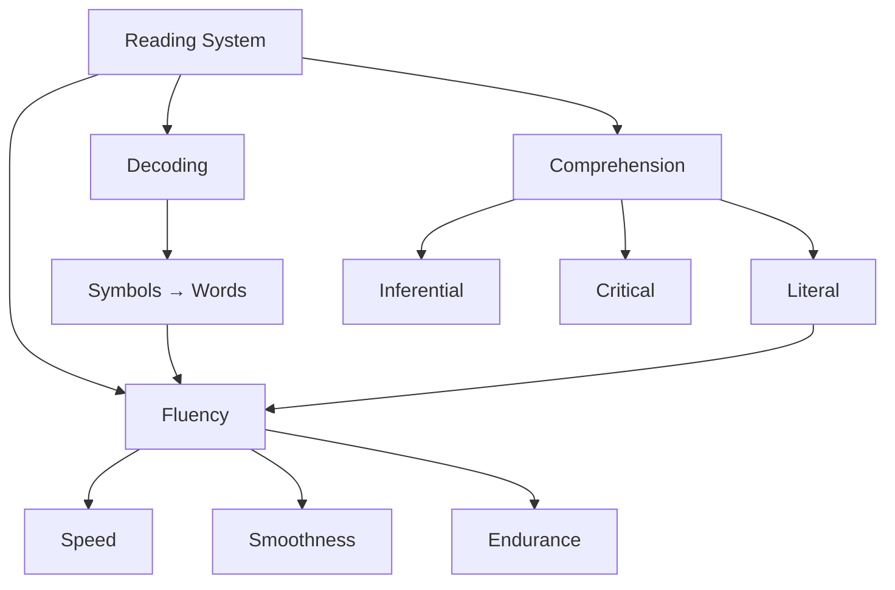

# Learning to Read Again

## Description

You are standing at the entrance to a dungeon that every other adventurer passed through years ago. The skill that was supposed to be automatic — reading — is either absent, broken, or so rusted from disuse that it barely functions. This document does not teach you to read. It explains what happened to your reading, why it faded, and how to rebuild it from the ground up so that the rest of DevBook becomes reachable. The English subject provides the actual instruction. This document provides the map back.

## Prerequisites

- [Why Foundations Matter](../why-foundations-matter.md) — the philosophical grounding for why these skills are prerequisites, not luxuries

## Table of Contents

- [The Quest: What You Are Rebuilding](#the-quest-what-you-are-rebuilding)
- [The Three Pillars of Reading](#the-three-pillars-of-reading)
- [Why Reading Atrophies](#why-reading-atrophies)
- [The Developer's Reading Problem](#the-developers-reading-problem)
- [The Rebuilding Protocol](#the-rebuilding-protocol)
- [Active Reading Techniques](#active-reading-techniques)
- [Reading Technical Text](#reading-technical-text)
- [The Connection to the English Subject](#the-connection-to-the-english-subject)
- [Walkthrough: Rebuilding in Practice](#walkthrough-rebuilding-in-practice)
- [When Progress Stalls](#when-progress-stalls)
- [The Milestone: What Fluency Looks Like](#the-milestone-what-fluency-looks-like)
- [Learning Tips](#learning-tips)
- [Glossary](#glossary)
- [Quick References](#quick-references)
- [Next Steps](#next-steps)

---

## The Quest: What You Are Rebuilding

In every role-playing game, there is a moment when the character discovers that a skill they once possessed has degraded. The sword feels heavier. The spells take longer to cast. The map, once vivid in memory, has faded to vague shapes and approximations. The player has not lost the skill entirely — the muscle memory is still there, buried beneath layers of disuse — but it no longer fires automatically. It requires conscious effort, deliberate practice, and patience.

Reading is that kind of skill. It is not binary — present or absent, functional or broken. It exists on a spectrum, and the point on that spectrum where most struggling readers find themselves is not illiteracy. It is something more subtle and more frustrating: the ability to decode words without comprehending them, the ability to follow simple sentences but lose the thread in complex ones, the ability to read for five minutes before focus dissolves into static.

If this is where you stand, you are not illiterate. You are dysfluent. And dysfluency is not a permanent condition. It is a temporary state that responds to structured, patient, deliberate practice.

This document is the companion for that practice. It does not contain reading exercises — those live in the English subject, linked at the end of this document. What it contains is understanding: an explanation of what reading actually is, why it degraded, and how to approach its restoration with the strategic patience that real skill-building requires.

The quest is not to become a speed reader. The quest is not to read a book a week. The quest is to reach the point where you can open a technical document, read it with comprehension, and extract what you need from it. That is the threshold. Everything beyond it is refinement.

## The Three Pillars of Reading

Reading is not a single skill. It is a system of three distinct competencies that operate simultaneously and reinforce each other. When any one of them degrades, the entire system feels broken — even if the other two are intact.

### Pillar 1: Decoding

Decoding is the mechanical act of translating written symbols into language. It is the process by which the marks on a page — or the pixels on a screen — become sounds in the mind, and those sounds become words, and those words become recognizable units of meaning.

Decoding is the foundation. Without it, the other two pillars cannot function. A person who cannot decode is functionally locked out of written language entirely. But decoding alone is not reading. A person who can decode every word in a paragraph but cannot determine what the paragraph means is not reading — they are performing a vocalization exercise.

For most adults, decoding is either functional or it is not. If you can sound out words, even slowly, your decoding is operational. The problem, if there is one, lies elsewhere.

### Pillar 2: Comprehension

Comprehension is the extraction of meaning from decoded text. It is the process by which recognized words become ideas, relationships, arguments, and narratives in the mind. Comprehension operates at multiple levels simultaneously:

- **Literal comprehension** — understanding what the text explicitly states
- **Inferential comprehension** — understanding what the text implies but does not state
- **Critical comprehension** — evaluating the text's claims, assumptions, and quality

Most struggling readers have adequate literal comprehension but weak inferential and critical comprehension. They can tell you what a paragraph says. They cannot tell you what it means, why it matters, or whether it is true. This is the gap that makes technical reading feel impenetrable — technical documents are dense with inference and assumption, and the reader who cannot navigate those layers will drown in even simple documentation.

### Pillar 3: Fluency

Fluency is the speed and smoothness with which decoding and comprehension operate together. A fluent reader does not pause at every word, does not need to re-read sentences multiple times, and does not lose the thread of an argument because the cognitive load of decoding consumed the resources needed for comprehension.

Fluency is what makes reading feel effortless. It is also what makes reading feel possible for extended periods. A person with adequate decoding and comprehension but poor fluency can read a paragraph but cannot read a page. They can understand a single idea but cannot hold a chain of reasoning in their mind long enough to follow an argument. The effort of reading exhausts them before the content has delivered its value.

Fluency is not innate. It is built through volume. The only way to become a fluent reader is to read —大量地, persistently, and with material that is within reach but slightly beyond current comfort.



The three pillars are interdependent. Decoding supports comprehension. Comprehension motivates continued reading. Continued reading builds fluency. Fluency reduces the cognitive cost of decoding, freeing resources for deeper comprehension. The cycle is virtuous when all three pillars are strong, and vicious when any one of them weakens.

## Why Reading Atrophies

Skills degrade through disuse. This is not a moral failing. It is neuroscience.

### The Use-It-or-Lose-It Principle

The human brain maintains neural pathways based on frequency of activation. Skills that are practiced regularly are reinforced — the neural connections strengthen, the pathways become more efficient, the cognitive processes become more automatic. Skills that are not practiced are pruned. The brain, operating on principles of metabolic efficiency, does not maintain infrastructure that is not being used.

This is the mechanism behind the phenomenon colloquially known as "use it or lose it." It applies to physical skills — a pianist who stops practicing loses dexterity. It applies to cognitive skills — a mathematician who stops computing loses fluency with numbers. And it applies to reading.

The neuroscience is straightforward. Reading activates a network of brain regions: the visual cortex for processing written symbols, the left temporoparietal cortex for phonological processing, the left occipitotemporal cortex for word recognition, and the prefrontal cortex for comprehension and executive control. When reading is practiced, these regions develop efficient connections — white matter tracts that allow rapid communication between them. When reading ceases, those connections weaken.

### The Asymmetry of Decay

The critical insight is that different components of reading decay at different rates. Fluency degrades fastest. A person who stops reading for a year will notice significant fluency loss within weeks of resuming. Comprehension degrades more slowly but more insidiously — the reader may not realize they have lost inferential and critical comprehension until they encounter a complex text and find themselves unable to follow the argument. Decoding, being the most mechanical component, is the most resilient — but even decoding can degrade to the point where the reader must consciously sound out words that were once automatic.

The practical consequence of this asymmetry is that the rebuilding process must address all three pillars, but it must begin with the one that has degraded the most: fluency. The reader who cannot read smoothly cannot read enough to rebuild comprehension. The reader who cannot decode quickly enough will never reach fluency. The sequence matters.

### Why Modern Life Accelerates Atrophy

Several features of contemporary life conspire to accelerate reading atrophy:

- **Screen-based information consumption** — social media, video, podcasts, and short-form content provide information without requiring sustained reading. The brain adapts to the medium it uses most.
- **Notification culture** — the constant interruption of digital devices fragments attention into units too short for sustained reading. The average attention span on a screen has decreased measurably over the past two decades.
- **Autocomplete and predictive text** — these tools reduce the need to spell, to construct sentences, and to hold linguistic patterns in working memory.
- **Search engine dependency** — the ability to find an answer instantly reduces the motivation to read deeply enough to understand it.

None of these forces are inherently malicious. They are the natural consequences of technologies designed for convenience operating on a brain designed for adaptation. But the cumulative effect is a population that reads less, reads more shallowly, and reads with less endurance than any previous generation.

## The Developer's Reading Problem

The developer who cannot read fluently faces a problem that is qualitatively different from the problem faced by a non-developer in the same condition. The developer's entire professional existence depends on reading.

### The Reading Load of Software Development

Consider the daily reading demands of a software developer:

| Task | Reading Type | Complexity |
|------|-------------|------------|
| Reading error messages | Pattern matching + inference | High — errors are terse, context-dependent, and often misleading |
| Reading documentation | Sustained comprehension | High — technical prose is dense with domain-specific terminology |
| Reading code | Syntactic + semantic parsing | Very high — code is a formal language with implicit context |
| Reading specifications | Critical comprehension | Very high — specifications contain ambiguity, contradiction, and omission |
| Reading commit messages | Literal comprehension | Low to medium — depends on the author's discipline |
| Reading code reviews | Inferential + critical comprehension | High — reviews contain implicit assumptions about design intent |

The developer who cannot sustain reading for more than a few minutes will struggle with every one of these tasks. The developer who can decode but not comprehend will read documentation and retain nothing. The developer who lacks fluency will spend so much cognitive energy on the mechanics of reading that none remains for understanding.

### The Vicious Cycle

This creates a vicious cycle that is specific to the developer's context. The developer who struggles to read avoids reading. Avoiding reading means relying on copying code from Stack Overflow, memorizing patterns without understanding them, and building software through trial and error rather than comprehension. The software works — sometimes — but the developer's understanding remains shallow. When the shallow understanding fails, the developer must read more to diagnose the problem. But reading is exactly what they cannot do. The cycle tightens.

Breaking this cycle requires rebuilding reading fluency as a deliberate practice. Not as a side effect of working harder. As a primary objective pursued with the same seriousness and structure that the developer would apply to learning a new programming language.

### The Shame Tax

There is an additional cost that developers who struggle with reading pay, and it is worth naming explicitly: the shame tax. The developer who cannot read documentation fluently believes they are the only developer with this problem. Every other developer, in their perception, reads effortlessly. The reality is that reading difficulties are widespread among developers — studies suggest that between 10% and 15% of adults have reading difficulties that affect professional performance, and the actual number is likely higher because shame prevents accurate self-reporting.

The shame tax extracts its cost in avoidance behavior. The developer avoids asking questions about documentation. The developer avoids participating in design discussions that require reading specifications. The developer avoids applying for positions that list "strong reading and writing skills" as requirements. Each avoidance narrows the developer's options and reinforces the belief that the deficiency is permanent.

It is not permanent. It is a skill deficit, and skill deficits are remediable. The rest of this document explains how.

## The Rebuilding Protocol

Rebuilding reading fluency is not an act of will. It is a structured process with phases, each building on the previous one. Attempting to skip phases is like attempting to lift a heavy weight without building基础 strength — the result is injury, not progress.

### Phase 1: Material Selection

The single most important decision in the rebuilding process is what you read. The material must satisfy two conditions simultaneously:

1. **It must be genuinely interesting to you.** Interest is not a luxury in this process — it is fuel. Without it, the reading will feel like punishment, and punishment does not produce sustained practice.
2. **It must be within reach.** The material must be readable with effort but without despair. If you must struggle with every sentence, the material is too hard. If you finish a page without having to pause and re-read anything, the material is too easy.

The optimal difficulty level is what educational psychologists call the zone of proximal development — the space between what you can do independently and what you can do with effort. For reading, this means material where approximately 95% of the words are familiar and the remaining 5% are contextually guessable.

```text
Difficulty Spectrum:

Too Easy          Sweet Spot              Too Hard
──────────────────┼───────────────────────┼──────────
Children's books  ← Your target zone →   Academic papers
News articles     Manga with text         Legal contracts
Blog posts        Technical tutorials     Specifications
```

For most developers rebuilding reading fluency, the sweet spot begins with:
- Technical blog posts on familiar topics
- Documentation for tools already in use
- Manga or graphic novels (the visual context supports comprehension)
- News articles about technology
- Well-written README files

### Phase 2: Volume Building

Fluency is built through volume. There is no shortcut. The brain rewires itself through repetition, and repetition requires quantity. The goal in this phase is not comprehension — it is exposure. You are rebuilding the neural pathways that sustained reading requires, and those pathways respond to frequency.

The protocol is simple:

1. **Set a timer for 15 minutes.** Not 30. Not an hour. Fifteen.
2. **Read.** Do not stop to look up words. Do not stop to re-read sentences. Do not worry about comprehension. Just read.
3. **When the timer sounds, stop.** Close the book, close the tab, close the document.
4. **Record what you read and for how long.** A simple log — a line in a text file, a check mark on a calendar. The record matters more than the reading itself, because the record is evidence.
5. **Repeat daily.** Every day. No exceptions. The consistency matters more than the duration.

After one week, increase the timer to 20 minutes. After two weeks, 25. After a month, 30. The ceiling is 45 minutes — beyond that, fatigue degrades the quality of practice and the risk of negative association increases.

The critical rule: **never read past the point where frustration overwhelms interest.** If you reach a point where you want to throw the book across the room, you have gone far enough for today. Stop. Return tomorrow. The frustration is a signal that the neural pathways are being challenged — which is good — but overwhelming frustration is a signal that the challenge exceeds current capacity — which is counterproductive.

### Phase 3: Comprehension Training

Once reading for 20-30 minutes feels sustainable without exhaustion, the focus shifts from volume to comprehension. This is where active reading techniques become essential. The reader begins not merely to read words but to extract, retain, and evaluate meaning.

Phase 3 introduces the techniques described in detail in the next section. The transition is not abrupt — comprehension training begins gently, with simple strategies, and deepens as the reader's capacity grows.

### Phase 4: Technical Integration

The final phase brings reading fluency into the developer's professional context. This means reading documentation with comprehension, following technical arguments in specifications, parsing error messages for diagnostic value, and engaging with code as a text to be read rather than a puzzle to be decoded.

This phase connects directly to the English subject's module on reading technical texts, which provides the specific skills and workflows for professional reading. The foundation built in Phases 1 through 3 is what makes that module accessible.

## Active Reading Techniques

Active reading is the practice of engaging with text as a participant rather than a spectator. Passive reading is the act of moving your eyes across words. Active reading is the act of interrogating, annotating, summarizing, and questioning the text as you go.

### The Annotation Method

Annotation is the practice of marking text as you read — underlining key sentences, writing questions in margins, drawing connections between ideas, and flagging passages that are unclear. It transforms reading from a unidirectional flow (text → reader) into a dialogue (text ↔ reader).

The annotation protocol:

1. **Read a paragraph.** Do not move to the next paragraph until you have processed this one.
2. **In one sentence, state what the paragraph claims.** This can be written in a margin, on a notecard, or in a separate document. The medium does not matter. The act of formulation matters.
3. **Mark anything unclear with a question mark.** Do not stop to resolve the confusion. Flag it and move on. The confusion may resolve itself as later paragraphs provide context.
4. **Mark anything surprising with an exclamation point.** Surprise indicates a gap between what you expected and what the text states. These gaps are where learning occurs.
5. **At the end of the section, write a one-paragraph summary.** This forces the compression of distributed information into a coherent whole — a cognitive act that dramatically improves retention.

### The SQ3R Method

SQ3R is a structured reading method developed by Francis Robinson in 1946. It remains one of the most evidence-supported approaches to reading comprehension. The acronym stands for:

| Step | Action | Purpose |
|------|--------|---------|
| **Survey** | Skim headings, subheadings, bold text, and summaries before reading | Creates a mental scaffold for new information |
| **Question** | Convert each heading into a question | Converts passive reception into active seeking |
| **Read** | Read with the specific goal of answering the question | Focuses attention on relevant information |
| **Recite** | Without looking at the text, state the answer in your own words | Tests comprehension and identifies gaps |
| **Review** | After completing the section, revisit all questions and answers | Consolidates learning and identifies remaining gaps |

The SQ3R method is particularly effective for technical text because it imposes structure on material that is often presented without obvious narrative flow. Documentation, specifications, and academic papers do not tell stories — they present information in hierarchical structures that the reader must navigate deliberately.

### The Summary Ladder

The summary ladder is a technique for building comprehension depth through progressive compression:

1. **Read the full text.** Mark key ideas as you go.
2. **Write a one-page summary.** Capture every important idea, but in compressed form.
3. **Write a one-paragraph summary.** Reduce the page to its essential claims.
4. **Write a one-sentence summary.** Reduce the paragraph to its core thesis.
5. **Write a one-word summary.** Reduce the sentence to its subject.

This progression forces increasingly selective attention — the reader must distinguish between what is important and what is merely present. The ability to make this distinction is the foundation of critical comprehension, and it is the skill that separates the reader who understands from the reader who merely decodes.

### The Self-Explanation Protocol

Self-explanation is the practice of reading a passage and then explaining it aloud or in writing, as if teaching it to someone else. Research consistently shows that self-explanation is one of the most powerful comprehension-building techniques available.

The protocol:

1. Read a passage.
2. Pause. Close the text.
3. Explain what the passage said, in your own words, to an imaginary listener.
4. If you cannot explain it, re-read and try again.
5. If you still cannot explain it, mark the passage and move on.

The self-explanation protocol works because it exposes gaps that silent reading conceals. When you read silently, the illusion of comprehension is easy to maintain — the words pass before your eyes and the mind generates a vague sense of understanding. Self-explanation destroys that illusion by requiring the generation of language that the text did not provide. If you can explain it, you understand it. If you cannot, you do not yet — and knowing that you do not yet understand is itself a form of understanding.

## Reading Technical Text

Technical text is different from narrative text. It does not tell a story. It does not build toward a climax. It does not reward linear reading in the same way that fiction or journalism does. The reader who approaches a technical document the way they approach a novel will struggle — not because the document is harder, but because it requires a different strategy.

### Skimming for Structure

Before reading a technical document in depth, skim it for structure. The goal of skimming is not comprehension — it is orientation. You are building a map of the document before you walk through it.

The skimming protocol:

1. **Read the title and abstract.** What is this document about? What question does it address?
2. **Read all headings and subheadings.** What is the document's structure? What topics does it cover, and in what order?
3. **Read the introduction and conclusion.** What is the author's main claim? What is the final synthesis?
4. **Scan for visual elements.** Diagrams, code blocks, tables, and figures often contain the most information-dense content.
5. **Note the references.** What sources does the author rely on? What prior work does this document build upon?

After skimming, you should be able to answer three questions: What is this document trying to say? Why does it matter? How is it organized? If you can answer these three questions, you have sufficient orientation to read deeply.

### Deep Reading for Understanding

Deep reading follows skimming. It is the careful, sequential reading of the document with the structure already in mind. The skimming provided the map — deep reading walks the territory.

The deep reading protocol:

1. **Read one section at a time.** Do not skip ahead. Do not read the conclusion before you have read the body.
2. **After each section, paraphrase it.** What did this section add to the argument? How does it connect to the previous section?
3. **Identify the evidence.** What supports the claims being made? Is the evidence empirical, logical, anecdotal, or absent?
4. **Identify the assumptions.** What does the author take for granted? What must be true for the argument to hold?
5. **Identify the gaps.** What has the author not addressed? What questions remain unanswered?

### Reading Documentation

Documentation deserves special attention because it is the most common form of technical text that developers encounter daily. Documentation reading requires a specific strategy because documentation is structured differently from essays or papers.

Documentation follows a reference pattern rather than a narrative pattern. Each section is designed to be read independently — you do not need to read the introduction to understand the API reference. This means the reader should:

1. **Start with the example, not the explanation.** Most well-written documentation leads with a working example. The example provides a concrete anchor for the abstract explanation that follows.
2. **Read the parameters, not the prose.** Parameter tables are the most information-dense part of API documentation. They tell you exactly what the function accepts and returns.
3. **Look for the gotchas.** Documentation often buries important warnings in "Note:" or "Warning:" callouts. These are the places where the author's experience diverges from the reader's expectations.
4. **Verify with code.** The fastest way to confirm comprehension of documentation is to write the code it describes and observe whether it behaves as the documentation claims.

## The Connection to the English Subject

This document narrates the experience of rebuilding reading fluency. It does not teach reading. The actual instruction — grammar, mechanics, vocabulary, composition — lives in the English subject.

The relationship between this document and the English subject is the relationship between a map and a territory. This document provides the map: where you are, why you are here, what the terrain looks like, and which direction to walk. The English subject is the territory: the actual ground, the actual obstacles, the actual skills.

The specific module most relevant to the reader of this document is [Reading Technical Texts](../../english/reading-technical-texts/index.md), which provides structured instruction in reading academic papers, RFCs, specifications, and documentation critically and efficiently. The skills taught there — annotation, critical evaluation, source assessment, and note-taking — are the advanced techniques that this document's active reading strategies prepare you for.

The [English subject as a whole](../../english/index.md) provides the broader context: grammar and style for writing clearly, technical writing for producing documentation, and linguistics for understanding how language itself works. As reading fluency develops, these subjects become accessible and valuable. They are not prerequisites for this document — they are destinations that this document's rebuilding process makes reachable.

The principle is the same one that governs the rest of the level-up foundations: the narrative points, the linked content teaches, and the practice transforms.

## Walkthrough: Rebuilding in Practice

The following walkthrough illustrates how the rebuilding process might unfold for a concrete case. The details are fictional; the pattern is representative.

### The Reader

Marcus is a self-taught developer who has been working for three years. He writes Python scripts for data processing at a small company. He can read simple code and follow basic documentation. He cannot read academic papers, specifications, or dense technical blog posts. When he tries, he loses focus within a paragraph and must re-read the same sentence three or four times before giving up. He believes he has a learning disability.

Marcus does not have a learning disability. He has dysfluent reading skills — the product of a childhood in which reading was never practiced for pleasure, a school system that passed him through without addressing the gap, and a professional life that rewarded memorization over comprehension.

### The Approach

Marcus begins with Phase 1. He identifies material that is genuinely interesting: blog posts about machine learning, a topic he encounters daily but does not understand deeply. He finds a blog post on neural networks that is 2,000 words long — too long for his current endurance, but well-written and engaging.

He sets a timer for 15 minutes. He reads. He gets through approximately 400 words before the timer sounds. He records this in a text file: "Tuesday, March 3 — 15 minutes — 400 words — neural network blog post."

He repeats this every day for a week. By Friday, he is reading 500 words in 15 minutes. By the end of the second week, 600 words. The improvement is incremental and visible in the log.

### The Transition

After three weeks, Marcus increases the timer to 20 minutes. He is now reading approximately 800 words per session. He introduces the annotation method: after each paragraph, he writes a one-sentence summary in the margin of a printed copy. The summaries are clumsy at first — vague, incomplete, sometimes wrong. But they improve. By the end of the fourth week, his summaries capture the main idea of most paragraphs accurately.

He introduces the self-explanation protocol. After reading a section, he closes the tab and explains what he read to his cat. The cat is indifferent, but the practice reveals that Marcus's comprehension is shallower than he believed — he can recall that a paragraph discussed backpropagation, but he cannot explain what backpropagation does or why it matters.

This discovery is not discouraging. It is diagnostic. It tells him exactly where his comprehension breaks down, and that is information he can work with.

### The Integration

After two months, Marcus can read 2,000-word technical blog posts in a single sitting with adequate comprehension. He is not fast. He is not elegant. But he is functional. He has reached the threshold where the English subject's reading technical texts module becomes accessible and valuable.

He follows the link. He begins learning structured approaches to reading documentation, evaluating sources, and taking notes. The skills he built through deliberate practice are now refined through formal instruction. The cycle — narrative, link, practice, return — is working.

## When Progress Stalls

Progress in reading rebuilding is not linear. There will be plateaus — periods of days or weeks where the numbers in your log do not improve, where the comprehension feels no deeper, where the frustration whispers that this is not working.

The plateau is not evidence of failure. It is evidence that the brain is consolidating gains. Neuroscience research on skill acquisition consistently shows that learning follows a stepped pattern — periods of rapid improvement alternating with periods of apparent stalling. During the stalls, the brain is not idle. It is integrating new neural connections, strengthening existing pathways, and automating processes that were previously effortful.

### What to Do During a Plateau

1. **Do not increase the difficulty.** The temptation during a plateau is to push harder — read more complex material, read for longer sessions. This is counterproductive. The plateau is a signal that the current level needs consolidation, not escalation.
2. **Maintain the schedule.** The most important thing you can do during a plateau is to not stop. Continue reading at the same level, at the same duration, on the same schedule. Consistency during the plateau is what allows the consolidation to complete.
3. **Vary the material.** If you have been reading technical blog posts, try a chapter of a technical book. If you have been reading documentation, try a well-written README. The variation provides the brain with new contexts for the same skills, which strengthens the generalization of those skills.
4. **Review your log.** The log is the record of progress. When the present feels stagnant, the log provides the long view. Compare where you are now to where you were a month ago. The distance is the proof that the process works.

### When the Plateau Breaks

Plateaus break. The breakthrough is not dramatic — there is no sudden leap from struggling to fluent. What happens is subtler: one day you realize that you read a paragraph without re-reading it. You reach the end of a page and find that you understood what it said. You notice, with mild surprise, that you have been reading for 25 minutes without the timer sounding.

These moments are the milestones. They are the evidence that the neural pathways have strengthened, that the fluency is building, that the process is working. They do not arrive on schedule. They arrive when the consolidation is complete. Your job is to keep reading until they come.

## The Milestone: What Fluency Looks Like

The goal of this process is not perfection. It is functional fluency — the ability to read technical text with adequate comprehension, at a sustainable pace, for a useful duration. The markers of functional fluency are:

- **You can read a 3,000-word technical article in a single sitting without losing the thread of the argument.**
- **You can read documentation for a new tool and extract the information you need to use it.**
- **You can follow an error message through a stack trace and identify where the problem originates.**
- **You can read a specification well enough to implement what it describes.**
- **You can read for 30-45 minutes without the sense of cognitive exhaustion that previously forced you to stop.**

None of these markers require speed. None require reading a novel a week. They require only that the three pillars — decoding, comprehension, fluency — are strong enough to support the weight of professional reading. That is the threshold. That is what you are building toward.

When you reach it, the rest of DevBook opens. The English subject teaches you to write with the clarity you have learned to read with. The mathematics subject teaches you to compute with the reasoning you have rebuilt. The programming subject teaches you to build with the comprehension you have restored. The foundations were never the destination. They were the bridge. And you are crossing it.

## Learning Tips

- **Start embarrassingly easy.** If your first reading material is a technical blog post that you find accessible, that is fine. If your first reading material is a children's book, that is also fine. The starting point does not matter. The consistency matters.
- **Read with a pencil.** Even if you do not annotate formally, the physical presence of a writing tool signals to the brain that this is an active task, not a passive one. The pencil is a commitment device.
- **Track your numbers.** Words per session, minutes per session, sessions per week. The log is not a scoreboard — it is a diagnostic tool. Without it, you cannot distinguish between a plateau and a regression.
- **Never read when exhausted.** Reading during fatigue builds negative associations with reading. If you are tired, sleep instead. The reading will be there tomorrow.
- **Use the timer religiously.** The timer protects you from two dangers: stopping too soon (because the discomfort feels unbearable) and pushing too far (because determination overrides self-awareness). The timer is the boundary that keeps practice productive.
- **Forgive yourself for re-reading.** Re-reading is not failure. Re-reading is how comprehension deepens. Every re-read is a pass through the cycle that strengthens the neural pathways. The reader who never re-reads is not more skilled — they are less thorough.
- **Celebrate the log entries.** Every entry in the log is a day you showed up. Every day you showed up is a day the pathways strengthened. The accumulation of small victories is the only kind of victory that matters in this process.

## Glossary

| Term | Definition |
|------|------------|
| Decoding | The mechanical process of translating written symbols into recognized words |
| Comprehension | The extraction of meaning from decoded text, operating at literal, inferential, and critical levels |
| Fluency | The speed, smoothness, and endurance with which reading is performed |
| Dysfluency | A temporary state of degraded reading performance that responds to structured practice |
| Zone of Proximal Development | The space between what a learner can do independently and what they can do with effort — the optimal difficulty range for skill building |
| Active Reading | Engaging with text through annotation, questioning, summarizing, and self-explanation rather than passive visual scanning |
| Annotation | The practice of marking text with notes, questions, and summaries during reading |
| SQ3R | A structured reading method: Survey, Question, Read, Recite, Review |
| Self-Explanation | The practice of explaining a passage's content in one's own words to expose comprehension gaps |
| Skimming | Reading for document structure before reading for content — building a map before walking the territory |
| Plateau | A period of apparent stalling in skill improvement during which the brain consolidates previous gains |
| Consolidation | The neurological process of strengthening and automating neural connections through rest and repetition after practice |

## Quick References

- [DevBook: English](../../english/index.md) — technical writing, documentation, and clear communication for developers
- [DevBook: Reading Technical Texts](../../english/reading-technical-texts/index.md) — structured instruction in reading papers, RFCs, specifications, and documentation critically
- [Khan Academy — Reading Foundations](https://www.khanacademy.org/ela/cc-2nd-reading-vocab) — free reading comprehension practice for foundational skills
- [National Reading Panel Report](https://www.nichd.nih.gov/publications/pubs/nrp/smallbook) — the landmark synthesis of reading research from the National Institute of Child Health and Human Development
- [How to Read a Book](https://en.wikipedia.org/wiki/How_to_Read_a_Book) — Mortimer Adler's classic on the层次s of reading, from elementary to syntopical
- [Deep Reading vs. Shallow Reading](https://www.scientificamerican.com/article/reading-on-screens/) — research on how digital reading affects comprehension and retention

## Next Steps

- [Numbers and Reasoning](numbers-and-reasoning.md) — the beginning of numerical thinking: number sense, arithmetic, and the reasoning that underlies all of mathematics
- [Touching the Keyboard](touching-the-keyboard.md) — the minimum digital competency needed to engage with DevBook: device operation, file management, terminal basics
- [DevBook: English — Reading Technical Texts](../../english/reading-technical-texts/index.md) — the structured reading skills that follow once fluency is restored
- [Why Foundations Matter](../why-foundations-matter.md) — the philosophical grounding for the journey you are on, and why starting here is not a failure but a beginning
