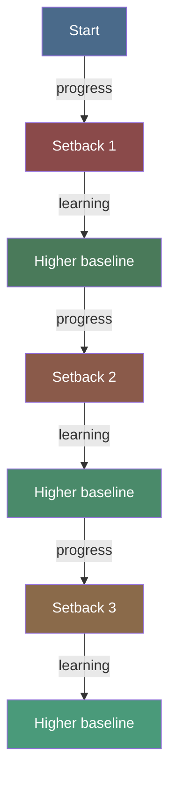

# Navigating Setbacks

## Description

You will fall back. It is not a question of if but when. This document describes what it feels like when it happens — the difference between a slip and a collapse, how the shame spiral works and how to interrupt it, what it means to treat relapse as data rather than failure, and how to build an early warning system that catches you before you hit the ground. The goal is not to avoid setbacks. The goal is to navigate them without being destroyed by them.

## Prerequisites

- [The Developer's Landscape](the-developers-landscape.md) — how the unique pressures of a developer's life shape the way setbacks manifest
- [Maintenance & Relapse Prevention](../../psychology/behavior-change/maintenance-and-relapse-prevention.md) — the academic framework behind the narrative you are about to read

## Table of Contents

- [The Fall Is Coming](#the-fall-is-coming)
- [The Moment It Happens](#the-moment-it-happens)
- [Slip vs. Collapse: The Critical Distinction](#slip-vs-collapse-the-critical-distinction)
- [Why You Will Interpret It as Failure First](#why-you-will-interpret-it-as-failure-first)
- [The Shame Spiral: Anatomy of a Backlash](#the-shame-spiral-anatomy-of-a-backlash)
- [How to Interrupt the Spiral](#how-to-interrupt-the-spiral)
- [Relapse as Data, Not Verdict](#relapse-as-data-not-verdict)
- [Reading the Data: What Each Setback Teaches You](#reading-the-data-what-each-setback-teaches-you)
- [The Concept of Failing Forward](#the-concept-of-failing-forward)
- [Building an Early Warning System](#building-an-early-warning-system)
- [When to Ask for Help](#when-to-ask-for-help)
- [The Lie of Starting Over](#the-lie-of-starting-over)
- [What Progress Looks Like After a Setback](#what-progress-looks-like-after-a-setback)
- [The Long View: Setbacks in the Arc of the Journey](#the-long-view-setbacks-in-the-arc-of-the-journey)
- [Walkthrough: Elena Navigates a Setback](#walkthrough-elena-navigates-a-setback)
- [Learning Tips](#learning-tips)
- [Glossary](#glossary)
- [Quick References](#quick-references)
- [Next Steps](#next-steps)

## Content / Material

### The Fall Is Coming

Here is the truth that no one wants to tell you at the beginning of the journey: you will not stay changed.

You will make progress. You will build awareness. You will develop agency. You will take action. You will feel like you are finally moving in the right direction. And then something will happen — a trigger, a crisis, a slow erosion — and you will find yourself back in the territory you thought you had left behind.

This is not a sign that you are doing it wrong. It is a sign that you are doing it right.

The people who stay changed are not the ones who never fall. They are the ones who learn how to get back up. The difference between someone who transforms permanently and someone who cycles forever is not the absence of setbacks. It is the relationship to setbacks.

```python
def trajectory(has_setbacks, relationship_to_setbacks):
    if not has_setbacks:
        return "Either never started or not being honest"
    if relationship_to_setbacks == "shame":
        return "Cycling without growth"
    if relationship_to_setbacks == "learning":
        return "Cycling with deepening"
    return "Insufficient data"
```

You will fall back. Plan for it. Not with pessimism — with readiness. The ship that carries lifeboats is not expecting to sink. It is being prepared for the possibility so that when the storm comes, the preparation determines the outcome.

The fall is coming. The only question is how you will meet it.

### The Moment It Happens

You will not see it coming. That is the first thing to understand about setbacks. They arrive disguised as ordinary moments.

You have been doing well. Your habits are solid. Your systems are running. You have been feeling good — not euphoric, but stable. You have started to believe, quietly and cautiously, that maybe this time it is different. Maybe you have really changed.

And then something happens. It might be small. A stressful meeting. A bad night of sleep. An email that triggers old feelings. A conversation that reopens a wound you thought had healed. You reach for the old pattern before you even realize what you are doing. And by the time you notice, it is already done.

```python
def setback_moment():
    import random
    triggers = [
        "an email that activates imposter syndrome",
        "a sleepless night that lowers inhibition",
        "a meeting where your contribution was dismissed",
        "a reminder of a failure you thought you had processed",
        "a success that triggers the fear of being exposed",
        "a conversation with someone who triggers old dynamics",
        "a period of unstructured time that invites drift"
    ]
    return f"It started with {random.choice(triggers)}"
```

The moment itself is unremarkable. You will probably not recognize it as a setback until later, when you are already in the spiral. In the moment, it feels like the only choice. It feels like you were pushed. It feels like the change was never real and you were just pretending.

That last feeling is the most dangerous one. It is the voice that says the progress was illusory, that the real you is the old you, that transformation is for other people. That voice is wrong. But in the moment, it sounds like truth.

### Slip vs. Collapse: The Critical Distinction

The most important concept in navigating setbacks is the difference between a slip and a collapse. The entire trajectory of your recovery depends on understanding this distinction.

A slip is a single return to an old behavior. You acted on the old pattern once. You had one drink. You skipped one workout. You worked late one night. You said one thing you regret. The slip is bounded in time and scope. It happened. It is over. The question is what happens next.

A collapse is the full return to the previous state. It is weeks or months of the old pattern. It is the abandonment of the change process. It is the decision — explicit or implicit — that the change was not real and you are back where you started.

The critical insight is this: between the slip and the collapse lies a window of interpretation. What you tell yourself about the slip determines whether it becomes a collapse or remains a slip.

```python
def slip_vs_collapse(slip_event, interpretation):
    if interpretation == "I have failed completely":
        return "Collapse: abandonment of change process"
    if interpretation == "I made a mistake, what can I learn?":
        return "Slip: data point in ongoing process"
    if interpretation == "This proves it was never real":
        return "Collapse: self-fulfilling prophecy"
```

The academic literature in the Transtheoretical Model calls this the Abstinence Violation Effect. When you break a commitment to yourself, you experience cognitive dissonance. The dissonance can be resolved in one of two ways: by recommitting to the change, or by deciding that the change was impossible and giving up. The second path is the Abstinence Violation Effect. It is the engine of the collapse.

You will experience this effect. It is not a character flaw. It is a predictable cognitive response to violating a self-imposed rule. Knowing that it exists gives you the power to recognize it when it happens and to choose the other path.

### Why You Will Interpret It as Failure First

Your brain has a default setting when it comes to setbacks: it interprets them as verdicts on your worth.

This setting was not chosen. It was installed through years of conditioning. You learned, somewhere along the way, that mistakes are not just mistakes — they are evidence of your inadequacy. A slip is not a slip. It is proof that you are not good enough, not strong enough, not disciplined enough.

```python
def default_interpretation(slip_context):
    interpretations = {
        "I broke my streak": "I am undisciplined",
        "I acted on the old pattern": "I have not really changed",
        "I knew better and did it anyway": "I am fundamentally broken",
        "Everyone else seems to manage": "Something is wrong with me"
    }
    return interpretations.get(slip_context, "This is evidence of my failure")
```

This default interpretation is not true. But it feels true. That is what makes it so dangerous. A thought that feels true does not need evidence. It bypasses the critical mind and lands directly in the emotional center. By the time you realize you are thinking it, you already believe it.

The default interpretation exists because it is familiar. Your brain prefers familiar patterns over accurate ones. The story of your failure is a well-worn path. The story of learning from a mistake is a new trail through dense forest. The brain will take the well-worn path every time unless you deliberately intervene.

This is not your fault. It is your biology. But it is your responsibility to intervene.

The intervention starts with recognizing that the default interpretation has occurred. You cannot stop the first thought. You can stop the second thought, and the third, and the action that follows. The first thought is automatic. Everything after that is choice.

### The Shame Spiral: Anatomy of a Backlash

The shame spiral is a specific sequence of events that turns a manageable slip into a devastating collapse. Understanding its structure is the first step to interrupting it.

**Stage 1: The Trigger.** Something happens. A stressful event, an old pattern, a moment of weakness. You act on the old behavior. The trigger itself is often mundane — a bad day at work, an argument, a moment of exhaustion.

**Stage 2: The Breach.** You recognize that you have violated your commitment. The gap between who you want to be and what you just did opens. This gap is uncomfortable. It demands resolution.

**Stage 3: The Interpretation.** This is the critical fork. Your brain offers its default interpretation: "This proves I am a failure." The interpretation feels true. You accept it without examination.

**Stage 4: The Shame.** The interpretation generates shame — not guilt about what you did, but shame about who you are. Guilt says "I did something bad." Shame says "I am bad." Shame is global, not specific. It attacks your identity at the root.

```python
class ShameSpiral:
    def __init__(self):
        self.stages = ["trigger", "breach", "interpretation", "shame", "abandonment", "deepening"]
        self.current = None
    
    def advance(self):
        if self.current is None:
            self.current = "trigger"
        else:
            idx = self.stages.index(self.current)
            if idx < len(self.stages) - 1:
                self.current = self.stages[idx + 1]
        
        if self.current == "shame":
            return "You are not just someone who slipped. You ARE the slip."
        if self.current == "abandonment":
            return "Since the change is not real, there is no point continuing."
        if self.current == "deepening":
            return "The old pattern returns fully. The evidence is now overwhelming."
        return f"Stage: {self.current}"
```

**Stage 5: The Abandonment.** Shame leads to abandonment. If you are fundamentally flawed, what is the point of trying? You stop the change process. You stop the daily practices. You stop reaching out. You stop trying. The abandonment is not a decision you make. It is a conclusion that follows naturally from the interpretation.

**Stage 6: The Deepening.** Without the change process, the old pattern reasserts itself fully. Days become weeks. Weeks become months. The absence of effort produces the evidence that confirms the original interpretation: "See, I really am a failure. Look at all this evidence."

The spiral is a self-fulfilling prophecy. The interpretation creates the conditions that confirm the interpretation. The only way out is to refuse the interpretation at Stage 3.

### How to Interrupt the Spiral

Interrupting the shame spiral requires intervention at specific points. You cannot stop the trigger. You cannot undo the breach. But you can intervene at every stage after that.

**Intervention at Stage 2: The Breach.** The moment you recognize the breach, name it without judgment. "I just did the old behavior." That is a fact. It is not a verdict. The fact exists. Your relationship to the fact is what determines the trajectory. Do not add "and this means I am a failure." Just the fact.

```python
def name_the_breach(behavior):
    return {
        "fact": f"I engaged in {behavior}",
        "judgment": None,
        "interpretation": "TBD"
    }
```

**Intervention at Stage 3: The Interpretation.** When the default interpretation appears — "This proves I am a failure" — do not argue with it. Arguing gives it energy. Instead, notice it. "Ah, there is the old interpretation. Hello." The distance between "I am a failure" and "I am having the thought that I am a failure" is the space where freedom lives. You cannot stop having the thought. But you can stop believing it.

**Intervention at Stage 4: The Shame.** Shame thrives in isolation and silence. The fastest way to break its grip is to speak it aloud. Tell someone: "I slipped and now I am spiraling into shame." The act of speaking breaks the isolation. The shame, exposed to the light of another person's nonjudgmental attention, cannot survive.

**Intervention at Stage 5: The Abandonment.** Do not try to fix everything. Just take one small action that keeps the change process alive. Write one sentence in your journal. Do one rep of the habit you are trying to build. Send one message to your accountability partner. The action does not need to be significant. It just needs to exist. One action proves that the abandonment is not complete. The process is still running, even at the lowest possible RPM.

```python
def interrupt_spiral(stage):
    interventions = {
        "breach": "Name it without judgment. Just the fact.",
        "interpretation": "Notice the thought. Do not argue. Do not believe.",
        "shame": "Speak it aloud to someone who will not judge.",
        "abandonment": "One micro-action. Keep the engine running.",
        "deepening": "Return to the smallest possible commitment."
    }
    return interventions.get(stage, "Return to the breath. You are still here.")
```

**Intervention at Stage 6: The Deepening.** If you have already abandoned the process and the old pattern has deepened, the intervention is the same as starting over — except you are not starting over. You are continuing from a setback. The work you did before is not lost. It is temporarily inaccessible. The neural pathways you built are still there. They are just overgrown. The second time you build them, they grow faster.

The spiral can be interrupted at any point. Even at Stage 6, you can choose to take one action. The spiral is powerful, but it is not all-powerful. It requires your cooperation. You can withdraw your cooperation at any moment.

### Relapse as Data, Not Verdict

The shift from interpreting relapse as a verdict to interpreting it as data is the single most important cognitive reframe in the level-up journey.

A verdict is final. It closes the case. It says: "The defendant is guilty. There is nothing more to discuss." When you interpret relapse as a verdict, the story is over. You failed. The change was not real. You are back where you started.

Data is not final. Data is information. It says: "Here is what happened. Here are the conditions that produced this outcome. What can we learn?" When you interpret relapse as data, the story continues. You are not at the end of the journey. You are at a point of learning.

```python
def reframe(setback):
    as_verdict = {
        "meaning": "I have failed permanently",
        "emotion": "shame and despair",
        "action": "abandon the change process",
        "outcome": "confirmed failure"
    }
    as_data = {
        "meaning": "The system has a weak point",
        "emotion": "curiosity and determination",
        "action": "investigate and reinforce",
        "outcome": "stronger system"
    }
    return {"verdict": as_verdict, "data": as_data}
```

The data perspective is not natural. It must be practiced. Every time you catch yourself interpreting a setback as a verdict, stop and ask three questions:

1. "What were the conditions that led to the setback?" Not who is to blame. What conditions. The environment, the context, the triggers, the state you were in. These are the inputs to the system.

2. "What was the earliest point at which I could have chosen differently?" Not to blame yourself for missing it. To learn where the next intervention should be placed. The answer tells you where your early warning system is weak.

3. "What does this tell me about the next attempt?" The setback is not the end of the attempt. It is part of the attempt. You are still in the process. The data tells you what to adjust.

The developer mind is well-suited to this reframe. You treat bugs as information. A test failure is not a verdict on your worth as a programmer. It is data about the system. Treating a personal setback the same way applies the same skill to a different domain. The skill is already in you. You just need to point it in the right direction.

### Reading the Data: What Each Setback Teaches You

Setbacks are not all the same. Different kinds of setbacks teach different things. Learning to read the data means learning to distinguish between them.

**The environmental setback.** You relapsed because your environment was set up for the old behavior. The snack was in the cupboard. The notifications were on. The Slack channels were active. The people were available. This setback teaches you that your environment design is insufficient. The fix is structural: change the environment, remove the triggers, add friction to the old behavior.

```python
def classify_setback(setback_conditions):
    if "'environment'" in setback_conditions:
        return {"type": "environmental", "lesson": "Design the surroundings, not just the willpower"}
    if "'capacity'" in setback_conditions:
        return {"type": "capacity", "lesson": "You are trying to do too much too fast"}
    if "'trigger'" in setback_conditions:
        return {"type": "trigger", "lesson": "There is a specific stimulus you have not accounted for"}
    if "'identity'" in setback_conditions:
        return {"type": "identity", "lesson": "You still see yourself as the old person"}
    return {"type": "complex", "lesson": "Multiple factors at play"}
```

**The capacity setback.** You relapsed because you were trying to maintain more change than you have energy for. The new habits stacked up. The demands exceeded your capacity. This setback teaches you that you are overextended. The fix is to reduce the scope of change or increase your recovery capacity (sleep, rest, support).

**The trigger setback.** You relapsed because a specific stimulus activated the old pattern. A person, a place, a time of year, an emotional state. This setback teaches you that there is a trigger you have not identified or have not prepared for. The fix is to develop a specific plan for that trigger: avoidance where possible, response protocol where avoidance is not possible.

**The identity setback.** You relapsed because you still see yourself as the person who does the old behavior. At the deepest level, your identity has not shifted. The change is still a behavior you perform, not a person you are. This setback teaches you that the identity work is incomplete. The fix is not more behavioral change — it is narrative change. You need to rewrite the story of who you are.

**The fatigue setback.** You relapsed because you were tired, depleted, and under-resourced. This is the most common type of setback. It teaches you that your change process does not account for low-resource states. The fix is to design for your worst days, not your best. What does maintaining the change look like when you have had four hours of sleep and a terrible day?

Every setback is a diagnostic. The question is not "Did I fail?" but "What did I learn about my system?"

### The Concept of Failing Forward

Failing forward is not a platitude. It is a specific principle: every setback is an investment in future success, provided you extract the learning and apply it.

The concept has a concrete mechanism behind it. Each time you navigate a setback successfully — each time you turn a potential collapse into a slip — you build something that cannot be built any other way. You develop setback-specific skills. You build resistance to that particular trigger. Your confidence in your ability to handle setbacks grows.

```python
def failing_forward(setbacks):
    skills_built = []
    for setback in setbacks:
        lesson = extract_lesson(setback)
        skill = build_skill(lesson)
        skills_built.append(skill)
        confidence = len(skills_built) * 0.1
    return {
        "skills": skills_built,
        "confidence": min(1.0, confidence),
        "status": "stronger than before each setback"
    }
```

The first time you navigate a setback, it is terrifying. You do not know if you can do it. You do not know if the reframe will hold. You do not know if the spiral will stop. The experience is pure uncertainty.

The second time, it is less terrifying. You have done it before. You have evidence. You know what the reframe feels like. You know that the spiral can be interrupted.

The third time, it is almost routine. You recognize the pattern immediately. You apply the intervention without hesitation. The setback is still unpleasant, but it is no longer destabilizing.

This is what failing forward means. Each setback is not just something you survive. It is something that makes you more capable of surviving the next one. The person who has navigated ten setbacks is stronger than the person who has navigated none — not despite the setbacks but because of them.

The phrase "failing forward" captures the direction of movement. You are not failing backward to where you started. You are failing forward to a place that includes the experience of the setback and the learning from it. The trajectory over time is upward, even though it includes dips.



Failing forward is not about being grateful for setbacks. Some setbacks are genuinely damaging. Some cause real harm. But even the damaging ones can be metabolized into learning. The goal is not to avoid the damage. The goal is to ensure that no setback is wasted.

### Building an Early Warning System

The best time to interrupt a spiral is before it starts. An early warning system is a set of signals and responses that catch you before you reach the critical point.

The signals are the early indicators that a setback is approaching. They are specific to you. They are the subtle changes in thought, emotion, and behavior that precede the fall.

```python
def early_warning_signals():
    signals = {
        "thoughts": [
            "I am starting to question whether the change matters",
            "I am comparing my progress to others and feeling behind",
            "I am telling myself that one exception will not hurt",
            "I am thinking about how hard this is rather than how far I have come"
        ],
        "emotions": [
            "A low-grade irritability that has no clear source",
            "A sense of hopelessness that creeps in during quiet moments",
            "Restlessness and inability to sit still",
            "Numbness — feeling less, not more"
        ],
        "behaviors": [
            "Skipping the daily practice without rescheduling it",
            "Checking my phone more than usual",
            "Isolating from people who support me",
            "Working longer hours without a clear reason"
        ]
    }
    return signals
```

The responses are what you do when you detect the signals. They must be specific and immediate. A vague response like "I will pay more attention" is not enough. The response must be an action.

**Signal detected: "I am starting to question whether the change matters."** Response: Re-read your journal from the early days. Revisit the reasons you started. Reconnect with the pain that made the change necessary.

**Signal detected: "I skipped the daily practice."** Response: Do not wait until tomorrow. Do the smallest possible version of the practice right now. One minute of the practice is better than zero.

**Signal detected: "I am isolating from my support people."** Response: Send a message to one person. It does not need to be deep. "Thinking of you" is enough. The act of reaching out breaks the isolation pattern.

**Signal detected: "I am telling myself one exception will not hurt."** Response: This is the most dangerous signal. Immediately name it: "This is the permission-giving thought that precedes a collapse." Then recommit to the boundary. One exception may not hurt. But the permission to make one exception is the door that leads to all exceptions.

```python
def early_warning_response(signal):
    responses = {
        "questioning_change": "Revisit your reasons. Read your early journal.",
        "skipped_practice": "Do one minute now. Do not wait.",
        "isolating": "Reach out to one person. Any message.",
        "permission_giving": "Name the thought. Recommit to the boundary."
    }
    return responses.get(signal, "Pause. Breathe. Ask: what would keep me on track right now?")
```

Building the early warning system requires knowing yourself. It requires paying attention to the subtle shifts that precede the major falls. The system is built through experience. Every setback teaches you something about your signals. The more setbacks you have navigated, the better your early warning system becomes.

Start by identifying your three most reliable early signals. Write them down. Write the response next to each one. Review the list every morning. When the signal appears, you will not have to think about what to do. The response is already waiting.

### When to Ask for Help

The developer mind has a default setting when it comes to problems: solve them alone. This setting is useful for debugging a production issue. It is destructive for navigating a personal setback.

The question is not whether to ask for help. The question is when. The answer is: earlier than you think you need to.

By the time you feel like you need help, you are already deep in the spiral. The shame has already isolated you. The abandonment has already begun. The intervention at that point is harder than it would have been a day earlier, when the spiral was barely starting.

```python
def ask_for_help_threshold(severity):
    thresholds = {
        "first_slip": "Ideally — help now prevents the spiral",
        "noticing_old_patterns": "Yes — this is the best time",
        "skipped_practices_multiple_days": "You should have asked yesterday",
        "feeling_hopeless": "Ask immediately. Do not wait.",
        "thinking_about_giving_up": "This is a crisis. Ask for help now."
    }
    return thresholds.get(severity, "Earlier than you think")
```

The rule of thumb: if you are wondering whether you should reach out, you should. The wondering itself is a sign that your internal system is struggling. A system that is functioning well does not wonder about reaching out. It reaches out naturally.

What does asking for help look like in practice?

**To a friend:** "I am in a setback spiral and I need to talk it out. Can I call you for ten minutes?" You do not need to explain the whole context. You do not need them to solve anything. You need them to listen while you untangle your own thinking.

**To a mentor or coach:** "I hit a setback in my journey. I am interpreting it as failure and I know that is the wrong interpretation. Can you help me see what I am missing?" The role of the mentor is to hold the data perspective when you cannot hold it yourself.

**To a therapist:** "I am cycling back through old patterns and I cannot seem to interrupt the spiral on my own." This is exactly what therapy is for. The therapist has the training to help you navigate the deeper layers that a friend or mentor cannot access.

**To a support group:** "I slipped and I need to hear from people who have navigated this." The power of the group is the shared experience. Every person in the room has been where you are. They did not stay there. That is the evidence you need.

```python
def help_request(channel):
    scripts = {
        "friend": "I need ten minutes to talk through something. Can you listen?",
        "mentor": "I hit a setback. I am stuck in a failure interpretation. Help me reframe.",
        "therapist": "I am cycling back into old patterns. I need help with the spiral.",
        "group": "I slipped. I need to hear from people who have been through this."
    }
    return scripts.get(channel, "I am struggling and I need support.")
```

The biggest barrier to asking for help is not the cost or the availability. It is the shame. The shame tells you that you should not need help. That needing help is evidence of weakness. That you should be able to handle this on your own.

That voice is the spiral talking. The spiral wants you isolated because isolation is how it survives. Reaching out is the most direct way to break its power.

### The Lie of Starting Over

When you experience a significant setback, one of the most seductive thoughts is the idea of starting over. You tell yourself that you need to go back to zero. That the progress was not real. That the only honest thing to do is admit that the change failed and begin again from scratch.

This is a lie.

You cannot start over. The experiences you had during the change are part of you. The neural pathways you built, even if weakened, are still there. The awareness you developed, even if temporarily obscured, is still accessible. The lessons you learned, even if forgotten in the moment, are encoded in your nervous system.

```python
def starting_over_myth():
    truth = {
        "neural_pathways": "Weakened but still present",
        "awareness": "Temporarily obscured but accessible",
        "lessons": "Encoded and ready to be reaccessed",
        "starting_point": "Not zero — you are at the setback point, which is further along"
    }
    return truth
```

The lie of starting over is appealing because it offers a clean slate. A clean slate is less painful than a messy continuation. A clean slate lets you pretend the setback did not happen. A messy continuation requires you to integrate the setback into your ongoing story.

But the clean slate is not available. You cannot unlearn what you have learned. You cannot unfeel what you have felt. The person who experienced the change and the setback is not the same as the person who started the journey. They are further along, even if the distance to the goal looks the same.

What feels like starting over is actually continuing from a difficult position. You are not at the beginning. You are at a point where you have more information, more experience, and more capacity than you had when you began. The second time through the same territory, you move faster. The neural pathways are overgrown, not destroyed. They respond to reactivation more quickly than they responded to initial construction.

The metaphor is not a journey that resets. It is a journey with setbacks that slow but do not reverse your progress. You are still on the path. You have not been transported back to the start. You are further along than you were, even if the milestone you were aiming for is further away than it was yesterday.

Do not start over. Continue from here.

### What Progress Looks Like After a Setback

Progress after a setback looks different from progress before it. Before the setback, progress felt like building — adding new behaviors, expanding capacity, moving forward. After the setback, progress looks like stabilization — stopping the bleeding, returning to baseline, reestablishing the practices that were working.

This kind of progress is invisible. It does not feel like progress. It feels like barely holding on.

But it is progress. The ability to stop a spiral is a skill. The ability to return to the practice after a break is a skill. The ability to integrate a setback into your narrative without letting it define you is a skill. These skills are built only through setbacks. They cannot be built during the smooth periods.

```python
def setback_progress_indicators():
    return {
        "recovery_time": "The most important metric. How fast did you get back up?",
        "learning_extracted": "What did you learn from this setback that you did not know before?",
        "system_improvement": "What did you change in your environment or process as a result?",
        "confidence_maintained": "Did you keep believing in the possibility of change?",
        "support_utilized": "Did you reach out? How quickly?"
    }
```

**Recovery time is the primary metric.** Before the journey, a setback might have lasted weeks or months. After one cycle of change, it might last days. After two cycles, hours. The recovery time shrinks with each setback. This is the most reliable measure of progress. A shorter recovery time means the neural pathways for recovery are getting stronger.

**Learning extraction is the second metric.** Every setback should produce at least one concrete lesson that you can apply going forward. If you cannot identify what you learned, you missed the opportunity. The setback was expensive. Do not let the tuition go to waste.

**System improvement is the third metric.** After the setback, you should change something. A new trigger identified. A new intervention designed. A new support contact established. The setback should leave the system stronger than it was before.

**Confidence is the fourth metric.** Not confidence that you will never fall again — that confidence is foolish. But confidence that if you fall, you can get back up. Each successful navigation of a setback builds this confidence. It is the most valuable asset you can accumulate.

The hardest part of setback recovery is accepting that progress looks like this. You want it to look like a straight line upward. It will not. It will look like a jagged line that trends slowly upward over time. The setbacks are the jagged parts. The trend is the progress.

### The Long View: Setbacks in the Arc of the Journey

A single setback, viewed in isolation, can look like a complete failure. You had a goal, you made progress, you fell back. From the close-up view, it looks like the change did not work.

But from the long view, the setback takes on a different shape. It becomes one event in a sequence of events that spans months and years. The trajectory is not determined by the setback. It is determined by what happens after the setback.

```python
def long_view(setback_day, total_journey_days):
    close_up_view = {
        "today": setback_day,
        "assessment": "I failed. The change is not working."
    }
    long_view_data = {
        "setbacks": f"1 day out of {total_journey_days}",
        "success_rate": f"{(total_journey_days - 1) / total_journey_days:.0%} days of progress",
        "trend": "Strongly upward despite the setback"
    }
    return long_view_data
```

If you have been on the journey for a year and you experience a week-long setback, that is one week out of fifty-two. The success rate for the year is still 98%. And the week of setback taught you something that the fifty-one weeks of success could not teach you.

The long view is not about dismissing the pain of the setback. The pain is real. The disappointment is real. The frustration is real. They deserve acknowledgment. But they do not define the trajectory.

The academic framework supports this perspective. The Transtheoretical Model describes change as a spiral, not a line. People cycle through the stages multiple times before achieving lasting maintenance. Each cycle deepens the learning. Each cycle strengthens the capacity. The setbacks are not exceptions to the process. They are the process.

From the long view, a setback is not an interruption of your journey. It is part of your journey. It is part of the data that will make your change sustainable. The people who maintain change permanently are not the ones who never experienced a setback. They are the ones who experienced setbacks, learned from them, and used the learning to build a more robust system.

The question is not "Will I have setbacks?" The question is "What will I become through the setbacks I will inevitably have?"

### Walkthrough: Elena Navigates a Setback

Elena is a senior DevOps engineer who has been on her level-up journey for eight months. She has made significant progress. She has built a morning routine, established boundaries around her work hours, and developed a regular meditation practice. She has not missed a morning routine in over three months. She has started to believe, cautiously, that the change is sticking.

**The trigger.** Elena's company announces a major reorg. Her team is being restructured. Her manager is being moved to a different department. She will have a new manager, new team members, and a new set of responsibilities.

The reorg triggers a cascade of anxiety. Elena's old pattern is to respond to uncertainty by overworking. If she controls everything, nothing will go wrong. The feeling is familiar — the tightness in her chest, the compulsion to check Slack every few minutes, the inability to stop thinking about work even when she is not working.

**The slip.** Elena works through her lunch break. She skips her afternoon meditation. She checks Slack at 9 PM. She wakes up in the middle of the night and checks her email.

The next morning, she skips her morning routine. She tells herself she will do it later. She does not do it later.

```python
elenas_setback = {
    "trigger": "company reorg creating uncertainty",
    "old_pattern": "overworking to control anxiety",
    "first_slip": "skipped lunch break meditation",
    "second_slip": "checked Slack at 9 PM",
    "third_slip": "checked email at 3 AM",
    "abandonment": "skipped morning routine the next day"
}
```

**The interpretation.** By the second day, the shame is active. Elena's default interpretation kicks in: "Three months of progress, and I collapsed in two days. The change was not real. I am not someone who meditates. I am someone who works until they burn out. That is who I really am."

The interpretation feels true. It matches the evidence. She skipped the practices. She fell back into the old pattern. The story writes itself.

**The intervention.** Elena has built enough awareness over eight months to catch the interpretation before it fully takes hold. She notices the thought: "I am someone who collapses." She does not argue with it. She just notices it.

She calls her accountability partner, a fellow developer who is also on the journey. She says: "I slipped. I am three days into a spiral and I can feel the shame taking over."

Her partner does not fix anything. She just says: "I have been there. Tell me what happened."

Elena describes the trigger, the slips, the interpretation. As she speaks, the shame loses some of its grip. The story becomes something she is telling rather than something she is trapped inside.

```python
elena_intervention = {
    "day_3": "Noticed the shame interpretation without believing it",
    "day_3_evening": "Called accountability partner",
    "day_4": "Returned to one-minute meditation",
    "day_5": "Full morning routine resumed",
    "day_6": "Analyzed the setback for lessons",
    "day_7": "Modified system to handle uncertainty triggers"
}
```

**The recovery.** Elena does not return to full strength immediately. On day four, she meditates for one minute. That is all she can manage. The one minute feels pathetic compared to her usual fifteen-minute session. But she does it.

On day five, she completes her full morning routine. It feels hollow. She is going through the motions. But the motions matter more than the feeling.

On day six, she analyzes the setback. What did she learn? She learned that uncertainty is her primary trigger. She learned that her early warning signal is the feeling of compulsion — the need to check, to control, to do more. She learned that her system was not designed for high-anxiety states.

She modifies the system. She adds a "crisis protocol" — a minimal version of her routine that she can maintain even when her anxiety is at its peak. The crisis protocol takes five minutes instead of thirty. It includes: one minute of breathing, one sentence of journaling, and one commitment to not check Slack before breakfast. That is all. But that is enough to keep the engine running during the storms.

**The long view.** Two weeks after the reorg announcement, Elena is back to her full routine. The crisis was not a collapse. It was a slip that turned into data. She learned more about her triggers and her system in those four days than she had learned in the previous three months of smooth sailing.

She does not feel proud of the setback. But she does not feel ashamed of it either. She feels like she has added a piece of knowledge to her toolkit. The next time uncertainty strikes, she will recognize the signal earlier. She will activate the crisis protocol sooner. The recovery will be faster.

```python
elenas_takeaway = {
    "primary_trigger": "uncertainty about work structure",
    "early_warning_signal": "compulsion to check and control",
    "crisis_protocol": "5-minute minimum routine",
    "learning": "The system must be designed for worst days, not best days",
    "next_setback_prediction": "Will recover faster because the crisis protocol exists"
}
```

### Learning Tips

**Build the reframe before you need it.** The data perspective on setbacks is hard to access when you are in the spiral. Internalize it now, when you are stable. Write down: "A setback is not a verdict. It is data." Read it every morning. When the spiral comes, the reframe will be closer to the surface.

**Track your recovery time.** After every setback, note how long it took you to return to baseline. Watch the number shrink over time. This is the most objective measure of your growing resilience.

**Design for your worst days.** Your system should include a minimum viable version that you can maintain on your worst day. When you are exhausted, triggered, and depleted, what is the smallest action you can still take? Build that into your system. The crisis protocol is not optional — it is essential.

**Name the permission-giving thought.** When you hear yourself say "one time will not hurt," stop. That is not a neutral observation. It is the gateway thought. Name it. "That is the permission-giving thought that leads to collapse." Naming it reduces its power.

**Do not skip two days in a row.** This is the most important rule in setback prevention. You can miss one day. Life happens. But do not miss two days in a row. The second missed day is not a slip — it is the beginning of a collapse. If you miss one day, make the next day non-negotiable.

**Have a go-to person.** Identify one person you can call when you are in the spiral. It does not need to be a therapist. It needs to be someone who will not judge, will not try to fix you, and will not minimize your experience. The go-to person is your emergency contact for the journey. Keep their number accessible.

**The setback is not the story. The response is the story.** A year from now, you will not remember the setback. You will remember how you handled it. The setbacks that define a journey are not the ones that happen. They are the ones that happen next.

### Glossary

| Term | Definition |
|------|------------|
| Abstinence Violation Effect | The cognitive response to breaking a commitment where the dissonance is resolved by abandoning the change rather than recommitting |
| Breach | The moment of recognizing that you have violated your commitment to yourself |
| Capacity setback | A relapse caused by having too many changes to maintain relative to available energy |
| Collapse | A full return to the previous state, distinguished from a slip by duration and the abandonment of the change process |
| Crisis protocol | A minimal version of your change practices designed for high-stress or depleted states |
| Data perspective | Interpreting relapse as information about system weaknesses rather than as a verdict on worth |
| Early warning system | A set of signals and responses designed to detect and interrupt a spiral before it deepens |
| Environmental setback | A relapse caused by an environment that supports the old behavior |
| Failing forward | The principle that each setback, when navigated successfully, builds skills and confidence for future challenges |
| Fatigue setback | A relapse caused by depletion of physical, emotional, or cognitive resources |
| Identity setback | A relapse caused by still identifying as the person who performs the old behavior |
| Permission-giving thought | The thought that "one exception will not hurt," which functions as the gateway to a collapse |
| Recovery time | The duration between the setback and the return to baseline functioning; the primary metric of resilience |
| Setback | Any return to an old pattern, ranging from a single slip to a full collapse |
| Shame spiral | The sequence of trigger, breach, interpretation, shame, abandonment, and deepening that turns a slip into a collapse |
| Slip | A single instance of returning to an old behavior, bounded in time and scope |
| Trigger | The event, state, or stimulus that activates the old pattern |
| Verdict perspective | The interpretation of relapse as final evidence of failure, leading to abandonment of the change process |
| Starting over lie | The false belief that after a setback you must return to zero, ignoring the learning and capacity built during the journey |

### Quick References

- [Marlatt, G. A., & Donovan, D. M. (2005). Relapse Prevention: Maintenance Strategies in the Treatment of Addictive Behaviors. Guilford Press.](https://www.guilford.com/books/Relapse-Prevention/Marlatt-Donovan/9781593851767) — the definitive academic work on relapse prevention and the slip-collapse distinction
- [Prochaska, J. O., & DiClemente, C. C. (1983). Stages and processes of self-change of smoking. Journal of Consulting and Clinical Psychology, 51(3), 390-395.](https://doi.org/10.1037/0022-006X.51.3.390) — the original Transtheoretical Model paper describing the spiral pattern of change
- [Brown, B. (2006). Shame Resilience Theory. In D. W. Robinson (Ed.), Building Resilience in an Urban Context.](https://www.researchgate.net/publication/266502148_Shame_Resilience_Theory) — the framework for understanding and interrupting the shame spiral
- [Neff, K. D. (2011). Self-Compassion: The Proven Power of Being Kind to Yourself. William Morrow.](https://www.harpercollins.com/products/self-compassion-kristin-neff) — self-compassion as an alternative to the shame-driven interpretation of setbacks
- [Dweck, C. S. (2006). Mindset: The New Psychology of Success. Random House.](https://www.randomhouse.com/books/44305/mindset-by-carol-s-dweck/) — the growth mindset framework that enables the data perspective on failure
- [Fredrickson, B. L. (2001). The role of positive emotions in positive psychology. American Psychologist, 56(3), 218-226.](https://doi.org/10.1037/0003-066X.56.3.218) — the broaden-and-build theory underlying the upward spiral of recovery
- [Taleb, N. N. (2012). Antifragile: Things That Gain from Disorder. Random House.](https://www.randomhouse.com/books/208230/antifragile-by-nassim-nicholas-taleb/) — on systems that grow stronger through stressors and setbacks
- [Epictetus. The Enchiridion.](https://hackettpublishing.com/the-enchiridion) — the Stoic foundation for focusing on response rather than circumstance
- [Masten, A. S. (2001). Ordinary magic: Resilience processes in development. American Psychologist, 56(3), 227-238.](https://doi.org/10.1037/0003-066X.56.3.227) — the process model of resilience showing that recovery from setbacks is a learnable skill
- [Marlatt, G. A. (1996). Taxonomy of high-risk situations for alcohol relapse. Addiction, 91(Supplement), S37-S50.](https://doi.org/10.1046/j.1360-0443.91.12s1.15.x) — the classification of relapse triggers that underlies the diagnostic approach to setbacks

### Next Steps

- [Recognizing the Void](../meaning/recognizing-the-void.md) — when the setback reveals deeper existential questions, this document helps you navigate the awakening
- [Getting Back Up](../resilience/getting-back-up.md) — the practical work of rebuilding after a significant setback or collapse
- [Maintenance & Relapse Prevention](../../psychology/behavior-change/maintenance-and-relapse-prevention.md) — the academic framework that complements this narrative, providing structured relapse prevention planning
- [The Developer's Landscape](the-developers-landscape.md) — revisit how the pressures of your profession shape your specific setback patterns
