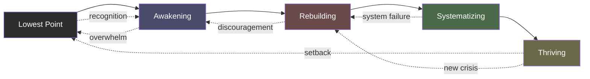

# The Map of the Journey

## Description

This document maps the entire level-up journey — from the lowest point through awakening, rebuilding, systematizing, and finally thriving. It describes what each stage feels like, how they connect, and why the path is never a straight line. The map is not the territory, but knowing the terrain makes the journey survivable.

## Prerequisites

- [The Level-Up Philosophy](../intro/the-level-up-philosophy.md) — the game-inspired framework for thinking about personal growth
- [The Lowest Point](../intro/the-lowest-point.md) — the existential foundation that makes the journey necessary
- [Mental Models for Change](mental-models-for-change.md) — the cognitive frameworks that make the stages legible

## Table of Contents

- [The Territory and the Map](#the-territory-and-the-map)
- [Stage Zero: The Lowest Point](#stage-zero-the-lowest-point)
- [Stage One: Awakening](#stage-one-awakening)
- [Stage Two: Rebuilding](#stage-two-rebuilding)
- [Stage Three: Systematizing](#stage-three-systematizing)
- [Stage Four: Thriving](#stage-four-thriving)
- [The Nonlinear Reality](#the-nonlinear-reality)
- [Why Stages Exist in This Order](#why-stages-exist-in-this-order)
- [What Recycling Through Stages Feels Like](#what-recycling-through-stages-feels-like)
- [Relapse as Part of Progress](#relapse-as-part-of-progress)
- [How to Read This Map Without Confusing It for the Territory](#how-to-read-this-map-without-confusing-it-for-the-territory)
- [The Meta-Mistake: Treating the Map as the Journey](#the-meta-mistake-treating-the-map-as-the-journey)
- [Walkthrough: Following the Map Without Being Trapped by It](#walkthrough-following-the-map-without-being-trapped-by-it)
- [Learning Tips](#learning-tips)
- [Glossary](#glossary)
- [Quick References](#quick-references)
- [Next Steps](#next-steps)

## Content / Material

### The Territory and the Map

A map is not the landscape it describes. A menu is not the meal. A blueprint is not the building. This distinction sounds obvious, but when you are deep in the fog of transformation, you will forget it. You will hold up the map and curse it for not matching what you see. You will blame yourself for not following the path correctly. You will assume the map is wrong, or worse — that you are wrong.

Neither is true. The map is an abstraction. The territory is what actually happens.

This document is the map. It describes the stages of the level-up journey as they have been experienced by countless people before you. The order is logical — each stage builds on the previous one. But your actual journey will loop, skip, stall, and backtrack. You will experience stages in parallel. You will think you have finished one stage only to find yourself back in it months later. This is not failure. This is how the territory works.

The purpose of the map is not to predict your path. The purpose is to help you recognize where you are when you are disoriented. When everything feels chaotic and meaningless, the map says: "You are here. This is a known stage. Other people have been here. There is a way through."

That is all the map can do. The walking is yours.

### Stage Zero: The Lowest Point

The journey does not begin with a decision. It begins with a collapse.

You do not choose to hit bottom. You arrive there through a series of small surrenders — skipping one workout, then another, then a month of them. Letting one relationship drift, then another, then all of them. Ignoring the voice that says "something is wrong" until the voice goes silent, not because it is satisfied, but because it has exhausted itself.

Stage Zero is defined by the existential vacuum. You wake up and the world is gray. The things that used to excite you — the frameworks, the challenges, the late-night coding sessions — feel flat. You are going through the motions. You are performing a life that used to feel like yours.

You might not recognize this as a stage at all. You might think this is just what life is now. You might label it as burnout, depression, or a "rough patch" and wait for it to pass. That waiting can last years.

The lowest point is not a place you visit once. It is a gravitational field that you will return to throughout the journey. Each return is shallower, shorter, and more recognizable than the last, but the gravity never fully disappears. Understanding this now — accepting that the void is a permanent possibility, not a one-time event — is the first piece of wisdom the journey offers.

```python
def lowest_point_state():
    return {
        "meaning": 0.0,
        "energy": 0.0,
        "denial": "this is fine",
        "duration": "until you stop pretending"
    }
```

The way out of Stage Zero is not visible from inside it. That is the cruel geometry of the lowest point — you cannot see the exit because you do not yet know there is one. The exit appears only when you recognize that you are in a stage at all. That recognition is the beginning of Stage One.

### Stage One: Awakening

Awakening begins with a crack. Something shifts. A question that you have been suppressing surfaces and will not go back down.

It might be triggered by a conversation — a friend saying "you seem different" and meaning it. It might be a book that articulates something you have felt but never named. It might be a crisis — a layoff, a breakup, a health scare — that breaks the surface of your routine and reveals the emptiness underneath. It might be nothing at all: a Tuesday morning when you are brushing your teeth and the thought arrives: "I cannot keep living this way."

However it arrives, the awakening is not comfortable. The void was empty, but it was familiar. Awareness replaces emptiness with pain. You see the gap between the life you have been living and the life you could live, and the gap hurts.

You will be tempted to close the gap immediately — to make a dramatic change, to quit your job, to move cities, to reinvent yourself overnight. Most people do exactly this. Most of those dramatic changes fail. The awakening stage is not about action. It is about seeing. The compulsion to act before you have finished seeing is one of the main reasons people cycle back to Stage Zero.

```python
def awakening_symptoms():
    symptoms = [
        "restlessness that has no object",
        "grief for a life you never lived",
        "anger at yourself for waiting so long",
        "fear that it is too late to change",
        "hope that feels dangerous to hold"
    ]
    return random.choice(symptoms)
```

The task of Stage One is to sit with the awareness long enough to understand what it is telling you. This takes weeks or months. You will feel like you are doing nothing. You are not doing nothing — you are doing the hardest thing: letting the reality of your situation penetrate without immediately anesthetizing it with action.

When you have truly seen — when the awareness is no longer a thought but a felt certainty — you will reach a natural threshold. The question shifts from "what is wrong?" to "what am I going to do about it?" That shift is the transition to Stage Two.

### Stage Two: Rebuilding

Rebuilding is the ugliest stage of the journey. It lacks the dramatic clarity of the lowest point and the hopeful energy of awakening. It is the slow, unglamorous work of constructing a life from rubble.

You will start with small things. You will force yourself to go for a walk even though every cell resists. You will cook a meal instead of ordering delivery. You will open your laptop and write one line of code, not because you are inspired, but because you made a promise to yourself. The first weeks of rebuilding feel like theater — you are performing actions that mean nothing because the meaning has not caught up yet.

This is the stage where most people quit. The awakening felt meaningful. The rebuilding feels like work. The gap between where you are and where you want to be is still vast, and each small action feels laughably inadequate against it.

You need to understand something about rebuilding: the small actions are not meant to close the gap. They are meant to signal to your nervous system that change is happening. Your brain rewires itself in response to repeated behavior, not in response to insights. Every time you choose the small action over the easy default, you are laying a brick in a new neural pathway. The pathway does not look like anything yet. It does not feel like anything yet. But it is being built.

```python
class Rebuilding:
    def __init__(self):
        self.days = 0
        self.neural_pathways = {}
    
    def do_small_action(self, action_name):
        if action_name not in self.neural_pathways:
            self.neural_pathways[action_name] = 0.0
        self.neural_pathways[action_name] += 0.05
        self.days += 1
    
    def check_progress(self):
        for pathway, strength in self.neural_pathways.items():
            if strength >= 1.0:
                return f"{pathway} has become automatic"
        return "Keep laying bricks"
```

Rebuilding is lonely because the work is invisible. Your colleagues cannot see the neural pathway you strengthened by choosing to set a boundary. Your friends cannot see the brick you laid by writing in your journal instead of scrolling. The only person who knows whether you are rebuilding is you. That makes it easy to cheat and hard to sustain.

The key metric of Stage Two is not results. It is consistency. If you show up for the small actions more often than not, you are succeeding. The results will arrive months later, and when they do, they will feel sudden — you will wake up one day and realize that what was hard has become automatic. That is the transition to Stage Three.

### Stage Three: Systematizing

When rebuilding has generated enough momentum, you will notice something: the small actions are no longer small. They have aggregated into patterns. You brush your teeth without thinking about it. You leave work at a reasonable hour without guilt. You exercise even when you do not feel like it. The behaviors that required full conscious effort in Stage Two have been absorbed into the background.

Stage Three is about catching up to this reality intentionally. You stop relying on willpower and start designing systems that make the desired behavior the default.

This is where the developer mindset becomes an asset. You think in systems. You understand that a well-designed system outperforms individual effort every time. You know that if your environment is optimized for the old behavior, the old behavior will win regardless of how motivated you feel. Stage Three applies this understanding to every domain of life.

You will audit your environment. You will remove friction from the behaviors you want and add friction to the behaviors you want to reduce. You will set up triggers and routines. You will build accountability structures — not because you cannot be trusted, but because accountability reduces the cognitive load of maintaining change.

```python
class System:
    def __init__(self):
        self.environment = {}
        self.routines = []
        self.triggers = []
    
    def add_friction(self, behavior, cost):
        self.environment[behavior] = cost
    
    def add_routine(self, trigger, action, reward):
        self.routines.append({
            "trigger": trigger,
            "action": action,
            "reward": reward
        })
    
    def execute(self, context):
        for routine in self.routines:
            if context == routine["trigger"]:
                routine["action"]()
                routine["reward"]()
                return f"Routine executed"
```

The danger of Stage Three is that systems can become idols. You can spend more time optimizing your system than living your life. The Notion dashboard becomes a substitute for the practice it was meant to track. The habit tracker becomes a source of anxiety rather than support. The system that was supposed to serve you becomes a master.

The safeguard against this is periodic questioning: Is the system still serving the intention? If the system stopped working tomorrow, would the core behaviors survive? If the answer is no, you have become dependent on the scaffolding. The goal of Stage Three is not perfect compliance. It is sustainable patterns that eventually become identity.

### Stage Four: Thriving

Thriving is not what you think it is. It is not constant happiness. It is not the absence of struggle. It is not arriving at a destination where everything is easy.

Thriving is the state where you have enough stability, resilience, and self-knowledge that you can turn your attention outward. The first three stages are necessarily self-focused — you cannot build a life while ignoring the foundation of your own psyche. But thriving is about contribution. It is about using the strength you have built in service of something beyond yourself.

You will feel this as a shift in motivation. In the early stages, you were driven by pain — the desire to escape the void, to stop hurting, to feel normal. In Stage Three, you were driven by growth — the satisfaction of improving, of building systems, of becoming more capable. In Stage Four, the driver becomes purpose. You start asking not "what do I need?" but "what can I give?"

This is the stage of mentoring, teaching, creating, and leading. It is when the developer who rebuilt their life starts writing about it. It is when the engineer who overcame burnout starts advocating for healthier practices in their organization. It is when the person who hit bottom starts showing others the way out.

```python
def thriving_index():
    dimensions = {
        "stability": "high",
        "resilience": "high",
        "self_knowledge": "high",
        "purpose": "clear and evolving",
        "contribution": "active and growing",
        "happiness": "variable and that is fine"
    }
    return dimensions
```

Thriving is not permanent. You will cycle back through earlier stages — a crisis will knock you back to rebuilding, a period of drift will require a new awakening. The difference is that each cycle is shallower. You recover faster. You recognize the patterns. You know the map.

The goal of the journey is not to reach Stage Four and stay there. The goal is to expand your capacity to experience all the stages without being destroyed by any of them.

### The Nonlinear Reality

The five stages as described above suggest a ladder. You climb from Stage Zero to Stage One, from Stage One to Stage Two, and so on until you reach the top. This is the map's simplification. The territory is nothing like this.

Your actual journey will look more like a knotted rope than a ladder. You will be in Stage Three (systematizing) when a crisis throws you back to Stage Zero (lowest point). You will be in Stage One (awakening) for months, then have a burst of Stage Two (rebuilding) energy, then stall and return to denial. You will experience Stage Four (thriving) in one domain of your life — your career, say — while simultaneously being in Stage Zero in another — your relationships.

This is not a design flaw. The nonlinear nature of the journey reflects the nature of the human psyche. You are not a single mechanism moving through discrete states. You are a complex system with multiple subsystems operating at different stages of development simultaneously.



The loops are not detours. They are the path. Each time you revisit a stage, you visit it at a deeper level. The first time through awakening, you see one layer of what is wrong. The second time, you see the layer beneath that. The third time, you see the structure that holds all the layers in place.

The second-order consequences of each stage choice often determine whether you advance or recycle — a dynamic explored in depth in [Mental Models for Change](mental-models-for-change.md).

If you treat the nonlinearity as a problem to be solved — if you try to force a linear progression — you will exhaust yourself fighting the nature of the journey. The skill to develop is not linearity but orientation: being able to ask "where am I right now?" and answering without judgment.

### Why Stages Exist in This Order

The stages are ordered by dependency. Each stage builds a capacity that the next stage requires.

You cannot awaken before you hit bottom because awakening requires the contrast of emptiness to make the search for meaning urgent. You cannot rebuild before you awaken because rebuilding requires a direction, and awakening is how you discover what direction matters. You cannot systematize before you have rebuilt something worth systematizing — there must be behaviors of sufficient strength to automate. You cannot thrive before you have stabilized, because contribution that comes from an empty well is not contribution; it is depletion.

```python
stages = {
    0: {"name": "lowest_point", "requires": None, "builds": "readiness for recognition"},
    1: {"name": "awakening", "requires": "readiness", "builds": "direction"},
    2: {"name": "rebuilding", "requires": "direction", "builds": "capacity"},
    3: {"name": "systematizing", "requires": "capacity", "builds": "sustainability"},
    4: {"name": "thriving", "requires": "sustainability", "builds": "contribution"}
}
```

This ordering means you cannot skip stages. You can try. You can go from the lowest point straight to system-building, bypassing the painful work of awakening and rebuilding. This is what happens when a developer reads a self-help book and immediately installs a habit-tracking app without doing the inner work. The systems will hold for a few weeks and then collapse, because there was no foundation underneath them.

You cannot build Stage Four on the foundation of Stage Zero. You cannot sustain what you have not rebuilt.

### What Recycling Through Stages Feels Like

The first time you cycle back through a stage, it will feel like failure. You will think: "I was in Stage Three. I had the systems. I was thriving. And now I am back in Stage One, feeling everything I thought I had resolved." The shame of regression will be stronger than any actual setback you experienced.

The second time, it will feel familiar. You will recognize the pattern. The restlessness, the questions, the discomfort — you have been here before. You know this terrain. You may still judge yourself for being back, but the judgment will be quieter.

The third time, it will feel like data. You will observe the cycle without needing to assign it a moral value. You will know that something in your life has shifted and that your psyche is responding by revisiting old material at a new depth. You will trust the process. Not because the process is comfortable, but because you have evidence that it works — you have come through cycles before and emerged with greater capacity each time.

The recycling is not a flaw in you. It is a feature of growth. Growth is not additive — it is iterative. Each pass through the stages processes material that was previously inaccessible because you lacked the capacity to hold it.

### Relapse as Part of Progress

Relapse — the specific experience of returning to an old behavior pattern that you thought you had overcome — is not optional. You will relapse. Everyone does. The question is not whether it happens but how you interpret it when it does. The transtheoretical model describes relapse as a normal and expected part of the change cycle, not a deviation from it (see [Mental Models for Change](mental-models-for-change.md) for the full framework).

The default interpretation is: "I have failed. The change was not real. I am back where I started." This interpretation is wrong, but it is the most natural one. Your brain uses the setback as evidence for the story it already believes — the story that you cannot change, that the journey was a delusion, that the old self is the real self.

The alternative interpretation is: "I have learned something about where my system is weak. This relapse is data that I can use to strengthen the next attempt." This interpretation is accurate, but it is not natural. It must be cultivated.

```python
def interpret_relapse(default=True):
    if default:
        return {
            "meaning": "I have failed",
            "consequence": "shame and abandoned effort"
        }
    else:
        return {
            "meaning": "I have found a weak point",
            "consequence": "targeted reinforcement"
        }
```

A slip is a single return to an old behavior — one day of skipping the routine, one moment of the old pattern. A collapse is a full return to the previous state — weeks or months of the old life. Between slip and collapse lies a critical window where interpretation determines the trajectory. If you interpret the slip as failure, you will spiral into collapse. If you interpret the slip as data, you will adjust and continue.

Relapse is part of progress because it reveals where your transformation is shallow. The behavior that returns under stress was never truly integrated. It was a mental construct, not a part of you. The relapse shows you what still needs work. It is not a step backward — it is a diagnostic.

### How to Read This Map Without Confusing It for the Territory

You are holding a map of a landscape you have never walked. Here is how to use it without being trapped by it.

**Use the map for orientation, not prediction.** When you feel lost, consult the map to ask: "Which stage best describes where I am right now?" The answer will give you context. It will tell you what other people in this stage have found helpful. It will name the terrain so you can stop fighting the feeling of being lost. The map will not tell you what happens next. No map can.

**When the map contradicts your experience, trust your experience.** If you are in what feels like Stage Four but the map says Stage Four looks different, do not force yourself into the map's description. Your experience is primary. The map is a generalization. Maybe you are in a variant of Stage Four that the map does not capture. Maybe you are in something new. The map is updated by explorers, not handed down by authorities. If your experience does not fit, you may be discovering territory worth mapping.

**Do not use the map to measure your worth.** There is no "ahead" or "behind" in the journey. The stages are not a competition. Someone who is in Stage Three is not better than someone in Stage One. They are at different points in different cycles. The person in Stage One may be processing deeper material than the person in Stage Three. The map does not rank — it orients.

**Let the map change as you change.** What Stage Two means to you after one cycle will be different from what it means after three cycles. The map is not fixed. Your understanding of the stages will deepen as you experience them. Redraw the map as you go. Make it yours.

### The Meta-Mistake: Treating the Map as the Journey

The most common mistake people make with frameworks like this is substituting the map for the walking. You will know you have made this mistake when you notice that you spend more time reading about change than changing.

Distinguishing signs:

- You have read dozens of books on personal development but your life looks the same as it did two years ago.
- You can explain the transtheoretical model to a friend but you have not applied it to yourself.
- Your bookshelf or bookmark folder is full of resources about change, and you feel a sense of accomplishment just from collecting them.
- You have elaborate systems for tracking growth and very little actual growth to track.
- You feel that if you can just understand the right framework, everything will click into place.

The map of the journey is dangerous because it feels like progress. Reading this document feels productive. It creates a sensation of movement. You are learning, organizing, understanding. But learning about the journey is not the same as walking it.

The only test of the map is whether it helps you walk. If you finish this document and then close your laptop and do nothing different tomorrow, the map has failed its purpose. If you finish this document and one small thing shifts — one question persists, one action you take that you would not have taken otherwise — the map has done its job.

```python
def meta_mistake(reading_hours, action_hours):
    if action_hours == 0:
        return "You are studying the menu instead of eating the meal"
    ratio = reading_hours / max(action_hours, 1)
    if ratio > 10:
        return "Your map is too heavy to carry"
    if ratio > 3:
        return "Consider more walking, less mapping"
    return "Good balance"
```

The purpose of reading about change is to enable change. If reading is displacing action, stop reading. The map has become an obstacle. Put it down and walk.

The map is one model among several. For frameworks that illuminate specific dynamics — the stages of change, the drama triangle, the stock-and-flow of identity — consult [Mental Models for Change](mental-models-for-change.md).

### Walkthrough: Following the Map Without Being Trapped by It

This walkthrough follows a developer named Priya as she navigates the first six months of her level-up journey, illustrating how the map serves as a guide rather than a cage.

**Week 1: Recognition.** Priya is a backend engineer at a fintech startup. She has been feeling hollow for months. On a Sunday evening, staring at her work laptop with no intention of opening it, she reads The Lowest Point document. She recognizes herself in every paragraph. For the first time, she has a name for what she is experiencing: the existential vacuum. She is in Stage Zero.

**Week 2-4: Resistance.** Priya knows she is in Stage Zero. She also knows the map says the next stage is Awakening. But she does not want to awaken. Awakening sounds painful. She fills her evenings with Netflix and doom-scrolling. She tells herself she will deal with this later. The map shows her that resistance is not a detour — it is part of the territory. She stops judging herself for avoiding the work.

**Week 5: The crack.** A colleague resigns and says something in the exit interview that gets back to Priya: "I just don't believe in what we are building anymore." The words hit her like a physical blow. She recognizes her own unspoken thought. The Awakening stage begins without her permission.

**Week 6-10: Sitting in awareness.** Priya does nothing. She goes to work, does her job, comes home. But she is different. She is watching herself now. She notices the meetings where she disassociates, the features she ships that she does not care about, the way she checks her phone during conversations. She is tempted to quit her job, move to Costa Rica, become a yoga instructor. The map tells her: "Do not act yet. Keep seeing." She listens, barely. She does not quit.

**Week 11: The shift.** The awareness crystallizes. Priya realizes she does not need to leave her job. She needs to change her relationship to it. She needs to find the parts of the work that connect to something deeper, and she needs to build the rest of her life so that work is not the only source of meaning. The direction is clear. She is ready for Stage Two.

**Week 12-20: The ugly rebuilding.** Priya starts small. She commits to leaving work by 6:30 PM. She commits to one hour of writing in the morning before checking email. She commits to calling a friend once a week. These actions feel pathetic. They are so small compared to the scale of her existential crisis. But she does them anyway.

Week three of rebuilding, she fails. A production incident keeps her at work until midnight. The next morning she sleeps through her writing hour. She feels the old despair rising — "see, you cannot change, the old patterns always win." The map says: "This is a slip. A slip is data, not verdict." She does not spiral. She resumes the next day.

**Week 21-24: Early systematizing.** Writing has become habit. Leaving work on time is still hard but no longer impossible. Priya realizes she needs systems, not willpower. She sets up a calendar block for writing, sets an alarm for leaving work, and creates a weekly accountability check-in with the friend she has been calling.

**Week 25: The first cycling.** A new CTO joins the company. The engineering culture shifts toward more hours, more pressure. Priya feels the old emptiness threatening to return. She is back in Stage One territory — the questions are surfacing again. But this time, it is different. She recognizes the cycle. She does not panic. She does not think she has failed. She thinks: "I am cycling. This is what the map described. The material is deeper this time."

She does not need to start from zero. The systems she built are still running. The awareness she cultivated is still accessible. She just needs to revisit the questions at a new depth. The map has done its job.

## Learning Tips

**Memorize the stages as reference points, not prescriptions.** When you feel disoriented, run through the stages and ask: "Which one best describes my current experience?" The answer is a compass, not a command.

**Keep a stage journal.** Each evening, note one sentence about which stage you were primarily in that day. After a month, look for patterns. You will see the cycles in your own data.

**When you cycle back, name what is different this time.** The second pass through a stage is never identical to the first. Something is deeper. Something is easier. Something is new. Identifying the delta transforms the shame of regression into the curiosity of discovery.

**Do not share the map with people who have not asked for it.** The map is useful when you are ready for it. Offering it to someone who is not ready is like giving a compass to someone who does not know they are lost. Wait until they ask.

**Let the map gather dust.** There will be months when you do not need it. You are walking the territory confidently. The map can stay in the drawer. That is a sign of progress, not neglect.

**Build your own map.** After you have completed a cycle or two, draw your own version. What stages did you actually experience? What order did they actually appear in? What did you learn that no map could have told you? Your personal map is more valuable than any generic one.

## Glossary

| Term | Definition |
|------|------------|
| Awakening | The stage where awareness of the problem becomes undeniable and the search for meaning begins |
| Collapse | A full return to a previous stage or behavior pattern, distinguished from a slip by duration and severity |
| Cycling | The nonlinear movement through stages, where earlier stages are revisited at deeper levels |
| Existential vacuum | Viktor Frankl's term for the experience of meaninglessness, emptiness, and loss of purpose |
| Linear trap | The mistaken belief that personal growth follows a straight line from problem to solution |
| Lowest point | The stage of existential collapse that creates the necessary conditions for transformation |
| Map | Any framework or model that describes the territory of personal growth; the map is not the territory |
| Nonlinear reality | The actual nature of personal transformation, characterized by loops, backtracks, and parallel stages |
| Rebuilding | The stage of constructing new patterns through consistent small actions before meaning has caught up |
| Relapse | A return to a previous behavior pattern; differentiated from failure by how it is interpreted and used |
| Slip | A single instance of returning to an old pattern; distinguished from collapse by its limited scope |
| Stage | A phase of the transformation journey characterized by specific experiences, tasks, and challenges |
| Systematizing | The stage where effective behaviors are encoded into environment design, routines, and accountability structures |
| Territory | The actual lived experience of transformation, which always differs from the map's description |
| Thriving | The stage where stability enables outward focus, contribution, and purpose-driven action |

## Quick References

- [Man's Search for Meaning, Viktor Frankl](https://www.amazon.com/Mans-Search-Meaning-Viktor-Frankl/dp/080701429X) — the foundational text on the existential vacuum and finding meaning
- [The Hero with a Thousand Faces, Joseph Campbell](https://www.amazon.com/Thousand-Faces-Collected-Joseph-Campbell/dp/1577315936) — the monomyth structure that underlies the stages of transformation
- [Transformed: Change Your Life by Changing Your Mind, John B. Arden](https://www.amazon.com/Transformed-Change-Your-Life-Mind/dp/1668012985) — practical neuroscience of transformation
- [The Power of Habit, Charles Duhigg](https://www.amazon.com/Power-Habit-What-Life-Business/dp/081298160X) — the cue-routine-reward loop that explains how systems work
- [Atomic Habits, James Clear](https://www.amazon.com/Atomic-Habits-Proven-Build-Break/dp/0735211299) — the practical guide to building systems that make change automatic
- [The Gifts of Imperfection, Brené Brown](https://www.amazon.com/Gifts-Imperfection-Think-Supposed-Embrace/dp/1496472793) — on vulnerability and self-compassion during the rebuilding stage
- [The Artist's Way, Julia Cameron](https://www.amazon.com/Artists-Way-25th-Anniversary/dp/0143129252) — a 12-week program for creative awakening, applicable to any personal transformation
- [Stages of Change and the Transtheoretical Model, Prochaska & DiClemente](https://www.ncbi.nlm.nih.gov/pmc/articles/PMC299380/) — the academic framework behind stage-based change models
- [Antifragile, Nassim Nicholas Taleb](https://www.amazon.com/Antifragile-Things-That-Disorder-Incerto/dp/1400067820) — on systems that gain from disorder, relevant to the nonlinear nature of growth

## Next Steps

- [The Mechanism of Change](the-mechanism-of-change.md) — how transformation actually works: awareness, agency, and action
- [The Transtheoretical Model](../../psychology/behavior-change/the-transtheoretical-model.md) — the academic framework that complements this narrative map
- [Awakening](../meaning/index.md) — enter Stage One: recognizing the void and deciding to change
- [The Lowest Point](../intro/the-lowest-point.md) — revisit the foundation when you need to remember why the journey matters
