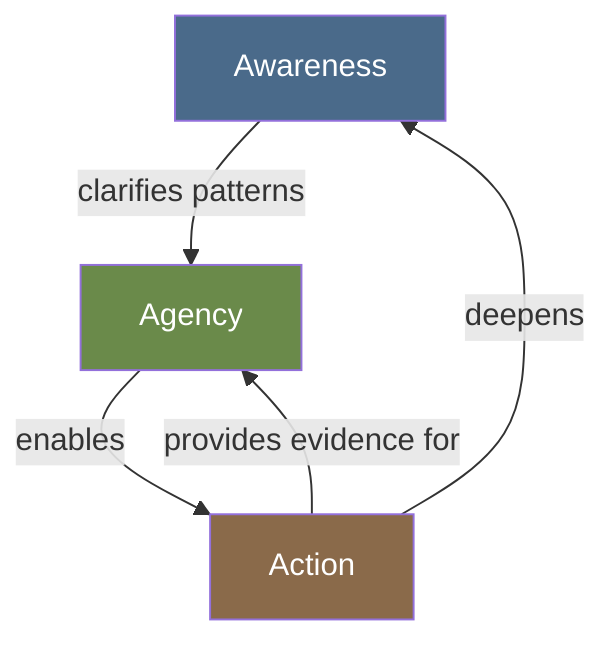

# The Mechanism of Change

## Description

Transformation is not magic and it is not a single event. It is a process driven by three interdependent forces: awareness (seeing the problem clearly), agency (believing you can change), and action (doing the work anyway). This document describes how these three forces interact, why all three are necessary, and why insight alone will never transform you.

## Prerequisites

- [The Map of the Journey](the-map-of-the-journey.md) — the stages framework that this mechanism powers
- [Processes of Change](../../psychology/behavior-change/processes-of-change.md) — the academic counterpart describing the cognitive and behavioral processes

## Table of Contents

- [Change Is Not an Event](#change-is-not-an-event)
- [The Three Drivers: Awareness, Agency, Action](#the-three-drivers-awareness-agency-action)
- [Driver One: Awareness](#driver-one-awareness)
- [Driver Two: Agency](#driver-two-agency)
- [Driver Three: Action](#driver-three-action)
- [The Interdependence of the Three Drivers](#the-interdependence-of-the-three-drivers)
- [Why All Three Are Necessary](#why-all-three-are-necessary)
- [The Role of Suffering in Catalyzing Change](#the-role-of-suffering-in-catalyzing-change)
- [Why Insight Alone Is Never Enough](#why-insight-alone-is-never-enough)
- [The Difference Between Change as Event and Change as Process](#the-difference-between-change-as-event-and-change-as-process)
- [The False Promise of the Tipping Point](#the-false-promise-of-the-tipping-point)
- [The Mechanism in Practice: A Daily Cycle](#the-mechanism-in-practice-a-daily-cycle)
- [Walkthrough: How the Mechanism Plays Out in a Developer's Life](#walkthrough-how-the-mechanism-plays-out-in-a-developers-life)
- [Learning Tips](#learning-tips)
- [Glossary](#glossary)
- [Quick References](#quick-references)
- [Next Steps](#next-steps)

## Content / Material

### Change Is Not an Event

Western culture loves the conversion narrative. Saul on the road to Damascus, struck blind by a revelation, emerging as Paul. The addict who hits the one specific bottom and never uses again. The developer who has one conversation with a mentor and suddenly their entire career trajectory shifts.

These stories are seductive because they suggest that change can be instantaneous — that if you just find the right insight, the right book, the right person, the switch will flip and you will be transformed. You will not have to suffer through the slow, uncertain, unglamorous process of becoming different. You will simply become different, all at once, like a light turning on.

This is almost never how change works.

The conversion narrative is a retrospective simplification. The addict who quit after one bottom had thousands of previous attempts that never made it into the story. The developer who had the pivotal conversation had been accumulating the conditions for that conversation for years. The insight that seems to cause the change is usually the last domino — the one that gets all the credit while the chain of dominoes that preceded it is forgotten.

Real change is not an event. It is a process that unfolds over time, driven by a mechanism that you can understand and engage deliberately.

```python
class Change:
    def __init__(self):
        self.events = []
        self.process_depth = 0.0
    
    def add_event(self, description, is_visible):
        self.events.append({
            "description": description,
            "is_visible": is_visible,
            "contribution": 0.1 if is_visible else 0.3
        })
        self.process_depth = sum(
            e["contribution"] for e in self.events
        )
        return self.process_depth
    
    def is_ready(self):
        return self.process_depth >= 1.0
```

The visible events — the conversation, the book, the crisis — are real. They matter. But they are effective only because of the invisible work that preceded them: the accumulated dissatisfaction, the half-formed questions, the failed attempts, the quiet moments of recognition that did not seem to lead anywhere at the time.

Understanding change as a mechanism rather than an event is the first step toward making it reliably. If change were an event, you could only hope for it. If change is a mechanism, you can learn how it works and operate it deliberately.

### The Three Drivers: Awareness, Agency, Action

The mechanism of change has three essential components. They are not stages — they do not happen in sequence. They are interdependent drivers that must all be present for change to occur. If any one is missing, the mechanism stalls.

**Awareness** is the capacity to see clearly what is happening. It is the opposite of denial, distraction, and dissociation. Awareness says: "This is the situation. This is what I am doing. This is what it costs me."

**Agency** is the belief that your actions matter. It is the opposite of helplessness, fatalism, and resignation. Agency says: "I can influence this situation. My choices have consequences. Change is possible."

**Action** is the behavior that translates awareness and agency into reality. It is the opposite of rumination, planning, and waiting for the perfect moment. Action says: "I am doing something, even if it is small, even if it is imperfect."

```python
class MechanismOfChange:
    def __init__(self):
        self.awareness = 0.0
        self.agency = 0.0
        self.action = 0.0
    
    def status(self):
        if self.awareness < 0.3:
            return "Stalled: you cannot change what you do not see"
        if self.agency < 0.3:
            return "Stalled: you will not change what you believe you cannot"
        if self.action < 0.3:
            return "Stalled: insight without action is self-deception"
        return "The mechanism is engaged"
```

Each driver can be developed independently, but they also feed each other. Awareness increases agency — when you see a pattern clearly, you are more likely to believe you can change it. Agency enables action — when you believe your efforts matter, you are more likely to make them. Action deepens awareness — when you try something and observe the result, you learn something you could not learn by thinking alone.

The mechanism is a flywheel. Once all three drivers are spinning, they keep each other in motion. The challenge is getting all three started at once.

### Driver One: Awareness

Awareness is the foundation. Without it, the other two drivers have nothing to work on. You cannot change a pattern you do not see. You cannot solve a problem you have not acknowledged.

But awareness is harder than it sounds. Most of your life runs on autopilot. You make decisions, react to situations, and fall into patterns without conscious attention. The brain is optimized for efficiency, not accuracy. It would rather be fast and wrong than slow and correct. Awareness requires overriding this optimization.

You have experienced the difference between automatic processing and awareness. Think of a time you were driving and arrived at your destination with no memory of the journey — you were on autopilot. Now think of a time you were driving in heavy rain, every sense engaged, every decision deliberate — you were in awareness. The difference is not in the activity. It is in the quality of attention.

```python
def attention_quality(state):
    if state == "autopilot":
        return {
            "efficiency": "high",
            "accuracy": "low",
            "change_capacity": "zero"
        }
    if state == "awareness":
        return {
            "efficiency": "low",
            "accuracy": "high",
            "change_capacity": "available"
        }
```

Building awareness requires practices that disrupt autopilot. Journaling, meditation, therapy, honest conversation with trusted friends, regular self-assessment — these are not hobbies. They are the infrastructure of awareness. They force you to stop and see.

The specific practice matters less than the regularity. Five minutes of daily reflection is more effective than an hour once a month, because the daily practice trains the muscle of attention. The hour-long session produces a burst of insight that fades by the next week.

Awareness has a property that makes it uncomfortable: it reveals problems faster than you can solve them. As your awareness grows, you will see more things that are wrong — in yourself, in your environment, in your relationships — before you have the capacity to address them. This creates a painful gap. The temptation is to reduce awareness to close the gap. Do not reduce awareness. Increase your capacity for action.

```python
def awareness_gap(awareness_level, action_capacity):
    problems_seen = awareness_level * 10
    problems_solved = action_capacity * 5
    gap = problems_seen - problems_solved
    if gap > 0:
        return f"You see {gap} more problems than you can solve. This is normal. Do not stop seeing."
    return "Your action capacity matches your awareness. You are in balance."
```

### Driver Two: Agency

Agency is the belief that you can influence your own life. It is not the same as control. Control is the ability to guarantee outcomes. Agency is the belief that your actions shift probabilities. You cannot control whether you get the promotion. You can control how well you prepare for the interview. You cannot control whether someone loves you. You can control how you show up in the relationship.

Agency is the antidote to learned helplessness — the state, first described by Martin Seligman, where repeated failure teaches an organism that its actions do not matter. Dogs subjected to inescapable shocks would eventually stop trying to escape even when escape became possible. They had learned that effort was pointless. Humans do the same thing.

Developers are uniquely susceptible to learned helplessness in specific domains. You may have tried to set boundaries at work and been ignored. You may have tried to learn a skill and stalled. You may have tried to build a healthy habit and failed. Each failure erodes agency incrementally. Over years, you can arrive at a state where you do not believe you can change, even though you desperately want to.

```python
class LearnedHelplessness:
    def __init__(self):
        self.failures = []
        self.agency = 1.0
    
    def attempt(self, domain, succeeded):
        if succeeded:
            self.failures = []
            self.agency = min(1.0, self.agency + 0.1)
            return "Agency restored"
        else:
            self.failures.append(domain)
            if len(self.failures) >= 3:
                self.agency = max(0.1, self.agency - 0.2)
                return "Agency eroded across domains"
            return "Isolated failure"
```

Rebuilding agency requires evidence, not affirmations. Telling yourself "I can do this" when you have no evidence is hollow. The evidence must be real. It must be personal. It must be recent.

The most reliable way to rebuild agency is through small, guaranteed wins. Choose a domain where success is almost certain — making your bed, drinking a glass of water in the morning, writing one sentence. Do it consistently. Let the evidence accumulate. Your brain does not distinguish between a small win in a trivial domain and a large win in an important one — it registers both as evidence that your actions have consequences.

The agency you build in small domains will generalize to larger ones. This is not magical thinking. It is the mechanism by which self-efficacy transfers across domains — not because the skills are the same, but because the belief structure is shared. When you prove to yourself that you can reliably make your bed, you have created evidence that you are the kind of person who follows through. That evidence is available to all domains.

### Driver Three: Action

Action is the bridge between intention and reality. Without action, awareness becomes rumination and agency becomes wishful thinking.

Action is the most misunderstood driver of the three. People think they need to feel ready before they act. They wait for motivation. They wait for confidence. They wait for the perfect plan. While they wait, the window for change closes. The conditions they were waiting for never arrive.

The relationship between action and motivation is not what most people assume. The folk model says: motivation → action → results. First you get motivated, then you act, then you see results. This model is backwards. The empirical model, supported by decades of behavioral research, is: action → motivation → more action.

```python
# The folk model (wrong)
def folk_model():
    return ["wait_for_motivation", "feel_frustrated", "wait_longer"]

# The empirical model (right)
def empirical_model():
    action = "do_something_small"
    motivation = action + 0.3  # action generates motivation
    return [action, motivation, "repeat"]
```

Action generates motivation. Not always immediately, and not always enough to sustain the action indefinitely. But on average, doing something — anything — produces more motivation than waiting to feel like doing something. The act of moving creates the momentum for further movement.

This is why the most effective change strategy is often the simplest: start before you are ready. Do not wait for the perfect system, the right mindset, or the arrival of motivation. Take one small action in the direction you want to go. Observe what happens. Take another action based on what you learned.

Action also generates information. You do not know what will work until you try. Planning creates the illusion of knowledge — you think you know what will happen. Action reveals the truth. The developer who plans their habit system for two weeks learns less than the developer who tries one habit for two days and adjusts.

```python
class ActionDriver:
    def __init__(self):
        self.attempts = []
        self.learning = 0.0
    
    def act(self, plan, outcome):
        self.attempts.append({
            "plan": plan,
            "outcome": outcome,
            "learned": plan != outcome
        })
        self.learning = sum(
            a["learned"] for a in self.attempts
        ) / len(self.attempts)
        return f"Learning rate: {self.learning:.0%}"
```

The smallest possible action is always available. You can always do one pushup. You can always write one sentence. You can always close one unnecessary tab. The smallest action is not trivial — it is the unit of change. One pushup today becomes three next week becomes a full workout next month. The first sentence becomes a paragraph becomes a page becomes a chapter.

Do not underestimate what one small action can become. Do not overestimate what you will achieve before you start.

### The Interdependence of the Three Drivers

Awareness, agency, and action are not independent. They form a system where each driver affects the others. Understanding their interdependence helps you diagnose why change is stalling.

**Awareness feeds agency.** When you see a pattern clearly — when you can name it, describe its triggers, and trace its consequences — you are more likely to believe you can change it. The pattern becomes a phenomenon you can observe rather than an inevitable force. Awareness does not automatically create agency, but it creates the conditions for agency to grow.

**Agency enables action.** When you believe your actions matter, you are more likely to take them. This seems obvious, but its implications are not. Low agency does not look like giving up. It looks like waiting — waiting for the right moment, the right method, the right amount of motivation. Low agency disguises itself as preparation. If you have been "preparing" for a change for months without acting, the bottleneck is probably agency, not planning.

**Action deepens awareness.** You cannot fully understand a pattern from the outside. You must engage with it, try to change it, and observe what happens. The act of trying reveals dimensions of the pattern that were invisible during contemplation. This is why insight alone is never enough — insight without action is shallow because it lacks the feedback that only action provides.

**Action builds agency.** Every successful action, no matter how small, is evidence that change is possible. The evidence accumulates. Agency grows. The mechanism accelerates.



When change stalls, check each driver. Is awareness low? You may be in denial or distraction — you do not truly see the problem yet. Is agency low? You may believe, at some level, that change is impossible for you. Is action low? You may be waiting for readiness that will never arrive.

The remedy for a stalled mechanism depends on which driver is weakest.

### Why All Three Are Necessary

You can see what awareness alone produces: the perpetual contemplator. This person has deep insight into their patterns. They can explain exactly why they are stuck, what childhood experiences created the pattern, and what would need to change. They have been in therapy for years. They have read hundreds of books. Their awareness is profound. And their life looks the same as it did five years ago.

Awareness without agency and action produces the tragedy of insight without transformation. The person knows everything about their cage. They can describe its dimensions, its history, and its construction in exquisite detail. But they have never tried to open the door.

You can see what agency alone produces: the motivational addict. This person believes deeply in their capacity to change. They have read every self-help book. They attend seminars. They make vision boards. They set ambitious goals every January. Their agency is high — they genuinely believe they can do anything. But their life is a graveyard of abandoned initiatives.

Agency without awareness and action produces the tragedy of effort without direction. The person generates enormous energy but applies it to targets that do not matter, or applies it inconsistently, or applies it without understanding the patterns that keep undermining them.

You can see what action alone produces: the busy fool. This person is always doing something. They are building habits, tracking metrics, optimizing routines. They wake at 5 AM, cold plunge, meditate, journal, exercise, and work in deep focus blocks. They are a machine of activity. And they are running in place, generating motion without movement.

Action without awareness and agency produces the tragedy of activity without meaning. The person does all the right things but does not know why they are doing them. The habits are hollow. The systems are empty. When motivation flags — and it will — there is nothing underneath to sustain the action.

The three drivers are not a hierarchy. You cannot pick one and ignore the others. The mechanism requires all three.

### The Role of Suffering in Catalyzing Change

Suffering plays a specific role in the mechanism of change: it accelerates awareness.

In normal conditions, awareness develops slowly. You might notice a pattern after years of repetition, and only then begin to question it. Suffering compresses this timeline. When something hurts enough, you cannot maintain the denial. You cannot stay on autopilot. The pain forces you to see.

```python
def suffering_and_awareness(pain_level):
    if pain_level < 3:
        return "Comfortable denial possible"
    if pain_level < 6:
        return "Awareness emerging, denial weakening"
    if pain_level < 8:
        return "Awareness unavoidable, change urgent"
    return "Survival mode: awareness high, capacity low"
```

This is why hitting bottom is so often the beginning of real change. The bottom is not a choice — it is an arrival at a place where the cost of not changing exceeds the cost of changing. The pain becomes a teacher that insight could not reach.

But suffering is not sufficient. It accelerates awareness, but it does not build agency or compel action. Intense suffering can actually erode agency — when you are in enough pain, you may believe you are powerless. And suffering can freeze action — the overwhelmed mind shuts down rather than mobilizes.

The most productive relationship to suffering is to treat it as a signal that awareness is available. The pain is telling you something about a pattern that needs to change. Listen to the signal. But do not expect the pain to do the work for you. The pain opens the door. You must walk through.

This is also why manufactured suffering — putting yourself through unnecessary hardship to catalyze change — is usually counterproductive. The suffering that accelerates awareness is the suffering that is already present. You do not need to create more. You need to stop numbing the suffering you already have.

### Why Insight Alone Is Never Enough

Every self-improvement industry is built on a premise: that understanding your problems will lead to solving them. This premise is false.

You can understand exactly why you overwork. You can trace it to your childhood, your need for validation, your fear of inadequacy. You can describe the pattern with clinical precision. And you can still overwork next week. The insight does not prevent the behavior. It just makes you feel worse about it afterward.

Insight is not useless. It is a necessary component of the mechanism — it feeds awareness, which enables action. But insight is not sufficient. The distance between understanding a pattern and changing it is vast.

```python
def insight_efficacy(has_insight, has_action):
    if has_insight and has_action:
        return "Insight guides effective action"
    if has_insight and not has_action:
        return "Insight without action is self-deception"
    if not has_insight and has_action:
        return "Action without insight is blind"
    return "Neither insight nor action: stasis"
```

The reason insight falls short is that the patterns you want to change are encoded in neural pathways, not in conscious beliefs. You can consciously know that you should set boundaries, but your nervous system has years of practice in boundary-crossing. The neural pathway for boundary-crossing is a superhighway. The neural pathway for boundary-setting is a dirt path. You cannot make the dirt path into a superhighway by thinking about it. You must walk it, over and over, until it broadens.

This is why action is the indispensable driver. Action rewires the nervous system. Insight points the direction. But only action builds the pathway.

The developer mindset can be a trap here. Developers are problem-solvers. When faced with a problem, you research, analyze, and design a solution. You would never implement a solution without understanding the problem first. But personal change is not software engineering. You cannot fully understand the problem from the outside. You must enter the problem, act within it, and learn from the action. The analysis phase must be iterative, not front-loaded.

The developer who waits until they fully understand their burnout before making any changes will never make changes. The understanding comes from acting, not from thinking.

### The Difference Between Change as Event and Change as Process

The event model of change says: "I will change when X happens." X might be a conversation, a crisis, a new year, a birthday, a move, a job change. The event model keeps you waiting. Your life becomes a series of thresholds that you approach but never cross, because the event that will finally trigger the change never arrives with sufficient force.

The process model of change says: "I am changing now, incrementally, through the accumulation of small actions." The process model does not require a catalyst. It requires engagement with the mechanism. You do not need to wait for a crisis to build awareness. You can practice it today. You do not need a major victory to build agency. You can choose a small win today. You do not need motivation to act. You can take one small step today.

```python
def change_model(model_type):
    if model_type == "event":
        return {
            "catalyst": "some future event",
            "timeline": "waiting",
            "agency": "external",
            "likelihood": "low"
        }
    if model_type == "process":
        return {
            "catalyst": "the mechanism itself",
            "timeline": "now, ongoing",
            "agency": "internal",
            "likelihood": "moderate and increasing"
        }
```

The event model produces an anxious relationship to time. You are always scanning the horizon for the event that will finally change everything. When the event arrives and does not transform you, you feel betrayed. When no event arrives, you feel abandoned.

The process model produces a patient relationship to time. You know that change is happening now, even when it is invisible. The small actions are accumulating. The neural pathways are being laid. The mechanism is running. You do not need to see results today because you trust the process.

The event model and the process model are not mutually exclusive. Events can accelerate the process. A crisis can spike awareness. A conversation can boost agency. An opportunity can enable action. But the events are effective only if the process is already running. If you have been doing the daily work, the event can catalyze a breakthrough. If you have not been doing the daily work, the event will be a temporary spike that fades into guilt.

Operate the process every day. Let the events be bonuses, not dependencies.

### The False Promise of the Tipping Point

The tipping point is a seductive concept. It suggests that change follows a pattern of long stasis followed by sudden transformation. You struggle for months with no visible progress, and then — click — the system flips and you are different.

This does happen. But the tipping point is a description of a pattern, not a prescription for achieving it. You cannot aim for a tipping point. You can only aim for consistent action and hope that a tipping point emerges from it.

```python
def tipping_point_fallacy():
    thinking = [
        "If I just keep going, something will eventually click",
        "The click will solve everything at once",
        "Until the click, nothing is really happening"
    ]
    return thinking
```

The danger of the tipping point narrative is that it devalues the work that happens before the click. Every day of consistent action before the breakthrough matters. The breakthrough could not have happened without those days. They are not waiting — they are building.

The better mental model is the kettle. You heat water. For a long time, nothing visible happens. The water is silent. Then, at precisely 100 degrees Celsius, it boils. The boiling seems sudden, but it is the product of all the invisible heating that preceded it. The last degree is not more important than the first. It is just the one where the phase change becomes visible.

Your change will boil. But you must keep heating the water, even when nothing seems to be happening.

### The Mechanism in Practice: A Daily Cycle

The mechanism of change can be operated as a daily practice. Here is one way to do it.

**Morning: Set the awareness intention.** Before you check your phone, spend two minutes asking: "What is one pattern I want to observe today?" Not change — observe. Choose a specific behavior you want to bring into awareness. If you are working on overwork, the intention might be: "I want to notice when I feel the urge to work beyond my planned stop time."

**During the day: Act with intention.** When the pattern appears, you have a choice. You can follow the old pattern automatically, or you can try a small different action. The goal is not to always choose the new action. The goal is to choose it often enough that you collect data. "I noticed the urge to keep working. I chose to stop anyway, for five minutes. I noticed the anxiety and did not act on it."

**Evening: Review and adjust.** Spend five minutes reflecting: "What did I notice today? What did I try? What did I learn? What will I try tomorrow?" This review closes the awareness-action loop. It consolidates the learning and sets the direction for the next cycle.

```python
def daily_change_cycle(morning_intention, daily_action, evening_reflection):
    if not morning_intention:
        return "Day lived on autopilot"
    if not daily_action:
        return "Awareness without action: observation without change"
    if not evening_reflection:
        return "Action without reflection: experience without learning"
    return "The mechanism operated today"
```

This cycle is simple. It is not easy. The difficulty is not in understanding the cycle but in executing it consistently. You will forget to set the intention. You will notice the pattern and act on it anyway. You will skip the reflection because you are tired. This is normal. The cycle is a practice, not a performance. What matters is the trajectory — that you do it more often this month than last month.

### Walkthrough: How the Mechanism Plays Out in a Developer's Life

This walkthrough follows David, a senior frontend engineer who has been stuck in a cycle of overwork and burnout for three years. He has tried to change before. He has read the books, set the intentions, and failed. This time, he approaches change as a mechanism.

**The starting state.** David works 50-60 hours per week. He says yes to every request. He checks Slack on weekends. He has not taken a real vacation in two years. He knows this is unsustainable. His awareness of the problem is moderate — he can describe the pattern, but he has never truly sat with the cost.

His agency is low. He has tried to set boundaries before and failed. Each failure has eroded his belief that he can change. He says things like "that is just how the industry works" and "I am not the kind of person who can say no."

His action is misdirected. He takes action — he is very good at taking action — but his actions reinforce the overwork pattern rather than break it. He has never taken a single action aimed at reducing his hours.

**Stage 1: Building awareness.** David starts a daily journal. Every evening, he writes three sentences: "How many hours did I work today? What was the moment I most wanted to stop but did not? What would have happened if I had stopped?"

After two weeks, he notices something: the fear of stopping is never realized. The world does not end when he closes his laptop at 7 PM instead of 9 PM. The features still ship. The team does not collapse. This observation contradicts his belief system. Awareness is growing.

```python
# David's journal pattern after 14 days
david_insights = {
    "days_over_50_hours": 12,
    "days_checked_slack_after_hours": 14,
    "catastrophes_from_stopping_early": 0,
    "agency_rating": "starting to shift"
}
```

**Stage 2: Rebuilding agency.** David picks a trivial domain for a guaranteed win: he will stop working at 6:30 PM every day for one week. Not negotiate. Not "try to." He sets a hard alarm. When the alarm goes off, he closes everything and walks away from his desk.

Day one: the alarm goes off at 6:30. David is in the middle of debugging. The anxiety is intense. He closes his laptop anyway. He feels terrible for 20 minutes. Then he goes for a walk. He survives.

Day three: the alarm goes off. David is in a meeting. He leaves the meeting. The team notices. Nothing bad happens.

Day seven: the alarm goes off. David closes his laptop without the anxiety spike. He has proven to himself that he can stop. The evidence is real. Agency has increased.

**Stage 3: Taking aligned action.** With awareness of the pattern and evidence that he can change, David starts taking actions that directly address the overwork cycle. He changes his Slack status to show his working hours. He adds a delayed delivery rule to his email. He tells his manager that he is prioritizing sustainable pace.

Each action is small. Each action generates resistance from his nervous system. Each action produces evidence that the nervous system was wrong. The mechanism is running.

**Stage 4: Maintaining the cycle.** David continues the daily cycle. Some days he fails — a production incident requires overtime, and he works until midnight. The old shame spiral tries to activate: "See, you cannot change. One crisis and you are back where you started."

But the mechanism gives him a different interpretation: "A slip. Data. What can I learn?" He notices that the overtime was caused by a system design problem, not his inability to set boundaries. He schedules a conversation about system reliability. The slip becomes information, not failure.

Six months later, David is still not perfect. He still overworks occasionally. But the baseline has shifted. His average work week has gone from 55 hours to 42. He has taken two weekends fully off. He has started a side project that has nothing to do with software. The mechanism is not a cure. It is a practice.

```python
# David's trajectory after 6 months
david_outcome = {
    "avg_hours_per_week": "55 -> 42",
    "weekends_worked": "most -> 2 in 6 months",
    "agency_rating": "moderate and growing",
    "perfection": "not achieved, not needed"
}
```

## Learning Tips

**Diagnose before you prescribe.** When change is stalled, do not immediately try harder. Ask: which driver is weakest? Are you in denial (low awareness)? Do you believe change is impossible (low agency)? Are you waiting for readiness (low action)? The remedy depends on the diagnosis.

**Start with the weakest driver.** If awareness is low, do not start with ambitious action. Start with observation. If agency is low, do not start with a difficult goal. Start with a guaranteed small win. If action is low, do not start with more planning. Start with the smallest possible step.

**Stop using insight as a substitute for change.** When you have an insight — "ah, I see why I do this" — the temptation is to treat the insight as the accomplishment. It is not. The insight is only valuable if it leads to action. After every insight, ask: "What am I going to do differently now?"

**Keep the mechanism visible.** Every morning, write your awareness intention on a sticky note. Every evening, write one sentence about what you learned. The physical artifact makes the mechanism concrete. When it is invisible, it is easy to forget.

**Use the mechanism on the mechanism.** When the mechanism itself stalls — when you stop journaling, stop taking small actions, stop reflecting — apply the mechanism to the meta-problem. What awareness is missing? What agency is low? What action is stalled?

**Be patient with the flywheel.** In the beginning, the mechanism requires effort. The effort does not seem to produce results. This is the phase where most people quit. Keep going. The flywheel will accelerate. The early effort is not wasted — it is building the momentum that will eventually make the mechanism self-sustaining.

## Glossary

| Term | Definition |
|------|------------|
| Action | The behavioral driver of change; doing something, even imperfectly, in the direction of desired change |
| Agency | The belief that one's actions can influence outcomes; the opposite of learned helplessness |
| Autopilot | The state of operating without conscious awareness, driven by habitual neural pathways |
| Awareness | The capacity to see one's patterns, behaviors, and their consequences clearly and without denial |
| Change as event | The model of change as a sudden, dramatic transformation triggered by a single catalyst |
| Change as process | The model of change as an ongoing, incremental accumulation of small shifts |
| Conversion narrative | The retrospective story that presents change as instantaneous, obscuring the invisible work that preceded it |
| Daily cycle | The practice of morning intention-setting, daytime intentional action, and evening reflection |
| Insight | Understanding of a pattern or its causes; necessary for change but insufficient without action |
| Learned helplessness | A state where repeated failure teaches an organism that its actions do not matter |
| Mechanism of change | The interdependent system of awareness, agency, and action that drives transformation |
| Slip | A single return to an old behavior pattern; data rather than failure when interpreted correctly |
| Suffering | Pain that accelerates awareness by making denial impossible; a catalyst but not a sufficient driver |
| Tipping point | A sudden phase change that follows a long period of invisible accumulation; cannot be aimed for directly |

## Quick References

- [The Power of Habit, Charles Duhigg](https://www.amazon.com/Power-Habit-What-Life-Business/dp/081298160X) — the cue-routine-reward framework for understanding how habits work
- [Atomic Habits, James Clear](https://www.amazon.com/Atomic-Habits-Proven-Build-Break/dp/0735211299) — practical strategies for building small actions into lasting systems
- [Mindset: The New Psychology of Success, Carol Dweck](https://www.amazon.com/Mindset-Psychology-Carol-S-Dweck/dp/0345472322) — the foundational book on the growth mindset, which is the belief system underlying agency
- [Learned Optimism, Martin Seligman](https://www.amazon.com/Learned-Optimism-Change-Your-Mind/dp/1400078393) — the science of agency and how to rebuild it after learned helplessness
- [The Happiness Trap, Russ Harris](https://www.amazon.com/Happiness-Trap-Struggling-Start-Living/dp/1590305841) — Acceptance and Commitment Therapy approaches to awareness and action
- [Daring Greatly, Brené Brown](https://www.amazon.com/Daring-Greatly-Courage-Vulnerable-Transforms/dp/1594634048) — on the courage required to take action despite uncertainty
- [Man's Search for Meaning, Viktor Frankl](https://www.amazon.com/Mans-Search-Meaning-Viktor-Frankl/dp/080701429X) — the exploration of how meaning (awareness of purpose) enables survival and transformation
- [The Practicing Mind, Thomas Sterner](https://www.amazon.com/Practicing-Mind-Developing-Discipline-Challenge/dp/1608010341) — on staying present during the slow process of skill development
- [Deep Work, Cal Newport](https://www.amazon.com/Deep-Work-Focused-Success-Distracted/dp/1455586692) — on the value of focused action and the cost of constant distraction

## Next Steps

- [The Developer's Landscape](the-developers-landscape.md) — how the mechanism of change operates differently for software developers
- [Self-Efficacy & Decisional Balance](../../psychology/behavior-change/self-efficacy-and-decisional-balance.md) — the academic frameworks behind agency and the decision to change
- [Processes of Change](../../psychology/behavior-change/processes-of-change.md) — the cognitive and behavioral processes that operationalize the mechanism
- [Rebuilding](../resilience/index.md) — enter Stage Two: the slow work of constructing new patterns
