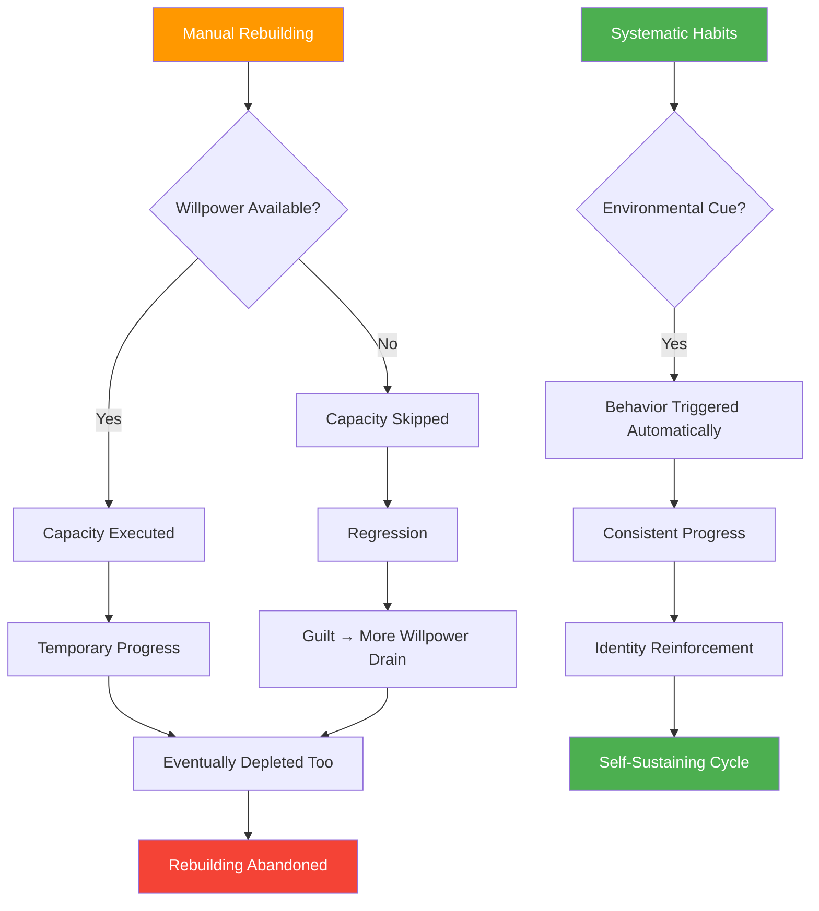
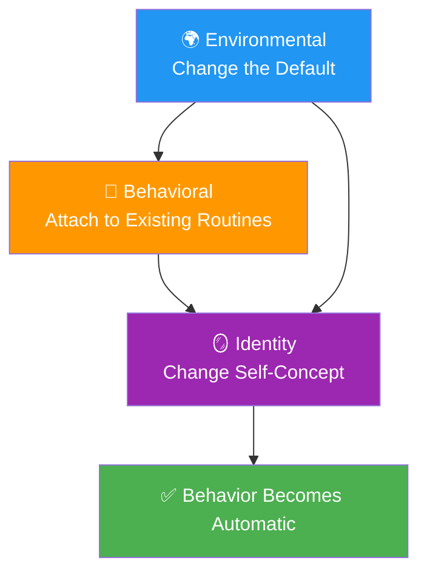
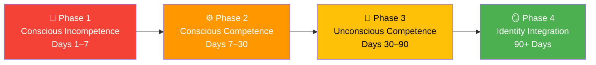
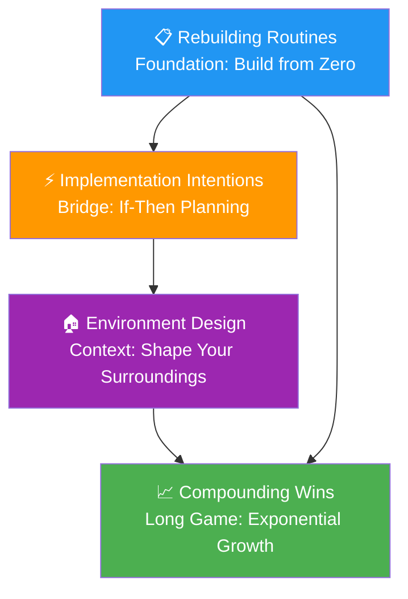
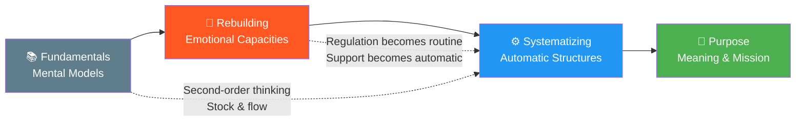

# Why Systems Beat Willpower

## Description

You have rebuilt. You have faced the emotional flood, built support systems, learned to regulate your emotions, and discovered that pain can be a teacher. The capacities are in place. But capacities that require constant willpower are fragile. Willpower is a finite resource — it peaks in the morning and drains through every decision, every distraction, every moment of resistance. By evening, your best intentions are no match for your depleted brain. Systems are what you build when you know your future self will be tired, hungry, and looking for the easy way out. This document introduces the systematizing module: why daily structures outperform daily motivation, how to build routines that compound even when you do not feel like it, and how the tools you built in the earlier modules provide the foundation for sustainable, automatic progress.

## Prerequisites

- [Getting Back Up](../../resilience/getting-back-up.md) — the capacity to recover after setbacks
- [Emotional Regulation](../../resilience/emotional-regulation.md) — the ability to process emotions without being overwhelmed
- [Building a Support System](../../resilience/building-a-support-system.md) — the relationships that sustain change
- [The Mechanism of Change](../../fundamentals/the-mechanism-of-change.md) — understanding how transformation happens at the psychological level

## Table of Contents

- [The Willpower Problem](#the-willpower-problem)
- [Why Rebuilding Is Not Enough](#why-rebuilding-is-not-enough)
- [What Systems Actually Are](#what-systems-actually-are)
- [The Developer's Advantage in System Design](#the-developers-advantage-in-system-design)
- [From Manual to Automatic](#from-manual-to-automatic)
- [What You Will Encounter in This Module](#what-you-will-encounter-in-this-module)
- [How Systems Connect to the Rest of the Journey](#how-systems-connect-to-the-rest-of-the-journey)
- [The Developer's Systematizing](#the-developers-systematizing)
- [Learning Tips](#learning-tips)
- [Glossary](#glossary)
- [Quick References](#quick-references)
- [Next Steps](#next-steps)

## Content / Material

### The Willpower Problem

Willpower is the most overvalued resource in personal development. Every self-help book, every productivity system, every motivational speech assumes that if you just want it badly enough, you can push through. This assumption is wrong. Not morally wrong — empirically wrong. The research is unambiguous: willpower is a finite resource that depletes with use.

Roy Baumeister's research on ego depletion demonstrated that willpower operates like a muscle. It fatigues with use. Every decision you make, every distraction you resist, every moment of self-control you exercise draws from the same limited pool. By the end of a typical workday, that pool is empty. You have spent your willpower on code reviews, standup meetings, lunch decisions, email triage, and the thousand micro-decisions that fill a developer's day. When you sit down at 8 PM to work on the change you committed to, the tank is empty.

```python
# The willpower economy
class WillpowerReserve:
    def __init__(self):
        self.capacity = 100
        self.remaining = 100

    def morning_routine(self):
        self.remaining -= 10  # decisions, resistance
        return self.remaining

    def work_day(self, meetings, code_reviews, decisions):
        self.remaining -= meetings * 5
        self.remaining -= code_reviews * 3
        self.remaining -= decisions * 2
        return self.remaining

    def evening_change_work(self):
        if self.remaining < 20:
            return "Willpower depleted. Change work postponed."
        return "Enough energy for deliberate practice."
```


The implication is devastating for willpower-based change strategies. If your plan for change depends on you being motivated, disciplined, and energized every day, your plan will fail. Not because you are weak. Because you are human. The willpower model of change sets you up for failure by assuming a resource that does not exist in sufficient quantity.

The practical consequences for developers are particularly acute. A developer's day is saturated with high-cognitive-load tasks: debugging complex logic, navigating architectural trade-offs, managing interpersonal dynamics in code reviews, context-switching between repositories. Each of these tasks draws from the same executive function pool that self-control requires. By the time evening arrives, the neural substrates of prefrontal cortex activity — the very region responsible for deliberate behavioral control — are metabolically exhausted. The desire to work on personal growth is genuine. The biological capacity to act on that desire is not.

This is not a new insight. The Stoics understood it two millennia ago. Epictetus did not say "try harder." He said "practice." Marcus Aurelius did not say "be more disciplined." He said "build habits that make discipline unnecessary." The ancient wisdom and the modern research converge on the same conclusion: willpower is a poor foundation for change. Systems are the answer.

### Why Rebuilding Is Not Enough

The rebuilding module gave you essential capacities: emotional regulation, support systems, pattern interruption, pain processing. These capacities are real and necessary. But they have a vulnerability: they require active engagement. Each time you regulate an emotion, you draw from the same willpower pool. Each time you interrupt a pattern, you spend cognitive energy. Each time you lean on your support system, you must overcome the resistance to vulnerability.

Rebuilding is a manual process. It requires you to show up, every day, and actively do the work. This is sustainable in the short term — during the intensity of the awakening and the immediate aftermath. But it is not sustainable in the long term. The human brain is designed for efficiency. It automates repetitive tasks. It builds habits to reduce cognitive load. If the practices of rebuilding remain manual forever, they will eventually be abandoned — not because you stop caring, but because your brain routes around anything that requires constant conscious effort.



The systematizing module solves this problem. It takes the manual practices of rebuilding and converts them into automatic systems — routines, habits, environmental designs, and implementation intentions that execute without requiring willpower. The goal is not to eliminate the need for consciousness. The goal is to make the right action the default action, so that when willpower is depleted, you still move in the right direction.

```python
# Rebuilding vs. systematizing
def manual_vs_systematic():
    manual = {
        "trigger": "conscious decision",
        "energy": "high — requires willpower",
        "reliability": "depends on current state",
        "sustainability": "months at most",
        "example": "I decide to journal every night",
    }

    systematic = {
        "trigger": "environmental cue or routine",
        "energy": "low — automatic",
        "reliability": "consistent regardless of state",
        "sustainability": "years, compounding",
        "example": "Journal is on my pillow, pen beside it, same time nightly",
    }

    return "The shift from manual to systematic is the shift from surviving to thriving"
```

### What Systems Actually Are

A system is any structure that makes the desired behavior automatic and the undesired behavior difficult. Systems operate on three levels: environmental, behavioral, and identity.

**Environmental systems** change your surroundings so that the right behavior is the easiest behavior. The journal on the pillow. The running shoes by the door. The phone in another room during focus time. The social media apps deleted from the phone. Environmental systems do not require willpower because they change the default. You do not resist temptation if the temptation is not present.

**Behavioral systems** change your routines so that the desired behavior is part of a sequence you already perform. The "if-then" planning that connects a new behavior to an existing habit. The morning routine that includes ten minutes of reflection. The evening routine that includes five minutes of gratitude. Behavioral systems leverage the brain's tendency to automate sequences. Once the sequence is established, the new behavior runs on autopilot.

**Identity systems** change how you see yourself so that the desired behavior is consistent with your self-concept. You are not a person who is trying to journal. You are a person who journals. You are not someone who is working on emotional regulation. You are someone who processes emotions. The identity shift is the deepest and most sustainable form of change because it operates at the level of who you believe you are.

```python
# The three levels of systems
class SystemLevels:
    def __init__(self):
        self.levels = {
            "environmental": {
                "mechanism": "change the default",
                "energy": "zero ongoing",
                "sustainability": "high",
                "example": "Running shoes by the door",
            },
            "behavioral": {
                "mechanism": "attach to existing routines",
                "energy": "low after establishment",
                "sustainability": "high",
                "example": "If morning coffee, then five minutes of journaling",
            },
            "identity": {
                "mechanism": "change self-concept",
                "energy": "zero — it is who you are",
                "sustainability": "highest",
                "example": "I am someone who reflects daily",
            },
        }
```



The most effective systems operate on all three levels simultaneously. The journal is on the pillow (environmental). The journaling happens as part of the bedtime routine (behavioral). You are a person who journals (identity). When all three levels align, the behavior becomes nearly automatic. It requires almost no willpower. It just happens.

The interaction between these levels creates a compounding reinforcement loop. Environmental cues trigger behavioral routines, and consistent execution of those routines gradually reshapes identity. A revised identity then motivates further environmental optimization, creating a self-reinforcing cycle that accelerates over time. This is why isolated environmental changes — removing junk food from the kitchen, for instance — often fail in isolation. Without the behavioral routine and identity shift, the environment eventually reverts. True system design integrates all three layers as a single, coherent architecture.

### The Developer's Advantage in System Design

Developers have an unfair advantage in system design, and it is not what most self-help content suggests. The advantage is not discipline or willpower. It is the ability to think in systems — to understand inputs, outputs, feedback loops, state transitions, and edge cases. These concepts map directly to habit design.

**Feedback loops in habits.** In software, feedback loops are mechanisms that read their own output and adjust behavior. In habits, feedback loops are the mechanisms that tell you whether the habit is working. A habit tracker is a feedback loop — it reads your behavior and adjusts your self-assessment. A weekly review is a feedback loop — it reads your progress and adjusts your strategy. Without feedback loops, habits drift. With them, habits self-correct.

**State management in routines.** In software, state management tracks the current condition of a system. In routines, state management means knowing where you are in the process. A morning routine has states: wake, stretch, journal, exercise, breakfast. Each state transitions to the next. When you know the state, you do not need to decide what to do next — the state tells you. The routine manages itself.

**Edge cases in habit design.** In software, edge cases are unusual conditions that cause failures. In habits, edge cases are the situations that break your routines. Travel disrupts your morning routine. Illness disrupts your exercise habit. A crisis disrupts your journaling practice. Good habit design anticipates edge cases and builds fallbacks. If you cannot do the full routine, do the minimum viable version. If you cannot exercise for an hour, walk for ten minutes. The edge case does not break the habit — it bends it.

**Error handling in setbacks.** In software, error handling anticipates failures and designs graceful responses. In habits, error handling means having a plan for when you fail. You miss a day. You break the streak. You fall back into an old pattern. The error handler does not panic. It logs the error, assesses the damage, and resumes from the last known good state. The habit is not broken by a single failure. It is broken by the failure to recover.

```python
# Developer concepts applied to habits
developer_habits = {
    "feedback_loop": "Habit tracker → weekly review → strategy adjustment",
    "state_management": "Morning routine: wake → stretch → journal → exercise → eat",
    "edge_cases": "Travel? → minimum viable routine. Sick? → walk for 10 minutes.",
    "error_handler": "Missed a day? → resume tomorrow. No guilt. No drama.",
}
```

**Graceful degradation.** In distributed systems, graceful degradation means the system continues to function at a reduced level when a component fails. Apply this to habits. When life disrupts your full routine — a sick child, a production outage, an unexpected travel day — your habit system should degrade gracefully, not crash entirely. The full morning routine is sixty minutes? The degraded version is five minutes of stretching and two minutes of journaling. The full exercise habit is a gym session? The degraded version is a ten-minute walk around the block. The degraded version preserves the identity signal: "I am someone who moves their body every day," even when circumstances prevent the full expression.

**Idempotency.** In API design, an idempotent operation produces the same result whether executed once or many times. Habits benefit from idempotency. If you journal twice in a day, nothing breaks. If you skip a day and journal twice the next, the system recovers without cascading failures. Designing habits with idempotency in mind means building systems that tolerate repletion and omission without requiring complex recovery logic.

**Dependency injection.** Rather than hard-coding a habit to a single context, design habits that can receive their context as input. The meditation habit does not depend on a specific chair, a specific app, or a specific time. It depends on a trigger: "after I sit down." The specific seat, the specific tool, the specific moment are injected at runtime. This makes the habit portable and resilient to environmental changes.

### From Manual to Automatic

The transition from manual rebuilding to systematic habits is not instantaneous. It follows a predictable curve that mirrors how habits actually form in the brain.



**Phase 1: Conscious incompetence.** You know you need the habit. You try to do it. It requires maximum effort. You forget. You resist. You do it inconsistently. This phase is frustrating but normal. The brain is building new neural pathways. The pathways are weak and unreliable. During this phase, the habit occupies significant working memory. You must consciously remind yourself, set alarms, leave sticky notes. The cognitive overhead is high, and the return on investment feels negligible. This is the phase where most people quit, mistaking the difficulty of initiation for evidence that the habit is wrong for them.

**Phase 2: Conscious competence.** The habit is becoming more reliable. You still need to remind yourself, but the reminders are less frequent. The behavior is becoming familiar. You can feel it starting to stick. This phase is encouraging but fragile. The habit is still vulnerable to disruption. The neural pathways are strengthening through repetition, but they have not yet reached the threshold of automaticity. A disruption of two or three days can reset progress significantly. This phase demands patience — the same quality that developers exercise when debugging a complex system that partially works but occasionally fails in mysterious ways.

**Phase 3: Unconscious competence.** The habit is automatic. You do it without thinking. Missing the habit feels wrong — like forgetting to brush your teeth. The neural pathways are strong and self-reinforcing. This phase is the goal. The habit has become part of your identity. The basal ganglia — the brain region responsible for habitual behavior — has assumed control from the prefrontal cortex. The behavior no longer requires executive function. It runs on the same neural infrastructure that handles tieing your shoes or checking your mirrors while driving.

**Phase 4: Identity integration.** The habit is no longer something you do. It is something you are. You do not "try to meditate." You are a person who meditates. You do not "attempt to journal." You are a writer. This phase represents the deepest level of automaticity — the point where the habit is no longer a behavior to be tracked but an attribute of your self-concept. The transition to this phase is often invisible. There is no single moment where it happens. It emerges gradually from the accumulation of Phase 3 consistency.

```python
# The habit formation curve
def habit_formation_phases(day):
    if day < 7:
        return "Phase 1: Maximum effort, frequent failure"
    elif day < 30:
        return "Phase 2: Moderate effort, improving consistency"
    elif day < 90:
        return "Phase 3: Low effort, mostly automatic"
    else:
        return "Phase 4: Identity — it is who you are"


def effort_curve(day):
    """Returns the approximate willpower cost as a percentage of initial cost."""
    import math
    # Exponential decay of effort over time
    return 100 * math.exp(-0.03 * day)


# Day 1: 100% effort
# Day 14: ~65% effort (the dip — most people quit here)
# Day 30: ~41% effort
# Day 60: ~16% effort
# Day 90: ~6% effort — near-automaticity
```

The phases are not strictly sequential. You may be in Phase 3 for one habit and Phase 1 for another. The timeline varies — some habits form in weeks, others take months. The key insight is that the effort decreases over time. What requires maximum willpower today will require almost none in three months. That is the promise of systems.

### What You Will Encounter in This Module

This module contains four documents, each addressing a core component of the systematizing stage.



**Rebuilding Routines** is the foundation. It covers how to build daily routines from zero — when you have no existing structure, when your discipline is depleted, and when the prospect of a routine feels overwhelming. It is the practical starting point for the transition from manual to systematic. This document addresses the common objection that routines feel rigid or constraining by demonstrating that the initial routine should be deliberately minimal — a single anchor habit, executed at the same time, in the same way, for thirty days. Rigidity is not the enemy of spontaneity; it is the scaffolding that makes spontaneity possible. A developer with a reliable morning routine has more creative freedom in the afternoon, not less.

**Implementation Intentions** addresses the gap between intention and action. It covers "if-then" planning, implementation intentions, and how to bridge the gap between knowing what to do and actually doing it. This is the technique that converts vague intentions into specific behaviors. The research by Peter Gollwitzer demonstrates that implementation intentions roughly double the probability of follow-through compared to mere goal intentions. The mechanism is straightforward: by specifying the situational cue in advance, you offload the decision from willpower-dependent executive function to automatic situational retrieval. The brain does not need to decide when to act; it recognizes the pre-specified trigger and initiates the behavior.

**Environment Design** addresses the physical and social context of your habits. It covers how to shape your surroundings so that the right behavior is the default — how to remove temptations, add cues, and design spaces that support the habits you want to build. This document draws on Kurt Lewin's field theory: behavior is a function of the person and their environment. Most habit advice focuses exclusively on the person — motivation, discipline, mindset. Environment design recognizes that modifying the environment is often more effective and requires less willpower than modifying the self.

**Compounding Wins** addresses the long game. It covers how small daily actions create exponential change over time, why the compounding effect is invisible in the early stages, and how to trust the process when nothing seems to be happening. This document confronts the most dangerous phase of habit formation: the plateau where effort is high but visible results are minimal. The mathematics of compounding guarantee that small daily improvements produce dramatic results over months and years — but the early stages feel futile. Understanding the mathematics provides the trust necessary to persist through the invisible growth phase.

Together, these four documents build the infrastructure that makes sustained change automatic. The rebuilding module gave you the capacity. The systematizing module gives you the machinery.

### How Systems Connect to the Rest of the Journey

Systematizing is the bridge between rebuilding and thriving. Without systems, rebuilding remains a manual process that eventually exhausts you. With systems, rebuilding becomes automatic, freeing your energy for the higher work of purpose.



**Systems → Purpose.** The energy you save through systems is the energy you invest in purpose. When your daily routines are automatic, you have cognitive surplus for the deeper questions: What matters? What is my mission? How do I build something that outlasts me? Purpose requires spaciousness. Systems create spaciousness. A developer who has automated their morning routine, their exercise habit, and their reflection practice has reclaimed roughly sixty to ninety minutes of cognitive energy per day — energy that was previously consumed by decision-making and willpower expenditure. That reclaimed energy is the raw material of purposeful work.

**Systems connect back to Rebuilding.** The systems you build are the infrastructure that sustains the capacities of rebuilding. Emotional regulation becomes a daily practice, not an occasional effort. Support maintenance becomes a routine, not an emergency response. Pain processing becomes a habit, not a crisis intervention. Systems make rebuilding sustainable. The critical distinction is between doing and being. Rebuilding requires doing — active, conscious, effortful. Systematizing converts doing into being — the behaviors become so deeply embedded that they no longer require the conscious decision to execute them.

**Systems connect back to Fundamentals.** The mental models you learned in fundamentals — second-order thinking, stock and flow, the Johari Window — are directly applicable to system design. Second-order thinking helps you anticipate the consequences of your habits. Stock and flow helps you distinguish between daily actions (flows) and identity shifts (stocks). The fundamentals are the theory. Systems are the application. Consider the compounding concept from fundamentals: a daily two-percent improvement compounds to a fifteen-fold increase over a year. That mathematical reality is invisible on any given day. Systems are the mechanism that makes the daily two-percent improvement reliable enough to compound.

```python
# The system's role in the journey
def systems_position():
    return {
        "after": "Rebuilding — you have the capacity",
        "purpose": "Make the capacity automatic",
        "before": "Purpose — free energy for meaning",
        "mechanism": "Environmental + behavioral + identity systems",
        "result": "Change that sustains without willpower",
    }
```

### The Developer's Systematizing

Developers face specific opportunities and traps during the systematizing phase.

**The over-engineering trap.** Developers love building systems. The temptation is to spend more time designing the perfect habit system than actually executing it. You build elaborate Notion dashboards, create intricate tracking spreadsheets, design beautiful morning routines on paper — and then do not follow them for more than a week. The system is not the habit. The habit is the behavior. Design the minimum viable system and start executing. Optimize later.

**The metrics trap.** Developers love measuring. The temptation is to track everything — habit completion rates, streak lengths, productivity metrics. Metrics are useful for feedback. They are destructive when they become the goal. The goal is not to have a perfect streak. The goal is to be the kind of person who does the thing. Metrics serve the habit. The habit does not serve the metrics.

**The version control approach.** Developers understand version control — making small, incremental changes and being able to roll back if something breaks. Apply this to habits. Start with one small change. Track it for two weeks. If it works, keep it. If it does not, adjust and try again. Do not overhaul your entire life in a single commit. Small, tested changes are more sustainable than dramatic rewrites.

**The automation mindset.** Developers automate repetitive tasks. Apply this to your life. What decisions do you make every day that could be pre-decided? What behaviors do you repeat that could be attached to existing routines? What environmental changes would make the right behavior automatic? Automate your life like you automate your deployments — remove the manual steps that consume willpower without adding value.

**The monitoring gap.** Developers instrument their applications with logging, metrics, and alerting. They know when a service degrades before users notice. Yet they rarely apply the same observability to their own habits. Build monitoring into your habit system. A simple daily check-in — two minutes at the end of the day — provides the telemetry data you need. Did you execute the habit? What was the friction level? What disrupted it? Without monitoring, habits drift silently. With monitoring, you detect degradation early and intervene before the habit collapses.

**Technical debt in habits.** Every developer understands technical debt: the accumulated cost of shortcuts that must eventually be repaid. Habits accumulate debt too. A skipped day is a small debt. Two skipped days is larger. A week of inactivity is significant debt. The danger of habit debt is the same as technical debt in code: it compounds silently. The codebase still runs, but it is becoming harder to maintain. Your habit system still functions, but it is becoming harder to sustain. Address habit debt early. The cost of recovery grows exponentially with the duration of neglect.

## Learning Tips

**Start with one habit.** Not three. Not five. One. The temptation to change everything at once is the same temptation that makes developers ship features without tests. Pick the one habit that would make the biggest difference in your daily life. Practice it for thirty days. Then add the next one.

**Design for your worst day, not your best.** Your habit system should work on the day you are exhausted, stressed, and demotivated. If the habit requires energy you do not have, it will fail on the days you need it most. Design the minimum viable version of each habit — the version you can do even when everything is going wrong.

**Use existing routines as anchors.** The most effective way to build a new habit is to attach it to an existing routine. You already brush your teeth every morning. Add two minutes of reflection after brushing. You already make coffee every afternoon. Add five minutes of journaling while the coffee brews. The existing routine is the anchor. The new habit is the attachment.

**Expect the dip.** Around day fourteen, most people experience a dip in motivation. The novelty has worn off. The habit feels tedious. The old self argues that it is not working. This is normal. The dip is the point where most people quit. Push through it. The other side of the dip is where the habit starts to stick.

**Build in recovery.** Your habit system should include rest days. Not every day needs to be perfect. A habit that requires perfection is a habit that will be abandoned at the first failure. Build in forgiveness. Miss a day? Resume tomorrow. No guilt. No drama. The streak is not the goal. The identity is the goal.

**Review quarterly.** Your life changes. Your habits should change with it. Every three months, review your habit system. What is working? What is not? What needs to be adjusted? What needs to be added? What needs to be dropped? The review keeps the system aligned with your actual life.

**Treat habit design like code review.** When you write a habit, examine it with the same rigor you apply to reviewing a pull request. Ask: Is this specific enough? Are the success criteria measurable? What are the failure modes? What happens when the preconditions are not met? A habit that has not been reviewed is a habit that has not been tested. Untested habits fail in production — which, in this case, means your actual life.

**Use version control for your habits.** Never make more than one significant habit change at a time. Just as you would not merge fifty untested commits into main, do not overhaul your entire routine in a single week. Make one change. Test it for two weeks. If it holds, commit it. If it does not, revert and try a different approach. Incremental, tested changes are more sustainable than dramatic rewrites.

**Leverage friction engineering.** Every behavior has a friction cost — the effort required to initiate it. Reduce friction for desired behaviors and increase friction for undesired ones. Want to journal? Place the journal on your pillow with the pen open to a blank page. Want to stop scrolling social media at night? Delete the apps and require a browser login with a complex password. Friction engineering is the most reliable form of behavioral design because it operates before willpower is even engaged.

**Track leading indicators, not lagging outcomes.** Developers know the difference between leading indicators (deployment frequency, code review turnaround) and lagging outcomes (revenue, user satisfaction). Apply this distinction to habits. The leading indicator is: did you execute the habit today? The lagging outcome is: did your life improve? Focus on the leading indicator. The outcomes follow the behaviors, but only if the behaviors are consistent. Measuring outcomes too early produces premature discouragement.

## Glossary

| Term | Definition |
|------|------------|
| Automaticity | The state of performing a behavior without conscious effort — the goal of habit formation |
| Compounding | The phenomenon where small, consistent actions produce exponential results over time |
| Conscious competence | The phase of habit formation where the behavior is reliable but still requires conscious effort |
| Dependent variable | The outcome you measure to determine whether a habit is working |
| Edge case | An unusual condition that disrupts a habit — travel, illness, crisis |
| Ego depletion | The finite nature of willpower — it depletes with use |
| Environmental design | Shaping your surroundings so that the right behavior is the default |
| Feedback loop | A mechanism that reads its own output and adjusts behavior — essential for habit self-correction |
| Friction engineering | Modifying the difficulty of initiating a behavior by reducing or increasing physical obstacles |
| Graceful degradation | The ability of a habit system to function at a reduced level when full execution is impossible |
| Habit debt | The accumulated cost of skipped habit executions that compounds over time |
| Identity shift | The deepest form of habit change — becoming the kind of person who naturally performs the behavior |
| Implementation intention | An "if-then" plan that specifies when and where a behavior will occur |
| Minimum viable habit | The smallest possible version of a habit that still provides value |
| Prefrontal cortex | The brain region responsible for executive function, decision-making, and deliberate behavioral control |
| Routine | A sequence of behaviors that runs automatically once established |
| State management | Knowing where you are in a routine and what comes next |
| System | Any structure that makes the desired behavior automatic and the undesired behavior difficult |
| Technical debt | The accumulated cost of shortcuts in habit design that must eventually be addressed |

## Quick References

- [Clear, J. (2018). Atomic Habits](https://www.goodreads.com/book/show/40121378-atomic-habits) — the definitive guide to building good habits and breaking bad ones
- [Duhigg, C. (2012). The Power of Habit](https://www.goodreads.com/book/show/12609433-the-power-of-habit) — the science of habit formation and how to apply it
- [Baumeister, R. & Tierney, J. (2011). Willpower](https://www.goodreads.com/book/show/12070092-willpower) — the science of self-control and how to strengthen it
- [Fogg, B. (2019). Tiny Habits](https://www.goodreads.com/book/show/44675208-tiny-habits) — the small changes that create big results
- [Wood, W. & Neal, D. (2007). Habits in Everyday Life](https://www.ncbi.nlm.nih.gov/pmc/articles/PMC2246079/) — the academic research on habit formation in daily life
- [Duckworth, A. (2016). Grit](https://www.goodreads.com/book/show/27213351-grit) — the role of sustained effort and habit in achievement
- [Newport, C. (2016). Deep Work](https://www.goodreads.com/book/show/25744920-deep-work) — on building routines that support focused, meaningful work
- [Parrish, S. (2016). The Art of Clear Thinking](https://www.goodreads.com/book/show/27493670-the-art-of-clear-thinking) — mental models for better decisions and habits

## Next Steps

- [Rebuilding Routines](../rebuilding-routines.md) — starting from zero and building daily consistency
- [Implementation Intentions](../implementation-intentions.md) — if-then planning that bridges intention and action
- [Environment Design](../environment-design.md) — shaping your surroundings so progress is the default
- [Compounding Wins](../compounding-wins.md) — how small daily actions create exponential change
- [Finding Your Mission](../../purpose/finding-your-mission.md) — the direction that systems serve
- [Legacy Thinking](../../purpose/legacy-thinking.md) — building for the long game
