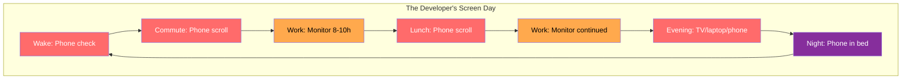
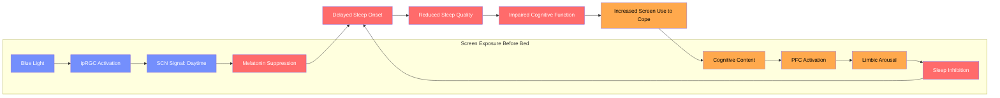
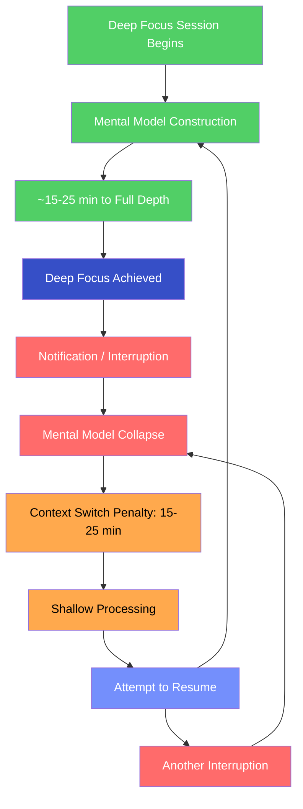
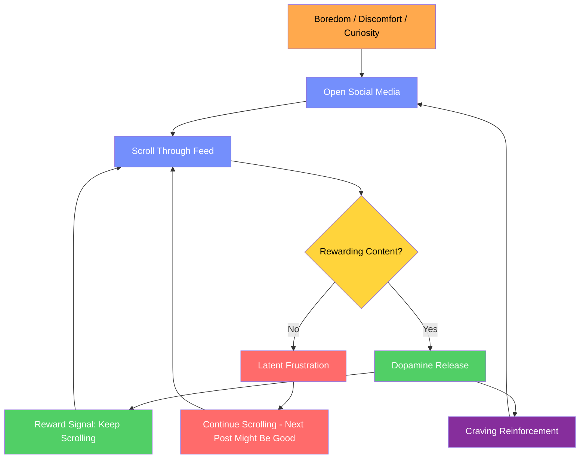
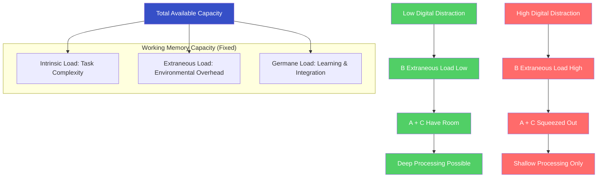
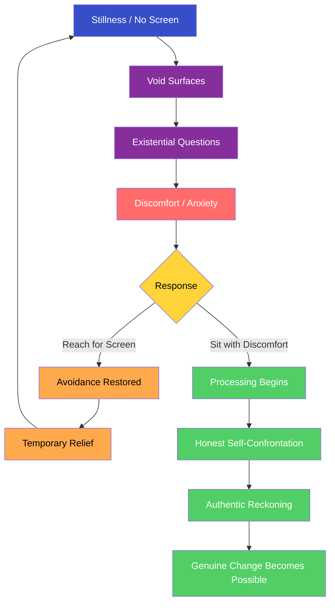

# Digital Detox

## Description

Developers live on screens — for work, for communication, for entertainment. This constant digital exposure creates screen fatigue, disrupts sleep, fragments attention, and erodes the capacity for deep thought. This document covers how to recover from digital overload: the neuroscience of screen-induced cognitive degradation, the dopamine mechanisms that make disconnection feel impossible, and the practical strategies for reclaiming your attention and your capacity for sustained thought.

## Prerequisites

- [Sleep Architecture](sleep-architecture.md) — how blue light from screens suppresses melatonin and disrupts the sleep architecture described here
- [Workspace Ergonomics](workspace-ergonomics.md) — the physical environment in which screen exposure occurs and how to mitigate its bodily effects
- [Why Physical Health Is the Foundation of Transformation](intro/why-health-matters.md) — the philosophical and scientific rationale for treating cognitive health as a physical concern

## Table of Contents

- [The Screen You Cannot Escape](#-the-screen-you-cannot-escape)
- [Computer Vision Syndrome and Screen Fatigue](#-computer-vision-syndrome-and-screen-fatigue)
- [Blue Light, Circadian Disruption, and Sleep](#-blue-light-circadian-disruption-and-sleep)
- [Attention Fragmentation from Notifications](#-attention-fragmentation-from-notifications)
- [The Dopamine Loop of Social Media and Infinite Scroll](#-the-dopamine-loop-of-social-media-and-infinite-scroll)
- [Information Overload and Cognitive Load](#-information-overload-and-cognitive-load)
- [Practical Digital Detox Strategies](#-practical-digital-detox-strategies)
- [Rebuilding the Capacity for Sustained Attention](#-rebuilding-the-capacity-for-sustained-attention)
- [The Void Behind the Screen](#-the-void-behind-the-screen)
- [Stewardship of Attention](#-stewardship-of-attention)

## Content / Material

### 📱 The Screen You Cannot Escape

The average developer spends between 10 and 15 hours per day in front of a screen. This is not an estimate born of anecdote — it is a measurement. Work requires a screen. Communication requires a screen. Entertainment, social connection, news, banking, dating, shopping, learning — all screens. The device in your pocket is not a tool you pick up and put down. It is an extension of your nervous system, a prosthetic attention organ that you carry everywhere and consult reflexively.

The problem is not that screens exist. The problem is that the human visual system, the circadian clock, the attentional networks, and the reward circuitry of the brain were not designed for this level of exposure. You are running modern software on hardware that was calibrated for a pre-digital environment. The mismatch is not subtle. It is measurable, documented, and accumulating.

For a developer, this is not an abstract health concern. Your profession depends on sustained attention, deep focus, and the ability to hold complex mental models for extended periods. The very cognitive capacities that make you valuable are the ones most degraded by unmanaged screen exposure. The irony is precise: the tool you use to create is the same tool that degrades your ability to create well.



The total screen-free time in a typical developer's day amounts to perhaps two or three hours — sleeping, showering, eating without a device, walking without earbuds. The screen has colonized every waking hour that has not been deliberately defended. This colonization is not accidental. It is the product of deliberate design choices made by companies whose revenue depends on maximizing your screen time.

### 👁️ Computer Vision Syndrome and Screen Fatigue

Computer vision syndrome (CVS) is a clinical condition affecting an estimated 50–90% of computer workers. It is not a single symptom but a constellation of visual and neurological disturbances caused by prolonged screen use. The symptoms are familiar to every developer:

- **Digital eye strain** — aching, burning, or tired eyes; blurred vision; difficulty focusing
- **Dry eyes** — reduced blink rate (from approximately 15 blinks per minute to 5–7) causes tear film instability and corneal exposure
- **Headaches** — sustained convergence (the eyes turning inward to focus on a near screen) fatigues the extraocular muscles
- **Neck and shoulder pain** — the "tech neck" posture (forward head, rounded shoulders) increases cervical spine load by up to 60 pounds
- **Difficulty focusing at distance** — prolonged near work induces temporary accommodative spasm, making distant objects appear blurred

| Symptom | Mechanism | Prevalence in Developers | Severity |
|---------|-----------|--------------------------|----------|
| Digital eye strain | Sustained near focus, reduced blink rate, glare | 70–90% | Moderate — cumulative, worsens across the day |
| Dry eyes | Blink rate reduction of 50–67% during screen use | 50–70% | Mild to moderate — chronic if unaddressed |
| Headaches | Extraocular muscle fatigue, convergence stress | 40–60% | Moderate — often misattributed to stress |
| Blurred vision | Accommodative spasm, tear film disruption | 30–50% | Mild — typically reversible with screen breaks |
| Neck/shoulder pain | Forward head posture, static muscle loading | 50–70% | Moderate to severe — becomes chronic musculoskeletal pathology over time |

The mechanism underlying CVS is the mismatch between the screen and the visual system. The human eye evolved to scan landscapes — focusing at varying distances, moving the eyes frequently across a wide visual field. The screen demands sustained near focus on a fixed, flat, luminous surface. The ciliary muscle that controls lens accommodation is held in a state of continuous contraction. The extraocular muscles that control eye movement are underused. The blink reflex is suppressed by cognitive engagement.

Holladay (2007) demonstrated that the visual system requires periodic distance focusing to reset accommodative tone. Without these resets, the ciliary muscle enters a state of sustained contraction that produces headaches, blurred vision, and eye fatigue. The 20-20-20 rule — every 20 minutes, look at something 20 feet away for 20 seconds — is the minimum intervention. But it is rarely practiced because the developer is, by definition, engaged with the screen.

For developers, CVS is not merely uncomfortable. It is cognitively expensive. The brain diverts attentional resources to manage the visual discomfort, reducing the resources available for the code. The developer who powers through eye strain is not being resilient — they are trading cognitive capacity for the appearance of productivity.

### 🌙 Blue Light, Circadian Disruption, and Sleep

The relationship between screen exposure and sleep disruption is one of the most consequential and well-documented effects of digital life. The mechanism involves two pathways: the spectral composition of screen light and the cognitive arousal generated by screen content.

#### The Spectral Problem

Screens emit light across the visible spectrum, but with a pronounced peak in the blue wavelength range (450–495 nm). This is not incidental — LED backlighting uses blue LEDs as the primary light source, with phosphor coatings converting part of the blue light into other wavelengths to produce white. The result is a light source that is disproportionately rich in blue wavelengths compared to natural daylight or incandescent light.

The human retina contains intrinsically photosensitive retinal ganglion cells (ipRGCs) that express melanopsin, a photopigment maximally sensitive to blue light at approximately 480 nm. These cells do not contribute to visual perception — their function is circadian signaling. When activated by blue light, ipRGCs send signals via the retinohypothalamic tract to the suprachiasmatic nucleus (SCN), which interprets the signal as "daytime" and suppresses melatonin production.

| Light Source | Blue Light Proportion | Melatonin Suppression | Circadian Impact |
|-------------|----------------------|----------------------|------------------|
| Natural daylight | ~25–30% | Maximum | Strongly alerting; anchors circadian rhythm |
| LED screen (typical) | ~35–40% | Significant | Delays melatonin onset by 1.5–3 hours |
| Incandescent bulb | ~10–15% | Minimal | Low circadian disruption |
| Candle light | <5% | Negligible | No circadian disruption |
| Red/amber light | <2% | None | No circadian disruption; may support melatonin |

Chang et al. (2015) at Harvard Medical School demonstrated that participants who read on a light-emitting e-reader for 4 hours before bedtime (compared to a printed book) experienced:
- Suppressed melatonin secretion by over 50%
- Delayed melatonin onset by approximately 1.5 hours
- Reduced REM sleep
- Increased sleep onset latency
- Reduced next-morning alertness
- Shifted circadian clock by more than 1.5 hours

The effect is dose-dependent: longer screen exposure in the evening produces greater circadian disruption. A developer who works on a monitor until 11 PM and then checks their phone in bed has subjected their circadian system to hours of blue-light signaling that directly opposes sleep onset.

#### The Arousal Problem

Blue light is only half the equation. The content displayed on screens — work emails, social media, news, video games, code — generates cognitive and emotional arousal that independently delays sleep. The prefrontal cortex and limbic system must be winding down before sleep can initiate. Screen content keeps both systems active.

The combination is devastating: screens suppress the chemical signal for sleep (melatonin) while simultaneously activating the neural systems that oppose sleep (PFC, amygdala). It is a double hit that no other pre-bedtime activity replicates.



The developer who scrolls through Twitter "to wind down" is doing the opposite of winding down. They are stimulating the amygdala with outrage, engaging the PFC with evaluation, suppressing melatonin with blue light, and then wondering why they cannot fall asleep. The cycle then requires more caffeine the next morning, which further degrades sleep quality that night. The spiral is mechanical, predictable, and entirely preventable.

### 🔔 Attention Fragmentation from Notifications

The human attentional system is not a spotlight that can be aimed at will. It is a volatile resource that must be captured and held — and it is astonishingly easy to disrupt. Research on task-switching costs demonstrates that every interruption imposes a measurable cognitive penalty.

#### The Cost of Interruption

Gonzalez and Mark (2004) studied information workers at a Fortune 500 company and found that the average worker switched activities every three minutes. Once interrupted, it took an average of 23 minutes and 15 seconds to return to the original task with full concentration. Mark, Gonzalez, and Harris (2005) confirmed this finding: workers were in a state of continuous task-switching, never reaching sustained focus on any single activity.

For developers, the implications are severe. Software development requires the maintenance of a complex mental model — the architecture of the system, the state of the variables, the relationships between modules, the potential edge cases. This mental model is fragile. It takes approximately 15–25 minutes to build a deep mental model of a codebase during a focus session. A single notification — a Slack message, an email alert, a phone buzz — collapses the model. The rebuild costs another 15–25 minutes.

| Interruption Source | Frequency (typical developer) | Recovery Time | Daily Focus Loss |
|---------------------|-------------------------------|---------------|------------------|
| Slack/Teams messages | 50–100 per day | 15–25 minutes per interruption | 2–4 hours |
| Email notifications | 30–50 per day | 10–20 minutes per interruption | 1.5–3 hours |
| Phone notifications | 60–150 per day | 10–15 minutes per interruption | 2–4 hours |
| Colleague tap-on-shoulder | 5–15 per day | 15–25 minutes per interruption | 1–3 hours |
| Meeting interruptions | 2–5 per day | 15–30 minutes post-meeting | 0.5–2 hours |

The total daily focus loss from interruptions alone — excluding the time spent on the interruptions themselves — ranges from 4 to 10 hours. The developer who believes they are "multitasking" is not performing two tasks simultaneously. They are switching between them, paying the full cognitive penalty of each switch.

#### The Attention Fragmentation Cascade



The cascade produces a specific cognitive state that developers recognize intimately: the sensation of having worked all day without producing anything of quality. You were busy. You responded to messages. You attended meetings. You made superficial edits. But you never reached depth. The mental model never stabilized. The code you wrote at 4 PM, after a day of fragmented attention, contains more defects than the code you wrote at 10 AM, before the interruptions accumulated.

The notification is the weapon. It does not need to be important. It does not need to be answered. It only needs to exist. The mere awareness that a notification might arrive creates a state of hypervigilance — an attentional split between the task and the anticipated interruption. This split reduces cognitive performance by 20–30% even when no notification actually arrives (Mark et al., 2008). The phone on the desk, face down, silent, still degrades your focus. Its presence is enough.

### 🔄 The Dopamine Loop of Social Media and Infinite Scroll

The design of social media platforms exploits the brain's reward circuitry with a precision that would be admired if it were not so destructive. The mechanism is the dopamine loop — a self-reinforcing cycle that hijacks the motivation system and creates compulsive usage patterns that the user experiences as voluntary but are, in fact, neurochemically driven.

#### The Variable Ratio Schedule

The slot machine is the most addictive gambling device ever created, and its addictive power derives from a single design principle: variable ratio reinforcement. The reward is delivered on an unpredictable schedule — sometimes after three pulls, sometimes after fifty. The unpredictability is the addiction. The brain cannot predict when the next reward will arrive, so it compels continued behavior "just in case" the next pull is the one.

Social media feeds operate on the same principle. Some scrolls reveal an interesting post. Most do not. You cannot predict which scroll will deliver the dopamine hit, so you keep scrolling. The infinite scroll — the absence of a natural stopping point — removes the structural cue that would otherwise terminate the behavior. There is no end of the page. There is no bottom of the feed. There is only the next post, and the next, and the next.



#### The Dopamine Mechanics

Dopamine is not the "pleasure chemical" as popularly described. It is the "wanting chemical" — the neurochemical that signals anticipated reward and motivates seeking behavior. Berridge and Robinson (1998) distinguished between "liking" (the hedonic experience of pleasure) and "wanting" (the motivational drive to pursue reward). Dopamine governs wanting, not liking.

This distinction is critical. Social media does not make you happy. It makes you want to continue scrolling. The difference is the difference between satisfaction and compulsion. You do not enjoy the 47th scroll through your feed. But the dopamine system — conditioned by thousands of prior rewards — compels you to continue. The behavior persists not because it feels good but because the brain expects it might feel good at any moment.

| Dopamine Trigger | Mechanism | Example |
|-----------------|-----------|---------|
| Novelty | New information activates dopaminergic novelty-seeking circuits | New post, new notification, new content |
| Social validation | Likes, comments, and shares activate the same circuits as monetary reward | Checking like count, counting followers |
| Anticipated reward | The variable ratio schedule keeps dopamine elevated during seeking | Scrolling "just one more" post |
| FOMO (fear of missing out) | Anxiety about missed social information drives checking behavior | Compulsive feed refresh, checking who is online |
| Confirmation bias | Algorithmic curation feeds content that confirms existing beliefs, producing comfortable dopamine | Echo chamber reinforcement |

#### The Tolerance Escalation

The dopamine system adapts to repeated stimulation through downregulation — the reduction of dopamine receptor density in response to chronic overstimulation. The practical experience is familiar: the first time you used social media, it was genuinely engaging. After months or years of use, it is less engaging but more compulsive. You scroll not because it is interesting but because stopping requires active resistance against the dopaminergic drive.

This is tolerance in the pharmacological sense. The same dose of stimulation produces a diminished response. The user compensates by increasing the dose — longer sessions, more platforms, faster scrolling. The behavioral addiction deepens while the subjective pleasure diminishes. The developer who spends three hours on social media and feels worse afterward is not making a rational choice. They are trapped in a neurochemical loop that they experience as freedom.

The relationship between social media use and depression is well-documented. Twenge and Campbell (2018) found that adolescents who spent more than three hours per day on social media had double the risk of depression compared to those who spent less than one hour. The mechanism is not purely dopaminergic — social comparison, cyberbullying, and sleep displacement all contribute. But the dopamine loop is the mechanism that makes the behavior difficult to stop, even when the user recognizes its harmful effects.

### 📚 Information Overload and Cognitive Load

The human working memory — the cognitive system responsible for holding and manipulating information in the short term — has a strictly limited capacity. Miller (1956) famously estimated this capacity at approximately seven items, plus or minus two. More recent research suggests the true capacity may be even lower — approximately four chunks of information held simultaneously (Cowan, 2001).

The digital environment overwhelms this capacity with a relentlessness that would have been incomprehensible a generation ago. A developer's typical information inputs include:

- Code across multiple repositories and branches
- Slack messages from multiple channels
- Email threads with nested context
- Documentation pages open in browser tabs
- Jira tickets with acceptance criteria
- Meeting notes and action items
- News feeds and social media posts
- Personal messages and notifications

Each of these inputs occupies working memory slots. The simultaneous presentation of multiple information streams does not merely distract — it saturates the cognitive system, leaving no capacity for deep processing.

#### The Cognitive Load Model

Sweller's (1988) cognitive load theory distinguishes three types of cognitive load:

| Load Type | Source | Developer Manifestation |
|-----------|--------|------------------------|
| **Intrinsic load** | The inherent complexity of the task itself | Understanding a complex codebase, reasoning about algorithms, designing architecture |
| **Extraneous load** | The unnecessary cognitive burden imposed by the environment | Multiple open tabs, notification popups, context-switching between tools |
| **Germane load** | The cognitive effort directed toward learning and schema formation | Pattern recognition, building mental models, integrating new knowledge |

The total cognitive load is the sum of all three, and it cannot exceed the working memory capacity. When extraneous load is high — as it is in a typical developer's environment — there is insufficient capacity for intrinsic and germane load. The developer cannot think deeply about the code because their working memory is saturated with the overhead of managing multiple information streams.



The practical experience of cognitive overload is recognizable: you cannot hold the full architecture of the system in your mind. You forget the context of the function you were modifying five minutes ago. You re-read the same paragraph of documentation three times without absorbing it. You feel mentally exhausted despite having produced nothing of substance. The exhaustion is real — cognitive overload depletes glucose and elevates cortisol — but the absence of output makes the exhaustion feel unjustified, which compounds into guilt and frustration.

The information overload problem is not solved by better note-taking systems, better organization tools, or better productivity apps. These are extraneous-load interventions that address symptoms while adding to the disease. The solution is reducing the total information input — which requires saying no to notifications, closing tabs, and accepting that you will not read every message, every article, or every update in real time.

### 🛠️ Practical Digital Detox Strategies

A digital detox is not a vacation from technology. It is the deliberate, systematic reduction of digital inputs that exceed the brain's processing capacity. The goal is not to eliminate screens — for a developer, this is neither possible nor desirable. The goal is to restore the boundary between necessary screen use and compulsive screen use.

#### The Notification Audit

The first intervention is the simplest and most immediately impactful: a comprehensive audit and reduction of notifications.

**Step 1: Inventory.** Open your phone's notification settings. List every application that currently sends notifications. Most developers discover 40–80 applications with notification permissions enabled.

**Step 2: Classify.** Sort each application into one of four categories:

| Category | Definition | Action |
|----------|-----------|--------|
| **Critical** | Notifications that require immediate response (on-call alerts, direct messages from family) | Keep enabled with sound/vibration |
| **Important** | Notifications that matter but can wait 1–4 hours (work Slack, calendar reminders) | Keep enabled but strip sound/vibration; batch-check 2–3 times daily |
| **Useful** | Notifications that provide information but never require immediate response (email, news) | Disable notifications entirely; check on your own schedule |
| **Noise** | Notifications that exist only to re-engage you (social media likes, game updates, promotional) | Disable entirely and permanently |

**Step 3: Execute.** Disable notifications for every application in the "Useful" and "Noise" categories. This typically eliminates 70–80% of incoming notifications. For "Important" categories, remove sound and vibration so that notifications arrive silently — visible only when you choose to look.

The effect is immediate. The reduction in ambient anxiety is noticeable within hours. The hypervigilant state — the low-grade expectation of interruption — begins to subside. Your phone becomes a tool you consult rather than a device that summons you.

#### The Phone-Free Morning

The first hour of the day is disproportionately consequential. Cortisol is naturally elevated during the cortisol awakening response (the first 60–90 minutes after waking), making the brain highly receptive to whatever inputs it encounters. Checking the phone during this window floods the brain with other people's priorities — emails, messages, news, social media — before your own cognitive systems have initialized.

The protocol:

1. **Buy an analog alarm clock.** The phone stops serving as an alarm clock. It charges in another room, not on the nightstand.
2. **Do not check the phone for the first 60 minutes after waking.** This is non-negotiable. The first hour belongs to you — not to Slack, not to email, not to Twitter.
3. **Use the first hour for activities that do not involve a screen.** Exercise, journal, read a physical book, eat breakfast without devices, meditate, walk outside. Any screen-free activity that sets the tone for the day.

The phone-free morning is the single highest-leverage digital detox intervention. It reclaims the most cognitively valuable hour of the day from the attention economy. Within two weeks, developers consistently report improved morning clarity, better mood regulation, and a stronger sense of agency over their day.

#### Screen Time Boundaries

| Strategy | Description | Implementation | Effectiveness |
|----------|-------------|----------------|---------------|
| **Time-boxed social media** | Allocate a fixed window (e.g., 20 minutes) for social media; stop when the timer expires | Use a physical timer or screen time app | High — removes the infinite scroll by imposing an external boundary |
| **Phone-free zones** | Designate physical spaces where phones are never present (bedroom, dining table) | Charging station outside the bedroom; no devices at meals | Very high — removes the cue entirely |
| **Focus mode / DND scheduling** | Automate Do Not Disturb during deep work blocks | OS-level focus modes activated on schedule | High — eliminates interruptions without requiring willpower |
| **Grayscale mode** | Remove color from the phone display to reduce visual reward salience | Accessibility settings on iOS/Android | Moderate — reduces the aesthetic appeal that drives engagement |
| **App deletion** | Remove apps from the phone; access via mobile browser only | Uninstall social media apps; use browser with friction | Very high — the friction of browser access disrupts the automaticity of opening the app |
| **Weekly digital sabbath** | One day per week with no recreational screen use | Full day, Saturday or Sunday, no social media, no news, no entertainment screens | Transformative — demonstrates that life continues without constant connectivity |

The common thread across all strategies is friction. The digital environment is designed to minimize friction — to make the transition from intention to consumption as seamless as possible. Effective detox strategies reintroduce friction at precisely the points where automaticity takes over. The developer who has to type a URL, log in through a browser, and navigate a non-mobile-optimized interface is far less likely to lose an hour to social media than the developer who taps an icon and is immediately in the feed.

#### The Notification Response Protocol

For notifications that cannot be eliminated — work Slack, urgent communications — the protocol is batched response rather than immediate reaction:

```python
# The notification response protocol
class NotificationBatcher:
    def __init__(self, check_interval_minutes=45):
        self.check_interval = check_interval_minutes
        self.accumulated = []

    def receive(self, notification):
        priority = self._classify(notification)
        if priority == "critical":
            return "respond_immediately"
        else:
            self.accumulated.append(notification)
            return "queued"

    def check_batch(self):
        responses = []
        for n in self.accumulated:
            response = self._handle(n)
            responses.append(response)
        self.accumulated = []
        return responses

    def _classify(self, notification):
        if "on-call" in notification.source:
            return "critical"
        return "batchable"

    def _handle(self, notification):
        return f"Handled: {notification.summary}"
```

The batching interval of 45 minutes is calibrated to the attention recovery time. Checking notifications less frequently than every 45 minutes allows deeper focus but may cause anxiety about missed messages. Checking more frequently than every 30 minutes fragments attention enough to prevent deep work. The 45-minute window aligns with a single Pomodoro cycle and provides enough time to build and maintain a mental model of the codebase.

### 🧠 Rebuilding the Capacity for Sustained Attention

The damage caused by chronic digital overstimulation is not permanent. The brain's attentional networks are plastic — they can be rebuilt. But the rebuilding requires deliberate practice, not mere abstinence. Stopping the damage is necessary but insufficient. You must also rebuild what was lost.

#### The Attention Restoration Process

The capacity for sustained attention is analogous to a muscle. It atrophies without use and strengthens with progressive overload. A developer who has spent years in a state of chronic attention fragmentation cannot simply decide to focus for four hours. The capacity must be rebuilt gradually.

**Week 1–2: 25 minutes of uninterrupted focus.** Use a single-task block of 25 minutes (one Pomodoro) with all notifications disabled, all tabs closed except the one required for the task, and the phone in another room. The goal is not productivity — it is retraining the attentional system to sustain focus for a continuous period. The first sessions will feel uncomfortable. The urge to check the phone will be strong. This is withdrawal from the dopamine loop, and it is expected.

**Week 3–4: 45 minutes of uninterrupted focus.** Extend the focus block to 45 minutes. The discomfort should be diminishing. The mental model of the task can now stabilize. Deep processing becomes possible for the first time in months or years.

**Week 5–8: 90 minutes of uninterrupted focus.** The 90-minute block aligns with the brain's ultradian rhythm — the natural 90-minute cycle of high and low alertness. This is the maximum sustainable focus period for most people. The developer who can sustain 90 minutes of deep focus has reclaimed the cognitive capacity that the attention economy stole.

| Phase | Duration | Expected Experience | Milestone |
|-------|----------|--------------------|-----------|
| Phase 1 (Weeks 1–2) | 25 minutes | High restlessness, frequent urge to check phone, sense of boredom | Completing 25 minutes without reaching for phone |
| Phase 2 (Weeks 3–4) | 45 minutes | Reduced restlessness, ability to hold mental model, first experiences of flow | Completing 45 minutes with deep engagement |
| Phase 3 (Weeks 5–8) | 90 minutes | Sustained flow states, reduced need for external stimulation, genuine absorption | Completing 90 minutes of deep work daily |

#### Deep Work as Practice

Cal Newport's (2016) concept of deep work — sustained, uninterrupted periods of intense cognitive focus — is not merely a productivity strategy. It is an attention rehabilitation protocol. The practice of deep work rebuilds the prefrontal cortex's capacity for sustained attention, strengthens the executive control network, and restores the ability to hold complex mental models.

The developer who practices deep work daily for eight weeks will notice measurable changes:
- The ability to hold a complete mental model of a system for the entire session
- Reduced anxiety during focus blocks (the amygdala habituates to the absence of notifications)
- Improved code quality (fewer defects, better architecture decisions)
- Greater enjoyment of the work itself (flow states produce intrinsic satisfaction)
- Reduced dependence on external stimulation (social media becomes less compelling)

The capacity for deep work is the competitive advantage that digital detox creates. In an economy where most developers operate in a state of chronic attention fragmentation, the developer who can focus for 90 minutes without interruption produces work of categorically different quality. The detox is not a retreat from professional life — it is an investment in the cognitive infrastructure that professional excellence requires.

### 🔮 The Void Behind the Screen

There is a reason you do not stop scrolling. It is not because the content is interesting. It is because the scrolling is keeping something at bay.

The screen is the most effective avoidance mechanism ever created. It provides continuous, low-effort stimulation that prevents the mind from confronting whatever lies beneath the surface. The developer who picks up their phone every time they experience a moment of stillness is not seeking information or connection. They are fleeing from silence. And in the silence, something waits.

When you remove the screen — when you sit in a room with no phone, no laptop, no television, no earbuds — the void surfaces. The existential questions that the screen has been suppressing rise to consciousness with startling speed. What am I doing with my life? Does this work matter? Am I happy? Why do I feel empty despite having everything I was told to want?

The void is not a malfunction. It is the truth that the screen has been helping you avoid. The constant input — the notifications, the feeds, the messages, the updates — creates an artificial sense of engagement that masks the absence of genuine meaning. You feel connected because you are receiving signals. But connection is not the same as communion. Signals are not the same as substance.



The digital detox, at its deepest level, is not about screens. It is about what you discover when the screens are gone. The attention you reclaim is valuable not merely because it makes you a better developer — it is valuable because it makes you capable of confronting the questions that matter. You cannot ask "What is the point of my work?" while scrolling through Twitter. The two activities are mutually exclusive. One requires depth. The other requires surface.

The developer who sits with the void — who lets the discomfort arise without reaching for the phone — is doing the hardest work of the level-up journey. They are choosing reality over simulation, substance over signal, the painful question over the comfortable distraction. This choice is the foundation upon which everything else in the journey is built.

The screen will always be there. The void will not wait forever. It will either be confronted or it will continue to accumulate, pressing harder against the defenses you erect to contain it. The digital detox opens the space for that confrontation. What you do with the space is the next step of the journey.

### ✝️ Stewardship of Attention

The Christian theological tradition frames attention not as a resource to be optimized but as a faculty to be offered. Attention is the means by which the mind engages with reality — with creation, with other persons, with truth. To squander attention is to squander the capacity for encounter. To steward it is to honor the structure of a mind that was made for focus, for presence, for depth.

The developer who spends twelve hours a day in fragmented, shallow, reactive screen engagement is not merely underperforming. They are misallocating a gift. The capacity for sustained attention — the ability to hold a complex problem in mind, to reason through it with rigor, to produce work of genuine quality — is not an accident of neural wiring. It is a faculty that exists for a purpose. When it is degraded by compulsive screen use, something more than productivity is lost. The capacity for contemplation, for prayer, for genuine presence with another person, for the sustained encounter with a text or an idea — all of these depend on the same attentional infrastructure that social media erodes.

The practice of digital discipline is, in this light, an act of stewardship. You are not merely reclaiming cognitive performance for professional gain. You are reclaiming the capacity to be present — to your work, to your relationships, to the still, small voice that cannot compete with the noise of a hundred notifications. The silence that feels uncomfortable when you first remove the screen is the silence in which deeper things become audible.

The digital sabbath — the practice of setting aside one day per week from recreational screen use — resonates with the ancient rhythm of Sabbath rest. It is not merely a cognitive recovery strategy. It is an assertion that your worth is not determined by your productivity, that your identity is not constituted by your digital presence, that there is a reality beyond the screen that deserves your attention. The developer who observes a digital sabbath is not falling behind. They are participating in a rhythm that acknowledges human limits and trusts that those limits are not failures but features of a design that includes rest, presence, and the willingness to be still.

## Learning Tips

- **Start with awareness, not abstinence.** Before changing any behavior, track your screen time for one week without judgment. Use your phone's built-in screen time tracker. The data itself is transformative — most developers are shocked by the discrepancy between their perceived and actual screen time.
- **Identify your trigger moments.** Digital overuse follows patterns. Track when you reach for the phone: boredom, anxiety, loneliness, task transition, waiting. The trigger is the intervention point. When you identify the trigger, you can substitute a screen-free behavior at that specific moment.
- **Replace, do not merely remove.** Removing screen time creates a vacuum. If you do not fill it with an alternative, you will relapse. Replace the evening scroll with reading. Replace the morning phone check with a walk. Replace the work-break social media check with stretching. The replacement must be as accessible as the screen behavior it replaces.
- **Use friction deliberately.** Move social media apps off the home screen. Log out of accounts after each session. Enable grayscale mode during focus hours. Delete apps you use compulsively and access them only through the browser. Every additional step between you and the content reduces the automaticity of the behavior.
- **Practice boredom.** Sit in a waiting room without your phone. Stand in a grocery line without scrolling. Ride an elevator without checking email. These micro-practices rebuild the tolerance for low-stimulation states that chronic screen use has eroded. The discomfort is temporary. The capacity it builds is permanent.
- **Measure output, not input.** The metric of a successful day is not how many messages you responded to or how many articles you read. It is whether you produced something of substance. Track your deep work hours, not your screen hours. The shift in measurement shifts the incentive structure.
- **Be patient with withdrawal.** The first week of reduced screen time will feel uncomfortable — restless, bored, anxious. This is the dopamine system recalibrating. The discomfort peaks around days three to five and subsides within two weeks. On the other side is a stable, sustainable level of engagement that does not require constant stimulation.

## Glossary

| Term | Definition |
|------|------------|
| **Accommodative spasm** | The sustained contraction of the ciliary muscle caused by prolonged near focus, producing blurred distance vision and eye fatigue |
| **Attentional blink** | The brief period (200–500 ms) after processing one stimulus during which a second stimulus is missed; a measure of attentional capacity |
| **Blue light** | Light in the 450–495 nm wavelength range, emitted disproportionately by LED screens, which activates melanopsin in ipRGCs and suppresses melatonin |
| **Computer vision syndrome (CVS)** | A constellation of visual and neurological symptoms — eye strain, dry eyes, headaches, blurred vision — caused by prolonged screen use |
| **Cognitive load** | The total amount of mental effort required for a task, comprising intrinsic load (task complexity), extraneous load (environmental overhead), and germane load (learning effort) |
| **Dopamine** | A neurotransmitter governing "wanting" (motivational drive toward anticipated reward) rather than "liking" (hedonic pleasure); the neurochemical substrate of social media addiction |
| **Extraneous cognitive load** | Unnecessary cognitive burden imposed by the environment — multiple tabs, notifications, context switching — that competes with task-relevant processing |
| **Flow state** | A condition of complete absorption in a task, characterized by deep focus, loss of self-referential thinking, and intrinsic satisfaction; requires sustained uninterrupted attention |
| **Infinite scroll** | A UI design pattern that eliminates natural stopping points in content feeds, removing structural cues that would terminate the consumption behavior |
| **ipRGCs (intrinsically photosensitive retinal ganglion cells)** | Specialized retinal cells that express melanopsin and signal circadian timing to the SCN; maximally sensitive to blue light at ~480 nm |
| **Melatonin** | A hormone produced by the pineal gland in response to darkness; signals the body to prepare for sleep; suppressed by blue-wavelength light exposure |
| **Melanopsin** | A photopigment in ipRGCs maximally sensitive to blue light (~480 nm); mediates non-visual light responses including circadian entrainment and melatonin suppression |
| **Retinohypothalamic tract** | The neural pathway connecting ipRGCs in the retina to the suprachiasmatic nucleus (SCN); the primary channel for light-based circadian signaling |
| **Social jetlag** | The circadian disruption caused by misalignment between sleep timing on workdays and free days |
| **Suprachiasmatic nucleus (SCN)** | The master circadian clock in the hypothalamus; receives light input from ipRGCs and coordinates circadian rhythms across the body |
| **Ultradian rhythm** | A biological cycle shorter than 24 hours; the 90-minute cycle of high and low alertness during waking that governs sustainable deep focus periods |
| **Variable ratio reinforcement** | A reward schedule in which reinforcement is delivered after an unpredictable number of responses; the most addiction-prone schedule, used by slot machines and social media feeds |
| **Working memory** | The cognitive system responsible for temporarily holding and manipulating information; limited to approximately four chunks of information simultaneously |

## Quick References

- [Center for Humane Technology](https://www.humanetech.com/) — organization dedicated to realigning technology with human well-being; founded by former Google design ethicist Tristan Harris
- [Screen Time and the Developing Brain — Madigan et al. (2019)](https://www.ncbi.nlm.nih.gov/pmc/articles/PMC6466226/) — meta-analysis of screen time effects on child development, relevant to understanding neuroplasticity and screen effects across the lifespan
- Newport, C. (2016). *Deep Work: Rules for Focused Success in a Distracted World*. Grand Central Publishing. — the foundational text on deep work as a professional and cognitive practice
- Newport, C. (2019). *Digital Minimalism: Choosing a Focused Life in a Noisy Network*. Portfolio. — a philosophy of technology use that aligns intentional engagement with genuine values
- Alter, A. (2017). *Irresistible: The Rise of Addictive Technology and the Business of Keeping Us Hooked*. Penguin. — the neuroscience of behavioral addiction in the context of digital technology
- Harris, T. (2016). ["How Technology Hijacks People's Minds"](https://medium.com/thrive-global/how-technology-hijacks-peoples-minds-from-a-magician-and-google-s-design-ethicist-56d62ef5edf3) — a practitioner's account of the persuasion techniques embedded in technology design
- Chang, A.-M., et al. (2015). Evening use of light-emitting eReaders negatively affects sleep, circadian timing, and next-morning alertness. *PNAS*, 112(4), 1232–1237. — the definitive study on how e-reader use before bed disrupts circadian rhythm and sleep
- Gonzalez, V. M., & Mark, G. (2004). "Constant, Constant, Multi-tasking Craziness": Managing Multiple Working Worlds. *Proceedings of CSCW*, 111–120. — the study establishing that information workers switch activities every three minutes
- Berridge, K. C., & Robinson, T. E. (1998). What is the role of dopamine in reward: hedonic impact, reward learning, or incentive salience? *Brain Research Reviews*, 28(3), 309–369. — the foundational paper distinguishing "wanting" from "liking" in the dopamine system

## Next Steps

The attention reclaimed through digital detox is the prerequisite for the deeper work of the journey.

- [Sleep Architecture](sleep-architecture.md) — the neuroscience of sleep cycles, which are directly damaged by the screen habits described here; improving sleep and reducing screen exposure are synergistic interventions
- [Recognizing the Void](../meaning/recognizing-the-void.md) — the existential confrontation that surfaces when the screens are removed and the distractions cease; the deeper purpose of the digital detox
- [The Decision to Change](../meaning/the-decision-to-change.md) — the moment of commitment that follows recognizing both the digital trap and the void behind it
- [Nutrition for Developers](nutrition-for-developers.md) — the gut-brain axis and dietary strategies that complement the cognitive restoration achieved through attentional discipline
- [Emotional Regulation](../resilience/emotional-regulation.md) — the skill of processing emotions without digital avoidance; depends on the stillness that digital detox creates
