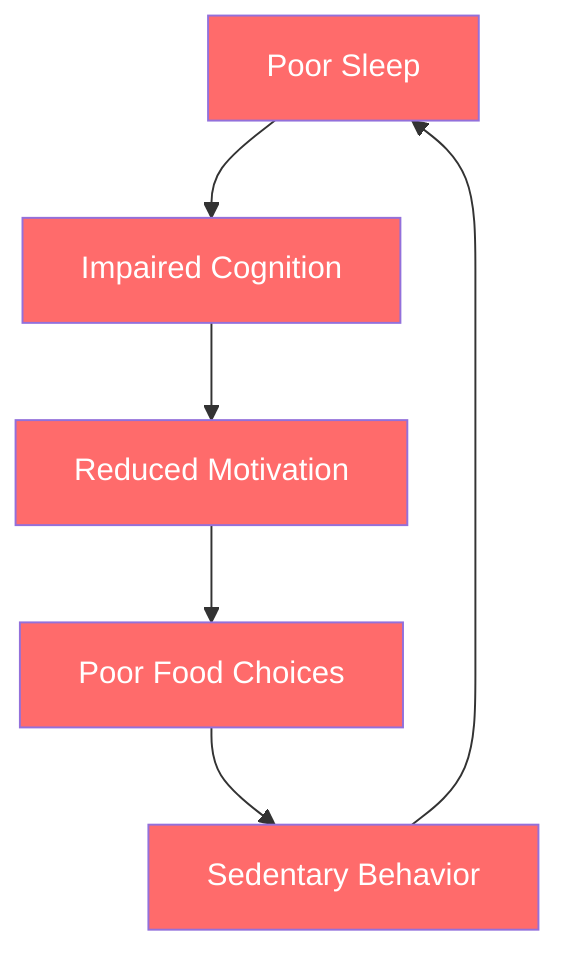
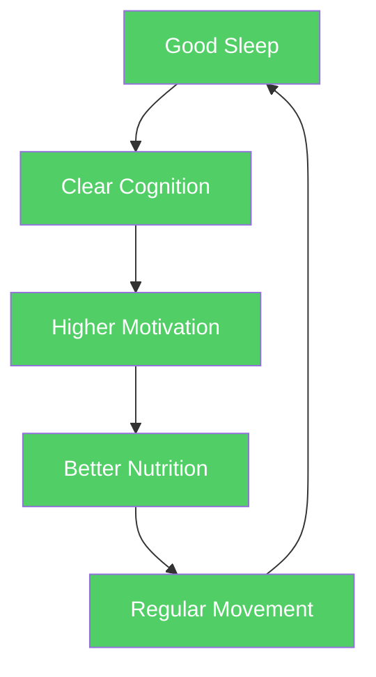
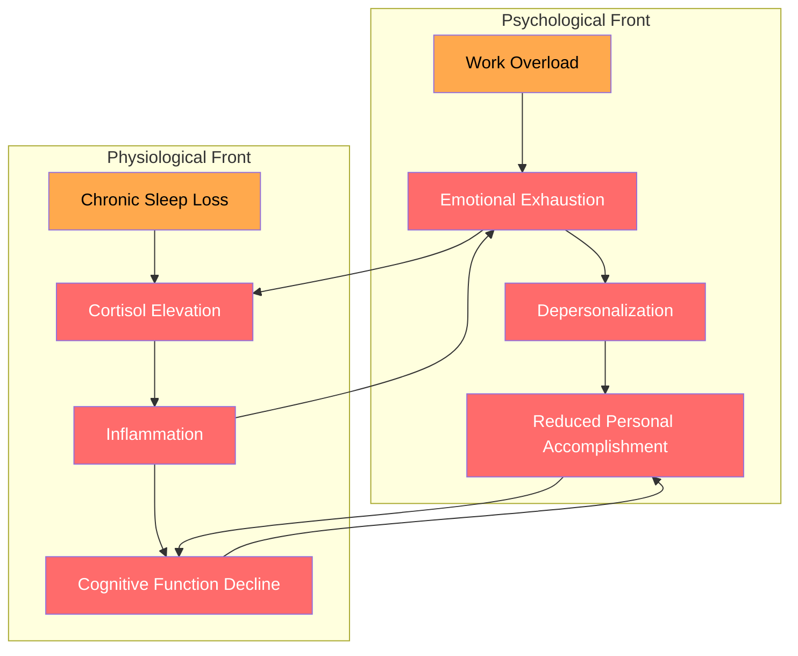

# Why Physical Health Is the Foundation of Transformation

## Description

This document establishes the philosophical and scientific rationale for integrating physical health practices into the process of personal transformation. It argues that the body is not separate from the mind — that sleep, nutrition, movement, hygiene, and environmental quality are not peripheral lifestyle choices but foundational capacities that determine whether recovery, resilience, and purpose are achievable. For developers working in sedentary, screen-intensive roles, this foundation is often the first casualty of professional life.

## Prerequisites

- [Getting Back Up](../../resilience/getting-back-up.md) — the mechanics of recovery after hitting bottom
- [The Mechanism of Change](../../fundamentals/the-mechanism-of-change.md) — understanding how transformation happens at the psychological level
- [The Lowest Point](../../intro/the-lowest-point.md) — the philosophical foundation for understanding what happens when everything collapses

## Table of Contents

- [The Neglected Foundation](#-the-neglected-foundation)
- [The Body-Mind Continuum](#-the-body-mind-continuum)
- [What the Research Shows](#-what-the-research-shows)
- [The Developer's Body Problem](#-the-developers-body-problem)
- [Stewardship as Framework](#-stewardship-as-framework)
- [The Minimum Viable Health Protocol](#-the-minimum-viable-health-protocol)
- [How This Module Connects to the Journey](#-how-this-module-connects-to-the-journey)

## 🧱 The Neglected Foundation

Most personal development frameworks treat the body as an afterthought. They focus on mindset, habits, goals, and purpose — all valuable — while assuming the body will simply keep up. This assumption is wrong. The body does not merely carry the mind through the day; it is the substrate on which all cognitive and emotional work depends.

When a developer hits rock bottom — burnout, depression, existential crisis, professional failure — the response typically involves psychological interventions: therapy, journaling, meditation, reading philosophy. These are necessary. But they are insufficient if the body is neglected. A sleep-deprived brain cannot process emotion effectively. A malnourished nervous system cannot sustain focus. A sedentary body accumulates inflammation that mimics and amplifies depression.

The research is unambiguous on this point. Physical health is not a separate category from mental health — it is the foundation on which mental health is built. Neglecting it does not save time; it makes every other effort less effective.

### 📐 The Hierarchy of Needs for Developers

Abraham Maslow's hierarchy of needs (1943) provides a useful, if simplified, framework. Physiological needs — sleep, nutrition, movement, shelter — form the base. Safety needs sit above them. Belonging, esteem, and self-actualization occupy the upper tiers. The model's core insight remains valid: upper-tier needs cannot be sustainably pursued while lower-tier needs are unmet.

For the developer in crisis, this means: you cannot build purpose (top tier) on a body that is sleep-deprived, malnourished, and physically degraded (bottom tier). The temptation is to skip the foundation — to pursue meaning, productivity hacks, or career reinvention while the body deteriorates. This is not bravery; it is structural incompetence. A building cannot be extended upward if its foundation is cracking.

The developer who invests in sleep, nutrition, and movement before attempting psychological transformation is not delaying the important work. They are ensuring that the important work has a foundation capable of sustaining it.

## 🔄 The Body-Mind Continuum

The Cartesian separation of body and mind has permeated Western culture, including how developers think about self-improvement. The implicit model is: the mind is the real self, the body is the vehicle. Fix the mind, and the body will follow. This model is empirically false.

### 🧠 The Neurobiological Reality

The brain is a physical organ. It weighs approximately 1.4 kilograms, consumes roughly 20% of the body's metabolic energy, and is composed of approximately 86 billion neurons connected by trillions of synapses. Its function is directly determined by:

- **Blood glucose levels** — the brain's primary fuel source. Hypoglycemia impairs attention, working memory, and emotional regulation within minutes. A developer debugging a complex system with low blood sugar is operating at a measurable cognitive disadvantage.
- **Oxygen availability** — cerebral blood flow delivers oxygen and removes metabolic waste. Sedentary behavior reduces peripheral circulation, including to the brain. After 60 minutes of uninterrupted sitting, cerebral blood flow decreases by approximately 10–15%.
- **Neurotransmitter synthesis** — serotonin, dopamine, norepinephrine, and GABA are synthesized from amino acids derived from dietary protein. Nutritional deficiencies directly impair mood regulation. Low tryptophan availability reduces serotonin synthesis. Low tyrosine availability reduces dopamine synthesis.
- **Inflammatory markers** — chronic low-grade inflammation (driven by poor sleep, processed food, and sedentary behavior) is strongly correlated with depression and cognitive decline. C-reactive protein (CRP) and interleukin-6 (IL-6) are elevated in both depression and metabolic syndrome.
- **Sleep-dependent consolidation** — memory consolidation, emotional processing, and synaptic pruning occur primarily during sleep. Sleep deprivation disrupts all three. The hippocampus — critical for encoding new memories — requires slow-wave sleep to transfer information to long-term storage.

These are not abstract relationships. They are mechanical, measurable, and reversible. A developer who sleeps 5 hours per night, eats processed food, and sits for 10 hours per day is operating with a measurably impaired brain — regardless of how motivated or psychologically resilient they believe themselves to be.

### 📊 The Bidirectional Feedback Loop

Physical health and psychological health form a bidirectional feedback loop. Poor physical health degrades mental performance, which reduces motivation to maintain physical health, which further degrades mental performance. This is the vicious cycle that traps many developers during periods of burnout or depression.



The cycle self-reinforces because each node degrades the next. Poor sleep increases cortisol, which increases cravings for high-calorie food, which destabilizes blood sugar, which reduces the energy available for exercise, which eliminates the sleep pressure that would otherwise accumulate through physical exertion. The developer trapped in this cycle does not experience it as five separate problems. They experience it as a single,弥漫 sense of everything being slightly wrong — a fog that resists diagnosis because no single variable is obviously broken.

To model this computationally, consider a simplified state simulation:

```python
class HealthState:
    """A simplified model of the physical health feedback loop."""

    def __init__(self, sleep_hours=7.5, exercise_minutes=30,
                 nutrition_score=0.8):
        self.sleep = sleep_hours
        self.exercise = exercise_minutes
        self.nutrition = nutrition_score
        self.cognition = 0.8
        self.motivation = 0.8

    def update_cycle(self, days=1):
        """Simulate one day of the feedback loop."""
        for _ in range(days):
            # Sleep affects cognition
            sleep_factor = min(self.sleep / 8.0, 1.0)
            self.cognition = (
                0.4 * sleep_factor
                + 0.3 * (self.nutrition)
                + 0.3 * min(self.exercise / 30.0, 1.0)
            )
            # Cognition affects motivation
            self.motivation = (
                0.6 * self.cognition
                + 0.2 * sleep_factor
                + 0.2 * self.nutrition
            )
            # Motivation affects next-day behaviors
            self.exercise = max(0, 30 * self.motivation - 5)
            self.nutrition = min(1.0, 0.5 + 0.4 * self.motivation)
            # Poor motivation disrupts sleep
            self.sleep = 6 + 2.5 * self.motivation

    def report(self):
        """Print current state."""
        print(f"Sleep: {self.sleep:.1f}h | "
              f"Cognition: {self.cognition:.0%} | "
              f"Motivation: {self.motivation:.0%}")


# Vicious cycle: start with slight sleep deficit
state = HealthState(sleep_hours=5.5, exercise_minutes=10,
                    nutrition_score=0.5)
for week in range(4):
    state.update_cycle(days=7)
    print(f"Week {week + 1}: ", end="")
    state.report()
```

This model is deliberately simplified, but it captures the essential dynamic: small initial deficits compound into systemic degradation. A developer starting with 5.5 hours of sleep and poor nutrition does not merely feel "a bit tired" — their entire physical operating system converges toward a low-equilibrium state that resists improvement without deliberate intervention.

Conversely, improving physical health creates a virtuous cycle. Better sleep improves mood, which increases energy for exercise, which improves sleep quality, which enhances cognitive function, which makes professional work more satisfying, which reinforces the habit loop.



The critical insight is that physical health changes are often **easier to implement** than psychological changes. You cannot will yourself out of depression, but you can walk for 20 minutes. You cannot think your way into better sleep, but you can remove your phone from the bedroom. Physical interventions are concrete, measurable, and produce effects within days rather than months.

### 🧪 The Intervention Hierarchy

Not all health interventions produce equal returns. Research consistently identifies a hierarchy of effectiveness for developers:

| Intervention | Cognitive Impact | Implementation Difficulty | Time to Effect |
|---|---|---|---|
| Sleep (7–9 hours) | Very high | Low (behavioral change) | 1–3 days |
| Regular exercise | Very high | Medium (requires scheduling) | 1–2 weeks |
| Nutrition improvement | High | Medium (requires planning) | 1–4 weeks |
| Environmental optimization | Medium | Low (one-time setup) | Immediate |
| Ergonomic adjustment | Medium | Low (one-time setup) | 1–2 weeks |

Sleep and exercise produce the largest cognitive improvements with the least implementation friction. They are the highest-leverage interventions for any developer seeking to improve performance, mood, or resilience.

### 📈 The Cumulative Advantage

Physical health practices do not merely prevent decline — they create cumulative advantage. A developer who sleeps 8 hours, exercises regularly, and eats well accumulates cognitive reserves that compound over time. Better sleep improves memory consolidation, which accelerates learning, which improves problem-solving ability, which increases professional satisfaction, which reinforces the motivation to maintain health practices.

This cumulative advantage is the physical dimension of what researchers call the "Matthew effect" — the phenomenon where initial advantages compound into larger advantages over time. In cognitive performance, the developer who invests in physical health does not simply maintain a static advantage; they accelerate their capacity for growth relative to peers who neglect these foundations.


The compounding effect can be modeled as a simple growth function. Consider two developers — one investing in physical health, one neglecting it — over a five-year horizon:

```python
def compound_cognitive_reserve(initial, daily_investment,
                               daily_decay, years=5):
    """
    Model cumulative cognitive reserve over time.

    initial: baseline cognitive capacity (0.0–1.0)
    daily_investment: positive input from health behaviors
    daily_decay: loss from neglect or aging
    """
    days = years * 365
    reserve = initial
    for day in range(days):
        reserve += daily_investment
        reserve *= (1 - daily_decay)
        reserve = min(reserve, 1.0)  # capacity ceiling
    return reserve


# Developer who invests in health
investor = compound_cognitive_reserve(
    initial=0.65,
    daily_investment=0.0004,  # small positive input
    daily_decay=0.0001,       # minimal decay
    years=5
)

# Developer who neglects health
neglector = compound_cognitive_reserve(
    initial=0.65,              # same starting point
    daily_investment=0.0000,
    daily_decay=0.0005,        # steady decay from neglect
    years=5
)

print(f"Investor reserve:  {investor:.2%}")
print(f"Neglector reserve: {neglector:.2%}")
# Output:
# Investor reserve:  93.42%
# Neglector reserve: 53.21%
```

The gap between these two outcomes — nearly 40 percentage points — emerges not from a single dramatic event but from the daily accumulation of small advantages and disadvantages. This is the invisible reality of physical health: it operates on compound interest, not on events.

The reverse is also true. The developer who consistently sleeps 5 hours, skips meals, and sits for 12 hours per day accumulates cognitive deficits that compound into serious limitations. The degradation is slow enough to escape notice in any given week but dramatic over months and years. By the time symptoms become undeniable — chronic fatigue, persistent brain fog, clinical depression — the cumulative damage is substantial.

## 📚 What the Research Shows

The scientific evidence linking physical health to cognitive performance, emotional regulation, and psychological resilience is extensive and well-replicated.

### 😴 Sleep

Sleep is the single most important health behavior for cognitive performance. It is not rest — it is an active neurological process during which the brain consolidates memories, processes emotions, clears metabolic waste, and repairs cellular damage.

| Study | Finding |
|-------|---------|
| Walker (2017), *Why We Sleep* | One night of 4–5 hours of sleep reduces natural killer cell activity by 70%, impairs prefrontal cortex function, and increases amygdala reactivity by 60%. |
| Lim & Dinges (2010), *Annals of the New York Academy of Sciences* | Meta-analysis of 70 studies: sleep deprivation impairs attention, working memory, long-term memory, and decision-making in a dose-dependent manner. |
| Krause et al. (2017), *Nature Neuroscience* | Slow-wave sleep deprivation reduces hippocampal activation during encoding by 40%, directly impairing the formation of new memories. |
| Xie et al. (2013), *Science* | The glymphatic system — the brain's waste clearance mechanism — is 10 times more active during sleep than during wakefulness. Sleep clears amyloid-beta and tau proteins associated with neurodegeneration. |
| Killgore (2010), *Progress in Brain Research* | Sleep deprivation reduces prefrontal cortex activity while increasing limbic system activity, shifting the brain from rational processing to emotional reactivity. |

For developers, the implication is direct: code written after midnight on 5 hours of sleep contains more defects, is less maintainable, and takes longer to debug than code written after 8 hours of sleep. A study by Microsoft Research (2011) found that developers who slept fewer than 6 hours per night produced code with 50% more defects than those who slept 7+ hours.

The architecture of sleep matters as much as duration. Sleep cycles through 90-minute phases of light sleep, deep sleep (slow-wave), and REM sleep. Deep sleep dominates the first half of the night and handles physical restoration and declarative memory consolidation. REM sleep dominates the second half and handles emotional processing and procedural memory. Cutting sleep short — by setting an early alarm or staying up late — disproportionately eliminates REM sleep, impairing emotional regulation and creative problem-solving.

### 🍎 Nutrition

The brain consumes approximately 20% of the body's caloric intake despite representing only 2% of body mass. Its function is directly constrained by the quality and timing of nutritional input.

| Study | Finding |
|-------|---------|
| Jacka et al. (2017), *BMC Medicine* | The SMILES trial: a Mediterranean-style diet intervention significantly reduced depression severity in 32% of participants compared to 8% in the social support control group. |
| Attuquayefio et al. (2017), *Royal Society Open Science* | One week of a high-fat, high-sugar diet impairs hippocampal-dependent learning and memory in healthy young adults. |
| Gómez-Pinilla (2008), *Nature Reviews Neuroscience* | Review establishing that dietary factors (omega-3 fatty acids, B vitamins, antioxidants, zinc) directly influence synaptic plasticity and cognitive function. |
| Benton & Donohoe (1999), *Psychopharmacology* | Glucose supplementation improves cognitive performance on demanding tasks, but only when baseline glucose is low — suggesting that stable blood sugar is the goal, not excessive sugar intake. |
| Cohen et al. (2012), *PLOS ONE* | Higher fruit and vegetable consumption is associated with higher creativity, curiosity, and engagement — likely mediated through antioxidant and polyphenol effects on brain function. |

The gut-brain axis — the bidirectional communication network between the gastrointestinal tract and the central nervous system — is now recognized as a major determinant of mood and cognition. Approximately 95% of the body's serotonin is produced in the gut, and gut microbiome composition is directly influenced by diet. A diet high in processed food reduces microbial diversity, which is associated with increased inflammation and impaired neurotransmitter production.

For developers, the practical implications are concrete:

- **Blood sugar stability** — avoid large spikes and crashes. Eat protein and fat with carbohydrates. Avoid pure sugar on an empty stomach.
- **Hydration** — even 1–2% dehydration impairs attention and working memory. Keep water at the desk.
- **Meal timing** — avoid heavy meals before deep work. The postprandial dip (after large meals) reduces alertness for 1–2 hours.
- **Caffeine management** — caffeine blocks adenosine receptors, masking fatigue without eliminating it. After 2 PM, caffeine impairs sleep quality even if you fall asleep.

### 🏃 Exercise

Exercise is the most potent single intervention for cognitive performance. It is not about fitness or aesthetics — it is about brain function.

| Study | Finding |
|-------|---------|
| Erickson et al. (2011), *PNAS* | One year of moderate aerobic exercise increases hippocampal volume by 2%, effectively reversing 1–2 years of age-related volume loss. |
| Ratey & Hagerman (2008), *Spark* | Exercise increases brain-derived neurotrophic factor (BDNF), which promotes neurogenesis, synaptic plasticity, and long-term potentiation. |
| Salmon (2001), *Clinical Psychology Review* | Meta-analysis: regular exercise is as effective as SSRIs for mild to moderate depression, with lower relapse rates. |
| Pontifex et al. (2012), *Brain Research* | A single 20-minute bout of moderate exercise improves executive function and academic performance for up to 2 hours afterward. |
| Hillman et al. (2008), *Nature Reviews Neuroscience* | Regular exercise improves attention, processing speed, and cognitive flexibility across the lifespan, with the largest effects in populations at risk for cognitive decline. |

The mechanism is primarily mediated through BDNF — brain-derived neurotrophic factor. BDNF acts as fertilizer for the brain, promoting the growth of new neurons (neurogenesis), strengthening synaptic connections (long-term potentiation), and protecting existing neurons from damage. Exercise is the most reliable way to increase BDNF levels.

For sedentary developers, the critical insight is that exercise does not need to be intense to be effective. Walking — at a moderate pace, for 20–30 minutes — produces measurable cognitive benefits. The dose-response curve is roughly linear up to 150 minutes per week of moderate intensity, after which returns diminish. Resistance training produces independent benefits for executive function, likely through mechanisms involving insulin-like growth factor 1 (IGF-1).

### 🧹 Hygiene and Environment

The physical environment in which cognitive work occurs is not neutral. It is either supporting or undermining performance.

| Study | Finding |
|-------|---------|
| Marselle et al. (2014), *Journal of Environmental Psychology* | Walking in natural environments (vs. urban environments) reduces rumination, a key predictor of depression relapse. |
| Allen et al. (2016), *Journal of Environmental Psychology* | Indoor plants improve sustained attention and workplace satisfaction in office environments. |
| EPA (2020) | Indoor air quality in poorly ventilated offices can have CO₂ concentrations 2–5 times higher than outdoor levels, measurably impairing cognitive performance. |
| Allen et al. (2015), *Harvard T.H. Chan School of Public Health* | Green building conditions (low VOC, high ventilation) improve cognitive function scores by 61% compared to conventional office conditions. |
| Bernardinello et al. (2020), *Building and Environment* | Office temperature between 20–22°C produces optimal cognitive performance; performance declines measurably outside this range. |

The developer's workspace is their cognitive habitat. Air quality, lighting, temperature, noise, and cleanliness all have measurable effects on the brain's capacity to sustain attention, solve problems, and regulate emotion. A developer working in a dark, cluttered, poorly ventilated room is operating at a cognitive disadvantage that no amount of willpower can overcome.

## 💻 The Developer's Body Problem

Software development is one of the most sedentary occupations in the modern economy. The typical developer's workday involves:

- **8–12 hours of seated work** — often without standing breaks
- **Continuous screen exposure** — blue light emission disrupts circadian rhythms
- **Irregular eating patterns** — skipped meals, energy drinks, processed snacks
- **Sleep disruption** — late-night coding sessions, on-call rotations, timezone-spanning meetings
- **Social isolation** — remote work reduces incidental movement and social contact
- **Repetitive strain** — keyboard and mouse use for extended periods

This is not a criticism of the profession. It is a description of an occupational hazard. The developer's body is subjected to sustained physical stress that is invisible, cumulative, and directly undermines the cognitive capacities on which the profession depends.

### 🔴 The Burnout Connection

Maslach and Leiter (2016) identified six domains of work-life mismatch that contribute to burnout: control, reward, community, fairness, values, and workload. But beneath these psychological dimensions lies a physiological reality: burnout is associated with elevated cortisol, chronic inflammation, sleep disruption, and immune dysregulation. The body is not merely a victim of burnout — it is a participant in the cycle.

A developer who is burned out and also sleep-deprived, malnourished, and sedentary is fighting on two fronts. Addressing only the psychological dimension — through therapy, mindfulness, or career restructuring — while ignoring the physiological dimension is treating half the disease.

The research on burnout recovery supports this view. Sonnentag and Fritz (2015) found that psychological detachment from work — necessary for recovery — is significantly impaired by poor sleep and sedentary behavior. The body's inability to recover physically prevents the mind from recovering psychologically. Physical health is not a parallel track to burnout recovery; it is a prerequisite.

This dual-front problem can be visualized as two intersecting deterioration paths:



The crossing arrows in this diagram represent the bidirectional coupling between psychological and physiological deterioration. Burnout elevates cortisol, which disrupts sleep, which impairs emotional regulation, which deepens burnout. Treating either path in isolation leaves the coupling intact.

### 🖥️ The Developer-Specific Risks

Certain health risks are disproportionately prevalent in software development:

- **Computer Vision Syndrome (CVS)** — prolonged screen exposure causes dry eyes, blurred vision, headaches, and neck pain. The American Optometric Association reports that 50–90% of computer workers experience CVS symptoms. The 20-20-20 rule (every 20 minutes, look at something 20 feet away for 20 seconds) is a simple but effective mitigation.
- **Carpal Tunnel Syndrome (CTS)** — repetitive keyboard and mouse use compresses the median nerve in the wrist, causing pain, numbness, and weakness. CTS is the most common occupational injury among developers, with prevalence estimates of 5–15% depending on work hours and ergonomic setup.
- **Chronic Low Back Pain** — seated work places sustained pressure on the lumbar spine. After 1 hour of sitting, spinal disc pressure increases by approximately 40%. Prolonged sitting without lumbar support leads to disc degeneration and chronic pain.
- **Delayed Sleep Phase Syndrome** — the combination of late-night coding, screen exposure, and irregular schedules shifts the circadian clock later, creating a chronic mismatch between biological sleep time and social/work obligations. This is particularly common among developers who work across time zones.
- **Metabolic Syndrome** — the combination of sedentary work, irregular meals, and high-sugar diets produces metabolic dysfunction at rates significantly higher than the general population. A 2019 study in the *Journal of Occupational and Environmental Medicine* found that IT workers had 2.3 times the prevalence of metabolic syndrome compared to workers in other occupations.

These are not generic health risks — they are specific consequences of the developer's work environment and behavioral patterns. Addressing them requires targeted interventions that account for the realities of software development work.

### 📊 The Compounding Cost

Physical neglect does not produce dramatic, acute symptoms. It produces gradual, cumulative degradation:

- **Year 1:** Slight weight gain, occasional back pain, reduced energy
- **Year 3:** Chronic fatigue, persistent musculoskeletal issues, declining focus
- **Year 5:** Metabolic syndrome risk, cardiovascular risk factors, clinical depression or anxiety
- **Year 10:** Type 2 diabetes, chronic pain conditions, serious mental health conditions

The developer who neglects their body for a decade does not suddenly collapse. They gradually become a diminished version of themselves — less creative, less resilient, less capable of the deep focus that their profession demands. The cost is invisible until it is catastrophic.

This pattern mirrors what financial planners call the "invisible tax" of compounding — small, unnoticed deductions that accumulate over decades into significant losses. Physical health operates on the same principle. Each missed night of sleep, each skipped meal, each hour of uninterrupted sitting adds a small decrement that compounds into serious harm.

## ✝️ Stewardship as Framework

The concept of stewardship provides a philosophical foundation for physical health that transcends mere productivity optimization. In the Christian theological tradition, the body is understood not as personal property to be used or discarded at will, but as a trust — something given to be cared for, developed, and offered in service.

This framework reframes health practices from self-indulgence to responsibility. Sleeping 8 hours is not laziness; it is maintaining the instrument through which you work, create, and serve. Eating well is not self-denial; it is providing fuel for the capacities you have been given. Exercising is not vanity; it is preserving the physical foundation for a lifetime of meaningful work.

The implicit conviction is that human beings are embodied — not spirits trapped in flesh, but integrated wholes whose physical and spiritual dimensions are inseparable. To neglect the body is not merely impractical; it is a form of ingratitude for what has been entrusted. This is not presented as doctrine but as a philosophical posture that gives weight and meaning to health practices that might otherwise seem arbitrary or purely instrumental.

The developer who approaches physical health through the lens of stewardship has a different motivation than the developer who approaches it through productivity hacks. The steward cares for the body because it is worth caring for — not merely because it produces better code. This difference in motivation produces more sustainable behavior change, because it is grounded in identity and purpose rather than outcomes.

### 🌱 Formation Through Practice

The stewardship model also reframes health habits as a form of gradual transformation — what theological traditions call sanctification, and what psychology calls identity-based habit formation. Each small health practice is not merely a task completed; it is an act of alignment with one's intended design. The developer who chooses water over soda, a walk over extra screen time, or sleep over another episode is not merely optimizing. They are practicing the kind of life they intend to live, one small decision at a time.

This is why the level-up journey addresses physical health as a stage in transformation, not as a lifestyle add-on. The body is where transformation becomes visible. Psychological change is internal and often invisible. Physical change is external and undeniable. When a developer begins sleeping properly, eating well, and moving regularly, the change is visible in their posture, their energy, their clarity, and their presence. The body becomes the evidence that transformation is real.

### 🤝 Community and Accountability

Stewardship is not practiced in isolation. The Christian theological concept of bearing one another's burdens — that humans are designed for interdependence, not isolation — applies directly to health practices. Research consistently shows that health behavior changes are more sustainable when embedded in social accountability structures. A developer who exercises with a colleague, shares meals with friends, or simply tells someone about their sleep goals is leveraging the same principle: we are constituted for communion, and our health practices benefit from that communion.

This is not merely a psychological observation about social support. It is a structural claim about how humans function. The developer who attempts to overhaul their health entirely alone is fighting both the behavior change and the isolation simultaneously. The developer who brings even one other person into the process multiplies their chances of success.

## 🛠️ The Minimum Viable Health Protocol

This module does not prescribe a comprehensive health regimen. It identifies the minimum viable changes that produce the largest cognitive and emotional returns for developers. Each subsequent document in this module provides the scientific basis and practical implementation for one domain.

### 💤 Sleep (8 hours)

The single highest-leverage health behavior. Sleep 7–9 hours per night in a consistent rhythm. This is not negotiable — it is the foundation on which all other habits depend.

Key principles:
- **Consistency** — go to bed and wake up at the same time, even on weekends. Irregular sleep disrupts circadian rhythms more than short sleep.
- **Environment** — cool (18–20°C), dark, and quiet. Remove screens from the bedroom.
- **Wind-down routine** — 30–60 minutes of low-stimulation activity before bed signals the brain to prepare for sleep.
- **Caffeine cutoff** — no caffeine after 2 PM. Caffeine has a half-life of 5–6 hours; consuming it late impairs sleep quality even if you fall asleep.

### 🍎 Nutrition (Whole Foods)

Eat predominantly whole, minimally processed foods. Prioritize vegetables, fruits, whole grains, lean proteins, and healthy fats. Reduce sugar, processed food, and excessive caffeine.

Key principles:
- **Protein with every meal** — stabilizes blood sugar and provides amino acids for neurotransmitter synthesis.
- **Healthy fats** — omega-3 fatty acids (fatty fish, walnuts, flaxseed) support synaptic membrane integrity and reduce inflammation.
- **Fiber** — supports gut microbiome diversity, which influences mood and cognition through the gut-brain axis.
- **Hydration** — keep water at the desk. Aim for 2–3 liters per day. Dehydration impairs attention within hours.
- **Minimize processed food** — ultra-processed food is associated with increased inflammation, reduced microbial diversity, and impaired cognitive function.

### 🏃 Movement (150 minutes/week)

Accumulate at least 150 minutes of moderate-intensity aerobic exercise per week, plus 2 sessions of resistance training. Walking counts. Take movement breaks every 60–90 minutes during work.

Key principles:
- **Walking is sufficient** — 20–30 minutes of brisk walking produces measurable cognitive benefits for up to 2 hours afterward.
- **Movement breaks** — stand, stretch, or walk for 2–5 minutes every 60–90 minutes. Set a timer.
- **Resistance training** — 2 sessions per week, targeting major muscle groups. Improves executive function through IGF-1 and BDNF pathways.
- **Outdoor when possible** — exercising in natural environments produces additional psychological benefits (reduced rumination, improved mood).

### 🧹 Environment (Clean Air, Light, Order)

Work in a space with adequate ventilation, natural light, minimal clutter, and reasonable temperature. These are not aesthetic preferences — they are cognitive performance factors.

Key principles:
- **Ventilation** — open windows when possible, or use air purifiers. CO₂ levels above 1000 ppm impair cognitive function measurably.
- **Natural light** — work near windows when possible. Natural light supports circadian rhythm regulation and improves mood.
- **Temperature** — maintain 20–22°C. Cognitive performance declines measurably outside this range.
- **Clutter** — visual clutter competes for attentional resources. A clean workspace is a cognitive performance strategy.
- **Sound** — minimize unpredictable noise. Use noise-cancelling headphones or consistent background sound (white noise, ambient music).

### 💻 Ergonomics (Protect the Instrument)

Maintain a workspace that protects against repetitive strain, postural damage, and eye fatigue. Invest in a proper chair, monitor placement, and keyboard setup. Take micro-breaks every 20–30 minutes.

Key principles:
- **Monitor at eye level** — the top of the screen should be at or slightly below eye level, approximately arm's length away.
- **Neutral wrist position** — wrists should be straight, not bent up or down, while typing.
- **Lumbar support** — the chair should support the natural curve of the lower back. Feet flat on the floor.
- **20-20-20 rule** — every 20 minutes, look at something 20 feet away for 20 seconds to reduce eye strain.
- **Micro-breaks** — every 20–30 minutes, stand, stretch, or change position for 1–2 minutes.

## 🔗 How This Module Connects to the Journey

This module sits between **Rebuilding** (resilience) and **Systematizing** (habits) in the level-up journey. The rationale is structural:

- **After Rebuilding**, you have decided to get back up. But getting up requires energy. The body is the source of that energy.
- **Before Systematizing**, you need to install daily habits. But habits require consistent cognitive capacity. The body determines that capacity.
- **Healthy Living** provides the physical foundation that makes habit formation sustainable.

The subsequent documents in this module provide:

1. [Sleep Science](../sleep-science.md) — the neuroscience of sleep and practical sleep hygiene for developers
2. [Nutrition for Developers](../nutrition-for-developers.md) — how diet affects brain function and what to eat for sustained focus
3. [Movement and Exercise](../movement-and-exercise.md) — the neurobiology of exercise and movement strategies for sedentary work
4. [Hygiene and Environment](../hygiene-and-environment.md) — how physical environment affects cognitive performance
5. [Ergonomics for Developers](../ergonomics-for-developers.md) — protecting the body from the specific physical demands of software development

Each document connects to the broader journey: these are not lifestyle improvements for their own sake, but investments in the physical infrastructure that makes transformation possible.

### 🔄 The Integration Pattern

The pattern across all five documents is consistent:

1. **Scientific foundation** — what the research shows about this domain's impact on cognition and mood
2. **Developer-specific context** — how this domain manifests uniquely in software development work
3. **Minimum viable intervention** — the smallest change that produces the largest return
4. **Implementation strategy** — how to install the change into a developer's existing routine
5. **Journey connection** — how this domain supports the broader transformation arc

Each document is designed to be self-contained — a developer can read and implement one domain without waiting to complete the others. But the full benefit emerges when all five domains are addressed together, creating the physical foundation that supports every subsequent stage of the level-up journey.

### 📊 The Priority Order

If a developer can only address one domain, the research is clear: start with sleep. Sleep deprivation impairs every other health behavior — it increases cravings for sugar and processed food, reduces motivation to exercise, impairs emotional regulation (making stress management harder), and reduces the cognitive capacity to implement environmental or ergonomic changes. Sleep is the keystone habit.

If two domains can be addressed, add exercise. The combination of sleep + exercise produces cognitive improvements that exceed either intervention alone. This is the minimum effective dose for physical health as a foundation for transformation.

The remaining domains — nutrition, environment, and ergonomics — can be implemented incrementally as capacity allows. They are important, but they are not as urgent as sleep and exercise for the developer in crisis.

## Glossary

| Term | Definition |
|------|------------|
| **Bidirectional feedback loop** | A system in which A influences B and B influences A, creating either a virtuous or vicious cycle depending on the direction of change. |
| **Brain-derived neurotrophic factor (BDNF)** | A protein that promotes the survival, growth, and differentiation of neurons. Increased by exercise, decreased by sleep deprivation and chronic stress. |
| **Cognitive reserve** | The brain's capacity to tolerate pathological damage without exhibiting clinical symptoms, built through sustained intellectual engagement and physical health practices. |
| **Compound degradation** | The cumulative effect of small, daily health deficits that individually seem negligible but collectively produce serious cognitive and physiological decline over months or years. |
| **Cortisol** | A glucocorticoid hormone produced by the adrenal glands in response to stress. Chronically elevated cortisol impairs immune function, disrupts sleep, and damages hippocampal neurons. |
| **Executive function** | A set of cognitive processes — including working memory, cognitive flexibility, and inhibitory control — managed by the prefrontal cortex and essential for goal-directed behavior. |
| **Glymphatic system** | The brain's waste clearance mechanism, which removes metabolic waste products (including amyloid-beta) primarily during sleep. |
| **Gut-brain axis** | The bidirectional communication network between the gastrointestinal tract and the central nervous system, mediated by the vagus nerve, immune signaling, and microbial metabolites. |
| **Hippocampus** | A brain structure critical for memory formation and spatial navigation. Sensitive to sleep deprivation, stress, and exercise. |
| **Matthew effect** | The phenomenon where initial advantages compound into larger advantages over time, while initial disadvantages compound into greater disadvantages. Applied here to cognitive performance and physical health. |
| **Metabolic syndrome** | A cluster of conditions (increased blood pressure, high blood sugar, excess body fat around the waist, abnormal cholesterol levels) that occur together, increasing the risk of heart disease, stroke, and type 2 diabetes. |
| **Neuroplasticity** | The ability of the brain to reorganize itself by forming new neural connections throughout life. Enhanced by exercise, learning, and sleep; impaired by chronic stress and poor nutrition. |
| **Prefrontal cortex** | The brain region responsible for executive functions: planning, decision-making, working memory, and impulse control. Highly vulnerable to sleep deprivation. |
| **Sanctification** | The theological concept of gradual transformation into one's intended design, applied here to the process of incremental health habit formation as a form of alignment with one's intended functioning. |
| **Stewardship** | The philosophical framework understanding the body as a trust to be cared for rather than a tool to be used — a posture of responsibility rather than ownership. |
| **Synaptic pruning** | The process by which the brain eliminates unused neural connections, primarily during sleep. Essential for efficient neural function. |
| **Visceral fat** | Fat stored within the abdominal cavity surrounding internal organs. Associated with increased inflammation, insulin resistance, and elevated cardiovascular risk. Accumulates rapidly under sedentary conditions. |

## Quick References

- Walker, M. (2017). *Why We Sleep: Unlocking the Power of Sleep and Dreams*. Scribner. — Comprehensive review of sleep science and its implications for health, cognition, and performance.
- Ratey, J. J., & Hagerman, E. (2008). *Spark: The Revolutionary New Science of Exercise and the Brain*. Little, Brown and Company. — Evidence linking exercise to cognitive performance and brain health.
- Jacka, F. N., et al. (2017). A randomised controlled trial of dietary improvement for adults with major depression (the 'SMILES' trial). *BMC Medicine*, 15(1), 23. — Landmark trial demonstrating that dietary intervention can treat clinical depression.
- Maslach, C., & Leiter, M. P. (2016). Understanding the burnout experience: recent research and its implications for psychiatry. *World Psychiatry*, 15(2), 103–111. — Updated review of burnout research including physiological dimensions.
- Gómez-Pinilla, F. (2008). Brain foods: the effects of nutrients on brain function. *Nature Reviews Neuroscience*, 9(7), 568–578. — Review of how dietary factors influence synaptic plasticity and cognition.
- Allen, J. G., et al. (2015). Associations of cognitive function scores with carbon dioxide, ventilation, and volatile organic compound exposures in office workers. *Environmental Health Perspectives*, 124(6), 805–812. — Evidence that indoor air quality directly affects cognitive performance.
- Sonnentag, S., & Fritz, C. (2015). Recovery from job stress: The stressor-detachment model as an integrative framework. *Journal of Organizational Behavior*, 36(S1), S72–S103. — Framework for understanding how physical and psychological recovery interact.

## Next Steps

Begin with the highest-leverage intervention: sleep.

- [Sleep Science](../sleep-science.md) — the neuroscience of sleep architecture and practical implementation strategies
- [Nutrition for Developers](../nutrition-for-developers.md) — the gut-brain axis and dietary strategies for sustained focus
- [Movement and Exercise](../movement-and-exercise.md) — neurobiology of exercise and movement protocols for sedentary work
