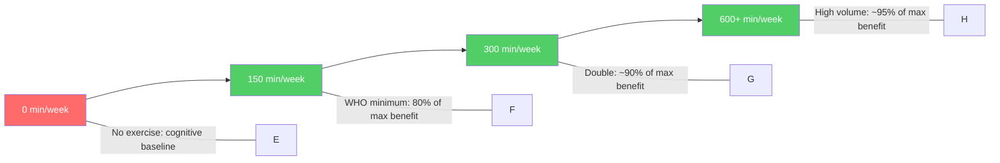
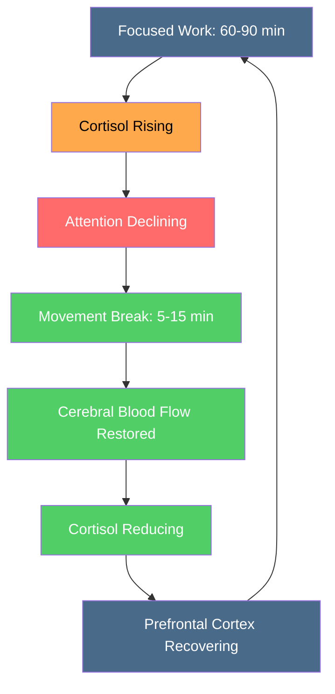

# Movement and Exercise

## Description

Exercise is the most potent single intervention for cognitive performance — not for fitness, not for aesthetics, but for brain function. This document covers why movement matters for developers and how to build an exercise practice from zero. It addresses the neurobiology of exercise, the sedentary developer problem, and the minimum effective dose for maintaining the cognitive capacity that your profession demands.

## Prerequisites

- [Sleep Architecture](sleep-architecture.md) — how sleep structures the brain's recovery and why exercise without sleep is an incomplete intervention
- [Why Physical Health Is the Foundation of Transformation](intro/why-health-matters.md) — the philosophical and scientific rationale for placing physical health at the center of the level-up journey

## Table of Contents

- [The Sedentary Developer Problem](#-the-sedentary-developer-problem)
- [BDNF: Brain Fertilizer](#-bdnf-brain-fertilizer)
- [Neurogenesis: Building New Neurons](#-neurogenesis-building-new-neurons)
- [The Minimum Effective Dose](#-the-minimum-effective-dose)
- [Resistance Training and Executive Function](#-resistance-training-and-executive-function)
- [The 60–90 Minute Rule](#-the-6090-minute-rule)
- [Starting from Zero](#-starting-from-zero)
- [Outdoor Exercise and Psychological Benefits](#-outdoor-exercise-and-psychological-benefits)
- [The Compound Effect on Career Performance](#-the-compound-effect-on-career-performance)

## Content / Material

### 🪑 The Sedentary Developer Problem

You sit for a living. This is not a metaphor or an exaggeration — it is a literal description of how software development is typically performed. The average developer sits for 10 to 12 hours per day: 8 to 10 hours of work, plus meals, commuting, and evening screen time. The human body was not designed for this. The consequences are not theoretical.

Prolonged sitting produces a cascade of physiological damage that directly undermines the cognitive capacities on which your profession depends:

- **Cerebral blood flow decreases.** After 60 minutes of uninterrupted sitting, blood flow to the brain drops by approximately 10–15%. The brain receives less oxygen and fewer nutrients. Attention fragments. Problem-solving slows. You attribute the fog to the complexity of the code, but the code is not the problem — your circulation is.

- **Metabolic dysfunction accumulates.** Sedentary behavior impairs insulin sensitivity within hours. A single day of prolonged sitting reduces the body's ability to regulate blood glucose. Over weeks and months, this progresses toward metabolic syndrome — a cluster of conditions (elevated blood pressure, high blood sugar, excess abdominal fat, abnormal cholesterol) that increases cardiovascular risk and impairs cognitive function.

- **Musculoskeletal deterioration accelerates.** The lumbar spine, designed for upright posture, absorbs increasing pressure with each hour of sitting. After one hour, disc pressure increases by approximately 40%. The hip flexors shorten. The gluteal muscles atrophy. The upper back rounds. Within months, chronic pain develops — not from injury, but from the slow mechanical consequence of sustained posture.

- **Inflammation rises.** Sedentary behavior is independently associated with elevated C-reactive protein (CRP) and interleukin-6 (IL-6) — markers of systemic inflammation. Chronic inflammation is implicated in depression, cognitive decline, and impaired immune function. The developer who sits all day is not merely inactive — they are inflamed.

- **Mental health degrades.** A 2018 meta-analysis published in the *American Journal of Preventive Medicine*, encompassing over 1 million participants, found that high levels of sedentary behavior were associated with a 25% increased risk of depression. The relationship is dose-dependent: the more you sit, the higher the risk. This is not a correlation born of reverse causation — longitudinal studies confirm that sedentary behavior precedes depressive episodes.

The sedentary developer problem is not a lifestyle issue. It is an occupational hazard that directly degrades the instrument through which you work. The developer who ignores movement is not saving time for code. They are eroding the neurological infrastructure that makes good code possible.

### 🧬 BDNF: Brain Fertilizer

Brain-derived neurotrophic factor (BDNF) is a protein that functions as fertilizer for the brain. It promotes the survival of existing neurons, encourages the growth of new neurons (neurogenesis), and strengthens synaptic connections (long-term potentiation). BDNF is arguably the single most important molecule for cognitive performance, learning, and memory.

Exercise is the most reliable way to increase BDNF levels. The relationship is well-established:

| Study | Finding |
|-------|---------|
| Erickson et al. (2011), *PNAS* | One year of moderate aerobic exercise increases hippocampal volume by 2%, effectively reversing 1–2 years of age-related volume loss. |
| Ratey & Hagerman (2008), *Spark* | Exercise increases BDNF, which promotes neurogenesis, synaptic plasticity, and long-term potentiation. The effect is immediate — BDNF rises after a single bout of exercise. |
| Pontifex et al. (2012), *Brain Research* | A single 20-minute bout of moderate exercise improves executive function and academic performance for up to 2 hours afterward. |
| Winter et al. (2007), *Journal of Applied Physiology* | Serum BDNF increases by approximately 2–3 fold after 30 minutes of moderate-intensity cycling. |
| Hillman et al. (2008), *Nature Reviews Neuroscience* | Regular exercise improves attention, processing speed, and cognitive flexibility across the lifespan. |

The mechanism is straightforward. When you exercise, your muscles release a cascade of signaling molecules — including irisin, cathepsin B, and BDNF itself — that cross the blood-brain barrier and directly stimulate neural growth. The brain does not merely benefit from exercise. It is physically rebuilt by it.

For developers, the practical implication is that exercise is not a break from cognitive work. It is cognitive work. A 20-minute walk before a complex debugging session is not wasted time. It is a direct investment in the neural infrastructure required for that session. The BDNF spike from exercise produces measurable improvements in working memory, attention, and cognitive flexibility — the exact capacities that separate effective debugging from frustrated staring.

The dose-response curve for BDNF elevation is roughly linear up to a threshold:


The critical insight is that the threshold for significant cognitive benefit is remarkably low. You do not need to train like an athlete. You need to move consistently. The difference between zero exercise and 150 minutes per week of moderate activity is far greater than the difference between 150 minutes and 300 minutes. The marginal returns diminish sharply after the minimum effective dose.

### 🧠 Neurogenesis: Building New Neurons

For most of the twentieth century, neuroscience held that adults could not grow new neurons. The adult brain was considered fixed — a completed structure that could be damaged but not replenished. This turned out to be wrong.

Adult neurogenesis — the birth of new neurons — occurs primarily in the hippocampus, the brain structure critical for memory formation and emotional regulation. The rate of neurogenesis is influenced by multiple factors, and exercise is the most potent positive influence.

The evidence is unambiguous. Van Praag et al. (1999), publishing in *Nature Neuroscience*, demonstrated that voluntary exercise in mice doubled the number of new neurons in the hippocampus. Subsequent studies confirmed the effect in humans, albeit indirectly through hippocampal volume measurements.

Why does this matter for developers? The hippocampus is the structure where new memories are encoded. When you learn a new programming language, study a new architecture pattern, or internalize the details of a complex system, your hippocampus is doing the work. A developer with impaired hippocampal function learns more slowly, forgets more quickly, and struggles to integrate new information with existing knowledge.

The relationship between exercise, neurogenesis, and learning can be modeled as a compound system:

```python
def neurogenesis_model(exercise_minutes_per_week, weeks):
    """
    Simplified model of hippocampal neurogenesis 
    under different exercise conditions.
    
    baseline_rate: neurons per week with no exercise
    exercise_multiplier: factor increase per 150 min/week
    """
    baseline_rate = 100  # arbitrary units per week
    exercise_factor = min(exercise_minutes_per_week / 150, 2.0)
    
    total_new_neurons = 0
    for week in range(weeks):
        weekly_rate = baseline_rate * (1 + exercise_factor)
        total_new_neurons += weekly_rate
    
    return total_new_neurons

# Sedentary: 100 * 16 weeks = 1,600 units
sedentary = neurogenesis_model(0, 16)

# Active: 300 * 16 weeks = 4,800 units  
active = neurogenesis_model(150, 16)

# Active advantage: 3x more hippocampal neurogenesis
```

This model is simplified, but the core dynamic is real: exercise does not merely protect existing neurons. It generates new ones. The developer who exercises regularly is not maintaining their brain. They are expanding it.

### 📏 The Minimum Effective Dose

The exercise science literature converges on a clear minimum effective dose for cognitive benefit:

| Recommendation | Source | Cognitive Benefit |
|---|---|---|
| 150 minutes/week moderate aerobic | WHO (2020), ACSM guidelines | Significant improvement in executive function, memory, attention |
| 75 minutes/week vigorous aerobic | WHO (2020) | Equivalent cognitive benefit to 150 minutes moderate |
| 2 sessions/week resistance training | ACSM guidelines | Independent benefit for executive function via IGF-1 pathway |
| 20-minute brisk walk | Pontifex et al. (2012) | Measurable cognitive improvement for up to 2 hours post-exercise |
| Walking 8,000–10,000 steps/day | Epidemiological data | Associated with reduced cognitive decline over 5+ years |

The key finding is that the dose-response relationship is not linear forever. It plateaus:



The jump from zero exercise to 150 minutes per week produces the largest cognitive gain. Doubling that to 300 minutes produces a modest additional improvement. Going beyond 300 minutes produces marginal returns. This is the dose-response curve of exercise for cognitive performance, and its shape has a practical implication: if you are currently doing zero exercise, the single most impactful thing you can do for your career is to walk for 20 minutes a day.

Walking is sufficient. This is not a concession or a lower standard — it is the evidence. Brisk walking (approximately 5 km/h, enough to elevate heart rate but still allow conversation) produces measurable increases in BDNF, hippocampal blood flow, and executive function. The cognitive benefits of walking are comparable to those of moderate cycling or swimming. The best exercise for cognitive performance is the one you will do consistently, and for most sedentary developers, that is walking.

The 150-minute target breaks down practically:

| Daily Schedule | Weekly Total | Cognitive Impact |
|---|---|---|
| 20-minute walk, 5 days | 100 minutes | Moderate — meaningful improvement over sedentary baseline |
| 30-minute walk, 5 days | 150 minutes | Significant — reaches the WHO minimum threshold |
| 20-minute walk + 2 resistance sessions | 150+ minutes | High — combines aerobic and resistance benefits |
| 60-minute walk, 5 days | 300 minutes | High — diminishing returns above 150, but still beneficial |

The developer who walks for 30 minutes five days a week and does two bodyweight resistance sessions has achieved the minimum viable exercise protocol. This takes less than 3 hours per week — less time than most developers spend in meetings. The cognitive return on that investment exceeds any productivity technique, any coding course, or any career optimization strategy.

### 💪 Resistance Training and Executive Function

Resistance training produces cognitive benefits through a distinct pathway from aerobic exercise. Where aerobic exercise primarily increases BDNF and hippocampal blood flow, resistance training increases insulin-like growth factor 1 (IGF-1), which promotes synaptic plasticity and neurogenesis through different receptor pathways.

The evidence for resistance training's cognitive benefits is strong:

| Study | Finding |
|-------|---------|
| Liu-Ambrose et al. (2010), *Archives of Internal Medicine* | One year of progressive resistance training improved executive function and selective attention in older women more effectively than balance training. |
| Cassilhas et al. (2007), *Medicine & Science in Sports & Exercise* | Resistance training three times per week for 24 weeks increased serum IGF-1 by 30% and improved cognitive performance on attention and memory tasks. |
| Gomez-Pinilla & Dao (2017), *Frontiers in Neuroscience* | Resistance exercise upregulated BDNF expression in the hippocampus through an IGF-1-dependent pathway, suggesting synergistic effects with aerobic exercise. |
| Northey et al. (2018), *British Journal of Sports Medicine* | Meta-analysis: resistance exercise improved cognitive function in adults over 50, with effects on executive function comparable to aerobic exercise. |

The executive function benefits are particularly relevant for developers. Executive function encompasses working memory (holding multiple variables in mind during debugging), cognitive flexibility (switching between abstraction levels during architecture decisions), and inhibitory control (resisting the impulse to take shortcuts that create technical debt).

Resistance training also produces structural benefits that support long-term developer health. Stronger muscles support better posture during seated work. Core strength reduces the risk of chronic low back pain — the most common musculoskeletal complaint among developers. Grip strength, developed through pulling and carrying movements, reduces the risk of carpal tunnel syndrome and other repetitive strain injuries.

The minimum effective resistance training protocol requires two sessions per week, targeting major muscle groups:

| Exercise Category | Examples | Sets × Reps | Why |
|---|---|---|---|
| Push | Push-ups, overhead press | 3 × 8–12 | Chest, shoulders, triceps — counteracts forward-hunch posture |
| Pull | Rows, pull-ups, resistance bands | 3 × 8–12 | Back, biceps — strengthens postural muscles |
| Squat | Bodyweight squats, goblet squats | 3 × 10–15 | Legs, core — largest muscle mass, highest metabolic benefit |
| Hip hinge | Deadlift variations, glute bridges | 3 × 8–12 | Posterior chain — protects lower back from seated strain |
| Core | Planks, dead bugs | 2–3 × 30–60s | Trunk stability — foundation for all other movements |

A developer with no gym access can perform this entire protocol with bodyweight and a set of resistance bands. The equipment barrier is zero. The time barrier is approximately 40 minutes per session — 80 minutes per week. The cognitive and physical returns on that investment are substantial.

### ⏱️ The 60–90 Minute Rule

The human attention system operates on an ultradian rhythm — a biological cycle of approximately 90 minutes during which cognitive capacity rises, peaks, and then declines. This is not a cultural habit or a productivity heuristic. It is a neurophysiological reality rooted in the brain's arousal systems.

After 60 to 90 minutes of sustained, focused attention, several things happen simultaneously:

- **Cortisol accumulates.** The stress hormone that aids short-term focus becomes counterproductive when chronically elevated. After 90 minutes of intense cognitive work, cortisol levels impair memory consolidation and increase anxiety.
- **Prefrontal cortex fatigues.** The brain region responsible for executive function — the region most critical for software development — depletes its glucose and neurotransmitter reserves. Decision quality declines. Impulse control weakens.
- **Default mode network activation increases.** The brain begins to shift from focused attention to mind-wandering. You start checking Slack, opening new tabs, reaching for your phone. This is not a failure of discipline — it is a biological signal that the attention system needs recovery.

The 60–90 minute rule is simple: after 60 to 90 minutes of focused work, take a movement break of 5 to 15 minutes. Not a screen break — a movement break. Stand, stretch, walk, do bodyweight exercises. The physical movement serves two functions: it restores cerebral blood flow (which declines during prolonged sitting) and it activates the parasympathetic nervous system, reducing cortisol and allowing the prefrontal cortex to recover.



Practical implementation:

- **Set a timer.** Every 60 to 90 minutes, an alarm fires. When it fires, you stand up. Not in five minutes. Not after finishing this function. Now. The timer is your accountability partner. It does not negotiate.

- **Move, do not sit.** The break must involve physical movement, not switching from one seated activity to another. Checking your phone is not a movement break. Getting up and walking to the kitchen for water is.

- **Keep it short.** 5 to 15 minutes is sufficient. The goal is to restore cognitive capacity, not to complete a workout. A walk around the block, a set of push-ups, a few minutes of stretching — these are enough.

- **Track the pattern.** Over a week, you will notice that your most productive deep work sessions cluster around movement breaks. The pattern reinforces itself: movement enables focus, focus enables progress, progress motivates more movement.

The 60–90 minute rule is not about exercise. It is about protecting the attention system that your work depends on. The developer who works for 4 hours without a break is not being productive. They are accumulating cortisol, depleting prefrontal resources, and producing code that reflects the degradation.

### 🌱 Starting from Zero

If you have no exercise habit — if the last time you exercised intentionally was months or years ago — the advice above is useless without a strategy for implementation. Knowing that 150 minutes per week of exercise improves cognitive function does not help if you cannot get yourself off the couch.

Starting from zero requires a specific approach. The approach is not about exercise science. It is about behavior change — the same process described in [The Mechanism of Change](../fundamentals/the-mechanism-of-change.md): awareness, agency, and action.

**Phase 1: Make it absurdly small (Week 1–2).**

The goal is not exercise. The goal is to establish the behavior of moving your body intentionally for a few minutes each day. The target is so small that it is impossible to fail:

- Walk for 5 minutes. That is it. Five minutes.
- Do not set a target for pace, distance, or heart rate. Just walk.
- Do it at the same time each day. Attach it to an existing behavior: after brushing your teeth, after lunch, before dinner.

The smallness of the target is the point. You are not building fitness. You are building the neural pathway of "I am someone who moves." The pathway must be established before it can be strengthened. Five minutes of walking establishes it. One hour of running on day one does not — it triggers the alarm systems that say "this is too hard, this is uncomfortable, this is not who I am."

**Phase 2: Extend gradually (Week 3–6).**

Once the daily 5-minute walk is automatic — once you do it without thinking, without negotiating, without needing motivation — extend it. Add 2 minutes per week:

- Week 3: 7 minutes
- Week 4: 9 minutes
- Week 5: 11 minutes
- Week 6: 13 minutes

By week 6, you are walking for 13 minutes per day, which is 91 minutes per week. You are approaching the minimum effective dose without ever having forced yourself through an unpleasant workout. The progression is invisible. The habit is solid.

**Phase 3: Add variety (Week 7–12).**

Now that the walking habit is established, you can begin to diversify. Replace some walks with alternatives: cycling, swimming, bodyweight exercises, resistance band training. The key constraint is that the replacement must be at least as easy to perform as the walk. If you replace a 15-minute walk with a gym session that requires 30 minutes of travel and equipment setup, you have increased friction and the habit will break.

The practical hierarchy of exercise options for developers, ranked by friction:

| Exercise | Friction | Equipment | Time | Cognitive Benefit |
|---|---|---|---|---|
| Walking (outdoor) | Very low | None | 15–30 min | High |
| Bodyweight exercises | Low | None | 15–20 min | High |
| Resistance bands | Low | ~$20 | 20–30 min | High |
| Cycling (stationary or outdoor) | Medium | Bike or subscription | 20–40 min | Very high |
| Running | Medium | Shoes | 20–40 min | Very high |
| Gym membership | High | Membership + travel | 45–90 min | Very high |
| Swimming | High | Pool access | 30–60 min | Very high |

Start at the top of the table. Move down only when the current level is automatic.

**Phase 4: Lock in consistency (Week 13+).**

By week 13, you have been moving your body intentionally for three months. The habit is established. The identity is shifting. You are no longer "trying to exercise." You are someone who exercises. The shift from doing to being is the transition from fragile to durable.

At this stage, you can begin to optimize — to increase intensity, add resistance training, or pursue specific fitness goals. But optimization is not the foundation. Consistency is the foundation. The developer who walks for 15 minutes every day for a year is in better cognitive shape than the developer who trains intensely for three months and then stops.

The entire progression can be modeled as a behavioral compound curve:

```python
def habit_formation(days, start_probability=0.3, daily_increase=0.01):
    """
    Probability of performing the habit on any given day,
    increasing through repetition.
    """
    probability = start_probability
    for day in range(days):
        probability = min(0.95, probability + daily_increase * (1 - probability))
    return probability

# Day 1: 30% chance of walking (requires motivation)
# Day 30: 55% chance (becoming routine)
# Day 60: 74% chance (habit forming)
# Day 90: 85% chance (near-automatic)
# Day 180: 93% chance (identity-level)
```

The compound effect of consistency is the most important concept in this section. You do not need to be motivated. You do not need to feel like it. You need to do the small thing today, and then do it again tomorrow, and then do it again the day after that. The motivation follows the action, not the other way around. This is the empirical truth that every behavior change framework confirms: action produces motivation, not the reverse.

### 🌳 Outdoor Exercise and Psychological Benefits

Exercise outdoors produces psychological benefits that indoor exercise does not replicate. The effect is not trivial — it is robust and well-documented.

| Study | Finding |
|-------|---------|
| Marselle et al. (2014), *Journal of Environmental Psychology* | Walking in natural environments reduces rumination — the repetitive, self-focused negative thinking that predicts depression relapse. Urban walking does not produce the same effect. |
| Bratman et al. (2015), *PNAS* | A 90-minute walk in a natural setting reduces activity in the subgenual prefrontal cortex — a brain region associated with rumination and risk for depression. Walking along a busy road does not. |
| Thompson Coon et al. (2011), *Environmental Science & Technology* | Meta-analysis: outdoor exercise is associated with greater improvements in mood, self-esteem, and enjoyment compared to indoor exercise. The effect sizes are moderate to large. |
| Berman et al. (2008), *Psychological Science* | Walking in a park improves directed-attention performance (sustained focus) compared to walking in an urban environment. The effect is consistent across age groups. |
| Largo-Wight et al. (2011), *International Journal of Environmental Health Research* | Contact with nature during outdoor exercise is associated with lower perceived stress and higher perceived health compared to indoor exercise. |

The mechanism is partially explained by Attention Restoration Theory (ART), developed by Kaplan and Kaplan (1989). ART proposes that natural environments engage "soft fascination" — a form of effortless attention that allows the directed-attention system (the system you use for focused coding) to rest and recover. Urban environments demand directed attention (navigating traffic, processing noise, filtering stimuli), which further depletes the system. Natural environments replenish it.

For developers, this has a specific and practical implication: the cognitive restoration from outdoor exercise is greater than the cognitive restoration from indoor exercise. The developer who walks through a park for 20 minutes returns to their desk with more sustained attention than the developer who walks on a treadmill for 20 minutes. The exercise component is identical. The environmental component adds measurable cognitive recovery.

The practical application:

- **Replace one indoor session per week with an outdoor session.** Walk in a park, cycle on a trail, do bodyweight exercises in a garden. The specific activity matters less than the natural environment.
- **Use outdoor walking as a work tool.** When stuck on a problem, do not walk in circles around the office. Walk outside. The change of environment, combined with natural stimuli, often produces the shift in perspective that enables solution.
- **Combine movement breaks with outdoor exposure.** If your 60–90 minute movement break involves stepping outside for 10 minutes of walking, you get both the blood flow restoration and the attentional recovery. This is the highest-return break available.

The outdoor advantage is not a luxury. For developers whose cognitive performance is their primary professional asset, outdoor exercise is a strategic investment in cognitive maintenance.

### 📈 The Compound Effect on Career Performance

The cognitive benefits of exercise compound over time in ways that directly affect career trajectory. The developer who exercises regularly accumulates advantages that the sedentary developer does not.

**Immediate effects (within hours):**

- BDNF increases after a single session, improving working memory and cognitive flexibility for 2–4 hours
- Cerebral blood flow increases, improving attention and reaction time
- Mood improves through endorphin and endocannabinoid release, reducing irritability and improving interpersonal interactions

**Short-term effects (within weeks):**

- Sleep quality improves — exercise increases slow-wave sleep duration, enhancing memory consolidation
- Stress resilience increases — regular exercise reduces cortisol reactivity to psychological stressors
- Consistent focus capacity extends — the 60–90 minute attention windows become more reliable

**Medium-term effects (within months):**

- Hippocampal volume increases — new neurons improve learning capacity and memory formation
- Executive function strengthens — better impulse control, better decision-making, better technical judgment
- Chronic inflammation decreases — reduced brain fog, improved emotional stability

**Long-term effects (within years):**

- Neurodegenerative risk decreases — exercise is the single most effective intervention for reducing Alzheimer's and dementia risk
- Career longevity extends — the developer who maintains cognitive sharpness through their 40s and 50s has a decisive advantage over the one who declines
- Creative capacity sustains — neurogenesis supports the novel associations that drive creative problem-solving

The compound effect can be modeled as a divergence between two career trajectories:

```python
def career_trajectory(years, exercise_consistent=True):
    """
    Model cognitive capacity over a career 
    under different exercise conditions.
    """
    base_capacity = 0.7
    trajectory = []
    
    for year in range(years):
        if exercise_consistent:
            # Exercise maintains and slowly improves capacity
            growth = 0.01
            decay = 0.003  # minimal age-related decline
        else:
            # Sedentary: accelerated decline
            growth = 0.0
            decay = 0.015  # age + sedentary decline
        
        capacity = base_capacity + (growth - decay) * year
        trajectory.append(max(0.3, min(1.0, capacity)))
    
    return trajectory

# Year 1: both at ~0.70
# Year 5: exerciser ~0.74, sedentary ~0.63
# Year 10: exerciser ~0.77, sedentary ~0.55  
# Year 15: exerciser ~0.79, sedentary ~0.48
# Year 20: exerciser ~0.80, sedentary ~0.40
```

By year 10 of a career, the gap between the exercising developer and the sedentary developer is substantial — not because of any single dramatic event, but because of the daily compounding of small cognitive advantages. The exercising developer learns faster, debugs more effectively, designs more creatively, and recovers from setbacks more quickly. These advantages compound into career outcomes: better projects, greater responsibilities, higher compensation, longer professional relevance.

The developer who exercises is not doing it for their body. They are doing it for their brain. The body is the vehicle. The brain is the destination.

## Learning Tips

- **Start with 5 minutes, not 50.** The biggest mistake in beginning an exercise practice is starting at a level that requires motivation. Start at a level that requires almost none. The habit is more important than the intensity.

- **Attach movement to existing behaviors.** After your morning coffee, walk for 10 minutes. After your afternoon standup, do 10 push-ups. The existing behavior is the cue. The new behavior is the response. This is the habit loop in practice.

- **Track streaks, not metrics.** Do not track calories burned, distance covered, or heart rate. Track whether you moved today. A simple checkmark on a calendar is enough. The streak is the motivation.

- **Never miss twice.** One missed day is a rest day. Two missed days is the beginning of a new pattern. The rule is simple: if you miss a day, you must move the next day, even if it is just 5 minutes.

- **Make it visible.** Put your walking shoes by the door. Leave resistance bands on your desk. Make the physical reminder of the habit impossible to ignore. Environmental design beats willpower.

- **Pair exercise with information.** Walk while listening to a technical podcast. Do bodyweight exercises while reviewing architecture diagrams. The combination of movement and learning produces stronger memory encoding than either alone.

- **Measure the cognitive benefit, not the physical one.** After two weeks of regular walking, notice your focus duration. Notice your debugging speed. Notice your mood. These are the returns that matter for your career. The physical benefits are real, but the cognitive benefits are the ones that change your professional life.

## Glossary

| Term | Definition |
|------|------------|
| **BDNF (brain-derived neurotrophic factor)** | A protein that promotes neuronal survival, growth, and synaptic plasticity. Increased by exercise; functions as fertilizer for neural tissue. |
| **Executive function** | Cognitive processes managed by the prefrontal cortex — working memory, cognitive flexibility, inhibitory control — essential for goal-directed behavior and software architecture. |
| **Hippocampus** | Brain structure critical for memory formation and spatial navigation. One of the few regions where adult neurogenesis occurs. Sensitive to exercise, sleep deprivation, and chronic stress. |
| **IGF-1 (insulin-like growth factor 1)** | A hormone that promotes neural growth and synaptic plasticity, elevated through resistance training. Works through a distinct pathway from BDNF. |
| **Neurogenesis** | The birth of new neurons, occurring primarily in the hippocampus. Enhanced by exercise, impaired by chronic stress and sleep deprivation. |
| **Neuroplasticity** | The brain's capacity to reorganize by forming new neural connections. Enhanced by exercise, learning, and sleep. |
| **Prefrontal cortex** | Brain region responsible for executive functions: planning, decision-making, working memory, impulse control. Highly sensitive to sleep deprivation, sedentary behavior, and cortisol. |
| **Rumination** | Repetitive, self-focused negative thinking. Reduced by outdoor exercise; elevated by sedentary behavior. |
| **Ultradian rhythm** | Biological cycle of approximately 90 minutes during which cognitive capacity rises, peaks, and declines. Governs the natural cadence of focused attention. |
| **Cerebral blood flow** | Blood delivery to the brain, directly influencing oxygen availability, nutrient supply, and waste clearance. Reduced by prolonged sitting; increased by exercise. |

## Quick References

- [Spark: The Revolutionary New Science of Exercise and the Brain, John Ratey](https://www.sparkther book.com/) — the definitive account of how exercise rebuilds the brain through BDNF, neurogenesis, and synaptic plasticity
- [The Organized Mind, Daniel Levitin](https://daniellevitin.com/theorganizedmind/) — attention management and the neuroscience of focused work, including the ultradian rhythm
- [Brain Rules, John Medina](https://brainrules.net/) — evidence-based principles for cognitive performance, with extensive coverage of exercise and brain function
- [Erickson et al. (2011), Exercise training increases size of hippocampus and improves memory. *PNAS*, 108(7), 3017–3022.](https://doi.org/10.1073/pnas.1015950108) — the landmark study demonstrating hippocampal growth through exercise
- [Bratman et al. (2015), Nature experience reduces rumination and subgenual prefrontal cortex activation. *PNAS*, 112(28), 8567–8572.](https://doi.org/10.1073/pnas.1510459112) — the neural mechanism behind outdoor exercise's psychological benefits
- [Pontifex et al. (2012), A single bout of aerobic exercise can improve executive functioning. *Psychological Science*, 23(1), 48–56.](https://doi.org/10.1177/0963721411424757) — evidence for acute cognitive benefits of exercise
- [The Body Keeps the Score, Bessel van der Kolk](https://www.penguinrandomhouse.com/books/225093/the-body-keeps-the-score-by-bessel-van-der-kolk/) — the role of the body and movement in psychological health and trauma recovery

## Next Steps

- [Workspace Ergonomics](workspace-ergonomics.md) — protecting the body from the specific physical demands of software development through ergonomic design
- [Digital Detox](digital-detox.md) — managing screen time and digital stimulation to protect cognitive capacity
- [Sleep Architecture](sleep-architecture.md) — how the brain consolidates learning and clears metabolic waste during sleep, and why exercise and sleep form an inseparable pair
- [Emotional Regulation](../resilience/emotional-regulation.md) — how exercise supports the nervous system regulation that underlies emotional resilience
