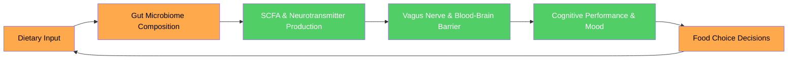
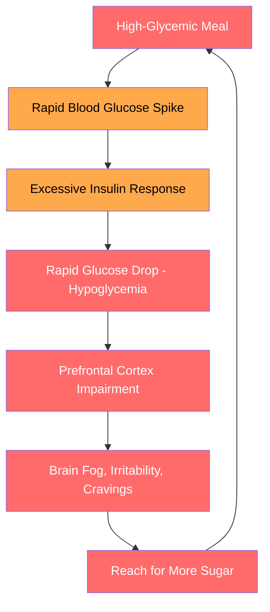
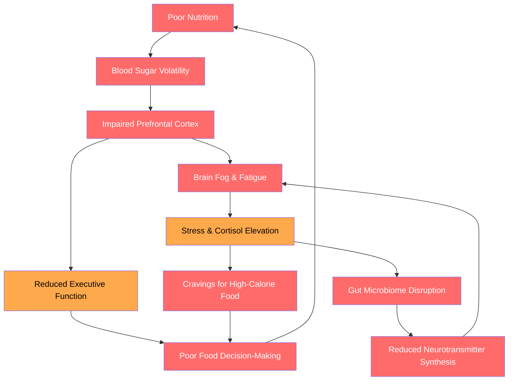
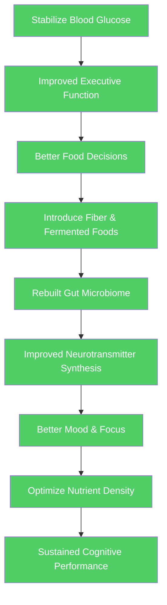

# Nutrition for Developers

## Description

The brain consumes approximately 20% of the body's caloric intake despite representing only 2% of body mass. What you eat directly determines your cognitive performance, mood stability, and sustained focus. This document covers the neuroscience of nutrition and practical dietary strategies for developers who are rebuilding their lives from the ground up.

## Prerequisites

- [Sleep Architecture](sleep-architecture.md) — sleep deprivation alters hunger hormones and drives poor food choices, making nutrition changes nearly impossible without addressing sleep first
- [Why Physical Health Is the Foundation of Transformation](intro/why-health-matters.md) — the philosophical and scientific case for treating the body as the substrate of all cognitive and emotional work

## Table of Contents

- [The Gut-Brain Axis: Your Second Brain](#-the-gut-brain-axis-your-second-brain)
- [Blood Sugar: The Fuel Gauge You Cannot Ignore](#-blood-sugar-the-fuel-gauge-you-cannot-ignore)
- [Key Nutrients for Brain Function](#-key-nutrients-for-brain-function)
- [Hydration: The Invisible Performance Variable](#-hydration-the-invisible-performance-variable)
- [Meal Timing and Deep Work](#-meal-timing-and-deep-work)
- [Caffeine: The Double-Edged Stimulant](#-caffeine-the-double-edged-stimulant)
- [Practical Nutrition Strategies for Developers](#-practical-nutrition-strategies-for-developers)
- [The Vicious Cycle of Poor Nutrition and Poor Cognition](#-the-vicious-cycle-of-poor-nutrition-and-poor-cognition)

## 🧬 The Gut-Brain Axis: Your Second Brain

The gastrointestinal tract contains approximately 500 million neurons — more than the spinal cord — and produces roughly 95% of the body's serotonin. This enteric nervous system communicates bidirectionally with the brain via the vagus nerve, immune signaling molecules, and microbial metabolites. The gut is not merely a digestive organ; it is a neuroactive ecosystem that directly shapes mood, cognition, and emotional regulation.

### 🦠 The Microbiome as Cognitive Infrastructure

The human gut harbors approximately 38 trillion microorganisms — slightly more than the total number of human cells in the body. This microbial community, collectively termed the gut microbiome, performs functions that directly influence brain function:

- **Neurotransmitter production** — gut bacteria synthesize serotonin, dopamine, GABA, and norepinephrine. *Lactobacillus* and *Bifidobacterium* species produce GABA. *Escherichia*, *Bacillus*, and *Saccharomyces* species produce norepinephrine and dopamine. *Enterococcus* and *Streptococcus* species produce serotonin.
- **Short-chain fatty acid (SCFA) production** — when gut bacteria ferment dietary fiber, they produce SCFAs (butyrate, propionate, acetate) that cross the blood-brain barrier, reduce neuroinflammation, and support the integrity of the blood-brain barrier itself.
- **Immune modulation** — approximately 70% of the immune system resides in the gut. Gut dysbiosis (microbial imbalance) triggers systemic inflammation, which elevates C-reactive protein (CRP) and interleukin-6 (IL-6), both of which are elevated in depression and cognitive decline.
- **Vagus nerve signaling** — the vagus nerve provides a direct anatomical communication pathway between the gut and the brain. Studies in mice show that cutting the vagus nerve eliminates the cognitive and anxiolytic effects of probiotic supplementation, confirming that the nerve is the primary transmission channel.

For developers, the practical implications are immediate. A diet high in processed food and low in fiber reduces microbial diversity within days. Reduced microbial diversity decreases SCFA production, increases gut permeability ("leaky gut"), elevates systemic inflammation, and impairs neurotransmitter synthesis. The developer who eats predominantly ultra-processed food is not merely consuming excess calories — they are actively degrading the microbial ecosystem that produces the neurochemicals required for focus, motivation, and emotional stability.

### 📊 The Diet-Microbiome-Cognition Pathway

The pathway from dietary choice to cognitive performance follows a measurable chain:

| Dietary Input | Microbiome Effect | Neurochemical Consequence | Cognitive Impact |
|---|---|---|---|
| High fiber (vegetables, legumes, whole grains) | Increased SCFA production, microbial diversity | Reduced neuroinflammation, improved BBB integrity | Sustained attention, improved memory |
| Fermented foods (yogurt, kimchi, sauerkraut) | Increased *Lactobacillus* and *Bifidobacterium* | Increased GABA and serotonin precursor availability | Reduced anxiety, improved mood stability |
| Ultra-processed food (chips, candy, soda) | Decreased microbial diversity, increased *Firmicutes/Bacteroidetes* ratio | Elevated systemic inflammation, reduced neurotransmitter synthesis | Brain fog, mood instability, impaired focus |
| High sugar intake | *Candida* overgrowth, reduced *Bifidobacterium* | Blood sugar volatility, increased cortisol | Irritability, cognitive crashes, poor decision-making |
| Adequate omega-3 intake | Increased *Roseburia*, *Faecalibacterium* | Reduced neuroinflammation, improved synaptic plasticity | Enhanced learning, reduced depression risk |

The relationship is not abstract. It is mechanical, measurable, and reversible. The developer who shifts from a processed-food diet to one rich in fiber, fermented foods, and omega-3 fatty acids will experience measurable cognitive improvements within two to four weeks — not because of willpower or mindset, but because the microbial ecosystem producing their neurochemicals has been rebuilt.

The loop is bidirectional: poor food choices degrade the microbiome, which impairs cognition, which reduces the executive function needed to make better food choices. This is one of the primary mechanisms through which the vicious cycle of developer burnout becomes self-reinforcing.

## 📈 Blood Sugar: The Fuel Gauge You Cannot Ignore

The brain runs primarily on glucose. Unlike muscle tissue, which can metabolize fatty acids during periods of low carbohydrate availability, the brain requires a continuous supply of glucose to maintain synaptic transmission, maintain ion gradients, and support the metabolic demands of the 86 billion neurons that compose the cerebral cortex.

### 🔋 The Spike-and-Crash Pattern

When a developer consumes a high-glycemic meal or snack — a pastry for breakfast, a candy bar at 3 PM, energy drinks during a coding sprint — blood glucose rises rapidly. The pancreas responds by secreting insulin to transport glucose into cells. The result is a rapid spike followed by a rapid crash, producing a predictable cognitive pattern:

The prefrontal cortex — responsible for working memory, planning, inhibitory control, and complex problem-solving — is disproportionately sensitive to glucose fluctuations. Benton and Donohoe (1999) demonstrated that glucose supplementation improves cognitive performance on demanding tasks, but only when baseline glucose is low. The implication is clear: the goal is not excessive sugar intake but stable blood glucose throughout the workday.

For developers, the spike-and-crash pattern has a specific professional cost. Debugging a complex system requires sustained executive function. Code review requires pattern recognition and inhibitory control — the ability to suppress the impulse to approve code quickly and instead read carefully. Architecture decisions require working memory. All three capacities are governed by the prefrontal cortex, and all three are impaired during hypoglycemic episodes.

### 🧮 The Glycemic Index and Developer Performance

The glycemic index (GI) measures how quickly a food raises blood glucose relative to pure glucose (GI = 100). The glycemic load (GL) accounts for both the GI and the carbohydrate content per serving, providing a more accurate picture of the blood sugar impact.

| Food | Glycemic Index | Glycemic Load (per serving) | Cognitive Effect |
|---|---|---|---|
| White bread | 75 | High | Rapid spike, rapid crash — avoid before deep work |
| Brown rice | 50 | Medium | Moderate rise, sustained energy |
| Oatmeal (steel-cut) | 55 | Low-Medium | Slow, sustained glucose release — ideal for morning work |
| Lentils | 32 | Low | Minimal spike, sustained focus for 3–4 hours |
| Apple | 36 | Low | Slow glucose release with fiber buffer |
| Banana (ripe) | 62 | Medium | Moderate spike — better as post-exercise snack |
| Candy bar | 65 | High | Rapid spike followed by crash within 60–90 minutes |
| Dark chocolate (70%+) | 23 | Low | Minimal spike, contains flavonoids that support cerebral blood flow |

The pattern is consistent: foods that combine complex carbohydrates with fiber, protein, or fat produce slower, more sustained glucose release. Foods that combine simple carbohydrates with minimal fiber produce rapid spikes and crashes.

### 🔑 The Protein-Fat-Fiber Buffer

The single most effective dietary strategy for maintaining stable blood glucose is the "buffer rule": always consume protein, fat, or fiber alongside carbohydrates. This combination slows gastric emptying, reduces the rate of glucose absorption, and prevents the sharp spike that triggers excessive insulin response.

Practical applications for developers:

- **Breakfast** — oatmeal with nuts and berries instead of toast or cereal. The fat from nuts and fiber from berries buffer the glucose release from oats.
- **Lunch** — a protein-rich meal (grilled chicken, fish, legumes) with vegetables and whole grains instead of a pasta-heavy or sandwich-heavy meal. Protein and fiber slow the carbohydrate absorption.
- **Snacks** — apple slices with almond butter instead of crackers or chips. The fat from almond butter buffers the fruit's natural sugars.
- **During deep work** — a handful of walnuts or a small portion of dark chocolate instead of candy or energy drinks. Fat and flavonoids sustain focus without triggering a crash.

## 🧠 Key Nutrients for Brain Function

The brain's metabolic demands are extraordinary. At 2% of body mass, it consumes 20% of the body's oxygen, 20% of its caloric intake, and requires a continuous supply of specific micronutrients to maintain synaptic transmission, myelination, and neurotransmitter synthesis. Nutritional deficiencies do not produce vague symptoms — they produce specific, measurable cognitive deficits.

### 🐟 Omega-3 Fatty Acids (DHA and EPA)

Docosahexaenoic acid (DHA) constitutes approximately 40% of the polyunsaturated fatty acids in the brain and is a primary structural component of neuronal cell membranes. Eicosapentaenoic acid (EPA) serves primarily as an anti-inflammatory signaling molecule. Both are essential — the body cannot synthesize them de novo, and dietary intake is the sole source.

| Function | Mechanism | Cognitive Consequence of Deficiency |
|---|---|---|
| Synaptic membrane integrity | DHA maintains membrane fluidity, enabling neurotransmitter receptor function | Impaired signal transduction, reduced learning capacity |
| Neuroinflammation regulation | EPA produces resolvins and protectins that resolve inflammation | Chronic neuroinflammation, elevated depression risk |
| Cerebral blood flow | Omega-3s support endothelial function in cerebral vasculature | Reduced oxygen delivery to neurons, fatigue |
| BDNF expression | DHA upregulates brain-derived neurotrophic factor | Impaired neurogenesis and synaptic plasticity |

| Food Source | Omega-3 Content (mg per 100g) | Bioavailability |
|---|---|---|
| Salmon (wild-caught) | 2,260 | High — preformed DHA/EPA |
| Sardines | 1,480 | High — preformed DHA/EPA |
| Walnuts | 9,080 | Moderate — ALA requires conversion to DHA/EPA (5–10% efficiency) |
| Flaxseed | 22,813 | Low — ALA conversion rate is insufficient for brain needs |
| Chia seeds | 17,552 | Low — ALA conversion rate is insufficient for brain needs |
| Algal oil supplement | 500–1,000 | High — preformed DHA, suitable for vegetarians |

For developers, the practical recommendation is to consume fatty fish (salmon, sardines, mackerel) two to three times per week, or supplement with a high-quality fish oil or algal oil providing at least 500 mg combined DHA/EPA daily. Plant-based omega-3 sources (walnuts, flaxseed) are valuable for their fiber and other nutrients but are insufficient as sole sources of brain DHA due to the low conversion rate of alpha-linolenic acid (ALA) to DHA.

### 🥬 B Vitamins (B6, B9, B12)

The B vitamin complex — particularly B6 (pyridoxine), B9 (folate), and B12 (cobalamin) — serves three critical neurological functions:

1. **Homocysteine metabolism** — B6, B9, and B12 are required to convert homocysteine to methionine. Elevated homocysteine is neurotoxic, damages cerebral blood vessels, and is independently associated with hippocampal atrophy and cognitive decline.
2. **Neurotransmitter synthesis** — B6 is a cofactor in the synthesis of serotonin (from tryptophan), dopamine (from tyrosine), and GABA (from glutamate). Deficiency produces measurable mood and cognitive impairment.
3. **Myelin maintenance** — B12 is essential for myelin sheath integrity. Deficiency causes demyelination, producing peripheral neuropathy and cognitive dysfunction.

| Vitamin | Key Foods | Deficiency Prevalence in Developers | Cognitive Symptom |
|---|---|---|---|
| B6 | Chickpeas, poultry, fish, potatoes, bananas | Moderate — low in processed diets | Irritability, depression, confusion |
| B9 (Folate) | Leafy greens, legumes, fortified grains | High — low vegetable intake common | Poor memory, cognitive slowing |
| B12 | Meat, fish, dairy, eggs | Low-moderate — higher in vegans/vegetarians | Numbness, memory loss, brain fog |

The developer who eats predominantly processed food, skips vegetables, and avoids animal products without supplementation is at measurable risk for B vitamin deficiency. The cognitive symptoms — brain fog, irritability, poor concentration — are often attributed to stress or burnout when they are, in part, nutritional.

### 🧲 Magnesium

Magnesium is involved in over 300 enzymatic reactions, including those governing NMDA receptor function (critical for learning and memory), GABA receptor binding (critical for sleep and anxiety regulation), and ATP synthesis (the brain's energy currency). Approximately 50% of the U.S. population consumes less than the estimated average requirement for magnesium.

| Function | Mechanism | Developer Relevance |
|---|---|---|
| NMDA receptor regulation | Magnesium blocks the NMDA receptor channel at rest, preventing excitotoxicity | Excess calcium/excitotoxicity impairs memory formation |
| GABA agonism | Magnesium binds to GABA receptors, promoting neural inhibition | Supports sleep quality and reduces anxiety |
| Stress response modulation | Magnesium regulates the HPA axis and cortisol production | Chronic stress depletes magnesium, creating a deficiency spiral |
| ATP production | Magnesium is required for the enzymatic activity of ATP synthase | Deficiency reduces neuronal energy availability |

| Food Source | Magnesium per Serving (mg) |
|---|---|
| Pumpkin seeds (1 oz) | 156 |
| Dark chocolate (70%+, 1 oz) | 64 |
| Almonds (1 oz) | 80 |
| Spinach (1 cup cooked) | 157 |
| Black beans (1 cup cooked) | 120 |
| Avocado (1 medium) | 58 |

The pattern of magnesium depletion in developers is cyclical: stress elevates cortisol, cortisol increases urinary magnesium excretion, magnesium deficiency impairs GABA function and sleep quality, poor sleep increases stress, which further depletes magnesium. Breaking this cycle requires deliberate dietary attention to magnesium-rich foods or supplementation (glycinate or threonate forms are preferred for bioavailability and CNS penetration).

### 🔬 Iron and Zinc

**Iron** is required for oxygen transport (hemoglobin), dopamine synthesis (as a cofactor for tyrosine hydroxylase), and myelin production. Iron deficiency — even without frank anemia — impairs attention, working memory, and processing speed. Vegetarian and vegan developers are at elevated risk.

**Zinc** is concentrated in the hippocampus and modulates synaptic plasticity, NMDA receptor function, and BDNF expression. Zinc deficiency impairs learning and memory. Food sources include oysters, red meat, poultry, beans, and nuts.

### 📊 Nutrient Synergies

Nutrients do not operate in isolation. Several critical synergies affect developer cognition:

| Synergy | Mechanism | Practical Implication |
|---|---|---|
| Iron + Vitamin C | Vitamin C increases non-heme iron absorption by 3–6x | Eat citrus or bell peppers with plant-based iron sources |
| Vitamin D + Magnesium | Magnesium is required for vitamin D activation | Supplementing D without adequate magnesium is less effective |
| B12 + Folate | Both required for homocysteine metabolism | Deficiency in one masks the symptoms of deficiency in the other |
| Omega-3 + Vitamin E | Omega-3 oxidation generates free radicals; vitamin E neutralizes them | High omega-3 intake without adequate antioxidant support may be counterproductive |

## 💧 Hydration: The Invisible Performance Variable

The brain is approximately 75% water. Dehydration — even at levels as mild as 1–2% of body weight — impairs cognitive function through multiple mechanisms: reduced cerebral blood flow, decreased oxygen delivery, impaired waste clearance, and altered neurotransmitter concentration.

### 📉 The Dose-Response Curve

Research consistently demonstrates a linear relationship between hydration status and cognitive performance:

| Dehydration Level | Body Weight Loss | Cognitive Effect |
|---|---|---|
| 1% | ~0.7 kg (1.5 lbs) for 70 kg person | Impaired attention, increased perception of task difficulty |
| 2% | ~1.4 kg (3 lbs) | Measurable deficits in working memory, visual tracking, reaction time |
| 3% | ~2.1 kg (4.5 lbs) | Significant impairments in executive function, increased fatigue and confusion |
| 4%+ | ~2.8 kg (6 lbs) | Severe cognitive dysfunction, headache, emotional instability |

For developers, the insidious nature of dehydration is that it produces symptoms identical to fatigue and burnout — brain fog, irritability, difficulty concentrating, headaches. The developer who attributes these symptoms entirely to work stress while drinking only coffee and forgetting water is misdiagnosing the problem.

### 💡 Practical Hydration for Developers

The standard recommendation of 2–3 liters of water per day is a reasonable baseline, but individual needs vary with body mass, ambient temperature, physical activity, and caffeine intake (caffeine is a mild diuretic that increases urinary fluid loss).

Strategies that work at the desk:

- **Visible water vessel** — keep a transparent water bottle within arm's reach at all times. Visual presence cues consumption. Studies show that a visible water bottle increases daily water intake by 25–40%.
- **Hydration anchor** — associate water intake with an existing habit. One glass of water before each meal, one glass at the start of each Pomodoro cycle, one glass after every bathroom visit.
- **Caffeine accounting** — for every cup of coffee consumed, drink an additional 150–200 ml of water to offset the diuretic effect.
- **Morning hydration** — drink 300–500 ml of water immediately upon waking. Overnight dehydration is common, and morning hydration restores cognitive baseline before the workday begins.

## ⏰ Meal Timing and Deep Work

When you eat matters almost as much as what you eat. The postprandial response — the physiological state following a meal — directly affects cognitive capacity, and the timing of meals relative to deep work sessions is a performance variable that most developers ignore entirely.

### 🍽️ The Postprandial Dip

After a meal, the body redirects blood flow from the brain and skeletal muscles to the gastrointestinal tract to support digestion. This splanchnic blood flow redirection reduces cerebral perfusion, producing a measurable decline in alertness and executive function that peaks 60–90 minutes after eating and can persist for 2–3 hours.

The magnitude of the dip depends on meal composition:

| Meal Type | Postprandial Dip Severity | Duration | Deep Work Impact |
|---|---|---|---|
| Large high-carb meal (pasta, pizza) | Severe | 2–3 hours | Significant cognitive impairment — avoid before deep work |
| Moderate balanced meal (protein + vegetables + whole grains) | Mild | 1–1.5 hours | Minor disruption — manageable if meal is moderate in size |
| Small protein-rich snack (nuts, cheese, jerky) | Minimal | 30–45 minutes | Negligible — suitable during work hours |
| Fasted (no food) | None (but hunger may distract) | N/A | Baseline cognition maintained, but hypoglycemia risk after 4+ hours |

### 🧠 The Deep Work Nutrition Protocol

The practical implication for developers who practice deep work — sustained, uninterrupted periods of intense cognitive focus — is that meal timing should be strategic:

1. **Eat a substantial, balanced meal 2–3 hours before a deep work session.** This allows digestion to complete before the focus session begins. A developer planning a 9 AM deep work session should eat breakfast by 6:30–7:00 AM.
2. **During deep work, consume only small, protein-rich snacks if needed.** A handful of nuts, a piece of dark chocolate, or a small portion of cheese provides glucose without triggering a postprandial dip.
3. **Avoid heavy meals immediately after deep work.** The postprandial dip is less damaging during shallow work (emails, meetings, documentation) because these tasks require less executive function.
4. **Consider time-restricted eating — but with caveats.** Some developers report improved focus during morning fasted states. This works for some because the absence of a postprandial dip preserves baseline cognition. However, fasting beyond 14–16 hours elevates cortisol, impairs glucose regulation, and reduces the cognitive benefits of the fast. Time-restricted eating is a tool, not a universal prescription.

The principle is straightforward: align your highest-cognitive-demand work with your body's peak metabolic state, and avoid heavy meals during periods requiring sustained executive function.

## ☕ Caffeine: The Double-Edged Stimulant

Caffeine is the most widely consumed psychoactive substance in the world, and the developer's relationship with it is often the most consequential dietary decision made each day — largely because it is made unconsciously.

### 🔬 Mechanism of Action

Caffeine works by blocking adenosine receptors in the brain. Adenosine is a neuromodulator that accumulates during wakefulness and promotes sleep pressure. By occupying adenosine receptors without activating them, caffeine prevents adenosine from signaling fatigue. The subjective effect is increased alertness, improved concentration, and elevated mood.

The critical caveat: caffeine does not eliminate adenosine — it masks it. The adenosine continues to accumulate behind the blocked receptors. When caffeine wears off, the accumulated adenosine floods the now-unblocked receptors, producing the "caffeine crash" — a sudden, pronounced fatigue that is worse than the pre-caffeine baseline.

### ⏱️ Caffeine Pharmacokinetics

| Parameter | Value | Developer Implication |
|---|---|---|
| Half-life | 5–6 hours (varies with genetics) | A coffee at 3 PM still has half its caffeine at 9 PM |
| Peak plasma concentration | 30–60 minutes after ingestion | Caffeine takes effect slowly — don't expect instant alertness |
| Duration of effect | 8–12 hours total | After 2 PM, caffeine measurably impairs sleep quality |
| Tolerance development | 7–12 days of regular use | Daily use reduces caffeine's cognitive benefits by 40–50% |
| Withdrawal symptoms | Headache, fatigue, irritability peak at 24–48 hours | Abrupt cessation is counterproductive — taper gradually |

### 📊 The Caffeine Optimization Strategy

The optimal caffeine protocol for developers is designed to maximize cognitive benefit while minimizing sleep disruption and tolerance development:

1. **Delay first caffeine by 90 minutes after waking.** Cortisol naturally peaks in the first 60–90 minutes after waking (the cortisol awakening response). Consuming caffeine during this window blunts cortisol's natural alerting effect and accelerates tolerance. Waiting 90 minutes allows the natural cortisol peak to do its work, then caffeine supplements the declining cortisol.
2. **Caffeine cutoff at 1–2 PM.** Caffeine's half-life of 5–6 hours means that caffeine consumed after 2 PM will still be circulating at significant levels at bedtime. Even if you fall asleep, caffeine reduces slow-wave sleep (the deepest, most restorative stage) by 15–20%.
3. **Cycle caffeine use.** Consume caffeine 4–5 days per week, then abstain for 2–3 days. This prevents tolerance development and preserves the cognitive benefits of caffeine. The developer who consumes caffeine daily without cycling receives diminishing benefits within two weeks.
4. **Choose quality sources.** Black coffee and unsweetened tea provide caffeine with polyphenols and antioxidants. Energy drinks combine caffeine with sugar and artificial ingredients that destabilize blood glucose. The cognitive net effect of an energy drink is often negative due to the glucose crash that follows.
5. **Never use caffeine to compensate for sleep deprivation.** Caffeine masks fatigue without restoring the cognitive functions that sleep provides — memory consolidation, emotional regulation, synaptic pruning. A well-rested brain with caffeine outperforms a sleep-deprived brain with caffeine every time.

### ☕ The Developer's Coffee Ritual

The healthiest relationship with caffeine treats it as a tool — used strategically, cycled deliberately, and never confused with a substitute for sleep. The developer who drinks coffee because it improves an already well-rested morning's focus is using caffeine correctly. The developer who drinks coffee because they cannot function without it is managing dependency, not optimizing performance.

## 🍎 Practical Nutrition Strategies for Developers

The gap between nutritional knowledge and nutritional behavior is vast. Most developers know they should eat more vegetables and less processed food. The barrier is not information — it is implementation within the specific constraints of a developer's workday: time pressure, sedentary work, irregular schedules, stress-driven eating, and the availability of hyper-palatable, nutrient-poor convenience foods.

### 🧰 The Desk Environment

Your desk environment determines your default food choices. When a developer is deep in a debugging session and reaches for food, they reach for whatever is closest. Design the desk environment to make the default choice the healthy choice.

**Desk essentials:**

| Item | Purpose | Why It Works |
|---|---|---|
| Water bottle (1L, visible) | Continuous hydration | Visual cue triggers consumption without decision fatigue |
| Mixed nuts (almonds, walnuts, cashews) | Stable-energy snack, omega-3s, magnesium | Protein + fat prevents blood sugar crash |
| Dark chocolate (70%+) | Flavonoids, magnesium, minimal sugar | Satisfies sweet cravings without glucose spike |
| Whole fruit (apples, bananas) | Fiber + natural sugar, potassium | Fiber buffers glucose release |
| Seed crackers or rice cakes + nut butter | Sustained energy, fiber, protein | Replaces chips/crackers with nutrient-dense alternative |

**Desk prohibitions:**

| Item | Why It Fails |
|---|---|
| Candy, gummy bears, sugary snacks | Rapid glucose spike followed by crash — impairs focus within 60 minutes |
| Chips, pretzels, refined carbs | High glycemic load, minimal nutrition, triggers overconsumption |
| Energy drinks | Caffeine + sugar + artificial ingredients — glucose crash + sleep disruption |
| Soda (regular) | 39g sugar per can — equivalent to 10 teaspoons; destabilizes blood glucose |

### 🥗 The Meal Prep System

For developers who work from home or bring lunch to the office, meal preparation is the single highest-leverage nutrition intervention. The developer who has a healthy meal ready to eat will eat it. The developer who has nothing prepared will order delivery or eat whatever is convenient — which is almost never healthy.

**The Sunday prep protocol:**

1. **Cook two protein sources** — grilled chicken thighs, baked salmon, hard-boiled eggs, or cooked legumes. Protein is the most time-consuming component and the most important to prepare in advance.
2. **Prepare two grain/starch bases** — brown rice, quinoa, sweet potatoes, or whole wheat pasta. These provide sustained-release glucose.
3. **Chop three to four vegetables** — bell peppers, broccoli, carrots, cucumbers, leafy greens. Raw vegetables require zero cooking time during the week.
4. **Prepare two sauces/dressings** — tahini dressing, olive oil + lemon, salsa, or hummus. Sauces transform repetitive ingredients into varied meals.
5. **Assemble meals in containers** — portion into individual servings for the week. The total time investment is 90–120 minutes on Sunday; the daily time savings during the week are 20–30 minutes per meal.

### 🍽️ The Developer's Plate Model

For developers who need a simple visual template rather than calorie counting, the following model provides a reliable framework for building meals that sustain cognitive performance:

| Plate Section | Content | Cognitive Function |
|---|---|---|
| 50% vegetables and fruits | Leafy greens, cruciferous vegetables, berries, citrus | Antioxidants, fiber, micronutrients — reduce neuroinflammation |
| 25% protein | Fish, poultry, eggs, legumes, tofu | Amino acids for neurotransmitter synthesis — serotonin, dopamine |
| 25% complex carbohydrates | Brown rice, quinoa, sweet potato, oats | Sustained glucose release — fuel for the prefrontal cortex |
| + Healthy fat (in cooking or dressing) | Olive oil, avocado, nuts, seeds | Omega-3s, vitamin E — support synaptic membrane integrity |

This model is not a diet. It is a default template that produces adequate macronutrient and micronutrient intake without requiring obsessive calorie tracking. The developer who builds meals using this template most of the time will consume sufficient protein, fiber, healthy fats, and micronutrients to support sustained cognitive performance.

### 🚫 What to Eliminate (and Why)

Elimination is more effective than addition for most developers. Rather than adding more healthy foods (which requires planning), reducing the worst offenders produces immediate cognitive benefits:

| Food Category | Specific Items | Cognitive Impact | Action |
|---|---|---|---|
| Sugar-sweetened beverages | Soda, sweet tea, fruit juice, energy drinks | Glucose spike/crash, insulin resistance, impaired BDNF | Replace with water, black coffee, or unsweetened tea |
| Ultra-processed snacks | Chips, candy, cookies, pastries | Reduced microbial diversity, systemic inflammation, cognitive impairment | Replace with nuts, fruit, dark chocolate |
| Refined carbohydrates | White bread, white rice, pastries | High glycemic load, rapid glucose spike | Replace with whole grain alternatives |
| Processed meats | Bacon, sausage, deli meats, hot dogs | Associated with increased inflammation and colorectal cancer risk | Replace with fresh poultry, fish, or legumes |

## 🔄 The Vicious Cycle of Poor Nutrition and Poor Cognition

The most dangerous aspect of poor nutrition is not its immediate effect — it is the self-reinforcing feedback loop it creates. Poor nutrition degrades cognition, which impairs the executive function needed to make better food choices, which further degrades nutrition, which further impairs cognition. This is the mechanism by which a developer slides from "eating a bit poorly" to "unable to focus, exhausted, and eating worse than ever" within weeks.

The loop has two reinforcing branches:

**Branch 1 — Cognitive Impairment:** Poor nutrition → blood sugar volatility → prefrontal cortex impairment → reduced executive function → poor food choices → poorer nutrition. This branch operates on a timescale of hours. A single high-glycemic meal can initiate the cycle within 90 minutes.

**Branch 2 — Stress-Eating Spiral:** Brain fog and fatigue → elevated cortisol → cravings for hyper-palatable food → consumption of processed food → gut microbiome disruption → reduced neurotransmitter synthesis → worsened brain fog. This branch operates on a timescale of days to weeks.

The developer trapped in this cycle experiences it as a single, undifferentiated sense of deterioration — a pervasive fog that resists diagnosis because no single variable is obviously broken. They feel tired, but they slept 7 hours. They feel unmotivated, but they have a project they care about. They feel foggy, but they cannot pinpoint when it started. The answer often lies not in any single variable but in the interaction between nutrition, cognition, and behavior — a system that has converged toward a low-equilibrium state.

### 🟢 Breaking the Cycle: The Minimum Viable Intervention

Breaking the cycle does not require a complete dietary overhaul. It requires a single, sustained change that disrupts the feedback loop at its most accessible point. The research and practical experience suggest a clear priority order:

**First: Stabilize blood glucose.** This is the highest-leverage intervention because it directly addresses the cognitive impairment that drives poor food choices. The protocol is simple:

1. Eat protein with every meal.
2. Eliminate sugar-sweetened beverages.
3. Keep a water bottle visible on the desk.

These three changes require minimal planning, produce measurable cognitive improvement within one to two weeks, and create the cognitive space needed for additional dietary improvements.

**Second: Introduce fiber and fermented foods.** Once blood glucose is stable and executive function has partially recovered, add fiber-rich foods (vegetables, legumes, whole grains) and fermented foods (yogurt, kimchi, sauerkraut). These rebuild the gut microbiome and improve neurotransmitter synthesis.

**Third: Optimize nutrient density.** With the foundation in place, address specific nutrient gaps — omega-3s, B vitamins, magnesium — through targeted food choices or supplementation.

The key insight is sequential, not simultaneous. The developer who attempts a complete dietary transformation in one week will fail because the cognitive resources required for that transformation are depleted by the very nutritional deficits they are trying to address. Small, sequential changes compound into systemic improvement — the virtuous version of the same compound effect that poor nutrition exploits in the vicious direction.

The transformation is not dramatic. It does not require willpower or motivation — it requires only the recognition that your brain is a physical organ with physical requirements, and that meeting those requirements is not self-indulgence but the minimum viable investment in your capacity to function as a developer, a thinker, and a human being.

## Learning Tips

- **Track your energy, not your calories.** Keep a simple log for two weeks: rate your energy and focus on a 1–10 scale at 10 AM, 2 PM, and 6 PM, and note what you ate at each meal. The patterns will reveal which foods sustain your cognition and which foods crash it. Calorie counting is less useful than energy tracking for cognitive performance.
- **Change one variable at a time.** If you change your breakfast, your snacks, and your caffeine habit simultaneously, you cannot determine which change produced which effect. Change one variable, observe for one to two weeks, then change the next.
- **Use the "addition, not subtraction" heuristic when possible.** Adding a vegetable to every meal is psychologically easier than banning foods entirely. Addition is additive; subtraction is deprivation. Both work, but addition is more sustainable for most people.
- **Pre-decide your meals.** Decision fatigue degrades food choices. Decide what you will eat for the week on Sunday. When Friday arrives and your executive function is depleted, the decision has already been made.

## Glossary

| Term | Definition |
|---|---|
| **Adenosine** | A neuromodulator that accumulates during wakefulness and promotes sleep pressure. Caffeine blocks adenosine receptors, masking fatigue without eliminating it. |
| **Blood-brain barrier (BBB)** | A semipermeable membrane that separates circulating blood from the brain's extracellular fluid, regulating the transport of molecules into the central nervous system. |
| **Brain-derived neurotrophic factor (BDNF)** | A protein that supports the survival, growth, and differentiation of neurons. Increased by exercise, omega-3s, and sleep; decreased by processed food and chronic stress. |
| **Cortisol** | A glucocorticoid stress hormone that, when chronically elevated, impairs immune function, disrupts sleep, damages hippocampal neurons, and drives cravings for high-calorie food. |
| **Enteric nervous system** | The network of approximately 500 million neurons embedded in the gastrointestinal tract, often called the "second brain," which operates semi-independently of the central nervous system. |
| **Executive function** | A set of cognitive processes — working memory, cognitive flexibility, inhibitory control — governed by the prefrontal cortex and essential for planning, decision-making, and goal-directed behavior. |
| **Glycemic index (GI)** | A measure of how quickly a food raises blood glucose relative to pure glucose. Foods with high GI produce rapid spikes; foods with low GI produce slower, more sustained glucose release. |
| **Gut microbiome** | The community of approximately 38 trillion microorganisms residing in the gastrointestinal tract, which influences digestion, immune function, and neurotransmitter production. |
| **Gut-brain axis** | The bidirectional communication network between the gastrointestinal tract and the central nervous system, mediated by the vagus nerve, immune signaling, and microbial metabolites. |
| **Homocysteine** | An amino acid that, when elevated due to B vitamin deficiency, is neurotoxic and damages cerebral blood vessels. Elevated homocysteine is associated with cognitive decline and hippocampal atrophy. |
| **Neurotransmitter** | A chemical messenger that transmits signals across synapses between neurons. Key neurotransmitters include serotonin (mood), dopamine (motivation), GABA (inhibition), and norepinephrine (alertness). |
| **Postprandial dip** | The decline in alertness and cognitive function following a meal, caused by redirection of blood flow to the gastrointestinal tract for digestion. Severity depends on meal composition and size. |
| **Prefrontal cortex** | The brain region responsible for executive functions: planning, decision-making, working memory, and impulse control. Highly sensitive to glucose fluctuations and nutritional deficits. |
| **Short-chain fatty acids (SCFAs)** | Metabolites (butyrate, propionate, acetate) produced by gut bacteria fermenting dietary fiber. SCFAs reduce neuroinflammation and support blood-brain barrier integrity. |
| **Synaptic plasticity** | The ability of synapses to strengthen or weaken over time in response to changes in activity. The cellular basis of learning and memory, enhanced by omega-3s and BDNF. |
| **Vagus nerve** | The longest cranial nerve, providing a direct anatomical communication pathway between the gut and the brain. Primary transmission channel for gut-brain axis signaling. |

## Quick References

- [Healthy Eating Plate — Harvard T.H. Chan School of Public Health](https://www.hsph.harvard.edu/nutritionsource/what-should-you-eat/healthy-eating-plate/) — evidence-based visual guide for constructing balanced meals, emphasizing whole foods and healthy fats
- [Omega-3 Fatty Acids — Examine.com](https://examine.com/supplements/omega-3-fatty-acids/) — comprehensive evidence review of omega-3 supplementation for cognitive improvement and mood regulation
- Jacka, F. N., et al. (2017). A randomised controlled trial of dietary improvement for adults with major depression (the 'SMILES' trial). *BMC Medicine*, 15(1), 23. — landmark randomized controlled trial demonstrating that dietary intervention significantly reduces depression severity
- Gómez-Pinilla, F. (2008). Brain foods: the effects of nutrients on brain function. *Nature Reviews Neuroscience*, 9(7), 568–578. — review establishing how omega-3s, B vitamins, antioxidants, and zinc influence synaptic plasticity and cognition
- Benton, D., & Donohoe, R. (1999). The effects of nutrients on cognitive performance. *Psychopharmacology*, 147(2), 121–123. — evidence that glucose supplementation improves cognitive performance specifically when baseline glucose is low

## Next Steps

With nutrition addressed, the remaining pillars of physical health complete the foundation:

- [Sleep Architecture](sleep-architecture.md) — the neuroscience of sleep cycles and their role in memory consolidation, emotional regulation, and cognitive restoration
- [Movement and Exercise](movement-and-exercise.md) — the neurobiology of exercise, BDNF production, and movement strategies for sedentary work
- [Workspace Ergonomics](workspace-ergonomics.md) — protecting the body from the specific physical demands of software development
