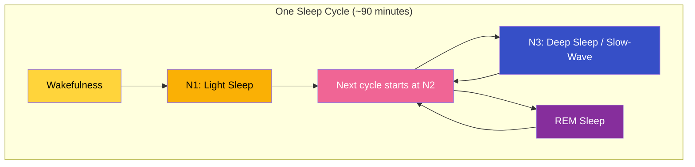
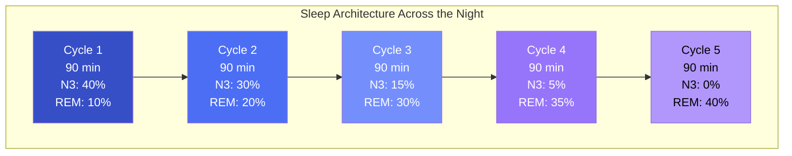
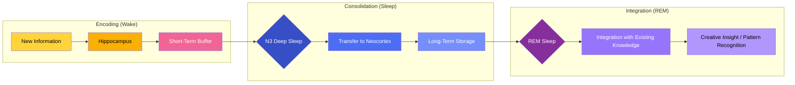
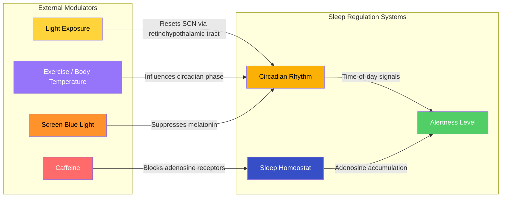
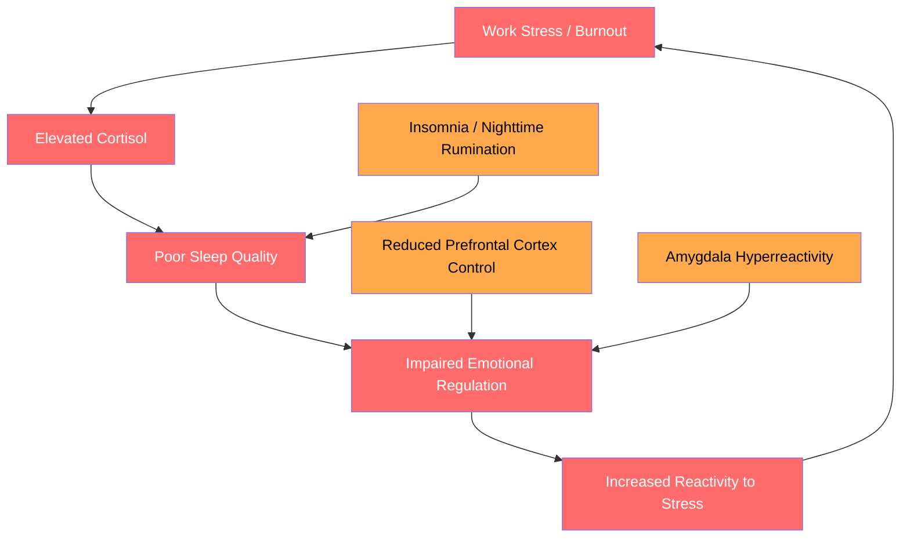
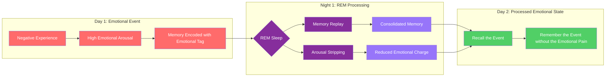
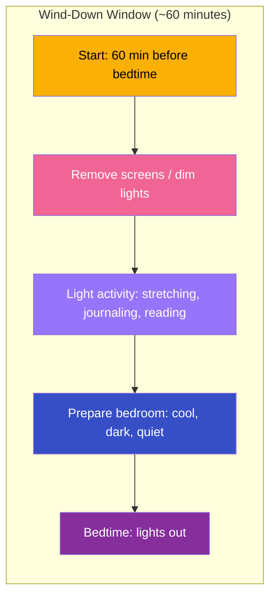
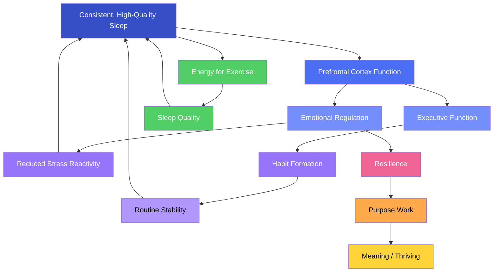

# Sleep Architecture

## Description

Sleep is not rest — it is an active neurological process that determines whether your brain can learn, regulate emotions, and sustain focus. For developers, sleep is the single highest-leverage health behavior. This document explains sleep architecture — the cycles and stages that constitute a night of sleep — and provides practical, evidence-based strategies for integrating sleep as a foundational practice in your transformation journey.

## Prerequisites

- [Why Physical Health Is the Foundation of Transformation](intro/why-health-matters.md) — establishes the philosophical and scientific rationale for physical health as the substrate of cognitive and emotional function
- [The Mechanism of Change](../fundamentals/the-mechanism-of-change.md) — understanding how awareness, agency, and action interact to produce sustainable transformation

## Table of Contents

- [Sleep Is Not Rest](#-sleep-is-not-rest)
- [The Architecture of Sleep](#-the-architecture-of-sleep)
- [Why Sleep Matters for Developers](#-why-sleep-matters-for-developers)
- [Circadian Rhythms and the Biological Clock](#-circadian-rhythms-and-the-biological-clock)
- [Sleep Debt: The Compounding Tax](#-sleep-debt-the-compounding-tax)
- [Sleep and Emotional Regulation](#-sleep-and-emotional-regulation)
- [Practical Sleep Hygiene for Developers](#-practical-sleep-hygiene-for-developers)
- [The Stewardship of Sleep](#-the-stewardship-of-sleep)
- [Sleep in the Context of the Level-Up Journey](#-sleep-in-the-context-of-the-level-up-journey)

## Content / Material

### 🌙 Sleep Is Not Rest

The word "rest" implies passivity — a cessation of activity, a quiet pause in which nothing happens. Sleep is not that. Sleep is one of the most active, complex, and metabolically expensive processes the brain performs. The brain consumes nearly as much energy during sleep as during wakefulness, and it uses that energy to perform functions that are impossible during conscious hours: memory consolidation, waste clearance, synaptic pruning, emotional reprocessing, and neural repair.

This misunderstanding is consequential. When you think of sleep as rest, you treat it as optional — something you can sacrifice on busy days and recover on weekends. When you understand sleep as active maintenance, you recognize that skipping it is not saving time. It is deferring essential maintenance that the brain will eventually demand, with interest.

The developer who pulls an all-nighter to meet a deadline is not being productive. They are borrowing against their cognitive future at usurious rates. The code written at 3 AM on five hours of sleep in the preceding 48 hours contains statistically more defects than code written after a full night's sleep. The "extra" hours gained by sacrificing sleep are not net gains — they are transfers from cognitive quality to time quantity, and the exchange rate is deeply unfavorable.

Walker (2017) frames this with a memorable analogy: sleep is the "Swiss Army knife of health." No single practice affects more physiological and cognitive systems in a positive direction. When you improve sleep, you improve learning, memory, emotional stability, immune function, cardiovascular health, metabolic regulation, and even longevity. When you degrade sleep, you degrade all of these simultaneously.

### 🏗️ The Architecture of Sleep

Sleep is not a uniform state. It cycles through distinct stages, each with a unique neurobiological signature and function. A single night of sleep consists of four to six complete cycles, each lasting approximately 90 minutes. The architecture — the structure and timing of these cycles — determines how restorative the night is.

#### 🔄 The Sleep Cycle



The cycle repeats every 90 minutes, but the composition changes across the night. Early cycles contain more deep sleep (N3). Later cycles contain more REM sleep. Understanding this distribution is critical for understanding why short sleep is disproportionately damaging.



#### 📊 The Stages of Sleep

Each stage of sleep serves a distinct function. Understanding them helps you understand what you lose when you cut sleep short.

| Stage | Also Known As | Brain Activity | Primary Function | Proportion of Night |
|-------|---------------|----------------|------------------|---------------------|
| **N1** | Light sleep, drowsiness | Theta waves (4–7 Hz), slow rolling eye movements | Transition from wakefulness to sleep; easily awakened | 5–10% |
| **N2** | Stable sleep | Sleep spindles and K-complexes; bursts of rapid brain activity | Memory consolidation, synaptic stabilization, sensory gating | 45–55% |
| **N3** | Deep sleep, slow-wave sleep, delta sleep | Delta waves (0.5–4 Hz), slow, high-amplitude oscillations | Physical restoration, growth hormone release, glymphatic clearance, declarative memory consolidation | 15–25% (highest in first half of night) |
| **REM** | Rapid eye movement sleep, paradoxical sleep | Mixed-frequency brain activity resembling wakefulness; muscle atonia (paralysis) | Emotional processing, procedural memory consolidation, creative insight, synaptic pruning | 20–25% (highest in second half of night) |

**N1 — Light Sleep.** The gateway to sleep. You drift in and out, and a minor stimulus — a sound, a light, a change in temperature — can wake you. Hypnic jerks (the sensation of falling) and hypnagogic imagery (dream-like impressions) occur here. N1 accounts for only 5–10% of the night but is essential for the transition into deeper stages.

**N2 — Stable Sleep.** This is where you spend roughly half the night. The brain produces sleep spindles — brief, synchronous bursts of neural activity in the 11–16 Hz range — that play a critical role in memory consolidation. Spindles act as a "gate" that protects the sleeping brain from external stimuli while allowing memory-specific information to be replayed and stabilized. K-complexes, another N2 signature, are thought to suppress cortical arousal and promote sleep maintenance. A higher density of sleep spindles correlates with higher IQ scores and better learning performance (Fogel & Smith, 2011).

**N3 — Deep Sleep (Slow-Wave Sleep).** This is the most physically restorative stage. The brain generates large, slow delta waves that synchronize across wide cortical regions. During N3, the brain clears metabolic waste through the glymphatic system — the equivalent of a nightly janitorial service that washes away amyloid-beta and tau proteins (Xie et al., 2013). The pituitary gland releases growth hormone, which repairs tissues and builds muscle. Declarative memories — facts, events, concepts — are consolidated and transferred from the hippocampus to the neocortex for long-term storage. The proportion of N3 sleep declines with age, but its importance does not; older adults who maintain N3 sleep through good sleep hygiene show better cognitive outcomes.

**REM Sleep — "Sleep that sees."** REM is the stage in which the brain is nearly as active as during wakefulness, but the body is paralyzed (atonia). This is where most dreaming occurs. REM serves emotional processing — the brain replays emotional experiences and strips the associated physiological arousal, allowing you to "recalibrate" your emotional response. This is why a good night's sleep genuinely makes yesterday's problems feel less overwhelming: your brain has processed the emotion during REM. REM is also critical for procedural memory — how to do things — and for creative insight. The brain recombines existing knowledge in novel ways during REM, producing the "aha" moments that seem to come from nowhere after a good night's sleep.

#### 🌊 The Glymphatic System: The Brain's Nightly Cleanse

One of the most important discoveries in sleep neuroscience is the glymphatic system. Discovered by Xie et al. (2013) at the University of Rochester, this system is the brain's waste clearance mechanism. During sleep — particularly during N3 deep sleep — the space between brain cells increases by up to 60%, allowing cerebrospinal fluid to flow through the brain and flush out metabolic waste products.

| Waste Product | Association | Clinical Relevance |
|---------------|-------------|-------------------|
| Amyloid-beta | Alzheimer's disease | Chronic sleep deprivation increases amyloid-beta accumulation in the brain, a primary driver of Alzheimer's pathology |
| Tau protein | Neurodegeneration | Hyperphosphorylated tau forms tangles associated with Alzheimer's and other dementias |
| Lactate | Metabolic byproduct of neural activity | Cleared during sleep; accumulation contributes to brain fog |
| Reactive oxygen species | Cellular damage | Cleared during sleep; accumulation contributes to oxidative stress and neurodegeneration |

The glymphatic system is 10 times more active during sleep than during wakefulness (Xie et al., 2013). This means that chronic sleep deprivation is not merely a performance issue — it is a biological toxin accumulation problem. The brain that does not sleep adequately is a brain that is slowly poisoning itself.

Walker (2017) puts this in stark terms: the link between chronic short sleep and neurodegenerative diseases like Alzheimer's is no longer correlational — it is mechanistic. A single night of 4–5 hours of sleep elevates amyloid-beta levels in the cerebrospinal fluid. A lifetime of short sleep significantly increases the lifetime risk of Alzheimer's disease. The glymphatic system is the biological mechanism that explains this link.

For a developer, this is not abstract. The glymphatic system is the nightly maintenance that ensures your brain can clear the metabolic waste accumulated during 8–12 hours of intense cognitive work. If you short-circuit this process, you are not just tired — you are building up biochemical debt that compounds over decades.

#### 🧠 Memory Consolidation During Sleep

Memory consolidation is one of sleep's most critical functions for developers. Learning new programming languages, frameworks, design patterns, and architectures depends entirely on the ability to encode new information into long-term memory. Sleep is the process that does this encoding.



The two-step model of memory consolidation during sleep works as follows:

1. **N3 (Deep Sleep) — Transfer.** During slow-wave sleep, the hippocampus replays the day's experiences — the new information you encountered, the problems you solved, the patterns you noticed. This replay strengthens the neural connections representing that information and transfers the memory trace from the hippocampus (temporary storage) to the neocortex (long-term storage). Without sufficient N3, new learning does not "stick."

2. **REM Sleep — Integration.** During REM sleep, the brain recombines the newly consolidated memories with existing knowledge structures. This is the stage where creative insight emerges — the brain makes novel connections between previously unrelated pieces of information. REM is why you wake up with the solution to a problem that seemed unsolvable the night before.

A study by Rasch and Born (2013) in *Physiological Reviews* demonstrated that subjects who learned a task and then slept performed significantly better than those who stayed awake, even with equivalent time between learning and testing. The improvement was not merely a matter of avoiding interference — it was an active enhancement that occurred only during sleep.

For developers, the implication is direct: the night after a day of intense learning — a new framework, a new language, a complex debugging session — is when that learning is actually integrated into your neural architecture. Sacrificing sleep after a day of learning is like compiling a program and then deleting the binary before running it. The work was done, but the output was discarded.

### 💻 Why Sleep Matters for Developers

Software development is a cognitively demanding profession that depends on precisely the neural functions that sleep supports: learning, memory, focus, creativity, emotional regulation, and decision-making. The relationship between sleep quality and software development performance is not theoretical — it is measurable and substantial.

#### 📉 Code Quality and Sleep

The most direct effect of sleep deprivation on software development is the degradation of code quality. A study conducted at Microsoft Research by Aranda and Easterbrook (2011) found that developers who slept fewer than 6 hours per night produced code with approximately 50% more defects than those who slept 7+ hours. This effect persisted even after controlling for experience, task complexity, and time spent coding.

The mechanism is straightforward: sleep-deprived prefrontal cortex activity impairs executive function — the cognitive control system responsible for planning, attention, impulse control, and working memory. Software development requires sustained executive function: maintaining a mental model of the system, tracking multiple variables and states, evaluating edge cases, and inhibiting premature conclusions. Sleep deprivation degrades all of these.

| Cognitive Function | Effect of Acute Sleep Deprivation (24h awake) | Effect of Chronic Sleep Restriction (6h/night for 2 weeks) |
|--------------------|-----------------------------------------------|-----------------------------------------------------------|
| Working memory capacity | 40% reduction (Lim & Dinges, 2010) | 25% reduction (Banks & Dinges, 2007) |
| Sustained attention | 50% increase in lapses (Doran et al., 2001) | 30% increase in lapses (Van Dongen et al., 2003) |
| Cognitive flexibility | Significant impairment (Horne, 1988) | Moderate impairment (Belenky et al., 2003) |
| Decision-making quality | Conservative bias, increased risk-taking | Impaired risk assessment (Harrison & Horne, 2000) |
| Error detection | 60% reduction in error awareness (Hockey, 1997) | 35% reduction (Dorrian et al., 2000) |
| Divergent thinking / creativity | 45% reduction in novel solutions (Wagner et al., 2004) | 30% reduction (Randazzo et al., 1998) |

The table reveals a disturbing pattern: chronic sleep restriction produces cumulative deficits nearly as severe as acute total sleep deprivation, despite the individual feeling less impaired. Van Dongen et al. (2003) showed that subjects who slept 6 hours per night for 14 consecutive days performed as poorly on cognitive tests as subjects who were awake for 24 hours straight. Most critically, the chronic restriction group rated their subjective sleepiness as near-normal — they did not know how impaired they were.

This has a specific implication for developers: you cannot trust your self-assessment of sleep adequacy after the first few days of restriction. The brain adapts to chronic short sleep by attenuating the subjective experience of tiredness while the objective cognitive deficits continue to accumulate. You may feel fine and code poorly.

#### 🐛 Debugging and Sleep

Debugging is a particularly sleep-sensitive activity. It requires sustained attention, working memory (holding the system state in mind), cognitive flexibility (considering multiple possible causes), and error detection (noticing discrepancies between expected and actual behavior). All four are degraded by sleep deprivation.

| Aspect of Debugging | Sleep-Deprived State | Consequence |
|---------------------|---------------------|-------------|
| Hypothesis generation | Reduced cognitive flexibility; fixation on first plausible cause | Missed alternative explanations; longer debugging time |
| Attention to detail | Increased lapses; missed signals in logs or stack traces | Bugs overlooked; root cause misidentified |
| Working memory | Reduced capacity to track multiple variables | System state collapses in mental model; regression to simpler hypotheses |
| Error detection | Reduced awareness of mistakes | Confirmation bias reinforced; incorrect fixes applied |
| Persistence | Reduced frustration tolerance | Premature abandonment of debugging session; "works on my machine" avoidance |

Killgore (2010) demonstrated that sleep deprivation reduces prefrontal cortex activity while increasing amygdala reactivity, shifting the brain from deliberate, analytical processing to emotional, reactive processing. A sleep-deprived developer encountering a stubborn bug will experience the frustration more intensely, consider fewer alternative hypotheses, and be more likely to apply a superficial fix or abandon the effort entirely.

The practical advice is simple but countercultural: if you have been debugging a problem for more than 45 minutes without progress and you are tired, stop. Sleep. The solution will either surface during REM sleep (creative integration) or be obvious when you revisit the problem with a rested prefrontal cortex. The time "lost" to sleep is more than recovered by the reduction in debugging time.

#### 📚 Learning New Technologies

The software industry requires continuous learning. New frameworks, languages, tools, and paradigms emerge constantly, and staying relevant requires the ability to acquire new skills. Sleep is the biological process that makes learning stick.

A landmark study by Stickgold (2005) at Harvard Medical School demonstrated that sleep within 12–24 hours of learning is critical for memory consolidation. Subjects who learned a visual discrimination task and then slept performed significantly better the next day, while subjects who stayed awake showed no improvement. The improvement was proportional to the amount of N3 sleep in the first half of the night and REM sleep in the second half.

For a developer learning a new technology stack, this means:

- **Study before bed.** Reviewing a new concept immediately before sleep increases the likelihood that it will be consolidated during N3. The hippocampus prioritizes the most recent experiences for replay during sleep.
- **Sleep after learning.** The night following a study session is when the learning is integrated into long-term memory. Do not sacrifice that night's sleep for "more study time."
- **Multiple nights for complex material.** Complex topics require multiple sleep cycles to be fully integrated. A week of consistent sleep after a week of intense learning is more effective than a single "catch-up" night of long sleep after a week of short sleep.

```python
class LearningConsolidation:
    """Model of how sleep affects learning consolidation."""

    def __init__(self, study_hours=0, sleep_hours=7.5):
        self.study_hours = study_hours
        self.sleep_hours = sleep_hours
        self.consolidation_rate = 0.0
        self._calculate_consolidation()

    def _calculate_consolidation(self):
        if self.sleep_hours < 4:
            n3_factor = self.sleep_hours / 4.0
            rem_factor = 0.0
        elif self.sleep_hours < 7:
            n3_factor = 1.0
            rem_factor = (self.sleep_hours - 4) / 3.0
        else:
            n3_factor = 1.0
            rem_factor = 1.0

        study_efficiency = min(self.study_hours / 4.0, 1.0)

        self.consolidation_rate = (
            0.5 * n3_factor + 0.3 * rem_factor + 0.2 * study_efficiency
        )

    def effective_learning(self):
        return self.consolidation_rate


scenario_a = LearningConsolidation(study_hours=4, sleep_hours=8)
scenario_b = LearningConsolidation(study_hours=6, sleep_hours=4)
scenario_c = LearningConsolidation(study_hours=2, sleep_hours=8)
```

The output reveals a pattern that resonates with every developer who has pulled a late-night study session before an interview or project: more study time with less sleep produces less effective learning than less study time with adequate sleep. The bottleneck is sleep, not study time.

#### 🔬 The Research Table: Sleep Duration and Outcomes

| Sleep Duration | Cognitive Performance | Health Consequences | Professional Implications |
|----------------|----------------------|---------------------|--------------------------|
| **4–5 hours** | Severe deficits in attention, working memory, executive function | 70% reduction in natural killer cell activity (Walker, 2017); elevated cortisol; impaired glucose metabolism | 50% more code defects (Microsoft Research); increased conflict in code reviews |
| **6 hours** | Significant but subjectively underestimated deficits | Cumulative impairment equivalent to 24h total sleep deprivation after 14 days (Van Dongen et al., 2003) | Impaired debugging performance; reduced learning consolidation |
| **7–8 hours** | Optimal performance on all cognitive domains | Lowest all-cause mortality in epidemiological studies (Cappuccio et al., 2010) | Best code quality; optimal learning and creative problem-solving |
| **9+ hours** | No additional cognitive benefit for most individuals | May indicate underlying health issues if persisting | No additional professional benefit |

### ⏰ Circadian Rhythms and the Biological Clock

Sleep does not occur in isolation. It is regulated by two interacting systems: the circadian rhythm (the biological clock) and the sleep homeostat (sleep pressure). Understanding both is essential for optimizing sleep.

#### 🕐 The Circadian Rhythm

The circadian rhythm is an endogenous, approximately 24-hour cycle that regulates sleep-wake timing, hormone release, body temperature, metabolism, and cognitive performance. It is generated by the suprachiasmatic nucleus (SCN) in the hypothalamus, a cluster of approximately 20,000 neurons that function as the brain's master clock.

The SCN receives direct input from the eyes via the retinohypothalamic tract, which signals the presence or absence of light. This is why light exposure is the most powerful synchronizer (zeitgeber) of the circadian rhythm. Morning light advances the clock (makes you wake earlier). Evening light delays the clock (makes you wake later).

| Time of Day | Circadian Signal | Physiological Effect |
|-------------|-----------------|---------------------|
| **6:00–8:00 AM** | Cortisol awakening response | Natural alertness increase; best time for waking |
| **8:00–10:00 AM** | Body temperature rises | Cognitive performance ramps up |
| **10:00 AM–12:00 PM** | Peak alertness | Optimal time for deep work and complex problem-solving |
| **1:00–3:00 PM** | Post-prandial dip + circadian trough | Reduced alertness; "afternoon slump" |
| **3:00–5:00 PM** | Secondary alertness peak | Good for collaborative work and meetings |
| **9:00–11:00 PM** | Melatonin onset | Sleep preparation; dim light required |
| **2:00–4:00 AM** | Core body temperature minimum | Deepest sleep; lowest alertness |

The timing of melatonin onset is critical. Melatonin is the "darkness hormone" — it signals the body to prepare for sleep. It is released approximately 2 hours before the natural sleep onset, which for most adults falls between 9:00–11:00 PM. Exposure to bright light — especially blue-wavelength light from screens — suppresses melatonin production and delays sleep onset.

Incorrect timing is more disruptive than incorrect quantity. A developer who goes to bed at 3 AM every night and sleeps until 11 AM may get 8 hours of sleep but will experience measurable circadian misalignment. The brain expects certain physiological conditions at certain times — cortisol peak at dawn, body temperature rise in the morning, melatonin at dusk. When timing is shifted, the quality of sleep and wakefulness both suffer.

#### 🧮 The Sleep Homeostat

The sleep homeostat tracks sleep debt through the accumulation of adenosine, a neurotransmitter that promotes sleep pressure. Adenosine builds up in the brain throughout the day and is cleared during sleep. Caffeine works by blocking adenosine receptors, temporarily masking sleep pressure without reducing it.

The interaction between circadian rhythm and sleep homeostat determines when you feel alert and when you feel sleepy. The two systems are orthogonal: it is possible to have high sleep debt and high circadian alertness (e.g., 8:00 AM after a night of short sleep), or low sleep debt and low circadian alertness (e.g., 2:00 PM after a full night of sleep — the afternoon slump).



#### 🌍 The Developer's Circadian Problem

Developers face occupational circadian challenges that are less common in other professions:

1. **Delayed sleep phase syndrome (DSPS).** Late-night coding sessions, screen exposure, and irregular schedules shift the circadian clock progressively later. The developer goes to bed at 2 AM, wakes at 10 AM, and is biologically programmed to sleep 2 AM–10 AM. This conflicts with standard work schedules, creating chronic sleep deprivation that is self-reinforcing — the later you sleep, the harder it is to shift back.

2. **Timezone-spanning collaboration.** Remote and distributed teams require meetings at varying hours, fragmenting the sleep schedule. A developer working with a team spanning three time zones may have early-morning standups and late-evening design sessions, compressing the sleep window.

3. **Late-night debugging.** The combination of deadline pressure and the "flow" state makes it easy to lose track of time during late-night coding sessions. The developer tells themselves "just one more hour" and ends up shifting their sleep window by three hours.

4. **Social jetlag.** The difference between sleep timing on workdays and free days is medically referred to as social jetlag. A developer who sleeps 11:30 PM–7:30 AM on workdays and 3:00 AM–11:00 AM on weekends experiences a circadian shift equivalent to flying from New York to Chicago and back every week. The metabolic and cognitive consequences of social jetlag are comparable to actual jetlag.

### 🧮 Sleep Debt: The Compounding Tax

Sleep debt is the cumulative difference between the sleep you need and the sleep you get. It is biological, not psychological — it represents the unmet need for the restorative processes that only sleep can provide.

#### 📊 The Accumulation Model

Sleep debt accumulates linearly and clears slowly. Each hour of sleep below your individual requirement adds to the debt. Recovery sleep is more efficient than normal sleep — the brain prioritizes N3 deep sleep and REM sleep during recovery — but it is not perfectly efficient. A debt of 10 hours of lost sleep requires approximately 10–12 hours of recovery sleep distributed over 2–3 nights, not a single 12-hour sleep session.

```python
class SleepDebt:
    """Model of sleep debt accumulation and recovery."""

    def __init__(self, required_hours=8.0):
        self.required_hours = required_hours
        self.debt_hours = 0.0
        self.recovery_efficiency = 0.85

    def night(self, hours_slept):
        if hours_slept >= self.required_hours:
            surplus = hours_slept - self.required_hours
            debt_reduced = surplus * self.recovery_efficiency
            self.debt_hours = max(0, self.debt_hours - debt_reduced)
        else:
            deficit = self.required_hours - hours_slept
            self.debt_hours += deficit
        return self.debt_hours

    def status(self):
        if self.debt_hours < 2:
            return f"Healthy (debt: {self.debt_hours:.1f}h)"
        elif self.debt_hours < 7:
            return f"Moderate debt (debt: {self.debt_hours:.1f}h)"
        elif self.debt_hours < 14:
            return f"High debt (debt: {self.debt_hours:.1f}h)"
        else:
            return f"Critical debt (debt: {self.debt_hours:.1f}h)"


debt = SleepDebt(required_hours=8.0)
schedule = [
    ("Mon", 6.0),
    ("Tue", 5.5),
    ("Wed", 6.0),
    ("Thu", 8.0),
    ("Fri", 5.0),
    ("Sat", 10.0),
    ("Sun", 9.0),
]

for day, hours in schedule:
    debt_today = debt.night(hours)
```

The simulation reveals a common pattern: the weekend cannot fully compensate for significant weekday deficits. After a week of 5–6 hour nights with a weekend catch-up, the developer ends the week with residual debt. Over months and years, this residual debt accumulates into chronic sleep deprivation that the individual subjectively adapts to while their objective cognitive performance continues to deteriorate.

#### 📉 The Performance Curve

The relationship between sleep duration and performance is not linear — it has a threshold effect. Below approximately 7 hours of sleep per night, performance declines sharply. Above 8 hours, the curve flattens. The recommended range (7–9 hours) represents the plateau where most adults achieve optimal function.

| Average Sleep per Night | Performance Relative to Baseline | Recovery Time After Chronic Restriction |
|------------------------|----------------------------------|----------------------------------------|
| 9+ hours | 100% (baseline for most) | N/A |
| 8 hours | 95–100% | N/A |
| 7 hours | 85–95% | 1–2 nights |
| 6 hours | 70–85% | 3–5 nights |
| 5 hours | 50–70% | 5–10 nights |
| 4 hours | 30–50% | 7–14 nights |

The critical insight from Van Dongen et al. (2003): subjects who slept 6 hours per night for 14 days did not stabilize at a reduced performance level — they continued to decline across the entire 14-day period, with no plateau in sight. This means that chronic mild sleep restriction does not produce a new "normal." It produces continuous, cumulative degradation that eventually becomes severe.

#### 🧪 Individual Variation

Sleep requirement varies between individuals. While 7–9 hours is the population range, some people are "short sleepers" who function optimally on 6 hours, and others require 9+ hours. The distinction is genetic — a mutation in the DEC2 gene allows certain individuals to function normally on short sleep. These individuals are approximately 1% of the population.

How do you know your personal requirement? The gold-standard method is a vacation experiment: go to bed at the same time every night for two weeks, without an alarm, and record your sleep duration. By the second week, your sleep duration will stabilize at your biological requirement. The first week is recovery from existing debt; the second week is your true requirement.

Most developers who try this are surprised by the result. The person who "only needs 6 hours" typically stabilizes at 7.5–8.5 hours once debt is cleared. The belief that you need less sleep than the population average is usually a rationalization of chronic deprivation, not a biological reality.

### 😡 Sleep and Emotional Regulation

Sleep deprivation does not make you tired. It makes you emotionally unstable. The link between sleep and emotional regulation is one of the most robust findings in sleep neuroscience, and it has direct implications for every dimension of the level-up journey.

#### 🔬 The Amygdala-PFC Disconnection

The amygdala is the brain's emotional alert center — it scans for threats and generates emotional responses. The prefrontal cortex (PFC) is the regulatory center — it evaluates whether the threat is real and inhibits inappropriate emotional responses.

During sleep deprivation, the connection between the amygdala and the PFC is disrupted. The amygdala becomes hyperreactive — it overestimates threats and generates exaggerated emotional responses. The PFC becomes underactive — it cannot override the amygdala's signals effectively.

| Condition | Amygdala Reactivity | PFC Control | Net Effect |
|-----------|---------------------|-------------|------------|
| Well-rested | Moderate (appropriate threat detection) | Strong (effective regulation) | Stable emotional response |
| Sleep-deprived | 60% increase (Walker, 2017) | 30% reduction (Yoo et al., 2007) | Emotional reactivity; overreaction to minor stressors |
| Chronically restricted | Sustained elevation (Motivala et al., 2005) | Progressive decline (Lo et al., 2012) | Mood instability; irritability; reduced frustration tolerance |

Yoo et al. (2007) at UC Berkeley demonstrated this mechanism using fMRI. Sleep-deprived subjects showed a 60% increase in amygdala reactivity to negative emotional stimuli compared to well-rested subjects. The amygdala's connection to the medial prefrontal cortex (the regulatory center) was significantly weakened, while its connection to the brainstem (the fight-or-flight center) was strengthened.

The practical experience of this neural disconnection is familiar to every developer who has coded while sleep-deprived: minor frustrations feel catastrophic, code review feedback lands as personal criticism, a production bug triggers disproportionate anxiety, and interpersonal conflicts escalate unnecessarily. The developer is not choosing to be reactive — their brain is physically incapable of regulating emotion at the level required for professional composure.

#### 🔄 The Sleep-Emotion Feedback Loop

Sleep and emotion form a bidirectional feedback loop: poor sleep impairs emotional regulation, and emotional distress impairs sleep. This creates a self-reinforcing cycle that can trap developers during periods of high stress.



During a difficult period — a failed project, a layoff, a conflict with a colleague — the developer's sleep quality declines due to rumination and anxiety. This impairs their emotional regulation the following day, making them more reactive to additional stressors. The increased reactivity generates more anxiety, which further degrades sleep. The cycle deepens without deliberate intervention.

The intervention point is the cycle itself. Improving sleep — through the hygiene practices described below — is not merely a health behavior but an emotional regulation strategy. A developer who prioritizes sleep during a stressful period is not avoiding the stress; they are maintaining their capacity to handle it.

#### 🌈 REM Sleep and Emotional Recalibration

The specific role of REM sleep in emotional regulation is particularly important. During REM, the brain replays emotional experiences and strips the associated autonomic arousal. Walker (2017) describes this as "overnight therapy" — by morning, the emotional charge of yesterday's events has been processed and reduced.



The implication is that REM sleep deprivation — which occurs when you cut sleep short, especially in the early morning hours — leaves emotional experiences unprocessed. The memory remains intact, but the emotional charge persists. This is the neural basis of the observation that sleep-deprived individuals are more emotionally reactive to past events: the events have not been properly processed and stored.

For the developer in the level-up journey, this means that adequate sleep is not optional for emotional growth. You cannot learn to regulate your emotions if your brain is never given the opportunity to process them during REM sleep. The resilience work in this module depends on the sleep work here.

### 🛠️ Practical Sleep Hygiene for Developers

Knowledge of sleep architecture is useless without implementation. This section provides concrete, evidence-based strategies for optimizing sleep within the constraints of a developer's life.

#### 🛏️ Environment

Your bedroom environment is the most powerful determinant of sleep quality after sleep duration itself. Optimize it.

| Factor | Optimal Setting | Why It Matters |
|--------|-----------------|----------------|
| **Temperature** | 18–20°C (65–68°F) | Core body temperature must drop for sleep onset and maintenance; a cool room supports this natural drop |
| **Light** | Complete darkness (use blackout curtains or eye mask) | Light — especially blue light — suppresses melatonin production; even dim light through eyelids during sleep disrupts sleep quality |
| **Noise** | Below 30 dB (use earplugs or white noise if needed) | The brain continues to process auditory information during sleep; unpredictable noises cause micro-awakenings that fragment sleep architecture |
| **Air quality** | Good ventilation, CO₂ below 1000 ppm | Elevated CO₂ impairs sleep quality by reducing slow-wave sleep duration (Xie et al., 2013) |
| **Clutter** | Minimal visual clutter | A cluttered environment increases cognitive load and cortisol levels even during sleep |

The developer-specific challenge here is the proximity of screens. The same device used for work, entertainment, and social connection is present in the bedroom, emitting blue light that directly suppresses melatonin. The most effective intervention is simple: remove all screens from the bedroom. Charge your phone in another room. Use an analog alarm clock.

If this is not immediately possible, use the following mitigations in order of effectiveness:

1. **Physical separation.** Move the charging station outside the bedroom. The friction of having to get up to check the phone reduces the habit.
2. **Blue light filters.** Use Night Shift (macOS/iOS), Night Light (Windows), or f.lux on all devices, set to maximum warmth from sunset to bedtime.
3. **Dimming.** Reduce screen brightness to the minimum usable level after sunset.
4. **Screen-free wind-down.** Stop using screens entirely 30–60 minutes before bedtime.

#### ⏰ Timing

Consistency is more important than duration. Irregular sleep timing disrupts the circadian rhythm and reduces sleep quality even when total sleep time is adequate.

| Practice | Recommendation | Evidence |
|----------|---------------|----------|
| **Consistent bedtime** | Same time every night, including weekends | Regular bedtimes are associated with better sleep quality, lower BMI, and lower cardiovascular risk (Sletten et al., 2020) |
| **Consistent wake time** | Same time every morning, even after a poor night | Morning light exposure anchors the circadian rhythm; variable wake times create social jetlag |
| **Sleep window** | 7–9 hours based on individual requirement | The population optimal range; determine your individual requirement through the vacation experiment |
| **Wind-down period** | 30–60 minutes before bedtime | Activities that lower physiological arousal: reading (physical book), light stretching, journaling, meditation |
| **Caffeine cutoff** | No caffeine after 2:00 PM | Caffeine has a half-life of 5–6 hours; 200 mg at 4:00 PM leaves 100 mg still active at 9:00–10:00 PM, enough to impair sleep onset and reduce N3 sleep |

The wind-down period is the intervention most often skipped by developers. The impulse is to work "just one more hour" or to decompress with a screen (social media, video, games). Both delay melatonin onset and delay the first sleep cycle. The wind-down should include:

- **Dim lighting.** Reduce overhead lights; use lamps or candles.
- **No work.** No Slack, no email, no code review. The prefrontal cortex needs to disengage.
- **No emotionally stimulating content.** No news, no social media, no arguments. Emotional arousal delays sleep.
- **Active relaxation.** Progressive muscle relaxation, deep breathing, gratitude journaling, or reading fiction.

#### ☕ Caffeine Management

Caffeine is the most widely used psychoactive substance in the world, and it is the most common self-medication for sleep deprivation among developers. The relationship between caffeine and sleep is antagonistic: caffeine masks sleep pressure by blocking adenosine receptors, but it does not reduce sleep debt. It defers it.

| Caffeine Timing | Effect on Sleep | Recommendation |
|-----------------|-----------------|----------------|
| Morning (6–10 AM) | Minimal effect on sleep if consumed early | Safe for most people; best time for caffeine |
| Noon–2 PM | Moderate effect; half-life means 50% still active at bedtime | Acceptable for most; consider reducing dose |
| 2–6 PM | Significant effect; 25–50% still active at bedtime | Avoid; limits N3 and REM sleep |
| 6 PM onward | Severe effect; significantly delays sleep onset and fragments sleep | Never consume |

Individual caffeine metabolism varies genetically. CYP1A2 genotyping determines whether you are a "fast metabolizer" or "slow metabolizer" of caffeine. Slow metabolizers (approximately 50% of the population) clear caffeine at half the rate of fast metabolizers and experience greater sleep disruption from the same dose.

Practical rules:

- **Consume caffeine only in the morning** — between waking and noon. This ensures adequate clearance before bedtime.
- **Limit total intake** to 200–400 mg per day (approximately 2–4 cups of coffee).
- **Do not drink coffee to compensate for poor sleep.** This creates a cycle: poor sleep → more caffeine → poorer sleep → more caffeine.
- **Consider a caffeine taper** if you currently consume caffeine late in the day. Reduce by one cup every 3 days until your cutoff is noon.

#### 🏃 Exercise Timing

Exercise improves sleep quality through multiple mechanisms: it increases sleep pressure (adenosine accumulation), reduces anxiety, raises body temperature (the subsequent drop facilitates sleep onset), and regulates circadian rhythms.

| Exercise Timing | Effect on Sleep | Best For |
|-----------------|-----------------|----------|
| Morning (before work) | Improves circadian alignment; advances the clock | People who wake early and want to maintain a morning chronotype |
| Afternoon (2–5 PM) | Optimal for most; does not interfere with sleep onset | Most developers; aligns with circadian performance peak |
| Evening (after 7 PM) | May delay sleep onset in some individuals due to elevated core temperature and catecholamines | Only for those who habituate to evening exercise; monitor individual tolerance |

For developers who sit all day, the minimum effective dose of exercise for sleep improvement is 20 minutes of moderate aerobic activity (brisk walking, cycling) at any time of day. The benefit is not dose-dependent at low levels — any movement is better than none.

#### 🍽️ Nutrition and Sleep

What you eat and when you eat affects sleep quality.

| Practice | Effect on Sleep | Mechanism |
|----------|-----------------|-----------|
| **Avoid large meals within 2 hours of bedtime** | Reduces sleep disruption | Digestion elevates body temperature and activates the sympathetic nervous system; both interfere with sleep onset and N3 sleep |
| **Limit alcohol within 3 hours of bedtime** | Reduces sleep quality by 20–40% | Alcohol suppresses REM sleep in the first half of the night and causes rebound fragmentation in the second half; it is a sedative, not a sleep aid |
| **Avoid sugar before bed** | Delays sleep onset and increases night wakings | Blood glucose fluctuations trigger cortisol and adrenaline release during the night |
| **Magnesium (200–400 mg before bed)** | May improve sleep quality in magnesium-deficient individuals | Magnesium binds to GABA receptors, promoting relaxation; empirical evidence is mixed but the risk-benefit ratio favors supplementation |
| **Tart cherry juice or kiwifruit** | Modest improvement in sleep duration and quality | Natural sources of melatonin and serotonin precursors; effect size is small but consistent in controlled trials |

**Alcohol deserves special attention.** Many developers use alcohol to unwind after a stressful day, and alcohol does reduce sleep onset latency — you fall asleep faster. But alcohol profoundly disrupts sleep architecture. It suppresses REM sleep in the first half of the night, and as it metabolizes, it causes rebound wakefulness and REM fragmentation in the second half. A standard drink consumed within 3 hours of bedtime reduces REM sleep by approximately 20% and increases night wakings by 15% (Ebrahim et al., 2013). The subjective feeling of "a good night's sleep" after drinking is an illusion.

#### 📱 Screen Management

Screen exposure before bed is the most common and most modifiable cause of poor sleep among developers. The mechanism is twofold.

First, **blue-wavelength light** (450–495 nm) suppresses melatonin production more effectively than any other wavelength. The retina contains intrinsically photosensitive retinal ganglion cells (ipRGCs) that express melanopsin, a photopigment maximally sensitive to blue light. When these cells are activated by blue light, they signal the SCN to suppress melatonin and delay the circadian clock.

Second, **cognitive engagement** with screens — work, social media, video games, arguments on the internet — activates the prefrontal cortex and the limbic system, both of which should be winding down before sleep. Emotional and cognitive arousal directly opposes sleep initiation.

The combination of these two mechanisms makes screen time before bed a double hit: it suppresses the chemical signal for sleep (melatonin) and activates the neural systems that oppose sleep (PFC, amygdala).

| Screen Intervention | Effectiveness | Implementation Difficulty |
|---------------------|---------------|--------------------------|
| No screens in bedroom | Very high | Medium (requires habit change) |
| Blue light filters on all devices after sunset | High | Low (one-time settings change) |
| No screens 60 minutes before bed | Very high | Medium (requires alternative wind-down) |
| Dim screen brightness to minimum | Moderate | Low (adjust brightness) |
| Use e-ink reader instead of phone/tablet for evening reading | High | Low (purchase e-reader) |

#### 🧘 The Wind-Down Routine

A structured wind-down routine is the single most effective behavioral intervention for improving sleep onset and quality. It signals to the brain that sleep is approaching, allowing the physiological transition to occur smoothly.



A sample wind-down routine for a developer:

- **T–60 min:** Stop all work. Close the laptop. Put the phone in another room.
- **T–50 min:** Dim the lights in the room. Switch to a lamp or candle.
- **T–45 min:** Light stretching (5 minutes) or yoga (10 minutes). Focus on neck, shoulders, and lower back — the areas most affected by sedentary work.
- **T–35 min:** Journal for 5 minutes. Write down anything on your mind — unfinished tasks, worries, ideas. The act of writing externalizes them and reduces the need for the brain to keep them active during sleep.
- **T–30 min:** Read a physical book (fiction is ideal; avoid topics related to work or personal stress).
- **T–5 min:** Bathroom routine. Brush teeth, wash face. Cool water on the face and wrists signals the body to lower core temperature.
- **T–0:** Lights out. No screens. If you cannot fall asleep within 20 minutes, get up and read in dim light until sleepy. Do not stay in bed awake — this conditions the brain to associate bed with wakefulness.

### ✝️ The Stewardship of Sleep

The philosophical foundation for prioritizing sleep extends beyond productivity, beyond code quality, beyond cognitive performance. The Christian theological tradition holds that the body is not a tool to be used but a trust to be cared for. Sleep is not idleness — it is participation in the created order, a daily acknowledgment that human effort has limits and that rest is not earned but given.

This perspective reframes sleep from a performance optimization to a spiritual practice. You do not sleep 8 hours because it makes you a better developer. You sleep 8 hours because it is the right way to treat the body you have been entrusted with. You sleep because you are finite, and finitude is not a flaw to be overcome but a design to be honored.

The developer who pulls all-nighters is not merely compromising their cognitive performance. They are asserting, implicitly, that their will can override their biology, that productivity justifies the neglect of the body, that the project is more important than the person. This is a theological claim as much as a behavioral one — it assumes that the body is an instrument of the will rather than a participant in a larger order.

The practice of regular, intentional sleep is a form of humility. It says: "I am not the master of my own physiology. I am a creature who needs rest. And I accept this condition as a gift rather than a limitation."

The developer who sleeps well is not being lazy. They are being wise. They are acknowledging that the work will be there tomorrow, that the body will not be negotiated with, that the most productive thing they can do for their code, their team, and their family is to be fully present — which requires being fully rested.

### 🔗 Sleep in the Context of the Level-Up Journey

Sleep is not a standalone health behavior. It is the keystone habit that determines the effectiveness of every other practice in the journey.

#### 🗺️ Sleep as the Foundation of Transformation

The level-up journey moves through stages: awakening, rebuilding, healthy living, systematizing, and thriving. Sleep sits at the intersection of all five.

| Stage | How Sleep Supports It |
|-------|-----------------------|
| **Awakening** | Emotional regulation during REM sleep enables you to process the pain of recognizing your situation without being destroyed by it |
| **Rebuilding** | Growth hormone released during N3 sleep repairs the physical damage of prolonged stress and burnout |
| **Healthy Living** | Sleep is the most effective intervention in this module; it amplifies the benefits of nutrition, exercise, and environmental optimization |
| **Systematizing** | Executive function — required for habit formation — is restored by adequate sleep; a sleep-deprived developer cannot install new habits consistently |
| **Thriving** | Creativity, insight, and emotional resilience — the capacities needed for purpose-driven work — depend critically on REM sleep |

The developer who attempts to move through these stages without fixing their sleep is building on sand. The energy for exercise comes from sleep. The discipline for habit formation requires prefrontal cortex function, which requires sleep. The emotional resilience for facing the existential questions of purpose requires emotional processing, which requires REM sleep.

Sleep is not one intervention among many. It is the intervention on which all others depend.

#### 🔄 The Virtuous Cycle

When sleep is prioritized, it creates a cascade of positive effects across the journey:

1. **Better sleep** improves prefrontal cortex function, which improves emotional regulation.
2. **Better emotional regulation** reduces stress-induced cortisol spikes, which improves sleep quality.
3. **Better sleep quality** increases motivation and energy, which makes exercise and healthy eating easier.
4. **Exercise and healthy eating** further improve sleep quality, closing the loop.
5. **Improved cognitive function** makes habit formation easier, which accelerates the systematizing stage.
6. **Improved emotional resilience** supports the deep existential work of the thriving stage.



The cycle is the mechanism. Sleep is the entry point. Start there.

## Glossary

| Term | Definition |
|------|------------|
| **Adenosine** | A neurotransmitter that accumulates in the brain throughout the day, increasing sleep pressure. Caffeine blocks adenosine receptors but does not reduce adenosine levels. |
| **Amygdala** | A brain structure involved in emotional processing, particularly threat detection and fear responses. Becomes hyperreactive during sleep deprivation. |
| **Atonia** | The temporary paralysis of voluntary muscles during REM sleep that prevents the body from acting out dreams. |
| **Circadian rhythm** | An endogenous, approximately 24-hour biological cycle that regulates sleep-wake timing, hormone release, body temperature, and metabolism. Generated by the suprachiasmatic nucleus (SCN). |
| **Declarative memory** | Memory for facts, events, and concepts that can be consciously recalled. Consolidated primarily during N3 deep sleep. |
| **Delayed sleep phase syndrome (DSPS)** | A circadian rhythm disorder in which the sleep-wake cycle is shifted later than socially acceptable, causing chronic sleep deprivation when the individual must adhere to a standard schedule. |
| **Delta waves** | Slow, high-amplitude brain waves (0.5–4 Hz) characteristic of N3 deep sleep. |
| **Executive function** | A set of cognitive processes — working memory, cognitive flexibility, inhibitory control — managed by the prefrontal cortex and essential for goal-directed behavior. |
| **Glymphatic system** | The brain's waste clearance mechanism, which removes metabolic waste products (including amyloid-beta and tau) primarily during N3 sleep. Activity is 10 times higher during sleep than wakefulness. |
| **Growth hormone** | A hormone released primarily during N3 deep sleep that stimulates tissue repair, muscle growth, and cellular regeneration. |
| **Hippocampus** | A brain structure critical for memory formation; replays experiences during sleep to transfer them to long-term storage in the neocortex. |
| **Hypnic jerk** | An involuntary muscle contraction that occurs during the transition from wakefulness to N1 sleep, often accompanied by a sensation of falling. |
| **K-complex** | A brain wave pattern observed during N2 sleep; thought to suppress cortical arousal and promote sleep maintenance. |
| **Melatonin** | A hormone produced by the pineal gland that signals the body to prepare for sleep. Suppressed by blue-wavelength light exposure. |
| **Prefrontal cortex (PFC)** | The brain region responsible for executive functions, impulse control, and emotional regulation. Impaired by sleep deprivation. |
| **Procedural memory** | Memory for how to perform tasks and skills. Consolidated primarily during REM sleep. |
| **Sleep architecture** | The structure and timing of sleep cycles and stages across a night of sleep. |
| **Sleep debt** | The cumulative difference between required sleep and actual sleep. Accumulates linearly and clears slowly, with imperfect recovery efficiency. |
| **Sleep homeostat** | The physiological system that tracks sleep pressure through adenosine accumulation. |
| **Sleep spindle** | A brief, synchronous burst of neural activity (11–16 Hz) during N2 sleep associated with memory consolidation and IQ. |
| **Slow-wave sleep (SWS)** | Another name for N3 deep sleep, characterized by delta waves. The most physically restorative sleep stage. |
| **Social jetlag** | The circadian disruption caused by misalignment between sleep timing on workdays and free days. Comparable to actual jetlag in its metabolic and cognitive effects. |
| **Suprachiasmatic nucleus (SCN)** | The master circadian clock in the hypothalamus; receives light input from the eyes via the retinohypothalamic tract. |
| **Synaptic pruning** | The elimination of weak or unnecessary neural connections, occurring primarily during REM sleep. Essential for efficient neural function. |
| **Zeitgeber** | A German term meaning "time-giver"; an external cue (primarily light) that synchronizes the circadian rhythm. |

## Quick References

- Walker, M. (2017). *Why We Sleep: Unlocking the Power of Sleep and Dreams*. Scribner. — The definitive popular-science account of sleep science, covering architecture, function, and health implications. Every claim in this document traces back to the primary literature reviewed here.
- Xie, L., et al. (2013). Sleep drives metabolite clearance from the adult brain. *Science*, 342(6156), 373–377. — The original discovery paper for the glymphatic system, demonstrating waste clearance is 10 times higher during sleep.
- Van Dongen, H. P. A., et al. (2003). The cumulative cost of additional wakefulness: dose-response effects on neurobehavioral functions and sleep physiology from chronic sleep restriction and total sleep deprivation. *Sleep*, 26(2), 117–126. — Landmark study demonstrating that chronic 6-hour sleep restriction produces cognitive deficits equivalent to 24 hours of total sleep deprivation.
- Yoo, S. S., et al. (2007). The human emotional brain without sleep — a prefrontal amygdala disconnect. *Current Biology*, 17(20), R877–R878. — fMRI study demonstrating the amygdala-prefrontal cortex disconnection caused by sleep deprivation.
- Rasch, B., & Born, J. (2013). About sleep's role in memory. *Physiological Reviews*, 93(2), 681–766. — Comprehensive review of how sleep consolidates memories across multiple systems.
- Stickgold, R. (2005). Sleep-dependent memory consolidation. *Nature*, 437(7063), 1272–1278. — Review of sleep's role in memory consolidation, establishing the two-step model of N3 transfer and REM integration.
- Killgore, W. D. S. (2010). Effects of sleep deprivation on cognition. *Progress in Brain Research*, 185, 105–129. — Comprehensive review of how sleep deprivation affects executive function, emotional regulation, and decision-making.
- Cappuccio, F. P., et al. (2010). Sleep duration and all-cause mortality: a systematic review and meta-analysis of prospective studies. *Sleep*, 33(5), 585–592. — Meta-analysis establishing the U-shaped relationship between sleep duration and mortality.
- Aranda, J., & Easterbrook, S. (2011). *The relationship between sleep and software development*. Microsoft Research Technical Report. — Industry study linking sleep duration to code quality and developer productivity.
- Ebrahim, I. O., et al. (2013). Alcohol and sleep I: effects on normal sleep. *Alcoholism: Clinical and Experimental Research*, 37(4), 539–549. — Review of how alcohol disrupts sleep architecture, particularly REM suppression.

## Next Steps

Sleep is the keystone habit. Once it is stable, address the other domains of physical health.

- [Nutrition for Developers](nutrition-for-developers.md) — the gut-brain axis and dietary strategies for sustained cognitive performance
- [Movement and Exercise](movement-and-exercise.md) — the neurobiology of exercise and movement protocols for sedentary work
- [Emotional Regulation](../resilience/emotional-regulation.md) — the skill of processing emotions without being destroyed by them; depends critically on the sleep foundation established here
- [Building a Support System](../resilience/building-a-support-system.md) — the relational dimension of the level-up journey; sleep stability provides the emotional capacity for healthy relationships
