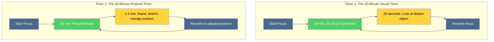

# Workspace Ergonomics

## Description

Your workspace is your cognitive habitat. Posture, lighting, temperature, and equipment setup directly determine how long you can sustain focus without pain. This document covers the physical environment of software development — the precise biomechanical, environmental, and behavioral factors that either protect your body from the demands of sedentary screen work or slowly destroy it. Ergonomics is not a luxury or a corporate checkbox. It is the discipline of aligning your physical environment with the biological requirements of the organism that inhabits it.

## Prerequisites

- [Movement and Exercise](movement-and-exercise.md) — why physical activity is the most potent cognitive intervention and how it interacts with postural demands
- [Why Physical Health Is the Foundation of Transformation](intro/why-health-matters.md) — the philosophical and scientific rationale for treating the body as the substrate of all cognitive and emotional work

## Table of Contents

- [The Developer's Body Problem](#-the-developers-body-problem)
- [Monitor Placement and the 20-20-20 Rule](#-monitor-placement-and-the-20-20-20-rule)
- [Chair, Desk, and Lumbar Support](#-chair-desk-and-lumbar-support)
- [Keyboard and Mouse Ergonomics](#-keyboard-and-mouse-ergonomics)
- [Lighting and Cognitive Performance](#-lighting-and-cognitive-performance)
- [Temperature and Mental Work](#-temperature-and-mental-work)
- [Ventilation, Air Quality, and CO₂](#-ventilation-air-quality-and-co₂)
- [The Micro-Break System](#-the-micro-break-system)
- [Building an Ergonomic Workspace on a Budget](#-building-an-ergonomic-workspace-on-a-budget)

## Content / Material

### 🦴 The Developer's Body Problem

You are a biological organism that evolved to move through three-dimensional space, scan horizons, grasp tools, and walk miles each day. Instead, you sit in a fixed position for eight to twelve hours, stare at a luminous rectangle sixty centimeters from your face, and repeat the same fine-motor keystroke patterns millions of times per year. The mismatch between your body's design and your work's demands is not incidental. It is structural. And its consequences are not theoretical — they are epidemic.

Repetitive strain injuries (RSIs) are the most prevalent occupational health condition among software developers. The Bureau of Labor Statistics reports that carpal tunnel syndrome alone affects approximately 1.9 per 10,000 full-time workers annually, with incidence rates in computer-intensive occupations substantially higher. Amdur (1996) estimated that keyboard-intensive workers face a lifetime risk of carpal tunnel syndrome exceeding 15%. The American Academy of Orthopaedic Surgeons reports that carpal tunnel syndrome affects an estimated 8 million people in the United States, with keyboard-intensive work as a primary risk factor.

But carpal tunnel is only the most visible injury. The developer's body is under assault from multiple vectors simultaneously:

- **Cervical spine compression.** For every inch your head sits forward of your spine — the "forward head posture" common among developers who lean toward their screens — the effective load on your cervical vertebrae increases by approximately 10 pounds. At a typical forward lean of 2–3 inches, the 10-pound head exerts 20–30 pounds of force on the cervical spine. Over 8 hours per day, this produces chronic neck pain, tension headaches, and progressive disc degeneration.
- **Lumbar disc herniation.** Nachemson's classic measurements (1966) demonstrated that intradiscal pressure in the lumbar spine increases by 40% after one hour of unsupported sitting and by 90% when sitting forward with no backrest support. The developer who sits on an inadequate chair for a full workday is subjecting their lumbar discs to forces that exceed those of many manual labor tasks.
- **Computer vision syndrome (CVS).** The American Optometric Association estimates that 50–90% of computer workers experience symptoms of CVS: eye strain, dry eyes, blurred vision, headaches, and neck pain. The mechanism is twofold — sustained near-focus accommodation fatigues the ciliary muscles, and reduced blink rate (from 15 blinks per minute to 5–7 during screen use) causes corneal desiccation.
- **Thoracic outlet syndrome.** Prolonged shoulder elevation and forward rounding — the posture assumed by developers using keyboards and mice positioned too high — compresses the brachial plexus and subclavian vessels, producing numbness, tingling, and weakness in the arms and hands. Often misdiagnosed as carpal tunnel.
- **Plantar fasciitis and deep vein thrombosis.** Prolonged sitting with feet in a fixed position reduces venous return from the lower extremities, increasing the risk of peripheral edema and, in extreme cases, deep vein thrombosis. The developer who does not move for 4+ hours is in a clinical risk category for venous thromboembolism.

The injury pattern is not random. It follows the logic of biomechanics: any sustained posture, repeated movement, or environmental stressor that persists for hours without variation will eventually produce tissue damage. The developer's body is damaged not by any single dramatic event but by the slow, cumulative consequence of thousands of hours in positions and conditions that the human body was never designed to sustain.

The critical insight is that these injuries are largely preventable through environmental design. The developer does not need to become an athlete or a yogi. They need to understand that their workspace is either protecting their body or damaging it, and to make the necessary adjustments. The adjustments are mechanical, not aspirational. They require knowledge and implementation, not willpower or motivation.

### 👁️ Monitor Placement and the 20-20-20 Rule

The monitor is the center of the developer's visual world. Its position determines the angle of your cervical spine, the distance of your focal point, and the severity of your eye strain. Getting monitor placement right is not a matter of preference — it is a matter of biomechanics.

#### 📐 Optimal Monitor Positioning

| Parameter | Optimal Value | Why |
|-----------|---------------|-----|
| **Distance from eyes** | 50–70 cm (20–28 inches) | Matches the eye's natural resting focal distance; reduces accommodative stress on the ciliary muscles |
| **Top of screen height** | At or slightly below eye level (15–20° below horizontal gaze) | Maintains a neutral cervical spine; prevents forward head posture or upward neck extension |
| **Screen tilt** | 10–20° backward from vertical | Perpendicular to the natural line of sight; reduces glare and neck flexion |
| **Center of screen** | 15–20° below horizontal eye line | The natural resting gaze of the human eye is 10–15° below horizontal; matching this reduces eye and neck fatigue |
| **Lateral position** | Directly in front of the user | Prevents cervical rotation; even 15° of sustained rotation produces asymmetric muscle loading |

A developer using a laptop with the screen at keyboard height is typically gazing downward at 30–40° while simultaneously craning the neck forward. This posture combines maximum cervical disc pressure with maximum forward head loading. It is the single most damaging ergonomic configuration in common use, and it is the default for millions of developers. A laptop stand or external monitor is not a peripheral — it is a corrective medical device.

#### 💡 The 20-20-20 Rule

Eye strain during screen work results from two physiological factors: sustained accommodative effort (the ciliary muscle holds the lens in near-focus shape for hours) and reduced blink rate (the eyes dry out). The 20-20-20 rule addresses both by periodically resetting the accommodative system:

**Every 20 minutes, look at something 20 feet (6 meters) away for at least 20 seconds.**

The mechanism is straightforward. When you shift focus from a near object (your screen at 60 cm) to a distant object (20 feet away), the ciliary muscle relaxes, the lens flattens, and the accommodative spasm that produces eye strain is released. The 20-second minimum provides sufficient time for this relaxation to occur.

| Practice | Frequency | Duration | Effect |
|----------|-----------|----------|--------|
| 20-20-20 rule | Every 20 minutes | 20 seconds looking at 20 feet | Reduces accommodative spasm; resets focal distance |
| Full blink exercise | During each 20-20-20 break | 10 deliberate full blinks | Restores tear film; reduces corneal desiccation |
| Screen brightness matching | Adjusted at each break | N/A | Screen luminance should match ambient illuminance to reduce pupil oscillation |
| Font size optimization | One-time setup | N/A | Minimum 12pt body text; larger for high-DPI displays — reduces squinting and accommodative effort |

The 20-20-20 rule is the minimum viable eye care protocol. For developers who wear corrective lenses, consider glasses specifically prescribed for the 50–70 cm working distance. Multifocal or progressive lenses can cause additional strain during screen work because the appropriate focal zone may not align with the screen distance. Discuss computer-specific lens prescriptions with your optometrist.

#### 🖥️ Multi-Monitor Ergonomics

Developers frequently use two or more monitors. The ergonomic implications are significant:

- **Primary monitor** — positioned directly in front, at optimal distance and height, as described above.
- **Secondary monitors** — positioned immediately adjacent to the primary monitor, with the inner edges touching or within 2 cm. The center of the secondary monitor should be no more than 30° from the primary monitor's center to prevent excessive cervical rotation.
- **If one monitor is used 80%+ of the time** — center it directly in front. The secondary monitor goes to the dominant-hand side, angled at 30° or less.
- **If monitors are used equally** — angle both inward slightly, forming a shallow V shape, with the junction point directly in front of the user.

Never place a secondary monitor directly to the side at 90° and turn the neck to view it for extended periods. This produces sustained cervical rotation that the 20-20-20 rule cannot compensate for.

### 🪑 Chair, Desk, and Lumbar Support

The chair is the single most important piece of ergonomic equipment because it determines the posture of the entire kinetic chain — from the lumbar spine through the thoracic spine to the cervical spine and the shoulders. A poor chair makes every other ergonomic adjustment less effective.

#### 🪑 Chair Specifications

| Parameter | Optimal Setting | Why |
|-----------|-----------------|-----|
| **Seat height** | Thighs parallel to floor; feet flat on ground (or footrest) | Maintains neutral hip angle (90–110°); prevents popliteal compression behind the knees |
| **Seat depth** | 2–3 finger widths between seat edge and back of knees | Prevents popliteal vein compression; allows blood flow to lower legs |
| **Seat pan tilt** | 0–5° forward or neutral | A slight forward tilt opens the hip angle and reduces lumbar flexion |
| **Backrest height** | Reaches mid-thoracic spine at minimum; full backrest preferred | Provides lumbar and thoracic support |
| **Lumbar support** | Fitted into the natural lordotic curve of the lumbar spine (L3–L5) | Maintains the natural inward curve; prevents the posterior pelvic tilt that flattens the lumbar curve and increases disc pressure |
| **Armrests** | Height adjustable; support forearms parallel to floor when typing | Reduces shoulder elevation and trapezius loading; should NOT force shoulders upward |
| **Recline angle** | 100–110° from seat pan (slightly reclined) | Reduces intradiscal pressure compared to 90° upright; Nachemson (1966) demonstrated a progressive decrease in disc pressure as recline increases from 90° to 120° |

The single most consequential chair parameter is lumbar support. Without it, prolonged sitting produces posterior pelvic tilt — the pelvis rotates backward, the lumbar spine flexes, and the natural lordotic curve flattens or reverses. This posture increases pressure on the anterior portion of the intervertebral discs, displaces them posteriorly, and over months and years produces disc bulging and herniation. The developer who sits in a chair without lumbar support for 8 hours per day is applying the mechanical loading equivalent of sustained forward bending to their lumbar spine for an extended work shift.

If your chair lacks adequate lumbar support, a lumbar roll (a cylindrical cushion that attaches to the chair back) is the most cost-effective intervention available — typically $15–30, with immediate biomechanical benefit.

#### 📏 Desk Height and Configuration

| Parameter | Optimal Setting | Why |
|-----------|-----------------|-----|
| **Desk height** | 68–73 cm (27–29 inches) for seated work; adjustable height strongly preferred | Elbows at 90–110° when typing; prevents shoulder elevation |
| **Keyboard tray** | Below desk surface, adjustable angle | Allows negative tilt (front edge higher than back) for neutral wrist position |
| **Under-desk clearance** | Minimum 60 cm (24 inches) | Allows free leg movement and foot positioning without obstruction |
| **Monitor arm** | Adjustable, clamp-mounted or freestanding | Enables precise monitor positioning; frees desk surface |

The sit-stand desk has become popular in developer environments. The evidence supports a specific usage pattern: alternate between sitting and standing in 30–45 minute intervals, rather than standing for extended periods. Prolonged standing produces its own problems — venous pooling in the lower extremities, increased lumbar lordosis, and fatigue of the postural muscles. The optimal pattern is alternation, not replacement.

#### 🧘 The Kinetic Chain of Sitting

The body operates as an integrated kinetic chain. A misalignment at one point propagates through the entire system. The developer who sets their chair height correctly but places their keyboard too high is compensating with shoulder elevation that produces trapezius tension, which produces cervical stiffness, which produces tension headaches. The symptom (headache) is distant from the cause (keyboard height).

Understanding the kinetic chain reveals why isolated fixes are insufficient. The ergonomic adjustment must be holistic — chair, desk, keyboard, mouse, and monitor must be configured as a single system, not as independent components. The following table traces the cascade of a common misalignment:

| Root Cause | First-Order Effect | Second-Order Effect | Third-Order Effect |
|------------|-------------------|--------------------|--------------------|
| Desk too high | Shoulder elevation | Trapezius tension → cervical stiffness | Tension headaches, reduced concentration |
| Chair too low | Hip flexion > 110° | Lumbar flexion → posterior pelvic tilt | Disc pressure increase → chronic low back pain |
| Monitor too low | Cervical flexion (looking down) | Forward head posture | Cervical disc compression → radiculopathy |
| Mouse too far | Arm extension → shoulder protraction | Thoracic kyphosis increase | Reduced respiratory capacity → fatigue |
| Keyboard at wrong angle | Wrist extension or ulnar deviation | Median nerve compression | Carpal tunnel syndrome → hand numbness |

The developer experiencing persistent neck or back pain should trace the symptom backward through the chain. The site of pain is rarely the site of cause. A systematic audit of the full workstation — from floor to eyes — typically reveals the originating variable.

### ⌨️ Keyboard and Mouse Ergonomics

The keyboard and mouse are the primary instruments through which the developer's body interfaces with their work. The biomechanics of their use determine whether the hands and wrists survive years of intensive input work without injury.

#### ✋ Wrist and Hand Positioning

The fundamental principle is neutral wrist position — the wrist should be straight, not flexed, extended, or deviated laterally, during typing and mousing. Any sustained deviation from neutral position compresses the carpal tunnel, reduces blood flow to the intrinsic hand muscles, and increases the mechanical load on tendons and nerves.

| Parameter | Optimal Position | Common Error |
|-----------|-----------------|--------------|
| **Wrist extension** | 0° (neutral) — wrist straight, not bent upward | Positive extension (wrist bent back) — compresses median nerve against carpal ligament |
| **Wrist flexion** | 0° (neutral) — wrist straight, not bent downward | Negative flexion (wrist bent forward) — strains extensor tendons |
| **Ulnar/radial deviation** | 0° (neutral) — wrist straight sideways | Ulnar deviation (wrist bent toward pinky) — common with standard keyboards; compresses TFCC |
| **Pronation** | Neutral or slightly supinated | Full pronation (palms flat down) — requires forearm rotation that increases pronator teres strain |
| **Finger reach** | Fingers curved naturally, keys under fingertips | Flat fingers reaching for distant keys — increases extensor tendon load |

#### ⌨️ Keyboard Selection

| Keyboard Type | Ergonomic Advantage | Trade-off | Best For |
|---------------|--------------------|-----------|----|
| **Standard flat keyboard** | Minimal | Wrist extension, ulnar deviation, pronation all present | Budget constraint only |
| **Split/separated keyboard** | Eliminates ulnar deviation; allows shoulder-width hand position | Learning curve; some models expensive | Developers with existing wrist pain |
| **Tented keyboard** | Reduces pronation by elevating the inner edge of each half | May interfere with function keys | Pronation-related forearm pain |
| **Mechanical (low-profile)** | Tactile feedback reduces keystroke force; may reduce bottoming-out impact | Click noise may disturb others | Reduced finger fatigue during long sessions |
| **Columnar stagger** | Aligns keys with natural finger reach patterns | Significant learning curve | Long-term injury prevention |

The most impactful ergonomic change for keyboard users is not the keyboard itself — it is the positioning. A $20 external keyboard positioned correctly on a tray at the right height with a wrist rest produces more biomechanical benefit than a $300 ergonomic keyboard placed incorrectly on a high desk.

#### 🖱️ Mouse and Pointing Device Ergonomics

The mouse concentrates repetitive motion into a small range — lateral wrist deviation and finger clicking. Extended use produces strain in the thenar eminence (thumb base), the extensor tendons, and the wrist.

| Device | Ergonomic Profile | Consideration |
|--------|-------------------|---------------|
| **Standard mouse** | Moderate strain — pronation and ulnar deviation common | Functional but suboptimal for extended use |
| **Vertical mouse** | Reduced pronation — hand in handshake position | Learning curve; may reduce click precision initially |
| **Trackball** | Eliminates whole-arm/wrist movement — only fingers move | Thumb-operated trackballs reduce shoulder and wrist strain; reduced precision for fine work |
| **Trackpad** | Low force, low movement amplitude | Reduced strain but slower for precision tasks; may cause thumb strain from gesture repetition |
| **Keyboard shortcuts** | Eliminates mouse use entirely for many operations | Most impactful intervention — every mouse movement replaced by a keyboard shortcut is a mouse strain event avoided |

The single highest-impact mouse ergonomic intervention is reducing mouse use through keyboard shortcuts. Every action performed via keyboard instead of mouse eliminates a cycle of reaching, gripping, and clicking that contributes to cumulative strain. Learning the keyboard shortcuts for your operating system, IDE, and browser is not a productivity optimization — it is an injury prevention strategy.

### ☀️ Lighting and Cognitive Performance

Light is not merely a condition for seeing your screen. It is a neuroendocrine signal that directly regulates circadian rhythm, cortisol secretion, melatonin production, alertness, and mood. The lighting environment of your workspace is an invisible cognitive variable with measurable effects on performance.

#### 🔆 The Research

Allen et al. (2015), in a landmark study published in *Environmental Health Perspectives*, found that workers in green building conditions — including optimized lighting with high daylight exposure — scored 61% higher on cognitive function tests compared to workers in conventional office conditions. The effect was dose-dependent: as environmental quality improved, cognitive scores rose proportionally.

| Lighting Parameter | Optimal Range | Cognitive Effect | Source |
|-------------------|---------------|------------------|--------|
| **Illuminance at desk** | 300–500 lux for general work; 500–750 lux for detailed tasks | Below 300 lux: increased eye strain, reduced alertness. Above 750 lux: diminishing returns, potential glare | IESNA (Illuminating Engineering Society of North America) |
| **Natural daylight exposure** | At least 30 minutes of outdoor light in the morning; indirect daylight at desk | Morning light advances circadian phase, improves alertness, stabilizes sleep-wake timing | Terman & Terman (2005), *CNS Spectrums* |
| **Color temperature** | 4000–5000K (neutral to cool white) during work hours; 2700–3000K (warm) after sunset | Cooler light suppresses melatonin and promotes alertness; warmer light supports wind-down | Cajochen et al. (2005), *Journal of Applied Physiology* |
| **Blue light emission** | Reduced after 6:00–8:00 PM | Evening blue light suppresses melatonin by up to 50%, delaying sleep onset by 30–90 minutes | Chang et al. (2015), *PNAS* |

#### 💡 Practical Lighting Design

The optimal developer workspace uses layered lighting:

1. **Ambient overhead light** — indirect, diffused, in the 4000–5000K range. Avoid bare fluorescent tubes or exposed LED strips that produce harsh, undiffused light.
2. **Task light** — a desk lamp positioned to illuminate documents or keyboard without creating glare on the screen. The lamp should be on the opposite side of the dominant hand to avoid hand shadows on the work area.
3. **Screen brightness** — matched to ambient room brightness. A screen that is significantly brighter than its surroundings forces the pupil to constrict, increasing accommodative effort. A screen that is dimmer than its surroundings causes the pupil to dilate, reducing contrast sensitivity. The goal is equilibrium.
4. **Bias lighting** — a light strip behind the monitor that illuminates the wall. This reduces the contrast ratio between the bright screen and the dark wall behind it, reducing eye strain. Bias lighting should be in the 6500K range and approximately 10% of the screen's luminance.

The developer working in a dark room with only the screen as illumination is creating the worst possible lighting condition — maximum contrast ratio, maximum pupil oscillation, maximum eye strain, and maximum circadian disruption from concentrated blue light exposure.

#### 🌅 Daylight and Circadian Anchoring

Natural light is not merely a lighting preference — it is a biological requirement for circadian regulation. The retinal ganglion cells that entrain the suprachiasmatic nucleus (the brain's master clock) are maximally sensitive to the broad-spectrum light that sunlight provides. Artificial lighting, even well-designed artificial lighting, lacks the intensity and spectral breadth of natural daylight.

| Light Source | Approximate Intensity | Spectral Quality | Circadian Effect |
|---|---|---|---|
| Outdoor shade | 10,000–25,000 lux | Full spectrum, high blue content | Strong circadian entrainment; melatonin suppression |
| Window (indirect daylight) | 1,000–5,000 lux | Full spectrum, reduced intensity | Moderate circadian entrainment |
| Overhead office lighting | 300–500 lux | Limited spectrum, fluorescent or LED peaks | Weak circadian entrainment |
| Screen only (dark room) | 100–200 lux (at eye) | Narrow spectrum, dominant blue | Misdirected circadian signal; suppresses melatonin without providing daytime entrainment |

The practical implication: work near a window when possible. If your workspace has no natural light exposure, take your 20-20-20 breaks near a window or step outside briefly. Five minutes of outdoor daylight provides more circadian signal than eight hours of office fluorescent lighting. This is not a metaphor — the lux intensity of outdoor light is 50 to 100 times greater than indoor lighting, and it is the intensity that the circadian system measures.

### 🌡️ Temperature and Mental Work

The relationship between ambient temperature and cognitive performance is well-established and surprisingly steep. Bernardinello et al. (2020), publishing in *Building and Environment*, demonstrated that cognitive performance peaks within a narrow thermal range and declines measurably outside it.

#### 🌡️ The Optimal Temperature Window

| Temperature Range | Cognitive Effect | Developer Experience |
|-------------------|------------------|---------------------|
| **Below 16°C (61°F)** | Significant decline in attention and working memory; the body diverts metabolic resources to thermogenesis | Cold hands (impaired typing speed), distractibility, reduced sustained focus |
| **16–19°C (61–66°F)** | Mild cognitive impairment | Slight distractibility; manageable but suboptimal |
| **20–22°C (68–72°F)** | **Optimal cognitive performance** | Comfortable alertness; sustained focus achievable |
| **23–25°C (73–77°F)** | Mild decline in alertness; increased drowsiness | Post-lunch somnolence amplified; motivation to work decreases |
| **Above 26°C (79°F)** | Significant decline in executive function, working memory, and processing speed | Physical discomfort, sweating, irritability, inability to sustain deep work |

The practical implication is that most office environments are too warm. Developers who control their own thermostat should maintain 20–22°C during work hours. Those who work in open offices should layer clothing and advocate for temperature adjustments with facility management. The cognitive cost of being 3°C too warm is equivalent to several hours of sleep debt in terms of attentional performance.

Personal thermal comfort varies, and the interaction between temperature and individual physiology is complex. However, the population-level data is clear: the 20–22°C range maximizes cognitive output for the majority of individuals performing mental work.

### 🌬️ Ventilation, Air Quality, and CO₂

Of all the environmental variables in a developer's workspace, air quality is the most invisible and the most consequential. Carbon dioxide (CO₂) concentration is the primary indicator of ventilation adequacy, and its effect on cognition is dramatic and dose-dependent.

#### 🌬️ The CO₂-Cognition Link

Allen et al. (2015), in the same Harvard study on green buildings, found that cognitive function scores varied dramatically with CO₂ concentration:

| CO₂ Level (ppm) | Cognitive Score (relative to baseline) | Context |
|------------------|----------------------------------------|---------|
| **600** (well-ventilated) | 100% (baseline) | Outdoor air quality; optimal for cognition |
| **800** | 95% | Adequate indoor ventilation |
| **1,000** | 85–90% | Typical office; beginning of measurable impairment |
| **1,400** | 70–75% | Poorly ventilated room; significant cognitive decline |
| **2,000** | 50–60% | Severe cognitive impairment — equivalent to moderate sleep deprivation |
| **3,000+** | Below 50% | Dangerous — headache, drowsiness, inability to concentrate |

The mechanism is direct: elevated CO₂ increases blood CO₂ (hypercapnia), which causes cerebral vasodilation, increased intracranial pressure, and altered neurotransmitter function. The brain's response to elevated CO₂ is to reduce metabolic activity — the neurological equivalent of running in power-saving mode.

#### 🏠 Practical Air Quality Management

| Strategy | CO₂ Reduction | Cost | Effectiveness |
|----------|---------------|------|---------------|
| **Open windows** (cross-ventilation) | Reduces to near-outdoor levels (400–600 ppm) | Free | Very high when outdoor air quality permits |
| **CO₂ monitor** (e.g., Aranet4) | Diagnostic only — tells you when to ventilate | ~$150–200 one-time | Enables evidence-based ventilation decisions |
| **Mechanical ventilation** (fan pointing at open window) | Reduces to 600–800 ppm | Low | High — forces air exchange even in still conditions |
| **HEPA air purifier** | Reduces particulates, does not reduce CO₂ | $100–500 | Moderate — improves air quality but does not address ventilation |
| **Indoor plants** | Negligible CO₂ reduction; some VOC reduction | Low | Low for CO₂; moderate for psychological benefit |

The CO₂ monitor is the most underrated developer productivity tool. Most developers have no idea that their workspace CO₂ levels may be doubling or tripling during the workday, especially in closed offices or bedrooms. A CO₂ reading above 1,000 ppm should trigger immediate ventilation. Above 1,500 ppm, cognitive impairment is comparable to moderate alcohol intoxication — the developer working in a stuffy room is, from a cognitive standpoint, slightly drunk on their own exhaled carbon dioxide.

### ⏸️ The Micro-Break System

The micro-break system is distinct from the 60–90 minute movement breaks described in [Movement and Exercise](movement-and-exercise.md). Movement breaks address the metabolic and neurological consequences of prolonged sedentary behavior. Micro-breaks address the acute biomechanical and visual consequences of sustained posture and focal fixation.

The system is based on two independent timers operating at different frequencies:

#### ⏱️ The Two-Timer Protocol

**Timer 1 — The 20-Minute Visual Reset (every 20 minutes):**

This timer addresses eye strain. When it fires:

1. Look up from the screen.
2. Focus on an object at least 6 meters (20 feet) away.
3. Hold gaze for 20 seconds minimum.
4. Perform 10 deliberate full blinks to restore the tear film.
5. Resume work.

Total interruption: 30 seconds. No standing required. No breaking of cognitive flow.

**Timer 2 — The 30-Minute Postural Reset (every 30 minutes):**

This timer addresses musculoskeletal strain. When it fires:

1. Stand up from the chair.
2. Perform one or more of the following micro-movements (60–90 seconds total):
   - Neck rotations: slow, full circle, 5 repetitions each direction
   - Shoulder rolls: 10 forward, 10 backward
   - Standing extension: place hands on lower back, arch gently backward, hold 5 seconds, repeat 5 times
   - Wrist circles: 10 each direction, both hands
   - Ankle circles: 10 each direction, both feet
3. Sit down and consciously adjust posture — reset to neutral.

Total interruption: 90 seconds. No leaving the room required.

#### 📊 The Micro-Break Schedule

| Time | Action | Duration | Target |
|------|--------|----------|--------|
| :00 | Begin focus session | — | — |
| :20 | Visual reset (20-20-20) | 30 seconds | Eyes |
| :30 | Postural reset | 90 seconds | Musculoskeletal system |
| :40 | Visual reset | 30 seconds | Eyes |
| :60 | Postural reset | 90 seconds | Musculoskeletal system |
| :80 | Visual reset | 30 seconds | Eyes |
| :90 | Movement break (full body) | 5–15 minutes | Cardiovascular, metabolic, cognitive |

The micro-break system is compatible with deep work. The visual reset requires no change in location and minimal disruption to cognitive flow — many developers report that the brief gaze shift actually improves creative problem-solving by providing a subtle context switch. The postural reset is brief enough to maintain flow state while preventing the acute accumulation of biomechanical stress.

The key implementation principle is **timer-driven, not intention-driven.** Do not rely on noticing discomfort. The developer who waits until their eyes hurt has already accumulated hours of damage. The timer fires before discomfort, preventing the accumulation rather than treating the symptom.

#### 🔬 The Research on Micro-Breaks

The evidence for frequent short breaks during computer work is consistent across multiple studies:

| Study | Finding |
|-------|---------|
| Henning et al. (1989), *Ergonomics* | Workers who took frequent short breaks (30 seconds to 5 minutes) reported significantly less musculoskeletal discomfort and eye strain than workers who took infrequent longer breaks |
| Galinsky et al. (2000), *Ergonomics* | Computer workers who took more frequent breaks had lower symptom severity for eye strain, upper body discomfort, and carpal tunnel symptoms |
| Kim et al. (2015), *Applied Ergonomics* | Micro-breaks (under 5 minutes) every 30 minutes maintained cognitive performance and reduced fatigue over 8-hour work sessions, while longer breaks at wider intervals did not |
| Galinski et al. (1997), *American Journal of Industrial Medicine* | Short, frequent breaks were more effective than long, infrequent breaks for preventing musculoskeletal symptoms in computer workers |

The mechanism is straightforward. Musculoskeletal strain accumulates during sustained posture. Eye strain accumulates during sustained focus. Both are time-dependent — the damage increases nonlinearly after approximately 20–30 minutes of continuous exposure. Breaking the exposure before the inflection point prevents the exponential portion of the accumulation curve.

The analogy to the 60–90 minute movement break from [Movement and Exercise](movement-and-exercise.md) is instructive. The 60–90 minute break addresses metabolic and neurological fatigue. The 20–30 minute micro-break addresses biomechanical and visual strain. They operate on different timescales, address different systems, and are complementary rather than redundant.

The diagram captures the core insight: micro-breaks do not merely reduce total strain — they prevent strain from reaching the nonlinear accumulation zone where damage becomes self-reinforcing. The developer who resets every 20 minutes never enters the danger zone. The developer who pushes through for two hours accumulates damage that a single break cannot fully reverse.

### 🔧 Building an Ergonomic Workspace on a Budget

The ergonomic equipment industry thrives on the premise that effective workspace optimization requires expensive equipment. This is false. The most impactful ergonomic interventions are free or low-cost. The expensive equipment is for comfort and refinement, not for basic injury prevention.

#### 💰 The Priority Hierarchy

Interventions are ranked by cost-effectiveness — cognitive and physical benefit per dollar:

| Priority | Intervention | Cost | Impact |
|----------|-------------|------|--------|
| 1 | Monitor at correct height (books, boxes, or ream of paper under laptop/monitor) | Free | Eliminates forward head posture and downward gaze angle |
| 2 | External keyboard + mouse (any basic model) | $20–30 | Enables neutral wrist position regardless of laptop/monitor height |
| 3 | 20-20-20 timer (phone timer, browser extension, or OS reminder) | Free | Prevents eye strain and accommodative spasm |
| 4 | Lumbar support pillow or rolled towel | $15–30 | Maintains lumbar lordosis; prevents disc degeneration |
| 5 | CO₂ monitor (Aranet4 or similar) | $150–200 | Enables evidence-based ventilation decisions |
| 6 | Adjustable monitor arm | $30–80 | Enables precise monitor positioning; frees desk space |
| 7 | Sit-stand desk converter or adjustable desk | $150–400 | Enables postural alternation; reduces prolonged sitting |
| 8 | Ergonomic chair with adjustable lumbar | $200–800 | Comprehensive postural support for 8+ hour sitting |
| 9 | Split/ergonomic keyboard | $100–350 | Eliminates ulnar deviation and pronation |
| 10 | Vertical mouse or trackball | $30–100 | Reduces wrist strain from pointing device use |

The developer who completes priorities 1–3 has addressed the majority of the ergonomic injury risk at a cost of $20–30 and zero specialized knowledge. The remaining priorities provide incremental improvement proportional to investment.

#### 🛠️ The Zero-Budget Ergonomic Setup

For developers who cannot purchase equipment — students, developers in low-income situations, developers between jobs — effective ergonomic adjustments are still possible:

- **Monitor height:** Stack textbooks, a shoebox, or a ream of paper under the monitor or laptop until the top of the screen is at eye level. This is biomechanically identical to a $30 monitor arm.
- **Lumbar support:** A rolled towel or a small pillow placed in the small of the back provides lumbar support comparable to a $30 lumbar roll. The diameter of the roll should match the depth of your natural lumbar curve — typically 10–15 cm.
- **Keyboard height:** If the desk is too high, raise the chair and place a box, books, or a footstool under your feet. Feet must be flat on a surface, not dangling.
- **Eye strain:** The 20-20-20 rule requires no equipment. Set a repeating timer on your phone.
- **Air quality:** Open a window. If the room has no operable windows, take a 2-minute break to step into a hallway or outside every hour.
- **Temperature:** Layer clothing. A hoodie and a light blanket on the lap are thermoregulation strategies that cost nothing and allow cognitive performance to remain near the 20–22°C optimum regardless of room temperature.

The point is not that equipment is irrelevant. It is that the absence of equipment is not a legitimate reason to accept preventable injury. The developer who cannot afford an ergonomic chair but who places a lumbar roll (or rolled towel) in the chair and takes micro-breaks every 30 minutes has addressed the most dangerous variable — sustained lumbar flexion — for under $15 or free.

#### 📋 The Ergonomic Audit

Perform this audit every six months. Posture degrades incrementally — the adjustments you made last year have drifted, the chair has compressed, and your habits have relaxed. The audit takes five minutes and prevents months of accumulated strain.

| Check | Correct | Incorrect | Fix |
|-------|---------|-----------|-----|
| Screen height | Top of screen at eye level | Screen below eye level, looking down | Raise screen with stand, books, or arm |
| Screen distance | 50–70 cm from eyes | Closer than 40 cm or farther than 80 cm | Adjust chair distance or monitor arm |
| Elbow angle | 90–110° when typing | Elbows at 70° (desk too high) or 120° (desk too low) | Raise/lower chair; use footrest if needed |
| Wrist position | Straight, neutral | Bent up, down, or sideways | Adjust keyboard tray height; consider ergonomic keyboard |
| Lumbar support | Fitted into lower back curve | Lower back unsupported; slouching | Add lumbar roll or towel |
| Feet | Flat on floor or footrest | Dangling or tucked under chair | Add footrest or adjust chair height |
| Eye break frequency | Every 20 minutes | Never, or only when pain starts | Set timer; make it automatic |
| Postural reset frequency | Every 30 minutes | Every 2+ hours or never | Set timer; pair with eye break timer |

The audit is a form of stewardship — the regular, deliberate inspection of the instrument through which you work and create. A developer who performs this audit every six months treats their workspace with the same seriousness they would apply to their development environment. The environment shapes the output, whether that environment is a codebase or a chair.

## Learning Tips

- **Start with the timer, not the equipment.** The micro-break system is free, immediately implementable, and addresses the two most common injury vectors (eye strain and postural damage). Install a timer today — not tomorrow.

- **Measure before you buy.** Before purchasing ergonomic equipment, measure your current setup against the specifications in this document. You may already have most of what you need. A $20 lumbar pillow solves a problem that a $200 keyboard does not.

- **Track pain, not productivity.** If you develop neck pain, wrist pain, or eye strain, note the time of day, the duration of the work session, and the specific posture or activity that preceded the pain. The pattern will reveal the ergonomic variable that needs adjustment.

- **Change one variable at a time.** When adjusting your workspace, change one parameter per week — monitor height this week, keyboard position next week, chair settings the week after. Changing everything simultaneously makes it impossible to identify which adjustment helped and which made things worse.

- **Pair micro-breaks with existing behaviors.** The 30-minute postural reset pairs naturally with the end of a Pomodoro cycle, a commit cycle, or a build cycle. Attach the timer to a behavior that already exists, and the new behavior will latch onto it.

- **Make ergonomics visible.** Print the audit checklist and tape it to your monitor. Visual reminders prevent the gradual drift that occurs when ergonomic attention relaxes.

## Glossary

| Term | Definition |
|------|------------|
| **Accommodative spasm** | Sustained contraction of the ciliary muscle from prolonged near-focus work, producing eye strain, blurred vision, and headaches. Prevented by periodic focal distance shifts (20-20-20 rule). |
| **Carpal tunnel syndrome** | Compression of the median nerve within the carpal tunnel of the wrist, causing pain, numbness, and weakness in the hand and fingers. The most common RSI among developers. |
| **Computer vision syndrome (CVS)** | A cluster of symptoms — eye strain, dry eyes, blurred vision, headaches — caused by prolonged screen use. Affects 50–90% of computer workers. |
| **Cervical spine** | The seven vertebrae (C1–C7) forming the neck. Sustained forward head posture increases mechanical load on cervical structures, producing pain and disc degeneration. |
| **Deep vein thrombosis (DVT)** | A blood clot forming in a deep vein, typically in the leg. Prolonged sitting with immobile lower extremities increases risk. |
| **Hypercapnia** | Elevated blood CO₂ concentration. Occurs in poorly ventilated spaces; impairs cognitive function through cerebral vasodilation and altered neurotransmitter function. |
| **Lumbar lordosis** | The natural inward curvature of the lower spine (L3–L5). Maintained by proper lumbar support; flattened by unsupported sitting, increasing disc pressure. |
| **Micro-break** | A brief (30–90 second) interruption to sustained posture or focal fixation, occurring every 20–30 minutes. Prevents acute accumulation of biomechanical and visual strain. |
| **Posterior pelvic tilt** | The backward rotation of the pelvis during unsupported sitting, which flattens the lumbar curve and increases intradiscal pressure. The primary mechanism of sitting-related lumbar injury. |
| **Pronation** | Forearm rotation such that the palm faces downward. Sustained pronation during keyboard and mouse use strains the pronator terus and contributes to medial epicondylitis. |
| **Repetitive strain injury (RSI)** | A general term for injuries caused by repetitive motion, sustained posture, or forceful exertion. Includes carpal tunnel syndrome, tendinitis, and related conditions. |
| **Thoracic outlet syndrome** | Compression of the brachial plexus or subclavian vessels between the clavicle and first rib, typically from sustained shoulder elevation or forward rounding. Produces arm numbness and weakness. |
| **Ulnar deviation** | Lateral wrist bend toward the pinky side. Common when using standard keyboards without a split or tented design; compresses the triangular fibrocartilage complex (TFCC). |
| **Visual reset** | A 20-second shift of gaze from a near object (screen) to a distant object (6+ meters), performed every 20 minutes to release accommodative spasm and restore tear film. |

## Quick References

- [OSHA Computer Workstation eTool](https://www.osha.gov/etools/computer-workstations) — comprehensive federal ergonomic guidelines for computer workstation setup, including adjustable desk and chair specifications
- [Crandall, S.H. et al. (2006). Office Ergonomics: Practical Application of Principles. ErgoEx — a practical field study on lumbar support and sitting posture](https://ergoex.com/) — evidence supporting the relationship between lumbar support and reduced intradiscal pressure during sitting
- [Allen, J.G. et al. (2015). Associations of cognitive function scores with CO₂, ventilation, and VOC exposures in office workers. *Environmental Health Perspectives*, 124(6), 805–812.](https://doi.org/10.1289/ehp.1509680) — the landmark study linking indoor air quality and CO₂ concentration to cognitive performance
- [Cajochen, C. et al. (2005). High sensitivity of human melatonin, alertness, thermoregulation, and heart rate to short wavelength light. *Journal of Clinical Endocrinology & Metabolism*, 90(5), 2651–2655.](https://doi.org/10.1210/jc.2004-2357) — evidence for the effect of light color temperature on alertness and melatonin suppression
- [Nachemson, A. (1966). The load on lumbar disks in different positions of the body. *Clinical Orthopaedics*, 45, 107–122.](https://doi.org/10.1097/00003086-196605000-00015) — foundational measurements of intradiscal pressure during sitting
- [Chang, A.M. et al. (2015). Evening use of light-emitting eReaders negatively affects sleep, circadian timing, and next-morning alertness. *PNAS*, 112(4), 1232–1237.](https://doi.org/10.1073/pnas.1418490112) — evidence for the effect of screen blue light on melatonin suppression and circadian disruption
- [Bernardinello, L. et al. (2020). Effect of indoor air temperature on cognitive performance. *Building and Environment*, 184, 107154.](https://doi.org/10.1016/j.buildenv.2020.107154) — the empirical evidence for the 20–22°C optimal cognitive temperature range

## Next Steps

- [Digital Detox](digital-detox.md) — managing screen time and digital stimulation to protect cognitive capacity and reduce total visual load
- [Sleep Architecture](sleep-architecture.md) — how the brain consolidates learning and clears metabolic waste during sleep, and why ergonomic practices that reduce daytime pain improve nighttime sleep quality
- [Movement and Exercise](movement-and-exercise.md) — the broader movement protocol that complements micro-breaks with sustained aerobic and resistance training
- [Emotional Regulation](../resilience/emotional-regulation.md) — how physical discomfort from poor ergonomics amplifies emotional reactivity and contributes to burnout
