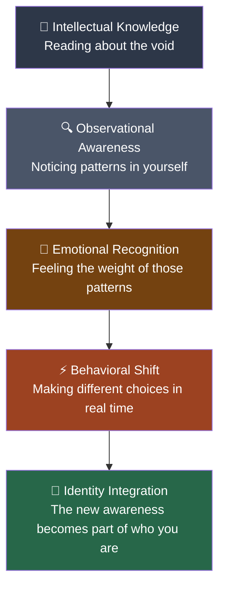
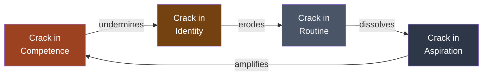
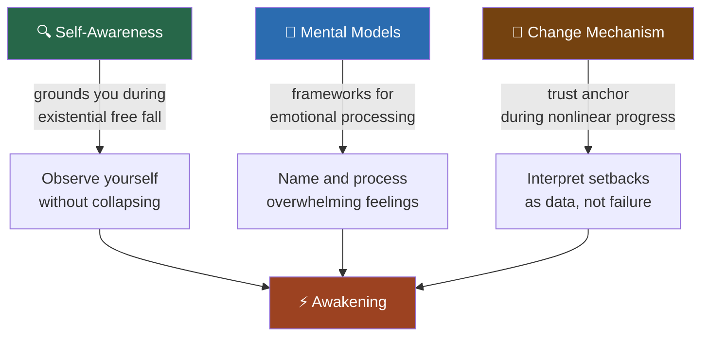
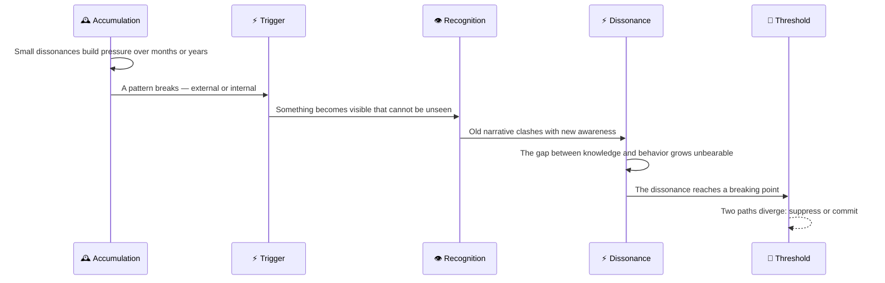
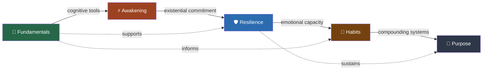

# What Is Awakening?

## Description

You have built the tools. You understand self-awareness, mental models, the mechanism of change, and the developer's specific landscape. Now those tools meet their purpose. Awakening is the stage where cognitive preparation transforms into existential confrontation — where you stop understanding the void intellectually and start experiencing it personally. This document introduces the awakening module: what it means to recognize that your current way of living has reached its limits, why this recognition is both terrifying and necessary, and how the tools you built in the fundamentals module prepare you for what comes next.

## Prerequisites

- [What Are the Fundamentals?](../fundamentals/intro/what-are-the-fundamentals.md) — the cognitive and perceptual tools that make awakening possible
- [The Lowest Point](../../intro/the-lowest-point.md) — the philosophical foundation for understanding the existential vacuum
- [The Level-Up Philosophy](../../intro/the-level-up-philosophy.md) — the framework that frames transformation as deliberate progression

## Table of Contents

- [Where You Are Now](#where-you-are-now)
- [The Gap Between Knowing and Seeing](#the-gap-between-knowing-and-seeing)
- [What Awakening Actually Is](#what-awakening-actually-is)
- [Why Awakening Comes After Fundamentals](#why-awakening-comes-after-fundamentals)
- [The Anatomy of the Awakening Moment](#the-anatomy-of-the-awakening-moment)
- [What You Will Encounter in This Module](#what-you-will-encounter-in-this-module)
- [The Emotional Landscape Ahead](#the-emotional-landscape-ahead)
- [How Awakening Connects to the Rest of the Journey](#how-awakening-connects-to-the-rest-of-the-journey)
- [The Developer's Awakening](#the-developers-awakening)
- [Learning Tips](#learning-tips)
- [Glossary](#glossary)
- [Quick References](#quick-references)
- [Next Steps](#next-steps)

## Content / Material

### Where You Are Now

You have spent time in the fundamentals module. You have learned to observe yourself — your behaviors, your emotions, your thought patterns. You have encountered mental models that give you frameworks for understanding what happens during transformation. You have read about the mechanism of change, the developer's landscape, and how to navigate setbacks. You have a map. You have tools. You have a cognitive foundation that most people never build.

And yet, something is different now.

The tools have changed how you see yourself, but they have not yet changed what you see. You can observe your patterns with more precision. You can name the mechanisms at work. You can identify the cognitive distortions and the behavioral loops. But the observation is still somewhat clinical — like a developer reading logs from a production system. You can see the errors, but you have not yet felt the weight of them in your own body.

This is the normal state after fundamentals. You have built the instrument. Now you must point it at yourself — not at your code, not at your systems, not at abstract patterns — at the actual, lived experience of your own life. The transition from instrument-building to instrument-use is what this module is about.

```python
# The state after fundamentals
class PostFundamentalsState:
    def __init__(self):
        self.self_awareness_tools = "built"
        self.mental_models = "learned"
        self.practice = "beginning"
        self.existential_confrontation = "pending"

    def readiness(self):
        return {
            "cognitive": "strong — you can think about yourself clearly",
            "emotional": "partial — you can name feelings but not yet sit with them",
            "existential": "untested — you have not yet faced the void directly",
            "practical": "emerging — you are starting to apply the tools in real time",
        }
```

The fundamentals module gave you the map. The awakening module asks you to walk the territory. The difference between reading a map of a mountain and climbing the mountain is the difference between knowing about the void and standing in it.

### The Gap Between Knowing and Seeing

There is a specific kind of gap that exists between understanding something intellectually and recognizing it in your own life. Developers encounter this gap constantly. You can read the documentation for a system, understand every API call, diagram the architecture — and still be surprised when the system behaves differently in production. The documentation is not the system. The map is not the territory. And the mental model of yourself is not yourself.

The fundamentals module warned you about this gap. It described the difference between declarative knowledge and procedural knowledge — between knowing that self-awareness matters and actually being self-aware in real time. The awakening module is where that gap gets closed. Not through more reading, not through more mental models, but through direct confrontation with the reality of your own existence.

```python
# The knowing-seeing gap
def knowing_vs_seeing():
    knowing = {
        "description": "I understand that my career might lack meaning",
        "evidence": "I read Frankl. I completed the fundamentals module.",
        "emotional_impact": "low — it is an interesting intellectual observation",
        "behavioral_impact": "none — I still go to work the same way",
    }

    seeing = {
        "description": "I feel, in my body, that my daily work is hollow",
        "evidence": "I cannot pretend otherwise any longer",
        "emotional_impact": "high — dread, grief, fear, clarity",
        "behavioral_impact": "I start making different choices, even small ones",
    }

    return "The gap between these two is what the awakening closes"
```

The gap can be visualized as a progression through distinct cognitive layers. Each layer represents a deeper integration of awareness into lived experience:



The first two layers — intellectual knowledge and observational awareness — are what the fundamentals module provides. They are necessary but insufficient. The remaining three layers require direct confrontation with your own experience, which is precisely what the awakening module facilitates.

This gap is not a failure of the fundamentals. It is a natural consequence of how human cognition works. We can hold ideas at arm's length for years without letting them touch us. Therapy calls this intellectualization — understanding your problems so well that the understanding itself becomes a way of avoiding the emotional reality. The fundamentals module risks the same trap. You can become expert at analyzing your own patterns without ever feeling the weight of those patterns in your daily life.

```python
# How intellectualization operates as a defense mechanism
class IntellectualizationDefense:
    def __init__(self, awareness_tools):
        self.tools = awareness_tools
        self.defense_active = False

    def process(self, emotional_trigger):
        if self.defense_active:
            # Redirect emotional energy into analysis
            analysis = self.analyze(emotional_trigger)
            return {
                "felt": False,
                "analyzed": True,
                "result": "I understand why I feel this way",
                "actual_feeling": "suppressed",
            }
        return {"felt": True, "analyzed": False}

    def analyze(self, trigger):
        return f"Categorized trigger as {trigger.category}. " \
               f"Linked to childhood pattern. " \
               f"Recommended cognitive reframing."

    def deactivate_defense(self):
        """This is what the awakening module does."""
        self.defense_active = False
        return "Analysis replaced by direct experience"
```

The danger of intellectualization is that it repurposes the very tools that should liberate you. Self-awareness becomes self-surveillance. Mental models become mental shields. The fundamentals module, if misused, can reinforce the pattern it was designed to break. This is why the awakening module emphasizes felt experience over analytical understanding — it must, because analysis is where you hide.

The awakening module breaks through intellectualization. It does this not by providing more information, but by creating the conditions for direct experience. The documents in this module are designed to move you from observer to participant — from reading about the void to standing in it.

### What Awakening Actually Is

Awakening is not a single moment. It is a process — a gradual uncovering of what has been hidden, suppressed, or ignored. The word "awakening" implies that you were asleep, and in a specific sense, you were. Not unconscious — you were going through the motions of life, making decisions, completing tasks, maintaining relationships. But the quality of your attention was diminished. You were not fully present for your own life.

The philosopher Søren Kierkegaard described a similar process as moving from the "aesthetic stage" to the "ethical stage" — from a life organized around pleasure and novelty to a life organized around commitment and meaning. But Kierkegaard's framework is too neat. Awakening is messier than a stage transition. It is more like a series of cracks that gradually open until the facade you have been maintaining can no longer hold.

The cracks appear in different places for different people:

**The crack in competence.** You have been competent at your job for years. You can solve problems, ship features, debug systems. But competence has become a ceiling, not a floor. You are not growing — you are performing. The crack appears when you realize that being good at something is not the same as finding it meaningful.

**The crack in identity.** You have been "a developer" for so long that you have forgotten what you were before. The identity provides structure, status, community. But it also provides a cage. The crack appears when you wonder who you would be if you were not a developer — and the question terrifies you because you cannot answer it.

**The crack in routine.** Your days follow a pattern. Wake, commute, standup, code, lunch, code, review, dinner, sleep. The pattern is efficient. It is also numbing. The crack appears when you realize that you cannot remember the last day that felt different from any other.

**The crack in aspiration.** You had dreams once. Building something that mattered. Creating software that changed how people work. Contributing to something larger than yourself. The crack appears when you realize that those dreams have been quietly replaced by career goals — promotions, salary increases, title changes — that have nothing to do with the original aspiration.

```python
# The cracks in the facade
class FacadeCracks:
    def __init__(self):
        self.cracks = {
            "competence": "Being good ≠ Being fulfilled",
            "identity": "Knowing what you do ≠ Knowing who you are",
            "routine": "Efficiency ≠ Aliveness",
            "aspiration": "Career goals ≠ Original dreams",
        }

    def severity(self):
        return "The more cracks, the harder the facade is to maintain"
```

These four cracks do not appear in isolation. They interact, reinforcing each other in a feedback loop that accelerates the collapse of the facade. The following diagram illustrates how each crack feeds the others:



The loop typically begins at any single point but quickly propagates. A developer who recognizes that competence does not produce fulfillment (competence crack) begins to question the identity built on that competence (identity crack). The questioning disrupts the daily routines that maintained the illusion (routine crack). And the disrupted routines reveal that the aspirations that once drove them have been quietly replaced by institutional metrics (aspiration crack). The aspiration crack then circles back, amplifying the competence crack: if promotions and titles are not meaningful, then competence in pursuit of them feels even more hollow.

```python
# The feedback loop of facade collapse
def facade_collapse_loop(cracks):
    """
    Simulates how cracks reinforce each other.
    Each crack weakens resistance, making other cracks more visible.
    """
    resistance = 100  # Start with full facade resistance
    cycle = 0

    for crack in cracks:
        resistance -= crack.impact
        cycle += 1
        if resistance <= 0:
            return f"Facade collapsed at cycle {cycle}. Awakening triggered."
        print(f"Cycle {cycle}: resistance at {resistance}%")

    return f"Facade strained but intact. {resistance}% resistance remaining."
```

None of these cracks are dramatic. They do not announce themselves. They accumulate quietly, like stress fractures in a bridge. You do not notice them until one day you are driving across the bridge and you hear a sound — a creak, a pop, a silence where there should be noise — and you realize the structure is not as solid as you believed.

### Why Awakening Comes After Fundamentals

The level-up journey is sequenced deliberately. Awakening does not come first because it cannot. The confrontation with the void requires cognitive tools that most people do not have. Without self-awareness, you cannot distinguish between genuine existential crisis and ordinary dissatisfaction. Without mental models, you cannot process the experience without being overwhelmed by it. Without understanding the mechanism of change, you cannot trust that the process is working even when it feels like it is not.

The fundamentals module provides three essential preparations:

**Self-awareness as a survival tool.** When the void opens, the first thing you need is the ability to observe yourself without collapsing. Self-awareness — the practice of watching your own behavior, emotions, and thoughts with curiosity rather than judgment — is what keeps you grounded when the existential ground gives way. Without it, the awakening becomes a free fall. With it, you can observe the fall, name it, and understand that falling is part of the process.

**Mental models as processing frameworks.** The void produces overwhelming emotions: grief, fear, anger, shame, confusion. Mental models — the Johari Window, the Stages of Change, the Drama Triangle, First Principles Thinking, Inversion, Second-Order Thinking — give you frameworks for processing these emotions without being consumed by them. When grief arrives, you can recognize it as a stage of change, not as evidence of personal failure. When fear speaks, you can distinguish between the voice of the void and the voice of depression. The models do not eliminate the pain. They prevent the pain from becoming permanent damage.

**The mechanism of change as a trust anchor.** The awakening process is nonlinear. You will have good days and bad days. You will feel progress and then feel regression. You will question whether the process is working. The mechanism of change — the understanding that transformation happens through cycles, not straight lines — is what keeps you moving when the evidence suggests you are going nowhere. Without this understanding, every setback feels like proof that change is impossible. With it, setbacks become data.

```python
# Why fundamentals must come first
def awakening_readiness(self_awareness, mental_models, change_mechanism):
    if not self_awareness:
        return "Risk: overwhelming without grounding"
    if not mental_models:
        return "Risk: processing without frameworks"
    if not change_mechanism:
        return "Risk: interpreting setbacks as failure"
    return "Ready: the tools will hold when the void opens"
```

The relationship between fundamentals and awakening can be understood as a dependency graph. Each foundational capability enables a specific aspect of the awakening process:



Without self-awareness, the awakening produces panic — the void opens and there is no ground beneath you. Without mental models, the awakening produces paralysis — the emotions arrive but there is no framework to process them. Without the mechanism of change, the awakening produces despair — the early stages feel like regression, and without understanding that regression is part of the process, you abandon the journey. Each foundational capability is a load-bearing wall. Remove any one of them and the structure above it collapses.

The ordering is not arbitrary. It is architectural. The fundamentals are the foundation. The awakening is the first floor. You cannot build upward without building downward first. The temptation to skip to the awakening — to jump straight to the confrontation with meaning — is the same temptation that makes developers skip writing tests. It feels faster in the moment. It is catastrophic in the long run.

### The Anatomy of the Awakening Moment

The awakening does not arrive as a thunderclap. It arrives as a whisper that grows louder until it cannot be ignored. Understanding its anatomy helps you recognize it when it happens — and prevents you from mistaking it for something else.

**Phase 1: The accumulation.** Months or years of small dissonances accumulate. The Sunday dread. The achievement hangover. The envy that is not about what you think. The phantom limb of meaning. Each dissonance is small enough to ignore. Together, they form a pressure that builds beneath the surface of your daily life.

**Phase 2: The trigger.** Something breaks the pattern. It can be external — a layoff, a re-org, a relationship ending, a health scare. It can be internal — a question that surfaces at 3 AM, a conversation that shifts your perspective, a moment of unexpected clarity. The trigger does not create the awakening. It reveals what has been building.

**Phase 3: The recognition.** You see something you cannot unsee. The career that looks successful from the outside but feels hollow from the inside. The relationship that functions but does not nourish. The life that works on paper but not in practice. The recognition is not intellectual — you already knew these things. The recognition is emotional. You feel the weight of what you have been carrying.

**Phase 4: The dissonance.** The old narrative and the new recognition coexist in uncomfortable tension. You still go to work. You still perform. But there is a gap between your behavior and your awareness. You are pretending, and now you know you are pretending. The pretense becomes more exhausting than the truth.

**Phase 5: The threshold.** At some point, the dissonance becomes unbearable. You cannot maintain the gap between what you know and how you live. Something must give. Either you suppress the recognition and return to autopilot — which becomes harder each time — or you cross the threshold and commit to change. The threshold is the decision point. Everything before it is preparation. Everything after it is transformation.

```python
# The anatomy of awakening
class AwakeningAnatomy:
    phases = [
        "accumulation — small dissonances build pressure",
        "trigger — something breaks the pattern",
        "recognition — you see what you cannot unsee",
        "dissonance — old narrative and new awareness clash",
        "threshold — something must give",
    ]

    def navigate(self, phase):
        if phase == "threshold":
            return "Two paths: suppress or commit. Choose deliberately."
        return "Continue. The process is working."
```

The five phases do not always proceed in strict linear order. Some individuals oscillate between recognition and dissonance multiple times before reaching the threshold. Others experience the trigger and the recognition simultaneously. However, the general trajectory is consistent: accumulation precedes trigger, and threshold always follows dissonance. Understanding this sequence helps you locate yourself within the process.



Each phase has characteristic markers that help you recognize where you are in the process. During accumulation, the markers are subtle — a recurring dissatisfaction, a sense that something is missing but an inability to name it. During the trigger, the marker is disruption — something outside the normal pattern occurs. During recognition, the marker is emotional weight — the facts you already knew now carry feeling. During dissonance, the marker is exhaustion — maintaining the pretense costs more energy than it saves. During threshold, the marker is clarity — the question is no longer whether something must change, but whether you have the courage to change it.

### What You Will Encounter in This Module

This module contains two documents, each covering one movement of the awakening.

**Recognizing the Void** describes the experience of waking up to the existential vacuum. It covers the moment of recognition, what it feels like to see through the autopilot, the signs you have been ignoring, the emotional layers of awakening (denial, anger, grief, fear, acceptance), and the specific forms the void takes in a developer's life. It is a companion for the rawest phase of the awakening — when you are most vulnerable and most in need of understanding.

**The Decision to Change** describes the moment of commitment — when passive awareness becomes active intention. It covers the threshold moment, the two voices (old self vs. emerging self), the resistance of the old self, fear and the architecture of safety, and how logotherapy's will to meaning provides the courage to cross the threshold. It is a companion for the transition from recognition to action.

Together, these two documents form the awakening arc: see the truth, then decide what to do about it. The first document is about perception. The second is about will. Both are necessary. Perception without will is paralysis. Will without perception is blind action. The awakening requires both.

### The Emotional Landscape Ahead

The awakening is emotionally intense. Knowing what to expect does not prevent the intensity, but it prevents you from being surprised by it — and surprise, during the awakening, is the enemy of progress.

**Grief.** You will grieve. Not for a person, but for a life — the life you thought you were living, the career you thought you were building, the version of yourself you thought you were. This grief has no social recognition. There is no funeral, no condolence card, no cultural script for mourning the death of an illusion. You must create your own rituals for this grief. Journaling. Walking. Talking to someone who understands. The grief is real, even if the loss is abstract.

**Fear.** You will be afraid. Not of anything specific — of everything. The fear of the unknown. The fear of failure. The fear of success. The fear that you are fundamentally broken. The fear that you will spend the rest of your life in the void. This fear is normal. It is the price of awakening. The philosopher Paul Tillich called it "the courage to be" — the courage to affirm life even in the face of meaninglessness.

**Anger.** You will be angry. At the system that sold you a false narrative. At yourself for believing it. At the industry that optimized you for productivity while ignoring your humanity. Anger is energizing. It can be a catalyst for change. But it can also become a trap — a comfortable substitute for the harder work of grief and acceptance. Use anger as fuel, not as destination.

**Shame.** You will feel ashamed. Ashamed that you have so much and feel so empty. Ashamed that others seem to handle life better. Ashamed that you are struggling when you have no "real" problems. Shame thrives in silence. The antidote is honesty — telling someone what you are experiencing, breaking the isolation that shame requires.

**Relief.** Beneath the grief, fear, anger, and shame, there is a strange relief. You have been carrying something heavy without knowing it. The weight of pretending. The weight of performing. When the pretense cracks, the weight lifts — even if what replaces it is emptiness. The relief is the first signal that the awakening is working.

```python
# The emotional landscape
class AwakeningEmotions:
    def __init__(self):
        self.emotions = {
            "grief": "for the life you thought you were living",
            "fear": "of the unknown that lies ahead",
            "anger": "at the false narratives you believed",
            "shame": "for having so much and feeling so empty",
            "relief": "from the weight of pretending",
        }

    def sequence(self):
        return [
            "First: relief — the pretense cracks",
            "Then: grief — for what was lost",
            "Then: fear — of what comes next",
            "Then: anger — at what caused this",
            "Then: shame — for feeling this way at all",
            "Finally: acceptance — this is real, and I am still here",
        ]
```

### How Awakening Connects to the Rest of the Journey

The awakening is not an endpoint. It is a threshold. Everything before it was preparation. Everything after it is construction.

**Awakening → Resilience.** The decision to change is the beginning of rebuilding. But the decision alone does not rebuild anything. It creates the intention. Resilience provides the capacity. After the awakening, you will need to get back up — and getting back up requires emotional regulation, support systems, and the ability to grow through pain. The resilience module is the practical companion to the existential commitment you make in the awakening.

**Awakening → Habits.** The decision to change must be expressed in daily action. Without systems, the decision fades. The habits module teaches you how to translate the awakening into routines that compound — how to build structures that hold even when motivation fails. The awakening provides the why. Habits provide the how.

**Awakening → Purpose.** The awakening opens the question of meaning. The purpose module answers it — not with a single answer, but with a process for discovering what matters, clarifying your values, making binding commitments, and building something that outlasts you. The awakening is the door. Purpose is the room on the other side.

```python
# The journey continuity
def journey_map():
    return {
        "fundamentals": "Build the tools",
        "awakening": "Use the tools to see the truth",
        "resilience": "Build the capacity to endure what you see",
        "habits": "Build the systems to sustain the change",
        "purpose": "Build the direction that gives it all meaning",
    }
```

The module dependencies form a directed graph. Each module depends on the modules that precede it and enables the modules that follow:



The dashed lines represent cross-module dependencies that persist beyond the primary sequence. The fundamentals do not disappear after the awakening — they continue to support resilience and inform habits. Resilience does not end when habits begin — it sustains the emotional regulation that habits require. These are not discrete stages you complete and abandon; they are cumulative layers that build upon each other.

The modules are not isolated chapters. They are layers of a single structure. You do not finish one and forget it — you carry each layer forward. The self-awareness from fundamentals serves you in resilience. The emotional regulation from resilience serves you in habits. The compounding from habits serves you in purpose. The awakening is where the layers start to fuse.

### The Developer's Awakening

Developers experience the awakening through profession-specific pathways. Understanding these pathways helps you recognize the awakening when it appears in your own life.

**The productivity identity crisis.** Many developers have organized their identity around productivity. They are the person who ships. The person who solves problems. The person who is always learning. When the awakening cracks this identity, the crisis is acute. If I am not productive, who am I? If I am not building, what am I for? The productivity identity is particularly insidious because it is rewarded — by employers, by peers, by the industry. You are celebrated for the very thing that is hollowing you out.

**The framework treadmill as avoidance.** Developers often respond to existential discomfort by learning something new — a new language, a new framework, a new tool. The learning provides a sense of progress without requiring existential confrontation. The framework treadmill is a sophisticated form of avoidance: it looks like growth, feels like growth, but is actually a way of staying busy enough to avoid the question of what growth means.

**The open-source meaning paradox.** Contributing to open source should be meaningful — you are helping people, building community, creating public goods. But the paradox is that open source can become another form of the productivity identity. The maintainer who is overwhelmed by issues, the contributor whose PRs are ignored, the developer who watches their project be used in ways they disagree with — all of these can trigger the awakening. The meaning that open source promises can feel as hollow as any other work when the underlying motivation is avoidance rather than genuine contribution.

**The age awakening.** Software development has a well-known age anxiety. The industry celebrates youth, discounts experience, and offers no clear progression for engineers over 40. As developers age, they face an awakening that is uniquely acute: what happens when the identity that has defined me for decades is no longer sustainable? This is not just a career anxiety — it is a confrontation with mortality, relevance, and the finite nature of a career that may have been the primary source of identity.

**The remote work awakening.** The shift to remote work has stripped away the social scaffolding that made the void more bearable. Without a physical office, without casual conversations, without the embodied experience of being part of a team, the isolation that feeds the void becomes acute. The remote work awakening is not about the work — it is about the absence of community that the work used to provide.

## Learning Tips

**Do not rush through this module.** The temptation is to read the documents quickly and move on to the "action" modules — resilience, habits, purpose. Resist this temptation. The awakening is the foundation of everything that follows. If you do not fully experience the recognition and the decision, the subsequent modules will lack foundation. Take your time. Sit with the material.

**Read with your body, not just your mind.** These documents are designed to be felt, not just understood. When you read about the void, notice what happens in your body. Where do you feel the recognition? In your chest? Your stomach? Your throat? The body knows things the mind tries to ignore. Let the body speak.

**Journal as you read.** Keep a notebook next to you. When a passage resonates, write about why. When a passage triggers discomfort, write about what the discomfort is telling you. The journal is your external processing system — it takes the internal chaos and gives it form.

**Talk to someone.** The awakening is isolating. It feels like you are the only person who has ever felt this way. You are not. Find one person — a friend, a therapist, a fellow traveler — and tell them what you are experiencing. The void thrives in silence. Speaking it aloud breaks its power.

**Do not compare your awakening to anyone else's.** Some people awaken slowly, over years. Others awaken suddenly, in a single moment. Some people have dramatic awakenings. Others have quiet ones. There is no correct pace or intensity. Your awakening is yours.

**Expect resistance.** The old self will fight the awakening. It will tell you that you are overreacting, that everything is fine, that you should stop reading philosophy and go back to work. This resistance is itself a signal that the awakening is working. The old self does not resist things that do not threaten it.

**Use the developer's advantage.** You are a systems thinker. Use that advantage. When the awakening produces chaos, treat it as a system under stress. Observe the inputs, the outputs, the feedback loops. Do not try to fix the system — just observe it. Observation is the first step toward understanding.

**Revisit earlier documents after your first encounter with the void.** The fundamentals module reads differently once you have experienced the awakening. Passages that felt abstract will suddenly feel specific. Exercises that felt theoretical will feel urgent. Return to the self-awareness practices, the mental models, the mechanism of change — and notice how the same words land in a new way. The documents have not changed. You have.

**Distinguish between the awakening and depression.** The emotional landscape of the awakening overlaps significantly with clinical depression — loss of interest, changes in sleep, difficulty concentrating, feelings of hopelessness. The distinction matters. Depression narrows your perception. The awakening, while painful, expands it. If you are uncertain whether you are experiencing an awakening or a depressive episode, consult a professional. There is no courage in refusing help when help is available.

**Set boundaries around the process.** The awakening does not require you to dismantle your entire life in a single week. It requires you to see clearly and to commit to change. The pace of change is separate from the pace of recognition. You can see everything at once and still choose to rebuild gradually. Do not let the intensity of the awakening pressure you into impulsive decisions. Clarity and patience are not opposites — they are allies.

## Glossary

| Term | Definition |
|------|------------|
| Awakening | The process of recognizing that your current way of living has reached its limits and committing to change |
| Autopilot | The state of living by default choices and inherited scripts without conscious direction |
| Crack | A small dissonance that, accumulated over time, breaks through the facade of normalcy |
| Declarative knowledge | Knowing that something is true — stored as facts, accessible on reflection |
| Dissonance | The uncomfortable tension between what you know and how you live |
| Existential confrontation | The direct experience of facing the void — emptiness, mortality, and the absence of predetermined meaning |
| Existential vacuum | The subjective experience of meaninglessness that arises when purpose, values, and identity lose coherence |
| Framework treadmill | The pattern of continuously learning new technologies to avoid existential confrontation with the adequacy of existing skills |
| Intellectualization | Understanding your problems so well that the understanding itself becomes a way of avoiding emotional reality |
| Procedural knowledge | Knowing how to do something — stored in reflexes and automatic responses, compiled through practice |
| Productivity identity | The organizational structure in which self-worth is determined by output, throughput, and measurable achievement |
| The threshold | The moment when passive awareness shifts into active commitment to change |
| The void | The subjective experience of the existential vacuum — emptiness, meaninglessness, loss of purpose |

## Quick References

- [Kierkegaard, S. (1843). Either/Or](https://www.goodreads.com/book/show/51396.Either_Or) — the aesthetic and ethical stages of existence and the transition between them
- [Frankl, V. (1946). Man's Search for Meaning](https://www.goodreads.com/book/show/4069.Man_s_Search_for_Meaning) — the will to meaning and the freedom to choose one's attitude
- [Yalom, I. (1980). Existential Psychotherapy](https://www.goodreads.com/book/show/85170.Existential_Psychotherapy) — the clinical framework for confronting existential givens
- [May, R. (1969). Love and Will](https://www.goodreads.com/book/show/113839.Love_and_Will) — on the relationship between awareness, will, and authentic living
- [Watts, A. (1951). The Wisdom of Insecurity](https://www.goodreads.com/book/show/140096.The_Wisdom_of_Insecurity) — on living with uncertainty and the impossibility of permanent security
- [Brown, B. (2012). Daring Greatly](https://www.goodreads.com/book/show/13588356-daring-greatly) — on vulnerability as the birthplace of transformation
- [Tillich, P. (1952). The Courage to Be](https://www.goodreads.com/book/show/1043044.The_Courage_to_Be) — the courage to affirm life despite meaninglessness
- [Jung, C.G. (1933). Modern Man in Search of a Soul](https://www.goodreads.com/book/show/80463.Modern_Man_in_Search_of_a_Soul) — Jung's reflections on the spiritual crisis of modernity

## Next Steps

- [Recognizing the Void](../recognizing-the-void.md) — the experience of waking up to the existential vacuum
- [The Decision to Change](../the-decision-to-change.md) — the moment of commitment that follows recognition
- [Getting Back Up](../../resilience/getting-back-up.md) — the practical work of rebuilding after the decision
- [Mental Models for Change](../../fundamentals/mental-models-for-change.md) — the frameworks that help you process the awakening
- [Existential Crisis](../../../philosophy/existentialism/existential-crisis.md) — the philosophical framework for understanding what you are experiencing
