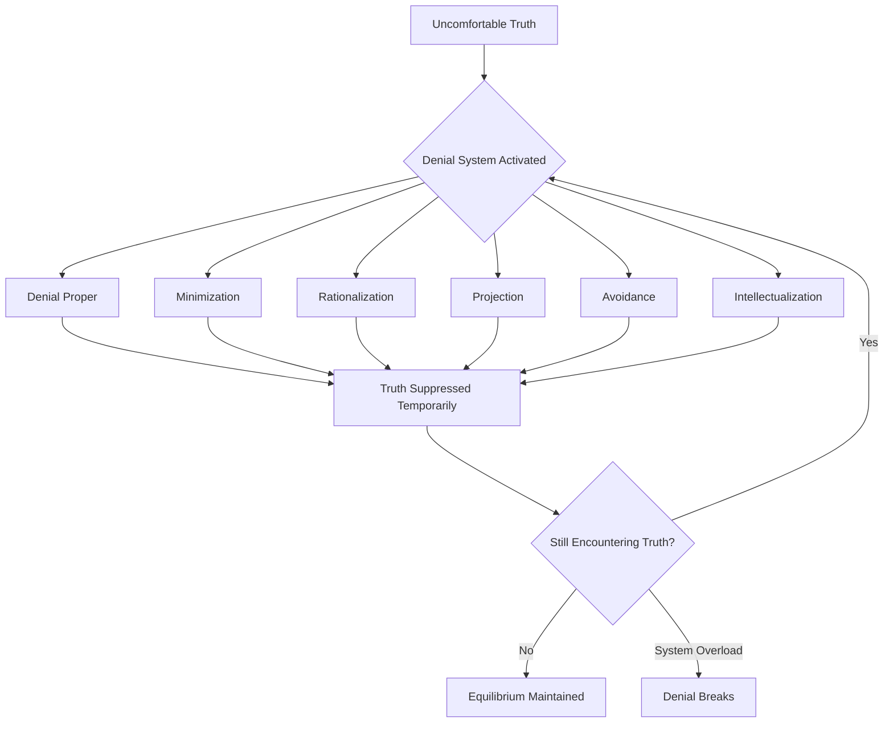
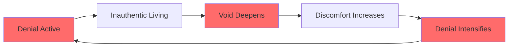
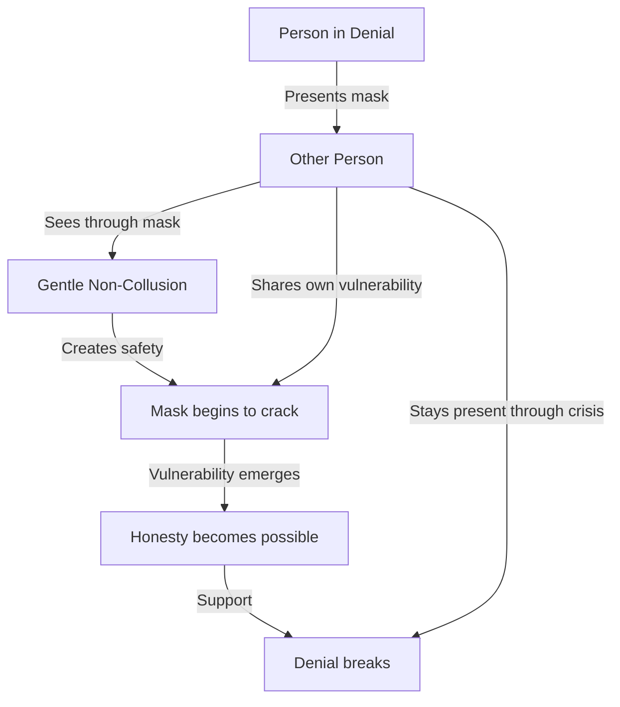

# Stages of Denial

## Description

Before you can change, you must stop pretending. Denial is not a single moment — it is a system of defenses that protects you from the truth of your situation. This document maps the stages of denial that precede genuine awakening. It describes how denial operates as architecture, not accident — a set of interlocking mechanisms that maintain the illusion of normalcy long after normalcy has become a fiction. For developers, denial has profession-specific flavors: the framework chase, the side project treadmill, the performance of productivity while the interior collapses.

## Prerequisites

- [Recognizing the Void](recognizing-the-void.md) — understanding what the existential vacuum looks like
- [The Lowest Point](../../level-up/intro/the-lowest-point.md) — the philosophical foundation of rock bottom and the vacuum

## Table of Contents

- [What Denial Actually Is](#what-denial-actually-is)
- [The Architecture of Self-Deception](#the-architecture-of-self-deception)
- [The Six Stages of Denial](#the-six-stages-of-denial)
- [The "I'm Fine" Mask](#the-im-fine-mask)
- [How Denial Manifests in Developers](#how-denial-manifests-in-developers)
- [Denial and the Void: A Vicious Spiral](#denial-and-the-void-a-vicious-spiral)
- [What Finally Cracks the Armor](#what-finally-cracks-the-armor)
- [The Role of Others in Breaking Denial](#the-role-of-others-in-breaking-denial)
- [What Happens After Denial Breaks](#what-happens-after-denial-breaks)
- [Walkthrough: Elena's Architecture of Denial](#walkthrough-elenas-architecture-of-denial)
- [Learning Tips](#learning-tips)
- [Glossary](#glossary)
- [Quick References](#quick-references)
- [Next Steps](#next-steps)

## Content / Material

### What Denial Actually Is

Denial is not stupidity. It is not weakness. It is a sophisticated, adaptive psychological mechanism designed to keep you functional when the truth would otherwise paralyze you.

When the truth is too large, too threatening, or too destabilizing, the mind constructs a buffer. The buffer is denial. It does not eliminate the truth — it interposes a layer of interpretation between you and the truth, a layer that softens, distorts, or redirects the impact. Denial is the mind's firewall. It blocks incoming packets of reality that would crash the system.

This is important to understand because most people think of denial as a binary state — you are either in denial or you are not. This is wrong. Denial is a spectrum, a gradient, a set of nested mechanisms that range from subtle to extreme. You can be partially aware of a truth while simultaneously constructing elaborate architectures to avoid confronting its full implications.

Consider the developer who knows, at some level, that they hate their job. They know it on Sunday evenings when the dread sets in. They know it during standup when the words "making progress" feel like lies. They know it when they watch a colleague light up talking about their work and feel nothing similar. And yet they continue. They continue because the knowledge is compartmentalized. It is filed away in a drawer that is opened only at 3 AM and quickly slammed shut by morning.

That is denial. Not the absence of knowledge, but the refusal to integrate it.

```python
class DenialState:
    def __init__(self):
        self.known_truths = []
        self.integrated_truths = []
        self.buffer_active = True

    def encounter_truth(self, observation):
        self.known_truths.append(observation)
        if not self.buffer_active:
            self.integrate(observation)
        return "Filed for later processing"

    def integrate(self, observation):
        if observation not in self.integrated_truths:
            self.integrated_truths.append(observation)
            return f"Truth integrated: {observation}"
        return "Already integrated"
```

The buffer does not protect you indefinitely. It protects you until you are ready — or until it is forcibly removed by circumstance. The question is not whether the truth will surface. The question is whether you will meet it on your terms or on its.

### The Architecture of Self-Deception

Denial is not random. It has structure. Psychological research, particularly the work of Shelley Taylor on positive illusions and Anna Freud on defense mechanisms, reveals that denial operates through identifiable patterns. The mind does not simply refuse to see reality. It constructs specific alternatives to reality — alternative narratives, alternative interpretations, alternative focuses — that allow the person to continue functioning while avoiding the core truth.

The architecture of self-deception has three layers:

**Layer 1: Sensory filtering.** The mind literally stops processing certain inputs. You do not see what you do not want to see. The colleague who looks exhausted — you do not register it. The flatline in your engagement metrics — you attribute it to seasonality. The pain in your chest when you open your laptop — you call it indigestion. Sensory filtering is the first line of defense: do not let the data reach consciousness.

**Layer 2: Narrative construction.** When the data does reach consciousness — when you cannot avoid noticing that something is wrong — the mind constructs a story that reframes the data in a manageable way. The story is not a lie, exactly. It is a partial truth that obscures the larger truth. "I am just tired." "It is the season." "Everyone feels this way." The narrative is plausible enough to satisfy the conscious mind while leaving the deeper truth untouched.

**Layer 3: Identity protection.** The deepest layer of denial protects not the situation but the self. If the truth is that your life is not what you want, then the implication is that you made bad choices. And if you made bad choices, then you are not the person you thought you were. Identity-protective denial protects not against the truth of the situation but against the truth of the self. This is the hardest layer to penetrate, because it is the one that the ego will fight hardest to maintain.

| Layer | Mechanism | What It Blocks | Example |
|-------|-----------|----------------|---------|
| Sensory filtering | Selective attention | Raw data | Not noticing Sunday dread |
| Narrative construction | Reframing | Implications | "I am just burned out" |
| Identity protection | Self-concept defense | Personal fault | "The system is broken, not me" |

Understanding these layers matters because it explains why facts alone do not change minds. You can present someone with overwhelming evidence that their career is making them miserable, and they will find ways to reinterpret the evidence. The architecture is designed to absorb contradictory data without collapsing. It must be dismantled from the inside.

### The Six Stages of Denial

Denial is not a single behavior. It is a repertoire of strategies, each serving a specific defensive function. These six stages are not always experienced sequentially — they often overlap, interact, and reinforce each other. But understanding them as distinct mechanisms clarifies how denial maintains itself.



**Stage 1: Denial Proper.** This is the simplest and most direct form: "This is not happening." The mind refuses to accept the reality of the situation. It is the first response, the emergency brake. Denial proper is often temporary — it holds for hours or days before the truth forces its way back. It is most common in acute situations: a sudden layoff, a relationship ending, a failure that cannot be hidden.

In the context of existential meaninglessness, denial proper sounds like: "I am not unhappy. I am just having a bad week." It is the flat refusal to entertain the possibility that something fundamental is wrong. It is the mind slamming the door shut.

**Stage 2: Minimization.** When outright denial becomes unsustainable — when the evidence is too strong to ignore — the mind shifts to minimization. The truth is acknowledged but reduced in scale. "Yes, I am unhappy, but it is not that bad." "Everyone hates their job sometimes." "At least I am making good money." Minimization admits the problem while stripping it of urgency.

Minimization is dangerous because it is partially true. Most problems are not as catastrophic as they feel in the moment. The mind exploits this by framing every problem as "not that bad," regardless of its actual severity. The existential crisis is reduced to a bad mood. The meaninglessness is reduced to boredom. The void is reduced to needing a vacation.

| Stage | Core Move | What It Sounds Like | What It Protects |
|-------|-----------|--------------------|--------------------|
| Denial proper | Refuse to see | "This is not happening" | Immediate stability |
| Minimization | Shrink the problem | "It is not that bad" | Permission to stay |
| Rationalization | Construct justifications | "It makes sense because..." | Intellectual coherence |
| Projection | Externalize the source | "The problem is them" | Self-concept |
| Avoidance | Remove from awareness | "I will deal with it later" | Emotional safety |
| Intellectualization | Abstract the experience | "As a phenomenon, this is..." | Emotional distance |

**Stage 3: Rationalization.** The mind constructs reasons why the situation is acceptable, logical, or even desirable. "I chose this career because it is stable. Stability matters more than passion." "I stay because my team needs me." "This is what responsible adults do." Rationalization does not deny the pain — it provides a framework that makes the pain seem reasonable.

Rationalization is particularly insidious because it recruits your intelligence in the service of your denial. The smarter you are, the more sophisticated your rationalizations. Developers, who are trained to construct logical arguments and build coherent systems, are especially vulnerable. You can rationalize yourself into staying in a situation for years, building an airtight case for why leaving would be irrational, while the truth festers underneath.

**Stage 4: Projection.** When the source of the problem cannot be denied or minimized, the mind relocates it. The problem is not internal — it is external. "I would be fine if my manager were better." "The company is the problem, not me." "The industry is broken." "My partner does not support me." Projection takes the inner experience of emptiness and assigns it an external cause, preserving the self as blameless.

Projection is a defense of the ego. If the problem is out there, then the self remains intact. You do not have to confront the possibility that you are the one who made the wrong choices, that you are the one who stopped caring, that the void is yours and no one else can fix it.

**Stage 5: Avoidance.** Rather than confronting the truth, you route around it. You do not think about it. You fill your schedule so there is no space for it. You change the subject when it comes up. You throw yourself into work, side projects, social events, anything that keeps the truth at a distance. Avoidance is the behavioral expression of denial — you do not just think differently about the problem, you act in ways that prevent you from encountering it.

For developers, avoidance is particularly easy because the tools of avoidance are built into the profession. There is always another pull request to review, another issue to triage, another framework to learn. The work provides a socially acceptable form of avoidance that can masquerade as diligence.

**Stage 6: Intellectualization.** The mind transforms the lived experience into an abstraction. Instead of feeling the pain, you analyze it. Instead of sitting with the void, you read about it. Instead of confronting your own meaninglessness, you study the philosophy of meaning. Intellectualization creates emotional distance by converting raw experience into theory.

This stage is especially common among developers, who are comfortable with abstraction by training. The danger is that understanding denial intellectually becomes another form of it. You can read every book on existential crisis, attend every lecture on meaning-making, write extensive notes on the philosophy of purpose — and still be in denial, because you have converted the experience into data instead of living it.

### The "I'm Fine" Mask

The most common form of denial in high-functioning professionals is not dramatic. It does not involve substance abuse or visible collapse. It involves a mask: the performance of normalcy while the interior disintegrates.

The "I'm fine" mask is a social technology. It serves two functions simultaneously. First, it prevents others from seeing the truth, which protects you from the vulnerability of disclosure. Second, it prevents you from fully acknowledging the truth to yourself, because if you are performing normalcy convincingly enough for others, you can almost convince yourself.

The mask has specific features in developer culture:

**The standup performance.** Every morning, you stand in a circle (physical or virtual) and declare that you are fine. "Working on the API migration. No blockers." The words are factual and empty. No one asks how you are doing — not really. They ask what you are doing. The standup is a mask-friendly format because it demands status, not honesty.

**The Slack green dot.** Your status is green. You are available. You are responsive. The green dot is a declaration of presence and functionality. It says: I am here, I am working, I am fine. The green dot persists even when you are staring blankly at your screen, unable to summon the will to write a single line of code.

**The PR approval.** You review code. You leave comments. You approve or request changes. The PR review is a performance of engagement that requires no actual engagement with the deeper questions. You can review fifty pull requests in a day and still be completely disconnected from your work. The activity is real. The investment is absent.

**The conference talk.** You present at meetups or conferences about technical topics. You stand in front of an audience and speak with authority about architecture patterns or debugging strategies. The performance of expertise is a powerful mask because it elicits admiration, which temporarily fills the void. But the applause fades, and you are left with the same emptiness, now compounded by the awareness that the person on stage was not really you.

```python
class TheMask:
    def __init__(self):
        self.public_state = "fine"
        self.private_state = "collapsing"
        self.mask_integrity = 100

    def daily_performance(self):
        interactions = ["standup", "slack", "code_review", "meeting"]
        for event in interactions:
            self.mask_integrity -= 1  # each performance costs something
            self.update_status("fine")
        return self.mask_integrity

    def check_integrity(self):
        if self.mask_integrity < 20:
            return "Mask is cracking — truth is leaking through"
        return f"Mask holding at {self.mask_integrity}%"
```

The tragedy of the mask is that it is exhausting. Maintaining the performance of normalcy while experiencing internal crisis consumes enormous energy. This is why people in denial often feel perpetually tired without understanding why. They sleep eight hours and wake up exhausted. The exhaustion is not physical — it is the cost of the mask.

### How Denial Manifests in Developers

Developer culture has specific patterns of denial that are distinct from other professions. These patterns are reinforced by industry norms, social expectations, and the structural characteristics of software work.

**The framework treadmill.** You feel empty about your work, so you learn a new framework. The novelty provides a temporary boost — the excitement of learning, the satisfaction of building something with a new tool. But the framework does not address the underlying emptiness. When the novelty fades, the void returns, and you learn another framework. The treadmill looks like professional development. It is actually avoidance.

**The side project trap.** You start a side project because you believe the problem is that your day job is not meaningful enough. The side project will be meaningful — it is yours, you chose it, you control it. But the side project becomes another obligation, another source of pressure, another thing to maintain. The meaning you hoped for does not materialize. The side project is abandoned, and a new one begins. The cycle repeats.

**The open source savior.** You convince yourself that contributing to open source will fill the void because you are helping the community. The initial contribution feels meaningful. But the maintainers are burned out, the issues are endless, the gratitude is sparse. You burn out too. The meaning was real for a moment, but it was not sustainable because it was external — dependent on the responses of others rather than rooted in your own sense of purpose.

**The certification quest.** You pursue certifications, degrees, or credentials because the achievement will validate your career. AWS Solutions Architect. Kubernetes Administrator. Master's in Computer Science. Each certification provides a brief high, then fades. The collection of credentials grows, but the void remains. The certifications are badges, not answers.

**The salary trap.** You stay in a job you hate because the compensation is too good to leave. "I cannot afford to take a pay cut." "I will save up and then make a change." "I will wait until my equity vests." The money becomes the justification for enduring meaninglessness. The trap tightens as lifestyle inflation consumes the additional income, making the idea of leaving even more frightening.

| Developer Denial Pattern | What It Looks Like | What It Actually Is | Duration of Relief |
|--------------------------|--------------------|--------------------|--------------------|
| Framework treadmill | Learning React, then Svelte, then Rust | Avoiding the question of why none of it matters | Days to weeks |
| Side project trap | Starting a new project every quarter | Seeking meaning externally instead of examining the void | Weeks to months |
| Open source savior | Maintaining a popular library | Using community validation to suppress the emptiness | Months before burnout |
| Certification quest | AWS, K8s, CISSP, Masters | Collecting achievements to replace purpose | Days to weeks per cert |
| Salary trap | Staying for the money | Trading meaning for security | Years |
| Hustle culture | "I just need to work harder" | Believing intensity substitutes for direction | Until collapse |

**The hustle gospel.** Perhaps the most insidious form of developer denial is the embrace of hustle culture. "I just need to work harder." "Sleep is for the weak." "I will grind now and enjoy life later." Hustle culture provides a moral framework for avoidance. The emptiness is reframed as insufficient effort. The solution is not reflection — it is more work. The void is buried under productivity, and the grave is dug with burnout.

**The remote work fantasy.** You believe the problem is your commute, your office, your city. If you could just work remotely, everything would be different. You get the remote job. The first month is euphoric. Then the walls close in. The void is not geographical. It follows you to the home office, the coffee shop, the co-working space. The laptop is always open, but the emptiness is always there.

### Denial and the Void: A Vicious Spiral

Denial and the void exist in a feedback loop. The longer you deny, the deeper the void grows. The deeper the void grows, the more desperate your denial becomes.

This is because the void is fed by inauthenticity. Every day you spend performing a life you do not believe in is a day the void deepens. Every "I'm fine" is a deposit. Every rationalization adds weight. The denial does not keep the void at bay — it feeds it.



Consider the timeline:

**Year 1-2:** The first doubts arise. You minimize them. "Everyone goes through this." The void is shallow — more of a nag than a crisis. Denial is easy. A new project, a small win, a compliment from a manager — these are enough to keep the void at bay.

**Year 3-5:** The doubts are harder to dismiss. You have tried everything — new roles, new companies, new technologies — and the feeling persists. The void is deeper now. It surfaces more often and requires more effort to suppress. Your denial becomes more sophisticated. You do not just minimize; you rationalize, intellectualize, project. The architecture of self-deception grows more complex.

**Year 6-10:** The void is a constant companion. It is there when you wake up and when you go to sleep. It colors everything. Denial is exhausting but necessary — the truth is too large to confront without preparation. You are tired all the time. The mask is heavy. But taking it off means facing the accumulated weight of years of inauthenticity.

**Year 10+:** The crisis. The void has grown so large that denial can no longer contain it. Something breaks — a relationship, a job, a mental health episode. The accumulated weight of years of denial crashes down. This is what hitting rock bottom looks like for someone who has been denying for a long time. The fall is higher because the denial was taller.

```python
def denial_void_cycle(years_in_denial):
    void_depth = years_in_denial * 0.8
    denial_complexity = min(years_in_denial * 1.2, 10)
    mask_cost = void_depth * denial_complexity
    
    if mask_cost < 10:
        return "Discomfort — manageable with minor distractions"
    elif mask_cost < 30:
        return "Dysfunction — the mask is slipping"
    elif mask_cost < 60:
        return "Crisis — denial is unsustainable"
    else:
        return "Collapse — the architecture falls"
```

The implication is clear: the earlier you confront denial, the less it costs. Every year of denial adds compound interest to the void. The best time to stop pretending is now. The second best time was yesterday.

### What Finally Cracks the Armor

If denial is so robust, so self-reinforcing, so expertly constructed — what breaks it? Why do people eventually stop pretending?

The answer is that denial has a failure threshold. It cracks when the cost of maintaining it exceeds the cost of facing the truth. This threshold is reached through several pathways:

**Exhaustion.** The mask is heavy. The rationalizations are elaborate. The avoidance requires constant effort. Eventually, you run out of energy. The denial does not break because you choose to let it go — it breaks because you are too tired to hold it up anymore. This is why denial often breaks during transitions: job changes, relationship endings, illness, vacation. Any disruption to the routine weakens the denial infrastructure.

**Contradiction.** Sometimes the truth presents itself so forcefully that denial cannot contain it. You see yourself through someone else's eyes and the distance between the mask and the reality is suddenly, painfully visible. A child asks why you are always working. A partner says, "I miss you." A friend observes that you do not seem happy. The external perspective pierces the armor because it was not designed to withstand it.

**Accumulation.** No single event breaks denial. But the accumulation of small truths eventually reaches critical mass. The Sunday dread, repeated for five hundred Sundays, becomes undeniable. The five hundredth time you say "I'm fine" when you are not fine, the lie loses its power. Accumulation is the slow path — the one most people are on.

**Loss.** Sometimes denial breaks because something is taken from you. The job you hated but stayed at — you are laid off. The relationship you neglected — it ends. The health you ignored — it fails. Loss forces confrontation because there is nothing left to deny. The structure has been removed, and you are left standing in the void you have been avoiding.

**A moment of honesty.** Occasionally, denial breaks because of a spontaneous moment of honesty. You catch yourself in a mirror and see someone you do not recognize. You read a sentence in a book that stops you cold. You hear a song that cracks something open. These moments are unpredictable and unmanufacturable. They are acts of grace — moments when the truth breaks through without warning.

| Cracking Mechanism | How It Works | Timeframe | Pain Level |
|--------------------|--------------|-----------|------------|
| Exhaustion | Energy to deny runs out | Years | High but gradual |
| Contradiction | External truth pierces the mask | Instant | Sharp and immediate |
| Accumulation | Small truths reach critical mass | Months to years | Slowly increasing |
| Loss | Structure removed, void unavoidable | Instant | Extreme |
| Moment of honesty | Spontaneous breakthrough | Instant | Variable |

What all five mechanisms share is the removal of the buffer between you and the truth. The buffer was always artificial. The mechanisms simply determine how it is dismantled.

### The Role of Others in Breaking Denial

You cannot always break your own denial. Sometimes it takes another person — someone who sees through the mask and refuses to accept the performance.

This person does not have to be a therapist. They can be a friend, a partner, a colleague, a mentor. What matters is that they see you — not the mask, but you. And that they respond to what they see, not to what you present.

The role of the other is paradoxical. You need someone to help you see the truth, but the truth must ultimately be yours to accept. The other can create conditions for honesty, but they cannot force it. They can hold up a mirror, but they cannot make you look.

Effective others share certain characteristics:

**They do not collude with the mask.** When you say "I'm fine," they do not accept it at face value. They do not confront you aggressively — that triggers defensiveness — but they do not let the lie stand. A pause. A look. A gentle "Are you sure?" These small acts of non-collusion are powerful because they signal that the mask is not working.

**They share their own vulnerability.** The most effective way to break someone else's denial is to model honesty about your own. When someone says, "I have been struggling too," it gives you permission to be honest. Vulnerability is contagious. One person's honesty creates space for another's.

**They stay present.** Breaking denial is not a single event. It is a process. The other person must be willing to stay through the discomfort — the defensiveness, the anger, the grief. They must not abandon you when the mask cracks, because that is precisely when you need support most.

**They ask the right questions.** Not "What is wrong with you?" but "What have you been avoiding?" Not "Why are you unhappy?" but "When did you stop being honest with yourself?" The right question is the one that bypasses the narrative defenses and addresses the underlying avoidance.



The other person cannot save you. But they can stand beside you while you save yourself. That presence — the refusal to accept the lie, the willingness to witness the truth — is one of the most powerful forces in human transformation.

### What Happens After Denial Breaks

When denial breaks, the emotional flood begins. Everything you have been holding back comes rushing in. This is not a metaphor — it is a physiological and psychological event. The body releases the tension it has been carrying. The mind confronts the truths it has been suppressing. The emotions arrive all at once, overwhelming and undifferentiated.

The flood typically includes:

**Grief.** You grieve the time lost. The years spent performing a life you did not want. The version of yourself that believed the performance was enough. This grief is deep because it is not about a single loss — it is about the accumulated weight of a thousand small compromises.

**Shame.** You are ashamed of the denial itself. Ashamed that you pretended for so long. Ashamed that you could not see what now seems obvious. Ashamed that you let others believe the mask was real. The shame is acute because it is not about the original problem — it is about the years of avoidance.

**Anger.** At yourself for not acting sooner. At the systems that rewarded the performance. At the culture that made honesty feel impossible. At the people who did not see through the mask — or who saw and said nothing.

**Fear.** If the old life was a performance, what is real? If the mask is off, who are you? What happens now? The fear is the confrontation with the unknown. You have spent years constructing an elaborate architecture of denial, and now that architecture is gone. You are standing in the open, exposed.

**Relief.** Beneath the grief, shame, anger, and fear, there is relief. The exhaustion of maintaining the mask is over. The constant effort of avoidance is finished. The truth is painful, but it is lighter than the lie. The relief is the body's response to the cessation of a long-held tension.

```python
class PostDenialFlood:
    def __init__(self):
        self.emotions = {
            "grief": 0,
            "shame": 0,
            "anger": 0,
            "fear": 0,
            "relief": 0,
        }
        self.duration_weeks = 0

    def process_week(self):
        self.duration_weeks += 1
        for emotion in self.emotions:
            if emotion == "relief":
                self.emotions[emotion] = min(1.0, self.emotions[emotion] + 0.1)
            else:
                if self.duration_weeks < 4:
                    self.emotions[emotion] = min(1.0, self.emotions[emotion] + 0.15)
                else:
                    self.emotions[emotion] = max(0, self.emotions[emotion] - 0.05)
        return self.emotions
```

The flood is not comfortable. It is, in many ways, the most difficult part of the awakening process. But it is also the most necessary. The emotions that flood in are not new — they have been present throughout the entire period of denial. The flood is simply the moment when you finally stop running from them.

It is important to know that the flood is temporary. It peaks and then subsides. The grief does not remain at maximum intensity forever. The shame fades as you realize that others have walked this path. The anger transforms as you begin to direct it constructively. The fear becomes manageable as you take the first steps into the unknown.

What remains after the flood is clarity. The emotional noise settles, and you are left with a quieter, more honest internal landscape. The void may still be there — denial breaking does not fill it — but you are now facing it without armor. And facing it without armor is the prerequisite for genuine change.

### Walkthrough: Elena's Architecture of Denial

Elena is a 34-year-old frontend architect at a large tech company. She has been in the industry for eleven years. She is well-respected, well-compensated, and deeply unhappy.

**The early cracks.** Elena first noticed something wrong six years ago. She was leading a project she had fought for — a redesign of the company's core product. The project was successful by every metric: on time, under budget, high user satisfaction. When it shipped, she felt nothing.

She told herself it was relief. "I was just stressed. Now it is over. I will feel better tomorrow." Tomorrow came and went. The feeling — or the absence of feeling — persisted.

**The rationalization engine.** Elena is brilliant at constructing rationalizations. She has a gift for finding logical justifications for staying in situations that make her miserable.

- "This is a great company. I would be stupid to leave."
- "Every job has bad parts. The good parts outweigh them."
- "I am lucky to have this. Most people would kill for my salary."
- "The problem is not the job. The problem is that I need better work-life balance."

Each rationalization was partially true. That is what made them effective. The salary *was* good. The company *was* well-regarded. Work-life balance *was* a factor. But the rationalizations were also a defense mechanism — a way of explaining away the truth without confronting it.

```python
class ElenaRationalization:
    def __init__(self):
        self.rationalizations_used = []
        self.truth_suppressed = 0

    def generate_rationalization(self, trigger):
        options = {
            "empty_feeling": "I am just tired",
            "dread": "Everyone hates Mondays",
            "envy": "They are not as happy as they look",
            "question": "I am overthinking this",
        }
        rationale = options.get(trigger, "It could be worse")
        self.rationalizations_used.append(rationale)
        self.truth_suppressed += 1
        return rationale
```

**The projection phase.** After two years of rationalization, Elena shifted to projection. The problem was not internal — it was her manager. Her team. The company culture. The industry.

"My manager does not understand frontend architecture. If she did, I would enjoy the work."
"The company does not value design. If they did, I would feel proud of what I build."
"The tech industry is shallow. Everyone is chasing money, not craft."

Each projection relocated the source of her unhappiness to an external entity. If the problem was out there, she did not have to look inward. She did not have to consider that the problem might be the gap between who she was performing to be and who she actually was.

**The avoidance architecture.** Elena's avoidance was sophisticated. She did not simply ignore the problem — she built a structure of activities that kept her too busy to confront it.

- She volunteered for every new initiative. New product launch? She was on it. Design system overhaul? She led it. Accessibility audit? She championed it.
- She attended every conference, every meetup, every workshop. Her calendar was a fortress of professional development.
- She mentored four junior engineers. The mentoring was genuine, but it also served as a mirror — the juniors looked up to her, which temporarily filled the void.

The avoidance worked. For years, it worked. Elena was too busy to be existential. The busyness was not a side effect — it was the point.

**The breaking point.** The denial broke on a Tuesday afternoon. Elena was in a team meeting. The VP of Engineering was presenting the roadmap for the next quarter. He was excited. The team was excited. Elena watched herself perform excitement — nodding, smiling, asking questions.

And then a junior engineer, Marcus, asked a question: "Why are we building this?"

The room laughed. It was supposed to be a naive question. But Elena did not laugh. The question cut through fourteen layers of denial in a single stroke. She looked at Marcus and saw the person she used to be — someone who cared about why.

After the meeting, Elena went to the bathroom, locked the door, and cried for twenty minutes.

**The aftermath.** The flood was intense. Grief for the years she had spent performing. Anger at herself for not acting sooner. Shame for the elaborate architecture of denial she had constructed. Fear of what came next.

But the flood also brought clarity. Elena could see, for the first time in years, her life without the filter of denial. The picture was painful. But it was honest. And honesty, she was learning, was the only foundation that could not be taken from her.

Elena did not quit her job the next day. She did not make any dramatic changes. What she did was simpler and more radical: she stopped pretending. She went to work the next morning and, for the first time in years, did not perform enthusiasm she did not feel. She did not perform cynicism either. She was just present. Quietly, painfully present.

It was the beginning of something real.

### Learning Tips

**Name your denial strategy.** Everyone has a dominant form of denial. Identify yours. Are you a minimizer? A rationalizer? An avoider? An intellectualizer? Naming the strategy does not break it, but it creates distance between you and the mechanism. You begin to notice when you are doing it. That noticing is the first crack.

**Track the cost.** Denial is not free. It costs energy, relationships, health, and time. Keep a log of the moments when you catch yourself denying. Note the physical sensation — the tightness in the chest, the shallow breath, the slight flinch when the truth surfaces. Over time, you will see the pattern. The cost becomes undeniable.

**Do not rush the breaking.** When you realize you are in denial, the instinct is to force yourself through it. This rarely works. Denial protects something that feels fragile. Pushing too hard triggers the defense mechanisms and reinforces them. The better approach is gentle persistence — keep showing up, keep noticing, keep being honest about the denial itself. "I am denying this. I know I am denying this. I am not ready to stop yet." That honesty about the dishonesty is a paradox, but it works.

**Use the body as a signal.** Denial lives in the body as much as the mind. The clenched jaw, the shallow breathing, the tension in the shoulders — these are the physical signatures of suppressed truth. When you notice them, ask: "What am I not letting myself feel right now?" The body often knows the truth before the mind admits it.

**Read others' stories.** You are not the first person to build an architecture of denial. Reading memoirs, accounts, and case studies of others who have walked this path normalizes the experience and provides language for what you are going through. Language matters because unnamed experiences feel more isolating than named ones.

**Accept that denial served a purpose.** Denial is not your enemy. It protected you when you were not ready to face the truth. It kept you functional when the alternative was collapse. Thank the denial for its service, and then let it go. Hating the mechanism only strengthens it.

## Glossary

| Term | Definition |
|------|------------|
| Architecture of self-deception | The structured system of defense mechanisms that maintain denial across multiple psychological levels |
| Buffer | The psychological layer interposed between a person and an uncomfortable truth, softening or distorting its impact |
| Compound interest of denial | The concept that each year of denial deepens the void proportionally, making eventual confrontation more costly |
| Contradiction cracking | The breaking of denial when external evidence becomes too strong for the defense mechanisms to contain |
| Denial proper | The simplest form of denial: the outright refusal to accept that something is happening |
| Emotional flood | The overwhelming release of suppressed emotions that occurs when denial breaks |
| "I'm fine" mask | The social performance of normalcy maintained by high-functioning individuals experiencing internal crisis |
| Intellectualization | A defense mechanism that transforms lived emotional experience into abstract analysis, creating distance from the feeling |
| Minimization | A defense mechanism that acknowledges a problem while stripping it of urgency or severity |
| Projection | A defense mechanism that externalizes the source of an internal problem, preserving the self-concept |
| Rationalization | A defense mechanism that constructs logical justifications for remaining in a painful situation |
| Sensory filtering | The subconscious process by which the mind prevents uncomfortable data from reaching conscious awareness |
| Stage 5: Avoidance | A defense mechanism that routes behavior away from the truth, using activity as a shield against confrontation |
| Three layers of denial | Sensory filtering, narrative construction, and identity protection — the nested structure of self-deception |

## Quick References

- [Freud, A. (1936). The Ego and the Mechanisms of Defence](https://www.goodreads.com/book/show/526221.The_Ego_and_the_Mechanisms_of_Defence) — the foundational text on defense mechanisms
- [Taylor, S.E. & Brown, J.D. (1988). Illusion and Well-Being: A Social Psychological Perspective on Mental Health](https://psycnet.apa.org/record/1988-28290-001) — the seminal paper on positive illusions and their psychological function
- [Vaillant, G.E. (1992). Ego Mechanisms of Defense: A Guide for Clinicians and Researchers](https://www.goodreads.com/book/show/276057.Ego_Mechanisms_of_Defense) — empirical classification of defense mechanisms across the lifespan
- [Yalom, I. (1980). Existential Psychotherapy](https://www.goodreads.com/book/show/85170.Existential_Psychotherapy) — the clinical framework for understanding existential avoidance and confrontation
- [Frankl, V.E. (1946). Man's Search for Meaning](https://www.goodreads.com/book/show/4069.Man_s_Search_for_Meaning) — the foundational account of confronting meaninglessness
- [May, R. (1969). Love and Will](https://www.goodreads.com/book/show/801602.Love_and_Will) — on the relationship between awareness, denial, and authentic choice
- [Kegan, R. (1982). The Evolving Self](https://www.goodreads.com/book/show/168004.The_Evolving_Self) — developmental perspectives on self-deception and the stages of meaning-making
- [Brown, B. (2012). Daring Greatly](https://www.goodreads.com/book/show/13588356-daring-greatly) — on vulnerability, shame, and the courage required to remove the mask
- [Jung, C.G. (1933). Modern Man in Search of a Soul](https://www.goodreads.com/book/show/80463.Modern_Man_in_Search_of_a_Soul) — Jung's analysis of self-deception in modern consciousness
- [Becker, E. (1973). The Denial of Death](https://www.goodreads.com/book/show/2765.The_Denial_of_Death) — how the fear of mortality drives the construction of defensive meaning systems

## Next Steps

- [The Decision to Change](the-decision-to-change.md) — the moment of commitment that follows the breaking of denial
- [Recognizing the Void](recognizing-the-void.md) — returning to the experience of the void with fresh eyes
- [The Lowest Point](../../level-up/intro/the-lowest-point.md) — the philosophical foundation of rock bottom
- [Getting Back Up](../resilience/getting-back-up.md) — the practical work of rebuilding after denial breaks
- [Existential Crisis](../../philosophy/existentialism/existential-crisis.md) — the philosophical framework for understanding the confrontation with meaninglessness
