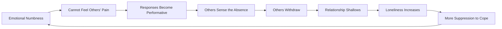
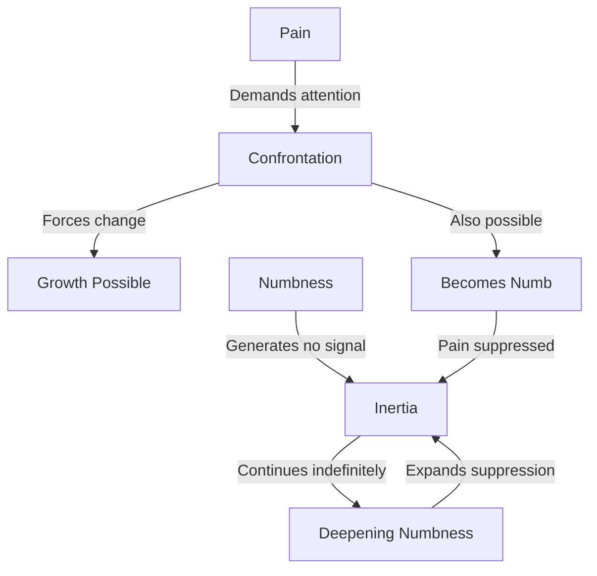
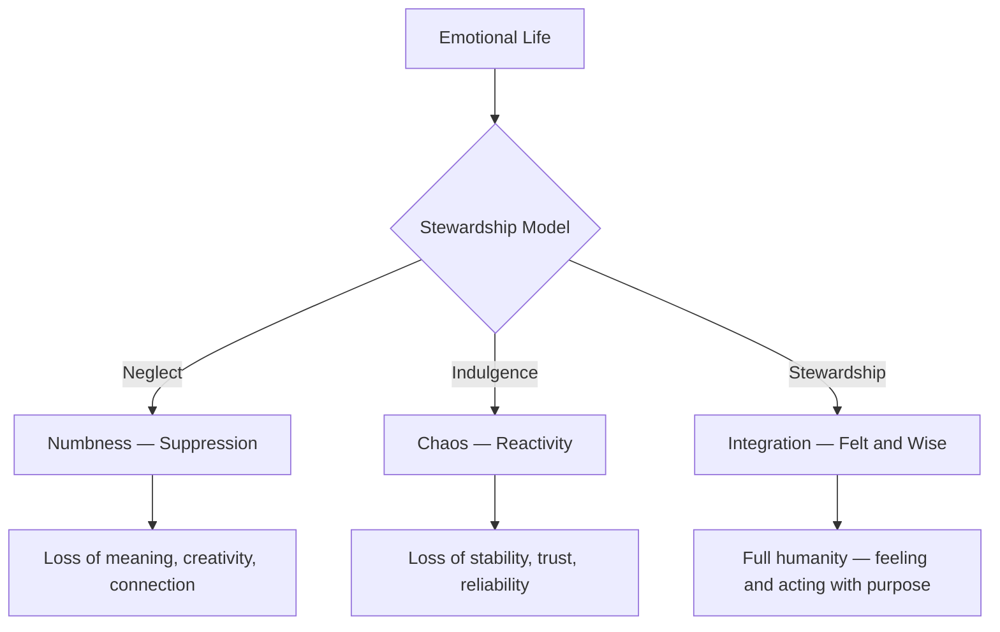

# The Cost of Numbness

## Description

High-functioning apathy is the most dangerous stage of the void — you are productive enough that no one notices you are dying inside. This document explores what emotional numbness costs you, how it masquerades as stability, and why confronting it is essential for genuine transformation.

## Prerequisites

- [Recognizing the Void](recognizing-the-void.md) — understanding the existential vacuum and the signs of waking up
- [Stages of Denial](stages-of-denial.md) — how denial protects you from truth and delays transformation

## Table of Contents

- [The Most Productive Form of Dying](#-the-most-productive-form-of-dying)
- [Contentment vs. Numbness](#-contentment-vs-numbness)
- [How Numbness Develops](#-how-numbness-develops)
- [The Cost of Emotional Shutdown](#-the-cost-of-emotional-shutdown)
- [Numbness in the Life of a Developer](#-numbness-in-the-life-of-a-developer)
- [The Golden Handcuffs Effect](#-the-golden-handcuffs-effect)
- [Why Numbness Is Harder Than Pain](#-why-numbness-is-harder-than-pain)
- [The First Crack](#-the-first-crack)
- [Stewardship of Emotional Life](#-stewardship-of-emotional-life)
- [Walkthrough: Elena Discovers She Cannot Feel](#-walkthrough-elena-discovers-she-cannot-feel)
- [Learning Tips](#-learning-tips)
- [Glossary](#-glossary)
- [Quick References](#-quick-references)
- [Next Steps](#-next-steps)

## Content / Material

### 🪦 The Most Productive Form of Dying

There is a kind of death that looks like life. You wake up, commute, stand up, write code, ship features, attend meetings, review PRs, go home, eat, sleep, and repeat. Your manager says you are reliable. Your team depends on you. Your performance review is solid. From the outside, you are the picture of a functioning professional.

Inside, there is nothing.

Not pain. Not sadness. Not anger. Nothing. A vast, quiet emptiness that does not even have the decency to hurt. You are not suffering — you are absent. The person going through the motions bears your name and wears your face, but the interior has been hollowed out and no one has noticed, least of all the people who should care.

This is high-functioning apathy. It is the most dangerous stage of the void because it is invisible. Pain gets attention. Depression gets diagnosed. Burnout gets a leave of absence. But numbness? Numbness gets a promotion.

```python
# The numbness paradox
def outward_appearance(interior_state):
    if interior_state["feeling"] == 0:
        return {
            "productivity": 0.85,
            "reliability": 0.90,
            "perceived_stability": 0.95,
            "actual_wellbeing": 0.05,
        }
    return {
        "productivity": min(0.7, interior_state["feeling"]),
        "reliability": min(0.7, interior_state["feeling"]),
        "perceived_stability": 0.5,
        "actual_wellbeing": interior_state["feeling"],
    }
```

The cruel irony is that the less you feel, the more productive you become. Emotions are expensive — they consume cognitive resources, demand processing time, disrupt focus. A person without emotional friction can code for twelve hours straight. They can absorb criticism without flinching. They can work weekends without complaint. The system rewards numbness and punishes feeling.

You may be reading this and recognizing yourself. You may realize that your reliability at work is not a virtue — it is a symptom. The fact that nothing bothers you anymore is not strength. It is the absence of the self that used to be bothered.

### 📊 Contentment vs. Numbness

One of the most insidious aspects of numbness is that it can be mistaken for contentment. Both states involve a reduction in emotional turbulence. Both feel calm on the surface. The difference is profound, but it is hidden beneath a surface that looks identical from the outside.

Contentment is the presence of peace. Numbness is the absence of everything. Contentment is the result of a life lived in alignment with values. Numbness is the result of a life lived in defense against pain. Contentment deepens over time. Numbness hardens.

| Dimension | Contentment | Numbness |
|-----------|-------------|----------|
| Source | Alignment with values | Suppression of pain |
| Energy | Quiet vitality | Flatness, low charge |
| Response to beauty | Appreciation, sometimes moved | Acknowledgment without feeling |
| Response to loss | Grief that processes and resolves | Nothing — no grief at all |
| Response to joy | Felt in the body, shared with others | Recognized intellectually, not felt |
| Relationships | Warm, reciprocal, deepening | Functional, shallow, stagnant |
| Creativity | Present, generative | Absent or mechanical |
| Self-knowledge | Growing, honest | Stagnant, defended |
| Trajectory | Deepens with time | Hardens with time |
| Physical sensation | Aliveness, ease | Flatness, tension held in the body |

The confusion between these two states is not a failure of perception. It is a feature of the defense. Numbness does not announce itself as numbness. It announces itself as "I am fine." It wears the mask of maturity: "I have learned not to sweat the small things." It disguises itself as stoicism: "I do not let emotions run my life."

But there is a test. Ask yourself: when was the last time you were genuinely moved? Not touched in a vague, intellectual way — moved in the body. A song that brought tears. A conversation that made your chest tight. A moment of gratitude so sharp it hurt. If you cannot remember, or if the memory feels like it belongs to a different person, you are not content. You are numb.

```python
def contentment_test(recent_memories):
    genuine_feelings = [
        m for m in recent_memories
        if m["bodily_felt"] and m["uninvited"]
    ]
    if len(genuine_feelings) == 0:
        return "Numbness likely — no uninvited feelings in recent memory"
    elif len(genuine_feelings) < 3:
        return "Emotional range narrowing — monitor closely"
    else:
        return "Emotional life appears intact"
```

Contentment does not require the absence of difficulty. A content person can be frustrated, disappointed, even angry — they feel these things and process them. Numbness requires the absence of everything. It is not a peak of emotional maturity. It is a flatline.

### 🔧 How Numbness Develops

Numbness does not arrive like a storm. It seeps in like a slow leak in a tire — by the time you notice, you have been driving on empty for months.

The mechanism is straightforward. You experience prolonged stress, chronic disappointment, or sustained emotional pain. Your psyche, designed for survival, does what it was built to do: it shuts down the systems that are causing suffering. It turns off the emotional feed. Not permanently, not dramatically — it just lowers the volume, a little at a time, until the signal is inaudible.

```mermaid
graph TD
    A[Prolonged Stress or Pain] --> B[Emotional System Overloaded]
    B --> C[Suppression Begins — Unconscious]
    C --> D[Volume Lowers — Affect Dampened]
    D --> E[Numbness Stabilizes — New "Normal"]
    E --> F{Stress Continues?}
    F -->|Yes| G[Further Suppression — Deeper Numbness]
    F -->|No| H[Partial Recovery Possible — If Noticed]
    G --> F
    H --> I[Feelings Return Gradually]
    I --> J[Confrontation with Lost Time]
```

This is not weakness. The psyche is doing exactly what it was designed to do — protect you from intolerable pain. The problem is that the mechanism has no fine-tuning. It cannot distinguish between the pain of a toxic workplace and the pain of a meaningful challenge. It cannot separate the chronic stress of a loveless routine from the acute pain of genuine loss. When the system detects sustained pain, it shuts down broadly. The fire alarm does not distinguish between a kitchen fire and a candle. It detects heat and triggers the sprinklers. Everything gets wet.

The developmental arc of numbness typically follows this sequence:

**Stage 1: Hypervigilance.** You are acutely aware of the pain. You feel everything. The Sunday dread is sharp. The dissatisfaction is loud. The anxiety hums beneath every interaction. This stage feels terrible, but it is honest. You know something is wrong.

**Stage 2: Exhaustion.** The hypervigilance is unsustainable. You cannot sustain that level of emotional intensity for months or years. The system begins to fatigue. You start to feel less, not because the pain has resolved, but because the machinery of feeling is wearing down.

**Stage 3: Compartmentalization.** You learn to separate your emotional life from your functional life. At work, you are composed, efficient, professional. At home, you collapse. The split is not deliberate — it happens because the psyche needs somewhere to put the pain, and the only available space is the one you lock away.

**Stage 4: Generalized suppression.** The suppression that began as a targeted defense against specific pain expands. You cannot selectively numb pain without numbing everything adjacent to it. The same mechanism that blocks grief blocks joy. The same valve that stops anxiety stops excitement. You save yourself from suffering by destroying your capacity to feel.

**Stage 5: Numbness.** The final state. You feel nothing of consequence. Life proceeds at a flat emotional baseline. There are no highs and no lows. The world loses its texture and becomes a series of inputs to process. You function, but you do not live.

```python
class NumbnessProgression:
    def __init__(self):
        self.stages = [
            "hypervigilance",
            "exhaustion",
            "compartmentalization",
            "generalized_suppression",
            "numbness",
        ]
        self.current = 0
        self.months_in_stage = 0

    def advance(self):
        thresholds = [6, 12, 8, 18, None]
        self.months_in_stage += 1
        if thresholds[self.current] and self.months_in_stage >= thresholds[self.current]:
            self.current += 1
            self.months_in_stage = 0
        return self.stages[self.current]
```

The timeline varies. Some people move through all five stages in a single year of intense burnout. Others spend a decade drifting from Stage 2 to Stage 4, never quite reaching full numbness but never recovering either. The insidiousness is in the gradualism. Each individual step feels like a small adjustment — "I am just less emotional than I used to be" — rather than a systematic dismantling of your capacity to feel.

### 💔 The Cost of Emotional Shutdown

The costs of numbness are not immediately visible. That is precisely why it is so dangerous. If numbness hurt obviously, you would address it. Instead, it costs you in ways that accumulate silently, compounding like interest on a debt you did not know you owed.

**Relationships shallow.** Relationships require emotional reciprocity. They require that you feel something when the other person shares their pain, their joy, their fear. When you are numb, you offer the shell of presence without the substance. You nod at the right moments. You say the right words. But the other person can feel the absence. They stop sharing. The relationship calcifies into logistics: who picks up the groceries, who pays the bills, who schedules the dentist. The warmth goes cold, and neither of you can name when it happened.



**Creativity dies.** Creativity is the ability to feel connections between things that are not obviously related. It requires emotional resonance — the capacity to be moved by a pattern, an idea, a possibility. When you are numb, the connections do not appear. Code becomes mechanical. You implement specifications without imagination. The side projects that once excited you sit in a folder of half-finished repositories, each one abandoned at the exact point where the work stopped being a copy of something else and needed to become something new. You cannot create from emptiness.

**Passion fades.** Passion is the felt sense that something matters to you. It is the difference between working on a problem because you were assigned it and working on it because you cannot stop thinking about it. Numbness extinguishes passion by removing the felt sense of mattering. Nothing matters enough to be passionate about. You may go through the motions of enthusiasm — attending conferences, joining communities, starting projects — but the fire is absent. The rituals remain while the devotion has departed.

**Physical health deteriorates.** Emotional suppression does not stay in the mind. The body keeps the score. The tension you do not feel in your emotional life manifests as tension in your body: clenched jaw, tight shoulders, shallow breathing, disrupted sleep. The stress hormones that your suppressed emotions would have metabolized through feeling circulate instead, degrading your immune system, disrupting your digestion, accelerating cellular aging. Numbness is not free. The body pays what the mind refuses to.

**Moral sensitivity erodes.** When you cannot feel, you cannot be moved by injustice. You become capable of witnessing harm — at work, in relationships, in the world — without being disturbed. This is perhaps the most profound cost. The capacity to be disturbed by wrongness is a moral faculty. It is the foundation of ethical action. Numbness does not make you evil, but it makes you indifferent, and indifference is the soil in which complicity grows.

| Cost Domain | Short-Term Effect | Long-Term Consequence |
|-------------|-------------------|-----------------------|
| Relationships | Reduced conflict, surface stability | Loneliness, intimacy collapse |
| Creativity | Efficiency increases | Imagination atrophies |
| Passion | Focused productivity | Meaninglessness, emptiness |
| Physical health | Stress reduction (apparent) | Chronic illness, burnout |
| Moral capacity | Detachment from distress | Complicity, loss of integrity |
| Self-knowledge | Avoidance of painful truths | Alienation from authentic self |

Each of these costs is individually bearable. Together, they constitute the quiet destruction of a life. The tragedy of numbness is not that it kills you. It is that it lets you keep functioning while everything that makes life worth living drains away.

### 💻 Numbness in the Life of a Developer

Developers are particularly susceptible to numbness, and the condition manifests in profession-specific ways that can masquerade as normal career progression.

**Code becomes mechanical.** There was a time when writing code felt like solving puzzles, like building something from nothing, like speaking a language that made the machine obey. That feeling is gone. Now code is a series of tickets. You read the specification, write the implementation, submit the PR, move to the next ticket. There is no spark. No curiosity about whether there is a better way. No satisfaction in elegance. The code works. That is all it needs to do.

```python
class DeveloperNumbness:
    def __init__(self):
        self.metrics = {
            "days_since_exploration": 0,
            "days_since_side_project": 0,
            "pr_reviews_performed": 0,
            "pr_reviews_with_suggestions": 0,
            "bugs_found_in_code_you_wrote": 0,
            "times_you_refactored_for_elegance": 0,
        }

    def numbness_score(self):
        review_ratio = self.metrics["pr_reviews_with_suggestions"] / max(1, self.metrics["pr_reviews_performed"])
        exploration_deficit = min(1.0, self.metrics["days_since_exploration"] / 90)
        return round((1 - review_ratio) * 0.4 + exploration_deficit * 0.4 + min(1.0, self.metrics["days_since_side_project"] / 180) * 0.2, 2)
```

**Learning stops.** You used to read technical blogs, try new languages, experiment with frameworks. That curiosity has been replaced by a grim focus on what is needed for the job and nothing more. The RSS feeds pile up unread. The bookmarks folder grows. The new language you planned to learn sits on the list, year after year, untouched. Not because you lack time — because you lack the felt sense that learning anything new could possibly matter.

**Side projects pile up.** The graveyard of half-finished side projects is the developer's most honest autobiography. Each project begins with energy — a new idea, a new technology, a new sense of possibility. Each project is abandoned at the same point: the point where the initial dopamine of starting fades and the sustained effort of building requires feeling something about what you are building. You cannot finish because you cannot care. The unfinished projects are not evidence of laziness. They are evidence of numbness.

**Stand-ups become performances.** "No blockers." "Making progress." "Should be done by end of day." The language of the stand-up is designed for efficiency, and numbness is efficient. You report status without substance. Your team hears that things are moving. They do not hear — because you do not say — that you feel nothing about whether they move or not. The stand-up becomes a ritual of performance, not a moment of genuine human coordination.

**Code review becomes transactional.** When you were engaged, code review was a conversation — an opportunity to teach, to learn, to improve the collective quality of the codebase. When you are numb, code review is a chore. You approve PRs with minimal comment. You leave nitpicks because they are easy, not because they matter. The relational dimension of code review — the sense that you and your colleague are building something together — is absent.

**Promotions feel hollow.** The career ladder that once represented growth and achievement now represents nothing. You get promoted and the main reaction is a brief, faint sense of relief followed by a deeper emptiness. The new title does not make you feel anything. The raise does not excite you. The congratulations feel like they are addressed to someone else. You accept them graciously, because that is what is expected, and because you cannot feel enough to protest.

### ⛓️ The Golden Handcuffs Effect

The golden handcuffs metaphor describes the situation where the rewards of a position — salary, equity, benefits, status — make it nearly impossible to leave, even when the work has become meaningless. For the numb developer, the golden handcuffs are not just financial. They are existential.

The salary is good. You have worked hard to earn it. Leaving means taking a pay cut, or at minimum, the uncertainty of starting over somewhere new. The benefits are comprehensive — health insurance, retirement contributions, parental leave. These are not trivial. They represent real security for you and your family.

But the handcuffs go deeper than money.

**Identity.** You are a senior engineer. A staff engineer. A tech lead. These titles have become your identity. Without them, who are you? The question is terrifying because numbness has hollowed out whatever you were before the title. You cannot go back to being the person who coded for fun — that person is gone. And you cannot imagine who you would be without the professional identity. So you stay.

**Social capital.** You have spent years building relationships at work. Your manager trusts you. Your team relies on you. Your reputation is established. Leaving means abandoning all of that. Starting from zero in a new organization, where no one knows you, where you have to prove yourself again — the prospect is exhausting. It is easier to stay and continue performing.

**Sunk cost.** You have been in this career for ten years. Fifteen. Twenty. The idea of walking away from all of that experience feels like waste. Even if the work is meaningless to you now, the years invested create a psychological gravity that pulls you back into compliance. "I have come this far. I cannot stop now."

```python
class GoldenHandcuffs:
    def __init__(self):
        self.financial_bonds = 0
        self.identity_bonds = 0
        self.social_bonds = 0
        self.sunk_cost_bonds = 0

    def total_constraint(self):
        bonds = {
            "financial": self.financial_bonds,
            "identity": self.identity_bonds,
            "social": self.social_bonds,
            "sunk_cost": self.sunk_cost_bonds,
        }
        total = sum(bonds.values())
        return {
            "total_constraint": total,
            "strongest_bond": max(bonds, key=bonds.get),
            "freedom_threshold": total < 30,
        }
```

The golden handcuffs effect is so powerful because each bond reinforces the others. The salary makes the identity possible. The identity makes the social capital possible. The social capital makes the salary feel justified. The sunk cost makes all three feel necessary. You are held not by one chain but by a web of dependencies, each strand thin enough to break individually but formidable in combination.

The tragedy is that the handcuffs are golden precisely because they are comfortable. They do not chafe. They do not hurt. They just hold you in place while the years pass and the numbness deepens. You are a prisoner who has been convinced that the prison is a palace.

### 🔥 Why Numbness Is Harder Than Pain

Pain demands attention. Numbness demands nothing. This is the fundamental asymmetry that makes numbness more dangerous than suffering and harder to overcome.

When you are in pain, you know it. The pain is loud. It interrupts your thoughts, disrupts your sleep, demands action. Pain is a fire alarm — it may be miserable, but it tells you something is wrong and compels you to respond. You go to the doctor. You talk to a friend. You make a change. Pain, for all its cruelty, is honest. It tells you the truth about your situation.

Numbness tells you nothing. There is no alarm. There is no disruption. There is just a quiet, persistent absence that does not even register as a problem because it does not produce enough signal to cross the threshold of awareness. You feel "fine." Not good, not bad — fine. And "fine" is the most dangerous word in the emotional vocabulary.

| Characteristic | Pain | Numbness |
|----------------|------|----------|
| Visibility | Obvious, disruptive | Hidden, invisible |
| Urgency | High — demands immediate action | None — no signal generated |
| Social recognition | Others notice and respond | Others see a "stable" person |
| Motivation to change | Strong — you want relief | Absent — nothing feels wrong enough |
| Diagnosis | Straightforward | Often mistaken for maturity |
| Treatment | Addressed through support, change | Requires conscious excavation |
| Relationship to truth | Honest — tells you something is wrong | Deceptive — tells you everything is fine |

Pain is a broken bone — it hurts, but you can point to it and seek treatment. Numbness is a slowly progressing disease that destroys organ function without symptoms until the damage is advanced. By the time you notice, the atrophy is extensive.

This is why people stay numb for years. Pain drives people to therapy, to crisis, to change. Numbness drives people to inertia. The developer who is in pain will eventually burn out and be forced to confront the void. The developer who is numb will continue indefinitely, functioning at a level that appears adequate while the interior collapses.



The person who suffers is closer to transformation than the person who feels nothing. This is a paradox that the self-help industry rarely addresses. We optimize for comfort, for stability, for the absence of distress. But the absence of distress is not peace — it is the absence of the signal that would tell you your life needs to change. Pain is information. Numbness is the destruction of information.

There is a theological dimension to this that is worth considering, even if you do not hold religious beliefs. The capacity to feel pain is the capacity to be honest about reality. Pain is the mechanism by which the world tells you that something is wrong. To suppress pain is to suppress truth. The person who cannot feel is not at peace — they are cut off from reality itself. The tradition that speaks of "a broken heart" as spiritually significant is pointing to something real: the capacity to be broken by the world is the capacity to be honest about the world. Numbness is the refusal of that honesty.

### 🌱 The First Crack

Numbness does not shatter. It cracks.

The first crack is almost always involuntary. Something breaks through the suppression — a moment of feeling that you did not choose and cannot control. It might be triggered by music. A song you have heard a hundred times suddenly lands differently, and something moves in your chest. It might be triggered by a person. A colleague shares a vulnerability, and you feel a flicker of something — not much, just a trace of warmth or sadness that surprises you. It might be triggered by beauty. You see a sunset, or a piece of art, or a line of code so elegant it makes you pause, and for a moment you feel something you had forgotten existed.

The crack is terrifying. Not because the feeling itself is painful — often it is brief and mild — but because it reveals the depth of what has been suppressed. The momentary feeling is followed by a flood of awareness: "I have not felt this in years. What happened to me? How long has it been?"

```python
class FirstCrack:
    def __init__(self):
        self.suppression_years = 0
        self.cracks_experienced = 0

    def crack_occurs(self, trigger):
        self.cracks_experienced += 1
        if self.cracks_experienced == 1:
            return "Shock — the surface has broken"
        elif self.cracks_experienced < 5:
            return "Confusion — feelings leaking through unpredictable"
        elif self.cracks_experienced < 15:
            return "Fear and hope in tension — something is waking up"
        else:
            return "Integration — feelings becoming accessible again"
```

After the first crack, the feelings do not return in a flood. They return in increments — a few seconds of genuine emotion followed by long stretches of flatness. You might cry at something small and then feel nothing for a week. You might feel a sudden burst of anger at something you would have previously shrugged off, and then return to baseline for days.

This intermittent return is normal. The emotional system has been offline for a long time. It does not reboot all at once. It comes back in fragments, testing the waters, retreating when the intensity becomes too much. Patience is required — not the patience of waiting for something external to change, but the patience of allowing your own interior to recover at its own pace.

The cracks are disorienting because they disrupt the stability that numbness provided. When you were numb, you were predictable. You knew what each day would feel like: nothing. Now the days are unpredictable. Some are flat. Some have moments of surprising depth. The unpredictability is uncomfortable, but it is also evidence that something is healing.

The first crack is not the end of numbness. It is the beginning of the end. It is the proof that the emotional system has not been destroyed — only dormant. The feelings were not erased. They were buried. And now, one by one, they are digging their way back to the surface.

### ⚖️ Stewardship of Emotional Life

There is a conviction embedded in the deepest traditions of human thought — one that transcends any single framework — that the capacity to feel is not a flaw to be managed but a gift to be stewarded. The emotions are not weakness. They are information. They are the means by which you participate in reality rather than merely observing it.

Stewardship implies responsibility. You did not choose your emotional capacity, but you are responsible for how you exercise it. A person who can feel deeply and chooses not to is not stoic — they are negligent. They are wasting a faculty that was given to them for a purpose.

This reframing matters for the numb developer. The dominant narrative in professional culture is that emotions are liabilities — they interfere with judgment, disrupt productivity, compromise rationality. The ideal worker is the one who can process feedback without flinching, work through weekends without complaint, and deliver under pressure without the overhead of emotional processing.

This narrative is not merely wrong. It is corrosive. It treats the most human aspect of human beings as a defect to be optimized away. And the optimization succeeds. That is the problem. The system works. You become productive, efficient, and hollow.

The alternative is not to become emotional in the uncontrolled sense — to be swept away by every feeling, to let distress compromise every professional interaction. The alternative is to develop a mature relationship with your emotional life. To feel things and act wisely. To be moved by what deserves to move you and steady where steadiness is required. This is not the absence of emotion. It is the integration of emotion with judgment.



To steward your emotional life means:

**Allow feeling without being governed by it.** You can feel anger without acting on it destructively. You can feel sadness without being paralyzed by it. You can feel fear without fleeing. The feeling is information. The response is a choice. Stewardship means holding both — the information and the choice — in creative tension.

**Pay attention to the signals.** The return of feeling after numbness is not random. The emotions that surface first are often the ones most important to address. If the first thing you feel after years of numbness is grief, pay attention. The grief is pointing to something you lost and never processed. If the first thing you feel is anger, pay attention. The anger is pointing to a boundary that was violated.

**Protect your capacity to feel.** In a culture that rewards numbness, maintaining emotional openness requires active protection. This means setting boundaries on the amount of work that consumes you. It means resisting the professional norm that treats emotional detachment as strength. It means choosing, deliberately, to remain sensitive in an environment that rewards hardness.

**Accept the cost.** Feeling is not free. It costs you comfort. It costs you the ability to ignore things that should not be ignored. It costs you the smooth functioning that numbness provided. The price is real. But what you gain — meaning, connection, creativity, moral clarity — is worth more than what you lose.

```python
class EmotionalStewardship:
    def __init__(self):
        self.capacity = 0.0
        self.suppression_level = 0.8

    def practice(self, action):
        if action == "allow_feeling":
            self.capacity = min(1.0, self.capacity + 0.05)
            self.suppression_level = max(0.0, self.suppression_level - 0.05)
        elif action == "suppress":
            self.capacity = max(0.0, self.capacity - 0.03)
            self.suppression_level = min(1.0, self.suppression_level + 0.03)
        return {
            "emotional_capacity": self.capacity,
            "suppression": self.suppression_level,
            "status": "integrated" if self.capacity > 0.6 else "numb" if self.suppression_level > 0.7 else "recovering",
        }
```

The developer who stewards their emotional life writes better code — not because they are more technically skilled, but because they can feel when something is wrong in a system, can sense when a design is elegant or ugly, can connect with the humans they are building for. The engineer who feels is the engineer who builds things that matter.

This is the deepest cost of numbness: not that it makes you less productive, but that it makes your productivity meaningless. You can ship code forever and never build anything that matters, because mattering requires the capacity to be moved.

### 🔍 Walkthrough: Elena Discovers She Cannot Feel

Elena is a 34-year-old frontend architect at a large tech company. She has been in the industry for eleven years. She is respected, well-compensated, and utterly hollow.

**The realization.** It happens at a company offsite. The team is doing a retrospective exercise where they share "a moment this quarter that made them proud." One by one, her colleagues share stories: a bug they fixed that saved a customer, a junior developer they mentored who got promoted, a feature they built that users loved. The stories are earnest, specific, and felt.

When it is Elena's turn, she pauses. She searches for something — anything — that she felt proud of. She scrolls through the quarter in her mind. The projects. The deadlines. The code reviews. The meetings. She finds accomplishments. She does not find pride. She finds no emotional residue at all.

"I shipped the redesign of the settings page," she says.

Her team lead looks at her. "That was a huge effort. You must have felt great getting that out."

"Yeah," Elena says. "It was great."

It is not great. It was work. It was a series of pull requests and design reviews and QA cycles and a deployment. She performed every step competently. She felt nothing at any step.

**The audit.** After the offsite, Elena begins to take stock. She walks through her memories of the past year looking for any moment of genuine feeling. Not satisfaction — she can simulate that. Not relief — that is just the absence of stress. She is looking for something that was felt in the body. Something that was uninvited, unplanned, real.

The list is short. A moment of irritation when a production incident interrupted her weekend — but even that faded quickly. A flicker of warmth when her niece sent her a drawing — but it was gone before she could hold it. An ache of loneliness during a business trip — but she filled it with work and it dissolved.

She realizes: she has been running on emotional fumes for at least two years. The system has been operating without fuel. She has been productive, praised, and empty.

```python
class ElenaAudit:
    def __init__(self):
        self.quarters_reviewed = 0
        self.moments_of_genuine_feeling = []

    def review_quarter(self, quarter_memories):
        self.quarters_reviewed += 1
        genuine = [m for m in quarter_memories if m["bodily_felt"] and m["uninvited"]]
        self.moments_of_genuine_feeling.extend(genuine)
        return len(genuine)

    def final_assessment(self):
        avg_per_quarter = len(self.moments_of_genuine_feeling) / max(1, self.quarters_reviewed)
        if avg_per_quarter < 2:
            return "Emotional range severely compromised — numbness likely"
        elif avg_per_quarter < 5:
            return "Emotional range narrowing — intervention recommended"
        return "Emotional range within normal parameters"
```

**The comparison.** Elena thinks about herself five years ago. She was junior then, uncertain, sometimes frustrated. But she was alive. She remembered the rush of deploying her first feature to production. She remembered the sting of a harsh code review and the satisfaction of proving the reviewer wrong. She remembered the warmth of team celebrations, the nervousness of presentations, the excitement of learning a new framework.

Those memories feel like they belong to someone else. Not because she has grown beyond them — she has grown past them in the wrong direction. She has grown past feeling.

**The mirror.** Elena looks at her colleagues and sees two groups. The first group is like her — composed, efficient, unbothered. They are the senior leaders, the architects, the people who have "made it." They are also the most emotionally flat people in the organization. The second group is newer — the junior and mid-level developers who are still excited, still frustrated, still learning. They are annoying in their energy. They care too much. They get upset about things that do not matter.

Elena used to be in the second group. She envies them, though she would not admit it. Their emotional reactivity, which she has learned to view as immaturity, is actually evidence that they are alive. She has traded aliveness for composure, and the trade was not worth it.

**The cost she counts.** Elena begins to calculate what numbness has cost her, and the calculation is devastating.

Her closest friendships have atrophied. She has not had a vulnerable conversation in over a year. Her dating life is a series of pleasant, empty dates that go nowhere. She has three unfinished side projects and cannot bring herself to open any of them. She has not been excited about technology since 2021. She sleeps nine hours a night and wakes up tired. She has gained weight. She has lost the ability to cry.

"I am not stable," she writes in her journal one night. "I am frozen."

**The crack.** Two weeks after the offsite, Elena is at home on a Saturday. She is browsing a bookstore — something she used to love and has not done in months. She picks up a novel at random and reads a passage about a mother saying goodbye to her child at a train station. Something breaks open in her chest. It is not a dramatic breakdown. It is a quiet, painful opening — like a window in a sealed room letting in cold air after years of stagnation.

She stands in the bookstore aisle and cries. Not much. A few tears. But they are real, and they are hers, and they tell her that the person who used to feel things is still in there. Buried. Dormant. But alive.

Elena buys the book. She goes home and sits with what happened. She does not try to analyze it or systematize it. She lets the crack remain open. She lets the cold air in.

It is the first honest thing she has done in years.

### 📝 Learning Tips

**Test for numbness regularly.** Once a month, ask yourself: "What moved me this month?" If you cannot identify anything — if the month was emotionally flat — that is diagnostic information. Track it. Numbness is easier to address when you can see it accumulating.

**Do not confuse numbness with resilience.** Resilience is the capacity to absorb difficulty and recover. Numbness is the inability to feel difficulty at all. The resilient person is shaken and returns to center. The numb person is never shaken because the system that registers shaking has been deactivated.

**Start with the body.** When you have been numb for a long time, the body is often the first place where feeling returns. Pay attention to physical sensations — tension, relaxation, goosebumps, a tightness in the throat. These are the body's way of telling you that the emotional system is coming back online. Do not suppress them. Let them be there.

**Use art as a diagnostic.** Music, film, literature, visual art — these are technologies for evoking feeling. If you can listen to a piece of music that once moved you and feel nothing, that is a data point. If something breaks through and you feel a flicker, that is a different data point. Art bypasses the cognitive defenses that protect numbness. Use it to check what is underneath.

**Resist the urge to "fix" the crack.** When feeling begins to return, the instinct is to either suppress it again (because it is uncomfortable) or to rush into full emotional expression (because you are afraid it will not last). Neither response is helpful. The crack is fragile. It needs to be treated with gentleness. Let the feelings come and go at their own pace. Do not force them. Do not block them.

**Expect the return to be uneven.** You will not go from numb to fully feeling in a straight line. You will feel grief one day and nothing the next. You will be moved by a stranger's kindness and then be unable to feel anything about your own family. The unevenness is normal. It is the emotional system recalibrating. Do not judge the pace. Trust the process.

**Find a witness.** Numbness thrives in isolation. The moment you tell someone — a therapist, a friend, a partner — that you have been feeling nothing, the numbness loses some of its power. Not because the telling fixes anything, but because the admission requires honesty, and honesty is the enemy of suppression.

**Read the foundational thinkers.** Viktor Frankl spent years in a concentration camp and found that meaning survived even when everything else was stripped away. Irvin Yalom mapped the existential givens that every human must face. Carl Jung described the spiritual crisis of modernity. These thinkers are not self-help authors. They are cartographers of the interior landscape. Let them guide you through terrain they have already mapped.

## Glossary

| Term | Definition |
|------|------------|
| Affect | The experience of feeling or emotion, encompassing both the subjective experience and the physiological response |
| Compartmentalization | A psychological defense in which conflicting thoughts or emotions are kept separated to avoid discomfort |
| Golden handcuffs | The set of financial and social rewards that make it psychologically costly to leave a position, even when it has become meaningless |
| High-functioning apathy | A state of emotional numbness that coexists with continued professional productivity and social competence |
| Numbness | The suppression of emotional capacity as a defense against prolonged stress or pain, resulting in an inability to feel |
| Stewardship | The responsible management of something entrusted to one's care — applied here to emotional capacity as a gift to be maintained |
| Suppression | The unconscious process of pushing emotions below the threshold of awareness to avoid their discomfort |

## Quick References

- [Frankl, V. (1946). Man's Search for Meaning](https://www.goodreads.com/book/show/4069.Man_s_Search_for_Meaning) — the foundational account of finding meaning in extreme circumstances, and the role of emotional capacity in that search
- [Yalom, I. (1980). Existential Psychotherapy](https://www.goodreads.com/book/show/85170.Existential_Psychotherapy) — the clinical framework for understanding emotional shutdown as an existential defense
- [Maté, G. (2003). When the Body Says No](https://www.goodreads.com/book/show/98520.When_The_Body_Says_No) — the connection between emotional suppression and physical illness
- [Brown, B. (2012). Daring Greatly](https://www.goodreads.com/book/show/13588356-daring-greatly) — on vulnerability as the antidote to emotional numbness in relationships
- [Van der Kolk, B. (2014). The Body Keeps the Score](https://www.goodreads.com/book/show/18693776-the-body-keeps-the-score) — how the body stores suppressed emotional experience and the path to recovery
- [Gabor Maté, D. (2018). In the Realm of Hungry Ghosts](https://www.goodreads.com/book/show/2543708-in-the-realm-of-hungry-ghosts) — addiction and numbness as parallel strategies for avoiding emotional pain
- [Harris, R. (2009). ACT Made Simple](https://www.goodreads.com/book/show/6911039-act-made-simple) — Acceptance and Commitment Therapy's approach to emotional openness and values-based living
- [Winnicott, D.W. (1960). Ego Distortion in Terms of True and False Self](https://www.goodreads.com/author/list/Donald-Woods-Winnicott.html) — the concept of the false self as a performance that conceals emotional absence

## Next Steps

- [Stages of Denial](stages-of-denial.md) — the defense mechanisms that keep numbness in place and how to recognize them
- [The Decision to Change](the-decision-to-change.md) — the moment of commitment that follows recognizing the cost of numbness
- [Getting Back Up](../resilience/getting-back-up.md) — the practical work of rebuilding after confronting what numbness has taken
- [Emotional Regulation](../resilience/emotional-regulation.md) — learning to manage feelings as they return without being overwhelmed
- [Growing Through Pain](../resilience/growing-through-pain.md) — transforming the pain of lost time into fuel for the work ahead
- [Existential Crisis](../../philosophy/existentialism/existential-crisis.md) — the philosophical framework for understanding emotional shutdown as an existential phenomenon
