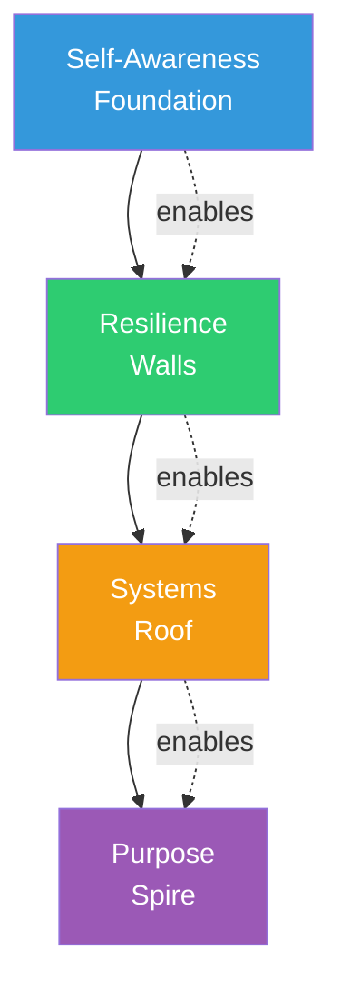
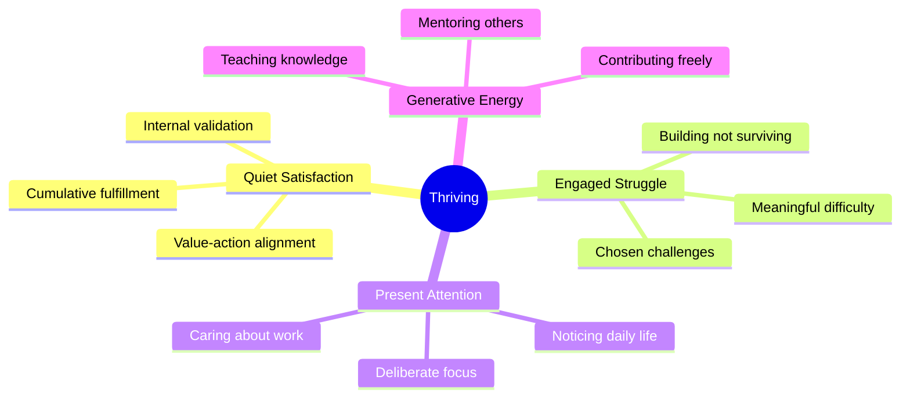
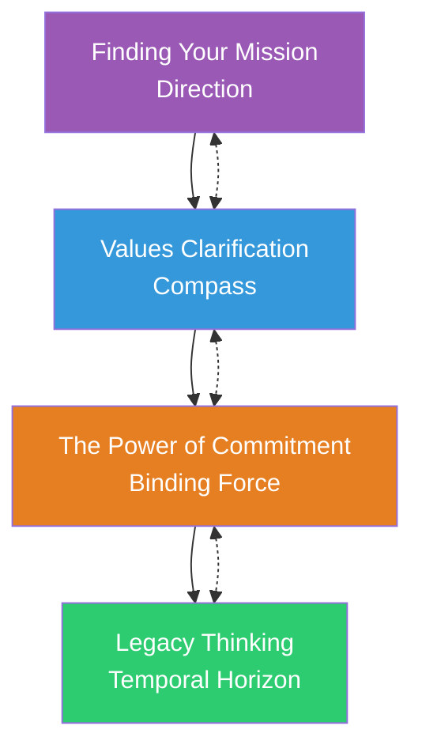
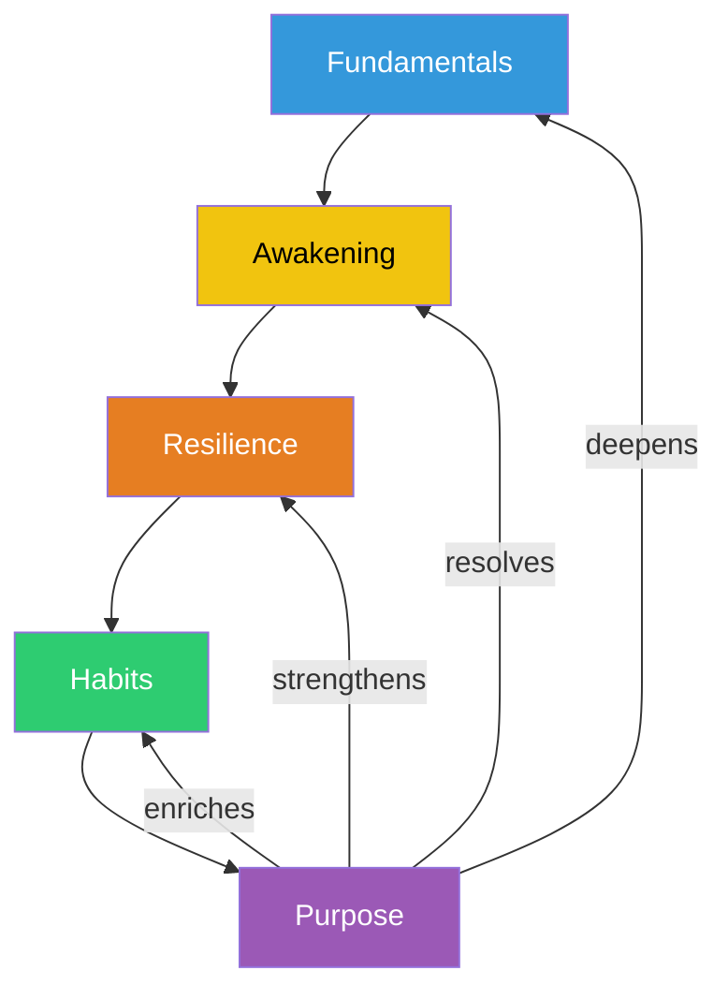

# What Is Thriving?

## Description

You have awakened to the void, rebuilt your capacity for change, and systematized your daily life so that progress is automatic. The foundation is solid. The systems are running. The question that remains is the one that brought you to this journey in the first place: What is this all for? Thriving is the stage where the existential work of the earlier phases — recognizing the void, building resilience, installing systems — finally points forward. You are no longer recovering from the lowest point. You are not just surviving. You have a direction, and you are moving in it. This document introduces the thriving module: what it means to find mission, clarify values, make binding commitments, and build something that outlasts you — and why the entire journey has been preparation for this moment.

## Prerequisites

- [Rebuilding Routines](../../habits/rebuilding-routines.md) — the daily structures that sustain you without willpower
- [Compounding Wins](../../habits/compounding-wins.md) — understanding how small actions create exponential change
- [The Decision to Change](../../meaning/the-decision-to-change.md) — the commitment that gave the journey its direction
- [Values Clarification](../values-clarification.md) — the core principles that guide your choices

## Table of Contents

- [What Changes at This Stage](#what-changes-at-this-stage)
- [From Recovery to Construction](#from-recovery-to-construction)
- [Why Purpose Comes Last](#why-purpose-comes-last)
- [What Thriving Actually Feels Like](#what-thriving-actually-feels-like)
- [What You Will Encounter in This Module](#what-you-will-encounter-in-this-module)
- [The Nature of Purpose](#the-nature-of-purpose)
- [How Thriving Connects to the Rest of the Journey](#how-thriving-connects-to-the-rest-of-the-journey)
- [The Developer's Thriving](#the-developers-thriving)
- [Learning Tips](#learning-tips)
- [Glossary](#glossary)
- [Quick References](#quick-references)
- [Next Steps](#next-steps)

## Content / Material

### What Changes at This Stage

Something shifts when you reach the thriving stage. The shift is subtle but unmistakable. For the first time since the journey began, the energy is not directed inward — at your patterns, your emotions, your habits, your wounds. It is directed outward — at the world, at the work, at the contribution you are here to make.

This is not a rejection of the inner work. The inner work continues. You still practice emotional regulation. You still maintain your support systems. You still honor your routines. But the inner work is no longer the primary focus. It is the maintenance layer — the infrastructure that supports the higher work of purpose, mission, and legacy.

The shift is from defense to offense. The earlier stages were defensive — surviving the void, rebuilding after collapse, protecting yourself from relapse. The thriving stage is offensive — building something, creating something, contributing something. The tools you built were not ends in themselves. They were preparation for this.

```python
# The shift from recovery to thriving
class ThrivingShift:
    def __init__(self):
        self.previous_stages = {
            "intro": "Survive the lowest point",
            "fundamentals": "Build cognitive tools",
            "awakening": "Recognize the void",
            "resilience": "Rebuild capacity",
            "habits": "Systematize daily life",
        }
        self.current_stage = {
            "purpose": "Build something that matters",
        }

    def energy_direction(self):
        return "From inward (self-repair) to outward (world-contribution)"
```

The shift is also emotional. The earlier stages were heavy — grief, fear, anger, shame, the daily grind of rebuilding. Thriving is lighter. Not happy in a superficial sense — happy in the sense of alignment. You are doing what you are meant to do. The satisfaction is quiet but deep. It does not announce itself. It accumulates.

This emotional shift can be modeled as a transition in the dominant cognitive mode. The earlier stages operated primarily in problem-solving mode — identifying what is broken, diagnosing the cause, applying a remedy. Thriving operates in creation mode — envisioning what could exist, designing the path to bring it into being, and executing with sustained attention. The cognitive resources that were consumed by self-monitoring and damage control are now available for generative work.


The diagram above illustrates the directional flow of the entire journey. Each stage is not merely a prerequisite but a transformation of the self that enables the next stage's particular mode of engagement. The shift at the thriving stage is the final transformation: from one who repairs to one who builds.

### From Recovery to Construction

The level-up journey has been, until now, primarily a journey of recovery. You recovered from the lowest point. You recovered from the autopilot. You recovered from the emotional flood. You recovered from the pattern of avoidance. Recovery is necessary. It is also incomplete. Recovery restores you to a baseline. It does not take you beyond it.

Construction begins where recovery ends. Recovery says: "I am no longer broken." Construction says: "I am building something." The transition from recovery to construction is the transition from surviving to thriving. It is the moment when the journey stops being about fixing what is wrong and starts being about creating what is right.

This transition is not a clean break. You do not finish recovering and then start constructing. The two overlap. You are still recovering from some things — old patterns still surface, emotional wounds still ache, setbacks still happen. But the dominant direction of your life has shifted. You are no longer primarily defined by what you are recovering from. You are defined by what you are building toward.

```python
# Recovery vs. construction
def recovery_vs_construction():
    recovery = {
        "focus": "What is wrong?",
        "energy": "Inward — self-repair",
        "goal": "Return to baseline",
        "emotional_tone": "Heavy — grief, fear, effort",
        "time_orientation": "Past — processing what happened",
    }

    construction = {
        "focus": "What is possible?",
        "energy": "Outward — world-contribution",
        "goal": "Build something new",
        "emotional_tone": "Light — alignment, purpose, satisfaction",
        "time_orientation": "Future — creating what could be",
    }

    return "The journey moves from recovery to construction, from surviving to thriving"
```

The transition between these two modes is rarely instantaneous. It emerges gradually as the cumulative effect of consistent daily action. One morning you realize that the code you are writing is not just filling a ticket — it is solving a problem you genuinely care about. One conversation with a mentee reveals that your experience has value beyond your own career. These moments accumulate until the construction mode becomes dominant.

There is a useful analogy in software architecture. Recovery is like debugging — finding and fixing defects in an existing system. Construction is like greenfield development — designing and building something new. Both require skill, but they engage different capacities. A developer who has spent years debugging will find that the skills transfer: the analytical precision, the patience with ambiguity, the systematic elimination of variables. But greenfield work requires additional capacities — vision, creativity, the willingness to make decisions without complete information. The thriving stage demands both.

The transition from recovery to construction also manifests in how you relate to time. Recovery is backward-looking — you are processing what happened, understanding why the collapse occurred, making sense of the damage. Construction is forward-looking — you are imagining what does not yet exist and working to bring it into being. The temporal orientation shifts from past to future, and with it, the emotional register shifts from grief and processing to anticipation and creation.

This temporal shift has practical implications for how you allocate your attention. In recovery, the mind naturally gravitates toward rumination — replaying past events, analyzing mistakes, rehearsing regrets. In construction, the mind is drawn toward design — envisioning outcomes, planning sequences, iterating on prototypes. The habits you installed in the systematizing stage are critical here: they provide the structural container that allows the forward-looking work to proceed even when the backward-looking pull is strong.

### Why Purpose Comes Last

The level-up journey is sequenced deliberately. Purpose comes last — not because it is the most important stage (each stage is essential), but because purpose cannot be pursued effectively without the capacities built in the earlier stages.

**Purpose requires self-awareness.** You cannot find what matters if you do not know who you are. The self-awareness built in fundamentals is the foundation of purpose. Without it, you will mistake other people's values for your own. You will pursue goals that look impressive but feel hollow. You will build someone else's dream and call it yours.

**Purpose requires resilience.** The pursuit of purpose is long, uncertain, and full of setbacks. Without the resilience built in the rebuilding module, you will abandon the pursuit at the first sign of difficulty. Purpose is not a destination you arrive at. It is a direction you maintain through adversity.

**Purpose requires systems.** Without the habits built in the systematizing module, the pursuit of purpose depends on willpower. Willpower fails. Systems persist. The daily routines that make progress automatic are what sustain the pursuit of purpose through the inevitable periods of low motivation.

**Purpose requires the awakening.** The awakening showed you the void. The void showed you that your current way of living is not enough. Purpose is the answer to the void. But you cannot appreciate the answer without first experiencing the question. The awakening created the opening that purpose fills.

```python
# Why purpose needs everything else
def purpose_prerequisites():
    return {
        "self_awareness": "You must know who you are before you can know what matters",
        "resilience": "You must be able to endure difficulty before you can pursue meaning through it",
        "systems": "You must have automatic routines before purpose can be sustained without willpower",
        "awakening": "You must have experienced the void before purpose has emotional weight",
    }
```

The sequencing also reflects a deeper principle: purpose is not a decoration applied on top of an unstable foundation. It is the capstone of an architectural process. Each prior stage laid a structural element — self-awareness provided the foundation, resilience provided the walls, habits provided the roof. Purpose is the spire that gives the structure its identity and direction. Without the structure beneath it, the spire collapses.



Consider what happens when developers attempt to find purpose without the prerequisite stages. They may articulate grand visions but lack the self-awareness to know whether those visions are authentic. They may commit to ambitious goals but lack the resilience to endure the inevitable setbacks. They may schedule ambitious work but lack the systems to sustain effort through low-motivation periods. The result is a pattern common in the industry: enthusiastic beginnings followed by silent abandonment. The sequencing is not arbitrary — it is protective.

### What Thriving Actually Feels Like

Thriving is not a constant state. It is a practice. Some days you feel it clearly — the quiet satisfaction of knowing what you are meant to do and doing it. Other days you return to survival mode — the routines carry you, but the sense of purpose is distant. The difference between thriving and surviving is not the absence of bad days. It is the presence of direction.

The markers of thriving are subtle:

**Quiet satisfaction.** Not excitement — satisfaction. The feeling that your work matters, that your life is adding up to something, that the direction you are moving in is the right one. The satisfaction is not dependent on external validation. It comes from the alignment between your values and your actions.

**Engaged struggle.** Thriving does not mean the absence of difficulty. It means the presence of meaningful difficulty. The challenges you face are challenges you chose — not because they are easy, but because they matter. The struggle is engaging rather than draining. You are not fighting to survive. You are fighting to build.

**Present attention.** You are more present in your daily life. The autopilot has been replaced by deliberate attention. You notice the code you write, the people you interact with, the world around you. The noticing is not effortful — it is the natural result of caring about what you are doing.

**Generative energy.** You have energy to give. Not just to your own work, but to others. You mentor. You teach. You contribute. The generative energy comes from the surplus created by alignment — when your values, your work, and your daily life are coherent, there is energy left over.

```python
# What thriving feels like
class ThrivingExperience:
    def __init__(self):
        self.markers = {
            "quiet_satisfaction": "Alignment between values and actions",
            "engaged_struggle": "Challenges you chose because they matter",
            "present_attention": "Noticing life instead of watching it",
            "generative_energy": "Surplus energy to give to others",
        }

    def not_thriving(self):
        return {
            "constant_excitement": "Thriving is not euphoria",
            "absence_of_difficulty": "Thriving includes struggle",
            "perfect_consistency": "Some days are harder than others",
            "external_validation": "Thriving is internal, not performative",
        }
```

It is important to distinguish thriving from the popular notion of "having it all figured out." Thriving does not imply certainty. You may not know exactly where your career is heading in five years. You may not have a neat narrative that explains your life's trajectory. What you have is a direction — a sense of what matters and a commitment to moving toward it. The uncertainty is tolerable because the direction is clear.

Thriving also has a social dimension. When you are thriving, your relationships change. Not because you become a different person, but because you bring more of yourself to your interactions. You are less defensive, more curious, more willing to listen. You have the internal resources to be present for others rather than being consumed by your own struggles. This presence is itself a form of contribution — one that often goes unrecognized but is deeply felt by those around you.



### What You Will Encounter in This Module

This module contains four documents, each addressing a core component of thriving.

**Finding Your Mission** is the foundation. It covers the process of discovering what you are meant to do — not by looking outward for the "right" answer, but by looking inward at what you are already drawn to. It covers the relationship between mission and identity, how to distinguish between a mission and a goal, and why mission is a direction, not a destination.

**Values Clarification** addresses the compass. It covers the process of identifying the core principles that guide your choices — what you stand for, what you will not compromise, and what gives your life coherence. It covers the difference between stated values and lived values, how to discover values through experience rather than introspection, and why values are the foundation of sustainable purpose.

**The Power of Commitment** addresses the binding mechanism. It covers why commitments — real commitments, not wishes — are necessary for purpose to become real. It covers the difference between a goal and a commitment, why commitments require sacrifice, and how the decision to commit transforms abstract direction into concrete action.

**Legacy Thinking** addresses the long game. It covers how to build something that outlasts you — not in the sense of fame or recognition, but in the sense of contribution that continues after you are gone. It covers the relationship between legacy and mortality, why thinking about death clarifies life, and how legacy is built through daily actions rather than grand gestures.

Together, these four documents complete the level-up journey. They take the capacities you have built — self-awareness, resilience, systems — and direct them toward the question that brought you here: What is this all for?

The four components are interdependent. Mission provides direction; values provide the compass that keeps the direction honest; commitment provides the binding force that converts intention into sustained action; and legacy provides the temporal horizon that gives the entire enterprise its weight. Remove any one of these, and the structure weakens. A mission without values becomes ambition untethered from principle. Values without commitment remain abstract ideals. Commitment without legacy becomes short-term hustle. Legacy without mission becomes drift dressed in respectability.



Each document in the module provides both conceptual grounding and practical methodology. You will find frameworks for reflection, exercises for self-discovery, and decision-making models drawn from both philosophy and software engineering. The integration is deliberate: the developer's mindset — systematic, iterative, evidence-based — is a powerful tool for the work of purpose when applied with the right spirit.

### The Nature of Purpose

Purpose is widely misunderstood. Popular culture presents it as a revelation — a single, dramatic moment of clarity when you discover what you were born to do. This is a myth. Purpose is not discovered in a moment. It is constructed through years of faithful attention to what matters.

**Purpose is a direction, not a destination.** You do not "arrive" at purpose. You move in a direction that feels meaningful. The direction may shift over time. The specifics may change. But the underlying orientation — toward meaning, toward contribution, toward alignment — remains constant.

**Purpose is found, not invented.** This is a subtle but important distinction. You do not create purpose through an act of will. You discover it through attention — by noticing what you are drawn to, what energizes you, what feels like it matters. The discovery requires patience, humility, and the willingness to follow curiosity without knowing where it leads.

**Purpose is personal, not universal.** There is no single purpose that applies to everyone. Your purpose is specific to you — your values, your gifts, your circumstances, your history. Comparing your purpose to someone else's is as meaningless as comparing your fingerprints. The only relevant question is: what is meaningful to you?

**Purpose is dynamic, not static.** Your purpose will evolve as you evolve. What felt meaningful at twenty-five may not feel meaningful at forty. What felt purposeful in one phase of life may feel hollow in another. This is not failure. It is growth. Purpose that cannot evolve is a cage, not a compass.

**Purpose requires courage.** Pursuing what matters inevitably involves risk — the risk of failure, the risk of judgment, the risk of discovering that your purpose conflicts with the expectations of those around you. The courage required is not dramatic or heroic. It is the quiet courage of choosing authenticity over approval, of continuing when the outcome is uncertain, of tolerating the discomfort of being misunderstood.

```python
# The nature of purpose
def purpose_nature():
    return {
        "not_a_revelation": "Purpose is constructed through years of faithful attention",
        "a_direction": "You move toward meaning, you do not arrive at it",
        "found_not_invented": "Discovered through attention, not created through will",
        "personal": "Specific to you — your values, gifts, circumstances",
        "dynamic": "Evolves as you evolve",
        "requires_courage": "Pursuing meaning involves risk and uncertainty",
    }
```

The distinction between purpose as direction and purpose as destination has practical consequences for developers. A developer who treats purpose as a destination will chase job titles, salary milestones, or public recognition — and find that each achievement provides only temporary satisfaction before the hunger returns. A developer who treats purpose as direction will find satisfaction in the daily practice of meaningful work — writing code that solves real problems, mentoring colleagues, contributing to tools that others depend on. The direction sustains; the destination exhausts.

### How Thriving Connects to the Rest of the Journey

Thriving is the culmination of the level-up journey, but it is not the end. The journey is circular, not linear. The capacities you build in thriving — mission, values, commitment, legacy — feed back into every earlier stage.

**Thriving → Fundamentals.** Purpose deepens self-awareness. When you know what matters to you, you see yourself more clearly. The mental models from fundamentals are enriched by the direction that purpose provides. The foundation is not left behind — it is deepened.

**Thriving → Awakening.** Purpose answers the void. The existential vacuum that triggered the awakening is resolved — not by filling it with distraction, but by directing it toward meaning. The void was the question. Purpose is the answer.

**Thriving → Resilience.** Purpose strengthens resilience. When you know why you are enduring, endurance becomes easier. The pain of setbacks is reduced when the setback is in service of something meaningful. Resilience without purpose is survival. Resilience with purpose is perseverance.

**Thriving → Habits.** Purpose gives habits meaning. The routines that felt mechanical in the systematizing stage now feel purposeful. You are not just maintaining habits — you are maintaining the infrastructure that serves your mission. The habits are no longer ends in themselves. They are the means through which purpose is expressed.

```python
# The circular journey
def journey_circularity():
    return {
        "fundamentals → purpose": "Self-awareness reveals values → values define purpose",
        "purpose → fundamentals": "Purpose deepens self-awareness → deeper tools",
        "awakening → purpose": "The void creates the question → purpose answers it",
        "purpose → awakening": "Purpose resolves the void → no more vacuum",
        "resilience → purpose": "Resilience enables perseverance → through difficulty",
        "purpose → resilience": "Purpose strengthens resilience → because why matters",
        "habits → purpose": "Habits sustain daily action → action serves mission",
        "purpose → habits": "Purpose gives habits meaning → not just routine",
    }
```

This circularity has a practical implication: you will never be "done." The journey does not terminate at thriving. You will cycle through earlier stages repeatedly — encountering new forms of the void, building new resilience, installing new systems — and each cycle deepens the purpose that emerges from it. The metaphor is not a ladder but a spiral, each revolution passing through the same territory at a higher altitude.



Understanding this circularity protects against a common pitfall: the assumption that reaching the thriving stage means the earlier work is complete. It is not. Self-awareness deepens throughout life. Resilience is tested by new challenges. Systems require maintenance and adaptation. What changes is not the presence of these capacities but their automaticity — they operate as background processes while purpose occupies the foreground.

### The Developer's Thriving

Developers experience thriving through profession-specific pathways. Understanding these pathways helps you direct the thriving stage toward contribution.

**The builder's purpose.** Developers are builders. The deepest satisfaction comes not from completing tickets or closing PRs, but from building something that works — something elegant, something useful, something that outlasts the sprint. The builder's purpose is to create. The thriving stage asks: what is worth building? Not what pays the most, not what looks impressive on LinkedIn, but what matters?

**The mentor's purpose.** Senior developers often discover that their purpose shifts from building systems to building people. The mentoring relationship — guiding a junior engineer through their first production incident, helping a colleague see their own blind spots, sharing hard-won wisdom — provides a kind of satisfaction that code alone cannot. The mentor's purpose is to multiply their impact through others.

**The open-source purpose.** Contributing to open source is one of the most direct expressions of purpose for developers. You build tools that help people you will never meet. You contribute to a gift economy that operates outside the logic of markets and corporations. The open-source purpose is to give freely and build community.

**The educational purpose.** Many developers discover that their purpose is teaching — writing documentation, creating tutorials, explaining complex concepts in simple terms. The educational purpose is to make knowledge accessible. It is the developer's version of the hero's journey's final stage: returning with the elixir.

**The systemic purpose.** Some developers find purpose in changing the systems themselves — advocating for better engineering practices, pushing for ethical technology, working on software that addresses real problems rather than manufactured ones. The systemic purpose is to improve the industry, not just participate in it.

These five purpose pathways are not mutually exclusive. Most developers experience a combination of them, with different pathways dominant at different stages of their career. A junior developer may be primarily motivated by the builder's purpose — the sheer joy of creating something that works. As they gain experience, the mentor's purpose may emerge. Later, the systemic purpose may take precedence as they witness the consequences of poor technology decisions at scale.

```python
# Developer purpose pathways
class DeveloperPurpose:
    def __init__(self):
        self.pathways = {
            "builder": "Create elegant, useful things that outlast sprints",
            "mentor": "Multiply impact through developing others",
            "open_source": "Contribute to the gift economy of shared tools",
            "educator": "Make knowledge accessible and multiply understanding",
            "systemic": "Improve the industry's practices and ethics",
        }

    def dominant_pathway(self, career_stage):
        progressions = {
            "early": "builder",
            "mid": "mentor",
            "senior": "systemic",
        }
        return progressions.get(career_stage, "builder")

    def purpose_is_not(self):
        return {
            "not_salary": "Compensation sustains life but does not define purpose",
            "not_titles": "Hierarchy is organizational, not existential",
            "not_popularity": "Recognition is external; purpose is internal",
        }
```

## Learning Tips

**Do not rush to find your mission.** The temptation is to treat this module as a problem to be solved — to find the answer quickly and move on. Resist this. Purpose is discovered through attention, not through urgency. Give yourself time. Follow curiosity. Let the mission reveal itself.

**Pay attention to what energizes you.** Purpose is signaled by energy. When you do something that matters to you, you feel energized — not excited in a superficial sense, but engaged in a deep sense. When you do something that does not matter, you feel drained. The energy signal is reliable. Follow it.

**Notice what you would do for free.** The things you would do even without compensation are strong signals of purpose. You write code on weekends. You explain concepts to colleagues. You tinker with side projects. You read about topics that have nothing to do with your job. These are not hobbies. They are hints.

**Test purpose through action, not introspection.** You cannot think your way to purpose. You must act your way there. Try things. Volunteer. Teach. Build. Contribute. The purpose emerges from the doing, not from the thinking. Action is the experiment. Purpose is the result.

**Accept that purpose evolves.** What feels meaningful today may not feel meaningful in five years. This is not failure. It is growth. The purpose you discover now is the purpose for this season of your life. When the season changes, the purpose will change with it.

**Build purpose into your daily life.** Purpose is not a grand gesture. It is a daily practice. Write one line of code that matters. Help one person. Teach one concept. Build one thing. The cumulative effect of daily purposeful action is a life of meaning.

**Distinguish between urgency and importance.** The thriving stage is susceptible to a particular trap: confusing what is urgent with what is purposeful. The inbox is urgent. The mission is important. The deployment is urgent. The mentorship is important. Practice the discipline of protecting important-but-not-urgent work from the gravitational pull of immediate demands. This is where your habit systems prove their value.

**Keep a purpose journal.** At the end of each week, write three sentences: what I did that mattered this week, what drained me, and what I want to do more of. Over months, the patterns become visible. The journal is not introspection for its own sake — it is data collection for the experiment of purpose. Treat it as you would a log file: systematic, honest, and reviewed regularly.

**Beware of purpose envy.** Other developers' purpose will look more impressive than yours. The open-source maintainer with thousands of stars. The conference speaker with a devoted following. The startup founder changing an industry. Their purpose is not your purpose. Comparison is a distortion mechanism that obscures your own signals. Return to your own data: what energizes you, what you would do for free, what matters to you specifically.

**Allow for fallow periods.** Not every season is a planting season. There will be periods when purpose feels distant and motivation is low. These fallow periods are not failures — they are part of the natural cycle of growth. The systems you built in the habits stage carry you through them. Trust that the purpose will re-emerge when the conditions are right.

## Glossary

| Term | Definition |
|------|------------|
| Commitment | A binding decision that transforms abstract direction into concrete action |
| Construction mode | The cognitive state of building something new, as opposed to repairing what is broken |
| Direction | The orientation toward meaning, contribution, and alignment that defines purpose |
| Engaged struggle | Difficulty that is meaningful because it serves something you care about |
| Generative energy | The surplus energy that comes from alignment between values and actions |
| Legacy | The contribution that outlasts you — built through daily actions, not grand gestures |
| Mission | The specific expression of your purpose — what you are here to do |
| Purpose | The direction that gives your life coherence and meaning |
| Purpose envy | The distortion that occurs when comparing one's own purpose to another's |
| Purpose pathway | The profession-specific channel through which purpose is expressed |
| Quiet satisfaction | The deep, internal feeling of alignment that characterizes thriving |
| Recovery mode | The cognitive state of repairing damage and returning to baseline |
| Values | The core principles that guide your choices — what you stand for and will not compromise |

## Quick References

- [Frankl, V. (1946). Man's Search for Meaning](https://www.goodreads.com/book/show/4069.Man_s_Search_for_Meaning) — the will to meaning and the search for purpose in suffering
- [Sinek, S. (2009). Start with Why](https://www.goodreads.com/book/show/6942853-start-with-why) — on finding purpose through understanding your "why"
- [Kouzes, J. & Posner, B. (2017). The Leadership Challenge](https://www.goodreads.com/book/show/30559188-the-leadership-challenge) — on purpose through service and contribution
- [Wrzesniewski, A. (2001). Calling vs. Career](https://www.gsb.stanford.edu/faculty-research/publications/calling-vs-career) — research on how people find purpose in work
- [Damasio, A. (1994). Descartes' Error](https://www.goodreads.com/book/show/16020.Descartes_Error) — on the role of emotion in decision-making and purpose
- [Csikszentmihalyi, M. (1990). Flow](https://www.goodreads.com/book/show/5840.Flow) — on the experience of engaged, purposeful activity
- [Harris, R. (2009). ACT Made Simple](https://www.goodreads.com/book/show/6911039-act-made-simple) — Acceptance and Commitment Therapy on values-based living
- [Pressfield, S. (2002). The War of Art](https://www.goodreads.com/book/show/1319.The_War_of_Art) — on overcoming resistance and committing to meaningful work

## Next Steps

- [Finding Your Mission](../finding-your-mission.md) — the process of discovering what you are here to do
- [Values Clarification](../values-clarification.md) — identifying the core principles that guide your choices
- [The Power of Commitment](../the-power-of-commitment.md) — making binding commitments that make purpose real
- [Legacy Thinking](../legacy-thinking.md) — building for the long game
- [The Level-Up Philosophy](../../intro/the-level-up-philosophy.md) — revisiting the framework with the depth of the full journey behind you
- [The Lowest Point](../../intro/the-lowest-point.md) — revisiting the beginning with the wisdom of the end
