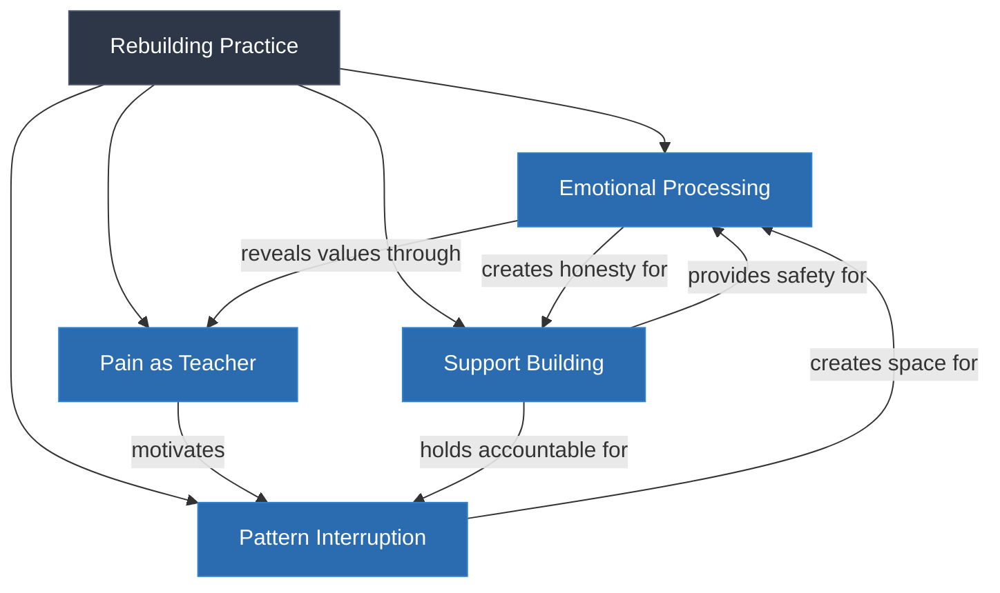
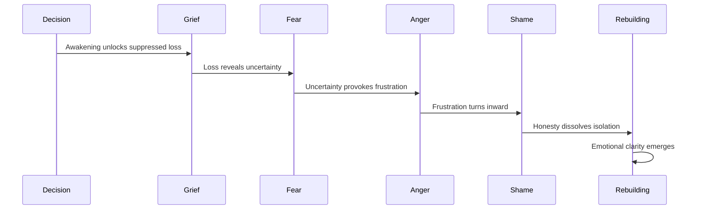
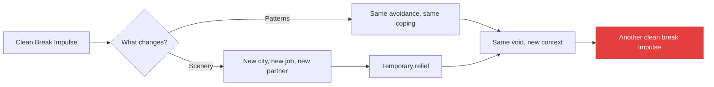

# What Is Rebuilding?

## Description

You have crossed the threshold. You recognized the void, and you decided to change. The decision is real. The commitment is made. But the decision to change does not change anything by itself — it creates intention, not capacity. Rebuilding is the stage where intention meets the brute force of reality. It is the daily, unglamorous work of getting back up after life has knocked you down, of learning to regulate emotions that the awakening has unleashed, of building relationships that carry you when you cannot carry yourself, and of discovering that pain itself can be a source of growth. This document introduces the rebuilding module: what it means to recover after the decision to change, why recovery is harder than the decision, and how the tools you built in the earlier modules serve you in the hardest phase of the journey.

## Prerequisites

- [The Decision to Change](../../meaning/the-decision-to-change.md) — the commitment that makes rebuilding necessary
- [Recognizing the Void](../../meaning/recognizing-the-void.md) — the experience that makes rebuilding meaningful
- [When Everything Stops](../../fundamentals/when-everything-stops.md) — surviving the acute phase of collapse
- [Navigating Setbacks](../../fundamentals/navigating-setbacks.md) — frameworks for understanding why you fall back

## Table of Contents

- [After the Decision](#after-the-decision)
- [Why Rebuilding Is the Hardest Stage](#why-rebuilding-is-the-hardest-stage)
- [The Gap Between Decision and Capacity](#the-gap-between-decision-and-capacity)
- [What Rebuilding Actually Looks Like](#what-rebuilding-actually-looks-like)
- [The Emotional Flood](#the-emotional-flood)
- [The Myth of the Clean Break](#the-myth-of-the-clean-break)
- [What You Will Encounter in This Module](#what-you-will-encounter-in-this-module)
- [How Rebuilding Connects to the Rest of the Journey](#how-rebuilding-connects-to-the-rest-of-the-journey)
- [The Developer's Rebuilding](#the-developers-rebuilding)
- [Learning Tips](#learning-tips)
- [Glossary](#glossary)
- [Quick References](#quick-references)
- [Next Steps](#next-steps)

## Content / Material

### After the Decision

The decision to change is a threshold moment — the instant when passive awareness becomes active commitment. You have crossed it. You said, out loud or to yourself, that things must be different. You meant it. The will to meaning reasserted itself over the will to comfort, and for a moment, everything felt possible.

Then Monday morning arrived.

The alarm went off. You got up. You brushed your teeth. You made coffee. You opened your laptop. You attended standup. You wrote code. You went through the same motions you have been going through for years. The decision to change did not rewrite your morning routine. It did not restructure your relationships. It did not heal the wounds that the awakening exposed. It sat in your chest like a seed — planted, but not yet grown.

This is the normal experience after the decision. The decision creates a gap between where you are and where you intend to be. The gap is not a failure of the decision. It is the space in which rebuilding happens. The decision is the starting gun. Rebuilding is the race.

```python
# The post-decision reality
class PostDecisionState:
    def __init__(self):
        self.decision_made = True
        self.life_changed = False
        self.gap = "enormous"

    def what_happens_next(self):
        return {
            "day_1": "Motivation is high. The decision feels powerful.",
            "day_7": "Motivation fades. The old routines reassert themselves.",
            "day_30": "The decision feels distant. The old self argues loudly.",
            "day_90": "Either the decision has become action, or it has been abandoned.",
        }
```

The period after the decision is the most vulnerable moment in the entire level-up journey. You are exposed. The old self knows you are trying to change and fights harder than ever. The new self has intention but no track record. You are between identities — no longer the person you were, not yet the person you are becoming. This in-between state is where most people give up. The rebuilding module exists to prevent that.

### Why Rebuilding Is the Hardest Stage

Every stage of the level-up journey has its characteristic difficulty. The intro confronts you with the lowest point. The fundamentals build cognitive tools. The awakening forces existential recognition. Each is hard in its own way. But rebuilding is the hardest because it is the most sustained, the least dramatic, and the most invisible.

**It is sustained.** The awakening is intense but brief. The decision is a moment. Rebuilding is months, years, a lifetime. There is no finish line. There is no moment when you are done rebuilding. The practice of recovery — emotional regulation, support, growth through pain — is not a phase you complete. It is a capacity you develop and maintain.

**It is undramatic.** The awakening produces moments of clarity, grief, fear, and relief. These are emotionally vivid. Rebuilding produces Tuesday. It produces routine. It produces the slow, incremental work of showing up day after day without the dramatic emotional payoff of the earlier stages. Nobody writes memoirs about the year they went to therapy and exercised three times a week. But that year is where the actual change happens.

**It is invisible.** The decision to change can be spoken aloud. The awakening can be described. Rebuilding is mostly internal — the quiet work of processing emotions, building trust, developing new patterns. There is no external signal that you are rebuilding. No badge, no metric, no performance review. The progress is real but invisible to everyone except you.

```python
# Why rebuilding is hard
class RebuildingDifficulty:
    def __init__(self):
        self.factors = {
            "sustained": "months to years, not a single moment",
            "undramatic": "Tuesday, not transformation",
            "invisible": "internal work with no external signal",
            "ungratifying": "delayed results, immediate discomfort",
        }

    def compared_to_other_stages(self):
        return {
            "intro": "Painful but brief — the shock of recognition",
            "fundamentals": "Intellectual — engaging but not threatening",
            "awakening": "Emotionally intense but clear — you know what is happening",
            "rebuilding": "Daily grind — no drama, no clarity, just work",
        }
```

The difficulty is also compounded by the fact that rebuilding follows the awakening. After the intensity of recognizing the void and deciding to change, the quiet work of rebuilding feels anticlimactic. You expected transformation. You got Tuesday. The gap between expectation and reality is itself a source of discouragement.

### The Gap Between Decision and Capacity

The decision to change creates an intention. But intention is not capacity. You may decide to regulate your emotions, but you do not yet have the skills. You may decide to build a support system, but you do not yet have the relationships. You may decide to grow through pain, but you do not yet have the resilience. The decision is the blueprint. Rebuilding is the construction.

This gap between decision and capacity is one of the most common sources of failure in personal transformation. People make the decision, expect immediate change, discover that the capacity is not there, and conclude that the decision was wrong or that they are incapable of change. Neither conclusion is correct. The decision was right. The capacity simply needs to be built.

The fundamentals module prepared you for this. It taught you that change happens through cycles, not straight lines. It taught you that the knowing-doing gap is real and must be bridged through practice. It taught you that procedural knowledge — the kind that lives in your reflexes, not just your intellect — requires repetition, feedback, and time. Rebuilding is where these lessons become literal.

```python
# Decision vs. capacity
def decision_capacity_gap():
    decision = {
        "what": "I will change my life",
        "when": "now",
        "cost": "none — it is just a thought",
    }

    capacity = {
        "what": "I can change my life",
        "when": "after months of practice",
        "cost": "discomfort, time, vulnerability, persistence",
    }

    return {
        "decision": decision,
        "capacity": capacity,
        "gap": "rebuilding fills this gap with practice",
    }
```

The gap is not a problem to be solved. It is a space to be inhabited. You live in the gap while you build the capacity. The discomfort of the gap — knowing what you want but not yet being able to do it — is the discomfort of growth. It is the feeling of a muscle being built. It is supposed to hurt.

### What Rebuilding Actually Looks Like

Rebuilding is not a single activity. It is a cluster of practices that, together, build the capacity to sustain the change you committed to.

**Emotional processing.** The awakening unleashed emotions that were previously suppressed or unrecognized. Grief, fear, anger, shame — these emotions do not disappear after the decision. They need to be processed, not once but continuously. Emotional processing means feeling the emotion fully, understanding its source, and choosing a response rather than reacting. This is the work of emotional regulation — not suppression, not expression, but processing.

**Support building.** The old self thrives in isolation. The new self needs community. Rebuilding means actively constructing the relationships that will carry you through the journey. This is not about networking or socializing. It is about finding people who will tell you the truth, witness your struggle, and hold you accountable to your decision.

**Pattern interruption.** The old patterns — the autopilot, the distraction, the avoidance — do not disappear because you decided to change. They must be actively interrupted. Each time the old pattern surfaces, you must recognize it, name it, and choose a different response. This is exhausting. It is also necessary. The patterns took years to build. They will take months to dismantle.

**Pain as teacher.** The pain that the awakening exposed — the existential pain of meaninglessness, the emotional pain of grief, the relational pain of isolation — does not have to be wasted. Pain can be a teacher. It shows you what matters. It reveals your values. It strengthens your capacity for endurance. The rebuilding module teaches you how to learn from pain without being destroyed by it.

```python
# What rebuilding looks like
class RebuildingPractice:
    def __init__(self):
        self.practices = {
            "emotional_processing": "Feel → understand → choose response",
            "support_building": "Find truth-tellers → be vulnerable → maintain",
            "pattern_interruption": "Recognize → name → choose different response",
            "pain_as_teacher": "Feel pain → extract lesson → integrate wisdom",
        }

    def daily_reality(self):
        return [
            "Morning: remind yourself of the decision",
            "Day: interrupt old patterns as they arise",
            "Evening: process the day's emotions",
            "Weekly: check in with your support system",
            "Monthly: assess progress without judgment",
        ]
```

These four practices do not operate in isolation. They interact and reinforce each other. Emotional processing makes support building easier — you cannot be honest with others if you are not honest with yourself. Pattern interruption creates space for emotional processing — when the autopilot is disrupted, you have a moment to feel rather than react. Pain as teacher transforms the difficulty of pattern interruption from pointless suffering into meaningful struggle. The practices are a system, not a checklist.



The interconnected nature of these practices means that progress in any one area accelerates progress in the others. Conversely, neglecting one area creates a drag on all the others. This is why rebuilding requires a holistic approach — addressing only emotional regulation while ignoring support systems produces fragile recovery. The system must be built as a system.

### The Emotional Flood

The awakening cracks open emotions that have been sealed for years. In the days and weeks after the decision, you may experience an intensity of feeling that is unfamiliar and overwhelming. This is the emotional flood — the release of everything you have been holding down.

The flood is not a sign that something is wrong. It is a sign that the awakening is working. The emotions were always there. They were suppressed, numbed, or avoided. Now they have permission to surface. The permission comes from the decision — you decided to change, and the emotions heard you.

**Grief floods first.** You grieve for the years lost to autopilot. For the relationships that were shallow. For the work that was hollow. For the version of yourself that believed the false narratives. The grief can be sudden and intense — triggered by a song, a memory, a moment of unexpected beauty or sadness. Let it come. Grief is not a sign of weakness. It is the emotion of loss, and you have lost something real.

**Fear floods second.** After the grief, fear arrives. What if the change does not work? What if you are fundamentally broken? What if the void cannot be filled? The fear is not irrational — you are facing genuine uncertainty. But the fear is also not a reason to stop. It is a companion on the journey. The philosopher Kierkegaard wrote about anxiety as "the dizziness of freedom" — the fear that comes when you realize you are genuinely free to choose, and that your choices have real consequences.

**Anger floods third.** After the fear, anger arrives. You are angry at the systems that sold you false narratives. Angry at yourself for believing them. Angry at the industry that optimized you for productivity while ignoring your humanity. Anger is energizing — it can fuel the work of rebuilding. But it can also become a trap. Anger is comfortable. It provides a sense of moral clarity that the messier emotions do not. Do not let anger become your primary mode. Use it as fuel, then let it go.

**Shame floods last.** The deepest flood is shame. Shame for having so much and feeling so empty. Shame for struggling when others have "real" problems. Shame for being unable to maintain the pretense that was holding your life together. Shame is the most isolating emotion — it convinces you that you are the only person who has ever felt this way. You are not. Shame thrives in silence. The antidote is honesty.

```python
# The emotional flood sequence
class EmotionalFlood:
    def __init__(self):
        self.sequence = [
            ("grief", "for the years lost to autopilot"),
            ("fear", "of the uncertainty ahead"),
            ("anger", "at the false narratives you believed"),
            ("shame", "for having so much and feeling so empty"),
        ]

    def navigate(self, emotion):
        return {
            "grief": "Let it come. Grief is the emotion of loss, and you have lost something real.",
            "fear": "Name it. Fear is the companion of freedom, not its enemy.",
            "anger": "Use it as fuel, then let it go. Anger is energizing but not sustaining.",
            "shame": "Tell someone. Shame dies in honesty.",
        }[emotion]
```

The sequence is not rigid. Some people experience anger before fear. Some experience shame before grief. The order matters less than the recognition: each emotion has a function, and each must be processed rather than suppressed. The flood is a passage, not a permanent state. It recedes as the emotions are processed, leaving behind a clearer emotional landscape — one in which you can feel without being overwhelmed.



The flood also interacts with the body. Suppressed emotions are not merely psychological — they are stored physiologically. Grief may manifest as chest tightness. Fear may manifest as shallow breathing. Anger may manifest as jaw clenching. Shame may manifest as a pit in the stomach. The body keeps the score, as Van der Kolk documented. Processing the flood therefore requires attention to the body as well as the mind. Notice where emotions live in your physical form. Breathe into those places. The body must be included in the processing.

### The Myth of the Clean Break

One of the most destructive myths in personal transformation is the myth of the clean break — the idea that real change requires cutting ties with the old life. Quitting your job. Ending your relationship. Moving to a new city. Starting over from scratch.

The clean break is appealing because it promises a fresh start. But it is usually a mistake. The old self does not live in your job, your relationship, or your city. It lives in your patterns. You can move to the other side of the world and bring every single pattern with you. The void is in your luggage.

Rebuilding happens in the context of your existing life. You do not need to burn everything down. You need to rebuild within what you have — changing the patterns, not the scenery. This is harder than the clean break because it requires daily confrontation with the triggers and routines that feed the old self. But it is also more sustainable. The changes you make within your existing life are the changes that last, because they have been tested against reality.

```python
# The clean break myth
def clean_break_vs_rebuild():
    clean_break = {
        "approach": "Escape the context",
        "ease": "Feels easy — new environment, new start",
        "durability": "Low — patterns follow you",
        "risk": "High — you lose your support system",
    }

    rebuild_in_place = {
        "approach": "Change within the context",
        "ease": "Harder — daily confrontation with old triggers",
        "durability": "High — changes are tested against reality",
        "risk": "Lower — you keep your support system",
    }

    return "Rebuilding in place is harder but more lasting"
```

The clean break myth is particularly dangerous for developers because it aligns with a familiar pattern: when a codebase becomes unmaintainable, the instinct is to rewrite from scratch. The rewrite feels clean. The existing code feels contaminated. But experienced engineers know that rewrites rarely solve the underlying architectural problems — they merely transplant them into a new codebase. The same principle applies to personal transformation. The architecture of your life — your patterns, your avoidance strategies, your coping mechanisms — does not change when you change the scenery.



There is, however, a legitimate form of strategic withdrawal that differs from the clean break. Sometimes you do need to remove yourself from an environment that is actively harmful — a toxic workplace, an abusive relationship, a community that reinforces destructive patterns. The distinction is between fleeing from yourself and removing yourself from an obstacle. The test is simple: if you would carry the same patterns into a new context, the clean break is avoidance. If the context itself is preventing any possibility of change, the withdrawal is strategic. Rebuilding requires the wisdom to know the difference.

### What You Will Encounter in This Module

This module contains four documents, each addressing a core capacity of rebuilding.

**Getting Back Up** is the foundation. It covers the mechanics of recovery after the decision to change — how to restart after a setback, how to maintain momentum when motivation fades, and how to build the resilience that makes sustained change possible. It is the practical companion to the existential commitment you made in the awakening.

**Emotional Regulation** addresses the emotional flood directly. It covers how to process emotions without suppressing or being overwhelmed by them, how to distinguish between useful information and noise in your emotional responses, and how to build the capacity to sit with discomfort without reacting impulsively.

**Building a Support System** addresses the relational dimension. It covers how to find the people who will support your change, how to be vulnerable without being reckless, how to maintain relationships during a period of intense personal transformation, and how to build the community that makes sustained change possible.

**Growing Through Pain** addresses the integration. It covers how to learn from suffering rather than merely enduring it, how to transform pain into wisdom, and how to discover that the very experiences that nearly destroyed you can become the foundation of a stronger, more resilient self.

Together, these four documents build the capacity that the decision alone cannot provide. The decision is the intention. These documents are the construction manual.

### How Rebuilding Connects to the Rest of the Journey

Rebuilding is the bridge between the awakening and the rest of the journey. Without rebuilding, the decision to change remains an intention. With rebuilding, it becomes a reality.

**Rebuilding → Habits.** The capacities you build in rebuilding — emotional regulation, support systems, pain processing — need to be sustained through daily structures. Habits are the mechanisms that make the capacities automatic. Without habits, rebuilding requires constant willpower. With habits, rebuilding becomes the default.

**Rebuilding → Purpose.** The resilience you build in rebuilding is the foundation for purpose. Purpose requires the capacity to endure uncertainty, to persist through difficulty, and to maintain direction when the path is unclear. These capacities are built in the rebuilding module. Purpose is not possible without them.

**Rebuilding connects back to Fundamentals.** The self-awareness you built in fundamentals serves you directly in rebuilding. You cannot regulate emotions you do not notice. You cannot build support systems with people you cannot be honest with. You cannot grow through pain if you cannot see the lesson. Fundamentals is the foundation. Rebuilding is the first structure built on it.

```python
# The continuity
def rebuilding_connections():
    return {
        "from_fundamentals": "Self-awareness → emotional regulation",
        "from_awakening": "Decision → daily practice",
        "to_habits": "Rebuilding practices → automatic routines",
        "to_purpose": "Resilience → capacity for meaning",
    }
```

### The Developer's Rebuilding

Developers face specific challenges during the rebuilding phase. Understanding these challenges helps you anticipate them and respond effectively.

**The optimization trap.** Developers are trained to optimize. When they decide to rebuild, the instinct is to optimize the process — track metrics, measure progress, design efficient systems. This instinct is useful in some domains and destructive in others. Emotional regulation cannot be optimized. Support building cannot be A/B tested. The optimization trap turns rebuilding into another project to manage, another system to debug. Rebuilding is not a system. It is a practice. The difference matters.

**The debugging mindset applied to the self.** Developers are trained to debug — to treat failures as information, not as verdicts. This mindset is directly applicable to rebuilding. When a habit fails, when an emotional regulation technique does not work, when a relationship does not develop as expected — these are not verdicts on your worth. They are data about what approach did not work. Debug your rebuilding like you debug your code: with curiosity, not with judgment.

**The isolation of remote work.** Rebuilding requires community. Remote work makes community harder. The casual interactions that once provided social scaffolding — hallway conversations, lunch with colleagues, after-work drinks — are gone. Rebuilding a support system in a remote-first world requires deliberate effort. You must seek out connection rather than stumbling into it.

**The burnout overlap.** Developers who are rebuilding often discover that they are also burned out. The two conditions overlap but are not identical. Burnout is exhaustion of energy. Rebuilding is reconstruction of meaning. You can be burned out and rebuilding simultaneously, and the burnout can mask the rebuilding. If you are exhausted, address the exhaustion first. You cannot rebuild on an empty tank.

```python
# The developer's rebuilding map
class DeveloperRebuilding:
    def __init__(self):
        self.traps = {
            "optimization": {
                "instinct": "Track metrics for emotional progress",
                "reality": "Emotions resist quantification",
                "antidote": "Practice without measuring, at least initially",
            },
            "debugging_self": {
                "instinct": "Treat every setback as a bug to fix",
                "reality": "Some setbacks are part of the process, not defects",
                "antidote": "Distinguish between signal and noise in your failures",
            },
            "isolation": {
                "instinct": "Solve it alone — you are a problem-solver",
                "reality": "Rebuilding is inherently relational",
                "antidote": "Treat asking for help as a skill to develop, not a weakness",
            },
            "burnout_overlap": {
                "instinct": "Push through the exhaustion",
                "reality": "Exhaustion and meaninglessness feed each other",
                "antidote": "Address energy before meaning — rest is prerequisite",
            },
        }

    def navigate(self, trap_name):
        trap = self.traps[trap_name]
        return f"Recognize the instinct: {trap['instinct']}. Then: {trap['antidote']}"
```

**The comparison trap.** Developers are acutely aware of peer performance — through open-source contributions, conference talks, social media, and hiring pipelines. During rebuilding, the temptation to compare your internal reconstruction with someone else's external achievement is corrosive. You are rebuilding the foundation of your life. Others may appear to be building skyscrapers. But you cannot see their foundation. Comparison during rebuilding is not just the thief of joy — it is the thief of patience, and patience is the rebuilding module's most critical resource.

**The version control mindset.** One developer advantage in rebuilding is the version control mindset — the understanding that progress is iterative, that branches can be merged, and that rollback is always possible. You do not have to get it right the first time. You can experiment with an emotional regulation technique, discover it does not work, and try a different approach without having "failed." The commit history of your rebuilding will not be linear. It will have branches, merges, and occasional reverts. This is normal. This is how complex systems evolve.

## Learning Tips

**Start with the body.** The rebuilding module is about practice, not theory. Start with what your body needs. Sleep. Movement. Food. Water. These are not metaphors for resilience — they are its physical foundation. A body that is depleted cannot support the emotional work of rebuilding. Take care of the body first.

**Practice one thing at a time.** The rebuilding module covers four capacities: emotional regulation, support building, pattern interruption, and pain processing. Do not try to develop all four simultaneously. Pick one. Practice it for a month. Then add the next. The temptation to do everything at once is the same temptation that makes developers ship features without tests. It feels faster. It is catastrophic.

**Build the minimum viable support system.** You do not need a large community. You need two or three people who will tell you the truth. Start there. One person who you can be honest with is worth more than a hundred acquaintances.

**Expect the flood.** The emotional flood is normal. It is a sign that the awakening is working. When it arrives, do not run from it. Sit with it. Feel it. Process it. The flood recedes. What remains is clarity.

**Use the developer's advantage.** You are a systems thinker. Use that advantage in rebuilding. When the emotional flood arrives, observe it like you would observe a system under stress. What are the inputs? What are the outputs? What are the feedback loops? Do not try to fix the system. Just observe it. Observation is the first step toward understanding.

**Celebrate small wins.** Rebuilding is undramatic. The wins are small — a moment of emotional regulation, a honest conversation, a pattern interrupted. Celebrate them. They are the building blocks of a new life.

**Write it down.** Rebuilding is largely internal, and internal processes are easy to distort in retrospect. Keep a brief journal — not a performance log, but a record of what you felt, what you noticed, what you tried. The journal becomes evidence against the narrative that nothing is changing. On difficult days, reading last month's entry reveals progress that the present moment obscures.

**Build recovery into your environment.** Willpower is a finite resource. Do not rely on it. Instead, design your environment to support rebuilding. If you need to process emotions in the evening, remove the distractions that prevent it. If you need to connect with your support system, schedule the connection before the week fills with obligations. The environment should make the right choice the default choice.

**Distinguish between discomfort and danger.** Rebuilding is uncomfortable. That discomfort is the sensation of growth. But discomfort is not danger. Learn to recognize the difference: discomfort is the stretch of a new capacity forming; danger is the signal that you are harming yourself or others. When you feel discomfort, stay. When you feel danger, step back. The distinction protects you from both avoidance and recklessness.

**Practice self-compassion without self-indulgence.** Self-compassion during rebuilding means treating yourself with the same honesty and kindness you would offer a friend who is struggling. It does not mean lowering your standards or excusing inaction. It means recognizing that rebuilding is genuinely difficult and that difficulty deserves acknowledgment, not contempt. The voice that says "you should be further along by now" is not motivation — it is the old pattern disguised as ambition.

## Glossary

| Term | Definition |
|------|------------|
| Capacity | The ability to do something — built through practice, not decision |
| Clean break | The myth that real change requires escaping your current context |
| Comparison trap | The corrosive habit of measuring internal reconstruction against others' external achievements |
| Emotional flood | The release of suppressed emotions that follows the awakening |
| Emotional regulation | The capacity to process emotions without suppressing or being overwhelmed by them |
| Knowing-doing gap | The distance between understanding something intellectually and being able to do it in practice |
| Optimization trap | The tendency to apply systems-engineering thinking to processes that require human patience |
| Pattern interruption | The active disruption of habitual responses that no longer serve you |
| Pain as teacher | The practice of extracting wisdom from suffering rather than merely enduring it |
| Rebuilding | The daily, sustained work of developing the capacities that make change real |
| Strategic withdrawal | Removing yourself from a genuinely harmful environment, distinct from fleeing from yourself |
| Support system | The network of relationships that carry you through the journey |
| Version control mindset | The understanding that progress is iterative, with branches and merges rather than linear advancement |

## Quick References

- [Frankl, V. (1946). Man's Search for Meaning](https://www.goodreads.com/book/show/4069.Man_s_Search_for_Meaning) — on choosing one's attitude toward unavoidable suffering
- [Van der Kolk, B. (2014). The Body Keeps the Score](https://www.goodreads.com/book/show/18693776-the-body-keeps-the-score) — on how trauma is stored in the body and how to process it
- [Brown, B. (2012). Daring Greatly](https://www.goodreads.com/book/show/13588356-daring-greatly) — on vulnerability as the foundation of connection
- [Harris, R. (2009). ACT Made Simple](https://www.goodreads.com/book/show/6911039-act-made-simple) — Acceptance and Commitment Therapy approaches to emotional processing
- [Yalom, I. (1980). Existential Psychotherapy](https://www.goodreads.com/book/show/85170.Existential_Psychotherapy) — on confronting the givens of existence
- [Tedeschi, R. & Calhoun, L. (2004). Posttraumatic Growth](https://www.goodreads.com/book/show/16275144-posttraumatic-growth) — on how adversity can produce positive psychological change
- [Goleman, D. (1995). Emotional Intelligence](https://www.goodreads.com/book/show/26329.Emotional_Intelligence) — on the role of emotional awareness in personal effectiveness
- [Pressfield, S. (2002). The War of Art](https://www.goodreads.com/book/show/1319.The_War_of_Art) — on resistance and the daily practice of creative commitment

## Next Steps

- [Getting Back Up](../getting-back-up.md) — the mechanics of recovery after the decision to change
- [Emotional Regulation](../emotional-regulation.md) — processing the emotional flood without drowning
- [Building a Support System](../building-a-support-system.md) — constructing the relationships that carry you
- [Growing Through Pain](../growing-through-pain.md) — transforming suffering into strength
- [Rebuilding Routines](../../habits/rebuilding-routines.md) — the daily structures that sustain the rebuilding
